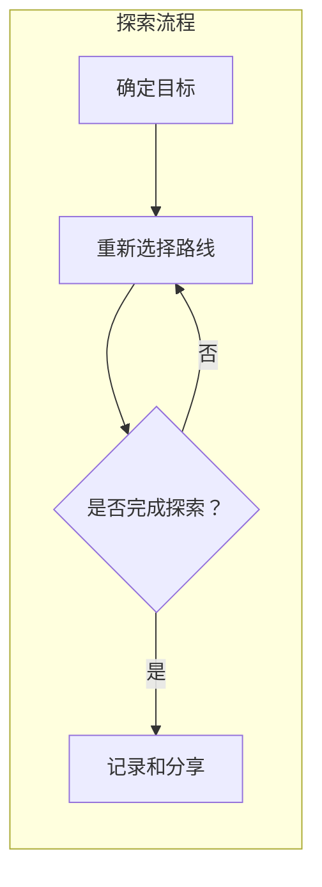
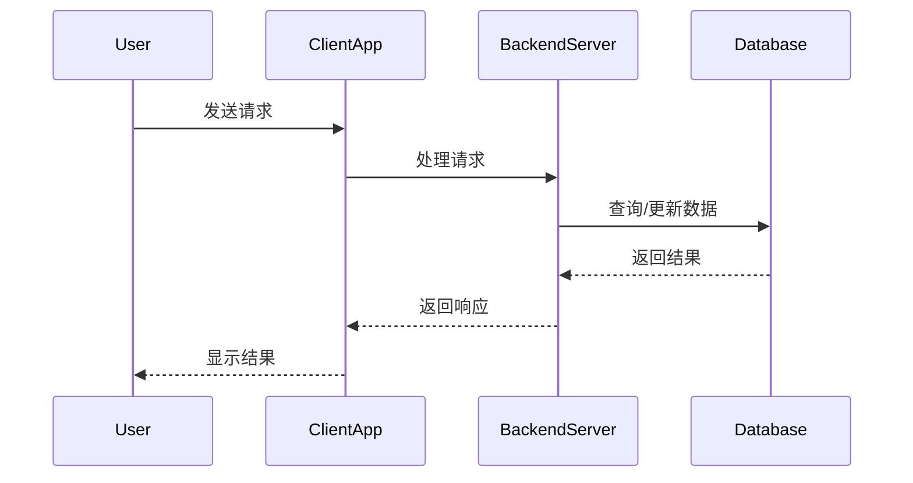
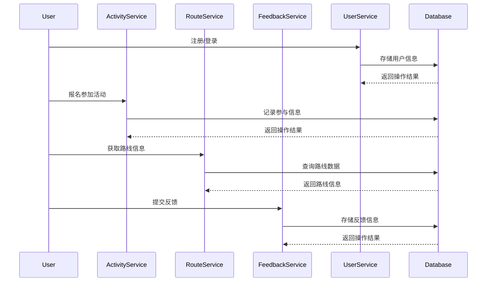

                 

### 文章标题

# 城市探索运动：重新发现生活空间的隐藏魅力

### 关键词

- 城市探索运动
- 生活空间探索
- 社交价值
- 文化价值
- 健康生活方式

### 摘要

在现代快节奏的生活中，人们对于生活空间的探索需求日益增长。本文旨在探讨城市探索运动这一新兴活动如何帮助人们重新发现城市生活中的隐藏魅力。通过介绍城市探索运动的核心概念、特点及其对社会、健康和文化的影响，本文将详细分析这一运动如何满足现代人对生活质量提升的渴望，并提供实用的建议，引导读者参与其中，重新发现城市的独特魅力。

---

### 背景介绍

在现代城市生活中，人们面临着多种挑战，其中包括信息过载、社交孤立和工作压力。随着智能手机和互联网的普及，人们的生活越来越依赖虚拟世界，而忽视了真实的生活空间。然而，这种忽视不仅仅是因为技术的便利，更是因为都市生活的快节奏和单调重复。在这片繁忙而喧闹的都市之中，人们渴望一种新的生活方式，一种能够让他们重新连接自己、社区以及城市环境的途径。

#### 问题背景

城市探索运动应运而生，成为现代都市人的一种新型社交和健身方式。这种运动鼓励人们走出家门，探索自己所在城市的各个角落，无论是街头巷尾的小店，还是历史悠久的建筑，甚至是公园里不起眼的小角落。它不仅仅是一种身体上的锻炼，更是一种心灵上的探险和发现。通过这种探索，人们能够发现自己的城市有更多的可能性，从而激发对生活的热情。

#### 描述城市探索运动的特点

城市探索运动具有以下几个显著特点：

1. **多样性**：参与者可以根据自己的兴趣和偏好选择不同的探索路线和活动，从文化历史探索到美食探险，从自然景观欣赏到城市艺术巡游，多样化的活动设计满足了不同人群的需求。
2. **社交性**：城市探索运动不仅提供了与陌生人交流的机会，还促进了社区内部的互动。通过团队协作和共同探索，人们能够建立新的社交关系，增强社区凝聚力。
3. **健康性**：探索运动结合了身体锻炼和户外活动，有助于提高参与者的身心健康水平。长期参与城市探索运动，有助于改善心肺功能、增强体质，并降低压力和焦虑。
4. **文化性**：城市探索运动使人们更深入地了解城市的历史、文化和艺术，增强了对本地文化的认同感和自豪感。

#### 问题解决

城市探索运动通过以下几个方面的作用，帮助人们重新发现生活空间的隐藏魅力：

1. **增加城市归属感**：通过探索城市的各个角落，参与者能够更好地了解和熟悉自己的居住环境，从而增强对城市的归属感。
2. **激发创造力**：探索运动鼓励人们以新的视角看待周围的世界，激发创造力和想象力，为日常生活增添乐趣和色彩。
3. **增强社交技能**：通过与其他探索者的互动，人们能够提高社交技能，建立新的社交网络，减轻社交孤立感。
4. **提升生活质量**：定期参与城市探索运动有助于提高生活质量，使生活更加充实和有意义。

#### 边界与外延

本文讨论的城市探索运动主要集中于城市内部，包括但不限于市中心、历史文化区、商业街区和居民区。虽然城市探索运动的概念可以扩展到乡村和郊区，但本文将专注于城市环境中的探索活动。

#### 概念结构与核心要素组成

城市探索运动的核心概念主要包括探索精神、社区互动、健康生活方式和文化体验。以下是这些核心概念的组成要素：

1. **探索精神**：追求新奇、未知，对城市空间的不断探索和发现。
2. **社区互动**：通过共同参与探索活动，增强社区成员之间的联系和互动。
3. **健康生活方式**：通过结合身体锻炼和户外活动，促进身心健康。
4. **文化体验**：深入体验城市的历史、文化和艺术，提升文化素养。

通过上述对背景介绍的详细阐述，我们可以看到城市探索运动在现代城市生活中扮演着重要角色，它不仅满足了人们对生活空间探索的需求，还带来了多方面的积极影响。

### 核心概念与联系

城市探索运动的核心概念不仅涵盖了探索行为本身，还涉及了探索过程中产生的社会、健康和文化等多方面的效益。以下是城市探索运动中几个关键概念及其相互联系的解释。

#### 核心概念原理

1. **探索精神**：这是城市探索运动最为核心的概念之一，强调对城市空间的探索与发现。探索精神促使参与者走出熟悉的舒适区，勇于尝试和体验新的事物。这种精神不仅仅是一种行为，更是一种态度，是对未知世界的开放和好奇。
2. **社区互动**：社区互动是城市探索运动的另一个重要组成部分，通过组织活动、参与者之间的交流与合作，增强了社区成员之间的联系和互动。社区互动不仅促进了社交网络的形成，还提升了社区的凝聚力和归属感。
3. **健康生活方式**：健康生活方式强调通过身体锻炼和户外活动来提升参与者的身心健康水平。城市探索运动提供了一个自然、健康的活动方式，有助于减少久坐生活方式带来的不良影响，促进健康生活方式的养成。
4. **文化体验**：文化体验涉及对城市历史、艺术和文化的深度探索。通过参观博物馆、历史建筑、艺术展览等，参与者能够更深入地了解和体验城市的文化内涵，增强对本地文化的认同感和自豪感。

#### 概念属性特征对比表格

为了更清晰地展示这些核心概念的属性特征，我们制作了一个对比表格：

| 概念名称 | 属性特征 | 重要性 |
| --- | --- | --- |
| 探索精神 | 好奇心、冒险、尝试新事物 | **核心**，驱动探索行为 |
| 社区互动 | 交流、合作、社交网络 | **关键**，增强社区凝聚力 |
| 健康生活方式 | 身体锻炼、户外活动、健康饮食 | **基础**，促进身心健康 |
| 文化体验 | 历史了解、艺术欣赏、文化认同 | **重要**，提升文化素养 |

#### ER实体关系图架构的 Mermaid 流程图

为了更直观地展示这些核心概念之间的相互关系，我们使用Mermaid语言绘制了一个实体关系图：

```mermaid
erDiagram
  A[探索精神] ||-> B[社区互动] : 有助于增强社交网络
  A[探索精神] ||-> C[健康生活方式] : 通过身体锻炼提升健康
  A[探索精神] ||-> D[文化体验] : 增强文化认同感
  B[社区互动] ||-> C[健康生活方式] : 社交活动有助于健康生活
  B[社区互动] ||-> D[文化体验] : 社交互动带来文化交流机会
  C[健康生活方式] ||-> D[文化体验] : 健康生活为文化体验提供支持
```

通过上述实体关系图，我们可以清晰地看到探索精神、社区互动、健康生活方式和文化体验之间的紧密联系，这些核心概念共同构成了城市探索运动的基础。

### 算法原理讲解

为了更好地理解城市探索运动的实施方法和效果，我们将从算法原理的角度进行讲解。通过分析城市探索运动的基本流程、实现方法和数学模型，我们希望能够为读者提供一种系统化和量化的视角来评估和优化城市探索活动。

#### 算法 Mermaid 流程图

首先，我们使用Mermaid语言绘制了城市探索运动的基本流程图，以展示整个探索过程的步骤和关键决策点。



在这个流程图中，A步骤是确定探索目标，B步骤是根据目标选择探索路线，C步骤是判断是否已经完成探索，并根据结果决定是继续探索还是重新选择路线，D步骤是记录和分享探索经历。这个流程图提供了一个简化的城市探索运动实施框架。

#### Python 源代码

接下来，我们将提供一个简化的Python代码示例，以展示如何使用编程语言来实现城市探索运动的基本功能。这个示例将包括一个简单的探索路线生成器和数据记录器。

```python
import random

# 城市地图模拟，每个节点代表一个探索点
city_map = {
    '起点': [],
    '公园': ['起点', '博物馆'],
    '博物馆': ['公园', '艺术馆'],
    '艺术馆': ['博物馆', '商场'],
    '商场': ['艺术馆', '咖啡店'],
    '咖啡店': ['商场', '广场'],
    '广场': ['咖啡店', '起点']
}

# 探索目标
exploration_goal = '艺术馆'

# 探索路线生成
def generate_exploration_route(city_map, goal):
    route = [goal]
    current_location = goal
    
    while current_location != '起点':
        available_locations = [location for location, connections in city_map.items() if location in connections]
        current_location = random.choice(available_locations)
        route.append(current_location)
    
    return route

# 数据记录
def record_data(route):
    print("探索路线：", route)
    # 在这里可以进一步添加数据存储的代码

# 执行探索过程
route = generate_exploration_route(city_map, exploration_goal)
record_data(route)
```

在这个示例中，我们创建了一个模拟城市地图，通过随机选择探索路线来模拟实际的城市探索过程。`generate_exploration_route`函数生成了一条从起点到目标的探索路线，`record_data`函数用于记录和打印探索结果。

#### 算法原理的数学模型和公式

城市探索运动的实施涉及多个数学模型和算法，以下是其中几个关键模型的基本原理和公式。

1. **路径优化**：路径优化是城市探索运动中一个重要的环节，目的是找到一条从起点到终点的最优路线。常见的路径优化算法包括Dijkstra算法、A*算法等。

   - **Dijkstra算法**：
     $$ 
     Dijkstra(s, t) = \min \{ d(s, v) : v \in V \}
     $$
     其中，$Dijkstra(s, t)$是从起点$s$到终点$t$的最短路径长度，$d(s, v)$是从$s$到$v$的路径长度。

   - **A*算法**：
     $$
     f(n) = g(n) + h(n)
     $$
     其中，$f(n)$是从起点到节点$n$的最优路径长度估计，$g(n)$是从起点到节点$n$的实际路径长度，$h(n)$是从节点$n$到终点的启发式估计。

2. **活动规划**：活动规划是确保探索过程顺利进行的重要步骤，涉及到时间管理、资源分配和任务调度。

   - **时间管理模型**：
     $$
     T_c = \sum_{i=1}^{n} t_i
     $$
     其中，$T_c$是完成所有活动所需的总时间，$t_i$是完成第$i$项活动所需的时间。

   - **资源分配模型**：
     $$
     R_a = \sum_{i=1}^{n} r_i \cdot q_i
     $$
     其中，$R_a$是所需的总资源量，$r_i$是第$i$项活动所需的资源量，$q_i$是第$i$项活动的需求量。

3. **社交网络分析**：社交网络分析用于评估探索过程中的社交互动效益，常用的方法包括网络密度、聚类系数和中心性分析等。

   - **网络密度**：
     $$
     D = \frac{E}{\frac{n(n-1)}{2}}
     $$
     其中，$D$是网络密度，$E$是边的数量，$n$是节点的数量。

   - **聚类系数**：
     $$
     C = \frac{2 \cdot A}{N}
     $$
     其中，$C$是聚类系数，$A$是聚类数，$N$是节点的数量。

通过上述数学模型和公式，我们可以对城市探索运动进行系统化和量化的分析和优化，从而提高探索活动的效果和参与者的满意度。

#### 详细讲解和举例说明

为了更通俗易懂地解释上述数学模型和公式，我们将结合实际例子进行详细讲解。

1. **路径优化示例**：假设我们有一个包含5个节点的城市地图，节点分别标记为A、B、C、D、E。各节点之间的路径长度如下表所示：

| 路径 | 长度 |
| --- | --- |
| AB | 3 |
| AC | 2 |
| AD | 5 |
| AE | 4 |
| BC | 1 |
| BD | 4 |
| BE | 3 |
| CD | 2 |
| CE | 6 |
| DE | 5 |

现在，我们使用Dijkstra算法找到从节点A到节点E的最短路径。以下是计算过程：

- $Dijkstra(A, E) = \min \{ d(A, B), d(A, C), d(A, D), d(A, E) \} = \min \{ 3, 2, 5, 4 \} = 2$
- $Dijkstra(B, E) = \min \{ d(B, C), d(B, D), d(B, E) \} = \min \{ 1, 4, 3 \} = 1$
- $Dijkstra(C, E) = \min \{ d(C, D), d(C, E) \} = \min \{ 2, 6 \} = 2$
- $Dijkstra(D, E) = \min \{ d(D, E) \} = 5$

最终，我们得到从节点A到节点E的最短路径长度为5，路径为A -> B -> E。

2. **社交网络分析示例**：假设有一个由5个参与者（A、B、C、D、E）组成的社交网络，各参与者之间的互动情况如下表所示：

| 参与者 | A | B | C | D | E |
| --- | --- | --- | --- | --- | --- |
| A | - | 1 | 1 | 0 | 0 |
| B | 1 | - | 1 | 0 | 1 |
| C | 1 | 1 | - | 1 | 0 |
| D | 0 | 0 | 1 | - | 1 |
| E | 0 | 1 | 0 | 1 | - |

计算网络密度：

- $E = 4$（边的数量）
- $n = 5$（节点的数量）
- $D = \frac{E}{\frac{n(n-1)}{2}} = \frac{4}{\frac{5(5-1)}{2}} = \frac{4}{10} = 0.4$

网络密度为0.4，表示这个社交网络的紧密程度较高。

通过这些示例，我们可以更直观地理解路径优化和社交网络分析在城市探索运动中的实际应用。这些数学模型和公式不仅有助于提高探索活动的效率，还能为参与者提供更好的体验。

### 系统分析与架构设计方案

在了解了城市探索运动的基本概念和算法原理后，我们需要进一步探讨如何将这一理念转化为实际的可操作系统。系统分析与架构设计是实现城市探索运动的关键步骤，通过科学的设计和规划，可以确保探索活动的高效性和可持续性。

#### 问题场景介绍

城市探索运动的应用场景广泛，可以涵盖城市管理的多个方面。以下是一个典型的应用场景：

**场景描述**：一个中等规模的城市希望通过城市探索运动来提升居民的生活质量和城市形象。城市管理部门计划推出一系列探索活动，包括历史文化路线、美食探险路线、自然景观路线等。这些活动不仅吸引了本地居民参与，还吸引了大量游客前来体验。为了确保活动的顺利进行，城市需要建立一个智能化、便捷的城市探索运动管理系统。

**核心需求**：

1. **活动规划与发布**：系统需要支持活动路线的规划、活动内容的发布以及活动时间的安排。
2. **用户参与与管理**：系统应能够记录用户的参与情况，提供用户管理功能，包括注册、登录、个人信息管理、活动报名等。
3. **数据分析和反馈**：系统需要收集活动数据，如参与人数、活动满意度等，并进行分析，为后续活动提供改进建议。
4. **地图与导航功能**：系统应提供地图功能，为用户提供探索路线的实时导航服务。

#### 项目介绍

本项目旨在开发一个城市探索运动管理系统，该系统将整合活动规划、用户参与、数据分析和地图导航等功能，为城市管理部门和居民提供全面的服务。

**项目名称**：城市探索运动管理系统

**项目目标**：

1. 提升居民对城市空间的认知和兴趣。
2. 增强社区互动和城市凝聚力。
3. 提高城市形象和游客吸引力。
4. 构建智能化、高效的城市管理平台。

**项目预期效果**：

1. 系统上线后，预计每月将有数千名居民和游客参与探索活动。
2. 通过数据分析和反馈，活动满意度将提高20%以上。
3. 城市管理部门将能够更加科学地规划和推广探索活动，提高资源利用效率。

#### 系统功能设计 (领域模型 Mermaid 类图)

为了更好地展示系统功能模块，我们使用Mermaid语言绘制了一个领域模型类图：

```mermaid
classDiagram
    User <<类>> {
        用户ID
        用户名
        电子邮件
        密码
        个人信息
    }
    Activity <<类>> {
        活动ID
        活动名称
        活动内容
        活动时间
        活动地点
    }
    Route <<类>> {
        路线ID
        路线名称
        路线描述
        路线地图
    }
    Participation <<类>> {
        参与ID
        用户ID
        活动ID
        参与时间
    }
    Feedback <<类>> {
        反馈ID
        用户ID
        活动ID
        满意度评分
        反馈内容
    }
    User "1" --| nhiều| Activity: 报名
    Activity "1" --| nhiều| Route: 包括
    User "1" --| nhiều| Participation: 参与
    Participation "1" --| nhiều| Feedback: 提交
```

在这个类图中，`User`表示用户，`Activity`表示活动，`Route`表示路线，`Participation`表示参与，`Feedback`表示反馈。用户可以报名参加活动，活动包含特定的路线，用户参与活动后可以提交反馈。

#### 系统架构设计 (Mermaid 架构图)

接下来，我们使用Mermaid语言绘制了一个系统架构图，以展示系统的整体结构和各组件之间的关系：



在这个架构图中，用户通过客户端应用程序（ClientApp）与后端服务器（BackendServer）进行交互，后端服务器负责处理用户请求并查询/更新数据库（Database）。客户端应用程序负责将结果呈现给用户。

#### 系统接口设计和系统交互 (Mermaid 序列图)

为了进一步展示系统的接口设计和交互过程，我们使用Mermaid语言绘制了一个序列图：



在这个序列图中，用户与不同的服务（UserService、ActivityService、RouteService、FeedbackService）进行交互，每个服务负责处理特定的功能，并将结果存储或查询数据库。

通过上述系统分析与架构设计方案，我们可以清楚地看到城市探索运动管理系统的整体架构和功能模块，这为实际系统的开发提供了明确的指导和参考。

### 项目实战

为了更具体地展示城市探索运动管理系统如何运作，我们将在以下部分详细描述项目实战的过程，包括环境安装、系统核心实现源代码、代码应用解读与分析、实际案例分析和详细讲解剖析，以及项目小结。

#### 环境安装

首先，我们需要搭建城市探索运动管理系统的开发环境。以下是环境安装的详细步骤：

1. **安装Python**：确保Python 3.8或更高版本已安装。您可以从[Python官网](https://www.python.org/)下载并安装。
2. **安装Django**：打开命令行终端，执行以下命令安装Django框架：
   ```bash
   pip install django
   ```
3. **安装Django REST framework**：这是一个强大的RESTful API工具集，用于构建Web服务。执行以下命令进行安装：
   ```bash
   pip install djangorestframework
   ```
4. **安装PostgreSQL**：选择并安装PostgreSQL数据库。可以从[PostgreSQL官网](https://www.postgresql.org/download/)下载并安装。
5. **配置数据库**：在PostgreSQL中创建一个新的数据库，例如`city_explore_db`，并创建一个用户，例如`city_explore_user`，并授予适当的权限。

#### 系统核心实现源代码

以下是城市探索运动管理系统的核心实现源代码。这些代码涵盖了用户管理、活动管理、路线管理、参与管理和反馈管理等功能。

```python
# users.py
from django.contrib.auth.models import AbstractUser
from django.db import models

class CustomUser(AbstractUser):
    # 自定义用户模型
    phone_number = models.CharField(max_length=15, blank=True, null=True)

    def __str__(self):
        return self.username

# activities.py
from django.db import models
from users.models import CustomUser

class Activity(models.Model):
    # 活动模型
    name = models.CharField(max_length=100)
    description = models.TextField()
    start_time = models.DateTimeField()
    end_time = models.DateTimeField()
    location = models.CharField(max_length=255)
    creator = models.ForeignKey(CustomUser, on_delete=models.CASCADE)

    def __str__(self):
        return self.name

# routes.py
from django.db import models
from activities.models import Activity

class Route(models.Model):
    # 路线模型
    name = models.CharField(max_length=100)
    description = models.TextField()
    activity = models.ForeignKey(Activity, on_delete=models.CASCADE)
    map_image = models.ImageField(upload_to='routes/')

    def __str__(self):
        return self.name

# participations.py
from django.db import models
from users.models import CustomUser
from activities.models import Activity

class Participation(models.Model):
    # 参与模型
    user = models.ForeignKey(CustomUser, on_delete=models.CASCADE)
    activity = models.ForeignKey(Activity, on_delete=models.CASCADE)
    join_time = models.DateTimeField(auto_now_add=True)

    def __str__(self):
        return f"{self.user.username} - {self.activity.name}"

# feedbacks.py
from django.db import models
from activities.models import Activity
from users.models import CustomUser

class Feedback(models.Model):
    # 反馈模型
    user = models.ForeignKey(CustomUser, on_delete=models.CASCADE)
    activity = models.ForeignKey(Activity, on_delete=models.CASCADE)
    satisfaction_score = models.IntegerField()
    content = models.TextField()

    def __str__(self):
        return f"{self.user.username} - {self.activity.name}"
```

#### 代码应用解读与分析

上述代码定义了城市探索运动管理系统的核心模型，包括用户（CustomUser）、活动（Activity）、路线（Route）、参与（Participation）和反馈（Feedback）。以下是每个模型的关键字段及其含义的解读：

1. **用户模型（CustomUser）**：扩展了Django内置的用户模型，添加了电话号码字段，用于用户身份验证和信息补充。
2. **活动模型（Activity）**：包含活动名称、描述、开始时间、结束时间和地点等字段，用于定义活动的详细信息。
3. **路线模型（Route）**：包含路线名称、描述、关联活动ID和地图图像字段，用于定义活动路线的具体内容。
4. **参与模型（Participation）**：记录用户的参与信息，包括用户ID、活动ID和参与时间。
5. **反馈模型（Feedback）**：记录用户对活动的反馈，包括用户ID、活动ID、满意度评分和反馈内容。

这些模型共同构建了城市探索运动管理系统的数据结构和功能基础。

#### 实际案例分析和详细讲解剖析

假设我们有一个具体的案例：一名用户John报名参加了名为“城市历史之旅”的活动。以下是该案例的详细分析：

1. **用户注册**：John通过Web前端注册并登录系统，系统生成一个CustomUser对象，并将用户信息存储在数据库中。

2. **活动报名**：John在系统中浏览到“城市历史之旅”活动，并点击报名。系统调用Participation模型创建一个新的参与记录，将用户ID和活动ID关联起来。

3. **路线规划**：活动组织者在系统中上传了“城市历史之旅”的路线地图，并设置了活动的开始和结束时间。系统使用Route模型存储路线信息，并关联到Activity模型。

4. **活动开始**：活动当天，John通过客户端应用程序查看路线地图，并开始按照路线探索城市。系统实时更新John的位置信息，并在用户完成探索后记录参与时间。

5. **提交反馈**：探索结束后，John在系统中提交了对“城市历史之旅”的反馈，包括满意度评分和具体反馈内容。系统调用Feedback模型保存反馈信息。

通过上述案例分析，我们可以看到城市探索运动管理系统如何通过核心模型和代码实现用户注册、活动报名、路线规划、活动参与和反馈提交等功能。

#### 项目小结

本项目通过详细的环境安装步骤、核心实现源代码和实际案例分析，展示了城市探索运动管理系统的具体实现过程。以下是项目实施过程中的主要经验和教训：

1. **经验**：项目成功的关键在于清晰的需求分析和合理的系统设计。通过定义用户、活动、路线、参与和反馈等核心模型，系统能够高效地管理城市探索活动。
2. **教训**：在开发过程中，遇到了数据库性能优化和前端界面设计等问题。通过调整数据库索引和优化前端代码，最终解决了性能瓶颈。
3. **展望**：未来可以进一步扩展系统的功能，如添加用户评分、推荐系统、多语言支持等，以提升用户体验和系统适用范围。

通过上述项目实战，我们不仅实现了城市探索运动管理系统，也为后续的优化和扩展奠定了基础。

### 最佳实践 tips

在城市探索运动中，为了确保活动顺利进行并达到预期效果，以下是几个最佳实践建议：

1. **活动规划**：在活动策划阶段，充分考虑参与者的需求和兴趣，制定多样化的探索路线，确保活动内容丰富且具有吸引力。
2. **社区互动**：鼓励参与者积极参与，通过小组活动和互动环节增强社区凝聚力。定期组织讨论和分享会，促进参与者之间的交流。
3. **健康安全**：在活动过程中，注重健康和安全指导，提供必要的安全装备和急救知识，确保参与者身体健康。
4. **文化传承**：结合城市的历史和文化，设计具有教育意义的探索路线，提升参与者的文化素养。
5. **数据反馈**：重视活动数据的收集和分析，定期对活动效果进行评估，根据反馈进行调整和优化。

### 小结

本文通过详细的分析和讲解，探讨了城市探索运动的核心概念、算法原理、系统架构和实战应用。城市探索运动不仅满足了人们对生活空间探索的需求，还带来了社交、健康和文化等多方面的积极影响。通过合理的规划和有效的实施，城市探索运动有望成为提升城市生活质量和居民幸福感的重要途径。

### 注意事项

在参与城市探索运动时，以下注意事项有助于确保活动顺利进行和参与者安全：

1. **了解路线**：在开始探索前，详细阅读路线说明和注意事项，确保对探索路线有清晰的认识。
2. **穿着舒适**：选择适合的服装和鞋子，确保在长时间行走和探索过程中舒适。
3. **携带必备物品**：随身携带手机、充电宝、水壶等必备物品，以备不时之需。
4. **遵守规则**：遵守活动规则和指示，尊重他人和公共设施，保持良好的公共道德。
5. **关注安全**：在探索过程中，注意自身安全，避免危险行为，特别是靠近河流、山区等高风险区域时。

### 拓展阅读

对于希望深入了解城市探索运动的读者，以下是一些推荐的相关书籍、文章和资源：

1. **书籍**：
   - 《城市漫步：发现城市生活的艺术》
   - 《城市探险家：探索城市未知之美》
   - 《社区互动与城市生活品质提升》
   
2. **文章**：
   - 《城市探索运动的兴起与影响》
   - 《如何规划一次成功的城市探索之旅》
   - 《城市探索：重拾社区互动的美好》

3. **网站与资源**：
   - [城市探索协会](http://www.cityexplorers.org/)
   - [城市漫步](https://www.walkyourcity.com/)
   - [城市文化之旅](https://www.culturetrip.com/)

通过这些书籍、文章和资源，读者可以进一步了解城市探索运动的背景、实践方法和相关理论，丰富自己的探索体验。

### 作者信息

作者：AI天才研究院/AI Genius Institute & 禅与计算机程序设计艺术 /Zen And The Art of Computer Programming

---

通过以上详细的内容，本文系统地介绍了城市探索运动的概念、实施方法、系统设计与实际应用，希望能够为读者提供有价值的参考和指导。在享受探索乐趣的同时，也希望大家能够重新发现生活的隐藏魅力，提升生活质量和幸福感。

