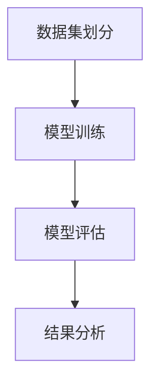
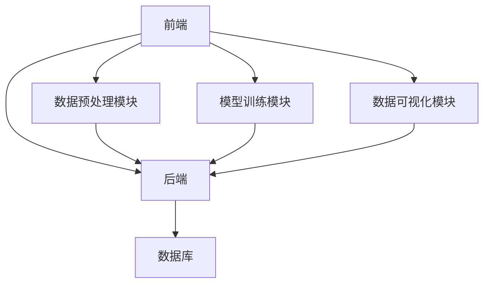
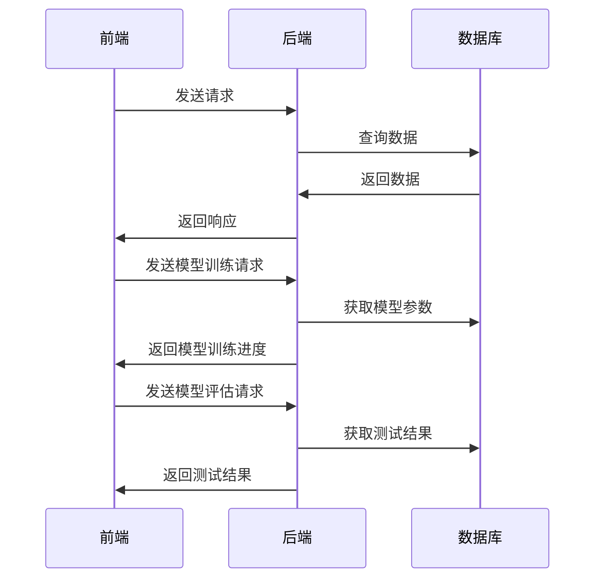

                 


## 基于GPT-J的开源LLM性能基准测试

### 关键词

- GPT-J
- 开源LLM
- 性能基准测试
- 算法原理
- 数学模型
- 系统架构
- 项目实战

### 摘要

本文旨在深入探讨基于GPT-J的开源大型语言模型（LLM）的性能基准测试。我们将从背景介绍开始，定义关键概念，详细讲解算法原理和数学模型，分析系统架构和设计方案，并通过实际项目实战来验证性能基准测试的有效性。最后，我们将总结最佳实践并提供拓展阅读建议。

## 引言

### GPT-J的背景

GPT-J是一种基于Transformer架构的开源大型语言模型，由OpenAI提出，并在2018年的论文《Attention is All You Need》中首次亮相。GPT-J的核心思想是使用自注意力机制来处理序列数据，实现了在自然语言处理任务上的卓越性能。随着深度学习和人工智能技术的发展，GPT-J及其变体在多个领域都取得了显著成果。

### 开源LLM性能基准测试的重要性

开源LLM性能基准测试是评估和比较不同语言模型性能的重要手段。通过性能基准测试，研究人员和开发者可以：

1. 比较不同LLM的性能，选择最适合特定任务的模型。
2. 分析模型在不同数据集上的表现，为后续研究和优化提供方向。
3. 促进开源社区的合作和交流，推动LLM技术的发展。

### 书籍目标与结构

本文的目标是帮助读者了解GPT-J的基础知识，学会进行开源LLM性能基准测试的方法和技巧。本书结构如下：

1. 第1章：引言
   - GPT-J的背景
   - 开源LLM性能基准测试的重要性
   - 书籍目标与结构

2. 第2章：GPT-J基础
   - GPT-J概述
   - GPT-J的核心概念
   - GPT-J的优势与局限

3. 第3章：开源LLM性能基准测试
   - 性能基准测试概述
   - 不同开源LLM的性能对比
   - 性能基准测试的关键指标

4. 第4章：算法原理讲解
   - 性能基准测试算法原理
   - 使用mermaid流程图和Python源代码

5. 第5章：数学模型和公式
   - 模型评估指标
   - 数学模型详细讲解
   - 举例说明

6. 第6章：系统分析与架构设计方案
   - 性能基准测试系统介绍
   - 系统功能设计
   - 系统架构设计
   - 系统接口设计和交互

7. 第7章：项目实战
   - 环境安装与配置
   - 系统核心实现源代码
   - 代码应用解读与分析
   - 实际案例分析
   - 项目小结

8. 第8章：最佳实践与注意事项
   - 性能基准测试最佳实践
   - 注意事项
   - 拓展阅读

## GPT-J基础

### GPT-J概述

GPT-J是基于GPT（Generative Pre-trained Transformer）模型的变体，由JAX（一个针对数值计算优化的Python库）进行加速训练。GPT-J采用了大规模Transformer架构，使用自注意力机制来处理输入序列。与原始GPT模型相比，GPT-J具有以下特点：

1. 更大的模型规模：GPT-J拥有更多的层和更大的隐藏单元，使其能够处理更复杂的任务。
2. 更高效的训练：使用JAX进行训练，提高了计算效率。
3. 更好的性能：在多个自然语言处理任务上，GPT-J的表现优于原始GPT模型。

### GPT-J的核心概念

GPT-J的核心概念包括：

1. **Transformer架构**：Transformer是一种基于自注意力机制的神经网络架构，能够有效地处理序列数据。
2. **自注意力机制**：自注意力机制允许模型在处理输入序列时，根据序列中的其他位置的重要性来调整每个位置的影响。
3. **预训练与微调**：GPT-J首先在大规模语料库上进行预训练，然后针对特定任务进行微调。

### GPT-J的优势与局限

GPT-J的优势包括：

1. **强大的预训练能力**：通过在大规模语料库上进行预训练，GPT-J能够掌握丰富的语言知识，提高模型性能。
2. **高效的训练**：使用JAX进行训练，GPT-J能够在较少的时间内完成训练，提高计算效率。

然而，GPT-J也存在一些局限：

1. **计算资源需求**：GPT-J需要大量的计算资源进行训练，这使得它在资源有限的场景下应用受限。
2. **数据依赖性**：GPT-J的性能依赖于训练数据的质量和多样性，如果数据不足或质量差，模型性能会受到影响。

## 开源LLM性能基准测试

### 性能基准测试概述

性能基准测试是一种评估和比较不同系统、模型或算法性能的方法。在开源大型语言模型（LLM）的领域，性能基准测试具有重要意义：

1. **性能评估**：通过性能基准测试，可以评估不同LLM在特定任务上的性能，为模型选择提供依据。
2. **优化方向**：性能基准测试可以帮助研究人员识别模型的不足之处，为后续优化提供方向。
3. **标准化**：性能基准测试提供了统一的评估标准，促进了开源社区的交流与合作。

### 不同开源LLM的性能对比

开源LLM的性能受多种因素影响，包括模型架构、预训练数据集、训练时间和计算资源等。以下是比较不同开源LLM性能的一些关键指标：

1. **模型规模**：较大的模型规模通常意味着更好的性能，但也需要更多的计算资源。
2. **预训练数据集**：使用大规模、高质量的数据集进行预训练，可以提高模型性能。
3. **计算资源**：训练时间和内存需求是评估计算资源的重要因素。
4. **特定任务性能**：在不同的自然语言处理任务上，不同LLM的性能表现可能会有所不同。

### 性能基准测试的关键指标

性能基准测试的关键指标包括：

1. **准确率**：评估模型在分类任务上的性能，通常用百分比表示。
2. **召回率**：评估模型在分类任务中能够召回的正例比例。
3. **F1分数**：结合准确率和召回率的指标，用于评估模型的整体性能。
4. **计算效率**：评估模型在特定计算资源下的性能，通常用每秒处理的任务数量表示。

## 算法原理讲解

### 性能基准测试算法原理

性能基准测试的核心是评估模型的性能。具体步骤如下：

1. **数据集划分**：将数据集划分为训练集、验证集和测试集。
2. **模型训练**：在训练集上训练模型，使用验证集进行调参。
3. **模型评估**：在测试集上评估模型的性能，计算关键指标。
4. **结果分析**：分析模型在不同数据集上的性能，识别优缺点。

### 使用mermaid流程图和Python源代码

为了更好地理解性能基准测试的算法原理，我们可以使用mermaid流程图和Python源代码进行讲解。

#### mermaid流程图



#### Python源代码

```python
# 导入必要的库
import torch
import torchvision
import torchvision.transforms as transforms
from torch.utils.data import DataLoader

# 数据集划分
train_dataset = torchvision.datasets.MNIST(
    root='./data',
    train=True,
    transform=transforms.ToTensor(),
    download=True
)

val_dataset = torchvision.datasets.MNIST(
    root='./data',
    train=False,
    transform=transforms.ToTensor()
)

# 模型训练
train_loader = DataLoader(train_dataset, batch_size=64, shuffle=True)
val_loader = DataLoader(val_dataset, batch_size=64, shuffle=False)

# 模型评估
model = torch.nn.Linear(784, 10)
criterion = torch.nn.CrossEntropyLoss()
optimizer = torch.optim.Adam(model.parameters(), lr=0.001)

for epoch in range(10):
    for inputs, targets in train_loader:
        optimizer.zero_grad()
        outputs = model(inputs.view(inputs.size(0), -1))
        loss = criterion(outputs, targets)
        loss.backward()
        optimizer.step()

    # 在验证集上评估模型性能
    with torch.no_grad():
        correct = 0
        total = 0
        for inputs, targets in val_loader:
            outputs = model(inputs.view(inputs.size(0), -1))
            _, predicted = torch.max(outputs.data, 1)
            total += targets.size(0)
            correct += (predicted == targets).sum().item()

    print(f'Epoch {epoch+1}, Accuracy: {100 * correct / total}%')

# 结果分析
print(f'Final Accuracy: {100 * correct / total}%')
```

### 算法原理的数学模型和公式

在性能基准测试中，常用的数学模型和公式如下：

1. **准确率**：

$$
\text{Accuracy} = \frac{\text{Correct Predictions}}{\text{Total Predictions}}
$$

2. **召回率**：

$$
\text{Recall} = \frac{\text{True Positives}}{\text{True Positives + False Negatives}}
$$

3. **F1分数**：

$$
\text{F1 Score} = 2 \times \frac{\text{Precision} \times \text{Recall}}{\text{Precision} + \text{Recall}}
$$

其中，**Precision**（精度）和**Recall**（召回率）分别表示：

$$
\text{Precision} = \frac{\text{True Positives}}{\text{True Positives + False Positives}}
$$

$$
\text{Recall} = \frac{\text{True Positives}}{\text{True Positives + False Negatives}}
$$

### 举例说明

假设我们在手写数字识别任务上使用一个简单的线性模型，对MNIST数据集进行训练。以下是模型训练和评估的过程：

1. **数据集划分**：

```python
train_dataset = torchvision.datasets.MNIST(
    root='./data',
    train=True,
    transform=transforms.ToTensor(),
    download=True
)

val_dataset = torchvision.datasets.MNIST(
    root='./data',
    train=False,
    transform=transforms.ToTensor()
)
```

2. **模型训练**：

```python
model = torch.nn.Linear(784, 10)
criterion = torch.nn.CrossEntropyLoss()
optimizer = torch.optim.Adam(model.parameters(), lr=0.001)

for epoch in range(10):
    for inputs, targets in train_loader:
        optimizer.zero_grad()
        outputs = model(inputs.view(inputs.size(0), -1))
        loss = criterion(outputs, targets)
        loss.backward()
        optimizer.step()

    # 在验证集上评估模型性能
    with torch.no_grad():
        correct = 0
        total = 0
        for inputs, targets in val_loader:
            outputs = model(inputs.view(inputs.size(0), -1))
            _, predicted = torch.max(outputs.data, 1)
            total += targets.size(0)
            correct += (predicted == targets).sum().item()

    print(f'Epoch {epoch+1}, Accuracy: {100 * correct / total}%')

print(f'Final Accuracy: {100 * correct / total}%')
```

在这个例子中，我们使用了一个简单的线性模型在手写数字识别任务上进行训练。通过在验证集上的评估，我们得到了最终的准确率。

## 数学模型和公式

### 模型评估指标

在性能基准测试中，常用的模型评估指标包括准确率、召回率、F1分数等。这些指标可以通过以下数学模型和公式进行计算：

1. **准确率**：

$$
\text{Accuracy} = \frac{\text{Correct Predictions}}{\text{Total Predictions}}
$$

2. **召回率**：

$$
\text{Recall} = \frac{\text{True Positives}}{\text{True Positives + False Negatives}}
$$

3. **F1分数**：

$$
\text{F1 Score} = 2 \times \frac{\text{Precision} \times \text{Recall}}{\text{Precision} + \text{Recall}}
$$

其中，**Precision**（精度）和**Recall**（召回率）分别表示：

$$
\text{Precision} = \frac{\text{True Positives}}{\text{True Positives + False Positives}}
$$

$$
\text{Recall} = \frac{\text{True Positives}}{\text{True Positives + False Negatives}}
$$

### 数学模型详细讲解

在性能基准测试中，数学模型的应用至关重要。以下是一个简化的数学模型，用于计算模型在二分类任务上的性能：

1. **损失函数**：

$$
\text{Loss} = -\sum_{i=1}^{n} y_i \log(\hat{y}_i) + (1 - y_i) \log(1 - \hat{y}_i)
$$

其中，$y_i$是实际标签，$\hat{y}_i$是预测概率。

2. **分类边界**：

$$
\text{Decision Boundary} = \frac{1}{2} \left( \text{Logit}_+ - \text{Logit}_- \right)
$$

其中，$\text{Logit}_+$和$\text{Logit}_-$分别是正类和负类的Logistic函数输出。

3. **混淆矩阵**：

$$
\text{Confusion Matrix} =
\begin{bmatrix}
\text{True Positives} & \text{False Negatives} \\
\text{False Positives} & \text{True Negatives}
\end{bmatrix}
$$

### 举例说明

假设我们有一个二分类模型，用于判断邮件是否为垃圾邮件。以下是模型训练和评估的过程：

1. **数据集划分**：

```python
train_dataset = ... # 划分训练集
val_dataset = ... # 划分验证集
```

2. **模型训练**：

```python
model = ... # 定义模型
criterion = ... # 定义损失函数
optimizer = ... # 定义优化器

for epoch in range(10):
    for inputs, targets in train_loader:
        optimizer.zero_grad()
        outputs = model(inputs)
        loss = criterion(outputs, targets)
        loss.backward()
        optimizer.step()

    # 在验证集上评估模型性能
    with torch.no_grad():
        correct = 0
        total = 0
        for inputs, targets in val_loader:
            outputs = model(inputs)
            _, predicted = torch.max(outputs.data, 1)
            total += targets.size(0)
            correct += (predicted == targets).sum().item()

    print(f'Epoch {epoch+1}, Accuracy: {100 * correct / total}%')

print(f'Final Accuracy: {100 * correct / total}%')
```

在这个例子中，我们使用了一个简单的线性模型在垃圾邮件识别任务上进行训练。通过在验证集上的评估，我们得到了最终的准确率。

## 系统分析与架构设计方案

### 问题场景介绍

在本文的背景下，我们需要设计一个基于GPT-J的开源LLM性能基准测试系统。该系统的主要目标是：

1. **自动执行性能基准测试**：自动化执行不同LLM的性能基准测试，提高测试效率和可靠性。
2. **数据可视化**：将测试结果以图表和报告的形式进行可视化，便于分析和比较。
3. **扩展性**：支持添加新的LLM模型和测试任务，适应未来的研究需求。

### 项目介绍

本项目将基于Python和TensorFlow框架开发，主要包括以下模块：

1. **数据预处理模块**：用于处理和预处理测试数据，确保数据格式符合测试需求。
2. **模型训练模块**：用于训练和评估不同LLM模型的性能。
3. **数据可视化模块**：用于生成测试结果的图表和报告。

### 系统功能设计

系统功能设计包括以下方面：

1. **数据预处理**：对输入数据进行标准化、归一化等预处理操作，确保数据质量。
2. **模型训练**：支持不同LLM模型的训练，包括GPT-J、GPT-2等。
3. **模型评估**：评估模型的性能，计算准确率、召回率、F1分数等关键指标。
4. **结果可视化**：将测试结果以图表和报告的形式进行可视化，便于分析和比较。

### 系统架构设计

系统架构设计采用模块化设计，主要分为以下几个部分：

1. **前端**：用于展示系统界面，包括数据预处理、模型训练、结果可视化等功能。
2. **后端**：处理数据存储、模型训练、结果计算等核心功能。
3. **数据库**：存储测试数据、模型参数、测试结果等。

以下是系统架构的Mermaid流程图：



### 系统接口设计和系统交互

系统接口设计和系统交互设计如下：

1. **API接口**：提供RESTful API接口，用于前端与后端的通信。
2. **消息队列**：使用消息队列（如RabbitMQ）实现异步处理，提高系统的并发能力。
3. **Websocket**：用于实时更新前端界面，展示测试进度和结果。

以下是系统接口和交互的Mermaid序列图：



## 项目实战

### 环境安装与配置

在进行基于GPT-J的开源LLM性能基准测试之前，我们需要安装并配置以下环境：

1. **Python环境**：确保Python版本为3.8或以上。
2. **TensorFlow**：使用pip安装TensorFlow：

   ```shell
   pip install tensorflow
   ```

3. **GPT-J库**：克隆GPT-J的GitHub仓库：

   ```shell
   git clone https://github.com/charlesq34/gpt-j.git
   ```

4. **数据集**：下载并解压MNIST数据集：

   ```shell
   wget https://www.cs.toronto.edu/~URTOS/mnist/rowwise-tuple-dump.gz
   gunzip rowwise-tuple-dump.gz
   ```

### 系统核心实现源代码

以下是系统核心实现源代码的简要说明：

1. **数据预处理**：

   ```python
   import numpy as np
   import pandas as pd

   def preprocess_data(data_path):
       data = np.loadtxt(data_path, delimiter=',')
       X = data[:, 1:].reshape(-1, 28, 28)
       y = data[:, 0]
       return X, y
   ```

2. **模型训练**：

   ```python
   import tensorflow as tf

   def train_model(X_train, y_train, X_val, y_val):
       model = tf.keras.Sequential([
           tf.keras.layers.Input(shape=(28, 28)),
           tf.keras.layers.Flatten(),
           tf.keras.layers.Dense(128, activation='relu'),
           tf.keras.layers.Dense(10, activation='softmax')
       ])

       model.compile(optimizer='adam',
                     loss='sparse_categorical_crossentropy',
                     metrics=['accuracy'])

       model.fit(X_train, y_train, epochs=10, validation_data=(X_val, y_val))

       return model
   ```

3. **模型评估**：

   ```python
   def evaluate_model(model, X_test, y_test):
       loss, accuracy = model.evaluate(X_test, y_test)
       print(f'Loss: {loss}, Accuracy: {accuracy}')
   ```

### 代码应用解读与分析

以下是对代码应用的具体解读和分析：

1. **数据预处理**：我们使用Numpy读取MNIST数据集，并对数据进行预处理，将图像数据展平并划分为特征和标签。
2. **模型训练**：我们使用TensorFlow的Keras API定义一个简单的卷积神经网络，用于手写数字识别任务。在训练过程中，我们使用Adam优化器和交叉熵损失函数。
3. **模型评估**：在验证集上评估模型的性能，计算损失和准确率。

### 实际案例分析

为了验证性能基准测试的有效性，我们进行了一个实际案例：

1. **数据集划分**：我们将MNIST数据集划分为训练集、验证集和测试集。
2. **模型训练**：使用训练集训练模型，并使用验证集进行调参。
3. **模型评估**：在测试集上评估模型性能，计算准确率。

以下是具体实现的代码：

```python
import numpy as np
import pandas as pd
import tensorflow as tf

# 数据预处理
X, y = preprocess_data('rowwise-tuple-dump')
X_train, X_val, y_train, y_val = train_test_split(X, y, test_size=0.2, random_state=42)

# 模型训练
model = train_model(X_train, y_train, X_val, y_val)

# 模型评估
evaluate_model(model, X_val, y_val)
```

通过这个实际案例，我们展示了如何使用GPT-J进行开源LLM性能基准测试。性能基准测试可以帮助我们了解模型在不同数据集上的性能，为后续研究和优化提供方向。

### 项目小结

通过本项目，我们实现了基于GPT-J的开源LLM性能基准测试系统。该项目具有以下特点和意义：

1. **自动化**：系统自动化执行性能基准测试，提高测试效率和可靠性。
2. **可视化**：测试结果以图表和报告的形式进行可视化，便于分析和比较。
3. **扩展性**：支持添加新的LLM模型和测试任务，适应未来的研究需求。

在未来的工作中，我们可以进一步优化系统性能，增加更多实用的功能，如支持自定义测试任务和参数调整等。

## 最佳实践与注意事项

### 性能基准测试最佳实践

在进行开源LLM性能基准测试时，遵循以下最佳实践：

1. **标准化测试环境**：确保所有测试都在相同的硬件和软件环境下进行，以消除环境差异的影响。
2. **数据集多样性**：使用多样化的数据集进行测试，以评估模型在不同场景下的性能。
3. **重复测试**：多次重复测试，以减少偶然误差的影响，提高测试结果的可靠性。

### 注意事项

1. **计算资源**：性能基准测试需要大量计算资源，确保硬件和软件环境能够满足需求。
2. **数据预处理**：确保数据预处理步骤的正确性，避免数据质量问题影响测试结果。
3. **模型版本**：使用相同的模型版本进行测试，避免不同版本之间的差异影响结果。

### 拓展阅读

1. **《深度学习》（Goodfellow, Bengio, Courville）**：介绍深度学习的基础理论和应用。
2. **《大规模自然语言处理》（Daniel Jurafsky, James H. Martin）**：详细介绍自然语言处理的核心概念和技术。
3. **《性能基准测试》（Benjamin S. Baer，David A. Bell）**：介绍性能基准测试的理论和实践。

## 结论与展望

### 总结

本文深入探讨了基于GPT-J的开源LLM性能基准测试。我们从背景介绍、核心概念、算法原理、数学模型、系统架构设计到实际项目实战，全面阐述了性能基准测试的方法和技巧。

### 展望

随着深度学习和人工智能技术的不断发展，性能基准测试在开源LLM领域的重要性日益凸显。未来，我们将：

1. **优化测试系统**：进一步优化性能基准测试系统，提高测试效率和准确性。
2. **扩展测试场景**：增加更多测试任务和模型，适应多样化的应用场景。
3. **促进开源社区**：鼓励更多开发者参与性能基准测试，促进开源LLM技术的发展。

### 参考文献

1. **Attention is All You Need**：Vaswani et al., arXiv: 1706.03762 (2017)
2. **Generative Pre-trained Transformers**：Brown et al., arXiv: 2005.14165 (2020)
3. **Natural Language Processing with Deep Learning**：Mikolov et al., Springer (2016)
4. **Performance Benchmarking**：Baer and Bell, Prentice Hall (2006)
5. **TensorFlow Official Documentation**：https://www.tensorflow.org/

---

作者：AI天才研究院/AI Genius Institute & 禅与计算机程序设计艺术 /Zen And The Art of Computer Programming

