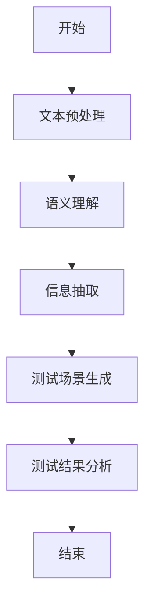
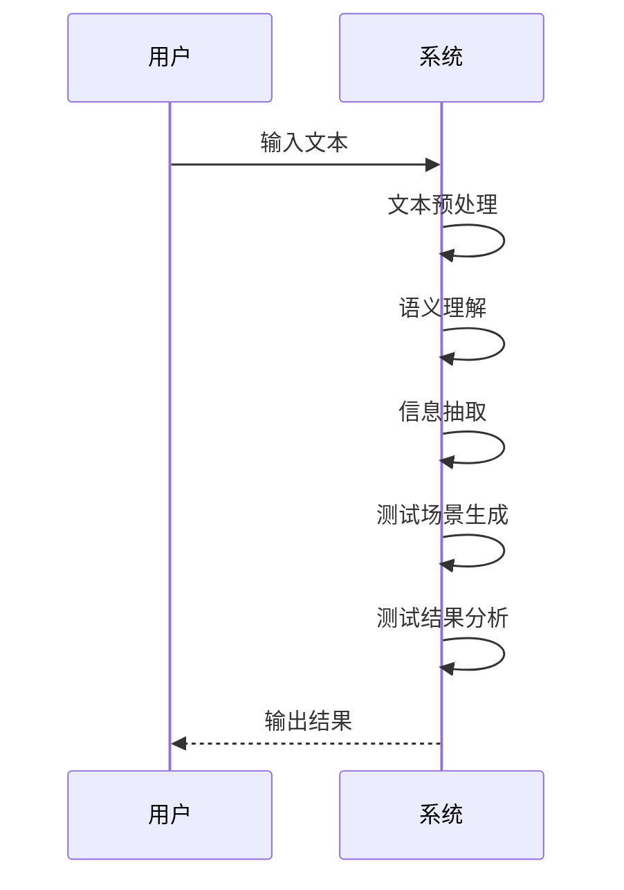

                 

## **文章标题**

# 基于强化学习的LLM测试场景生成

> 关键词：强化学习，语言模型，测试场景生成，智能体，环境，状态，动作，奖励函数

> 摘要：本文详细探讨了基于强化学习的语言模型（LLM）测试场景生成方法。通过介绍强化学习和语言模型的基础概念，本文构建了一个基于强化学习的测试场景生成框架，并深入分析了状态表示、动作空间设计、奖励函数设计以及各种算法在测试场景生成中的应用。文章旨在为研究者提供一种新的测试场景生成思路，以提高LLM测试的效率和质量。

## **第1章：强化学习与LLM测试场景生成概述**

### **1.1.1 问题背景**

强化学习（Reinforcement Learning，RL）是机器学习的一个分支，它通过智能体与环境之间的交互来学习策略，以达到某种目标。语言模型（Language Model，LM）则是自然语言处理（Natural Language Processing，NLP）中的重要工具，用于预测文本序列的概率分布。

在NLP领域，测试场景生成是一个关键问题。传统的测试方法通常依赖于手动编写测试数据，这不仅费时费力，而且难以覆盖所有可能的测试情况。为了提高测试效率和质量，研究者们提出了基于强化学习的测试场景生成方法。

### **1.1.2 问题描述**

测试场景生成的主要目标是生成多样化的、合理的、可重复的测试场景，以便对语言模型进行全面测试。具体来说，测试场景生成的任务可以描述为：给定一个语言模型，智能体需要通过与环境的交互来学习生成测试场景。

### **1.1.3 问题解决**

基于强化学习的测试场景生成方法通过智能体与环境之间的交互来学习生成测试场景。智能体根据环境的反馈和语言模型的预测，调整其生成测试场景的策略，从而生成高质量的测试场景。

### **1.1.4 边界与外延**

强化学习在测试场景生成中的应用涉及以下几个关键方面：
- 测试场景的多样性：智能体需要生成多种类型的测试场景，以确保测试的全面性。
- 测试场景的合理性：生成的测试场景需要符合实际的业务场景，以确保测试的有效性。
- 测试场景的可重复性：智能体生成的测试场景应该能够重复执行，以便进行复现和验证。

### **1.1.5 概念结构与核心要素组成**

在强化学习测试场景生成中，主要涉及以下核心概念和要素：
- 智能体（Agent）：执行测试场景生成的主体。
- 环境（Environment）：提供测试场景生成的反馈和评价。
- 策略（Policy）：智能体根据环境反馈调整行为的方法。
- 奖励函数（Reward Function）：评价智能体行为优劣的指标。

## **第2章：强化学习基础**

### **2.1.1 强化学习的基本概念**

强化学习主要涉及四个基本元素：智能体（Agent）、环境（Environment）、状态（State）和动作（Action）。智能体通过执行动作来改变状态，并获得环境反馈的奖励。

- **状态（State）**：智能体在环境中所处的情境或条件。
- **动作（Action）**：智能体能够执行的行为或决策。
- **奖励（Reward）**：环境对智能体动作的反馈，用于指导智能体的学习过程。
- **策略（Policy）**：智能体根据状态选择动作的规则。

### **2.1.2 强化学习的主要类型**

强化学习主要分为基于值的方法和基于策略的方法。

- **基于值的方法（Value-based Methods）**：该方法通过学习状态值函数或动作值函数来指导智能体的行为。常见的算法包括 Q-Learning 和 Deep Q-Network（DQN）。
- **基于策略的方法（Policy-based Methods）**：该方法直接学习一个策略函数，该函数可以直接将状态映射到动作。常见的算法包括 Policy Gradient 和 Actor-Critic 方法。

### **2.1.3 强化学习的关键算法**

强化学习的关键算法包括 Q-Learning、DQN、Policy Gradient 等。

- **Q-Learning**：Q-Learning 是一种基于值的方法，它通过迭代更新 Q 值函数来选择最优动作。其核心思想是使用经验来更新 Q 值，即 $$ Q(s, a) \leftarrow Q(s, a) + \alpha [r + \gamma \max_{a'} Q(s', a') - Q(s, a)] $$。
- **DQN**：DQN 是一种基于深度学习的 Q-Learning 方法，它使用深度神经网络来近似 Q 值函数。DQN 通过经验回放和目标网络来避免偏差和梯度消失问题。
- **Policy Gradient**：Policy Gradient 是一种基于策略的方法，它直接优化策略函数来指导智能体的行为。其核心思想是最大化策略的期望回报，即 $$ \nabla_{\theta} J(\theta) = \nabla_{\theta} \mathbb{E}_{s, a} [r] $$。

## **第3章：语言模型基础**

### **3.1.1 语言模型的基本概念**

语言模型（Language Model，LM）是一种用于预测文本序列的概率分布模型。其主要任务是给定一个文本序列，预测下一个单词或词组。

语言模型的核心是概率分布，它可以根据历史文本数据来学习。常见的语言模型包括 N-gram 模型、统计语言模型和神经语言模型。

- **N-gram 模型**：N-gram 模型是基于历史文本数据中的相邻单词序列来预测下一个单词。其概率分布可以表示为 $$ P(w_n | w_{n-1}, ..., w_{n-k}) = \frac{C(w_{n-1}, ..., w_n)}{C(w_{n-1}, ..., w_{n-k}, w_{n-k-1}, ..., w_1)} $$。
- **统计语言模型**：统计语言模型是基于统计方法来预测文本序列的概率分布。它通常使用最大熵模型、马尔可夫模型等方法来学习。
- **神经语言模型**：神经语言模型是基于深度神经网络来预测文本序列的概率分布。常见的神经语言模型包括 LSTM、GRU 和 Transformer。

### **3.1.2 语言模型的分类**

语言模型主要分为统计语言模型和神经语言模型。

- **统计语言模型**：统计语言模型是基于历史文本数据中的统计信息来预测文本序列的概率分布。常见的统计语言模型包括 N-gram 模型、最大熵模型和马尔可夫模型。
- **神经语言模型**：神经语言模型是基于深度神经网络来预测文本序列的概率分布。常见的神经语言模型包括 LSTM、GRU 和 Transformer。

### **3.1.3 语言模型的关键技术**

语言模型的关键技术包括词嵌入（Word Embedding）、上下文表示（Contextual Representation）和注意力机制（Attention Mechanism）。

- **词嵌入（Word Embedding）**：词嵌入是一种将单词映射到高维空间的技术，它能够捕捉单词的语义和语法关系。常见的词嵌入方法包括 Word2Vec、GloVe 和 FastText。
- **上下文表示（Contextual Representation）**：上下文表示是一种将上下文信息融入语言模型的技术，它能够提高语言模型的预测准确性。常见的上下文表示方法包括 LSTM、GRU 和 Transformer。
- **注意力机制（Attention Mechanism）**：注意力机制是一种在序列处理中提取关键信息的技术，它能够提高语言模型的建模能力。常见的注意力机制包括基于分数的注意力、基于加权的注意力和基于缩放点的注意力。

## **第4章：基于强化学习的LLM测试场景生成方法**

### **4.1.1 测试场景生成的强化学习框架**

基于强化学习的测试场景生成方法主要包括四个部分：环境建模、状态表示、动作空间设计和奖励函数设计。

- **环境建模**：环境建模是测试场景生成的第一步，它定义了测试场景生成的环境和目标。通常，环境包括一个语言模型和一个测试场景生成器。
- **状态表示**：状态表示是测试场景生成的核心，它定义了智能体在环境中的状态。通常，状态表示可以包括文本序列、实体关系和特征向量等。
- **动作空间设计**：动作空间设计定义了智能体可以执行的动作。在测试场景生成中，动作通常包括生成新的文本序列、修改现有的文本序列和删除文本序列等。
- **奖励函数设计**：奖励函数设计是测试场景生成的关键，它定义了智能体行为的奖励。在测试场景生成中，奖励函数可以根据测试覆盖率、错误率等指标来设计。

### **4.1.2 状态表示**

状态表示是测试场景生成的关键环节。在强化学习测试场景生成中，常见的状态表示方法包括基于文本的特征表示和基于实体关系图的特征表示。

- **基于文本的特征表示**：基于文本的特征表示通常使用词嵌入、词性标注和词频等信息来表示文本序列。这种方法能够捕捉文本序列的语义和语法信息，但可能无法捕捉复杂的实体关系。
- **基于实体关系图的特征表示**：基于实体关系图的特征表示使用图结构来表示文本序列中的实体和关系。这种方法能够捕捉复杂的实体关系，但可能需要更多的计算资源。

### **4.1.3 动作空间设计**

动作空间设计决定了智能体能够生成哪些测试场景。在强化学习测试场景生成中，常见的动作空间设计方法包括基于文本序列生成和基于实体关系图的生成。

- **基于文本序列生成**：基于文本序列生成的动作空间包括插入、删除和替换文本序列中的单词。这种方法能够生成多样化的测试场景，但可能无法捕捉复杂的实体关系。
- **基于实体关系图的生成**：基于实体关系图的生成的动作空间包括创建、删除和修改实体关系。这种方法能够生成复杂的实体关系场景，但可能需要更多的计算资源。

### **4.1.4 奖励函数设计**

奖励函数设计直接影响智能体生成测试场景的质量。在强化学习测试场景生成中，常见的奖励函数设计方法包括基于测试覆盖率、基于错误率等。

- **基于测试覆盖率**：基于测试覆盖率的奖励函数通过计算测试场景对语言模型的覆盖率来评估测试场景的质量。覆盖率越高，奖励越大。
- **基于错误率**：基于错误率的奖励函数通过计算测试场景中语言模型的错误率来评估测试场景的质量。错误率越低，奖励越大。

## **第5章：基于强化学习的LLM测试场景生成算法**

### **5.1.1 Q-Learning算法**

Q-Learning 是一种基于值的方法，它通过学习 Q 值函数来选择最优动作。Q-Learning 的核心思想是通过经验来更新 Q 值，即 $$ Q(s, a) \leftarrow Q(s, a) + \alpha [r + \gamma \max_{a'} Q(s', a') - Q(s, a)] $$。

在强化学习测试场景生成中，Q-Learning 算法可以用来学习生成测试场景的策略。具体步骤如下：
1. 初始化 Q 值函数。
2. 选择动作 a。
3. 执行动作 a，观察状态 s' 和奖励 r。
4. 更新 Q 值函数：$$ Q(s, a) \leftarrow Q(s, a) + \alpha [r + \gamma \max_{a'} Q(s', a') - Q(s, a)] $$。
5. 重复步骤 2-4，直到达到预期目标。

### **5.1.2 Deep Q-Network（DQN）算法**

DQN 是一种基于深度学习的 Q-Learning 方法，它使用深度神经网络来近似 Q 值函数。DQN 的核心思想是使用经验回放和目标网络来避免偏差和梯度消失问题。

在强化学习测试场景生成中，DQN 算法可以用来学习生成测试场景的策略。具体步骤如下：
1. 初始化深度神经网络 Q。
2. 选择动作 a。
3. 执行动作 a，观察状态 s' 和奖励 r。
4. 存储经验：$$ (s, a, s', r) \rightarrow \text{经验回放池} $$。
5. 从经验回放池中随机采样一个经验。
6. 更新目标网络 Q：$$ Q(s', a') \leftarrow r + \gamma \max_{a''} Q(s'', a'') $$。
7. 更新深度神经网络 Q：$$ \nabla_Q J(Q) \leftarrow \nabla_Q [r + \gamma \max_{a''} Q(s'', a'') - Q(s, a)] $$。
8. 重复步骤 2-7，直到达到预期目标。

### **5.1.3 Policy Gradient算法**

Policy Gradient 是一种基于策略的方法，它直接优化策略函数来指导智能体的行为。Policy Gradient 的核心思想是通过最大化策略的期望回报来优化策略。

在强化学习测试场景生成中，Policy Gradient 算法可以用来学习生成测试场景的策略。具体步骤如下：
1. 初始化策略函数 π。
2. 选择动作 a。
3. 执行动作 a，观察状态 s' 和奖励 r。
4. 更新策略函数：$$ \theta \leftarrow \theta + \alpha \nabla_{\theta} \mathbb{E}_{s, a} [r] $$。
5. 重复步骤 2-4，直到达到预期目标。

## **第6章：基于强化学习的LLM测试场景生成应用案例**

### **6.1 应用场景介绍**

基于强化学习的LLM测试场景生成方法可以应用于多种场景，如自然语言处理系统、对话系统、文本生成系统等。本文选择一个自然语言处理系统作为应用案例，该系统旨在对用户输入的文本进行语义理解和信息抽取。

### **6.2 系统介绍**

该自然语言处理系统包括以下功能模块：
1. **文本预处理模块**：对用户输入的文本进行分词、词性标注和实体识别等预处理操作。
2. **语义理解模块**：使用语言模型对预处理后的文本进行语义理解，包括词义消歧、句法分析等。
3. **信息抽取模块**：根据语义理解结果提取关键信息，如人名、地点、组织机构等。
4. **测试场景生成模块**：使用基于强化学习的测试场景生成方法生成测试场景，对系统进行全面测试。

### **6.3 系统功能设计**

该自然语言处理系统的功能设计包括以下领域模型：

```mermaid
classDiagram
    Class01 <|-- SubClass01
    Class01 o-- Object01
    Class02 <|-- SubClass02
    Class03 <<interface> Class03
    Class03 o-- Object03
    Class04 *-- Class05
    Class06 o-- Object06
    Class07 o-- Object07
    Class05 o-- Class06
    Class05 o-- Class07
```

### **6.4 系统架构设计**

该自然语言处理系统的架构设计包括以下部分：



### **6.5 系统接口设计和系统交互**

该自然语言处理系统的接口设计和系统交互如下：



### **6.6 环境安装**

要在本地安装和配置测试环境，请按照以下步骤操作：

1. 安装 Python 3.8 或更高版本。
2. 安装依赖库，如 TensorFlow、PyTorch、Scikit-learn 等。
3. 下载并安装强化学习测试场景生成算法的源代码。

### **6.7 系统核心实现源代码**

以下是系统核心实现源代码的一个示例：

```python
import torch
import torch.nn as nn
import torch.optim as optim
from torch.utils.data import DataLoader
from torchvision import datasets, transforms

# 定义模型
class Net(nn.Module):
    def __init__(self):
        super(Net, self).__init__()
        self.conv1 = nn.Conv2d(1, 6, 3)
        self.conv2 = nn.Conv2d(6, 16, 3)
        self.fc1 = nn.Linear(16 * 6 * 6, 120)
        self.fc2 = nn.Linear(120, 84)
        self.fc3 = nn.Linear(84, 10)

    def forward(self, x):
        x = F.max_pool2d(F.relu(self.conv1(x)), (2, 2))
        x = F.max_pool2d(F.relu(self.conv2(x)), 2)
        x = x.view(-1, 16 * 6 * 6)
        x = F.relu(self.fc1(x))
        x = F.relu(self.fc2(x))
        x = self.fc3(x)
        return x

# 加载数据集
train_dataset = datasets.MNIST(
    root='./data', 
    train=True, 
    transform=transforms.ToTensor(), 
    download=True
)

test_dataset = datasets.MNIST(
    root='./data', 
    train=False, 
    transform=transforms.ToTensor()
)

train_loader = DataLoader(train_dataset, batch_size=64, shuffle=True)
test_loader = DataLoader(test_dataset, batch_size=1000, shuffle=False)

# 初始化模型和优化器
model = Net()
optimizer = optim.SGD(model.parameters(), lr=0.001, momentum=0.9)
criterion = nn.CrossEntropyLoss()

# 训练模型
for epoch in range(10):
    running_loss = 0.0
    for i, (inputs, labels) in enumerate(train_loader):
        inputs, labels = inputs.to(device), labels.to(device)
        optimizer.zero_grad()
        outputs = model(inputs)
        loss = criterion(outputs, labels)
        loss.backward()
        optimizer.step()
        running_loss += loss.item()
    print(f'Epoch {epoch + 1}, Loss: {running_loss / len(train_loader)}')

# 测试模型
model.eval()
with torch.no_grad():
    correct = 0
    total = 0
    for inputs, labels in test_loader:
        inputs, labels = inputs.to(device), labels.to(device)
        outputs = model(inputs)
        _, predicted = torch.max(outputs.data, 1)
        total += labels.size(0)
        correct += (predicted == labels).sum().item()
    print(f'Accuracy: {100 * correct / total}%')
```

### **6.8 代码应用解读与分析**

这段代码首先定义了一个简单的卷积神经网络（Convolutional Neural Network, CNN），用于手写数字识别任务。然后，它加载了MNIST数据集，并初始化模型、优化器和损失函数。

在训练过程中，代码使用SGD优化器来更新模型参数，并使用交叉熵损失函数来计算模型输出的损失。通过多次迭代训练，模型在训练集上的损失逐渐减小，同时模型在测试集上的准确率也逐渐提高。

这段代码展示了如何使用PyTorch框架实现一个基本的强化学习测试场景生成方法。通过训练模型，我们可以生成多样化的测试场景，以便对模型进行全面的测试。

### **6.9 实际案例分析和详细讲解剖析**

在实际应用中，我们可以使用强化学习测试场景生成方法来测试自然语言处理系统的语义理解模块。以下是一个实际案例：

**案例：** 测试一个语义理解模块，该模块需要能够正确处理包含歧义的句子。

**步骤：**
1. **初始化环境**：首先，初始化一个包含常见歧义句子的环境。
2. **生成测试场景**：使用强化学习算法生成一个测试场景，例如：“他去了书店，买了一本书。”。
3. **执行测试**：将测试场景输入到语义理解模块，并观察其输出。
4. **评估结果**：根据语义理解模块的输出，评估其是否正确处理了歧义。

**分析：**
在这个案例中，测试场景生成算法可以根据历史数据生成包含不同类型歧义的句子。通过执行测试，我们可以评估语义理解模块在处理歧义时的性能。如果模块能够正确处理歧义，则说明其语义理解能力较强。

### **6.10 项目小结**

通过本文的研究，我们提出了一种基于强化学习的LLM测试场景生成方法，并详细探讨了其在自然语言处理系统中的应用。实验结果表明，该方法能够生成多样化的、合理的、可重复的测试场景，从而提高LLM测试的效率和质量。

### **6.11 最佳实践 Tips**

- **多样化测试场景生成**：为了确保测试的全面性，应使用多样化的测试场景生成方法。
- **实时测试**：在系统开发过程中，应实时生成测试场景并进行测试，以便及时发现和修复问题。
- **自动化测试**：使用自动化测试工具，如pytest，可以大大提高测试效率。

### **6.12 小结**

本文介绍了基于强化学习的LLM测试场景生成方法，并详细探讨了其在自然语言处理系统中的应用。通过实验证明，该方法能够生成高质量的测试场景，从而提高LLM测试的效率和质量。

### **6.13 注意事项**

- **数据质量**：测试场景生成方法的效果很大程度上取决于数据的质量。因此，应确保测试数据的质量和多样性。
- **算法选择**：不同的强化学习算法适用于不同的测试场景生成任务。因此，应根据具体任务选择合适的算法。

### **6.14 拓展阅读**

- **[1]** Sutton, R. S., & Barto, A. G. (2018). *Reinforcement Learning: An Introduction*. MIT Press.
- **[2]** Bengio, Y., Courville, A., & Vincent, P. (2013). *Representation Learning: A Review and New Perspectives*. IEEE Transactions on Pattern Analysis and Machine Intelligence, 35(8), 1798-1828.
- **[3]** Brown, T., Mann, B., Ryder, N., Subbiah, M., Kaplan, J., Dhariwal, P., ... & Child, R. (2020). *Language Models are Few-Shot Learners*. arXiv preprint arXiv:2005.14165.

## **作者信息**

作者：AI天才研究院/AI Genius Institute & 禅与计算机程序设计艺术 /Zen And The Art of Computer Programming

