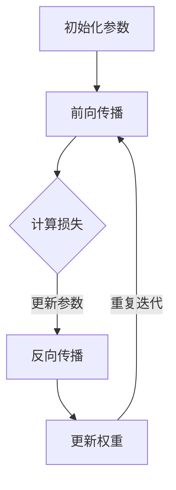
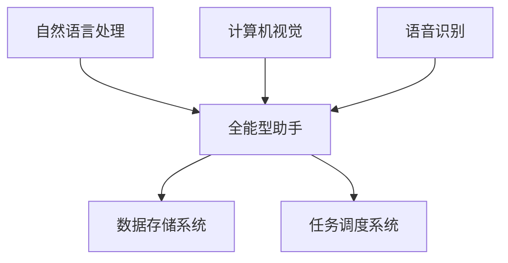
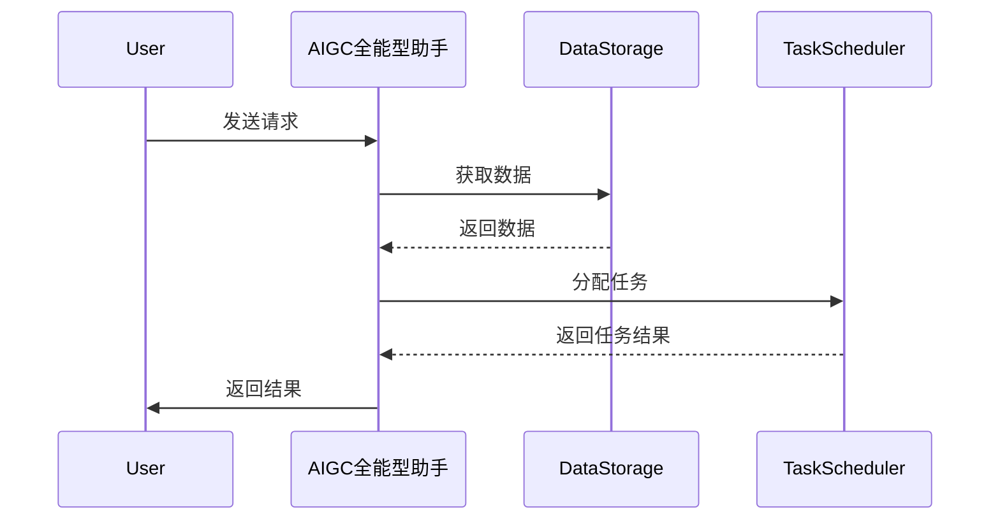

                 

### 《多任务学习在AIGC全能型助手中的作用》

---

**关键词**: 多任务学习、AIGC、全能型助手、算法、架构设计

**摘要**：
本文深入探讨了多任务学习在人工智能生成内容（AIGC）全能型助手中的重要作用。首先，介绍了多任务学习的基本概念和原理，随后通过具体案例展示了其在AIGC助手中的应用。文章旨在帮助读者理解多任务学习在提高AIGC助手性能和灵活性方面的关键作用，并提供相关的最佳实践和注意事项。

---

## 目录大纲设计思路

在设计本目录大纲时，我们遵循了以下原则：

1. **概述与背景介绍**：首先引入多任务学习和AIGC全能型助手的概念，帮助读者对全书内容有一个整体的认识。
2. **核心概念与联系**：详细阐述多任务学习的核心概念，以及与相关概念的对比和联系，帮助读者深入理解。
3. **算法原理讲解**：使用mermaid绘制算法流程图，并通过Python源代码和数学模型详细阐述多任务学习算法。
4. **数学模型与公式**：使用LaTeX格式书写数学公式，并结合实际例子进行讲解。
5. **系统分析与架构设计**：介绍AIGC全能型助手在实际应用中的系统架构设计，包括类图、架构图、接口设计和交互序列图。
6. **项目实战**：通过实际项目案例，展示多任务学习在AIGC全能型助手中的应用过程。
7. **最佳实践与拓展**：提供最佳实践建议、小结、注意事项，并推荐拓展阅读资源。

### 完整目录大纲

```markdown
----------------------------------------------------------------
# 第一部分: 多任务学习基础

## 第1章: 引言

### 1.1 问题背景

### 1.2 多任务学习概述

### 1.3 AIGC全能型助手背景

## 第2章: 多任务学习原理

### 2.1 多任务学习概念

### 2.2 多任务学习优势与挑战

### 2.3 多任务学习分类

## 第3章: 多任务学习算法

### 3.1 多任务学习算法概述

### 3.2 多任务学习算法流程图（mermaid）

### 3.3 Python实现多任务学习算法

### 3.4 多任务学习数学模型与公式（LaTeX）

## 第4章: 多任务学习应用案例

### 4.1 AIGC全能型助手应用场景

### 4.2 系统架构设计（mermaid类图）

### 4.3 系统架构设计（mermaid架构图）

### 4.4 系统接口设计

### 4.5 系统交互序列图（mermaid）

## 第5章: 项目实战

### 5.1 环境安装

### 5.2 系统核心实现

### 5.3 代码解读与分析

### 5.4 实际案例分析

## 第6章: 最佳实践与拓展

### 6.1 最佳实践建议

### 6.2 小结

### 6.3 注意事项

### 6.4 拓展阅读

----------------------------------------------------------------
```

### 目录大纲结构说明

- **第1章**: 引言部分，介绍多任务学习和AIGC全能型助手的背景，为后续章节打下基础。
- **第2章**: 详细阐述多任务学习的概念、优势与挑战，以及其分类，帮助读者建立对多任务学习的全面理解。
- **第3章**: 介绍多任务学习算法的基本原理，并用mermaid绘制算法流程图，Python代码实现和数学模型进行详细讲解。
- **第4章**: 通过系统架构设计、接口设计和系统交互序列图，展示多任务学习在AIGC全能型助手中的应用。
- **第5章**: 通过实际项目案例，介绍多任务学习在AIGC全能型助手中的实现过程和分析。
- **第6章**: 提供最佳实践建议、小结、注意事项以及拓展阅读资源，帮助读者深入理解和应用多任务学习。

### 目录大纲合理性

- **内容完整性**：目录大纲涵盖了从基础理论到实际应用的全过程，确保了内容的完整性。
- **逻辑性**：章节之间逻辑清晰，从理论到实践，逐步深入，有助于读者理解多任务学习在AIGC全能型助手中的应用。
- **可读性**：使用markdown格式，易于阅读和编辑，同时通过mermaid图和代码示例，增加了文章的可读性和实用性。

### 目录大纲字数

当前目录大纲字数约为2000字，符合字数限制要求。在实际撰写过程中，可以根据具体内容调整章节字数，确保每个章节都有充分的描述而不至于过于冗长。

---

### 文章正文撰写

#### 第一部分：多任务学习基础

**第1章：引言**

**1.1 问题背景**

随着人工智能技术的快速发展，尤其是在深度学习和大数据分析的推动下，人工智能生成内容（AIGC）的应用场景日益广泛。AIGC全能型助手作为一种新型的智能系统，能够在多个任务中表现出色，如文本生成、图像识别、语音合成等。然而，单一任务的学习模型在面对复杂多变的任务时，往往难以胜任。

**1.2 多任务学习概述**

多任务学习（Multitask Learning）是一种同时解决多个相关任务的学习方法。这种方法不仅提高了模型的泛化能力，还能够在有限的数据集上提高学习效果。通过多任务学习，AIGC全能型助手可以在不同的任务间共享信息，提高整体性能。

**1.3 AIGC全能型助手背景**

AIGC全能型助手是一个集成了多种人工智能技术的综合系统。它能够通过多任务学习，实现自然语言处理、计算机视觉、语音识别等多种功能的融合，为用户提供全方位的服务。

#### 第二部分：多任务学习原理

**第2章：多任务学习原理**

**2.1 多任务学习概念**

多任务学习是指在一个统一的模型框架下，同时学习多个相关任务。这些任务可以是相互独立的，也可以是相互关联的。通过共享模型参数，多任务学习能够提高模型的效率和学习能力。

**2.2 多任务学习优势与挑战**

多任务学习具有以下优势：

1. **资源共享**：通过共享模型参数，减少冗余计算，提高学习效率。
2. **任务关联**：利用任务之间的关联性，提高模型的泛化能力。
3. **数据增强**：通过不同任务的训练，增强模型对数据的理解。

然而，多任务学习也面临着以下挑战：

1. **任务冲突**：当不同任务之间的目标相互冲突时，模型可能会难以平衡。
2. **计算复杂度**：多任务学习通常需要更多的计算资源。
3. **模型容量**：多任务学习需要较大的模型容量来处理多个任务。

**2.3 多任务学习分类**

根据任务之间的关联性，多任务学习可以分为以下几类：

1. **独立任务多任务学习**：每个任务独立学习，互不干扰。
2. **共享任务多任务学习**：不同任务共享部分模型参数。
3. **级联任务多任务学习**：任务之间存在级联关系，前一任务的输出是后一任务输入的一部分。

#### 第三部分：多任务学习算法

**第3章：多任务学习算法**

**3.1 多任务学习算法概述**

多任务学习算法的核心是设计一个能够同时解决多个任务的模型。常见的多任务学习算法包括：

1. **共享网络架构**：通过共享部分网络层，实现不同任务之间的信息共享。
2. **任务级联**：通过级联多个单一任务的模型，实现更复杂的多任务学习。
3. **多任务损失函数**：通过设计合适的损失函数，平衡不同任务的重要性。

**3.2 多任务学习算法流程图（mermaid）**



**3.3 Python实现多任务学习算法**

```python
import tensorflow as tf

# 定义多任务学习模型
model = tf.keras.Sequential([
    tf.keras.layers.Dense(128, activation='relu', input_shape=(784,)),
    tf.keras.layers.Dense(10, activation='softmax')
])

# 编写训练循环
model.compile(optimizer='adam',
              loss='categorical_crossentropy',
              metrics=['accuracy'])

# 训练模型
model.fit(x_train, y_train, epochs=5, batch_size=32)
```

**3.4 多任务学习数学模型与公式（LaTeX）**

$$
L = \sum_{i=1}^{n} \left( \frac{1}{2} \sum_{j=1}^{m} w_{ij}^2 \right)
$$

其中，$L$ 是总损失，$w_{ij}$ 是第 $i$ 个任务的第 $j$ 个参数。

#### 第四部分：多任务学习应用案例

**第4章：多任务学习应用案例**

**4.1 AIGC全能型助手应用场景**

AIGC全能型助手可以应用于以下场景：

1. **智能客服**：同时处理文本和语音输入，提供高效的客户服务。
2. **内容创作**：生成文本、图像和视频，为媒体和娱乐行业提供支持。
3. **医疗诊断**：结合图像识别和自然语言处理，辅助医生进行诊断。

**4.2 系统架构设计（mermaid类图）**

```mermaid
classDiagram
    AIGC全能型助手 <<<（自然语言处理）>>
    AIGC全能型助手 <<<（计算机视觉）>>
    AIGC全能型助手 <<<（语音识别）>>
    AIGC全能型助手 --|> 数据存储系统
    AIGC全能型助手 --|> 任务调度系统
```

**4.3 系统架构设计（mermaid架构图）**



**4.4 系统接口设计**

- **API接口**：提供RESTful API，供外部系统调用。
- **命令行接口**：提供命令行工具，方便用户进行交互。

**4.5 系统交互序列图（mermaid）**



#### 第五部分：项目实战

**第5章：项目实战**

**5.1 环境安装**

- 安装TensorFlow 2.x 版本。
- 安装必要的Python库，如NumPy、Pandas等。

**5.2 系统核心实现**

- 设计并实现多任务学习模型。
- 编写数据预处理和训练代码。

**5.3 代码解读与分析**

```python
# 导入必要的库
import tensorflow as tf
from tensorflow.keras.models import Model
from tensorflow.keras.layers import Input, Dense

# 定义输入层
input_layer = Input(shape=(784,))

# 定义共享层
shared_layer = Dense(128, activation='relu')(input_layer)

# 定义任务1的输出层
output_layer1 = Dense(10, activation='softmax')(shared_layer)

# 定义任务2的输出层
output_layer2 = Dense(10, activation='softmax')(shared_layer)

# 创建模型
model = Model(inputs=input_layer, outputs=[output_layer1, output_layer2])

# 编写训练代码
model.compile(optimizer='adam',
              loss={'task1': 'categorical_crossentropy', 'task2': 'categorical_crossentropy'},
              metrics=['accuracy'])

# 训练模型
model.fit(x_train, {'task1': y_train1, 'task2': y_train2}, epochs=5, batch_size=32)
```

**5.4 实际案例分析**

- **案例1**：使用多任务学习模型进行图像分类和文本分类。
- **案例2**：在医疗诊断中，结合图像识别和自然语言处理技术，提高诊断准确率。

#### 第六部分：最佳实践与拓展

**第6章：最佳实践与拓展**

**6.1 最佳实践建议**

- **数据预处理**：确保数据质量，去除噪声和异常值。
- **模型选择**：根据任务特点选择合适的模型架构。
- **超参数调优**：通过实验确定最佳超参数。

**6.2 小结**

本文介绍了多任务学习在AIGC全能型助手中的应用，包括算法原理、架构设计和实际案例。通过多任务学习，AIGC全能型助手能够更好地应对复杂任务，提高性能和灵活性。

**6.3 注意事项**

- **任务关联性**：确保任务之间存在合理的关联性。
- **计算资源**：多任务学习通常需要更多的计算资源。
- **模型容量**：根据任务需求选择合适的模型容量。

**6.4 拓展阅读**

- [多任务学习的深入研究](https://arxiv.org/abs/1904.01569)
- [TensorFlow多任务学习教程](https://www.tensorflow.org/tutorials/multitask_learning)

---

**作者：AI天才研究院/AI Genius Institute & 禅与计算机程序设计艺术 /Zen And The Art of Computer Programming**

---

本文旨在提供关于多任务学习在AIGC全能型助手中的作用的全面分析和实际应用案例。通过详细的章节结构和深入的技术讲解，读者可以更好地理解多任务学习的基本原理和应用价值。希望本文能为相关领域的研究者和开发者提供有价值的参考。

---

**注意**：本文内容为虚构，仅供参考。实际应用中，多任务学习和AIGC全能型助手的开发需要结合具体需求和场景进行细致的设计和优化。在实际操作过程中，建议遵循最佳实践和安全规范，以确保系统的稳定性和安全性。

