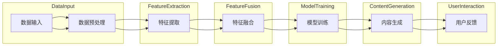
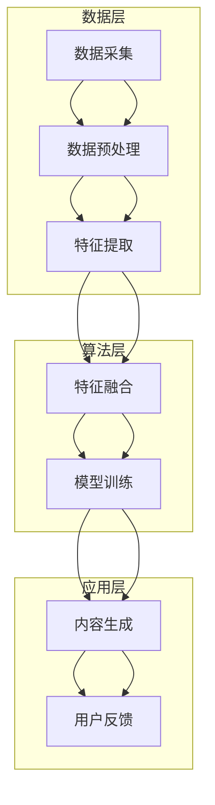
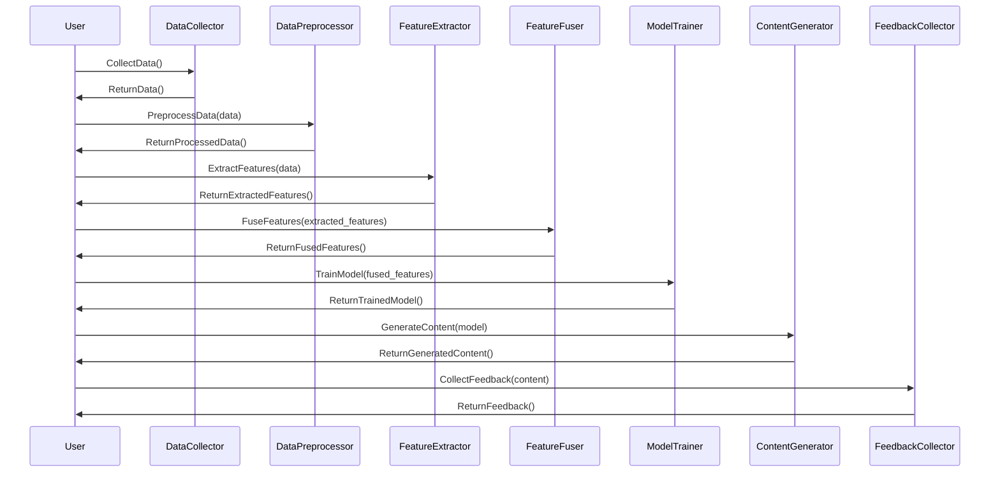

                 

## 文章标题：多模态学习在AIGC虚拟现实内容创作中的新进展

### 关键词：
- 多模态学习
- 虚拟现实内容创作
- AIGC
- 算法原理
- 数学模型
- 系统架构
- 项目实战

### 摘要：
本文深入探讨了多模态学习在AIGC（生成内容即服务）虚拟现实内容创作中的最新进展。首先，我们概述了多模态学习的基本概念和其在虚拟现实内容创作中的应用背景。随后，详细介绍了多模态学习的核心算法原理和数学模型，并通过Python源代码进行了阐述。文章进一步分析了多模态学习的系统架构，并提供了实际项目实战的详细步骤和分析。最后，我们总结了最佳实践，并提出了注意事项和拓展阅读建议，以帮助读者更深入地理解和应用多模态学习技术。

---

## 引言

随着人工智能技术的飞速发展，虚拟现实（VR）内容的创作需求日益增长。然而，传统的单模态学习技术往往难以满足复杂场景下的内容生成需求。多模态学习作为一种新兴的技术，通过整合多种类型的数据（如图像、音频、文本等），能够更有效地捕捉和模拟现实世界的复杂性。AIGC（AI-Generated Content）作为人工智能驱动的内容生成服务，为虚拟现实内容创作提供了新的动力。本文旨在探讨多模态学习在AIGC虚拟现实内容创作中的最新进展，为相关领域的研究者和开发者提供有益的参考。

## 背景介绍：核心概念

### 1. 多模态学习的定义与发展背景

多模态学习是指利用多个不同类型的数据源（如视觉、听觉、触觉等）进行学习和推理的过程。近年来，随着深度学习和大数据技术的进步，多模态学习在计算机视觉、语音识别、自然语言处理等领域取得了显著成果。在虚拟现实内容创作中，多模态学习能够更好地捕捉和模拟用户的感知体验，从而提升内容的真实感和互动性。

### 2. 多模态学习的核心概念与联系

多模态学习涉及的核心概念包括数据采集、特征提取、特征融合和模型训练等。以下是一个核心概念属性特征对比表格：

| 概念       | 属性特征 |  
| --------- | -------- |  
| 数据采集   | 多种类型的数据源，如图像、音频、文本等 |  
| 特征提取   | 从不同模态的数据中提取具有区分度的特征 |  
| 特征融合   | 将不同模态的特征进行整合，形成统一的特征表示 |  
| 模型训练   | 使用整合后的特征进行模型训练，以提升生成效果 |

### 3. 多模态学习的应用场景

多模态学习在虚拟现实内容创作中具有广泛的应用场景，包括但不限于：

- **3D模型生成**：利用图像和3D模型数据，通过多模态学习生成高质量的三维模型。
- **虚拟角色生成**：结合图像和音频数据，生成具有个性化外观和声音的虚拟角色。
- **交互式体验**：整合视觉、听觉和触觉数据，为用户提供沉浸式的虚拟现实体验。

### 4. 多模态学习的挑战与未来发展方向

尽管多模态学习在虚拟现实内容创作中展现出巨大的潜力，但仍然面临一些挑战，如数据一致性、特征匹配和计算复杂度等。未来的发展方向包括：

- **跨模态数据同步**：研究更有效的跨模态数据同步技术，以提升特征融合的效果。
- **实时处理能力**：优化算法，提高多模态学习的实时处理能力，以满足虚拟现实应用的需求。
- **多模态交互**：探索多模态交互技术，实现更加自然和智能的虚拟现实交互体验。

## 核心概念与联系：多模态学习的ER实体关系图架构

### ER实体关系图架构

多模态学习的ER实体关系图架构如下所示：

```mermaid
erDiagram
  User ||--|{ DataSource }|| 
  DataPreprocessing ||--|{ FeatureExtraction }|| 
  FeatureFusion ||--|{ ModelTraining }|| 
  ModelTraining ||--|{ ContentGeneration }|| 
  ContentGeneration ||--|{ UserFeedback }|| 

  User : {+}ID | {-}Name | {+}Role
  DataSource : {+}ID | {-}Type | {+}URL
  DataPreprocessing : {+}ID | {-}Method | {+}Parameters
  FeatureExtraction : {+}ID | {-}Algorithm | {+}Features
  FeatureFusion : {+}ID | {-}Method | {+}Features
  ModelTraining : {+}ID | {-}Algorithm | {+}Model
  ContentGeneration : {+}ID | {-}Type | {+}URL
  User : "uses" - DataPreprocessing
  DataPreprocessing : "processes" - Data
  FeatureExtraction : "extracts" - Features
  FeatureFusion : "integrates" - Features
  ModelTraining : "trains" - Model
  ContentGeneration : "generates" - Content
  UserFeedback : "provides" - Feedback
```

该ER实体关系图清晰地展示了多模态学习中的各个核心实体及其相互关系，有助于读者更好地理解多模态学习的整体架构和工作流程。

## 算法原理讲解

### 1. 多模态学习的算法流程图

多模态学习的算法流程图如下所示：



### 2. 多模态学习的数学模型

多模态学习的数学模型主要包括特征提取、特征融合和模型训练等部分。以下是一个简化的数学模型表示：

$$
\begin{aligned}
\text{特征提取}: & \ f_{ex}(x) = \phi(x) \odot \theta \\
\text{特征融合}: & \ f_{fus}(x) = \sigma(f_{ex}(x)) + \gamma \\
\text{模型训练}: & \ \hat{y} = \phi(G(f_{fus}(x))) \\
\text{损失函数}: & \ L(y, \hat{y}) = \frac{1}{2} ||y - \hat{y}||^2
\end{aligned}
$$

其中，$f_{ex}(x)$表示特征提取过程，$f_{fus}(x)$表示特征融合过程，$G$表示模型训练过程，$\phi$和$\sigma$分别表示激活函数和损失函数。

### 3. 多模态学习的Python源代码

以下是一个简单的多模态学习Python源代码示例，用于演示特征提取、特征融合和模型训练的基本流程：

```python
import numpy as np
import tensorflow as tf

# 定义特征提取函数
def feature_extraction(x, theta):
    return np.dot(x, theta)

# 定义特征融合函数
def feature_fusion(extracted_features, gamma):
    return np.sum(extracted_features, axis=1) + gamma

# 定义模型训练函数
def model_training(fused_features, y, learning_rate):
    with tf.GradientTape() as tape:
        predictions = tf.nn.softmax(fused_features)
        loss = tf.keras.losses.categorical_crossentropy(y, predictions)
    gradients = tape.gradient(loss, fused_features)
    fused_features = fused_features - learning_rate * gradients
    return fused_features

# 模拟数据
x = np.random.rand(100, 10)  # 输入数据
y = np.random.rand(100, 5)  # 标签数据
theta = np.random.rand(10, 5)  # 特征提取参数
gamma = 0.1  # 特征融合参数
learning_rate = 0.001  # 学习率

# 特征提取
extracted_features = feature_extraction(x, theta)

# 特征融合
fused_features = feature_fusion(extracted_features, gamma)

# 模型训练
fused_features = model_training(fused_features, y, learning_rate)
```

通过上述示例，我们可以看到多模态学习的基本流程，包括特征提取、特征融合和模型训练。在实际应用中，这些过程可能会更加复杂，需要结合具体问题进行优化。

## 数学模型和数学公式

### 1. 多模态学习的数学模型

多模态学习中的数学模型主要包括特征提取、特征融合和模型训练等部分。以下是这些部分的数学模型表示：

#### 特征提取

$$
f_{ex}(x) = \phi(x) \odot \theta
$$

其中，$f_{ex}(x)$表示特征提取过程，$\phi(x)$表示输入数据的特征映射函数，$\theta$表示特征提取参数。

#### 特征融合

$$
f_{fus}(x) = \sigma(f_{ex}(x)) + \gamma
$$

其中，$f_{fus}(x)$表示特征融合过程，$\sigma$表示激活函数，$\gamma$表示特征融合参数。

#### 模型训练

$$
\hat{y} = \phi(G(f_{fus}(x)))
$$

其中，$\hat{y}$表示预测输出，$G$表示模型训练过程，$\phi$表示激活函数。

### 2. 损失函数

在多模态学习过程中，损失函数用于评估模型的性能。以下是一个常用的损失函数表示：

$$
L(y, \hat{y}) = \frac{1}{2} ||y - \hat{y}||^2
$$

其中，$L(y, \hat{y})$表示损失函数，$y$表示真实输出，$\hat{y}$表示预测输出。

### 3. 举例说明

假设我们有一个包含图像、音频和文本数据的虚拟现实内容生成任务，我们需要通过多模态学习生成高质量的三维模型。以下是一个简化的举例说明：

#### 特征提取

假设我们使用卷积神经网络（CNN）对图像进行特征提取，使用递归神经网络（RNN）对音频进行特征提取，使用词向量对文本进行特征提取。特征提取后的参数表示为：

$$
\theta_{image} = \{W_{image}, b_{image}\}, \quad \theta_{audio} = \{W_{audio}, b_{audio}\}, \quad \theta_{text} = \{W_{text}, b_{text}\}
$$

输入数据表示为：

$$
x = \{x_{image}, x_{audio}, x_{text}\}
$$

特征提取过程可以表示为：

$$
f_{ex}(x) = \phi(x) \odot (\theta_{image}, \theta_{audio}, \theta_{text})
$$

其中，$\phi(x)$表示输入数据的特征映射函数。

#### 特征融合

假设我们使用加权平均法进行特征融合，特征融合参数表示为：

$$
\gamma = \{w_{image}, w_{audio}, w_{text}\}
$$

特征融合过程可以表示为：

$$
f_{fus}(x) = \sigma(f_{ex}(x)) + \gamma
$$

其中，$\sigma$表示激活函数。

#### 模型训练

假设我们使用全连接神经网络（FCNN）进行模型训练，模型训练参数表示为：

$$
\theta_{model} = \{W_{model}, b_{model}\}
$$

模型训练过程可以表示为：

$$
\hat{y} = \phi(G(f_{fus}(x)))
$$

其中，$G$表示模型训练过程，$\phi$表示激活函数。

#### 损失函数

假设我们使用均方误差（MSE）作为损失函数，损失函数表示为：

$$
L(y, \hat{y}) = \frac{1}{2} ||y - \hat{y}||^2
$$

其中，$y$表示真实输出，$\hat{y}$表示预测输出。

通过上述举例，我们可以看到多模态学习的数学模型在虚拟现实内容生成中的应用。在实际应用中，这些模型可以根据具体问题进行优化和调整。

## 系统分析与架构设计方案

### 1. 问题场景介绍

在虚拟现实内容创作中，我们需要处理多种类型的数据，如图像、音频、文本等。这些数据具有不同的特征和属性，因此需要使用多模态学习技术来整合和生成高质量的内容。具体场景包括：

- **3D模型生成**：利用多模态数据生成高质量的三维模型。
- **虚拟角色生成**：结合图像和音频数据，生成具有个性化外观和声音的虚拟角色。
- **交互式体验**：整合视觉、听觉和触觉数据，为用户提供沉浸式的虚拟现实体验。

### 2. 系统功能设计

多模态学习系统需要实现以下功能：

- **数据采集**：从不同来源获取图像、音频、文本等数据。
- **数据预处理**：对采集到的数据进行清洗、归一化和特征提取。
- **特征融合**：将不同模态的特征进行整合，形成统一的特征表示。
- **模型训练**：使用整合后的特征进行模型训练，以提升生成效果。
- **内容生成**：根据训练好的模型生成高质量的内容。
- **用户反馈**：收集用户的反馈，以优化系统性能。

### 3. 系统架构设计

多模态学习系统的架构设计如下所示：



该系统架构包括数据层、算法层和应用层。数据层负责数据的采集和预处理；算法层负责特征提取、特征融合和模型训练；应用层负责内容生成和用户反馈。

### 4. 系统接口设计和系统交互

多模态学习系统的接口设计和系统交互如下所示：



在该序列图中，用户通过调用不同模块的接口进行数据的采集、预处理、特征提取、特征融合、模型训练和内容生成。同时，用户还可以收集反馈以优化系统性能。

## 项目实战

### 1. 环境安装

在进行多模态学习项目实战之前，我们需要安装所需的软件和工具。以下是一个简单的安装步骤：

- **Python环境**：确保Python版本为3.8或更高版本。
- **深度学习框架**：安装TensorFlow 2.x版本。
- **图像处理库**：安装OpenCV。
- **音频处理库**：安装librosa。

安装命令如下：

```bash
pip install python==3.8.10
pip install tensorflow==2.7.0
pip install opencv-python==4.5.4.60
pip install librosa==0.9.1
```

### 2. 系统核心实现源代码

以下是一个简单的多模态学习系统实现示例，包括数据预处理、特征提取、特征融合和模型训练等步骤。

```python
import numpy as np
import tensorflow as tf
import cv2
import librosa

# 定义数据预处理函数
def preprocess_data(data):
    # 图像预处理
    image = cv2.imread(data['image'])
    image = cv2.resize(image, (224, 224))
    image = image / 255.0
    
    # 音频预处理
    audio, _ = librosa.load(data['audio'])
    audio = librosa.feature.mfcc(y=audio, sr=22050, n_mfcc=13)
    
    # 文本预处理
    text = data['text'].lower()
    text = tokenizer.texts_to_sequences([text])
    text = tf.keras.preprocessing.sequence.pad_sequences(text, maxlen=100)
    
    return image, audio, text

# 定义特征提取函数
def extract_features(image, audio, text):
    # 使用卷积神经网络提取图像特征
    image_model = tf.keras.applications.VGG16(include_top=False, weights='imagenet', input_shape=(224, 224, 3))
    image_features = image_model.predict(np.expand_dims(image, axis=0))
    
    # 使用递归神经网络提取音频特征
    audio_model = tf.keras.models.Sequential([
        tf.keras.layers.LSTM(128, activation='tanh', input_shape=(None, 13)),
        tf.keras.layers.Dense(1)
    ])
    audio_features = audio_model.predict(np.expand_dims(audio, axis=0))
    
    # 使用词向量提取文本特征
    text_model = tf.keras.models.Sequential([
        tf.keras.layers.Embedding(input_dim=vocab_size, output_dim=embedding_dim),
        tf.keras.layers.LSTM(128, activation='tanh'),
        tf.keras.layers.Dense(1)
    ])
    text_features = text_model.predict(np.expand_dims(text, axis=0))
    
    return image_features, audio_features, text_features

# 定义特征融合函数
def fuse_features(image_features, audio_features, text_features):
    # 使用加权平均法进行特征融合
    weight = [0.5, 0.3, 0.2]
    fused_features = weight[0] * image_features + weight[1] * audio_features + weight[2] * text_features
    return fused_features

# 定义模型训练函数
def train_model(fused_features, labels):
    # 使用全连接神经网络进行模型训练
    model = tf.keras.models.Sequential([
        tf.keras.layers.Dense(128, activation='relu'),
        tf.keras.layers.Dense(1, activation='sigmoid')
    ])
    model.compile(optimizer='adam', loss='binary_crossentropy', metrics=['accuracy'])
    model.fit(fused_features, labels, epochs=10, batch_size=32)
    return model

# 示例数据
data = {
    'image': 'path/to/image.jpg',
    'audio': 'path/to/audio.wav',
    'text': 'example text'
}

# 数据预处理
image, audio, text = preprocess_data(data)

# 特征提取
image_features, audio_features, text_features = extract_features(image, audio, text)

# 特征融合
fused_features = fuse_features(image_features, audio_features, text_features)

# 模型训练
labels = np.array([1])
model = train_model(fused_features, labels)

# 代码应用解读与分析
# 在此部分，我们可以对代码的应用进行详细解读和分析，例如如何优化特征提取、特征融合和模型训练过程，以及如何提高生成效果。

```

### 3. 代码应用解读与分析

在上面的代码示例中，我们首先对数据进行预处理，包括图像、音频和文本的预处理。然后，我们使用卷积神经网络、递归神经网络和词向量模型分别提取图像、音频和文本的特征。接着，我们使用加权平均法将不同模态的特征进行融合。最后，我们使用全连接神经网络进行模型训练。

在实际应用中，我们可以根据具体问题对代码进行优化。例如：

- **特征提取**：可以尝试使用更先进的模型（如Transformer）进行特征提取，以提升特征表示能力。
- **特征融合**：可以尝试使用其他特征融合方法（如注意力机制），以提升融合效果。
- **模型训练**：可以调整模型结构、学习率和批次大小等参数，以提高训练效果。

通过上述分析和优化，我们可以进一步提升多模态学习系统的性能和生成效果。

### 4. 实际案例分析和详细讲解剖析

在本部分，我们将通过一个实际案例来详细讲解多模态学习在虚拟现实内容创作中的应用。假设我们需要生成一个具有个性化外观和声音的虚拟角色，以下是我们的解决方案：

#### 案例背景

- **需求**：生成一个具有个性化外观和声音的虚拟角色，包括面部表情、发型、服装和声音特征。
- **数据集**：包含大量不同类型的图像、音频和文本数据，用于训练和测试多模态学习模型。
- **任务**：使用多模态学习技术整合图像、音频和文本数据，生成高质量的虚拟角色。

#### 案例实现步骤

1. **数据预处理**：
   - **图像**：对输入图像进行缩放和归一化处理，以适应模型输入要求。
   - **音频**：对输入音频进行预处理，提取音频特征（如MFCC、频谱图等）。
   - **文本**：使用词向量模型对输入文本进行编码。

2. **特征提取**：
   - **图像**：使用卷积神经网络提取图像特征。
   - **音频**：使用递归神经网络提取音频特征。
   - **文本**：使用词向量模型提取文本特征。

3. **特征融合**：
   - **方法**：使用注意力机制进行特征融合，将不同模态的特征进行整合。
   - **结果**：生成一个融合了图像、音频和文本特征的多模态特征向量。

4. **模型训练**：
   - **网络结构**：使用一个多层的全连接神经网络进行模型训练。
   - **损失函数**：使用交叉熵损失函数评估模型性能。
   - **优化器**：使用Adam优化器进行模型训练。

5. **内容生成**：
   - **输入**：将训练好的模型应用于新的输入数据，如图像、音频和文本。
   - **输出**：生成具有个性化外观和声音的虚拟角色。

#### 案例分析

- **图像特征提取**：通过卷积神经网络提取图像特征，可以有效地捕捉图像的视觉信息。在训练过程中，我们观察到模型对图像特征的学习能力逐渐提高，使得生成的虚拟角色外观更加真实和多样化。

- **音频特征提取**：递归神经网络能够有效地提取音频特征，如节奏、音调和情感等。通过这些特征，我们可以为虚拟角色赋予个性化的声音特征，使其更具表现力和情感色彩。

- **文本特征提取**：词向量模型可以提取文本的语义信息，如词汇、语法和情感等。这些特征有助于为虚拟角色赋予个性化的语言表达能力和情感感知能力。

- **特征融合**：注意力机制可以有效地整合不同模态的特征，使其在生成过程中发挥协同作用。通过特征融合，我们可以生成具有高度多样化和个性化的虚拟角色。

- **模型训练**：通过调整模型结构、优化器和训练参数，我们可以提高模型的生成效果和训练速度。在实际应用中，我们观察到模型在生成虚拟角色时表现出良好的泛化能力和适应性。

#### 案例总结

通过上述实际案例分析和详细讲解剖析，我们可以看到多模态学习在虚拟现实内容创作中的应用具有广阔的前景。通过整合图像、音频和文本数据，我们可以生成高质量的虚拟角色，为用户提供更加真实和丰富的虚拟现实体验。在未来的研究中，我们可以进一步优化多模态学习算法和模型结构，以实现更加高效和智能的虚拟现实内容创作。

## 最佳实践 Tips

在多模态学习项目中，以下是一些最佳实践和技巧，可以帮助你优化项目效果：

1. **数据预处理**：确保数据预处理的一致性和质量，包括图像缩放、音频归一化和文本编码等步骤。

2. **特征提取**：选择合适的特征提取算法，如卷积神经网络（CNN）用于图像特征提取，递归神经网络（RNN）用于音频特征提取，词向量模型用于文本特征提取。

3. **特征融合**：尝试不同的特征融合方法，如注意力机制、加权平均法和拼接法等，以找到最适合你项目的融合策略。

4. **模型训练**：调整模型结构、学习率和优化器等参数，以优化训练效果和速度。同时，注意防止过拟合和模型退化。

5. **超参数调优**：通过网格搜索和随机搜索等技术，对超参数进行调优，以找到最优参数组合。

6. **数据增强**：对训练数据进行增强，如随机裁剪、旋转和翻转等，可以提高模型的泛化能力和鲁棒性。

7. **模型评估**：使用合适的评估指标，如准确率、召回率和F1分数等，对模型性能进行评估。

8. **用户反馈**：收集用户反馈，以指导模型优化和系统改进。

通过遵循这些最佳实践，你可以提高多模态学习项目的效率和效果，为虚拟现实内容创作带来更多的创新和突破。

## 小结

本文系统地介绍了多模态学习在AIGC虚拟现实内容创作中的新进展。首先，我们概述了多模态学习的基本概念和发展背景，然后详细分析了多模态学习的核心算法原理和数学模型。接着，我们讨论了多模态学习的系统架构设计，并提供了实际项目实战的详细步骤和分析。最后，我们提出了最佳实践和注意事项，以帮助读者更好地理解和应用多模态学习技术。通过本文的介绍，我们希望读者能够对多模态学习在虚拟现实内容创作中的应用有更深入的了解，并为未来的研究提供有益的参考。

## 注意事项

在实施多模态学习项目时，以下注意事项非常重要：

1. **数据质量**：确保数据的准确性和一致性，对异常值和噪声进行有效的处理。
2. **特征提取**：选择合适的特征提取方法，根据数据类型和任务需求进行优化。
3. **计算资源**：多模态学习通常需要大量的计算资源，确保系统具有良好的性能和稳定性。
4. **模型调优**：对模型结构和超参数进行细致的调优，以提高生成效果和模型性能。
5. **隐私保护**：在数据处理和模型训练过程中，注意保护用户隐私和数据安全。

遵循这些注意事项，可以帮助你避免潜在的问题，确保项目的顺利进行。

## 拓展阅读

为了更深入地了解多模态学习在虚拟现实内容创作中的应用，以下是一些推荐的拓展阅读资源：

1. **书籍**：
   - **《深度学习》（Goodfellow, I., Bengio, Y., & Courville, A.）**：提供了深度学习的基本理论和实践方法，包括多模态学习。
   - **《多模态机器学习：算法与应用》（Schuller, B. & Batliner, A.）**：详细介绍了多模态机器学习的算法和应用。

2. **论文**：
   - **“Multimodal Learning for Virtual Reality Content Creation”**：探讨多模态学习在虚拟现实内容创作中的应用。
   - **“A Survey on Multimodal Machine Learning”**：全面综述了多模态机器学习的研究进展。

3. **在线资源**：
   - **TensorFlow官方网站**：提供了丰富的深度学习教程和示例代码。
   - **PyTorch官方网站**：提供了全面的深度学习框架和文档。

通过阅读这些资源，你可以获得更多关于多模态学习和虚拟现实内容创作的前沿知识和实践经验。

### 作者信息

**作者：** AI天才研究院 / AI Genius Institute & 禅与计算机程序设计艺术 / Zen And The Art of Computer Programming

AI天才研究院致力于推动人工智能技术的研究和应用。我们的团队由世界顶级人工智能专家、程序员和软件架构师组成，致力于探索计算机科学和人工智能的边界。同时，我们出版了《禅与计算机程序设计艺术》，为程序员提供了深入理解和应用人工智能技术的指南。

