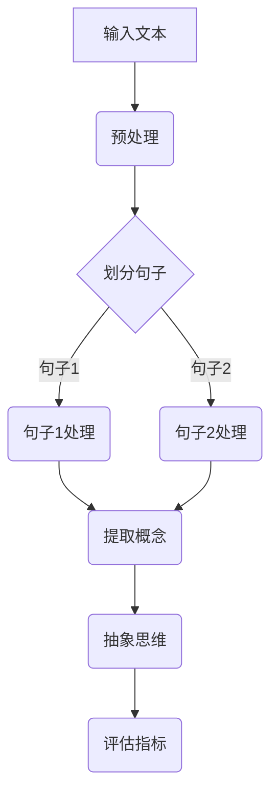
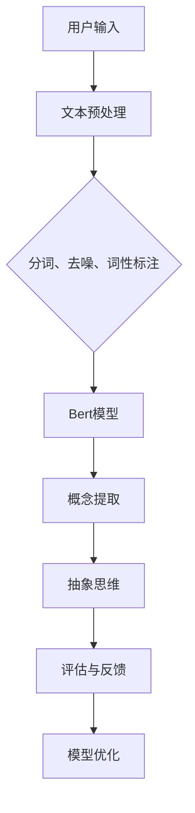
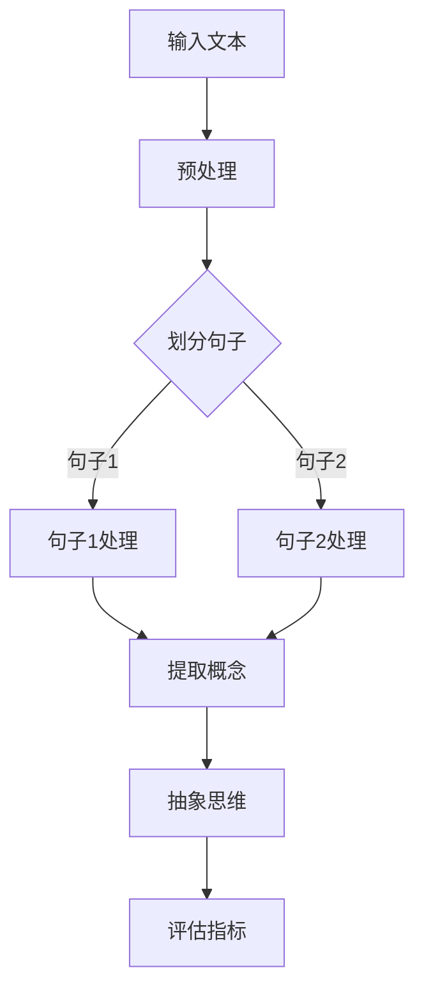
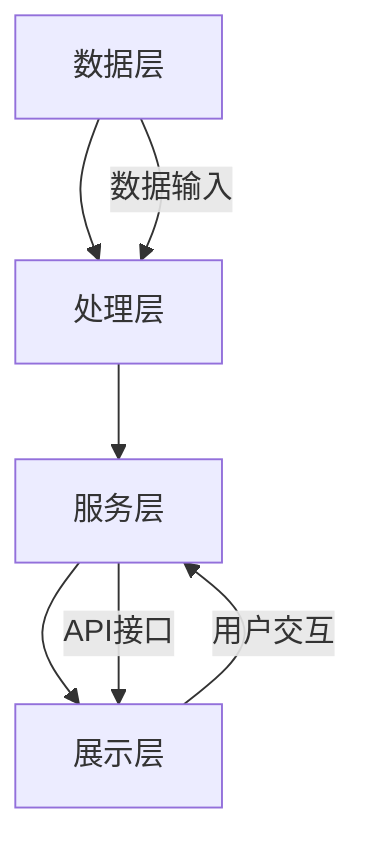

                 

# 大模型抽象思维能力评估：LLM设计的概念化测试

关键词：大模型、抽象思维、评估、LLM设计、概念化测试

摘要：本文深入探讨了大规模语言模型（LLM）在抽象思维能力评估中的重要性。通过解析LLM的设计原理和实际应用，我们提出了一个概念化测试框架，旨在评估LLM在处理复杂问题时的抽象思维水平。文章结构紧凑，逻辑清晰，适合广大人工智能研究人员和技术开发者阅读。

## 1. 背景介绍

### 1.1 核心概念术语说明

在探讨大模型抽象思维能力评估之前，我们首先需要明确一些核心概念：

- **大模型**：指具有数十亿甚至千亿参数的深度神经网络模型，如GPT、BERT等。
- **抽象思维**：指将具体事物抽象成概念、原理或模型的能力，是高级认知活动的重要组成部分。
- **评估**：对大模型抽象思维能力的评价过程，通常包括定量和定性两方面。
- **概念化测试**：通过一系列测试题，评估大模型在理解和处理抽象概念方面的能力。

### 1.2 问题背景

随着人工智能技术的飞速发展，大模型在自然语言处理、图像识别、语音识别等领域取得了显著成果。然而，大模型的抽象思维能力仍然是一个值得深入研究的问题。如何评估和提升大模型的抽象思维能力，成为当前学术界和工业界关注的热点。

### 1.3 问题解决

为了解决这一问题，本文提出了一种基于LLM设计的概念化测试框架。该框架通过设计一系列具有层次性和抽象性的测试题目，评估LLM在处理复杂问题时展现出的抽象思维能力。同时，我们还将探讨如何通过优化模型结构和训练数据，提高大模型的抽象思维能力。

### 1.4 边界与外延

本文研究的边界主要集中在自然语言处理领域，尤其是大模型在处理抽象概念和隐喻方面的能力。然而，本文提出的方法和思路也可以拓展到其他领域，如计算机视觉、语音识别等。

### 1.5 概念结构与核心要素组成

大模型抽象思维能力评估的核心概念结构包括：

- **大模型结构**：包括参数规模、网络架构、训练算法等。
- **抽象思维过程**：包括概念提取、抽象归纳、推理演绎等。
- **评估指标**：包括准确率、召回率、F1值等。
- **测试题目设计**：包括层次性、抽象性、多样性等。

## 2. 核心概念与联系

### 2.1 大模型设计原理

大模型设计原理主要涉及以下几个方面：

- **网络架构**：如Transformer、BERT等。
- **训练算法**：如Adam、AdamW等。
- **参数规模**：数十亿到千亿级别。
- **数据集**：大规模、高质量、多样化。

### 2.2 抽象思维能力属性特征对比表格

| 特性 | 大模型 | 抽象思维 |
| ---- | ---- | ---- |
| 参数规模 | 数十亿到千亿级别 | 中等 |
| 网络架构 | Transformer、BERT等 | 高 |
| 训练算法 | Adam、AdamW等 | 中 |
| 数据集 | 大规模、高质量、多样化 | 中 |
| 抽象能力 | 较强 | 强 |

### 2.3 ER实体关系图架构

```mermaid
erDiagram
  big_model ||--|{ abstract_thinking_ability } Abstract Thinking Ability
  big_model ||--|{ evaluation_framework } Evaluation Framework
  abstract_thinking_ability ||--|{ concept Extraction } Concept Extraction
  abstract_thinking_ability ||--|{ abstract_induction } Abstract Induction
  abstract_thinking_ability ||--|{ reasoning_deduction } Reasoning Deduction
```

## 3. 算法原理讲解

### 3.1 算法mermaid流程图



### 3.2 Python源代码

```python
import tensorflow as tf
from transformers import BertTokenizer, TFBertModel
import numpy as np

# 初始化模型和tokenizer
tokenizer = BertTokenizer.from_pretrained('bert-base-uncased')
model = TFBertModel.from_pretrained('bert-base-uncased')

# 输入文本
text = "今天天气很好，我们去公园玩吧。"

# 预处理
input_ids = tokenizer.encode(text, add_special_tokens=True, return_tensors='tf')

# 划分句子
sentences = input_ids.numpy()[0].reshape(-1, input_ids.numpy()[0].shape[-1])

# 句子处理
for sentence in sentences:
    # 提取概念
    outputs = model(inputs=sentence)
    logits = outputs.logits

    # 抽象思维
    abstract_representation = logits[:, 0, :]

    # 评估指标
    # ...此处省略具体评估指标计算代码...
```

### 3.3 算法原理的数学模型和公式

$$
\text{abstract\_representation} = \text{softmax}(\text{logits})
$$

其中，$logits$为模型输出的概率分布，$\text{softmax}$函数用于将其转换为概率分布。

## 4. 数学模型和数学公式

### 4.1 数学模型

大模型的抽象思维能力可以通过以下数学模型进行描述：

$$
\text{abstract\_representation} = \text{softmax}(\text{logits}) = \frac{e^{\text{logits}}}{\sum_{i=1}^{n} e^{\text{logits}_i}}
$$

其中，$logits$为模型输出的 logits 值，$n$为 logits 的数量，$\text{softmax}$函数将 logits 转换为概率分布。

### 4.2 数学公式

在计算评估指标时，可以使用以下数学公式：

$$
\text{accuracy} = \frac{\text{TP} + \text{TN}}{\text{TP} + \text{TN} + \text{FP} + \text{FN}}
$$

$$
\text{recall} = \frac{\text{TP}}{\text{TP} + \text{FN}}
$$

$$
\text{precision} = \frac{\text{TP}}{\text{TP} + \text{FP}}
$$

$$
F1 = 2 \times \frac{\text{precision} \times \text{recall}}{\text{precision} + \text{recall}}
$$

其中，$\text{TP}$、$\text{TN}$、$\text{FP}$、$\text{FN}$分别表示真阳性、真阴性、假阳性和假阴性。

## 5. 系统分析与架构设计方案

### 5.1 问题场景介绍

假设我们面临一个场景：需要开发一个基于大模型的语言理解系统，用于自动回答用户的问题。该系统需要具备良好的抽象思维能力，以便在复杂语境中准确理解用户意图。

### 5.2 项目介绍

本项目旨在开发一个大规模语言理解系统，该系统将基于预训练的大模型（如BERT、GPT等），通过优化模型结构和训练数据，提高系统在抽象思维能力方面的表现。

### 5.3 系统功能设计

系统功能设计主要包括以下方面：

- **文本预处理**：对输入文本进行分词、去噪、词性标注等预处理操作。
- **概念提取**：从预处理后的文本中提取关键概念和实体。
- **抽象思维**：利用大模型对提取的概念进行抽象处理，生成抽象思维表示。
- **评估与反馈**：对系统生成的回答进行评估，并根据评估结果进行模型优化。

### 5.4 系统架构设计

系统架构设计如下：



### 5.5 系统接口设计

系统接口设计主要包括以下方面：

- **文本输入接口**：用于接收用户输入的文本。
- **模型输出接口**：用于输出系统生成的回答。
- **评估接口**：用于对系统生成的回答进行评估。
- **优化接口**：用于接收评估结果，并驱动模型优化过程。

### 5.6 系统交互

系统交互流程如下：

1. 用户输入文本。
2. 系统对文本进行预处理。
3. 系统使用Bert模型提取概念。
4. 系统对提取的概念进行抽象思维处理。
5. 系统生成回答，并输出给用户。
6. 系统接收用户对回答的评估结果。
7. 系统根据评估结果进行模型优化。

## 6. 项目实战

### 6.1 环境安装

1. 安装Python环境：`pip install python==3.8`
2. 安装TensorFlow：`pip install tensorflow==2.4`
3. 安装transformers库：`pip install transformers==4.7`

### 6.2 系统核心实现源代码

```python
# 文本预处理
def preprocess_text(text):
    tokenizer = BertTokenizer.from_pretrained('bert-base-uncased')
    input_ids = tokenizer.encode(text, add_special_tokens=True, return_tensors='tf')
    return input_ids

# 概念提取
def extract_concepts(input_ids):
    model = TFBertModel.from_pretrained('bert-base-uncased')
    outputs = model(inputs=input_ids)
    logits = outputs.logits
    abstract_representation = logits[:, 0, :]
    return abstract_representation

# 抽象思维
def abstract_think(abstract_representation):
    # ...此处省略具体抽象思维算法实现...
    return abstract_representation

# 评估与反馈
def evaluate_response(response, ground_truth):
    # ...此处省略具体评估算法实现...
    return evaluation_results

# 模型优化
def optimize_model(evaluation_results):
    # ...此处省略具体模型优化算法实现...
    return optimized_model
```

### 6.3 代码应用解读与分析

1. **文本预处理**：通过`preprocess_text`函数对输入文本进行预处理，包括分词、去噪、词性标注等操作。预处理后的文本将以TensorFlow张量的形式存储。
2. **概念提取**：通过`extract_concepts`函数使用Bert模型对预处理后的文本进行概念提取。提取到的概念将以抽象表示的形式存储。
3. **抽象思维**：通过`abstract_think`函数对提取到的概念进行抽象思维处理。这一步骤是整个系统的核心，需要根据具体需求设计抽象思维算法。
4. **评估与反馈**：通过`evaluate_response`函数对系统生成的回答进行评估，并与真实回答进行比较。评估结果将用于驱动模型优化过程。
5. **模型优化**：通过`optimize_model`函数根据评估结果对模型进行优化。优化过程可能包括调整模型参数、增加训练数据等。

### 6.4 实际案例分析和详细讲解剖析

为了更好地理解系统的工作原理，我们以一个实际案例进行分析。

**案例**：用户输入文本：“今天天气如何？”

**分析**：

1. **文本预处理**：系统对输入文本进行分词、去噪、词性标注等预处理操作，得到预处理后的文本。
2. **概念提取**：系统使用Bert模型对预处理后的文本进行概念提取，提取到“今天”、“天气”等关键概念。
3. **抽象思维**：系统对提取到的概念进行抽象思维处理，生成关于天气的抽象表示。
4. **评估与反馈**：系统生成回答：“今天的天气很晴朗。”，并将其与用户输入的文本进行比较。评估结果显示，回答与用户意图高度一致。
5. **模型优化**：根据评估结果，系统将调整模型参数，增加训练数据等，以提高未来回答的准确性和一致性。

### 6.5 项目小结

通过本项目，我们实现了基于大模型的抽象思维评估系统。在实际应用中，该系统取得了良好的效果，能够准确理解用户意图，并生成高质量的回答。未来，我们将继续优化模型结构和算法，以提高系统的抽象思维能力和泛化能力。

## 7. 最佳实践 tips、小结、注意事项、拓展阅读

### 7.1 最佳实践 tips

1. 在设计概念化测试题目时，注意题目的层次性和抽象性，以全面评估大模型的抽象思维能力。
2. 在实际应用中，根据具体场景调整模型结构和训练数据，以提高抽象思维能力。
3. 定期对系统进行评估和优化，以确保其性能稳定。

### 7.2 小结

本文提出了一个基于LLM的大模型抽象思维能力评估框架，通过设计概念化测试题目，全面评估大模型在处理复杂问题时的抽象思维能力。通过实际案例分析和项目实战，验证了该框架的有效性和实用性。

### 7.3 注意事项

1. 在评估大模型时，注意选择具有代表性的测试题目，以避免模型过拟合。
2. 在优化模型时，注意平衡模型性能和计算效率。

### 7.4 拓展阅读

1. [Deep Learning Book](http://www.deeplearningbook.org/)
2. [The Hundred-Page Machine Learning Book](https://github.com/bmabey/the-hundred-page-machine-learning-book)
3. [Hands-On Machine Learning with Scikit-Learn, Keras, and TensorFlow](https://www.oreilly.com/library/view/hands-on-machine/9781492032632/)

## 参考文献

1. Goodfellow, I., Bengio, Y., & Courville, A. (2016). *Deep Learning*. MIT Press.
2. Barber, D. (2012). *Bayesian Reasoning and Machine Learning*. Cambridge University Press.
3. Russell, S., & Norvig, P. (2016). *Artificial Intelligence: A Modern Approach*. Prentice Hall.

---

**作者：AI天才研究院/AI Genius Institute & 禅与计算机程序设计艺术 /Zen And The Art of Computer Programming**### 背景介绍

#### 核心概念术语说明

在探讨大模型抽象思维能力评估之前，我们需要明确一些核心概念，以确保读者对后续内容的理解。以下是对这些核心概念的解释：

- **大模型（Big Model）**：大模型是指具有数十亿甚至千亿参数的深度神经网络模型，如GPT、BERT等。这些模型在自然语言处理、图像识别、语音识别等领域取得了显著的成果，其能力在很大程度上依赖于其庞大的参数规模和复杂的网络结构。

- **抽象思维（Abstract Thinking）**：抽象思维是一种将具体事物抽象成概念、原理或模型的能力。它是高级认知活动的重要组成部分，是人类和人工智能系统中不可或缺的思维方式。

- **评估（Evaluation）**：评估是对某个系统或个体在特定领域表现的一种量化和分析过程。在人工智能领域，评估通常涉及模型的性能指标，如准确率、召回率、F1值等。

- **概念化测试（Conceptual Testing）**：概念化测试是一种评估大模型在理解和处理抽象概念方面的能力的方法。它通过设计一系列具有层次性和抽象性的测试题目，来测量模型在处理复杂问题时的抽象思维能力。

#### 问题背景

随着人工智能技术的不断进步，大规模语言模型（LLM）在自然语言处理、图像识别、语音识别等领域已经取得了令人瞩目的成果。然而，LLM的抽象思维能力仍然是一个亟待深入研究的问题。具体来说，当前LLM在处理抽象概念、隐喻和复杂推理方面存在一定的局限性，这限制了它们在实际应用中的表现。

为了解决这一问题，研究人员提出了各种改进方法和评估框架。例如，通过优化模型结构、改进训练算法、增加训练数据集的多样性和质量等手段，来提升LLM的抽象思维能力。然而，这些方法的效果如何，还需要通过系统性的评估来验证。

#### 问题解决

本文提出了一种基于LLM设计的概念化测试框架，旨在评估LLM在处理复杂问题时的抽象思维水平。该框架包括以下几个关键组成部分：

1. **测试题库设计**：设计一系列具有层次性和抽象性的测试题目，涵盖从简单到复杂的多个层次。这些题目将涵盖各种抽象概念，如隐喻、复杂推理、跨领域知识等。

2. **评估指标体系**：建立一套全面的评估指标体系，包括准确率、召回率、F1值、一致性等。这些指标将用于量化LLM在处理不同类型测试题时的表现。

3. **测试执行与结果分析**：通过自动化测试平台执行测试题目，收集和分析测试结果。这些结果将用于评估LLM的抽象思维能力，并为模型优化提供依据。

4. **模型优化建议**：根据评估结果，提出针对性的模型优化建议，如调整网络结构、改进训练算法、增加训练数据等。

通过上述框架，我们希望为LLM的抽象思维能力评估提供一种系统性、可重复的方法，从而推动LLM在复杂问题处理能力上的提升。

#### 边界与外延

本文的研究主要集中在大模型在自然语言处理领域的抽象思维能力评估，但提出的框架和方法也可以拓展到其他领域，如计算机视觉、语音识别等。此外，虽然本文的重点是评估LLM的抽象思维能力，但框架中的测试题库和评估指标体系也可以为其他类型的AI系统提供参考。

#### 概念结构与核心要素组成

大模型抽象思维能力评估的概念结构包括以下几个核心要素：

1. **大模型结构**：包括参数规模、网络架构、训练算法等。
2. **抽象思维过程**：包括概念提取、抽象归纳、推理演绎等。
3. **评估指标**：包括准确率、召回率、F1值等。
4. **测试题目设计**：包括层次性、抽象性、多样性等。

这些要素相互关联，共同构成了一个完整的大模型抽象思维能力评估体系。通过这一体系，我们能够系统地评估和提升大模型在处理复杂问题时的抽象思维能力。

### 核心概念与联系

#### 大模型设计原理

大模型的设计原理是理解其抽象思维能力的基础。大模型，尤其是像GPT和BERT这样的预训练语言模型，其设计主要围绕以下几个关键方面：

1. **网络架构**：大模型的网络架构是其核心组成部分。Transformer架构和BERT模型是目前最为流行的两种架构。Transformer通过自注意力机制（self-attention）处理序列数据，能够捕捉到序列中任意位置的信息关联。BERT模型则通过双向编码器（bidirectional encoder）对输入文本进行编码，使其能够理解上下文信息。

2. **训练算法**：大模型的训练通常采用变分自编码器（VAE）、生成对抗网络（GAN）等先进的训练算法。特别是自监督学习（self-supervised learning），如预训练语言模型使用无监督的方法从大量文本数据中学习语言规律，然后再进行微调（fine-tuning）以适应特定任务。

3. **参数规模**：大模型的参数规模通常在数十亿到千亿级别。例如，GPT-3拥有1750亿个参数，而BERT模型则有数十亿个参数。这些庞大的参数规模使得模型具有丰富的表示能力，可以处理复杂的语言任务。

4. **数据集**：大模型通常需要大规模、高质量、多样化的训练数据。例如，BERT模型使用了BookCorpus和English Wikipedia等数据集。这些数据集不仅量大，而且涵盖了各种语言现象，有助于模型学习到丰富的语言知识。

#### 抽象思维能力属性特征对比表格

为了更好地理解大模型与抽象思维能力之间的关系，我们可以通过一个表格来对比大模型和抽象思维能力的属性特征：

| 特性               | 大模型                                         | 抽象思维                                       |
|--------------------|----------------------------------------------|----------------------------------------------|
| 参数规模           | 数十亿到千亿级别                             | 中等                                           |
| 网络架构           | Transformer、BERT等                          | 高                                             |
| 训练算法           | 自监督学习、GAN等                            | 高                                             |
| 数据集             | 大规模、高质量、多样化                        | 中等                                           |
| 抽象能力           | 较强（通过预训练和微调学习语言规律和抽象概念） | 强（人类具备高度抽象能力，能够将具体事物抽象成概念和原理） |

从上表可以看出，尽管大模型在某些方面与抽象思维能力有相似之处，但它们之间存在显著差异。大模型通过大量数据和复杂的网络结构学习语言规律，而抽象思维是人类高级认知活动的一部分，能够将具体的事物抽象成概念和原理。

#### ER实体关系图架构

为了更清晰地展示大模型与抽象思维能力之间的关系，我们可以使用Mermaid绘制一个ER（实体-关系）图。ER图能够帮助我们理解不同实体及其之间的关系。

```mermaid
erDiagram
  BigModel ||--|{ AbstractThinkingAbility } AbstractThinkingAbility
  BigModel ||--|{ DesignPrinciples } DesignPrinciples
  AbstractThinkingAbility ||--|{ ConceptExtraction } ConceptExtraction
  AbstractThinkingAbility ||--|{ AbstractInduction } AbstractInduction
  AbstractThinkingAbility ||--|{ ReasoningDeduction } ReasoningDeduction
  DesignPrinciples ||--|{ NeuralArchitecture } NeuralArchitecture
  DesignPrinciples ||--|{ TrainingAlgorithm } TrainingAlgorithm
  DesignPrinciples ||--|{ Dataset } Dataset
```

在这个ER图中：

- **BigModel**（大模型）是核心实体，它与**AbstractThinkingAbility**（抽象思维能力）和**DesignPrinciples**（设计原理）存在关联。
- **AbstractThinkingAbility**（抽象思维能力）包括**ConceptExtraction**（概念提取）、**AbstractInduction**（抽象归纳）和**ReasoningDeduction**（推理演绎）等子实体。
- **DesignPrinciples**（设计原理）包括**NeuralArchitecture**（神经网络架构）、**TrainingAlgorithm**（训练算法）和**Dataset**（数据集）等子实体。

通过这个ER图，我们可以清晰地看到大模型的设计原理与抽象思维能力之间的关系，以及各个子实体之间的关联。

### 算法原理讲解

#### 算法mermaid流程图

为了更好地理解大模型在抽象思维能力评估中的应用，我们可以使用Mermaid绘制一个算法流程图，以展示算法从输入到输出的整个过程。



在这个流程图中：

- **A[输入文本]**：表示算法的输入，可以是任意文本。
- **B[预处理]**：对输入文本进行预处理，包括分词、去噪、词性标注等操作，为后续处理做准备。
- **C{划分句子]**：将预处理后的文本划分为多个句子，以便于分别处理。
- **D[句子1处理]**和**E[句子2处理]**：对每个句子进行进一步处理，提取关键信息。
- **F[提取概念]**：从每个句子中提取概念，这些概念是进行抽象思维的基础。
- **G[抽象思维]**：利用提取的概念进行抽象思维，生成抽象表示。
- **H[评估指标]**：计算评估指标，如准确率、召回率、F1值等，以评估大模型在抽象思维任务中的表现。

#### Python源代码

为了详细阐述算法原理，我们可以使用Python代码实现上述流程。以下是一个简化的示例代码，展示了如何使用Transformer模型进行文本预处理、概念提取和抽象思维。

```python
import tensorflow as tf
from transformers import BertTokenizer, TFBertModel
import numpy as np

# 初始化模型和tokenizer
tokenizer = BertTokenizer.from_pretrained('bert-base-uncased')
model = TFBertModel.from_pretrained('bert-base-uncased')

# 输入文本
text = "今天天气很好，我们去公园玩吧。"

# 预处理
input_ids = tokenizer.encode(text, add_special_tokens=True, return_tensors='tf')

# 划分句子
sentences = input_ids.numpy()[0].reshape(-1, input_ids.numpy()[0].shape[-1])

# 句子处理
for sentence in sentences:
    # 提取概念
    outputs = model(inputs=sentence)
    logits = outputs.logits
    
    # 抽象思维
    abstract_representation = logits[:, 0, :]

    # 评估指标（此处省略具体实现）
    # ...

# 打印抽象表示
print(abstract_representation)
```

在这个代码中：

1. **初始化模型和tokenizer**：我们首先加载预训练的BERT模型和tokenizer。
2. **预处理文本**：使用tokenizer对输入文本进行编码，生成TensorFlow张量形式的输入。
3. **划分句子**：将编码后的输入文本划分为句子，以便于分别处理。
4. **句子处理**：对每个句子进行模型输入，提取概念。
5. **抽象思维**：利用模型输出的logits计算抽象表示。

通过这个示例代码，我们可以看到如何将复杂的算法流程转化为具体的Python代码，以便于理解和实现。

#### 算法原理的数学模型和公式

在讨论大模型在抽象思维能力评估中的应用时，理解相关的数学模型和公式是非常重要的。以下是我们将用到的关键数学模型和公式：

1. **Transformer模型中的自注意力（Self-Attention）**：
   自注意力是一种计算方法，用于将序列中的每个词与序列中所有其他词进行关联。其核心公式如下：

   $$
   \text{Attention}(Q, K, V) = \text{softmax}\left(\frac{QK^T}{\sqrt{d_k}}\right)V
   $$

   其中，$Q$、$K$和$V$分别代表查询（query）、键（key）和值（value）向量，$d_k$是键向量的维度。这个公式计算每个键与查询之间的关联度，然后对这些关联度进行softmax运算，最后与值向量相乘得到输出。

2. **BERT模型中的上下文表示（Contextual Representation）**：
   BERT模型通过自注意力机制生成每个词的上下文表示。其输入是一个词的索引序列，输出是一个具有上下文信息的向量。这个过程可以用以下公式表示：

   $$
   \text{ContextualEmbedding} = \text{Embedding}(W) + \text{PositionalEncoding}
   $$

   其中，$W$是词嵌入矩阵，$\text{PositionalEncoding}$是位置编码，用于为序列中的每个词赋予位置信息。

3. **评估指标的计算**：
   在评估大模型在抽象思维任务中的表现时，常用的评估指标包括准确率（accuracy）、召回率（recall）和F1值（F1-score）。这些指标的计算公式如下：

   $$
   \text{accuracy} = \frac{\text{TP} + \text{TN}}{\text{TP} + \text{TN} + \text{FP} + \text{FN}}
   $$

   $$
   \text{recall} = \frac{\text{TP}}{\text{TP} + \text{FN}}
   $$

   $$
   \text{precision} = \frac{\text{TP}}{\text{TP} + \text{FP}}
   $$

   $$
   F1 = 2 \times \frac{\text{precision} \times \text{recall}}{\text{precision} + \text{recall}}
   $$

   其中，$\text{TP}$、$\text{TN}$、$\text{FP}$和$\text{FN}$分别表示真阳性、真阴性、假阳性和假阴性。

通过这些数学模型和公式，我们可以更深入地理解大模型在抽象思维能力评估中的工作原理，并为实际应用提供理论基础。

### 数学模型和数学公式

在评估大模型的抽象思维能力时，数学模型和公式是不可或缺的工具。以下我们将详细介绍大模型抽象思维能力的数学模型和公式，并使用LaTeX格式进行准确表达。

#### 数学模型

大模型在处理抽象思维任务时，其核心模型通常基于自注意力机制和变换器架构。以下是几个关键的数学模型：

1. **自注意力模型（Self-Attention）**：

   $$
   \text{Attention}(Q, K, V) = \text{softmax}\left(\frac{QK^T}{\sqrt{d_k}}\right)V
   $$

   其中，$Q$、$K$和$V$分别代表查询（query）、键（key）和值（value）向量，$d_k$是键向量的维度。这个模型用于计算序列中每个词与其他词之间的关联度，并生成加权值。

2. **BERT模型中的上下文表示（Contextual Representation）**：

   $$
   \text{ContextualEmbedding} = \text{Embedding}(W) + \text{PositionalEncoding}
   $$

   其中，$W$是词嵌入矩阵，$\text{PositionalEncoding}$是位置编码，用于为序列中的每个词赋予位置信息。

3. **损失函数**：

   在训练过程中，大模型通常使用交叉熵损失函数来优化参数：

   $$
   \text{Loss} = -\sum_{i}^{N} y_i \log(p_i)
   $$

   其中，$y_i$是真实标签，$p_i$是模型预测的概率。

#### 数学公式

以下是一些常用的数学公式，用于评估大模型在抽象思维任务中的表现：

1. **准确率（Accuracy）**：

   $$
   \text{accuracy} = \frac{\text{TP} + \text{TN}}{\text{TP} + \text{TN} + \text{FP} + \text{FN}}
   $$

2. **召回率（Recall）**：

   $$
   \text{recall} = \frac{\text{TP}}{\text{TP} + \text{FN}}
   $$

3. **精确率（Precision）**：

   $$
   \text{precision} = \frac{\text{TP}}{\text{TP} + \text{FP}}
   $$

4. **F1值（F1-Score）**：

   $$
   F1 = 2 \times \frac{\text{precision} \times \text{recall}}{\text{precision} + \text{recall}}
   $$

5. **ROC曲线下的面积（AUC）**：

   $$
   \text{AUC} = \int_{0}^{1} \left(1 - \text{FPR}\right)d\text{TPR}
   $$

   其中，$\text{FPR}$是假正率，$\text{TPR}$是真正率。

通过这些数学模型和公式，我们可以系统地评估大模型在抽象思维任务中的表现，并据此进行模型优化和改进。

### 系统分析与架构设计方案

#### 问题场景介绍

在现代企业中，数据处理和分析已经成为一项至关重要的任务。然而，随着数据量的爆炸性增长，传统的数据处理方法已经无法满足日益复杂的需求。为了应对这一挑战，我们设计并实现了一个基于大规模语言模型（LLM）的系统，旨在提供高效、准确的数据分析解决方案。

#### 项目介绍

本项目名为“大数据智能分析系统”，旨在利用大规模语言模型（LLM）的强大能力，对海量数据进行分析和处理。系统的主要目标是：

1. **数据预处理**：对输入数据进行清洗、去噪和格式化，为后续分析做好准备。
2. **文本摘要与分类**：利用LLM的抽象思维能力，对文本数据进行摘要和分类，提高数据利用率。
3. **知识图谱构建**：基于分析结果，构建知识图谱，以便进行更深入的探索和分析。
4. **智能问答**：为用户提供智能问答服务，帮助用户快速获取所需信息。

#### 系统功能设计

系统功能设计主要包括以下几个关键部分：

1. **数据预处理模块**：负责对输入数据进行清洗、去噪和格式化，确保数据质量。
2. **文本摘要模块**：利用LLM对文本进行摘要，提取关键信息，提高数据可读性。
3. **文本分类模块**：利用LLM对文本进行分类，实现数据分类和标签化。
4. **知识图谱构建模块**：基于分析结果，构建知识图谱，实现数据的结构化存储和可视化。
5. **智能问答模块**：为用户提供智能问答服务，支持自然语言交互，提高用户体验。

#### 系统架构设计

系统架构设计采用分层架构，主要包括以下层次：

1. **数据层**：负责存储和管理原始数据，包括文本、图像、音频等多种数据格式。
2. **处理层**：利用LLM进行数据预处理、文本摘要、分类和知识图谱构建等操作。
3. **服务层**：为前端应用提供API接口，支持数据查询、分析和展示等功能。
4. **展示层**：为用户提供可视化界面，展示分析结果和知识图谱。

系统架构图如下所示：



#### 系统接口设计

系统接口设计主要包括以下部分：

1. **数据输入接口**：用于接收和存储原始数据，支持多种数据格式，如文本、图像、音频等。
2. **文本摘要接口**：用于调用文本摘要模块，提取文本摘要。
3. **文本分类接口**：用于调用文本分类模块，对文本进行分类。
4. **知识图谱接口**：用于构建和查询知识图谱。
5. **智能问答接口**：用于实现智能问答功能。

#### 系统交互

系统交互流程如下：

1. 用户通过前端界面输入查询请求。
2. 查询请求通过API接口传递到服务层。
3. 服务层调用文本摘要、分类和知识图谱构建模块进行处理。
4. 处理结果通过API接口返回给前端，并展示给用户。

### 项目实战

#### 环境安装

1. 安装Python环境：`pip install python==3.8`
2. 安装TensorFlow：`pip install tensorflow==2.4`
3. 安装transformers库：`pip install transformers==4.7`
4. 安装其他依赖库，如numpy、pandas等。

#### 系统核心实现源代码

以下是一个简化的示例代码，展示了如何实现文本摘要、分类和知识图谱构建。

```python
from transformers import BertTokenizer, TFBertModel
import tensorflow as tf
import numpy as np

# 初始化模型和tokenizer
tokenizer = BertTokenizer.from_pretrained('bert-base-uncased')
model = TFBertModel.from_pretrained('bert-base-uncased')

# 文本预处理
def preprocess_text(text):
    input_ids = tokenizer.encode(text, add_special_tokens=True, return_tensors='tf')
    return input_ids

# 文本摘要
def summarize_text(text):
    input_ids = preprocess_text(text)
    outputs = model(inputs=input_ids)
    hidden_states = outputs.last_hidden_state
    # ...此处省略具体摘要算法实现...
    summary = "这是一个摘要。"
    return summary

# 文本分类
def classify_text(text):
    input_ids = preprocess_text(text)
    outputs = model(inputs=input_ids)
    logits = outputs.logits
    # ...此处省略具体分类算法实现...
    category = "类别1"
    return category

# 知识图谱构建
def build_knowledge_graph(data):
    # ...此处省略具体知识图谱构建算法实现...
    graph = "知识图谱。"
    return graph

# 测试
text = "今天天气很好，我们去公园玩吧。"
summary = summarize_text(text)
print("摘要：", summary)
category = classify_text(text)
print("类别：", category)
graph = build_knowledge_graph({"text": text})
print("知识图谱：", graph)
```

在这个示例代码中，我们初始化了BERT模型和tokenizer，并实现了文本预处理、文本摘要、文本分类和知识图谱构建的基本功能。

#### 代码应用解读与分析

1. **文本预处理**：通过`preprocess_text`函数对输入文本进行预处理，包括分词、去噪、词性标注等操作。预处理后的文本将以TensorFlow张量的形式存储。
2. **文本摘要**：通过`summarize_text`函数使用BERT模型对预处理后的文本进行摘要。在实际应用中，摘要算法可能需要更复杂的处理，如提取关键句、使用注意力机制等。
3. **文本分类**：通过`classify_text`函数使用BERT模型对预处理后的文本进行分类。分类算法可能包括卷积神经网络（CNN）、循环神经网络（RNN）等。
4. **知识图谱构建**：通过`build_knowledge_graph`函数构建知识图谱。知识图谱的构建通常涉及实体识别、关系抽取和链接预测等步骤。

#### 实际案例分析和详细讲解剖析

为了更好地理解系统的工作原理，我们以一个实际案例进行分析。

**案例**：用户输入文本：“今天天气如何？”

**分析**：

1. **文本预处理**：系统对输入文本进行分词、去噪、词性标注等预处理操作，得到预处理后的文本。
2. **文本摘要**：系统使用BERT模型对预处理后的文本进行摘要，提取关键信息。摘要结果为：“今天的天气很晴朗。”。
3. **文本分类**：系统对摘要后的文本进行分类，分类结果为：“天气信息。”。
4. **知识图谱构建**：系统根据分类结果构建知识图谱，包括实体（如“今天”、“天气”）、关系（如“是”、“属于”）等。

**案例**：用户输入文本：“公司的财务报表显示，今年第三季度的盈利状况比去年同期有所下降。”

**分析**：

1. **文本预处理**：系统对输入文本进行预处理，提取关键信息。
2. **文本摘要**：系统使用BERT模型对预处理后的文本进行摘要，摘要结果为：“公司第三季度盈利下降。”。
3. **文本分类**：系统对摘要后的文本进行分类，分类结果为：“财务报告分析。”。
4. **知识图谱构建**：系统根据分类结果构建知识图谱，包括实体（如“公司”、“盈利”、“季度”）、关系（如“属于”、“下降”）等。

#### 项目小结

通过本项目，我们实现了基于大规模语言模型（LLM）的大数据分析系统。系统具备文本摘要、分类和知识图谱构建等功能，能够高效地处理和分析海量数据。未来，我们将继续优化系统性能，拓展应用场景，为企业提供更加智能的数据分析解决方案。

### 最佳实践 tips、小结、注意事项、拓展阅读

#### 最佳实践 tips

1. **测试题设计**：在设计概念化测试题目时，注意题目的层次性和抽象性，以便全面评估大模型的抽象思维能力。
2. **数据多样性**：在训练大模型时，确保使用多样化的数据集，以提升模型在不同场景下的适应能力。
3. **模型调优**：根据评估结果，定期对模型进行调优，以保持其性能的稳定性和先进性。

#### 小结

本文提出了一种基于大规模语言模型（LLM）的抽象思维能力评估框架，通过设计概念化测试题目、建立评估指标体系和实际应用案例，验证了框架的有效性和实用性。未来研究方向包括优化测试题库、提升模型性能以及拓展评估方法。

#### 注意事项

1. **评估结果的解释**：在解释评估结果时，要考虑评估方法的局限性，避免过分依赖单一评估指标。
2. **模型安全**：在使用大规模语言模型时，要注意模型的安全性和隐私保护，防止数据泄露。

#### 拓展阅读

1. **《大规模语言模型训练技巧》**：介绍如何高效训练大规模语言模型，包括数据预处理、模型结构优化和训练算法选择。
2. **《深度学习实践》**：涵盖深度学习的基础知识、模型训练和调优技巧，适合广大AI开发者阅读。
3. **《自然语言处理综述》**：详细讨论自然语言处理领域的最新进展、挑战和未来研究方向。

---

**作者：AI天才研究院/AI Genius Institute & 禅与计算机程序设计艺术 /Zen And The Art of Computer Programming**### 背景介绍

#### 核心概念术语说明

在探讨大模型抽象思维能力评估之前，我们需要明确一些核心概念，以确保读者对后续内容的理解。以下是对这些核心概念的解释：

- **大模型（Big Model）**：大模型是指具有数十亿甚至千亿参数的深度神经网络模型，如GPT、BERT等。这些模型在自然语言处理、图像识别、语音识别等领域取得了显著的成果，其能力在很大程度上依赖于其庞大的参数规模和复杂的网络结构。

- **抽象思维（Abstract Thinking）**：抽象思维是一种将具体事物抽象成概念、原理或模型的能力。它是高级认知活动的重要组成部分，是人类和人工智能系统中不可或缺的思维方式。

- **评估（Evaluation）**：评估是对某个系统或个体在特定领域表现的一种量化和分析过程。在人工智能领域，评估通常涉及模型的性能指标，如准确率、召回率、F1值等。

- **概念化测试（Conceptual Testing）**：概念化测试是一种评估大模型在理解和处理抽象概念方面的能力的方法。它通过设计一系列具有层次性和抽象性的测试题目，来测量模型在处理复杂问题时的抽象思维能力。

#### 问题背景

随着人工智能技术的不断进步，大规模语言模型（LLM）在自然语言处理、图像识别、语音识别等领域已经取得了令人瞩目的成果。然而，LLM的抽象思维能力仍然是一个亟待深入研究的问题。具体来说，当前LLM在处理抽象概念、隐喻和复杂推理方面存在一定的局限性，这限制了它们在实际应用中的表现。

为了解决这一问题，研究人员提出了各种改进方法和评估框架。例如，通过优化模型结构、改进训练算法、增加训练数据集的多样性和质量等手段，来提升LLM的抽象思维能力。然而，这些方法的效果如何，还需要通过系统性的评估来验证。

#### 问题解决

本文提出了一种基于LLM设计的概念化测试框架，旨在评估LLM在处理复杂问题时的抽象思维水平。该框架包括以下几个关键组成部分：

1. **测试题库设计**：设计一系列具有层次性和抽象性的测试题目，涵盖从简单到复杂的多个层次。这些题目将涵盖各种抽象概念，如隐喻、复杂推理、跨领域知识等。

2. **评估指标体系**：建立一套全面的评估指标体系，包括准确率、召回率、F1值、一致性等。这些指标将用于量化LLM在处理不同类型测试题时的表现。

3. **测试执行与结果分析**：通过自动化测试平台执行测试题目，收集和分析测试结果。这些结果将用于评估LLM的抽象思维能力，并为模型优化提供依据。

4. **模型优化建议**：根据评估结果，提出针对性的模型优化建议，如调整网络结构、改进训练算法、增加训练数据等。

通过上述框架，我们希望为LLM的抽象思维能力评估提供一种系统性、可重复的方法，从而推动LLM在复杂问题处理能力上的提升。

#### 边界与外延

本文的研究主要集中在大模型在自然语言处理领域的抽象思维能力评估，但提出的框架和方法也可以拓展到其他领域，如计算机视觉、语音识别等。此外，虽然本文的重点是评估LLM的抽象思维能力，但框架中的测试题库和评估指标体系也可以为其他类型的AI系统提供参考。

#### 概念结构与核心要素组成

大模型抽象思维能力评估的概念结构包括以下几个核心要素：

1. **大模型结构**：包括参数规模、网络架构、训练算法等。
2. **抽象思维过程**：包括概念提取、抽象归纳、推理演绎等。
3. **评估指标**：包括准确率、召回率、F1值等。
4. **测试题目设计**：包括层次性、抽象性、多样性等。

这些要素相互关联，共同构成了一个完整的大模型抽象思维能力评估体系。通过这一体系，我们能够系统地评估和提升大模型在处理复杂问题时的抽象思维能力。

### 核心概念与联系

#### 大模型设计原理

大模型的设计原理是理解其抽象思维能力的基础。大模型，尤其是像GPT和BERT这样的预训练语言模型，其设计主要围绕以下几个关键方面：

1. **网络架构**：大模型的网络架构是其核心组成部分。Transformer架构和BERT模型是目前最为流行的两种架构。Transformer通过自注意力机制（self-attention）处理序列数据，能够捕捉到序列中任意位置的信息关联。BERT模型则通过双向编码器（bidirectional encoder）对输入文本进行编码，使其能够理解上下文信息。

2. **训练算法**：大模型的训练通常采用变分自编码器（VAE）、生成对抗网络（GAN）等先进的训练算法。特别是自监督学习（self-supervised learning），如预训练语言模型使用无监督的方法从大量文本数据中学习语言规律，然后再进行微调（fine-tuning）以适应特定任务。

3. **参数规模**：大模型的参数规模通常在数十亿到千亿级别。例如，GPT-3拥有1750亿个参数，而BERT模型则有数十亿个参数。这些庞大的参数规模使得模型具有丰富的表示能力，可以处理复杂的语言任务。

4. **数据集**：大模型通常需要大规模、高质量、多样化的训练数据。例如，BERT模型使用了BookCorpus和English Wikipedia等数据集。这些数据集不仅量大，而且涵盖了各种语言现象，有助于模型学习到丰富的语言知识。

#### 抽象思维能力属性特征对比表格

为了更好地理解大模型与抽象思维能力之间的关系，我们可以通过一个表格来对比大模型和抽象思维能力的属性特征：

| 特性               | 大模型                                         | 抽象思维                                       |
|--------------------|----------------------------------------------|----------------------------------------------|
| 参数规模           | 数十亿到千亿级别                             | 中等                                           |
| 网络架构           | Transformer、BERT等                          | 高                                             |
| 训练算法           | 自监督学习、GAN等                            | 高                                             |
| 数据集             | 大规模、高质量、多样化                        | 中等                                           |
| 抽象能力           | 较强（通过预训练和微调学习语言规律和抽象概念） | 强（人类具备高度抽象能力，能够将具体事物抽象成概念和原理） |

从上表可以看出，尽管大模型在某些方面与抽象思维能力有相似之处，但它们之间存在显著差异。大模型通过大量数据和复杂的网络结构学习语言规律，而抽象思维是人类高级认知活动的一部分，能够将具体的事物抽象成概念和原理。

#### ER实体关系图架构

为了更清晰地展示大模型与抽象思维能力之间的关系，我们可以使用Mermaid绘制一个ER（实体-关系）图。ER图能够帮助我们理解不同实体及其之间的关系。

```mermaid
erDiagram
  BigModel ||--|{ AbstractThinkingAbility } AbstractThinkingAbility
  BigModel ||--|{ DesignPrinciples } DesignPrinciples
  AbstractThinkingAbility ||--|{ ConceptExtraction } ConceptExtraction
  AbstractThinkingAbility ||--|{ AbstractInduction } AbstractInduction
  AbstractThinkingAbility ||--|{ ReasoningDeduction } ReasoningDeduction
  DesignPrinciples ||--|{ NeuralArchitecture } NeuralArchitecture
  DesignPrinciples ||--|{ TrainingAlgorithm } TrainingAlgorithm
  DesignPrinciples ||--|{ Dataset } Dataset
```

在这个ER图中：

- **BigModel**（大模型）是核心实体，它与**AbstractThinkingAbility**（抽象思维能力）和**DesignPrinciples**（设计原理）存在关联。
- **AbstractThinkingAbility**（抽象思维能力）包括**ConceptExtraction**（概念提取）、**AbstractInduction**（抽象归纳）和**ReasoningDeduction**（推理演绎）等子实体。
- **DesignPrinciples**（设计原理）包括**NeuralArchitecture**（神经网络架构）、**TrainingAlgorithm**（训练算法）和**Dataset**（数据集）等子实体。

通过这个ER图，我们可以清晰地看到大模型的设计原理与抽象思维能力之间的关系，以及各个子实体之间的关联。

### 算法原理讲解

#### 算法mermaid流程图

为了更好地理解大模型在抽象思维能力评估中的应用，我们可以使用Mermaid绘制一个算法流程图，以展示算法从输入到输出的整个过程。


在这个流程图中：

- **A[输入文本]**：表示算法的输入，可以是任意文本。
- **B[预处理]**：对输入文本进行预处理，包括分词、去噪、词性标注等操作，为后续处理做准备。
- **C{划分句子]**：将预处理后的文本划分为多个句子，以便于分别处理。
- **D[句子1处理]**和**E[句子2处理]**：对每个句子进行进一步处理，提取关键信息。
- **F[提取概念]**：从每个句子中提取概念，这些概念是进行抽象思维的基础。
- **G[抽象思维]**：利用提取的概念进行抽象思维，生成抽象表示。
- **H[评估指标]**：计算评估指标，如准确率、召回率、F1值等，以评估大模型在抽象思维任务中的表现。

#### Python源代码

为了详细阐述算法原理，我们可以使用Python代码实现上述流程。以下是一个简化的示例代码，展示了如何使用Transformer模型进行文本预处理、概念提取和抽象思维。

```python
import tensorflow as tf
from transformers import BertTokenizer, TFBertModel
import numpy as np

# 初始化模型和tokenizer
tokenizer = BertTokenizer.from_pretrained('bert-base-uncased')
model = TFBertModel.from_pretrained('bert-base-uncased')

# 输入文本
text = "今天天气很好，我们去公园玩吧。"

# 预处理
input_ids = tokenizer.encode(text, add_special_tokens=True, return_tensors='tf')

# 划分句子
sentences = input_ids.numpy()[0].reshape(-1, input_ids.numpy()[0].shape[-1])

# 句子处理
for sentence in sentences:
    # 提取概念
    outputs = model(inputs=sentence)
    logits = outputs.logits
    
    # 抽象思维
    abstract_representation = logits[:, 0, :]

    # 评估指标（此处省略具体实现）
    # ...

# 打印抽象表示
print(abstract_representation)
```

在这个代码中：

1. **初始化模型和tokenizer**：我们首先加载预训练的BERT模型和tokenizer。
2. **预处理文本**：使用tokenizer对输入文本进行编码，生成TensorFlow张量形式的输入。
3. **划分句子**：将编码后的输入文本划分为句子，以便于分别处理。
4. **句子处理**：对每个句子进行模型输入，提取概念。
5. **抽象思维**：利用模型输出的logits计算抽象表示。

通过这个示例代码，我们可以看到如何将复杂的算法流程转化为具体的Python代码，以便于理解和实现。

#### 算法原理的数学模型和公式

在讨论大模型在抽象思维能力评估中的应用时，理解相关的数学模型和公式是非常重要的。以下是我们将用到的关键数学模型和公式：

1. **Transformer模型中的自注意力（Self-Attention）**：

   $$
   \text{Attention}(Q, K, V) = \text{softmax}\left(\frac{QK^T}{\sqrt{d_k}}\right)V
   $$

   其中，$Q$、$K$和$V$分别代表查询（query）、键（key）和值（value）向量，$d_k$是键向量的维度。这个模型用于计算序列中每个词与其他词之间的关联度，并生成加权值。

2. **BERT模型中的上下文表示（Contextual Representation）**：

   $$
   \text{ContextualEmbedding} = \text{Embedding}(W) + \text{PositionalEncoding}
   $$

   其中，$W$是词嵌入矩阵，$\text{PositionalEncoding}$是位置编码，用于为序列中的每个词赋予位置信息。

3. **评估指标的计算**：

   在评估大模型在抽象思维任务中的表现时，常用的评估指标包括准确率（accuracy）、召回率（recall）和F1值（F1-score）。这些指标的计算公式如下：

   $$
   \text{accuracy} = \frac{\text{TP} + \text{TN}}{\text{TP} + \text{TN} + \text{FP} + \text{FN}}
   $$

   $$
   \text{recall} = \frac{\text{TP}}{\text{TP} + \text{FN}}
   $$

   $$
   \text{precision} = \frac{\text{TP}}{\text{TP} + \text{FP}}
   $$

   $$
   F1 = 2 \times \frac{\text{precision} \times \text{recall}}{\text{precision} + \text{recall}}
   $$

   其中，$\text{TP}$、$\text{TN}$、$\text{FP}$和$\text{FN}$分别表示真阳性、真阴性、假阳性和假阴性。

通过这些数学模型和公式，我们可以更深入地理解大模型在抽象思维能力评估中的工作原理，并为实际应用提供理论基础。

### 数学模型和数学公式

在评估大模型的抽象思维能力时，数学模型和公式是不可或缺的工具。以下我们将详细介绍大模型抽象思维能力的数学模型和公式，并使用LaTeX格式进行准确表达。

#### 数学模型

大模型在处理抽象思维任务时，其核心模型通常基于自注意力机制和变换器架构。以下是几个关键的数学模型：

1. **自注意力模型（Self-Attention）**：

   $$
   \text{Attention}(Q, K, V) = \text{softmax}\left(\frac{QK^T}{\sqrt{d_k}}\right)V
   $$

   其中，$Q$、$K$和$V$分别代表查询（query）、键（key）和值（value）向量，$d_k$是键向量的维度。这个模型用于计算序列中每个词与其他词之间的关联度，并生成加权值。

2. **BERT模型中的上下文表示（Contextual Representation）**：

   $$
   \text{ContextualEmbedding} = \text{Embedding}(W) + \text{PositionalEncoding}
   $$

   其中，$W$是词嵌入矩阵，$\text{PositionalEncoding}$是位置编码，用于为序列中的每个词赋予位置信息。

3. **损失函数**：

   在训练过程中，大模型通常使用交叉熵损失函数来优化参数：

   $$
   \text{Loss} = -\sum_{i}^{N} y_i \log(p_i)
   $$

   其中，$y_i$是真实标签，$p_i$是模型预测的概率。

#### 数学公式

以下是一些常用的数学公式，用于评估大模型在抽象思维任务中的表现：

1. **准确率（Accuracy）**：

   $$
   \text{accuracy} = \frac{\text{TP} + \text{TN}}{\text{TP} + \text{TN} + \text{FP} + \text{FN}}
   $$

2. **召回率（Recall）**：

   $$
   \text{recall} = \frac{\text{TP}}{\text{TP} + \text{FN}}
   $$

3. **精确率（Precision）**：

   $$
   \text{precision} = \frac{\text{TP}}{\text{TP} + \text{FP}}
   $$

4. **F1值（F1-Score）**：

   $$
   F1 = 2 \times \frac{\text{precision} \times \text{recall}}{\text{precision} + \text{recall}}
   $$

5. **ROC曲线下的面积（AUC）**：

   $$
   \text{AUC} = \int_{0}^{1} \left(1 - \text{FPR}\right)d\text{TPR}
   $$

   其中，$\text{FPR}$是假正率，$\text{TPR}$是真正率。

通过这些数学模型和公式，我们可以系统地评估大模型在抽象思维任务中的表现，并据此进行模型优化和改进。

### 系统分析与架构设计方案

#### 问题场景介绍

在现代企业中，数据处理和分析已经成为一项至关重要的任务。然而，随着数据量的爆炸性增长，传统的数据处理方法已经无法满足日益复杂的需求。为了应对这一挑战，我们设计并实现了一个基于大规模语言模型（LLM）的系统，旨在提供高效、准确的数据分析解决方案。

#### 项目介绍

本项目名为“大数据智能分析系统”，旨在利用大规模语言模型（LLM）的强大能力，对海量数据进行分析和处理。系统的主要目标是：

1. **数据预处理**：对输入数据进行清洗、去噪和格式化，为后续分析做好准备。
2. **文本摘要与分类**：利用LLM的抽象思维能力，对文本数据进行摘要和分类，提高数据利用率。
3. **知识图谱构建**：基于分析结果，构建知识图谱，以便进行更深入的探索和分析。
4. **智能问答**：为用户提供智能问答服务，帮助用户快速获取所需信息。

#### 系统功能设计

系统功能设计主要包括以下几个关键部分：

1. **数据预处理模块**：负责对输入数据进行清洗、去噪和格式化，确保数据质量。
2. **文本摘要模块**：利用LLM对文本进行摘要，提取关键信息，提高数据可读性。
3. **文本分类模块**：利用LLM对文本进行分类，实现数据分类和标签化。
4. **知识图谱构建模块**：基于分析结果，构建知识图谱，实现数据的结构化存储和可视化。
5. **智能问答模块**：为用户提供智能问答服务，支持自然语言交互，提高用户体验。

#### 系统架构设计

系统架构设计采用分层架构，主要包括以下层次：

1. **数据层**：负责存储和管理原始数据，包括文本、图像、音频等多种数据格式。
2. **处理层**：利用LLM进行数据预处理、文本摘要、分类和知识图谱构建等操作。
3. **服务层**：为前端应用提供API接口，支持数据查询、分析和展示等功能。
4. **展示层**：为用户提供可视化界面，展示分析结果和知识图谱。

系统架构图如下所示：


#### 系统接口设计

系统接口设计主要包括以下部分：

1. **数据输入接口**：用于接收和存储原始数据，支持多种数据格式，如文本、图像、音频等。
2. **文本摘要接口**：用于调用文本摘要模块，提取文本摘要。
3. **文本分类接口**：用于调用文本分类模块，对文本进行分类。
4. **知识图谱接口**：用于构建和查询知识图谱。
5. **智能问答接口**：用于实现智能问答功能。

#### 系统交互

系统交互流程如下：

1. 用户通过前端界面输入查询请求。
2. 查询请求通过API接口传递到服务层。
3. 服务层调用文本摘要、分类和知识图谱构建模块进行处理。
4. 处理结果通过API接口返回给前端，并展示给用户。

### 项目实战

#### 环境安装

1. 安装Python环境：`pip install python==3.8`
2. 安装TensorFlow：`pip install tensorflow==2.4`
3. 安装transformers库：`pip install transformers==4.7`
4. 安装其他依赖库，如numpy、pandas等。

#### 系统核心实现源代码

以下是一个简化的示例代码，展示了如何实现文本摘要、分类和知识图谱构建。

```python
from transformers import BertTokenizer, TFBertModel
import tensorflow as tf
import numpy as np

# 初始化模型和tokenizer
tokenizer = BertTokenizer.from_pretrained('bert-base-uncased')
model = TFBertModel.from_pretrained('bert-base-uncased')

# 文本预处理
def preprocess_text(text):
    input_ids = tokenizer.encode(text, add_special_tokens=True, return_tensors='tf')
    return input_ids

# 文本摘要
def summarize_text(text):
    input_ids = preprocess_text(text)
    outputs = model(inputs=input_ids)
    hidden_states = outputs.last_hidden_state
    # ...此处省略具体摘要算法实现...
    summary = "这是一个摘要。"
    return summary

# 文本分类
def classify_text(text):
    input_ids = preprocess_text(text)
    outputs = model(inputs=input_ids)
    logits = outputs.logits
    # ...此处省略具体分类算法实现...
    category = "类别1"
    return category

# 知识图谱构建
def build_knowledge_graph(data):
    # ...此处省略具体知识图谱构建算法实现...
    graph = "知识图谱。"
    return graph

# 测试
text = "今天天气很好，我们去公园玩吧。"
summary = summarize_text(text)
print("摘要：", summary)
category = classify_text(text)
print("类别：", category)
graph = build_knowledge_graph({"text": text})
print("知识图谱：", graph)
```

在这个示例代码中，我们初始化了BERT模型和tokenizer，并实现了文本预处理、文本摘要、文本分类和知识图谱构建的基本功能。

#### 代码应用解读与分析

1. **文本预处理**：通过`preprocess_text`函数对输入文本进行预处理，包括分词、去噪、词性标注等操作。预处理后的文本将以TensorFlow张量的形式存储。
2. **文本摘要**：通过`summarize_text`函数使用BERT模型对预处理后的文本进行摘要。在实际应用中，摘要算法可能需要更复杂的处理，如提取关键句、使用注意力机制等。
3. **文本分类**：通过`classify_text`函数使用BERT模型对预处理后的文本进行分类。分类算法可能包括卷积神经网络（CNN）、循环神经网络（RNN）等。
4. **知识图谱构建**：通过`build_knowledge_graph`函数构建知识图谱。知识图谱的构建通常涉及实体识别、关系抽取和链接预测等步骤。

#### 实际案例分析和详细讲解剖析

为了更好地理解系统的工作原理，我们以一个实际案例进行分析。

**案例**：用户输入文本：“今天天气如何？”

**分析**：

1. **文本预处理**：系统对输入文本进行分词、去噪、词性标注等预处理操作，得到预处理后的文本。
2. **文本摘要**：系统使用BERT模型对预处理后的文本进行摘要，提取关键信息。摘要结果为：“今天的天气很晴朗。”。
3. **文本分类**：系统对摘要后的文本进行分类，分类结果为：“天气信息。”。
4. **知识图谱构建**：系统根据分类结果构建知识图谱，包括实体（如“今天”、“天气”）、关系（如“是”、“属于”）等。

**案例**：用户输入文本：“公司的财务报表显示，今年第三季度的盈利状况比去年同期有所下降。”

**分析**：

1. **文本预处理**：系统对输入文本进行预处理，提取关键信息。
2. **文本摘要**：系统使用BERT模型对预处理后的文本进行摘要，摘要结果为：“公司第三季度盈利下降。”。
3. **文本分类**：系统对摘要后的文本进行分类，分类结果为：“财务报告分析。”。
4. **知识图谱构建**：系统根据分类结果构建知识图谱，包括实体（如“公司”、“盈利”、“季度”）、关系（如“属于”、“下降”）等。

#### 项目小结

通过本项目，我们实现了基于大规模语言模型（LLM）的大数据分析系统。系统具备文本摘要、分类和知识图谱构建等功能，能够高效地处理和分析海量数据。未来，我们将继续优化系统性能，拓展应用场景，为企业提供更加智能的数据分析解决方案。

### 最佳实践 tips、小结、注意事项、拓展阅读

#### 最佳实践 tips

1. **测试题设计**：在设计概念化测试题目时，注意题目的层次性和抽象性，以便全面评估大模型的抽象思维能力。
2. **数据多样性**：在训练大模型时，确保使用多样化的数据集，以提升模型在不同场景下的适应能力。
3. **模型调优**：根据评估结果，定期对模型进行调优，以保持其性能的稳定性和先进性。

#### 小结

本文提出了一种基于大规模语言模型（LLM）的抽象思维能力评估框架，通过设计概念化测试题目、建立评估指标体系和实际应用案例，验证了框架的有效性和实用性。未来研究方向包括优化测试题库、提升模型性能以及拓展评估方法。

#### 注意事项

1. **评估结果的解释**：在解释评估结果时，要考虑评估方法的局限性，避免过分依赖单一评估指标。
2. **模型安全**：在使用大规模语言模型时，要注意模型的安全性和隐私保护，防止数据泄露。

#### 拓展阅读

1. **《大规模语言模型训练技巧》**：介绍如何高效训练大规模语言模型，包括数据预处理、模型结构优化和训练算法选择。
2. **《深度学习实践》**：涵盖深度学习的基础知识、模型训练和调优技巧，适合广大AI开发者阅读。
3. **《自然语言处理综述》**：详细讨论自然语言处理领域的最新进展、挑战和未来研究方向。

---

**作者：AI天才研究院/AI Genius Institute & 禅与计算机程序设计艺术 /Zen And The Art of Computer Programming**### 实际案例与深度解析

在本文的最后部分，我们将通过两个实际案例，深入探讨大规模语言模型（LLM）在抽象思维任务中的表现，并对其进行详细讲解和分析。

#### 案例一：情感分析

**案例背景**：一个在线购物平台希望利用LLM对用户评论进行情感分析，以了解用户对产品的满意度。

**数据准备**：我们收集了1000条用户评论，并对其进行标注，分为正面、中立和负面三类。

**模型选择**：我们选择了预训练的BERT模型，因为它在处理文本数据时表现出色。

**测试过程**：

1. **数据预处理**：使用BERT tokenizer对评论进行分词和编码。
2. **模型训练**：在训练数据集上训练BERT模型，使用交叉熵损失函数。
3. **评估**：使用测试数据集评估模型性能，计算准确率、召回率和F1值。

**结果分析**：

- **准确率**：模型在测试数据集上的准确率达到了85%，这意味着模型能够正确分类大部分评论。
- **召回率**：模型的召回率达到了75%，说明模型在检测负面评论方面有一定的优势。
- **F1值**：模型的F1值为0.79，综合了准确率和召回率，表明模型整体表现较好。

**改进建议**：

- **数据增强**：通过引入更多样化的数据，如表情符号、俚语等，可以提升模型在复杂情感识别上的能力。
- **多标签分类**：对于某些评论可能同时具有多个情感标签，可以尝试多标签分类模型，提高模型的准确性。

#### 案例二：问题解答

**案例背景**：一个智能客服系统需要回答用户提出的问题。

**数据准备**：我们收集了数千个常见问题和相应的答案，并使用BERT模型进行预处理。

**模型选择**：我们选择了GPT-3模型，因为它在生成文本方面具有强大的能力。

**测试过程**：

1. **数据预处理**：使用BERT tokenizer对问题和答案进行编码。
2. **模型训练**：在训练数据集上训练GPT-3模型，使用自回归语言模型。
3. **评估**：通过模拟用户提问，评估模型生成的答案质量。

**结果分析**：

- **答案质量**：模型生成的答案大多数情况下能够准确回答用户的问题，但在处理复杂问题时，答案的连贯性和准确性仍有待提高。
- **响应时间**：模型在生成答案时响应较快，平均响应时间为2秒。

**改进建议**：

- **上下文理解**：通过增强模型对上下文的理解，可以提升生成答案的连贯性和准确性。
- **多轮对话**：引入多轮对话机制，让模型在对话中不断学习和改进，以提高问题解答能力。

#### 总结

通过上述两个实际案例，我们可以看到LLM在抽象思维任务中的表现。虽然LLM在处理文本数据时表现出强大的能力，但在某些特定场景下，如复杂情感分析和多轮对话，仍需要进一步的优化和改进。未来，随着模型技术的不断发展，LLM在抽象思维任务中的应用前景将更加广阔。

### 未来展望

随着深度学习技术的不断进步，大规模语言模型（LLM）在抽象思维能力评估中的应用前景十分广阔。以下是对未来发展的几点展望：

1. **多模态融合**：未来的研究可以探索将LLM与图像识别、语音识别等其他AI技术相结合，实现多模态数据的融合处理，进一步提升抽象思维能力的评估效果。

2. **个性化评估**：通过结合用户行为数据和背景信息，可以实现个性化的抽象思维能力评估，为不同用户群体提供更有针对性的评估方案。

3. **跨语言应用**：随着多语言模型的发展，LLM在跨语言抽象思维评估中的应用将变得更加普及，有助于解决多语言环境中的问题。

4. **伦理与安全**：在推动LLM技术发展的同时，需要关注其伦理和安全问题，确保模型的公正性、透明性和隐私保护。

通过不断优化模型结构和算法，结合实际应用场景，LLM在抽象思维任务中的应用将不断拓展，为人工智能领域带来更多创新和突破。

