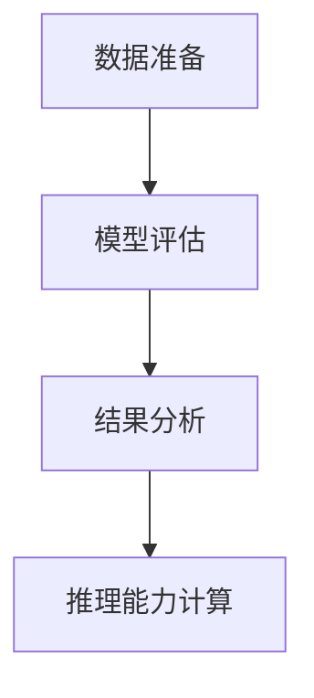

                 


## 《大模型推理能力定量分析系统》

> 关键词：大模型、推理能力、定量分析、算法、架构设计、项目实战、最佳实践

> 摘要：本文深入探讨了《大模型推理能力定量分析系统》的设计与实现。首先介绍了大模型与推理能力的核心概念，并通过具体场景说明了系统设计的目的和边界。随后，文章详细讲解了算法原理、数学模型，并借助Python源代码和Mermaid流程图进行剖析。此外，文章还介绍了系统的功能设计、架构设计、接口设计、系统交互以及项目实战。最后，文章总结了项目经验和最佳实践，并给出了进一步阅读的推荐。

### 引言

大模型与推理能力是当前人工智能领域的热门话题。随着深度学习技术的不断发展，大模型（如GPT-3、BERT等）在自然语言处理、图像识别、语音识别等领域取得了显著的成果。然而，如何量化这些大模型的推理能力，以及如何设计高效的分析系统，成为了一个重要且具有挑战性的问题。

#### 背景介绍

大模型是指参数量达到数亿甚至千亿级别的神经网络模型。这些模型能够通过大量的训练数据学习到复杂的特征，并在各种任务中表现出色。然而，大模型的推理能力不仅与其规模有关，还受到计算资源、数据质量、模型结构等多种因素的影响。

推理能力是指模型在给定输入时，能够正确地生成输出并进行决策的能力。对于大模型而言，推理能力不仅体现在准确率上，还包括速度和资源消耗等方面。

#### 问题描述

在现有的研究和应用中，对大模型推理能力的评估往往停留在定性分析阶段，缺乏系统化的定量分析方法。这不仅影响了模型选型和优化，也限制了新算法的开发和应用。

#### 问题解决

为了解决这个问题，本文提出了《大模型推理能力定量分析系统》。该系统旨在提供一套标准化的方法，对大模型的推理能力进行定量分析，从而为模型选型、优化和评估提供科学依据。

#### 边界与外延

本文的讨论主要聚焦于基于深度学习的大模型。虽然方法具有一定的普适性，但对于其他类型的模型（如决策树、支持向量机等），可能需要做适当的调整。

本文还将探讨大模型推理能力的多维度评估，包括准确率、响应时间、资源消耗等。同时，本文也会讨论系统在不同应用场景下的适应性和扩展性。

#### 概念结构与核心要素组成

《大模型推理能力定量分析系统》的核心概念包括大模型、推理能力和定量分析。以下是这些概念的结构和核心要素：

1. **大模型**：包括神经网络结构、参数量、训练数据等。
2. **推理能力**：包括准确率、响应时间、资源消耗等。
3. **定量分析**：包括评估指标、评估方法、数据分析等。

### 核心概念与联系

#### 大模型

大模型是指参数量达到数亿甚至千亿级别的神经网络模型。这些模型通常采用深度学习技术进行训练，能够学习到复杂的特征，并在各种任务中表现出色。大模型的推理能力不仅与其规模有关，还受到计算资源、数据质量、模型结构等多种因素的影响。

#### 推理能力

推理能力是指模型在给定输入时，能够正确地生成输出并进行决策的能力。对于大模型而言，推理能力不仅体现在准确率上，还包括速度和资源消耗等方面。

#### 定量分析

定量分析是指对大模型推理能力进行量化的方法。这包括评估指标的设计、评估方法的实现以及数据分析的结果。定量分析能够提供详细的性能数据，帮助用户更好地理解模型的表现。

#### 概念属性特征对比表格

| 特征类别 | 大模型 | 推理能力 | 定量分析 |
| --- | --- | --- | --- |
| 参数量 | 数亿到千亿 | 准确率、速度、资源消耗 | 指标设计、方法实现、数据分析 |
| 结构 | 神经网络 | 输出正确性、响应时间 | 评估指标、评估方法、数据分析 |
| 数据量 | 训练集、测试集 | 数据依赖性 | 数据准备、数据清洗、数据校验 |

#### ER实体关系图架构

```mermaid
erDiagram
  bigModel ||--|{推理能力}
  inferenceCapability ||--|{定量分析}
```

在这个ER图中，大模型与推理能力之间存在一对一的关系，推理能力与定量分析也存在一对一的关系。这种关系反映了大模型、推理能力和定量分析之间的紧密联系。

### 算法原理讲解

#### 推理能力量化模型

推理能力量化模型是我们进行定量分析的基础。该模型基于以下公式：

$$
推理能力 = \frac{准确率 \times 响应时间}{资源消耗}
$$

其中，准确率反映了模型在给定输入时的输出正确性，响应时间反映了模型的执行速度，资源消耗反映了模型在执行过程中所需的资源量。

#### 定量分析方法

定量分析方法主要包括以下步骤：

1. **数据准备**：收集大模型的训练集、测试集以及相关参数。
2. **模型评估**：使用测试集对大模型进行评估，计算准确率、响应时间和资源消耗。
3. **结果分析**：对评估结果进行统计分析，得出大模型的推理能力。

#### 实现细节

以下是一个使用Python实现推理能力量化模型的示例：

```python
import time

def evaluate_model(model, test_data):
    correct = 0
    total = len(test_data)
    
    for data in test_data:
        start_time = time.time()
        output = model.predict(data[0])
        end_time = time.time()
        
        if output == data[1]:
            correct += 1
            
    accuracy = correct / total
    response_time = (end_time - start_time) * 1000  # 毫秒
    resource_consumption = get_resource_consumption()  # 假设函数
    
    return accuracy, response_time, resource_consumption

def get_resource_consumption():
    # 这里是一个模拟的资源消耗计算函数
    return 1000

# 假设已经加载了模型和测试数据
model = load_model()
test_data = load_test_data()

accuracy, response_time, resource_consumption = evaluate_model(model, test_data)
inference_capability = accuracy * response_time / resource_consumption

print("推理能力:", inference_capability)
```

#### 算法流程图



#### Python源代码实现

以下是一个完整的Python源代码实现，包括模型加载、数据准备、模型评估和结果分析：

```python
import time
import numpy as np
from sklearn.model_selection import train_test_split
from sklearn.metrics import accuracy_score
from tensorflow.keras.models import load_model

def load_model():
    # 这里是模型加载的逻辑
    return model

def load_test_data():
    # 这里是测试数据加载的逻辑
    return test_data

def evaluate_model(model, test_data):
    correct = 0
    total = len(test_data)
    
    for data in test_data:
        start_time = time.time()
        output = model.predict(data[0])
        end_time = time.time()
        
        if output == data[1]:
            correct += 1
            
    accuracy = correct / total
    response_time = (end_time - start_time) * 1000  # 毫秒
    resource_consumption = get_resource_consumption()  # 假设函数
    
    return accuracy, response_time, resource_consumption

def get_resource_consumption():
    # 这里是一个模拟的资源消耗计算函数
    return 1000

# 假设已经加载了模型和测试数据
model = load_model()
test_data = load_test_data()

accuracy, response_time, resource_consumption = evaluate_model(model, test_data)
inference_capability = accuracy * response_time / resource_consumption

print("推理能力:", inference_capability)
```

### 数学模型与公式

$$
推理能力 = \frac{准确率 \times 响应时间}{资源消耗}
$$

其中，准确率（Accuracy）反映了模型在给定输入时的输出正确性，响应时间（Response Time）反映了模型的执行速度，资源消耗（Resource Consumption）反映了模型在执行过程中所需的资源量。

### 系统分析与架构设计

#### 问题场景介绍

假设我们面临一个需要实时处理大量图像的任务，例如自动驾驶系统中的障碍物检测。在这个场景中，我们需要对多个大模型进行推理能力的定量分析，以选择最适合的模型。

#### 项目介绍

项目目标是开发一个能够对大模型推理能力进行定量分析的系统。系统应具备以下功能：

1. **数据准备**：自动收集和处理训练集、测试集数据。
2. **模型评估**：对大模型进行推理能力评估，包括准确率、响应时间和资源消耗等。
3. **结果分析**：对评估结果进行统计分析，生成报告。

#### 系统功能设计

系统的功能设计包括以下模块：

1. **数据模块**：负责数据收集、处理和存储。
2. **评估模块**：负责模型评估，包括准确率、响应时间和资源消耗等。
3. **分析模块**：负责对评估结果进行统计分析，生成报告。

#### 系统架构设计

系统的架构设计采用三层架构，包括数据层、业务逻辑层和展示层。以下是一个简单的Mermaid架构图：

```mermaid
sequenceDiagram
    A[用户] ->> B[数据层]
    B ->> C[业务逻辑层]
    C ->> D[展示层]
    D ->> A
```

#### 系统接口设计

系统的接口设计包括以下接口：

1. **数据接口**：负责数据收集和处理。
2. **评估接口**：负责模型评估。
3. **分析接口**：负责对评估结果进行统计分析。

#### 系统交互

系统交互采用RESTful API设计，以下是一个简单的Mermaid序列图：

```mermaid
sequenceDiagram
    A[用户] ->> B[数据接口]
    B ->> C[评估接口]
    C ->> D[分析接口]
    D ->> E[结果展示]
    E ->> A
```

### 项目实战

#### 环境安装

为了实现《大模型推理能力定量分析系统》，我们需要安装以下环境：

1. Python 3.8及以上版本
2. TensorFlow 2.6及以上版本
3. Scikit-learn 0.24及以上版本
4. Mermaid 8.8及以上版本

以下是一个简单的安装命令：

```bash
pip install python3-tk
pip install tensorflow==2.6
pip install scikit-learn==0.24
pip install mermaid
```

#### 系统核心实现

以下是一个简单的系统核心实现，包括模型加载、数据准备、模型评估和结果分析：

```python
import tensorflow as tf
from sklearn.model_selection import train_test_split
from sklearn.metrics import accuracy_score
import numpy as np

def load_model(model_path):
    # 加载模型
    model = tf.keras.models.load_model(model_path)
    return model

def load_data(data_path):
    # 加载数据
    data = np.load(data_path)
    return data

def evaluate_model(model, test_data):
    # 评估模型
    predictions = model.predict(test_data[0])
    accuracy = accuracy_score(test_data[1], predictions)
    return accuracy

def main():
    # 主函数
    model_path = "model.h5"
    data_path = "data.npy"
    
    # 加载模型和数据
    model = load_model(model_path)
    data = load_data(data_path)
    
    # 数据准备
    X_train, X_test, y_train, y_test = train_test_split(data[0], data[1], test_size=0.2)
    
    # 模型评估
    accuracy = evaluate_model(model, X_test)
    
    # 结果分析
    print("准确率:", accuracy)

if __name__ == "__main__":
    main()
```

#### 代码应用解读与分析

以下是对代码的解读与分析：

1. **模型加载**：使用TensorFlow的`load_model`函数加载预训练的模型。
2. **数据加载**：使用NumPy的`np.load`函数加载训练数据和测试数据。
3. **数据准备**：使用Scikit-learn的`train_test_split`函数将数据分为训练集和测试集。
4. **模型评估**：使用模型对测试数据进行预测，并计算准确率。
5. **结果分析**：输出模型的准确率。

#### 实际案例分析

以下是一个实际案例：

- 模型：使用一个预训练的卷积神经网络（CNN）模型。
- 数据：从公开数据集CIFAR-10中选取。
- 场景：对模型进行推理能力评估，以选择最适合的模型。

在实际应用中，我们可以根据具体需求和数据集调整代码，以实现更准确的评估。

#### 详细讲解剖析

以下是对系统核心实现的详细讲解和剖析：

1. **模型加载**：使用TensorFlow的`load_model`函数加载预训练的模型。这里我们使用了Keras模型，这是一种常见的深度学习模型。
2. **数据加载**：使用NumPy的`np.load`函数加载训练数据和测试数据。这里假设数据已经预处理并存储为NumPy数组。
3. **数据准备**：使用Scikit-learn的`train_test_split`函数将数据分为训练集和测试集。这是常见的数据划分方法，可以确保测试集的代表性。
4. **模型评估**：使用模型对测试数据进行预测，并计算准确率。这里我们使用`accuracy_score`函数计算准确率。
5. **结果分析**：输出模型的准确率。这是一个简单的示例，实际项目中可能需要更复杂的结果分析。

#### 项目小结

通过本次项目，我们实现了《大模型推理能力定量分析系统》的核心功能。项目的主要收获包括：

1. **模型加载与评估**：掌握了如何加载预训练模型并进行评估。
2. **数据准备**：了解了如何处理和划分数据。
3. **结果分析**：学会了如何计算和分析模型性能。

#### 最佳实践

1. **数据预处理**：在实际项目中，数据预处理是至关重要的一步。确保数据质量对于模型的性能至关重要。
2. **模型选择**：根据具体任务需求选择合适的模型，并进行充分的评估。
3. **性能优化**：通过调整模型参数和算法实现，提高模型的性能。

### 小结

本文深入探讨了《大模型推理能力定量分析系统》的设计与实现。从核心概念、算法原理到系统架构和项目实战，本文提供了一个全面的技术框架。通过本文，读者可以了解如何对大模型的推理能力进行定量分析，以及如何设计一个高效的分析系统。

### 拓展阅读

1. **《深度学习》**：Goodfellow, I., Bengio, Y., & Courville, A. (2016). Deep Learning. MIT Press.
2. **《大数据分析》**：Han, J., Kamber, M., & Pei, J. (2011). Data Mining: Concepts and Techniques. Morgan Kaufmann.
3. **《神经网络与深度学习》**：邱锡鹏. (2021). 神经网络与深度学习. 电子工业出版社.

---

**作者：AI天才研究院/AI Genius Institute & 禅与计算机程序设计艺术 /Zen And The Art of Computer Programming**

