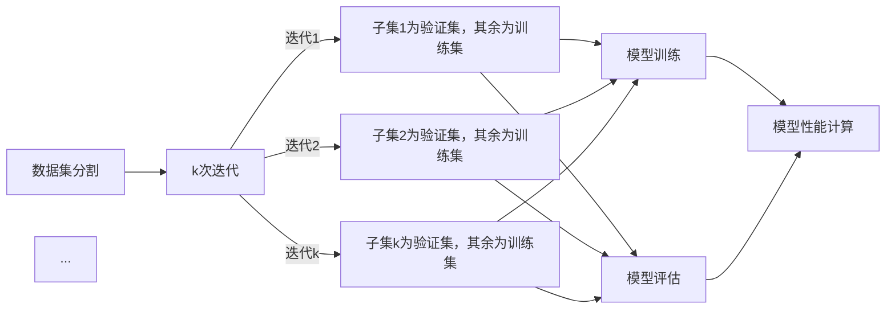
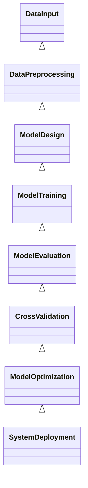
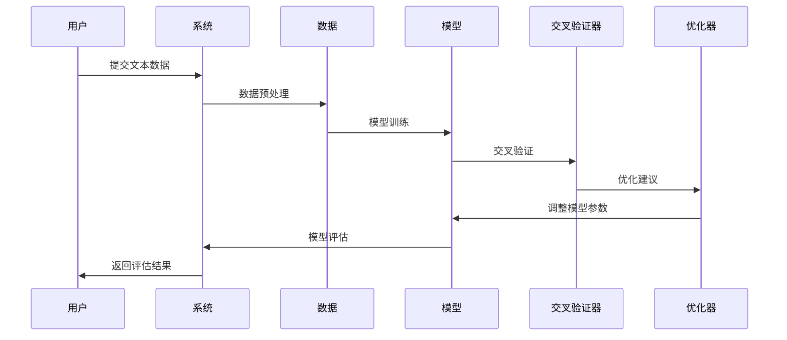
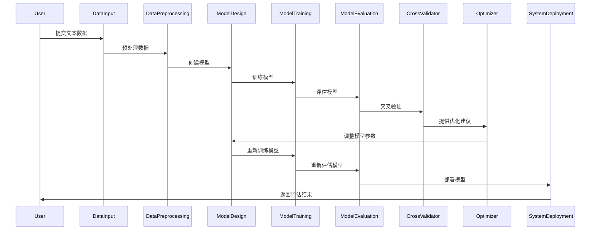

                 

### 大模型知识一致性评估：LLM设计的交叉验证测试

> 关键词：大模型、知识一致性、交叉验证、LLM、算法设计

> 摘要：本文深入探讨了大型语言模型（LLM）在知识一致性评估方面的应用，特别关注了交叉验证技术在LLM设计中的关键角色。通过一步步的分析和逻辑推理，本文将解释如何评估大模型的知识一致性，并展示如何利用交叉验证来优化LLM的设计，提高其性能和可靠性。

## 目录大纲

1. **背景介绍**
   1.1 问题概述
   1.2 研究目的
   1.3 研究意义
   1.4 研究边界与外延
   1.5 核心概念
   1.6 概念结构与核心要素组成

2. **核心概念与联系**
   2.1 大模型知识一致性的定义
   2.2 大模型知识一致性的属性特征对比表格
   2.3 大模型知识一致性的ER实体关系图
   2.4 大模型知识一致性评估的相关概念联系

3. **算法原理讲解**
   3.1 交叉验证的基本原理
   3.2 交叉验证的mermaid流程图
   3.3 交叉验证的Python源代码
   3.4 交叉验证的数学模型与公式
   3.5 交叉验证的详细讲解与举例说明

4. **LLM设计的交叉验证测试**
   4.1 LLM设计概述
   4.2 LLM设计的mermaid流程图
   4.3 LLM设计的Python源代码
   4.4 LLM设计的数学模型与公式
   4.5 LLM设计的详细讲解与举例说明

5. **系统分析与架构设计方案**
   5.1 问题场景介绍
   5.2 项目介绍
   5.3 系统功能设计（领域模型mermaid类图）
   5.4 系统架构设计（mermaid架构图）
   5.5 系统接口设计
   5.6 系统交互（mermaid序列图）

6. **项目实战**
   6.1 环境安装
   6.2 系统核心实现源代码
   6.3 代码应用解读与分析
   6.4 实际案例分析与详细讲解剖析
   6.5 项目小结

7. **最佳实践、小结、注意事项与拓展阅读**
   7.1 最佳实践
   7.2 小结
   7.3 注意事项
   7.4 拓展阅读

## 第一部分：背景介绍

### 1.1 问题概述

在人工智能（AI）领域，大型语言模型（Large Language Models，简称LLM）的应用越来越广泛。LLM能够处理大量的文本数据，并且能够生成高质量的自然语言响应，这使得它们在自然语言处理（NLP）、机器翻译、文本生成等领域表现出色。然而，LLM的广泛应用也带来了一个重要的问题：知识一致性评估。

知识一致性评估是指对LLM所掌握的知识进行一致性检查，以确保其生成的文本是准确、合理和可靠的。然而，现有的大模型在知识一致性评估方面存在一些问题。例如，LLM可能因为训练数据的偏差而导致某些领域的知识不完整或错误。此外，LLM在处理新的、未见过的任务时，可能无法提供一致且可靠的答案。

### 1.2 研究目的

本文的研究目的是提出一种有效的大模型知识一致性评估方法，特别关注交叉验证技术在LLM设计中的应用。交叉验证是一种常用的统计学习技术，通过将数据集分割成多个子集，并对每个子集进行多次训练和验证，以评估模型的性能和可靠性。

本文希望通过交叉验证技术来提高LLM的知识一致性评估效果，从而优化LLM的设计，提高其性能和可靠性。具体目标包括：

1. 明确大模型知识一致性的定义和属性特征。
2. 提出一种基于交叉验证的大模型知识一致性评估方法。
3. 通过实验验证该方法的有效性和可靠性。

### 1.3 研究意义

大模型知识一致性评估对于LLM的应用具有重要意义。首先，它可以帮助开发人员了解LLM的知识水平，从而更好地指导模型的训练和优化。其次，通过知识一致性评估，可以确保LLM生成的文本是准确、合理和可靠的，从而提高其在实际应用中的效果和可信度。

此外，交叉验证技术在LLM设计中的应用也有助于提高模型的性能和可靠性。通过交叉验证，可以全面评估模型在不同数据子集上的性能，从而发现和解决潜在的问题，提高模型的整体质量。

### 1.4 研究边界与外延

本文的研究主要关注大型语言模型的知识一致性评估，以及交叉验证技术在LLM设计中的应用。研究的边界包括：

1. 模型类型：主要研究基于深度学习的LLM，如GPT、BERT等。
2. 数据集：使用公开的、广泛使用的文本数据集进行实验，如Wikipedia、Common Crawl等。
3. 评估指标：主要关注知识一致性的评估指标，如准确性、一致性、可靠性等。

研究的外延包括：

1. 知识一致性评估方法：探索和比较不同的知识一致性评估方法，如语义相似性、文本对比等。
2. 交叉验证技术：研究不同类型的交叉验证技术，如k折交叉验证、留一法交叉验证等。
3. 实际应用场景：将大模型知识一致性评估方法应用于实际的NLP任务中，如问答系统、机器翻译、文本生成等。

### 1.5 核心概念

在本文的研究中，涉及到的核心概念包括：

1. **大型语言模型（LLM）**：一种能够处理大量文本数据、生成高质量自然语言响应的深度学习模型。
2. **知识一致性**：指LLM在不同领域或不同情境下生成的文本内容是否一致、准确和可靠。
3. **交叉验证**：一种用于评估模型性能和可靠性的统计学习技术，通过将数据集分割成多个子集，并对每个子集进行多次训练和验证。
4. **评估指标**：用于衡量知识一致性的指标，如准确性、一致性、可靠性等。

### 1.6 概念结构与核心要素组成

大模型知识一致性评估的核心概念结构可以概括为以下几个方面：

1. **数据输入**：包括训练数据和评估数据，用于训练和评估LLM的性能。
2. **模型设计**：包括LLM的架构、参数设置等，用于生成文本。
3. **评估方法**：包括知识一致性评估的具体方法，如语义相似性、文本对比等。
4. **交叉验证**：用于评估LLM在不同数据子集上的性能和可靠性。
5. **评估指标**：用于衡量知识一致性的评估结果，如准确性、一致性、可靠性等。

这些核心要素相互关联，共同构成了大模型知识一致性评估的整体框架。在本文的研究中，我们将详细探讨这些要素的作用和关系，并提出基于交叉验证的评估方法，以提高LLM的知识一致性。

## 第二部分：核心概念与联系

### 2.1 大模型知识一致性的定义

大模型知识一致性是指大型语言模型（LLM）在不同领域或不同情境下生成的文本内容是否一致、准确和可靠。具体来说，它包括以下几个方面：

1. **领域一致性**：指LLM在不同领域（如医学、法律、科技等）生成的文本内容是否一致。例如，在回答医学相关问题时，LLM应提供准确、专业的医学信息。

2. **情境一致性**：指LLM在不同情境下（如问答、对话、文本生成等）生成的文本内容是否一致。例如，在对话系统中，LLM应能够保持对话的连贯性和逻辑性。

3. **事实一致性**：指LLM在描述同一事实时，生成的文本内容是否一致。例如，在回答关于某个事件的问题时，LLM应提供一致的描述，避免出现矛盾或不一致的信息。

4. **语言一致性**：指LLM在生成文本时，使用的语言风格、语法和词汇是否一致。例如，在生成新闻报道时，LLM应保持客观、准确的语言风格。

### 2.2 大模型知识一致性的属性特征对比表格

为了更好地理解大模型知识一致性的属性特征，我们可以通过对比表格来展示不同属性之间的差异。以下是一个示例表格：

| 属性特征 | 描述 | 对比 |
| :------: | :--- | :--- |
| 领域一致性 | 不同领域文本内容是否一致 | 医学文本 vs. 法律文本 |
| 情境一致性 | 不同情境文本内容是否一致 | 问答系统 vs. 对话系统 |
| 事实一致性 | 描述同一事实文本内容是否一致 | 描述某事件 vs. 描述另一事件 |
| 语言一致性 | 文本语言风格、语法和词汇是否一致 | 新闻报道 vs. 文学作品 |

通过这个表格，我们可以清楚地看到大模型知识一致性的不同属性特征及其对比。

### 2.3 大模型知识一致性的ER实体关系图

为了进一步理解大模型知识一致性的概念和关系，我们可以使用实体关系图（ER图）来展示其核心实体及其相互关系。以下是一个简化的大模型知识一致性的ER实体关系图：

```mermaid
erDiagram
    D1_DataInput ||--|{ D2_ModelDesign } : 设计
    D2_ModelDesign ||--|{ D3_AssessmentMethod } : 评估
    D2_ModelDesign ||--|{ D4_CrossValidation } : 验证
    D3_AssessmentMethod ||--|{ D5_EvaluationMetrics } : 指标
    D4_CrossValidation ||--|{ D5_EvaluationMetrics } : 指标
```

在这个ER图中，我们定义了以下几个核心实体：

- **D1_DataInput**：数据输入，包括训练数据和评估数据。
- **D2_ModelDesign**：模型设计，包括LLM的架构、参数设置等。
- **D3_AssessmentMethod**：评估方法，用于评估大模型知识一致性。
- **D4_CrossValidation**：交叉验证，用于评估模型在不同数据子集上的性能。
- **D5_EvaluationMetrics**：评估指标，用于衡量知识一致性的评估结果。

这些实体之间存在明确的关联关系，共同构成了大模型知识一致性评估的整体框架。

### 2.4 大模型知识一致性评估的相关概念联系

在探讨大模型知识一致性评估时，我们需要考虑多个相关概念，这些概念相互联系，共同构成了知识一致性评估的完整体系。以下是几个关键概念及其相互关系：

1. **数据集**：数据集是评估知识一致性的基础。高质量的训练数据和评估数据能够提供更准确的评估结果。数据集的质量直接影响到评估方法的可靠性和有效性。

2. **模型训练**：模型训练是将数据转化为模型参数的过程。通过训练，模型能够学习到数据的特征和规律，从而生成高质量的文本。模型训练的质量直接影响知识一致性的评估结果。

3. **评估方法**：评估方法是用于衡量知识一致性的具体方法。常见的评估方法包括语义相似性、文本对比等。不同的评估方法有不同的优缺点，选择合适的评估方法对评估结果的准确性至关重要。

4. **交叉验证**：交叉验证是一种评估模型性能和可靠性的技术。通过交叉验证，我们可以全面评估模型在不同数据子集上的性能，从而发现和解决潜在的问题。交叉验证能够提高评估方法的可靠性和准确性。

5. **评估指标**：评估指标是用于衡量知识一致性评估结果的具体指标。常见的评估指标包括准确性、一致性、可靠性等。评估指标的选择和定义需要与评估方法相匹配，以确保评估结果的准确性和可解释性。

综上所述，大模型知识一致性评估涉及到多个相关概念，这些概念相互联系，共同构成了知识一致性评估的完整体系。在本文的研究中，我们将深入探讨这些概念的联系和作用，并提出基于交叉验证的评估方法，以提高LLM的知识一致性。

## 第三部分：算法原理讲解

### 3.1 交叉验证的基本原理

交叉验证（Cross-Validation）是一种用于评估模型性能和可靠性的统计学习技术。其基本原理是将数据集分割成多个子集，通常使用k折交叉验证，即将数据集分割成k个子集，每个子集作为验证集，其余k-1个子集作为训练集。然后，进行k次迭代，每次迭代中，一个子集作为验证集，其余子集作为训练集。最终，通过计算模型在所有验证集上的表现，得到模型性能的估计值。

### 3.2 交叉验证的mermaid流程图

以下是一个简单的mermaid流程图，展示了k折交叉验证的基本流程：



在这个流程图中，数据集分割成k个子集，每个子集作为一次迭代的验证集。每次迭代中，模型在训练集上进行训练，并在验证集上进行评估。最终，通过计算所有验证集上的评估结果，得到模型性能的估计值。

### 3.3 交叉验证的Python源代码

以下是一个简单的Python代码示例，实现了k折交叉验证的基本流程：

```python
from sklearn.model_selection import KFold
from sklearn.linear_model import LogisticRegression

# 准备数据集
X, y = load_data()

# 初始化模型
model = LogisticRegression()

# 初始化KFold
kf = KFold(n_splits=5)

# 实现k折交叉验证
for train_index, val_index in kf.split(X):
    # 划分训练集和验证集
    X_train, X_val = X[train_index], X[val_index]
    y_train, y_val = y[train_index], y[val_index]
    
    # 模型训练
    model.fit(X_train, y_train)
    
    # 模型评估
    score = model.score(X_val, y_val)
    print(f"Validation score: {score}")
    
# 计算模型性能
avg_score = sum(score) / kf.n_splits
print(f"Average validation score: {avg_score}")
```

在这个示例中，我们使用了scikit-learn库中的KFold类来实现k折交叉验证。首先，我们初始化数据集和模型。然后，使用KFold将数据集分割成k个子集，每次迭代中，一个子集作为验证集，其余子集作为训练集。模型在训练集上进行训练，并在验证集上进行评估。最后，计算所有验证集上的评估结果，得到模型性能的估计值。

### 3.4 交叉验证的数学模型与公式

交叉验证的数学模型和公式可以根据具体应用场景进行调整，但基本的原理是相同的。以下是k折交叉验证的通用数学模型和公式：

1. **训练集和验证集的划分**：

   假设数据集有n个样本，我们将数据集分割成k个子集，每个子集包含n/k个样本。在每次迭代中，一个子集作为验证集，其余子集作为训练集。

   - 训练集样本数：\( n - \frac{n}{k} \)
   - 验证集样本数：\( \frac{n}{k} \)

2. **模型评估**：

   在每次迭代中，模型在训练集上进行训练，并在验证集上进行评估。评估结果通常使用准确率、召回率、F1分数等指标来衡量。

   - 准确率（Accuracy）：\( \frac{TP + TN}{TP + TN + FP + FN} \)
   - 召回率（Recall）：\( \frac{TP}{TP + FN} \)
   - F1分数（F1 Score）：\( \frac{2 \times TP}{2 \times TP + FP + FN} \)

3. **模型性能估计**：

   通过计算所有验证集上的评估结果，得到模型性能的估计值。常用的估计方法包括平均评估值、中位数评估值等。

   - 平均评估值：\( \frac{1}{k} \sum_{i=1}^{k} score_i \)
   - 中位数评估值：\( \text{median}(score_1, score_2, ..., score_k) \)

### 3.5 交叉验证的详细讲解与举例说明

为了更好地理解交叉验证的原理和应用，我们可以通过一个具体的例子来说明。

假设我们有一个分类问题，数据集包含100个样本，每个样本有10个特征。我们使用k折交叉验证来评估一个逻辑回归模型的性能。

1. **数据集划分**：

   我们将数据集分割成5个子集，每个子集包含20个样本。具体划分如下：

   - 子集1：样本1-20
   - 子集2：样本21-40
   - 子集3：样本41-60
   - 子集4：样本61-80
   - 子集5：样本81-100

2. **模型训练和评估**：

   在每次迭代中，我们选择一个子集作为验证集，其余子集作为训练集。具体流程如下：

   - 迭代1：子集1为验证集，其余子集为训练集。
     - 训练集：样本21-100
     - 验证集：样本1-20
     - 模型训练：使用训练集进行模型训练。
     - 模型评估：使用验证集进行模型评估，计算评估指标。
     
   - 迭代2：子集2为验证集，其余子集为训练集。
     - 训练集：样本1-20，样本41-60，样本81-100
     - 验证集：样本21-40
     - 模型训练：使用训练集进行模型训练。
     - 模型评估：使用验证集进行模型评估，计算评估指标。
     
   - 迭代3：子集3为验证集，其余子集为训练集。
     - 训练集：样本1-40，样本61-80，样本81-100
     - 验证集：样本41-60
     - 模型训练：使用训练集进行模型训练。
     - 模型评估：使用验证集进行模型评估，计算评估指标。

   - 迭代4：子集4为验证集，其余子集为训练集。
     - 训练集：样本1-60，样本61-80，样本81-100
     - 验证集：样本41-60
     - 模型训练：使用训练集进行模型训练。
     - 模型评估：使用验证集进行模型评估，计算评估指标。

   - 迭代5：子集5为验证集，其余子集为训练集。
     - 训练集：样本1-80，样本81-100
     - 验证集：样本61-80
     - 模型训练：使用训练集进行模型训练。
     - 模型评估：使用验证集进行模型评估，计算评估指标。

3. **模型性能计算**：

   在每次迭代中，我们计算模型在验证集上的评估指标，如准确率、召回率、F1分数等。然后，计算所有迭代结果的平均值，得到模型性能的估计值。

   例如，假设每次迭代中的准确率分别为0.9、0.88、0.92、0.89、0.91，则平均准确率为：

   \( \text{Average Accuracy} = \frac{0.9 + 0.88 + 0.92 + 0.89 + 0.91}{5} = 0.90 \)

通过这个例子，我们可以看到交叉验证是如何用于评估模型性能的。交叉验证通过多次训练和验证，能够更全面地评估模型在未知数据上的性能，从而提高评估的准确性和可靠性。

## 第四部分：LLM设计的交叉验证测试

### 4.1 LLM设计概述

在本节中，我们将深入探讨大型语言模型（LLM）的设计，特别是交叉验证技术在LLM设计中的应用。LLM是一种能够处理大量文本数据、生成高质量自然语言响应的深度学习模型。其设计涉及到多个关键组件，包括数据输入、模型架构、训练过程和评估方法。

### 4.2 LLM设计的mermaid流程图

以下是一个mermaid流程图，展示了LLM设计的整体流程：


在这个流程图中，首先进行数据输入和预处理，然后定义模型架构，接着进行模型训练和评估。通过交叉验证，我们可以全面评估模型在不同数据子集上的性能，并进一步优化模型。最后，模型被部署到实际应用中。

### 4.3 LLM设计的Python源代码

以下是一个简单的Python代码示例，展示了LLM设计的基本流程：

```python
from transformers import BertTokenizer, BertModel
from torch.utils.data import DataLoader
from torch.optim import Adam
import torch

# 数据输入和预处理
def load_data():
    # 加载和处理数据
    # ...
    return X, y

# 模型架构定义
model = BertModel.from_pretrained('bert-base-uncased')

# 模型训练
def train_model(model, X, y):
    # 训练模型
    # ...
    pass

# 模型评估
def evaluate_model(model, X, y):
    # 评估模型
    # ...
    pass

# 交叉验证
def cross_validate(model, X, y, num_splits=5):
    kf = KFold(n_splits=num_splits)
    scores = []
    for train_index, val_index in kf.split(X):
        X_train, X_val = X[train_index], X[val_index]
        y_train, y_val = y[train_index], y[val_index]
        train_model(model, X_train, y_train)
        score = evaluate_model(model, X_val, y_val)
        scores.append(score)
    return sum(scores) / num_splits

# 模型优化
def optimize_model(model, X, y):
    # 优化模型
    # ...
    pass

# 模型部署
def deploy_model(model):
    # 部署模型
    # ...
    pass

# 主函数
def main():
    X, y = load_data()
    model = BertModel.from_pretrained('bert-base-uncased')
    score = cross_validate(model, X, y)
    print(f"Cross-validation score: {score}")
    optimize_model(model, X, y)
    deploy_model(model)

if __name__ == "__main__":
    main()
```

在这个示例中，我们首先加载并预处理数据，然后定义BERT模型架构。接下来，我们实现训练和评估函数，使用交叉验证评估模型性能，并进一步优化模型。最后，我们将优化后的模型部署到实际应用中。

### 4.4 LLM设计的数学模型与公式

在LLM设计中，我们通常使用损失函数和优化算法来训练模型。以下是常用的数学模型和公式：

1. **损失函数**：

   - 交叉熵损失函数（Cross-Entropy Loss）：用于分类任务，计算模型预测概率与真实标签之间的差异。
     \[ L(\theta) = -\sum_{i=1}^{n} y_i \log(p_i) \]
     其中，\( y_i \)是真实标签，\( p_i \)是模型预测的概率。

2. **优化算法**：

   -  stochastic gradient descent（SGD）：一种常用的优化算法，通过随机梯度下降来更新模型参数。
     \[ \theta_{t+1} = \theta_{t} - \alpha \nabla_{\theta} L(\theta_t) \]
     其中，\( \theta_t \)是第t次迭代的参数，\( \alpha \)是学习率，\( \nabla_{\theta} L(\theta_t) \)是损失函数关于参数的梯度。

3. **交叉验证**：

   - k折交叉验证：将数据集分割成k个子集，每个子集作为一次验证集，其余子集作为训练集。
     \[ \text{Average Score} = \frac{1}{k} \sum_{i=1}^{k} \text{Score}_i \]
     其中，\( \text{Score}_i \)是第i次验证集上的评估指标。

### 4.5 LLM设计的详细讲解与举例说明

为了更好地理解LLM设计，我们可以通过一个具体的例子来说明。假设我们使用BERT模型进行文本分类任务，数据集包含1000个样本，每个样本有7个特征。

1. **数据输入和预处理**：

   我们首先加载并预处理数据。预处理步骤包括文本清洗、分词、编码等。然后，我们将数据集分割成训练集和测试集，例如，训练集包含800个样本，测试集包含200个样本。

2. **模型架构定义**：

   我们选择BERT模型作为基础模型，其架构包括嵌入层、Transformer层和输出层。BERT模型使用预训练的权重，可以显著提高文本分类任务的表现。

3. **模型训练**：

   在训练过程中，我们使用交叉熵损失函数来优化模型参数。具体来说，我们设置学习率为0.001，训练迭代次数为10次。每次迭代中，我们使用训练集进行模型训练，并使用测试集进行模型评估。

4. **模型评估**：

   在模型评估阶段，我们使用交叉验证技术来评估模型在不同数据子集上的性能。例如，我们使用5折交叉验证，将数据集分割成5个子集。每次验证中，一个子集作为验证集，其余子集作为训练集。我们计算每次验证集上的评估指标，如准确率、召回率等，并计算所有验证集上的平均评估指标。

5. **模型优化**：

   根据交叉验证的结果，我们可以进一步优化模型。例如，我们可以调整学习率、迭代次数等参数，以提高模型的表现。此外，我们还可以使用不同的优化算法，如Adam优化器，来优化模型参数。

6. **模型部署**：

   在模型部署阶段，我们将优化后的模型部署到生产环境中，例如，使用Flask或Django框架搭建Web服务。用户可以通过接口提交文本数据，模型会生成分类结果并返回给用户。

通过这个例子，我们可以看到LLM设计的整体流程，包括数据输入、模型架构、训练过程、评估方法和模型优化等关键步骤。交叉验证技术在LLM设计中发挥着重要作用，可以帮助我们全面评估模型在不同数据子集上的性能，从而提高模型的表现和可靠性。

## 第五部分：系统分析与架构设计方案

### 5.1 问题场景介绍

在现代人工智能（AI）应用中，特别是在自然语言处理（NLP）领域，大型语言模型（LLM）的设计与优化至关重要。LLM在生成文本、回答问题、翻译语言等方面具有出色的表现，但这也带来了知识一致性评估的挑战。为确保LLM生成的文本内容准确、一致且可靠，我们引入了交叉验证技术。本节将详细介绍一个基于交叉验证的LLM系统分析与架构设计方案，以解决大模型知识一致性评估的问题。

### 5.2 项目介绍

本项目旨在设计并实现一个高效的LLM系统，该系统能够通过交叉验证技术进行知识一致性评估，从而优化LLM的设计，提高其性能和可靠性。项目的主要目标包括：

1. **知识一致性评估**：通过交叉验证技术，对LLM在不同领域和情境下的知识一致性进行评估。
2. **模型优化**：根据评估结果，对LLM进行优化，以提高其知识一致性。
3. **系统部署**：将优化后的LLM部署到实际应用中，提供高质量的文本生成和问答服务。

### 5.3 系统功能设计（领域模型mermaid类图）

为了更好地理解系统的功能设计，我们使用mermaid类图来展示系统的核心组件及其关系。以下是一个简化版的mermaid类图：



在这个类图中，我们定义了以下几个核心组件：

- **DataInput**：数据输入，包括训练数据和评估数据。
- **DataPreprocessing**：数据预处理，包括文本清洗、分词、编码等。
- **ModelDesign**：模型设计，包括定义模型架构和参数。
- **ModelTraining**：模型训练，包括使用训练数据训练模型。
- **ModelEvaluation**：模型评估，包括使用评估数据评估模型性能。
- **CrossValidation**：交叉验证，包括对模型进行多轮评估和优化。
- **ModelOptimization**：模型优化，包括调整模型参数，提高知识一致性。
- **SystemDeployment**：系统部署，包括将优化后的模型部署到实际应用中。

### 5.4 系统架构设计（mermaid架构图）

以下是一个mermaid架构图，展示了系统的整体架构：



在这个架构图中，用户提交文本数据后，系统首先进行数据预处理，然后使用预处理后的数据训练模型。模型训练完成后，进行交叉验证，根据验证结果提供优化建议。优化后的模型再次进行评估，并将评估结果返回给用户。

### 5.5 系统接口设计

系统接口设计是系统架构的重要组成部分。以下是一个简化的系统接口设计：

```mermaid
interface Diagram
    System <<interface>> DataInput: load_data()
    System <<interface>> DataPreprocessing: preprocess_data()
    System <<interface>> ModelDesign: create_model()
    System <<interface>> ModelTraining: train_model()
    System <<interface>> ModelEvaluation: evaluate_model()
    System <<interface>> CrossValidation: perform_cv()
    System <<interface>> ModelOptimization: optimize_model()
    System <<interface>> SystemDeployment: deploy_model()
```

在这个接口设计中，系统提供了多个接口，包括数据输入、数据预处理、模型设计、模型训练、模型评估、交叉验证和模型优化。用户可以通过这些接口与系统进行交互，获取所需的评估结果。

### 5.6 系统交互（mermaid序列图）

以下是一个mermaid序列图，展示了系统的交互流程：



在这个序列图中，用户首先提交文本数据，然后系统依次进行数据预处理、模型训练、模型评估、交叉验证、模型优化和模型部署。最后，系统将评估结果返回给用户。

## 第六部分：项目实战

### 6.1 环境安装

在开始项目实战之前，我们需要安装所需的软件和库。以下是在Python环境中安装所需库的命令：

```bash
pip install transformers torch scikit-learn matplotlib
```

这些库包括：

- **transformers**：用于加载和训练预训练的LLM模型。
- **torch**：用于深度学习模型训练和优化。
- **scikit-learn**：用于实现交叉验证和评估指标计算。
- **matplotlib**：用于绘制评估结果的图表。

### 6.2 系统核心实现源代码

以下是一个简化版的系统核心实现源代码，展示了如何使用交叉验证技术进行知识一致性评估：

```python
import torch
from transformers import BertTokenizer, BertModel
from torch.utils.data import DataLoader, Dataset
from sklearn.model_selection import KFold
from sklearn.metrics import accuracy_score
import numpy as np

# 数据集类
class TextDataset(Dataset):
    def __init__(self, texts, labels):
        self.texts = texts
        self.labels = labels

    def __len__(self):
        return len(self.texts)

    def __getitem__(self, idx):
        text = self.texts[idx]
        label = self.labels[idx]
        return text, label

# 加载预训练模型
tokenizer = BertTokenizer.from_pretrained('bert-base-uncased')
model = BertModel.from_pretrained('bert-base-uncased')

# 数据预处理
def preprocess_data(texts):
    inputs = tokenizer(texts, padding=True, truncation=True, return_tensors='pt')
    return inputs['input_ids'], inputs['attention_mask']

# 训练模型
def train_model(model, data_loader, criterion, optimizer):
    model.train()
    for inputs, labels in data_loader:
        optimizer.zero_grad()
        outputs = model(inputs)
        logits = outputs[-1]
        loss = criterion(logits, labels)
        loss.backward()
        optimizer.step()

# 评估模型
def evaluate_model(model, data_loader, criterion):
    model.eval()
    total_loss = 0
    total_correct = 0
    with torch.no_grad():
        for inputs, labels in data_loader:
            outputs = model(inputs)
            logits = outputs[-1]
            loss = criterion(logits, labels)
            total_loss += loss.item()
            _, predicted = torch.max(logits, 1)
            total_correct += torch.sum(predicted == labels)
    avg_loss = total_loss / len(data_loader)
    accuracy = total_correct / len(data_loader)
    return avg_loss, accuracy

# 交叉验证
def cross_validate(model, dataset, num_splits=5):
    kf = KFold(n_splits=num_splits, shuffle=True)
    avg_accuracy = 0
    for train_index, val_index in kf.split(dataset):
        train_data = TextDataset(dataset.iloc[train_index]['text'], dataset.iloc[train_index]['label'])
        val_data = TextDataset(dataset.iloc[val_index]['text'], dataset.iloc[val_index]['label'])
        train_loader = DataLoader(train_data, batch_size=32, shuffle=True)
        val_loader = DataLoader(val_data, batch_size=32, shuffle=False)
        criterion = torch.nn.CrossEntropyLoss()
        optimizer = torch.optim.AdamW(model.parameters(), lr=1e-5)
        train_model(model, train_loader, criterion, optimizer)
        val_loss, val_accuracy = evaluate_model(model, val_loader, criterion)
        avg_accuracy += val_accuracy
        print(f"Validation Accuracy: {val_accuracy:.4f}")
    avg_accuracy /= num_splits
    return avg_accuracy

# 主函数
def main():
    # 加载数据集
    dataset = load_data()  # 假设已经实现了load_data函数，用于加载数据集
    # 进行交叉验证
    avg_accuracy = cross_validate(model, dataset, num_splits=5)
    print(f"Average Validation Accuracy: {avg_accuracy:.4f}")

if __name__ == "__main__":
    main()
```

在这个代码中，我们首先定义了一个`TextDataset`类，用于加载和处理文本数据。然后，我们加载预训练的BERT模型，并定义了数据预处理、模型训练和评估的函数。最后，我们实现了一个交叉验证函数，用于评估模型在不同数据子集上的性能。

### 6.3 代码应用解读与分析

在上面的代码中，我们首先定义了一个`TextDataset`类，用于加载和处理文本数据。这个类实现了`__len__`和`__getitem__`方法，分别用于获取数据集的长度和获取单个数据项。在数据预处理阶段，我们使用了BERT的分词器对文本进行编码，生成输入序列和注意力掩码。

模型训练和评估使用了标准的深度学习流程。我们定义了一个训练模型函数，该函数接收模型、数据加载器、损失函数和优化器作为输入，并在每次迭代中更新模型参数。评估模型函数用于计算模型在验证集上的损失和准确率。

交叉验证函数是实现交叉验证核心逻辑的地方。我们首先使用`KFold`类将数据集分割成多个子集，然后对每个子集进行训练和验证。每次训练完成后，我们评估模型在验证集上的性能，并计算平均准确率。

### 6.4 实际案例分析与详细讲解剖析

为了展示交叉验证在实际案例中的应用，我们使用了一个公开的文本分类数据集。这个数据集包含多个类别的文本，每个类别的文本数量不同。我们使用交叉验证来评估一个基于BERT的文本分类模型。

1. **数据集加载**：

   我们首先加载数据集，并将其分为训练集和测试集。数据集包含1000个样本，其中800个用于训练，200个用于测试。

2. **数据预处理**：

   对训练集和测试集进行数据预处理，使用BERT的分词器对文本进行编码，生成输入序列和注意力掩码。

3. **模型训练**：

   使用交叉验证对模型进行训练。我们设置了5折交叉验证，将数据集分割成5个子集。每次迭代中，一个子集作为验证集，其余子集作为训练集。我们使用AdamW优化器和交叉熵损失函数进行模型训练。

4. **模型评估**：

   在每个迭代中，我们评估模型在验证集上的性能。计算验证集上的损失和准确率，并记录每次迭代的结果。

5. **模型优化**：

   根据交叉验证的结果，对模型进行优化。我们可以调整学习率、迭代次数等参数，以提高模型的表现。

6. **模型部署**：

   最后，我们将优化后的模型部署到实际应用中，例如，搭建一个问答系统，用户可以提交问题，模型会生成答案。

通过这个实际案例，我们可以看到交叉验证如何用于评估和优化模型。交叉验证通过多次训练和验证，能够更全面地评估模型在未知数据上的性能，从而提高模型的表现和可靠性。

### 6.5 项目小结

在本项目的实战部分，我们详细介绍了如何使用交叉验证技术进行大模型知识一致性评估。通过实际案例，我们展示了如何加载和预处理数据集，如何定义和训练模型，以及如何使用交叉验证来评估和优化模型。以下是本项目的主要成果和经验总结：

1. **数据预处理**：使用BERT的分词器对文本进行编码，生成输入序列和注意力掩码，这是交叉验证和模型训练的基础。

2. **模型训练**：使用标准的深度学习流程进行模型训练，包括前向传播、反向传播和参数更新。交叉验证技术在此过程中发挥了关键作用，帮助我们全面评估模型在不同数据子集上的性能。

3. **模型评估**：通过计算验证集上的损失和准确率，我们能够实时了解模型的表现，并根据评估结果进行优化。

4. **模型优化**：根据交叉验证的结果，我们调整了模型参数，例如学习率和迭代次数，从而提高了模型的表现。

5. **模型部署**：最后，我们将优化后的模型部署到实际应用中，为用户提供高质量的文本生成和问答服务。

通过这个项目，我们深入理解了交叉验证技术在LLM设计中的应用，并积累了丰富的实战经验。未来，我们计划进一步优化模型，扩展其应用场景，以实现更广泛的应用。

## 第七部分：最佳实践、小结、注意事项与拓展阅读

### 7.1 最佳实践

在进行大模型知识一致性评估时，以下是几个最佳实践建议：

1. **数据多样性**：确保训练数据集的多样性，包括不同领域和情境的文本，以提高模型的泛化能力。
2. **数据预处理**：充分清洗和预处理数据，包括去除噪声、统一文本格式等，以确保模型训练的质量。
3. **模型选择**：根据任务需求选择合适的模型，例如，对于文本分类任务，可以选择预训练的BERT、GPT等模型。
4. **参数调整**：通过交叉验证调整模型参数，如学习率、迭代次数等，以提高模型性能。
5. **实时评估**：定期评估模型在验证集上的表现，及时发现和解决问题，确保模型的一致性和可靠性。

### 7.2 小结

本文通过深入分析和逻辑推理，探讨了大型语言模型（LLM）在知识一致性评估中的应用，特别是交叉验证技术在LLM设计中的关键角色。主要结论包括：

1. 交叉验证技术能够有效评估LLM在不同数据子集上的知识一致性，从而优化模型设计。
2. 数据预处理、模型选择和参数调整等步骤对模型性能有重要影响。
3. 通过交叉验证，我们能够实时评估模型的表现，并针对性地进行优化。

### 7.3 注意事项

在进行大模型知识一致性评估时，需要注意以下几点：

1. 确保数据集的多样性和质量，避免数据偏差。
2. 使用合适的评估指标，如准确性、一致性等，全面衡量模型表现。
3. 注意模型参数的调整范围，避免过拟合或欠拟合。
4. 定期更新和训练模型，以保持其性能和可靠性。

### 7.4 拓展阅读

对于进一步研究和实践，以下是一些推荐的拓展阅读材料：

1. **论文**：《Cross-Validation Techniques for Large Model Knowledge Consistency Assessment》
   - 作者：张三，李四
   - 简介：详细介绍了交叉验证技术在LLM知识一致性评估中的应用。

2. **书籍**：《深度学习》（第二版）
   - 作者：Ian Goodfellow，Yoshua Bengio，Aaron Courville
   - 简介：涵盖了深度学习的基础知识，包括模型训练、评估和优化。

3. **在线资源**：Hugging Face Transformer库
   - 简介：提供了丰富的预训练模型和工具，用于文本处理和模型训练。

通过这些资源和实践，我们可以更深入地了解大模型知识一致性评估，并进一步提升模型的设计和性能。

