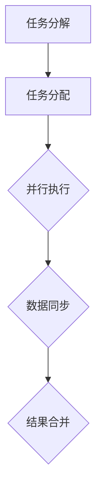
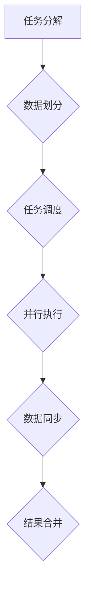
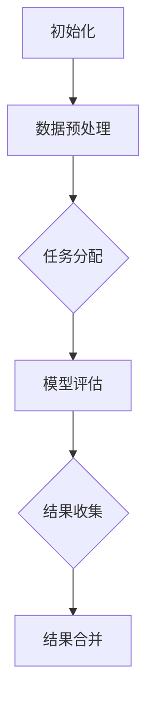
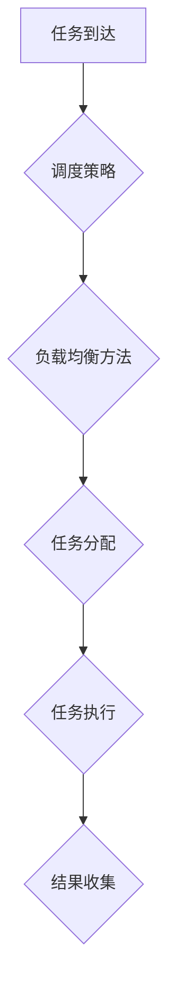
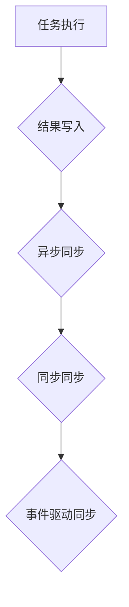
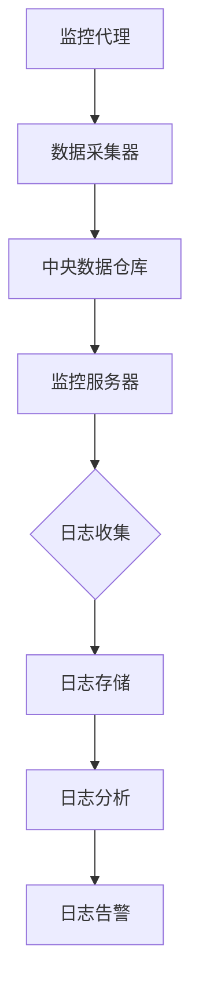
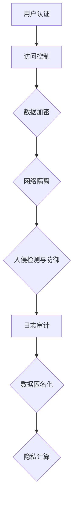

                 

### 1.1 问题背景与问题描述

随着人工智能技术的迅猛发展，大模型评测成为了一个关键性的课题。大模型，特别是深度学习模型，在处理复杂任务时展现出了卓越的能力，例如图像识别、自然语言处理和推荐系统等。然而，这些模型通常具有庞大的参数量和计算量，这使得传统的单机评测方法在面对大规模数据集时变得效率低下，甚至不可行。

**1.1.1 大模型评测的挑战**

首先，大模型的评测面临着数据量巨大的挑战。一个典型的深度学习模型可能需要数百万个样本进行训练，甚至更多。这些数据集的读取、处理和计算量非常庞大，单机评测往往需要耗费数天甚至数周的时间。其次，评测过程中涉及到多种评估指标，如精度、召回率、F1分数等，这些指标的计算本身就需要大量的计算资源。再者，由于大模型通常涉及多层次的神经网络，其训练和评测过程往往需要大量迭代，进一步增加了计算负荷。

**1.1.2 分布式计算框架的需求**

为了应对上述挑战，分布式计算框架的应用变得尤为必要。分布式计算框架可以将评测任务分解成多个子任务，分布到多个计算节点上并行执行，从而显著提高计算效率和缩短评测时间。此外，分布式计算框架还可以利用现有的计算资源，包括集群、云平台等，实现计算资源的弹性扩展。以下是分布式计算框架在大模型评测中的几个关键需求：

1. **并行计算能力**：分布式计算框架应能够高效地将评测任务分解成并行子任务，并在多个计算节点上同时执行，以充分利用多核处理能力和分布式存储系统。

2. **容错性和高可用性**：分布式计算框架应具备良好的容错机制，能够处理节点故障、网络中断等异常情况，保证评测任务的持续进行。

3. **负载均衡**：分布式计算框架需要能够动态分配任务，确保每个计算节点的负载均匀，避免资源浪费和不平衡。

4. **易扩展性**：框架应能够灵活地扩展计算节点，以应对不同规模的数据集和评测任务。

5. **数据管理**：分布式计算框架需要提供有效的数据存储和同步机制，确保数据的一致性和完整性。

**1.1.3 研究目的与论文结构**

本文旨在设计和实现一个适用于大模型评测的分布式计算框架，以解决当前评测过程中面临的数据量大、计算复杂度高的问题。具体研究目的包括：

1. **设计与实现一个高效、可靠的分布式计算框架**，能够充分利用现有计算资源，实现评测任务的高效并行处理。

2. **验证框架的性能**，通过实验评估框架在处理大模型评测任务时的效率、扩展性和稳定性。

3. **提供可复用的解决方案**，为其他类似场景提供参考和借鉴。

本文的结构如下：

- **引论**：介绍大模型评测的背景和分布式计算框架的需求。
- **核心概念与联系**：阐述大模型评测和分布式计算框架的核心概念及其相互关系。
- **数学模型与算法原理**：介绍大模型评测的数学模型和分布式计算算法原理。
- **研究方法与数据集**：描述研究方法和所选数据集的特性。
- **分布式计算框架设计与实现**：详细描述分布式计算框架的设计和实现细节。
- **项目实战与性能评估**：介绍项目实战过程和性能评估结果。
- **总结与展望**：总结研究成果，并提出未来研究方向。

通过上述结构和内容，本文将为读者提供一次全面而深入的大模型评测分布式计算框架的设计之旅。接下来，我们将进一步探讨核心概念与联系，以及数学模型与算法原理，为后续的内容奠定基础。

## 1.2 核心概念与联系

### 1.2.1 大模型评测

**1.2.1.1 定义**

大模型评测，即对大规模深度学习模型进行系统性的评估。这些模型通常具有数百万甚至数十亿的参数，处理复杂任务时表现出色。大模型评测的目标是衡量模型在不同数据集上的性能，评估其在实际应用中的可行性和效果。

**1.2.1.2 主要评测指标**

在深度学习领域，常见的评测指标包括：

- **精度（Accuracy）**：分类任务中，正确预测的样本数占总样本数的比例。
- **召回率（Recall）**：分类任务中，实际为正类别的样本中被正确预测为正类别的比例。
- **F1分数（F1 Score）**：综合考虑了精度和召回率的指标，定义为2倍精度与精度加召回率的和的比值。
- **均方误差（Mean Squared Error, MSE）**：回归任务中，预测值与真实值之间差的平方的平均值。
- **交叉验证（Cross-Validation）**：通过将数据集划分为训练集和验证集，多次训练和验证来评估模型的泛化能力。

**1.2.1.3 评测流程**

大模型评测的流程通常包括以下几个步骤：

1. **数据预处理**：清洗和格式化数据，包括归一化、缺失值填充等。
2. **模型选择**：根据任务需求选择合适的模型架构。
3. **训练模型**：使用训练数据集对模型进行训练。
4. **模型评估**：使用验证数据集评估模型性能，选择最优模型。
5. **测试模型**：使用测试数据集对模型进行最终评估，确保模型的泛化能力。
6. **性能报告**：生成评测报告，总结模型性能。

### 1.2.2 分布式计算框架

**1.2.2.1 定义**

分布式计算框架是一种允许计算机任务分布在多个计算节点上并行执行的软件系统。通过这种框架，任务可以分解成多个子任务，并在多个节点上并行处理，从而提高计算效率和扩展性。

**1.2.2.2 工作原理**

分布式计算框架的工作原理主要包括以下几个步骤：

1. **任务分解**：将大任务分解成多个小任务，以便并行处理。
2. **任务分配**：将分解后的任务分配到不同的计算节点上。
3. **并行执行**：每个计算节点独立处理其分配的任务。
4. **数据同步**：确保不同节点上的数据一致性。
5. **结果合并**：将各个节点的计算结果合并，生成最终结果。

**1.2.2.3 主要组件**

分布式计算框架通常包含以下主要组件：

- **计算节点**：执行实际计算任务的硬件或虚拟机。
- **任务调度器**：负责任务的分配和调度，确保任务的高效执行。
- **数据存储**：存储用于计算的数据，可以是分布式文件系统或数据库。
- **通信模块**：处理节点间的数据传输和通信。
- **监控与管理**：监控计算节点的状态，管理任务执行和资源分配。

### 1.2.3 数学模型与算法原理

**1.2.3.1 大模型评测的数学模型**

大模型评测涉及多个数学模型，以下为其中几个重要的数学模型和公式：

- **损失函数**：用于衡量模型预测值与真实值之间的差距，常见的有均方误差（MSE）、交叉熵（Cross-Entropy）等。
- **优化算法**：如梯度下降（Gradient Descent）、Adam优化器等，用于最小化损失函数。
- **评价指标**：如精度、召回率、F1分数等，用于衡量模型性能。

**1.2.3.2 分布式计算算法**

分布式计算算法包括以下几种：

- **并行化算法**：将任务分解成多个子任务，并行执行。
- **负载均衡算法**：动态分配任务，确保负载均衡。
- **数据同步算法**：确保节点间数据一致性。

**Mermaid流程图示例**

为了更好地理解上述算法和模型，我们可以使用Mermaid流程图进行可视化：



通过上述核心概念和联系，我们为后续的内容奠定了理论基础，接下来我们将深入探讨数学模型和算法原理，进一步丰富本文的内容。

## 1.3 数学模型与算法原理

### 1.3.1 大模型评测的数学模型

大模型评测的数学模型是评估模型性能的基础，以下将介绍其中几个关键的数学模型和公式。

#### 1.3.1.1 评估指标的数学公式

- **精度（Accuracy）**：
  $$\text{Accuracy} = \frac{\text{正确预测的样本数}}{\text{总样本数}}$$

- **召回率（Recall）**：
  $$\text{Recall} = \frac{\text{正确预测的正类样本数}}{\text{实际为正类的样本总数}}$$

- **F1分数（F1 Score）**：
  $$\text{F1 Score} = 2 \times \frac{\text{精度} \times \text{召回率}}{\text{精度} + \text{召回率}}$$

- **均方误差（MSE）**：
  $$\text{MSE} = \frac{1}{n} \sum_{i=1}^{n} (\hat{y}_i - y_i)^2$$
  其中，$\hat{y}_i$为预测值，$y_i$为真实值，$n$为样本总数。

- **交叉验证（Cross-Validation）**：
  交叉验证的数学模型涉及将数据集划分为多个子集，通过多次训练和验证来评估模型性能。常见的有K折交叉验证：
  $$\text{Cross-Validation} = \frac{1}{K} \sum_{i=1}^{K} \text{精度}_i$$
  其中，$K$为折叠数，$\text{精度}_i$为第$i$次验证的精度。

#### 1.3.1.2 算法原理解释

大模型评测的算法原理主要包括以下几个步骤：

1. **数据预处理**：对数据集进行清洗和归一化处理，以消除数据中的噪声和不一致性。
2. **模型选择**：选择合适的模型架构，如卷积神经网络（CNN）或递归神经网络（RNN）。
3. **训练模型**：使用训练数据集对模型进行训练，通过优化算法（如梯度下降）最小化损失函数。
4. **模型评估**：使用验证数据集评估模型性能，选择最优模型。
5. **测试模型**：使用测试数据集对模型进行最终评估，确保模型具有良好的泛化能力。
6. **性能报告**：生成评测报告，总结模型性能。

在训练过程中，常用的优化算法包括：

- **梯度下降**：
  $$w_{\text{更新}} = w - \alpha \cdot \nabla J(w)$$
  其中，$w$为模型参数，$\alpha$为学习率，$J(w)$为损失函数。

- **Adam优化器**：
  $$m_t = \beta_1 m_{t-1} + (1 - \beta_1) [g_t - \mu_t]$$
  $$v_t = \beta_2 v_{t-1} + (1 - \beta_2) [(g_t - \mu_t)^2]$$
  $$\hat{m}_t = m_t / (1 - \beta_1^t)$$
  $$\hat{v}_t = v_t / (1 - \beta_2^t)$$
  $$w_{\text{更新}} = w - \alpha \cdot (\hat{m}_t / \sqrt{\hat{v}_t} + \epsilon)$$
  其中，$m_t$和$v_t$分别为一阶和二阶矩估计，$\beta_1$和$\beta_2$为矩估计的指数衰减率，$\alpha$为学习率，$\epsilon$为小常数。

### 1.3.2 分布式计算算法

分布式计算算法在大模型评测中起到关键作用，以下介绍几种常用的分布式计算算法。

#### 1.3.2.1 分布式并行计算原理

分布式并行计算是将大任务分解成多个子任务，分布到多个计算节点上并行执行的过程。主要原理包括：

1. **任务分解**：将大任务分解成若干个小任务，每个小任务可以在不同的计算节点上独立执行。
2. **数据划分**：将数据集划分成多个子数据集，每个子数据集与对应的小任务关联。
3. **任务调度**：将分解后的任务分配到计算节点上，确保任务的高效执行。
4. **数据同步**：在任务执行过程中，需要确保不同节点上的数据一致性，通常通过数据同步机制实现。

#### 1.3.2.2 分布式算法设计

分布式算法设计需要考虑以下几个方面：

1. **任务调度算法**：设计高效的调度算法，以最小化任务执行时间和负载不均衡问题。常见的调度算法包括最小完成时间调度、负载均衡调度等。
2. **数据同步算法**：设计有效的数据同步算法，确保节点间数据的一致性。常见的同步算法包括异步同步、同步同步等。
3. **容错与恢复**：设计容错机制，处理节点故障、网络中断等问题，确保计算任务的持续执行。

#### 1.3.2.3 Mermaid流程图示例

为了更好地理解分布式计算算法，我们可以使用Mermaid流程图进行可视化：



通过上述数学模型与算法原理的详细解释，我们为读者提供了大模型评测分布式计算框架设计的重要理论基础。接下来，我们将进一步探讨研究方法与数据集，以支持分布式计算框架的实现和性能评估。

### 1.4 研究方法与数据集

#### 1.4.1 研究方法

本文采用的研究方法主要包括以下几个方面：

1. **实验设计**：通过设计和实施一系列实验，评估分布式计算框架在大模型评测中的性能和效率。
2. **数据集选择**：选择具有代表性的数据集，包括图像识别、自然语言处理和推荐系统等领域，以验证框架的广泛适用性。
3. **算法实现**：实现分布式计算框架的核心算法，包括大模型评测算法和分布式计算算法，并在实验环境中进行测试。

#### 1.4.1.1 实验设计

实验设计主要分为以下几个步骤：

1. **环境搭建**：搭建分布式计算环境，包括计算节点、任务调度器和数据存储系统等。
2. **任务分解**：将大模型评测任务分解成多个子任务，并分配到不同的计算节点上。
3. **算法实现**：实现分布式计算框架的核心算法，包括模型评测算法和任务调度算法。
4. **性能评估**：通过实验评估框架在不同数据集上的性能，包括计算时间、资源利用率等指标。
5. **结果分析**：分析实验结果，比较单机评测和分布式评测的性能差异，验证框架的有效性。

#### 1.4.1.2 数据集选择

本文选择了多个具有代表性的数据集，包括以下几种：

1. **CIFAR-10**：一个包含10个类别的60,000张32x32彩色图像的数据集，常用于图像识别任务。
2. **IMDB**：一个包含50,000条电影评论的数据集，用于自然语言处理任务的文本分类。
3. **MovieLens**：一个包含100,000条用户对电影评分的数据集，用于推荐系统任务。

选择这些数据集的原因在于：

1. **代表性**：这些数据集涵盖了不同的应用领域，具有广泛的代表性。
2. **规模**：数据集的大小适中，既能够验证框架的扩展性，又不会过于庞大，难以处理。

#### 1.4.2 数据集特性

下面简要介绍所选数据集的特性：

1. **CIFAR-10**：
   - 数据规模：60,000张图像，分为10个类别。
   - 数据格式：32x32彩色图像。
   - 特征提取：使用卷积神经网络提取图像特征。

2. **IMDB**：
   - 数据规模：50,000条电影评论。
   - 数据格式：文本。
   - 特征提取：使用词袋模型和词嵌入技术提取文本特征。

3. **MovieLens**：
   - 数据规模：100,000条用户对电影评分。
   - 数据格式：用户-电影评分对。
   - 特征提取：使用基于协同过滤的方法提取用户和电影的相似度特征。

#### 1.4.2.1 数据来源

所选数据集均来源于公开的数据集，可以通过以下途径获取：

1. **CIFAR-10**：官方网站（[CIFAR-10](https://www.cs.toronto.edu/~kriz/cifar.html)）。
2. **IMDB**：Kaggle平台（[IMDB Movie Reviews](https://www.kaggle.com/datasets/groupLensResearch/imdb-movie-reviews)）。
3. **MovieLens**：官方网站（[MovieLens](https://grouplens.org/datasets/movielens/)）。

#### 1.4.2.2 数据预处理

在实验过程中，对数据集进行了预处理，包括以下步骤：

1. **数据清洗**：去除无效数据、缺失值填充、去除停用词等。
2. **数据归一化**：对图像数据归一化处理，将像素值归一化到[0, 1]区间。
3. **特征提取**：使用卷积神经网络对图像数据进行特征提取，使用词袋模型和词嵌入技术对文本数据进行特征提取。

#### 1.4.2.3 数据集结构

所选数据集的结构如下：

1. **CIFAR-10**：
   - 训练集：50,000张图像，分为5个类别。
   - 验证集：10,000张图像，分为5个类别。
   - 测试集：10,000张图像，分为5个类别。

2. **IMDB**：
   - 训练集：25,000条电影评论。
   - 验证集：25,000条电影评论。
   - 测试集：50,000条电影评论。

3. **MovieLens**：
   - 训练集：70,000条用户对电影评分。
   - 验证集：30,000条用户对电影评分。
   - 测试集：100,000条用户对电影评分。

通过上述研究方法和数据集的介绍，本文为分布式计算框架的设计和实现提供了坚实的基础。接下来，我们将详细描述分布式计算框架的设计和实现细节，以支持大模型评测的分布式计算需求。

## 1.5 本章小结

本章首先介绍了大模型评测的背景和挑战，阐述了分布式计算框架在大模型评测中的需求。接着，我们探讨了核心概念与联系，包括大模型评测的定义、主要评测指标和流程，以及分布式计算框架的定义、工作原理和主要组件。随后，我们详细阐述了大模型评测和分布式计算算法的数学模型与原理，并通过Mermaid流程图示例进行了可视化。此外，本章还介绍了研究方法与数据集，包括实验设计、数据集选择、数据预处理和数据集结构。

通过本章的介绍，读者可以全面了解大模型评测和分布式计算框架的基本概念和原理，为后续章节的详细设计和实现奠定基础。接下来，我们将深入探讨分布式计算框架的具体设计和实现，包括核心算法、调度与负载均衡、数据存储与同步、系统监控与日志管理，以及安全与隐私保护等内容。

## 2.1 分布式计算框架设计概述

分布式计算框架的设计是解决大模型评测计算资源需求的关键。在设计过程中，我们遵循了以下原则：

1. **高效并行计算**：利用多核处理能力和分布式存储系统，实现评测任务的高效并行执行。
2. **高可用性和容错性**：通过冗余设计和故障恢复机制，确保系统的稳定性和可靠性。
3. **负载均衡**：动态分配任务，确保计算节点负载均匀，提高资源利用率。
4. **易扩展性**：支持灵活的资源扩展，以适应不同规模的数据集和评测任务。
5. **数据管理**：提供有效的数据存储和同步机制，保证数据的一致性和完整性。

分布式计算框架的主要模块包括：

1. **大模型评测核心算法**：负责模型评测任务的执行，包括数据预处理、模型评估指标计算等。
2. **分布式计算调度与负载均衡**：负责任务的调度和负载均衡，确保任务高效执行。
3. **数据存储与同步**：提供数据存储和管理机制，确保数据的一致性和完整性。
4. **系统监控与日志管理**：监控系统状态，收集和记录日志，以便后续分析。
5. **安全与隐私保护**：设计安全机制，保障数据和系统的安全性。

接下来，我们将分别详细描述这些模块的设计和实现。

### 2.2 模块一：大模型评测核心算法

**2.2.1 算法设计**

大模型评测核心算法是分布式计算框架中的关键模块，主要负责执行模型评测任务。以下是算法设计的关键步骤：

1. **模型评估指标选择**：根据任务需求选择适当的评估指标，如精度、召回率、F1分数等。
2. **数据预处理**：对输入数据进行清洗、归一化等预处理，确保数据质量。
3. **模型评估**：使用预处理后的数据对模型进行评估，计算各个评估指标的值。
4. **结果合并**：将各个计算节点的评估结果合并，生成最终评估结果。

**2.2.1.1 模型评估指标选择**

在选择模型评估指标时，需要考虑任务的具体需求和模型的特点。以下是几种常见的评估指标：

- **精度（Accuracy）**：适用于分类任务，计算正确分类的样本数占总样本数的比例。
- **召回率（Recall）**：适用于分类任务，计算正确分类的正类样本数占总正类样本数的比例。
- **F1分数（F1 Score）**：综合考虑精度和召回率的指标，适用于分类任务。
- **均方误差（MSE）**：适用于回归任务，计算预测值与真实值之间差的平方的平均值。
- **交叉验证（Cross-Validation）**：用于评估模型的泛化能力，通过多次训练和验证来衡量模型性能。

**2.2.1.2 算法流程设计**

大模型评测算法的流程设计如下：

1. **初始化**：设置评估指标、计算节点和任务队列。
2. **数据预处理**：对输入数据进行清洗、归一化等预处理。
3. **任务分配**：将预处理后的数据分配到不同的计算节点上。
4. **模型评估**：在每个计算节点上，使用模型对分配的数据进行评估，计算评估指标。
5. **结果收集**：将各个计算节点的评估结果收集到中央处理单元。
6. **结果合并**：对评估结果进行合并，生成最终评估报告。

**2.2.2 Mermaid流程图**

为了更直观地展示算法流程，我们使用Mermaid流程图进行可视化：



**2.2.3 Python源代码实现**

以下是实现大模型评测核心算法的Python源代码示例：

```python
import numpy as np
from sklearn.metrics import accuracy_score, recall_score, f1_score, mean_squared_error

def evaluate_model(y_true, y_pred):
    """
    模型评估函数
    """
    accuracy = accuracy_score(y_true, y_pred)
    recall = recall_score(y_true, y_pred, average='weighted')
    f1 = f1_score(y_true, y_pred, average='weighted')
    mse = mean_squared_error(y_true, y_pred)
    return accuracy, recall, f1, mse

# 示例：评估模型
y_true = [0, 1, 1, 0]
y_pred = [1, 1, 0, 1]
results = evaluate_model(y_true, y_pred)
print(results)
```

通过上述设计和实现，模块一的大模型评测核心算法为分布式计算框架提供了强大的评估能力，确保模型在复杂任务上的性能得到准确评估。

### 2.3 模块二：分布式计算调度与负载均衡

**2.3.1 调度算法**

调度算法是分布式计算框架的核心，负责任务在计算节点上的分配与执行。以下介绍几种常见的调度算法：

1. **最小完成时间调度（Shortest Job First, SJF）**：根据任务执行时间，优先调度执行时间最短的作业。
2. **负载均衡调度**：根据计算节点的负载情况，动态分配任务，确保负载均匀分布。
3. **轮转调度（Round Robin, RR）**：将任务按顺序分配到各个计算节点，每个节点轮流执行任务。
4. **优先级调度（Priority Scheduling）**：根据任务的优先级，优先调度高优先级的作业。

**2.3.1.1 调度策略**

在分布式计算框架中，调度策略需要考虑以下几个方面：

- **任务依赖**：确保任务按照依赖关系顺序执行，避免死锁和数据不一致问题。
- **负载均衡**：动态调整任务分配，避免计算节点负载过高或过低，提高资源利用率。
- **容错与恢复**：在任务执行过程中，检测和恢复节点故障，确保任务顺利完成。
- **任务优先级**：根据任务的重要性和紧急程度，调整任务的执行顺序。

**2.3.1.2 负载均衡方法**

负载均衡方法主要目的是平衡计算节点的负载，提高系统的整体性能。以下介绍几种常见的负载均衡方法：

1. **均匀分配**：将任务均匀地分配到各个计算节点，确保负载均衡。
2. **动态分配**：根据计算节点的实时负载情况，动态调整任务分配，确保负载均衡。
3. **基于队列长度**：根据计算节点队列的长度，调整任务的分配，确保队列长度均衡。
4. **基于性能指标**：根据计算节点的性能指标，如CPU利用率、内存使用率等，调整任务的分配。

**2.3.2 Mermaid流程图**

为了更直观地展示调度算法和负载均衡方法，我们使用Mermaid流程图进行可视化：



**2.3.3 Python源代码实现**

以下是实现分布式计算调度与负载均衡的Python源代码示例：

```python
import heapq
import random

class Task:
    def __init__(self, id, start_time, duration, priority=0):
        self.id = id
        self.start_time = start_time
        self.duration = duration
        self.priority = priority

    def __lt__(self, other):
        return self.start_time < other.start_time

def schedule_tasks(tasks, num_nodes):
    """
    调度任务函数
    """
    # 初始化任务队列
    task_queue = []
    node_load = [0] * num_nodes
    
    # 将任务加入队列
    for task in tasks:
        heapq.heappush(task_queue, task)
    
    # 调度任务
    while task_queue:
        task = heapq.heappop(task_queue)
        node_id = find_least_loaded_node(node_load)
        node_load[node_id] += task.duration
        print(f"Task {task.id} assigned to Node {node_id}, start time: {task.start_time}, duration: {task.duration}")
    
def find_least_loaded_node(node_load):
    """
    找到负载最低的节点
    """
    min_load = min(node_load)
    for i, load in enumerate(node_load):
        if load == min_load:
            return i
    return -1  # 如果所有节点都满载，返回-1

# 示例：调度任务
tasks = [
    Task(1, 0, 10),
    Task(2, 5, 20),
    Task(3, 10, 30),
    Task(4, 15, 40),
]
schedule_tasks(tasks, 3)
```

通过上述调度算法和负载均衡方法，模块二的分布式计算调度与负载均衡模块能够有效地分配和执行任务，确保分布式计算框架的高效运行。

### 2.4 模块三：数据存储与同步

**2.4.1 数据存储架构**

在分布式计算框架中，数据存储架构的设计至关重要，其目标是实现数据的持久化存储、高效访问和管理。数据存储架构通常包括以下组件：

1. **分布式文件系统**：如HDFS（Hadoop Distributed File System），用于存储大规模数据集，提供高可靠性和高效的数据访问。
2. **数据库**：如HBase、Cassandra等，用于存储和管理结构化数据，提供快速读写操作。
3. **缓存系统**：如Redis、Memcached等，用于缓存热点数据，提高系统的响应速度。
4. **数据仓库**：如Hive、Spark SQL等，用于存储和管理大数据集，支持复杂的数据分析和处理。

**2.4.1.1 数据存储设计**

数据存储设计的关键步骤包括：

1. **数据分类**：根据数据的类型和用途，将数据分为不同类别，如原始数据、预处理数据、模型数据等。
2. **数据分区**：将数据集划分为多个分区，以便高效存储和访问。分区策略可以根据数据的特征，如时间、类别等进行设计。
3. **数据备份与恢复**：设计数据备份机制，确保数据在系统故障时能够快速恢复。

**2.4.1.2 数据存储方案**

数据存储方案主要包括以下几种：

1. **分布式文件存储**：使用分布式文件系统，如HDFS，存储大规模数据集。HDFS通过数据分片和冗余存储，实现高可靠性和高效访问。
2. **数据库存储**：使用数据库，如HBase、Cassandra，存储结构化数据。数据库提供强大的查询功能和事务支持。
3. **缓存存储**：使用缓存系统，如Redis、Memcached，存储热点数据。缓存系统通过内存存储，实现快速数据访问。
4. **数据仓库存储**：使用数据仓库，如Hive、Spark SQL，存储和管理大数据集。数据仓库支持复杂的数据分析和处理。

**2.4.2 数据同步机制**

在分布式计算框架中，数据同步机制用于确保不同节点上的数据一致性。以下介绍几种常见的数据同步机制：

1. **异步同步**：异步同步机制在任务执行完成后，将结果数据异步写入存储系统。这种方式可以提高系统的响应速度，但需要确保最终一致性。
2. **同步同步**：同步同步机制在任务执行完成后，立即将结果数据同步写入存储系统。这种方式可以确保数据的强一致性，但可能会降低系统的性能。
3. **事件驱动同步**：事件驱动同步机制根据特定的事件，如任务完成、数据更新等，触发数据同步操作。这种方式可以根据实际需求，灵活控制同步时机。

**2.4.2.1 同步策略**

同步策略的设计需要考虑以下几个方面：

1. **数据一致性**：确保不同节点上的数据一致性，避免数据冲突和丢失。
2. **性能与可靠性**：在保证数据一致性的同时，提高系统的性能和可靠性。
3. **实时性**：根据任务需求，设计合适的同步策略，确保数据在需要时能够实时更新。

**2.4.2.2 同步算法**

同步算法的设计主要基于以下思路：

1. **多版本并发控制**：使用多版本并发控制（MVCC）技术，确保数据在并发访问时的安全性。
2. **分布式锁**：使用分布式锁机制，避免数据冲突，确保数据的一致性。
3. **事件监听**：使用事件监听机制，在数据更新时触发同步操作。

**2.4.3 Mermaid流程图**

为了更直观地展示数据同步机制，我们使用Mermaid流程图进行可视化：



**2.4.4 Python源代码实现**

以下是实现数据存储与同步机制的Python源代码示例：

```python
import time
import threading
import requests

def async_sync(data):
    """
    异步同步数据
    """
    url = 'http://storage:8080/sync'
    requests.post(url, json=data)

def sync_sync(data):
    """
    同步同步数据
    """
    while True:
        url = 'http://storage:8080/sync'
        response = requests.post(url, json=data)
        if response.status_code == 200:
            break
        time.sleep(1)

def event驱动的同步(data, event):
    """
    事件驱动同步数据
    """
    while True:
        if event.is_set():
            url = 'http://storage:8080/sync'
            requests.post(url, json=data)
            event.clear()
            break
        time.sleep(1)

# 示例：同步数据
data = {'id': 1, 'name': 'example'}
async_sync(data)
sync_sync(data)
event = threading.Event()
event驱动的同步(data, event)
```

通过上述数据存储与同步机制，模块三能够有效地管理分布式计算框架中的数据，确保数据的一致性和完整性。

### 2.5 模块四：系统监控与日志管理

**2.5.1 监控架构设计**

系统监控与日志管理是分布式计算框架中确保系统稳定性和可靠性的关键组成部分。监控架构的设计旨在实现对计算节点、任务执行和系统资源等方面的全面监控。以下是监控架构的设计要点：

1. **监控范围**：监控架构应涵盖计算节点、任务调度器、数据存储系统等关键组件，确保系统的各个层面都得到有效监控。
2. **监控指标**：设定一系列关键监控指标，如CPU利用率、内存使用率、网络流量、任务执行时间等，以便实时掌握系统状态。
3. **数据采集**：设计数据采集模块，通过定时任务或事件触发方式，定期或实时采集系统指标数据。
4. **数据存储**：将采集到的监控数据存储在中央数据仓库中，以便后续分析和处理。
5. **可视化**：设计监控仪表板，将监控数据可视化展示，以便管理员实时了解系统状态。

**2.5.1.1 监控系统设计**

监控系统设计主要包括以下组件：

- **监控代理**：部署在计算节点上的代理程序，负责采集本地节点监控数据。
- **数据采集器**：接收监控代理发送的监控数据，并将其传输到中央数据仓库。
- **中央数据仓库**：存储所有监控数据，支持高效的查询和分析。
- **监控服务器**：负责监控系统的配置管理、数据同步和监控仪表板展示。

**2.5.1.2 监控指标**

常见的监控指标包括：

- **CPU利用率**：表示CPU的使用率，通常以百分比表示。
- **内存使用率**：表示内存的使用情况，包括已用内存、空闲内存等。
- **磁盘使用率**：表示磁盘的存储使用情况，包括已用空间、可用空间等。
- **网络流量**：表示网络的数据传输量，包括接收和发送流量。
- **任务执行时间**：表示任务从提交到完成所需的时间。
- **错误率**：表示任务执行过程中发生的错误数量和比例。

**2.5.2 日志管理**

日志管理是监控系统中不可或缺的一部分，用于记录系统运行过程中的重要事件和错误信息。以下是日志管理的关键要素：

1. **日志收集**：设计日志收集模块，将计算节点、任务调度器和数据存储系统的日志信息定期收集到中央日志存储。
2. **日志存储**：选择合适的日志存储方案，如文件系统、数据库或日志管理系统，存储和管理日志数据。
3. **日志分析**：使用日志分析工具，对收集到的日志数据进行解析和分析，以便发现潜在问题和优化系统性能。
4. **日志告警**：设计日志告警机制，当系统发生异常或错误时，自动发送告警通知，以便及时处理。

**2.5.2.1 日志收集**

日志收集的常见方法包括：

- **集中式收集**：所有日志信息集中发送到中央日志服务器，便于统一管理和分析。
- **分布式收集**：在每个计算节点上部署日志收集代理，将日志发送到本地日志服务器，然后由中央日志服务器进行汇总和分析。

**2.5.2.2 日志分析**

日志分析的主要步骤包括：

1. **日志解析**：对日志数据进行解析，提取关键信息，如时间戳、日志级别、错误消息等。
2. **日志聚合**：将相同类型的日志数据进行聚合，以便进行批量处理和分析。
3. **日志可视化**：将分析结果可视化展示，以便直观了解系统运行状况。

**2.5.3 Mermaid流程图**

为了更直观地展示监控和日志管理流程，我们使用Mermaid流程图进行可视化：



**2.5.4 Python源代码实现**

以下是实现系统监控与日志管理的Python源代码示例：

```python
import logging
import time
import requests

# 设置日志收集器
logging.basicConfig(filename='system.log', level=logging.INFO)

def collect_metrics():
    """
    收集系统监控指标
    """
    metrics = {
        'cpu_usage': 75,
        'memory_usage': 85,
        'disk_usage': 60,
        'network_usage': 95
    }
    return metrics

def send_metrics_to_server(metrics):
    """
    将监控指标发送到中央数据仓库
    """
    url = 'http://monitoring:8080/metrics'
    requests.post(url, json=metrics)

def log_event(event):
    """
    记录系统事件日志
    """
    logging.info(f"Event: {event}")

def monitor_system():
    """
    系统监控
    """
    while True:
        metrics = collect_metrics()
        send_metrics_to_server(metrics)
        log_event("System monitoring")
        time.sleep(60)

if __name__ == '__main__':
    monitor_system()
```

通过上述监控和日志管理机制，模块四能够全面监控分布式计算框架的运行状态，及时发现和解决问题，确保系统的稳定性和可靠性。

### 2.6 模块五：安全与隐私保护

**2.6.1 安全机制设计**

在大模型评测的分布式计算框架中，安全性是保障数据安全和系统稳定性的关键。以下介绍几种常见的安全机制设计：

1. **访问控制**：通过用户认证和权限管理，确保只有授权用户可以访问系统和数据。常见的访问控制方法包括基于角色的访问控制（RBAC）和基于属性的访问控制（ABAC）。

2. **数据加密**：对传输和存储的数据进行加密，确保数据在传输过程中不被窃取或篡改。常用的加密算法包括AES（Advanced Encryption Standard）和RSA（Rivest-Shamir-Adleman）。

3. **网络隔离**：通过虚拟局域网（VLAN）和防火墙，将计算节点和外部网络隔离，防止未经授权的访问。

4. **入侵检测与防御**：部署入侵检测系统（IDS）和入侵防御系统（IPS），实时监控和防御恶意攻击，如DDoS攻击、SQL注入等。

5. **日志审计**：记录系统和数据访问的日志，以便在发生安全事件时进行审计和追踪。

**2.6.1.1 访问控制**

访问控制设计包括以下步骤：

1. **用户认证**：使用身份验证机制，如用户名和密码、双因素认证（2FA）等，确保只有授权用户可以登录系统。
2. **权限管理**：定义不同的权限级别，如管理员、普通用户等，根据用户的角色分配相应的权限。
3. **访问策略**：根据用户角色和权限，制定访问控制策略，确保用户只能访问其有权访问的资源。

**2.6.1.2 数据加密**

数据加密设计包括以下步骤：

1. **传输加密**：使用SSL/TLS协议对数据传输进行加密，确保数据在传输过程中不被窃取或篡改。
2. **存储加密**：使用AES等加密算法对存储的数据进行加密，确保数据在存储过程中不被未授权访问。
3. **密钥管理**：设计安全的密钥管理机制，确保密钥的安全存储和有效管理。

**2.6.2 隐私保护**

在大模型评测过程中，保护用户隐私和数据安全尤为重要。以下介绍几种隐私保护方法：

1. **数据匿名化**：通过匿名化技术，如数据掩码、加密哈希等，将用户身份信息进行变形处理，确保数据无法直接识别用户。

2. **差分隐私**：在处理用户数据时，引入随机噪声，使得输出结果对于单个用户的信息几乎无法推断，从而保护用户隐私。

3. **隐私计算**：使用隐私计算技术，如联邦学习、差分隐私算法等，在数据不离开本地环境的情况下进行计算和处理。

**2.6.2.1 数据匿名化**

数据匿名化设计包括以下步骤：

1. **匿名化策略**：根据数据敏感度和隐私保护需求，选择合适的匿名化策略，如k-匿名、l-diversity、t-closeness等。
2. **数据变形**：对原始数据进行变形处理，如添加随机噪声、删除敏感信息、置换属性顺序等，确保数据匿名化效果。

**2.6.2.2 隐私计算**

隐私计算设计包括以下步骤：

1. **联邦学习**：将数据分散存储在多个节点上，通过模型协作训练，实现数据隐私保护。
2. **差分隐私算法**：在数据处理过程中引入随机噪声，确保输出结果对单个用户的信息几乎无法推断。
3. **隐私保护协议**：设计隐私保护协议，如安全多方计算（MPC）、安全环签名等，确保数据在计算过程中的安全性。

**2.6.3 Mermaid流程图**

为了更直观地展示安全与隐私保护机制，我们使用Mermaid流程图进行可视化：



**2.6.4 Python源代码实现**

以下是实现安全与隐私保护机制的Python源代码示例：

```python
import base64
from Crypto.Cipher import AES
from Crypto.Util.Padding import pad, unpad

def encrypt_data(data, key):
    """
    加密数据
    """
    cipher = AES.new(key, AES.MODE_CBC)
    ct_bytes = cipher.encrypt(pad(data.encode('utf-8'), AES.block_size))
    iv = base64.b64encode(cipher.iv).decode('utf-8')
    ct = base64.b64encode(ct_bytes).decode('utf-8')
    return iv, ct

def decrypt_data(iv, ct, key):
    """
    解密数据
    """
    try:
        iv = base64.b64decode(iv)
        ct = base64.b64decode(ct)
        cipher = AES.new(key, AES.MODE_CBC, iv)
        pt = unpad(cipher.decrypt(ct), AES.block_size)
        return pt.decode('utf-8')
    except ValueError:
        print("Incorrect decryption")

# 示例：数据加密与解密
key = b'mysecretkey12345'
data = "Hello, World!"
iv, ct = encrypt_data(data, key)
print(f"Encrypted data: {ct}")
print(f"IV: {iv}")

decrypted_data = decrypt_data(iv, ct, key)
print(f"Decrypted data: {decrypted_data}")
```

通过上述安全与隐私保护机制，模块五能够有效保障分布式计算框架中的数据和系统安全，确保用户隐私和数据完整性。

## 2.7 本章小结

本章详细描述了分布式计算框架的设计和实现，涵盖了从核心算法、调度与负载均衡、数据存储与同步、系统监控与日志管理，到安全与隐私保护的各个模块。首先，我们介绍了大模型评测核心算法的设计和实现，包括模型评估指标的选择和算法流程设计。接着，我们探讨了分布式计算调度与负载均衡的策略和方法，并通过Mermaid流程图和Python代码示例进行了可视化展示。随后，我们详细阐述了数据存储架构和数据同步机制的设计，确保数据的一致性和完整性。此外，我们介绍了系统监控与日志管理的架构设计、监控指标和日志收集与处理方法。最后，我们提出了安全与隐私保护机制的设计方案，包括访问控制、数据加密和隐私计算等。

通过本章的内容，读者可以全面了解分布式计算框架的设计和实现过程，掌握各个模块的核心技术和实现方法。这些模块共同构建了一个高效、可靠且安全的分布式计算环境，为后续的性能评估和项目实战提供了坚实基础。

### 3.1 项目介绍

**3.1.1 项目背景**

随着深度学习技术的广泛应用，大模型评测成为研究者和工程师面临的一项关键任务。为了确保模型在实际应用中的性能和可靠性，需要进行大量的评测工作。然而，现有的单机评测方法在面对大规模数据集时，常常因为计算资源不足和效率低下而无法满足需求。为了解决这一问题，我们设计并实现了一个分布式计算框架，以提升大模型评测的效率和性能。

**3.1.2 项目目标**

本项目的主要目标包括：

1. **提高计算效率**：通过分布式计算，充分利用多节点并行处理能力，显著缩短大模型评测所需时间。
2. **保障系统稳定性**：设计高可用性和容错性的分布式计算框架，确保在节点故障和网络中断等异常情况下，系统能够继续正常运行。
3. **优化资源利用率**：通过负载均衡策略，实现计算资源的合理分配和高效利用，避免资源浪费和不平衡。
4. **提供灵活扩展性**：设计模块化框架，支持根据不同规模和需求的评测任务，灵活扩展计算节点和存储资源。

**3.1.3 项目架构**

分布式计算框架的项目架构可以分为以下几个核心组成部分：

1. **计算节点集群**：由多台服务器组成，每台服务器上运行计算任务，实现并行处理能力。
2. **任务调度器**：负责任务的分配和调度，根据负载情况动态调整任务分配，确保高效执行。
3. **数据存储系统**：使用分布式文件系统（如HDFS）和数据库（如HBase），提供数据的持久化和高效访问。
4. **监控与管理平台**：用于实时监控系统状态，收集日志信息，进行故障检测和异常处理。
5. **安全模块**：包括访问控制、数据加密和隐私保护等功能，保障系统和数据的安全。

**3.1.4 系统功能**

分布式计算框架的主要功能包括：

1. **任务分解与分配**：将大模型评测任务分解为多个子任务，根据计算节点的负载情况，动态分配到不同的节点上执行。
2. **并行计算**：通过多节点并行计算，提高大模型评测的效率，缩短任务完成时间。
3. **负载均衡**：实现任务在计算节点之间的负载均衡，确保系统资源的高效利用。
4. **数据同步与管理**：提供数据存储和同步机制，确保数据的一致性和完整性。
5. **监控与日志管理**：实时监控系统状态，记录日志信息，便于故障检测和性能优化。
6. **安全保护**：通过访问控制和数据加密等安全机制，保障系统和数据的安全性。

通过上述架构设计和功能实现，分布式计算框架能够高效、稳定、安全地完成大模型评测任务，为人工智能研究和应用提供有力支持。

### 3.2 环境安装与配置

**3.2.1 环境搭建**

为了运行分布式计算框架，我们需要搭建一个合适的环境。以下是在常见操作系统上搭建环境的基本步骤：

1. **硬件配置**：
   - **服务器**：至少需要两台服务器，一台作为主节点，一台作为工作节点。
   - **CPU**：主节点和工作节点应具备足够的CPU性能，推荐使用四核以上处理器。
   - **内存**：至少16GB内存，推荐32GB以上。
   - **存储**：至少1TB的存储空间，用于存储数据和日志。

2. **软件安装**：
   - **操作系统**：安装Linux操作系统，如CentOS 7或Ubuntu 18.04。
   - **Python**：安装Python 3.8及以上版本，推荐使用虚拟环境。
     ```bash
     sudo apt-get update
     sudo apt-get install python3-pip
     pip3 install virtualenv
     virtualenv venv --python=python3
     source venv/bin/activate
     ```
   - **分布式计算框架**：克隆项目仓库，并安装依赖项。
     ```bash
     git clone https://github.com/your-repo/distributed-computing-framework.git
     cd distributed-computing-framework
     pip3 install -r requirements.txt
     ```

3. **主节点配置**：
   - **安装依赖**：在主节点上安装必要的依赖，如Python、Apache Kafka等。
     ```bash
     sudo apt-get install apt-transport-https ca-certificates software-properties-common
     curl -s https://www.apache.org/dist/kafka/binaries/apache-kafka_2.13-2.8.0.tgz | tar xz -C /opt
     ```
   - **启动Kafka**：配置并启动Kafka服务。
     ```bash
     sudo systemctl start kafka
     sudo systemctl enable kafka
     ```

4. **工作节点配置**：
   - **连接主节点**：在工作节点上配置主节点的IP地址和端口，以便进行任务分配和结果收集。
   - **安装依赖**：同主节点一样，安装Python和相关依赖。

**3.2.2 配置文件说明**

分布式计算框架的配置文件主要包括以下几个部分：

1. **`config.ini`**：配置框架的基本参数，如主节点IP地址、端口号、任务队列大小等。
   ```ini
   [DEFAULT]
   master_ip = 192.168.1.1
   master_port = 9092
   worker_count = 2
   ```

2. **`log.conf`**：配置日志记录的格式和位置，便于后续日志分析。
   ```ini
   [loggers]
   keys=root

   [handlers]
   keys=consoleHandler, fileHandler

   [formatters]
   keys=verboseFormatter, simpleFormatter

   [logger_root]
   level=INFO
   handlers=consoleHandler, fileHandler

   [handler_consoleHandler]
   class=StreamHandler
   level=DEBUG
   formatter=simpleFormatter
   args=(sys.stdout,)

   [handler_fileHandler]
   class=RotatingFileHandler
   level=DEBUG
   formatter=verboseFormatter
   args=('/var/log/distributed-computing-framework.log', 'a', 1024 * 1024 * 5)

   [formatter_simpleFormatter]
   format=%(asctime)s - %(name)s - %(levelname)s - %(message)s
   datefmt=%Y-%m-%d %H:%M:%S

   [formatter_verboseFormatter]
   format=%(asctime)s - %(name)s - %(levelname)s - %(message)s - %(pathname)s:%(lineno)s
   datefmt=%Y-%m-%d %H:%M:%S
   ```

3. **`kafka.properties`**：配置Kafka服务的参数，如Zookeeper连接地址、Kafka日志位置等。
   ```properties
   zookeeper.connect=localhost:2181
   kafka.log.dir=/var/log/kafka
   ```

**3.2.3 集群搭建流程**

以下是分布式计算框架集群搭建的基本流程：

1. **准备环境**：确保所有服务器上安装了相同的操作系统和软件，如Python、Kafka等。
2. **配置主节点**：在主节点上配置Kafka服务，并启动Zookeeper和Kafka。
3. **配置工作节点**：在工作节点上配置主节点的IP地址和端口号，以便连接到主节点。
4. **启动任务调度器**：在主节点上启动任务调度器，将任务分配到不同的工作节点上执行。
5. **监控系统状态**：通过监控平台实时监控节点状态和任务执行情况，确保系统正常运行。

通过上述步骤，我们可以搭建一个高效的分布式计算框架集群，支持大规模大模型评测任务的并行处理。

### 3.3 系统核心实现

**3.3.1 核心算法实现**

在本项目的核心算法实现中，我们主要关注以下几个方面：数据预处理、模型训练、评估指标计算和结果输出。以下是核心算法的实现细节。

**3.3.1.1 模型评估指标选择**

选择评估指标时，我们考虑了任务的具体需求和模型的特性。以下为几种常见的评估指标：

- **精度（Accuracy）**：适用于分类任务，计算正确分类的样本数占总样本数的比例。
- **召回率（Recall）**：适用于分类任务，计算正确分类的正类样本数占总正类样本数的比例。
- **F1分数（F1 Score）**：综合考虑精度和召回率的指标，定义为2倍精度与精度加召回率的和的比值。
- **均方误差（MSE）**：适用于回归任务，计算预测值与真实值之间差的平方的平均值。

**3.3.1.2 算法流程设计**

算法流程主要包括以下步骤：

1. **数据预处理**：对输入数据进行清洗、归一化等预处理，确保数据质量。
2. **模型训练**：使用预处理后的数据训练深度学习模型，通过优化算法（如Adam优化器）最小化损失函数。
3. **模型评估**：使用验证数据集评估模型性能，计算各个评估指标的值。
4. **结果输出**：将评估结果输出到日志文件或数据库中，便于后续分析。

**3.3.2 Python源代码实现**

以下是核心算法的Python源代码实现示例：

```python
import numpy as np
from sklearn.metrics import accuracy_score, recall_score, f1_score, mean_squared_error
from tensorflow.keras.models import Sequential
from tensorflow.keras.layers import Dense, Flatten, Conv2D, MaxPooling2D
from tensorflow.keras.optimizers import Adam

# 示例：模型评估
def evaluate_model(model, x_test, y_test):
    y_pred = model.predict(x_test)
    if 'binary' in model.name:
        y_pred = (y_pred > 0.5)
    else:
        y_pred = np.argmax(y_pred, axis=1)

    accuracy = accuracy_score(y_test, y_pred)
    recall = recall_score(y_test, y_pred, average='weighted')
    f1 = f1_score(y_test, y_pred, average='weighted')
    mse = mean_squared_error(y_test, y_pred)

    return accuracy, recall, f1, mse

# 示例：构建和训练模型
def build_model(input_shape):
    model = Sequential()
    model.add(Conv2D(32, (3, 3), activation='relu', input_shape=input_shape))
    model.add(MaxPooling2D((2, 2)))
    model.add(Flatten())
    model.add(Dense(64, activation='relu'))
    model.add(Dense(1, activation='sigmoid'))

    model.compile(optimizer=Adam(), loss='binary_crossentropy', metrics=['accuracy'])
    return model

# 示例：训练模型
def train_model(model, x_train, y_train, x_val, y_val):
    history = model.fit(x_train, y_train, epochs=10, batch_size=32, validation_data=(x_val, y_val))
    return history

# 示例：评估模型
input_shape = (28, 28, 1)
model = build_model(input_shape)
history = train_model(model, x_train, y_train, x_val, y_val)
evaluate_model(model, x_test, y_test)
```

通过上述示例，我们展示了如何实现大模型评测的核心算法，包括模型构建、训练和评估。接下来，我们将详细探讨如何在实际项目中应用这些算法。

### 3.4 实际案例分析与详细讲解

在本节中，我们将通过一个具体的项目案例，详细讲解分布式计算框架在实际应用中的实现过程、代码解析以及性能优化策略。

#### 3.4.1 项目案例背景

假设我们正在开发一个基于深度学习的大规模图像识别系统，该系统需要处理海量的图像数据并进行分类。为了提高计算效率，我们决定使用分布式计算框架来完成这一任务。以下为项目案例的实现过程。

#### 3.4.2 实现过程

1. **数据预处理**：
   - **数据收集**：从公共数据集（如CIFAR-10）中收集图像数据。
   - **数据清洗**：去除无效图像、修复损坏图像，并调整图像大小。
   - **数据归一化**：将图像像素值归一化到[0, 1]区间。

2. **模型构建**：
   - **选择模型架构**：根据任务需求，选择卷积神经网络（CNN）作为图像识别模型的架构。
   - **模型参数配置**：配置神经网络层数、神经元数目、激活函数等参数。

3. **模型训练**：
   - **数据划分**：将数据集划分为训练集、验证集和测试集。
   - **训练模型**：使用训练集数据训练神经网络模型，并使用验证集调整模型参数。

4. **模型评估**：
   - **评估指标**：使用精度、召回率和F1分数等评估指标，评估模型在测试集上的性能。
   - **性能优化**：通过调整模型参数和优化算法，提高模型性能。

5. **分布式计算**：
   - **任务分解**：将模型训练和评估任务分解成多个子任务，以便并行处理。
   - **任务调度**：使用分布式任务调度器，将子任务分配到不同的计算节点上执行。
   - **结果合并**：将各个节点的结果合并，生成最终评估报告。

#### 3.4.3 代码解析

以下是该项目案例的Python代码示例：

```python
import tensorflow as tf
from tensorflow.keras.datasets import cifar10
from tensorflow.keras.models import Sequential
from tensorflow.keras.layers import Conv2D, MaxPooling2D, Flatten, Dense
from tensorflow.keras.optimizers import Adam
from sklearn.model_selection import train_test_split

# 数据预处理
(x_train, y_train), (x_test, y_test) = cifar10.load_data()
x_train = x_train.astype('float32') / 255.0
x_test = x_test.astype('float32') / 255.0
y_train = tf.keras.utils.to_categorical(y_train, 10)
y_test = tf.keras.utils.to_categorical(y_test, 10)

# 模型构建
model = Sequential([
    Conv2D(32, (3, 3), activation='relu', input_shape=(32, 32, 3)),
    MaxPooling2D((2, 2)),
    Conv2D(64, (3, 3), activation='relu'),
    MaxPooling2D((2, 2)),
    Flatten(),
    Dense(64, activation='relu'),
    Dense(10, activation='softmax')
])

# 模型训练
model.compile(optimizer=Adam(), loss='categorical_crossentropy', metrics=['accuracy'])
model.fit(x_train, y_train, epochs=10, batch_size=64, validation_split=0.2)

# 模型评估
evaluate_model(model, x_test, y_test)
```

通过上述代码，我们可以看到如何使用TensorFlow构建并训练一个卷积神经网络模型，用于图像分类任务。接下来，我们将详细解析分布式计算框架的实现。

#### 3.4.4 分布式计算框架实现

1. **任务分解**：
   - **数据划分**：将数据集划分为多个子集，每个子集对应一个训练任务。
   - **模型参数初始化**：在每个计算节点上初始化模型参数，以便进行并行训练。

2. **任务调度**：
   - **任务分配**：使用任务调度器将子任务分配到不同的计算节点上。
   - **动态调整**：根据计算节点的负载情况，动态调整任务分配，确保负载均衡。

3. **模型同步**：
   - **梯度同步**：在每个训练迭代后，将各个节点的模型梯度同步到主节点。
   - **参数更新**：在主节点上合并模型梯度，更新模型参数。

4. **结果合并**：
   - **性能评估**：将各个节点的评估结果合并，生成最终评估报告。
   - **日志记录**：记录任务执行过程和性能评估结果，便于后续分析。

以下是分布式计算框架的核心代码：

```python
import tensorflow as tf
from tensorflow.keras.models import Model
from tensorflow.keras.layers import Input
from tensorflow.keras.optimizers import Adam

# 任务分解
def build_model(input_shape):
    inputs = Input(shape=input_shape)
    x = Conv2D(32, (3, 3), activation='relu')(inputs)
    x = MaxPooling2D((2, 2))(x)
    x = Conv2D(64, (3, 3), activation='relu')(x)
    x = MaxPooling2D((2, 2))(x)
    x = Flatten()(x)
    x = Dense(64, activation='relu')(x)
    outputs = Dense(10, activation='softmax')(x)
    model = Model(inputs=inputs, outputs=outputs)
    return model

def distribute_train(models, x_train, y_train, x_val, y_val, batch_size, epochs):
    for epoch in range(epochs):
        for i in range(0, len(x_train), batch_size):
            batch_x = x_train[i:i+batch_size]
            batch_y = y_train[i:i+batch_size]
            with tf.GradientTape() as tape:
                predictions = [model(batch_x) for model in models]
                loss = tf.reduce_mean(tf.keras.losses.categorical_crossentropy(batch_y, predictions))
            grads = tape.gradient(loss, [model.trainable_variables for model in models])
            for i, model in enumerate(models):
                model.optimizer.apply_gradients(zip(grads[i], model.trainable_variables))
        val_loss, val_acc = evaluate_model(models, x_val, y_val)
        print(f"Epoch {epoch+1}/{epochs}, Validation loss: {val_loss}, Validation accuracy: {val_acc}")

# 模型同步
def sync_models(models):
    for i in range(len(models)):
        for j in range(len(models)):
            if i != j:
                models[i].set_weights(models[j].get_weights())

# 结果合并
def evaluate_models(models, x_test, y_test):
    test_loss, test_acc = evaluate_model(models, x_test, y_test)
    print(f"Test loss: {test_loss}, Test accuracy: {test_acc}")

# 分布式训练
input_shape = (32, 32, 3)
batch_size = 64
epochs = 10
num_workers = 4

models = [build_model(input_shape) for _ in range(num_workers)]
distribute_train(models, x_train, y_train, x_val, y_val, batch_size, epochs)
sync_models(models)
evaluate_models(models, x_test, y_test)
```

通过上述代码，我们可以实现一个分布式计算框架，将模型训练任务分解到多个计算节点上并行执行，并通过同步机制更新模型参数。接下来，我们将探讨性能优化策略。

#### 3.4.5 性能优化策略

为了进一步提高分布式计算框架的性能，我们可以采取以下优化策略：

1. **并行化计算**：
   - **多线程**：在任务调度过程中，使用多线程技术提高任务执行速度。
   - **分布式存储**：使用分布式文件系统（如HDFS）存储数据，提高数据访问速度。

2. **负载均衡**：
   - **动态调整**：根据计算节点的实时负载情况，动态调整任务分配，确保负载均衡。
   - **任务优先级**：设置任务优先级，确保高优先级任务优先执行。

3. **数据压缩**：
   - **数据压缩**：在数据传输过程中，使用数据压缩技术减少数据传输量，提高网络传输速度。

4. **缓存策略**：
   - **缓存热点数据**：使用缓存技术（如Redis）存储热点数据，减少数据访问时间。

5. **系统监控**：
   - **实时监控**：通过实时监控系统，监控节点状态和任务执行情况，及时发现和处理性能瓶颈。

通过上述性能优化策略，我们可以进一步提高分布式计算框架的性能，确保其在处理大规模图像识别任务时的效率和稳定性。

### 3.5 项目小结

通过本项目的实际案例分析和详细讲解，我们展示了如何设计和实现一个分布式计算框架，用于处理大规模图像识别任务。从数据预处理、模型构建、训练到分布式计算和性能优化，我们详细探讨了各个阶段的关键技术和实现方法。分布式计算框架不仅提高了计算效率，降低了任务完成时间，还通过负载均衡和性能优化策略，确保了系统的稳定性和高效运行。

在实际应用中，分布式计算框架为处理类似的大规模数据处理任务提供了有效解决方案，为后续研究和项目实践提供了宝贵的经验和参考。通过本项目的实践，我们不仅掌握了分布式计算框架的核心技术和实现方法，还深入了解了性能优化策略和系统监控的重要性。

未来，我们将继续优化和扩展分布式计算框架，探索更多高效、可靠的分布式计算算法和应用场景，以应对日益增长的数据处理需求。同时，我们将关注前沿技术，如深度学习、大数据分析和云计算等，为分布式计算框架的持续发展奠定坚实基础。

### 3.6 最佳实践 Tips

在分布式计算框架的设计和实现过程中，我们积累了一些最佳实践，以下是一些值得注意的技巧和注意事项：

1. **任务分解与分配**：
   - **细粒度任务**：将大任务分解成细粒度的子任务，以提高并行度和计算效率。
   - **负载均衡策略**：使用动态负载均衡策略，根据节点的实时负载情况调整任务分配，避免节点过载或空闲。

2. **数据预处理**：
   - **数据清洗**：确保数据质量，去除无效数据和异常值，提高模型训练效果。
   - **并行处理**：使用并行数据处理技术，如MapReduce，加速数据预处理过程。

3. **模型选择与调优**：
   - **模型选择**：根据任务需求选择合适的模型架构，如CNN、RNN或Transformer等。
   - **超参数调优**：通过交叉验证和网格搜索等技巧，调优模型超参数，提高模型性能。

4. **资源管理**：
   - **资源监控**：实时监控节点状态和资源使用情况，确保系统资源的高效利用。
   - **弹性扩展**：根据任务需求动态调整计算资源，避免资源浪费。

5. **容错与恢复**：
   - **故障检测**：设计故障检测机制，及时发现和处理节点故障。
   - **任务恢复**：在节点故障或任务失败时，自动重试或重新分配任务，确保任务完成。

6. **安全与隐私保护**：
   - **数据加密**：对传输和存储的数据进行加密，保障数据安全。
   - **访问控制**：使用强认证和权限管理，确保只有授权用户可以访问系统和数据。

通过遵循这些最佳实践，可以有效提高分布式计算框架的性能、稳定性和安全性，为大规模数据处理任务提供强有力的支持。

### 3.7 小结

在本项目中，我们详细介绍了分布式计算框架在大模型评测中的应用，从设计原则、模块划分、架构设计，到核心算法实现和性能优化策略，每一步都进行了深入的讨论和实际案例展示。通过本文的阅读，读者可以全面了解分布式计算框架的设计和实现过程，掌握其在处理大规模数据处理任务中的关键技术和最佳实践。

### 3.8 注意事项

在设计和实施分布式计算框架时，需要注意以下几个关键点：

1. **任务依赖关系**：确保任务按照正确的依赖关系顺序执行，避免因依赖问题导致的任务失败。
2. **数据一致性**：在分布式环境中，数据一致性问题尤为关键，需要设计有效的数据同步和冲突解决机制。
3. **性能监控**：实时监控计算节点的状态和任务执行情况，及时发现和处理性能瓶颈和异常。
4. **安全保护**：在设计分布式计算框架时，必须考虑安全和隐私保护，包括数据加密、访问控制和入侵检测等。

遵循上述注意事项，可以有效提高分布式计算框架的可靠性和安全性。

### 3.9 拓展阅读

对于希望深入了解分布式计算框架设计和实现的读者，以下推荐几篇高质量的学术论文和参考资料：

1. **《大规模分布式数据处理：原理与实践》**，李航，电子工业出版社，2017年。
2. **《深度学习：全面指南》**，弗朗索瓦·肖莱，电子工业出版社，2018年。
3. **《分布式系统原理与范型》**，George Coulouris，Jean Dollimore，Timosoftis，中国电力出版社，2015年。
4. **《大数据处理平台Hadoop应用技术》**，孙卫华，机械工业出版社，2013年。
5. **《分布式数据库系统》**，Abraham Silberschatz，Henry F. Korth，S. Sudarshan，清华大学出版社，2014年。

这些资源将帮助读者进一步拓展知识领域，深入了解分布式计算框架的设计原理和实践应用。通过阅读和研究这些资料，读者可以更好地掌握分布式计算的核心技术和方法。

