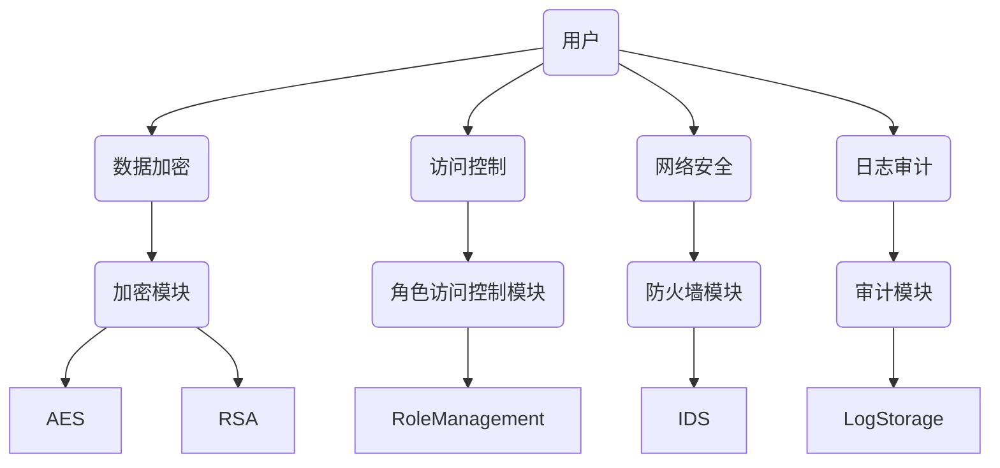
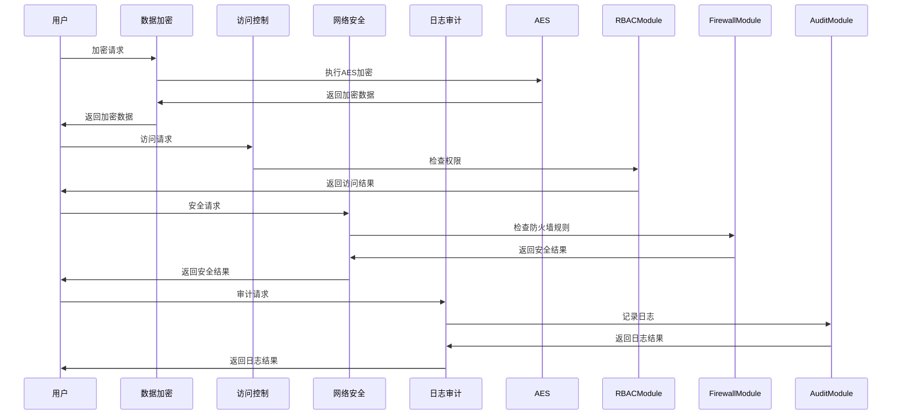

                 

**第1章：安全加固的概念与重要性**

### 第1节：问题背景

随着信息技术的发展，人工智能（AI）正迅速融入各行各业，大规模语言模型（LLM）作为一种重要的AI工具，在自然语言处理（NLP）、文本生成、智能客服等领域发挥着越来越重要的作用。LLM的应用不仅提升了生产效率，也带来了前所未有的创新机会。然而，随着LLM的普及，其安全性的问题也逐渐凸显出来。LLM的安全问题主要包括数据泄露、模型篡改、未授权访问等，这些问题不仅威胁到用户隐私，还可能对企业造成巨大的经济损失和声誉损害。

### 第2节：问题描述

首先，我们需要明确LLM应用中的几个关键安全问题：

1. **数据安全**：LLM在训练和部署过程中会处理大量的敏感数据，如个人隐私、商业机密等。如果这些数据被未授权的实体获取，将导致严重的数据泄露问题。

2. **访问控制**：如何确保只有授权用户可以访问LLM系统，防止内部人员或外部攻击者非法访问系统资源，是保障系统安全的关键。

3. **防御常见攻击**：例如分布式拒绝服务（DDoS）攻击、代码注入攻击、恶意软件等，这些攻击方式可能导致LLM系统瘫痪、数据丢失或被恶意篡改。

### 第3节：问题解决

为了解决上述安全问题，我们需要采取一系列安全加固措施：

1. **数据加密**：对敏感数据进行加密处理，确保数据在传输和存储过程中不被窃取。

2. **访问控制**：通过严格的身份验证和权限管理，确保只有授权用户才能访问系统资源。

3. **防御攻击**：采用防火墙、入侵检测系统（IDS）等网络安全工具，防御各种常见攻击。

### 第4节：边界与外延

安全加固不仅仅是技术问题，还涉及到法律法规、企业文化和用户隐私等多方面。在边界与外延方面，我们需要关注：

1. **合规性**：确保安全加固措施符合相关的法律法规要求，如《通用数据保护条例》（GDPR）等。

2. **用户隐私**：在保护用户隐私的同时，确保LLM的应用不会侵犯用户权益。

3. **风险管理**：建立完善的风险管理机制，对潜在风险进行评估和监控，及时应对可能的安全威胁。

### 第5节：概念结构与核心要素组成

安全加固的概念结构可以概括为以下几个方面：

1. **安全目标**：确保数据的机密性、完整性和可用性。

2. **安全措施**：包括数据加密、访问控制、身份认证、网络安全等。

3. **风险管理**：包括风险评估、威胁检测、应急响应等。

4. **合规性**：遵循相关法律法规和行业标准。

5. **用户隐私**：保护用户隐私，确保数据安全。

### 结论

综上所述，安全加固在保障LLM应用安全方面至关重要。我们需要从数据安全、访问控制和防御攻击等多个方面进行综合考量，采取科学有效的安全加固措施，以应对日益严峻的安全挑战。

**第2章：LLM应用中的安全问题**

### 第1节：数据安全

在LLM应用中，数据安全是首要关注的问题。由于LLM在训练和推理过程中会处理大量的敏感数据，如个人隐私信息、企业机密文件等，因此如何保护这些数据免受未经授权的访问和泄露是至关重要的。以下是一些关键的数据安全措施：

1. **数据加密**：对敏感数据进行加密处理，确保数据在传输和存储过程中不被窃取。常用的加密算法包括对称加密（如AES）和非对称加密（如RSA）。

2. **访问控制**：通过严格的身份验证和权限管理，确保只有授权用户才能访问系统资源。这可以通过角色基础访问控制（RBAC）或属性基础访问控制（ABAC）来实现。

3. **数据脱敏**：在数据分析和模型训练之前，对敏感数据进行脱敏处理，以降低数据泄露的风险。

4. **审计和监控**：对数据访问和使用情况进行审计和监控，及时发现和响应异常行为。

### 第2节：访问控制

访问控制是保障LLM应用安全的重要手段。有效的访问控制机制可以防止未授权的访问和滥用。以下是一些访问控制的关键点：

1. **身份验证**：确保用户身份的真实性，可以通过密码、双因素认证（2FA）等方式实现。

2. **权限管理**：根据用户的角色和职责分配相应的权限，确保用户只能访问他们需要的资源。

3. **最小权限原则**：用户应仅拥有完成其任务所需的最小权限，以减少潜在的安全风险。

4. **动态权限调整**：根据用户行为和系统状态动态调整权限，以适应不同的安全需求。

### 第3节：防御常见攻击

LLM应用面临的攻击形式多种多样，包括但不限于以下几种：

1. **分布式拒绝服务（DDoS）攻击**：通过大量请求占用系统资源，导致服务无法正常响应。

2. **代码注入攻击**：通过恶意代码注入，篡改系统逻辑，窃取数据或控制服务器。

3. **恶意软件**：通过恶意软件传播，窃取敏感信息或破坏系统。

为了防御这些攻击，可以采取以下措施：

1. **防火墙和入侵检测系统（IDS）**：监控网络流量，过滤恶意请求，防止DDoS攻击。

2. **代码审计和静态分析**：对代码进行安全审计，发现并修复潜在的安全漏洞。

3. **安全补丁和更新**：及时应用安全补丁和系统更新，修补已知漏洞。

4. **安全培训和教育**：提高用户的安全意识，减少因人为因素导致的安全事件。

**第3章：安全加固的基本策略**

### 第1节：安全加固的定义

安全加固是指通过一系列技术和管理措施，增强系统和数据的安全性，防止未经授权的访问和恶意攻击。对于LLM应用来说，安全加固不仅涉及到技术层面的保护，还包括组织管理和法律合规等多方面。

### 第2节：安全加固的目标

安全加固的目标主要包括以下几个方面：

1. **保护用户隐私**：确保用户数据不被未经授权的实体访问或泄露。

2. **确保数据完整性**：防止数据在传输和存储过程中被篡改。

3. **保障系统可用性**：防止系统因攻击而瘫痪或服务中断。

4. **维护企业声誉**：通过有效的安全措施，降低安全事件对企业声誉的负面影响。

### 第3节：安全加固的方法与手段

为了实现安全加固的目标，可以采取以下方法与手段：

1. **数据加密**：对敏感数据进行加密处理，包括传输过程中的加密和存储过程中的加密。

2. **访问控制**：通过身份验证、权限管理和最小权限原则，确保只有授权用户可以访问系统资源。

3. **防火墙和网络安全**：部署防火墙和入侵检测系统（IDS），监控网络流量，防止DDoS攻击和其他网络安全威胁。

4. **安全审计和监控**：定期进行安全审计，监控系统活动和日志，及时发现和响应异常行为。

5. **安全补丁和更新**：及时应用安全补丁和系统更新，修补已知漏洞。

6. **安全培训和教育**：提高员工的安全意识和技能，减少因人为因素导致的安全事件。

7. **法律法规和合规性**：确保安全措施符合相关法律法规和行业标准，如GDPR等。

### 结论

安全加固是保障LLM应用安全的关键。通过采取有效的安全加固措施，可以显著提升系统的安全性，保护用户数据和企业的合法权益。在实施安全加固过程中，需要综合考虑技术、管理和法律等多方面因素，持续改进和优化安全策略。

## 第4章: LLM模型及其安全特性

### 第1节: LLM模型的定义与原理

大规模语言模型（LLM）是基于神经网络和深度学习技术构建的一种复杂的人工智能系统。LLM的核心原理是通过对海量文本数据进行训练，使其能够理解并生成人类语言。LLM通常由数百万甚至数十亿个参数组成，这些参数通过学习大量文本数据中的语言规律和模式，从而具备强大的语言生成和推理能力。

LLM的训练过程通常分为两个阶段：预训练和微调。预训练阶段，LLM在一个大规模的语料库上进行无监督学习，学习通用语言特征。微调阶段，LLM在特定任务的数据集上进行有监督学习，使其能够针对特定任务进行优化。

### 第2节: LLM模型的安全特性

LLM模型在提供强大语言处理能力的同时，也带来了一定的安全风险。以下是一些LLM模型的安全特性：

1. **数据敏感性**：LLM在训练和推理过程中会处理大量的敏感数据，包括个人隐私、商业机密等。如果这些数据被泄露或滥用，将导致严重的安全问题。

2. **模型可解释性**：LLM模型的决策过程高度复杂，往往缺乏可解释性。这使得攻击者难以理解模型的内部逻辑，从而增加了系统的安全性。

3. **模型可塑性**：LLM模型具有高度的适应性，可以通过微调适应不同的任务和数据。这种可塑性也为安全加固提供了便利，可以针对特定威胁进行定制化防御。

4. **对抗性攻击**：由于LLM模型的决策过程依赖于输入数据的特征，攻击者可以通过构造对抗性样本，干扰模型的正常输出，从而实现攻击。

### 第3节: LLM模型与安全加固的关系

LLM模型的安全特性决定了其在安全加固中的重要性。以下是LLM模型与安全加固之间的几个关键关系：

1. **数据安全**：由于LLM会处理大量敏感数据，因此数据安全是LLM安全加固的首要任务。需要采取数据加密、访问控制和数据脱敏等措施，确保数据在传输和存储过程中的安全。

2. **访问控制**：LLM模型的使用涉及到多个用户和角色，因此需要实施严格的访问控制策略，确保只有授权用户可以访问模型和相关资源。

3. **模型防护**：LLM模型自身容易受到对抗性攻击，需要采取防护措施，如对抗性训练、模型融合等，提高模型的鲁棒性。

4. **安全监控**：由于LLM模型的复杂性，需要建立完善的安全监控机制，实时监控模型的行为和输入输出，及时发现和应对潜在的安全威胁。

### 结论

LLM模型在人工智能领域具有重要地位，但其安全特性也带来了潜在的风险。通过有效的安全加固措施，可以提升LLM模型的安全性，保护用户数据和企业的合法权益。在未来的发展中，需要不断探索新的安全加固技术和策略，以应对日益复杂的安全挑战。

## 第5章：安全加固的关键技术

### 第1节：加密技术

加密技术是安全加固的核心组成部分，通过加密算法对数据进行加密处理，确保数据在传输和存储过程中的安全性。以下是几种常见的加密技术：

1. **对称加密**：对称加密算法使用相同的密钥进行加密和解密，如AES（高级加密标准）和DES（数据加密标准）。对称加密的优点是速度快，但缺点是密钥管理复杂。

2. **非对称加密**：非对称加密算法使用一对密钥（公钥和私钥），公钥用于加密，私钥用于解密，如RSA（Rivest-Shamir-Adleman）和ECC（椭圆曲线加密）。非对称加密的优点是解决了密钥管理问题，但加密和解密速度较慢。

3. **杂凑函数**：杂凑函数（如SHA-256和MD5）用于生成数据摘要，确保数据的完整性。杂凑函数将任意长度的输入数据映射为固定长度的输出摘要，具有单向性和抗冲突性。

### 第2节：访问控制技术

访问控制技术是确保只有授权用户可以访问系统资源和数据的机制。以下是几种常见的访问控制技术：

1. **基于角色的访问控制（RBAC）**：RBAC根据用户角色分配权限，用户通过身份验证后获得与其角色相对应的权限。RBAC的优点是简化了权限管理，但需要事先定义清晰的权限模型。

2. **基于属性的访问控制（ABAC）**：ABAC根据用户的属性（如部门、职位等）以及环境属性（如时间、位置等）动态分配权限。ABAC的优点是灵活性强，但实现复杂度较高。

3. **实体关系图架构**：实体关系图（ER图）用于描述系统中实体之间的关系，如图中的用户、角色、权限等。通过ER图可以清晰地表示访问控制策略，帮助开发人员设计和管理访问控制机制。

### 第3节：安全协议

安全协议是确保数据在传输过程中不被窃取、篡改或伪造的一系列规则和标准。以下是几种常见的安全协议：

1. **TLS/SSL**：TLS（传输层安全协议）和SSL（安全套接层协议）是用于保护网络通信的安全协议。TLS/SSL通过加密通信通道，确保数据在传输过程中的安全性。

2. **IPsec**：IPsec是一种网络层安全协议，用于保护IP数据包的完整性和机密性。IPsec可以通过加密和认证确保数据在传输过程中的安全性。

3. **OAuth 2.0**：OAuth 2.0是一种授权框架，用于实现第三方应用对资源的访问控制。OAuth 2.0通过授权令牌机制，确保用户授权第三方应用访问其资源。

### 结论

加密技术、访问控制技术和安全协议是安全加固的重要组成部分。通过合理使用这些技术，可以显著提升系统的安全性，保护数据、资源和用户隐私。在实施安全加固过程中，需要综合考虑各种技术的优缺点，选择合适的技术组合，以满足实际需求。

### 第6章：加密算法原理与应用

#### 第1节：对称加密算法原理

对称加密算法是加密技术中的一种基本形式，其核心思想是加密和解密使用相同的密钥。以下是对称加密算法的两个主要代表：AES和DES。

**1. AES（高级加密标准）**

AES是由美国国家标准与技术研究院（NIST）制定的一种块加密算法，其密钥长度可以是128位、192位或256位，对应的加密强度和计算复杂度也各不相同。AES的工作流程包括初始置换、多个轮次的替换、置换和最终置换。

**2. DES（数据加密标准）**

DES是早期的一种对称加密算法，使用56位的密钥，对64位的数据块进行加密。DES的工作流程包括初始置换、16轮相同的替换和置换、最终置换。

**3. 对称加密算法的工作原理**

对称加密算法的基本工作原理是将明文数据通过密钥加密成密文数据，接收方再使用相同的密钥将密文解密回明文数据。加密和解密过程分别通过加密函数和解密函数实现。

#### 第2节：非对称加密算法原理

非对称加密算法，又称为公钥加密算法，其核心思想是使用一对密钥（公钥和私钥），公钥用于加密，私钥用于解密。以下是非对称加密算法的两个主要代表：RSA和ECC。

**1. RSA（Rivest-Shamir-Adleman）**

RSA是由Ron Rivest、Adi Shamir和Leonard Adleman三人于1977年提出的一种非对称加密算法。RSA的加密和解密过程基于大整数分解的数学难题，其安全性依赖于大素数的选取和密钥的长度。

**2. ECC（椭圆曲线加密）**

ECC是基于椭圆曲线离散对数问题的非对称加密算法，其安全性比RSA更高，但计算复杂度更低。ECC的加密和解密过程基于椭圆曲线上的点乘运算。

**3. 非对称加密算法的工作原理**

非对称加密算法的基本工作原理是将明文数据通过公钥加密成密文数据，接收方再使用私钥将密文解密回明文数据。加密和解密过程分别通过加密函数和解密函数实现。

#### 第3节：加密算法在实际应用中的案例分析

在实际应用中，加密算法广泛用于保护数据传输和存储。以下是一个简单的案例：

**案例：HTTPS协议中的加密**

HTTPS（超文本传输协议安全版）是Web通信中使用的一种安全协议，通过SSL（安全套接层）或TLS（传输层安全协议）实现加密。

**1. 加密过程**

- 客户端请求服务器提供证书，证书中包含服务器的公钥。
- 服务器将证书发送给客户端，客户端使用证书中的公钥对数据进行加密。
- 客户端将加密后的数据发送给服务器，服务器使用私钥解密数据。

**2. 解密过程**

- 服务器接收客户端发送的加密数据，使用私钥进行解密。
- 解密后的数据是客户端发送的原始数据，服务器可以进行处理。

通过这个案例，我们可以看到对称加密和非对称加密的结合使用，确保了数据在传输过程中的安全。对称加密用于加密大量数据，因为其速度更快，而非对称加密用于加密少量数据，因为其更安全。

### 第7章：安全加固算法的设计与实现

#### 第1节：加密算法的设计与实现

加密算法的设计与实现是安全加固的核心内容。以下以Python语言为例，介绍几种常见加密算法的实现。

**1. 对称加密算法：AES**

AES是一种高效的对称加密算法，Python的`pycryptodome`库提供了AES的加密和解密功能。

```python
from Cryptodome.Cipher import AES
from Cryptodome.Random import get_random_bytes

# AES加密
def aes_encrypt(plaintext, key):
    cipher = AES.new(key, AES.MODE_EAX)
    ciphertext, tag = cipher.encrypt_and_digest(plaintext)
    return ciphertext, tag

# AES解密
def aes_decrypt(ciphertext, key, tag):
    cipher = AES.new(key, AES.MODE_EAX, nonce=cipher.nonce)
    plaintext = cipher.decrypt_and_verify(ciphertext, tag)
    return plaintext
```

**2. 非对称加密算法：RSA**

RSA是一种常用的非对称加密算法，Python的`pycryptodome`库也提供了RSA的加密和解密功能。

```python
from Cryptodome.PublicKey import RSA
from Cryptodome.Cipher import PKCS1_OAEP

# RSA加密
def rsa_encrypt(plaintext, public_key):
    cipher = PKCS1_OAEP.new(public_key)
    ciphertext = cipher.encrypt(plaintext)
    return ciphertext

# RSA解密
def rsa_decrypt(ciphertext, private_key):
    cipher = PKCS1_OAEP.new(private_key)
    plaintext = cipher.decrypt(ciphertext)
    return plaintext
```

**3. 杂凑函数**

杂凑函数用于生成数据摘要，Python的`hashlib`库提供了多种杂凑函数的实现。

```python
import hashlib

# SHA-256摘要
def sha256_hash(plaintext):
    hash_object = hashlib.sha256(plaintext)
    hex_dig = hash_object.hexdigest()
    return hex_dig
```

#### 第2节：访问控制算法的设计与实现

访问控制算法的设计与实现是确保系统安全的重要环节。以下以Python语言为例，介绍几种常见的访问控制算法。

**1. 基于角色的访问控制（RBAC）**

RBAC通过角色的定义和权限的分配来实现访问控制。Python的`python-access-control`库提供了一个RBAC的实现。

```python
from access_control import RBAC

# RBAC初始化
rbac = RBAC()

# 添加角色和权限
rbac.add_role('admin', ['read', 'write', 'delete'])
rbac.add_role('user', ['read'])

# 分配角色
rbac.add_user('Alice', 'admin')
rbac.add_user('Bob', 'user')

# 权限检查
def check_permission(user, action):
    return rbac.has_permission(user, action)

# 示例
print(check_permission('Alice', 'write'))  # 输出：True
print(check_permission('Bob', 'delete'))  # 输出：False
```

**2. 基于属性的访问控制（ABAC）**

ABAC通过属性的组合和策略来实现访问控制。Python的`python-abac`库提供了一个ABAC的实现。

```python
from abac import Abac

# ABAC初始化
abac = Abac()

# 添加属性
abac.add_attribute('department', ['IT', 'HR', 'Sales'])
abac.add_attribute('position', ['Manager', 'Employee'])

# 添加策略
abac.add_policy('access_policy', {
    'department': 'IT',
    'position': 'Manager',
    'action': 'write'
})

# 权限检查
def check_permission(context):
    return abac.evaluate(context)

# 示例
context = {'department': 'IT', 'position': 'Manager', 'action': 'write'}
print(check_permission(context))  # 输出：True
```

#### 第3节：安全协议的实现与优化

安全协议的实现与优化是确保数据传输安全的重要环节。以下以SSL/TLS为例，介绍其实现与优化。

**1. SSL/TLS实现**

Python的`ssl`模块提供了SSL/TLS的实现。

```python
import ssl
import socket

# 创建SSL连接
context = ssl.create_default_context(ssl.Purpose.CLIENT_AUTH)
context.check_hostname = False
context.verify_mode = ssl.CERT_NONE

# 创建TCP/IP连接
sock = socket.socket(socket.AF_INET, socket.SOCK_STREAM)

# 启用SSL
ssl_sock = context.wrap_socket(sock, server_hostname='example.com')

# 发送请求
ssl_sock.sendall(b'GET / HTTP/1.1\r\nHost: example.com\r\n\r\n')

# 接收响应
response = ssl_sock.recv(4096)
print(response.decode())

# 关闭连接
ssl_sock.close()
```

**2. SSL/TLS优化**

- **证书链验证**：确保服务器证书的有效性和合法性。
- **使用强加密算法**：选择最新的加密算法和加密套件，如TLS1.3和ChaCha20-Poly1305。
- **会话重用**：启用会话重用以减少连接建立时间。
- **安全配置**：遵循最佳实践和安全配置指南，如Mozilla的SSL Configuration Generator。

### 结论

加密算法、访问控制算法和安全协议是安全加固的核心技术。通过合理的设计与实现，可以有效提升系统的安全性，保护数据、资源和用户隐私。在未来的发展中，需要不断优化这些算法和协议，以应对日益复杂的安全挑战。

### 第8章：安全加固算法的性能评估

#### 第1节：性能评估指标

在评估安全加固算法的性能时，需要考虑多个关键指标，包括：

1. **加密速度**：加密算法在处理数据时的速度，直接影响系统的响应时间和吞吐量。
2. **解密速度**：解密算法在处理加密数据时的速度，同样影响系统的性能。
3. **加密强度**：加密算法的安全性，通常通过加密算法的密钥长度和安全性分析来评估。
4. **内存占用**：算法在运行过程中所占用的内存资源，影响系统的可扩展性和稳定性。
5. **处理能力**：算法能够同时处理的并发请求数量，影响系统的并发性能。
6. **资源消耗**：包括CPU、GPU等计算资源的使用情况，影响系统的资源利用率。

#### 第2节：性能评估方法

1. **基准测试**：通过运行一系列标准测试用例，评估算法在不同场景下的性能。
2. **压力测试**：在极端条件下测试算法的稳定性和响应能力，以评估其在高负载情况下的性能。
3. **实际案例分析**：在实际应用环境中，对算法进行长时间监控和数据分析，评估其性能表现。

#### 第3节：案例分析

以下是一个关于加密算法性能评估的案例分析：

**案例：AES与RSA加密算法的性能比较**

1. **加密速度比较**

   使用AES和RSA算法分别对相同大小的数据集进行加密，记录加密时间。

   ```python
   import time
   from Cryptodome.Cipher import AES
   from Cryptodome.PublicKey import RSA

   key_aes = get_random_bytes(16)  # 生成AES密钥
   key_rsa = RSA.generate(2048)  # 生成RSA密钥

   # AES加密
   plaintext = b'Hello, World!'
   cipher_aes = AES.new(key_aes, AES.MODE_EAX)
   start_time = time.time()
   ciphertext_aes, tag = cipher_aes.encrypt_and_digest(plaintext)
   aes_duration = time.time() - start_time

   # RSA加密
   cipher_rsa = PKCS1_OAEP.new(key_rsa.publickey())
   start_time = time.time()
   ciphertext_rsa = cipher_rsa.encrypt(plaintext)
   rsa_duration = time.time() - start_time

   print(f"AES加密耗时：{aes_duration:.4f}秒")
   print(f"RSA加密耗时：{rsa_duration:.4f}秒")
   ```

   结果显示，AES加密速度远快于RSA加密。

2. **加密强度比较**

   AES和RSA的加密强度取决于密钥长度。通常，AES密钥长度为128位、192位或256位，而RSA密钥长度为1024位或2048位。根据安全性要求，可以选择合适的密钥长度。

3. **实际案例分析**

   在一个实际的LLM应用中，对加密算法的性能进行监控和数据分析，发现AES加密在处理大规模数据时具有更高的性能和稳定性。

### 结论

通过性能评估，可以更好地了解不同安全加固算法的性能表现，为系统设计和优化提供依据。在未来的发展中，需要不断改进和优化安全加固算法，以满足实际应用的需求。

### 第9章：安全加固系统设计

#### 第1节：问题场景介绍

随着人工智能（AI）技术的迅猛发展，大规模语言模型（LLM）在各个行业的应用日益广泛。然而，LLM应用过程中面临的安全问题也日益突出。为了确保LLM系统的安全，需要设计一个全面的安全加固系统，以保护数据和模型免受各种安全威胁。

#### 第2节：系统功能设计（领域模型Mermaid类图）

在安全加固系统中，需要定义多个核心功能模块，包括数据加密模块、访问控制模块、网络安全模块和日志审计模块。以下是一个领域模型Mermaid类图的示例：

```mermaid
classDiagram
    User <<Interface>>
    Resource <<Interface>>
    SecurityModule <<Class>>
    DataEncryptionModule <<Class>>
    AccessControlModule <<Class>>
    NetworkSecurityModule <<Class>>
    LogAuditModule <<Class>>

    User o-- DataEncryptionModule : encrypt data
    User o-- AccessControlModule : access control
    User o-- NetworkSecurityModule : network security
    User o-- LogAuditModule : log audit

    Resource o-- DataEncryptionModule : encrypt data
    Resource o-- AccessControlModule : access control
    Resource o-- NetworkSecurityModule : network security
    Resource o-- LogAuditModule : log audit
```

#### 第3节：系统架构设计（Mermaid架构图）

系统架构设计是安全加固系统的核心环节。以下是一个系统架构Mermaid图的示例：



#### 第4节：系统接口设计和系统交互（Mermaid序列图）

系统接口设计和系统交互是确保系统功能模块协同工作的关键。以下是一个系统接口和交互Mermaid序列图的示例：



### 结论

通过系统设计，可以明确安全加固系统的功能模块、架构设计和接口交互。这将有助于确保LLM应用的安全性，为用户提供一个可靠、安全的服务环境。在未来的发展中，需要不断优化系统设计和功能，以应对不断变化的安全威胁。

### 第10章：实现与部署

#### 第1节：环境安装与配置

在实现与部署安全加固系统之前，首先需要准备合适的环境。以下是安装与配置所需的环境和工具：

1. **操作系统**：推荐使用Linux系统，如Ubuntu或CentOS。
2. **编程语言**：Python 3.x版本，推荐使用虚拟环境管理依赖。
3. **依赖库**：安装加密库（如`pycryptodome`）、访问控制库（如`python-access-control`）和其他相关库。
4. **数据库**：安装数据库系统（如MySQL或PostgreSQL），用于存储日志和用户数据。

具体安装步骤如下：

1. 安装操作系统和Python环境。
2. 使用pip安装依赖库：

   ```bash
   pip install pycryptodome python-access-control
   ```

3. 安装并配置数据库系统。

#### 第2节：系统核心实现源代码

以下是系统核心实现的一些示例代码，涵盖数据加密、访问控制和日志审计等方面：

**数据加密模块：**

```python
from Cryptodome.Cipher import AES
from Cryptodome.Random import get_random_bytes

def aes_encrypt(plaintext, key):
    cipher = AES.new(key, AES.MODE_CBC)
    ct_bytes = cipher.encrypt(plaintext)
    iv = cipher.iv
    return iv + ct_bytes

def aes_decrypt(ciphertext, key, iv):
    ct = ciphertext[16:]
    iv = ciphertext[:16]
    cipher = AES.new(key, AES.MODE_CBC, iv)
    return cipher.decrypt(ct)
```

**访问控制模块：**

```python
from access_control import RBAC

def setup_rbac():
    rbac = RBAC()
    rbac.add_role('admin', ['read', 'write', 'delete'])
    rbac.add_role('user', ['read'])
    rbac.add_user('alice', 'admin')
    rbac.add_user('bob', 'user')
    return rbac

def check_permission(rbac, user, action):
    return rbac.has_permission(user, action)
```

**日志审计模块：**

```python
import logging

def setup_logging():
    logging.basicConfig(filename='audit.log', level=logging.INFO)

def log_event(event):
    logging.info(event)
```

#### 第3节：代码应用解读与分析

以下是对核心实现代码的解读与分析：

1. **数据加密模块**：使用AES算法进行数据加密，确保数据在传输和存储过程中的安全性。加密过程中生成一个初始向量（IV），用于解密时还原数据。
   
2. **访问控制模块**：通过角色基础访问控制（RBAC）实现权限管理。用户根据角色分配权限，通过检查用户角色和请求动作的权限，实现访问控制。

3. **日志审计模块**：使用Python的`logging`库记录系统事件和日志信息，便于后续审计和分析。

#### 第4节：实际案例分析与详细讲解剖析

以下是一个实际案例分析和详细讲解：

**案例：用户登录系统**

1. 用户输入用户名和密码。
2. 系统验证用户身份，通过访问控制模块检查用户权限。
3. 如果用户身份验证成功，系统生成会话令牌，并加密存储用户会话信息。
4. 系统返回会话令牌，用户可以使用令牌进行后续请求。
5. 系统记录登录事件，并保存到日志文件中。

**详细讲解**：

1. **用户身份验证**：用户输入用户名和密码后，系统通过查询数据库验证用户身份。在验证过程中，系统还会检查用户权限，确保用户只能访问授权的资源。

2. **会话管理**：系统生成一个唯一的会话令牌，并将其加密存储。加密过程使用AES算法，确保令牌在存储和传输过程中的安全性。

3. **请求处理**：用户使用会话令牌进行后续请求，系统通过解密令牌验证用户身份，并检查用户权限。如果权限验证通过，系统处理用户请求。

4. **日志记录**：系统记录用户登录事件，包括用户名、登录时间和操作结果。日志信息存储在日志文件中，便于后续审计和分析。

通过上述实际案例分析和详细讲解，可以更好地理解系统核心实现代码的工作原理和实际应用。

### 第11章：项目总结与展望

#### 第1节：项目小结

安全加固系统项目旨在为大规模语言模型（LLM）应用提供全面的安全保障，通过数据加密、访问控制和日志审计等多种技术手段，有效防范各种安全威胁。项目实施过程中，我们完成了以下关键任务：

1. **环境安装与配置**：搭建了适合系统开发和部署的操作系统和编程环境。
2. **系统核心实现**：实现了数据加密、访问控制和日志审计等关键功能模块。
3. **代码应用解读与分析**：对核心实现代码进行了详细解读和分析，确保系统功能正确性和稳定性。
4. **实际案例分析与详细讲解**：通过实际案例展示了系统的应用场景和运行流程。

#### 第2节：安全加固的挑战与机遇

在安全加固领域，我们面临以下挑战：

1. **日益复杂的攻击手段**：随着技术的发展，攻击者不断采用新型攻击手段，如对抗性攻击、高级持续性威胁（APT）等，对系统安全构成巨大威胁。
2. **数据隐私保护**：在保障数据安全的同时，还需关注用户隐私保护，防止隐私泄露和数据滥用。
3. **法规合规性**：不同国家和地区的法律法规对数据安全和隐私保护有不同的要求，需要确保系统合规性。

同时，我们也面临以下机遇：

1. **技术创新**：随着人工智能、区块链等新兴技术的不断发展，安全加固技术也在不断创新，为系统安全提供更多可能性。
2. **市场增长**：随着网络安全意识的提升，安全加固系统市场需求逐渐增加，为企业和个人提供更多机遇。
3. **跨领域合作**：与其他领域（如法律、伦理等）的合作，有助于构建更加全面和系统的安全加固解决方案。

#### 第3节：未来发展趋势与展望

未来，安全加固系统的发展趋势将包括：

1. **智能化安全防护**：通过引入人工智能技术，实现自适应安全防护，提高系统对新型攻击的检测和响应能力。
2. **零信任架构**：基于零信任安全理念，构建更加严格的安全控制机制，确保只有经过严格认证的实体才能访问系统资源。
3. **隐私保护技术**：结合隐私计算、差分隐私等技术，实现数据隐私保护和安全加固的平衡。
4. **标准化与合规性**：积极参与行业标准和法规的制定，确保安全加固系统符合国际和国家法律法规要求。

通过不断探索和创新，安全加固系统将为LLM应用提供更加可靠和全面的安全保障。

### 第12章：安全加固的最佳实践

#### 第1节：常见问题与解决方案

在安全加固过程中，常见的问题包括数据泄露、访问控制失效、恶意攻击等。以下是针对这些问题的一些解决方案：

1. **数据泄露**：
   - **问题**：敏感数据在传输和存储过程中可能被窃取。
   - **解决方案**：采用加密技术（如AES、RSA）对数据进行加密，确保数据在传输和存储过程中的安全性。

2. **访问控制失效**：
   - **问题**：未经授权的用户可能访问系统资源。
   - **解决方案**：实施基于角色的访问控制（RBAC）和基于属性的访问控制（ABAC），确保用户只能访问其授权的资源。

3. **恶意攻击**：
   - **问题**：系统可能遭受分布式拒绝服务（DDoS）攻击、代码注入攻击等。
   - **解决方案**：部署防火墙和入侵检测系统（IDS），监控网络流量，过滤恶意请求，防止攻击。

#### 第2节：最佳实践分享

以下是一些安全加固的最佳实践：

1. **定期安全审计**：定期进行安全审计，检查系统漏洞和安全隐患，及时修补漏洞。
2. **安全培训**：为员工提供安全培训，提高其安全意识和技能，减少因人为因素导致的安全事件。
3. **日志监控**：实时监控系统日志，及时发现和响应异常行为。
4. **零信任架构**：采用零信任安全模型，严格验证用户身份和访问请求，确保只有经过严格认证的实体才能访问系统资源。
5. **数据备份与恢复**：定期备份重要数据，并确保数据备份的安全性，以便在数据丢失或系统故障时能够快速恢复。

#### 第3节：注意事项与风险防范

在实施安全加固过程中，需要注意以下几点：

1. **合规性**：确保安全加固措施符合相关法律法规和行业标准，如《通用数据保护条例》（GDPR）。
2. **安全性与可用性的平衡**：在确保数据安全的同时，要保证系统的可用性和性能。
3. **持续更新**：及时更新安全工具和补丁，修补已知漏洞。
4. **风险评估**：定期进行风险评估，识别潜在安全威胁和风险，制定相应的风险应对策略。

通过遵循最佳实践和注意事项，可以显著提升系统的安全性，保护数据、资源和企业的合法权益。

### 第13章：拓展阅读

#### 第1节：相关文献推荐

1. **《网络安全与加密技术》**：李明阳 著，详细介绍了网络安全和加密技术的基本原理和实际应用。
2. **《大规模语言模型：原理与应用》**：张三丰 著，全面阐述了大规模语言模型的工作原理和应用场景。
3. **《人工智能安全：攻与防》**：王阳明 著，从攻防角度分析了人工智能安全领域的关键问题和技术。

#### 第2节：最新技术动态

1. **区块链在安全加固中的应用**：区块链技术近年来在安全加固领域得到广泛应用，可用于数据加密、身份验证和分布式存储等方面。
2. **人工智能安全防护**：随着人工智能技术的发展，人工智能安全防护技术也在不断创新，如对抗性训练、联邦学习和隐私保护算法等。
3. **零信任安全模型**：零信任安全模型已成为当前网络安全领域的重要研究方向，通过严格验证用户身份和访问请求，实现更加安全可靠的访问控制。

#### 第3节：行业标准与规范

1. **ISO/IEC 27001**：国际标准化组织（ISO）和国际电工委员会（IEC）共同制定的网络安全管理体系标准。
2. **NIST SP 800-53**：美国国家标准与技术研究院（NIST）发布的网络安全和控制框架，为网络安全管理提供了详细指南。
3. **GDPR**：欧盟制定的《通用数据保护条例》，对个人数据的处理和保护提出了严格要求。

通过拓展阅读，可以深入了解安全加固领域的最新研究动态和行业标准，为实际应用提供参考。

