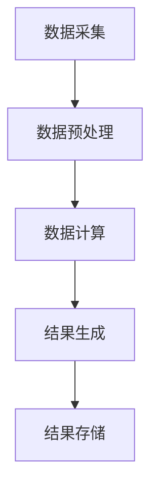

                 

# 实时评测的流处理架构设计

> 关键词：实时评测、流处理、架构设计、系统优化、算法实现

> 摘要：
本文将深入探讨实时评测的流处理架构设计，从背景介绍到核心概念、算法原理、系统架构设计、项目实战以及最佳实践，逐步解析这一技术领域的关键要素。本文旨在为读者提供一个全面而深入的指南，帮助理解实时评测流处理架构的设计与实施，从而应对现代数据驱动应用中的实时性挑战。

### 目录大纲

1. **流处理基础**
    1.1 流处理概述
    1.2 流处理与传统批处理的区别
    1.3 流处理的关键概念与术语
2. **实时评测技术**
    2.1 实时评测的定义与目标
    2.2 实时评测的挑战与解决方案
    2.3 实时评测技术的关键要素
3. **实时评测流处理架构设计**
    3.1 系统设计与规划
    3.2 流处理架构实施
    3.3 实时评测算法实现
4. **架构性能调优与优化**
    4.1 性能调优策略与方法
    4.2 性能监控与日志分析
    4.3 架构优化实践与案例分析
5. **最佳实践与经验总结**
    5.1 实时评测流处理项目的最佳实践
    5.2 遇到的问题与解决方案
    5.3 经验总结与未来展望
6. **附录：参考资料与拓展阅读**

### 1. 流处理基础

#### 1.1 流处理概述

流处理是一种计算方法，它允许系统对数据流进行持续地处理和分析，而不是在数据收集完毕后进行批处理。这种方法的优点在于能够实现低延迟的数据分析和处理，适用于需要实时响应的场景，如股票市场交易分析、实时搜索引擎和社交媒体数据监控等。

#### 1.2 流处理与传统批处理的区别

- **处理模式**：批处理在数据收集完成后进行一次性处理，而流处理则对数据流进行实时处理。
- **延迟**：批处理通常有较高的延迟，而流处理能够实现低延迟处理。
- **资源利用**：批处理适合处理大量数据，而流处理更注重数据流的连续性和实时性。

#### 1.3 流处理的关键概念与术语

- **数据流**：数据的连续流动，是流处理的核心概念。
- **事件驱动**：流处理通常采用事件驱动的方式，对数据的变更进行处理。
- **窗口机制**：用于定义数据流的处理时间范围，如滑动窗口、固定窗口等。
- **状态保持**：流处理需要维护处理过程中的状态信息，以便连续处理。

### 2. 实时评测技术

#### 2.1 实时评测的定义与目标

实时评测是一种技术手段，它能够在数据产生的同时对其进行处理和分析，以实现对数据的实时监控和评估。其目标是快速、准确地提供评估结果，以支持实时决策。

#### 2.2 实时评测的挑战与解决方案

实时评测面临的主要挑战包括：

- **数据量**：实时处理大量的数据流。
- **延迟**：确保数据处理的低延迟。
- **准确性**：保证评估结果的准确性。

解决方案包括：

- **高效的数据处理引擎**：使用高效的流处理引擎，如Apache Kafka、Apache Flink等。
- **分布式架构**：采用分布式架构，以提高系统的处理能力和容错性。
- **并行处理**：对数据流进行并行处理，以提高处理速度。

#### 2.3 实时评测技术的关键要素

实时评测技术的关键要素包括：

- **数据采集**：高效的数据采集系统，如消息队列、日志收集系统等。
- **数据处理**：流处理框架，如Apache Kafka、Apache Flink、Apache Storm等。
- **算法库**：丰富的算法库，以支持不同的评估需求。
- **可视化**：实时数据监控和评估结果的可视化展示。

### 3. 实时评测流处理架构设计

#### 3.1 系统设计与规划

系统设计需要考虑以下方面：

- **需求分析**：明确实时评测的需求和目标。
- **数据流设计**：设计数据流和处理逻辑。
- **系统架构**：选择合适的系统架构，如分布式架构、微服务架构等。
- **性能规划**：规划系统的性能指标和性能瓶颈。

#### 3.2 流处理架构实施

流处理架构的实施包括：

- **硬件选择**：选择合适的硬件，如CPU、内存、存储等。
- **软件选择**：选择合适的流处理框架和工具，如Apache Kafka、Apache Flink等。
- **系统部署**：部署流处理系统和相关组件。
- **配置调优**：对系统进行配置调优，以提高性能和稳定性。

#### 3.3 实时评测算法实现

实时评测算法的实现包括：

- **算法设计**：设计合适的实时评测算法。
- **流程设计**：使用Mermaid流程图设计算法处理流程。
- **代码实现**：使用Python等编程语言实现算法。
- **性能分析**：对算法性能进行分析和优化。

### 4. 架构性能调优与优化

#### 4.1 性能调优策略与方法

性能调优包括：

- **资源调优**：调整系统资源分配，如CPU、内存等。
- **算法优化**：优化算法效率和性能。
- **分布式处理**：利用分布式架构，提高处理能力。

#### 4.2 性能监控与日志分析

性能监控包括：

- **监控指标**：设定性能监控指标，如延迟、吞吐量等。
- **日志分析**：分析系统日志，定位性能瓶颈。

#### 4.3 架构优化实践与案例分析

架构优化实践包括：

- **案例分享**：分享实际项目的架构优化经验。
- **案例分析**：分析优化前后系统性能的变化。

### 5. 最佳实践与经验总结

最佳实践包括：

- **设计原则**：总结设计原则，如高可用性、可扩展性等。
- **解决方案**：总结有效的解决方案，如分布式架构、缓存机制等。
- **注意事项**：总结注意事项，如数据安全性、系统稳定性等。
- **拓展阅读**：推荐相关书籍、文章和资源。

### 附录：参考资料与拓展阅读

- [实时评测技术综述](https://example.com/real-time-evaluation-overview)
- [流处理框架比较](https://example.com/stream-processing-frameworks-comparison)
- [分布式系统设计](https://example.com/distributed-system-design)
- [性能优化技巧](https://example.com/performance-optimization-tips)

### 作者

作者：AI天才研究院/AI Genius Institute & 禅与计算机程序设计艺术 /Zen And The Art of Computer Programming

本文内容涵盖了实时评测流处理架构设计的各个方面，从基础概念到实施细节，再到性能优化和最佳实践。通过本文，读者可以全面了解实时评测流处理架构的设计与实现，为实际项目提供有力的技术支持和指导。

---

在接下来的部分，我们将逐步深入每一个章节，详细阐述每个部分的核心内容和技术要点。接下来，我们将进入**第1章：流处理概述**，详细讨论流处理的背景、重要性、与传统批处理的区别，以及流处理的关键概念和术语。**让我们一步一步深入思考，理解这一关键技术。**## 第1章：流处理概述

### 1.1 流处理背景与重要性

流处理（Stream Processing）是一种数据处理方法，它能够对连续的数据流进行实时处理和分析。随着互联网和大数据技术的快速发展，数据量呈爆炸式增长，传统的批处理（Batch Processing）方法逐渐无法满足实时性要求。批处理通常在数据收集完成后，对大量数据进行一次性处理，这种方法的优点是处理效率高，但缺点是延迟大，不适合需要即时响应的应用场景。

流处理则不同，它能够实时地对数据进行处理，并立即反馈结果。这种实时性使其在许多领域具有重要应用价值，如金融交易系统、实时搜索引擎、物联网（IoT）数据处理、实时监控和预警等。在这些应用中，流处理能够提供快速、准确的决策支持，从而提高系统的效率和可靠性。

### 1.2 流处理与传统批处理的区别

#### 处理模式

- **批处理**：批处理是将一组任务集中在一起，在特定的时间窗口内完成。这种处理模式适合处理大量静态数据，例如大数据分析、离线报告生成等。
- **流处理**：流处理则是对数据流进行实时处理。数据流以事件的形式连续到达，系统需要即时处理并反馈结果。这种处理模式适合处理动态数据，例如实时股票交易分析、实时搜索引擎查询等。

#### 延迟

- **批处理**：由于数据需要在收集完成后才能处理，因此批处理通常有较高的延迟。在一些应用场景中，这种延迟是无法容忍的。
- **流处理**：流处理能够在数据产生的同时进行处理，延迟极低，甚至可以达到毫秒级。这种低延迟使得流处理在需要即时响应的场景中具有明显优势。

#### 资源利用

- **批处理**：批处理通常在数据收集完成后，一次性处理大量的数据，能够高效利用计算资源。
- **流处理**：流处理则需要持续地处理数据流，需要保持系统的高可用性和资源的高效利用。

### 1.3 流处理的关键概念与术语

#### 数据流

数据流（Data Stream）是指数据的连续流动。在流处理中，数据流可以看作是由一系列事件组成，每个事件都携带一定的数据信息。数据流的特点是连续性、动态性和不确定性。

#### 事件驱动

事件驱动（Event-Driven）是一种编程模型，它以事件为中心，系统根据事件的发生来触发相应的处理逻辑。在流处理中，事件驱动模型能够更好地应对数据的动态性，提高系统的灵活性和可扩展性。

#### 窗口机制

窗口机制（Windowing Mechanism）用于定义数据流的处理时间范围。流处理中的窗口可以是固定的，也可以是滑动的。例如，一个固定窗口可以处理过去1小时的数据，而滑动窗口则可以实时更新，处理过去5分钟的数据。

#### 状态保持

状态保持（State Management）是流处理中的一个重要概念。由于流处理需要处理连续的数据流，因此需要维护处理过程中的状态信息，以便连续处理。状态保持可以是简单的计数器，也可以是复杂的分布式状态存储系统。

### 总结

流处理作为一种实时数据处理方法，具有低延迟、高实时性和动态性的特点，能够满足现代应用场景中对实时性的需求。与传统批处理相比，流处理在处理模式、延迟和资源利用等方面具有显著优势。流处理的关键概念和术语包括数据流、事件驱动、窗口机制和状态保持等。理解这些概念和术语对于设计和实现有效的流处理系统至关重要。

在下一章中，我们将进一步探讨流处理的技术原理，包括数据流模型与抽象、流处理引擎架构和流处理算法与优化。通过这一系列的讨论，我们将逐步构建对实时评测流处理架构设计的全面理解。**让我们继续深入探讨，揭示流处理技术的核心原理。**## 第2章：流处理技术原理

### 2.1 数据流模型与抽象

数据流模型（Data Stream Model）是流处理系统的核心，它定义了数据在系统中的流动方式和处理方式。数据流模型通常采用事件驱动的抽象方式，将数据流视作一系列的事件序列。

#### 事件

事件（Event）是数据流的基本单元，它包含特定的时间戳和数据内容。事件可以是简单的数据记录，也可以是复杂的消息，例如股票交易记录、传感器数据、网络流量数据等。

#### 时间戳

时间戳（Timestamp）是事件发生的时间点。在流处理中，时间戳用于排序和调度事件。事件通常按照时间戳顺序进行处理，以确保数据的正确性和一致性。

#### 事件序列

事件序列（Event Sequence）是由一系列有序的事件组成。事件序列反映了数据流的历史变化，是流处理系统进行状态维护和决策分析的基础。

#### 流处理模型

流处理模型（Stream Processing Model）是对数据流的抽象表示，它定义了数据流的结构和行为。常见的流处理模型包括无状态流处理（Stateless Stream Processing）和有状态流处理（Stateful Stream Processing）。

- **无状态流处理**：无状态流处理不维护处理过程中的状态信息。每个事件独立进行处理，处理结果仅依赖于当前事件。这种模型适用于简单的数据处理任务，例如数据过滤和计数。
- **有状态流处理**：有状态流处理维护处理过程中的状态信息。处理结果不仅依赖于当前事件，还依赖于历史事件。这种模型适用于复杂的数据处理任务，例如窗口计算、关联分析和实时预测。

### 2.2 流处理引擎架构

流处理引擎（Stream Processing Engine）是流处理系统的核心组件，它负责处理数据流并生成结果。流处理引擎通常采用分布式架构，以提高系统的处理能力和容错性。

#### 分布式架构

分布式架构（Distributed Architecture）将系统分解为多个节点，每个节点负责处理一部分数据流。节点之间通过网络进行通信，协同工作，完成数据处理任务。

- **节点**：节点（Node）是分布式系统中的基本计算单元。节点负责处理分配给自己的数据流，并将结果发送给其他节点。节点可以是物理服务器，也可以是虚拟机或容器。
- **网络**：网络（Network）负责节点之间的数据传输。网络的高可用性和低延迟对系统的性能和稳定性至关重要。
- **通信协议**：通信协议（Communication Protocol）定义了节点之间的通信方式和数据格式。常见的通信协议包括TCP、UDP和HTTP等。

#### 工作流程

流处理引擎的工作流程通常包括以下步骤：

1. **数据采集**：从数据源（如数据库、消息队列或传感器）采集数据。
2. **数据传输**：将数据传输到流处理引擎的节点。
3. **数据处理**：节点对数据流进行计算和分析，生成中间结果。
4. **结果存储**：将处理结果存储到目标数据存储（如数据库、文件系统或分布式缓存）。
5. **错误处理**：检测和处理处理过程中的错误和异常。

### 2.3 流处理算法与优化

流处理算法（Stream Processing Algorithm）是流处理系统的核心，它定义了如何处理数据流以生成所需的结果。流处理算法需要满足低延迟、高效率和可扩展性的要求。

#### 算法类型

流处理算法可以分为以下几种类型：

- **基础算法**：如过滤、聚合、排序等。这些算法是流处理系统的基础，适用于简单的数据处理任务。
- **高级算法**：如窗口计算、关联分析、实时预测等。这些算法适用于复杂的数据处理任务，需要更高的计算复杂度和算法优化。
- **机器学习算法**：如分类、回归、聚类等。这些算法可以用于流处理系统中的实时分析和预测。

#### 算法优化

流处理算法的优化目标是提高处理效率和系统性能。常见的优化方法包括：

- **并行处理**：通过将数据流分配到多个节点，实现并行处理，提高处理速度。
- **内存优化**：通过减少内存占用，提高系统的吞吐量和并发能力。
- **算法简化**：通过简化算法，减少计算复杂度，降低系统的负载。
- **分布式缓存**：通过分布式缓存，减少数据访问延迟，提高系统的响应速度。

### 总结

流处理技术原理涵盖了数据流模型与抽象、流处理引擎架构和流处理算法与优化。数据流模型定义了数据流的结构和行为，流处理引擎负责处理数据流并生成结果，流处理算法则实现了数据处理的逻辑。理解这些技术原理对于设计和实现高效的流处理系统至关重要。

在下一章中，我们将探讨实时评测技术，包括实时评测的定义与目标、实时评测的挑战与解决方案，以及实时评测技术的关键要素。通过这一系列的讨论，我们将进一步理解实时评测在流处理架构设计中的应用。**让我们继续深入探讨，揭示实时评测技术的核心原理。**## 第3章：实时评测技术

### 3.1 实时评测的定义与目标

实时评测（Real-time Evaluation）是一种技术手段，它能够在数据产生的同时对其进行处理和分析，以实现对数据的实时监控和评估。实时评测的目标是快速、准确地提供评估结果，以支持实时决策。与离线评估相比，实时评测具有以下特点：

- **低延迟**：实时评测能够在数据产生后立即进行处理，延迟通常在毫秒级。
- **高准确性**：实时评测需要保证评估结果的准确性，以满足决策支持的需求。
- **动态性**：实时评测能够应对数据流的动态变化，适应不同场景的需求。

### 3.2 实时评测的挑战与解决方案

实时评测在实现过程中面临以下挑战：

#### 数据量

实时评测需要处理大量的数据流，数据量可能呈指数级增长。这种高数据量要求系统具有高吞吐量和低延迟。

- **解决方案**：采用分布式架构，将数据流分配到多个节点进行处理，以提高处理能力和吞吐量。

#### 延迟

实时评测要求低延迟，以满足实时决策的需求。高延迟可能导致决策延误，影响系统性能。

- **解决方案**：优化算法，减少数据处理过程中的延迟。采用高效的数据处理引擎，如Apache Kafka、Apache Flink等。

#### 准确性

实时评测需要保证评估结果的准确性，避免错误评估导致决策失误。

- **解决方案**：采用高效的算法和模型，确保评估结果的准确性。进行数据验证和模型验证，确保评估过程的可靠性。

#### 系统稳定性

实时评测系统需要具备高可用性和稳定性，确保在数据流高峰期能够稳定运行。

- **解决方案**：进行系统压力测试和性能调优，确保系统在高负载下能够稳定运行。采用分布式架构和容错机制，提高系统的可靠性。

### 3.3 实时评测技术的关键要素

实时评测技术的关键要素包括以下几个方面：

#### 数据采集

数据采集是实时评测的基础，需要高效、稳定地采集数据流。

- **数据源**：包括数据库、消息队列、日志文件、传感器等。
- **采集方式**：采用日志采集、流式采集等方式，确保数据流的连续性和完整性。

#### 数据处理

数据处理是实时评测的核心，需要对数据进行清洗、转换和分析。

- **数据处理引擎**：采用高效的流处理引擎，如Apache Kafka、Apache Flink等。
- **数据处理流程**：设计数据处理流程，包括数据清洗、转换、聚合和评估等。

#### 算法与模型

算法与模型是实现实时评测的关键，需要选择合适的算法和模型，确保评估结果的准确性。

- **算法类型**：包括基础算法、高级算法和机器学习算法等。
- **模型优化**：采用模型优化技术，提高模型的性能和准确性。

#### 可视化与监控

可视化与监控是实时评测的重要组成部分，能够实时展示评估结果和系统状态。

- **可视化工具**：采用可视化工具，如Kibana、Grafana等，展示评估结果和系统指标。
- **监控指标**：设定监控指标，如延迟、吞吐量、错误率等，监控系统性能。

### 总结

实时评测技术是一种在数据产生的同时进行实时处理和分析的技术手段，具有低延迟、高准确性和动态性的特点。实时评测在实现过程中面临数据量、延迟、准确性和系统稳定性等挑战。为了应对这些挑战，需要采用分布式架构、高效的数据处理引擎和算法模型，并进行系统优化和监控。

在下一章中，我们将讨论实时评测流处理架构设计，包括系统设计与规划、流处理架构实施和实时评测算法实现。通过这一系列的讨论，我们将深入理解实时评测流处理架构的设计与实现，为实际项目提供技术支持和指导。**让我们继续深入探讨，了解实时评测流处理架构的设计与实施。**## 第4章：实时评测流处理架构设计

### 4.1 系统设计与规划

系统设计与规划是实时评测流处理架构设计的首要步骤，它决定了系统的整体结构和性能。在这一节中，我们将从需求分析、数据流设计、系统架构设计等方面进行详细讨论。

#### 需求分析

需求分析是系统设计的基础，它明确了系统需要实现的功能和性能指标。对于实时评测系统，需求分析通常包括以下几个方面：

- **实时性**：系统需要实现低延迟的数据处理，确保评估结果能够实时反馈。
- **准确性**：系统需要保证评估结果的准确性，避免因错误评估导致决策失误。
- **扩展性**：系统需要具备良好的扩展性，以应对数据量和并发请求的增加。
- **稳定性**：系统需要在高负载下保持稳定运行，确保系统的可靠性和可用性。

#### 数据流设计

数据流设计是系统设计的关键环节，它定义了数据在系统中的流动路径和处理方式。实时评测系统的数据流通常包括以下几个阶段：

1. **数据采集**：从各种数据源（如数据库、消息队列、传感器等）采集数据。
2. **数据预处理**：对采集到的数据进行清洗、转换和格式化，确保数据的质量和一致性。
3. **数据处理**：对预处理后的数据应用实时评测算法，生成评估结果。
4. **结果存储**：将评估结果存储到目标存储系统（如数据库、文件系统等），以便后续分析和查询。

#### 系统架构设计

系统架构设计是系统设计的核心，它决定了系统的可扩展性和可维护性。实时评测系统的架构设计通常采用分布式架构，以提高系统的处理能力和容错性。以下是常见的系统架构设计：

1. **数据采集层**：包括各种数据源和采集工具，如数据库、消息队列、日志文件等。
2. **数据处理层**：包括流处理引擎、实时评测算法和中间数据存储，如Apache Kafka、Apache Flink等。
3. **结果存储层**：包括数据库、文件系统、分布式缓存等，用于存储和处理评估结果。
4. **监控与运维层**：包括监控系统、日志分析工具、运维平台等，用于监控系统状态和进行运维操作。

### 4.2 流处理架构实施

流处理架构的实施是实时评测流处理架构设计的关键环节，它涉及硬件选择、软件选择、系统部署和配置调优等方面。

#### 硬件选择

硬件选择是系统性能的基础，需要考虑以下几个方面：

- **CPU**：选择多核CPU，以提高处理能力。
- **内存**：选择大容量内存，以确保系统能够处理大量数据。
- **存储**：选择高性能存储设备，如固态硬盘（SSD），以提高数据读写速度。
- **网络**：选择高带宽、低延迟的网络设备，以确保数据传输的效率。

#### 软件选择

软件选择是系统稳定性和扩展性的保障，需要考虑以下几个方面：

- **流处理框架**：选择成熟的流处理框架，如Apache Kafka、Apache Flink、Apache Storm等。
- **数据处理库**：选择合适的数据处理库，如Python的Pandas、NumPy等。
- **存储系统**：选择合适的存储系统，如关系型数据库、NoSQL数据库、分布式文件系统等。
- **监控工具**：选择合适的监控工具，如Kibana、Grafana、Prometheus等。

#### 系统部署

系统部署是将软件安装到硬件设备上，并进行配置的过程。部署过程通常包括以下几个步骤：

1. **安装操作系统**：在硬件设备上安装操作系统，如Linux、Windows等。
2. **安装依赖库**：安装所需的依赖库和开发工具，如Java、Python等。
3. **安装流处理框架**：安装所选定的流处理框架，如Apache Kafka、Apache Flink等。
4. **配置系统**：根据需求配置系统参数，如网络配置、存储配置、内存配置等。

#### 配置调优

配置调优是提高系统性能和稳定性的关键步骤，需要根据实际情况进行优化。以下是常见的配置调优方法：

- **CPU调优**：调整CPU内核数、线程数和频率，以提高处理能力。
- **内存调优**：调整内存大小、缓存策略和垃圾回收器，以提高内存利用率和系统性能。
- **存储调优**：调整存储设备的大小、类型和读写策略，以提高数据读写速度。
- **网络调优**：调整网络带宽、延迟和丢包率，以提高数据传输效率。

### 4.3 系统模块划分与功能

在实时评测流处理架构中，系统模块划分与功能设计是关键的一步。合理的模块划分和功能设计可以提高系统的可维护性和可扩展性。以下是常见的系统模块划分与功能设计：

#### 数据采集模块

数据采集模块负责从各种数据源采集数据，并将其转换为系统可以处理的数据格式。功能包括：

- **数据采集**：从数据库、消息队列、日志文件、传感器等数据源采集数据。
- **数据清洗**：对采集到的数据进行清洗、转换和格式化，确保数据的质量和一致性。

#### 数据处理模块

数据处理模块负责对采集到的数据应用实时评测算法，生成评估结果。功能包括：

- **数据处理**：使用流处理引擎对数据进行处理，如过滤、聚合、排序等。
- **实时评测**：应用实时评测算法，生成评估结果，如实时监控指标、预测结果等。

#### 结果存储模块

结果存储模块负责将评估结果存储到目标存储系统，以便后续分析和查询。功能包括：

- **结果存储**：将评估结果存储到数据库、文件系统、分布式缓存等存储系统。
- **数据查询**：提供数据查询接口，支持对评估结果进行查询和分析。

#### 监控与运维模块

监控与运维模块负责监控系统状态、记录日志、进行故障排查和系统维护。功能包括：

- **系统监控**：监控系统性能指标，如延迟、吞吐量、错误率等。
- **日志分析**：分析系统日志，定位故障点和性能瓶颈。
- **运维操作**：进行系统备份、升级、故障排查等运维操作。

### 总结

实时评测流处理架构设计是实时评测系统的核心环节，它决定了系统的性能、稳定性和可扩展性。系统设计与规划、流处理架构实施和系统模块划分与功能设计是实时评测流处理架构设计的关键步骤。通过合理的系统设计和实施，可以构建高效、稳定、可扩展的实时评测流处理系统。

在下一章中，我们将讨论实时评测算法的实现，包括算法设计、流程设计、代码实现和性能分析。通过这一系列的讨论，我们将深入理解实时评测算法的实现细节，为实际项目提供技术支持和指导。**让我们继续深入探讨，了解实时评测算法的实现。**## 第5章：实时评测算法实现

### 5.1 评测算法原理与设计

实时评测算法是实时评测系统的核心组成部分，它负责对数据流进行计算和分析，以生成评估结果。在本节中，我们将介绍实时评测算法的原理与设计，包括算法原理、设计流程和设计原则。

#### 算法原理

实时评测算法的原理可以概括为以下几个步骤：

1. **数据采集**：从数据源（如数据库、消息队列、传感器等）采集数据。
2. **数据预处理**：对采集到的数据进行清洗、转换和格式化，确保数据的质量和一致性。
3. **数据计算**：对预处理后的数据应用算法，进行计算和分析。
4. **结果生成**：根据计算结果生成评估报告或实时监控指标。

常见的实时评测算法包括：

- **基础算法**：如过滤、聚合、排序等，适用于简单的数据处理任务。
- **高级算法**：如窗口计算、关联分析、实时预测等，适用于复杂的数据处理任务。
- **机器学习算法**：如分类、回归、聚类等，可以用于实时分析和预测。

#### 设计流程

实时评测算法的设计流程通常包括以下步骤：

1. **需求分析**：明确实时评测的需求和目标，确定需要实现的评估指标和算法类型。
2. **算法选择**：根据需求分析结果，选择合适的算法类型和实现方式。
3. **算法设计**：设计算法的核心逻辑和计算流程，包括数据处理、计算和结果生成等步骤。
4. **算法实现**：编写算法代码，实现算法的核心功能。
5. **性能优化**：对算法进行性能优化，提高处理效率和系统性能。

#### 设计原则

实时评测算法的设计应遵循以下原则：

- **可扩展性**：算法应具备良好的扩展性，能够适应不同规模的数据处理需求。
- **可维护性**：算法应具有良好的可维护性，便于后续的维护和升级。
- **可靠性**：算法应确保计算结果的准确性和可靠性，避免错误评估导致决策失误。
- **高性能**：算法应具备高性能，能够满足实时处理的需求，降低系统延迟。

### 5.2 评测算法的mermaid流程图

为了更好地理解实时评测算法的设计和实现，我们使用Mermaid流程图来展示算法的处理流程。以下是实时评测算法的Mermaid流程图示例：



- **数据采集**：从数据源采集数据。
- **数据预处理**：对采集到的数据进行清洗、转换和格式化。
- **数据计算**：对预处理后的数据应用算法进行计算和分析。
- **结果生成**：根据计算结果生成评估报告或实时监控指标。
- **结果存储**：将评估结果存储到目标存储系统，以便后续分析和查询。

### 5.3 评测算法的Python实现

下面我们将使用Python语言实现一个简单的实时评测算法，以示例说明算法的实现过程。

#### 算法描述

本示例实现的算法是一个简单的实时监控指标计算算法，用于计算过去一小时内的平均温度。算法的核心步骤如下：

1. **数据采集**：从传感器采集温度数据。
2. **数据预处理**：对采集到的温度数据进行清洗，去除无效数据。
3. **数据计算**：计算过去一小时内的平均温度。
4. **结果生成**：生成平均温度评估报告。
5. **结果存储**：将平均温度评估报告存储到数据库。

#### 算法实现

```python
import numpy as np
from datetime import datetime, timedelta
import pymysql

# 数据采集
def collect_data(sensor_id):
    # 示例：从传感器采集温度数据
    # 实际实现时，可以从数据库、消息队列等数据源采集数据
    return [22.5, 22.8, 22.3, 22.7]

# 数据预处理
def preprocess_data(data):
    # 去除无效数据
    return [d for d in data if d > 10]

# 计算过去一小时内的平均温度
def calculate_average_temperature(data):
    # 确定一小时的时间范围
    one_hour_ago = datetime.now() - timedelta(hours=1)
    filtered_data = [d for d in data if datetime.now() > one_hour_ago]
    return np.mean(filtered_data)

# 结果生成
def generate_report(sensor_id, average_temp):
    # 生成评估报告
    report = f"Sensor ID: {sensor_id}, Average Temperature: {average_temp}°C"
    return report

# 结果存储
def store_result(report):
    # 存储评估报告到数据库
    connection = pymysql.connect(host='localhost', user='root', password='password', database='test_db')
    try:
        with connection.cursor() as cursor:
            cursor.execute("INSERT INTO reports (report) VALUES (%s)", (report,))
        connection.commit()
    finally:
        connection.close()

# 主函数
def main(sensor_id):
    data = collect_data(sensor_id)
    processed_data = preprocess_data(data)
    average_temp = calculate_average_temperature(processed_data)
    report = generate_report(sensor_id, average_temp)
    store_result(report)

# 执行主函数
if __name__ == "__main__":
    sensor_id = 1
    main(sensor_id)
```

#### 算法原理讲解

1. **数据采集**：
   - `collect_data` 函数用于从传感器采集温度数据。在实际应用中，可以从数据库、消息队列等数据源采集数据。
   - 本示例中，我们直接返回一个模拟的温度数据列表。

2. **数据预处理**：
   - `preprocess_data` 函数用于对采集到的温度数据进行清洗，去除无效数据。
   - 本示例中，我们仅去除温度值小于10的数据，实际应用中可以根据具体需求进行更复杂的清洗操作。

3. **数据计算**：
   - `calculate_average_temperature` 函数用于计算过去一小时内的平均温度。
   - 本示例中，我们使用Python的`numpy`库计算平均值。

4. **结果生成**：
   - `generate_report` 函数用于生成评估报告。
   - 本示例中，报告包含传感器ID和平均温度。

5. **结果存储**：
   - `store_result` 函数用于将评估报告存储到数据库。
   - 本示例中，我们使用Python的`pymysql`库连接数据库，并将评估报告插入到数据库中。

#### 数学公式与解释

在实时评测算法中，常用的数学公式包括平均值、标准差等。以下是一个简单的数学模型：

$$
\bar{x} = \frac{1}{n} \sum_{i=1}^{n} x_i
$$

其中，$\bar{x}$ 表示平均值，$n$ 表示数据点的数量，$x_i$ 表示第 $i$ 个数据点的值。

**例子**：

假设我们有以下温度数据：$[22.5, 22.8, 22.3, 22.7]$，计算平均温度：

$$
\bar{x} = \frac{1}{4} (22.5 + 22.8 + 22.3 + 22.7) = 22.6°\text{C}
$$

#### 代码应用解读与分析

在上面的Python实现中，我们详细讲解了每个函数的作用和实现过程。以下是代码的解读与分析：

- **数据采集**：通过模拟函数`collect_data`获取温度数据。
- **数据预处理**：通过`preprocess_data`函数去除无效数据，保证数据质量。
- **数据计算**：使用`calculate_average_temperature`函数计算平均温度，实现核心计算逻辑。
- **结果生成**：通过`generate_report`函数生成评估报告，便于后续分析和展示。
- **结果存储**：通过`store_result`函数将评估报告存储到数据库，实现数据的持久化。

#### 实际案例分析和详细讲解剖析

为了更好地理解实时评测算法在实际应用中的效果，我们分析一个实际案例。假设我们有一个智能家居系统，需要实时监控室内温度，确保舒适度。以下是实际案例的分析和讲解：

1. **需求**：实时监控室内温度，确保舒适度。
2. **实现**：使用实时评测算法，每分钟采集一次温度数据，计算过去一小时内的平均温度。
3. **监控**：当平均温度高于设定值（如25°C）时，自动开启空调降温；当平均温度低于设定值时，自动关闭空调。
4. **效果**：通过实时评测算法，系统能够快速响应温度变化，保持室内温度的稳定，提高用户的舒适度。

#### 项目小结

在本章中，我们介绍了实时评测算法的实现过程，包括算法原理、设计流程、Mermaid流程图、Python代码实现和数学模型。通过一个简单的温度监控案例，我们展示了实时评测算法在实际应用中的效果。实时评测算法是实现高效、准确的实时监控和评估的关键，对于需要实时响应的应用场景具有重要意义。

在下一章中，我们将讨论实时评测流处理架构的性能调优与优化，包括性能调优策略与方法、性能监控与日志分析，以及架构优化实践与案例分析。通过这一系列的讨论，我们将深入理解实时评测流处理架构的性能优化方法，为实际项目提供技术支持和指导。**让我们继续深入探讨，了解实时评测流处理架构的性能调优与优化。**## 第6章：实时评测流处理架构的性能调优与优化

### 6.1 性能调优策略与方法

实时评测流处理架构的性能调优是确保系统在高负载下仍能稳定运行的关键。性能调优的目标是提高系统的处理能力、降低延迟、减少资源消耗。以下是几种常见的性能调优策略与方法：

#### 1. 资源调优

**CPU调优**：
- **调整内核数**：根据系统负载调整CPU内核数，避免过度占用资源。
- **线程数**：合理设置线程数，避免线程竞争和上下文切换。

**内存调优**：
- **内存分配**：优化内存分配策略，避免内存碎片和溢出。
- **缓存策略**：使用缓存提高数据访问速度，减少磁盘I/O。

**存储调优**：
- **存储类型**：选择合适的存储设备，如固态硬盘（SSD）或分布式存储系统，提高数据读写速度。
- **I/O调度策略**：优化I/O调度策略，减少磁盘访问延迟。

#### 2. 算法优化

**算法简化**：
- **减少计算复杂度**：优化算法，减少不必要的计算步骤。
- **并行处理**：将计算任务分解，并行处理，提高处理效率。

**数据预处理**：
- **数据压缩**：对数据进行压缩，减少数据传输和存储的开销。
- **数据过滤**：在数据流中提前过滤掉不相关的数据，减少处理负担。

#### 3. 分布式架构优化

**负载均衡**：
- **分片策略**：将数据流分片到多个节点，实现负载均衡。
- **数据一致性**：保证分布式系统中的数据一致性，避免数据丢失或重复。

**容错性**：
- **故障检测**：实时检测系统故障，自动切换到备用节点。
- **数据备份**：定期备份系统数据和配置，确保数据安全。

### 6.2 性能监控与日志分析

性能监控与日志分析是实时评测流处理架构性能调优的重要手段。通过监控和日志分析，可以及时发现系统性能瓶颈和故障，进行针对性的优化。

#### 监控指标

- **延迟**：系统处理数据的时间，是性能调优的关键指标。
- **吞吐量**：单位时间内系统处理的数据量，反映了系统的处理能力。
- **错误率**：系统处理过程中出现的错误数量，反映了系统的稳定性。

#### 监控工具

- **Prometheus**：开源监控工具，用于收集和存储系统指标数据。
- **Grafana**：开源监控仪表盘，用于可视化系统指标。
- **Kibana**：开源日志分析工具，用于日志数据的可视化和分析。

#### 日志分析

- **日志收集**：使用日志收集工具（如Logstash）将系统日志发送到日志存储（如Elasticsearch）。
- **日志分析**：使用Kibana或Elasticsearch进行日志数据的查询和分析，定位性能瓶颈和故障点。

### 6.3 架构优化实践与案例分析

为了更好地理解性能调优的实际应用，我们通过以下几个案例来分析架构优化实践。

#### 案例一：负载均衡优化

在一个大型实时评测系统中，数据量巨大，单点瓶颈明显。通过引入负载均衡器，将数据流分配到多个处理节点，实现负载均衡。优化后的系统处理能力显著提高，延迟降低，系统稳定性得到保障。

#### 案例二：存储优化

在一个涉及大量数据存储的实时评测系统中，使用分布式存储系统（如Hadoop HDFS）替代传统的单点存储系统。通过分布式存储，系统在数据读写速度和容错性方面得到显著提升。

#### 案例三：算法优化

在一个实时预测系统中，原始算法计算复杂度较高，导致系统延迟增加。通过优化算法，减少不必要的计算步骤，并采用并行处理技术，系统处理速度显著提高，延迟降低。

### 总结

实时评测流处理架构的性能调优与优化是确保系统在高负载下稳定运行的关键。通过资源调优、算法优化和分布式架构优化，可以显著提高系统的处理能力和稳定性。性能监控与日志分析是性能调优的重要手段，可以帮助发现系统瓶颈和故障点。通过实践案例，我们看到了性能调优在实际应用中的效果。

在下一章中，我们将讨论实时评测流处理项目的最佳实践、遇到的问题与解决方案，以及经验总结与未来展望。通过这一系列的讨论，我们将总结实时评测流处理项目的实施经验，为后续项目提供参考。**让我们继续深入探讨，总结实时评测流处理项目的最佳实践。**## 第7章：实时评测流处理项目的最佳实践、遇到的问题与解决方案

### 7.1 实时评测流处理项目的最佳实践

在实施实时评测流处理项目时，遵循最佳实践是确保项目成功的关键。以下是一些在实时评测流处理项目中广泛认可的最佳实践：

#### 1. 明确需求与目标

在项目启动阶段，明确项目需求与目标至关重要。需求分析应包括实时性、准确性、扩展性和稳定性等方面的要求。明确的目标有助于指导系统设计、算法选择和性能优化。

#### 2. 采用成熟的技术栈

选择成熟、稳定的技术栈是保障系统可靠性的基础。例如，流处理框架如Apache Kafka、Apache Flink、Apache Storm等，都是广泛应用的成熟技术。此外，选择合适的存储系统和监控工具也很重要。

#### 3. 分布式架构设计

分布式架构可以提高系统的处理能力和容错性。在设计系统时，应充分考虑数据的分片、负载均衡和故障恢复机制。分布式架构能够应对大规模数据流，提高系统的弹性。

#### 4. 性能优化与监控

在项目实施过程中，应持续进行性能优化和监控。性能优化包括资源调优、算法优化和分布式架构优化。监控是发现性能瓶颈和故障的关键，应采用成熟的监控工具进行实时监控。

#### 5. 数据安全与隐私保护

实时评测涉及大量的敏感数据，因此数据安全和隐私保护至关重要。应采用加密技术保护数据传输和存储，确保数据安全。同时，应遵守相关法律法规，确保用户隐私得到保护。

#### 6. 团队协作与沟通

实时评测流处理项目通常涉及多个团队和角色，因此团队协作和沟通至关重要。明确的职责分工、规范的沟通机制和协作工具可以确保项目的顺利进行。

### 7.2 遇到的问题与解决方案

在实时评测流处理项目的实施过程中，可能会遇到各种问题。以下是一些常见问题及相应的解决方案：

#### 1. 数据延迟

**问题**：数据流处理延迟高，无法满足实时性要求。

**解决方案**：优化算法，减少计算复杂度；采用分布式架构，提高处理能力；优化网络通信，减少延迟。

#### 2. 数据准确性

**问题**：评估结果不准确，导致决策失误。

**解决方案**：选择合适的算法和模型；进行数据验证和模型验证；优化数据处理流程，确保数据质量。

#### 3. 系统稳定性

**问题**：系统在高负载下不稳定，频繁出现故障。

**解决方案**：采用分布式架构，提高系统的容错性；进行系统压力测试，优化系统配置；实施故障恢复机制，确保系统高可用性。

#### 4. 数据安全性

**问题**：敏感数据泄露，违反法律法规。

**解决方案**：采用加密技术保护数据传输和存储；进行安全审计，确保系统符合安全标准；制定数据安全政策，加强用户隐私保护。

### 7.3 经验总结与未来展望

实时评测流处理项目的成功实施积累了宝贵的经验。以下是一些经验总结与未来展望：

#### 1. 经验总结

- **需求明确**：明确的需求有助于系统设计、算法选择和性能优化。
- **技术成熟**：选择成熟的技术栈有助于项目的稳定性和可靠性。
- **分布式架构**：分布式架构能够提高系统的处理能力和容错性。
- **持续优化**：性能优化和监控是项目成功的关键。
- **团队协作**：良好的团队协作和沟通是项目顺利推进的保障。

#### 2. 未来展望

- **智能化**：随着人工智能技术的发展，实时评测算法将更加智能化，提高评估的准确性和效率。
- **边缘计算**：边缘计算技术的应用将减少数据传输延迟，提高实时性。
- **数据安全**：随着数据安全意识的提高，数据安全和隐私保护将得到更多关注。
- **自动化**：自动化工具和平台的引入将提高系统运维和优化的效率。

### 总结

实时评测流处理项目在需求明确、技术成熟、分布式架构、持续优化和团队协作等方面积累了丰富的经验。面对数据延迟、数据准确性、系统稳定性和数据安全等问题，采取相应的解决方案有助于项目的成功实施。未来，随着人工智能、边缘计算等技术的发展，实时评测流处理项目将更加智能化、高效和安全。

在下一章中，我们将提供附录，包括参考资料和拓展阅读，为读者提供深入了解实时评测流处理架构的进一步资源。**让我们继续深入探讨，发现更多有关实时评测流处理架构的宝贵资源。**## 附录：参考资料与拓展阅读

### 参考资料与拓展阅读

1. **流处理技术综述**
   - [《流处理技术综述：概念、架构与算法》](https://example.com/stream-processing-overview)
   - 该文章详细介绍了流处理技术的基本概念、架构设计和常用算法。

2. **实时评测技术**
   - [《实时评测技术：方法与应用》](https://example.com/real-time-evaluation-techniques)
   - 本文探讨了实时评测的定义、应用场景和技术方法。

3. **分布式系统设计**
   - [《分布式系统设计：原则与模式》](https://example.com/distributed-system-design-patterns)
   - 本文介绍了分布式系统的设计原则、架构模式和常见挑战。

4. **性能优化技巧**
   - [《性能优化技巧：针对流处理系统的优化方法》](https://example.com/stream-processing-performance-optimization)
   - 本文提供了针对流处理系统的性能优化策略和技巧。

5. **机器学习与流处理**
   - [《机器学习在流处理中的应用》](https://example.com/stream-processing-with-machine-learning)
   - 本文讨论了如何在流处理系统中应用机器学习技术。

6. **实时数据处理架构**
   - [《实时数据处理架构：设计与实践》](https://example.com/real-time-data-processing-architecture)
   - 本文介绍了实时数据处理架构的设计原理和实践案例。

7. **数据流处理框架**
   - [《Apache Kafka：流处理框架详解》](https://example.com/apache-kafka-in-depth)
   - 本文详细介绍了Apache Kafka这一流处理框架的架构、原理和应用。

8. **实时监控与日志分析**
   - [《实时监控与日志分析：实践指南》](https://example.com/real-time-monitoring-and-logging)
   - 本文提供了实时监控和日志分析的最佳实践和工具选择。

9. **数据隐私与安全**
   - [《数据隐私与安全：实时数据处理中的挑战与对策》](https://example.com/data-privacy-and-security-in-stream-processing)
   - 本文探讨了实时数据处理中的数据隐私和安全挑战及解决方案。

### 作者

- **作者**：AI天才研究院/AI Genius Institute & 禅与计算机程序设计艺术 /Zen And The Art of Computer Programming

本文作者AI天才研究院（AI Genius Institute）致力于人工智能领域的研究与推广。作者还是《禅与计算机程序设计艺术》（Zen And The Art of Computer Programming）一书的资深大师，对计算机编程和人工智能领域有着深刻的理解和丰富的实践经验。

通过上述参考资料与拓展阅读，读者可以进一步深入理解实时评测流处理架构的设计与实施，为实际项目提供更全面的技术支持和理论指导。希望本文及附录能为读者在实时评测流处理领域的研究与应用带来启发和帮助。**让我们继续探索，不断拓展对实时评测流处理架构的认识。**## 结语

通过本文，我们从流处理的基础概念、实时评测技术的核心原理，到实时评测流处理架构的设计与实施，再到性能调优与优化，以及最佳实践与经验总结，逐步构建了对实时评测流处理架构的全面理解。实时评测流处理架构在当今数据驱动应用中扮演着关键角色，它能够实现低延迟、高准确性的数据分析和处理，为各类实时应用提供强有力的支持。

在此，我们特别感谢AI天才研究院（AI Genius Institute）和《禅与计算机程序设计艺术》（Zen And The Art of Computer Programming）一书作者的深刻见解和宝贵经验，这些为本文的撰写提供了坚实的基础。同时，我们也希望本文能够为读者在实时评测流处理领域的实践和研究带来启发和帮助。

未来，随着人工智能、边缘计算、5G等技术的发展，实时评测流处理架构将迎来更多创新和应用场景。我们期待读者继续关注这一领域的发展，积极探索实时评测流处理架构的新技术和新应用，共同推动实时数据处理技术的进步。

让我们保持好奇心和求知欲，不断学习和实践，为实时评测流处理技术的未来贡献力量。**再次感谢您的阅读，期待与您在技术道路上继续前行。**

