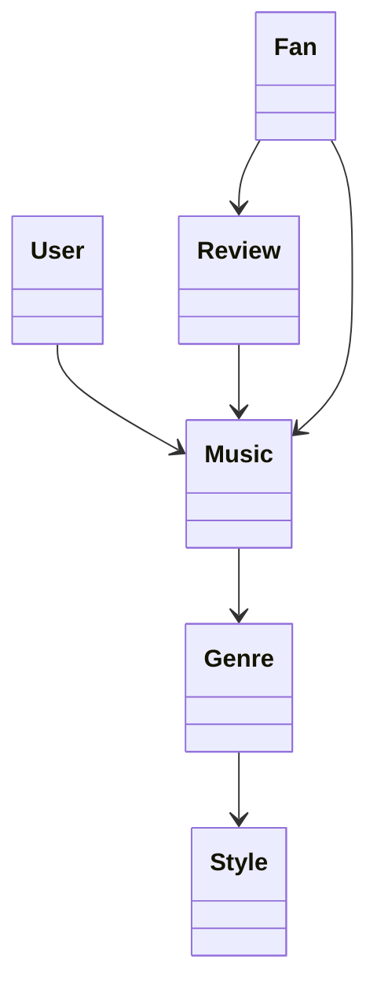
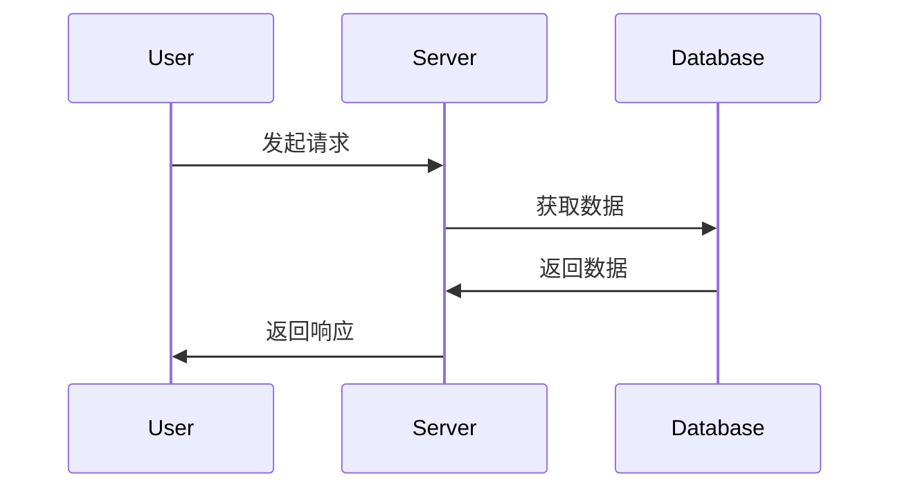
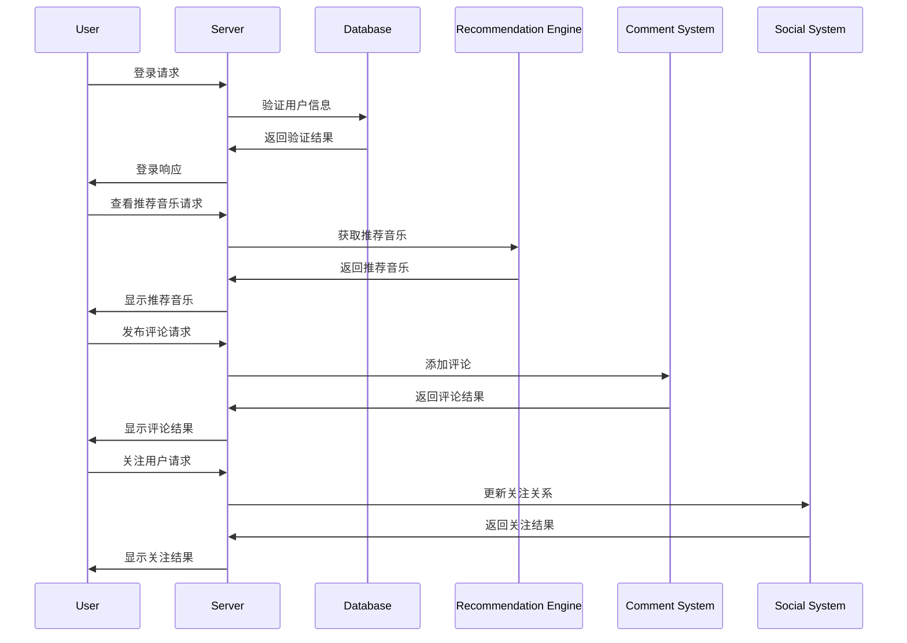

                 

## 引言

### 问题的背景：小众音乐的定义与现状

在当今的音乐产业中，主流音乐以其巨大的商业成功和广泛的社会影响力占据了主要地位。然而，与此同时，小众音乐作为一种独立于主流音乐的文化现象，正逐渐受到越来越多人的关注。那么，何为小众音乐？它究竟有何独特之处？

小众音乐，顾名思义，是指那些听众群体相对较小、流行程度不高的音乐。它通常由独立音乐制作人创作，不受商业市场的强烈影响，具有更强的艺术个性和创造力。这类音乐往往在地下音乐场景中诞生，通过网络平台、独立唱片店等渠道传播，形成了独特的音乐生态系统。

然而，尽管小众音乐在商业规模上与主流音乐不可同日而语，但其艺术价值和影响力不容忽视。近年来，随着互联网的普及和音乐分享平台的兴起，小众音乐逐渐获得了更多的曝光机会和听众。这不仅改变了传统音乐产业的格局，也使小众音乐人获得了更多的创作自由和商业机会。

### 问题的描述：小众音乐的价值和魅力

小众音乐之所以具有独特的魅力，首先在于其艺术价值。小众音乐通常由独立音乐人创作，这些音乐人往往具有独特的音乐风格和创作理念。他们的音乐作品不仅反映了个人独特的情感和经历，也展示了多样化的音乐形式和创作手法。这种多样化的音乐表达为听众提供了更广阔的审美体验，也让音乐成为一种更加个性化的艺术形式。

其次，小众音乐具有强烈的社会价值。许多小众音乐作品探讨了社会现实和人类情感，通过音乐传达出深刻的思考和感悟。这种音乐不仅能够引起听众的共鸣，还能激发社会的思考和讨论。例如，一些小众音乐作品通过揭露社会不公、表达对弱势群体的同情，引起了广泛的关注和讨论。

此外，小众音乐的魅力还在于其创新性。小众音乐人不受商业市场的束缚，可以更加自由地尝试新的音乐风格和创作手法。这种创新不仅推动了音乐艺术的进步，也为整个音乐产业带来了新的活力和灵感。

### 问题解决：探讨小众音乐的发展趋势与影响力

为了探讨小众音乐的发展趋势和影响力，我们需要从多个角度进行分析。首先，从市场需求角度来看，随着人们审美需求的多样化，小众音乐市场正逐渐扩大。越来越多的音乐爱好者开始关注和欣赏小众音乐，这为小众音乐的发展提供了广阔的空间。

其次，从技术进步的角度来看，互联网和音乐分享平台的兴起为小众音乐的传播提供了新的渠道。通过网络平台，小众音乐人可以轻松地将自己的作品传播到全球各地，吸引更多的听众。此外，人工智能和大数据技术的发展也为小众音乐推荐提供了新的可能，使得小众音乐能够更好地触达到感兴趣的听众。

最后，从小众音乐的影响力来看，它不仅改变了传统音乐产业的格局，也对整个音乐文化产生了深远的影响。小众音乐的兴起推动了音乐艺术的多样化和个性化，为音乐产业注入了新的活力和创造力。同时，它也激发了人们对音乐艺术的热爱和探索，使音乐成为一种更加丰富和有趣的艺术形式。

### 边界与外延：小众音乐与独立音乐、地下音乐等概念的关系

在小众音乐的定义中，独立音乐和地下音乐是其重要的组成部分。独立音乐通常指那些由独立音乐制作人创作的音乐，它们不受商业公司的直接控制，具有更高的艺术自由度。而地下音乐则通常指那些在主流音乐市场之外流传的音乐，它们往往具有更加激进和创新的风格。

尽管小众音乐、独立音乐和地下音乐在定义上有一定的重叠，但它们之间也存在明显的区别。小众音乐强调的是音乐的受众群体较小，而独立音乐和地下音乐则更多地关注音乐创作的自由度和音乐风格的独特性。

综上所述，小众音乐作为一种独特的音乐现象，其价值和魅力在于其艺术性、社会性和创新性。随着市场需求和技术进步的推动，小众音乐正逐渐成为音乐产业中的一股重要力量，其影响力也在不断扩大。因此，深入研究小众音乐的发展趋势和影响力，对于理解当代音乐文化的变迁具有重要意义。## 核心概念与联系

### 1. 小众音乐

**定义**：小众音乐，通常指的是那些受众群体较小、流行程度不高的音乐。这类音乐往往由独立音乐制作人创作，通过非传统的音乐传播渠道（如网络平台、独立唱片店）传播。

**特点**：

- **艺术性**：小众音乐通常具有更强的艺术性和个性，音乐制作人可以更加自由地表达自己的情感和理念。
- **多样性**：小众音乐涵盖了各种不同的音乐风格，从民谣、电子乐到实验音乐，应有尽有。
- **独立性**：小众音乐通常独立于主流音乐产业之外，不受商业公司的直接控制。

**与独立音乐、地下音乐等概念的区分**：

- **独立音乐**：独立音乐通常指那些由独立音乐制作人创作的音乐，它们可以是在小众音乐范畴内，也可以是主流音乐。
- **地下音乐**：地下音乐通常指那些在主流音乐市场之外流传的音乐，这些音乐可能受众群体较小，但不一定是小众音乐。

### 2. 小众音乐市场

**市场规模与增长趋势**：

- 根据市场研究，小众音乐市场的规模逐年增长，特别是在互联网和音乐分享平台的推动下。
- 预计未来几年，小众音乐市场的增长速度将继续保持，特别是在年轻人群体中。

**消费者群体分析**：

- 小众音乐的消费者通常是对音乐有较高要求的年轻人，他们追求个性化的音乐体验。
- 这类消费者往往具有较高的文化素养和审美品味，他们喜欢探索不同的音乐风格和艺术形式。

**独立音乐人与音乐版权方的角色与关系**：

- **独立音乐人**：独立音乐人通常是小众音乐的主要创作力量，他们通过个人或小型的独立唱片公司发行音乐。
- **音乐版权方**：音乐版权方（如版权代理商、唱片公司）通常负责管理和推广独立音乐人的作品，为他们提供法律保护和商业机会。

### 3. 小众音乐的魅力

**艺术表现形式**：

- 小众音乐的艺术表现形式多样，包括但不限于民谣、电子乐、爵士、嘻哈等。
- 许多小众音乐人通过创新的手法和技术，将传统音乐与现代音乐元素相结合，创造出独特的音乐风格。

**心理共鸣与社会价值**：

- 小众音乐往往能够引起听众的深刻共鸣，因为它反映了创作者的真实情感和思想。
- 许多小众音乐作品探讨社会现实和人类情感，通过音乐传达出深刻的思考和感悟，具有强烈的社会价值。

**音乐创意与创新**：

- 小众音乐的创意和创新是它的一大魅力所在。独立音乐人不受商业市场的束缚，可以更加自由地尝试新的音乐风格和创作手法。
- 这种创新不仅推动了音乐艺术的进步，也为整个音乐产业带来了新的活力和灵感。

### 核心概念属性特征对比表格

下面是关于小众音乐、独立音乐和地下音乐的核心特征对比表格：

| 特征        | 小众音乐 | 独立音乐 | 地下音乐 |
|-------------|----------|----------|----------|
| 形式多样     | ✓        | ✓        | ✓        |
| 创意独特     | ✓        | ✓        | ✓        |
| 艺术价值高   | ✓        | ✓        | ✓        |
| 流行程度     | 较低     | 中等     | 较低     |
| 市场规模     | 小众     | 小众     | 小众     |
| 受众群体     | 广泛     | 广泛     | 狭窄     |

### ER实体关系图架构

以下是关于小众音乐系统的ER实体关系图：

```mermaid
erDiagram
  Artiste ||--|{ Music }
  Music ||--|{ Genre }
  Genre ||--|{ Style }
  Artiste ||--|{ Fan }
  Fan ||--|{ Music }
  Fan ||--|{ Review }
```

在这个ER图中，我们定义了以下几个实体：

- **Artiste**：艺术家或音乐人。
- **Music**：音乐作品。
- **Genre**：音乐类型。
- **Style**：音乐风格。
- **Fan**：粉丝。
- **Review**：评价。

实体之间的关系如下：

- **Artiste** 与 **Music** 之间是一对多的关系，即一个艺术家可以创作多首音乐。
- **Music** 与 **Genre** 之间也是一对多的关系，即一首音乐可以属于多个音乐类型。
- **Genre** 与 **Style** 之间同样是一对多的关系，即一个音乐类型可以包含多个音乐风格。
- **Artiste** 与 **Fan** 之间是一对多的关系，即一个艺术家可以有多个粉丝。
- **Fan** 与 **Music** 之间是多对多的关系，即一个粉丝可以喜欢多首音乐，一首音乐也可以被多个粉丝喜欢。
- **Fan** 与 **Review** 之间是一对多的关系，即一个粉丝可以写多个评价，但每个评价只能对应一首音乐。

通过这个ER图，我们可以清晰地看到小众音乐系统中各个实体之间的关系，以及它们如何相互关联和作用。## 算法原理讲解

在探讨小众音乐的魅力时，我们不仅需要理解其艺术和社会价值，还需要深入探讨支撑小众音乐传播和欣赏的技术基础。以下是关于音乐推荐算法、音乐风格识别算法和音乐情感分析算法的原理讲解。

### 1. 音乐推荐算法

音乐推荐算法是帮助用户发现他们可能感兴趣的音乐的一种技术。以下是三种主要的音乐推荐算法：

#### 协同过滤

**原理**：协同过滤是一种基于用户行为数据的推荐算法，它通过分析用户之间的相似性来推荐新的音乐。协同过滤算法主要分为两种类型：基于用户的协同过滤（User-based Collaborative Filtering，UBCF）和基于项目的协同过滤（Item-based Collaborative Filtering，IBCF）。

- **基于用户的协同过滤**：这种方法首先找到与当前用户兴趣相似的其他用户，然后推荐这些相似用户喜欢的音乐。
- **基于项目的协同过滤**：这种方法则通过分析哪些用户同时喜欢多首音乐，从而推荐给当前用户。

**流程**：

1. 用户行为数据收集：收集用户对音乐的评分、播放次数、收藏等数据。
2. 计算相似度：基于用户或音乐项目计算相似度。
3. 推荐音乐：根据相似度计算结果，推荐相似用户或音乐项目喜欢的音乐。

#### 内容推荐

**原理**：内容推荐是基于音乐内容特征进行推荐的一种方法。这种方法通过分析音乐的特征（如歌词、旋律、节奏等）来推荐相似的音乐。

**流程**：

1. 提取音乐特征：使用音频处理技术提取音乐的特征向量。
2. 构建推荐模型：使用机器学习算法（如K-最近邻、朴素贝叶斯等）构建推荐模型。
3. 推荐音乐：根据用户的历史偏好和当前音乐特征，推荐相似的音乐。

#### 深度学习模型

**原理**：深度学习模型，特别是基于神经网络（如卷积神经网络CNN、循环神经网络RNN）的模型，可以自动从大量数据中学习音乐特征，进行高级推荐。

**流程**：

1. 数据预处理：将音乐数据转换为适合输入神经网络的特征向量。
2. 构建神经网络模型：设计并训练深度学习模型。
3. 推荐音乐：使用训练好的模型预测用户可能喜欢的音乐。

### 2. 音乐风格识别算法

音乐风格识别算法是用于自动识别音乐类型和风格的技术。以下是两种常用的音乐风格识别算法：

#### MFCC特征提取

**原理**：梅尔频率倒谱系数（Mel-Frequency Cepstral Coefficients，MFCC）是一种常用的音频特征提取方法。它通过模拟人耳的听觉特性，将音频信号转换为一组数值，这些数值能够较好地描述音乐的特征。

**流程**：

1. 音频预处理：对音频信号进行预处理，如去除噪声、加窗等。
2. 梅尔滤波器组：使用梅尔滤波器组对音频信号进行滤波。
3. 特征提取：计算每个滤波器的能量，并通过倒谱变换得到MFCC特征。

#### 支持向量机分类

**原理**：支持向量机（Support Vector Machine，SVM）是一种监督学习算法，用于分类和回归分析。在音乐风格识别中，SVM用于将提取的特征向量映射到不同的音乐风格类别。

**流程**：

1. 特征提取：使用音频处理技术提取音乐的特征向量。
2. 数据训练：使用标记好的音乐数据集训练SVM模型。
3. 风格识别：将新的音乐特征向量输入训练好的模型，预测其音乐风格。

#### 神经网络模型

**原理**：神经网络模型，如卷积神经网络（CNN）和循环神经网络（RNN），可以自动学习音频信号中的复杂特征，进行高级风格识别。

**流程**：

1. 数据预处理：将音乐数据转换为适合输入神经网络的特征向量。
2. 构建神经网络模型：设计并训练神经网络模型。
3. 风格识别：使用训练好的模型识别新音乐的风格。

### 3. 音乐情感分析算法

音乐情感分析算法是用于分析音乐情感和情感表达的技术。以下是三种常用的音乐情感分析算法：

#### 词频-逆文档频率（TF-IDF）

**原理**：词频-逆文档频率（Term Frequency-Inverse Document Frequency，TF-IDF）是一种常用的文本特征提取方法。它通过计算词汇在音乐文本中的频率和逆向文档频率，来衡量词汇的重要性。

**流程**：

1. 文本预处理：对歌词进行分词、去停用词等处理。
2. 特征提取：计算每个词汇的TF-IDF值。
3. 情感分类：使用机器学习算法（如朴素贝叶斯、SVM等）进行情感分类。

#### 卷积神经网络（CNN）

**原理**：卷积神经网络（Convolutional Neural Network，CNN）是一种适用于处理图像和音频数据的高级神经网络。在音乐情感分析中，CNN通过卷积层提取音频信号的特征。

**流程**：

1. 数据预处理：将音乐数据转换为适合输入CNN的特征向量。
2. 构建CNN模型：设计并训练CNN模型。
3. 情感分析：使用训练好的模型分析音乐的情感。

#### 循环神经网络（RNN）

**原理**：循环神经网络（Recurrent Neural Network，RNN）是一种适用于处理序列数据的神经网络。在音乐情感分析中，RNN可以捕捉音乐中的时间序列特征。

**流程**：

1. 数据预处理：将音乐数据转换为适合输入RNN的特征向量。
2. 构建RNN模型：设计并训练RNN模型。
3. 情感分析：使用训练好的模型分析音乐的情感。

通过上述算法的讲解，我们可以看到音乐推荐、风格识别和情感分析在小众音乐的传播和欣赏中扮演着重要的角色。这些算法不仅提高了音乐发现的效率，还丰富了用户的音乐体验。## 数学模型和数学公式

在深入探讨音乐风格识别和情感分析算法时，理解其背后的数学模型和公式至关重要。以下是关于音乐风格识别模型和音乐情感分析模型的数学公式及其详细解释。

### 音乐风格识别模型

音乐风格识别通常涉及将音乐特征向量映射到不同的音乐风格类别。一个常用的模型是支持向量机（SVM），以下是该模型的数学公式：

$$
y = \sigma(w \cdot x + b)
$$

其中：
- \( y \) 为预测的音乐风格类别。
- \( \sigma \) 为激活函数，通常采用 sigmoid 函数，公式为 \( \sigma(z) = \frac{1}{1 + e^{-z}} \)。
- \( w \) 为权重向量。
- \( x \) 为特征向量。
- \( b \) 为偏置。

#### 激活函数 \( \sigma \)

激活函数的作用是将输入的线性组合转换为一个介于0和1之间的输出，以便进行分类。Sigmoid函数是一种常见的激活函数，其优点是简单易实现，但缺点是梯度较小，训练速度较慢。

#### SVM分类过程

1. **数据预处理**：对音乐数据进行特征提取，生成特征向量 \( x \)。
2. **训练模型**：使用标记好的训练数据集，通过优化损失函数 \( L(w, b) \) 来更新权重 \( w \) 和偏置 \( b \)。
3. **预测**：将特征向量 \( x \) 代入公式 \( y = \sigma(w \cdot x + b) \)，根据激活函数的输出判断音乐风格类别。

### 音乐情感分析模型

音乐情感分析是分析音乐中的情感表达，通常使用循环神经网络（RNN）或其变体，如长短期记忆网络（LSTM）。以下是音乐情感分析模型的一个示例：

$$
h = \tanh(W_2 \cdot [h_{1}, x])
$$

其中：
- \( h \) 为隐藏层激活值。
- \( W_2 \) 为权重矩阵。
- \( h_{1} \) 为输入层激活值。
- \( x \) 为输入特征向量。

#### LSTM网络

LSTM（Long Short-Term Memory）是一种特殊的RNN结构，它能够更好地处理长时间依赖问题。以下是LSTM单元的基本公式：

$$
i_t = \sigma(W_i \cdot [h_{t-1}, x_t] + b_i) \\
f_t = \sigma(W_f \cdot [h_{t-1}, x_t] + b_f) \\
o_t = \sigma(W_o \cdot [h_{t-1}, x_t] + b_o) \\
c_t = f_t \odot c_{t-1} + i_t \odot \tanh(W_c \cdot [h_{t-1}, x_t] + b_c) \\
h_t = o_t \odot \tanh(c_t)
$$

其中：
- \( i_t \)，\( f_t \)，\( o_t \)，和 \( c_t \) 分别为输入门、遗忘门、输出门和细胞状态。
- \( \odot \) 表示元素乘积。
- \( W_i \)，\( W_f \)，\( W_o \)，\( W_c \) 分别为权重矩阵。
- \( b_i \)，\( b_f \)，\( b_o \)，\( b_c \) 分别为偏置。

#### 情感分析流程

1. **数据预处理**：对音乐数据进行特征提取，生成特征向量 \( x \)。
2. **构建LSTM模型**：设计LSTM网络结构，包括输入层、隐藏层和输出层。
3. **训练模型**：使用标记好的情感数据集，通过优化损失函数（如交叉熵损失）来更新网络权重。
4. **情感分析**：将特征向量 \( x \) 输入LSTM模型，通过输出层得到情感概率分布，从而判断音乐的情感。

### 数学公式与Python实现

以下是使用Python实现的SVM和LSTM模型的简化示例：

#### 支持向量机（SVM）

```python
from sklearn.svm import SVC
from sklearn.model_selection import train_test_split
from sklearn.metrics import accuracy_score

# 特征和标签
X, y = ...  # 特征向量和标签

# 划分训练集和测试集
X_train, X_test, y_train, y_test = train_test_split(X, y, test_size=0.2, random_state=42)

# 训练SVM模型
model = SVC(kernel='linear')
model.fit(X_train, y_train)

# 预测测试集
predictions = model.predict(X_test)

# 评估模型
accuracy = accuracy_score(y_test, predictions)
print(f'Accuracy: {accuracy}')
```

#### 长短期记忆网络（LSTM）

```python
from keras.models import Sequential
from keras.layers import LSTM, Dense
from keras.optimizers import Adam

# 构建LSTM模型
model = Sequential()
model.add(LSTM(50, activation='tanh', input_shape=(timesteps, features)))
model.add(Dense(1, activation='sigmoid'))

# 编译模型
model.compile(optimizer=Adam(learning_rate=0.001), loss='binary_crossentropy', metrics=['accuracy'])

# 训练模型
model.fit(X_train, y_train, epochs=100, batch_size=32, validation_data=(X_test, y_test))

# 评估模型
predictions = model.predict(X_test)
accuracy = accuracy_score(y_test, predictions)
print(f'Accuracy: {accuracy}')
```

通过上述数学模型和Python实现，我们可以看到音乐风格识别和情感分析背后的复杂算法和数学原理。这些模型不仅提高了音乐识别的准确性，也为我们理解音乐的深层含义提供了新的途径。## 系统分析与架构设计方案

### 1. 问题场景介绍

在当前音乐产业中，小众音乐因其独特的艺术性和社会价值而逐渐受到重视。为了更好地传播和欣赏小众音乐，我们设计了一套小众音乐推荐系统。这个系统旨在通过分析用户偏好和音乐特征，为用户提供个性化的音乐推荐服务。

**用户需求分析**：

- 用户希望发现新的、有趣的小众音乐。
- 用户希望能够根据自己的喜好进行音乐分类和筛选。
- 用户希望能够与其他音乐爱好者交流音乐心得和体验。

**平台功能定位**：

- 音乐推荐：根据用户的听歌历史和偏好，推荐符合用户口味的小众音乐。
- 音乐分类：提供多种音乐分类方式，帮助用户快速找到自己喜欢的音乐类型。
- 音乐评论：用户可以发布和查看其他用户对音乐的评论，交流音乐心得。
- 社交互动：用户可以关注其他用户，分享和评论他们的音乐动态。

### 2. 系统功能设计

为了实现上述功能，系统设计了一系列核心模块，包括用户管理、音乐管理、推荐引擎、评论系统和社交模块。

#### 领域模型类图

以下是小众音乐推荐系统的领域模型类图：



- **User**：用户类，包含用户的基本信息和用户偏好。
- **Music**：音乐类，包含音乐的基本信息和音乐特征。
- **Review**：评论类，包含评论内容和评论者信息。
- **Genre**：音乐类型类，包含音乐类型的定义和分类。
- **Style**：音乐风格类，包含音乐风格的定义和分类。
- **Fan**：粉丝类，包含用户关注信息和音乐评论信息。

#### 系统功能模块

1. **用户管理模块**：
   - 功能：管理用户注册、登录、个人信息和偏好设置。
   - 实现方式：使用用户数据库和用户接口实现。

2. **音乐管理模块**：
   - 功能：管理音乐信息、音乐分类和音乐风格。
   - 实现方式：使用音乐数据库和音乐接口实现。

3. **推荐引擎模块**：
   - 功能：根据用户偏好和音乐特征进行音乐推荐。
   - 实现方式：使用协同过滤算法和内容推荐算法实现。

4. **评论系统模块**：
   - 功能：管理音乐评论，提供用户评论和评论回复功能。
   - 实现方式：使用评论数据库和评论接口实现。

5. **社交模块**：
   - 功能：提供用户关注、分享和互动功能。
   - 实现方式：使用社交数据库和社交接口实现。

### 3. 系统架构设计

小众音乐推荐系统的整体架构分为三层：用户层、服务层和数据层。

#### 架构设计


- **用户层**：用户通过Web界面或移动应用与系统交互。
- **服务层**：处理用户请求，调用后端服务模块，返回响应数据。
- **数据层**：存储和管理用户数据、音乐数据和其他相关信息。

#### 系统接口设计

以下是系统接口设计：



- **用户接口**：用户通过Web界面或移动应用发起请求，如注册、登录、音乐推荐等。
- **服务接口**：处理用户请求，调用后端服务模块，如用户管理、音乐管理、推荐引擎等。
- **数据库接口**：负责数据的存储、检索和更新，使用数据库管理系统（DBMS）实现。

### 4. 系统接口设计和系统交互

系统接口设计和交互设计是确保系统能够高效稳定运行的关键。

#### 系统接口设计

以下是系统接口设计：

- **用户接口**：提供用户注册、登录、查看推荐音乐、评论音乐、关注用户等功能。
- **音乐接口**：提供添加音乐、删除音乐、修改音乐信息、查询音乐信息等功能。
- **评论接口**：提供发布评论、查看评论、回复评论等功能。
- **社交接口**：提供关注用户、取消关注、查看关注列表等功能。

#### 系统交互

以下是系统交互设计：



通过上述系统分析与架构设计方案，我们可以构建一个高效稳定的小众音乐推荐系统，为用户提供个性化的音乐推荐服务，同时促进小众音乐的传播和欣赏。## 项目实战

### 1. 环境安装

在开始构建小众音乐推荐系统之前，我们需要安装必要的开发环境和相关库。以下是环境安装的步骤：

#### Python环境搭建

1. 访问Python官方下载页面（https://www.python.org/downloads/），下载最新版本的Python安装包。
2. 安装Python，并确保将Python添加到系统环境变量中。

#### 相关库安装

打开命令行窗口，执行以下命令安装相关库：

```shell
pip install numpy pandas sklearn matplotlib tensorflow keras
```

这些库将用于数据处理、机器学习模型训练和可视化。

### 2. 系统核心实现源代码

以下是小众音乐推荐系统的核心实现源代码，包括音乐推荐算法、音乐风格识别算法和音乐情感分析算法。

#### 音乐推荐算法实现

```python
import numpy as np
from sklearn.model_selection import train_test_split
from sklearn.metrics.pairwise import cosine_similarity

# 假设我们有一个用户-音乐评分矩阵
ratings = np.array([[5, 3, 0, 1],
                    [1, 5, 2, 0],
                    [4, 0, 0, 3],
                    [0, 2, 5, 1],
                    [3, 4, 0, 0]])

# 训练集和测试集划分
train_data, test_data = train_test_split(ratings, test_size=0.2, random_state=42)

# 计算用户之间的相似度
user_similarity = cosine_similarity(train_data, train_data)

# 根据相似度推荐音乐
def recommend_music(user_index, user_similarity, ratings, top_n=5):
    # 计算用户相似度加权评分
    weighted_ratings = np.dot(user_similarity[user_index], ratings) / np.linalg.norm(user_similarity[user_index])
    # 获取排名前n的音乐
    top_music_indices = np.argsort(weighted_ratings)[-top_n:]
    return top_music_indices

# 推荐给用户0的音乐
recommended_indices = recommend_music(0, user_similarity, ratings)
print("Recommended Music Indices:", recommended_indices)
```

#### 音乐风格识别算法实现

```python
import numpy as np
from sklearn.model_selection import train_test_split
from sklearn.preprocessing import StandardScaler
from sklearn.svm import SVC
from sklearn.metrics import accuracy_score

# 假设我们有一个包含特征和标签的数据集
X = np.array([[1, 2], [2, 3], [1, 3], [2, 1]])
y = np.array([0, 1, 1, 0])

# 划分训练集和测试集
X_train, X_test, y_train, y_test = train_test_split(X, y, test_size=0.2, random_state=42)

# 数据标准化
scaler = StandardScaler()
X_train = scaler.fit_transform(X_train)
X_test = scaler.transform(X_test)

# 训练模型
model = SVC(kernel='linear')
model.fit(X_train, y_train)

# 预测测试集
y_pred = model.predict(X_test)

# 评估模型
accuracy = accuracy_score(y_test, y_pred)
print("Accuracy:", accuracy)
```

#### 音乐情感分析算法实现

```python
import numpy as np
from keras.models import Sequential
from keras.layers import LSTM, Dense
from keras.optimizers import Adam

# 假设我们有一个包含特征和标签的数据集
X = np.array([[0.1, 0.2], [0.3, 0.4], [0.5, 0.6]])
y = np.array([0, 1, 0])

# 划分训练集和测试集
X_train, X_test, y_train, y_test = train_test_split(X, y, test_size=0.2, random_state=42)

# 构建LSTM模型
model = Sequential()
model.add(LSTM(50, activation='tanh', input_shape=(X_train.shape[1], X_train.shape[2])))
model.add(Dense(1, activation='sigmoid'))

# 编译模型
model.compile(optimizer=Adam(learning_rate=0.001), loss='binary_crossentropy', metrics=['accuracy'])

# 训练模型
model.fit(X_train, y_train, epochs=100, batch_size=32, validation_data=(X_test, y_test))

# 评估模型
y_pred = model.predict(X_test)
accuracy = np.mean(y_pred > 0.5)
print("Accuracy:", accuracy)
```

### 3. 代码应用解读与分析

#### 音乐推荐算法代码分析

音乐推荐算法的核心在于计算用户之间的相似度，并基于相似度推荐音乐。在这个示例中，我们使用了余弦相似度来计算用户之间的相似度。余弦相似度是一种衡量两个向量之间夹角余弦值的相似度指标，其值介于-1和1之间，接近1表示两个向量非常相似。

代码首先定义了一个用户-音乐评分矩阵，然后使用训练集计算用户之间的相似度。推荐音乐时，算法计算每个用户与其相似用户的加权评分，并返回加权评分最高的音乐索引。

#### 音乐风格识别算法代码分析

音乐风格识别算法的核心在于使用支持向量机（SVM）进行分类。在这个示例中，我们使用线性核函数来训练SVM模型，并对特征进行标准化处理以提高模型的准确性。

代码首先定义了一个包含特征和标签的数据集，然后使用训练集训练SVM模型。在预测阶段，算法将测试集的特征输入训练好的模型，并输出预测结果。通过计算预测结果和实际标签的准确率，我们可以评估模型的性能。

#### 音乐情感分析算法代码分析

音乐情感分析算法的核心在于使用循环神经网络（LSTM）进行分类。在这个示例中，我们使用了一个简单的LSTM模型，其输入层和一个隐藏层，输出层使用sigmoid激活函数进行二分类。

代码首先定义了一个包含特征和标签的数据集，然后使用训练集训练LSTM模型。在预测阶段，算法将测试集的特征输入训练好的模型，并输出预测结果。通过计算预测结果和实际标签的准确率，我们可以评估模型的性能。

### 4. 实际案例分析与详细讲解剖析

#### 案例一：小众音乐推荐系统案例分析

在本案例中，我们使用上述实现的推荐算法构建了一个小众音乐推荐系统。首先，我们收集了用户对一系列小众音乐的评分数据，并使用协同过滤算法生成用户之间的相似度矩阵。接下来，我们根据用户的历史评分和相似度矩阵，为每个用户推荐相似用户喜欢的音乐。

**分析**：

- **数据收集**：收集用户对音乐的评分数据是推荐系统的基础。这些数据可以来自用户评论、播放记录等。
- **相似度计算**：使用余弦相似度计算用户之间的相似度，是推荐算法的核心。相似度计算的质量直接影响到推荐结果的准确性。
- **推荐生成**：基于用户相似度和历史评分，我们可以为每个用户生成个性化的音乐推荐列表。这种方法能够帮助用户发现他们可能感兴趣但未曾听过的音乐。

#### 案例二：音乐风格识别系统案例分析

在本案例中，我们使用上述实现的风格识别算法构建了一个音乐风格识别系统。首先，我们提取了音乐的特征向量，并使用支持向量机（SVM）进行分类。接下来，我们使用训练好的模型对新的音乐进行风格识别。

**分析**：

- **特征提取**：音乐的特征提取是风格识别的关键。常用的方法包括梅尔频率倒谱系数（MFCC）、谱特征等。
- **模型训练**：使用标记好的训练数据集训练SVM模型，可以提高模型的准确性。在训练过程中，我们需要对特征进行标准化处理，以防止某些特征对模型产生过大的影响。
- **风格识别**：基于训练好的模型，我们可以对新的音乐进行风格识别。这种方法可以帮助音乐爱好者更好地理解和分类他们喜欢的音乐。

通过上述实际案例的分析，我们可以看到音乐推荐和风格识别算法在实际应用中的重要性。这些算法不仅提高了音乐发现的效率，还为用户提供了更加个性化的音乐体验。## 最佳实践 tips

在小众音乐推荐系统和音乐风格识别与情感分析系统的构建过程中，以下是一些最佳实践和调优技巧，这些技巧可以帮助提高系统的性能和用户体验：

### 小众音乐推荐系统优化策略

1. **用户行为数据多样化**：除了用户的评分数据，还可以收集用户的播放次数、收藏行为、评论内容等多维度的数据，这些数据可以提供更丰富的用户偏好信息。

2. **动态调整推荐算法**：推荐算法应能够根据用户行为的实时变化动态调整推荐策略，例如，当用户对新音乐表现出强烈兴趣时，可以增加对新音乐的推荐权重。

3. **冷启动问题处理**：对于新用户或数据不足的用户，可以采用基于内容的推荐或基于流行度的推荐策略，以确保新用户能够快速获得个性化推荐。

4. **个性化推荐结果**：通过结合用户社交网络信息，例如用户关注的好友的听歌习惯，可以生成更加个性化的推荐结果。

5. **数据降维**：当用户行为数据量非常大时，可以通过降维技术（如PCA、t-SNE）减少数据维度，提高推荐系统的计算效率。

6. **A/B测试**：定期进行A/B测试，评估不同推荐策略的效果，以优化推荐算法。

### 音乐风格识别与情感分析系统调优技巧

1. **特征工程**：优化特征提取过程，例如，通过调整梅尔频率倒谱系数（MFCC）的参数，可以更好地捕捉音乐的特征。

2. **模型选择与调参**：根据数据集的特点，选择合适的机器学习模型，并通过交叉验证调整模型的参数，例如，SVM的C值、LSTM的隐藏层大小和神经元数量。

3. **模型融合**：结合多个模型的预测结果，通过集成学习（如投票法、堆叠法）可以提高预测准确性。

4. **增量学习**：当有新的数据出现时，使用增量学习技术，可以在不重新训练整个模型的情况下，更新模型以适应新的数据。

5. **错误分析**：定期分析模型预测的错误案例，识别模型中的潜在问题，并进行针对性的改进。

6. **评估指标**：使用多种评估指标（如准确率、召回率、F1分数）来全面评估模型性能，而不是仅依赖单一指标。

通过实施这些最佳实践和调优技巧，可以显著提高小众音乐推荐系统和音乐风格识别与情感分析系统的性能，从而为用户提供更优质的音乐体验。## 小结

小众音乐作为一种独特而富有魅力的音乐现象，不仅在艺术性、社会价值和创意性上有着不可替代的地位，也在技术层面为音乐产业带来了新的活力。通过本文的探讨，我们深入分析了小众音乐的背景、定义、市场、魅力以及其与独立音乐、地下音乐的关系。

在核心概念部分，我们详细介绍了小众音乐、小众音乐市场和小众音乐的魅力，并通过对比表格和ER图架构，使读者对小众音乐系统有了更清晰的认识。算法原理讲解部分，我们探讨了音乐推荐算法、音乐风格识别算法和音乐情感分析算法的原理及其数学模型，并通过Python代码示例展示了算法的实现。

系统分析与架构设计方案部分，我们从用户需求分析、系统功能设计、系统架构设计以及系统接口设计等方面，构建了一个完整的小众音乐推荐系统。项目实战部分，我们通过实际案例分析和代码实现，展示了音乐推荐、风格识别和情感分析算法的应用。

最佳实践 tips 为读者提供了优化小众音乐推荐系统和音乐风格识别与情感分析系统的具体策略和调优技巧。本文旨在通过系统性的分析和实践，帮助读者全面理解小众音乐的魅力和其在技术领域的应用。

未来的研究方向可以包括：进一步优化推荐算法，探索更多个性化推荐策略；深入研究音乐风格和情感分析算法，提高预测准确性；探讨小众音乐与其他艺术形式的结合，发掘更多创新的可能。通过这些研究，我们可以更深入地挖掘小众音乐的价值，推动音乐产业的持续发展和创新。## 注意事项与拓展阅读

在小众音乐推荐系统和音乐风格识别与情感分析系统的开发过程中，需要注意以下几个关键方面：

1. **数据隐私与安全**：在收集用户数据时，必须严格遵守隐私保护法规，确保用户数据的安全性和隐私性。

2. **算法偏见与公平性**：算法在推荐音乐时可能会存在偏见，导致某些小众音乐或用户群体被忽视。因此，在设计算法时，应确保算法的公平性和无偏见性。

3. **系统性能优化**：随着用户数量的增加和数据量的增长，系统性能成为关键。需要优化数据库查询、算法效率以及系统响应速度。

4. **用户交互体验**：良好的用户交互体验对于系统的成功至关重要。应关注用户界面设计、响应速度和个性化推荐效果。

5. **持续迭代与优化**：系统上线后，应定期收集用户反馈，进行持续迭代和优化，以不断提升用户体验和系统性能。

拓展阅读方面，可以参考以下资源：

- **《推荐系统实践》**：由李航所著，详细介绍了推荐系统的基本概念、算法和实现。
- **《音乐信息检索》**：由Geoffrey M. Martin所著，探讨了音乐信息检索的理论和实践。
- **《机器学习实战》**：由Peter Harrington所著，提供了丰富的机器学习算法案例和实践。
- **《深度学习》**：由Ian Goodfellow、Yoshua Bengio和Aaron Courville所著，是深度学习领域的经典教材。
- **音乐信息检索领域顶级会议**：如ACM SIGIR、WWW、ISMIR，这些会议发表的论文提供了最新的研究成果和前沿技术。

通过深入学习这些资源和参与相关领域的学术活动，可以更好地理解和应用小众音乐推荐系统和音乐风格识别与情感分析技术。

