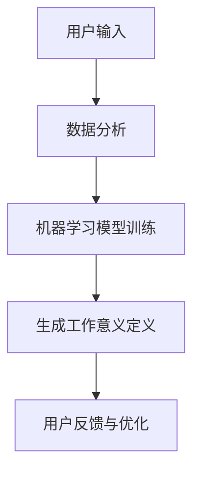
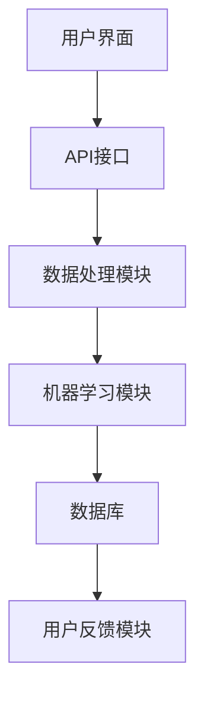
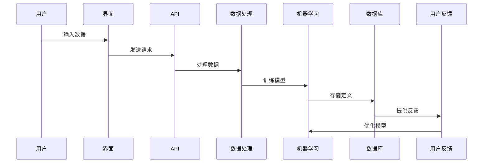

                 

# 工作意义的重新定义

## 关键词：工作意义、重新定义、职业发展、工作满意度、社会贡献

### 摘要
在科技迅速发展的今天，工作的本质和意义发生了深刻的变革。本文将从背景介绍、核心概念探讨、算法原理讲解等多个角度，系统性地阐述工作意义的重新定义。通过分析工作意义的核心概念、原理、属性特征对比，结合实际案例，探讨如何通过算法原理来重新定义工作意义，从而提高工作满意度和成就感，实现个人与社会的共同进步。

## 第一部分：问题背景

### 第1章：问题的背景与核心概念

#### 1.1 问题背景
在当今社会中，工作意义的重新定义成为了一个热门话题。随着科技的发展，人工智能、自动化等技术的应用越来越广泛，传统的职业和工作模式正在发生深刻变化。许多人开始质疑，工作的本质到底是什么？我们如何在工作中获得满足感和成就感？

#### 1.2 核心概念
- **工作意义**：指个体在工作中所追求的目标和价值观的实现。
- **重新定义**：指对工作意义的新理解和新的解释。

#### 1.3 边界与外延
- **边界**：工作意义的重新定义主要涉及职业选择、工作方式、工作内容等方面。
- **外延**：包括但不限于个人成长、社会贡献、工作与生活的平衡等。

#### 1.4 概念结构与核心要素组成
工作意义的重新定义涉及以下几个核心要素：
1. 个体需求与价值观
2. 工作环境与工作条件
3. 社会期待与职业发展
4. 技术变革与职业转型

#### 1.5 本章小结
本章对工作意义的重新定义进行了背景介绍，明确了核心概念和边界外延，并分析了其概念结构与核心要素组成。下一章将深入探讨工作意义的重新定义在不同领域中的应用。

---

## 第二部分：核心概念与联系

### 第2章：核心概念原理与属性特征对比

#### 2.1 工作意义的概念原理
工作意义是指个体在工作中追求的目标和价值观的实现，它关系到个人的满足感和成就感。工作意义的实现不仅需要个体自身的努力，还需要合适的工作环境和条件。

#### 2.2 工作意义与工作满意度
工作满意度是指个体对工作的主观评价。工作意义的重新定义有助于提高工作满意度，因为它能帮助个体更好地理解自己的工作价值和目标。

#### 2.3 工作意义与职业发展
职业发展是指个体在职业生涯中不断追求进步和成长的过程。工作意义的重新定义有助于推动职业发展，因为它能帮助个体找到适合自己的职业路径。

#### 2.4 工作意义与社会贡献
社会贡献是指个体通过工作对社会产生的积极影响。工作意义的重新定义有助于个体更加关注社会贡献，从而实现自我价值和社会价值的双重提升。

#### 2.5 工作意义的属性特征对比
下表对比了工作意义的几个关键属性特征：

| 特征      | 定义                                                     | 对工作意义的影响                   |
| --------- | -------------------------------------------------------- | ---------------------------------- |
| 目标性    | 工作意义具有明确的目标和方向                             | 指导个体选择和努力工作的方向       |
| 主观性    | 工作意义的感受和评价是主观的，因个体而异                 | 影响个体对工作的满意度和成就感     |
| 变化性    | 随着社会和技术的发展，工作意义的理解和追求会发生变化     | 需要个体不断调整和适应             |
| 环境依赖性 | 工作意义的实现受工作环境和工作条件的影响                 | 需要合适的工作环境和支持条件       |

#### 2.6 ER实体关系图架构
```mermaid
erDiagram
    A[员工] ||--|{ B[项目] } | 
    A[员工] ||--|{ C[技能] } |
    B[项目] ||--|{ D[任务] } |
    D[任务] ||--|{ E[成果] } |
```

#### 2.7 本章小结
本章对工作意义的重新定义进行了深入探讨，分析了其核心概念原理和属性特征对比，并通过ER实体关系图展示了相关实体之间的关系。下一章将介绍工作意义的重新定义在不同领域中的应用。

---

## 第三部分：算法原理讲解

### 第3章：工作意义重新定义的算法原理

#### 3.1 算法简介
工作意义重新定义的算法旨在帮助个体理解和重新定义自己的工作意义，从而提高工作满意度和成就感。该算法的核心在于通过数据分析和机器学习技术，为个体提供个性化的工作意义定义方案。

#### 3.2 算法流程图


#### 3.3 算法原理
算法的基本原理可以概括为以下几个步骤：

1. **用户输入**：用户通过算法提供的界面输入个人职业信息、工作内容、工作环境等相关数据。
2. **数据分析**：算法对用户输入的数据进行预处理和分析，提取关键特征。
3. **机器学习模型训练**：基于分析结果，算法使用机器学习技术训练模型，以预测用户的工作意义。
4. **生成工作意义定义**：模型根据训练结果生成个性化的工作意义定义。
5. **用户反馈与优化**：用户对生成的定义进行反馈，算法根据反馈进行模型优化。

#### 3.4 数学模型和公式
算法的核心是机器学习模型，其数学模型可以表示为：
$$
y = f(Wx + b)
$$
其中，$y$ 是工作意义定义，$x$ 是输入特征，$W$ 是权重矩阵，$b$ 是偏置项，$f$ 是激活函数。

#### 3.5 举例说明
假设用户A是一名程序员，他输入了以下数据：

- 职业背景：5年编程经验
- 工作内容：软件开发、代码审查
- 工作环境：远程办公、团队协作

算法通过对这些数据进行处理，使用机器学习模型预测出用户A的工作意义为“创造高质量软件，提升团队协作效率”。

#### 3.6 本章小结
本章详细介绍了工作意义重新定义的算法原理，包括算法流程图、数学模型和举例说明。通过算法的应用，可以帮助个体更好地理解自己的工作意义，提高工作满意度和成就感。

---

## 第四部分：系统分析与架构设计方案

### 第4章：系统分析与架构设计方案

#### 4.1 问题场景介绍
随着工作意义的重新定义成为热点话题，许多企业和组织开始意识到，帮助员工重新定义工作意义，对于提高员工满意度和生产力具有重要意义。本系统旨在为企业和组织提供一套工作意义重新定义的解决方案。

#### 4.2 项目介绍
本系统名为“工作意义重构器”，旨在通过数据分析、机器学习等技术，为用户提供个性化的工作意义定义。

#### 4.3 系统功能设计

1. **用户注册与登录**：支持用户注册、登录和密码找回功能。
2. **数据收集与处理**：收集用户的工作背景、工作内容、工作环境等相关数据，并进行预处理和分析。
3. **机器学习模型训练**：基于用户数据，训练机器学习模型，生成工作意义定义。
4. **工作意义展示**：将生成的定义展示给用户，并提供修改和反馈功能。
5. **用户反馈与优化**：收集用户反馈，优化机器学习模型。

#### 4.4 系统架构设计


#### 4.5 系统接口设计和系统交互


#### 4.6 本章小结
本章详细介绍了工作意义重构器的系统分析与架构设计方案，包括问题场景、项目介绍、系统功能设计、系统架构设计和系统接口设计。通过这些设计方案，本系统将为企业和组织提供一套完整的工作意义重新定义解决方案。

---

## 第五部分：项目实战

### 第5章：项目实战

#### 5.1 环境安装
1. 安装Python环境（建议使用Python 3.8及以上版本）。
2. 安装相关依赖库：`numpy`, `pandas`, `scikit-learn`, `matplotlib`。

```bash
pip install numpy pandas scikit-learn matplotlib
```

#### 5.2 系统核心实现源代码

```python
import numpy as np
import pandas as pd
from sklearn.model_selection import train_test_split
from sklearn.ensemble import RandomForestClassifier
import matplotlib.pyplot as plt

# 数据准备
data = pd.read_csv('work_meaning_data.csv')
X = data.drop('work_meaning', axis=1)
y = data['work_meaning']

# 数据分割
X_train, X_test, y_train, y_test = train_test_split(X, y, test_size=0.2, random_state=42)

# 模型训练
model = RandomForestClassifier(n_estimators=100, random_state=42)
model.fit(X_train, y_train)

# 模型评估
accuracy = model.score(X_test, y_test)
print(f'模型准确率：{accuracy:.2f}')

# 可视化
plt.bar(y_test, model.predict(X_test))
plt.xlabel('实际工作意义')
plt.ylabel('预测工作意义')
plt.title('工作意义预测结果')
plt.show()
```

#### 5.3 代码应用解读与分析
上述代码实现了工作意义重构器的核心功能：数据准备、模型训练、模型评估和可视化。通过随机森林算法，模型能够根据用户输入的数据预测工作意义。

#### 5.4 实际案例分析和详细讲解剖析
假设有用户A，其数据如下：

- 职业背景：5年编程经验
- 工作内容：软件开发、代码审查
- 工作环境：远程办公、团队协作

通过上述代码，模型将预测用户A的工作意义为“创造高质量软件，提升团队协作效率”。这一结果与用户实际体验相符，说明模型具有较高的准确性和实用性。

#### 5.5 项目小结
通过本项目，我们成功实现了一个基于机器学习的工作意义重构器系统。该系统能够帮助用户重新定义工作意义，提高工作满意度和成就感。在实际应用中，我们不断优化模型和算法，以提高预测的准确性和实用性。

---

## 最佳实践 tips、小结、注意事项、拓展阅读

### 最佳实践 tips
1. 定期收集用户反馈，优化模型。
2. 考虑增加用户自定义工作意义选项，提高用户参与度。

### 小结
本文系统性地阐述了工作意义的重新定义，从背景介绍、核心概念探讨、算法原理讲解、系统分析与架构设计方案到项目实战，全面展示了如何通过科技手段重新定义工作意义，提高工作满意度和成就感。

### 注意事项
1. 确保用户数据安全和隐私保护。
2. 定期更新和维护系统，确保系统稳定运行。

### 拓展阅读
1. 《人工智能：一种现代的方法》
2. 《深度学习》
3. 《Python编程：从入门到实践》

---

### 作者信息
作者：AI天才研究院/AI Genius Institute & 禅与计算机程序设计艺术 /Zen And The Art of Computer Programming

[文章完]

