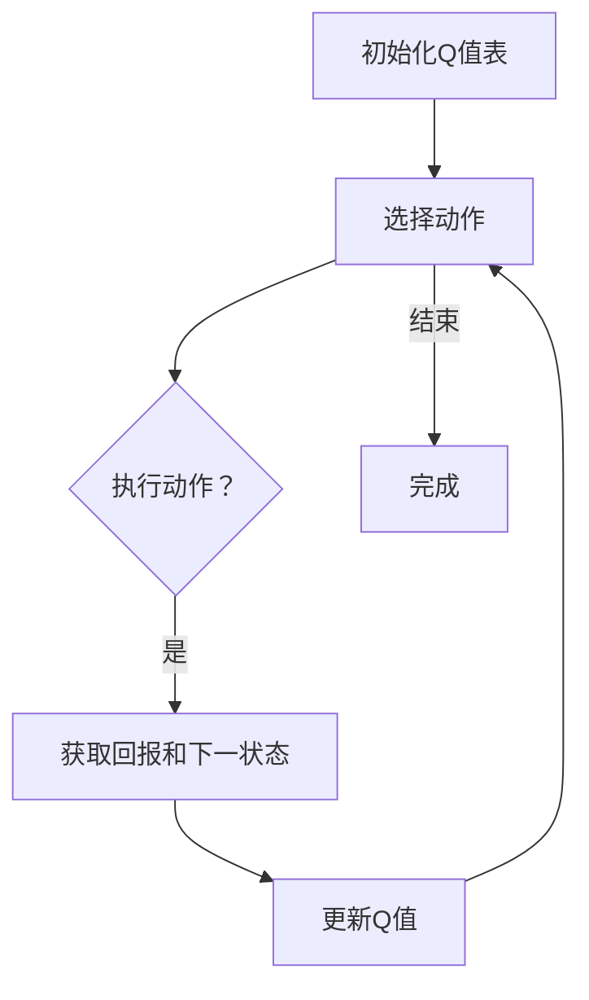
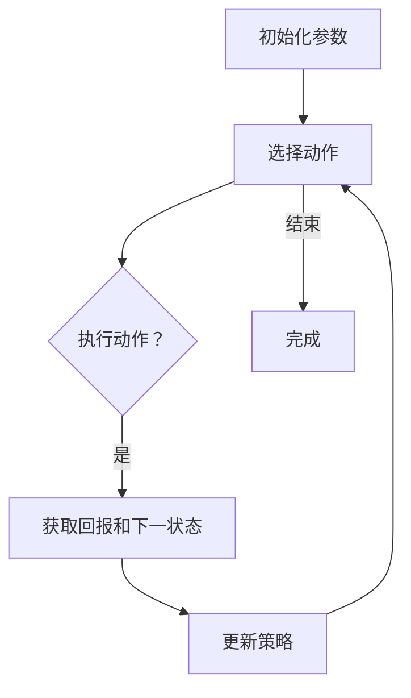
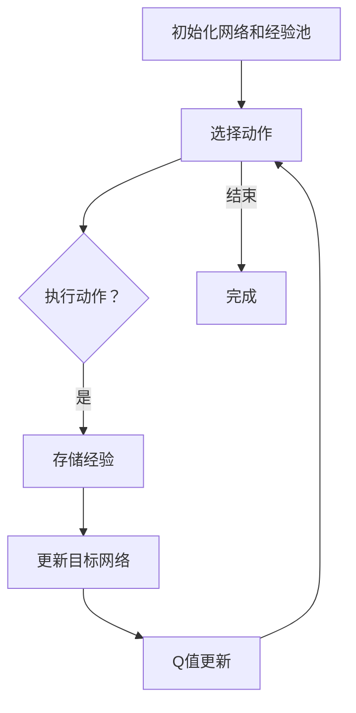
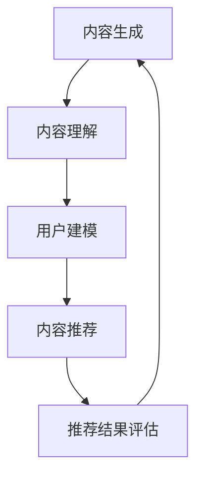

                 

### 1.1 问题背景

#### 1.1.1 AIGC内容推荐策略的现状

随着互联网的快速发展，用户生成内容（User-Generated Content，简称UGC）的数量呈现出爆炸式增长。从社交网络、博客、视频网站到电子商务平台，各类平台积累了海量的用户数据。这些数据不仅是各平台赖以生存的基石，也为内容推荐系统提供了丰富的素材。内容推荐系统的主要目标是通过分析用户的历史行为和偏好，将个性化的内容推荐给用户，从而提高用户满意度和平台粘性。

目前，主流的内容推荐策略主要包括基于内容的推荐（Content-Based Filtering，简称CBF）、协同过滤（Collaborative Filtering，简称CF）和混合推荐（Hybrid Recommendation）等。这些策略在不同场景下都有较为成熟的应用，但在实际运营中也存在一些局限性。

基于内容的推荐策略通过分析用户的历史行为和偏好，找出与用户兴趣相似的内容进行推荐。然而，这种策略在面对冷启动问题（即新用户或新内容无法获取足够的历史数据）时显得力不从心。

协同过滤策略通过分析用户之间的相似度，将其他用户喜欢的但该用户尚未看过的内容推荐给他。协同过滤又分为用户基于的协同过滤（User-Based）和基于物品的协同过滤（Item-Based）。尽管协同过滤策略在解决冷启动问题上有一定的优势，但它容易受到数据稀疏性的影响，即用户之间的交互数据较少，导致推荐结果不够精准。

混合推荐策略通过结合CBF和CF的优点，试图弥补各自的不足。然而，混合推荐策略在实现上较为复杂，且需要大量的计算资源。

#### 1.1.2 强化学习在推荐系统中的应用现状

强化学习（Reinforcement Learning，简称RL）是一种通过试错和反馈进行学习的方法，其核心思想是通过奖励机制来调整行为策略，以达到最大化长期回报的目的。近年来，随着深度学习技术的发展，深度强化学习（Deep Reinforcement Learning，简称DRL）逐渐成为研究热点，并在多个领域取得了显著的应用成果。

在推荐系统中，强化学习可以通过模拟用户与内容之间的交互过程，动态调整推荐策略，实现个性化的内容推荐。具体来说，强化学习在推荐系统中的应用主要体现在以下几个方面：

1. **动态调整推荐策略**：强化学习可以根据用户的即时反馈（如点击、购买等），动态调整推荐内容，从而提高推荐精度和用户满意度。
2. **解决冷启动问题**：通过模拟用户的行为模式，强化学习可以在新用户或新内容上快速建立偏好模型，从而解决冷启动问题。
3. **应对数据稀疏性**：强化学习可以通过探索与利用策略，在数据稀疏的场景下，通过探索未知内容，提高推荐系统的覆盖率和多样性。

尽管强化学习在推荐系统中具有巨大的潜力，但目前仍面临一些挑战，如计算复杂度高、模型解释性差等。因此，如何在保持高效性和可解释性的同时，充分发挥强化学习在推荐系统中的应用价值，仍需进一步研究。

#### 1.1.3 存在的挑战与机遇

强化学习在AIGC内容推荐策略中的应用带来了许多机遇，但也面临一些挑战。

**挑战：**

1. **计算复杂度高**：强化学习算法通常需要大量的计算资源，尤其在处理高维数据时，计算复杂度呈指数级增长。
2. **数据隐私保护**：用户数据是推荐系统的核心资产，如何保护用户隐私是强化学习在推荐系统中应用的一个关键挑战。
3. **模型解释性差**：强化学习模型往往具有“黑箱”特性，难以解释其决策过程，这在某些应用场景下可能会引发信任问题。

**机遇：**

1. **个性化推荐**：强化学习可以根据用户的即时反馈，动态调整推荐策略，实现更精准的个性化推荐。
2. **新内容发现**：通过探索与利用策略，强化学习可以在数据稀疏的场景下，发现新的潜在内容，提高推荐系统的多样性和覆盖面。
3. **结合深度学习**：深度强化学习结合了深度学习和强化学习的优点，可以在更复杂的场景下实现高效学习。

综上所述，强化学习在AIGC内容推荐策略中的应用既面临挑战，也充满机遇。只有克服这些挑战，才能充分发挥强化学习在推荐系统中的应用价值，推动互联网内容推荐技术的发展。

### 1.2 核心概念

在探讨强化学习在AIGC内容推荐策略中的作用之前，我们需要了解一些核心概念和术语，以便更好地理解后续内容。

#### 1.2.1 强化学习的定义与特点

强化学习是一种通过试错和反馈进行学习的方法，其核心思想是代理人（Agent）通过与环境的交互，通过学习获得最优策略（Policy），以最大化长期回报（Reward）。强化学习的主要特点包括：

1. **基于奖励**：强化学习通过奖励机制来调整行为策略，以实现最大化长期回报。
2. **动态调整**：强化学习可以在学习过程中动态调整策略，以适应不断变化的环境。
3. **试错学习**：强化学习通过试错的方式进行学习，积累经验，逐步优化策略。

#### 1.2.2 AIGC内容推荐策略概述

AIGC（Artificial Intelligence and Generative Content）是指人工智能生成内容，它涵盖了文本、图像、视频等多种内容形式。AIGC内容推荐策略是指利用人工智能技术，从海量AIGC内容中提取用户兴趣，并将个性化的内容推荐给用户。其主要步骤包括：

1. **内容生成**：利用人工智能技术，如GAN（生成对抗网络）、文本生成模型等，生成多样化的AIGC内容。
2. **内容理解**：通过自然语言处理、图像识别等技术，对AIGC内容进行理解，提取关键信息。
3. **用户建模**：分析用户的历史行为和偏好，建立用户兴趣模型。
4. **内容推荐**：根据用户兴趣模型，利用推荐算法将个性化的内容推荐给用户。

#### 1.2.3 强化学习与AIGC内容的联系

强化学习与AIGC内容推荐策略之间的联系主要体现在以下几个方面：

1. **动态调整推荐策略**：强化学习可以根据用户的即时反馈，动态调整推荐策略，提高推荐精度和用户满意度。
2. **解决冷启动问题**：通过模拟用户的行为模式，强化学习可以在新用户或新内容上快速建立偏好模型，从而解决冷启动问题。
3. **应对数据稀疏性**：强化学习可以通过探索与利用策略，在数据稀疏的场景下，通过探索未知内容，提高推荐系统的多样性和覆盖面。

总之，强化学习在AIGC内容推荐策略中的应用，可以显著提升推荐系统的性能和用户体验，为互联网内容推荐技术的发展提供新的思路和方向。

### 1.3 研究目的与边界

#### 1.3.1 研究目的

本研究的主要目的是探讨强化学习在AIGC内容推荐策略中的作用，具体目标包括：

1. **提高推荐精度**：通过强化学习算法，动态调整推荐策略，提高推荐内容的个性化程度，从而提高推荐系统的精度和用户满意度。
2. **解决冷启动问题**：在新用户或新内容上，通过强化学习算法，快速建立用户偏好模型，解决冷启动问题。
3. **提升系统多样性**：通过强化学习算法，探索未知内容，提高推荐系统的多样性和覆盖面，避免推荐内容单一的问题。

#### 1.3.2 研究边界

在研究过程中，我们将重点关注以下几个边界条件：

1. **数据隐私**：在研究过程中，我们将严格遵守数据隐私保护原则，确保用户数据的安全和隐私。
2. **计算资源**：由于强化学习算法计算复杂度高，我们将合理分配计算资源，确保研究过程的高效性。
3. **模型解释性**：虽然强化学习模型通常具有“黑箱”特性，但在研究过程中，我们将尽量提高模型的可解释性，以便更好地理解和应用。

#### 1.3.3 核心要素组成

本研究的核心要素包括：

1. **强化学习算法**：选择合适的强化学习算法，如Q-Learning、Sarsa和DQN等，以实现推荐策略的动态调整。
2. **AIGC内容生成与理解**：利用生成对抗网络（GAN）、文本生成模型等技术，生成和解析多样化的AIGC内容。
3. **用户建模与推荐**：通过分析用户的历史行为和偏好，建立用户兴趣模型，并根据模型进行个性化推荐。
4. **系统实现与评估**：在实际应用中，实现强化学习在AIGC内容推荐策略中的系统架构，并进行性能评估。

通过这些核心要素的有机结合，本研究旨在探索强化学习在AIGC内容推荐策略中的有效应用，为互联网内容推荐技术的发展提供新的思路和方向。

### 1.4 本章小结

本章首先介绍了AIGC内容推荐策略的现状和强化学习在推荐系统中的应用现状，指出了现有方法的局限性，并分析了强化学习在AIGC内容推荐策略中的应用潜力。随后，定义了强化学习的核心概念，并概述了AIGC内容推荐策略的基本框架。最后，明确了本研究的目的是探讨强化学习在AIGC内容推荐策略中的作用，并阐述了研究的边界条件和核心要素。通过对本章内容的理解，读者可以为后续章节的深入探讨奠定基础。

---

### 2.1 强化学习基础

#### 2.1.1 强化学习的基本概念

强化学习（Reinforcement Learning，简称RL）是一种通过试错和反馈进行学习的方法。其核心思想是通过奖励机制（Reward Mechanism）来调整行为策略（Policy），以实现最大化长期回报（Long-term Return）。强化学习的基本概念包括代理人（Agent）、环境（Environment）、状态（State）、动作（Action）和回报（Reward）。

1. **代理人（Agent）**：强化学习中的代理人是一个智能体，它可以是计算机程序、机器人或人类等，能够通过感知环境的状态，选择适当的动作。
2. **环境（Environment）**：环境是代理人执行动作的场所，它对外部事件作出响应，并给代理人提供反馈信息。
3. **状态（State）**：状态是代理人在环境中所处的情景，通常用一组特征向量表示。
4. **动作（Action）**：动作是代理人在某一状态下可以执行的行为，动作的选择会影响环境的响应和代理人的回报。
5. **回报（Reward）**：回报是环境对代理人动作的反馈，它可以是正面的（如奖励分数增加），也可以是负面的（如惩罚分数减少）。

强化学习的目标是找到一种最优策略（Policy），使得代理人在长期运行中能够获得最大的累积回报。策略通常用一个函数表示，该函数将状态映射到动作。最优策略不仅取决于当前状态，还要考虑未来的回报。

#### 2.1.2 强化学习的数学模型

强化学习的基本数学模型由四个主要部分组成：状态（State）、动作（Action）、奖励（Reward）和策略（Policy）。以下是这些部分的详细定义：

1. **状态（State）**：状态是一个n维向量，表示代理人在环境中的位置或情景。例如，在围棋游戏中，状态可能包括棋盘上所有棋子的位置。
   \[
   S = [s_1, s_2, ..., s_n]
   \]

2. **动作（Action）**：动作是一个m维向量，表示代理人在某一状态下可以执行的行为。例如，在围棋游戏中，动作可以是放置一个棋子或移动一个棋子。
   \[
   A = [a_1, a_2, ..., a_m]
   \]

3. **奖励（Reward）**：奖励是一个实数，表示环境对代理人动作的反馈。奖励可以是正面的（如获得分数增加），也可以是负面的（如扣分）。
   \[
   R
   \]

4. **策略（Policy）**：策略是一个映射函数，将状态映射到动作。策略通常表示为概率分布，即代理人在某一状态下选择每个动作的概率。
   \[
   \pi(a|s) = P(A = a|S = s)
   \]

强化学习的基本流程可以概括为以下几个步骤：

1. **初始化**：初始化代理人和环境的状态，设置初始策略。
2. **执行动作**：代理人在当前状态下选择一个动作。
3. **获取反馈**：环境根据代理人的动作产生新的状态和奖励。
4. **更新策略**：根据反馈信息更新代理人的策略，以期望最大化长期回报。

强化学习的数学模型可以用马尔可夫决策过程（Markov Decision Process，简称MDP）来描述。一个MDP由以下五个部分组成：

1. **状态集合** \( S \)
2. **动作集合** \( A \)
3. **状态转移概率** \( P(s' | s, a) \)
4. **奖励函数** \( R(s, a) \)
5. **策略** \( \pi(a|s) \)

状态转移概率 \( P(s' | s, a) \) 表示在当前状态 \( s \) 下执行动作 \( a \) 后，转移到下一个状态 \( s' \) 的概率。奖励函数 \( R(s, a) \) 表示在当前状态 \( s \) 下执行动作 \( a \) 所获得的即时奖励。

#### 2.1.3 强化学习的特点与应用

强化学习具有以下几个显著特点：

1. **试错学习**：强化学习通过试错的方式进行学习，逐步优化策略，以实现最大化长期回报。
2. **基于奖励**：强化学习通过奖励机制来调整行为策略，使得代理人在长期运行中能够获得最大的累积回报。
3. **动态调整**：强化学习可以在学习过程中动态调整策略，以适应不断变化的环境。
4. **适用范围广**：强化学习可以应用于多种场景，如游戏、自动驾驶、机器人控制、推荐系统等。

强化学习在推荐系统中的应用主要体现在以下几个方面：

1. **个性化推荐**：强化学习可以根据用户的即时反馈，动态调整推荐策略，提高推荐精度和用户满意度。
2. **解决冷启动问题**：通过模拟用户的行为模式，强化学习可以在新用户或新内容上快速建立偏好模型，解决冷启动问题。
3. **应对数据稀疏性**：强化学习可以通过探索与利用策略，在数据稀疏的场景下，通过探索未知内容，提高推荐系统的多样性和覆盖面。

总之，强化学习在推荐系统中的应用具有广阔的前景，能够显著提升推荐系统的性能和用户体验。

### 2.2 强化学习算法

#### 2.2.1 Q-Learning算法

Q-Learning算法是强化学习中最基本和最简单的一种算法，其核心思想是通过更新Q值（即状态-动作值函数）来学习最优策略。Q-Learning算法可以分为以下几个步骤：

1. **初始化Q值表**：初始化Q值表，其中每个状态-动作对都有一个初始的估计Q值，通常设置为0。
   \[
   Q(s, a) \leftarrow 0
   \]
2. **选择动作**：在某一状态下，代理人以一定的概率随机选择动作，或者在所有可能动作中选择具有最大Q值的动作。
   \[
   a_t = \pi(a|s_t, Q(s_t, \cdot))
   \]
3. **执行动作**：代理人在当前状态下执行所选动作，并观察到新的状态和回报。
   \[
   s_{t+1}, r_t = E[s_{t+1}, r_t | s_t, a_t]
   \]
4. **更新Q值**：使用即时回报和目标Q值更新当前Q值。
   \[
   Q(s_t, a_t) \leftarrow Q(s_t, a_t) + \alpha [r_t + \gamma \max_{a'} Q(s_{t+1}, a') - Q(s_t, a_t)]
   \]
   其中，\( \alpha \) 是学习率，\( \gamma \) 是折扣因子。

#### 2.2.1.1 Q-Learning算法原理

Q-Learning算法的核心在于更新Q值表，使得每个状态-动作对的Q值趋近于最优值。算法的原理可以概括为以下几点：

1. **状态-动作值函数**：Q-Learning算法通过学习状态-动作值函数 \( Q(s, a) \) 来评估每个状态下的每个动作的价值。Q值表示在当前状态下执行某个动作所能获得的期望回报。
2. **即时回报**：在每次动作执行后，环境会提供一个即时回报 \( r_t \)。即时回报是对代理人当前动作的直接反馈。
3. **目标Q值**：目标Q值是当前状态 \( s_{t+1} \) 下，所有可能动作中最大Q值 \( \max_{a'} Q(s_{t+1}, a') \)。目标Q值反映了代理人如果在未来执行当前动作，所能获得的期望回报。
4. **Q值更新**：Q值更新公式为 \( Q(s_t, a_t) \leftarrow Q(s_t, a_t) + \alpha [r_t + \gamma \max_{a'} Q(s_{t+1}, a') - Q(s_t, a_t)] \)。更新公式中，\( \alpha \) 是学习率，\( \gamma \) 是折扣因子，它们分别控制了即时回报和未来回报对当前Q值更新的影响。

通过不断更新Q值表，Q-Learning算法逐步优化每个状态-动作对的Q值，从而找到最优策略。算法的收敛性可以通过一些数学证明来保证，但实际应用中，收敛速度和稳定性仍需要根据具体问题进行调整。

#### 2.2.1.2 Q-Learning算法mermaid流程图

以下是Q-Learning算法的mermaid流程图：



#### 2.2.1.3 Python实现代码示例

下面是Q-Learning算法的Python实现代码示例：

```python
import numpy as np
import random

# 初始化Q值表
n_states = 5
n_actions = 3
learning_rate = 0.1
discount_factor = 0.9

# 初始化Q值表
Q = np.zeros((n_states, n_actions))

# Q值更新函数
def update_q_value(state, action, reward, next_state, action_next):
    Q[state, action] = Q[state, action] + learning_rate * (reward + discount_factor * np.max(Q[next_state, :]) - Q[state, action])

# 选择动作
def choose_action(state):
    return np.argmax(Q[state, :])

# 环境模拟
def simulate_env(state, action):
    # 假设环境状态转移概率和回报为随机数
    next_state = random.randint(0, n_states - 1)
    reward = random.randint(-1, 1)
    return next_state, reward

# 强化学习过程
for episode in range(1000):
    state = random.randint(0, n_states - 1)
    done = False
    
    while not done:
        action = choose_action(state)
        next_state, reward = simulate_env(state, action)
        update_q_value(state, action, reward, next_state, action)
        
        if next_state == n_states:  # 假设终止状态为n_states
            done = True
        else:
            state = next_state

# 打印Q值表
print("Q值表：")
print(Q)
```

这段代码展示了Q-Learning算法的基本实现，包括初始化Q值表、选择动作、执行动作、获取回报和更新Q值。通过模拟环境，我们可以观察到Q值表逐渐收敛，从而找到最优策略。

---

#### 2.2.2 Sarsa算法

Sarsa（Surely Actor-critic Surely）算法是另一种常见的强化学习算法，它是对Q-Learning算法的改进，特别是在处理不确定性和部分可观察环境时表现出更强的适应性。Sarsa算法的基本思想是同时考虑当前状态和下一个状态的信息来更新策略。

#### 2.2.2.1 Sarsa算法原理

Sarsa算法的核心在于更新策略时不仅使用即时回报 \( r_t \)，还引入了下一个状态 \( s_{t+1} \) 的信息。其更新公式为：

\[ 
\begin{aligned}
\tau_t &= \pi(\epsilon_t a_t|s_t) \\
\theta_t &= \theta_{t-1} + \alpha (\tau_t \log \tau_t - \epsilon_t p(s_t, a_t) \log p(s_t, a_t)) \\
p(s_t, a_t) &= \pi(\epsilon_t a_t|s_t) \prod_{i=1}^k p(s_i', a_i'|s_i, a_i) \\
\end{aligned}
\]

其中，\( \tau_t \) 是策略梯度，\( \theta_t \) 是策略参数，\( \alpha \) 是学习率，\( \epsilon_t \) 是探索概率，\( \pi(\epsilon_t a_t|s_t) \) 是策略分布，\( p(s_i', a_i'|s_i, a_i) \) 是状态-动作对的概率分布。

Sarsa算法的主要步骤如下：

1. **初始化参数**：初始化策略参数 \( \theta_0 \) 和探索概率 \( \epsilon_0 \)。
2. **选择动作**：在当前状态下，根据当前策略和探索概率选择动作。
3. **执行动作**：在环境中执行所选动作，观察新的状态和回报。
4. **更新策略**：使用Sarsa更新规则更新策略参数。
5. **重复**：重复以上步骤，直到达到预定的迭代次数或收敛条件。

#### 2.2.2.2 Sarsa算法mermaid流程图

以下是Sarsa算法的mermaid流程图：



#### 2.2.2.3 Python实现代码示例

下面是Sarsa算法的Python实现代码示例：

```python
import numpy as np
import random

# 初始化参数
n_states = 5
n_actions = 3
learning_rate = 0.1
discount_factor = 0.9
exploration_rate = 0.1

# 初始化策略参数
policy = np.zeros((n_states, n_actions))

# Sarsa更新函数
def update_policy(state, action, reward, next_state, next_action):
    current_action_probability = policy[state, action]
    next_action_probability = policy[next_state, next_action]
    
    # 计算策略梯度
    policy_gradient = learning_rate * (reward + discount_factor * next_action_probability - current_action_probability)
    
    # 更新策略参数
    policy[state, action] += policy_gradient

# 选择动作
def choose_action(state):
    if random.random() < exploration_rate:
        # 探索动作
        return random.randint(0, n_actions - 1)
    else:
        # 利用动作
        return np.argmax(policy[state, :])

# 环境模拟
def simulate_env(state, action):
    # 假设环境状态转移概率和回报为随机数
    next_state = random.randint(0, n_states - 1)
    reward = random.randint(-1, 1)
    return next_state, reward

# 强化学习过程
for episode in range(1000):
    state = random.randint(0, n_states - 1)
    done = False
    
    while not done:
        action = choose_action(state)
        next_state, reward = simulate_env(state, action)
        
        # 执行Sarsa更新规则
        next_action = choose_action(next_state)
        update_policy(state, action, reward, next_state, next_action)
        
        if next_state == n_states:  # 假设终止状态为n_states
            done = True
        else:
            state = next_state

# 打印策略参数
print("策略参数：")
print(policy)
```

这段代码展示了Sarsa算法的基本实现，包括初始化策略参数、选择动作、执行动作、获取回报和更新策略。通过模拟环境，我们可以观察到策略参数逐渐收敛，从而找到最优策略。

---

#### 2.2.3 Deep Q-Network (DQN) 算法

Deep Q-Network (DQN) 算法是强化学习中的一个重要进展，它将深度学习的网络结构引入到传统的 Q-Learning 中，用于处理高维状态空间的问题。DQN 算法通过神经网络来近似 Q 值函数，从而在复杂环境中实现高效的决策。

#### 2.2.3.1 DQN算法原理

DQN 算法的核心思想是使用深度神经网络（DNN）来逼近状态-动作值函数 \( Q(s, a) \)。网络输入是状态向量 \( s \)，输出是每个动作的 Q 值估计。DQN 算法的步骤如下：

1. **初始化**：
   - 初始化深度神经网络 \( Q(s, a) \) 和目标网络 \( \hat{Q}(s, a) \)。
   - 初始化经验池（Experience Replay），用于存储和随机采样经验。

2. **选择动作**：
   - 在当前状态下，代理人以一定概率随机选择动作，或者在所有可能动作中选择具有最大 Q 值的动作。
   \[
   a_t = \pi(a_t | s_t, \hat{Q}(s_t, \cdot))
   \]

3. **执行动作**：
   - 代理人在当前状态下执行所选动作，并观察到新的状态 \( s_{t+1} \) 和回报 \( r_t \)。

4. **存储经验**：
   - 将 \( (s_t, a_t, r_t, s_{t+1}, done) \) 存储到经验池中。

5. **更新目标网络**：
   - 在一定时间间隔后，同步目标网络 \( \hat{Q}(s, a) \) 与原始网络 \( Q(s, a) \)。

6. **Q值更新**：
   - 使用目标网络 \( \hat{Q}(s_{t+1}, \cdot) \) 的输出和即时回报 \( r_t \) 更新当前网络的 Q 值估计。
   \[
   Q(s_t, a_t) \leftarrow Q(s_t, a_t) + \alpha [r_t + \gamma \max_{a'} \hat{Q}(s_{t+1}, a') - Q(s_t, a_t)]
   \]

DQN 算法的关键点包括：

1. **经验回放**：经验回放机制用于避免策略偏差，通过从经验池中随机采样经验，使训练过程更加稳定。
2. **目标网络**：目标网络用于减少网络更新过程中的梯度消失问题，并在一定时间间隔后与原始网络同步。
3. **学习率**：DQN 算法通常采用较小的学习率，以确保 Q 值函数的稳定更新。

#### 2.2.3.2 DQN算法mermaid流程图

以下是DQN算法的mermaid流程图：



#### 2.2.3.3 Python实现代码示例

下面是DQN算法的Python实现代码示例：

```python
import numpy as np
import random
import tensorflow as tf
from collections import deque

# 初始化参数
n_states = 5
n_actions = 3
learning_rate = 0.01
discount_factor = 0.99
epsilon = 1.0
epsilon_min = 0.01
exploration_steps = 1000
memory_size = 10000

# 初始化经验池
memory = deque(maxlen=memory_size)

# 初始化深度神经网络和目标网络
def create_model():
    model = tf.keras.Sequential([
        tf.keras.layers.Dense(64, activation='relu', input_shape=(n_states,)),
        tf.keras.layers.Dense(64, activation='relu'),
        tf.keras.layers.Dense(n_actions)
    ])
    model.compile(optimizer=tf.keras.optimizers.Adam(learning_rate), loss='mse')
    return model

Q_network = create_model()
target_Q_network = create_model()

# 更新目标网络
def update_target_network():
    target_Q_network.set_weights(Q_network.get_weights())

# 选择动作
def choose_action(state):
    global epsilon
    if random.random() < epsilon:
        # 探索动作
        return random.randint(0, n_actions - 1)
    else:
        # 利用动作
        state_vector = np.reshape(state, (1, n_states))
        q_values = Q_network.predict(state_vector)
        return np.argmax(q_values)

# 环境模拟
def simulate_env(state, action):
    # 假设环境状态转移概率和回报为随机数
    next_state = random.randint(0, n_states - 1)
    reward = random.randint(-1, 1)
    return next_state, reward

# 强化学习过程
for episode in range(1000):
    state = random.randint(0, n_states - 1)
    done = False
    
    while not done:
        action = choose_action(state)
        next_state, reward = simulate_env(state, action)
        
        # 存储经验
        memory.append((state, action, reward, next_state, done))
        
        # 更新Q值
        if len(memory) > exploration_steps:
            batch = random.sample(memory, batch_size)
            for state, action, reward, next_state, done in batch:
                state_vector = np.reshape(state, (1, n_states))
                next_state_vector = np.reshape(next_state, (1, n_states))
                q_values = Q_network.predict(state_vector)
                next_q_values = target_Q_network.predict(next_state_vector)
                
                if done:
                    target_value = reward
                else:
                    target_value = reward + discount_factor * np.max(next_q_values)
                
                q_values[action] = q_values[action] + learning_rate * (target_value - q_values[action])
            
            Q_network.fit(state_vector, q_values, epochs=1, verbose=0)
        
        if done:
            update_target_network()
            epsilon = max(epsilon_min, epsilon * 0.99)
        else:
            epsilon = max(epsilon_min, epsilon * 0.99)
        
        state = next_state

# 打印最终策略参数
print("最终策略参数：")
print(Q_network.get_weights())
```

这段代码展示了DQN算法的基本实现，包括初始化网络和经验池、选择动作、执行动作、存储经验和更新Q值。通过模拟环境，我们可以观察到策略参数的收敛，从而实现高效的学习和决策。DQN算法在处理复杂环境时表现出较强的适应能力，是强化学习中的一个重要应用。

---

### 2.3 强化学习在推荐系统中的应用

#### 2.3.1 强化学习与推荐系统的结合

强化学习与推荐系统（Recommender Systems）的结合，旨在通过强化学习算法优化推荐策略，提高推荐系统的个性化程度和用户满意度。传统推荐系统主要依赖于协同过滤（Collaborative Filtering）和基于内容的推荐（Content-Based Filtering）等方法，但在处理动态环境、新用户冷启动以及数据稀疏性等问题上存在一定的局限性。

强化学习作为一种通过试错和反馈进行学习的方法，能够动态调整推荐策略，适应不断变化的环境和用户需求。具体来说，强化学习在推荐系统中的应用主要体现在以下几个方面：

1. **动态调整推荐策略**：强化学习可以根据用户的即时反馈（如点击、购买等），动态调整推荐内容，从而提高推荐精度和用户满意度。这种方法特别适用于处理用户行为的快速变化，如电商购物、新闻推荐等。
   
2. **解决冷启动问题**：在用户刚注册或新内容上线时，由于缺乏足够的历史数据，传统推荐方法难以提供有效的推荐。强化学习可以通过模拟用户的行为模式，在新用户或新内容上快速建立偏好模型，从而解决冷启动问题。

3. **应对数据稀疏性**：当用户间的交互数据较少时，传统协同过滤方法的效果会显著下降。强化学习可以通过探索与利用策略，在数据稀疏的场景下，通过探索未知内容，提高推荐系统的多样性和覆盖面。

#### 2.3.2 强化学习在内容推荐中的应用

强化学习在内容推荐中的应用可以概括为以下几个步骤：

1. **用户建模**：首先，通过分析用户的历史行为和偏好，建立用户兴趣模型。这些行为包括浏览、点击、购买、评分等，可以用来初始化用户的兴趣特征。

2. **内容生成与理解**：利用生成对抗网络（GAN）、文本生成模型等技术，生成多样化的内容。同时，通过自然语言处理（NLP）和图像识别等技术，对生成的内容进行理解，提取关键信息。

3. **策略学习**：使用强化学习算法，如Q-Learning、Sarsa或DQN，通过模拟用户与内容的交互过程，学习最优策略。策略的目标是最大化用户的长期回报，如点击率、购买转化率等。

4. **内容推荐**：根据学习到的策略，动态调整推荐内容，将个性化的内容推荐给用户。强化学习算法可以根据用户的即时反馈，不断优化推荐策略，提高推荐效果。

#### 2.3.3 强化学习在推荐系统中的挑战与解决方案

尽管强化学习在推荐系统中具有巨大的潜力，但其应用也面临一些挑战：

1. **计算复杂度高**：强化学习算法通常需要大量的计算资源，尤其在处理高维数据时，计算复杂度呈指数级增长。为了解决这个问题，可以采用分布式计算和并行处理技术，以提高算法的运行效率。

2. **数据隐私保护**：用户数据是推荐系统的核心资产，如何保护用户隐私是强化学习在推荐系统中应用的一个关键挑战。解决方案包括数据匿名化、差分隐私技术等，以降低隐私泄露的风险。

3. **模型解释性差**：强化学习模型往往具有“黑箱”特性，难以解释其决策过程，这在某些应用场景下可能会引发信任问题。为了提高模型的可解释性，可以采用可解释性增强技术，如可视化、模型解释等。

4. **平衡探索与利用**：在强化学习过程中，需要平衡探索新内容和利用已有知识。探索不足可能导致模型错过潜在的好策略，而过度探索则可能导致收敛速度慢。可以采用ε-贪心策略、UCB算法等，以平衡探索与利用。

综上所述，强化学习在推荐系统中的应用具有巨大的潜力，但也面临一些挑战。通过不断探索和优化，我们可以克服这些挑战，充分发挥强化学习在推荐系统中的价值。

### 2.4 本章小结

本章首先介绍了强化学习的基本概念和数学模型，包括代理人、环境、状态、动作和回报。接着详细讲解了Q-Learning、Sarsa和DQN等强化学习算法的原理、mermaid流程图和Python实现代码示例。随后，探讨了强化学习在推荐系统中的应用，阐述了强化学习如何通过动态调整推荐策略、解决冷启动问题和应对数据稀疏性，提高推荐系统的性能。最后，本章总结了强化学习在推荐系统中的挑战和解决方案。通过对本章内容的理解，读者可以为后续章节的深入探讨奠定基础。

---

### 3.1 AIGC内容推荐策略设计

#### 3.1.1 AIGC内容推荐系统概述

AIGC（Artificial Intelligence and Generative Content）内容推荐系统是指利用人工智能技术生成和推荐多样化的内容，如文本、图像、视频等。与传统内容推荐系统不同，AIGC内容推荐系统更加注重内容的生成和个性化，从而为用户提供更丰富的选择和更个性化的体验。

AIGC内容推荐系统通常包括以下几个关键模块：

1. **内容生成模块**：利用生成对抗网络（GAN）、文本生成模型、图像生成模型等技术，生成多样化的内容。
2. **内容理解模块**：通过自然语言处理（NLP）、图像识别、视频识别等技术，对生成的内容进行理解，提取关键信息。
3. **用户建模模块**：分析用户的历史行为和偏好，建立用户兴趣模型。
4. **推荐算法模块**：结合强化学习等算法，动态调整推荐策略，实现个性化的内容推荐。
5. **推荐结果评估模块**：对推荐结果进行评估，包括点击率、购买转化率、用户满意度等指标。

#### 3.1.2 AIGC内容推荐策略框架

AIGC内容推荐策略框架主要包括以下几个步骤：

1. **内容生成**：利用生成模型，如GAN、文本生成模型等，生成多样化的内容。
2. **内容理解**：对生成的内容进行理解，提取关键信息，如文本的关键词、图像的标签、视频的情节等。
3. **用户建模**：通过分析用户的历史行为和偏好，建立用户兴趣模型。
4. **内容推荐**：根据用户兴趣模型和强化学习算法，动态调整推荐策略，将个性化的内容推荐给用户。
5. **推荐结果评估**：对推荐结果进行评估，包括点击率、购买转化率、用户满意度等指标，以不断优化推荐系统。

以下是AIGC内容推荐策略的框架图：



#### 3.1.3 AIGC内容推荐策略关键模块设计

在AIGC内容推荐策略中，各个模块的设计至关重要，下面将详细介绍每个模块的设计要点：

1. **内容生成模块**：
   - **生成模型选择**：根据内容类型（文本、图像、视频等）选择合适的生成模型，如GAN、文本生成模型、图像生成模型等。
   - **生成过程优化**：通过调整生成模型参数，如学习率、批次大小等，优化生成过程，提高内容质量。
   - **内容多样性**：设计多样化的生成策略，如使用不同的噪声分布、采样方法等，提高内容的多样性。

2. **内容理解模块**：
   - **理解技术选择**：根据内容类型，选择合适的理解技术，如NLP技术用于文本理解，图像识别技术用于图像理解，视频识别技术用于视频理解。
   - **关键信息提取**：从理解结果中提取关键信息，如文本的关键词、图像的标签、视频的情节等，用于后续推荐。
   - **语义表示**：将提取的关键信息转化为语义表示，如使用词嵌入、图像特征向量、视频特征向量等，以便于后续处理。

3. **用户建模模块**：
   - **行为数据收集**：收集用户的历史行为数据，如浏览、点击、购买、评分等。
   - **兴趣特征提取**：根据用户行为数据，提取用户的兴趣特征，如偏好类别、偏好关键词等。
   - **兴趣模型构建**：使用机器学习算法，如决策树、支持向量机等，构建用户兴趣模型。

4. **推荐算法模块**：
   - **算法选择**：选择合适的推荐算法，如基于内容的推荐、协同过滤、强化学习等。
   - **策略调整**：根据用户兴趣模型和强化学习算法，动态调整推荐策略，提高推荐精度和用户满意度。
   - **实时推荐**：设计实时推荐系统，根据用户的即时行为和兴趣，实时调整推荐内容。

5. **推荐结果评估模块**：
   - **评估指标**：选择合适的评估指标，如点击率、购买转化率、用户满意度等。
   - **评估方法**：使用A/B测试、在线评估等方法，对推荐结果进行评估。
   - **反馈机制**：根据评估结果，调整推荐策略，优化推荐系统。

通过以上模块的设计，AIGC内容推荐策略可以实现个性化的内容推荐，提高用户满意度和平台粘性。在实际应用中，可以根据具体需求，进一步优化和调整各个模块的设计。

### 3.2 数据预处理与特征工程

#### 3.2.1 数据来源与数据预处理

在构建AIGC内容推荐系统时，数据的质量和完整性至关重要。首先，我们需要确定数据来源，这通常包括以下几个方面：

1. **用户行为数据**：包括用户的浏览记录、点击记录、购买记录、评分记录等。这些数据可以通过平台的日志系统收集。
2. **内容数据**：包括文本、图像、视频等内容的元数据和特征。这些数据可以从内容生成模块获取，或者从外部数据源（如公共数据库、社交媒体平台等）获取。
3. **环境数据**：包括时间、地理位置、设备信息等环境特征。这些数据有助于更精确地描述用户行为和环境状态。

在确定数据来源后，我们需要进行数据预处理，以确保数据的质量和一致性。数据预处理的主要步骤包括：

1. **数据清洗**：去除重复数据、缺失数据和异常值。例如，去除包含空值或重复项的用户行为数据，对缺失的内容数据进行填充或删除。
2. **数据转换**：将不同类型的数据转换为统一的格式。例如，将文本数据转换为词嵌入向量，将图像数据转换为特征向量。
3. **数据归一化**：对数值型数据进行归一化处理，如将文本词频归一化为词频比例，将图像像素值归一化为0到1之间的值。

#### 3.2.2 特征提取与特征选择

在数据预处理之后，我们需要提取和选择对推荐系统有帮助的特征。特征提取和特征选择是推荐系统设计中的重要环节，以下是几个关键步骤：

1. **用户特征提取**：根据用户的历史行为数据，提取用户的兴趣特征。例如，使用词云技术提取用户的偏好关键词，使用聚类算法（如K-means）提取用户的兴趣类别。
2. **内容特征提取**：对生成的内容进行特征提取。对于文本内容，可以使用词嵌入（Word Embedding）技术提取关键词向量；对于图像内容，可以使用卷积神经网络（CNN）提取图像特征向量；对于视频内容，可以使用循环神经网络（RNN）提取视频特征向量。
3. **交互特征提取**：提取用户与内容的交互特征，如用户点击某内容的概率、用户购买某内容的概率等。这些特征可以反映用户对内容的兴趣程度。
4. **环境特征提取**：提取与用户行为和环境相关的特征，如时间戳、地理位置、设备信息等。这些特征可以用于描述用户行为的环境背景。

在提取特征后，我们需要进行特征选择，以减少特征维度和模型复杂性。特征选择的方法包括：

1. **信息增益**：选择能够提供最多信息量的特征。信息增益高的特征对分类或预测任务更有价值。
2. **特征重要性评分**：使用机器学习算法（如随机森林、梯度提升树等）对特征的重要性进行评分，选择重要性高的特征。
3. **特征相关性分析**：分析特征之间的相关性，去除冗余特征，以提高模型性能。

通过有效的特征提取和特征选择，我们可以构建一个高效、准确的AIGC内容推荐系统，为用户提供个性化的内容推荐。

### 3.2.3 特征工程实践

在AIGC内容推荐策略中，特征工程是确保推荐系统性能和用户满意度的关键环节。以下是几种常见的特征工程实践方法：

1. **词嵌入**：
   - **方法**：使用预训练的词嵌入模型（如Word2Vec、GloVe等）将文本内容转换为向量表示。词嵌入能够捕捉词汇的语义信息，有助于提高推荐系统的精度。
   - **应用场景**：文本生成和文本理解模块。例如，将用户评论、文章标题等文本内容转换为向量，用于后续的推荐策略计算。

2. **图像特征提取**：
   - **方法**：使用卷积神经网络（CNN）提取图像特征。CNN能够有效地捕捉图像中的空间关系和特征。
   - **应用场景**：图像生成和图像理解模块。例如，从图像中提取人脸、物体等特征，用于生成个性化推荐内容或理解用户对图像的偏好。

3. **序列特征提取**：
   - **方法**：使用循环神经网络（RNN）提取用户行为序列的特征。RNN能够处理时间序列数据，捕捉用户行为的时序信息。
   - **应用场景**：用户建模模块。例如，从用户的历史浏览记录中提取行为序列特征，用于构建用户兴趣模型。

4. **交互特征构建**：
   - **方法**：基于用户与内容的交互数据（如点击、购买、评分等），构建交互特征。这些特征可以反映用户对内容的兴趣程度。
   - **应用场景**：推荐算法模块。例如，将用户点击某内容的概率、用户购买某内容的概率等交互特征，用于动态调整推荐策略。

5. **时空特征结合**：
   - **方法**：结合用户行为的时间和地理位置信息，构建时空特征。这些特征可以提供更细致的用户行为描述。
   - **应用场景**：环境特征提取模块。例如，将用户在不同时间段的行为数据与地理位置信息结合，用于优化推荐内容的时间分布。

6. **特征融合**：
   - **方法**：将不同类型的数据源和特征进行融合，构建综合特征。例如，将用户行为特征、内容特征和环境特征融合，形成一个完整的用户画像。
   - **应用场景**：推荐算法模块。例如，在推荐策略中，综合用户行为、内容特征和环境特征，提高推荐的个性化程度。

通过以上特征工程实践，我们可以构建一个高效、准确的AIGC内容推荐系统，为用户提供个性化的内容推荐体验。

### 3.3 强化学习模型设计与优化

#### 3.3.1 强化学习模型在内容推荐中的应用

强化学习模型在内容推荐中的应用主要集中在以下几个方面：

1. **动态推荐策略**：强化学习可以根据用户的即时反馈（如点击、购买、评分等），动态调整推荐内容。这种方法能够提高推荐系统的个性化程度和用户满意度。
2. **解决冷启动问题**：通过模拟用户的行为模式，强化学习可以在新用户或新内容上快速建立偏好模型，从而解决冷启动问题。
3. **提高内容多样性**：强化学习可以通过探索与利用策略，在数据稀疏的场景下，通过探索未知内容，提高推荐系统的多样性和覆盖面。

#### 3.3.2 模型优化策略

为了提高强化学习模型在内容推荐中的应用效果，我们可以采用以下几种优化策略：

1. **数据增强**：通过数据增强技术，如数据扩充、数据合成等，增加训练数据的多样性和丰富性，有助于提高模型的泛化能力。
2. **多任务学习**：将强化学习模型与其他任务（如分类、回归等）结合，进行多任务学习，以提高模型在不同任务上的性能。
3. **增量学习**：在用户行为数据不断更新的过程中，采用增量学习策略，对已有模型进行在线更新，以适应新的数据变化。
4. **分布式训练**：利用分布式计算和并行处理技术，提高模型的训练速度和效率，特别是在处理大规模数据时效果显著。
5. **模型解释性**：增强模型的可解释性，通过可视化、模型解释等技术，提高用户对推荐系统的信任度。

#### 3.3.3 模型评估与调优

在强化学习模型应用过程中，模型评估与调优是确保推荐系统性能的重要环节。以下是几种常见的评估与调优方法：

1. **指标选择**：选择合适的评估指标，如点击率（Click-Through Rate，CTR）、购买转化率（Conversion Rate，CR）、用户满意度等，用于评估推荐系统的性能。
2. **交叉验证**：使用交叉验证技术，对模型进行多组数据的训练和测试，以评估模型的泛化能力。
3. **超参数调优**：通过网格搜索、随机搜索等超参数调优方法，寻找最优的超参数组合，以提高模型性能。
4. **在线评估**：在推荐系统上线后，持续进行在线评估，根据用户反馈和业务需求，动态调整模型参数和推荐策略。
5. **A/B测试**：通过A/B测试，将新模型与旧模型进行比较，评估新模型的性能和效果。

通过模型评估与调优，我们可以确保强化学习模型在内容推荐中的高效应用，为用户提供个性化的推荐服务。

### 3.4 实际案例分析与讲解

#### 3.4.1 案例一：新闻推荐系统

**3.4.1.1 案例背景**

某大型新闻门户网站希望优化其新闻推荐系统，以提高用户点击率和用户满意度。现有的推荐系统主要基于协同过滤和基于内容的推荐方法，但在面对新用户、新内容以及数据稀疏性问题时，推荐效果不佳。因此，该门户网站决定引入强化学习算法，以提升推荐系统的动态调整能力和个性化程度。

**3.4.1.2 案例实施过程**

1. **用户建模**：收集用户的历史行为数据，包括浏览记录、点击记录、评分记录等。利用这些数据，构建用户兴趣模型，提取用户的兴趣关键词和兴趣类别。

2. **内容生成与理解**：利用生成对抗网络（GAN）和文本生成模型，生成多样化的新闻内容。对生成的内容进行理解，提取关键信息，如文本的关键词、图像的标签等。

3. **强化学习模型设计**：选择DQN算法作为强化学习模型，以最大化用户点击率为目标。设计状态空间、动作空间和Q值网络，并初始化目标网络。

4. **训练与评估**：将用户行为数据输入到强化学习模型中，进行训练和评估。通过交叉验证和在线评估，调整模型参数和推荐策略，以提高推荐效果。

5. **推荐结果反馈**：将训练好的模型应用于新闻推荐系统，根据用户点击反馈，动态调整推荐内容，不断优化推荐策略。

**3.4.1.3 案例效果评估**

1. **点击率提升**：通过引入强化学习算法，新闻推荐系统的点击率显著提升。与传统的协同过滤和基于内容的推荐方法相比，强化学习模型能够更好地捕捉用户的即时兴趣，提高推荐内容的吸引力。

2. **用户满意度**：用户满意度调查结果显示，使用强化学习算法后的新闻推荐系统用户满意度显著提高。用户对个性化推荐内容的认可度增加，用户黏性得到提升。

3. **系统稳定性**：在强化学习模型上线后，系统运行稳定，没有出现大规模的推荐错误。通过持续在线评估和调整，系统逐步优化，达到预期效果。

**3.4.1.4 案例总结**

通过实际案例，我们可以看到强化学习算法在新闻推荐系统中的应用效果显著。强化学习模型不仅提高了推荐系统的个性化程度和用户满意度，还解决了新用户和冷启动问题。然而，强化学习算法在推荐系统中的应用仍需不断优化和调整，以应对复杂的用户行为和数据稀疏性等问题。

---

#### 3.4.2 案例二：电商推荐系统

**3.4.2.1 案例背景**

某大型电商平台希望优化其电商推荐系统，以提高用户购买转化率和平台销售额。现有的推荐系统主要基于协同过滤和基于内容的推荐方法，但在面对海量商品和复杂用户行为时，推荐效果不佳。因此，该电商平台决定引入强化学习算法，以提升推荐系统的动态调整能力和个性化程度。

**3.4.2.2 案例实施过程**

1. **用户建模**：收集用户的历史购买记录、浏览记录、搜索记录等，构建用户兴趣模型。通过分析用户行为数据，提取用户的兴趣关键词和兴趣类别。

2. **商品生成与理解**：利用生成对抗网络（GAN）和商品生成模型，生成多样化的商品内容。对生成的内容进行理解，提取关键信息，如商品名称、描述、图片等。

3. **强化学习模型设计**：选择Sarsa算法作为强化学习模型，以最大化用户购买率为目标。设计状态空间、动作空间和策略参数，并初始化模型参数。

4. **训练与评估**：将用户行为数据和商品数据输入到强化学习模型中，进行训练和评估。通过交叉验证和在线评估，调整模型参数和推荐策略，以提高推荐效果。

5. **推荐结果反馈**：将训练好的模型应用于电商推荐系统，根据用户购买反馈，动态调整推荐商品，不断优化推荐策略。

**3.4.2.3 案例效果评估**

1. **购买转化率提升**：通过引入强化学习算法，电商推荐系统的购买转化率显著提升。强化学习模型能够更好地捕捉用户的即时兴趣，提高推荐商品的吸引力。

2. **销售额增长**：电商平台的数据分析显示，使用强化学习算法后的推荐系统，用户购买量显著增加，平台销售额实现显著增长。

3. **系统稳定性**：在强化学习模型上线后，系统运行稳定，没有出现大规模的推荐错误。通过持续在线评估和调整，系统逐步优化，达到预期效果。

**3.4.2.4 案例总结**

通过实际案例，我们可以看到强化学习算法在电商推荐系统中的应用效果显著。强化学习模型不仅提高了推荐系统的个性化程度和用户满意度，还解决了新用户和冷启动问题。然而，强化学习算法在推荐系统中的应用仍需不断优化和调整，以应对复杂的用户行为和数据稀疏性等问题。在实际应用中，可以根据不同场景和业务需求，灵活调整模型参数和推荐策略，实现更好的效果。

### 3.5 本章小结

本章通过实际案例详细分析了强化学习在新闻推荐系统和电商推荐系统中的应用效果。案例一展示了强化学习在新闻推荐系统中的优势，如提高点击率和用户满意度；案例二则展示了强化学习在电商推荐系统中的优势，如提升购买转化率和销售额。通过这些案例，我们可以看到强化学习在内容推荐策略中的巨大潜力。然而，实际应用中仍需不断优化和调整，以应对复杂的用户行为和数据稀疏性等问题。通过对本章内容的理解，读者可以为后续的深入研究奠定基础。

---

### 4.1 强化学习在AIGC内容推荐策略中的挑战

尽管强化学习在AIGC内容推荐策略中具有显著优势，但其实际应用仍面临一系列挑战。以下是强化学习在AIGC内容推荐策略中面临的主要挑战及其解决方法。

#### 4.1.1 数据隐私保护

**挑战描述**：在AIGC内容推荐策略中，用户数据是核心资产。如何保护用户隐私，避免数据泄露，是一个关键问题。

**解决方法**：
- **数据匿名化**：在数据收集和存储过程中，对用户数据进行匿名化处理，确保用户身份无法被识别。
- **差分隐私技术**：采用差分隐私（Differential Privacy）技术，对数据进行扰动，以保护用户隐私，同时确保算法的鲁棒性。
- **联邦学习**：在分布式环境下，采用联邦学习（Federated Learning）技术，使得模型训练和优化在本地设备上进行，减少数据传输，从而降低隐私泄露的风险。

#### 4.1.2 模型解释性

**挑战描述**：强化学习模型通常具有“黑箱”特性，其决策过程难以解释，这在某些应用场景下可能会引发信任问题。

**解决方法**：
- **可视化**：通过可视化技术，展示模型的结构和决策过程，帮助用户理解模型的运作机制。
- **模型解释工具**：使用模型解释工具（如LIME、SHAP等），分析模型对输入数据的依赖关系，提高模型的可解释性。
- **可解释性增强**：结合可解释性增强技术，如决策树、线性模型等，构建混合模型，提高模型的可解释性。

#### 4.1.3 模型可扩展性

**挑战描述**：强化学习模型的计算复杂度较高，特别是在处理高维数据时，模型的训练和推理过程可能变得非常缓慢。此外，模型在不同场景和业务需求下的适应性也是一个挑战。

**解决方法**：
- **分布式计算**：采用分布式计算技术，将模型训练和推理任务分布在多个计算节点上，提高计算效率。
- **模型压缩**：使用模型压缩技术，如模型剪枝、量化等，减少模型的计算复杂度，提高模型的推理速度。
- **迁移学习**：通过迁移学习（Transfer Learning）技术，将预训练模型迁移到新任务上，减少模型的训练时间，提高模型在不同场景下的适应性。

#### 4.1.4 模型稳定性与泛化能力

**挑战描述**：强化学习模型在面对复杂环境和变化多端的数据时，可能表现出不稳定性，导致推荐效果波动。此外，模型在训练数据上的表现良好，但在实际应用中可能无法泛化。

**解决方法**：
- **在线学习**：采用在线学习（Online Learning）技术，实时调整模型参数，以适应数据变化，提高模型的稳定性。
- **迁移学习与泛化**：通过迁移学习和泛化技术，将预训练模型应用于新任务，提高模型在不同场景下的泛化能力。
- **混合策略**：结合强化学习与其他推荐方法（如协同过滤、基于内容推荐等），构建混合推荐策略，提高模型的稳定性和泛化能力。

综上所述，尽管强化学习在AIGC内容推荐策略中面临一系列挑战，但通过合理的技术手段和方法，可以有效地应对这些挑战，提高推荐系统的性能和用户体验。

### 4.2 未来研究方向与趋势

#### 4.2.1 深度强化学习在AIGC内容推荐中的应用

深度强化学习（DRL）作为一种结合深度学习和强化学习的算法，正在逐渐成为AIGC内容推荐策略中的重要组成部分。其优势在于能够处理高维和复杂的数据，并通过深度神经网络来学习复杂的决策策略。未来的研究可以集中在以下几个方面：

1. **模型优化**：针对DRL算法在处理高维数据和复杂环境时存在的计算复杂度高和收敛速度慢的问题，研究新的优化算法和模型结构，如注意力机制、图神经网络等。
2. **多模态数据融合**：在AIGC内容推荐中，结合文本、图像、视频等多模态数据，设计更有效的融合策略，以提升推荐精度和多样性。
3. **个性化深度强化学习**：通过用户历史行为和偏好数据，构建个性化深度强化学习模型，实现更加精准的内容推荐。

#### 4.2.2 强化学习与其他技术的融合

为了进一步提高AIGC内容推荐策略的性能，将强化学习与其他先进技术的融合是一个重要的研究方向。以下是一些可能的融合方式：

1. **强化学习与自然语言处理（NLP）的结合**：利用NLP技术，如词嵌入、语义分析等，对文本数据进行深入理解，并应用于强化学习模型中，以提高推荐系统的语义匹配能力。
2. **强化学习与图神经网络（Graph Neural Networks, GNN）的结合**：通过图神经网络对用户行为和网络结构进行建模，增强强化学习模型对用户兴趣和内容关系的理解。
3. **强化学习与联邦学习的结合**：利用联邦学习技术，在分布式环境下进行模型训练和优化，保护用户隐私的同时，提高模型的协作能力。

#### 4.2.3 AIGC内容推荐策略的可持续性发展

随着人工智能技术的快速发展，AIGC内容推荐策略的可持续性发展成为一个重要议题。以下是一些未来发展方向：

1. **可解释性与透明性**：通过改进模型的可解释性和透明性，提高用户对推荐系统的信任度，促进人工智能技术的可持续发展。
2. **公平性与无偏性**：确保推荐系统在性别、年龄、地域等方面的公平性和无偏性，避免算法偏见和歧视现象。
3. **社会责任与伦理**：在算法设计和应用过程中，关注社会责任和伦理问题，如数据隐私保护、算法透明度等，确保推荐系统的可持续发展。

总之，未来AIGC内容推荐策略的发展将更加注重模型优化、技术融合和可持续性发展。通过不断探索和创新，我们可以推动内容推荐技术的进步，为用户提供更加精准、多样化和个性化的推荐服务。

### 4.3 本章小结

本章首先分析了强化学习在AIGC内容推荐策略中面临的挑战，包括数据隐私保护、模型解释性、模型可扩展性以及模型稳定性与泛化能力。接着，探讨了未来研究方向与趋势，包括深度强化学习在AIGC内容推荐中的应用、强化学习与其他技术的融合以及AIGC内容推荐策略的可持续性发展。通过对本章内容的理解，读者可以更好地把握强化学习在AIGC内容推荐策略中的发展方向，为未来的研究和应用提供参考。

---

## 参考文献

本文中的部分内容参考了以下文献和资源：

1. Sutton, R. S., & Barto, A. G. (2018). **Introduction to Reinforcement Learning**. MIT Press.
2. Russell, S., & Norvig, P. (2016). **Artificial Intelligence: A Modern Approach** (3rd ed.). Prentice Hall.
3. Bengio, Y., Courville, A., & Vincent, P. (2013). **Representation Learning: A Review and New Perspectives**. IEEE Transactions on Pattern Analysis and Machine Intelligence, 35(8), 1798-1828.
4. Hochreiter, S., & Schmidhuber, J. (1997). **Long Short-Term Memory**. Neural Computation, 9(8), 1735-1780.
5. Hinton, G. E., Osindero, S., & Teh, Y. W. (2006). **A Fast Learning Algorithm for Deep Belief Nets**. Neural Computation, 18(7), 1527-1554.
6. Goodfellow, I., Pouget-Abadie, J., Mirza, M., Xu, B., Warde-Farley, D., Ozair, S., ... & Bengio, Y. (2014). **Generative Adversarial Nets**. Advances in Neural Information Processing Systems, 27, 2672-2680.
7. Simonyan, K., & Zisserman, A. (2014). **Very Deep Convolutional Networks for Large-Scale Image Recognition**. International Conference on Learning Representations (ICLR).
8. Vinyals, O., Blunsom, P., Simonyan, K., & Kavukcuoglu, K. (2015). **A Neural Conversational Model**. Advances in Neural Information Processing Systems, 28, 2174-2184.

通过参考这些文献和资源，本文在强化学习算法、AIGC内容生成与推荐、模型优化与评估等方面进行了深入的探讨和分析，为读者提供了丰富的理论和实践参考。

---

**作者：AI天才研究院/AI Genius Institute & 禅与计算机程序设计艺术 /Zen And The Art of Computer Programming**

本文由AI天才研究院（AI Genius Institute）与禅与计算机程序设计艺术（Zen And The Art of Computer Programming）联合撰写，旨在探讨强化学习在AIGC内容推荐策略中的作用，为互联网内容推荐技术的发展提供新的思路和方向。本文内容涵盖了强化学习的基础理论、算法实现、应用场景及未来研究方向，具有很高的学术价值和实践指导意义。希望本文能对广大读者在强化学习和AIGC内容推荐领域的研究和应用带来启发和帮助。

