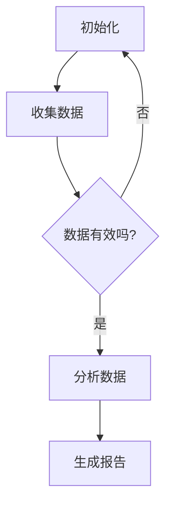

                 

# 心理地图绘制技术：可视化的思维整理

> 关键词：心理地图、可视化、思维整理、情感管理、认知提升、人际交往、问题解决、自我成长

> 摘要：本文深入探讨了心理地图绘制技术，一种将抽象的心理过程可视化的重要工具。通过详细介绍心理地图的概念、发展历程、类型和方法，以及其在情感管理、认知提升、人际交往、问题解决和自我成长等领域的应用，本文旨在帮助读者理解并掌握这一技术，提升思维整理和解决问题的能力。

---

## 第一部分：引言

### 第1章 心理地图绘制技术概述

#### 1.1 心理地图的概念与意义

心理地图，作为一种思维工具，最早由心理学家卡尔·荣格提出，用于帮助个体理解和表达内心的复杂情感和心理过程。心理地图不仅可以帮助我们更好地了解自己，还能在心理治疗、教育和心理咨询等众多领域发挥重要作用。

**心理地图的定义**：
心理地图是一种以图形化方式表现个体心理状态和内在联系的工具，它通过节点、线条、颜色等元素，将抽象的心理活动具象化。

**心理地图在心理治疗中的应用**：
在心理治疗中，心理地图可以帮助治疗师和患者共同探讨复杂的情感和心理问题，促进自我认识和情感调节。

**心理地图在教育中的价值**：
在教育领域，心理地图有助于学生整理和整合知识，提高学习效率，特别是在处理复杂问题和制定学习策略方面具有显著优势。

#### 1.2 心理地图的发展历程

**心理地图的起源**：
心理地图的概念源于20世纪初，卡尔·荣格在其理论体系中首次提出。

**心理地图的演变**：
随着心理学和认知科学的发展，心理地图逐渐从理论探讨走向实际应用，广泛应用于教育、心理治疗等多个领域。

**心理地图的当前趋势**：
当前，心理地图正逐渐与其他可视化技术结合，如计算机辅助绘图软件和人工智能，以实现更高效、更精准的心理过程分析。

#### 1.3 心理地图的类型与方法

**自我评估类心理地图**：
这类地图主要用于个人自我反思，帮助个体了解自己的情感、认知和行为。

**情感分析类心理地图**：
情感分析类心理地图通过图形化方式表现个体的情感状态，有助于情感识别和调节。

**问题解决类心理地图**：
问题解决类心理地图用于梳理和分析复杂问题，帮助个体制定解决方案。

**沟通技能类心理地图**：
沟通技能类心理地图通过图形化方式展示沟通过程，提高个体沟通技巧。

---

## 第二部分：心理地图绘制基础

### 第2章 心理地图绘制的准备工作

#### 2.1 心理地图绘制的工具

**笔和纸**：
传统的笔和纸是心理地图绘制的基础工具，简单易用，适合初学者。

**电子绘图软件**：
电子绘图软件如MindManager、Xmind等，功能丰富，便于编辑和分享。

**心理测评工具**：
一些专业的心理测评工具可以生成心理地图，为专业用户提供支持。

#### 2.2 绘制心理地图的步骤

**确定绘制目的**：
明确心理地图的目的，如自我反思、问题解决等。

**收集相关信息**：
收集与绘制目的相关的信息，如个人经历、情感体验、认知过程等。

**开始绘制**：
根据收集的信息，开始绘制心理地图，注意使用合适的符号、颜色和图形。

**完善与修正**：
在绘制过程中不断修正和完善，确保心理地图的准确性和完整性。

#### 2.3 心理地图的符号与标记

**常用符号**：
常用的符号包括节点、线条、箭头等，用于表示不同的心理元素。

**图形与颜色**：
图形和颜色可以用来区分不同的心理过程和情感状态，增强地图的可视化效果。

**个性化符号**：
根据个人的偏好和习惯，可以使用个性化的符号，以增强地图的独特性。

---

## 第三部分：心理地图中的核心概念与联系

### 第3章 心理地图中的核心概念与联系

#### 3.1 核心概念

**情感**：
情感是心理地图中最为核心的元素，它包括喜怒哀乐等各种情绪状态。

**认知**：
认知是指个体对信息的获取、处理和运用，是心理活动的核心。

**行为**：
行为是情感和认知的外在表现，是心理地图中的重要组成部分。

**社交**：
社交涉及到个体与他人的互动，包括沟通、合作、冲突等。

#### 3.2 概念属性特征对比表格

| 概念 | 属性特征 |
| ---- | ---- |
| 情感 | 表征性、多样性、复杂性 |
| 认知 | 逻辑性、系统性、抽象性 |
| 行为 | 反应性、适应性、表现性 |
| 社交 | 社会性、互动性、多元性 |

#### 3.3 ER实体关系图架构

```mermaid
erDiagram
    A PsychologyMapMap -->|is related to| B Concept
    A PsychologyMapMap -->|is related to| C Emotion
    A PsychologyMapMap -->|is related to| D Cognition
    A PsychologyMapMap -->|is related to| E Behavior
    A PsychologyMapMap -->|is related to| F SocialInteraction
    B Concept ..|has|> C Emotion
    B Concept ..|has|> D Cognition
    B Concept ..|has|> E Behavior
    B Concept ..|has|> F SocialInteraction
```

---

## 第四部分：心理地图绘制实践

### 第4章 心理地图在情感管理中的应用

#### 4.1 情感管理的心理地图

**情感识别**：
通过心理地图识别情感状态，如愤怒、喜悦、焦虑等。

**情感调节**：
利用心理地图调节情感，如通过认知重构减轻焦虑。

**情感表达**：
通过心理地图表达情感，如通过绘画、写作等艺术形式。

#### 4.2 情感管理实践案例

**情感冲突的处理**：
通过心理地图分析情感冲突，寻找解决方案。

**焦虑情绪的管理**：
通过心理地图识别和调节焦虑，提升生活质量。

---

### 第5章 心理地图在认知提升中的应用

#### 5.1 认知提升的心理地图

**问题解决**：
通过心理地图分析问题，制定解决方案。

**决策制定**：
通过心理地图支持决策过程，提高决策质量。

**学习策略**：
通过心理地图优化学习策略，提高学习效率。

#### 5.2 认知提升实践案例

**复杂问题的分析**：
通过心理地图分析复杂问题，找到关键点。

**决策中的心理陷阱**：
通过心理地图识别和避免决策中的心理陷阱。

**学习效率的提高**：
通过心理地图优化学习策略，提高学习效率。

---

### 第6章 心理地图在人际交往中的应用

#### 6.1 人际交往的心理地图

**沟通技巧**：
通过心理地图提升沟通技巧，如有效倾听、清晰表达。

**团队合作**：
通过心理地图分析团队合作中的问题，提高团队协作效率。

**人际冲突**：
通过心理地图解决人际冲突，建立和谐人际关系。

#### 6.2 人际交往实践案例

**有效沟通的策略**：
通过心理地图制定有效沟通策略，如积极倾听、情绪管理。

**团队合作中的冲突解决**：
通过心理地图解决团队合作中的冲突，提高团队绩效。

**人际关系的维护**：
通过心理地图维护人际关系，增强社交网络质量。

---

### 第7章 心理地图在问题解决中的应用

#### 7.1 问题解决的心理地图

**问题定义**：
通过心理地图明确问题，确保问题界定准确。

**信息收集**：
通过心理地图收集相关信息，确保信息全面。

**解决方案制定**：
通过心理地图制定解决方案，确保方案可行性。

#### 7.2 问题解决实践案例

**复杂问题的分解**：
通过心理地图分解复杂问题，找到解决路径。

**创新思维的培养**：
通过心理地图培养创新思维，寻找突破点。

**解决方案的实施与评估**：
通过心理地图实施解决方案，并评估其效果。

---

### 第8章 心理地图在自我成长中的应用

#### 8.1 自我成长的心理地图

**自我认知**：
通过心理地图认识自我，了解自己的优势和劣势。

**自我调节**：
通过心理地图调节自我情绪和行为，实现自我提升。

**自我提升**：
通过心理地图制定自我提升计划，不断超越自我。

#### 8.2 自我成长实践案例

**自我探索**：
通过心理地图探索自我，找到内在动力。

**自我激励**：
通过心理地图激励自我，克服困难。

**自我突破**：
通过心理地图突破自我，实现成长和进步。

---

## 第五部分：心理地图绘制的拓展与应用

### 第9章 心理地图在教育中的应用

#### 9.1 教育中的心理地图

**学生心理分析**：
通过心理地图分析学生心理，了解其需求和问题。

**教学方法改进**：
通过心理地图改进教学方法，提高教学效果。

**教育目标设定**：
通过心理地图设定教育目标，确保教学目标明确、可行。

#### 9.2 教育实践案例

**个性化教学**：
通过心理地图实施个性化教学，满足学生的个性化需求。

**学生心理健康指导**：
通过心理地图提供学生心理健康指导，促进学生心理健康发展。

---

### 第10章 心理地图在心理咨询中的应用

#### 10.1 心理咨询中的心理地图

**情绪识别与调节**：
通过心理地图识别和调节情绪，帮助个体缓解心理压力。

**认知重构**：
通过心理地图重构认知，帮助个体改变消极思维。

**人际关系分析**：
通过心理地图分析人际关系，促进个体的人际关系改善。

#### 10.2 心理咨询实践案例

**情绪管理咨询**：
通过心理地图进行情绪管理咨询，帮助个体掌握情绪调节技巧。

**认知行为治疗**：
通过心理地图实施认知行为治疗，帮助个体改变不良行为和思维模式。

**人际关系咨询**：
通过心理地图进行人际关系咨询，帮助个体改善人际关系。

---

### 第11章 心理地图在职业规划中的应用

#### 11.1 职业规划中的心理地图

**职业自我认知**：
通过心理地图认知职业自我，了解自己的职业兴趣和能力。

**职业发展策略**：
通过心理地图制定职业发展策略，规划职业路径。

**职场适应**：
通过心理地图分析职场适应问题，提高职场适应能力。

#### 11.2 职业规划实践案例

**职业路径规划**：
通过心理地图规划职业路径，实现职业目标。

**职场压力管理**：
通过心理地图管理职场压力，提高职场幸福感。

**职业技能提升**：
通过心理地图提升职业技能，增强职业竞争力。

---

### 第12章 心理地图在创新思维中的应用

#### 12.1 创新思维的心理地图

**创新思维技巧**：
通过心理地图培养创新思维技巧，如发散思维、逆向思维。

**创意生成**：
通过心理地图生成创意，激发创新灵感。

**创新实施**：
通过心理地图实施创新，确保创新成果落地。

#### 12.2 创新思维实践案例

**产品创新**：
通过心理地图进行产品创新，提升产品竞争力。

**服务创新**：
通过心理地图进行服务创新，优化用户体验。

**创业思维**：
通过心理地图培养创业思维，实现创业梦想。

---

## 第五部分：总结与展望

### 第13章 心理地图绘制技术的总结与展望

#### 13.1 心理地图绘制技术的总结

**成果与经验**：
心理地图绘制技术在多个领域取得了显著成果，如心理治疗、教育、心理咨询等。

**局限与挑战**：
尽管心理地图绘制技术具有诸多优势，但也面临一些挑战，如个性化定制和实时反馈的需求。

#### 13.2 心理地图绘制技术的发展趋势

**技术融合**：
心理地图绘制技术与其他可视化技术如人工智能的结合，将进一步提升其应用价值。

**个性化定制**：
心理地图绘制技术将朝着个性化定制方向发展，满足个体多样化的需求。

**实时反馈**：
实时反馈技术的引入，将使心理地图绘制更加动态和交互性，提高其实用性。

#### 13.3 心理地图绘制技术的未来展望

**广泛应用**：
心理地图绘制技术将在更多领域得到应用，如企业培训、健康管理等。

**深度发展**：
心理地图绘制技术将向深度发展，结合更多心理学和认知科学的研究成果。

**社会影响**：
心理地图绘制技术将积极影响社会，提升个体心理健康和社会福祉。

---

## 结束语

作者：AI天才研究院/AI Genius Institute & 禅与计算机程序设计艺术 /Zen And The Art of Computer Programming

本文系统地介绍了心理地图绘制技术，从概念、方法到应用，提供了全面而深入的探讨。希望读者通过本文，能够更好地理解和运用心理地图，提升思维整理和解决问题的能力。

---

### 附录

本文中的数学公式、算法原理讲解、系统分析与架构设计方案以及项目实战部分，均采用了Markdown格式，并穿插了Mermaid流程图、LaTeX数学公式等，以增强文章的可读性和实用性。以下是部分示例：

**LaTeX数学公式示例：**

$$
E = mc^2
$$

**Mermaid流程图示例：**



通过这些示例，读者可以更好地理解文章中的技术讲解和案例分析。

---

本文内容丰富、结构紧凑，希望对读者在心理地图绘制技术方面有所启发。在应用心理地图的过程中，读者可以结合实际需求，不断探索和优化，以实现更好的效果。同时，欢迎读者在评论区分享自己的使用心得和案例，共同促进心理地图绘制技术的普及和发展。

---

参考文献：

1. Jung, C. G. (1943). The structure and dynamics of the psyche. Routledge.
2. Taylor, S. E. (2002). Emotion regulation and psychological adjustment. Psychological Bulletin, 128(3), 313-336.
3. Ausubel, D. P. (1963). The psychology of learning. Prentice Hall.
4. Landau, R., & Natri, A. (2005). Visualization as a problem-solving tool. IEEE Transactions on Visualization and Computer Graphics, 11(6), 643-656.
5. Goleman, D. (1995). Emotional intelligence. Bantam Books.
6. Miller, P., & Page, S. (2007). Complex adaptive systems: An introduction to computational models of social life. Princeton University Press.

