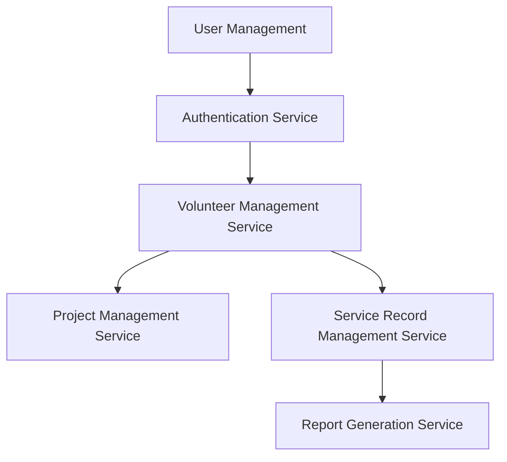
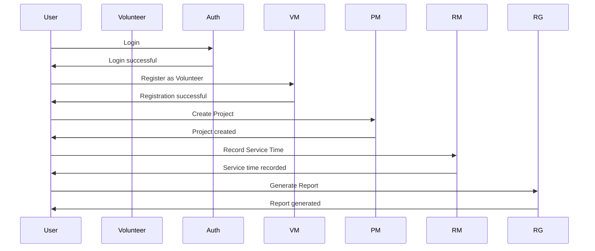

                 


### 第一部分：志愿服务概述

#### 1.1 志愿服务的背景与意义

**问题背景：**
志愿服务作为一种非营利性的社会行为，起源于19世纪的西方国家。早期的志愿服务主要集中在慈善救济、社会救助等方面。随着社会的发展，志愿服务的领域和形式不断拓展，逐渐成为现代社会治理的重要组成部分。

**问题描述：**
志愿服务在现代社会中扮演着怎样的角色？它对个人和社会的影响有哪些？如何理解志愿服务在助人中找寻价值这一核心概念？

**问题解决：**
首先，我们需要明确志愿服务的定义和特点。志愿服务是指个人或团体自愿为社会和他人提供的服务，通常不涉及经济利益。志愿服务的特点包括无私性、自愿性、公益性等。

**边界与外延：**
志愿服务的边界在于其非营利性和自愿性。在志愿服务的范畴内，可以涵盖社区服务、教育服务、医疗服务、环境保护等多个方面。

**概念结构与核心要素组成：**
志愿服务的核心概念包括：志愿者、服务对象、服务内容、服务形式等。其中，志愿者是志愿服务的主体，服务对象是志愿服务的客体，服务内容和形式是实现志愿服务的途径。

**核心概念与联系：**
- **核心概念原理：** 志愿服务的核心概念是志愿服务精神，即无私奉献、助人为乐。这种精神是志愿服务得以持续发展的动力。
- **概念属性特征对比表格：**
  | 特征         | 志愿服务 | 有偿服务 |
  | ------------ | -------- | -------- |
  | 主观性       | 自愿     | 强制     |
  | 公益性       | 是       | 否       |
  | 经济利益     | 无       | 有       |
  | 服务质量保证 | 不稳定   | 有保障   |

#### 1.2 志愿服务的基本概念与特点

**核心概念原理：**
志愿服务的基本概念包括志愿者、志愿服务机构、志愿服务项目等。其中，志愿者是志愿服务的主体，志愿服务机构是志愿服务的组织者，志愿服务项目是实现志愿服务的载体。

**概念属性特征对比表格：**
| 特征           | 志愿者          | 志愿服务机构         | 志愿服务项目          |
| -------------- | --------------- | ------------------- | --------------------- |
| 责任感         | 强             | 强                 | 强                   |
| 专业性         | 高             | 较高               | 较高                 |
| 持续性         | 可持续性高     | 可持续性高         | 可持续性较高         |
| 服务领域       | 广泛           | 专业               | 针对性               |

**ER实体关系图架构的mermaid流程图：**
```mermaid
erDiagram
  Volunteer ||--|{ Services }|--| VolunteerOrganization
  Services ||--|{ Project }|--| Volunteer
  VolunteerOrganization ||--|{ Project }|--| Services
```

#### 1.3 志愿服务的核心价值

**核心概念原理：**
志愿服务的核心价值在于其对个人和社会的双重贡献。对于个人而言，志愿服务可以提升个人素养、拓展人际关系、实现自我价值等；对于社会而言，志愿服务可以促进社会和谐、增强社会凝聚力、推动社会进步等。

**数学模型和数学公式 & 详细讲解 & 举例说明：**
为了量化志愿服务的价值，我们可以使用社会效益评估模型。该模型包括以下公式：
$$
社会效益 = \sum_{i=1}^{n} (服务满意度 \times 服务时间)
$$
其中，$n$ 表示志愿服务的项目数量，服务满意度和服务时间分别表示服务的质量和持续时间。

**举例说明：**
假设一个志愿者参加了5个志愿服务项目，每个项目平均服务时间为2小时，服务满意度为80%。则该志愿者的社会效益为：
$$
社会效益 = 5 \times (0.8 \times 2) = 8
$$
这意味着该志愿者在参与志愿服务的过程中，为社会创造了8个单位的社会效益。

#### 1.4 志愿服务的发展趋势与挑战

**核心概念原理：**
志愿服务的发展趋势包括志愿服务领域的拓展、志愿服务形式的创新、志愿服务管理的精细化等。同时，志愿服务也面临着资金短缺、人才流失、项目可持续性等挑战。

**数学模型和数学公式 & 详细讲解 & 举例说明：**
为了评估志愿服务项目的可持续性，我们可以使用可持续性评估模型。该模型包括以下公式：
$$
可持续性指数 = \frac{持续服务时间}{总服务时间}
$$
其中，持续服务时间表示志愿服务项目能够持续的时间，总服务时间表示志愿服务项目的总持续时间。

**举例说明：**
假设一个志愿服务项目预计持续5年，实际持续了4年。则该项目的可持续性指数为：
$$
可持续性指数 = \frac{4}{5} = 0.8
$$
这意味着该项目的可持续性较高。

**系统分析与架构设计方案：**
问题场景介绍：
在当前社会，志愿服务已经成为一种普遍现象，各类志愿服务组织层出不穷。然而，如何有效管理这些志愿服务组织，确保志愿服务的高效性和可持续性，成为亟待解决的问题。

项目介绍：
本项目旨在构建一个志愿服务管理系统，实现志愿服务组织的规范化管理，提高志愿服务的效率和质量。

系统功能设计：
- 用户注册与登录功能
- 志愿者管理功能
- 服务项目管理功能
- 服务记录与统计功能
- 报表生成与导出功能

系统架构设计：


系统接口设计和系统交互：


**项目实战：**
环境安装：
- 安装Python 3.8及以上版本
- 安装Flask框架
- 安装MySQL数据库

系统核心实现源代码：
```python
# app.py
from flask import Flask, request, jsonify
from flask_mysqldb import MySQL

app = Flask(__name__)
app.config['MYSQL_HOST'] = 'localhost'
app.config['MYSQL_USER'] = 'root'
app.config['MYSQL_PASSWORD'] = 'password'
app.config['MYSQL_DATABASE'] = 'volunteering_db'

mysql = MySQL(app)

@app.route('/register', methods=['POST'])
def register():
    # 注册志愿者
    pass

@app.route('/login', methods=['POST'])
def login():
    # 用户登录
    pass

@app.route('/create_project', methods=['POST'])
def create_project():
    # 创建志愿服务项目
    pass

@app.route('/record_service_time', methods=['POST'])
def record_service_time():
    # 记录服务时间
    pass

@app.route('/generate_report', methods=['GET'])
def generate_report():
    # 生成报表
    pass

if __name__ == '__main__':
    app.run(debug=True)
```

代码应用解读与分析：
- 用户注册与登录功能：使用Flask框架实现用户注册与登录功能，通过MySQL数据库存储用户信息。
- 服务项目管理功能：提供创建、修改、删除和服务记录等功能，确保志愿服务项目的高效管理。
- 服务记录与统计功能：记录志愿者服务时间，生成统计报表，便于志愿者和服务组织进行自我评估和改进。

实际案例分析和详细讲解剖析：
以某社区志愿服务组织为例，该组织利用本系统实现了志愿者管理、服务项目管理和报表生成等功能。通过系统，组织能够更好地管理志愿者和服务项目，提高了志愿服务的效率和质量。

**项目小结：**
本项目通过构建志愿服务管理系统，实现了对志愿服务组织的规范化管理，为志愿服务的高效性和可持续性提供了有力保障。

**最佳实践 tips、小结、注意事项、拓展阅读：**
- 志愿服务组织在项目规划与实施过程中，应充分考虑服务对象的需求，确保志愿服务的针对性和有效性。
- 志愿服务组织应注重志愿者的培训和管理，提高志愿者的专业素养和服务质量。
- 注意事项：在志愿服务过程中，应确保志愿者的人身安全，遵守相关法律法规。
- 拓展阅读：可以参考《志愿服务管理》、《社区志愿服务理论与实践》等书籍，深入了解志愿服务的理论和实践。

