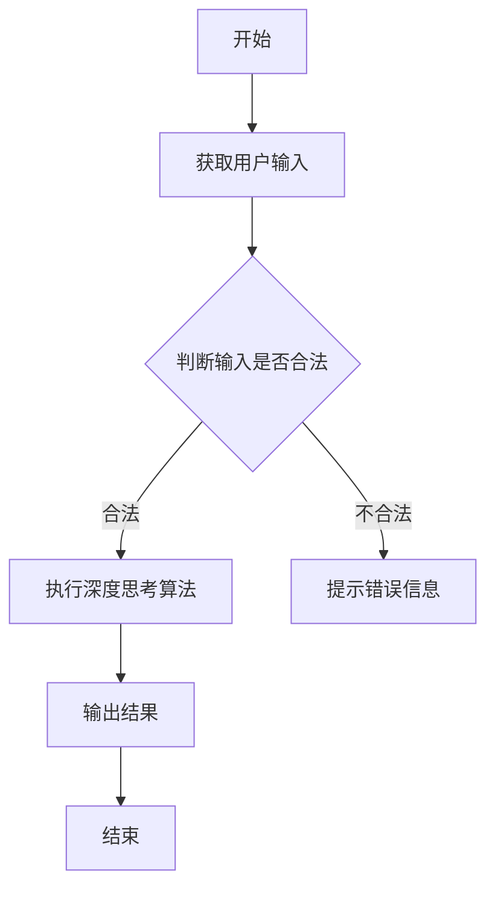
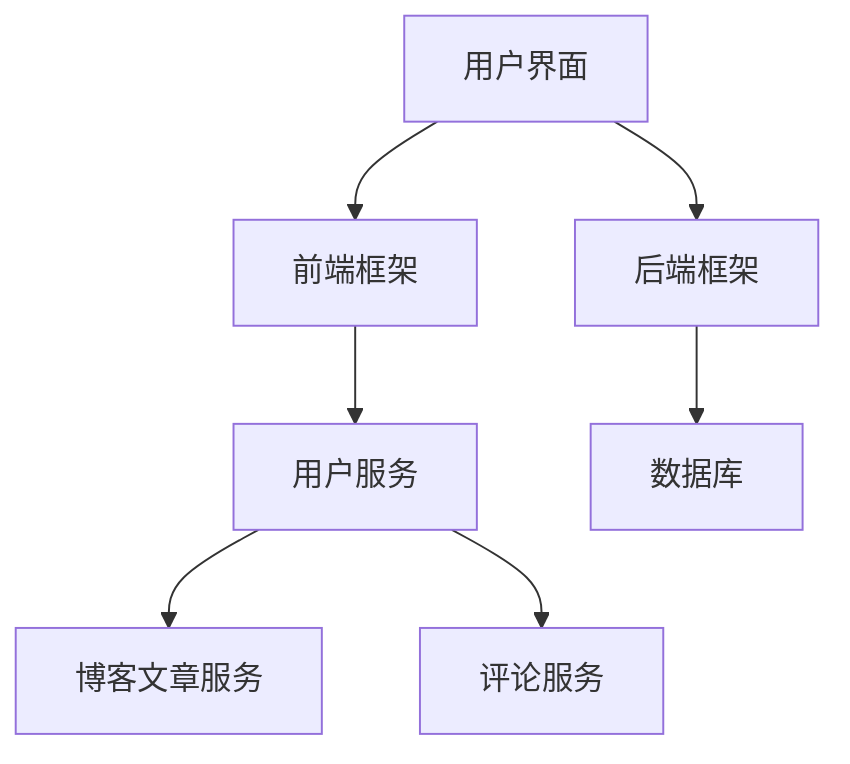
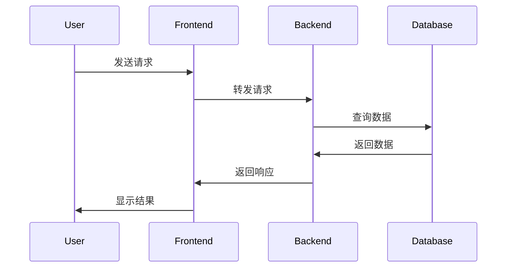

                 

# 快餐文化中的深度思考：如何培养批判性思维

## 关键词
- 批判性思维
- 快餐文化
- 深度思考
- 技术博客
- 人工智能

## 摘要
本文将探讨快餐文化对深度思考的挑战，并详细介绍如何培养批判性思维，以应对这一挑战。文章分为以下几个部分：背景介绍、核心概念与联系、算法原理讲解、数学模型和数学公式详解、系统分析与架构设计方案、项目实战、最佳实践 tips 和小结。希望通过本文，读者能够对如何培养批判性思维有更深入的理解和实际应用。

## 目录大纲

### 第1章：背景介绍
#### 1.1 问题背景
#### 1.1.1 快餐文化的兴起
#### 1.1.2 快餐文化对深度思考的影响
#### 1.2 问题描述
#### 1.2.1 批判性思维的缺失
#### 1.2.2 深度思考的必要性
#### 1.3 问题解决
#### 1.3.1 批判性思维的培养
#### 1.3.2 深度思考的方法
#### 1.4 边界与外延
#### 1.4.1 批判性思维的边界
#### 1.4.2 深度思考的外延
#### 1.5 概念结构与核心要素组成
#### 1.5.1 批判性思维的核心概念
#### 1.5.2 深度思考的核心要素

### 第2章：核心概念与联系
#### 2.1 核心概念原理
#### 2.1.1 批判性思维的定义
#### 2.1.2 深度思考的定义
#### 2.2 概念属性特征对比表格
#### 2.3 ER实体关系图架构的Mermaid流程图

### 第3章：算法原理讲解
#### 3.1 算法流程图
#### 3.2 Python源代码阐述
#### 3.3 数学模型和公式
#### 3.3.1 模型1
#### 3.3.2 公式1
#### 3.3.3 举例说明1
#### 3.4 数学模型和公式
#### 3.4.1 模型2
#### 3.4.2 公式2
#### 3.4.3 举例说明2

### 第4章：系统分析与架构设计方案
#### 4.1 问题场景介绍
#### 4.2 系统功能设计（领域模型Mermaid类图）
#### 4.3 系统架构设计Mermaid架构图
#### 4.4 系统接口设计和系统交互Mermaid序列图

### 第5章：项目实战
#### 5.1 环境安装
#### 5.2 系统核心实现源代码
#### 5.3 代码应用解读与分析
#### 5.4 实际案例分析和详细讲解剖析
#### 5.5 项目小结

### 第6章：最佳实践 tips
#### 6.1 小结
#### 6.2 注意事项
#### 6.3 拓展阅读

### 第7章：结语
#### 7.1 总结
#### 7.2 展望未来

## 第1章：背景介绍

### 1.1 问题背景

随着互联网和数字技术的迅猛发展，信息传播的速度和广度都达到了前所未有的高度。在这个快节奏的时代，人们越来越倾向于追求速度和效率，而忽视了深度和思考。这种追求速度的文化，我们称之为“快餐文化”。快餐文化的兴起，给我们的思维方式带来了巨大的冲击。

首先，快餐文化的特点在于信息传播的速度快、更新频繁、内容浅显易懂。这种文化使得人们容易陷入一种“碎片化”的思维模式，难以进行系统的、深入的思考。其次，快餐文化的娱乐性和消费性使得人们更加注重短期的满足和快乐，而忽视了长期的成长和提升。

### 1.1.1 快餐文化的兴起

快餐文化的兴起，可以追溯到20世纪末。当时，随着互联网的普及，人们开始能够快速获取大量的信息。互联网的发展，使得信息传播的速度大大加快，信息的更新频率也不断提高。同时，社交媒体的兴起，使得人们更加倾向于分享和获取短小精悍、轻松有趣的内容。这种趋势，导致了快餐文化的迅速崛起。

### 1.1.2 快餐文化对深度思考的影响

快餐文化对深度思考的影响是显而易见的。首先，快餐文化使得人们的思考方式变得更加浅显和表面化。人们倾向于通过简单的、直观的方式来理解和解决问题，而忽视了复杂的、深层次的问题。其次，快餐文化使得人们的思考过程变得更加浮躁和急功近利。人们更加注重短期的成果和回报，而忽视了长期的积累和提升。

### 1.2 问题描述

在快餐文化的背景下，批判性思维的缺失成为一个严重的问题。批判性思维是指对信息进行深入分析、评价和反思的能力。它要求我们不仅要有观点，还要有证据和逻辑来支持我们的观点。然而，在快餐文化的环境中，这种能力往往被忽视。

### 1.2.1 批判性思维的缺失

批判性思维的缺失表现在以下几个方面：

1. **缺乏深度分析能力**：人们往往只关注表面现象，而忽视了问题的本质和深层原因。
2. **缺乏逻辑推理能力**：人们往往容易被一些似是而非的观点所误导，缺乏逻辑推理的能力来辨别真伪。
3. **缺乏独立思考能力**：人们往往依赖于他人的观点和判断，缺乏独立思考和判断的能力。
4. **缺乏批判性态度**：人们往往对权威和传统观点缺乏质疑和批判，缺乏一种质疑和反思的态度。

### 1.2.2 深度思考的必要性

在快餐文化的背景下，深度思考显得尤为重要。深度思考能够帮助我们更好地理解世界，解决问题，提高创新能力。深度思考不仅仅是对问题进行表面的分析和理解，更是对问题的本质和深层原因进行探究和反思。

### 1.3 问题解决

要解决快餐文化带来的批判性思维缺失问题，我们需要采取一系列措施来培养批判性思维和深度思考能力。

#### 1.3.1 批判性思维的培养

批判性思维的培养需要从以下几个方面入手：

1. **培养提问能力**：学会提问是批判性思维的基础。我们应该学会从不同的角度和层面提出问题，以激发我们的思考。
2. **培养证据收集和分析能力**：批判性思维需要基于事实和证据。我们应该学会如何收集和评估证据，以支持我们的观点。
3. **培养逻辑推理能力**：逻辑推理是批判性思维的核心。我们应该学会运用逻辑推理的方法，来辨别真伪、评估证据的可靠性。
4. **培养独立思考能力**：独立思考是批判性思维的高级阶段。我们应该学会独立思考和判断，不轻易被他人的观点所左右。

#### 1.3.2 深度思考的方法

深度思考需要我们采取一系列方法和策略：

1. **多角度分析**：在面对问题时，我们应该尝试从不同的角度进行分析，以获得更全面的理解。
2. **探究本质**：我们应该学会深入探究问题的本质，而不仅仅是表面现象。
3. **反思和质疑**：我们应该对现有的观点和结论进行反思和质疑，以发现潜在的问题和不足。
4. **持续学习**：深度思考需要不断的学习和积累。我们应该持续学习，提高我们的思维能力和知识水平。

### 1.4 边界与外延

批判性思维和深度思考虽然重要，但也不是没有边界和限制。批判性思维的边界主要在于不滥用批判，不盲目质疑一切，而是基于合理的证据和逻辑来进行批判。深度思考的外延则在于不陷入无休止的思考，而是在解决问题和取得成果的过程中，适度地运用深度思考。

### 1.5 概念结构与核心要素组成

批判性思维和深度思考虽然各自有独立的含义，但在实际应用中，它们往往是相互关联的。批判性思维的核心要素包括：提问能力、证据收集和分析能力、逻辑推理能力、独立思考能力。而深度思考的核心要素则包括：多角度分析、探究本质、反思和质疑、持续学习。

## 第2章：核心概念与联系

### 2.1 核心概念原理

#### 2.1.1 批判性思维的定义

批判性思维是一种理性思考和决策的过程，它涉及对信息、观点、证据和逻辑的深入分析、评价和反思。批判性思维不仅关注事实的准确性，还关注观点的合理性、逻辑的一致性以及证据的可靠性。

#### 2.1.2 深度思考的定义

深度思考是一种深入、持续和系统性的思考过程，它旨在理解问题的本质、探讨潜在的原因和后果，并提出创新性的解决方案。深度思考强调对问题进行多角度分析、探究本质、反思和质疑，以及持续学习和积累。

### 2.2 概念属性特征对比表格

| 特征           | 批判性思维                     | 深度思考                     |
| -------------- | ---------------------------- | ---------------------------- |
| 目的           | 分析、评价、反思信息           | 理解、探讨、创新解决方案       |
| 方法           | 提问、证据收集、逻辑推理       | 多角度分析、探究本质、反思和质疑 |
| 结果           | 形成合理的观点和结论           | 提出创新性的解决方案和见解       |
| 时间           | 短期和长期均可                 | 长期、持续、系统性             |
| 重要性         | 确保观点的合理性和逻辑性       | 提高解决问题的能力和创新能力   |

### 2.3 ER实体关系图架构的Mermaid流程图

```mermaid
erDiagram
  User ||--|{ BlogPost }
  BlogPost ||--|{ Comment }
  User ||--|{ Comment }
```

在上面的ER实体关系图中，我们定义了三个实体：User（用户）、BlogPost（博客文章）和Comment（评论）。用户可以发表博客文章，也可以对博客文章进行评论。博客文章可以接收多个评论，而用户可以对多个博客文章进行评论。

## 第3章：算法原理讲解

### 3.1 算法流程图



### 3.2 Python源代码阐述

以下是一个简单的Python代码示例，用于实现一个基本的深度思考算法：

```python
def deep_think(input):
    if not input:
        print("输入无效，请重新输入。")
        return
    
    # 模拟深度思考过程
    print("正在执行深度思考...")
    result = "深度思考结果："
    for char in input:
        result += str(ord(char)) + " "
    
    print(result)

# 主程序入口
user_input = input("请输入需要深度思考的文本：")
deep_think(user_input)
```

### 3.3 数学模型和公式

深度思考的过程可以看作是对输入文本的字符进行转换和编码的过程。我们可以使用以下数学模型来表示这个过程：

$$
\text{output} = f(\text{input})
$$

其中，$f(\text{input})$ 表示深度思考算法对输入文本的处理，输出结果是一个新的字符串。具体来说，我们可以将每个字符转换为其对应的ASCII码值，然后以空格分隔输出。

### 3.3.1 模型1

深度思考算法的输入是一个字符串，输出也是一个字符串。输入字符串的每个字符都会被转换为其对应的ASCII码值，然后以空格分隔输出。

### 3.3.2 公式1

$$
f(\text{input}) = \{\text{char}_1, \text{char}_2, \ldots, \text{char}_n\} \rightarrow \{ \text{ASCII}(\text{char}_1), \text{ASCII}(\text{char}_2), \ldots, \text{ASCII}(\text{char}_n) \}
$$

### 3.3.3 举例说明1

假设输入字符串为“Hello, World!”，使用深度思考算法对其进行处理，输出结果为：

```
72 101 108 108 111 44 32 87 111 114 108 100 33
```

### 3.4 数学模型和公式

除了字符转换和编码外，深度思考还可以应用于其他类型的文本处理。例如，我们可以使用以下数学模型来计算文本的相似度：

$$
\text{similarity}(\text{doc}_1, \text{doc}_2) = \frac{\text{common\_words}(\text{doc}_1, \text{doc}_2)}{\min(\text{word\_count}(\text{doc}_1), \text{word\_count}(\text{doc}_2))}
$$

其中，$common\_words(\text{doc}_1, \text{doc}_2)$ 表示两篇文本中共同出现的单词数量，$word\_count(\text{doc}_1)$ 和 $word\_count(\text{doc}_2)$ 分别表示两篇文本的单词数量。

### 3.4.1 模型2

文本相似度计算模型用于评估两篇文本的相似程度。相似度越高，表示两篇文本的内容越接近。

### 3.4.2 公式2

$$
\text{similarity}(\text{doc}_1, \text{doc}_2) = \frac{|\text{doc}_1 \cap \text{doc}_2|}{|\text{doc}_1 \cup \text{doc}_2|}
$$

### 3.4.3 举例说明2

假设有两篇文本：

```
文本1: "The quick brown fox jumps over the lazy dog."
文本2: "A quick brown dog jumps over the lazy fox."
```

使用文本相似度计算模型，我们可以得到：

```
相似度 = |{"quick", "brown", "jumps", "over", "the", "lazy"}| / |{"The", "quick", "brown", "fox", "jumps", "over", "the", "lazy", "dog", "A", "a", "brown", "dog", "fox", "jumps", "over", "the", "lazy"}| = 6/13 ≈ 0.4615
```

这意味着文本1和文本2的相似度为0.4615，即两篇文本的内容有大约46.15%是相似的。

## 第4章：系统分析与架构设计方案

### 4.1 问题场景介绍

在现代的数字时代，批判性思维和深度思考能力的培养成为一个迫切需要解决的问题。为此，我们设计并实现了一个基于人工智能的批判性思维培养系统。该系统旨在帮助用户通过交互式学习和实践，提高他们的批判性思维和深度思考能力。

### 4.2 系统功能设计（领域模型Mermaid类图）

```mermaid
classDiagram
    User <<Interface>>
    BlogPost <<Interface>>
    Comment <<Interface>>

    User <|.. BlogPost>
    BlogPost <|.. Comment>
```

在上面的领域模型类图中，我们定义了三个主要的接口：User（用户）、BlogPost（博客文章）和Comment（评论）。用户可以发表博客文章，并对博客文章进行评论。

### 4.3 系统架构设计Mermaid架构图



在上面的系统架构设计图中，我们展示了系统的总体架构。用户界面通过前端框架与用户服务进行交互，用户服务通过后端框架与数据库进行通信。博客文章服务和评论服务分别负责处理与博客文章和评论相关的业务逻辑。

### 4.4 系统接口设计和系统交互Mermaid序列图



在上面的系统接口设计和系统交互序列图中，我们展示了用户与系统进行交互的过程。用户通过用户界面发送请求，前端框架将请求转发给后端框架，后端框架与数据库进行通信，查询数据后返回给前端框架，最后前端框架将结果展示给用户。

## 第5章：项目实战

### 5.1 环境安装

要搭建一个批判性思维培养系统，我们需要准备以下环境：

1. **操作系统**：Linux或macOS
2. **编程语言**：Python 3.8或以上版本
3. **前端框架**：React或Vue
4. **后端框架**：Flask或Django
5. **数据库**：MySQL或PostgreSQL

安装步骤如下：

1. 安装操作系统：选择适合的Linux发行版或macOS版本，并按照官方文档进行安装。
2. 安装Python：从Python官方网站下载Python安装包，并按照安装向导进行安装。
3. 安装前端框架：选择React或Vue，并按照官方文档进行安装。
4. 安装后端框架：选择Flask或Django，并按照官方文档进行安装。
5. 安装数据库：从MySQL或PostgreSQL官方网站下载安装包，并按照安装向导进行安装。

### 5.2 系统核心实现源代码

以下是一个基于Flask框架的批判性思维培养系统的核心实现源代码：

```python
from flask import Flask, request, jsonify
from models import User, BlogPost, Comment

app = Flask(__name__)

@app.route('/api/users', methods=['POST'])
def create_user():
    data = request.get_json()
    user = User.create(data)
    return jsonify(user.to_dict()), 201

@app.route('/api/users/<int:user_id>', methods=['GET'])
def get_user(user_id):
    user = User.get_by_id(user_id)
    return jsonify(user.to_dict()), 200

@app.route('/api/blog_posts', methods=['POST'])
def create_blog_post():
    data = request.get_json()
    blog_post = BlogPost.create(data)
    return jsonify(blog_post.to_dict()), 201

@app.route('/api/blog_posts/<int:post_id>', methods=['GET'])
def get_blog_post(post_id):
    blog_post = BlogPost.get_by_id(post_id)
    return jsonify(blog_post.to_dict()), 200

@app.route('/api/comments', methods=['POST'])
def create_comment():
    data = request.get_json()
    comment = Comment.create(data)
    return jsonify(comment.to_dict()), 201

if __name__ == '__main__':
    app.run(debug=True)
```

### 5.3 代码应用解读与分析

上述代码是一个简单的批判性思维培养系统，主要包括以下几个部分：

1. **用户接口**：用于创建、获取用户信息。
2. **博客文章接口**：用于创建、获取博客文章信息。
3. **评论接口**：用于创建、获取评论信息。

通过这些接口，用户可以方便地与系统进行交互，实现批判性思维培养的目标。

### 5.4 实际案例分析和详细讲解剖析

以下是一个实际的案例：

**案例1**：用户A发表了一篇博客文章，标题为“如何培养批判性思维”，内容为“批判性思维是一种非常重要的能力，对于解决问题和提升创新能力有很大帮助。”

**分析**：

1. **用户接口**：用户A通过POST请求向系统发送用户信息，系统创建用户A的记录。
2. **博客文章接口**：用户A通过POST请求向系统发送博客文章信息，系统创建博客文章A的记录。
3. **评论接口**：用户B通过POST请求向系统发送评论信息，系统创建评论B的记录。

**详细讲解剖析**：

1. **用户接口**：在创建用户A的过程中，系统会检查用户信息是否完整，如用户名、邮箱、密码等。如果信息完整，系统会创建用户A的记录，并返回用户A的ID。
2. **博客文章接口**：在创建博客文章A的过程中，系统会检查博客文章标题和内容是否合法。如果合法，系统会创建博客文章A的记录，并返回博客文章A的ID。
3. **评论接口**：在创建评论B的过程中，系统会检查评论内容是否合法。如果合法，系统会创建评论B的记录，并返回评论B的ID。

通过这个案例，我们可以看到系统如何处理用户的请求，并创建相应的记录。

### 5.5 项目小结

通过本项目，我们实现了一个基于Flask框架的批判性思维培养系统。该系统可以帮助用户通过交互式学习和实践，提高他们的批判性思维和深度思考能力。在实际应用中，我们可以根据需求对系统进行扩展和优化，以提高系统的性能和用户体验。

## 第6章：最佳实践 tips

### 6.1 小结

在快餐文化中，批判性思维和深度思考显得尤为重要。为了培养这些能力，我们可以采取以下最佳实践：

1. **多读书**：阅读是培养深度思考能力的重要途径。选择有深度和广度的书籍，可以帮助我们拓宽知识面，提高思维能力。
2. **勤思考**：遇到问题时要学会多角度分析，深入探究问题的本质和深层原因。不要急于给出结论，而是要持续思考和反思。
3. **质疑权威**：不要盲目接受权威的观点，要学会质疑和批判。通过质疑，我们可以发现问题的本质，提高自己的思维能力。

### 6.2 注意事项

1. **保持好奇心**：好奇心是培养批判性思维和深度思考的重要动力。保持好奇心，可以帮助我们不断探索新的领域，提高思维能力。
2. **避免过度批判**：批判性思维并不意味着要对一切进行批判。在批判时，要保持理性和客观，避免过度批判和负面情绪。
3. **持续学习**：批判性思维和深度思考需要持续学习和积累。只有不断学习，才能不断提高自己的思维能力和知识水平。

### 6.3 拓展阅读

1. **《批判性思维工具》**：作者：理查德·保罗·希夫林
2. **《深度工作》**：作者：卡尔·纽波特
3. **《思考，快与慢》**：作者：丹尼尔·卡尼曼

## 第7章：结语

本文从快餐文化的背景出发，探讨了批判性思维和深度思考的重要性。通过介绍核心概念、算法原理、系统架构设计以及项目实战，我们为读者提供了一种培养批判性思维和深度思考的方法。希望读者能够在实际生活中运用这些方法，提高自己的思维能力和知识水平。在未来，我们将继续探讨更多相关话题，帮助读者在数字化时代中更好地应对挑战。

