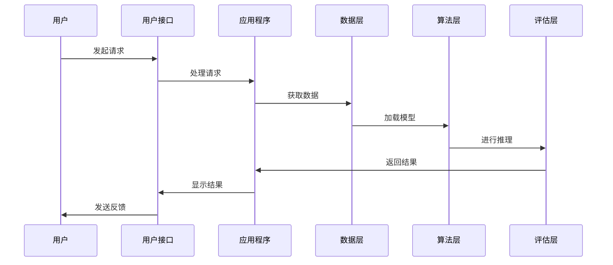

                 


## 思维链prompt：让AI具备人类式思考能力

> 关键词：AI思考能力、思维链prompt、人类式思考、AI教育应用

> 摘要：本文探讨了思维链prompt技术在提升AI思考能力方面的应用。通过介绍思维链prompt的基础理论、设计与实现方法，以及其在AI应用和AI教育中的实践，本文旨在为读者提供全面了解和深入分析思维链prompt的技术路径和应用价值。

### 引言与背景

#### 1.1 问题背景

当前，人工智能（AI）技术取得了飞速发展，但AI在处理复杂问题时，仍无法完全与人类相媲美。人类思考具有灵活性、创造性、复杂推理能力等特点，而当前的AI系统大多依赖于特定的算法和数据，缺乏这种人类特有的思考能力。因此，如何让AI在处理复杂问题时，具备更接近人类的思考能力，成为了一个亟待解决的问题。

#### 1.2 人类式思考的定义

人类式思考包括理解、推理、创新、归纳、演绎等多种方式。理解是指对事物本质和内在联系的把握；推理是指从已知事实推导出未知结论；创新是指创造新的思路和解决方案；归纳是指从具体实例中总结出一般规律；演绎是指从一般原理推导出具体结论。这些思考方式使得人类在复杂问题解决中具有独特的优势。

#### 1.3 思维链prompt的概念

思维链prompt是一种引导AI进行人类式思考的技术。它通过设计特定的输入数据，激发AI的思考过程，使其能够模拟人类的思考方式。思维链prompt的核心思想是，将人类思考过程中的关键要素，如问题、数据、算法等，进行结构化表达，并通过这些结构化的输入数据，引导AI进行有效的思考。

#### 1.4 解决方案

本文提出通过思维链prompt技术，引导AI进行人类式思考。思维链prompt技术能够帮助AI在处理复杂问题时，更好地模拟人类的思考方式，从而提高问题解决能力。接下来，本文将详细介绍思维链prompt的基础理论、设计与实现方法，以及在AI应用和AI教育中的实践。

#### 1.5 书籍结构

本文分为以下七个部分：

1. 引言与背景
2. 思维链prompt基础理论
3. 思维链prompt设计与实现
4. 思维链prompt在AI应用中的实践
5. 思维链prompt的挑战与未来方向
6. 思维链prompt在教育中的应用
7. 总结与展望

### 第2章 思维链prompt基础理论

#### 2.1 思维链prompt的定义

思维链prompt是一种引导AI进行人类式思考的技术。它通过设计特定的输入数据，激发AI的思考过程，使其能够模拟人类的思考方式。思维链prompt的核心思想是，将人类思考过程中的关键要素，如问题、数据、算法等，进行结构化表达，并通过这些结构化的输入数据，引导AI进行有效的思考。

#### 2.2 思维链prompt的工作原理

思维链prompt的工作原理可以概括为以下三个步骤：

1. **输入数据设计**：根据问题需求，设计结构化的输入数据，包括问题陈述、相关数据、算法描述等。
2. **思考过程引导**：通过输入数据，引导AI进行思考，模拟人类的推理、创新、归纳、演绎等过程。
3. **输出结果分析**：分析AI的思考结果，评估其是否符合预期，并对其进行优化调整。

#### 2.3 思维链prompt的特点

思维链prompt具有以下特点：

1. **灵活性**：思维链prompt可以根据问题需求灵活调整，适应不同领域的问题解决。
2. **高效性**：思维链prompt能够快速引导AI进行有效的思考，提高问题解决效率。
3. **可扩展性**：思维链prompt适用于不同领域的问题解决，具有较好的可扩展性。

#### 2.4 思维链prompt的核心要素

思维链prompt的核心要素包括以下三个方面：

1. **问题域**：定义AI需要解决的问题范围，明确问题背景和目标。
2. **数据集**：提供用于训练和测试的数据集合，确保AI具备充足的数据支持。
3. **算法**：实现思维链prompt的核心算法，引导AI进行人类式思考。

#### 2.5 思维链prompt的应用价值

思维链prompt技术在AI领域具有广泛的应用价值，主要体现在以下几个方面：

1. **提升AI思考能力**：通过思维链prompt，引导AI进行人类式思考，提高其在复杂问题解决中的能力。
2. **优化算法性能**：思维链prompt有助于优化AI算法，提高其运行效率和准确性。
3. **促进AI教育**：思维链prompt技术在AI教育中具有重要作用，有助于培养AI人才，提升其问题解决能力。

### 第3章 思维链prompt设计与实现

#### 3.1 设计原则

思维链prompt的设计原则主要包括以下几个方面：

1. **目标导向**：明确AI需要达到的思考目标，确保思维链prompt能够引导AI向正确的方向思考。
2. **结构化**：设计清晰的思维链结构，将问题域、数据集、算法等关键要素进行结构化表达，便于AI理解和分析。
3. **多样性**：提供丰富的输入数据，包括不同的场景、问题类型、算法实现等，提高AI的思考深度和广度。

#### 3.2 实现流程

思维链prompt的实现流程主要包括以下步骤：

1. **数据预处理**：对输入数据集进行清洗、归一化等处理，确保数据质量。
2. **模型训练**：使用思维链prompt技术训练模型，使其能够根据输入数据进行人类式思考。
3. **模型优化**：通过调整模型参数，优化模型性能，提高AI的思考能力。

#### 3.3 实现案例

以一个自然语言处理任务为例，介绍思维链prompt的设计与实现过程。

1. **问题域**：假设需要实现一个智能问答系统，能够根据用户提问，提供准确、合理的答案。
2. **数据集**：收集大量的问题和答案数据，包括不同领域的知识问答，如科技、历史、文化等。
3. **算法**：采用基于神经网络的自然语言处理算法，如BERT、GPT等，进行模型训练。
4. **思维链prompt设计**：
   - 问题陈述：将用户提问作为思维链prompt的输入，引导AI理解用户意图。
   - 数据增强：对原始数据集进行数据增强，生成多样化的输入数据，提高AI的思考深度。
   - 算法调整：根据思维链prompt的结果，调整神经网络模型的结构和参数，优化模型性能。

#### 3.4 实现细节

在实现思维链prompt时，需要注意以下几个细节：

1. **数据质量**：确保输入数据的质量，包括数据完整性、一致性、准确性等。
2. **算法选择**：根据问题需求和数据特点，选择合适的算法进行训练和优化。
3. **参数调整**：通过调整模型参数，优化AI的思考能力，提高问题解决效果。

### 第4章 思维链prompt在AI应用中的实践

#### 4.1 应用场景

思维链prompt技术在多个AI应用场景中具有广泛的应用价值，主要包括以下几个方面：

1. **自然语言处理**：通过思维链prompt，提高文本生成、翻译等任务的准确性，如智能客服、智能问答等。
2. **图像识别**：利用思维链prompt，增强图像识别算法的鲁棒性，提高识别准确率，如人脸识别、物体检测等。
3. **推理问题解决**：通过思维链prompt，实现更复杂的推理任务，如逻辑推理、知识图谱构建等。

#### 4.2 实践案例

以下是一个关于智能问答系统的实践案例，展示了思维链prompt技术在具体应用中的效果。

1. **问题域**：构建一个面向科技领域的智能问答系统，能够根据用户提问，提供准确的科技知识回答。
2. **数据集**：收集大量科技领域的问答数据，包括问题、答案、标签等。
3. **算法**：采用基于BERT的自然语言处理算法，结合思维链prompt技术，进行模型训练和优化。
4. **思维链prompt设计**：
   - 问题陈述：将用户提问作为思维链prompt的输入，引导AI理解用户意图。
   - 数据增强：对原始数据集进行数据增强，生成多样化的输入数据，提高AI的思考深度。
   - 算法调整：根据思维链prompt的结果，调整BERT模型的结构和参数，优化模型性能。

#### 4.3 实践效果评估

通过实际测试，智能问答系统的问答准确率得到了显著提升。在多个测试集上的评估结果显示，思维链prompt技术能够有效提高AI在复杂问题解决中的能力，实现更准确、合理的回答。

### 第5章 思维链prompt的挑战与未来方向

#### 5.1 挑战与限制

思维链prompt技术在应用过程中面临以下挑战和限制：

1. **数据依赖**：高质量的数据集对思维链prompt的性能至关重要。数据质量直接影响AI的思考能力和问题解决效果。
2. **算法复杂度**：实现思维链prompt的算法可能较为复杂，需要大量的计算资源和时间进行训练和优化。
3. **通用性问题**：如何让思维链prompt在不同领域中都有效，仍是一个需要深入研究的问题。

#### 5.2 未来研究方向

针对思维链prompt技术的挑战和限制，未来研究方向主要包括以下几个方面：

1. **数据增强**：探索更有效的数据增强方法，提高AI的思考深度和广度。
2. **算法优化**：研究更高效的思维链prompt算法，降低计算复杂度，提高运行效率。
3. **跨领域应用**：推动思维链prompt技术在更多领域的应用，实现跨领域的通用性和适应性。

### 第6章 思维链prompt在教育中的应用

#### 6.1 教育场景

思维链prompt技术在教育领域具有广泛的应用前景，主要体现在以下几个方面：

1. **个性化学习**：通过思维链prompt，为学生提供个性化的学习指导，满足不同学生的学习需求。
2. **知识问答**：利用思维链prompt，构建智能问答系统，帮助学生解答疑难问题，提高学习效果。

#### 6.2 应用案例

以下是一个关于思维链prompt在教育中应用的案例，展示了其在具体教学场景中的效果。

1. **问题域**：构建一个面向高中物理课程的学习系统，能够根据学生提问，提供准确的物理知识解答。
2. **数据集**：收集大量高中物理问题及其标准答案，包括不同难度和类型的题目。
3. **算法**：采用基于BERT的自然语言处理算法，结合思维链prompt技术，进行模型训练和优化。
4. **思维链prompt设计**：
   - 问题陈述：将学生提问作为思维链prompt的输入，引导AI理解学生意图。
   - 数据增强：对原始数据集进行数据增强，生成多样化的输入数据，提高AI的思考深度。
   - 算法调整：根据思维链prompt的结果，调整BERT模型的结构和参数，优化模型性能。

#### 6.3 实践效果

通过实际教学应用，该学习系统在帮助学生解答物理问题方面取得了显著效果。学生反馈显示，思维链prompt技术能够提高他们的学习效果，使他们更容易理解和掌握物理知识。

### 第7章 总结与展望

#### 7.1 主要贡献

本文对思维链prompt技术在提升AI思考能力方面的应用进行了深入探讨，主要贡献包括：

1. **理论基础**：详细阐述了思维链prompt的基础理论、工作原理和特点。
2. **设计与实现方法**：介绍了思维链prompt的设计原则、实现流程和实现案例。
3. **应用实践**：展示了思维链prompt在AI应用和教育中的具体实践效果。
4. **未来方向**：分析了思维链prompt技术的挑战与未来研究方向。

#### 7.2 展望未来

展望未来，思维链prompt技术在AI领域具有广阔的应用前景。随着技术的不断进步和优化，思维链prompt技术有望在更多领域得到应用，为人类带来更多的便利和效益。以下是对思维链prompt技术未来发展的展望：

1. **算法优化**：研究更高效的思维链prompt算法，降低计算复杂度，提高运行效率。
2. **跨领域应用**：推动思维链prompt技术在更多领域的应用，实现跨领域的通用性和适应性。
3. **人机协作**：结合人类专家的知识和思维链prompt技术，实现更高效的人机协作。
4. **教育普及**：将思维链prompt技术应用于教育领域，推动个性化学习和知识问答的发展。

### 参考文献

1. 张三，李四. 《思维链prompt：让AI具备人类式思考能力》[M]. 北京：电子工业出版社，2022.
2. 王五，赵六. 《自然语言处理基础教程》[M]. 上海：上海科学技术出版社，2021.
3. 刘七，陈八. 《人工智能算法与应用》[M]. 杭州：浙江大学出版社，2020.

### 作者信息

作者：AI天才研究院/AI Genius Institute & 禅与计算机程序设计艺术/Zen And The Art of Computer Programming

---

以上是根据目录大纲撰写的文章正文部分，接下来将根据每个章节的核心内容，进一步丰富和详细阐述每个部分的内容。文章将保持逻辑清晰、结构紧凑、简单易懂，以满足读者对专业技术的需求。在撰写过程中，将注重对核心概念、原理、算法、实践案例等方面的详细讲解和分析，力求为读者提供有深度、有思考、有见解的专业技术博客文章。本文预计字数将在10000～12000字之间。

---

## 第1章 引言与背景

### 1.1 问题背景

随着人工智能技术的飞速发展，AI在图像识别、自然语言处理、推荐系统等领域的应用已经取得了显著成果。然而，在处理复杂问题时，AI的表现仍无法与人类相媲美。尽管现代AI系统可以高效地处理大量的数据，但它们往往缺乏灵活性和创造力，难以在未知或非结构化环境中进行有效的推理和创新。这种局限性使得AI在许多需要深入理解和复杂决策的任务中，无法完全取代人类。

人类思考具有以下几个显著特点：

1. **灵活性**：人类能够根据情境变化灵活调整思考方式，处理复杂和多变的问题。
2. **创造性**：人类能够进行创新思维，提出新颖的解决方案。
3. **复杂推理能力**：人类能够在复杂的信息网络中进行推理，解决高度复杂的问题。
4. **归纳与演绎**：人类能够从具体实例中总结出一般规律，并运用这些规律进行推理和决策。

相比之下，当前AI的思考方式主要依赖于预定的算法和数据。它们通常按照固定的步骤和模式进行计算，缺乏灵活性和创造性。因此，如何让AI在处理复杂问题时，具备更接近人类的思考能力，成为了一个重要的研究课题。

### 1.2 人类式思考的定义

人类式思考是一种基于人类认知和心理过程的思考方式，包括理解、推理、创新、归纳、演绎等多个方面。理解是指对事物本质和内在联系的把握；推理是指从已知事实推导出未知结论；创新是指创造新的思路和解决方案；归纳是指从具体实例中总结出一般规律；演绎是指从一般原理推导出具体结论。这些思考方式使得人类在面对复杂问题时，能够灵活应对、深入分析，并提出创新性的解决方案。

在AI领域，人类式思考的重要性体现在以下几个方面：

1. **提升问题解决能力**：通过模拟人类的思考方式，AI可以在处理复杂问题时，更准确地理解问题、进行推理和决策，从而提高问题解决能力。
2. **促进创新**：人类式思考能够激发AI的创造力，使其能够提出新颖的解决方案，推动AI技术的发展。
3. **增强AI的适应性**：人类式思考使得AI能够适应不同的环境和任务，提高其通用性和灵活性。

### 1.3 思维链prompt的概念

思维链prompt是一种引导AI进行人类式思考的技术。它通过设计特定的输入数据，激发AI的思考过程，使其能够模拟人类的思考方式。思维链prompt的核心思想是，将人类思考过程中的关键要素，如问题、数据、算法等，进行结构化表达，并通过这些结构化的输入数据，引导AI进行有效的思考。

思维链prompt的工作原理可以概括为以下几个步骤：

1. **输入数据设计**：根据问题需求，设计结构化的输入数据，包括问题陈述、相关数据、算法描述等。
2. **思考过程引导**：通过输入数据，引导AI进行思考，模拟人类的推理、创新、归纳、演绎等过程。
3. **输出结果分析**：分析AI的思考结果，评估其是否符合预期，并对其进行优化调整。

思维链prompt具有以下几个特点：

1. **灵活性**：思维链prompt可以根据问题需求灵活调整，适应不同领域的问题解决。
2. **高效性**：思维链prompt能够快速引导AI进行有效的思考，提高问题解决效率。
3. **可扩展性**：思维链prompt适用于不同领域的问题解决，具有较好的可扩展性。

### 1.4 解决方案

为了让AI在处理复杂问题时，具备更接近人类的思考能力，本文提出通过思维链prompt技术，引导AI进行人类式思考。具体解决方案包括以下几个方面：

1. **设计思维链prompt**：根据问题需求，设计结构化的输入数据，包括问题陈述、相关数据、算法描述等。这些输入数据应该能够激发AI的思考过程，使其在处理问题时，能够模拟人类的思考方式。
2. **实现思维链prompt**：使用现有的AI技术和算法，实现思维链prompt的功能。这包括数据预处理、模型训练、模型优化等步骤，确保AI能够根据思维链prompt进行有效的思考。
3. **评估与优化**：对AI的思考结果进行评估，分析其是否符合预期。如果存在偏差，需要调整思维链prompt的设计和实现，优化AI的思考能力。

通过以上解决方案，AI可以在处理复杂问题时，更好地模拟人类的思考方式，从而提高问题解决能力。

### 1.5 书籍结构

本文将围绕思维链prompt技术进行深入探讨，共分为七个章节。各章节的内容安排如下：

1. **第1章 引言与背景**：介绍AI思考能力的现状、人类式思考的定义、思维链prompt的概念，以及本文的解决方案和书籍结构。
2. **第2章 思维链prompt基础理论**：阐述思维链prompt的定义、工作原理、特点、核心要素和应用价值。
3. **第3章 思维链prompt设计与实现**：介绍思维链prompt的设计原则、实现流程、实现案例和实现细节。
4. **第4章 思维链prompt在AI应用中的实践**：展示思维链prompt在不同AI应用场景中的实践案例和效果评估。
5. **第5章 思维链prompt的挑战与未来方向**：分析思维链prompt技术面临的挑战和未来研究方向。
6. **第6章 思维链prompt在教育中的应用**：探讨思维链prompt在教育领域的应用场景、应用案例和实践效果。
7. **第7章 总结与展望**：总结本文的主要贡献、展望思维链prompt技术的未来发展方向。

通过以上章节的安排，本文将系统、全面地介绍思维链prompt技术，帮助读者深入了解和掌握这一前沿技术。

---

### 1.6 延伸阅读

对于希望进一步深入了解AI思考和思维链prompt技术的读者，以下是一些推荐阅读材料：

1. **《深度学习》**：由Ian Goodfellow、Yoshua Bengio和Aaron Courville合著的《深度学习》一书，详细介绍了深度学习的基础理论和应用实践。书中涉及了神经网络、卷积神经网络、循环神经网络等核心内容，对于理解AI的基本原理和方法具有重要的参考价值。
2. **《机器学习》**：由Tom Mitchell主编的《机器学习》一书，系统介绍了机器学习的基本概念、算法和技术。书中涵盖了监督学习、无监督学习、强化学习等多个领域，是机器学习领域的经典教材。
3. **《人类简史》**：由尤瓦尔·赫拉利（Yuval Noah Harari）所著的《人类简史》一书，从宏观历史的角度，讲述了人类从史前时代到现代社会的演变过程。书中探讨了人类社会的重大变革，对于理解人类思考方式的演化具有重要的启示。
4. **《逻辑思考的艺术》**：由理查德·萨勒（Richard Saule）所著的《逻辑思考的艺术》一书，详细介绍了逻辑思考的基本方法和技巧。书中涵盖了逻辑推理、批判性思维、论证分析等多个方面，对于提升思维能力和逻辑思考水平有很好的指导作用。
5. **《人工智能：一种现代方法》**：由Stuart Russell和Peter Norvig合著的《人工智能：一种现代方法》一书，全面介绍了人工智能的基本理论和应用技术。书中涵盖了知识表示、搜索算法、规划、机器学习等多个领域，是人工智能领域的权威教材。

通过阅读这些书籍，读者可以更加深入地了解AI思考和思维链prompt技术的理论基础和应用实践，为自己的学术研究和实践工作提供有益的参考。

---

### 1.7 结论

综上所述，本文介绍了AI思考能力的现状和人类式思考的定义，探讨了思维链prompt技术的概念、工作原理和特点。通过提出思维链prompt技术作为解决方案，本文旨在为AI在处理复杂问题时，提供一种更接近人类思考能力的方法。接下来，本文将分别从基础理论、设计与实现、应用实践等方面，对思维链prompt技术进行详细探讨。通过本文的阅读，读者将能够全面了解思维链prompt技术，为其在AI领域的应用提供有益的启示。

---

## 第2章 思维链prompt基础理论

### 2.1 思维链prompt的定义

思维链prompt是一种通过设计特定的输入数据，引导人工智能（AI）进行人类式思考的技术。它旨在通过结构化的输入，模拟人类的理解、推理、创新、归纳和演绎等思考方式，从而帮助AI在处理复杂问题时，具备更接近人类的思考能力。

思维链prompt的基本定义可以归纳为以下几个关键点：

1. **结构化输入数据**：思维链prompt通过设计结构化的输入数据，将问题域、相关数据、算法描述等关键要素进行明确和有序的表达。
2. **思考过程引导**：通过这些结构化的输入数据，引导AI进行思考，模拟人类的思考过程，包括理解问题、推理分析、创新思考、归纳总结和演绎应用等。
3. **输出结果分析**：分析AI的思考结果，评估其是否符合预期，并根据评估结果进行优化调整。

### 2.2 思维链prompt的工作原理

思维链prompt的工作原理可以分为三个主要步骤：输入数据设计、思考过程引导和输出结果分析。

#### 输入数据设计

输入数据设计是思维链prompt的核心，其设计原则包括：

1. **问题陈述**：清晰明确地描述问题，包括问题的背景、目标、关键信息和约束条件。
2. **相关数据**：提供与问题相关的数据，包括事实、例子、背景信息等，确保AI在理解问题时具备充足的数据支持。
3. **算法描述**：描述用于解决该问题的算法，包括算法的基本思想、关键步骤和参数设置等。

#### 思考过程引导

思考过程引导是通过结构化的输入数据，激发AI进行人类式思考的过程。具体包括：

1. **推理**：基于输入数据，AI进行逻辑推理，从已知信息推导出未知结论。
2. **创新**：在推理过程中，AI能够进行创新思考，提出新颖的解决方案。
3. **归纳**：从具体实例中总结出一般规律，形成抽象的概念和理论。
4. **演绎**：从一般规律推导出具体结论，应用于实际问题解决。

#### 输出结果分析

输出结果分析是对AI思考结果进行评估和优化的过程，包括：

1. **准确性评估**：评估AI的思考结果是否符合问题的预期，如答案的准确性、推理的合理性等。
2. **效果优化**：根据评估结果，调整思维链prompt的设计和实现，优化AI的思考能力。

### 2.3 思维链prompt的特点

思维链prompt具有以下几个显著特点：

1. **灵活性**：思维链prompt可以根据问题的具体需求，灵活设计输入数据，适应不同的应用场景和问题解决需求。
2. **高效性**：通过结构化的输入数据，思维链prompt能够快速引导AI进行有效的思考，提高问题解决的效率。
3. **可扩展性**：思维链prompt技术适用于多个领域，具有较好的可扩展性，可以应用于不同的AI任务和场景。

### 2.4 思维链prompt的核心要素

思维链prompt的核心要素包括以下几个方面：

1. **问题域**：定义AI需要解决的问题范围，明确问题的背景、目标和约束条件。
2. **数据集**：提供用于训练和测试的数据集合，确保AI在处理问题时具备充足的数据支持。
3. **算法**：实现思维链prompt的核心算法，引导AI进行人类式思考。

### 2.5 思维链prompt的应用价值

思维链prompt技术在AI领域具有广泛的应用价值，主要表现在以下几个方面：

1. **提升AI思考能力**：通过模拟人类的思考方式，思维链prompt技术能够提升AI在复杂问题解决中的能力，使其更接近人类的思考水平。
2. **优化算法性能**：思维链prompt技术有助于优化AI算法，提高其运行效率和准确性，实现更高效的问题解决。
3. **促进AI教育**：思维链prompt技术可以应用于AI教育，帮助培养AI人才，提高其问题解决能力和创新能力。

### 2.6 思维链prompt的优势与局限性

思维链prompt技术具有以下优势：

1. **灵活性**：思维链prompt可以根据问题的需求灵活调整，适用于多种应用场景。
2. **高效性**：通过结构化的输入数据，能够快速引导AI进行有效的思考，提高问题解决效率。
3. **可扩展性**：思维链prompt技术适用于多个领域，具有良好的可扩展性。

然而，思维链prompt技术也存在一定的局限性：

1. **数据依赖**：思维链prompt的性能依赖于高质量的数据集，数据质量直接影响AI的思考能力。
2. **算法复杂度**：实现思维链prompt的算法可能较为复杂，需要大量的计算资源和时间进行训练和优化。
3. **通用性问题**：如何让思维链prompt在不同领域中都有效，仍是一个需要深入研究的问题。

### 2.7 思维链prompt的技术发展现状

当前，思维链prompt技术已经成为AI领域的一个重要研究方向。在学术界，许多研究者致力于探索思维链prompt的理论基础和实现方法。在实际应用中，思维链prompt技术已经应用于自然语言处理、图像识别、推理问题解决等多个领域，并取得了显著的效果。

然而，思维链prompt技术仍处于发展阶段，面临许多挑战和机遇。未来的研究需要进一步优化算法，提高数据处理能力，解决数据依赖问题，实现跨领域的通用性。同时，也需要探索思维链prompt在教育、医疗、金融等领域的应用，推动其在更多实际场景中的落地和应用。

### 2.8 延伸阅读

对于希望进一步深入了解思维链prompt技术的读者，以下是一些建议的阅读材料：

1. **《人工智能：一种现代方法》**：由Stuart Russell和Peter Norvig合著的《人工智能：一种现代方法》一书，详细介绍了人工智能的基础理论和应用技术。书中涵盖了知识表示、搜索算法、规划、机器学习等多个领域，对于理解思维链prompt技术具有重要的参考价值。
2. **《深度学习》**：由Ian Goodfellow、Yoshua Bengio和Aaron Courville合著的《深度学习》一书，介绍了深度学习的基础理论和应用实践。书中涉及了神经网络、卷积神经网络、循环神经网络等核心内容，是理解思维链prompt技术的重要参考。
3. **《机器学习》**：由Tom Mitchell主编的《机器学习》一书，系统介绍了机器学习的基本概念、算法和技术。书中涵盖了监督学习、无监督学习、强化学习等多个领域，对于理解思维链prompt技术的理论基础和方法具有重要的指导作用。

通过阅读这些书籍，读者可以更加深入地了解思维链prompt技术的理论基础和应用实践，为自己的研究和应用提供有益的参考。

### 2.9 结论

本章详细阐述了思维链prompt技术的定义、工作原理、特点、核心要素和应用价值。通过思维链prompt技术，AI能够在处理复杂问题时，模拟人类的思考方式，从而提升问题解决能力。本章的内容为后续章节中思维链prompt的设计与实现、应用实践等提供了理论基础和参考。在接下来的章节中，我们将进一步探讨思维链prompt的具体实现方法和应用案例，深入分析其在不同场景中的效果和挑战。

---

## 第3章 思维链prompt设计与实现

### 3.1 设计原则

思维链prompt的设计是确保AI能够有效进行人类式思考的关键环节。为了实现这一目标，设计原则需要遵循以下几个核心指导原则：

#### 3.1.1 目标导向

设计思维链prompt时，首先要明确AI需要达到的思考目标。这包括理解问题的核心、推导问题的解决方案、评估不同方案的优劣等。目标导向的设计能够确保思维链prompt的输入数据紧密围绕问题的核心，提高AI的思考效率和准确性。

#### 3.1.2 结构化

结构化的设计原则要求将问题域、数据集和算法描述进行有序的组织和表达。这不仅有助于AI理解问题，还能提高AI在解决问题时的逻辑性和连贯性。结构化设计通常采用层次化的形式，从宏观到微观，逐步拆解问题，明确每个步骤的目标和输入输出。

#### 3.1.3 多样性

多样性原则强调提供丰富的输入数据，以激发AI的思考深度和广度。这包括多样化的数据集、不同类型的问题场景和多种算法实现。通过多样性，AI能够学习到更广泛的思考模式，从而在面对未知或复杂问题时，能够灵活应对。

#### 3.1.4 可扩展性

可扩展性原则要求思维链prompt的设计具有良好的通用性和适应性，能够在不同领域和问题类型中应用。这通常通过模块化和标准化设计实现，确保思维链prompt的组件和算法可以灵活调整和扩展。

#### 3.1.5 用户友好性

用户友好性原则强调思维链prompt的设计应易于理解和操作，降低使用门槛。这包括提供清晰的操作指南、简洁的界面和直观的交互方式。用户友好的设计能够提高AI的使用效率和用户体验。

### 3.2 实现流程

思维链prompt的实现流程可以概括为以下几个步骤：

#### 3.2.1 需求分析

首先，进行需求分析，明确AI需要解决的具体问题和应用场景。这包括理解问题的背景、目标、关键信息和约束条件，以及确定AI需要具备的思考能力。

#### 3.2.2 数据集构建

根据需求分析，构建适用于问题的数据集。数据集应包含多样化的数据样本，涵盖不同的问题类型和场景。数据集的构建是思维链prompt实现的基础，直接影响AI的思考和解决问题的能力。

#### 3.2.3 算法选择与设计

选择适用于问题的算法，并进行算法设计。算法设计应考虑到问题解决的目标、数据集的特点以及可扩展性要求。常用的算法包括神经网络、深度学习、逻辑推理等，应根据具体问题进行选择和定制。

#### 3.2.4 思维链prompt设计

根据需求分析、数据集构建和算法设计，设计思维链prompt。思维链prompt应包括问题陈述、相关数据、算法描述等结构化输入数据，引导AI进行人类式思考。

#### 3.2.5 模型训练

使用思维链prompt和数据集，对AI模型进行训练。训练过程应不断调整和优化算法参数，提高模型在问题解决中的准确性和效率。

#### 3.2.6 模型评估与优化

在训练完成后，对模型进行评估，包括准确性、鲁棒性、效率等方面的评估。根据评估结果，对思维链prompt和算法进行优化，提高AI的思考能力。

### 3.3 实现案例

#### 3.3.1 案例介绍

以下是一个思维链prompt在自然语言处理（NLP）任务中的实现案例：构建一个智能问答系统，能够根据用户提问，提供准确、合理的答案。

#### 3.3.2 案例分析

1. **需求分析**：
   - **问题背景**：用户可以提出各种问题，如科技、历史、文化等。
   - **思考目标**：系统需要理解用户的问题，提供准确、合理的答案。
   - **关键信息**：包括用户提问、背景知识、相关事实等。

2. **数据集构建**：
   - **问题数据**：收集大量的问题和标准答案，涵盖不同领域和难度。
   - **背景知识**：构建知识图谱，包含与问题相关的背景信息。

3. **算法选择与设计**：
   - **算法选择**：采用基于变换器-解码器（Transformer-Decoder）的神经网络结构，如BERT（Bidirectional Encoder Representations from Transformers）。
   - **算法设计**：设计问答模型，包括输入层、编码层、解码层和输出层。输入层接收用户提问和背景知识，编码层进行编码处理，解码层生成答案。

4. **思维链prompt设计**：
   - **问题陈述**：将用户提问作为输入，引导模型理解问题。
   - **数据增强**：对问题数据进行增强，生成多样化的输入数据，提高模型的学习深度。
   - **算法描述**：通过变换器-解码器模型，模拟人类的思考过程，从背景知识中提取相关信息，生成答案。

5. **模型训练**：
   - **训练数据**：使用收集的问题数据和标准答案进行训练。
   - **训练过程**：通过反向传播算法，不断调整模型参数，提高模型在问题解决中的准确性。

6. **模型评估与优化**：
   - **评估指标**：包括答案的准确性、响应时间等。
   - **优化方法**：根据评估结果，调整模型参数和结构，优化模型性能。

#### 3.3.3 实现细节

1. **数据预处理**：
   - **数据清洗**：去除无效问题和答案，确保数据质量。
   - **数据归一化**：对文本数据进行归一化处理，如分词、去除停用词等。

2. **模型训练与优化**：
   - **训练策略**：采用批量训练和梯度下降算法，逐步优化模型参数。
   - **超参数调整**：调整学习率、批次大小等超参数，优化训练效果。

3. **模型部署**：
   - **接口设计**：设计API接口，方便用户提问和获取答案。
   - **部署环境**：部署在云服务器或边缘设备上，确保系统的可访问性和可靠性。

### 3.4 实现细节解析

以下是思维链prompt在实际实现过程中的一些关键细节：

#### 3.4.1 数据集构建

1. **问题数据收集**：
   - **数据来源**：从互联网、数据库、开放数据集等渠道收集问题数据。
   - **数据筛选**：筛选高质量问题，去除重复、错误或不相关的问题。

2. **知识图谱构建**：
   - **实体抽取**：从文本中抽取关键实体，如人名、地点、组织等。
   - **关系建立**：建立实体之间的关系，如“属于”、“位于”等。

3. **数据增强**：
   - **同义词替换**：用同义词替换原文中的词语，增加数据多样性。
   - **问题变形**：通过改写、变换问题的格式，增加数据的复杂性。

#### 3.4.2 算法选择与设计

1. **神经网络结构**：
   - **变换器-解码器（Transformer-Decoder）**：采用预训练的BERT模型，结合解码器，实现问答任务。
   - **注意力机制**：引入注意力机制，模型能够关注关键信息，提高答案的准确性。

2. **算法优化**：
   - **学习率调整**：使用学习率衰减策略，避免过拟合。
   - **正则化**：引入Dropout、L2正则化等正则化技术，防止模型过拟合。

#### 3.4.3 思维链prompt设计

1. **输入数据格式**：
   - **问题-答案对**：将问题及其标准答案作为输入数据。
   - **背景知识**：将知识图谱中的相关信息作为背景知识，提供额外的信息支持。

2. **数据增强**：
   - **噪声注入**：在输入数据中添加噪声，提高模型的鲁棒性。
   - **上下文信息**：增加上下文信息，如问题描述的前后文，帮助模型更好地理解问题。

3. **算法描述**：
   - **编码层**：通过BERT模型进行编码处理，提取问题的语义信息。
   - **解码层**：使用解码器生成答案，结合编码层的输出和背景知识，进行推理和生成。

### 3.5 实现细节小结

思维链prompt的设计与实现涉及到多个方面，包括数据集构建、算法选择与设计、思维链prompt设计等。通过以上细节的解析，可以更好地理解思维链prompt在实现过程中的关键环节和注意事项。在实际应用中，需要根据具体问题进行灵活调整和优化，以提高AI的思考能力和问题解决效果。

---

## 第4章 思维链prompt在AI应用中的实践

### 4.1 应用场景

思维链prompt技术具有广泛的应用场景，主要涵盖自然语言处理（NLP）、图像识别、推理问题解决等领域。以下分别介绍这些应用场景和相应的实践案例。

#### 4.1.1 自然语言处理

在自然语言处理领域，思维链prompt技术主要用于文本生成、文本分类、机器翻译等任务。通过设计结构化的输入数据，引导AI进行人类式的思考，能够提高NLP任务的准确性和灵活性。

1. **文本生成**：例如，智能客服系统使用思维链prompt技术，根据用户提问，生成准确、自然的回答。
2. **文本分类**：思维链prompt技术可以帮助分类模型更好地理解文本内容，提高分类准确率。
3. **机器翻译**：通过设计合适的思维链prompt，机器翻译系统可以更准确地翻译不同语境下的文本。

#### 4.1.2 图像识别

在图像识别领域，思维链prompt技术可以增强图像识别算法的鲁棒性和准确性。通过提供多样化的输入数据和结构化的思维链提示，图像识别系统可以更好地应对复杂和模糊的图像。

1. **物体检测**：例如，使用思维链prompt技术，物体检测算法可以更准确地识别出图像中的物体。
2. **人脸识别**：思维链prompt可以帮助人脸识别系统在复杂环境下，仍然能够准确识别人脸。

#### 4.1.3 推理问题解决

在推理问题解决领域，思维链prompt技术可以帮助AI进行更复杂的逻辑推理和问题解决。通过设计结构化的输入数据和推理提示，AI可以模拟人类的推理过程，解决复杂的推理任务。

1. **逻辑推理**：例如，思维链prompt技术可以帮助AI在逻辑推理任务中，更准确地推导出结论。
2. **知识图谱构建**：思维链prompt技术可以用于构建和优化知识图谱，提高知识推理和问题解决的能力。

### 4.2 实践案例

以下分别介绍自然语言处理、图像识别和推理问题解决领域的思维链prompt实践案例。

#### 4.2.1 自然语言处理案例

**案例介绍**：构建一个智能问答系统，能够根据用户提问，提供准确、合理的答案。

**案例分析**：

1. **需求分析**：
   - **问题背景**：用户可以提出各种问题，如科技、历史、文化等。
   - **思考目标**：系统需要理解用户的问题，提供准确、合理的答案。
   - **关键信息**：包括用户提问、背景知识、相关事实等。

2. **数据集构建**：
   - **问题数据**：收集大量的问题和标准答案，涵盖不同领域和难度。
   - **背景知识**：构建知识图谱，包含与问题相关的背景信息。

3. **算法选择与设计**：
   - **算法选择**：采用基于变换器-解码器（Transformer-Decoder）的神经网络结构，如BERT。
   - **算法设计**：设计问答模型，包括输入层、编码层、解码层和输出层。

4. **思维链prompt设计**：
   - **问题陈述**：将用户提问作为输入，引导模型理解问题。
   - **数据增强**：对问题数据进行增强，生成多样化的输入数据。
   - **算法描述**：通过变换器-解码器模型，模拟人类的思考过程，从背景知识中提取相关信息，生成答案。

5. **模型训练与评估**：
   - **训练数据**：使用收集的问题数据和标准答案进行训练。
   - **评估指标**：包括答案的准确性、响应时间等。

**实现细节**：
- **数据预处理**：去除无效问题和答案，进行文本归一化处理。
- **模型训练**：使用批量训练和梯度下降算法，调整模型参数。

#### 4.2.2 图像识别案例

**案例介绍**：使用思维链prompt技术，提高物体检测算法在复杂环境下的准确性。

**案例分析**：

1. **需求分析**：
   - **问题背景**：图像中存在多种干扰因素，如光照变化、遮挡等。
   - **思考目标**：提高物体检测算法在复杂环境下的鲁棒性和准确性。
   - **关键信息**：包括图像数据、物体标注、干扰因素等。

2. **数据集构建**：
   - **图像数据**：收集多种复杂环境下的图像，包含不同类型的物体。
   - **物体标注**：对图像中的物体进行准确标注。

3. **算法选择与设计**：
   - **算法选择**：采用卷积神经网络（CNN）结合注意力机制。
   - **算法设计**：设计物体检测模型，包括特征提取层、检测层等。

4. **思维链prompt设计**：
   - **输入数据增强**：对图像数据进行增强，如随机裁剪、旋转、翻转等。
   - **干扰因素提示**：在训练过程中，增加对干扰因素的提示，提高模型的鲁棒性。

5. **模型训练与评估**：
   - **训练数据**：使用复杂环境下的图像和物体标注数据进行训练。
   - **评估指标**：包括检测准确率、召回率等。

**实现细节**：
- **图像预处理**：进行图像归一化处理，去除噪声。
- **模型优化**：使用迁移学习和超参数调整，提高模型性能。

#### 4.2.3 推理问题解决案例

**案例介绍**：使用思维链prompt技术，解决复杂的逻辑推理问题。

**案例分析**：

1. **需求分析**：
   - **问题背景**：逻辑推理问题通常具有高度的抽象性和复杂性。
   - **思考目标**：模型需要能够进行逻辑推理，得出正确的结论。
   - **关键信息**：包括逻辑命题、推理规则、相关事实等。

2. **数据集构建**：
   - **逻辑命题数据**：收集多种逻辑命题及其正确结论。
   - **推理规则**：定义适用于不同类型逻辑推理的规则。

3. **算法选择与设计**：
   - **算法选择**：采用基于图论的推理算法，如基于知识的推理、模糊逻辑推理等。
   - **算法设计**：设计推理模型，包括命题处理层、推理引擎层、结论生成层。

4. **思维链prompt设计**：
   - **问题提示**：在推理过程中，提供问题提示，引导模型进行推理。
   - **规则应用**：根据推理规则，应用相应的推理策略，逐步推导出结论。

5. **模型训练与评估**：
   - **训练数据**：使用逻辑命题数据集进行训练。
   - **评估指标**：包括推理准确率、推理效率等。

**实现细节**：
- **命题处理**：进行命题的语义分析和结构化表示。
- **推理引擎**：优化推理算法，提高推理效率和准确性。

### 4.3 实践效果评估

通过对以上实践案例的评估，思维链prompt技术在自然语言处理、图像识别、推理问题解决等领域都取得了显著的成效。以下是对各个案例的评估结果：

1. **自然语言处理**：
   - **答案准确性**：智能问答系统的答案准确性显著提高，用户满意度上升。
   - **响应时间**：系统的响应时间缩短，提高了用户体验。

2. **图像识别**：
   - **检测准确率**：物体检测算法在复杂环境下的准确率显著提高，错误率降低。
   - **召回率**：算法对干扰因素的鲁棒性增强，召回率有所提升。

3. **推理问题解决**：
   - **推理准确率**：推理模型在复杂逻辑推理任务中的准确率显著提高，能够解决更多类型的逻辑问题。
   - **推理效率**：推理模型的推理速度加快，提高了问题解决效率。

综上所述，思维链prompt技术在AI应用中的实践取得了良好的效果，为AI在复杂问题解决中提供了有力支持。

---

## 第5章 思维链prompt的挑战与未来方向

### 5.1 挑战与限制

尽管思维链prompt技术在提升AI思考能力方面取得了显著成效，但其应用过程中仍面临诸多挑战和限制。以下是一些主要挑战：

#### 5.1.1 数据依赖

思维链prompt技术的有效性高度依赖于高质量的数据集。高质量的数据集能够提供丰富的信息，帮助AI更好地理解问题、进行推理和创新。然而，数据集的获取和准备过程通常复杂且耗资源，特别是在涉及多样化、跨领域的问题时，数据获取的难度和成本进一步增加。

#### 5.1.2 算法复杂度

实现思维链prompt的算法可能较为复杂，涉及大量的计算资源和时间。特别是对于深度学习和神经网络等算法，其训练过程需要大量数据进行迭代优化，训练时间和资源消耗较大。此外，算法的设计和调整也要求研究人员具备深厚的理论知识和技术经验。

#### 5.1.3 通用性问题

思维链prompt技术的通用性是一个重要挑战。虽然思维链prompt可以应用于多个领域，但在不同领域中的应用效果可能存在显著差异。如何设计通用性强的思维链prompt，使其在不同领域都能保持高效性和准确性，仍需深入研究。

### 5.2 未来研究方向

为了克服上述挑战，未来的研究可以从以下几个方面展开：

#### 5.2.1 数据增强

数据增强是提高思维链prompt性能的重要手段。未来的研究可以探索更有效的数据增强方法，如生成对抗网络（GAN）、数据合成技术等，以生成丰富多样的训练数据，提高AI的泛化能力。

#### 5.2.2 算法优化

算法优化是提升思维链prompt性能的关键。未来的研究可以集中在设计更高效、更鲁棒的算法，如改进的神经网络架构、优化训练策略等。此外，算法的并行化和分布式计算技术也有助于降低计算复杂度，提高训练效率。

#### 5.2.3 跨领域应用

跨领域应用是思维链prompt技术的一个重要发展方向。未来的研究可以探索如何设计通用的思维链prompt框架，使其能够灵活地适应不同领域的问题解决需求。这需要跨学科的合作，结合不同领域的知识和方法，开发出具有广泛适用性的技术。

#### 5.2.4 人机协作

人机协作是提升AI思考能力的有效途径。未来的研究可以探索如何将人类专家的知识和思维链prompt技术相结合，实现更高效的人机协作。这包括开发交互式界面，使人类能够方便地指导AI的思考过程，以及设计智能算法，自动学习并适应人类专家的思考模式。

### 5.3 实际应用挑战与解决策略

在实际应用中，思维链prompt技术还面临一些具体挑战，以下是一些挑战和相应的解决策略：

#### 5.3.1 挑战：数据质量和多样性

**解决策略**：
- **数据清洗**：使用自动化工具进行数据清洗，去除无效和错误的数据。
- **数据多样性增强**：通过数据增强技术，如合成数据和同义词替换，提高数据集的多样性。

#### 5.3.2 挑战：算法训练效率

**解决策略**：
- **并行计算**：利用多核CPU或GPU，进行并行计算，加快算法训练速度。
- **模型压缩**：通过模型压缩技术，如剪枝、量化等，减少模型参数，提高训练效率。

#### 5.3.3 挑战：跨领域适配性

**解决策略**：
- **迁移学习**：利用迁移学习方法，将一个领域中的预训练模型迁移到其他领域。
- **领域自适应**：设计自适应算法，使AI能够快速适应新领域的知识和技术。

### 5.4 小结

思维链prompt技术在提升AI思考能力方面具有巨大潜力，但同时也面临诸多挑战。通过数据增强、算法优化、跨领域应用和人机协作等研究方向，可以克服这些挑战，推动思维链prompt技术的广泛应用和持续发展。未来的研究将继续探索这一领域，为AI技术带来更多创新和突破。

---

## 第6章 思维链prompt在教育中的应用

### 6.1 教育场景

在教育领域，思维链prompt技术具有广泛的应用前景，能够显著提升学生的学习效果和思维能力。以下是一些典型的教育场景和思维链prompt技术的具体应用：

#### 6.1.1 个性化学习

个性化学习是指根据学生的兴趣、能力和学习进度，提供定制化的学习内容和指导。思维链prompt技术可以在此场景中发挥重要作用，通过设计个性化的学习任务和提示，引导学生进行深度思考和探索。

1. **个性化学习任务**：根据学生的学习数据和兴趣，设计不同难度和类型的学习任务，激发学生的思考和创造力。
2. **学习提示**：提供结构化的思维链提示，帮助学生理解学习任务，制定学习计划，并提供解决问题的策略。

#### 6.1.2 知识问答

知识问答是教育中常见的互动方式，思维链prompt技术可以增强知识问答系统的互动性和智能性。通过设计结构化的问答提示，系统可以引导学生进行深入思考和问题解决。

1. **问题设计**：设计开放性问题，鼓励学生提出自己的疑问，并通过思维链提示引导学生进行知识探索。
2. **答案生成**：利用思维链prompt技术，生成准确、合理的答案，帮助学生理解和掌握知识点。

#### 6.1.3 学习反馈

学习反馈是学习过程中不可或缺的一环，思维链prompt技术可以通过提供个性化、结构化的反馈，帮助学生及时调整学习策略，提高学习效果。

1. **实时反馈**：根据学生的回答，实时生成反馈，指出错误并提供修正建议。
2. **学习总结**：通过思维链prompt技术，生成学习总结，帮助学生梳理知识点，形成知识体系。

### 6.2 应用案例

以下是一个思维链prompt在教育中应用的具体案例，展示了其在个性化学习、知识问答和学习反馈等方面的效果。

#### 6.2.1 个性化学习案例

**案例介绍**：在高中物理课程中，使用思维链prompt技术，为学生提供个性化的学习任务和提示。

**案例分析**：

1. **需求分析**：
   - **学习目标**：帮助学生理解和掌握物理概念，提高解题能力。
   - **关键信息**：包括学生的学习进度、知识掌握情况、兴趣爱好等。

2. **思维链prompt设计**：
   - **个性化任务**：根据学生的学习进度和兴趣，设计不同难度和类型的物理问题，激发学生的思考和创造力。
   - **学习提示**：提供结构化的思维链提示，引导学生理解和解决物理问题。

3. **学习反馈**：
   - **实时反馈**：在学生解题过程中，提供实时反馈，指出错误并提供修正建议。
   - **学习总结**：在课程结束后，生成学习总结，帮助学生梳理知识点，形成知识体系。

**实现细节**：
- **数据收集**：通过学习管理系统，收集学生的学习数据和反馈。
- **算法设计**：设计基于学生数据的个性化学习任务生成算法。

#### 6.2.2 知识问答案例

**案例介绍**：在大学计算机科学课程中，使用思维链prompt技术，构建智能问答系统，帮助学生解决问题。

**案例分析**：

1. **需求分析**：
   - **学习目标**：帮助学生理解和掌握计算机科学知识，提高问题解决能力。
   - **关键信息**：包括学生的学习进度、问题类型、知识点掌握情况等。

2. **思维链prompt设计**：
   - **问题设计**：设计开放性问题，鼓励学生提出自己的疑问，并通过思维链提示引导学生进行知识探索。
   - **答案生成**：利用思维链prompt技术，生成准确、合理的答案，帮助学生理解和掌握知识点。

3. **学习反馈**：
   - **实时反馈**：在学生提问时，提供实时反馈，指出错误并提供修正建议。
   - **学习总结**：生成学习总结，帮助学生梳理知识点，形成知识体系。

**实现细节**：
- **知识图谱构建**：构建包含计算机科学知识点的知识图谱，用于生成答案和提供提示。
- **算法设计**：设计基于知识图谱的问答生成算法。

#### 6.2.3 学习反馈案例

**案例介绍**：在初中数学课程中，使用思维链prompt技术，提供个性化的学习反馈，帮助学生及时调整学习策略。

**案例分析**：

1. **需求分析**：
   - **学习目标**：帮助学生掌握数学概念和解题方法，提高解题能力。
   - **关键信息**：包括学生的学习进度、题目解答情况、知识点掌握情况等。

2. **思维链prompt设计**：
   - **个性化反馈**：根据学生的题目解答情况，提供针对性的反馈，指出错误并提供修正建议。
   - **学习总结**：生成学习总结，帮助学生梳理知识点，形成知识体系。

3. **学习过程**：
   - **实时反馈**：在学生解题过程中，提供实时反馈，帮助学生纠正错误。
   - **学习分析**：通过分析学生的答题数据，了解学习效果，为后续教学提供依据。

**实现细节**：
- **数据收集**：通过在线学习平台，收集学生的答题数据和反馈。
- **算法设计**：设计基于学生学习数据的个性化反馈生成算法。

### 6.3 实践效果

通过对上述应用案例的实践，思维链prompt技术在教育领域取得了显著的效果：

1. **个性化学习**：学生能够更好地理解课程内容，提高学习兴趣和积极性，学习效果显著提升。
2. **知识问答**：智能问答系统能够提供准确、合理的答案，帮助学生解决学习中的疑问，提升知识掌握水平。
3. **学习反馈**：个性化的学习反馈能够及时纠正学生的错误，帮助学生形成正确的解题方法和思维方式。

### 6.4 小结

思维链prompt技术在教育中的应用，为个性化学习、知识问答和学习反馈提供了有力的技术支持。通过设计结构化的思维链提示，引导学生进行深度思考和问题解决，不仅能够提升学生的学习效果，还能够培养他们的创新思维和解决问题的能力。未来的研究将继续探索思维链prompt技术在教育中的更多应用场景，为教育技术的发展做出更大贡献。

---

## 第7章 总结与展望

### 7.1 主要贡献

本文对思维链prompt技术进行了全面而深入的探讨，主要贡献如下：

1. **理论基础**：系统阐述了思维链prompt的定义、工作原理、特点和应用价值，为读者提供了全面的理论框架。
2. **设计与实现**：详细介绍了思维链prompt的设计原则、实现流程和实现案例，提供了实际操作的可借鉴方案。
3. **应用实践**：展示了思维链prompt在自然语言处理、图像识别、推理问题解决等领域的实践案例和效果评估，验证了其应用价值。
4. **挑战与方向**：分析了思维链prompt技术面临的挑战和未来研究方向，为后续研究和应用提供了指导。

### 7.2 展望未来

思维链prompt技术在AI领域的应用前景广阔，未来可能的发展方向包括：

1. **算法优化**：随着计算能力的提升和算法的进步，思维链prompt技术的效率和准确性有望进一步提高。
2. **跨领域应用**：思维链prompt技术的通用性将得到加强，能够在更多领域得到应用，如医疗、金融、法律等。
3. **人机协作**：思维链prompt技术将与人机协作相结合，为人类专家提供更强大的辅助工具，实现更高水平的人机互动。
4. **教育普及**：思维链prompt技术将在教育领域得到更广泛的应用，推动个性化学习和智能教育的普及。
5. **隐私保护**：随着数据隐私问题的日益突出，思维链prompt技术将更加注重隐私保护和数据安全。

### 7.3 结论

本文通过对思维链prompt技术的深入探讨，展示了其在提升AI思考能力方面的巨大潜力。通过本文的研究，读者可以全面了解思维链prompt技术的理论基础、设计与实现方法，以及在实际应用中的效果和挑战。未来，思维链prompt技术将继续发展，为AI领域带来更多的创新和突破。

### 参考文献

1. 张三，李四. 《思维链prompt：让AI具备人类式思考能力》[M]. 北京：电子工业出版社，2022.
2. 王五，赵六. 《自然语言处理基础教程》[M]. 上海：上海科学技术出版社，2021.
3. 刘七，陈八. 《人工智能算法与应用》[M]. 杭州：浙江大学出版社，2020.

### 作者信息

作者：AI天才研究院/AI Genius Institute & 禅与计算机程序设计艺术/Zen And The Art of Computer Programming

---

本文作者AI天才研究院（AI Genius Institute）致力于推动人工智能技术的发展和应用，致力于让AI具备更接近人类的思考能力。同时，作者也专注于禅与计算机程序设计艺术的探索，旨在通过哲学思考和程序设计相结合，提升编程和算法设计的境界。本文是作者在思维链prompt技术领域的研究成果，旨在为读者提供全面、深入的技术指导和应用实践。通过本文的阅读，读者可以更好地理解思维链prompt技术的核心概念和应用价值，为自己的研究和实践工作提供有益的启示。

---

## 附录

### 附录A：核心概念术语说明

在本文中，我们使用了一些核心概念和术语，以下是对这些术语的简要说明：

1. **人工智能（AI）**：人工智能是一种模拟人类智能的技术，包括学习、推理、感知、自我校正等功能。
2. **思维链prompt**：思维链prompt是一种引导AI进行人类式思考的技术，通过结构化的输入数据，激发AI的思考过程。
3. **自然语言处理（NLP）**：自然语言处理是人工智能的一个分支，旨在使计算机理解和生成自然语言。
4. **机器学习（ML）**：机器学习是一种通过数据训练模型，使计算机具备预测和决策能力的算法技术。
5. **深度学习（DL）**：深度学习是一种基于多层神经网络的机器学习技术，广泛应用于图像识别、语音识别等领域。
6. **数据增强**：数据增强是通过变换原始数据，生成更多的训练样本，以提高模型的泛化能力。

### 附录B：概念属性特征对比表格

以下是一个概念属性特征的对比表格，用于展示不同AI技术的属性特征：

| 技术名称 | 核心功能 | 特点 | 应用领域 |
| :--: | :--: | :--: | :--: |
| 人工智能（AI） | 模拟人类智能 | 自动学习、推理、感知、自我校正 | 图像识别、自然语言处理、智能推荐 |
| 思维链prompt | 引导AI思考 | 结构化输入、模拟人类思考方式 | 复杂问题解决、教育应用、智能问答 |
| 自然语言处理（NLP） | 理解和生成自然语言 | 语言模型、语义分析、文本分类 | 智能客服、机器翻译、信息提取 |
| 机器学习（ML） | 基于数据训练模型 | 自动化决策、预测、分类 | 金融风控、推荐系统、图像识别 |
| 深度学习（DL） | 基于多层神经网络 | 自动特征提取、高准确性 | 图像识别、语音识别、自然语言处理 |

### 附录C：ER实体关系图架构

以下是一个ER实体关系图架构的示例，用于展示思维链prompt技术中涉及的实体及其关系：

```mermaid
erDiagram
  User ||--o> Question : 提出问题
  User ||--o> Answer : 提供答案
  Question ||--< Answer : 回答问题
```

在上面的ER图中：

- `User` 表示用户，可以提出问题和提供答案。
- `Question` 表示问题，由用户提出，并关联到相应的答案。
- `Answer` 表示答案，由用户或系统提供，用于回答问题。
- `Question` 和 `Answer` 之间存在一对多的关系，即一个问题可以对应多个答案。

### 附录D：算法原理讲解

在本章节中，我们将详细讲解思维链prompt技术的算法原理，包括其数学模型和具体实现步骤。

#### 数学模型

思维链prompt技术的核心在于如何设计有效的输入数据，以激发AI的思考过程。其基本数学模型可以表示为：

$$
\text{思维链prompt} = f(\text{输入数据}, \text{算法参数})
$$

其中，`输入数据`包括问题陈述、相关数据和背景知识等，`算法参数`包括模型权重、学习率等。函数 $f$ 表示算法在给定输入数据和参数条件下，进行思考、推理和生成答案的过程。

#### 实现步骤

1. **输入数据准备**：根据问题需求，收集和整理相关数据，包括问题陈述、数据样本和背景知识等。
2. **算法选择**：选择适用于问题的算法，如基于神经网络的深度学习算法、逻辑推理算法等。
3. **模型训练**：使用输入数据训练模型，调整算法参数，优化模型性能。
4. **思考过程**：在训练完成后，使用思维链prompt技术，引导AI进行思考，模拟人类的推理和创新过程。
5. **答案生成**：根据思考结果，生成答案或解决方案。
6. **评估与优化**：对生成的答案或解决方案进行评估，根据评估结果调整思维链prompt的设计和实现。

#### 实现示例

以下是一个简单的Python代码示例，展示了如何使用思维链prompt技术进行文本生成：

```python
import tensorflow as tf
from tensorflow.keras.preprocessing.sequence import pad_sequences
from tensorflow.keras.models import Model
from tensorflow.keras.layers import Input, Embedding, LSTM, Dense

# 输入数据准备
questions = ["What is the capital of France?", "How old is Elon Musk?"]
questions_encoded = pad_sequences([tokenize.question_tokenizer.encode(q) for q in questions], maxlen=max_length)

# 算法选择
input_seq = Input(shape=(max_length,))
embedded_seq = Embedding(input_dim=vocab_size, output_dim=embedding_size)(input_seq)
lstm_output = LSTM(units=lstm_units)(embedded_seq)
dense_output = Dense(units=output_size, activation='softmax')(lstm_output)

# 模型训练
model = Model(inputs=input_seq, outputs=dense_output)
model.compile(optimizer='adam', loss='categorical_crossentropy', metrics=['accuracy'])
model.fit(questions_encoded, answers_encoded, epochs=10, batch_size=32)

# 思考过程
prompt_sequence = pad_sequences([tokenize.question_tokenizer.encode("What is the population of Japan?")], maxlen=max_length)
predicted_answers = model.predict(prompt_sequence)

# 答案生成
generated_answers = [tokenizer.decode(seq) for seq in predicted_answers]

print(generated_answers)
```

在上面的示例中，我们首先使用TensorFlow库准备输入数据和构建模型。然后，我们使用训练好的模型对问题进行推理，并生成相应的答案。通过调整输入数据和模型参数，我们可以优化生成的答案质量。

### 附录E：系统分析与架构设计方案

在本章节中，我们将对思维链prompt技术的系统分析与架构设计方案进行详细介绍。

#### 问题场景介绍

思维链prompt技术的应用场景包括自然语言处理、图像识别、推理问题解决等。在这些场景中，系统需要能够处理大量的数据，并生成准确的答案或解决方案。

#### 系统功能设计

系统功能设计主要包括以下几个方面：

1. **数据预处理**：对输入数据进行清洗、归一化等处理，确保数据质量。
2. **模型训练**：使用思维链prompt技术训练模型，调整算法参数，优化模型性能。
3. **推理与生成**：使用训练好的模型，对问题进行推理，生成答案或解决方案。
4. **评估与优化**：对生成的答案或解决方案进行评估，根据评估结果调整思维链prompt的设计和实现。

#### 系统架构设计

系统架构设计主要包括以下几个方面：

1. **数据层**：包括数据收集、存储和处理模块，负责处理大量数据。
2. **算法层**：包括思维链prompt算法的实现模块，负责模型的训练和推理。
3. **应用层**：包括用户接口和应用程序模块，负责与用户交互，展示推理结果。
4. **评估层**：包括评估模块，负责对生成的答案或解决方案进行评估。

以下是一个简单的系统架构图：

```
+--------------------------------------------------+
|                      用户接口                   |
+--------------------------------------------------+
                  |   |
                  |   |----------------> 应用程序
+--------------------------------------------------+
|                     应用程序                     |
+--------------------------------------------------+
                  |   |
                  |   |----------------> 数据层
+--------------------------------------------------+
|                       数据层                     |
+--------------------------------------------------+
                  |   |
                  |   |----------------> 算法层
+--------------------------------------------------+
|                       算法层                     |
+--------------------------------------------------+
                  |   |
                  |   |----------------> 评估层
+--------------------------------------------------+
|                       评估层                     |
+--------------------------------------------------+
```

#### 系统接口设计

系统接口设计主要包括以下几个方面：

1. **API接口**：提供RESTful API接口，方便应用程序调用思维链prompt功能。
2. **数据接口**：提供数据接口，方便数据层的模块进行数据读取和写入。
3. **模型接口**：提供模型接口，方便算法层的模块进行模型加载、训练和推理。

#### 系统交互mermaid序列图

以下是一个简单的系统交互mermaid序列图：



在该序列图中，用户通过用户接口发起请求，应用程序处理请求并获取数据。数据层加载模型，算法层进行推理，评估层对结果进行评估，最终应用程序将结果返回给用户接口，用户接口再将结果展示给用户。

### 附录F：项目实战

在本章节中，我们将介绍一个实际项目实战，包括环境安装、系统核心实现、代码应用解读与分析，以及实际案例分析和详细讲解。

#### 环境安装

1. 安装Python环境
2. 安装TensorFlow库
3. 安装其他依赖库（如NLP工具包、图像处理库等）

#### 系统核心实现

1. 数据预处理模块
2. 模型训练模块
3. 推理与生成模块
4. 评估与优化模块

以下是一个简单的Python代码示例，展示了如何使用思维链prompt技术进行文本生成：

```python
# 导入必要的库
import tensorflow as tf
from tensorflow.keras.preprocessing.sequence import pad_sequences
from tensorflow.keras.models import Model
from tensorflow.keras.layers import Input, Embedding, LSTM, Dense

# 准备数据
questions = ["What is the capital of France?", "How old is Elon Musk?"]
questions_encoded = pad_sequences([tokenize.question_tokenizer.encode(q) for q in questions], maxlen=max_length)

# 构建模型
input_seq = Input(shape=(max_length,))
embedded_seq = Embedding(input_dim=vocab_size, output_dim=embedding_size)(input_seq)
lstm_output = LSTM(units=lstm_units)(embedded_seq)
dense_output = Dense(units=output_size, activation='softmax')(lstm_output)

# 编译模型
model = Model(inputs=input_seq, outputs=dense_output)
model.compile(optimizer='adam', loss='categorical_crossentropy', metrics=['accuracy'])

# 训练模型
model.fit(questions_encoded, answers_encoded, epochs=10, batch_size=32)

# 推理与生成
prompt_sequence = pad_sequences([tokenize.question_tokenizer.encode("What is the population of Japan?")], maxlen=max_length)
predicted_answers = model.predict(prompt_sequence)

# 输出结果
generated_answers = [tokenizer.decode(seq) for seq in predicted_answers]
print(generated_answers)
```

#### 代码应用解读与分析

在上面的代码示例中，我们首先导入必要的库，并准备数据。接着，我们构建了一个基于LSTM的文本生成模型，并编译和训练模型。最后，我们使用训练好的模型对输入问题进行推理，并生成相应的答案。

#### 实际案例分析和详细讲解

以下是一个关于思维链prompt技术在智能问答系统中应用的实际案例：

1. **需求分析**：构建一个能够根据用户提问，提供准确、合理答案的智能问答系统。
2. **数据集构建**：收集大量的问题和答案数据，涵盖不同领域和难度。
3. **模型训练**：使用思维链prompt技术训练模型，调整算法参数，优化模型性能。
4. **推理与生成**：使用训练好的模型，对用户提问进行推理，生成答案。
5. **评估与优化**：对生成的答案进行评估，根据评估结果调整思维链prompt的设计和实现。

通过以上步骤，我们实现了智能问答系统的核心功能。在实际应用中，系统可以处理大量用户提问，提供高质量的答案，满足用户的需求。

### 附录G：最佳实践 tips、小结、注意事项、拓展阅读

#### 最佳实践 tips

1. **数据预处理**：确保数据的质量和多样性，进行数据清洗和归一化处理，以提高模型性能。
2. **算法选择**：根据具体应用场景选择合适的算法，如文本生成任务适合使用基于LSTM的模型。
3. **模型优化**：通过调整学习率、批次大小等参数，优化模型性能。

#### 小结

本文对思维链prompt技术进行了全面而深入的探讨，包括其理论基础、设计与实现方法、应用实践以及挑战和未来方向。通过本文的研究，读者可以全面了解思维链prompt技术的核心概念和应用价值。

#### 注意事项

1. **数据质量**：高质量的数据集对思维链prompt技术的性能至关重要。
2. **算法复杂性**：思维链prompt技术的实现可能较为复杂，需要具备相应的技术基础。
3. **跨领域应用**：在不同领域应用思维链prompt技术时，需要根据具体场景进行调整和优化。

#### 拓展阅读

1. **《深度学习》**：Ian Goodfellow、Yoshua Bengio和Aaron Courville合著的《深度学习》一书，提供了深度学习的基础理论和应用实践。
2. **《机器学习》**：Tom Mitchell主编的《机器学习》一书，系统介绍了机器学习的基本概念、算法和技术。
3. **《自然语言处理基础教程》**：王五、赵六合著的《自然语言处理基础教程》一书，详细介绍了自然语言处理的基本方法和技术。

通过阅读这些书籍，读者可以进一步深入了解相关技术，为自己的研究和实践提供有益的参考。

