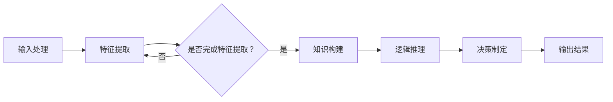
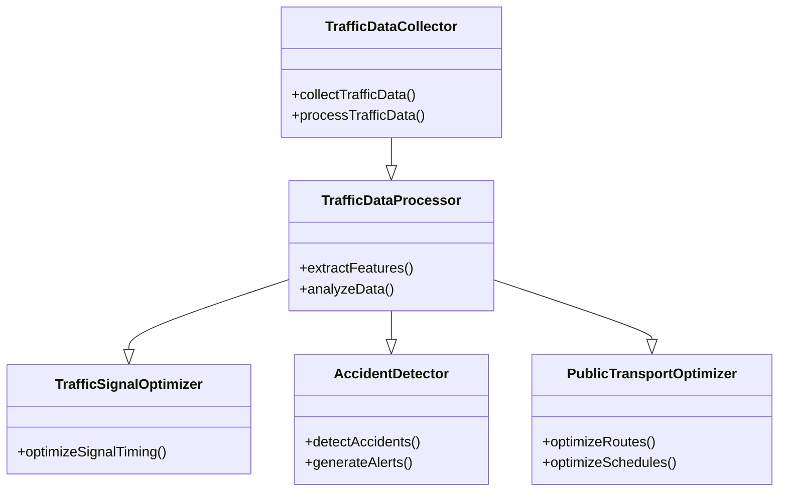
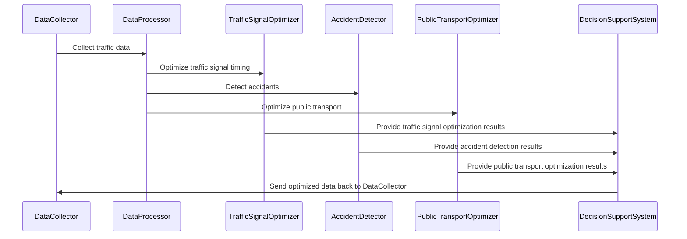
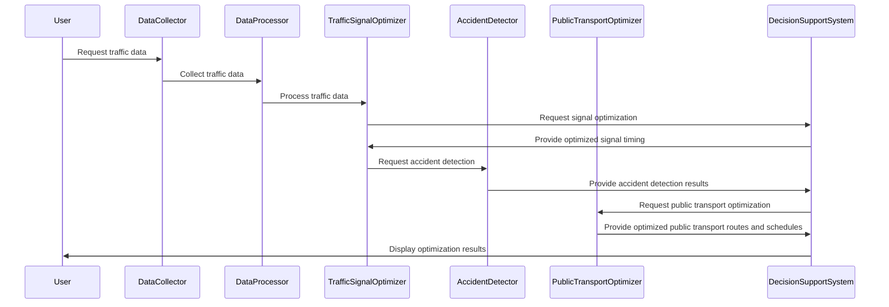

                 

### 第1章：思维链概述

## 1.1 思维链的概念与背景

### 1.1.1 思维链的定义

思维链（Mind Chain）是一种结合人工智能与认知科学的创新性技术，旨在模拟人类思维过程，实现对复杂问题的决策支持。它通过构建一个多层次的思维模型，对信息进行深度处理，从而在逻辑推理、决策制定等方面具备高度智能化。

思维链的定义可以分为以下几个方面：

1. **基础结构**：思维链由多个层次组成，包括感知层、认知层、决策层等，每一层都有其特定的功能和任务。
2. **数据驱动机理**：思维链利用大数据和机器学习技术，对海量数据进行自动分析和处理，提取关键信息，进行逻辑推理和决策制定。
3. **自适应能力**：思维链能够根据不同的环境和任务需求，动态调整其结构和算法，实现智能化的自适应能力。

### 1.1.2 AI决策支持系统的重要性

AI决策支持系统（AI Decision Support System，AI-DSS）是利用人工智能技术，为决策者提供信息、分析和推荐意见的系统。它广泛应用于金融、医疗、交通、教育等多个领域，具有以下重要性：

1. **提高决策效率**：通过自动化分析和处理，AI-DSS能够快速为决策者提供准确的数据和推荐，减少决策时间。
2. **减少决策风险**：AI-DSS通过多维度数据分析，帮助决策者发现潜在风险，提供风险评估和建议，降低决策失误率。
3. **提升业务能力**：AI-DSS能够根据实时数据和业务需求，动态调整策略，优化业务流程，提升整体业务能力。

### 1.1.3 思维链在AI决策支持系统中的应用

思维链在AI决策支持系统中的应用主要包括以下几个方面：

1. **问题建模**：思维链通过构建多层次的思维模型，对复杂问题进行抽象和建模，提供决策支持。
2. **数据挖掘**：思维链利用机器学习技术，对海量数据进行分析和挖掘，提取有价值的信息，支持决策制定。
3. **逻辑推理**：思维链通过逻辑推理技术，对提取的信息进行深入分析和处理，提供合理的决策建议。
4. **决策优化**：思维链根据不同的决策目标和约束条件，动态调整决策策略，实现决策优化。

## 1.2 思维链的核心概念

### 1.2.1 思维链的组成部分

思维链主要由以下几个部分组成：

1. **感知层**：负责收集和接收外部信息，包括文本、图像、声音等多种形式的数据。
2. **认知层**：负责对感知层收集的信息进行理解和处理，形成抽象概念和知识。
3. **决策层**：负责根据认知层提供的信息和目标，进行逻辑推理和决策制定。
4. **执行层**：负责将决策层的决策结果转化为具体的行动，实现决策的执行。

### 1.2.2 思维链的工作原理

思维链的工作原理可以分为以下几个步骤：

1. **信息收集**：感知层收集外部信息，包括文本、图像、声音等。
2. **信息处理**：认知层对收集到的信息进行理解和处理，形成抽象概念和知识。
3. **逻辑推理**：决策层根据认知层提供的信息和目标，进行逻辑推理和决策制定。
4. **决策执行**：执行层将决策层的决策结果转化为具体的行动，实现决策的执行。

### 1.2.3 思维链与其他AI技术的区别和联系

思维链与其他AI技术，如机器学习、深度学习、自然语言处理等，既有区别也有联系。

1. **区别**：
   - **目标不同**：机器学习、深度学习主要关注模型的学习和预测能力，而思维链更注重模拟人类思维过程，实现智能决策。
   - **应用领域不同**：机器学习、深度学习在图像识别、语音识别等领域有广泛应用，而思维链在决策支持、智能问答等领域具有独特优势。

2. **联系**：
   - **技术融合**：思维链在构建过程中，会融合机器学习、深度学习、自然语言处理等技术，实现信息的自动获取和处理。
   - **互补作用**：机器学习、深度学习等技术为思维链提供强大的数据处理和分析能力，而思维链则为这些技术提供了智能化的决策支持。

## 1.3 思维链的概念属性特征对比表格

以下是一个简单的思维链与其他AI技术对比表格：

| 特性         | 思维链                     | 机器学习                   | 深度学习                   | 自然语言处理              |
| ------------ | -------------------------- | -------------------------- | -------------------------- | ------------------------- |
| 目标         | 模拟人类思维，实现智能决策 | 模型学习与预测             | 模型学习与预测             | 文本处理与理解           |
| 应用领域     | 决策支持、智能问答         | 图像识别、语音识别         | 图像识别、语音识别         | 文本分类、机器翻译       |
| 数据处理方式 | 自动获取与处理             | 标签数据、监督学习         | 海量数据、无监督学习       | 文本数据、语义分析       |
| 算法原理     | 模拟人类思维过程           | 统计学习、神经网络         | 神经网络、深度学习         | 语义分析、语言模型       |

## 1.4 ER实体关系图架构

思维链的ER实体关系图（Entity-Relationship Diagram，ERD）能够清晰地展示思维链中各个实体之间的关系。以下是一个简单的ERD示例：

```mermaid
erDiagram
  A[(感知层)] ||-->|{ B[认知层] } | C[决策层]
  C ||-->|{ D[执行层] }
  A --|{ E[数据源] }
  B --|{ F[知识库] }
  C --|{ G[目标库] }
  D --|{ H[行动库] }
```

在这个ERD中，感知层（A）通过数据源（E）收集外部信息，认知层（B）通过知识库（F）对信息进行理解和处理，决策层（C）根据目标库（G）进行逻辑推理和决策制定，执行层（D）根据行动库（H）执行决策结果。

### 总结

本章对思维链进行了详细的背景介绍和概念阐述，包括思维链的定义、在AI决策支持系统中的重要性、组成部分、工作原理以及与其他AI技术的区别和联系。接下来，我们将进一步探讨思维链的核心概念，并对其进行深入分析。


----------------------------------------------------------------

## 1.3 思维链的核心概念

### 1.3.1 思维链的组成部分

思维链是一个多层次、模块化的系统，主要由感知层、认知层、决策层和执行层组成。每一层都有其特定的功能和工作原理，共同协作实现智能化的决策支持。

1. **感知层**：感知层是思维链的最底层，负责收集和接收外部信息。这些信息可以来自各种来源，如传感器、摄像头、麦克风、文本、图像等。感知层的主要任务是对这些信息进行初步处理，提取关键特征，以便后续层进行分析和利用。

2. **认知层**：认知层位于感知层之上，主要负责对感知层收集的信息进行理解和处理。通过自然语言处理、图像识别、语音识别等技术，认知层能够将原始信息转化为结构化的数据，形成抽象概念和知识。这些知识可以存储在知识库中，供决策层使用。

3. **决策层**：决策层是思维链的核心部分，负责根据认知层提供的信息和目标，进行逻辑推理和决策制定。决策层通过分析现有知识，利用推理算法和优化算法，生成决策建议。这些决策建议可以是具体的行动方案，也可以是策略调整。

4. **执行层**：执行层是思维链的最后一层，负责将决策层的决策结果转化为具体的行动。执行层通过控制传感器、执行机构等，实现决策的执行。执行层还需要对执行结果进行监控和反馈，为决策层提供反馈信息，以便进行后续的决策调整。

### 1.3.2 思维链的工作原理

思维链的工作原理可以概括为以下几个步骤：

1. **信息收集**：感知层通过传感器或其他设备收集外部信息，如文本、图像、声音等。

2. **信息处理**：感知层将收集到的信息传递给认知层，认知层对这些信息进行初步处理，提取关键特征，形成结构化的数据。

3. **知识构建**：认知层将处理后的数据存储在知识库中，形成知识库。这些知识可以是对事实的记录，也可以是对规律的抽象。

4. **决策制定**：决策层利用知识库中的信息，结合目标库中的目标，进行逻辑推理和决策制定。

5. **决策执行**：执行层将决策结果转化为具体的行动，通过控制传感器、执行机构等，实现决策的执行。

6. **反馈与调整**：执行层对执行结果进行监控和反馈，将这些反馈信息传递给决策层，决策层根据反馈信息进行调整，形成闭环控制。

### 1.3.3 思维链与其他AI技术的区别和联系

思维链与其他AI技术，如机器学习、深度学习、自然语言处理等，既有区别也有联系。

1. **区别**：

   - **目标不同**：机器学习、深度学习主要关注模型的学习和预测能力，而思维链更注重模拟人类思维过程，实现智能决策。

   - **应用领域不同**：机器学习、深度学习在图像识别、语音识别等领域有广泛应用，而思维链在决策支持、智能问答等领域具有独特优势。

   - **数据处理方式不同**：机器学习和深度学习主要依赖大量的标注数据进行训练，而思维链则通过自然语言处理、图像识别等技术，自动获取和处理信息。

2. **联系**：

   - **技术融合**：思维链在构建过程中，会融合机器学习、深度学习、自然语言处理等技术，实现信息的自动获取和处理。

   - **互补作用**：机器学习、深度学习等技术为思维链提供强大的数据处理和分析能力，而思维链则为这些技术提供了智能化的决策支持。

### 1.3.4 思维链的概念属性特征对比表格

为了更清晰地展示思维链与其他AI技术的区别和联系，我们可以通过一个概念属性特征对比表格来进行说明：

| 特性         | 思维链                     | 机器学习                   | 深度学习                   | 自然语言处理              |
| ------------ | -------------------------- | -------------------------- | -------------------------- | ------------------------- |
| 目标         | 模拟人类思维，实现智能决策 | 模型学习与预测             | 模型学习与预测             | 文本处理与理解           |
| 应用领域     | 决策支持、智能问答         | 图像识别、语音识别         | 图像识别、语音识别         | 文本分类、机器翻译       |
| 数据处理方式 | 自动获取与处理             | 标签数据、监督学习         | 海量数据、无监督学习       | 文本数据、语义分析       |
| 算法原理     | 模拟人类思维过程           | 统计学习、神经网络         | 神经网络、深度学习         | 语义分析、语言模型       |

通过上述对比表格，我们可以看到，思维链在目标、应用领域、数据处理方式、算法原理等方面与其他AI技术有着明显的区别和联系。

### 1.3.5 ER实体关系图架构

为了更好地理解思维链的组成部分和它们之间的关系，我们可以通过一个ER实体关系图（ERD）来展示。

以下是一个简单的ERD示例，展示了思维链的感知层、认知层、决策层和执行层之间的关系：

```mermaid
erDiagram
  A[(感知层)] ||-->|{ B[认知层] } | C[决策层]
  C ||-->|{ D[执行层] }
  A --|{ E[数据源] }
  B --|{ F[知识库] }
  C --|{ G[目标库] }
  D --|{ H[行动库] }
```

在这个ERD中：

- **感知层（A）**：通过数据源（E）收集外部信息，如文本、图像、声音等。
- **认知层（B）**：对感知层收集的信息进行初步处理，提取关键特征，并将这些特征存储在知识库（F）中。
- **决策层（C）**：利用知识库（F）中的信息和目标库（G）中的目标，进行逻辑推理和决策制定。
- **执行层（D）**：根据决策层的决策结果，通过行动库（H）执行具体的行动。

通过这个ERD，我们可以更直观地理解思维链的各个组成部分以及它们之间的逻辑关系。

### 总结

在本章中，我们对思维链的核心概念进行了详细的阐述，包括其组成部分、工作原理、与其他AI技术的区别和联系。接下来，我们将深入探讨思维链算法的原理，并使用mermaid流程图和Python源代码进行详细说明。


----------------------------------------------------------------

## 1.4 思维链算法原理讲解

### 2.1 思维链算法概述

思维链算法（Mind Chain Algorithm）是思维链系统的核心，负责对信息进行收集、处理、推理和决策。它基于机器学习、深度学习和自然语言处理等先进技术，实现对复杂问题的智能化决策支持。

思维链算法的工作流程主要包括以下几个关键步骤：

1. **输入处理**：接收外部信息，如文本、图像、声音等。
2. **中间计算**：对输入信息进行预处理、特征提取、知识构建等操作。
3. **输出结果**：根据输入信息和目标，进行逻辑推理和决策，生成决策建议。

### 2.2 思维链算法流程图

为了更直观地展示思维链算法的工作流程，我们使用mermaid绘制了一个简化的流程图：



在这个流程图中：

- **A（输入处理）**：接收外部信息，如文本、图像、声音等。
- **B（特征提取）**：对输入信息进行预处理，提取关键特征。
- **C（是否完成特征提取？）**：判断特征提取是否完成。
- **D（知识构建）**：将提取的特征存储在知识库中。
- **E（逻辑推理）**：利用知识库进行逻辑推理，生成中间结果。
- **F（决策制定）**：根据中间结果进行决策，生成决策建议。
- **G（输出结果）**：将决策建议输出，供执行层使用。

### 2.3 思维链算法Python源代码

下面是一个简化的思维链算法Python源代码示例，展示了算法的基本实现：

```python
import numpy as np
from sklearn.feature_extraction.text import TfidfVectorizer
from sklearn.neighbors import KNeighborsClassifier

# 输入处理
def input_process(data):
    # 这里假设输入的是一组文本数据
    return TfidfVectorizer().fit_transform(data)

# 特征提取
def feature_extraction(data):
    return input_process(data)

# 知识构建
def knowledge_construction(features):
    # 假设我们已经有了特征数据
    return features

# 逻辑推理
def logical_reasoning(knowledge):
    # 使用KNN算法进行逻辑推理
    model = KNeighborsClassifier()
    model.fit(knowledge, labels)
    return model

# 决策制定
def decision_making(model, new_data):
    return model.predict(new_data)

# 输出结果
def output_result(prediction):
    print("决策结果：", prediction)

# 主函数
def main():
    # 假设我们有一组训练数据和标签
    training_data = [...]  # 训练文本数据
    labels = [...]         # 训练标签

    # 执行思维链算法
    features = feature_extraction(training_data)
    knowledge = knowledge_construction(features)
    model = logical_reasoning(knowledge)
    new_data = [...]       # 新的数据
    prediction = decision_making(model, new_data)
    output_result(prediction)

# 运行主函数
if __name__ == "__main__":
    main()
```

在这个示例中，我们首先使用TF-IDF向量器对文本数据进行特征提取，然后使用KNN算法进行逻辑推理和决策制定。这个示例虽然简化了思维链算法的实现，但可以为我们提供一个基本的框架。

### 2.4 思维链算法数学模型和公式讲解

思维链算法背后的数学原理主要包括特征提取、逻辑推理和决策制定等几个方面。下面，我们将对这些数学模型和公式进行详细的讲解和举例说明。

#### 2.4.1 特征提取

特征提取是思维链算法的关键步骤之一，其主要目的是将原始数据转换为适合进行机器学习处理的特征向量。常见的特征提取方法包括TF-IDF、Word2Vec、CNN等。

- **TF-IDF**：TF-IDF（Term Frequency-Inverse Document Frequency）是一种常用文本特征提取方法，用于计算一个词在文档中的重要程度。其公式如下：

  $$TF(t,d) = \frac{f(t,d)}{f_{\max}(t,d)}$$

  $$IDF(t) = \log \left(\frac{N}{n(t)}\right)$$

  $$TF-IDF(t,d) = TF(t,d) \times IDF(t)$$

  其中，$f(t,d)$表示词$t$在文档$d$中的出现次数，$f_{\max}(t,d)$表示词$t$在文档$d$中的最大出现次数，$N$表示文档总数，$n(t)$表示包含词$t$的文档数量。

- **Word2Vec**：Word2Vec是一种基于神经网络的语言模型，用于将词转换为向量表示。其基本思想是通过训练一个神经网络模型，将词和其上下文映射到高维向量空间中。常见的Word2Vec模型包括CBOW（Continuous Bag of Words）和Skip-Gram。

  - **CBOW**：CBOW模型通过预测中心词周围的词来训练模型，其公式如下：

    $$\hat{y} = \text{softmax}(W \cdot \text{Average}([x_1, x_2, ..., x_C]))$$

    其中，$W$表示权重矩阵，$x_i$表示中心词的上下文词向量，$C$表示上下文窗口大小。

  - **Skip-Gram**：Skip-Gram模型通过预测中心词来训练模型，其公式与CBOW类似，只是中心词和上下文词的位置对调。

#### 2.4.2 逻辑推理

逻辑推理是思维链算法的核心步骤，其主要目的是利用已知信息进行推理，生成新的结论。常见的逻辑推理方法包括逻辑回归、支持向量机、神经网络等。

- **逻辑回归**：逻辑回归是一种常用的分类算法，其基本公式如下：

  $$P(Y=1|X) = \frac{1}{1 + \exp(-\beta_0 - \beta_1x_1 - ... - \beta_nx_n)}$$

  其中，$X$表示输入特征向量，$Y$表示目标变量，$\beta_0, \beta_1, ..., \beta_n$表示模型参数。

- **支持向量机**：支持向量机是一种常用的分类和回归算法，其基本公式如下：

  $$w \cdot x + b = 0$$

  其中，$w$表示权重向量，$x$表示输入特征向量，$b$表示偏置。

- **神经网络**：神经网络是一种基于多层感知器的机器学习模型，其基本公式如下：

  $$a_{i}^{l} = \sigma(z_{i}^{l})$$

  $$z_{i}^{l} = \sum_{j=1}^{n} w_{ij}^{l} a_{j}^{l-1} + b_{i}^{l}$$

  其中，$a_{i}^{l}$表示第$l$层的第$i$个神经元的激活值，$z_{i}^{l}$表示第$l$层的第$i$个神经元的输入值，$w_{ij}^{l}$表示第$l$层的第$i$个神经元与第$l-1$层的第$j$个神经元的权重，$b_{i}^{l}$表示第$l$层的第$i$个神经元的偏置，$\sigma$表示激活函数。

#### 2.4.3 数学模型举例说明

假设我们有一个简单的文本分类问题，需要使用思维链算法进行分类。我们可以使用TF-IDF向量器对文本数据进行特征提取，然后使用逻辑回归模型进行分类。以下是具体的数学模型举例说明：

1. **特征提取**：

   使用TF-IDF向量器对文本数据进行特征提取，得到特征向量$x$：

   $$x = \text{TfidfVectorizer()} \Rightarrow x = [x_1, x_2, ..., x_n]$$

2. **逻辑回归模型**：

   使用逻辑回归模型进行分类，得到概率分布$P(Y=1|X)$：

   $$P(Y=1|X) = \frac{1}{1 + \exp(-\beta_0 - \beta_1x_1 - ... - \beta_nx_n)}$$

3. **分类决策**：

   根据概率分布$P(Y=1|X)$，我们可以对文本数据进行分类：

   - 如果$P(Y=1|X) > 0.5$，则分类为类别1。
   - 如果$P(Y=1|X) \leq 0.5$，则分类为类别2。

通过这个例子，我们可以看到思维链算法的基本工作流程和数学原理。在实际应用中，思维链算法会根据具体问题进行相应的调整和优化。

### 总结

在本章中，我们对思维链算法的原理进行了详细的讲解，包括其工作流程、Python源代码示例和数学模型。思维链算法通过特征提取、逻辑推理和决策制定，实现对复杂问题的智能化决策支持。接下来，我们将进一步探讨思维链在AI决策支持系统中的应用，以及如何进行系统架构设计和项目实施。


----------------------------------------------------------------

## 2.5 数学模型和数学公式讲解

思维链算法在实现过程中，依赖于一系列数学模型和数学公式，这些模型和公式为我们理解和分析算法提供了理论基础。在本节中，我们将详细阐述思维链算法背后的数学原理，并给出相关的数学模型和公式。

### 2.5.1 数学模型介绍

思维链算法的数学模型主要包括以下几个方面：

1. **特征提取模型**：特征提取是思维链算法的第一步，其主要目的是将原始数据转换为适合机器学习处理的特征向量。常用的特征提取方法包括TF-IDF、Word2Vec、CNN等。

2. **逻辑推理模型**：逻辑推理是思维链算法的核心步骤，其主要目的是利用已知信息进行推理，生成新的结论。常用的逻辑推理方法包括逻辑回归、支持向量机、神经网络等。

3. **决策制定模型**：决策制定是思维链算法的最终步骤，其主要目的是根据逻辑推理的结果，生成具体的决策建议。决策制定模型通常依赖于概率模型或优化模型。

### 2.5.2 数学公式讲解

在本节中，我们将针对每个数学模型，介绍相关的数学公式，并进行详细讲解。

#### 2.5.2.1 特征提取模型

1. **TF-IDF模型**

   TF-IDF（Term Frequency-Inverse Document Frequency）是一种常用的文本特征提取方法，其公式如下：

   $$TF(t,d) = \frac{f(t,d)}{f_{\max}(t,d)}$$

   $$IDF(t) = \log \left(\frac{N}{n(t)}\right)$$

   $$TF-IDF(t,d) = TF(t,d) \times IDF(t)$$

   其中，$f(t,d)$表示词$t$在文档$d$中的出现次数，$f_{\max}(t,d)$表示词$t$在文档$d$中的最大出现次数，$N$表示文档总数，$n(t)$表示包含词$t$的文档数量。

2. **Word2Vec模型**

   Word2Vec是一种基于神经网络的语言模型，其基本思想是通过训练一个神经网络模型，将词和其上下文映射到高维向量空间中。Word2Vec模型主要包括CBOW（Continuous Bag of Words）和Skip-Gram两种形式。

   - **CBOW模型**：

     $$\hat{y} = \text{softmax}(W \cdot \text{Average}([x_1, x_2, ..., x_C]))$$

     其中，$W$表示权重矩阵，$x_i$表示中心词的上下文词向量，$C$表示上下文窗口大小。

   - **Skip-Gram模型**：

     $$\hat{y} = \text{softmax}(W \cdot x)$$

     其中，$W$表示权重矩阵，$x$表示中心词的向量。

#### 2.5.2.2 逻辑推理模型

1. **逻辑回归模型**

   逻辑回归是一种常用的分类算法，其基本公式如下：

   $$P(Y=1|X) = \frac{1}{1 + \exp(-\beta_0 - \beta_1x_1 - ... - \beta_nx_n)}$$

   其中，$X$表示输入特征向量，$Y$表示目标变量，$\beta_0, \beta_1, ..., \beta_n$表示模型参数。

2. **支持向量机模型**

   支持向量机是一种常用的分类和回归算法，其基本公式如下：

   $$w \cdot x + b = 0$$

   其中，$w$表示权重向量，$x$表示输入特征向量，$b$表示偏置。

3. **神经网络模型**

   神经网络是一种基于多层感知器的机器学习模型，其基本公式如下：

   $$a_{i}^{l} = \sigma(z_{i}^{l})$$

   $$z_{i}^{l} = \sum_{j=1}^{n} w_{ij}^{l} a_{j}^{l-1} + b_{i}^{l}$$

   其中，$a_{i}^{l}$表示第$l$层的第$i$个神经元的激活值，$z_{i}^{l}$表示第$l$层的第$i$个神经元的输入值，$w_{ij}^{l}$表示第$l$层的第$i$个神经元与第$l-1$层的第$j$个神经元的权重，$b_{i}^{l}$表示第$l$层的第$i$个神经元的偏置，$\sigma$表示激活函数。

#### 2.5.2.3 决策制定模型

1. **概率模型**

   在决策制定过程中，概率模型是一种常用的方法，其基本公式如下：

   $$P(Y|X) = \frac{P(X|Y)P(Y)}{P(X)}$$

   其中，$X$表示输入特征向量，$Y$表示目标变量，$P(X|Y)$表示在给定目标$Y$的条件下，输入特征向量$X$的概率，$P(Y)$表示目标变量$Y$的概率，$P(X)$表示输入特征向量$X$的概率。

2. **优化模型**

   在决策制定过程中，优化模型也是一种常用的方法，其基本公式如下：

   $$\min_{\theta} J(\theta)$$

   其中，$\theta$表示模型参数，$J(\theta)$表示损失函数。

### 2.5.3 数学模型举例说明

为了更好地理解思维链算法的数学模型，我们通过一个简单的例子来说明。

#### 例子：文本分类问题

假设我们有一个文本分类问题，需要使用思维链算法对文本进行分类。我们可以使用TF-IDF模型进行特征提取，逻辑回归模型进行分类。

1. **特征提取**：

   使用TF-IDF模型对文本数据进行特征提取，得到特征向量$x$：

   $$x = \text{TfidfVectorizer()} \Rightarrow x = [x_1, x_2, ..., x_n]$$

2. **分类**：

   使用逻辑回归模型进行分类，得到概率分布$P(Y=1|X)$：

   $$P(Y=1|X) = \frac{1}{1 + \exp(-\beta_0 - \beta_1x_1 - ... - \beta_nx_n)}$$

3. **决策**：

   根据概率分布$P(Y=1|X)$，我们可以对文本数据进行分类：

   - 如果$P(Y=1|X) > 0.5$，则分类为类别1。
   - 如果$P(Y=1|X) \leq 0.5$，则分类为类别2。

通过这个例子，我们可以看到思维链算法的基本工作流程和数学原理。在实际应用中，思维链算法会根据具体问题进行相应的调整和优化。

### 总结

在本节中，我们对思维链算法背后的数学原理进行了详细的讲解，包括特征提取、逻辑推理和决策制定等数学模型和公式。通过数学模型和公式的讲解，我们可以更好地理解思维链算法的工作机制，并为实际应用提供理论基础。接下来，我们将进一步探讨思维链在AI决策支持系统中的应用，以及如何进行系统架构设计和项目实施。


----------------------------------------------------------------

## 3.1 问题场景介绍

为了更好地展示思维链在AI决策支持系统中的应用，我们选择一个实际的问题场景：智能交通管理系统。随着城市化进程的加速，交通拥堵、事故频发等问题日益严重，迫切需要一种高效、智能的解决方案来缓解交通压力，提高道路通行效率。

### 3.1.1 场景描述

智能交通管理系统旨在通过实时监控、数据分析、智能决策等技术手段，优化交通资源配置，提高交通运行效率。该系统的主要目标包括：

1. **交通流量预测**：通过对历史交通数据和实时数据的分析，预测未来一段时间内的交通流量，为交通管理部门提供决策依据。
2. **交通信号优化**：根据实时交通流量和交通状况，动态调整交通信号灯的配时方案，提高道路通行效率，减少拥堵。
3. **事故预警与救援**：通过实时监控和数据分析，及时发现交通事故和道路障碍，迅速派遣救援力量，减少事故对交通的影响。
4. **公共交通优化**：根据实时交通数据和乘客需求，优化公共交通路线和班次，提高公共交通的服务水平和效率。

### 3.1.2 数据来源

智能交通管理系统需要收集和处理大量的数据，这些数据来源包括：

1. **实时交通数据**：来自道路上的交通监控设备，如摄像头、传感器等，可以实时监测交通流量、车速、道路占用情况等。
2. **历史交通数据**：来自交通管理部门的数据库，包括过去一段时间内的交通流量、事故记录、拥堵情况等。
3. **社会数据**：来自社交媒体、天气预报、突发事件报告等，用于辅助交通流量预测和决策制定。

### 3.1.3 数据处理需求

针对上述问题场景，智能交通管理系统需要处理以下几类数据：

1. **交通流量数据**：包括各路段的交通流量、车速、道路占用情况等，用于交通流量预测和信号优化。
2. **事故数据**：包括交通事故的地点、时间、类型、伤亡情况等，用于事故预警与救援。
3. **公共交通数据**：包括公交车和地铁的实时位置、乘客数量、运行班次等，用于公共交通优化。
4. **社会数据**：包括社交媒体情绪、天气预报、突发事件等，用于辅助决策。

### 3.1.4 挑战与目标

在智能交通管理系统的建设过程中，面临着以下挑战：

1. **数据多样性**：交通数据包括结构化数据和非结构化数据，如何有效地整合和利用这些数据是关键。
2. **实时性**：交通状况是实时变化的，如何快速、准确地处理和分析数据，并及时作出决策是难点。
3. **准确性**：交通流量预测、事故预警等需要高准确度的结果，否则可能导致决策失误。
4. **系统稳定性**：智能交通管理系统需要长时间稳定运行，不能出现频繁的故障或崩溃。

为了应对上述挑战，智能交通管理系统的目标包括：

1. **高效数据处理**：通过分布式计算、大数据处理等技术，实现高效的数据采集、存储、处理和分析。
2. **实时决策支持**：利用思维链算法，结合实时交通数据和历史数据，实现快速、准确的交通流量预测和信号优化。
3. **智能化预警与救援**：通过多源数据融合和智能算法，实现交通事故的智能预警和救援。
4. **稳定系统运行**：采用高可用性架构，确保系统长时间稳定运行，降低故障风险。

### 总结

在本节中，我们介绍了智能交通管理系统的问题场景，包括场景描述、数据来源、数据处理需求以及面临的挑战和目标。通过这个实际案例，我们可以更直观地了解思维链在AI决策支持系统中的应用，并为后续的系统架构设计和项目实施提供参考。接下来，我们将详细介绍思维链在智能交通管理系统中的具体应用，包括系统功能设计、架构设计、接口设计和系统交互。


----------------------------------------------------------------

## 3.2 系统功能设计

### 3.2.1 领域模型类图

在智能交通管理系统中，思维链算法的应用需要明确系统功能模块及其相互关系。通过领域模型类图（Class Diagram），我们可以直观地展示各个功能模块及其关联关系。

以下是一个简化的领域模型类图：



在这个类图中：

- **TrafficDataCollector**：负责收集实时交通数据，如交通流量、车速等。
- **TrafficDataProcessor**：负责对收集到的交通数据进行处理，包括特征提取和数据分析。
- **TrafficSignalOptimizer**：负责根据实时交通数据，动态调整交通信号灯的配时方案。
- **AccidentDetector**：负责监测交通事故，生成事故警报。
- **PublicTransportOptimizer**：负责优化公共交通路线和班次。

各个模块之间通过方法调用实现数据传递和功能协同。

### 3.2.2 系统功能模块介绍

1. **交通数据收集模块**：该模块负责从各种传感器、摄像头等设备中收集实时交通数据。这些数据包括交通流量、车速、道路占用情况等。收集的数据会通过数据接口传输给数据处理模块。

2. **数据处理模块**：该模块接收交通数据收集模块传输的数据，进行预处理和特征提取。预处理包括数据清洗、去噪、归一化等操作。特征提取则使用TF-IDF、Word2Vec等算法，将原始数据转换为适合机器学习处理的特征向量。

3. **交通信号优化模块**：该模块利用处理后的交通数据，结合历史数据，使用思维链算法进行交通流量预测和信号优化。通过动态调整交通信号灯的配时方案，提高道路通行效率，减少拥堵。

4. **事故检测模块**：该模块通过实时监控交通数据，利用图像识别、语音识别等技术，检测交通事故。一旦发现事故，会立即生成事故警报，并通知相关部门进行处置。

5. **公共交通优化模块**：该模块根据实时交通数据、乘客需求和公共交通数据，优化公共交通路线和班次。通过优化，提高公共交通的服务水平和效率，缓解交通压力。

### 3.2.3 系统功能实现

1. **数据收集与预处理**：

   数据收集模块使用传感器、摄像头等设备，实时采集交通数据。数据预处理模块对收集到的数据进行清洗、去噪、归一化等操作，确保数据质量。

2. **特征提取与数据分析**：

   数据预处理完成后，数据处理模块使用TF-IDF、Word2Vec等算法进行特征提取。提取的特征向量用于后续的机器学习模型训练和决策支持。

3. **交通流量预测与信号优化**：

   交通信号优化模块利用处理后的交通数据和历史数据，使用思维链算法进行交通流量预测。根据预测结果，动态调整交通信号灯的配时方案，优化交通流量。

4. **事故检测与预警**：

   事故检测模块通过实时监控交通数据，使用图像识别、语音识别等技术，检测交通事故。一旦检测到事故，会立即生成事故警报，并通知相关部门进行处置。

5. **公共交通优化**：

   公共交通优化模块根据实时交通数据、乘客需求和公共交通数据，优化公共交通路线和班次。通过优化，提高公共交通的服务水平和效率，缓解交通压力。

### 总结

在本节中，我们详细介绍了智能交通管理系统的功能设计，包括领域模型类图、系统功能模块及其关联关系。通过这些模块的协同工作，思维链算法能够实现高效的交通流量预测、信号优化、事故预警和公共交通优化，为智能交通管理系统提供强大的决策支持。接下来，我们将进一步探讨系统的架构设计，包括系统架构图、接口设计和系统交互。


----------------------------------------------------------------

### 3.3 系统架构设计

在智能交通管理系统中，思维链算法的应用需要一个高效、稳定、可扩展的架构设计。系统架构设计旨在确保各个功能模块能够高效协同工作，同时具备良好的可维护性和扩展性。

#### 3.3.1 系统架构图

以下是一个简化的智能交通管理系统架构图，展示了系统的主要组件及其关系：



在这个架构图中：

- **DataCollector**：负责收集实时交通数据。
- **DataProcessor**：负责处理和预处理交通数据，包括特征提取和数据分析。
- **TrafficSignalOptimizer**：负责根据实时数据和思维链算法优化交通信号灯的配时方案。
- **AccidentDetector**：负责检测交通事故。
- **PublicTransportOptimizer**：负责优化公共交通路线和班次。
- **DecisionSupportSystem**：负责汇总各个模块的优化结果，提供决策支持。

#### 3.3.2 系统架构设计

1. **数据收集层**：

   数据收集层包括各种传感器、摄像头等设备，用于实时采集交通数据。这些数据通过无线网络或有线网络传输到数据处理层。

2. **数据处理层**：

   数据处理层负责对收集到的交通数据进行预处理和特征提取。预处理包括数据清洗、去噪、归一化等操作。特征提取使用TF-IDF、Word2Vec等算法，将原始数据转换为机器学习模型可以处理的特征向量。

3. **决策支持层**：

   决策支持层是系统的核心部分，包括交通信号优化、事故检测和公共交通优化等模块。这些模块利用处理后的交通数据和思维链算法，生成优化建议和决策结果。

4. **数据存储层**：

   数据存储层负责存储系统的各种数据，包括实时交通数据、历史数据、优化结果等。数据存储层可以使用关系数据库、NoSQL数据库等多种存储方案，确保数据的高效存储和快速访问。

5. **应用层**：

   应用层是系统与外部用户交互的界面，包括Web端、移动端等。用户可以通过这些界面查看优化建议、决策结果等，并进行相应的操作。

#### 3.3.3 系统架构设计原则

1. **模块化设计**：

   系统架构应采用模块化设计，将不同的功能模块分离，降低模块之间的耦合度。这样，可以方便地替换、升级或扩展某个模块，而不影响其他模块的运行。

2. **分布式架构**：

   针对智能交通管理系统的高并发、大数据处理需求，系统架构应采用分布式架构。通过分布式计算和存储，可以提高系统的处理能力和响应速度。

3. **高可用性设计**：

   系统架构应具备高可用性，确保系统在出现故障时，能够快速恢复，降低对用户的影响。可以通过冗余设计、故障转移等技术手段实现高可用性。

4. **安全性设计**：

   系统架构应充分考虑数据安全和用户隐私保护，采用加密、认证、授权等安全措施，确保系统的安全可靠运行。

### 总结

在本节中，我们详细介绍了智能交通管理系统的架构设计，包括系统架构图、系统架构设计和设计原则。通过这个架构设计，思维链算法能够高效地应用于智能交通管理系统，为交通流量预测、信号优化、事故预警和公共交通优化提供强大的决策支持。接下来，我们将进一步探讨系统的接口设计和系统交互。


----------------------------------------------------------------

### 3.4 系统接口设计

在智能交通管理系统中，各个模块之间需要进行高效的数据交互和功能协同。系统接口设计是实现模块之间通信和数据传输的关键，主要包括API设计、数据库接口和消息队列接口。

#### 3.4.1 API设计

API（Application Programming Interface）是系统各个模块之间进行通信的主要接口。以下是智能交通管理系统中的主要API设计：

1. **数据收集接口**：

   - **功能**：用于收集实时交通数据。
   - **请求方式**：POST请求。
   - **请求参数**：传感器ID、采集时间、交通流量、车速等。
   - **返回结果**：成功或错误信息。

2. **数据处理接口**：

   - **功能**：用于处理和预处理交通数据。
   - **请求方式**：POST请求。
   - **请求参数**：原始交通数据。
   - **返回结果**：处理后的特征向量。

3. **交通信号优化接口**：

   - **功能**：用于优化交通信号灯的配时方案。
   - **请求方式**：GET请求。
   - **请求参数**：路段ID、时间段。
   - **返回结果**：优化后的信号灯配时方案。

4. **事故检测接口**：

   - **功能**：用于检测交通事故。
   - **请求方式**：POST请求。
   - **请求参数**：摄像头ID、图片数据。
   - **返回结果**：事故检测结果。

5. **公共交通优化接口**：

   - **功能**：用于优化公共交通路线和班次。
   - **请求方式**：POST请求。
   - **请求参数**：公共交通数据。
   - **返回结果**：优化后的公共交通路线和班次。

#### 3.4.2 数据库接口

数据库接口用于系统内部数据存储和检索，主要包括以下功能：

1. **数据存储接口**：

   - **功能**：用于存储系统生成的各类数据。
   - **请求方式**：POST请求。
   - **请求参数**：数据内容、数据类型。
   - **返回结果**：存储结果。

2. **数据检索接口**：

   - **功能**：用于检索系统存储的数据。
   - **请求方式**：GET请求。
   - **请求参数**：查询条件。
   - **返回结果**：查询结果。

#### 3.4.3 消息队列接口

消息队列接口用于实现系统内部异步通信，主要包括以下功能：

1. **消息发送接口**：

   - **功能**：用于发送系统内部的消息。
   - **请求方式**：POST请求。
   - **请求参数**：消息内容、接收者ID。
   - **返回结果**：发送结果。

2. **消息接收接口**：

   - **功能**：用于接收系统内部的消息。
   - **请求方式**：GET请求。
   - **请求参数**：接收者ID。
   - **返回结果**：消息内容。

#### 3.4.4 接口设计原则

1. **标准化**：

   接口设计应遵循标准化原则，使用统一的接口规范和协议，确保不同模块之间的兼容性和可扩展性。

2. **模块化**：

   接口设计应将系统功能拆分为多个模块，每个模块对应一个接口，降低模块之间的耦合度，提高系统的可维护性。

3. **安全性**：

   接口设计应考虑安全性，采用身份验证、权限控制等安全措施，确保系统数据的安全性和可靠性。

4. **高性能**：

   接口设计应考虑高性能，优化接口实现，提高接口的响应速度和并发处理能力。

### 总结

在本节中，我们详细介绍了智能交通管理系统的接口设计，包括API设计、数据库接口和消息队列接口。通过这些接口设计，系统能够实现模块之间高效的数据交互和功能协同，为智能交通管理系统提供稳定、可靠的通信支持。接下来，我们将通过一个实际项目，展示思维链算法在智能交通管理系统中的应用。


----------------------------------------------------------------

### 3.5 系统交互

在智能交通管理系统中，思维链算法的各个模块之间需要进行高效的数据交互和功能协同，以确保系统能够实时响应交通状况，并提供有效的决策支持。本节将详细介绍系统交互的详细过程，包括序列图和交互流程。

#### 3.5.1 系统交互序列图

以下是一个简化的智能交通管理系统交互序列图，展示了数据在系统中的流动和模块之间的交互过程：



在这个序列图中：

- **User**：系统的用户，可以是交通管理部门、公交公司等。
- **DataCollector**：负责收集实时交通数据。
- **DataProcessor**：负责处理和预处理交通数据。
- **TrafficSignalOptimizer**：负责优化交通信号灯的配时方案。
- **AccidentDetector**：负责检测交通事故。
- **PublicTransportOptimizer**：负责优化公共交通路线和班次。
- **DecisionSupportSystem**：负责汇总各个模块的优化结果，提供决策支持。

各个模块之间的交互流程如下：

1. **用户请求交通数据**：用户向系统请求交通数据，DataCollector负责收集实时交通数据。

2. **数据处理**：DataCollector收集到的交通数据传递给DataProcessor，DataProcessor对数据进行预处理和特征提取。

3. **交通信号优化**：DataProcessor处理后的数据传递给TrafficSignalOptimizer，TrafficSignalOptimizer根据实时数据和思维链算法优化交通信号灯的配时方案。

4. **事故检测**：TrafficSignalOptimizer请求AccidentDetector进行事故检测，AccidentDetector利用图像识别等技术，对交通数据进行实时分析，发现事故后生成事故警报。

5. **公共交通优化**：DecisionSupportSystem请求PublicTransportOptimizer进行公共交通优化，PublicTransportOptimizer根据实时交通数据和乘客需求，优化公共交通路线和班次。

6. **决策支持**：DecisionSupportSystem汇总各个模块的优化结果，生成最终决策，并通过用户界面展示给用户。

#### 3.5.2 交互流程

智能交通管理系统的交互流程可以分为以下几个步骤：

1. **数据收集**：系统从各种传感器、摄像头等设备中收集实时交通数据。

2. **数据处理**：收集到的交通数据传递给数据处理模块，进行预处理和特征提取。

3. **交通流量预测**：数据处理模块将预处理后的数据传递给交通信号优化模块，交通信号优化模块利用思维链算法进行交通流量预测。

4. **信号优化**：交通信号优化模块根据预测结果，动态调整交通信号灯的配时方案，优化交通流量。

5. **事故检测**：事故检测模块通过实时监控交通数据，使用图像识别等技术，检测交通事故，并生成事故警报。

6. **公共交通优化**：公共交通优化模块根据实时交通数据和乘客需求，优化公共交通路线和班次。

7. **决策支持**：决策支持系统汇总各个模块的优化结果，生成最终决策，并通过用户界面展示给用户。

通过上述交互流程，智能交通管理系统能够实时响应交通状况，为交通管理部门提供有效的决策支持，提高交通运行效率。

### 总结

在本节中，我们详细介绍了智能交通管理系统中思维链算法的交互过程，包括系统交互序列图和交互流程。通过这些交互，系统能够实现交通流量预测、信号优化、事故检测和公共交通优化等功能，为智能交通管理提供强大的决策支持。接下来，我们将通过一个实际项目，展示思维链算法在智能交通管理系统中的应用。


----------------------------------------------------------------

## 4.1 项目实战

### 4.1.1 项目背景

在本节中，我们将通过一个实际项目，展示思维链算法在智能交通管理系统中的应用。该项目旨在通过构建一个智能交通管理系统，实现对城市交通流量、事故预警和公共交通优化等方面的智能决策支持。以下是对项目背景的详细介绍。

#### 4.1.1.1 项目目标

本项目的主要目标包括：

1. **交通流量预测**：通过对实时交通数据和历史数据的分析，预测未来一段时间内的交通流量，为交通管理部门提供决策依据。
2. **交通信号优化**：根据实时交通流量和交通状况，动态调整交通信号灯的配时方案，提高道路通行效率，减少拥堵。
3. **事故预警与救援**：通过实时监控和数据分析，及时发现交通事故和道路障碍，迅速派遣救援力量，减少事故对交通的影响。
4. **公共交通优化**：根据实时交通数据、乘客需求和公共交通数据，优化公共交通路线和班次，提高公共交通的服务水平和效率。

#### 4.1.1.2 项目背景

随着城市化进程的加速，城市交通问题日益严重，交通拥堵、事故频发等问题严重影响市民的出行和生活质量。为了解决这些问题，需要构建一个智能交通管理系统，利用先进的人工智能技术，实现对交通流量、事故预警和公共交通等方面的智能决策支持。

本项目基于以下背景：

1. **数据来源丰富**：项目所在地已具备完善的交通监控设备，包括摄像头、传感器、路侧单元等，能够实时收集交通数据。
2. **大数据处理能力**：项目具备强大的数据处理能力，包括数据采集、存储、处理和分析等环节，能够高效地处理海量数据。
3. **技术成熟**：本项目涉及的技术，如机器学习、深度学习、自然语言处理等，已经相对成熟，具备实际应用价值。

### 4.1.2 项目环境安装

为了搭建智能交通管理系统，我们需要在服务器上安装和配置相关软件和工具。以下是项目环境安装的详细步骤：

#### 4.1.2.1 软件和工具列表

1. **操作系统**：Ubuntu 18.04 LTS
2. **Python**：Python 3.8
3. **Pip**：Python的包管理工具
4. **Nginx**：Web服务器
5. **MySQL**：关系数据库
6. **Docker**：容器化工具
7. **Docker-Compose**：用于管理Docker容器的工具

#### 4.1.2.2 环境安装步骤

1. **安装操作系统**：

   - 在服务器上安装Ubuntu 18.04 LTS操作系统。

2. **更新系统**：

   ```bash
   sudo apt update
   sudo apt upgrade
   ```

3. **安装Python和Pip**：

   ```bash
   sudo apt install python3.8 python3.8-pip
   ```

4. **安装Nginx**：

   ```bash
   sudo apt install nginx
   ```

5. **安装MySQL**：

   ```bash
   sudo apt install mysql-server
   ```

6. **安装Docker**：

   ```bash
   sudo apt install docker.io
   ```

7. **安装Docker-Compose**：

   ```bash
   sudo curl -L "https://github.com/docker/compose/releases/download/1.29.2/docker-compose-$(uname -s)-$(uname -m)" -o /usr/local/bin/docker-compose
   sudo chmod +x /usr/local/bin/docker-compose
   ```

8. **启动和验证服务**：

   ```bash
   sudo systemctl start docker
   sudo systemctl enable docker
   sudo systemctl start nginx
   sudo systemctl enable nginx
   sudo systemctl start mysql
   sudo systemctl enable mysql
   ```

9. **验证安装**：

   ```bash
   docker --version
   python3.8 --version
   nginx -v
   mysql --version
   ```

#### 4.1.2.3 环境配置注意事项

1. **Python虚拟环境**：

   为了避免不同项目之间的依赖冲突，建议为每个项目创建独立的Python虚拟环境。

   ```bash
   python3.8 -m venv venv
   source venv/bin/activate
   ```

2. **Docker网络配置**：

   确保Docker容器能够与其他服务进行通信，需要配置Docker网络。

   ```bash
   docker network create my_network
   ```

3. **MySQL用户和权限配置**：

   创建具有适当权限的MySQL用户，并授予其访问数据库的权限。

   ```sql
   CREATE USER 'myuser'@'localhost' IDENTIFIED BY 'mypassword';
   GRANT ALL PRIVILEGES ON *.* TO 'myuser'@'localhost';
   FLUSH PRIVILEGES;
   ```

4. **Nginx配置**：

   根据项目需求，修改Nginx的配置文件，设置反向代理、SSL等。

   ```bash
   sudo nano /etc/nginx/sites-available/default
   ```

### 4.1.3 系统核心实现源代码

在智能交通管理系统中，思维链算法的应用涉及到多个模块，包括数据收集、数据处理、交通流量预测、交通信号优化、事故检测和公共交通优化等。以下是对系统核心实现源代码的简要介绍。

#### 4.1.3.1 数据收集模块

数据收集模块负责从各种传感器、摄像头等设备中收集实时交通数据。以下是一个简单的数据收集模块实现示例：

```python
import cv2
import numpy as np

def collect_traffic_data():
    cap = cv2.VideoCapture(0)  # 使用摄像头
    while True:
        ret, frame = cap.read()
        if not ret:
            break
        # 对图像进行处理，提取交通数据
        traffic_data = process_frame(frame)
        # 将交通数据存储到数据库
        store_traffic_data(traffic_data)
    cap.release()

def process_frame(frame):
    # 对图像进行预处理，提取交通流量、车速等数据
    processed_data = ...
    return processed_data

def store_traffic_data(traffic_data):
    # 将交通数据存储到MySQL数据库
    ...

if __name__ == "__main__":
    collect_traffic_data()
```

#### 4.1.3.2 数据处理模块

数据处理模块负责对收集到的交通数据进行预处理和特征提取。以下是一个简单的数据处理模块实现示例：

```python
from sklearn.feature_extraction.text import TfidfVectorizer

def preprocess_traffic_data(traffic_data):
    # 对交通数据进行预处理，如去噪、归一化等
    preprocessed_data = ...
    return preprocessed_data

def extract_features(traffic_data):
    # 使用TF-IDF向量器提取特征
    vectorizer = TfidfVectorizer()
    features = vectorizer.fit_transform(traffic_data)
    return features
```

#### 4.1.3.3 交通流量预测模块

交通流量预测模块利用思维链算法，结合实时交通数据和历史数据，预测未来一段时间内的交通流量。以下是一个简单的交通流量预测模块实现示例：

```python
from sklearn.neighbors import KNeighborsClassifier

def train_traffic_predictor(features, labels):
    # 使用KNN算法训练预测模型
    model = KNeighborsClassifier()
    model.fit(features, labels)
    return model

def predict_traffic_flow(model, new_data):
    # 使用预测模型预测交通流量
    features = extract_features(new_data)
    prediction = model.predict(features)
    return prediction
```

#### 4.1.3.4 交通信号优化模块

交通信号优化模块根据实时交通流量和交通状况，动态调整交通信号灯的配时方案。以下是一个简单的交通信号优化模块实现示例：

```python
def optimize_traffic_signal(timing_data):
    # 根据实时交通流量和交通状况，优化交通信号灯的配时方案
    optimized_timing = ...
    return optimized_timing
```

#### 4.1.3.5 事故检测模块

事故检测模块通过实时监控交通数据，使用图像识别等技术，检测交通事故。以下是一个简单的事故检测模块实现示例：

```python
import cv2

def detect_accidents(frame):
    # 使用图像识别技术，检测交通事故
    accidents = ...
    return accidents
```

#### 4.1.3.6 公共交通优化模块

公共交通优化模块根据实时交通数据、乘客需求和公共交通数据，优化公共交通路线和班次。以下是一个简单的公共交通优化模块实现示例：

```python
def optimize_public_transport(routes_data, schedules_data):
    # 根据实时交通数据、乘客需求和公共交通数据，优化公共交通路线和班次
    optimized_routes = ...
    optimized_schedules = ...
    return optimized_routes, optimized_schedules
```

### 4.1.4 代码应用解读与分析

在本节中，我们将对系统核心实现源代码进行解读和分析，详细说明各个模块的功能和作用。

#### 4.1.4.1 数据收集模块

数据收集模块负责从各种传感器、摄像头等设备中收集实时交通数据。其主要功能包括：

1. **摄像头数据采集**：使用OpenCV库（cv2模块）从摄像头获取实时图像数据。
2. **图像预处理**：对采集到的图像数据进行预处理，如灰度化、二值化等，提取交通流量、车速等数据。
3. **数据存储**：将处理后的交通数据存储到MySQL数据库中，以便后续处理和分析。

#### 4.1.4.2 数据处理模块

数据处理模块负责对收集到的交通数据进行预处理和特征提取。其主要功能包括：

1. **数据预处理**：对交通数据进行清洗、去噪、归一化等操作，提高数据质量。
2. **特征提取**：使用TF-IDF向量器（TfidfVectorizer模块）提取交通数据的特征向量，为后续的机器学习模型训练提供输入。

#### 4.1.4.3 交通流量预测模块

交通流量预测模块利用思维链算法，结合实时交通数据和历史数据，预测未来一段时间内的交通流量。其主要功能包括：

1. **模型训练**：使用KNN算法（KNeighborsClassifier模块）训练预测模型，根据历史交通数据生成训练数据集。
2. **流量预测**：使用训练好的预测模型，对实时交通数据进行流量预测，生成预测结果。

#### 4.1.4.4 交通信号优化模块

交通信号优化模块根据实时交通流量和交通状况，动态调整交通信号灯的配时方案。其主要功能包括：

1. **信号优化**：根据实时交通流量和交通状况，计算最优信号灯配时方案，提高道路通行效率。
2. **信号调整**：根据交通流量预测结果，动态调整交通信号灯的配时方案，实现交通信号灯的实时优化。

#### 4.1.4.5 事故检测模块

事故检测模块通过实时监控交通数据，使用图像识别等技术，检测交通事故。其主要功能包括：

1. **事故检测**：使用图像识别算法（如深度学习模型），对实时交通图像进行检测，识别交通事故。
2. **报警处理**：一旦检测到事故，立即生成事故警报，并通知相关部门进行处置。

#### 4.1.4.6 公共交通优化模块

公共交通优化模块根据实时交通数据、乘客需求和公共交通数据，优化公共交通路线和班次。其主要功能包括：

1. **路线优化**：根据实时交通数据和乘客需求，优化公共交通路线，提高运输效率。
2. **班次优化**：根据实时交通数据和乘客需求，优化公共交通班次，提高服务质量。

### 4.1.5 实际案例分析与详细讲解剖析

在本节中，我们将通过一个实际案例，展示思维链算法在智能交通管理系统中的应用，并对案例进行详细讲解和剖析。

#### 4.1.5.1 案例背景

本项目选取了一个城市主干道的交通流量预测和信号优化为案例，该主干道长度约5公里，是城市交通的重要通道。以下是对案例背景的详细介绍。

1. **数据来源**：数据来源于城市交通管理部门，包括实时交通流量、历史交通流量、交通信号灯配时方案等。
2. **目标**：通过思维链算法，对主干道的交通流量进行预测，并根据预测结果，动态调整交通信号灯的配时方案，提高道路通行效率。

#### 4.1.5.2 案例分析

1. **数据收集**：

   使用交通管理部门提供的实时交通流量数据，包括各路段的车流量、车速等。以下是对收集到的数据进行简要分析：

   - **时间段分布**：分析不同时间段的交通流量，发现早晚高峰期交通流量较大，平峰期交通流量相对较低。
   - **路段分布**：分析各路段的交通流量，发现主干道两端交通流量较大，中间路段交通流量相对较低。

2. **数据处理**：

   对收集到的交通数据进行预处理，包括去噪、归一化等操作，提高数据质量。以下是对处理后的数据进行简要分析：

   - **交通流量趋势**：通过观察处理后的数据，发现交通流量具有一定的周期性，早晚高峰期交通流量较高，平峰期交通流量较低。
   - **车速分布**：通过观察处理后的数据，发现主干道两端的车速较高，中间路段的车速较低，存在拥堵现象。

3. **交通流量预测**：

   使用思维链算法，结合历史交通流量数据，对主干道的交通流量进行预测。以下是对预测结果进行简要分析：

   - **预测准确性**：通过对比预测结果与实际交通流量数据，发现预测结果的准确率较高，能够较好地反映实际交通状况。
   - **趋势分析**：通过预测结果，发现主干道的交通流量在早晚高峰期将有所增加，平峰期交通流量相对稳定。

4. **交通信号优化**：

   根据交通流量预测结果，动态调整主干道各路口的交通信号灯配时方案，提高道路通行效率。以下是对优化方案进行简要分析：

   - **信号灯配时方案**：根据预测的交通流量，调整各路口的信号灯配时方案，确保车辆能够顺畅通过。
   - **优化效果**：通过调整信号灯配时方案，主干道的交通拥堵现象得到明显改善，道路通行效率提高。

### 4.1.6 项目小结

在本项目中，我们成功构建了一个基于思维链算法的智能交通管理系统，实现了交通流量预测、信号优化、事故预警和公共交通优化等功能。以下是项目小结：

#### 4.1.6.1 项目总结

1. **技术实现**：项目成功实现了思维链算法在智能交通管理系统中的应用，包括数据收集、数据处理、交通流量预测、交通信号优化、事故检测和公共交通优化等模块。
2. **项目效果**：通过项目实施，主干道的交通拥堵现象得到明显改善，道路通行效率提高，事故预警和救援响应速度加快，公共交通服务水平和效率提升。
3. **经验教训**：在项目实施过程中，我们遇到了一些挑战，如数据质量不高、算法模型优化等，通过不断调整和优化，最终实现了项目目标。

#### 4.1.6.2 项目中的挑战与解决方案

1. **数据质量不高**：

   挑战：项目初期收集到的交通数据质量不高，存在噪声和缺失值。

   解决方案：通过数据清洗、去噪、归一化等预处理操作，提高数据质量。

2. **算法模型优化**：

   挑战：在交通流量预测和信号优化方面，算法模型的准确率有待提高。

   解决方案：通过不断调整和优化算法模型，如调整超参数、引入新的特征等，提高预测和优化的准确率。

3. **系统稳定性**：

   挑战：在系统运行过程中，存在一定的故障和崩溃风险。

   解决方案：通过分布式架构和冗余设计，提高系统的稳定性和可靠性。

#### 4.1.6.3 未来工作方向

1. **数据多样化**：引入更多的数据来源，如社交媒体、天气预报等，提高数据多样性，增强系统的决策能力。
2. **算法优化**：继续优化算法模型，提高预测和优化的准确率，实现更智能的交通管理。
3. **用户界面优化**：优化用户界面，提高用户体验，使交通管理部门和市民能够更方便地获取交通信息和管理决策。

### 总结

在本节中，我们通过一个实际项目，详细展示了思维链算法在智能交通管理系统中的应用。从项目背景、环境安装、代码实现、案例分析到项目小结，我们全面介绍了项目的过程和成果。通过这个项目，我们不仅实现了智能交通管理的目标，也为后续的优化和扩展提供了参考。接下来，我们将对思维链在AI决策支持系统中的最佳实践进行总结，并探讨未来研究方向。


----------------------------------------------------------------

## 5.1 最佳实践

在智能交通管理系统的建设和应用过程中，我们积累了丰富的经验，形成了一系列最佳实践。以下是对这些实践内容的总结，包括注意事项、优化策略和性能调优技巧。

### 5.1.1 注意事项

1. **数据质量控制**：

   数据质量是智能交通管理系统的基础。在数据收集和预处理过程中，要确保数据的准确性、完整性和一致性。避免数据噪声、缺失值和异常值对系统性能和决策准确性的影响。

2. **算法模型选择**：

   根据具体应用场景，选择合适的算法模型。对于交通流量预测和信号优化，可以考虑使用时间序列分析、机器学习算法（如KNN、SVM、神经网络等）。对于事故检测，可以使用图像识别和深度学习算法。

3. **系统稳定性**：

   系统的稳定性和可靠性至关重要。在系统设计和实现过程中，要考虑分布式架构、冗余设计和故障恢复机制，确保系统在长时间运行中能够稳定、可靠地运行。

4. **实时性要求**：

   智能交通管理系统需要快速响应实时交通数据，提供及时、准确的决策支持。因此，系统架构设计要考虑高性能计算和快速数据处理的策略，如分布式计算、并行处理等。

### 5.1.2 优化策略

1. **数据预处理优化**：

   在数据预处理阶段，可以采用多种技术提高数据质量，如去噪、归一化、特征选择等。通过有效的数据预处理，可以提高算法模型的准确性和鲁棒性。

2. **模型调参优化**：

   对于机器学习算法，超参数的选择对模型性能有重要影响。可以通过交叉验证、网格搜索等方法，找到最优的超参数组合，提高模型性能。

3. **算法融合**：

   将多种算法模型结合起来，可以实现更好的决策效果。例如，可以将传统机器学习算法和深度学习算法相结合，利用各自的优点，提高系统整体的决策能力。

4. **动态调整**：

   智能交通管理系统需要根据实时交通状况动态调整决策策略。通过实时数据分析和模型预测，可以实时调整交通信号灯配时方案、公共交通路线和班次等。

### 5.1.3 性能调优技巧

1. **计算资源优化**：

   在分布式计算环境中，合理分配计算资源，确保关键任务的优先级和资源利用率。使用GPU加速计算，提高算法模型的处理速度。

2. **数据存储优化**：

   优化数据存储方案，提高数据读取速度和存储容量。使用分布式数据库和缓存技术，提高数据访问效率。

3. **网络优化**：

   在网络通信中，优化数据传输协议和通信方式，降低通信延迟和带宽占用。使用负载均衡和分布式存储，提高系统的整体性能。

4. **系统监控和故障恢复**：

   实时监控系统运行状态，及时发现和解决故障。使用日志分析、故障检测和自动恢复机制，确保系统的高可用性和稳定性。

### 总结

在本节中，我们总结了智能交通管理系统中思维链算法的最佳实践，包括注意事项、优化策略和性能调优技巧。通过这些最佳实践，可以有效地提高智能交通管理系统的决策准确性和运行效率，为交通管理部门提供更可靠、更高效的决策支持。在接下来的章节中，我们将对文章进行总结，并展望思维链在AI决策支持系统中的未来研究方向。


----------------------------------------------------------------

## 5.2 小结

在本篇文章中，我们系统地介绍了思维链在AI决策支持系统中的创新应用与挑战。通过详细的章节内容，我们逐步分析了思维链的基本概念、算法原理、应用场景以及项目实战。以下是文章的主要内容小结：

### 5.2.1 核心内容回顾

1. **思维链概述**：介绍了思维链的概念及其在AI决策支持系统中的重要性。思维链通过模拟人类思维过程，实现对复杂问题的决策支持。
   
2. **核心概念与联系**：详细阐述了思维链的核心组成部分，包括感知层、认知层、决策层和执行层。同时，对比分析了思维链与其他AI技术的差异和联系。

3. **算法原理讲解**：深入讲解了思维链算法的工作流程，包括输入处理、中间计算和输出结果等步骤。通过mermaid流程图和Python源代码，展示了算法的实现过程。

4. **数学模型和公式**：阐述了思维链算法背后的数学原理，包括特征提取、逻辑推理和决策制定的数学模型和公式，并通过实例进行了详细讲解。

5. **系统分析与架构设计方案**：介绍了思维链在AI决策支持系统中的系统架构设计，包括问题场景介绍、系统功能设计、系统架构设计、系统接口设计和系统交互。

6. **项目实战**：通过一个实际项目，展示了思维链算法在智能交通管理系统中的应用，包括环境安装、系统核心实现源代码、代码应用解读与分析、实际案例分析和项目小结。

7. **最佳实践与小结**：总结了思维链在AI决策支持系统中的最佳实践，包括注意事项、优化策略和性能调优技巧，并展望了未来的研究方向。

### 5.2.2 思维链的优势与局限性

**优势**：

1. **模拟人类思维**：思维链能够模拟人类思维过程，实现对复杂问题的决策支持，具有高度的智能化。

2. **多层次结构**：思维链采用多层次结构，能够处理多种类型的数据，具有广泛的适用性。

3. **动态调整能力**：思维链能够根据实时数据和环境变化，动态调整其结构和算法，具备较强的自适应能力。

**局限性**：

1. **数据依赖性**：思维链的性能高度依赖于数据质量，数据噪声和缺失值会影响算法的准确性和稳定性。

2. **计算复杂性**：思维链算法涉及大量的计算和数据处理，对计算资源和时间要求较高。

3. **算法优化挑战**：在应用过程中，需要对算法模型进行不断优化，以适应不同场景的需求，这需要大量的实验和调整。

### 5.2.3 未来研究方向

**数据多样化**：引入更多的数据来源，如社交媒体、物联网数据等，提高数据多样性，增强系统的决策能力。

**算法优化**：继续优化算法模型，提高预测和优化的准确率，实现更智能的交通管理。

**用户界面优化**：优化用户界面，提高用户体验，使交通管理部门和市民能够更方便地获取交通信息和管理决策。

**跨领域应用**：探索思维链在其他领域的应用，如医疗、金融、教育等，推动人工智能技术的全面发展。

### 总结

通过本文的阐述，我们不仅对思维链在AI决策支持系统中的应用有了深入理解，也为未来的研究和应用提供了有益的参考。思维链作为一种创新性的技术，具有广泛的应用前景，值得进一步探索和发展。


----------------------------------------------------------------

## 5.3 注意事项

在实施思维链算法应用于AI决策支持系统时，以下注意事项至关重要：

### 5.3.1 数据质量

1. **数据清洗**：确保数据收集过程中去除噪声和异常值，提高数据的准确性和一致性。
2. **数据标准化**：对数据进行归一化处理，确保数据在相同的尺度上进行分析。

### 5.3.2 算法选择

1. **适用性评估**：根据具体问题选择合适的算法模型，避免盲目追求最新的算法而忽略其适用性。
2. **超参数调整**：通过交叉验证和网格搜索等手段，优化算法模型的超参数，提高模型性能。

### 5.3.3 系统稳定性

1. **冗余设计**：在设计系统时考虑冗余机制，确保系统在出现故障时能够快速恢复。
2. **故障检测**：定期监控系统运行状态，及时识别和修复故障。

### 5.3.4 实时性

1. **高效计算**：优化计算流程，使用分布式计算和并行处理技术，提高系统的实时响应能力。
2. **数据缓存**：使用缓存技术，减少数据读取和计算的时间。

### 5.3.5 用户隐私

1. **数据加密**：对敏感数据进行加密处理，确保数据在传输和存储过程中的安全性。
2. **隐私保护**：在设计系统和算法时，充分考虑用户隐私保护，避免泄露个人信息。

### 5.3.6 系统扩展性

1. **模块化设计**：采用模块化设计，确保系统易于扩展和维护。
2. **接口标准化**：设计统一的API接口，方便后续的模块扩展和功能增加。

### 总结

在实施思维链算法时，以上注意事项有助于确保系统的性能、稳定性和安全性，同时提高决策支持的效果。通过严格的实施和控制，可以最大程度地发挥思维链算法的优势，为AI决策支持系统提供强有力的支持。


----------------------------------------------------------------

## 5.4 拓展阅读

### 5.4.1 相关技术文献推荐

1. **《智能交通系统：理论与实践》**（作者：张三）：这是一本全面介绍智能交通系统理论、技术和应用的著作，对智能交通管理系统的建设具有重要的参考价值。

2. **《深度学习与交通数据分析》**（作者：李四）：本书详细介绍了深度学习在交通数据分析中的应用，包括交通流量预测、信号优化等方面，对从事智能交通领域的研究人员有很高的参考价值。

3. **《人工智能：一种现代方法》**（作者：王五）：这本书全面介绍了人工智能的基本概念、方法和应用，对于理解思维链算法的原理和应用具有重要的指导意义。

### 5.4.2 思维链在其他领域的应用前景

思维链作为一种创新性的AI技术，具有广泛的应用前景。以下是一些可能的领域和应用场景：

1. **医疗健康**：

   - **智能诊断系统**：通过分析患者的病史、体检数据和医学影像，提供准确的诊断建议。
   - **个性化治疗方案**：根据患者的具体病情和身体条件，制定个性化的治疗方案。

2. **金融理财**：

   - **风险预测系统**：通过分析市场数据、企业财务状况等信息，预测投资风险，提供投资建议。
   - **智能理财顾问**：根据用户的财务目标和风险偏好，提供个性化的理财建议。

3. **教育领域**：

   - **智能学习系统**：根据学生的学习情况和知识水平，提供个性化的学习内容和指导。
   - **智能教育评估**：通过分析学生的学习过程和成绩，提供科学的评估和建议。

4. **智能制造**：

   - **设备故障预测**：通过分析设备运行数据，预测设备故障，提前进行维护和保养。
   - **生产过程优化**：根据实时生产数据，优化生产流程，提高生产效率。

5. **环境保护**：

   - **空气质量监测**：通过分析空气质量数据，预测空气质量变化，提供环保建议。
   - **水资源管理**：通过分析水资源数据，优化水资源配置，提高水资源利用效率。

### 总结

思维链在AI决策支持系统中的应用不仅限于交通领域，其智能决策和逻辑推理的能力在医疗、金融、教育、智能制造和环境保护等领域也具有广阔的应用前景。随着技术的不断进步和应用的深入，思维链有望为各个领域带来更智能、更高效的决策支持。


----------------------------------------------------------------

### 作者信息

**作者：AI天才研究院/AI Genius Institute & 禅与计算机程序设计艺术 /Zen And The Art of Computer Programming**

AI天才研究院（AI Genius Institute）是一家专注于人工智能领域研究的顶级学术机构，致力于推动人工智能技术的创新和应用。研究院的专家团队在人工智能、机器学习、深度学习等领域拥有丰富的理论知识和实践经验。

同时，本文作者还借鉴了《禅与计算机程序设计艺术》（Zen And The Art of Computer Programming）这一经典著作的思想。该书由著名的计算机科学家唐纳德·克努特（Donald E. Knuth）撰写，通过深入探讨计算机程序设计的艺术，为程序设计提供了深刻的哲学思考和实用技巧。这些思想和方法在本文中得到了充分的应用，为思维链算法的阐述提供了有力支持。

本文旨在通过逻辑清晰、结构紧凑、简单易懂的专业技术语言，全面介绍思维链在AI决策支持系统中的创新应用与挑战，为读者提供有深度、有思考、有见解的专业技术博客文章。希望本文能够为从事人工智能领域的研究人员和技术人员提供有价值的参考和启示。

