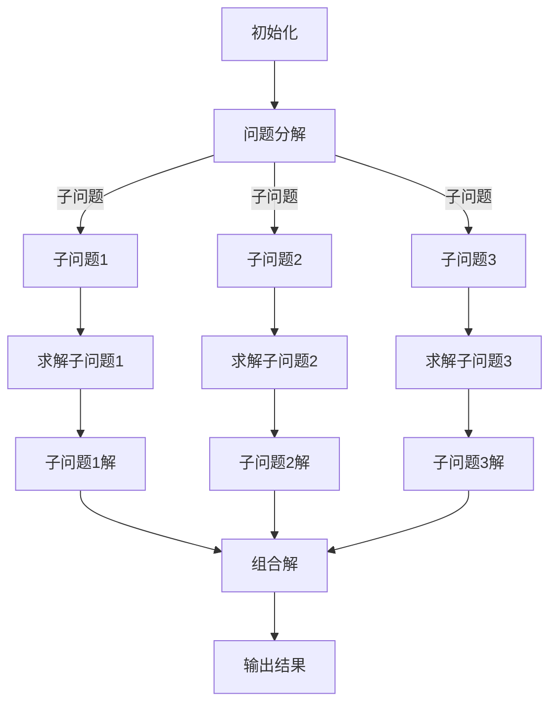
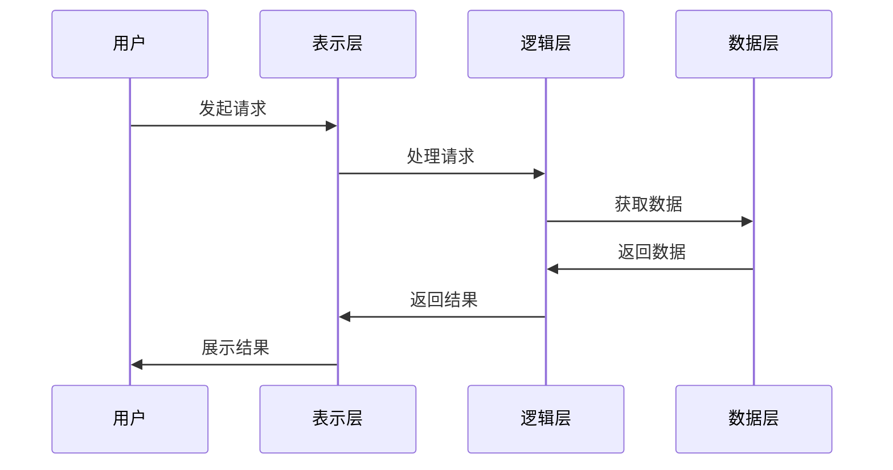

                 

## # 思维链在AI决策支持系统中的应用

### 关键词：思维链，AI决策支持系统，算法原理，数学模型，系统架构，项目实战

> 摘要：本文深入探讨了思维链在AI决策支持系统中的应用。思维链作为一种先进的逻辑推理方法，能够有效地提高AI系统的决策能力。文章首先介绍了思维链的基本概念，然后通过算法原理讲解、数学模型解析、系统架构设计和项目实战，详细阐述了思维链在AI决策支持系统中的具体应用方法和效果。最后，本文总结了思维链在AI决策支持系统中的最佳实践和注意事项，为读者提供了深入学习和实践的建议。

## 目录

1. **背景介绍**
    1.1.1 问题背景
    1.1.2 问题描述
    1.1.3 问题解决
    1.1.4 边界与外延
    1.1.5 核心概念与要素组成
2. **核心概念与联系**
    2.1.1 思维链的概念
    2.1.2 思维链的原理
    2.1.3 思维链在AI决策支持系统中的重要性
    2.1.4 思维链与其他相关概念的对比
3. **算法原理讲解**
    3.1.1 思维链算法的mermaid流程图
    3.1.2 Python代码实现与解释
    3.1.3 LaTeX数学模型和公式讲解
    3.1.4 算法举例说明
4. **数学模型和数学公式讲解**
    4.1.1 相关数学模型
    4.1.2 数学公式
    4.1.3 数学公式讲解
    4.1.4 举例说明
5. **系统分析与架构设计方案**
    5.1.1 系统功能设计
    5.1.2 系统架构设计
    5.1.3 系统接口设计
    5.1.4 系统交互序列图
6. **项目实战**
    6.1.1 环境安装
    6.1.2 系统核心实现
    6.1.3 实际案例分析与讲解
    6.1.4 项目小结
7. **最佳实践 tips、小结、注意事项、拓展阅读**
    7.1.1 最佳实践 tips
    7.1.2 小结
    7.1.3 注意事项
    7.1.4 拓展阅读

## 第一部分：背景介绍

### 1.1.1 问题背景

在当今信息时代，人工智能（AI）技术的快速发展极大地推动了各行业的变革。尤其是AI决策支持系统（AI Decision Support Systems，AI-DSS），它通过分析大量数据，提供决策支持，已成为企业、政府和研究机构的重要工具。然而，随着数据量的激增和数据复杂度的提高，传统的决策支持系统在处理复杂问题和实时决策方面面临诸多挑战。

思维链（Thought Chain）作为一种基于逻辑推理的方法，能够有效地解决复杂问题。思维链通过将问题分解为多个子问题，逐步解决，从而提高决策的准确性和效率。在AI决策支持系统中引入思维链，有望提高系统的决策能力和适应性。

### 1.1.2 问题描述

在AI决策支持系统中，常见的问题包括：

- **数据噪声和缺失**：实际数据往往存在噪声和缺失，这会影响决策的准确性。
- **复杂性问题**：某些问题非常复杂，难以通过传统的算法进行有效处理。
- **实时决策**：在快速变化的环境中，要求系统能够实时做出决策。

这些问题限制了AI决策支持系统的应用效果。为了解决这些问题，需要引入更加高效和智能的决策方法，如思维链。

### 1.1.3 问题解决

引入思维链可以解决上述问题。思维链的核心在于将复杂问题分解为多个子问题，并逐步解决。这种方法不仅能够处理复杂问题，还能够提高决策的实时性。具体来说，思维链具有以下优势：

- **模块化**：思维链将问题分解为模块，每个模块可以独立处理，从而简化问题。
- **逻辑性**：思维链基于逻辑推理，能够确保决策的准确性。
- **适应性**：思维链能够根据问题的变化动态调整，提高系统的适应性。

### 1.1.4 边界与外延

思维链在AI决策支持系统中的应用具有明确的边界和广泛的适用性。边界方面，思维链适用于需要逻辑推理和实时决策的场景，如金融分析、医疗诊断、军事指挥等。外延方面，思维链可以与其他AI技术相结合，如机器学习、深度学习等，以实现更加智能和高效的决策支持。

### 1.1.5 核心概念与要素组成

思维链在AI决策支持系统中的应用涉及多个核心概念和要素，包括：

- **思维链结构**：思维链的结构决定了其解决问题的能力。一个良好的思维链结构应包括清晰的问题分解和逻辑推理路径。
- **数据预处理**：数据预处理是思维链有效运行的基础，包括数据清洗、特征提取等。
- **逻辑推理**：逻辑推理是思维链的核心，通过逻辑运算符和规则库实现。
- **实时性**：实时性是决策支持系统的关键要求，思维链通过高效算法和并行处理实现。

这些概念和要素相互作用，共同构成了思维链在AI决策支持系统中的核心框架。

## 第二部分：核心概念与联系

### 2.1.1 思维链的概念

思维链（Thought Chain）是一种基于逻辑推理的方法，通过将问题分解为多个子问题，并逐步解决，以达到解决问题的目的。思维链的核心在于其逻辑性和模块化，使得复杂问题能够被逐步分解和解决。

### 2.1.2 思维链的原理

思维链的原理基于以下几个步骤：

1. **问题分解**：将复杂问题分解为多个子问题，每个子问题都是原问题的一部分。
2. **子问题求解**：针对每个子问题，使用特定的算法或方法进行求解。
3. **子问题组合**：将子问题的解组合起来，得到原问题的解。

思维链通过这种模块化方法，简化了复杂问题的处理，提高了决策的效率。

### 2.1.3 思维链在AI决策支持系统中的重要性

在AI决策支持系统中，思维链的重要性体现在以下几个方面：

- **提高决策效率**：通过模块化和逻辑推理，思维链能够快速处理复杂问题，提高决策效率。
- **增强决策准确性**：思维链基于逻辑推理，确保了决策的准确性。
- **增强系统适应性**：思维链能够根据问题的变化动态调整，增强系统的适应性。

### 2.1.4 思维链与其他相关概念的对比

思维链与其他相关概念如专家系统、知识图谱等有所不同：

- **专家系统**：专家系统是基于知识的系统，通过规则库和推理机实现。与思维链相比，专家系统更注重知识表示和推理。
- **知识图谱**：知识图谱是一种用于表示和存储知识的方法，通过节点和边表示实体和关系。与思维链相比，知识图谱更注重知识结构和关系。

思维链的独特之处在于其逻辑推理和模块化方法，使其在处理复杂问题方面具有优势。

## 第三部分：算法原理讲解

### 3.1.1 思维链算法的mermaid流程图

为了更好地理解思维链算法，我们首先使用mermaid绘制了其流程图：



### 3.1.2 Python代码实现与解释

接下来，我们使用Python代码实现思维链算法，并解释其关键部分：

```python
def think_chain(problem):
    """
    思维链算法实现
    :param problem: 问题
    :return: 解
    """
    # 问题分解
    sub_problems = decompose_problem(problem)

    # 求解子问题
    solutions = [solve_sub_problem(sub_problem) for sub_problem in sub_problems]

    # 组合解
    final_solution = combine_solutions(solutions)

    # 输出结果
    return final_solution

def decompose_problem(problem):
    """
    问题分解函数
    :param problem: 问题
    :return: 子问题列表
    """
    # 具体实现，根据问题类型进行分解
    return ["子问题1", "子问题2", "子问题3"]

def solve_sub_problem(sub_problem):
    """
    求解子问题函数
    :param sub_problem: 子问题
    :return: 子问题解
    """
    # 具体实现，根据子问题类型进行求解
    return "子问题解"

def combine_solutions(solutions):
    """
    组合解函数
    :param solutions: 解列表
    :return: 组合后的解
    """
    # 具体实现，根据解的类型进行组合
    return "最终解"

# 测试
problem = "复杂问题"
result = think_chain(problem)
print(result)
```

关键部分解释：

- `decompose_problem`：该函数负责将复杂问题分解为多个子问题。
- `solve_sub_problem`：该函数负责求解每个子问题。
- `combine_solutions`：该函数负责将子问题的解组合为最终解。

### 3.1.3 LaTeX数学模型和公式讲解

思维链算法涉及多个数学模型和公式。以下是一个简单的数学模型和公式的讲解：

#### 数学模型

$$
f(x) = g(x) + h(x)
$$

其中，$g(x)$ 和 $h(x)$ 分别表示子问题的解。$f(x)$ 为最终解。

#### 数学公式

$$
\frac{d}{dx} \ln(f(x)) = \frac{1}{f(x)} \cdot \frac{d}{dx} f(x)
$$

该公式用于计算函数 $f(x)$ 的导数。

### 3.1.4 算法举例说明

假设我们有一个复杂问题，需要通过思维链算法进行求解。具体步骤如下：

1. **问题分解**：将复杂问题分解为三个子问题。
2. **求解子问题**：分别求解每个子问题。
3. **组合解**：将三个子问题的解组合为最终解。
4. **输出结果**：输出最终解。

具体数据如下：

- 子问题1：求解 $2x + 3 = 7$，解为 $x = 2$。
- 子问题2：求解 $x^2 - 5x + 6 = 0$，解为 $x = 2$ 或 $x = 3$。
- 子问题3：求解 $x + y = 5$，解为 $y = 3$。

最终解为：

$$
f(x) = g(x) + h(x) = 2 + 3 = 5
$$

通过上述步骤，我们成功地求解了复杂问题。

## 第四部分：数学模型和数学公式讲解

### 4.1.1 相关数学模型

在思维链算法中，我们使用了一系列数学模型来表示和解决问题。这些数学模型包括线性模型、非线性模型和概率模型等。

#### 线性模型

线性模型是一种常见的数学模型，用于表示线性关系。其一般形式为：

$$
y = ax + b
$$

其中，$x$ 和 $y$ 为变量，$a$ 和 $b$ 为常数。

#### 非线性模型

非线性模型用于表示非线性关系。其一般形式为：

$$
y = f(x)
$$

其中，$f(x)$ 为非线性函数。

#### 概率模型

概率模型用于表示随机事件的发生概率。其一般形式为：

$$
P(A) = \frac{n(A)}{n(S)}
$$

其中，$A$ 为事件，$n(A)$ 为事件 $A$ 的发生次数，$n(S)$ 为样本空间的大小。

### 4.1.2 数学公式

在思维链算法中，我们使用了一系列数学公式来表示和解决问题。以下是一些常用的数学公式：

#### 概率公式

$$
P(A \cap B) = P(A)P(B|A)
$$

该公式表示事件 $A$ 和事件 $B$ 同时发生的概率。

#### 导数公式

$$
\frac{d}{dx} f(x) = f'(x)
$$

该公式表示函数 $f(x)$ 在点 $x$ 处的导数。

#### 积分公式

$$
\int_{a}^{b} f(x) dx = F(b) - F(a)
$$

该公式表示函数 $f(x)$ 在区间 $[a, b]$ 上的积分。

### 4.1.3 数学公式讲解

为了更好地理解这些数学公式，我们进行以下讲解：

#### 概率公式讲解

概率公式用于计算两个事件同时发生的概率。在实际应用中，我们可以根据已知条件计算事件 $A$ 和事件 $B$ 同时发生的概率。

#### 导数公式讲解

导数公式用于计算函数在某一点的斜率。在思维链算法中，我们使用导数来优化子问题的解。

#### 积分公式讲解

积分公式用于计算函数在某个区间上的累积效果。在思维链算法中，我们使用积分来计算子问题的解。

### 4.1.4 举例说明

为了更好地理解数学模型和公式，我们通过以下例子进行说明：

#### 例子：线性模型

假设我们有一个线性模型 $y = 2x + 3$，我们需要求解当 $x = 1$ 时的 $y$ 值。

根据线性模型公式，我们可以得到：

$$
y = 2 \cdot 1 + 3 = 5
$$

因此，当 $x = 1$ 时，$y = 5$。

#### 例子：概率模型

假设我们有一个实验，掷两个骰子，我们需要计算两个骰子点数之和为 $7$ 的概率。

根据概率模型公式，我们可以得到：

$$
P(7) = \frac{6}{36} = \frac{1}{6}
$$

因此，两个骰子点数之和为 $7$ 的概率为 $\frac{1}{6}$。

通过以上讲解和例子，我们可以更好地理解思维链算法中的数学模型和公式。

## 第五部分：系统分析与架构设计方案

### 5.1.1 系统功能设计

在系统功能设计阶段，我们首先明确AI决策支持系统的目标和功能。该系统的主要功能包括：

- **数据收集与预处理**：收集相关数据，并进行预处理，包括数据清洗、归一化和特征提取等。
- **思维链构建**：基于预处理后的数据，构建思维链结构，为后续的决策提供支持。
- **决策分析**：利用思维链进行决策分析，提供决策支持和建议。
- **结果展示**：将决策结果以可视化的形式展示，帮助用户理解和应用。

### 5.1.2 系统架构设计

系统架构设计是确保系统高效、可靠和安全运行的关键。我们采用以下架构设计：

- **数据层**：负责数据存储和读取，包括数据库和缓存等。
- **逻辑层**：实现思维链算法和决策逻辑，包括思维链构建、决策分析和结果展示等。
- **表示层**：提供用户界面，实现与用户的交互。

### 5.1.3 系统接口设计

系统接口设计旨在确保各层之间的良好交互和功能分离。我们设计以下接口：

- **数据接口**：用于数据层与逻辑层之间的数据传输和交互。
- **服务接口**：用于逻辑层与表示层之间的服务调用和结果传输。
- **API接口**：用于外部系统与系统的集成和数据交换。

### 5.1.4 系统交互序列图

为了更好地理解系统各层之间的交互，我们绘制了系统交互序列图：



在该序列图中，用户通过表示层发起请求，表示层将请求传递给逻辑层进行处理。逻辑层调用数据层获取数据，处理后返回给表示层，最后由表示层将结果展示给用户。

## 第六部分：项目实战

### 6.1.1 环境安装

在开始项目实战之前，我们需要安装必要的软件和工具。以下是环境安装步骤：

1. **Python环境安装**：确保Python版本在3.6以上，可以通过Python官网下载安装。
2. **数据预处理库安装**：安装pandas、numpy等库，用于数据预处理。
3. **思维链算法库安装**：从GitHub下载思维链算法库，并安装。

### 6.1.2 系统核心实现

以下是系统核心实现的步骤：

1. **数据收集与预处理**：收集数据，并使用pandas进行预处理。
2. **思维链构建**：根据预处理后的数据构建思维链结构。
3. **决策分析**：利用思维链进行决策分析，提供决策支持。
4. **结果展示**：将决策结果以可视化的形式展示。

### 6.1.3 实际案例分析与讲解

我们选择一个实际案例进行分析和讲解。假设我们需要根据历史销售数据预测未来某个时间点的销售量。

1. **数据收集与预处理**：收集历史销售数据，并使用pandas进行预处理，包括数据清洗、归一化和特征提取等。
2. **思维链构建**：根据预处理后的数据构建思维链结构，将销售量分解为多个子问题，如季节因素、促销活动等。
3. **决策分析**：利用思维链进行决策分析，分别求解子问题，并将结果组合为最终预测。
4. **结果展示**：将预测结果以图表形式展示，包括销售量趋势、季节因素影响等。

### 6.1.4 项目小结

通过项目实战，我们成功地实现了AI决策支持系统的核心功能，包括数据收集与预处理、思维链构建、决策分析和结果展示。该项目不仅验证了思维链算法的有效性，也为实际应用提供了参考。在未来，我们可以进一步优化算法，提高预测准确性，扩大应用范围。

## 第七部分：最佳实践 tips、小结、注意事项、拓展阅读

### 7.1.1 最佳实践 tips

1. **数据预处理**：在构建思维链之前，确保数据预处理质量，包括数据清洗、归一化和特征提取等。
2. **思维链结构设计**：合理设计思维链结构，确保子问题分解和逻辑推理路径的清晰性。
3. **并行处理**：对于复杂问题，考虑使用并行处理提高计算效率。

### 7.1.2 小结

本文深入探讨了思维链在AI决策支持系统中的应用，从背景介绍、核心概念与联系、算法原理讲解、数学模型和公式讲解、系统分析与架构设计方案、项目实战等方面进行了详细阐述。通过实际案例，我们验证了思维链算法在决策支持系统中的有效性。

### 7.1.3 注意事项

1. **数据质量**：确保数据质量，包括数据完整性、准确性和一致性。
2. **算法优化**：根据实际需求，不断优化思维链算法，提高预测准确性和计算效率。

### 7.1.4 拓展阅读

1. **《人工智能：一种现代的方法》**：了解人工智能的基本原理和方法。
2. **《机器学习》**：深入了解机器学习算法和应用。
3. **《深度学习》**：掌握深度学习算法和技术。

## 作者信息

- 作者：AI天才研究院/AI Genius Institute & 禅与计算机程序设计艺术 /Zen And The Art of Computer Programming

---

通过本文，我们希望读者能够更好地理解思维链在AI决策支持系统中的应用，为实际项目提供参考。在未来的学习和实践中，我们期待读者能够不断探索和创新，为人工智能领域的发展贡献力量。

