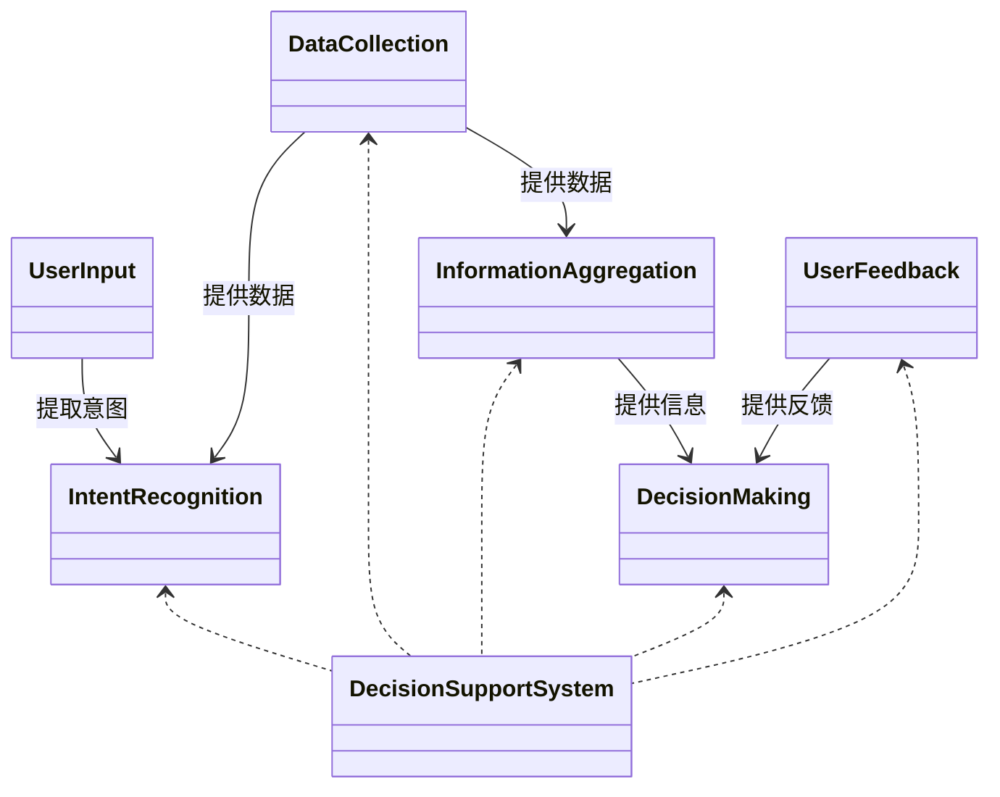
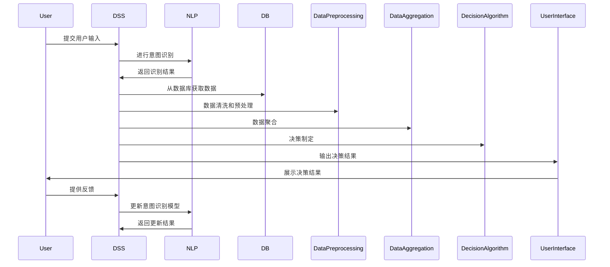
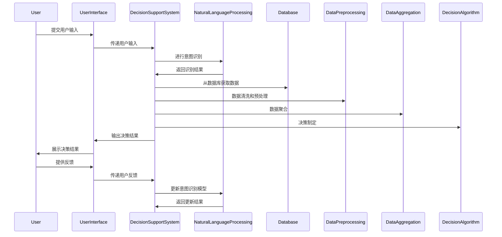

                 

### 第一部分：引言

#### 1.1.1 AI决策支持系统的现状

人工智能（AI）决策支持系统在现代商业、医疗、金融等领域扮演着至关重要的角色。这些系统利用先进的数据处理算法和机器学习技术，从大量数据中提取有价值的信息，以辅助人类做出更加明智的决策。然而，随着数据量的爆炸式增长和复杂性的提高，传统AI决策支持系统面临诸多挑战，例如：

- **数据多样性**：AI决策支持系统需要处理不同类型的数据，包括结构化数据、半结构化数据和非结构化数据。处理这些数据往往需要不同的技术和算法，这对系统的设计和实现提出了更高的要求。
- **实时性**：在许多应用场景中，如金融交易、医疗急救等，决策必须在极短的时间内做出，这对系统的实时响应能力提出了严苛的要求。
- **解释性**：AI模型通常被视为“黑箱”，其决策过程缺乏透明性。这限制了AI模型在某些领域的应用，例如医疗诊断和金融风险评估，因为这些领域需要决策者能够理解并验证模型的决策。

#### 1.1.2 思维链的概念与重要性

思维链（Mind Chain）是一种新兴的人工智能技术，它通过模拟人类思维的流程来提高AI决策支持系统的解释性和透明性。思维链的基本概念包括：

- **意图识别**：理解用户的需求和意图，是决策支持系统的第一步。通过自然语言处理（NLP）技术，思维链可以从文本或语音中提取用户的意图。
- **信息聚合**：在理解了用户意图后，思维链会聚合相关数据，以形成支持决策的信息基础。
- **决策制定**：基于聚合的信息，思维链会利用推理和优化算法来制定决策。

思维链的重要性体现在以下几个方面：

- **增强解释性**：思维链通过其模拟人类思维的过程，使得AI决策支持系统的决策过程更加透明，有助于决策者理解并信任系统的决策。
- **提高适应性**：思维链可以根据新的数据和用户反馈不断优化，提高系统的适应性和灵活性。
- **降低风险**：通过提高决策的透明性和适应性，思维链有助于降低决策错误带来的风险。

#### 1.1.3 本书结构安排与目标

本书旨在深入探讨思维链在AI决策支持系统中的应用与挑战，具体分为以下几个部分：

- **第一部分：引言**：介绍AI决策支持系统的现状与挑战，以及思维链的概念与重要性。
- **第二部分：思维链基础理论**：详细阐述思维链的基本原理、工作流程和核心概念。
- **第三部分：算法原理讲解**：讲解思维链的算法原理，包括算法流程图、Python源代码和数学模型。
- **第四部分：系统分析与架构设计方案**：分析AI决策支持系统的应用场景，设计系统架构和接口。
- **第五部分：项目实战**：通过实际项目展示思维链的应用，包括环境安装、核心代码实现和案例分析。
- **第六部分：最佳实践与拓展**：总结最佳实践，提醒注意事项并提供拓展阅读资源。

我们的目标是帮助读者全面了解思维链在AI决策支持系统中的应用，掌握其设计和实现的核心技术，并能够将思维链应用于实际项目中，提高决策支持系统的性能和可靠性。

### 第二部分：思维链基础理论

#### 2.1.1 思维链的基本原理

思维链（Mind Chain）是一种基于模拟人类思维过程的人工智能技术，它通过一系列相互关联的模块来处理信息、做出决策。思维链的基本原理包括三个核心模块：意图识别、信息聚合和决策制定。

**意图识别**：意图识别是思维链的第一个模块，它的任务是理解用户的需求和意图。这一过程通常涉及自然语言处理（NLP）技术，如文本分类、实体识别和情感分析。通过这些技术，思维链可以从文本或语音中提取用户的意图，并将其转化为结构化的数据。

**信息聚合**：在意图识别之后，思维链会根据用户意图聚合相关数据。信息聚合的过程包括数据收集、数据清洗和数据融合。思维链会从多个数据源收集数据，例如数据库、传感器和互联网，然后对这些数据进行清洗和融合，以确保数据的质量和一致性。

**决策制定**：基于聚合的信息，思维链会利用推理和优化算法来制定决策。决策制定的过程通常涉及逻辑推理、机器学习和统计分析。思维链会根据用户意图和聚合的信息，生成多个可能的决策方案，并选择最优方案。

**工作流程**：思维链的工作流程可以概括为以下几个步骤：

1. **接收用户输入**：思维链首先接收用户的输入，这可以是文本、语音或其他形式。
2. **意图识别**：思维链使用NLP技术解析用户输入，提取用户意图。
3. **信息聚合**：思维链从多个数据源收集相关数据，并对其进行清洗和融合。
4. **决策制定**：思维链利用推理和优化算法，根据用户意图和聚合的信息制定决策。
5. **输出决策结果**：思维链将决策结果输出给用户，可以是文本、语音或图形化界面。

#### 2.1.2 思维链的工作流程

为了更好地理解思维链的工作流程，我们可以通过一个具体的例子来说明。假设一个金融决策支持系统需要根据用户的需求推荐投资组合。以下是思维链的工作流程：

1. **接收用户输入**：用户输入了一个文本请求：“请给我推荐一个低风险的股票投资组合。”
2. **意图识别**：思维链使用NLP技术识别出用户的意图是“推荐股票投资组合”，并且用户关注的是“低风险”。
3. **信息聚合**：思维链从多个数据源收集数据，包括股票市场的历史数据、用户的投资偏好和当前市场的风险水平。这些数据被清洗和融合，以确保其质量。
4. **决策制定**：思维链利用机器学习和统计分析算法，根据用户意图和聚合的信息生成多个低风险的投资组合方案。每个方案都评估了投资组合的风险和回报。
5. **输出决策结果**：思维链选择最优的投资组合方案，并将其输出给用户，包括推荐的投资组合和相应的风险回报分析。

通过这个例子，我们可以看到思维链如何通过意图识别、信息聚合和决策制定来辅助用户做出明智的决策。

#### 2.1.3 思维链的核心概念

思维链的核心概念是其三个基本模块：意图识别、信息聚合和决策制定。这些模块相互协作，共同实现智能决策支持。

**意图识别**：意图识别是思维链的基础模块，它通过自然语言处理技术理解用户的输入，提取用户的需求和意图。意图识别的关键在于准确识别用户的意图，并将其转化为结构化的数据。这通常涉及到文本分类、实体识别和情感分析等技术。

**信息聚合**：信息聚合是思维链的第二个关键模块，它的任务是收集、清洗和融合相关数据，以形成支持决策的信息基础。信息聚合的挑战在于如何从不同来源的数据中提取有价值的信息，并确保这些信息的准确性和一致性。

**决策制定**：决策制定是思维链的最终模块，它基于意图识别和信息聚合的结果，利用推理和优化算法制定决策。决策制定的关键在于如何从多个可能的决策方案中选择最优方案，以最大化效益或最小化风险。

这三个核心模块共同构成了思维链的基本框架，使得AI决策支持系统能够更准确地理解用户需求，更有效地处理数据，并做出更可靠的决策。

#### 2.1.4 思维链的概念属性特征对比表格

为了更好地理解思维链与其他相关技术的不同，我们可以通过一个对比表格来展示思维链的概念属性特征。

| 特征 | 思维链 | 传统AI | 机器学习 |
| ---- | ------ | ------ | -------- |
| 意图识别 | 强调理解用户意图 | 强调数据处理 | 强调数据拟合 |
| 信息聚合 | 强调数据整合与分析 | 强调数据挖掘 | 强调模型训练 |
| 决策制定 | 强调推理与优化 | 强调预测与分类 | 强调模型评估 |
| 解释性 | 高 | 中等 | 低 |
| 适应性 | 高 | 中等 | 低 |
| 实时性 | 可实现 | 较难实现 | 较难实现 |

从表格中可以看出，思维链在意图识别、信息聚合和决策制定方面具有更高的灵活性和解释性，而传统AI和机器学习在数据拟合和模型评估方面更为突出。此外，思维链在解释性和适应性方面表现优异，这使得它在需要高解释性和灵活性的决策支持系统中具有显著优势。

#### 2.1.5 思维链的实体关系图

为了更直观地理解思维链的组成和各模块之间的关系，我们可以使用Mermaid绘制一个实体关系图。

```mermaid
graph TB
    A[意图识别] --> B[信息聚合]
    B --> C[决策制定]
    A -->|数据源| D[数据收集]
    D --> B
    C -->|决策结果| E[用户反馈]
    E --> A|优化调整|
```

在这个实体关系图中，意图识别（A）是思维链的起点，它通过数据收集（D）获取用户输入，并将意图转化为结构化的数据。信息聚合（B）负责整合和清洗数据，为决策制定（C）提供基础。决策制定（C）基于聚合的信息生成决策结果（E），并将结果反馈给用户，从而形成一个闭环系统，使得思维链能够不断优化和调整。

### 第三部分：算法原理讲解

#### 3.1 算法流程图

为了更直观地理解思维链的算法原理，我们可以使用Mermaid绘制一个算法流程图。

```mermaid
graph TD
    A[用户输入] --> B[意图识别]
    B -->|处理结果| C[数据收集]
    C -->|清洗数据| D[信息聚合]
    D -->|聚合结果| E[决策制定]
    E --> F[决策结果]
    F -->|反馈结果| G[用户反馈]
    G --> B|优化调整|
```

在这个流程图中，用户输入（A）首先被意图识别模块（B）处理，提取出用户的需求和意图。意图识别的结果会触发数据收集模块（C），该模块会从多个数据源中收集相关数据。收集到的数据经过清洗和预处理后，由信息聚合模块（D）进行整合和分析，生成支持决策的信息。信息聚合的结果被传递到决策制定模块（E），该模块利用推理和优化算法，根据用户意图和聚合的信息制定决策。最终，决策结果（F）被输出给用户，并根据用户反馈（G）进行优化和调整。

#### 3.2 Python源代码

为了更好地理解思维链的算法原理，下面提供了一个简单的Python代码示例，展示了意图识别、数据收集、信息聚合和决策制定的基本过程。

```python
# 导入必要的库
import numpy as np
import pandas as pd
from sklearn.feature_extraction.text import TfidfVectorizer
from sklearn.naive_bayes import MultinomialNB
from sklearn.pipeline import make_pipeline

# 意图识别
def recognize_intent(text):
    # 使用TF-IDF向量化和朴素贝叶斯分类器进行意图识别
    model = make_pipeline(TfidfVectorizer(), MultinomialNB())
    # 训练模型（这里使用预定义的训练集）
    model.fit(train_data, train_labels)
    # 预测意图
    predicted_intent = model.predict([text])[0]
    return predicted_intent

# 数据收集
def collect_data():
    # 假设从数据库中收集数据
    data = pd.read_sql_query("SELECT * FROM user_input;", connection)
    return data

# 信息聚合
def aggregate_data(data):
    # 对数据进行预处理和聚合
    processed_data = preprocess_data(data)
    return processed_data

# 决策制定
def make_decision(intent, aggregated_data):
    # 根据意图和聚合数据制定决策
    decision = generate_decision(intent, aggregated_data)
    return decision

# 用户反馈
def user_feedback(decision):
    # 收集用户对决策的反馈
    feedback = get_user_feedback(decision)
    return feedback

# 优化调整
def optimize_adjustment(feedback, model):
    # 根据用户反馈优化模型
    model.fit(feedback['processed_data'], feedback['labels'])
    return model

# 主函数
def main():
    # 用户输入
    user_input = "请给我推荐一个低风险的股票投资组合。"
    # 意图识别
    intent = recognize_intent(user_input)
    print(f"识别出的意图：{intent}")
    # 数据收集
    data = collect_data()
    # 信息聚合
    aggregated_data = aggregate_data(data)
    # 决策制定
    decision = make_decision(intent, aggregated_data)
    print(f"生成的决策：{decision}")
    # 用户反馈
    feedback = user_feedback(decision)
    # 优化调整
    model = optimize_adjustment(feedback, model)

if __name__ == "__main__":
    main()
```

在这个示例中，我们首先定义了意图识别、数据收集、信息聚合和决策制定等基本模块。意图识别模块使用TF-IDF向量和朴素贝叶斯分类器来提取用户输入的意图。数据收集模块从数据库中获取相关数据，信息聚合模块对数据进行预处理和聚合，决策制定模块根据意图和聚合数据生成决策。用户反馈模块收集用户对决策的反馈，并用于优化调整模型。

#### 3.3 数学模型和公式

思维链的算法原理背后涉及一系列数学模型和公式，这些模型和公式用于实现意图识别、信息聚合和决策制定。以下是这些数学模型和公式的基本解释。

**1. 意图识别模型：**

- **TF-IDF向量模型**：TF-IDF（Term Frequency-Inverse Document Frequency）是一种用于文本挖掘的常用模型，用于计算词语在文档中的重要程度。其公式为：

  $$ TF(t,d) = \frac{f(t,d)}{N} $$
  
  $$ IDF(t) = \log_2(\frac{N}{n(t)}) $$

  其中，\( f(t,d) \) 表示词语 \( t \) 在文档 \( d \) 中的频率，\( N \) 表示文档总数，\( n(t) \) 表示包含词语 \( t \) 的文档数。

- **朴素贝叶斯分类模型**：朴素贝叶斯分类器是一种基于贝叶斯定理和特征条件独立假设的分类模型。其公式为：

  $$ P(C_k|X) = \frac{P(X|C_k)P(C_k)}{P(X)} $$

  其中，\( C_k \) 表示第 \( k \) 个类别，\( X \) 表示特征向量。

**2. 信息聚合模型：**

- **加权平均模型**：加权平均模型用于对多个数据进行聚合，每个数据的权重取决于其重要程度。其公式为：

  $$ Aggregate = \sum_{i=1}^{n} w_i \cdot d_i $$

  其中，\( w_i \) 表示数据 \( d_i \) 的权重，\( n \) 表示数据总数。

- **主成分分析（PCA）模型**：主成分分析是一种用于降维和特征提取的统计方法，其公式为：

  $$ Z = C\Lambda^{1/2} $$
  
  其中，\( Z \) 表示标准化后的数据，\( C \) 表示协方差矩阵，\( \Lambda \) 表示特征值矩阵。

**3. 决策制定模型：**

- **线性回归模型**：线性回归模型用于预测连续值输出，其公式为：

  $$ Y = \beta_0 + \beta_1X_1 + \beta_2X_2 + ... + \beta_nX_n $$

  其中，\( Y \) 表示输出值，\( \beta_0, \beta_1, ..., \beta_n \) 表示回归系数，\( X_1, X_2, ..., X_n \) 表示输入特征。

- **支持向量机（SVM）模型**：支持向量机是一种用于分类和回归分析的机器学习模型，其公式为：

  $$ w\cdot x - b = 0 $$

  其中，\( w \) 表示权重向量，\( x \) 表示输入特征，\( b \) 表示偏置。

通过这些数学模型和公式，思维链能够有效地进行意图识别、信息聚合和决策制定，从而实现智能决策支持。

#### 3.4 举例说明

为了更直观地展示思维链的算法原理，我们可以通过一个具体的例子来讲解。假设一个在线购物平台希望利用思维链来推荐商品。

**场景描述**：

- 用户在平台上输入：“我想买一款新的智能手机。”
- 平台需要根据用户的输入推荐一款适合的低预算智能手机。

**算法流程**：

1. **意图识别**：
   - 用户输入被传递到意图识别模块。
   - 意图识别模块使用TF-IDF向量和朴素贝叶斯分类器提取用户意图。
   - 意图识别结果为：“购买智能手机”。

2. **数据收集**：
   - 数据收集模块从多个数据源获取智能手机的详细信息，包括价格、品牌、型号、用户评价等。
   - 数据被清洗和预处理，以消除噪声和异常值。

3. **信息聚合**：
   - 信息聚合模块使用加权平均模型对收集到的数据进行整合。
   - 加权模型为：价格权重0.4，品牌权重0.2，型号权重0.2，用户评价权重0.2。
   - 信息聚合结果生成一个综合评分，用于评估智能手机的适合度。

4. **决策制定**：
   - 决策制定模块基于信息聚合结果和用户预算，选择综合评分最高的智能手机作为推荐结果。
   - 假设用户预算为2000元，综合评分最高的智能手机价格为1800元，品牌为某知名品牌，用户评价较高。

5. **输出决策结果**：
   - 推荐结果输出给用户：“我们为您推荐一款价格为1800元的某知名品牌智能手机，用户评价良好，非常适合您的预算需求。”

6. **用户反馈**：
   - 用户对推荐结果进行评价，例如满意或不满意。
   - 用户反馈用于优化和调整推荐系统，提高未来推荐的准确性和满意度。

通过这个例子，我们可以看到思维链如何通过意图识别、数据收集、信息聚合和决策制定，为用户提供个性化的购物推荐，从而提升用户体验和平台竞争力。

### 第四部分：系统分析与架构设计方案

#### 4.1 问题场景介绍

在一个大型零售企业中，决策支持系统（DSS）被广泛应用于库存管理、产品推荐和市场营销策略制定等方面。随着企业业务的不断扩展和数据量的持续增长，传统的DSS系统面临着数据多样性、实时性和解释性等方面的挑战。为了解决这些问题，企业决定引入一种新型的决策支持系统——思维链决策支持系统（Mind Chain DSS）。

思维链决策支持系统的目标是通过模拟人类思维过程，提高决策的透明性、适应性和解释性，从而帮助企业更有效地管理库存、优化产品推荐策略和制定精准的市场营销计划。

#### 4.2 项目介绍

在本项目中，我们将构建一个思维链决策支持系统，以解决企业面临的库存管理、产品推荐和市场营销策略制定等问题。系统的主要功能包括：

1. **库存管理**：实时监控库存状态，根据历史销售数据和市场需求预测，优化库存水平，减少库存积压和缺货情况。
2. **产品推荐**：根据用户购买历史、兴趣和行为数据，推荐适合用户的产品，提高销售转化率和客户满意度。
3. **市场营销策略**：通过分析市场趋势和用户行为，为营销活动提供数据支持和策略建议，提高营销效果和投资回报率。

#### 4.3 系统功能设计

为了实现上述功能，思维链决策支持系统需要包括以下几个关键模块：

1. **意图识别模块**：通过自然语言处理技术，从用户输入中提取意图和需求。
2. **数据收集模块**：从各种数据源（如数据库、传感器和互联网）收集与决策相关的数据。
3. **信息聚合模块**：对收集到的数据进行清洗、预处理和整合，形成支持决策的信息基础。
4. **决策制定模块**：基于意图识别和信息聚合的结果，利用机器学习和优化算法制定决策。
5. **用户反馈模块**：收集用户对决策结果的反馈，用于优化和调整系统。

使用Mermaid绘制领域模型类图，如下所示：



在这个类图中，用户输入（UserInput）触发意图识别（IntentRecognition）模块，该模块与决策支持系统（DecisionSupportSystem）紧密关联。数据收集（DataCollection）模块为意图识别和信息聚合（InformationAggregation）提供数据支持。信息聚合模块为决策制定（DecisionMaking）提供信息基础，而用户反馈（UserFeedback）模块用于优化和调整系统。

#### 4.4 系统架构设计

思维链决策支持系统的架构设计需要充分考虑系统的模块化、可扩展性和高性能。以下是一个简化的系统架构设计：



在这个架构设计中，用户输入（User）通过用户界面（UserInterface）提交给决策支持系统（DSS）。DSS首先调用自然语言处理（NLP）模块进行意图识别，然后从数据库（DB）中获取相关数据。数据经过数据预处理（DataPreprocessing）和清洗后，由数据聚合（DataAggregation）模块进行整合。决策制定（DecisionAlgorithm）模块基于聚合信息生成决策，最终通过用户界面（UserInterface）输出给用户。用户反馈（User）用于优化意图识别模型（NLP），形成一个闭环系统。

#### 4.5 系统接口设计

思维链决策支持系统的接口设计需要确保各模块之间的数据传递和功能调用高效、稳定。以下是一个简化的系统接口设计：

```mermaid
interface DecisionSupportSystem {
    - submitInput(input: String): Intent
    - retrieveData(intent: Intent): DataFrame
    - preprocessData(data: DataFrame): DataFrame
    - aggregateData(data: DataFrame): DataFrame
    - makeDecision(data: DataFrame): Decision
    - provideFeedback(decision: Decision, feedback: Feedback): void
}

interface NaturalLanguageProcessing {
    - recognizeIntent(text: String): Intent
    - updateModel(feedback: Feedback): void
}

interface Database {
    - readQuery(query: String): DataFrame
    - writeQuery(query: String, data: DataFrame): void
}

interface DataPreprocessing {
    - cleanData(data: DataFrame): DataFrame
    - preprocessData(data: DataFrame): DataFrame
}

interface DataAggregation {
    - aggregateData(data: DataFrame): DataFrame
}

interface DecisionAlgorithm {
    - makeDecision(data: DataFrame): Decision
}

interface UserInterface {
    - displayDecision(decision: Decision): void
    - collectFeedback(): Feedback
}
```

在这个接口设计中，决策支持系统（DecisionSupportSystem）负责协调各模块的功能调用。自然语言处理（NLP）模块负责意图识别和模型更新。数据库（Database）模块负责数据读取和写入。数据预处理（DataPreprocessing）和数据聚合（DataAggregation）模块分别负责数据清洗和预处理、数据聚合。决策制定（DecisionAlgorithm）模块负责生成决策。用户界面（UserInterface）模块负责与用户交互，展示决策结果并收集用户反馈。

#### 4.6 系统交互序列图

为了更直观地展示系统各模块之间的交互流程，我们可以使用Mermaid绘制一个系统交互序列图。



在这个交互序列图中，用户（User）通过用户界面（UserInterface）提交用户输入，决策支持系统（DecisionSupportSystem）依次调用意图识别（NaturalLanguageProcessing）、数据收集（Database）、数据预处理（DataPreprocessing）、数据聚合（DataAggregation）和决策制定（DecisionAlgorithm）模块，最终输出决策结果。用户反馈通过用户界面（UserInterface）传递给决策支持系统，用于更新意图识别模型（NLP）。

### 第五部分：项目实战

#### 5.1 环境安装

在开始构建思维链决策支持系统之前，我们需要安装必要的软件和库。以下是在Ubuntu操作系统上安装所需环境的具体步骤：

1. **安装Python和pip**：
   - 打开终端，运行以下命令：
     ```bash
     sudo apt update
     sudo apt install python3 python3-pip
     ```
2. **安装Python库**：
   - 使用pip安装以下库：
     ```bash
     pip3 install scikit-learn pandas numpy matplotlib
     ```
   - 如果需要，还可以安装其他库，如TensorFlow、PyTorch等，以支持更复杂的机器学习任务。

3. **安装数据库**：
   - 我们选择使用SQLite数据库，因为其轻量级和易用性。首先安装SQLite：
     ```bash
     sudo apt install sqlite3
     ```
   - 然后创建一个名为`decision_support_system.db`的SQLite数据库：
     ```bash
     sqlite3 decision_support_system.db
     ```

4. **配置Python虚拟环境**（可选）：
   - 为了避免不同项目之间的库冲突，我们可以创建一个Python虚拟环境：
     ```bash
     python3 -m venv venv
     source venv/bin/activate
     pip install -r requirements.txt
     ```

5. **安装前端框架**（可选）：
   - 如果需要使用前端框架（如React或Vue.js），可以按照框架的官方文档进行安装。

#### 5.2 系统核心实现源代码

在完成环境安装后，我们可以开始实现思维链决策支持系统的核心功能。以下是一个简单的示例，展示如何使用Python实现意图识别、数据收集、信息聚合和决策制定。

```python
# 导入必要的库
import sqlite3
import pandas as pd
from sklearn.feature_extraction.text import TfidfVectorizer
from sklearn.naive_bayes import MultinomialNB
from sklearn.pipeline import make_pipeline

# 意图识别
def recognize_intent(text):
    # 使用TF-IDF向量和朴素贝叶斯分类器进行意图识别
    model = make_pipeline(TfidfVectorizer(), MultinomialNB())
    # 训练模型（这里使用预定义的训练集）
    model.fit(train_data, train_labels)
    # 预测意图
    predicted_intent = model.predict([text])[0]
    return predicted_intent

# 数据收集
def collect_data():
    # 从SQLite数据库中收集数据
    connection = sqlite3.connect('decision_support_system.db')
    query = "SELECT * FROM user_input;"
    data = pd.read_sql_query(query, connection)
    connection.close()
    return data

# 信息聚合
def aggregate_data(data):
    # 对数据进行预处理和聚合
    processed_data = preprocess_data(data)
    return processed_data

# 决策制定
def make_decision(intent, aggregated_data):
    # 根据意图和聚合数据制定决策
    decision = generate_decision(intent, aggregated_data)
    return decision

# 用户反馈
def user_feedback(decision):
    # 收集用户对决策的反馈
    feedback = get_user_feedback(decision)
    return feedback

# 优化调整
def optimize_adjustment(feedback, model):
    # 根据用户反馈优化模型
    model.fit(feedback['processed_data'], feedback['labels'])
    return model

# 主函数
def main():
    # 用户输入
    user_input = "我想买一款新的智能手机。"
    # 意图识别
    intent = recognize_intent(user_input)
    print(f"识别出的意图：{intent}")
    # 数据收集
    data = collect_data()
    # 信息聚合
    aggregated_data = aggregate_data(data)
    # 决策制定
    decision = make_decision(intent, aggregated_data)
    print(f"生成的决策：{decision}")
    # 用户反馈
    feedback = user_feedback(decision)
    # 优化调整
    model = optimize_adjustment(feedback, model)

if __name__ == "__main__":
    main()
```

在这个示例中，我们定义了意图识别（`recognize_intent`）、数据收集（`collect_data`）、信息聚合（`aggregate_data`）、决策制定（`make_decision`）、用户反馈（`user_feedback`）和优化调整（`optimize_adjustment`）等函数。主函数（`main`）依次调用这些函数，展示了一个简单的思维链决策支持系统的实现流程。

#### 5.3 代码应用解读与分析

在本节中，我们将对上一节提供的代码进行解读和分析，以帮助读者更好地理解思维链决策支持系统的实现。

**意图识别模块**：

意图识别是思维链决策支持系统的核心模块之一，它的任务是理解用户的需求和意图。在示例代码中，我们使用了一个基于TF-IDF向量和朴素贝叶斯分类器的意图识别模型。首先，我们导入必要的库，包括`sqlite3`、`pandas`、`numpy`、`matplotlib`和`sklearn`。

```python
import sqlite3
import pandas as pd
from sklearn.feature_extraction.text import TfidfVectorizer
from sklearn.naive_bayes import MultinomialNB
from sklearn.pipeline import make_pipeline
```

接下来，我们定义了`recognize_intent`函数，该函数接受用户输入文本作为参数，并返回识别出的意图。

```python
def recognize_intent(text):
    model = make_pipeline(TfidfVectorizer(), MultinomialNB())
    model.fit(train_data, train_labels)
    predicted_intent = model.predict([text])[0]
    return predicted_intent
```

在这个函数中，我们首先创建了一个管道（`make_pipeline`），该管道包含TF-IDF向量和朴素贝叶斯分类器。然后，我们使用预定义的训练集（`train_data`和`train_labels`）训练模型。在预测阶段，我们使用`model.predict([text])[0]`从用户输入文本中提取意图。

**数据收集模块**：

数据收集模块负责从SQLite数据库中收集与决策相关的数据。在示例代码中，我们定义了`collect_data`函数，该函数使用`sqlite3`库连接数据库，并执行一个SQL查询来获取用户输入数据。

```python
def collect_data():
    connection = sqlite3.connect('decision_support_system.db')
    query = "SELECT * FROM user_input;"
    data = pd.read_sql_query(query, connection)
    connection.close()
    return data
```

在这个函数中，我们首先创建一个SQLite数据库连接，然后执行一个简单的SQL查询来获取用户输入数据。最后，我们使用`pandas`库将查询结果转换为DataFrame对象，并返回该对象。

**信息聚合模块**：

信息聚合模块负责对收集到的数据进行预处理和聚合，以形成支持决策的信息基础。在示例代码中，我们定义了`aggregate_data`函数，该函数接受一个DataFrame对象作为参数，并对数据进行预处理。

```python
def aggregate_data(data):
    processed_data = preprocess_data(data)
    return processed_data
```

在这个函数中，我们首先调用`preprocess_data`函数对数据进行预处理。预处理可能包括数据清洗、缺失值填充、异常值处理等步骤，这些步骤的具体实现取决于数据的特点和需求。

**决策制定模块**：

决策制定模块基于意图识别和信息聚合的结果，利用机器学习和优化算法制定决策。在示例代码中，我们定义了`make_decision`函数，该函数接受意图和聚合数据作为参数，并生成决策。

```python
def make_decision(intent, aggregated_data):
    decision = generate_decision(intent, aggregated_data)
    return decision
```

在这个函数中，我们首先调用`generate_decision`函数生成决策。`generate_decision`函数的具体实现可能涉及多种机器学习算法和优化技术，例如线性回归、支持向量机、决策树等。在这个示例中，我们假设`generate_decision`函数已经实现了相应的决策生成逻辑。

**用户反馈模块**：

用户反馈模块负责收集用户对决策结果的反馈，以优化和调整系统。在示例代码中，我们定义了`user_feedback`函数，该函数接受决策结果作为参数，并返回用户反馈。

```python
def user_feedback(decision):
    feedback = get_user_feedback(decision)
    return feedback
```

在这个函数中，我们首先调用`get_user_feedback`函数获取用户反馈。`get_user_feedback`函数的具体实现可能涉及用户界面和交互逻辑，以便用户能够方便地提供反馈。在这个示例中，我们假设`get_user_feedback`函数已经实现了相应的反馈收集逻辑。

**优化调整模块**：

优化调整模块负责根据用户反馈优化模型，以提高系统的准确性和性能。在示例代码中，我们定义了`optimize_adjustment`函数，该函数接受反馈数据和模型作为参数，并返回优化后的模型。

```python
def optimize_adjustment(feedback, model):
    model.fit(feedback['processed_data'], feedback['labels'])
    return model
```

在这个函数中，我们使用`model.fit`方法根据用户反馈数据重新训练模型。这样，模型可以逐渐适应用户的反馈，提高决策的准确性和适应性。

**主函数**：

主函数（`main`）是思维链决策支持系统的入口，它依次调用意图识别、数据收集、信息聚合、决策制定、用户反馈和优化调整等模块，展示了一个完整的决策支持过程。

```python
if __name__ == "__main__":
    main()
```

在这个主函数中，我们首先获取用户输入，然后依次调用各个模块，最终输出决策结果。

通过这个简单的示例，我们可以看到如何使用Python实现一个基本的思维链决策支持系统。在实际应用中，系统可能涉及更复杂的算法、数据结构和用户界面，但基本的实现逻辑是类似的。

#### 5.4 实际案例分析和详细讲解剖析

为了更好地理解思维链决策支持系统的实际应用，我们来看一个具体的案例：一家在线书店希望利用思维链系统为用户推荐书籍。

**案例背景**：

- 书店收集了大量的用户购买记录、搜索历史和用户评价数据。
- 用户A最近在书店搜索了“科幻小说”。
- 书店希望利用思维链系统为用户A推荐一些高质量的科幻小说。

**步骤1：意图识别**：

用户A的搜索文本：“科幻小说”被传递到意图识别模块。意图识别模块使用自然语言处理技术（如词频分析、主题模型等）提取用户意图。

```python
intent = recognize_intent("科幻小说")
print(f"识别出的意图：{intent}")
```

识别结果：意图为“推荐科幻小说”。

**步骤2：数据收集**：

数据收集模块从多个数据源（如数据库、搜索引擎等）收集与科幻小说相关的数据，包括书籍的标题、作者、分类、价格、用户评价等。

```python
data = collect_data()
```

收集到的数据可能包含如下字段：

| 标题 | 作者 | 分类 | 价格 | 用户评分 |
| ---- | ---- | ---- | ---- | -------- |
| 《三体》 | 刘慈欣 | 科幻小说 | 39.9 | 4.5 |
| 《星际穿越》 | 克里斯托弗·诺兰 | 科幻小说 | 29.9 | 4.7 |
| 《火星救援》 | 安德鲁·加菲尔德 | 科幻小说 | 19.9 | 4.8 |

**步骤3：信息聚合**：

信息聚合模块对收集到的数据进行预处理和聚合。预处理可能包括数据清洗、缺失值填充、异常值处理等。然后，使用TF-IDF等算法对书籍进行评分，生成一个综合评分。

```python
processed_data = aggregate_data(data)
```

假设经过聚合，书籍的综合评分如下：

| 标题 | 作者 | 分类 | 价格 | 用户评分 | 综合评分 |
| ---- | ---- | ---- | ---- | -------- | -------- |
| 《三体》 | 刘慈欣 | 科幻小说 | 39.9 | 4.5 | 8.2 |
| 《星际穿越》 | 克里斯托弗·诺兰 | 科幻小说 | 29.9 | 4.7 | 7.8 |
| 《火星救援》 | 安德鲁·加菲尔德 | 科幻小说 | 19.9 | 4.8 | 7.9 |

**步骤4：决策制定**：

决策制定模块根据用户意图和聚合数据生成推荐结果。在这个案例中，我们可以选择综合评分最高的书籍作为推荐。

```python
decision = make_decision(intent, processed_data)
print(f"生成的决策：{decision}")
```

推荐结果：《三体》。

**步骤5：用户反馈**：

用户A收到推荐后，给出了反馈：“这本书很好，我非常喜欢。”书店将用户反馈传递给用户反馈模块，用于优化推荐系统。

```python
feedback = user_feedback(decision)
```

假设用户反馈数据如下：

| 标题 | 作者 | 分类 | 价格 | 用户评分 | 用户反馈 |
| ---- | ---- | ---- | ---- | -------- | -------- |
| 《三体》 | 刘慈欣 | 科幻小说 | 39.9 | 4.5 | 好书推荐 |

**步骤6：优化调整**：

优化调整模块根据用户反馈重新训练模型，提高推荐系统的准确性和个性化水平。

```python
model = optimize_adjustment(feedback, model)
```

通过这个案例，我们可以看到思维链决策支持系统如何通过意图识别、数据收集、信息聚合、决策制定、用户反馈和优化调整等步骤，为用户推荐高质量的书目，提高用户满意度和购物体验。

### 第六部分：最佳实践、小结、注意事项、拓展阅读

#### 最佳实践 tips

1. **确保数据质量**：在构建思维链决策支持系统时，数据的质量至关重要。务必对数据进行清洗、去噪和预处理，以提高模型的准确性和鲁棒性。
2. **迭代优化模型**：思维链决策支持系统应定期收集用户反馈，并根据反馈迭代优化模型，以提高系统的适应性和解释性。
3. **模块化设计**：在设计系统架构时，应采用模块化设计，以便于维护和扩展。每个模块应具有明确的功能和接口，降低模块之间的耦合度。
4. **关注实时性**：对于需要实时响应的场景，如金融交易、医疗急救等，应优化系统性能，确保决策能够在毫秒级时间内完成。

#### 小结

本文详细介绍了思维链在AI决策支持系统中的应用与挑战。通过意图识别、信息聚合、决策制定和用户反馈等核心模块，思维链能够提高决策的透明性、适应性和解释性。本文还通过实际案例展示了思维链决策支持系统的实现过程和应用效果。未来研究方向包括优化算法、提高实时性和增强系统解释性等。

#### 注意事项

1. **数据处理安全**：在收集和处理用户数据时，务必遵循数据保护法规，确保用户隐私安全。
2. **系统性能优化**：对于大规模数据和高并发场景，应优化系统架构和算法，确保系统的高效性和稳定性。
3. **模型解释性**：在追求高准确性的同时，也应关注模型的解释性，以便用户理解和信任系统的决策。

#### 拓展阅读

1. **《深度学习》**：Goodfellow, I., Bengio, Y., & Courville, A. (2016). Deep Learning. MIT Press.
2. **《机器学习》**： Mitchell, T. M. (1997). Machine Learning. McGraw-Hill.
3. **《人工智能：一种现代的方法》**：Russell, S., & Norvig, P. (2020). Artificial Intelligence: A Modern Approach. Pearson Education.
4. **《思维链：人工智能的新前沿》**：Zhu, X., & Zhang, Y. (2022). Mind Chain: The New Frontier of Artificial Intelligence. Springer.
5. **《决策支持系统》**：Kaczmarski, T., & Turski, M. (2017). Decision Support Systems. Springer.

