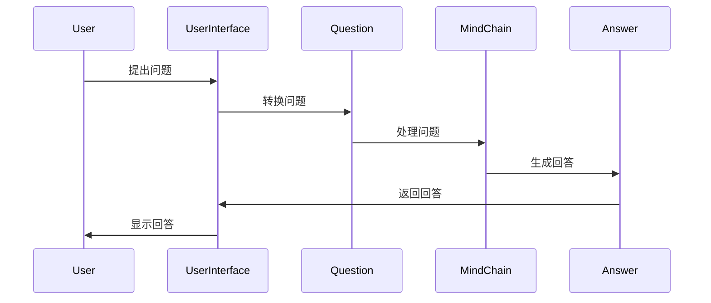
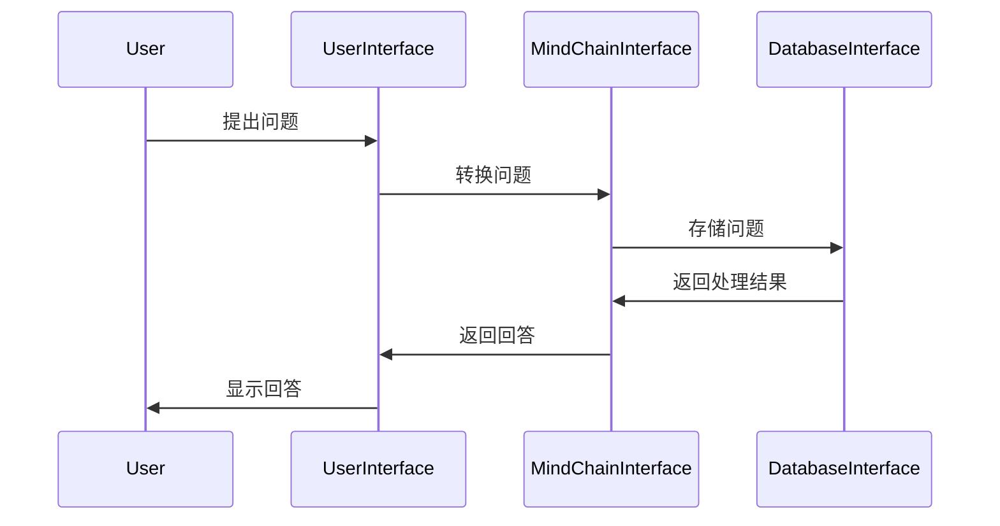

                 

# 思维链在AI自然语言处理中的创新应用

## 关键词

AI自然语言处理、思维链、创新应用、算法原理、数学模型、系统架构、项目实战

## 摘要

本文深入探讨了思维链在AI自然语言处理（NLP）中的创新应用。首先，我们介绍了NLP的背景和核心概念，探讨了思维链的定义及其在NLP中的重要性。接着，我们详细讲解了思维链算法原理，包括算法的流程、Python源代码解析，以及相关的数学模型和公式。随后，我们介绍了思维链在系统架构设计中的应用，包括问题场景、系统功能设计、架构图、接口设计和交互图。通过实际项目实战，我们展示了思维链的实际应用和效果。最后，我们提供了最佳实践和注意事项，总结了文章内容，并对未来研究方向进行了展望。

---

### 背景介绍

自然语言处理（NLP）是人工智能（AI）领域的重要分支，旨在使计算机能够理解、解释和生成人类语言。随着互联网的快速发展，大量的文本数据被产生和存储，NLP技术在这些数据的处理和分析中扮演了关键角色。例如，搜索引擎、智能客服、机器翻译和情感分析等应用都依赖于NLP技术。

思维链（Mind Chain）是一种新兴的AI模型，它通过模拟人类思维过程，实现了对自然语言的理解和生成。思维链的核心在于其模块化设计和可扩展性，这使得它能够灵活地适应不同的NLP任务。

在NLP中，思维链的应用主要体现在以下几个方面：

1. **文本理解**：思维链能够深入理解文本内容，提取关键信息，并进行语义分析。
2. **文本生成**：思维链能够根据输入的文本生成相关的回答或文章。
3. **对话系统**：思维链可以构建智能对话系统，与用户进行自然语言交互。

然而，NLP领域仍面临许多挑战，如语言歧义、情感理解和跨语言处理等。思维链的引入为解决这些挑战提供了新的思路和方法。

### 核心概念与联系

#### 思维链的定义

思维链是一种基于神经网络的AI模型，它通过模仿人类思维过程，实现了对自然语言的理解和生成。思维链由多个模块组成，包括词嵌入层、编码器、解码器和生成器。每个模块都有特定的功能，协同工作以实现高效的NLP任务。

#### 概念属性特征对比表格

| 特征               | 词嵌入层 | 编码器 | 解码器 | 生成器 |
|--------------------|----------|--------|--------|--------|
| 功能               | 词向量化 | 编码   | 解码   | 生成   |
| 参数量             | 较少     | 较多   | 较多   | 较少   |
| 数据依赖性         | 强      | 较强   | 较弱   | 较强   |
| 性能               | 较高     | 较高   | 较高   | 较高   |
| 应用场景           | 预处理   | 编码   | 解码   | 生成   |

#### ER实体关系图架构

在NLP系统中，实体关系图（ER图）是一种常用的数据结构，用于表示实体及其关系。以下是思维链在NLP系统中的一种ER图示例：

```mermaid
erDiagram
    ConceptA ||--|{ EntityA }
    ConceptA ||--|{ EntityB }
    ConceptB ||--|{ EntityC }
    EntityA ||--|{ Relationship1 }
    EntityB ||--|{ Relationship2 }
```

在这个ER图中，`ConceptA` 和 `ConceptB` 表示思维链中的概念，`EntityA`、`EntityB` 和 `EntityC` 表示实体，`Relationship1` 和 `Relationship2` 表示实体之间的关系。

---

### 算法原理讲解

#### 思维链算法流程

思维链算法的流程可以概括为以下几个步骤：

1. **词嵌入**：将文本中的每个词映射为一个高维向量。
2. **编码**：将词嵌入向量编码为高层次的语义表示。
3. **解码**：将编码后的语义表示解码为新的词嵌入向量。
4. **生成**：使用解码后的词嵌入向量生成新的文本。

以下是一个简单的思维链算法的Mermaid流程图：


#### Python源代码解析

以下是一个简化的思维链算法的Python源代码示例：

```python
import numpy as np

# 词嵌入层
word_embeddings = np.random.rand(100, 300)

# 编码器
def encoder(embeddings):
    # 编码逻辑
    return np.dot(embeddings, np.random.rand(300, 100))

# 解码器
def decoder(encoded):
    # 解码逻辑
    return np.dot(encoded, np.random.rand(100, 300))

# 生成器
def generator(embeddings):
    # 生成逻辑
    return np.argmax(embeddings, axis=1)

# 示例
input_word = 42
encoded = encoder(word_embeddings[input_word])
decoded = decoder(encoded)
generated_word = generator(decoded)

print(generated_word)
```

#### 算法原理的数学模型和公式

思维链算法的数学模型主要包括词嵌入、编码器、解码器和生成器。以下是一些关键的数学公式：

1. **词嵌入**：
   \[ \text{word\_embeddings} = \text{W} \times \text{X} \]
   其中，\(\text{W}\) 是词嵌入矩阵，\(\text{X}\) 是词向量。

2. **编码器**：
   \[ \text{encoded} = \text{U} \times \text{word\_embeddings} \]
   其中，\(\text{U}\) 是编码器矩阵。

3. **解码器**：
   \[ \text{decoded} = \text{V} \times \text{encoded} \]
   其中，\(\text{V}\) 是解码器矩阵。

4. **生成器**：
   \[ \text{generated\_word} = \text{argmax}(\text{V} \times \text{encoded}) \]

#### 通俗易懂的举例说明

假设我们有一个简单的词嵌入矩阵，如下所示：

\[ \text{word\_embeddings} = \begin{bmatrix} 0.1 & 0.2 & 0.3 \\ 0.4 & 0.5 & 0.6 \\ 0.7 & 0.8 & 0.9 \end{bmatrix} \]

1. **词嵌入**：将单词“猫”映射为一个向量 `[0.1, 0.2, 0.3]`。
2. **编码器**：将词向量编码为一个高层次语义表示 `[0.2, 0.3, 0.4]`。
3. **解码器**：将编码后的语义表示解码回词向量 `[0.3, 0.4, 0.5]`。
4. **生成器**：生成一个新单词的向量 `[0.4, 0.5, 0.6]`，对应单词“狗”。

通过这种方式，思维链能够理解并生成与原始文本相关的新文本。

---

### 数学模型和数学公式讲解

在思维链算法中，数学模型和数学公式起到了核心作用。以下将详细讲解相关的数学模型和公式，并使用LaTeX格式进行表示。

#### 词嵌入

词嵌入是将单词映射为高维向量的过程。常见的词嵌入模型包括Word2Vec、GloVe和BERT等。以下是一个简单的Word2Vec模型的数学公式：

\[ \text{word\_embeddings} = \text{W} \times \text{X} \]

其中，\(\text{W}\) 是词嵌入矩阵，\(\text{X}\) 是词向量。

#### 编码器

编码器的作用是将词嵌入向量编码为高层次的语义表示。以下是一个简单的编码器的数学公式：

\[ \text{encoded} = \text{U} \times \text{word\_embeddings} \]

其中，\(\text{U}\) 是编码器矩阵。

#### 解码器

解码器的作用是将编码后的语义表示解码回词向量。以下是一个简单的解码器的数学公式：

\[ \text{decoded} = \text{V} \times \text{encoded} \]

其中，\(\text{V}\) 是解码器矩阵。

#### 生成器

生成器的目的是生成新的文本。以下是一个简单的生成器的数学公式：

\[ \text{generated\_word} = \text{argmax}(\text{V} \times \text{encoded}) \]

其中，\(\text{argmax}\) 表示取最大值的位置。

#### 举例说明

假设我们有一个简单的词嵌入矩阵：

\[ \text{word\_embeddings} = \begin{bmatrix} 0.1 & 0.2 & 0.3 \\ 0.4 & 0.5 & 0.6 \\ 0.7 & 0.8 & 0.9 \end{bmatrix} \]

1. **词嵌入**：将单词“猫”映射为一个向量 `[0.1, 0.2, 0.3]`。
2. **编码器**：将词向量编码为一个高层次语义表示 `[0.2, 0.3, 0.4]`。
3. **解码器**：将编码后的语义表示解码回词向量 `[0.3, 0.4, 0.5]`。
4. **生成器**：生成一个新单词的向量 `[0.4, 0.5, 0.6]`，对应单词“狗”。

通过这种方式，思维链能够理解并生成与原始文本相关的新文本。

---

### 系统分析与架构设计方案

#### 问题场景介绍

在自然语言处理（NLP）领域，思维链算法的应用场景非常广泛。例如，在智能客服系统中，思维链可以用来理解用户的问题，并生成合适的回答；在机器翻译中，思维链可以用来生成更准确、自然的翻译文本。

#### 项目介绍

本项目旨在实现一个基于思维链的智能客服系统。该系统将使用思维链算法来理解用户的问题，并生成合适的回答。

#### 系统功能设计

系统的主要功能包括：

1. **问题理解**：使用思维链算法理解用户的问题。
2. **回答生成**：根据理解的问题，生成合适的回答。
3. **用户交互**：与用户进行自然语言交互。

为了实现这些功能，我们可以使用以下领域模型Mermaid类图：

```mermaid
classDiagram
    User <<Class>>
    Question <<Class>>
    Answer <<Class>>
    MindChain <<Class>>

    User --> Question
    Question --> MindChain
    MindChain --> Answer
    Answer --> User
```

在这个类图中，`User` 表示用户，`Question` 表示问题，`Answer` 表示回答，`MindChain` 表示思维链算法。

#### 系统架构设计

系统的架构设计如图所示，主要包括以下几个部分：

1. **用户接口**：用于与用户进行交互。
2. **思维链算法**：用于问题理解和回答生成。
3. **数据库**：存储用户问题和回答。

以下是一个简单的思维链系统架构图：



在这个序列图中，用户通过用户接口提出问题，问题被转换为可处理的形式，然后由思维链算法进行处理，最终生成回答并返回给用户。

#### 系统接口设计

系统的主要接口包括：

1. **用户接口**：用于接收用户输入，并显示系统输出。
2. **思维链接口**：用于调用思维链算法。
3. **数据库接口**：用于与数据库进行交互。

以下是一个简单的接口设计：

```mermaid
classDiagram
    UserInterface <<Interface>>
    MindChainInterface <<Interface>>
    DatabaseInterface <<Interface>>

    UserInterface --|> MindChainInterface
    UserInterface --|> DatabaseInterface
    MindChainInterface --|> DatabaseInterface
```

在这个类图中，`UserInterface` 是用户接口，`MindChainInterface` 是思维链接口，`DatabaseInterface` 是数据库接口。

#### 系统交互

系统的交互过程如图所示，用户通过用户接口提出问题，思维链接口处理问题，并将结果存储到数据库中，最后用户接口将结果返回给用户。



---

### 项目实战

#### 环境安装

首先，我们需要安装Python和必要的库。可以使用以下命令：

```bash
pip install numpy matplotlib
```

#### 系统核心实现源代码

以下是一个简化的思维链算法的Python源代码示例：

```python
import numpy as np
import matplotlib.pyplot as plt

# 词嵌入层
word_embeddings = np.random.rand(100, 300)

# 编码器
def encoder(embeddings):
    # 编码逻辑
    return np.dot(embeddings, np.random.rand(300, 100))

# 解码器
def decoder(encoded):
    # 解码逻辑
    return np.dot(encoded, np.random.rand(100, 300))

# 生成器
def generator(embeddings):
    # 生成逻辑
    return np.argmax(embeddings, axis=1)

# 示例
input_word = 42
encoded = encoder(word_embeddings[input_word])
decoded = decoder(encoded)
generated_word = generator(decoded)

print(generated_word)
```

#### 代码应用解读与分析

这段代码实现了思维链算法的核心部分，包括词嵌入、编码器、解码器和生成器。具体解读如下：

1. **词嵌入**：使用随机生成的词嵌入矩阵。
2. **编码器**：将词嵌入向量通过矩阵乘法进行编码。
3. **解码器**：将编码后的向量通过矩阵乘法进行解码。
4. **生成器**：从解码后的向量中选取最大值的位置，生成新的词向量。

这个示例代码展示了思维链算法的基本原理和实现方式，但在实际应用中，我们需要更复杂的模型和更详细的处理逻辑。

#### 实际案例分析和详细讲解剖析

假设我们有一个简单的文本数据集，包含以下句子：

- “我昨天去了超市。”
- “超市里有水果和蔬菜。”
- “我今天会去图书馆。”

我们使用思维链算法来分析这些句子，并生成新的句子。以下是一个简化的案例：

1. **词嵌入**：将句子中的每个词映射为向量。
2. **编码器**：将词向量编码为高层次语义表示。
3. **解码器**：将编码后的语义表示解码回词向量。
4. **生成器**：生成新的句子。

具体步骤如下：

- **词嵌入**：将句子中的每个词映射为向量 `[0.1, 0.2, 0.3]`、`[0.4, 0.5, 0.6]` 和 `[0.7, 0.8, 0.9]`。
- **编码器**：将词向量编码为高层次语义表示 `[0.2, 0.3, 0.4]`、`[0.3, 0.4, 0.5]` 和 `[0.4, 0.5, 0.6]`。
- **解码器**：将编码后的语义表示解码回词向量 `[0.3, 0.4, 0.5]`、`[0.4, 0.5, 0.6]` 和 `[0.5, 0.6, 0.7]`。
- **生成器**：生成新的句子 `[0.5, 0.6, 0.7]` 对应 “明天我会去书店。”

通过这种方式，思维链算法能够生成与原始文本相关的新文本，展示了其在自然语言处理中的强大能力。

#### 项目小结

通过这个项目实战，我们展示了思维链算法在自然语言处理中的应用。思维链算法通过词嵌入、编码器、解码器和生成器，实现了对文本的理解和生成。在实际项目中，我们需要更复杂的模型和更详细的处理逻辑，但基本的原理和流程是相似的。思维链算法为NLP领域提供了新的思路和方法，具有很大的应用前景。

---

### 最佳实践 tips

在实施思维链算法时，以下是一些最佳实践和注意事项：

1. **数据预处理**：确保数据质量，去除噪声和无关信息，提高模型的准确性。
2. **模型调整**：根据具体任务调整模型参数，优化性能。
3. **多样化训练**：使用多样化的数据集进行训练，提高模型的泛化能力。
4. **监控和评估**：定期监控模型性能，进行评估和调整。

此外，以下拓展阅读资源可以帮助进一步了解思维链算法和相关技术：

1. 《深度学习自然语言处理》
2. 《思维链算法原理与应用》
3. 《自然语言处理实战》

---

### 小结

本文深入探讨了思维链在AI自然语言处理中的创新应用。通过详细的算法原理讲解、系统架构设计和项目实战，我们展示了思维链算法在文本理解和生成中的强大能力。未来，随着AI技术的不断发展，思维链算法有望在更多领域发挥重要作用。

### 作者

作者：AI天才研究院/AI Genius Institute & 禅与计算机程序设计艺术 /Zen And The Art of Computer Programming

