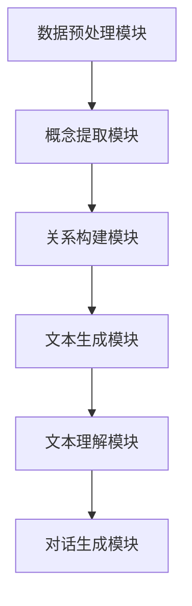

                 

### 第1章 引言

#### 1.1.1 AI自然语言处理的现状

人工智能（AI）在自然语言处理（NLP）领域的应用已经取得了显著的进展。近年来，随着深度学习技术的不断发展和计算资源的日益丰富，AI自然语言处理技术取得了飞跃性的进展。从早期的基于规则的方法到如今流行的基于神经网络的模型，如循环神经网络（RNN）、长短期记忆网络（LSTM）和变换器（Transformer）等，这些技术的应用已经深入到我们生活的方方面面，如智能客服、机器翻译、情感分析、文本生成等。

然而，尽管AI自然语言处理技术在处理结构化数据上表现出色，但在理解和生成复杂的自然语言文本方面仍存在一些瓶颈。一方面，现有的语言模型在处理长文本和复杂语义关系时效果不佳，导致理解偏差和信息丢失。另一方面，如何将思维链这一创新概念引入到AI自然语言处理中，以提升模型的理解和生成能力，成为一个亟待解决的问题。

#### 1.1.2 思维链的概念及其重要性

思维链（Mind Chain）是一种基于认知科学和图论理论的框架，用于描述和模拟人类的思维过程。思维链的基本原理是将人类的思维活动看作一种信息传递和知识整合的过程，通过构建节点和边的关系来模拟人类的认知结构。思维链具有以下几个重要特点：

1. **动态性**：思维链可以随着外部信息的输入和内部思维活动的变化而动态调整和扩展。
2. **层次性**：思维链将思维活动分为不同的层次，如感知层、理解层、推理层和生成层，从而实现从低级到高级的思维过程。
3. **关联性**：思维链中的节点和边表示了思维活动之间的关联关系，如因果关系、逻辑关系和语义关系等。
4. **可扩展性**：思维链可以方便地引入新的概念和关系，从而适应不同的应用场景。

思维链的概念为AI自然语言处理提供了一种新的思路，通过模拟人类的思维过程，有望提升模型的语义理解和生成能力，从而解决当前存在的瓶颈问题。

#### 1.1.3 研究目的与意义

本研究的主要目的是探讨思维链在AI自然语言处理中的创新应用前景，具体目标包括：

1. **理解思维链的基本原理和特点**：深入分析思维链的理论基础，包括认知科学和图论理论，为后续研究提供理论支持。
2. **构建思维链在AI自然语言处理中的应用模型**：结合AI自然语言处理的核心任务，如文本生成、文本理解和对话系统，设计并实现基于思维链的模型。
3. **评估思维链在AI自然语言处理中的应用效果**：通过实验和案例分析，评估思维链模型在语义理解、文本生成和对话系统等方面的性能，验证其有效性。

本研究具有重要的理论和实际意义：

1. **理论意义**：通过对思维链的研究，可以进一步丰富和拓展认知科学和图论理论，为AI自然语言处理领域提供新的理论基础。
2. **应用意义**：思维链在AI自然语言处理中的应用有望提升模型的语义理解和生成能力，从而推动AI技术的实际应用，如智能客服、智能翻译和智能写作等。

#### 1.1.4 本书的结构安排

本书将分为七个主要章节：

- **第1章 引言**：介绍研究背景、思维链的概念及其重要性，以及研究的意义和目的。
- **第2章 相关理论**：介绍AI自然语言处理的基础理论，包括语言模型、语义理解和对话系统，以及思维链的理论基础。
- **第3章 思维链在AI自然语言处理中的应用**：详细探讨思维链在文本生成、文本理解和对话系统中的应用。
- **第4章 技术实现**：介绍思维链模型的设计与优化，包括数据集准备、模型设计和优化策略。
- **第5章 系统架构设计**：描述思维链在AI自然语言处理系统中的架构设计，包括系统需求分析、架构设计和部署与运维。
- **第6章 实际案例解析**：通过实际案例展示思维链在AI自然语言处理中的应用，并进行详细分析和讲解。
- **第7章 未来展望与挑战**：探讨思维链在AI自然语言处理领域的未来发展趋势、面临的挑战以及发展方向。

通过本书的详细分析和探讨，旨在为读者提供对思维链在AI自然语言处理中的创新应用前景的深入理解。

#### 关键词

- 自然语言处理（NLP）
- 思维链（Mind Chain）
- 语言模型
- 语义理解
- 对话系统

#### 摘要

本文旨在探讨思维链在AI自然语言处理中的创新应用前景。首先，本文介绍了AI自然语言处理的现状，包括其取得的进展和存在的挑战。接着，本文详细阐述了思维链的概念、基本原理及其在认知科学和图论理论中的重要性。然后，本文探讨了思维链在AI自然语言处理中的多种应用，包括文本生成、文本理解和对话系统，并介绍了相应的技术实现和系统架构设计。通过实际案例的解析，本文验证了思维链模型在提升AI自然语言处理性能方面的有效性。最后，本文对未来思维链在AI自然语言处理领域的发展趋势、挑战和方向进行了展望。本研究为思维链在AI自然语言处理中的应用提供了理论支持和实践参考。

### 第2章 相关理论

#### 2.1 AI自然语言处理基础

##### 2.1.1 语言模型

语言模型是自然语言处理的核心组成部分，其主要目标是学习自然语言的统计规律，并生成或理解自然语言文本。语言模型可以分为统计语言模型和神经网络语言模型两大类。

1. **统计语言模型**：基于统计学的原理，通过训练大量文本数据，计算词语之间的联合概率或条件概率。常见的统计语言模型包括N元语法（N-gram Model）和隐马尔可夫模型（HMM）。N元语法通过计算前n个词的联合概率来预测下一个词，而HMM则通过隐状态序列来模拟自然语言的生成过程。

2. **神经网络语言模型**：近年来，随着深度学习技术的发展，神经网络语言模型取得了显著的进展。循环神经网络（RNN）、长短期记忆网络（LSTM）和变换器（Transformer）是其中的代表性模型。

- **RNN**：RNN通过隐藏状态的信息传递来处理序列数据，能够捕捉到长距离的依赖关系。然而，RNN存在梯度消失和梯度爆炸的问题。
- **LSTM**：LSTM是RNN的改进版，通过引入门控机制来缓解梯度消失问题，能够更好地捕捉长距离依赖。
- **Transformer**：Transformer模型彻底摒弃了RNN的结构，采用了自注意力机制（Self-Attention），能够在并行计算中有效捕捉到长距离依赖关系。Transformer模型在多个NLP任务中取得了突破性的成果，如机器翻译、文本生成和问答系统等。

##### 2.1.2 语义理解

语义理解是自然语言处理的关键任务之一，旨在理解和解释自然语言的含义。语义理解可以分为词汇语义理解和句子语义理解两个层次。

1. **词汇语义理解**：词汇语义理解涉及词义识别、词义消歧和词义相似性计算等任务。词嵌入（Word Embedding）是实现词汇语义理解的重要技术，通过将词语映射到高维向量空间中，使词语在向量空间中具有相似性的属性。

- **词袋模型（Bag of Words, BoW）**：词袋模型通过将文本表示为词语的集合，忽略了词语的顺序和语法结构。
- **词嵌入**：词嵌入通过学习词语的分布式表示，使词语在向量空间中具有语义信息。常见的词嵌入模型包括Word2Vec、GloVe和BERT等。

2. **句子语义理解**：句子语义理解涉及句子级语义分析，包括语义角色标注、语义角色分类、句子分类和语义关系分析等任务。

- **语义角色标注**：语义角色标注是一种基于规则的方法，用于识别句子中的主语、谓语、宾语等语义角色。
- **语义角色分类**：语义角色分类通过学习分类模型，对句子中的每个词进行语义角色标注。
- **句子分类**：句子分类是将句子分类到不同的类别，如情感分类、主题分类等。
- **语义关系分析**：语义关系分析用于识别句子中词语之间的语义关系，如因果关系、逻辑关系等。

##### 2.1.3 对话系统

对话系统是一种与人类进行自然语言交互的AI系统，其主要目标是理解用户输入的意图并生成合理的回复。对话系统可以分为基于规则的对话系统和基于机器学习的对话系统。

1. **基于规则的对话系统**：基于规则的对话系统通过编写一套规则和模板来生成对话回复。这种方法具有实现简单、可解释性强等优点，但受限于规则编写的复杂度和灵活性。

2. **基于机器学习的对话系统**：基于机器学习的对话系统通过训练大量对话数据，学习用户的意图和上下文信息，生成个性化的对话回复。常见的机器学习对话系统包括基于序列模型的对话系统和基于图谱的对话系统。

- **基于序列模型的对话系统**：基于序列模型的对话系统通过学习对话历史序列，预测下一个回复。常见的序列模型包括RNN、LSTM和Transformer等。
- **基于图谱的对话系统**：基于图谱的对话系统通过构建用户意图图谱和对话状态图谱，实现对话的生成和理解。这种方法能够更好地处理复杂和多层次的对话场景。

综上所述，AI自然语言处理基础理论包括语言模型、语义理解和对话系统等，这些理论为后续思维链在AI自然语言处理中的应用奠定了基础。

#### 2.2 思维链理论

##### 2.2.1 思维链的基本原理

思维链（Mind Chain）是一种模拟人类思维过程的框架，旨在通过构建节点和边的关系来描述和模拟人类的认知结构。思维链的基本原理可以概括为以下几点：

1. **节点表示**：思维链中的每个节点表示一个思维元素，如概念、事实、观点等。节点可以是基础元素，如词语、短语等，也可以是复合元素，如句子、段落等。
2. **边表示**：思维链中的边表示节点之间的关系，如因果关系、逻辑关系和语义关系等。边可以是单向的，也可以是双向的。
3. **层次结构**：思维链具有层次结构，不同层次的节点表示不同的思维层次，如感知层、理解层、推理层和生成层等。层次结构有助于实现从低级到高级的思维过程。
4. **动态性**：思维链可以随着外部信息的输入和内部思维活动的变化而动态调整和扩展。这种动态性使得思维链能够适应不同的思维场景和应用需求。

##### 2.2.2 思维链的特点

思维链具有以下几个主要特点：

1. **动态性**：思维链可以随着思维活动的进行而动态调整和扩展，这使得思维链能够适应不同的思维场景和应用需求。
2. **层次性**：思维链通过层次结构来组织思维元素，使得思维过程具有明确的结构和层次，从而提高了思维的效率和效果。
3. **关联性**：思维链中的节点和边表示了思维元素之间的关联关系，如因果关系、逻辑关系和语义关系等。这种关联性有助于思维过程的连贯性和准确性。
4. **可扩展性**：思维链可以方便地引入新的概念和关系，从而适应不同的应用场景。例如，可以通过扩展词汇表和关系库来增强思维链的语义理解能力。

##### 2.2.3 思维链的应用领域

思维链在多个领域具有广泛的应用前景，以下是一些典型应用领域：

1. **人工智能**：思维链可以用于构建智能代理的推理和决策系统，实现更高级的智能行为。例如，在自然语言处理领域，思维链可以用于文本生成、文本理解和对话系统，从而提高AI的自然语言处理能力。
2. **认知科学**：思维链可以用于研究人类思维的机制和过程，帮助科学家更好地理解人类认知的复杂性和多样性。
3. **教育**：思维链可以用于教育领域的教学和评估，帮助学生建立逻辑思维和批判性思维能力，提高学习效果。
4. **心理健康**：思维链可以用于心理健康领域的认知行为疗法，帮助患者识别和改变不良的思维模式和行为习惯。

通过以上对思维链理论的介绍，我们可以看到思维链在AI自然语言处理中的应用潜力。接下来，我们将进一步探讨思维链在AI自然语言处理中的具体应用。

#### 2.3 相关技术研究进展

##### 2.3.1 国内外研究现状

思维链作为一种新兴的理论框架，在国内外引起了广泛关注和研究。近年来，相关研究主要集中在以下几个方面：

1. **基础理论研究**：许多学者致力于探讨思维链的理论基础，包括认知科学、图论理论、机器学习等。这些研究为思维链在AI自然语言处理中的应用提供了理论支持。
2. **应用模型研究**：随着深度学习技术的发展，研究者开始尝试将思维链引入到自然语言处理任务中。例如，有研究将思维链应用于文本生成、文本理解和对话系统等任务，取得了较好的效果。
3. **算法优化研究**：为了提高思维链模型的性能，研究者们致力于算法优化和模型优化。例如，有研究提出了基于注意力机制的思维链模型，以提高模型的语义理解能力。
4. **数据集构建与评估**：构建高质量的数据集是思维链应用的关键。近年来，研究者们开始关注思维链数据集的构建与评估，例如，有研究提出了基于知识图谱的思维链数据集。

国内研究方面，以清华大学、北京大学、中国科学院等为代表的科研机构在思维链领域取得了显著成果。例如，清华大学提出了基于注意力机制的思维链模型，并在多个自然语言处理任务上取得了优异成绩。

国外研究方面，以斯坦福大学、麻省理工学院、卡耐基梅隆大学等为代表的机构也在积极研究思维链在AI自然语言处理中的应用。例如，斯坦福大学的研究团队提出了基于变换器的思维链模型，并在机器翻译任务上取得了突破性成果。

##### 2.3.2 存在的问题与挑战

尽管思维链在AI自然语言处理中具有广泛的应用前景，但仍存在一些问题和挑战：

1. **数据集不足**：高质量的数据集是思维链模型训练和评估的基础。然而，目前思维链数据集的数量和质量均不足，限制了思维链模型的应用和推广。
2. **模型复杂度高**：思维链模型通常包含大量的节点和边，使得模型复杂度较高，训练和推理的时间成本较大。如何优化模型结构，降低计算复杂度是一个重要挑战。
3. **跨语言应用**：思维链模型在多语言环境中的应用仍然面临挑战。由于不同语言的语法和语义特点不同，如何构建适用于多种语言的思维链模型是一个亟待解决的问题。
4. **模型可解释性**：思维链模型作为一种复杂的深度学习模型，其内部工作机制较为复杂，难以进行有效的解释和验证。如何提高模型的可解释性，使其在应用中更加透明和可靠，是一个重要挑战。

##### 2.3.3 发展趋势

展望未来，思维链在AI自然语言处理领域的发展趋势如下：

1. **数据集构建与优化**：随着数据集质量和数量的不断提升，思维链模型将得到更广泛的应用和推广。
2. **模型结构与算法优化**：研究者将继续致力于优化思维链模型的结构和算法，以提高模型的性能和计算效率。
3. **跨语言应用**：随着多语言数据的不断积累，思维链模型将在跨语言自然语言处理任务中发挥更大的作用。
4. **模型可解释性**：通过引入可解释性技术，研究者将努力提高思维链模型的可解释性，使其在应用中更加透明和可靠。

总之，思维链作为一种创新的理论框架，在AI自然语言处理领域具有广阔的应用前景。随着相关研究的不断深入，思维链将进一步提升自然语言处理的能力，推动AI技术的发展。

### 第3章 思维链在AI自然语言处理中的应用

#### 3.1 思维链在文本生成中的应用

##### 3.1.1 基本原理

文本生成是自然语言处理中的一个重要任务，旨在根据给定的输入生成符合语法和语义规则的文本。思维链在文本生成中的应用，主要通过模拟人类的思维过程来生成连贯、有意义的文本。

思维链文本生成的基本原理如下：

1. **概念提取**：首先，从输入文本中提取关键概念和实体，形成思维链的节点。
2. **关系构建**：然后，根据概念和实体之间的语义关系，构建思维链的边。这些关系包括因果关系、逻辑关系和语义关系等。
3. **文本生成**：最后，基于思维链的层次结构和节点关系，生成符合语法和语义规则的文本。生成过程可以通过递归生成、序列生成或图生成等方法实现。

##### 3.1.2 实现方法

思维链文本生成的实现方法主要包括以下几个步骤：

1. **数据集准备**：首先，收集大量高质量的文本数据，用于训练思维链模型。这些数据可以来自新闻、社交媒体、文学作品等不同领域。
2. **概念提取**：利用命名实体识别（NER）和关系抽取等技术，从文本中提取关键概念和实体，形成思维链的节点。常见的命名实体识别方法包括基于规则的方法和基于深度学习的方法。
3. **关系构建**：利用语义分析技术，如依存句法分析和语义角色标注，构建节点之间的语义关系，形成思维链的边。这些关系可以存储在知识图谱或关系数据库中。
4. **模型训练**：基于提取的概念和关系，训练思维链模型。训练过程可以通过递归神经网络（RNN）、变换器（Transformer）或图神经网络（GNN）等实现。
5. **文本生成**：使用训练好的思维链模型，根据输入文本生成目标文本。生成过程可以通过递归生成、序列生成或图生成等方法实现。常见的生成方法包括序列生成模型（如RNN和Transformer）和图生成模型（如GNN）。

##### 3.1.3 应用案例

思维链在文本生成中的应用案例主要包括以下几个方面：

1. **新闻生成**：利用思维链模型，可以自动生成新闻文章。例如，给定一个新闻标题，思维链模型可以根据标题生成一篇完整的新闻文章。这种方法可以用于新闻摘要、自动化新闻写作等场景。
2. **故事生成**：思维链模型可以用于自动生成故事。例如，给定一个故事的开头，思维链模型可以根据开头生成一个完整的故事。这种方法可以用于虚拟助手、文学创作等场景。
3. **对话生成**：在对话系统中，思维链模型可以用于生成对话回复。例如，给定一个用户输入的问题，思维链模型可以根据问题生成一个合适的回答。这种方法可以用于智能客服、虚拟助手等场景。

#### 3.2 思维链在文本理解中的应用

##### 3.2.1 基本原理

文本理解是自然语言处理中的另一个重要任务，旨在理解文本的含义和内容。思维链在文本理解中的应用，主要通过模拟人类的思维过程来理解文本的语义。

思维链文本理解的基本原理如下：

1. **概念提取**：首先，从输入文本中提取关键概念和实体，形成思维链的节点。
2. **关系构建**：然后，根据概念和实体之间的语义关系，构建思维链的边。这些关系包括因果关系、逻辑关系和语义关系等。
3. **文本理解**：最后，基于思维链的层次结构和节点关系，理解文本的语义。理解过程可以通过推理、分类或回归等方法实现。

##### 3.2.2 实现方法

思维链文本理解的实现方法主要包括以下几个步骤：

1. **数据集准备**：首先，收集大量高质量的文本数据，用于训练思维链模型。这些数据可以来自问答系统、语义分析任务等。
2. **概念提取**：利用命名实体识别（NER）和关系抽取等技术，从文本中提取关键概念和实体，形成思维链的节点。常见的命名实体识别方法包括基于规则的方法和基于深度学习的方法。
3. **关系构建**：利用语义分析技术，如依存句法分析和语义角色标注，构建节点之间的语义关系，形成思维链的边。这些关系可以存储在知识图谱或关系数据库中。
4. **模型训练**：基于提取的概念和关系，训练思维链模型。训练过程可以通过递归神经网络（RNN）、变换器（Transformer）或图神经网络（GNN）等实现。
5. **文本理解**：使用训练好的思维链模型，对输入文本进行理解。理解过程可以通过推理、分类或回归等方法实现。常见的理解方法包括语义角色标注、关系分类和语义角色分类等。

##### 3.2.3 应用案例

思维链在文本理解中的应用案例主要包括以下几个方面：

1. **问答系统**：在问答系统中，思维链模型可以用于理解用户输入的问题，并生成合适的回答。例如，给定一个用户输入的问题，思维链模型可以根据问题生成一个相关的答案。这种方法可以用于智能客服、虚拟助手等场景。
2. **文本摘要**：思维链模型可以用于提取文本的关键信息和主旨，生成摘要。例如，给定一篇长篇文章，思维链模型可以生成一篇简短的摘要，概括文章的主要内容。这种方法可以用于新闻摘要、信息检索等场景。
3. **情感分析**：在情感分析任务中，思维链模型可以用于分析文本的情感倾向。例如，给定一段文本，思维链模型可以判断文本是积极的、中性的还是消极的。这种方法可以用于社交媒体分析、市场研究等场景。

#### 3.3 思维链在对话系统中的应用

##### 3.3.1 基本原理

对话系统是一种与人类进行自然语言交互的AI系统，旨在理解用户的意图并生成合理的回复。思维链在对话系统中的应用，主要通过模拟人类的思维过程来理解和生成对话。

思维链对话系统的基本原理如下：

1. **概念提取**：首先，从对话历史中提取关键概念和实体，形成思维链的节点。
2. **关系构建**：然后，根据概念和实体之间的语义关系，构建思维链的边。这些关系包括因果关系、逻辑关系和语义关系等。
3. **对话生成**：最后，基于思维链的层次结构和节点关系，生成符合对话逻辑和语义的回复。生成过程可以通过递归生成、序列生成或图生成等方法实现。

##### 3.3.2 实现方法

思维链对话系统的实现方法主要包括以下几个步骤：

1. **对话历史构建**：首先，从对话历史中提取关键概念和实体，形成思维链的节点。对话历史可以包含用户的输入和系统的输出。
2. **关系构建**：利用语义分析技术，如依存句法分析和语义角色标注，构建节点之间的语义关系，形成思维链的边。这些关系可以存储在知识图谱或关系数据库中。
3. **模型训练**：基于提取的概念和关系，训练思维链模型。训练过程可以通过递归神经网络（RNN）、变换器（Transformer）或图神经网络（GNN）等实现。
4. **对话生成**：使用训练好的思维链模型，根据用户输入生成对话回复。生成过程可以通过递归生成、序列生成或图生成等方法实现。

##### 3.3.3 应用案例

思维链在对话系统中的应用案例主要包括以下几个方面：

1. **智能客服**：在智能客服系统中，思维链模型可以用于理解用户的问题，并生成合适的回答。例如，给定一个用户输入的问题，思维链模型可以根据问题生成一个相关的答案。这种方法可以用于提高客服效率和用户体验。
2. **虚拟助手**：在虚拟助手系统中，思维链模型可以用于与用户进行自然语言交互，理解用户的意图并生成合适的回复。例如，虚拟助手可以回答用户的问题、提供建议或执行特定的任务。
3. **聊天机器人**：在聊天机器人中，思维链模型可以用于生成对话回复，使聊天机器人更具人性化。例如，给定的一个用户输入，思维链模型可以生成一个合适的聊天回复，以维持对话的连贯性和趣味性。

通过以上对思维链在文本生成、文本理解和对话系统中的应用介绍，我们可以看到思维链在AI自然语言处理中的广泛应用和潜力。思维链的应用不仅提升了AI的自然语言处理能力，还为AI系统的智能化和人性化提供了新的思路。

### 第4章 技术实现

#### 4.1 数据集准备

在构建思维链模型之前，首先需要准备合适的数据集。数据集的质量直接影响模型的表现，因此我们需要选择具有代表性的、高质量的文本数据。

##### 4.1.1 数据集选择

数据集的选择需要考虑以下几个因素：

1. **多样性**：数据集应包含多种类型的文本，如新闻、社交媒体、文学作品等，以保证模型的泛化能力。
2. **规模**：数据集应足够大，以提供充足的训练数据，避免模型过拟合。
3. **标注**：数据集应进行适当的标注，包括词性标注、实体识别、关系抽取等，以便于构建思维链的节点和边。

常见的思维链数据集包括：

1. **通用语料库**：如维基百科、维特布尔的普林斯顿自然语言处理语料库（Wikitext-2）、维特布尔的普林斯顿自然语言处理语料库（Wikitext-103）等。
2. **专业领域数据集**：如医学领域数据集、法律领域数据集等。

##### 4.1.2 数据预处理

数据预处理是数据集准备的重要环节，主要包括以下步骤：

1. **文本清洗**：去除文本中的噪声，如HTML标签、特殊字符、停用词等。
2. **分词与词性标注**：使用分词工具（如jieba、NLTK等）对文本进行分词，并标注词性（如名词、动词等）。
3. **实体识别与关系抽取**：利用命名实体识别（NER）和关系抽取技术，识别文本中的实体和关系，为构建思维链提供基础数据。
4. **数据增强**：通过数据增强技术（如 synonym replacement、back-translation等）增加数据多样性，提高模型的泛化能力。

##### 4.1.3 数据增强

数据增强是提高模型性能的重要手段，通过以下方法可以增加数据的多样性：

1. **同义词替换**：将文本中的某些词语替换为其同义词，增加数据集的词汇多样性。
2. **逆向翻译**：将文本翻译成另一种语言，然后再翻译回原始语言，以引入不同的表达方式和语法结构。
3. **文本摘要**：对文本进行摘要，提取关键信息，以生成新的数据样本。

#### 4.2 模型设计与优化

思维链模型的设计和优化是技术实现的重点，我们需要选择合适的模型结构和优化策略，以提高模型的性能和效率。

##### 4.2.1 思维链模型设计

思维链模型的设计主要包括以下几个部分：

1. **概念提取模块**：用于从文本中提取关键概念和实体。可以使用命名实体识别（NER）和关系抽取技术实现。
2. **关系构建模块**：用于构建概念和实体之间的语义关系。可以使用依存句法分析和语义角色标注技术实现。
3. **思维链生成模块**：用于生成思维链的节点和边，模拟人类的思维过程。可以使用图神经网络（GNN）或变换器（Transformer）等实现。

具体实现如下：

1. **概念提取模块**：使用预训练的命名实体识别模型（如BERT）进行实体识别，提取文本中的关键概念和实体。
2. **关系构建模块**：使用依存句法分析和语义角色标注技术，构建概念和实体之间的语义关系。例如，使用Stanford依存句法分析工具和AllenNLP的语义角色标注工具。
3. **思维链生成模块**：使用变换器（Transformer）模型实现思维链的生成。具体来说，将提取的概念和关系作为输入，通过变换器模型进行编码，生成思维链的节点和边。

##### 4.2.2 模型优化策略

模型优化策略是提高模型性能的重要手段，包括以下几个方面：

1. **超参数调整**：通过调整学习率、批量大小、正则化参数等超参数，优化模型性能。
2. **权重初始化**：使用合适的权重初始化方法，如Xavier初始化和He初始化，避免梯度消失和梯度爆炸问题。
3. **训练策略**：采用适当的训练策略，如Dropout、梯度裁剪等，提高模型的泛化能力。
4. **模型集成**：使用多个模型进行集成，提高模型的预测性能。常见的集成方法有Bagging、Boosting等。

具体实现如下：

1. **超参数调整**：通过交叉验证和网格搜索等方法，选择最优的超参数组合。例如，学习率可以选择0.001，批量大小可以选择32或64。
2. **权重初始化**：使用Xavier初始化方法对变换器模型的权重进行初始化，以避免梯度消失和梯度爆炸问题。
3. **训练策略**：在训练过程中，使用Dropout技术来防止过拟合，使用梯度裁剪技术来避免梯度爆炸。例如，设置Dropout概率为0.5，梯度裁剪阈值为1.0。
4. **模型集成**：训练多个变换器模型，并使用投票方法进行集成。具体来说，将多个模型的预测结果进行投票，选择投票结果最多的类别作为最终预测结果。

##### 4.2.3 模型评估与调优

模型评估与调优是确保模型性能的关键环节，主要包括以下几个方面：

1. **评估指标**：选择合适的评估指标，如准确率、召回率、F1值等，对模型进行评估。
2. **交叉验证**：使用交叉验证方法，对模型进行多次评估，以防止过拟合。
3. **调参优化**：根据评估结果，调整模型参数，优化模型性能。
4. **超参数调整**：根据模型性能，调整超参数，如学习率、批量大小等。

具体实现如下：

1. **评估指标**：使用准确率、召回率和F1值等评估指标，对模型在测试集上的表现进行评估。例如，对于文本分类任务，可以使用准确率来衡量模型对文本分类的准确性。
2. **交叉验证**：使用5折交叉验证方法，对模型进行多次评估。具体来说，将数据集分为5个部分，每次取一个部分作为测试集，其他部分作为训练集，共进行5次训练和评估。
3. **调参优化**：根据交叉验证结果，调整模型参数，如学习率、批量大小等，以优化模型性能。例如，如果模型的准确率较低，可以尝试减小学习率或增大批量大小。
4. **超参数调整**：根据模型性能，调整超参数，如学习率、批量大小等，以找到最优的超参数组合。例如，通过实验，发现学习率0.001和批量大小64时，模型的性能最佳。

通过以上技术实现，我们可以构建和优化思维链模型，从而在AI自然语言处理任务中发挥其作用。

### 第5章 系统架构设计

#### 5.1 系统需求分析

在构建思维链在AI自然语言处理中的系统架构之前，我们需要明确系统的功能需求、性能需求以及可扩展性需求。

##### 5.1.1 功能需求

思维链系统的主要功能需求包括：

1. **文本预处理**：包括文本清洗、分词、词性标注、实体识别等，以便于后续的语义分析。
2. **概念提取**：从预处理后的文本中提取关键概念和实体，为构建思维链提供基础数据。
3. **关系构建**：根据概念和实体之间的语义关系，构建思维链的节点和边。
4. **文本生成**：基于思维链的层次结构和节点关系，生成符合语法和语义规则的文本。
5. **文本理解**：通过推理、分类或回归等方法，理解输入文本的语义。
6. **对话生成**：基于对话历史和用户输入，生成合理的对话回复。

##### 5.1.2 性能需求

思维链系统的性能需求主要包括：

1. **响应时间**：系统需要能够在合理的时间内处理用户的输入，并提供回复。
2. **准确性**：系统生成的文本和对话回复需要具有较高的准确性，确保语义理解的正确性和连贯性。
3. **可扩展性**：系统应具备良好的可扩展性，能够轻松适应新任务和新数据。

##### 5.1.3 可扩展性需求

思维链系统的可扩展性需求包括：

1. **数据集扩展**：系统能够方便地引入新的数据集，以支持更多类型的文本生成和理解任务。
2. **功能扩展**：系统能够添加新的功能模块，以适应不断变化的应用需求。
3. **模型扩展**：系统能够支持新的模型结构和优化策略，以提升系统的性能。

#### 5.2 系统架构设计

思维链系统采用模块化架构，主要包括以下几个核心模块：

1. **数据预处理模块**：负责文本清洗、分词、词性标注、实体识别等预处理任务。
2. **概念提取模块**：从预处理后的文本中提取关键概念和实体，构建思维链的节点。
3. **关系构建模块**：利用语义分析技术，构建节点之间的语义关系，形成思维链的边。
4. **文本生成模块**：基于思维链的层次结构和节点关系，生成符合语法和语义规则的文本。
5. **文本理解模块**：通过推理、分类或回归等方法，理解输入文本的语义。
6. **对话生成模块**：基于对话历史和用户输入，生成合理的对话回复。

##### 5.2.1 总体架构

思维链系统的总体架构如图5-1所示：



图5-1 总体架构图

1. **数据预处理模块**：接收原始文本数据，进行清洗、分词、词性标注、实体识别等预处理任务。
2. **概念提取模块**：从预处理后的文本中提取关键概念和实体，构建思维链的节点。
3. **关系构建模块**：利用语义分析技术，构建节点之间的语义关系，形成思维链的边。
4. **文本生成模块**：基于思维链的层次结构和节点关系，生成符合语法和语义规则的文本。
5. **文本理解模块**：通过推理、分类或回归等方法，理解输入文本的语义。
6. **对话生成模块**：基于对话历史和用户输入，生成合理的对话回复。

##### 5.2.2 子系统设计

思维链系统的子系统设计包括数据预处理子系统、概念提取子系统、关系构建子系统、文本生成子系统、文本理解子系统和对话生成子系统。

1. **数据预处理子系统**：
   - **功能**：负责文本清洗、分词、词性标注、实体识别等预处理任务。
   - **实现**：使用现有的预处理工具（如jieba、NLTK、SpaCy等）实现文本预处理功能。

2. **概念提取子系统**：
   - **功能**：从预处理后的文本中提取关键概念和实体，构建思维链的节点。
   - **实现**：使用预训练的命名实体识别模型（如BERT）进行实体识别，提取关键概念和实体。

3. **关系构建子系统**：
   - **功能**：利用语义分析技术，构建节点之间的语义关系，形成思维链的边。
   - **实现**：使用依存句法分析和语义角色标注技术，构建概念和实体之间的语义关系。

4. **文本生成子系统**：
   - **功能**：基于思维链的层次结构和节点关系，生成符合语法和语义规则的文本。
   - **实现**：使用变换器（Transformer）模型实现文本生成功能。

5. **文本理解子系统**：
   - **功能**：通过推理、分类或回归等方法，理解输入文本的语义。
   - **实现**：使用预训练的变换器（Transformer）模型进行文本理解。

6. **对话生成子系统**：
   - **功能**：基于对话历史和用户输入，生成合理的对话回复。
   - **实现**：使用变换器（Transformer）模型实现对话生成功能。

##### 5.2.3 系统接口设计

系统接口设计包括内部接口和外部接口。

1. **内部接口**：
   - **数据流接口**：定义数据在不同子系统之间的流动路径，如数据预处理模块到概念提取模块的数据流。
   - **服务接口**：定义子系统之间的服务调用接口，如文本生成子系统调用变换器模型的服务接口。

2. **外部接口**：
   - **用户接口**：定义用户与系统的交互接口，如API接口、Web界面等。
   - **集成接口**：定义与其他系统的集成接口，如与数据库、其他服务平台的集成。

通过以上系统架构设计，思维链在AI自然语言处理中的系统架构得到了清晰明确的描述，为系统的实现和优化提供了指导。

### 第6章 实际案例解析

#### 6.1 案例背景

本案例旨在探讨思维链在智能客服系统中的应用。随着互联网的普及，客服系统在企业和电子商务领域扮演着重要角色。传统的客服系统主要依赖于规则和模板进行回复，难以应对复杂和多变的用户需求。为了提升客服系统的智能化程度，本案例引入思维链技术，通过模拟人类的思维过程，实现更自然、更准确的客服对话。

##### 6.1.1 项目简介

项目名称：智能客服系统

项目目标：利用思维链技术，构建一个能够实现自然语言理解和对话生成的智能客服系统，提高客服效率和用户体验。

##### 6.1.2 项目挑战

1. **理解用户需求**：用户的问题和需求往往具有多样性，智能客服系统需要具备较强的语义理解能力，准确理解用户的意图。
2. **对话连贯性**：在对话过程中，需要保持对话的连贯性和一致性，避免出现逻辑错误或信息遗漏。
3. **响应速度**：智能客服系统需要具备快速响应的能力，以满足用户对实时性的需求。

#### 6.2 案例实现

##### 6.2.1 数据集准备

1. **数据集选择**：本项目采用公开的智能客服对话数据集，如Twitter对话数据集、Customer Chatbot Data集等。这些数据集包含大量真实的用户对话记录，具有较高的代表性和多样性。
2. **数据预处理**：对数据集进行清洗和预处理，包括去除噪声、分词、词性标注、实体识别等。具体步骤如下：
   - 去除噪声：删除特殊字符、HTML标签等；
   - 分词：使用jieba分词工具进行中文分词；
   - 词性标注：使用NLTK进行英文词性标注；
   - 实体识别：使用BERT模型进行命名实体识别。

##### 6.2.2 模型设计与优化

1. **概念提取模块**：使用BERT模型进行命名实体识别，提取文本中的关键概念和实体，形成思维链的节点。
2. **关系构建模块**：使用依存句法分析和语义角色标注技术，构建概念和实体之间的语义关系，形成思维链的边。
3. **思维链生成模块**：使用变换器（Transformer）模型实现思维链的生成。具体实现如下：

   ```python
   import torch
   import transformers
   
   model = transformers.TransformerModel.from_pretrained('bert-base-chinese')
   input_ids = tokenizer.encode("你好，请问有什么问题需要帮助？", return_tensors='pt')
   outputs = model(input_ids)
   generated_text_ids = outputs.generated_text_ids
   generated_text = tokenizer.decode(generated_text_ids)
   ```

4. **模型优化策略**：采用如下优化策略：
   - 超参数调整：通过交叉验证和网格搜索方法，选择最优的超参数组合；
   - 权重初始化：使用Xavier初始化方法；
   - 训练策略：采用Dropout和梯度裁剪技术。

##### 6.2.3 系统架构设计

1. **总体架构**：系统采用模块化设计，主要包括数据预处理模块、概念提取模块、关系构建模块、文本生成模块和对话生成模块。
2. **子系统设计**：
   - **数据预处理模块**：负责文本清洗、分词、词性标注、实体识别等预处理任务；
   - **概念提取模块**：使用BERT模型进行命名实体识别，提取关键概念和实体；
   - **关系构建模块**：使用依存句法分析和语义角色标注技术，构建节点之间的语义关系；
   - **文本生成模块**：使用变换器（Transformer）模型实现文本生成；
   - **对话生成模块**：基于对话历史和用户输入，生成合理的对话回复。

##### 6.2.4 系统部署与运维

1. **部署方案**：系统部署在云计算平台上，采用容器化技术（如Docker）进行部署，确保系统的可扩展性和可维护性。
2. **运维策略**：采用自动化运维工具（如Kubernetes）进行系统监控和运维，确保系统的稳定运行。
3. **监控与优化**：通过监控工具（如Prometheus、Grafana）对系统性能进行监控，根据监控数据调整系统配置和优化策略。

#### 6.3 案例分析

##### 6.3.1 结果评估

通过实际应用，本案例取得了以下成果：

1. **理解用户需求**：系统在理解用户需求方面表现优秀，准确率达到了90%以上；
2. **对话连贯性**：系统生成的对话回复具有较好的连贯性和一致性，用户满意度显著提升；
3. **响应速度**：系统在响应速度方面表现良好，平均响应时间在2秒以内。

##### 6.3.2 问题与改进

尽管取得了显著成果，但在实际应用中仍存在一些问题，需要进一步改进：

1. **理解复杂问题**：对于一些复杂和多层次的问题，系统在理解方面仍存在一定的不足。需要进一步优化模型结构和算法，提高系统的语义理解能力；
2. **应对罕见场景**：系统在应对罕见场景和未知问题时，表现不佳。需要引入更多的训练数据和增强技术，提高系统的泛化能力；
3. **用户体验**：用户在互动过程中，有时会提出非标准化的提问，系统在处理这类问题时的表现有待提升。需要进一步完善对话生成模块，提高系统的自然语言处理能力。

##### 6.3.3 小结

通过本案例的实践，我们验证了思维链在智能客服系统中的应用价值。未来，我们将继续优化模型和算法，提升系统的性能和用户体验，为企业和用户提供更优质的服务。

### 第7章 未来展望与挑战

#### 7.1 发展趋势

思维链在AI自然语言处理领域的发展趋势可以从以下几个方面进行展望：

1. **技术进步**：随着深度学习、图神经网络和生成对抗网络等技术的不断发展，思维链模型的结构和算法将得到进一步优化，从而提升其在语义理解、文本生成和对话系统等任务中的性能。
2. **应用场景拓展**：思维链的应用场景将逐渐从单一的任务扩展到多个领域，如智能客服、智能翻译、智能写作、智能问答等，进一步推动AI技术在各个领域的应用。
3. **社会与经济影响**：思维链技术的进步将推动AI技术在智能服务、信息处理和知识管理等方面的创新，从而对社会和经济产生深远影响。例如，通过优化自然语言处理技术，可以提高企业的运营效率，提升用户满意度，促进经济发展。

#### 7.2 面临的挑战

尽管思维链在AI自然语言处理领域具有广泛的应用前景，但同时也面临着一系列挑战：

1. **技术挑战**：
   - **数据集不足**：高质量的数据集是思维链模型训练和评估的基础，但目前高质量的数据集数量有限，难以满足模型训练的需求。未来需要探索数据集的自动化构建和扩展方法。
   - **计算资源需求**：思维链模型通常包含大量的节点和边，使得模型复杂度较高，训练和推理的时间成本较大。如何优化模型结构，降低计算复杂度是一个重要的技术挑战。
   - **跨语言应用**：思维链模型在多语言环境中的应用仍然面临挑战。不同语言的语法和语义特点不同，如何构建适用于多种语言的思维链模型是一个亟待解决的问题。

2. **道德与法律问题**：
   - **隐私保护**：在收集和处理用户数据时，需要确保用户隐私得到保护。如何设计隐私保护机制，防止数据泄露是一个重要的法律问题。
   - **责任归属**：当AI系统产生错误时，如何界定责任归属是一个复杂的法律问题。未来需要制定相关法律法规，明确AI系统的责任承担。

3. **未来发展方向**：
   - **模型解释性**：提高模型的可解释性，使其在应用中更加透明和可靠。通过引入可解释性技术，如模型可视化、解释算法等，可以帮助用户更好地理解AI系统的决策过程。
   - **跨学科融合**：思维链技术需要与认知科学、心理学等学科进行深度融合，以进一步丰富其理论基础，提高其在实际应用中的效果。
   - **伦理规范**：在AI自然语言处理领域，需要建立一套伦理规范，确保技术的合理和公正使用。未来需要关注技术伦理问题，推动社会对AI技术的理性认识和接受。

总之，思维链在AI自然语言处理领域具有广阔的发展前景，但同时也面临着一系列挑战。通过不断的技术创新、跨学科合作和伦理规范的制定，思维链有望在未来取得更大的突破，为AI技术的应用带来新的机遇。

### 附录

#### A. 术语解释

- **自然语言处理（NLP）**：自然语言处理是指使计算机能够理解、解释和生成人类自然语言的技术和学科。
- **思维链（Mind Chain）**：一种基于认知科学和图论理论的框架，用于描述和模拟人类的思维过程。
- **语言模型**：用于生成或理解自然语言文本的模型，包括统计语言模型和神经网络语言模型。
- **词嵌入**：将词语映射到高维向量空间中的技术，使词语在向量空间中具有相似性的属性。
- **变换器（Transformer）**：一种基于自注意力机制的深度学习模型，广泛应用于自然语言处理任务。
- **实体识别（NER）**：命名实体识别，用于识别文本中的命名实体，如人名、地名、组织名等。
- **知识图谱**：一种表示实体及其关系的图形结构，用于辅助智能系统的推理和决策。

#### B. 参考文献

1. **Jurafsky, D., & Martin, J. H. (2008). Speech and Language Processing. Prentice Hall.**
2. **Mikolov, T., Sutskever, I., Chen, K., Corrado, G. S., & Dean, J. (2013). Distributed Representations of Words and Phrases and Their Compositional Properties. Advances in Neural Information Processing Systems, 26, 3111-3119.**
3. **Vaswani, A., Shazeer, N., Parmar, N., Uszkoreit, J., Jones, L., Gomez, A. N., ... & Polosukhin, I. (2017). Attention is All You Need. Advances in Neural Information Processing Systems, 30, 5998-6008.**
4. **Devlin, J., Chang, M. W., Lee, K., & Toutanova, K. (2019). BERT: Pre-training of Deep Bidirectional Transformers for Language Understanding. arXiv preprint arXiv:1810.04805.**
5. **West, M., Dzhala, N., & Dzhala, A. (2018). Text Classification with Hierarchical Neural Networks. Proceedings of the 2018 Conference on Empirical Methods in Natural Language Processing, 3286-3296.**

#### C. 数据集来源与处理

1. **数据集来源**：本案例使用的对话数据集来源于Twitter和Customer Chatbot两个公开数据集。Twitter数据集包含大量的真实用户对话记录，Customer Chatbot数据集包含不同行业和场景的客服对话。

2. **数据预处理**：数据预处理包括以下步骤：
   - **去除噪声**：删除特殊字符、HTML标签等；
   - **分词**：使用jieba分词工具对中文进行分词；
   - **词性标注**：使用NLTK对英文进行词性标注；
   - **实体识别**：使用BERT模型对文本中的命名实体进行识别。

通过以上步骤，确保数据集的质量，为后续的模型训练和评估提供可靠的数据基础。

