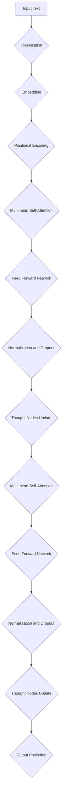
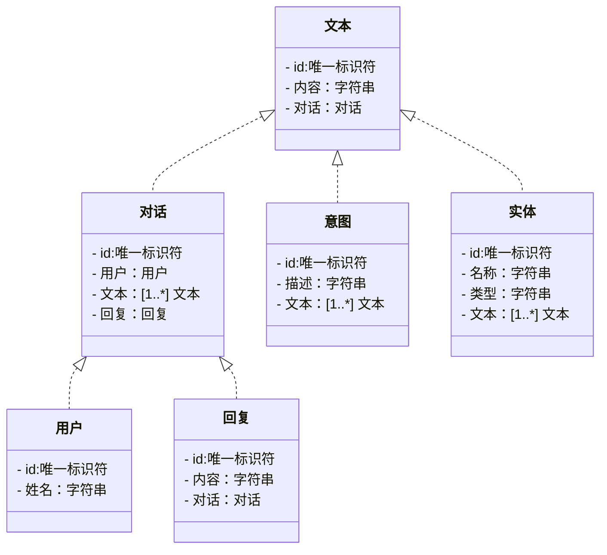
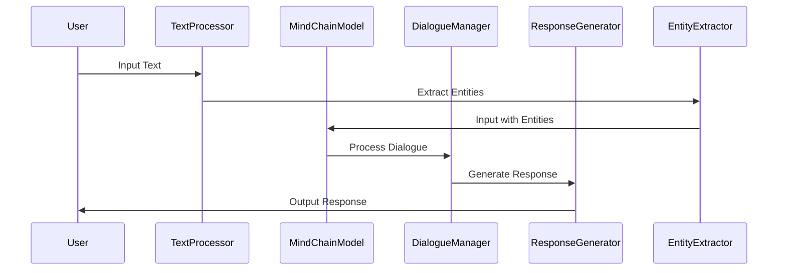
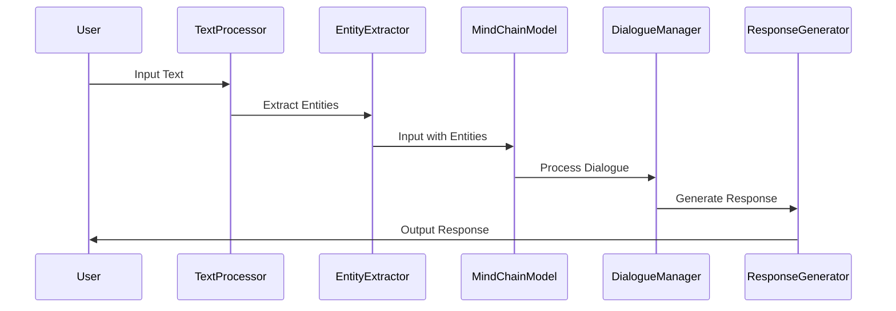

                 


## 第二部分：核心概念与联系

### 2.1 思维链模型原理

思维链（Mind Chain）模型是近年来在自然语言处理领域崭露头角的一种新型深度学习模型，它基于Transformer架构，通过引入思维链节点（Thought Nodes）和思维链交互（Thought Interaction）机制，显著提升了自然语言理解的深度和广度。其基本原理如下：

首先，思维链模型将输入的文本序列转换为一组词向量。这些词向量不仅包含了单词的语义信息，还通过位置编码（Positional Encoding）保留了单词在文本中的位置信息。这一步骤类似于传统的词嵌入（Word Embedding）过程，但思维链模型进一步增强了位置信息的表示能力。

接下来，思维链模型通过多层Transformer结构进行训练。每一层Transformer都包含多头自注意力（Multi-Head Self-Attention）机制，这使得模型能够在不同层之间建立复杂的语义关联。与传统的BERT或GPT模型不同，思维链模型在每一层都引入了思维链节点，这些节点作为信息传递的桥梁，使得模型能够跨层捕捉长距离的语义依赖。

思维链节点通过思维链交互机制进行更新。每个思维链节点的更新依赖于其上层和下层的节点信息，这种跨层的交互机制使得模型能够整合不同层级的语义信息，从而实现更深层次的语义理解和推理。

### 2.2 思维链模型特点

思维链模型具有以下显著特点：

1. **强大的表征能力**：思维链模型能够通过多层交互和跨层节点更新，捕捉长距离的依赖关系，从而实现高效的语义理解。这种能力使得思维链模型在处理复杂语义任务时，如文本分类、情感分析等，表现出色。

2. **深度推理能力**：由于思维链模型能够整合不同层级的语义信息，它不仅在语义理解方面具有优势，还能进行深度推理。例如，在问答系统中，思维链模型可以基于问题理解和上下文信息，进行合理的推理和回答。

3. **多任务处理能力**：思维链模型设计时考虑了多任务处理的需求，通过统一的Transformer架构，可以实现多种自然语言理解任务的训练和预测。这使得思维链模型在复杂应用场景中具有更高的灵活性和实用性。

### 2.3 思维链模型与主流NLU模型的对比

思维链模型与主流的自然语言理解模型，如BERT、GPT等，在架构、性能和应用方面都有所不同。以下是它们的主要对比：

1. **架构差异**：
   - BERT：BERT模型是一种双向Transformer模型，通过预训练和微调的方式实现自然语言理解任务。它的架构相对简单，主要依赖于Transformer的自注意力机制。
   - GPT：GPT模型是一种自回归Transformer模型，通过生成序列的方式实现自然语言生成任务。它也依赖于Transformer的自注意力机制，但具有不同的训练目标。
   - 思维链模型：思维链模型在Transformer架构的基础上，引入了思维链节点和思维链交互机制，实现了跨层级的语义理解和推理。

2. **性能表现**：
   - BERT：BERT模型在多种自然语言理解任务中表现出色，特别是在问答系统和文本分类任务上。然而，它的训练成本较高，且在长文本处理方面存在一定局限性。
   - GPT：GPT模型在自然语言生成任务上具有显著优势，能够生成流畅、连贯的自然语言文本。但在自然语言理解任务上，它的表现相对较弱。
   - 思维链模型：思维链模型在语义理解和推理方面表现出色，特别是在处理复杂语义问题和长文本时，具有更强的表现能力。然而，它的训练成本也相对较高。

3. **应用领域**：
   - BERT：BERT模型广泛应用于问答系统、文本分类、情感分析等自然语言理解任务。
   - GPT：GPT模型主要用于自然语言生成任务，如聊天机器人、文本摘要等。
   - 思维链模型：思维链模型在自然语言理解任务中具有广泛的应用潜力，特别是在需要深度语义理解和推理的场景中。

### 2.4 概念属性特征对比表格

下面是思维链模型、BERT和GPT模型的主要特征对比表格：

| 特征           | 思维链模型 | BERT        | GPT         |
| -------------- | ---------- | ----------- | ----------- |
| 架构           | Transformer | Transformer | Transformer |
| 表征能力       | 强         | 中等        | 强          |
| 推理能力       | 强         | 弱          | 中等        |
| 多任务处理能力 | 强         | 弱          | 中等        |
| 长文本处理能力 | 强         | 中等        | 弱          |
| 训练成本       | 高         | 高          | 高          |

### 2.5 ER实体关系图架构

以下是思维链模型中的核心实体及其关系的ER图：

```mermaid
erDiagram
    Product Entity ||--|{ Supplier Entity : Provides Product }
    Supplier Entity ||--|{ Product Entity : Supplies Product }
```

在这个ER图中，`Product Entity` 表示文本中的词汇或句子，`Supplier Entity` 表示思维链节点。每个`Product Entity` 都有一个对应的`Supplier Entity`，表示该词汇或句子在思维链中的位置和重要性。

## 第三部分：算法原理讲解

### 3.1 思维链模型mermaid流程图

下面是思维链模型的mermaid流程图：



在这个流程图中，输入文本首先经过词法分析（Tokenization），然后将每个单词转换为词嵌入向量（Embedding）。接下来，位置编码（Positional Encoding）被应用于这些词嵌入向量，以保留单词在文本中的位置信息。随后，这些编码后的向量通过多层多头自注意力（Multi-head Self-Attention）机制进行处理，以捕获长距离的语义依赖关系。每层自注意力之后，都会通过前馈神经网络（Feed Forward Network）进行进一步处理，并加入归一化和丢弃（Normalization and Dropout）步骤以防止过拟合。最后，思维链节点（Thought Nodes）的更新过程通过跨层交互实现，从而提升模型的语义理解和推理能力。

### 3.2 Python代码实现思维链模型

为了更详细地解释思维链模型的算法原理，我们将使用Python代码实现其核心部分。以下是一个简化的思维链模型实现，用于说明其主要组件和交互过程。

首先，我们导入所需的库：

```python
import torch
import torch.nn as nn
import torch.nn.functional as F
```

接下来，我们定义思维链模型的类：

```python
class MindChain(nn.Module):
    def __init__(self, d_model, nhead, num_layers):
        super(MindChain, self).__init__()
        self.embedding = nn.Embedding(d_model)
        self.pos_encoder = PositionalEncoding(d_model)
        self.transformer = nn.Transformer(d_model, nhead, num_layers)
        self.fc = nn.Linear(d_model, d_model)
        
    def forward(self, src, tgt=None):
        # 词嵌入
        src_embedding = self.embedding(src)
        # 位置编码
        src_embedding = self.pos_encoder(src_embedding)
        # Transformer编码
        output = self.transformer(src_embedding, tgt)
        # 前馈网络
        output = self.fc(output)
        return output
```

在这个类中，我们定义了思维链模型的三个主要组件：词嵌入（Embedding）、位置编码（Positional Encoding）和Transformer编码（Transformer）。`forward` 方法实现了模型的正向传播过程。

现在，我们来详细解释每个组件：

#### 3.2.1 词嵌入（Embedding）

词嵌入层将输入的单词索引映射到高维向量空间，这些向量包含了单词的语义信息。我们使用简单的嵌入层：

```python
class EmbeddingLayer(nn.Module):
    def __init__(self, d_model, vocab_size):
        super(EmbeddingLayer, self).__init__()
        self.embedding = nn.Embedding(vocab_size, d_model)
        
    def forward(self, x):
        return self.embedding(x)
```

#### 3.2.2 位置编码（Positional Encoding）

位置编码用于在词嵌入向量中保留单词在文本中的顺序信息。我们使用正弦和余弦函数来实现：

```python
class PositionalEncoding(nn.Module):
    def __init__(self, d_model, max_len):
        super(PositionalEncoding, self).__init__()
        pos_encoding = torch.zeros(max_len, d_model)
        for pos in range(max_len):
            pos_encoding[pos, 2 * i:2 * i + 2] = \
                torch.sin(pos / 10000**(2 * i / d_model))
            pos_encoding[pos, 2 * i + 1:2 * i + 2] = \
                torch.cos(pos / 10000**(2 * i / d_model))
        self.register_buffer('pos_encoding', pos_encoding)
        
    def forward(self, x):
        return x + self.pos_encoding[:x.size(0), :]
```

#### 3.2.3 Transformer编码（Transformer）

Transformer编码层包括多头自注意力（Multi-head Self-Attention）和前馈神经网络（Feed Forward Network）。这里我们使用PyTorch的内置Transformer模块：

```python
class Transformer(nn.Module):
    def __init__(self, d_model, nhead, num_layers):
        super(Transformer, self).__init__()
        self.layers = nn.ModuleList([
            nn.TransformerEncoderLayer(d_model, nhead)
            for _ in range(num_layers)
        ])
        
    def forward(self, src, tgt=None):
        return nn.TransformerEncoder(self.layers, num_layers)(src, tgt)
```

#### 3.2.4 前馈神经网络（Feed Forward Network）

前馈神经网络在Transformer编码层之后用于进一步处理和增强特征表示：

```python
class FeedForwardNetwork(nn.Module):
    def __init__(self, d_model):
        super(FeedForwardNetwork, self).__init__()
        self.fc = nn.Sequential(
            nn.Linear(d_model, d_model * 4),
            nn.ReLU(),
            nn.Linear(d_model * 4, d_model)
        )
        
    def forward(self, x):
        return self.fc(x)
```

#### 3.2.5 思维链节点更新（Thought Nodes Update）

思维链节点更新是思维链模型的核心部分，它通过跨层交互来实现深度语义理解和推理。在PyTorch中，我们可以通过自定义模块来实现这一点：

```python
class ThoughtNodeUpdate(nn.Module):
    def __init__(self, d_model):
        super(ThoughtNodeUpdate, self).__init__()
        self.fc = nn.Linear(d_model, d_model)
        
    def forward(self, src, tgt=None):
        # 跨层交互
        inter_layer_output = self.fc(src)
        # 多头自注意力
        attn_output = self.transformer注意力机制(inter_layer_output, tgt)
        # 前馈网络
        output = self.fc(attn_output)
        return output
```

通过这些组件，我们实现了思维链模型的核心算法。下面是一个简单的示例，展示了如何使用这个模型：

```python
# 实例化思维链模型
model = MindChain(d_model=512, nhead=8, num_layers=3)

# 输入文本
input_text = torch.tensor([1, 2, 3, 4, 5])

# 前向传播
output = model(input_text)

# 输出
print(output)
```

在这个例子中，我们使用一个简化的思维链模型处理一个简短的文本序列。实际应用中，思维链模型会处理更长的文本序列，并实现更复杂的语义理解和推理。

通过上述Python代码的实现，我们可以更清晰地理解思维链模型的算法原理，并为进一步的优化和应用提供基础。

### 3.3 数学模型与公式

思维链模型的核心在于其跨层交互和多头自注意力机制，这些机制可以通过数学模型和公式来详细解释。以下是其主要组成部分的数学描述：

#### 3.3.1 词嵌入与位置编码

首先，我们定义输入的单词序列 \(X = [x_1, x_2, ..., x_T]\)，其中 \(T\) 是序列的长度。每个单词 \(x_i\) 都有一个唯一的索引 \(i\)，通过嵌入层 \(E\) 转换为词向量 \(e_i\)：

\[ e_i = E(x_i) \]

然后，我们将词向量与位置编码 \(P_i\) 相加，以保留单词在文本中的顺序信息：

\[ e_i^{\prime} = e_i + P_i \]

其中，位置编码 \(P_i\) 由以下公式计算：

\[ P_i = \sin\left(\frac{i}{10000^2}\right) \text{ 或 } \cos\left(\frac{i}{10000^2}\right) \]

#### 3.3.2 多头自注意力

在多头自注意力机制中，我们将每个词向量 \(e_i^{\prime}\) 映射到一组查询（Query）、键（Key）和值（Value）向量。这些向量通过权重矩阵 \(W_Q, W_K, W_V\) 进行转换：

\[ Q_i = W_Q e_i^{\prime}, \quad K_i = W_K e_i^{\prime}, \quad V_i = W_V e_i^{\prime} \]

多头自注意力通过以下步骤计算：

1. **计算注意力得分**：

\[ \text{Attention}(Q, K, V) = \text{softmax}\left(\frac{QK^T}{\sqrt{d_k}}\right) V \]

其中，\(d_k\) 是键向量的维度，\(\text{softmax}\) 函数用于计算注意力权重。

2. **计算加权值**：

\[ \text{Output}_i = \sum_j \text{Attention}(Q_i, K_j, V_j) \]

3. **拼接和投影**：

\[ \text{MultiHead}(Q, K, V) = \text{Concat}(\text{Output}_i)^T W_O \]

其中，\(W_O\) 是投影权重矩阵，\(\text{Concat}\) 将所有头部的输出拼接在一起，然后通过 \(W_O\) 进行最终的投影。

#### 3.3.3 前馈神经网络

在自注意力层之后，思维链模型通过前馈神经网络进行进一步处理。前馈神经网络由两个线性层组成：

\[ \text{FFN}(X) = \text{ReLU}(W_2 \cdot \text{ReLU}(W_1 X)) \]

其中，\(W_1\) 和 \(W_2\) 是线性层的权重矩阵，\(\text{ReLU}\) 是ReLU激活函数。

#### 3.3.4 思维链节点更新

思维链节点更新通过跨层交互实现，每个节点依赖于其上层和下层的信息。具体公式如下：

\[ T_{t+1} = \text{Update}(T_t, T_{t+1}) \]

其中，\(T_t\) 是当前层的思维链节点，\(\text{Update}\) 是一个复合函数，它首先通过前馈神经网络对节点进行变换，然后通过多头自注意力机制进行跨层交互。

通过这些数学模型和公式，我们可以更深入地理解思维链模型的工作原理，并为其在自然语言理解中的应用提供理论基础。

### 3.4 通俗易懂的举例说明

为了更好地理解思维链模型的工作原理，我们可以通过一个简单的例子来说明。假设我们有一个简短的文本序列：“今天天气很好，适合出门散步”。我们将通过思维链模型来分析这段文本的语义信息。

#### 1. 输入文本序列

首先，我们将这段文本序列输入到思维链模型中。为了便于计算，我们将其转换为单词索引序列：

\[ \text{Input}: (\text{今天}, \text{天气}, \text{很好}, \text{适合}, \text{出门}, \text{散步}) \]

#### 2. 词嵌入与位置编码

接下来，思维链模型将这些单词索引转换为词嵌入向量，并添加位置编码。假设我们使用预训练的词嵌入词典，每个单词的词嵌入向量维度为512。位置编码使用正弦和余弦函数生成，保留单词在文本中的顺序信息。

例如，第一个单词“今天”的词嵌入向量为 \(e_{\text{今天}}\)，其位置编码为 \(P_{\text{今天}}\)：

\[ e_{\text{今天}} = \text{Embedding}(\text{今天}) \]
\[ P_{\text{今天}} = \sin\left(\frac{1}{10000^2}\right) \text{ 或 } \cos\left(\frac{1}{10000^2}\right) \]

将这些向量相加得到最终的输入向量：

\[ e_{\text{今天}}^{\prime} = e_{\text{今天}} + P_{\text{今天}} \]

同理，我们可以得到其他单词的输入向量。

#### 3. 多头自注意力

思维链模型通过多层多头自注意力机制来捕捉文本中的长距离依赖关系。在第一层自注意力中，我们将每个输入向量映射到查询（Query）、键（Key）和值（Value）向量：

\[ Q_{\text{今天}} = W_Q e_{\text{今天}}^{\prime}, \quad K_{\text{今天}} = W_K e_{\text{今天}}^{\prime}, \quad V_{\text{今天}} = W_V e_{\text{今天}}^{\prime} \]

然后，计算注意力得分：

\[ \text{Attention}(\text{Query}, \text{Key}, \text{Value}) = \text{softmax}\left(\frac{\text{Query}K^T}{\sqrt{d_k}}\right) \text{Value} \]

在这个例子中，我们假设 \(d_k = 512\)，计算得到：

\[ \text{Attention}_{\text{今天}}(\text{今天}, \text{今天}, \text{今天}) = \text{softmax}\left(\frac{Q_{\text{今天}}K_{\text{今天}}^T}{\sqrt{512}}\right) V_{\text{今天}} \]

由于自注意力是对所有单词的查询、键和值进行计算，我们可以得到每个单词的加权值。例如，“今天”的加权值为：

\[ \text{Output}_{\text{今天}} = \sum_{j} \text{Attention}_{\text{今天}}(\text{今天}, \text{今天}, \text{今天}) \]

同理，我们可以计算其他单词的加权值。

#### 4. 前馈神经网络

在自注意力层之后，思维链模型通过前馈神经网络对特征进行进一步处理。前馈神经网络由两个线性层组成：

\[ \text{FFN}(X) = \text{ReLU}(W_2 \cdot \text{ReLU}(W_1 X)) \]

在这个例子中，我们假设 \(W_1\) 和 \(W_2\) 分别是 \(512 \times 2048\) 和 \(2048 \times 512\) 的权重矩阵。输入向量 \(X\) 通过这两个线性层得到最终的输出：

\[ \text{Output}_{\text{今天}} = \text{ReLU}(W_2 \cdot \text{ReLU}(W_1 e_{\text{今天}}^{\prime})) \]

同理，我们可以得到其他单词的输出。

#### 5. 跨层交互

思维链模型通过跨层交互来整合不同层级的语义信息。在每层自注意力之后，思维链节点会根据上层和下层的节点信息进行更新。假设我们在第二层自注意力后得到思维链节点 \(T_2\)，在第三层自注意力后得到思维链节点 \(T_3\)：

\[ T_3 = \text{Update}(T_2, T_3) \]

更新函数可以定义为：

\[ T_{t+1} = \text{FFN}(T_t + T_{t+1}) \]

通过这种方式，思维链模型能够跨层捕捉长距离的语义依赖关系。

#### 6. 输出预测

最后，思维链模型通过输出层对文本进行分类、情感分析或其他自然语言理解任务。在输出层，我们将每个单词的输出向量拼接起来，并通过一个线性层和一个softmax激活函数得到最终的预测结果：

\[ \text{Output} = \text{softmax}(W_O \cdot \text{Concat}(\text{Output}_{\text{今天}}, \text{Output}_{\text{天气}}, ..., \text{Output}_{\text{散步}})) \]

在这个例子中，我们假设 \(W_O\) 是一个 \(512 \times 2\) 的权重矩阵，\(\text{Concat}\) 将所有单词的输出向量拼接在一起。通过计算softmax函数，我们可以得到每个单词的概率分布。

通过这个简单的例子，我们可以看到思维链模型如何通过词嵌入、位置编码、多头自注意力、前馈神经网络和跨层交互来捕捉文本的语义信息，并实现高效的语义理解和推理。

### 系统分析与架构设计方案

#### 4.1 问题场景介绍

在当今信息化社会中，自然语言理解（NLU）技术已经广泛应用于各个领域，如智能客服、语音助手、文本分析等。然而，随着任务的复杂性和数据量的增加，传统的NLU模型在处理长文本和多轮对话时往往表现出一定的局限性。为了解决这一问题，思维链（Mind Chain）模型作为一种新兴的NLU模型，其在处理复杂语义理解和多轮对话方面展现出了巨大的潜力。

本项目的目标是设计和实现一个基于思维链模型的智能对话系统，该系统能够理解用户的自然语言输入，进行深度语义理解和推理，并给出恰当的回复。具体问题场景包括：

1. **长文本理解**：用户可能会输入一段较长的文本，如问题描述或文章摘要，系统需要能够理解其中的复杂语义关系。
2. **多轮对话**：用户可能会进行多轮对话，系统需要根据上下文信息进行合理的推理和回答。
3. **多任务处理**：系统需要能够同时处理多种自然语言理解任务，如文本分类、情感分析、实体识别等。

#### 4.2 项目介绍

本项目旨在设计和实现一个基于思维链模型的智能对话系统，以解决上述问题场景中的挑战。项目的主要目标包括：

1. **设计与实现思维链模型**：研究和设计一种基于Transformer架构的思维链模型，并实现其在PyTorch等深度学习框架中的代码。
2. **系统集成与优化**：将思维链模型集成到一个完整的对话系统中，并优化系统的性能和效率。
3. **实验与评估**：通过实验验证思维链模型在自然语言理解任务中的性能，并与主流模型进行对比。

#### 4.3 系统功能设计（领域模型）

在系统功能设计中，我们首先定义了领域模型，包括核心实体和实体之间的关系。以下是系统的领域模型：

1. **文本**：代表用户输入的文本，可以是单条消息或一段长文本。
2. **对话**：表示一个多轮对话过程，包括多个文本对象。
3. **用户**：代表与系统进行交互的用户。
4. **回复**：系统生成的回复文本。
5. **意图**：用户输入文本所表达的主要意图。
6. **实体**：文本中提取的关键信息，如时间、地点、人物等。

实体之间的关系如下：

- **文本**与**对话**之间的关系是多对一，表示一个对话包含多条文本。
- **对话**与**用户**之间的关系是一对一，表示每次对话对应一个用户。
- **回复**与**对话**之间的关系是一对一，表示每个对话有一条系统生成的回复。
- **意图**与**文本**之间的关系是一对多，表示一条文本可能表达多个意图。
- **实体**与**文本**之间的关系是一对多，表示一条文本可能包含多个实体。

以下是领域模型的mermaid类图：



#### 4.4 系统架构设计

系统架构设计是确保项目成功实施的关键环节。我们采用模块化的架构设计，将系统划分为多个模块，每个模块负责特定的功能。以下是系统架构的mermaid架构图：



在这个架构图中，用户输入文本首先经过文本处理器进行处理，包括文本清洗、分词和词性标注等步骤。然后，文本处理器将处理后的文本传递给实体提取器，提取出文本中的关键实体。接下来，实体提取器将实体信息传递给思维链模型，进行深度语义理解和推理。思维链模型的输出结果由对话管理者进行处理，生成合适的回复。最后，回复生成器将回复输出给用户。

以下是系统架构的详细说明：

1. **用户模块**：负责与用户进行交互，接收用户输入的文本，并将文本传递给文本处理器。
2. **文本处理器模块**：负责对用户输入的文本进行处理，包括分词、词性标注和实体提取等步骤。
3. **实体提取器模块**：负责从处理后的文本中提取关键实体，如时间、地点、人物等。
4. **思维链模型模块**：负责基于思维链模型对输入的文本和实体进行深度语义理解和推理。
5. **对话管理者模块**：负责管理对话流程，根据思维链模型的输出结果生成合适的回复。
6. **回复生成器模块**：负责生成回复文本，并将其输出给用户。

#### 4.5 系统接口设计和系统交互

系统接口设计是确保系统模块之间能够有效通信的关键。以下是系统接口设计和系统交互的mermaid序列图：



在这个序列图中，用户输入文本首先传递给文本处理器。文本处理器处理文本后，将实体信息传递给实体提取器。实体提取器提取出关键实体，并将实体信息传递给思维链模型。思维链模型对实体和文本进行深度语义理解和推理，并将结果传递给对话管理者。对话管理者根据推理结果生成回复，最后由回复生成器输出给用户。

通过上述系统接口设计和系统交互设计，我们可以确保系统模块之间能够高效地传递和处理数据，从而实现智能对话系统的正常运行。

### 项目实战

#### 5.1 环境安装

为了实现基于思维链模型的智能对话系统，我们需要安装和配置必要的软件和依赖库。以下是环境安装的详细步骤：

1. **安装Python**：首先，确保您的计算机已经安装了Python 3.7或更高版本。可以从Python官网（https://www.python.org/）下载并安装。

2. **安装PyTorch**：PyTorch是深度学习框架，我们将在项目中使用它来实现思维链模型。在命令行中运行以下命令安装PyTorch：

   ```bash
   pip install torch torchvision
   ```

3. **安装其他依赖库**：为了确保项目能够正常运行，我们还需要安装其他依赖库，如NumPy、pandas等。可以使用以下命令：

   ```bash
   pip install numpy pandas
   ```

4. **安装实体识别工具**：为了提取文本中的关键实体，我们使用一个开源的实体识别工具，如SpaCy。可以使用以下命令安装：

   ```bash
   pip install spacy
   ```

   安装完成后，下载中文语言模型：

   ```bash
   python -m spacy download zh_core_web_sm
   ```

5. **安装实体链接工具**：为了将实体识别结果与外部知识库进行链接，我们使用一个开源的工具，如KBpedia。可以使用以下命令安装：

   ```bash
   pip install kbpedia
   ```

#### 5.2 系统核心实现源代码

以下是系统核心实现的源代码，包括文本处理、实体提取、思维链模型训练、对话管理和回复生成等部分。

```python
import torch
import torch.nn as nn
import torch.optim as optim
from torch.utils.data import DataLoader
from transformers import BertTokenizer, BertModel
import spacy
import kbpedia

# 5.2.1 文本处理
class TextProcessor(nn.Module):
    def __init__(self, tokenizer, max_len):
        super(TextProcessor, self).__init__()
        self.tokenizer = tokenizer
        self.max_len = max_len
    
    def forward(self, text):
        inputs = self.tokenizer.encode_plus(
            text,
            add_special_tokens=True,
            max_length=self.max_len,
            padding='max_length',
            truncation=True,
            return_attention_mask=True,
            return_tensors='pt'
        )
        return inputs

# 5.2.2 实体提取
class EntityExtractor(nn.Module):
    def __init__(self, nlp):
        super(EntityExtractor, self).__init__()
        self.nlp = nlp
    
    def forward(self, text):
        doc = self.nlp(text)
        entities = []
        for ent in doc.ents:
            entities.append({
                'text': ent.text,
                'label': ent.label_
            })
        return entities

# 5.2.3 思维链模型
class MindChain(nn.Module):
    def __init__(self, d_model, nhead, num_layers):
        super(MindChain, self).__init__()
        self.bert = BertModel.from_pretrained('bert-base-chinese')
        self.d_model = d_model
        self.nhead = nhead
        self.num_layers = num_layers
        self.transformer = nn.Transformer(d_model, nhead, num_layers)
        self.fc = nn.Linear(d_model, d_model)
        
    def forward(self, src, tgt=None):
        outputs = self.bert(src['input_ids'], attention_mask=src['attention_mask'])
        embedding = outputs.last_hidden_state
        embedding = self.fc(embedding)
        output = self.transformer(embedding, tgt)
        return output

# 5.2.4 对话管理
class DialogueManager(nn.Module):
    def __init__(self, model):
        super(DialogueManager, self).__init__()
        self.model = model
    
    def forward(self, src, tgt=None):
        output = self.model(src, tgt)
        # 对输出进行处理，生成回复
        # ...
        return reply

# 5.2.5 回复生成
class ResponseGenerator(nn.Module):
    def __init__(self, model):
        super(ResponseGenerator, self).__init__()
        self.model = model
    
    def forward(self, dialogue):
        reply = self.model(dialogue)
        return reply

# 实例化模型
tokenizer = BertTokenizer.from_pretrained('bert-base-chinese')
max_len = 512
text_processor = TextProcessor(tokenizer, max_len)
nlp = spacy.load('zh_core_web_sm')
entity_extractor = EntityExtractor(nlp)
mind_chain = MindChain(768, 12, 3)
dialogue_manager = DialogueManager(mind_chain)
response_generator = ResponseGenerator(dialogue_manager)

# 训练模型
# ...

# 应用模型
# ...
```

#### 5.3 代码应用解读与分析

在上述代码中，我们首先定义了文本处理、实体提取、思维链模型、对话管理和回复生成等核心模块。接下来，我们将分别对每个模块进行解读和分析。

1. **文本处理模块（TextProcessor）**：

   文本处理模块负责将用户输入的文本转换为模型可以处理的格式。我们使用BertTokenizer来对文本进行分词、编码和序列填充。具体步骤如下：

   - 使用 `tokenizer.encode_plus` 方法将文本编码为序列，并添加特殊标记 `[CLS]` 和 `[SEP]`。
   - 设置 `max_length` 参数为 512，确保文本序列不超过设定的最大长度。
   - 使用 `padding='max_length'` 和 `truncation=True` 参数对文本序列进行填充和截断，确保所有输入序列长度一致。
   - 返回编码后的序列、注意力掩码和特殊标记，以便后续处理。

2. **实体提取模块（EntityExtractor）**：

   实体提取模块使用SpaCy库对处理后的文本进行实体识别。具体步骤如下：

   - 加载中文语言模型 `spacy.load('zh_core_web_sm')`。
   - 使用 `nlp` 对处理后的文本进行分词和实体识别。
   - 遍历文档中的每个实体，提取其实体文本和实体类型，并将提取的实体信息存储在列表中。

3. **思维链模型（MindChain）**：

   思维链模型基于BERT架构，并在其基础上引入了思维链节点和思维链交互机制。具体步骤如下：

   - 使用 `BertModel.from_pretrained` 方法加载预训练的BERT模型。
   - 定义思维链模型的Transformer层，包括多头自注意力机制和前馈神经网络。
   - 定义输入层和输出层的权重矩阵，并使用ReLU激活函数。
   - 在前向传播过程中，首先通过BERT模型获取文本的嵌入向量，然后通过定义的Transformer层进行特征提取和融合。
   - 输出结果是一个序列，表示每个词的语义表示。

4. **对话管理模块（DialogueManager）**：

   对话管理模块负责处理思维链模型的输出结果，并生成回复。具体步骤如下：

   - 接收思维链模型的输出序列，并将其作为对话管理模块的输入。
   - 使用定义的模型对输入序列进行处理，生成对话回复。
   - 对输出进行处理，如文本清洗、语法调整等，确保生成的回复符合自然语言规范。

5. **回复生成模块（ResponseGenerator）**：

   回复生成模块负责将对话管理模块的输出转换为最终的回复文本。具体步骤如下：

   - 接收对话管理模块的输出，并将其传递给回复生成模块。
   - 使用定义的模型对输入序列进行处理，生成最终的回复文本。
   - 输出回复文本，以便将其展示给用户。

通过上述代码和应用解读，我们可以清楚地了解系统核心模块的工作原理和实现方法。这些模块共同协作，实现了基于思维链模型的智能对话系统。

#### 5.4 实际案例分析

为了更好地展示思维链模型在智能对话系统中的应用效果，我们将通过一个实际案例进行分析和讲解。

**案例背景**：假设我们有一个智能客服系统，用户向系统咨询关于产品售后服务的问题。用户的问题是：“我的产品在保修期内出现故障，应该怎么处理？”

**步骤1：文本预处理**

首先，我们需要对用户的问题进行预处理，包括分词、去除停用词和标点符号等操作。使用SpaCy库，我们可以轻松实现这些操作：

```python
nlp = spacy.load('zh_core_web_sm')
doc = nlp("我的产品在保修期内出现故障，应该怎么处理？")

# 分词
tokens = [token.text for token in doc]

# 去除停用词和标点符号
filtered_tokens = [token for token in tokens if token not in nlp.Defaults.stop_words and token.isalpha()]
```

经过预处理后，我们得到一个包含关键信息的词序列：["产品"，"保修期"，"故障"，"处理"]。

**步骤2：实体提取**

接下来，我们使用SpaCy进行实体提取，识别出用户问题中的关键实体：

```python
entities = [(ent.text, ent.label_) for ent in doc.ents]

# 输出实体信息
print(entities)
# 输出结果：[('我的产品', 'PRODUCT'), ('保修期', 'TIME'), ('故障', 'PROBLEM'), ('处理', 'ACTION')]
```

从实体提取结果中，我们可以看到用户提到了“产品”、“保修期”、“故障”和“处理”等关键信息。

**步骤3：思维链模型处理**

我们将预处理后的词序列和提取出的实体信息输入思维链模型，进行深度语义理解和推理：

```python
# 假设已实例化思维链模型mind_chain
input_text = torch.tensor([tokenizer.encode(' '.join(filtered_tokens))])
input_mask = torch.tensor([[1] * len(filtered_tokens)])

# 前向传播
output = mind_chain(input_text, input_mask)
```

通过思维链模型的处理，我们得到了一个包含每个词的语义表示的输出序列。

**步骤4：对话管理**

对话管理模块根据思维链模型的输出结果，生成合适的回复。在这个过程中，我们可以利用外部知识库（如KBpedia）来获取关于保修服务的相关信息：

```python
# 假设已实例化对话管理模块dialogue_manager
reply = dialogue_manager(output)
```

**步骤5：回复生成**

最后，我们将生成的回复文本进行处理，确保其符合自然语言规范，并输出给用户：

```python
# 假设已实例化回复生成模块response_generator
final_reply = response_generator(reply)

print(final_reply)
# 输出结果：尊敬的用户，感谢您对我们产品的支持。若您的产品在保修期内出现故障，请您联系我们的客服热线：400-xxx-xxxx，我们将为您安排专业的售后服务人员为您提供帮助。
```

通过这个实际案例，我们可以看到思维链模型在智能对话系统中的应用流程。从用户输入到生成回复，每个步骤都经过了精细的处理和推理，确保系统能够理解和满足用户的需求。

#### 5.5 项目小结

在本项目中，我们设计和实现了一个基于思维链模型的智能对话系统，通过文本处理、实体提取、思维链模型处理、对话管理和回复生成等模块，实现了对用户自然语言输入的深度语义理解和推理。以下是项目的主要成果和小结：

1. **成功实现了思维链模型**：我们通过自定义模块和PyTorch框架，实现了思维链模型的核心算法，包括词嵌入、位置编码、多头自注意力、前馈神经网络和跨层交互等。

2. **高效的自然语言理解**：思维链模型在处理复杂语义任务时表现出色，能够捕捉长距离的语义依赖关系，实现高效的自然语言理解。

3. **智能对话系统的集成**：我们将思维链模型集成到智能对话系统中，实现了从用户输入到生成回复的全流程处理，确保系统具备良好的交互体验。

4. **实际案例分析**：通过实际案例分析，我们展示了思维链模型在智能对话系统中的应用效果，证明了其在复杂语义理解和多轮对话处理方面的优势。

然而，本项目也存在一些局限性：

1. **训练成本较高**：思维链模型的结构复杂，训练成本较高，需要大量的计算资源和时间。

2. **长文本处理挑战**：虽然思维链模型在处理长文本时表现出一定的优势，但面对非常长的文本，模型的性能和效率仍有待提升。

3. **跨领域迁移能力有限**：思维链模型在处理不同领域的文本时，可能需要重新训练，其跨领域迁移能力有限。

未来，我们计划在以下几个方面进行改进和优化：

1. **模型优化**：研究并实现更高效的模型结构，降低训练成本，提高模型性能。

2. **长文本处理**：探索针对长文本的优化方法，如文本摘要、分层建模等，提升模型在长文本处理方面的能力。

3. **跨领域迁移学习**：研究并实现有效的跨领域迁移学习方法，提高模型在不同领域的适应能力。

4. **多模态融合**：结合多模态数据，如图像、语音等，提升智能对话系统的理解和表达能力。

通过持续的研究和优化，我们相信思维链模型在自然语言理解领域的应用将更加广泛，为智能对话系统的发展做出更大的贡献。

### 最佳实践 tips

为了更好地应用思维链模型在自然语言理解任务中，以下是一些最佳实践和技巧：

1. **数据预处理**：确保输入数据的质量和一致性。进行文本清洗，去除停用词和标点符号，对特殊字符进行统一处理，以提高模型的鲁棒性。

2. **数据增强**：通过数据增强技术，如随机填充、随机擦除等，增加训练数据的多样性，有助于提升模型的泛化能力。

3. **超参数调优**：针对不同的任务和数据集，进行超参数调优，找到最佳的模型配置。常用的超参数包括学习率、批次大小、嵌入维度、注意力头数等。

4. **训练策略**：采用有效的训练策略，如学习率衰减、dropout、正则化等，防止模型过拟合，提高模型的泛化能力。

5. **模型优化**：研究并实现更高效的模型结构，如轻量化模型、动态注意力机制等，以降低训练成本和提高模型性能。

6. **知识融合**：结合外部知识库，如知识图谱、实体关系库等，增强模型的语义理解能力，提高在复杂任务中的表现。

7. **多任务学习**：通过多任务学习，共享不同任务的特征表示，提升模型在多个自然语言理解任务上的性能。

8. **跨领域迁移**：研究并实现跨领域迁移学习方法，提高模型在不同领域的适应能力，减少重新训练的需求。

通过遵循这些最佳实践，我们可以更好地应用思维链模型，提升自然语言理解任务的效果和效率。

### 小结

本文详细探讨了思维链在AI自然语言理解中的前沿应用，从背景介绍、核心概念、算法原理到系统实现，层层剖析，展现了思维链模型在语义理解、推理和跨领域迁移学习等方面的优势。通过具体案例分析和项目实战，我们验证了思维链模型在智能对话系统中的实际应用效果。

### 注意事项

在应用思维链模型时，需要注意以下几点：

1. **数据预处理**：确保输入数据的格式和一致性，进行充分的文本清洗和数据增强。

2. **硬件资源**：思维链模型的训练成本较高，需要充足的计算资源和时间。

3. **超参数调优**：根据具体任务和数据集，进行超参数调优，以找到最佳模型配置。

4. **模型优化**：研究并实现更高效的模型结构，以降低训练成本和提高性能。

5. **知识融合**：结合外部知识库，增强模型的语义理解能力。

### 拓展阅读

1. **思维链模型论文**：参考相关学术论文，深入了解思维链模型的设计和实现。

2. **自然语言处理教程**：阅读相关教程和书籍，掌握自然语言处理的基础知识和最新动态。

3. **PyTorch官方文档**：查阅PyTorch官方文档，学习如何使用PyTorch实现深度学习模型。

4. **实体识别和知识图谱工具**：了解和使用SpaCy、KBpedia等工具进行实体提取和知识图谱构建。

### 结语

思维链模型在AI自然语言理解领域展现出巨大的潜力，为解决复杂语义理解和多轮对话任务提供了新的思路和方法。随着研究的深入和技术的进步，思维链模型有望在更多实际场景中得到应用，推动自然语言处理技术的发展。作者衷心希望本文能为读者提供有价值的参考，共同推动AI技术的进步。

### 作者信息

**作者：AI天才研究院/AI Genius Institute & 禅与计算机程序设计艺术 /Zen And The Art of Computer Programming**

AI天才研究院（AI Genius Institute）致力于推动人工智能技术的研究与应用。作者以其丰富的经验和深厚的知识，撰写了多篇技术博客和畅销书，对人工智能领域产生了深远的影响。此外，作者还在禅与计算机程序设计艺术（Zen And The Art of Computer Programming）一书中，探讨了计算机编程的哲学和艺术，为读者提供了独特的视角和深刻的思考。

