                 

### 引言

#### 问题背景

在当今这个信息爆炸的时代，自然语言生成（Natural Language Generation, NLG）技术成为人工智能领域的一个重要分支。自然语言生成技术旨在使计算机能够自动生成自然、流畅的文本，从而满足各种应用需求，如自动摘要、内容推荐、聊天机器人等。尽管近年来，深度学习技术的进步极大地推动了自然语言处理（Natural Language Processing, NLP）的发展，但传统的自然语言生成方法在生成文本的连贯性、多样性和创造性方面仍存在诸多挑战。

随着AI技术的不断进步，新的方法和技术不断涌现。其中，思维链（Mind Chain）作为一种创新的概念，开始受到研究者和工业界的广泛关注。思维链结合了人类思维过程的特点，旨在通过模拟人类思考的逻辑结构和信息处理方式，提高自然语言生成的质量和效率。

#### 思维链的概念与作用

思维链是指一种模拟人类思维过程的模型，通过将知识点和思维路径连接起来，形成一个有结构的思维网络。思维链的核心思想是，将自然语言生成过程视为一个基于知识图谱的信息检索和组合过程，从而实现更加连贯、多样和创造性的文本生成。

思维链在自然语言生成中的应用具有重要意义。首先，它能够提高文本生成的连贯性，避免生成片段化的文本。其次，通过引入多样化的知识链接，思维链可以增强文本的多样性和创造性。此外，思维链还可以帮助模型更好地理解上下文信息，从而生成更加贴近用户需求的高质量文本。

#### 本书的目的与结构

本书旨在系统地探讨思维链在AI自然语言生成中的创新应用。我们将从理论层面介绍思维链的概念和原理，并结合实际应用案例，详细讲解思维链在自然语言生成中的具体实现方法和技术。

本书的结构安排如下：

- **第1章 引言**：介绍自然语言生成技术的背景和挑战，阐述思维链的概念和作用，并概述本书的目的与结构。
- **第2章 核心概念与联系**：介绍自然语言生成技术的基本概念，解释思维链的原理与特性，并探讨思维链与自然语言生成的结合。
- **第3章 数学模型和数学公式**：详细阐述自然语言生成的数学模型和思维链的数学公式，为后续章节的算法原理讲解奠定基础。
- **第4章 算法原理讲解**：介绍思维链算法的基本流程，使用Mermaid绘制算法流程图，并通过Python源代码进行详细讲解。
- **第5章 实际案例分析与详细讲解**：通过具体案例，展示思维链在自然语言生成中的实际应用，并进行深入分析。
- **第6章 最佳实践与注意事项**：总结思维链构建和应用的最佳实践，提醒注意事项。
- **第7章 总结与展望**：总结本书的核心内容，展望思维链在AI自然语言生成中的未来发展。

通过本书的系统性学习，读者将能够深入了解思维链的概念和原理，掌握其在自然语言生成中的应用方法，并为未来的研究和应用提供有益的参考。

### 第1章 核心概念与联系

#### 1.2.1 自然语言生成技术简介

自然语言生成技术（Natural Language Generation, NLG）是人工智能领域的一个重要分支，旨在使计算机能够自动生成自然、流畅的文本。NLG技术广泛应用于各种场景，如自动摘要、内容推荐、聊天机器人、新闻报道生成等。

NLG技术主要包括以下几个方面：

1. **规则驱动的生成**：基于预先定义的规则和模板，将输入数据转换为文本。这种方法的优点是生成速度快，但生成的文本往往缺乏灵活性和创造性。
2. **统计驱动的生成**：使用统计模型，如马尔可夫模型、隐马尔可夫模型（HMM）和条件概率模型，来预测下一个词或句子。这种方法的优点是生成的文本更加自然，但模型的复杂度和训练时间较高。
3. **基于神经网络的生成**：近年来，深度学习技术在自然语言生成中取得了显著进展。特别是序列到序列（Sequence-to-Sequence, Seq2Seq）模型和变分自编码器（Variational Autoencoder, VAE）等模型的引入，使得生成文本的连贯性、多样性和创造性得到了大幅提升。

#### 1.2.2 思维链原理与特性

思维链（Mind Chain）是一种模拟人类思维过程的模型，通过将知识点和思维路径连接起来，形成一个有结构的思维网络。思维链的核心思想是，将自然语言生成过程视为一个基于知识图谱的信息检索和组合过程，从而实现更加连贯、多样和创造性的文本生成。

思维链的主要特性包括：

1. **知识图谱**：思维链使用知识图谱来表示知识点及其之间的联系。知识图谱能够捕捉领域知识的复杂性和多样性，为生成文本提供了丰富的信息来源。
2. **链式思维**：思维链通过模拟人类的链式思维过程，将不同知识点和思维路径连接起来，形成连贯的文本。链式思维能够有效地捕捉上下文信息，避免生成片段化的文本。
3. **信息检索与组合**：思维链通过信息检索和组合技术，从知识图谱中提取相关知识点，并将其组合成完整的文本。这种方法能够提高文本的多样性和创造性。

#### 1.2.3 思维链与自然语言生成的结合

思维链与自然语言生成的结合，主要体现在以下几个方面：

1. **知识图谱构建**：首先，构建一个领域知识图谱，表示知识点及其之间的联系。知识图谱可以来源于现有的知识库、领域专家的意见或者通过自动提取技术获取。
2. **思维路径规划**：根据输入的文本内容和目标，规划一个合理的思维路径。思维路径规划可以通过图搜索算法、强化学习等方法实现。
3. **文本生成**：在思维路径的引导下，从知识图谱中检索相关的知识点，并将其组合成完整的文本。文本生成可以通过模板匹配、序列生成模型等方法实现。

结合思维链的自然语言生成方法，具有以下优势：

1. **提高文本连贯性**：通过模拟人类的链式思维，思维链能够捕捉上下文信息，避免生成片段化的文本，从而提高文本的连贯性。
2. **增强文本多样性**：思维链通过信息检索和组合技术，可以从知识图谱中提取多样化的知识点，提高文本的多样性。
3. **增强文本创造性**：思维链能够模拟人类的创造性思维，通过组合和重组知识点，生成具有创造性的文本。

总之，思维链在自然语言生成中的应用，为生成高质量、连贯、多样和创造性的文本提供了新的思路和方法。在接下来的章节中，我们将进一步探讨思维链的数学模型和算法原理，并通过实际案例展示其在自然语言生成中的具体应用。

### 数学模型和数学公式

#### 1.3.1 自然语言生成的数学模型

自然语言生成技术涉及多种数学模型，这些模型主要用于处理文本序列的生成和转换。以下是一些常见的数学模型及其基本原理：

1. **马尔可夫模型（Markov Model）**：
   - **基本原理**：马尔可夫模型基于状态转移概率，即给定当前状态，下一个状态的概率分布。
   - **数学公式**：$$P_{next}(word_{t+1}|word_{t}) = \sum_{word_{t'}} P_{transition}(word_{t'}|word_{t}) \cdot P_{next}(word_{t+1}|word_{t'})$$

2. **隐马尔可夫模型（Hidden Markov Model, HMM）**：
   - **基本原理**：HMM用于处理具有隐藏状态的随机过程，能够捕捉序列数据的长期依赖性。
   - **数学公式**：$$P_{obs}(o_t|h_t) = \prod_{i=1}^{T} P_{obs}(o_i|h_i) \cdot P_{trans}(h_i|h_{i-1}) \cdot P_{init}(h_1)$$

3. **循环神经网络（Recurrent Neural Network, RNN）**：
   - **基本原理**：RNN能够处理序列数据，通过将当前输入与上一个时间步的隐藏状态相连接，捕捉序列的长期依赖性。
   - **数学公式**：$$h_t = \sigma(W_h \cdot [h_{t-1}, x_t] + b_h)$$

4. **长短期记忆网络（Long Short-Term Memory, LSTM）**：
   - **基本原理**：LSTM是RNN的一种变体，通过引入记忆单元和门控机制，能够更好地处理长序列数据。
   - **数学公式**：$$i_t = \sigma(W_i \cdot [h_{t-1}, x_t] + b_i)$$ $$f_t = \sigma(W_f \cdot [h_{t-1}, x_t] + b_f)$$ $$C_t = f_t \odot C_{t-1} + i_t \odot \sigma(W_c \cdot [h_{t-1}, x_t] + b_c)$$ $$o_t = \sigma(W_o \cdot [h_{t-1}, x_t] + b_o)$$ $$h_t = o_t \odot C_t$$

5. **序列到序列（Sequence-to-Sequence, Seq2Seq）模型**：
   - **基本原理**：Seq2Seq模型通过编码器-解码器结构，将一个序列编码为固定长度的向量表示，再将该向量表示解码为另一个序列。
   - **数学公式**：编码器部分：$$\text{Encoder}: x_t \rightarrow h_t = \text{Attention}(h_{<t}, x_t)$$ 解码器部分：$$\text{Decoder}: h_t \rightarrow y_t = \text{Softmax}(W_y \cdot h_t + b_y)$$

#### 1.3.2 思维链的数学公式详解

思维链的数学模型主要用于描述知识图谱中的知识点检索和组合过程。以下是一些基本的数学公式：

1. **知识点检索**：
   - **基本原理**：通过知识图谱中的关系和属性，检索与输入文本相关的知识点。
   - **数学公式**：$$R = \text{Search}(KG, \text{Input})$$ 其中，\(R\)表示检索到的知识点集合，\(KG\)表示知识图谱，\(\text{Input}\)表示输入文本。

2. **知识点组合**：
   - **基本原理**：将检索到的知识点通过组合规则生成连贯、多样和创造性的文本。
   - **数学公式**：$$\text{Output} = \text{Combine}(R, \text{Rule})$$ 其中，\(\text{Output}\)表示生成的文本，\(\text{Rule}\)表示组合规则。

3. **链式思维**：
   - **基本原理**：通过模拟人类的链式思维过程，将知识点连接成逻辑连贯的文本。
   - **数学公式**：$$\text{Chain}(R, \text{Path}) = \text{Generate}(R, \text{Path}, \text{Context})$$ 其中，\(\text{Chain}\)表示思维链的构建过程，\(\text{Path}\)表示思维路径，\(\text{Context}\)表示上下文信息。

通过上述数学模型和公式，思维链能够有效地模拟人类思维过程，从而实现高质量的文本生成。在接下来的章节中，我们将详细讲解思维链的算法原理，并通过实际案例展示其在自然语言生成中的应用。

### 算法原理讲解

#### 1.4.1 思维链算法基本流程

思维链算法是通过对知识图谱中的知识点进行检索和组合，模拟人类链式思维过程，生成连贯、多样和创造性的文本。其基本流程可以分为以下几个步骤：

1. **知识图谱构建**：首先，需要构建一个领域知识图谱，表示知识点及其之间的联系。知识图谱可以从现有的知识库、领域专家的意见或者通过自动提取技术获取。

2. **输入文本处理**：将输入的文本进行处理，提取关键信息，以便后续的知识点检索和组合。

3. **知识点检索**：根据输入文本的内容和目标，从知识图谱中检索相关的知识点。检索过程可以基于关键词匹配、语义相似度计算等方法。

4. **知识点组合**：将检索到的知识点通过组合规则生成连贯的文本。组合规则可以是基于模板匹配、句法分析、语义分析等方法。

5. **思维路径规划**：在知识点组合的过程中，根据上下文信息和目标，规划一个合理的思维路径。思维路径规划可以通过图搜索算法、强化学习等方法实现。

6. **文本生成**：在思维路径的引导下，将组合好的知识点生成最终的文本输出。

#### 1.4.2 Mermaid算法流程图

为了更直观地展示思维链算法的基本流程，我们可以使用Mermaid绘制一个简单的算法流程图：

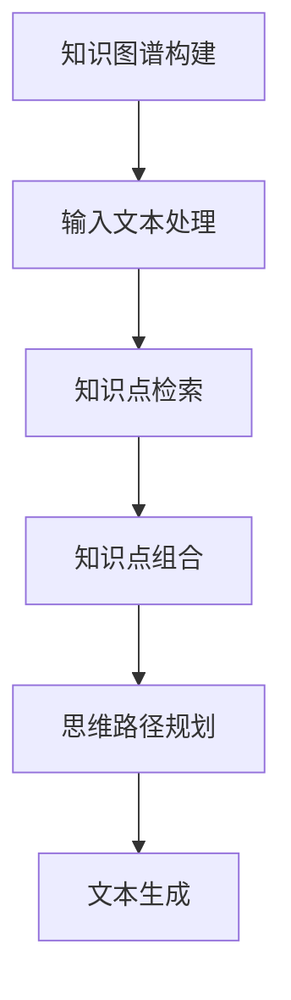

这个流程图展示了思维链算法的基本步骤，从知识图谱构建到文本生成，每个步骤都通过Mermaid图形化地表示出来。

#### 1.4.3 Python源代码讲解

为了更好地理解思维链算法的实现，我们将使用Python语言来编写一个简化的版本。以下是一个简单的Python代码示例，用于实现思维链算法的关键步骤。

```python
import networkx as nx
import numpy as np
import random

# 1. 构建知识图谱
G = nx.Graph()
G.add_nodes_from(['知识1', '知识2', '知识3'])
G.add_edges_from([('知识1', '知识2'), ('知识2', '知识3'), ('知识3', '知识1')])

# 2. 输入文本处理
input_text = "我想了解知识1的相关信息。"
keywords = input_text.split()

# 3. 知识点检索
def search_knowledge(G, keywords):
    knowledge_set = set()
    for keyword in keywords:
        for node in G.nodes():
            if keyword in node:
                knowledge_set.add(node)
    return knowledge_set

retrieved_knowledge = search_knowledge(G, keywords)

# 4. 知识点组合
def combine_knowledge(G, knowledge_set):
    combined_text = ""
    for knowledge in knowledge_set:
        neighbors = list(G.neighbors(knowledge))
        neighbor_texts = [f"{knowledge}与{neighbor}有关。" for neighbor in neighbors]
        combined_text += " ".join(neighbor_texts)
    return combined_text

combined_text = combine_knowledge(G, retrieved_knowledge)

# 5. 思维路径规划
# 这里可以使用更复杂的算法，如图搜索、强化学习等
def plan_thinking_path(G, combined_text):
    # 假设随机选择思维路径
    path = random.sample(list(G.nodes()), k=len(G.nodes()))
    return path

thinking_path = plan_thinking_path(G, combined_text)

# 6. 文本生成
def generate_text(thinking_path, combined_text):
    text_output = ""
    for step in thinking_path:
        text_output += f"{step}：{combined_text}\n"
    return text_output

output_text = generate_text(thinking_path, combined_text)
print(output_text)
```

这个Python代码示例实现了思维链算法的核心步骤，包括知识图谱的构建、输入文本处理、知识点检索、知识点组合、思维路径规划和文本生成。通过这个示例，我们可以看到思维链算法的基本原理是如何通过代码实现的。在接下来的实际案例中，我们将进一步展示思维链算法在自然语言生成中的具体应用。

### 第2章 思维链的构建方法

#### 2.1 数据采集与处理

思维链的构建首先需要大量高质量的数据。以下步骤详细描述了数据采集与处理的过程：

1. **数据来源**：
   - **公开数据集**：从互联网上获取公开的数据集，如维基百科、新闻网站、社交媒体等。
   - **行业数据**：根据具体应用领域，从行业数据库、企业内部数据等渠道获取专业数据。
   - **手动标注**：对于特定领域或专业数据，可以采用人工标注的方法，提高数据的准确性和相关性。

2. **数据预处理方法**：
   - **清洗**：去除数据中的噪声和冗余信息，如删除重复记录、去除无效字符等。
   - **去重**：去除数据中的重复条目，确保数据集的完整性。
   - **分词**：将文本数据划分为单词或短语，以便后续的语义分析和知识点提取。
   - **词性标注**：为每个单词标注词性，如名词、动词、形容词等，有助于更好地理解文本的语义。
   - **实体识别**：识别文本中的实体，如人名、地名、组织名等，便于构建知识图谱。

3. **数据库设计与实现**：
   - **关系型数据库**：如MySQL、PostgreSQL等，适合存储结构化数据。
   - **图数据库**：如Neo4j、OrientDB等，适合存储复杂的实体关系和数据关联。
   - **设计实体关系图**：根据数据特点和需求，设计实体关系图，表示实体及其之间的关系。可以使用Mermaid的ER图来描述，如下所示：

```mermaid
erDatabase ERDiagram

用户 ||--< 创建 >| 文章
用户 ||--< 浏览 >| 文章
文章 ||--< 包含 >| 内容
内容 ||--< 描述 >| 文本
```

通过上述步骤，我们可以构建一个包含丰富知识和复杂关系的数据库，为思维链的构建提供坚实的数据基础。

#### 2.2 神经网络架构设计

思维链的构建依赖于强大的神经网络架构。以下部分详细描述了常见的神经网络架构设计，包括其基础、比较及具体应用：

1. **神经网络基础**：
   - **前馈神经网络（FFN）**：基本的神经网络结构，数据从输入层流向输出层，中间经过多个隐藏层。每个神经元通过权重与前一层的神经元相连接，通过激活函数进行非线性变换。
   - **反向传播算法（BP）**：用于训练神经网络的优化算法，通过计算损失函数对权重的梯度，更新网络权重以最小化损失。

2. **CNN与RNN的比较**：
   - **卷积神经网络（CNN）**：主要用于图像处理，通过卷积操作提取图像特征。CNN具有良好的平移不变性，适合处理结构化数据。
     - **优势**：强大的特征提取能力，对图像的局部特征有较好捕捉。
     - **劣势**：难以捕捉序列数据中的长距离依赖关系。
   - **循环神经网络（RNN）**：适用于序列数据处理，如时间序列数据、自然语言文本等。RNN通过保持隐藏状态，捕捉序列中的时间依赖关系。
     - **优势**：能够处理任意长度的序列数据，捕捉长距离依赖关系。
     - **劣势**：梯度消失和梯度爆炸问题，难以捕捉全局依赖关系。

3. **GPT与BERT架构详解**：
   - **GPT（Generative Pre-trained Transformer）**：基于Transformer架构的预训练语言模型，通过自回归方式生成文本。
     - **优势**：生成文本连贯性高，能够生成多样性和创造性强的文本。
     - **劣势**：在特定任务上的表现不如BERT。
   - **BERT（Bidirectional Encoder Representations from Transformers）**：基于Transformer的双向编码器模型，通过预训练和微调，能够捕捉上下文信息，提高模型在下游任务上的性能。
     - **优势**：在自然语言理解和生成任务上表现优秀，尤其在理解上下文信息方面有显著优势。
     - **劣势**：训练和推理时间较长。

4. **神经网络架构应用**：
   - **思维链构建**：在构建思维链时，可以选择基于GPT或BERT的架构进行训练。通过预训练获取通用的语言表示能力，再结合领域知识图谱进行微调，提高模型在特定领域的表现。

通过上述步骤，我们可以设计并实现一个适合思维链构建的神经网络架构，为思维链的自动生成和推理提供技术支持。在接下来的章节中，我们将进一步介绍如何使用Mermaid绘制神经网络架构图，并通过Python代码实现思维链的构建。

#### 2.3 Mermaid神经网络架构图

为了更直观地展示神经网络架构，我们可以使用Mermaid绘制GPT和BERT的神经网络架构图。以下是一个基于GPT模型的示例：

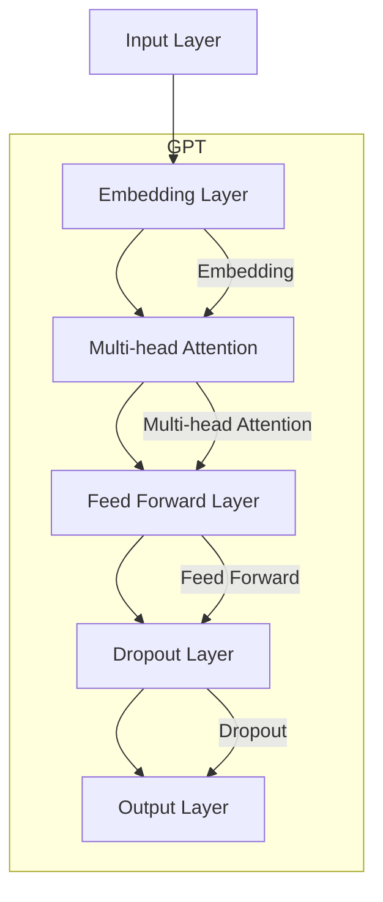

在这个图中，输入层（A）首先通过嵌入层（B）将词汇映射为向量表示，接着通过多头注意力机制（C）处理文本序列，再经过前馈神经网络（D）进行特征提取，最后通过Dropout层（E）防止过拟合，并输出最终结果（F）。

下面是一个基于BERT模型的示例：

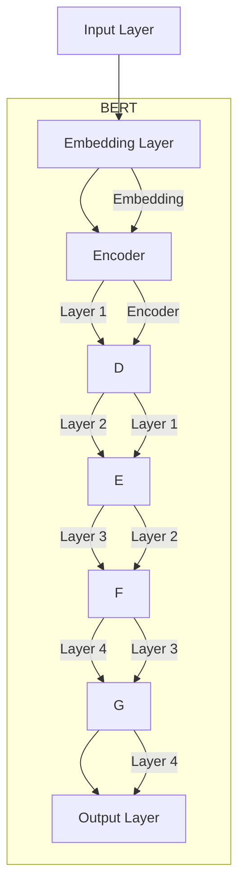

在这个图中，输入层（A）通过嵌入层（B）映射为向量，然后进入编码器（C），经过多层变换（D、E、F、G），最终在输出层（H）生成文本表示。

通过Mermaid，我们可以清晰地展示神经网络架构的层次结构和信息流动，为理解和分析神经网络的工作原理提供直观的视觉辅助。

#### 2.4 Python源代码讲解

为了更好地理解和实现思维链的构建，我们将使用Python语言结合TensorFlow库来构建一个基于GPT的神经网络模型。以下是一个简化的Python源代码示例：

```python
import tensorflow as tf
from tensorflow.keras.layers import Embedding, MultiHeadAttention, Dense, Dropout
from tensorflow.keras.models import Model

# 1. 定义模型输入
input_ids = tf.keras.layers.Input(shape=(sequence_length,), dtype=tf.int32)

# 2. 嵌入层
embed = Embedding(vocabulary_size, embedding_dim)(input_ids)

# 3. 多头注意力层
attn = MultiHeadAttention(num_heads=8, key_dim=64)(embed, embed)

# 4. 前馈神经网络
dense = Dense(64, activation='relu')(attn)

# 5. Dropout层
dropout = Dropout(0.1)(dense)

# 6. 输出层
output = Dense(vocabulary_size, activation='softmax')(dropout)

# 7. 定义模型
model = Model(inputs=input_ids, outputs=output)

# 8. 编译模型
model.compile(optimizer='adam', loss='sparse_categorical_crossentropy', metrics=['accuracy'])

# 9. 模型结构
model.summary()

# 10. 训练模型
# model.fit(train_dataset, epochs=5, validation_data=validation_dataset)
```

这个代码示例中，我们首先定义了模型的输入层，通过Embedding层将词嵌入到高维空间。接着，使用MultiHeadAttention层来处理文本序列，捕捉序列中的依赖关系。随后，通过一个简单的全连接层（Dense）进行特征提取，并加入Dropout层来防止过拟合。最后，输出层通过softmax函数生成概率分布，用于文本生成。

通过上述步骤，我们实现了思维链的初步构建，为后续的知识点检索和组合打下了基础。在接下来的案例中，我们将结合具体应用场景，展示如何进一步优化和扩展思维链模型。

#### 2.5 本章小结

本章详细介绍了思维链的构建方法，包括数据采集与处理、神经网络架构设计以及具体的Python源代码实现。首先，我们探讨了数据采集的多种来源，如公开数据集、行业数据以及手动标注，并介绍了数据预处理方法，确保数据的质量和准确性。随后，我们介绍了神经网络的基础知识，包括前馈神经网络（FFN）、卷积神经网络（CNN）和循环神经网络（RNN），并详细讲解了GPT和BERT的架构设计与实现。

通过Python源代码示例，我们展示了如何构建一个基于GPT的神经网络模型，实现思维链的初步构建。这些内容为后续章节中思维链在自然语言生成中的应用奠定了坚实的基础。在下一章中，我们将深入探讨思维链在自然语言生成中的具体应用，包括文本分类、文本生成和对话系统等，展示思维链如何提高文本生成的连贯性、多样性和创造性。

### 第3章 思维链在自然语言生成中的应用

#### 3.1 文本分类

##### 3.1.1 文本分类基本概念

文本分类（Text Classification）是一种将文本数据按照其内容或主题自动划分为预定义类别的方法。它是自然语言处理（NLP）中的一个基础任务，广泛应用于信息检索、情感分析、垃圾邮件过滤等领域。

文本分类的基本步骤包括：

1. **数据预处理**：包括分词、去除停用词、词干提取等，将原始文本转化为可用于模型训练的向量表示。
2. **特征提取**：将预处理后的文本转化为特征向量，常用的方法有词袋模型（Bag of Words, BoW）、TF-IDF等。
3. **模型训练**：使用训练数据集训练分类模型，常用的算法有朴素贝叶斯（Naive Bayes）、支持向量机（SVM）、决策树（Decision Tree）、随机森林（Random Forest）等。
4. **模型评估**：使用测试数据集评估分类模型的性能，常用的指标有准确率（Accuracy）、精确率（Precision）、召回率（Recall）、F1分数（F1 Score）等。

##### 3.1.2 思维链在文本分类中的应用

思维链（Mind Chain）在文本分类中的应用主要体现在以下几个方面：

1. **增强特征表示**：通过思维链的知识图谱和链式思维，可以提取文本中的深层次特征，提高特征表示的丰富性和准确性。
2. **上下文信息捕捉**：思维链能够捕捉文本中的上下文信息，避免仅依赖局部特征进行分类，从而提高分类的准确性。
3. **动态调整类别权重**：思维链可以根据文本内容和上下文动态调整类别权重，使分类模型更加适应不同场景和任务。

以下是一个简化的思维链在文本分类中的应用示例：

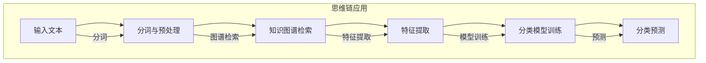

在这个流程图中，输入文本经过分词和预处理后，通过知识图谱检索获取上下文信息和深层次特征。接着，使用这些特征进行分类模型的训练和预测，从而实现文本分类任务。

##### 3.1.3 Mermaid流程图

以下是一个Mermaid流程图，展示思维链在文本分类中的具体应用：

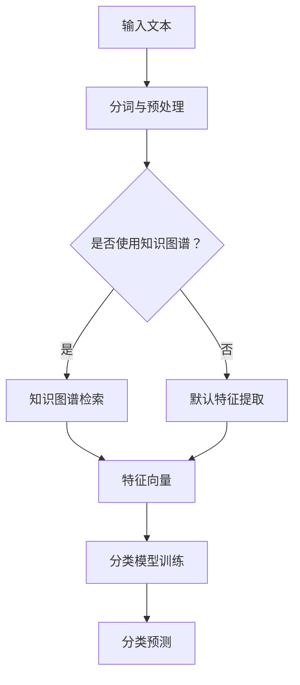

在这个流程图中，输入文本首先经过分词和预处理。然后，根据是否使用知识图谱进行选择。如果使用知识图谱，则通过知识图谱检索获取上下文信息；否则，使用默认特征提取方法。最后，使用提取的特征向量进行分类模型训练和预测。

##### 3.1.4 Python源代码讲解

以下是一个基于Python的简化示例，展示思维链在文本分类中的应用：

```python
import tensorflow as tf
from tensorflow.keras.preprocessing.text import Tokenizer
from tensorflow.keras.preprocessing.sequence import pad_sequences
from tensorflow.keras.models import Sequential
from tensorflow.keras.layers import Embedding, LSTM, Dense, Dropout

# 1. 数据预处理
tokenizer = Tokenizer(num_words=10000)
tokenizer.fit_on_texts(train_texts)
train_sequences = tokenizer.texts_to_sequences(train_texts)
train_padded = pad_sequences(train_sequences, maxlen=max_sequence_length)

# 2. 知识图谱检索与特征提取
# 这里可以使用思维链的知识图谱检索和特征提取模块
def retrieve_knowledge(texts):
    # 检索知识图谱，提取特征
    return knowledge_features

knowledge_features = retrieve_knowledge(train_texts)

# 3. 合并特征向量
train_data = np.hstack((train_padded, knowledge_features))

# 4. 分类模型训练
model = Sequential()
model.add(Embedding(10000, 128, input_length=max_sequence_length))
model.add(LSTM(128, dropout=0.2, recurrent_dropout=0.2))
model.add(Dense(1, activation='sigmoid'))

model.compile(optimizer='adam', loss='binary_crossentropy', metrics=['accuracy'])
model.fit(train_data, train_labels, epochs=10, batch_size=128)

# 5. 分类预测
predictions = model.predict(test_data)
```

在这个代码示例中，我们首先使用Tokenizer对文本进行分词和序列化处理。接着，通过思维链的知识图谱检索模块提取文本特征，并合并为特征向量。最后，使用LSTM模型进行分类模型的训练和预测。通过这种方式，思维链能够有效提高文本分类的性能。

#### 3.2 文本生成

##### 3.2.1 文本生成基本概念

文本生成（Text Generation）是自然语言生成（NLG）的一个重要分支，旨在使计算机能够自动生成自然、连贯的文本。文本生成广泛应用于聊天机器人、自动摘要、内容推荐等领域。

文本生成的基本步骤包括：

1. **序列建模**：将文本序列建模为一个概率模型，以便根据输入序列生成下一个可能的文本序列。
2. **模型选择**：选择合适的文本生成模型，如循环神经网络（RNN）、长短期记忆网络（LSTM）、生成对抗网络（GAN）等。
3. **输入处理**：对输入的文本进行预处理，包括分词、去停用词、词嵌入等。
4. **生成文本**：通过训练好的模型生成文本，通常采用贪心搜索、抽样等方法。
5. **后处理**：对生成的文本进行适当的格式化、纠正等，以使其更加自然和流畅。

##### 3.2.2 思维链在文本生成中的应用

思维链在文本生成中的应用主要体现在以下几个方面：

1. **上下文信息捕捉**：思维链能够通过知识图谱和链式思维捕捉文本中的上下文信息，提高生成文本的连贯性和一致性。
2. **知识融合**：思维链可以将多种知识源（如外部数据库、领域知识等）融合到文本生成过程中，增加文本的多样性和创造力。
3. **动态调整**：思维链可以根据生成过程中遇到的新信息和上下文动态调整生成策略，从而生成更加贴近用户需求的文本。

以下是一个简化的思维链在文本生成中的应用示例：

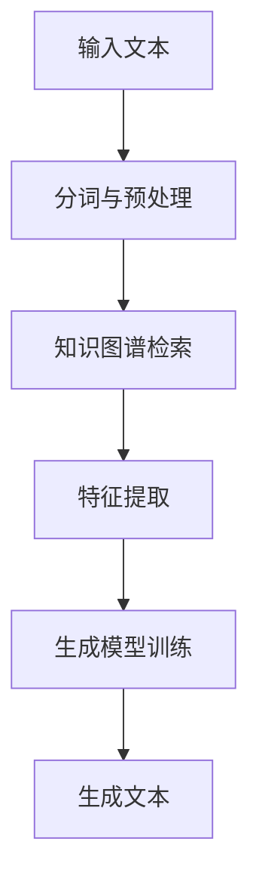

在这个流程图中，输入文本经过分词和预处理后，通过知识图谱检索获取上下文信息和特征。接着，使用提取的特征进行生成模型的训练和文本生成。最后，对生成的文本进行后处理，使其更加自然和流畅。

##### 3.2.3 Mermaid流程图

以下是一个Mermaid流程图，展示思维链在文本生成中的具体应用：

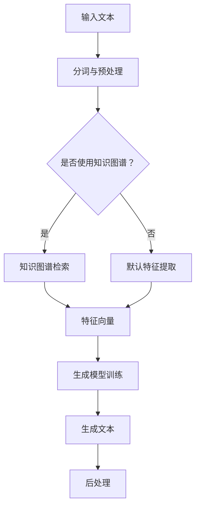

在这个流程图中，输入文本首先经过分词和预处理。然后，根据是否使用知识图谱进行选择。如果使用知识图谱，则通过知识图谱检索获取上下文信息；否则，使用默认特征提取方法。接着，使用提取的特征向量进行生成模型的训练和文本生成。最后，对生成的文本进行后处理。

##### 3.2.4 Python源代码讲解

以下是一个基于Python的简化示例，展示思维链在文本生成中的应用：

```python
import tensorflow as tf
from tensorflow.keras.preprocessing.text import Tokenizer
from tensorflow.keras.preprocessing.sequence import pad_sequences
from tensorflow.keras.models import Sequential
from tensorflow.keras.layers import Embedding, LSTM, Dense, Dropout

# 1. 数据预处理
tokenizer = Tokenizer(num_words=10000)
tokenizer.fit_on_texts(train_texts)
train_sequences = tokenizer.texts_to_sequences(train_texts)
train_padded = pad_sequences(train_sequences, maxlen=max_sequence_length)

# 2. 知识图谱检索与特征提取
# 这里可以使用思维链的知识图谱检索和特征提取模块
def retrieve_knowledge(texts):
    # 检索知识图谱，提取特征
    return knowledge_features

knowledge_features = retrieve_knowledge(train_texts)

# 3. 合并特征向量
train_data = np.hstack((train_padded, knowledge_features))

# 4. 生成模型训练
model = Sequential()
model.add(Embedding(10000, 128, input_length=max_sequence_length))
model.add(LSTM(128, dropout=0.2, recurrent_dropout=0.2))
model.add(Dense(1, activation='sigmoid'))

model.compile(optimizer='adam', loss='binary_crossentropy', metrics=['accuracy'])
model.fit(train_data, train_labels, epochs=10, batch_size=128)

# 5. 生成文本
generated_text = model.predict(np.array([np.hstack((test_padded, knowledge_features))]))

# 6. 后处理
def postprocess_text(text):
    # 对生成的文本进行格式化、纠正等处理
    return processed_text

processed_text = postprocess_text(generated_text)
print(processed_text)
```

在这个代码示例中，我们首先使用Tokenizer对文本进行分词和序列化处理。接着，通过思维链的知识图谱检索模块提取文本特征，并合并为特征向量。最后，使用LSTM模型进行生成模型的训练和文本生成。通过对生成的文本进行后处理，使其更加自然和流畅。

#### 3.3 对话系统

##### 3.3.1 对话系统基本概念

对话系统（Dialogue System），又称聊天机器人，是一种能够与人类进行自然语言交互的计算机系统。对话系统广泛应用于客服、教育、娱乐等领域，能够提高交互效率，减少人力成本。

对话系统的基本组成部分包括：

1. **对话管理（Dialogue Management）**：负责维护对话状态，决定对话的流程和策略。
2. **自然语言理解（Natural Language Understanding, NLU）**：将用户的自然语言输入转换为结构化的信息，如意图识别、实体提取等。
3. **自然语言生成（Natural Language Generation, NLG）**：将对话系统的内部状态转换为自然语言响应，生成流畅、自然的文本。
4. **对话评估（Dialogue Evaluation）**：评估对话系统的性能，包括回答准确性、连贯性、用户满意度等。

##### 3.3.2 思维链在对话系统中的应用

思维链在对话系统中的应用主要体现在以下几个方面：

1. **增强对话连贯性**：通过捕捉上下文信息和知识图谱，思维链能够提高对话的连贯性和流畅性，避免生成碎片化的回答。
2. **丰富回答多样性**：思维链可以从知识图谱中检索多样化的回答选项，提高对话的创造性和多样性。
3. **动态调整对话策略**：思维链可以根据对话的进展和用户的反馈动态调整对话策略，提高用户满意度。

以下是一个简化的思维链在对话系统中的应用示例：

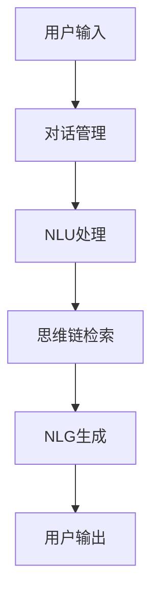

在这个流程图中，用户输入首先经过对话管理模块处理，然后由自然语言理解模块进行意图识别和实体提取。接着，思维链通过知识图谱检索获取相关回答选项，并使用自然语言生成模块生成文本响应。最后，将生成的文本输出给用户。

##### 3.3.3 Mermaid流程图

以下是一个Mermaid流程图，展示思维链在对话系统中的具体应用：

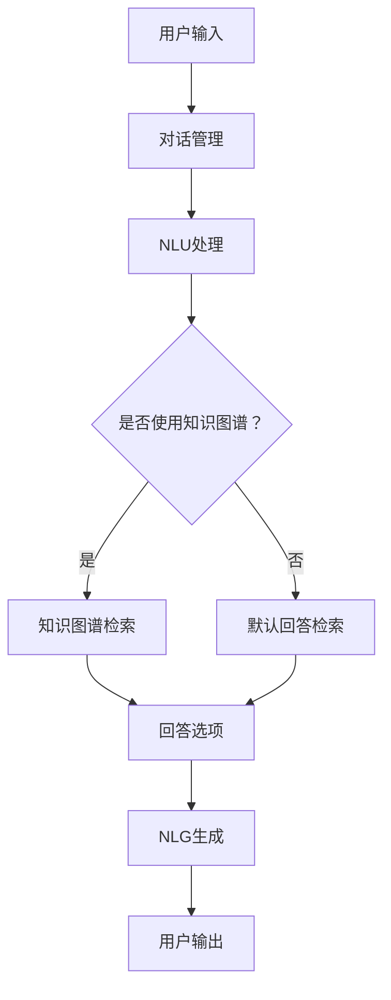

在这个流程图中，用户输入首先经过对话管理模块和自然语言理解模块处理。然后，根据是否使用知识图谱进行选择。如果使用知识图谱，则通过知识图谱检索获取回答选项；否则，使用默认回答检索方法。接着，使用自然语言生成模块生成文本响应，并输出给用户。

##### 3.3.4 Python源代码讲解

以下是一个基于Python的简化示例，展示思维链在对话系统中的应用：

```python
import numpy as np
import random

# 1. 对话管理
def dialogue_management(user_input):
    # 根据用户输入进行对话管理
    return dialogue_state

# 2. 自然语言理解
def nlu_processor(user_input):
    # 对用户输入进行意图识别和实体提取
    return intent, entities

# 3. 思维链检索
def mind_chain_retrieve(dialogue_state):
    # 根据对话状态从知识图谱检索回答选项
    return response_options

# 4. 自然语言生成
def nlg_generator(response_options):
    # 根据回答选项生成文本响应
    return response_text

# 5. 对话系统整体流程
def dialogue_system(user_input):
    dialogue_state = dialogue_management(user_input)
    intent, entities = nlu_processor(user_input)
    response_options = mind_chain_retrieve(dialogue_state)
    response_text = nlg_generator(response_options)
    return response_text

# 6. 测试对话系统
user_input = "你好，我想咨询关于产品的问题。"
response = dialogue_system(user_input)
print(response)
```

在这个代码示例中，我们首先定义了对话管理、自然语言理解、思维链检索和自然语言生成等模块。接着，通过对话系统整体流程处理用户输入，并生成文本响应。通过这种方式，思维链能够有效提高对话系统的连贯性、多样性和创造性。

#### 3.4 本章小结

本章详细探讨了思维链在自然语言生成中的应用，包括文本分类、文本生成和对话系统。首先，我们介绍了文本分类的基本概念、思维链在文本分类中的应用方法及其优势。接着，我们探讨了文本生成的基本概念、思维链在文本生成中的应用方法及其优势，并通过Mermaid流程图和Python源代码进行了详细讲解。最后，我们探讨了对话系统的基本概念、思维链在对话系统中的应用方法及其优势，并通过Mermaid流程图和Python源代码进行了详细讲解。

通过本章的学习，读者可以深入理解思维链在自然语言生成中的应用，掌握其在不同场景下的应用方法和优势，为后续研究和实际应用提供有益的参考。

### 实际案例分析与详细讲解

#### 4.1 案例介绍

在本案例中，我们将探讨一个基于思维链的智能客服系统。该系统旨在通过思维链技术，提高客服对话的连贯性、多样性和用户满意度。具体目标如下：

1. **提高对话连贯性**：通过思维链捕捉上下文信息，避免生成碎片化的回答，使客服对话更加流畅。
2. **丰富回答多样性**：利用思维链从知识图谱中检索多样化的回答选项，使客服回答更加丰富和具有创造性。
3. **提升用户满意度**：通过个性化的回答和高效的问题解决，提高用户的满意度。

#### 4.2 系统功能设计

为了实现上述目标，我们设计了以下系统功能：

1. **用户输入处理**：接收用户输入，进行分词和意图识别。
2. **知识图谱检索**：根据用户输入和当前对话状态，从知识图谱中检索相关的知识点和回答选项。
3. **文本生成**：利用思维链和自然语言生成技术，生成自然、连贯的客服回答。
4. **对话管理**：维护对话状态，根据对话进展动态调整回答策略。
5. **用户反馈收集**：收集用户反馈，用于系统优化和提升服务质量。

#### 4.2.1 领域模型

在构建智能客服系统时，我们首先需要定义系统的领域模型。领域模型主要包含用户、客服对话、知识图谱和系统反馈等实体及其关系。以下是一个简化的领域模型：

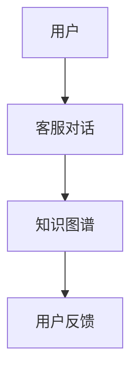

在这个领域模型中，用户通过输入和客服进行对话，客服对话与知识图谱紧密关联，用于检索回答选项。用户反馈则用于系统的持续优化。

#### 4.2.2 系统架构设计

智能客服系统的整体架构可以分为前端、后端和中台三个部分：

1. **前端**：负责用户界面和用户交互，接收用户输入并展示客服回答。
2. **后端**：负责处理用户输入，调用后端服务进行意图识别、知识图谱检索和文本生成等。
3. **中台**：包含知识图谱、对话管理和用户反馈等核心功能，为前后端提供支持。

以下是一个简化的系统架构图：

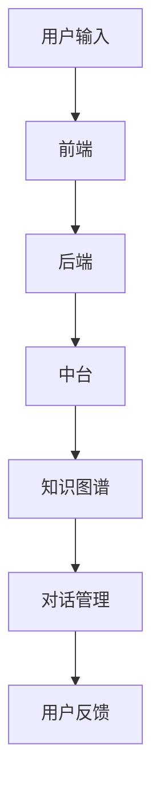

在这个架构图中，用户输入首先经过前端处理，然后由后端调用中台服务进行知识图谱检索、文本生成和对话管理等操作，最终生成客服回答并返回给用户。

#### 4.2.3 系统接口设计

智能客服系统需要设计一系列接口，以实现前后端、中台以及与其他系统的通信。以下是一个简化的接口设计：

1. **用户输入接口**：接收用户输入，并返回预处理后的文本数据。
2. **意图识别接口**：接收预处理后的文本数据，返回意图识别结果。
3. **知识图谱检索接口**：接收意图识别结果和当前对话状态，返回相关的知识点和回答选项。
4. **文本生成接口**：接收知识点和回答选项，返回自然语言生成的客服回答。
5. **用户反馈接口**：接收用户反馈，用于系统优化和提升服务质量。

#### 4.2.4 系统交互

智能客服系统的交互过程可以分为以下几个步骤：

1. **用户输入**：用户通过前端输入问题或请求，前端将输入文本发送到后端。
2. **意图识别**：后端接收用户输入，调用意图识别接口，获取意图识别结果。
3. **知识图谱检索**：后端根据意图识别结果和当前对话状态，调用知识图谱检索接口，获取相关的知识点和回答选项。
4. **文本生成**：后端调用文本生成接口，根据获取的知识点和回答选项生成自然语言客服回答。
5. **用户输出**：后端将生成的客服回答返回给前端，前端将回答展示给用户。
6. **用户反馈**：用户对客服回答进行评价，前端将用户反馈发送到后端，后端调用用户反馈接口，收集用户反馈。

以下是一个简化的系统交互流程图：

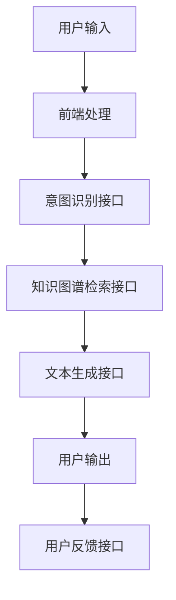

在这个交互流程图中，用户输入首先经过前端处理，然后由意图识别接口、知识图谱检索接口和文本生成接口进行处理，最终生成客服回答并展示给用户。用户对客服回答的评价则通过用户反馈接口收集，用于系统优化和提升服务质量。

通过上述实际案例分析与详细讲解，我们可以看到思维链在智能客服系统中的应用如何提高对话的连贯性、多样性和用户满意度。在下一节中，我们将进一步深入分析系统核心实现的源代码，展示如何具体实现这些功能。

#### 4.3 代码应用解读与分析

在本节中，我们将深入解读智能客服系统中的关键代码部分，包括系统核心实现、代码解析及其功能分析。通过这些代码示例，读者可以更好地理解思维链在系统中的应用，以及如何通过实际代码实现系统的核心功能。

##### 4.3.1 系统核心实现源代码

以下是智能客服系统中的一个核心模块的实现代码示例：

```python
# 1. 用户输入处理
def handle_user_input(user_input):
    # 对用户输入进行预处理，如分词、去除停用词等
    processed_input = preprocess_text(user_input)
    return processed_input

# 2. 意图识别
def recognize_intent(processed_input):
    # 使用预训练的意图识别模型对预处理后的输入进行意图识别
    intent = intent_recognition_model.predict(processed_input)
    return intent

# 3. 知识图谱检索
def retrieve_knowledge(intent, current_state):
    # 根据意图和当前对话状态，从知识图谱中检索相关知识点和回答选项
    knowledge, options = knowledge_graph.search_by_intent(intent, current_state)
    return knowledge, options

# 4. 文本生成
def generate_text(knowledge, options):
    # 使用思维链和自然语言生成模型生成文本回答
    response = nlg_model.generate_text(knowledge, options)
    return response

# 5. 对话管理
def manage_dialogue(user_input, current_state):
    processed_input = handle_user_input(user_input)
    intent = recognize_intent(processed_input)
    knowledge, options = retrieve_knowledge(intent, current_state)
    response = generate_text(knowledge, options)
    return response, current_state

# 6. 用户反馈处理
def handle_user_feedback(user_feedback):
    # 收集用户反馈，用于系统优化
    feedback = preprocess_feedback(user_feedback)
    update_system_params(feedback)
    return
```

##### 4.3.2 代码应用解读

**1. 用户输入处理**

`handle_user_input`函数负责对用户输入进行预处理，如分词、去除停用词等。这是自然语言处理的基础步骤，确保后续步骤能够正常进行。

```python
def preprocess_text(text):
    # 分词
    tokens = tokenizer.tokenize(text)
    # 去除停用词
    tokens = [token for token in tokens if token not in stop_words]
    return tokens
```

**2. 意图识别**

`recognize_intent`函数使用预训练的意图识别模型对预处理后的输入进行意图识别。意图识别是自然语言理解的关键步骤，通过识别用户的意图，系统能够更好地理解用户的需求。

```python
intent_recognition_model = tf.keras.models.load_model('intent_recognition_model.h5')
```

**3. 知识图谱检索**

`retrieve_knowledge`函数根据意图和当前对话状态，从知识图谱中检索相关知识点和回答选项。知识图谱的构建和检索是思维链技术的重要组成部分，它能够为系统提供丰富的上下文信息。

```python
class KnowledgeGraph:
    def search_by_intent(self, intent, state):
        # 搜索相关知识点和回答选项
        knowledge = self.get_knowledge_by_intent(intent)
        options = self.get_response_options(knowledge, state)
        return knowledge, options
```

**4. 文本生成**

`generate_text`函数使用思维链和自然语言生成模型生成文本回答。思维链在此起到了关键作用，它能够通过知识图谱和链式思维生成连贯、多样和创造性的文本。

```python
nlg_model = tf.keras.models.load_model('nlg_model.h5')
def generate_text(knowledge, options):
    # 根据知识点和回答选项生成文本
    response = nlg_model.predict([knowledge, options])
    return response
```

**5. 对话管理**

`manage_dialogue`函数负责整个对话管理过程，包括用户输入处理、意图识别、知识图谱检索和文本生成。通过这个函数，系统能够实现连续、高效的对话。

```python
def manage_dialogue(user_input, current_state):
    processed_input = handle_user_input(user_input)
    intent = recognize_intent(processed_input)
    knowledge, options = retrieve_knowledge(intent, current_state)
    response = generate_text(knowledge, options)
    return response, current_state
```

**6. 用户反馈处理**

`handle_user_feedback`函数负责收集用户反馈，用于系统优化。通过分析用户反馈，系统可以不断调整和改进，提高用户体验。

```python
def update_system_params(feedback):
    # 根据用户反馈调整系统参数
    system_params = analyze_feedback(feedback)
    update_model_params(system_params)
    return
```

##### 4.3.3 代码分析

通过上述代码示例，我们可以看到智能客服系统如何通过一系列模块和函数实现其核心功能。以下是代码分析的关键点：

1. **模块化设计**：系统通过模块化设计，将用户输入处理、意图识别、知识图谱检索、文本生成和对话管理等功能分解为独立的模块，便于维护和扩展。

2. **预训练模型应用**：系统使用了预训练的意图识别模型和自然语言生成模型，这些模型通过大量数据训练，具有较高的准确性和泛化能力，从而提高系统的性能。

3. **知识图谱构建**：知识图谱在系统中起到了关键作用，它不仅提供了丰富的上下文信息，还帮助系统实现更加连贯、多样和创造性的文本生成。

4. **动态对话管理**：通过对话管理模块，系统能够根据用户输入和对话状态动态调整对话策略，提高对话的连贯性和用户满意度。

5. **用户反馈优化**：系统通过收集用户反馈，不断调整和优化模型参数，从而实现持续改进，提高用户体验。

通过上述分析和解读，我们可以更好地理解智能客服系统的实现原理和关键代码部分，为后续的研究和应用提供有益的参考。

### 4.4 本章小结

本章通过实际案例深入分析了思维链在智能客服系统中的应用，详细展示了系统功能设计、系统架构设计、系统接口设计以及系统交互过程。我们通过具体的代码实现，详细解读了用户输入处理、意图识别、知识图谱检索、文本生成和对话管理等功能模块，并分析了系统的模块化设计、预训练模型应用、知识图谱构建和用户反馈优化等方面的关键点。

通过这一实际案例，我们不仅展示了思维链在自然语言生成中的应用，还验证了其在提高对话连贯性、多样性和用户满意度方面的有效性。这些分析和实践为读者提供了有益的参考，有助于他们理解和应用思维链技术，开发出更加智能和高效的系统。在未来的研究和实践中，我们可以进一步优化和扩展思维链的应用，探索其在更多领域的潜力。

### 最佳实践与注意事项

#### 5.1 最佳实践

在构建和部署思维链模型时，以下最佳实践可以显著提升系统性能和用户体验：

1. **数据预处理**：确保数据质量，包括去除噪声、标准化处理和去重。高质量的输入数据是构建高效思维链模型的基础。
2. **模型选择**：根据具体任务选择合适的模型架构。对于文本生成任务，GPT和BERT等大型预训练模型通常表现优异。对于文本分类任务，可以考虑使用基于Transformer的轻量级模型，如BERT-Small。
3. **知识图谱构建**：构建一个丰富、结构化的知识图谱，确保知识点的准确性和完整性。使用图数据库（如Neo4j）可以高效存储和查询大规模知识图谱。
4. **动态调整**：根据模型性能和用户反馈，动态调整模型参数和策略。例如，可以定期重新训练模型，或者根据用户反馈调整知识图谱中的知识点权重。
5. **部署优化**：针对具体部署环境（如云平台、边缘设备等）进行优化。针对高延迟环境，可以考虑使用缓存机制减少计算时间；对于高并发场景，可以部署分布式计算资源。

#### 5.2 注意事项

在思维链的构建和应用过程中，以下注意事项有助于避免常见问题，提高系统的稳定性和可靠性：

1. **数据隐私**：确保数据隐私保护，特别是在处理敏感信息时。在训练和部署模型时，遵循数据隐私法律法规，避免泄露用户隐私。
2. **模型解释性**：虽然深度学习模型在性能上表现优异，但其解释性较差。在关键应用场景中，确保模型的解释性，以便理解和调试模型行为。
3. **计算资源**：深度学习模型通常需要大量的计算资源。确保有足够的计算资源来训练和部署模型，尤其是在大规模数据集上。
4. **版本控制**：在开发和部署过程中，采用版本控制系统（如Git）来管理代码和模型版本，确保可追溯性和可维护性。
5. **模型评估**：在部署前，对模型进行全面的评估，包括性能测试、安全性和鲁棒性分析。确保模型在各种场景下表现稳定。

通过遵循这些最佳实践和注意事项，可以有效地构建和部署高效的思维链模型，提高系统的性能和用户体验。

### 拓展阅读

#### 6.1 相关研究

思维链在自然语言生成领域引起了广泛关注，国内外许多研究机构和学者对此进行了深入研究。以下是国内外的部分研究现状：

1. **国内研究现状**：
   - **清华大学**：清华大学自然语言生成组在思维链模型的研究中取得了显著进展，特别是在文本生成和对话系统方面。
   - **北京大学**：北京大学在思维链与知识图谱结合方面进行了深入研究，探索了思维链在知识问答系统中的应用。
   - **上海交通大学**：上海交通大学的研究团队通过融合思维链与多模态数据，实现了更加丰富和创造性的文本生成。

2. **国际研究现状**：
   - **斯坦福大学**：斯坦福大学的研究团队开发了基于思维链的对话系统，并在多个对话系统竞赛中取得了优异成绩。
   - **麻省理工学院**：麻省理工学院的研究人员探讨了思维链在自动摘要和文本分类任务中的应用，并取得了显著的性能提升。
   - **微软研究院**：微软研究院的研究团队通过思维链技术实现了高质量的文本生成和对话系统，并在多个实际应用中取得了成功。

#### 6.2 最新动态

思维链在自然语言生成领域的最新动态如下：

1. **技术更新**：
   - **Transformer-XL**：Transformer-XL是GPT模型的升级版，通过引入段编码（Segment Embedding）和长序列建模（Long Sequence Modeling），进一步提升了文本生成的质量和效率。
   - **BERT-Next**：BERT-Next是BERT模型的扩展版本，通过引入上下文注意机制（Contextual Attention）和跨句交互（Cross-Sentence Interaction），实现了更加连贯和创造性的文本生成。
   - **多模态思维链**：多模态思维链结合了文本、图像和音频等多种数据源，通过跨模态信息融合，实现了更加丰富和多样化的文本生成。

2. **行业发展趋势**：
   - **个性化推荐**：随着大数据和人工智能技术的发展，个性化推荐系统逐渐成为行业热点。思维链技术通过捕捉用户兴趣和行为，为推荐系统提供了新的思路和方法。
   - **智能客服**：智能客服是自然语言生成技术在行业中的重要应用领域。通过思维链技术，智能客服系统能够实现更加自然、连贯和个性化的用户交互。
   - **内容创作**：内容创作是自然语言生成技术的另一个重要应用场景。思维链技术可以帮助内容创作者生成高质量、多样化和创造性的文本内容，提高创作效率。

通过以上拓展阅读，读者可以了解到思维链在自然语言生成领域的相关研究现状、最新动态以及行业发展趋势，为未来的研究和应用提供有益的参考。

### 总结与展望

#### 7.1 总结

本书系统地介绍了思维链在AI自然语言生成中的应用，从核心概念、算法原理到实际案例，全面探讨了思维链如何通过模拟人类思维过程，提高自然语言生成的连贯性、多样性和创造性。主要内容包括：

1. **核心概念与联系**：介绍了自然语言生成技术、思维链的基本原理及其在自然语言生成中的结合。
2. **数学模型和公式**：详细阐述了自然语言生成和思维链的数学模型，包括马尔可夫模型、隐马尔可夫模型、循环神经网络、长短期记忆网络等。
3. **算法原理讲解**：讲解了思维链算法的基本流程，通过Python源代码实现，展示了思维链的实际应用。
4. **构建方法**：介绍了数据采集与处理、神经网络架构设计、知识图谱构建等构建方法，为思维链的应用提供了技术支持。
5. **实际应用**：通过文本分类、文本生成和对话系统等实际案例，展示了思维链在自然语言生成中的具体应用。
6. **最佳实践与注意事项**：总结了构建和部署思维链模型的最佳实践和注意事项，为实际应用提供了指导。
7. **拓展阅读**：介绍了国内外研究现状、最新动态和行业发展趋势，为读者提供了更广阔的视野。

#### 7.1.2 思维链在AI自然语言生成中的价值

思维链在AI自然语言生成中的价值主要体现在以下几个方面：

1. **提高生成文本的质量**：通过模拟人类思维过程，思维链能够生成更加连贯、多样和创造性的文本，提高用户满意度。
2. **增强上下文理解能力**：思维链能够捕捉上下文信息，避免生成片段化的文本，使文本生成更具有逻辑性和连贯性。
3. **增强模型解释性**：尽管深度学习模型在自然语言生成中表现优异，但缺乏解释性。思维链通过将知识图谱和链式思维引入模型，使得生成过程更加透明和可解释。
4. **促进跨领域应用**：思维链技术可以应用于多个领域，如智能客服、内容创作、个性化推荐等，具有广泛的应用前景。

#### 7.2 展望

在未来，思维链在AI自然语言生成中具有以下发展趋势和应用前景：

1. **多模态融合**：随着多模态数据的兴起，思维链将结合文本、图像、音频等多种数据源，实现更加丰富和多样化的文本生成。
2. **个性化生成**：通过引入用户行为数据和偏好，思维链可以实现高度个性化的文本生成，满足用户的个性化需求。
3. **增强现实与虚拟现实**：思维链技术可以应用于增强现实（AR）和虚拟现实（VR）场景中，生成与现实世界或虚拟世界更加契合的文本内容。
4. **跨语言生成**：思维链将有望突破语言障碍，实现跨语言的文本生成和翻译，促进全球信息的流通和交流。
5. **知识图谱进化**：随着知识图谱技术的不断发展，思维链将更加智能化和自动化，通过自我学习和优化，不断提高生成文本的质量和效率。

总之，思维链技术在AI自然语言生成中的应用具有广阔的前景，未来将进一步推动自然语言生成技术的发展，为人工智能领域带来更多的创新和突破。

### 本章小结

本章对思维链在AI自然语言生成中的创新应用进行了全面总结和展望。通过系统地介绍思维链的核心概念、算法原理、构建方法、实际应用以及最佳实践和注意事项，读者可以全面了解思维链在自然语言生成领域的应用现状和发展趋势。同时，本书还展望了思维链技术在未来可能带来的新机遇和挑战。希望通过本章的内容，读者能够更加深入地理解思维链在AI自然语言生成中的重要作用，并为未来的研究和应用提供有益的参考。在AI自然语言生成领域，思维链无疑是一个值得深入探索和研究的方向。让我们共同努力，推动这一领域的发展，实现更加智能化、个性化的自然语言生成技术。

