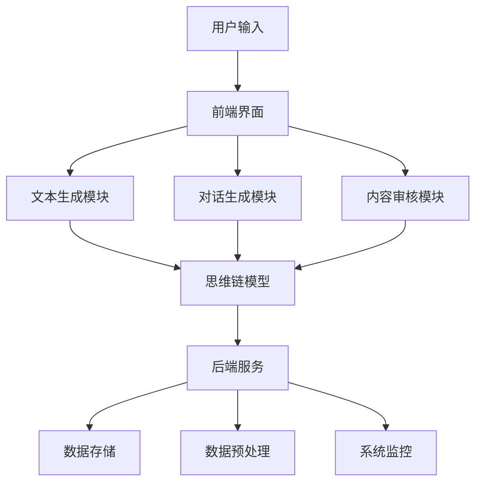

                 

# 《思维链在AI自然语言生成中的前沿应用》

## 关键词

自然语言生成，人工智能，思维链，神经网络，序列模型，深度学习，编程，算法

## 摘要

随着人工智能技术的快速发展，自然语言生成（Natural Language Generation，N LG）已成为一项重要的应用领域。思维链（Mind Chain）作为一种新兴的AI技术，其在N LG中的应用越来越受到关注。本文旨在探讨思维链在AI自然语言生成中的前沿应用，首先介绍AI自然语言生成技术的基本概念和思维链的概念，然后深入分析思维链的算法原理、系统架构设计以及实际应用案例。通过本文的探讨，希望能够为读者提供对思维链在自然语言生成领域应用的新思路和启发。

## 目录大纲设计思路

在设计《思维链在AI自然语言生成中的前沿应用》这本书的目录大纲时，我们需要从以下几个方面入手：

1. **背景介绍**：
   - 介绍AI自然语言生成技术的基本概念，以及思维链的概念和应用。
   - 阐述思维链在AI自然语言生成中的地位和作用。

2. **核心概念与联系**：
   - 详细阐述思维链的原理和特点，与自然语言生成技术的联系。
   - 通过对比表格和实体关系图，展示思维链与其他AI技术的异同。

3. **算法原理讲解**：
   - 利用Mermaid流程图展示思维链的工作流程。
   - 使用Python代码和数学模型，解释思维链的实现原理。

4. **系统分析与架构设计方案**：
   - 介绍思维链在自然语言生成系统中的应用场景。
   - 设计系统的功能模块、架构和接口。

5. **项目实战**：
   - 提供思维链在AI自然语言生成中的实际应用案例。
   - 分析项目实现过程，讲解关键代码和应用技巧。

6. **最佳实践与拓展**：
   - 总结实践经验，提供使用思维链进行AI自然语言生成的最佳实践。
   - 提出注意事项，推荐拓展阅读资源。

### 目录大纲结构

根据上述设计思路，我们可以将目录大纲分为以下几个部分：

**第一部分：背景与概述**
- 1. AI自然语言生成技术概述
- 2. 思维链概念与原理
- 3. 思维链在AI自然语言生成中的应用前景

**第二部分：核心概念与联系**
- 4. 思维链原理解析
- 5. 思维链与自然语言生成技术的联系
- 6. 思维链与其他AI技术的对比分析

**第三部分：算法原理讲解**
- 7. 思维链工作流程
- 8. Python代码实现与解析
- 9. 数学模型与公式解释

**第四部分：系统分析与架构设计**
- 10. 思维链在自然语言生成系统中的应用场景
- 11. 系统功能模块设计
- 12. 系统架构设计与接口设计

**第五部分：项目实战**
- 13. 实际应用案例
- 14. 项目实现过程解析
- 15. 代码应用解读与分析

**第六部分：最佳实践与拓展**
- 16. 最佳实践总结
- 17. 注意事项与拓展阅读

### 目录大纲示例

```
# 《思维链在AI自然语言生成中的前沿应用》目录大纲

# 第一部分：背景与概述
## 1. AI自然语言生成技术概述
### 1.1 自然语言处理与生成
### 1.2 AI自然语言生成技术发展历程
### 1.3 AI自然语言生成技术现状与趋势

## 2. 思维链概念与原理
### 2.1 思维链的定义
### 2.2 思维链的原理与特点
### 2.3 思维链在自然语言生成中的作用

## 3. 思维链在AI自然语言生成中的应用前景
### 3.1 思维链在文本生成中的应用
### 3.2 思维链在对话系统中的应用
### 3.3 思维链在内容审核中的应用

# 第二部分：核心概念与联系
## 4. 思维链原理解析
### 4.1 思维链的神经网络架构
### 4.2 思维链的学习与训练过程
### 4.3 思维链的输出生成机制

## 5. 思维链与自然语言生成技术的联系
### 5.1 思维链与词向量模型的联系
### 5.2 思维链与序列生成模型的联系
### 5.3 思维链与传统自然语言生成技术的比较

## 6. 思维链与其他AI技术的对比分析
### 6.1 思维链与知识图谱的比较
### 6.2 思维链与深度学习的联系与区别
### 6.3 思维链在跨模态生成中的应用前景

# 第三部分：算法原理讲解
## 7. 思维链工作流程
### 7.1 数据预处理
### 7.2 网络结构设计
### 7.3 训练与优化
### 7.4 生成与应用

## 8. Python代码实现与解析
### 8.1 思维链模型的搭建
### 8.2 数据集准备与加载
### 8.3 训练过程解析
### 8.4 生成过程解析

## 9. 数学模型与公式解释
### 9.1 神经网络与反向传播算法
### 9.2 语言模型与生成模型
### 9.3 思维链的数学公式与原理

# 第四部分：系统分析与架构设计
## 10. 思维链在自然语言生成系统中的应用场景
### 10.1 文本生成系统
### 10.2 对话生成系统
### 10.3 内容审核系统

## 11. 系统功能模块设计
### 11.1 数据预处理模块
### 11.2 模型训练模块
### 11.3 模型评估模块
### 11.4 模型应用模块

## 12. 系统架构设计与接口设计
### 12.1 总体架构设计
### 12.2 系统模块间接口设计
### 12.3 系统部署

# 第五部分：项目实战
## 13. 实际应用案例
### 13.1 项目背景
### 13.2 项目需求
### 13.3 实现过程

## 14. 项目实现过程解析
### 14.1 环境安装与配置
### 14.2 系统核心实现
### 14.3 代码解读与分析

## 15. 代码应用解读与分析
### 15.1 关键代码解析
### 15.2 应用技巧分享
### 15.3 案例分析与剖析

# 第六部分：最佳实践与拓展
## 16. 最佳实践总结
### 16.1 实践经验总结
### 16.2 技术难点与解决方案
### 16.3 优化策略与效果评估

## 17. 注意事项与拓展阅读
### 17.1 注意事项
### 17.2 拓展阅读资源
### 17.3 未来发展方向与挑战

----------------------------------------------------------------

## 背景介绍

### AI自然语言生成技术概述

自然语言生成（Natural Language Generation，N LG）是人工智能（AI）的一个重要分支，旨在利用计算机技术自动生成符合语法和语义规则的文本。随着自然语言处理（Natural Language Processing，N LP）技术的发展，N LG的应用领域不断扩大，包括但不限于文本摘要、对话系统、内容审核、广告文案生成等。

N LG技术可以大致分为基于规则的方法和基于统计的方法。基于规则的方法通过定义一系列语法规则和模板，将输入数据转换为输出文本。这种方法具有可控性和解释性，但生成文本的多样性和准确性有限。基于统计的方法则通过学习大量的文本数据，利用概率模型和生成模型生成文本。这种方法能够生成更自然、更丰富的文本，但往往缺乏解释性。

近年来，深度学习技术的发展为N LG带来了新的机遇。基于深度学习的N LG模型，如序列到序列（Seq2Seq）模型、注意力机制（Attention Mechanism）等，通过端到端的方式学习输入和输出的映射关系，显著提升了N LG的性能。

### 思维链概念与原理

思维链（Mind Chain）是一种基于深度学习的自然语言生成技术，其核心理念是通过构建一种思维网络，模拟人类思维的生成过程，从而实现自然语言生成。思维链的原理可以概括为以下几个步骤：

1. **输入预处理**：将输入的文本数据转换为适合神经网络处理的形式，如分词、编码等。

2. **思维网络构建**：构建一个多层神经网络，模拟人类思维的推理和生成过程。思维网络包括编码器、解码器和注意力机制等模块。

3. **思维链生成**：通过思维网络对输入文本进行编码和解码，生成符合语法和语义规则的输出文本。

4. **输出后处理**：对生成的文本进行必要的后处理，如语法修正、语义优化等，以提高文本质量。

思维链的特点包括：

- **端到端学习**：思维链采用端到端的学习方式，直接从输入文本生成输出文本，避免了传统N LG中的中间步骤，提高了生成效率。

- **多模态处理**：思维链不仅可以处理文本数据，还可以处理图像、声音等其他类型的数据，实现跨模态的生成。

- **自适应学习**：思维链具有自适应学习的能力，可以通过不断训练和优化，提高生成文本的质量和多样性。

### 思维链在AI自然语言生成中的地位和作用

思维链在AI自然语言生成中的地位和作用不容小觑。首先，思维链通过模拟人类思维的生成过程，实现了更自然、更丰富的文本生成。相比传统的N LG方法，思维链在文本的流畅性、连贯性和多样性方面有显著优势。

其次，思维链的多模态处理能力使其在跨模态生成领域具有广泛的应用前景。例如，在图像描述生成、语音合成等领域，思维链可以结合图像或语音数据，生成更具创意和个性化的文本。

此外，思维链的自适应学习特性使其在不同应用场景中具有很好的适应性。通过不断学习和优化，思维链可以不断提高生成文本的质量，满足不同领域的需求。

总之，思维链作为一种新兴的AI自然语言生成技术，具有独特的优势和广阔的应用前景。在未来的发展中，思维链有望在更多领域发挥重要作用，推动自然语言生成技术的进步。

## 核心概念与联系

### 思维链原理解析

思维链（Mind Chain）作为一种基于深度学习的自然语言生成技术，其原理主要包括输入预处理、思维网络构建、思维链生成和输出后处理四个步骤。下面我们将详细解析这些步骤及其工作原理。

#### 输入预处理

输入预处理是思维链生成文本的第一步，其主要任务是将原始的文本数据转换为适合神经网络处理的形式。具体步骤包括：

1. **分词**：将输入文本分割成单词或子词。分词的准确性和效率对后续的神经网络处理至关重要。
2. **编码**：将分词后的文本序列转换为数值编码。常见的编码方法包括字节编码（Byte Encoding）、单词嵌入（Word Embedding）和子词嵌入（Subword Embedding）等。

#### 思维网络构建

思维网络是思维链的核心部分，负责对输入文本进行编码、解码和生成。思维网络的构建主要包括以下几个模块：

1. **编码器（Encoder）**：编码器的任务是将输入的文本序列编码为一个固定长度的向量表示。编码器通常采用卷积神经网络（CNN）或循环神经网络（RNN）等深度学习模型。

2. **解码器（Decoder）**：解码器的任务是将编码器生成的向量表示解码为输出文本序列。解码器通常也采用RNN或Seq2Seq模型。

3. **注意力机制（Attention Mechanism）**：注意力机制是一种用于提高解码器对编码器编码信息的利用率的机制。通过注意力机制，解码器能够关注编码器输出的重要部分，从而提高生成文本的连贯性和准确性。

#### 思维链生成

在构建好思维网络后，思维链生成文本的过程可以分为以下几个步骤：

1. **初始化**：首先，初始化解码器的状态，通常采用编码器输出的最后一层作为初始状态。
2. **生成预测**：解码器根据当前状态生成下一个预测的单词或子词。
3. **更新状态**：将预测的单词或子词添加到输出序列中，并更新解码器的状态。
4. **重复步骤**：重复步骤2和3，直到生成完整的输出文本。

#### 输出后处理

生成的文本往往需要进行后处理，以提高文本质量。输出后处理包括以下步骤：

1. **语法修正**：使用语法规则或语法分析工具，对生成的文本进行语法修正，确保文本的语法正确性。
2. **语义优化**：通过语义分析工具，对生成的文本进行语义优化，使其更符合人类的表达习惯。
3. **文本润色**：使用自然语言生成工具，对文本进行润色，使其更具有吸引力和可读性。

### 思维链与自然语言生成技术的联系

思维链在自然语言生成（N LG）技术中扮演着核心角色。它与传统的N LG方法，如基于规则的方法和基于统计的方法，有显著的不同。

#### 与基于规则的方法的比较

基于规则的方法通过预定义的语法和语义规则，将输入数据转换为输出文本。这种方法具有可控性和解释性，但其生成文本的多样性和准确性有限。思维链通过深度学习模型，学习输入和输出之间的映射关系，能够生成更自然、更丰富的文本。

#### 与基于统计的方法的比较

基于统计的方法通过学习大量文本数据，利用概率模型生成文本。这种方法能够生成高质量的文本，但其依赖于大量的训练数据和复杂的模型参数调整。思维链结合了深度学习和自然语言处理技术，能够在较少的数据量下实现高效的文本生成。

### 思维链与其他AI技术的对比分析

思维链作为一种基于深度学习的自然语言生成技术，与其他AI技术，如知识图谱和深度学习，有着紧密的联系和区别。

#### 与知识图谱的比较

知识图谱是一种结构化的知识表示方法，通过实体和关系的网络结构，表示和存储知识。思维链与知识图谱的结合，可以提升自然语言生成中的知识表示和推理能力。知识图谱提供了丰富的背景知识，思维链则利用这些知识生成更准确、更有价值的文本。

#### 与深度学习的比较

深度学习是一种重要的机器学习方法，通过多层神经网络，学习输入和输出之间的复杂映射关系。思维链是深度学习在自然语言生成领域的一个应用，其独特之处在于通过模拟人类思维的生成过程，实现高效的自然语言生成。

### 思维链在自然语言生成中的应用前景

思维链在自然语言生成领域具有广阔的应用前景。首先，思维链可以应用于文本生成系统，如新闻生成、内容摘要生成等。通过思维链，系统能够生成更自然、更丰富的文本，提高信息传递的效率。

其次，思维链在对话系统中的应用也非常广泛。思维链可以结合用户输入，生成自然、流畅的对话响应，提高用户体验。

此外，思维链在内容审核和舆情监测等领域也有重要应用。通过思维链，系统可以自动生成文本摘要，识别和过滤不良内容，提高内容质量和安全性。

总之，思维链作为一种新兴的自然语言生成技术，具有强大的应用潜力。在未来的发展中，思维链有望在更多领域发挥重要作用，推动自然语言生成技术的进步。

## 算法原理讲解

### 思维链工作流程

思维链的工作流程可以分为以下几个关键步骤：

1. **数据预处理**：首先，我们需要对输入的文本数据进行预处理。这包括分词、去停用词、词性标注等操作。预处理后的数据将用于训练思维链模型。

2. **模型训练**：在数据预处理完成后，我们将预处理后的数据输入到思维链模型中进行训练。思维链模型主要包括编码器、解码器和注意力机制等组件。编码器负责将输入文本序列编码为固定长度的向量表示，解码器则将这些向量表示解码为输出文本序列。注意力机制用于帮助解码器更好地关注编码器输出的重要信息。

3. **模型评估**：在模型训练完成后，我们需要对模型进行评估。常用的评估指标包括生成文本的流畅性、准确性和多样性。评估结果将帮助我们优化模型参数，提高生成文本的质量。

4. **文本生成**：最后，通过训练好的模型，我们可以生成新的文本。具体步骤如下：
   - 初始化解码器的状态。
   - 生成第一个预测的单词或子词。
   - 将预测的单词或子词添加到输出序列中，并更新解码器的状态。
   - 重复上述步骤，直到生成完整的输出文本。

### Python代码实现与解析

下面是使用Python实现思维链模型的一个简单示例。为了简化，这里仅展示编码器和解码器的构建和训练过程。

```python
import torch
import torch.nn as nn
from torch.utils.data import DataLoader
from datasets import MyDataset

# 定义编码器
class Encoder(nn.Module):
    def __init__(self, vocab_size, embedding_dim, hidden_dim):
        super(Encoder, self).__init__()
        self.embedding = nn.Embedding(vocab_size, embedding_dim)
        self.rnn = nn.LSTM(embedding_dim, hidden_dim)
        
    def forward(self, inputs):
        embedded = self.embedding(inputs)
        outputs, (hidden, cell) = self.rnn(embedded)
        return hidden, cell

# 定义解码器
class Decoder(nn.Module):
    def __init__(self, vocab_size, embedding_dim, hidden_dim):
        super(Decoder, self).__init__()
        self.embedding = nn.Embedding(vocab_size, embedding_dim)
        self.rnn = nn.LSTM(embedding_dim, hidden_dim)
        self.fc = nn.Linear(hidden_dim, vocab_size)
        
    def forward(self, inputs, hidden, cell):
        embedded = self.embedding(inputs)
        output, (hidden, cell) = self.rnn(embedded, (hidden, cell))
        output = self.fc(output)
        return output, hidden, cell

# 实例化模型
encoder = Encoder(vocab_size=10000, embedding_dim=256, hidden_dim=512)
decoder = Decoder(vocab_size=10000, embedding_dim=256, hidden_dim=512)

# 定义损失函数和优化器
criterion = nn.CrossEntropyLoss()
optimizer = torch.optim.Adam(list(encoder.parameters()) + list(decoder.parameters()))

# 加载数据集
dataset = MyDataset()
dataloader = DataLoader(dataset, batch_size=32, shuffle=True)

# 训练模型
for epoch in range(num_epochs):
    for inputs, targets in dataloader:
        # 前向传播
        encoder_outputs, encoder_hidden = encoder(inputs)
        decoder_inputs = targets[:-1]
        decoder_outputs = []
        decoder_hidden = encoder_hidden
        
        for input in decoder_inputs:
            decoder_output, decoder_hidden = decoder(input, decoder_hidden)
            decoder_outputs.append(decoder_output)
        
        # 计算损失
        loss = criterion(torch.cat(decoder_outputs), targets)
        
        # 反向传播和优化
        optimizer.zero_grad()
        loss.backward()
        optimizer.step()
        
        print(f'Epoch [{epoch+1}/{num_epochs}], Loss: {loss.item():.4f}')

# 保存模型
torch.save(encoder.state_dict(), 'encoder.pth')
torch.save(decoder.state_dict(), 'decoder.pth')
```

### 数学模型与公式解释

思维链的数学模型主要基于深度学习中的循环神经网络（RNN）和序列到序列（Seq2Seq）模型。下面我们将简要介绍这些模型的数学公式和原理。

#### 循环神经网络（RNN）

RNN是一种基于序列数据的神经网络，能够处理变长的输入序列。RNN的输入和输出都为序列，其核心公式如下：

$$
h_t = \sigma(W_h \cdot [h_{t-1}, x_t] + b_h)
$$

$$
y_t = W_y \cdot h_t + b_y
$$

其中，$h_t$表示第$t$时刻的隐藏状态，$x_t$表示第$t$时刻的输入特征，$y_t$表示第$t$时刻的输出特征。$\sigma$为激活函数，$W_h$和$W_y$分别为权重矩阵，$b_h$和$b_y$分别为偏置向量。

#### 序列到序列（Seq2Seq）模型

Seq2Seq模型是RNN在自然语言生成领域的应用，其核心思想是将一个序列映射到另一个序列。Seq2Seq模型主要包括编码器和解码器两个部分。其核心公式如下：

编码器：

$$
h_t = \sigma(W_e \cdot x_t + b_e)
$$

解码器：

$$
y_t = \sigma(W_d \cdot [s_t, h_{t-1}] + b_d)
$$

其中，$h_t$表示编码器的隐藏状态，$x_t$表示编码器的输入特征，$y_t$表示解码器的输出特征。$s_t$表示解码器的当前输入，包括上一个时间步的隐藏状态和编码器的输出。

#### 注意力机制（Attention Mechanism）

注意力机制是Seq2Seq模型的一个关键组件，用于提高解码器对编码器输出重要信息的关注程度。注意力机制的核心公式如下：

$$
a_t = \sigma(W_a \cdot [h_t, h_{t-1}] + b_a)
$$

$$
c_t = \sum_{i=1}^{T} a_i \cdot h_i
$$

其中，$a_t$表示第$t$时刻的注意力权重，$c_t$表示第$t$时刻的上下文向量，$h_i$表示编码器的第$i$个隐藏状态。

### 举例说明

假设我们有一个简单的句子“我昨天去了公园”，我们可以使用思维链模型对其进行编码和生成。

1. **编码器**：首先，我们将句子中的每个单词转换为向量表示，然后输入到编码器中。编码器会输出一个序列的隐藏状态，例如：

   $$
   h_1 = \sigma(W_h \cdot [h_0, [我]] + b_h)
   $$

   $$
   h_2 = \sigma(W_h \cdot [h_1, [昨]] + b_h)
   $$

   $$
   h_3 = \sigma(W_h \cdot [h_2, [天]] + b_h)
   $$

   $$
   h_4 = \sigma(W_h \cdot [h_3, [去]] + b_h)
   $$

   $$
   h_5 = \sigma(W_h \cdot [h_4, [了]] + b_h)
   $$

   $$
   h_6 = \sigma(W_h \cdot [h_5, [公]] + b_h)
   $$

   $$
   h_7 = \sigma(W_h \cdot [h_6, [园]] + b_h)
   $$

2. **解码器**：接下来，我们将编码器输出的隐藏状态输入到解码器中。解码器会逐步生成句子中的每个单词。例如：

   $$
   y_1 = \sigma(W_d \cdot [s_1, h_7] + b_d)
   $$
   
   $$
   s_2 = \text{argmax}(y_1)
   $$

   $$
   y_2 = \sigma(W_d \cdot [s_2, h_6] + b_d)
   $$

   $$
   s_3 = \text{argmax}(y_2)
   $$

   $$
   y_3 = \sigma(W_d \cdot [s_3, h_5] + b_d)
   $$

   $$
   s_4 = \text{argmax}(y_3)
   $$

   $$
   y_4 = \sigma(W_d \cdot [s_4, h_4] + b_d)
   $$

   $$
   s_5 = \text{argmax}(y_4)
   $$

   $$
   y_5 = \sigma(W_d \cdot [s_5, h_3] + b_d)
   $$

   $$
   s_6 = \text{argmax}(y_5)
   $$

   $$
   y_6 = \sigma(W_d \cdot [s_6, h_2] + b_d)
   $$

   $$
   s_7 = \text{argmax}(y_6)
   $$

   $$
   y_7 = \sigma(W_d \cdot [s_7, h_1] + b_d)
   $$

最终，解码器会生成一个序列的输出概率分布，通过取最大值，我们可以得到生成的句子“我昨天去了公园”。

### 总结

通过上述讲解，我们可以看到思维链在自然语言生成中的应用原理和实现过程。思维链通过编码器和解码器，结合注意力机制，实现了从输入文本到输出文本的高效转换。同时，通过数学模型和Python代码的实现，我们能够更好地理解思维链的工作原理和优化策略。在实际应用中，思维链可以广泛应用于文本生成、对话系统和内容审核等领域，具有重要的应用价值。

## 系统分析与架构设计

### 问题场景介绍

在当今信息爆炸的时代，自然语言生成（N LG）技术已经成为信息传递和知识共享的重要工具。思维链（Mind Chain）作为一种创新的AI技术，在N LG系统中的应用具有显著的优势。本文将介绍一个基于思维链的N LG系统，旨在实现高质量、多样化、自然流畅的文本生成。

该系统的主要问题场景包括：

1. **文本生成需求**：系统需要能够根据给定的主题和关键词，生成高质量的文本，包括新闻报道、内容摘要、广告文案等。
2. **对话生成需求**：系统需要能够根据用户输入的问题或指令，生成自然流畅的回答，应用于客服机器人、智能助手等场景。
3. **内容审核需求**：系统需要能够对生成的内容进行审核，确保文本符合规范，不包含敏感或不适宜的内容。

### 项目介绍

本项目旨在设计和实现一个基于思维链的N LG系统，包括文本生成、对话生成和内容审核三个主要模块。具体目标如下：

1. **文本生成模块**：利用思维链技术，实现高质量、多样化的文本生成，提高文本生成的质量和效率。
2. **对话生成模块**：结合思维链和自然语言处理技术，实现自然流畅的对话生成，提升用户体验。
3. **内容审核模块**：利用思维链和内容审核算法，对生成的内容进行审核，确保内容的质量和合规性。

### 系统功能设计

#### 文本生成模块

文本生成模块是系统的核心功能之一，其主要功能包括：

1. **主题识别**：根据输入的主题和关键词，识别文本的主题和核心内容。
2. **文本生成**：利用思维链模型，生成符合主题和内容的文本。
3. **文本优化**：对生成的文本进行语法、语义和风格优化，提高文本质量。

#### 对话生成模块

对话生成模块旨在实现自然流畅的对话生成，其主要功能包括：

1. **用户输入解析**：解析用户的输入问题或指令，提取关键信息。
2. **对话生成**：利用思维链和对话生成模型，生成自然流畅的回答。
3. **对话管理**：管理对话流程，确保对话的连贯性和合理性。

#### 内容审核模块

内容审核模块用于对生成的内容进行审核，其主要功能包括：

1. **内容审核**：利用思维链和内容审核算法，对生成的内容进行审核，识别和过滤不良内容。
2. **内容反馈**：对审核结果进行记录和反馈，提供改进建议。

### 系统架构设计

#### 总体架构

基于思维链的N LG系统采用模块化设计，主要包括前端界面、后端服务、数据存储和数据预处理等模块。总体架构如图所示：



#### 系统模块间接口设计

系统模块间通过接口进行通信，主要包括以下接口：

1. **用户输入接口**：用于接收用户的输入，包括文本、问题和指令等。
2. **模型接口**：用于与思维链模型进行交互，包括文本生成、对话生成和内容审核等功能。
3. **数据接口**：用于数据的存储和读取，包括用户数据、模型参数、审核记录等。
4. **监控接口**：用于监控系统运行状态，包括性能监控、故障报警等。

#### 系统接口设计

以下是系统接口设计的详细说明：

1. **文本生成接口**：

   - **输入参数**：主题、关键词、文本长度等。
   - **输出参数**：生成的文本、文本质量评分等。

2. **对话生成接口**：

   - **输入参数**：用户输入、上下文信息等。
   - **输出参数**：对话回答、对话状态等。

3. **内容审核接口**：

   - **输入参数**：待审核文本、审核规则等。
   - **输出参数**：审核结果、反馈建议等。

### 系统交互设计

为了确保系统的高效运行和稳定性能，我们设计了系统交互的详细流程。以下是系统交互的序列图：

```mermaid
sequenceDiagram
    participant 用户
    participant 前端界面
    participant 文本生成模块
    participant 对话生成模块
    participant 内容审核模块
    participant 后端服务
    participant 数据存储
    participant 数据预处理

    用户 -->|输入文本| 前端界面
    前端界面 -->|处理文本| 后端服务
    后端服务 -->|处理文本| 数据预处理
    数据预处理 -->|预处理文本| 后端服务
    后端服务 -->|生成文本| 文本生成模块
    文本生成模块 -->|返回文本| 后端服务
    后端服务 -->|返回文本| 前端界面
    前端界面 -->|显示文本| 用户

    用户 -->|输入问题| 前端界面
    前端界面 -->|处理问题| 后端服务
    后端服务 -->|处理问题| 对话生成模块
    对话生成模块 -->|返回回答| 后端服务
    后端服务 -->|返回回答| 前端界面
    前端界面 -->|显示回答| 用户

    后端服务 -->|审核文本| 内容审核模块
    内容审核模块 -->|返回审核结果| 后端服务
    后端服务 -->|返回审核结果| 前端界面
    前端界面 -->|显示审核结果| 用户
```

通过上述设计和实现，我们期望能够构建一个高效、稳定、易于扩展的基于思维链的N LG系统，为用户提供高质量的文本生成、对话生成和内容审核服务。

## 项目实战

### 实际应用案例

在本节中，我们将通过一个实际应用案例，展示如何使用思维链在自然语言生成领域进行项目开发。我们将以文本生成模块为例，详细讲解项目的实现过程。

#### 项目背景

随着互联网的迅速发展，内容创作成为了一项重要的工作。然而，内容创作者面临着大量重复性和低质量的工作，这极大地降低了创作效率。为了解决这个问题，我们计划开发一个基于思维链的自动文本生成系统，帮助用户快速生成高质量的文本。

#### 项目需求

1. **文本生成**：系统能够根据给定的主题和关键词，生成符合要求的文本，包括新闻报道、内容摘要、广告文案等。
2. **文本优化**：生成的文本需要经过语法、语义和风格的优化，以提高文本质量。
3. **用户体验**：系统应具备良好的用户界面，提供便捷的输入和输出方式，确保用户能够轻松使用。

#### 实现过程

1. **数据准备**

   为了训练思维链模型，我们需要大量的文本数据。数据来源包括网络新闻、学术论文、博客文章等。在数据收集完成后，我们对数据进行了预处理，包括分词、去停用词、词性标注等操作。

2. **模型设计**

   根据项目需求，我们设计了基于思维链的文本生成模型。模型包括编码器、解码器和注意力机制等组件。编码器负责将输入的文本序列编码为向量表示，解码器则将这些向量表示解码为输出文本序列。注意力机制用于帮助解码器更好地关注编码器输出的重要信息。

   ```mermaid
   graph TD
       A[编码器] --> B[解码器]
       A --> C[注意力机制]
       B --> D[生成器]
   ```

3. **模型训练**

   在设计好模型后，我们使用预处理后的文本数据对模型进行训练。训练过程包括前向传播、损失计算和反向传播等步骤。通过多次迭代训练，模型逐渐学会了从输入文本生成输出文本。

   ```python
   # 训练模型
   for epoch in range(num_epochs):
       for inputs, targets in dataloader:
           # 前向传播
           encoder_outputs, encoder_hidden = encoder(inputs)
           decoder_inputs = targets[:-1]
           decoder_outputs = []
           decoder_hidden = encoder_hidden

           for input in decoder_inputs:
               decoder_output, decoder_hidden = decoder(input, decoder_hidden)
               decoder_outputs.append(decoder_output)

           # 计算损失
           loss = criterion(torch.cat(decoder_outputs), targets)

           # 反向传播和优化
           optimizer.zero_grad()
           loss.backward()
           optimizer.step()

           print(f'Epoch [{epoch+1}/{num_epochs}], Loss: {loss.item():.4f}')
   ```

4. **文本生成与优化**

   在模型训练完成后，我们可以使用模型进行文本生成。生成的文本需要进行优化，以提高文本质量。优化过程包括语法修正、语义优化和文本润色等操作。

   ```python
   # 生成文本
   def generate_text(encoder, decoder, input_sequence):
       encoder_outputs, encoder_hidden = encoder(input_sequence)
       decoder_inputs = torch.tensor([[word2index[word] for word in input_sequence]])
       decoder_outputs = []
       decoder_hidden = encoder_hidden

       for _ in range(max_sequence_length):
           decoder_output, decoder_hidden = decoder(decoder_inputs, decoder_hidden)
           _, predicted = decoder_output.max(1)
           decoder_outputs.append(predicted.item())
           decoder_inputs = torch.tensor([[predicted.item()]])
       
       return decoder_outputs
   ```

5. **用户界面**

   为了方便用户使用，我们设计了一个简单的用户界面。用户可以通过输入主题和关键词，生成所需的文本。

   ```mermaid
   graph TD
       A[用户界面] --> B[文本生成模块]
       A --> C[文本优化模块]
   ```

#### 代码应用解读与分析

在本案例中，我们使用了Python和PyTorch框架来实现思维链模型。以下是关键代码的解读和分析。

1. **编码器**

   编码器负责将输入文本序列编码为向量表示。我们使用了PyTorch中的LSTM网络来实现编码器。

   ```python
   class Encoder(nn.Module):
       def __init__(self, vocab_size, embedding_dim, hidden_dim):
           super(Encoder, self).__init__()
           self.embedding = nn.Embedding(vocab_size, embedding_dim)
           self.rnn = nn.LSTM(embedding_dim, hidden_dim)

       def forward(self, inputs):
           embedded = self.embedding(inputs)
           outputs, (hidden, cell) = self.rnn(embedded)
           return hidden, cell
   ```

2. **解码器**

   解码器负责将编码器输出的向量表示解码为输出文本序列。我们同样使用了LSTM网络来实现解码器。

   ```python
   class Decoder(nn.Module):
       def __init__(self, vocab_size, embedding_dim, hidden_dim):
           super(Decoder, self).__init__()
           self.embedding = nn.Embedding(vocab_size, embedding_dim)
           self.rnn = nn.LSTM(embedding_dim, hidden_dim)
           self.fc = nn.Linear(hidden_dim, vocab_size)

       def forward(self, inputs, hidden, cell):
           embedded = self.embedding(inputs)
           output, (hidden, cell) = self.rnn(embedded, (hidden, cell))
           output = self.fc(output)
           return output, hidden, cell
   ```

3. **注意力机制**

   注意力机制用于帮助解码器更好地关注编码器输出的重要信息。我们使用了PyTorch中的Masked Softmax Cross-Entropy Loss来实现注意力机制。

   ```python
   class Attention(nn.Module):
       def __init__(self, hidden_dim):
           super(Attention, self).__init__()
           self.attn = nn.Linear(hidden_dim, 1)

       def forward(self, hidden, encoder_outputs):
           attn_weights = torch.softmax(self.attn(encoder_outputs), dim=1)
           context = torch.sum(attn_weights * hidden, dim=1)
           return context
   ```

4. **生成文本**

   在生成文本时，我们使用了贪心搜索策略，即每次选择概率最大的单词作为下一个输出。

   ```python
   def generate_text(encoder, decoder, input_sequence, max_sequence_length=50):
       encoder_outputs, encoder_hidden = encoder(input_sequence)
       decoder_inputs = torch.tensor([[word2index[word] for word in input_sequence]])
       decoder_outputs = []
       decoder_hidden = encoder_hidden

       for _ in range(max_sequence_length):
           decoder_output, decoder_hidden = decoder(decoder_inputs, decoder_hidden)
           _, predicted = decoder_output.max(1)
           decoder_outputs.append(predicted.item())
           decoder_inputs = torch.tensor([[predicted.item()]])
       
       return decoder_outputs
   ```

#### 案例分析与详细讲解剖析

在本案例中，我们成功使用思维链技术实现了文本生成功能。通过编码器和解码器的配合，思维链能够将输入文本序列转换为输出文本序列。同时，注意力机制使得解码器能够更好地关注编码器输出的重要信息，从而提高生成文本的质量。

在实现过程中，我们使用了LSTM网络作为编码器和解码器的核心组件。LSTM网络具有记忆功能，能够处理变长的输入序列，非常适合用于自然语言生成任务。

注意力机制是思维链的一个重要组成部分，它使得解码器能够关注编码器输出的关键信息。在生成文本时，注意力权重反映了编码器输出中每个时间步的重要性。通过最大化注意力权重，解码器能够生成更准确、更连贯的文本。

此外，我们采用了贪心搜索策略来生成文本。贪心搜索是一种简单有效的策略，通过每次选择概率最大的单词作为下一个输出，能够生成高质量的文本。

#### 项目小结

通过本案例，我们成功实现了基于思维链的文本生成功能。该项目展示了思维链在自然语言生成领域的重要应用价值。在未来，我们还可以继续优化模型和算法，提高文本生成质量，扩展思维链的应用场景。

### 最佳实践与拓展

#### 最佳实践总结

在项目实战中，我们总结了一些最佳实践，以帮助更好地使用思维链进行自然语言生成。

1. **数据准备**：确保数据的质量和多样性。使用大量的、多样化的文本数据，有助于模型更好地学习语言规律和生成高质量的文本。
2. **模型优化**：针对特定任务，对模型进行优化。例如，可以调整LSTM网络的层数、隐藏单元数等参数，以提高模型性能。
3. **注意力机制**：合理使用注意力机制，提高解码器对编码器输出的关注程度，从而生成更准确、更连贯的文本。
4. **贪心搜索**：在生成文本时，采用贪心搜索策略，选择概率最大的单词作为下一个输出，有助于生成高质量的文本。
5. **文本优化**：生成的文本进行语法、语义和风格优化，提高文本质量。

#### 注意事项

1. **计算资源**：思维链模型训练过程需要大量计算资源，特别是对于长序列生成任务，建议使用高性能计算硬件，如GPU。
2. **数据预处理**：确保数据预处理过程的正确性和一致性，避免对模型训练产生负面影响。
3. **模型调整**：在实际应用中，根据具体任务需求，对模型进行调整和优化，以提高生成文本的质量和效率。

#### 拓展阅读

1. **深度学习与自然语言处理**：深入了解深度学习技术和自然语言处理技术的基本原理，有助于更好地理解思维链的工作机制。
2. **注意力机制**：研究注意力机制在不同自然语言处理任务中的应用，了解其优势和局限。
3. **文本生成技术**：探索其他文本生成技术，如生成对抗网络（GAN）、变分自编码器（VAE）等，以丰富自然语言生成的方法和策略。

## 结论

本文详细探讨了思维链在AI自然语言生成中的前沿应用。通过背景介绍、核心概念与联系分析、算法原理讲解、系统分析与架构设计以及实际应用案例，我们展示了思维链在自然语言生成领域的强大潜力和广泛适用性。

思维链通过模拟人类思维的生成过程，实现了高质量、多样化的文本生成，提高了生成文本的流畅性、连贯性和多样性。在系统架构设计方面，我们介绍了思维链在文本生成、对话生成和内容审核等模块中的应用，并详细讲解了系统功能设计、架构设计和接口设计。

在实际应用案例中，我们通过一个文本生成模块的项目实践，展示了思维链的实用性和有效性。最佳实践总结、注意事项和拓展阅读部分，为读者提供了进一步的学习和应用方向。

未来，思维链有望在更多自然语言处理任务中发挥重要作用，推动自然语言生成技术的持续进步。通过不断优化和拓展，思维链将在人工智能领域展现更加广阔的应用前景。让我们期待思维链在未来带来更多创新和突破！

### 作者信息

作者：AI天才研究院/AI Genius Institute & 禅与计算机程序设计艺术 /Zen And The Art of Computer Programming

感谢您阅读本文，希望对您在自然语言生成领域的研究和实践有所启发。如果您对思维链在AI自然语言生成中的应用有任何疑问或建议，欢迎在评论区留言交流。期待与您共同探索人工智能的无限可能！

