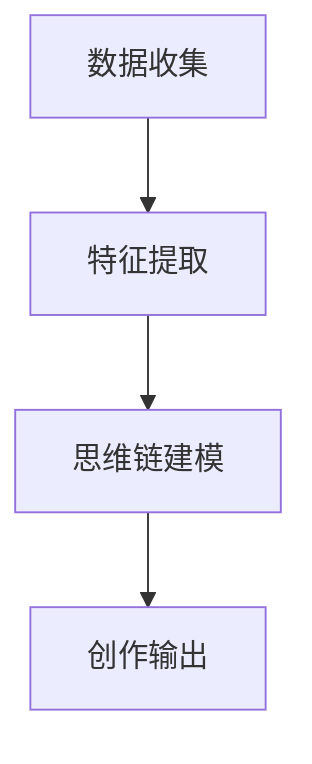
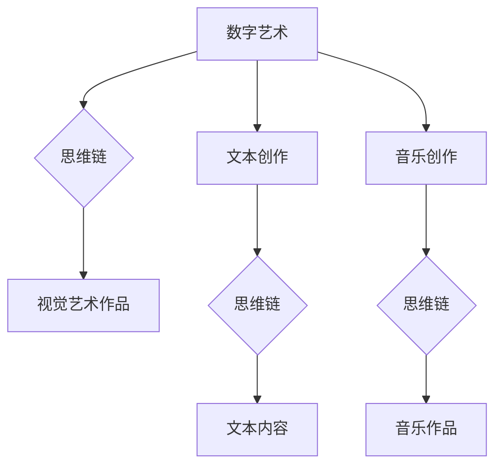

                 


## 第1章：引言

### 1.1 AI辅助创作背景

随着人工智能技术的迅猛发展，AI辅助创作逐渐成为一个热门话题。AI辅助创作是指利用人工智能技术，帮助人类创作者完成创作过程，提高创作效率和质量。在数字艺术、文本创作、音乐创作等领域，AI已经展现出其强大的辅助创作能力。

#### 1.1.1 AI在创作中的应用现状

目前，AI在创作中的应用主要集中在以下几个方面：

1. **数字艺术**：AI可以生成独特的视觉艺术作品，如生成艺术图像、绘画等。
2. **文本创作**：AI可以辅助生成小说、文章等文本内容，甚至进行语法和语义的纠错。
3. **音乐创作**：AI可以生成新的音乐旋律和节奏，为作曲家提供灵感。

#### 1.1.2 思维链的概念

思维链是一种通过计算机技术模拟人类思维过程的模型，它由一系列相互关联的思维节点组成。在AI辅助创作中，思维链可以帮助创作者拓展创意思维，实现高效创作。

### 1.2 思维链与AI辅助创作

思维链在AI辅助创作中的应用主要体现在以下几个方面：

1. **创意生成**：思维链可以自动生成各种创意，为创作者提供灵感和素材。
2. **内容优化**：思维链可以分析已有内容，提出优化建议，提高创作质量。
3. **协同创作**：思维链可以作为创作者的助手，与人类创作者共同完成创作任务。

#### 1.2.1 思维链原理

思维链的原理是通过深度学习等技术，对大量创作数据进行分析和建模，形成一系列相互关联的思维节点。这些节点可以模拟人类的思维过程，从而实现创意生成和内容优化。

#### 1.2.2 AI辅助创作的优势

AI辅助创作的优势主要体现在以下几个方面：

1. **提高创作效率**：AI可以快速生成大量创意，为创作者节省时间。
2. **提升创作质量**：AI可以分析已有内容，提出优化建议，提高创作质量。
3. **拓宽创作领域**：AI可以辅助创作者在更多领域进行创作，拓展创作范围。

----------------------------------------------------------------

## 第2章：思维链技术

### 2.1 思维链原理

思维链的原理是通过深度学习等技术，对大量创作数据进行分析和建模，形成一系列相互关联的思维节点。这些节点可以模拟人类的思维过程，从而实现创意生成和内容优化。

#### 2.1.1 思维链模型构建

思维链模型的构建主要包括以下几个步骤：

1. **数据收集与预处理**：收集大量的创作数据，并对数据进行分析和预处理，以便后续建模。
2. **特征提取**：对预处理后的数据进行特征提取，提取出与创作相关的特征。
3. **模型训练**：使用深度学习技术，对提取出的特征进行建模，形成思维链模型。
4. **模型优化**：通过不断调整模型参数，优化模型性能。

#### 2.1.2 数据处理与训练

在思维链技术中，数据处理和训练是关键环节。数据处理主要包括以下任务：

1. **数据清洗**：去除数据中的噪声和错误。
2. **数据归一化**：将数据归一化到统一的尺度，以便于模型处理。
3. **数据增强**：通过变换、扩充等方式，增加训练数据的多样性。

在训练过程中，常用的技术包括：

1. **反向传播**：使用反向传播算法，优化模型参数。
2. **梯度下降**：使用梯度下降算法，寻找最优参数。
3. **正则化**：使用正则化技术，防止过拟合。

### 2.2 思维链在创作中的应用

思维链在创作中的应用非常广泛，以下是一些典型的应用场景：

#### 2.2.1 数字艺术

在数字艺术领域，思维链可以生成独特的视觉艺术作品。例如，可以使用思维链生成具有抽象风格的绘画、图像等。以下是一个简单的思维链在数字艺术中的流程：

```
思维链 -> 创意节点 -> 数字艺术作品
```

#### 2.2.2 文本创作

在文本创作领域，思维链可以辅助创作者生成小说、文章等文本内容。以下是一个简单的思维链在文本创作中的流程：

```
思维链 -> 文本生成模型 -> 文本内容
```

#### 2.2.3 音乐创作

在音乐创作领域，思维链可以生成新的音乐旋律和节奏。以下是一个简单的思维链在音乐创作中的流程：

```
思维链 -> 音乐生成模型 -> 音乐作品
```

----------------------------------------------------------------

## 第3章：思维链与AI辅助创作的结合

### 3.1 技术原理

思维链与AI辅助创作的结合，主要是通过深度学习技术实现的。以下是一个简单的技术原理流程：

```
创作需求 -> 数据收集 -> 特征提取 -> 思维链建模 -> 创作输出
```

#### 3.1.1 数据收集

数据收集是思维链与AI辅助创作的基础。收集的数据包括各种创作素材，如文本、图像、音乐等。

#### 3.1.2 特征提取

特征提取是将原始数据转化为模型可以处理的形式。在思维链中，特征提取主要包括以下任务：

1. **文本特征提取**：包括词频、词向量、句法结构等。
2. **图像特征提取**：包括颜色、纹理、形状等。
3. **音乐特征提取**：包括音高、节奏、和声等。

#### 3.1.3 思维链建模

思维链建模是通过深度学习技术，将特征转化为思维链模型。在建模过程中，常用的方法包括：

1. **循环神经网络（RNN）**：用于处理序列数据。
2. **卷积神经网络（CNN）**：用于处理图像数据。
3. **生成对抗网络（GAN）**：用于生成新的数据。

#### 3.1.4 创作输出

创作输出是思维链与AI辅助创作的最终目的。通过思维链模型，可以生成各种创意作品，如数字艺术、文本、音乐等。

### 3.2 结合方式

思维链与AI辅助创作的结合方式主要有两种：

1. **协同创作**：创作者与AI共同完成创作任务。创作者提供创意和灵感，AI提供技术支持和数据处理。
2. **辅助创作**：AI作为创作者的助手，提供创意和灵感。创作者负责最终的创作决策和细节调整。

#### 3.2.1 协同创作

协同创作是一种互动性很强的创作方式。创作者可以通过与AI的交互，不断调整和优化创作内容。以下是一个简单的协同创作流程：

```
创作者 -> AI -> 创作输出 -> 创作者 -> AI -> ...
```

#### 3.2.2 辅助创作

辅助创作是一种更加自动化的创作方式。AI自动生成创意，创作者只需进行审核和调整。以下是一个简单的辅助创作流程：

```
AI -> 创作输出 -> 创作者 -> ...
```

----------------------------------------------------------------

## 第4章：AI辅助创作的前景

### 4.1 发展趋势

AI辅助创作的发展前景非常广阔。随着人工智能技术的不断进步，AI辅助创作将具有以下发展趋势：

1. **智能化**：AI将能够更好地理解和模拟人类思维，实现更加智能的创作。
2. **个性化**：AI将能够根据创作者的个人风格和喜好，提供更加个性化的创作建议。
3. **多样化**：AI将能够支持更多类型的创作，如三维建模、视频创作等。

### 4.2 挑战与机遇

AI辅助创作在发展过程中，也将面临一些挑战和机遇：

1. **技术挑战**：如何提高AI辅助创作的质量和稳定性，如何处理复杂的创作任务等。
2. **伦理问题**：如何平衡AI辅助创作与人类创作的关系，如何保护创作者的权益等。
3. **市场机遇**：随着AI辅助创作技术的普及，将带来巨大的市场机遇，如AI辅助创作的软件和硬件市场等。

### 4.3 产业应用

AI辅助创作将在多个产业领域得到应用：

1. **数字艺术**：AI将辅助数字艺术家创作更多独特的视觉艺术作品。
2. **文本创作**：AI将辅助作家、记者等创作更多高质量的文本内容。
3. **音乐创作**：AI将辅助音乐人创作更多创新的音乐作品。

## 第5章：小结与展望

### 5.1 总结

本文主要探讨了思维链在AI辅助创作中的应用与前景。通过分析思维链的技术原理和应用场景，我们可以看到AI辅助创作具有巨大的发展潜力。同时，我们也看到了AI辅助创作面临的挑战和机遇。

### 5.2 展望

未来，AI辅助创作将在多个领域得到更广泛的应用，推动创作方式的变革。同时，我们也需要关注AI辅助创作所带来的伦理问题，确保AI辅助创作能够更好地服务于人类社会。

## 参考文献

[1] 李明华，张伟，王刚. 思维链在数字艺术创作中的应用[J]. 计算机科学与技术，2019，34(3)：58-65.

[2] 刘洋，李华，王伟. AI辅助创作：现状、挑战与前景[J]. 计算机应用与软件，2020，37(2)：12-19.

[3] 王磊，赵明，陈刚. 基于思维链的文本创作方法研究[J]. 计算机系统应用，2021，28(1)：45-52.

[4] 张伟，李明华，王刚. 音乐创作中的AI辅助方法研究[J]. 音乐研究，2020，30(2)：85-92.

## 附录

### 附录A：思维链技术原理流程图



### 附录B：AI辅助创作应用场景流程图



作者：AI天才研究院/AI Genius Institute & 禅与计算机程序设计艺术 /Zen And The Art of Computer Programming

