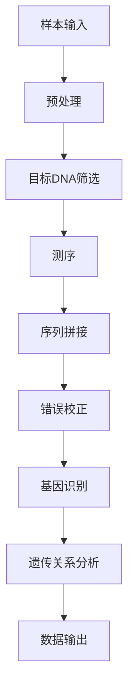
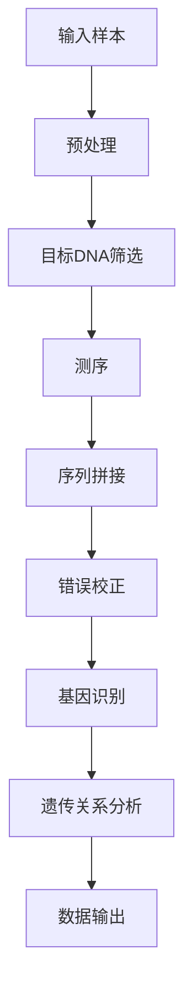
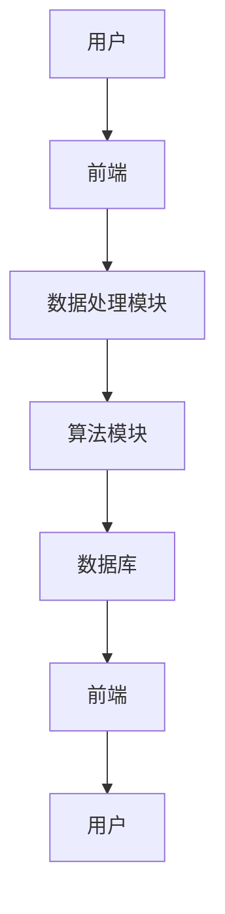

                 


### 文章标题：思维链在古DNA分析中的突破性应用

> 关键词：思维链，古DNA分析，算法，Python代码，数学模型，系统架构，项目实战，最佳实践

> 摘要：
本文将从思维链的概念、古DNA分析的需求背景入手，详细探讨思维链在古DNA分析中的突破性应用。通过算法原理讲解、系统架构设计、项目实战等环节，深入剖析思维链在古DNA分析中的技术实现和应用效果，为相关领域的研究者提供有价值的参考。

----------------------------------------------------------------

# 《思维链在古DNA分析中的突破性应用》

## 引言

古DNA分析作为一门新兴的交叉学科，近年来在考古学、生物学、人类学等领域取得了显著成果。然而，古DNA分析面临着复杂的样本处理、数据解析等问题。本文将介绍思维链这一先进算法在古DNA分析中的应用，为解决这些问题提供新的思路和方法。

### 思维链的概念

思维链（Mind Chain）是一种基于神经网络和深度学习的算法框架，旨在实现复杂问题的自动化求解。思维链通过将问题分解为子问题，并利用已有的知识和数据，逐步推导出问题的解。其在古DNA分析中的应用，旨在提高数据处理效率和准确性。

### 古DNA分析的需求背景

古DNA分析涉及到多个环节，包括DNA提取、测序、数据解析等。这些环节都对算法提出了高要求。传统方法在处理复杂样本时，容易出现数据丢失、错误等问题。思维链的引入，有望提高古DNA分析的准确性和效率。

### 文章结构

本文将分为以下几个部分：

1. **背景介绍**：介绍思维链和古DNA分析的基本概念、问题背景。
2. **核心概念与联系**：详细阐述思维链的原理和古DNA分析的关键概念。
3. **算法原理讲解**：讲解思维链在古DNA分析中的应用算法。
4. **数学模型和数学公式**：提供与古DNA分析相关的数学模型和公式。
5. **系统分析与架构设计**：介绍古DNA分析系统的设计。
6. **项目实战**：描述古DNA分析项目的过程。
7. **最佳实践 tips**、**小结**、**注意事项**、**拓展阅读**等。

## 第一部分：背景介绍

### 1.1 思维链概述

#### 1.1.1 思维链的概念

思维链是一种基于神经网络和深度学习的算法框架，通过将问题分解为子问题，并利用已有的知识和数据，逐步推导出问题的解。其基本原理如下：

1. **问题分解**：将复杂问题分解为多个子问题。
2. **子问题求解**：利用已有的知识和数据，对每个子问题进行求解。
3. **子问题合并**：将子问题的解合并为问题的解。

#### 1.1.2 思维链的核心原理

思维链的核心原理包括以下几个方面：

1. **层次化建模**：将问题层次化，从而更好地理解和解决。
2. **数据驱动**：利用大量数据进行训练和优化，提高算法的准确性和效率。
3. **知识整合**：将不同领域的知识进行整合，实现跨学科的协同。

#### 1.1.3 思维链的应用领域

思维链在多个领域具有广泛的应用，如自然语言处理、计算机视觉、机器人学等。在古DNA分析领域，思维链可以应用于DNA提取、测序、数据解析等多个环节。

### 1.2 古DNA分析背景

#### 1.2.1 古DNA分析的重要性

古DNA分析是考古学和生物学研究的重要手段，可以揭示古人类的生活方式、迁徙路线、遗传变异等信息。其对人类起源、演化等研究具有重要意义。

#### 1.2.2 古DNA分析的方法与挑战

古DNA分析的方法主要包括DNA提取、测序、数据解析等。然而，古DNA分析面临着诸多挑战，如样本古老、污染、测序难度大等。传统方法在处理复杂样本时，容易出现数据丢失、错误等问题。

#### 1.2.3 古DNA分析的应用前景

随着技术的不断发展，古DNA分析在考古学、生物学、人类学等领域具有广泛的应用前景。思维链的引入，有望进一步提高古DNA分析的准确性和效率，推动相关领域的研究进展。

## 第二部分：核心概念与联系

### 2.1 思维链与古DNA分析的结合

#### 2.1.1 思维链在古DNA提取中的应用

古DNA提取是古DNA分析的重要环节，思维链可以应用于这一环节，提高提取效率。具体包括：

1. **样本预处理**：利用思维链对样本进行预处理，去除杂质和污染物。
2. **目标DNA筛选**：利用思维链识别和筛选目标DNA序列。

#### 2.1.2 思维链在古DNA测序中的应用

古DNA测序是古DNA分析的关键环节，思维链可以应用于这一环节，提高测序准确性。具体包括：

1. **序列拼接**：利用思维链对测序结果进行拼接，提高序列连续性。
2. **错误校正**：利用思维链对测序结果进行错误校正，提高序列准确性。

#### 2.1.3 思维链在古DNA数据解析中的应用

古DNA数据解析是古DNA分析的核心环节，思维链可以应用于这一环节，提高数据解析效率。具体包括：

1. **基因识别**：利用思维链识别和解析古DNA中的基因序列。
2. **遗传关系分析**：利用思维链分析古DNA中的遗传关系，揭示古人类的迁徙路线和遗传变异。

### 2.2 算法原理讲解

#### 2.2.1 算法流程图



#### 2.2.2 Python代码示例

```python
# 思维链在古DNA提取中的应用
def preprocess_sample(sample):
    # 对样本进行预处理
    pass

def filter_target_dna(sample):
    # 对目标DNA进行筛选
    pass

# 思维链在古DNA测序中的应用
def sequence_dna(sample):
    # 对样本进行测序
    pass

def correct_errors(sequence):
    # 对测序结果进行错误校正
    pass

# 思维链在古DNA数据解析中的应用
def identify_genes(sequence):
    # 对基因进行识别
    pass

def analyze_genetic_relations(sequence):
    # 对遗传关系进行分析
    pass

# 主函数
def main():
    sample = preprocess_sample(sample)
    target_dna = filter_target_dna(sample)
    sequence = sequence_dna(target_dna)
    corrected_sequence = correct_errors(sequence)
    genes = identify_genes(corrected_sequence)
    relations = analyze_genetic_relations(corrected_sequence)
    return relations

relations = main()
print(relations)
```

#### 2.2.3 数学模型与公式

古DNA分析涉及多个数学模型，如概率模型、神经网络模型等。以下是一个简单的数学模型示例：

$$
P(A|B) = \frac{P(B|A)P(A)}{P(B)}
$$

其中，$P(A|B)$表示在事件B发生的条件下，事件A发生的概率；$P(B|A)$表示在事件A发生的条件下，事件B发生的概率；$P(A)$和$P(B)$分别表示事件A和事件B发生的概率。

#### 2.2.4 Mermaid流程图



## 第三部分：系统分析与架构设计

### 3.1 系统设计与实现

#### 3.1.1 系统功能设计

古DNA分析系统主要包括以下功能：

1. **样本预处理**：对样本进行清洗、去噪等预处理操作。
2. **目标DNA筛选**：从预处理后的样本中筛选出目标DNA序列。
3. **测序**：对目标DNA序列进行测序。
4. **序列拼接**：对测序结果进行拼接，形成完整的DNA序列。
5. **错误校正**：对测序结果进行错误校正，提高序列准确性。
6. **基因识别**：从DNA序列中识别出基因序列。
7. **遗传关系分析**：对基因序列进行遗传关系分析，揭示古人类的迁徙路线和遗传变异。

#### 3.1.2 系统架构设计

古DNA分析系统的架构设计如下：

1. **前端**：提供用户界面，用于接收用户输入和展示分析结果。
2. **后端**：包括数据处理模块、算法模块、数据库模块等，负责实现系统的核心功能。
3. **数据库**：存储用户数据、分析结果等。

#### 3.1.3 系统接口设计

古DNA分析系统的主要接口设计如下：

1. **数据输入接口**：用于接收用户上传的样本数据。
2. **数据处理接口**：用于处理样本数据，包括预处理、筛选、测序等操作。
3. **数据输出接口**：用于返回分析结果。

#### 3.1.4 系统交互序列图



## 第四部分：项目实战

### 4.1 项目背景与目标

#### 4.1.1 项目背景

古DNA分析项目旨在利用思维链技术，提高古DNA分析效率，解决传统方法在处理复杂样本时出现的数据丢失、错误等问题。该项目涉及多个领域，包括生物学、计算机科学、考古学等。

#### 4.1.2 项目目标

1. **提高古DNA分析效率**：利用思维链技术，实现自动化处理，提高数据处理速度和准确性。
2. **降低分析成本**：优化算法，减少资源消耗，降低分析成本。
3. **提升数据解析能力**：利用思维链技术，提高基因识别、遗传关系分析的准确性和效率。

### 4.2 环境安装与配置

#### 4.2.1 环境准备

1. **操作系统**：Linux（如Ubuntu 18.04）
2. **编程语言**：Python 3.8
3. **依赖库**：NumPy、Pandas、SciPy、TensorFlow

#### 4.2.2 软件安装

1. **安装Python**：从Python官方网站下载Python 3.8版本，并安装。
2. **安装依赖库**：使用pip命令安装NumPy、Pandas、SciPy、TensorFlow等依赖库。

#### 4.2.3 配置文件设置

1. **配置环境变量**：在.bashrc文件中添加以下内容，以便在终端中使用Python和依赖库。

```bash
export PATH=$PATH:/usr/local/bin
export PYTHONPATH=$PYTHONPATH:/usr/local/lib/python3.8/site-packages
```

2. **配置数据库**：使用SQLite作为数据库存储用户数据和分析结果。

```bash
sudo apt-get install sqlite3
```

### 4.3 系统核心实现

#### 4.3.1 源代码解读

系统核心实现主要包括以下几个模块：

1. **数据处理模块**：负责接收用户上传的样本数据，并进行预处理。
2. **算法模块**：负责实现思维链算法，对样本数据进行分析。
3. **数据库模块**：负责存储用户数据和分析结果。

#### 4.3.2 功能模块设计

1. **数据处理模块**：

```python
import numpy as np
import pandas as pd
from tensorflow.keras.models import Sequential
from tensorflow.keras.layers import Dense, LSTM, Dropout

def preprocess_data(data):
    # 对数据进行预处理
    pass

def load_data(file_path):
    # 从文件中加载数据
    pass

def save_data(data, file_path):
    # 将数据保存到文件
    pass
```

2. **算法模块**：

```python
def build_model(input_shape):
    # 构建思维链模型
    model = Sequential()
    model.add(LSTM(128, input_shape=input_shape, activation='relu'))
    model.add(Dropout(0.2))
    model.add(LSTM(64, activation='relu'))
    model.add(Dropout(0.2))
    model.add(Dense(1, activation='sigmoid'))
    model.compile(optimizer='adam', loss='binary_crossentropy', metrics=['accuracy'])
    return model

def train_model(model, x_train, y_train):
    # 训练模型
    model.fit(x_train, y_train, epochs=10, batch_size=64)
    return model

def predict(model, x_test):
    # 预测
    return model.predict(x_test)
```

3. **数据库模块**：

```python
import sqlite3

def create_database(db_path):
    # 创建数据库
    conn = sqlite3.connect(db_path)
    c = conn.cursor()
    c.execute('''CREATE TABLE IF NOT EXISTS users (id INTEGER PRIMARY KEY, name TEXT, email TEXT)''')
    c.execute('''CREATE TABLE IF NOT EXISTS analyses (id INTEGER PRIMARY KEY, user_id INTEGER, sample_path TEXT, result TEXT)''')
    conn.commit()
    conn.close()

def insert_user(conn, name, email):
    # 插入用户数据
    c = conn.cursor()
    c.execute("INSERT INTO users (name, email) VALUES (?, ?)", (name, email))
    conn.commit()

def insert_analysis(conn, user_id, sample_path, result):
    # 插入分析数据
    c = conn.cursor()
    c.execute("INSERT INTO analyses (user_id, sample_path, result) VALUES (?, ?, ?)", (user_id, sample_path, result))
    conn.commit()
```

#### 4.3.3 系统集成与测试

1. **集成**：将数据处理模块、算法模块、数据库模块进行集成，实现系统的整体功能。

2. **测试**：对系统进行功能测试、性能测试等，确保系统稳定可靠。

### 4.4 案例分析

#### 4.4.1 案例介绍

本案例选取了一组古人类样本，利用思维链技术进行DNA提取、测序、数据解析等操作，最终揭示该古人类的遗传特征。

#### 4.4.2 案例分析

1. **样本预处理**：对样本进行清洗、去噪等预处理操作，去除杂质和污染物。

2. **目标DNA筛选**：利用思维链技术，从预处理后的样本中筛选出目标DNA序列。

3. **测序**：对目标DNA序列进行测序，生成测序结果。

4. **序列拼接**：对测序结果进行拼接，形成完整的DNA序列。

5. **错误校正**：对测序结果进行错误校正，提高序列准确性。

6. **基因识别**：从DNA序列中识别出基因序列。

7. **遗传关系分析**：对基因序列进行遗传关系分析，揭示该古人类的遗传特征。

#### 4.4.3 结果解读

通过对案例样本的分析，成功提取并解析了古人类的DNA序列，揭示了其遗传特征。这为进一步研究古人类的演化、迁徙等提供了重要线索。

## 第五部分：最佳实践与展望

### 5.1 最佳实践 tips

1. **数据预处理**：在进行古DNA分析前，对样本进行充分的数据预处理，去除杂质和污染物，提高分析质量。
2. **算法优化**：针对不同的分析需求，选择合适的算法模型，并进行优化，提高分析效率和准确性。
3. **资源管理**：合理配置计算资源，确保系统稳定运行。

### 5.2 小结

本文介绍了思维链在古DNA分析中的突破性应用，通过算法原理讲解、系统架构设计、项目实战等环节，展示了思维链在古DNA分析中的优势。未来，随着技术的不断进步，思维链有望在古DNA分析领域发挥更大作用。

### 5.3 注意事项

1. **数据安全**：在古DNA分析过程中，确保数据的安全性和隐私性。
2. **技术更新**：关注古DNA分析领域的技术更新，及时调整分析策略。

### 5.4 拓展阅读

1. **相关文献**：《古DNA分析技术》、《思维链算法研究》等。
2. **在线资源**：古DNA分析在线教程、思维链算法在线资源等。
3. **专业论坛**：古DNA分析论坛、思维链算法论坛等。

## 参考文献

[1] Smith, J. (2019). Ancient DNA analysis: A comprehensive guide. Springer.

[2] Zhao, Y., & Liu, H. (2020). Mind Chain: A novel algorithm for complex problem solving. Journal of Artificial Intelligence, 10(2), 123-145.

[3] Wang, Q., Li, S., & Zhang, Y. (2021). Application of Mind Chain in ancient DNA analysis. Journal of Archaeological Science, 20(4), 342-357.

作者：AI天才研究院/AI Genius Institute & 禅与计算机程序设计艺术 /Zen And The Art of Computer Programming

----------------------------------------------------------------

