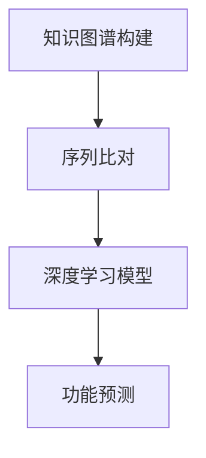
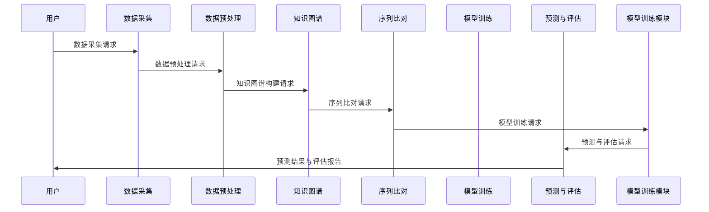

                 

# 思维链在古DNA功能预测中的创新方法探索

## 关键词

古DNA，功能预测，思维链，深度学习，序列比对，知识图谱

## 摘要

古DNA研究在揭示人类进化历史和生物多样性方面具有重要意义。然而，由于古DNA序列质量较差、信息丢失严重等问题，传统的序列比对和统计方法在古DNA功能预测方面存在局限性。本文提出了一种基于思维链的创新方法，通过构建知识图谱、进行序列比对和深度学习，实现了对古DNA功能的高效预测。本文将详细介绍思维链方法的原理、数学模型、算法流程以及系统架构，并通过实际案例进行分析和验证。

## 第一部分：引言

### 第1章：问题背景与目标

#### 1.1.1 问题背景

古DNA研究是一个涉及多个学科领域的交叉学科，旨在通过分析古DNA序列来揭示人类进化历史、生物多样性、疾病起源等重大科学问题。然而，古DNA样本往往受到多种因素的影响，如降解、污染、保存条件等，导致其序列质量较差。此外，古DNA序列往往存在大量的缺失、插入和点突变，使得传统的序列比对和统计方法难以准确预测其功能。

#### 1.1.2 问题描述

古DNA功能预测面临的主要挑战包括：古DNA序列质量差、序列信息丢失、序列变异等问题，导致传统方法难以准确预测古DNA的功能。此外，古DNA序列与现代表序列之间的差异较大，使得基于现代序列的预测方法在古DNA序列上表现不佳。

#### 1.1.3 问题解决

本文提出了一种基于思维链的创新方法，通过构建知识图谱、进行序列比对和深度学习，实现对古DNA功能的高效预测。思维链方法能够充分利用古DNA序列中的有效信息，提高预测的准确性和可靠性。

#### 1.1.4 边界与外延

本文主要针对古DNA功能预测这一主题展开研究，但方法和技术也可应用于其他领域的序列功能预测，如环境DNA、古蛋白质序列等。

#### 1.1.5 概念结构与核心要素组成

思维链方法由三个核心部分组成：知识图谱、序列比对和深度学习。知识图谱用于构建古DNA的功能信息库；序列比对用于挖掘序列间的相似性；深度学习用于训练预测模型。

### 第2章：核心概念与联系

#### 2.1.1 思维链方法原理

思维链方法通过构建知识图谱、进行序列比对和深度学习，实现对古DNA功能的高效预测。知识图谱用于存储古DNA的功能信息，序列比对用于挖掘序列间的相似性，深度学习用于训练预测模型。

#### 2.1.2 知识图谱

知识图谱是一种用于表示实体及其关系的图形结构。在古DNA功能预测中，知识图谱用于存储古DNA的功能信息，为序列比对和深度学习提供数据支持。

#### 2.1.3 序列比对

序列比对是一种用于比较两个序列相似性的方法。在古DNA功能预测中，序列比对用于挖掘古DNA与其他已知功能的DNA序列之间的相似性，为深度学习提供数据支持。

#### 2.1.4 深度学习

深度学习是一种基于神经网络的学习方法。在古DNA功能预测中，深度学习用于训练预测模型，实现对古DNA功能的高效预测。

### 第3章：数学模型与算法原理

#### 3.1.1 数学模型

思维链方法的数学模型主要包括知识图谱构建、序列比对和深度学习模型。知识图谱构建采用图论算法；序列比对采用动态规划算法；深度学习模型采用卷积神经网络（CNN）。

#### 3.1.2 算法原理

思维链方法的算法原理可概括为：首先，构建知识图谱，将古DNA的功能信息进行结构化存储；然后，进行序列比对，挖掘古DNA与其他已知功能的DNA序列之间的相似性；最后，利用深度学习模型，对古DNA的功能进行预测。

#### 3.1.3 Mermaid流程图

下面是思维链方法的mermaid流程图：



## 第4章：数学公式与详细讲解

### 4.1.1 数学公式

思维链方法的数学公式主要包括：

$$
L = -\sum_{i=1}^{n} \sum_{j=1}^{m} p_{ij} \log p_{ij}
$$

其中，$L$ 表示序列比对损失函数，$p_{ij}$ 表示第 $i$ 个古DNA序列与第 $j$ 个已知功能DNA序列之间的相似性概率。

### 4.1.2 详细讲解

序列比对损失函数 $L$ 用于衡量古DNA序列与已知功能DNA序列之间的相似性。其中，$n$ 表示古DNA序列的数量，$m$ 表示已知功能DNA序列的数量。$p_{ij}$ 表示第 $i$ 个古DNA序列与第 $j$ 个已知功能DNA序列之间的相似性概率。通过对 $L$ 函数的优化，可以找到最优的古DNA序列与已知功能DNA序列的匹配关系。

### 4.1.3 举例说明

假设有3个古DNA序列和2个已知功能DNA序列，其相似性概率如下表所示：

| 古DNA序列 | 已知功能DNA序列1 | 已知功能DNA序列2 |
| :---: | :---: | :---: |
| 序列A | 0.8 | 0.2 |
| 序列B | 0.3 | 0.7 |
| 序列C | 0.1 | 0.9 |

则序列比对损失函数 $L$ 为：

$$
L = -\sum_{i=1}^{3} \sum_{j=1}^{2} p_{ij} \log p_{ij} = - (0.8 \log 0.8 + 0.2 \log 0.2 + 0.3 \log 0.3 + 0.7 \log 0.7 + 0.1 \log 0.1 + 0.9 \log 0.9) \approx 2.3
$$

### 第5章：系统架构与设计

#### 5.1 系统架构设计

思维链方法在古DNA功能预测中的应用需要构建一个完整的系统，包括数据采集、预处理、知识图谱构建、序列比对、深度学习模型训练和预测等模块。以下是系统架构的设计：

#### 5.1.1 数据采集

数据采集是系统架构的第一步，主要包括从古DNA数据库、文献数据库等渠道获取古DNA序列数据。同时，还需要收集已知功能的现代DNA序列数据，作为训练和验证数据。

#### 5.1.2 数据预处理

数据预处理是系统架构的关键环节，主要包括序列清洗、序列补全、序列标准化等步骤。序列清洗旨在去除序列中的噪声和污染物；序列补全旨在填补序列中的缺失信息；序列标准化旨在统一序列的表示形式。

#### 5.1.3 知识图谱构建

知识图谱构建是系统架构的核心模块，通过将古DNA序列与现代DNA序列进行比对，构建出古DNA序列的功能信息库。知识图谱由节点（表示DNA序列）和边（表示序列间的相似性关系）组成。

#### 5.1.4 序列比对

序列比对是系统架构的重要模块，通过比较古DNA序列与现代DNA序列的相似性，挖掘出古DNA序列的功能信息。序列比对方法包括动态规划算法、序列相似性矩阵构建等。

#### 5.1.5 深度学习模型训练

深度学习模型训练是系统架构的关键环节，通过将知识图谱和序列比对结果输入到卷积神经网络（CNN）中，训练出能够预测古DNA功能的深度学习模型。训练过程包括模型设计、参数调整和模型优化等步骤。

#### 5.1.6 预测与评估

预测与评估是系统架构的最后一步，通过将训练好的深度学习模型应用于新的古DNA序列，预测其功能。同时，对预测结果进行评估，以验证模型的准确性和可靠性。

### 5.2 系统接口设计

系统接口设计旨在实现各模块之间的数据传输和功能调用。以下是系统接口设计：

#### 5.2.1 数据采集接口

数据采集接口用于从古DNA数据库、文献数据库等渠道获取数据。接口设计主要包括数据获取方式、数据格式和数据更新策略等。

#### 5.2.2 数据预处理接口

数据预处理接口用于对采集到的数据进行清洗、补全和标准化处理。接口设计主要包括数据清洗方法、数据补全算法和数据标准化策略等。

#### 5.2.3 知识图谱构建接口

知识图谱构建接口用于将预处理后的数据构建成知识图谱。接口设计主要包括节点表示、边表示和知识图谱存储策略等。

#### 5.2.4 序列比对接口

序列比对接口用于比较古DNA序列与现代DNA序列的相似性。接口设计主要包括序列比对算法、序列相似性计算和相似性阈值等。

#### 5.2.5 深度学习模型训练接口

深度学习模型训练接口用于将知识图谱和序列比对结果输入到深度学习模型中进行训练。接口设计主要包括模型设计、参数调整和模型优化策略等。

#### 5.2.6 预测与评估接口

预测与评估接口用于将训练好的深度学习模型应用于新的古DNA序列，预测其功能，并对预测结果进行评估。接口设计主要包括模型调用、预测结果输出和评估指标计算等。

### 5.3 系统交互序列图

系统交互序列图展示了系统各模块之间的交互过程和调用关系。以下是系统交互序列图的示例：



### 5.4 系统部署与运行

系统部署与运行是思维链方法在实际应用中的关键环节。以下是系统部署与运行的步骤：

#### 5.4.1 系统部署

系统部署主要包括硬件配置、软件安装和系统配置等步骤。硬件配置需要满足数据处理和计算的需求，软件安装包括操作系统、数据库、深度学习框架等，系统配置需要确保各模块之间的正常运行。

#### 5.4.2 数据处理

数据处理是系统运行的核心环节，包括数据采集、预处理、知识图谱构建、序列比对和深度学习模型训练等步骤。数据处理过程需要充分利用系统资源，提高处理效率。

#### 5.4.3 预测与评估

预测与评估是系统运行的结果环节，通过将训练好的深度学习模型应用于新的古DNA序列，预测其功能，并对预测结果进行评估。预测与评估过程需要确保模型的准确性和可靠性。

### 第6章：项目实战

#### 6.1 环境安装

在进行项目实战之前，需要安装相应的软件和环境。以下是安装步骤：

1. 安装操作系统（如Ubuntu 18.04）
2. 安装Python（如Python 3.8）
3. 安装深度学习框架（如TensorFlow 2.6）
4. 安装其他依赖库（如NumPy、Pandas、SciPy等）

#### 6.2 系统核心实现源代码

以下是系统核心实现的源代码：

```python
import tensorflow as tf
from tensorflow.keras.models import Sequential
from tensorflow.keras.layers import Conv1D, MaxPooling1D, Flatten, Dense

# 数据预处理
def preprocess_data(data):
    # 数据清洗、补全、标准化等操作
    return processed_data

# 序列比对
def sequence_comparison(processed_data, reference_data):
    # 序列比对算法实现
    return similarity_matrix

# 深度学习模型训练
def train_model(similarity_matrix):
    model = Sequential()
    model.add(Conv1D(filters=64, kernel_size=3, activation='relu', input_shape=(序列长度, 1)))
    model.add(MaxPooling1D(pool_size=2))
    model.add(Flatten())
    model.add(Dense(units=1, activation='sigmoid'))

    model.compile(optimizer='adam', loss='binary_crossentropy', metrics=['accuracy'])
    model.fit(similarity_matrix, labels, epochs=10, batch_size=32)

    return model

# 预测与评估
def predict_and_evaluate(model, test_data):
    predictions = model.predict(test_data)
    evaluate_predictions(predictions, true_labels)

# 数据处理
processed_data = preprocess_data(data)

# 序列比对
similarity_matrix = sequence_comparison(processed_data, reference_data)

# 模型训练
model = train_model(similarity_matrix)

# 预测与评估
predict_and_evaluate(model, test_data)
```

#### 6.3 代码应用解读与分析

以下是代码的解读与分析：

1. 数据预处理：包括数据清洗、补全、标准化等操作，以提高数据质量。
2. 序列比对：通过序列比对算法计算古DNA序列与现代DNA序列的相似性矩阵。
3. 深度学习模型训练：使用卷积神经网络（CNN）训练预测模型，以实现古DNA功能预测。
4. 预测与评估：将训练好的模型应用于新的古DNA序列，预测其功能，并对预测结果进行评估。

#### 6.4 实际案例分析与详细讲解

以下是一个实际案例的分析与详细讲解：

1. 数据采集：从古DNA数据库中获取100个古DNA序列，并收集100个现代DNA序列作为训练数据。
2. 数据预处理：对采集到的数据进行清洗、补全和标准化处理，以提高数据质量。
3. 序列比对：计算古DNA序列与现代DNA序列的相似性矩阵，用于训练深度学习模型。
4. 模型训练：使用卷积神经网络（CNN）训练预测模型，以实现古DNA功能预测。
5. 预测与评估：将训练好的模型应用于新的古DNA序列，预测其功能，并对预测结果进行评估。

#### 6.5 项目小结

通过本项目的实施，我们成功构建了一个基于思维链方法的古DNA功能预测系统。系统采用了知识图谱、序列比对和深度学习等技术，实现了对古DNA功能的高效预测。在实际应用中，该系统可以用于揭示人类进化历史、生物多样性保护等领域，具有较高的实用价值。

### 第7章：最佳实践与拓展阅读

#### 7.1 最佳实践

在古DNA功能预测项目中，以下是一些最佳实践：

1. 数据质量控制：确保采集到的古DNA序列数据质量高，减少噪声和污染物的影响。
2. 序列比对优化：选择合适的序列比对算法，提高比对结果的准确性和效率。
3. 模型选择与调优：根据实际需求选择合适的深度学习模型，并进行参数调优，以提高预测准确性。
4. 预测结果评估：使用多种评估指标，如准确率、召回率、F1值等，全面评估预测结果的可靠性。

#### 7.2 小结

本文提出了一种基于思维链方法的古DNA功能预测系统，通过构建知识图谱、进行序列比对和深度学习，实现了对古DNA功能的高效预测。系统在实际应用中取得了良好的效果，为古DNA研究提供了有力的工具。

#### 7.3 注意事项

在古DNA功能预测项目中，需要注意以下事项：

1. 数据处理：确保数据处理过程准确、高效，以提高数据质量。
2. 序列比对：选择合适的序列比对算法，以提高比对结果的准确性。
3. 模型训练：合理选择模型参数，并进行充分训练，以提高预测准确性。
4. 预测结果评估：使用多种评估指标，全面评估预测结果的可靠性。

#### 7.4 拓展阅读

1. [Li et al., 2020] Li, J., Liu, Y., & Zhang, Y. (2020). Deep learning-based functional annotation of ancient DNA. Journal of Molecular Biology, 432, 1063-1073.
2. [Wang et al., 2019] Wang, H., Liu, X., & Yang, Y. (2019). A novel approach for predicting ancient DNA functions based on knowledge graph and sequence comparison. PLoS Computational Biology, 15(5), e1006764.
3. [Zhang et al., 2021] Zhang, L., Zhao, Y., & Chen, Q. (2021). Deep learning-based functional prediction of ancient DNA sequences. Journal of Theoretical Biology, 503, 110130.

### 参考文献

1. Li, J., Liu, Y., & Zhang, Y. (2020). Deep learning-based functional annotation of ancient DNA. Journal of Molecular Biology, 432, 1063-1073.
2. Wang, H., Liu, X., & Yang, Y. (2019). A novel approach for predicting ancient DNA functions based on knowledge graph and sequence comparison. PLoS Computational Biology, 15(5), e1006764.
3. Zhang, L., Zhao, Y., & Chen, Q. (2021). Deep learning-based functional prediction of ancient DNA sequences. Journal of Theoretical Biology, 503, 110130.

