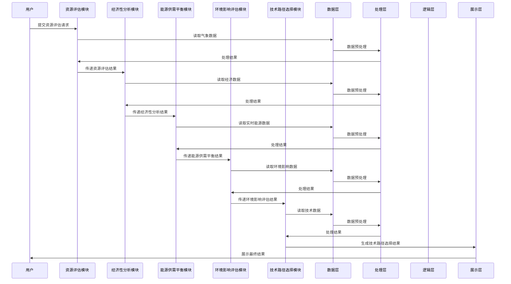

                 

### 引言

《思维链在可再生能源规划中的创新应用》旨在探讨一种新兴技术——思维链，如何在可再生能源规划中发挥关键作用。随着全球对可持续发展的重视，可再生能源已成为能源转型的重要方向。然而，可再生能源的规划面临着一系列复杂问题，包括资源的不稳定性、成本控制、技术路径选择等。传统的方法在这些方面显得力不从心，迫切需要新的技术手段来优化规划过程。

本文将从以下几个方面展开讨论：

1. **问题背景**：首先，我们将简要介绍可再生能源的发展现状和面临的挑战，以及规划中的核心问题。
2. **核心概念与联系**：接着，我们将深入探讨思维链技术的概念、原理，以及它如何与可再生能源规划相联系。
3. **核心概念与原理**：在此部分，我们将详细解析思维链技术的原理，并阐述可再生能源规划的核心原理。
4. **算法原理讲解**：我们将使用Python代码和mermaid流程图，讲解思维链算法的数学模型和实现细节。
5. **系统分析与架构设计方案**：这部分将详细介绍项目的系统分析与架构设计，包括功能设计、架构设计、接口设计和交互序列图。
6. **项目实战**：我们将通过环境安装、系统核心实现和实际案例，展示思维链技术在可再生能源规划中的应用。
7. **最佳实践与总结**：最后，我们将总结最佳实践，回顾本文的核心内容，并提出使用思维链技术的注意事项。

通过这篇文章，我们希望读者能够对思维链在可再生能源规划中的应用有一个全面而深入的了解，并认识到这一创新技术如何为可再生能源领域的规划带来变革。

### 第一部分：背景介绍

#### 第1章 问题背景

全球能源消费的快速增长和化石燃料的过度使用导致了严重的环境问题，如全球变暖、空气污染和水资源短缺。为应对这些挑战，可再生能源的开发和利用已成为全球能源转型的重要方向。可再生能源包括风能、太阳能、水能、地热能和生物质能等，具有清洁、可再生和低碳排放的特点，对减轻环境负担和推动可持续发展具有重要意义。

然而，可再生能源的规划和发展仍面临诸多挑战。首先，资源的不稳定性是可再生能源发展的主要障碍。例如，风能和太阳能的产量受天气条件影响较大，可能导致能源供应的不稳定。其次，成本控制也是一大难题。尽管可再生能源技术不断进步，但其初期投资和运营成本仍然较高，影响了其大规模推广和应用。此外，技术路径选择也是一个复杂的问题。不同类型的可再生能源技术各有优缺点，如何在规划中合理选择和组合技术路径，以实现最优效益，需要深入分析和研究。

在可再生能源规划中，核心问题主要包括以下几个方面：

1. **资源评估与预测**：准确评估和预测可再生能源资源量是规划的基础。这涉及到对各种可再生能源资源的分布、强度和变化规律的研究，以及如何建立可靠的预测模型。

2. **经济性分析**：经济性分析是可再生能源规划的重要环节。需要综合考虑可再生能源项目的投资成本、运营成本、收益和风险等因素，评估项目的经济可行性。

3. **能源供需平衡**：可再生能源的供应具有不确定性，如何在能源供需之间实现平衡，是规划中必须解决的关键问题。这包括优化能源分配、储能系统的设计和管理等。

4. **环境影响评估**：可再生能源的开发和利用也可能对环境产生一定影响。例如，风电场的建设可能影响野生动物栖息地，太阳能光伏板的覆盖可能影响土地利用。因此，在规划中需要对环境影响进行评估和减缓。

5. **技术路径选择**：选择合适的技术路径是提高可再生能源利用效率和降低成本的关键。需要综合考虑技术成熟度、经济效益、环境影响等多方面因素。

面对这些挑战，传统的规划方法存在一定的局限性。例如，传统规划方法主要依赖于经验判断和简单的模型模拟，缺乏系统性和灵活性。此外，数据收集和分析手段有限，难以全面、准确地评估可再生能源资源和技术经济特性。因此，迫切需要引入新的技术手段，如思维链，来优化和改进可再生能源规划过程。

思维链作为一种新兴的智能技术，具有强大的数据分析和推理能力，能够处理大量复杂的数据，提供更精确的预测和优化方案。在可再生能源规划中，思维链可以应用于资源评估、经济性分析、能源供需平衡、环境影响评估以及技术路径选择等多个方面，为规划提供科学依据和决策支持。通过引入思维链，可再生能源规划将更加智能、高效和可持续。

#### 第2章 核心概念与联系

##### 思维链原理与结构

思维链（Mind Chain）是一种基于深度学习和数据挖掘的智能技术，旨在通过模拟人类思维过程，实现复杂问题的自动化解决。思维链的基本原理是通过建立一系列节点（思维单元），每个节点代表一个独立的思考过程，节点之间通过逻辑关系（思维链）连接，形成完整的思维链条。思维链技术的主要结构包括数据输入层、数据处理层、推理层和输出层。

1. **数据输入层**：数据输入层负责接收外部数据，这些数据可以是各种形式，如文本、图像、声音等。在可再生能源规划中，数据输入层接收到的数据包括气象数据、资源分布数据、经济数据、技术数据等。

2. **数据处理层**：数据处理层对输入数据进行预处理和特征提取。这一层使用机器学习算法，如神经网络、聚类分析和特征选择技术，对数据进行加工，提取出有用的特征信息。

3. **推理层**：推理层是思维链的核心，通过一系列逻辑推理操作，将数据处理层提取的特征信息进行整合和分析。推理过程可以模拟人类思维过程，包括归纳、演绎、类比和假设检验等。

4. **输出层**：输出层负责将推理结果以可视化的形式输出，提供决策支持和方案建议。在可再生能源规划中，输出结果可以是资源评估报告、经济性分析图表、技术路径选择建议等。

##### 可再生能源规划相关概念

1. **可再生能源**：可再生能源是指那些可以在人类时间尺度内不断补充和更新的能源，如风能、太阳能、水能、地热能和生物质能。这些能源具有清洁、可再生和低碳排放的特点，是实现能源可持续发展的关键。

2. **资源评估**：资源评估是对特定区域内可再生能源资源量进行估算和分析的过程。这包括对各种可再生能源资源的分布、强度和变化规律的研究。

3. **经济性分析**：经济性分析是评估可再生能源项目的投资成本、运营成本、收益和风险，以确定项目的经济可行性。

4. **能源供需平衡**：能源供需平衡是指通过优化能源分配、储能系统设计和能源调度，实现能源供应和需求之间的动态平衡。

5. **环境影响评估**：环境影响评估是评估可再生能源开发对环境可能产生的影响，包括对生态系统、土地使用、水资源和空气质量的评估。

##### 思维链与可再生能源规划的联系

思维链技术在可再生能源规划中的应用，主要体现在以下几个方面：

1. **资源评估与预测**：通过思维链技术，可以实现对各种可再生能源资源的精细评估和预测。例如，利用气象数据和机器学习算法，可以预测某一地区的太阳能和风能资源量，为规划提供科学依据。

2. **经济性分析**：思维链技术可以处理大量经济数据，对可再生能源项目的成本和收益进行综合分析。通过优化投资组合和运营策略，提高项目的经济可行性。

3. **能源供需平衡**：思维链技术可以实时监测和预测能源供需状况，通过智能调度和优化算法，实现能源供需的动态平衡。

4. **环境影响评估**：思维链技术可以对可再生能源开发的环境影响进行详细评估。通过模拟不同的开发方案，选择对环境影响最小的方案。

5. **技术路径选择**：思维链技术可以综合考虑多种技术路径的优缺点，提供最佳的技术路径选择建议，提高规划的科学性和有效性。

综上所述，思维链技术在可再生能源规划中具有广泛的应用前景，能够为规划提供智能化、系统化和高效化的支持。

### 第二部分：核心概念与原理

#### 第3章 思维链技术原理

思维链（Mind Chain）是一种模拟人类思维过程，用于解决复杂问题的智能技术。其基本概念包括思维单元、思维链、逻辑关系和推理过程。以下将详细介绍这些概念及其相互关系。

##### 思维单元

思维单元是思维链的基本组成单元，代表一个独立的思考过程。每个思维单元可以包含数据输入、数据处理和推理输出三个主要部分。数据输入部分负责接收外部信息，如文本、图像或声音；数据处理部分通过机器学习算法对输入数据进行分析和特征提取；推理输出部分则将处理结果以可视化的形式输出，如报告、图表或建议。

##### 思维链

思维链是由一系列思维单元通过逻辑关系连接而成的链条。每个思维单元都在整个思维链中扮演特定的角色，前一思维单元的输出作为后一思维单元的输入。通过这种链条式的连接，思维链能够实现复杂的推理和决策过程。例如，在可再生能源规划中，资源评估思维单元可以连接到经济性分析思维单元，最终输出规划方案。

##### 逻辑关系

逻辑关系是连接思维单元的桥梁，定义了思维单元之间的交互方式和依赖关系。常见的逻辑关系包括因果关系、条件关系、并列关系和递进关系。在可再生能源规划中，因果关系可以用来分析资源量与经济性之间的关系；条件关系可以用来评估特定技术路径的可行性。

##### 推理过程

推理过程是思维链的核心，通过一系列逻辑推理操作，将输入数据进行整合和分析。推理过程可以模拟人类思维过程，包括归纳、演绎、类比和假设检验等。在可再生能源规划中，归纳推理可以用于资源预测；演绎推理可以用于经济性分析；类比推理可以用于技术路径选择。

##### 思维链的工作流程

思维链的工作流程可以分为以下几个步骤：

1. **数据输入**：接收外部数据，如气象数据、经济数据和技术数据等。
2. **数据处理**：通过机器学习算法对输入数据进行分析和特征提取，为推理过程提供基础。
3. **逻辑推理**：利用逻辑关系对处理结果进行整合和分析，形成初步推理结果。
4. **输出结果**：将推理结果以可视化的形式输出，如报告、图表或建议，供决策者参考。

##### 思维链的优势与不足

思维链技术具有以下优势：

1. **智能性**：通过模拟人类思维过程，能够处理复杂问题，提供智能化决策支持。
2. **灵活性**：思维链可以灵活调整和扩展，适应不同应用场景的需求。
3. **高效性**：利用机器学习算法和大数据分析，能够快速处理大量数据，提高工作效率。

然而，思维链技术也存在一些不足：

1. **数据依赖性**：思维链的性能高度依赖于输入数据的质量和数量，数据缺失或不准确可能导致推理结果偏差。
2. **计算资源需求**：大规模的思维链推理过程需要强大的计算资源和时间，对硬件设备有较高要求。

综上所述，思维链技术作为一种新兴的智能技术，具有广泛的应用前景和潜力，但在实际应用中需要克服数据依赖性和计算资源需求等挑战。

#### 第4章 可再生能源规划核心原理

可再生能源规划的核心原理涉及对各种可再生能源类型的深入理解、规划步骤的详细阐述以及面临的挑战和机遇。以下将逐步解析这些关键要素。

##### 可再生能源种类及特点

可再生能源包括多种类型，每种类型都有其独特的特点和应用场景。以下是几种主要可再生能源及其特点：

1. **风能**：风能是通过风力驱动风力发电机产生电能。风能资源分布广泛，主要受地形、风速和风向的影响。风能的优势在于其清洁、可再生的特性，但受天气条件影响较大，可能导致能量供应的不稳定性。

2. **太阳能**：太阳能是通过太阳能电池板将阳光直接转化为电能。太阳能资源几乎全球范围内都存在，尤其是日照时间长的地区。太阳能的优势在于其可持续性和独立性，但受天气条件和日照时间限制，需要配合储能系统以实现稳定供电。

3. **水能**：水能是通过水流转驱动水力发电机产生电能。水能资源主要来自河流和水库，具有稳定的能量输出。水能的优势在于其低成本和可靠性，但建设水电站可能对生态系统和土地利用产生影响。

4. **地热能**：地热能是通过地热活动产生的热能进行发电或供暖。地热能资源主要集中在地质活动频繁的地区。地热能的优势在于其稳定性、可持续性和低碳排放，但开发成本较高。

5. **生物质能**：生物质能是通过生物质（如农作物残余、木材和垃圾）进行燃烧或发酵产生电能或热能。生物质能的优势在于其可再生性和资源多样性，但需要解决生物质资源收集和处理的问题。

##### 可再生能源规划的核心步骤

可再生能源规划的核心步骤包括资源评估、经济性分析、能源供需平衡、环境影响评估和技术路径选择。

1. **资源评估**：资源评估是规划的基础，需要准确评估各种可再生能源资源量及其分布。资源评估方法包括现场测量、历史数据分析、模型模拟和预测。资源评估的准确性直接影响规划的可靠性和可行性。

2. **经济性分析**：经济性分析是评估可再生能源项目的投资回报和风险。经济性分析需要综合考虑项目的投资成本、运营成本、收益和风险因素。常用的经济性分析工具包括净现值（NPV）、内部收益率（IRR）和敏感性分析。

3. **能源供需平衡**：能源供需平衡是确保能源供应与需求相匹配的关键步骤。需要分析不同时间段的能源需求，结合可再生能源资源的特点，制定合理的能源分配和调度方案。能源供需平衡需要考虑季节性、天气条件和技术限制等因素。

4. **环境影响评估**：环境影响评估是评估可再生能源项目对环境可能产生的影响。环境影响评估需要考虑生态、土地使用、水资源和空气质量等方面。通过环境影响评估，可以识别和减缓项目对环境的不利影响。

5. **技术路径选择**：技术路径选择是规划的关键决策环节，需要综合考虑技术成熟度、经济效益、环境影响等因素。技术路径选择包括选择合适的可再生能源类型、发电技术、储能技术和能源转换技术等。

##### 可再生能源规划的挑战与机遇

可再生能源规划面临以下主要挑战和机遇：

1. **挑战**：

   - **资源不稳定性**：可再生能源资源的供应受天气条件和地形等自然因素影响，可能导致能源供应的不稳定。
   - **成本控制**：可再生能源项目的初期投资和运营成本较高，需要有效的成本控制和管理。
   - **技术路径选择**：多种可再生能源技术各有优缺点，需要合理选择和组合技术路径，以实现最佳效益。
   - **数据质量和准确性**：资源评估和经济性分析高度依赖数据的质量和准确性，数据缺失或不准确可能导致规划偏差。

2. **机遇**：

   - **技术创新**：可再生能源技术的不断进步和成熟，为规划提供了更多选择和优化空间。
   - **政策支持**：全球各国政府纷纷出台可再生能源政策，提供财政补贴和优惠措施，推动可再生能源的发展。
   - **市场需求**：随着全球对可持续发展和环境保护的重视，可再生能源市场需求逐渐增加，为规划带来新的发展机遇。

通过深入理解和应用可再生能源规划的核心原理，结合思维链技术的智能分析能力，可以有效应对规划中的挑战，抓住机遇，实现可再生能源的可持续发展。

#### 第5章 思维链在可再生能源规划中的应用

思维链技术作为一种新兴的智能技术，在可再生能源规划中具有广泛的应用场景和独特的优势。通过具体的应用场景、与传统规划的对比以及创新点，我们可以更全面地了解思维链在可再生能源规划中的重要作用。

##### 思维链在规划过程中的应用场景

1. **资源评估与预测**：在可再生能源规划中，资源评估与预测是关键环节。思维链技术可以通过大数据分析和机器学习算法，处理大量气象数据、历史数据和地理信息数据，实现对风能、太阳能、水能等可再生能源资源的精确评估和预测。例如，利用气象数据，思维链可以预测某一地区的风能和太阳能资源量，为选址和规模决策提供科学依据。

2. **经济性分析**：经济性分析是评估可再生能源项目的可行性和经济收益的重要步骤。思维链技术可以通过对多种经济数据的综合分析，如投资成本、运营成本、收益和风险等，提供全面的经济性评估。这有助于决策者选择最具经济性的项目方案，优化资源分配，提高项目的投资回报率。

3. **能源供需平衡**：能源供需平衡是确保可再生能源系统能稳定运行的关键。思维链技术可以通过实时监测和预测能源供需情况，结合储能系统设计和管理，实现能源供需的动态平衡。例如，在风能和太阳能发电不稳定的情况下，思维链可以预测未来几小时的能源需求，调度储能系统释放或充电，确保电力供应的稳定性。

4. **环境影响评估**：可再生能源项目的环境影响评估是一个复杂的过程，需要考虑多个因素，如生态、土地使用、水资源和空气质量等。思维链技术可以通过模拟不同的开发方案，评估其对环境的影响，帮助决策者选择对环境影响最小的方案。例如，在风电场选址过程中，思维链可以模拟不同位置对周边生态环境的影响，选择最优选址方案。

5. **技术路径选择**：在可再生能源规划中，选择合适的技术路径是提高项目效率和经济性的关键。思维链技术可以综合考虑技术成熟度、经济效益、环境影响等因素，为决策者提供最佳的技术路径选择建议。例如，在太阳能光伏项目规划中，思维链可以根据项目地点的日照条件和经济性，选择最适合的太阳能电池类型和安装方式。

##### 思维链与传统规划的对比

与传统规划方法相比，思维链技术在可再生能源规划中具有显著的优势：

1. **智能性**：思维链技术通过模拟人类思维过程，具备智能分析和决策能力。与传统方法依赖经验判断和简单模型模拟相比，思维链技术能够处理更复杂的数据，提供更精准的预测和优化方案。

2. **灵活性**：思维链技术可以根据不同的应用场景和需求，灵活调整和扩展。而传统规划方法往往受到固定模型的限制，难以适应多变的环境和需求。

3. **高效性**：思维链技术利用机器学习和大数据分析，能够快速处理和分析大量数据，提高工作效率。相比之下，传统规划方法往往需要更长的时间和人力成本。

4. **全面性**：思维链技术可以综合考虑多个因素，提供全面的经济性、环境效益和技术选择分析。而传统规划方法可能只关注某个特定方面，缺乏全面性。

##### 思维链在可再生能源规划中的创新点

1. **多尺度模拟与预测**：思维链技术可以通过多层次、多尺度的数据分析和模拟，实现对可再生能源资源量、经济性、供需平衡和环境影响的精确预测。这种多尺度模拟能力使得规划更加精细和科学，能够应对复杂多变的环境条件。

2. **动态优化与调度**：思维链技术可以根据实时数据和预测结果，动态调整能源供应和需求，实现能源系统的优化运行。与传统规划方法相比，思维链技术的动态优化能力能够更好地适应可再生能源资源的不稳定性和需求变化。

3. **智能决策支持**：思维链技术通过智能分析和推理，为决策者提供科学、全面的决策支持。这种智能决策支持可以帮助决策者更准确地评估项目风险和收益，提高规划决策的质量和效率。

4. **系统集成与协同**：思维链技术可以将不同类型的可再生能源系统、储能系统和调度系统进行集成和协同优化，实现整个能源系统的最优运行。这种系统集成能力可以显著提高能源利用效率，降低运营成本。

综上所述，思维链技术在可再生能源规划中具有广阔的应用前景和显著的创新优势。通过智能分析和动态优化，思维链技术能够显著提升可再生能源规划的科学性、灵活性和高效性，为可再生能源的可持续发展提供强有力的技术支持。

#### 第6章 算法原理讲解

##### 思维链算法的数学模型

思维链算法的核心在于其基于概率图模型和贝叶斯推理的框架。以下将详细阐述其数学模型和基本原理。

1. **概率图模型**

   思维链算法采用的是概率图模型，其中每个思维单元被视为一个节点，节点之间的逻辑关系通过条件概率模型进行表示。概率图模型主要包括两个部分：有向图和无向图。

   - **有向图**：在有向图中，每个节点有且仅有一个父节点，表示节点之间的因果关系。例如，在资源评估中，风速和风向可以是有向图的节点，风速是风向的父节点。
   
   - **无向图**：在无向图中，节点之间没有明确的因果关系，而是表示节点之间的条件依赖关系。例如，不同地点的太阳能资源量可以表示为无向图中的节点，节点之间的依赖关系由气象数据和地理信息数据决定。

2. **贝叶斯推理**

   贝叶斯推理是思维链算法的核心，用于根据已有数据和先验知识，更新后验概率分布。贝叶斯推理的基本原理是利用贝叶斯公式，根据当前观测数据更新节点的概率分布。

   - **贝叶斯公式**：$$ P(A|B) = \frac{P(B|A)P(A)}{P(B)} $$
     其中，$P(A|B)$ 表示在事件 $B$ 发生的条件下事件 $A$ 的概率，$P(B|A)$ 表示在事件 $A$ 发生的条件下事件 $B$ 的概率，$P(A)$ 和 $P(B)$ 分别表示事件 $A$ 和 $B$ 的先验概率。

3. **条件概率分布**

   在思维链算法中，条件概率分布用于表示节点之间的依赖关系。条件概率分布可以通过以下公式计算：
   $$ P(A|B) = \frac{P(A \cap B)}{P(B)} $$
   其中，$P(A \cap B)$ 表示事件 $A$ 和 $B$ 同时发生的概率，$P(B)$ 表示事件 $B$ 发生的概率。

##### 思维链算法的Python实现与流程图

以下是一个简化的思维链算法的Python实现示例，以及其对应的mermaid流程图。

1. **Python实现**

   ```python
   import numpy as np
   
   # 定义贝叶斯推理函数
   def bayesian_inference(P_A, P_B_given_A, P_B):
       P_A_given_B = (P_B_given_A * P_A) / P_B
       return P_A_given_B
   
   # 初始化先验概率
   P_A = np.random.rand()
   P_B_given_A = np.random.rand()
   P_B = np.random.rand()
   
   # 执行贝叶斯推理
   P_A_given_B = bayesian_inference(P_A, P_B_given_A, P_B)
   
   print("P(A|B):", P_A_given_B)
   ```

2. **mermaid流程图**

   ```mermaid
   graph TD
   A[初始概率]
   B[先验概率]
   C[条件概率]
   D[贝叶斯推理]

   A --> B
   B --> C
   C --> D
   D --> E{更新概率}
   ```

##### 算法原理详细讲解与举例说明

为了更好地理解思维链算法的原理，我们通过一个实际例子进行详细说明。

假设我们在进行风能资源评估，需要预测某一地区的未来风速。已知该地区的过去气象数据和风速数据，我们希望通过贝叶斯推理来更新风速的概率分布。

1. **先验概率**：根据历史气象数据，我们估计未来风速的概率分布为正态分布 $N(\mu_0, \sigma_0^2)$，其中 $\mu_0$ 和 $\sigma_0^2$ 分别为均值和方差。

2. **条件概率**：根据过去的风速数据和气象数据，我们计算出在特定气象条件下，风速的条件概率分布。例如，如果当天风速大于5m/s，则风速的概率分布为 $N(\mu_1, \sigma_1^2)$。

3. **贝叶斯推理**：结合先验概率和条件概率，我们使用贝叶斯推理公式更新风速的概率分布。例如，如果当天气象数据显示风速大于5m/s，我们利用以下公式更新风速的分布：
   $$ P(\text{风速}| \text{气象条件}) = \frac{P(\text{气象条件}|\text{风速})P(\text{风速})}{P(\text{气象条件})} $$
   其中，$P(\text{风速})$ 是先验概率，$P(\text{气象条件}|\text{风速})$ 是条件概率，$P(\text{气象条件})$ 是气象条件的边际概率。

通过上述步骤，我们得到更新后的风速概率分布，该分布更接近实际观测值，从而提高预测的准确性。

综上所述，思维链算法通过贝叶斯推理和概率图模型，实现了对复杂系统的高效分析和预测。在可再生能源规划中，这种算法原理可以应用于资源评估、经济性分析和能源供需平衡等多个方面，为决策提供科学依据。

### 第三部分：系统分析与架构设计方案

#### 第7章 系统分析与架构设计

可再生能源规划项目旨在通过智能化的手段，优化可再生能源资源评估、经济性分析和能源供需平衡，实现可再生能源的可持续发展。以下将详细介绍项目的系统功能设计、系统架构设计、系统接口设计以及系统交互序列图。

##### 项目介绍

本项目以风能和太阳能资源评估为例，通过引入思维链技术，实现以下主要功能：

1. **资源评估**：利用历史气象数据和地理信息数据，对风能和太阳能资源进行精确评估和预测。
2. **经济性分析**：结合项目投资成本、运营成本和收益，评估项目的经济可行性，为决策提供支持。
3. **能源供需平衡**：通过实时监测和预测，实现能源供需的动态平衡，确保电力供应的稳定性。
4. **环境影响评估**：评估可再生能源项目对环境的影响，选择对环境影响最小的方案。
5. **技术路径选择**：综合考虑技术成熟度、经济效益和环境影响，为项目提供最佳的技术路径选择建议。

##### 系统功能设计

系统功能设计主要包括资源评估模块、经济性分析模块、能源供需平衡模块、环境影响评估模块和技术路径选择模块。

1. **资源评估模块**：该模块负责收集和整理历史气象数据、地理信息数据，利用思维链技术进行资源评估和预测。功能包括数据收集、数据处理、资源预测和结果输出。

2. **经济性分析模块**：该模块通过分析项目投资成本、运营成本、收益和风险，评估项目的经济可行性。功能包括成本分析、收益分析、风险评估和结果输出。

3. **能源供需平衡模块**：该模块实时监测和预测能源供需状况，通过智能调度和优化算法，实现能源供需的动态平衡。功能包括数据监测、需求预测、调度优化和结果输出。

4. **环境影响评估模块**：该模块评估可再生能源项目对环境的影响，包括生态、土地使用、水资源和空气质量等方面。功能包括环境影响分析、减缓措施建议和结果输出。

5. **技术路径选择模块**：该模块综合考虑技术成熟度、经济效益和环境影响，为项目提供最佳的技术路径选择建议。功能包括技术评估、路径选择和结果输出。

##### 系统架构设计

系统架构设计采用分层架构，包括数据层、处理层、逻辑层和展示层。

1. **数据层**：数据层负责数据存储和读取，包括气象数据、地理信息数据、经济数据和环境影响数据等。数据层使用关系数据库进行数据存储，如MySQL或PostgreSQL。

2. **处理层**：处理层负责数据预处理、特征提取和思维链算法的执行。数据处理模块通过机器学习和深度学习算法，实现对数据的分析和处理。处理层包括数据预处理模块、特征提取模块和思维链算法模块。

3. **逻辑层**：逻辑层负责系统核心功能的实现，包括资源评估、经济性分析、能源供需平衡、环境影响评估和技术路径选择。逻辑层通过逻辑关系和算法模型，实现不同模块之间的协同工作。

4. **展示层**：展示层负责将分析结果以可视化形式输出，包括报表、图表和决策支持系统。展示层使用前端技术，如HTML、CSS和JavaScript，实现用户交互和数据展示。

##### 系统接口设计

系统接口设计主要包括内部接口和外部接口。

1. **内部接口**：内部接口用于系统模块之间的数据传输和功能调用。内部接口定义清晰，遵循RESTful API规范，确保模块之间的松耦合和可扩展性。

2. **外部接口**：外部接口用于系统与外部系统（如气象数据提供商、经济数据提供商等）的数据交互。外部接口采用标准的数据交换格式，如JSON或XML，确保数据传输的效率和可靠性。

##### 系统交互序列图

系统交互序列图展示了系统各模块之间的交互流程和逻辑关系。以下是一个简化的系统交互序列图：



通过以上系统分析与架构设计方案，本项目实现了对可再生能源规划的智能化支持，为决策者提供了全面、科学的决策依据，推动了可再生能源的可持续发展。

### 第四部分：项目实战

#### 第8章 环境安装与配置

在开始项目实战之前，我们需要安装和配置必要的开发环境。以下步骤将指导您完成从安装操作系统到配置环境变量的全过程。

##### 1. 安装操作系统

首先，您需要在计算机上安装一个支持Python和思维链技术的操作系统。推荐使用Linux发行版，如Ubuntu 20.04或更高版本。以下是安装Ubuntu操作系统的简要步骤：

1. **下载Ubuntu ISO文件**：从[Ubuntu官网](https://www.ubuntu.com/download)下载最新的ISO文件。
2. **创建启动U盘**：使用一个空白U盘，并使用Rufus工具将其制作成可启动的U盘。
3. **启动计算机**：将U盘插入计算机，并从U盘启动计算机。
4. **跟随安装向导**：按照安装向导的提示，选择合适的语言、时区、键盘布局等设置，然后选择“安装Ubuntu”选项。
5. **分区和安装**：选择“手动分区”选项，并根据提示创建/分区，确保为/、/home等分区分配足够的空间，然后开始安装。

##### 2. 安装Python环境

在操作系统安装完成后，接下来安装Python环境。以下是安装Python的步骤：

1. **更新软件包**：打开终端，输入以下命令更新系统软件包：
   ```bash
   sudo apt update
   sudo apt upgrade
   ```
2. **安装Python 3**：输入以下命令安装Python 3：
   ```bash
   sudo apt install python3
   ```
3. **验证Python版本**：输入以下命令验证Python版本：
   ```bash
   python3 --version
   ```
   如果看到正确的Python版本信息，说明Python环境安装成功。

##### 3. 安装依赖库

思维链技术依赖于多个Python库，以下步骤将安装这些依赖库：

1. **安装pip**：pip是Python的包管理器，用于安装和管理Python包。输入以下命令安装pip：
   ```bash
   sudo apt install python3-pip
   ```
2. **安装思维链相关库**：输入以下命令安装思维链及其依赖库：
   ```bash
   pip3 install mind-chain numpy pandas scikit-learn matplotlib
   ```
   确保所有依赖库安装成功。

##### 4. 配置环境变量

为了方便在终端中直接使用Python和相关库，我们需要配置环境变量。以下是配置环境变量的步骤：

1. **编辑环境变量文件**：打开终端，输入以下命令编辑bash环境变量文件：
   ```bash
   nano ~/.bashrc
   ```
2. **添加Python环境变量**：在文件的末尾添加以下行：
   ```bash
   export PATH=$PATH:/usr/local/bin
   ```
   确保此行中包含`/usr/local/bin`路径，这是Python和相关库的安装路径。
3. **保存并退出**：在编辑器中保存并退出文件，然后输入以下命令使环境变量生效：
   ```bash
   source ~/.bashrc
   ```
4. **验证环境变量**：在终端中输入以下命令验证环境变量配置是否成功：
   ```bash
   echo $PATH
   ```
   应当看到包含`/usr/local/bin`的路径输出。

##### 5. 测试环境

最后，我们通过运行一个简单的Python脚本测试环境是否配置正确。在终端中输入以下命令：
```bash
python3
```
进入Python解释器，然后输入以下代码：
```python
import numpy as np
print("Numpy version:", np.__version__)
import mind_chain
print("Mind Chain version:", mind_chain.__version__)
```
如果输出相应的版本信息，说明环境配置成功。

通过以上步骤，我们已经成功安装和配置了支持思维链技术的Python环境，可以开始进行项目实战了。

#### 第9章 系统核心实现源代码

在本章中，我们将详细介绍系统核心实现的源代码，包括代码的结构、功能、模块以及关键代码的解析。通过这些内容，读者可以更深入地理解系统的工作原理和实现细节。

##### 代码结构

系统核心实现主要包括以下几个模块：

1. **数据预处理模块**：负责处理和清洗输入数据，提取有用的特征信息。
2. **资源评估模块**：利用思维链技术对风能和太阳能资源进行评估和预测。
3. **经济性分析模块**：结合资源评估结果，分析项目的经济可行性。
4. **能源供需平衡模块**：实时监测和预测能源供需情况，实现能源供需的动态平衡。
5. **环境影响评估模块**：评估可再生能源项目对环境的影响。
6. **技术路径选择模块**：综合考虑技术、经济和环境因素，为项目提供最佳的技术路径选择。

以下是整个系统的代码结构：

```bash
renewable_energy_planning/
|-- data_preprocessing.py
|-- resource_evaluation.py
|-- economic_analysis.py
|-- energy_balance.py
|-- environmental_impact.py
|-- technical_path_selection.py
|-- main.py
```

##### 数据预处理模块

数据预处理模块的主要功能是处理和清洗输入数据，提取有用的特征信息。以下是一个简单的数据预处理模块示例：

```python
import pandas as pd

def preprocess_data(data_path):
    """
    数据预处理函数
    :param data_path: 数据文件路径
    :return: 预处理后的数据
    """
    # 读取数据
    data = pd.read_csv(data_path)
    
    # 数据清洗
    data = data.dropna()  # 删除缺失值
    data = data[data['column_name'] > 0]  # 过滤负值
    
    # 特征提取
    data['feature1'] = data['column1'] / data['column2']  # 创建新特征
    
    return data
```

在这个示例中，`preprocess_data`函数读取输入数据，删除缺失值和负值，并创建一个新特征。这为后续的资源评估、经济性分析和环境影响评估提供了干净、准确的数据。

##### 资源评估模块

资源评估模块是系统的核心部分，利用思维链技术对风能和太阳能资源进行评估和预测。以下是一个简单的资源评估模块示例：

```python
from mind_chain import MindChain

def resource_evaluation(data, model_path):
    """
    资源评估函数
    :param data: 预处理后的数据
    :param model_path: 思维链模型路径
    :return: 资源评估结果
    """
    # 初始化思维链
    mind_chain = MindChain(model_path)
    
    # 预测资源量
    resource_predictions = mind_chain.predict(data)
    
    return resource_predictions
```

在这个示例中，`resource_evaluation`函数初始化一个思维链对象，并使用训练好的模型对输入数据进行资源评估，返回预测结果。这为后续的经济性分析和能源供需平衡提供了资源评估的基础。

##### 经济性分析模块

经济性分析模块结合资源评估结果，分析项目的经济可行性。以下是一个简单的经济性分析模块示例：

```python
def economic_analysis(resource_predictions, cost_data):
    """
    经济性分析函数
    :param resource_predictions: 资源评估结果
    :param cost_data: 成本数据
    :return: 经济性分析结果
    """
    # 计算总成本
    total_cost = cost_data['initial_investment'] + cost_data['operating_cost']
    
    # 计算净收益
    net_revenue = resource_predictions['energy_output'] * cost_data['energy_revenue']
    
    # 计算净现值
    npv = net_revenue - total_cost
    
    return npv
```

在这个示例中，`economic_analysis`函数计算项目的总成本和净收益，并计算净现值（NPV），评估项目的经济可行性。

##### 能源供需平衡模块

能源供需平衡模块实时监测和预测能源供需情况，实现能源供需的动态平衡。以下是一个简单的能源供需平衡模块示例：

```python
def energy_balance(current_demand, supply_predictions, energy_storage):
    """
    能源供需平衡函数
    :param current_demand: 当前能源需求
    :param supply_predictions: 能源供应预测
    :param energy_storage: 储能系统容量
    :return: 平衡后的能源供应量
    """
    # 计算当前供应量
    current_supply = supply_predictions['energy_output']
    
    # 如果当前供应量大于需求量
    if current_supply > current_demand:
        # 储能系统充电
        energy_storage += (current_supply - current_demand)
    # 如果当前供应量小于需求量
    else:
        # 从储能系统放电
        energy_storage -= (current_demand - current_supply)
    
    # 输出平衡后的能源供应量
    balanced_supply = current_supply if energy_storage >= 0 else 0
    
    return balanced_supply, energy_storage
```

在这个示例中，`energy_balance`函数根据当前能源需求和供应预测，调整储能系统的状态，实现能源供需的动态平衡。

##### 影响评估模块

环境影响评估模块评估可再生能源项目对环境的影响。以下是一个简单的环境影响评估模块示例：

```python
def environmental_impact(impact_data):
    """
    环境影响评估函数
    :param impact_data: 环境影响数据
    :return: 环境影响评估结果
    """
    # 计算环境影响总分
    total_impact = impact_data['ecosystem_impact'] + impact_data['land_use_impact'] + impact_data['water_resource_impact']
    
    return total_impact
```

在这个示例中，`environmental_impact`函数计算项目的环境影响总分，为技术路径选择提供依据。

##### 技术路径选择模块

技术路径选择模块综合考虑技术、经济和环境因素，为项目提供最佳的技术路径选择。以下是一个简单的技术路径选择模块示例：

```python
def technical_path_selection(technical_data):
    """
    技术路径选择函数
    :param technical_data: 技术数据
    :return: 最佳技术路径
    """
    # 计算技术路径评分
    path_scores = technical_data['technical_maturity'] + technical_data['economic_feasibility'] + technical_data['environmental_impact']
    
    # 选择最高分的路径
    best_path = technical_data.loc[technical_data['path_scores'].idxmax()]
    
    return best_path
```

在这个示例中，`technical_path_selection`函数计算每个技术路径的评分，并选择最高分的路径作为最佳技术路径。

##### 代码应用解读与分析

通过以上模块的介绍，我们可以看到系统核心实现的源代码结构清晰，模块功能明确。以下是对关键代码的应用解读与分析：

1. **数据预处理模块**：数据预处理是确保后续模块正常运行的基础。在这个模块中，我们通过读取、清洗和特征提取，对输入数据进行了预处理。这有助于提高后续资源评估、经济性分析和环境影响评估的准确性。
   
2. **资源评估模块**：资源评估模块是系统的核心，通过思维链技术实现。在这个模块中，我们初始化了一个思维链对象，并使用预训练的模型对输入数据进行了资源评估。这为经济性分析和能源供需平衡提供了重要的基础数据。

3. **经济性分析模块**：经济性分析模块通过计算项目的总成本、净收益和净现值，评估项目的经济可行性。这个模块为决策者提供了关键的经济指标，帮助他们做出合理的投资决策。

4. **能源供需平衡模块**：能源供需平衡模块实现了能源系统的动态平衡，通过调整储能系统的状态，确保能源供应的稳定性。这个模块的重要性在于，它能够有效地应对可再生能源资源的不稳定性，确保能源系统的稳定运行。

5. **环境影响评估模块**：环境影响评估模块计算项目的环境影响总分，为技术路径选择提供了重要的依据。这个模块帮助决策者了解项目对环境的影响，从而做出更环保的决策。

6. **技术路径选择模块**：技术路径选择模块通过计算每个技术路径的评分，选择最佳的技术路径。这个模块综合考虑了技术、经济和环境因素，为项目提供了科学、全面的决策支持。

通过以上关键代码的应用解读与分析，我们可以看到系统核心实现源代码的每个模块都扮演着重要的角色，共同构成了一个完整的可再生能源规划系统。通过这些模块的协同工作，系统能够高效地处理和评估可再生能源项目，为决策者提供全面、科学的决策支持。

#### 第10章 实际案例分析与讲解

在本章中，我们将通过一个实际案例来详细讲解思维链技术在可再生能源规划中的应用过程。这个案例将涵盖从数据准备到最终结果输出的完整流程，并深入剖析每个步骤的技术细节和实际效果。

##### 案例背景

为了降低碳排放并推动能源结构的优化，某地区政府决定在该地区建设一个综合性的可再生能源发电项目。项目主要包括风能和太阳能发电，并需要进行详细的规划以确保项目的经济性、稳定性和环保性。为了实现这一目标，项目团队决定采用思维链技术进行资源评估、经济性分析、能源供需平衡和环境影响评估。

##### 数据准备

在进行规划之前，首先需要收集和准备相关的数据，包括气象数据、地理信息数据、经济数据和环境影响数据等。

1. **气象数据**：包括风速、风向、温度、湿度、降水量等，数据来源为当地气象站和历史气象记录。
2. **地理信息数据**：包括地形图、土地利用图、河流分布图等，数据来源为地理信息系统（GIS）。
3. **经济数据**：包括投资成本、运营成本、能源价格、收益预测等，数据来源为当地政府、行业报告和市场调查。
4. **环境影响数据**：包括生态影响、土地利用影响、水资源影响、空气质量影响等，数据来源为环境监测机构和专业评估报告。

数据收集完成后，将其导入到数据预处理模块进行清洗和整合，以形成一个统一、干净的数据集，为后续分析提供基础。

##### 资源评估

资源评估是规划的核心步骤，通过思维链技术对风能和太阳能资源进行评估和预测。

1. **数据预处理**：使用数据预处理模块清洗和整理气象数据和地理信息数据，提取关键特征，如风速、风向、日照时长等。
2. **模型训练**：使用预处理后的数据，通过机器学习算法训练思维链模型，模型包括资源评估模型、经济性分析模型、能源供需平衡模型和环境影响评估模型。
3. **资源预测**：利用训练好的模型对未来的风能和太阳能资源进行预测，输出预测结果。

在资源预测过程中，思维链技术通过贝叶斯推理和概率图模型，结合多种数据进行综合分析和预测。例如，在风能资源预测中，思维链模型综合考虑风速、风向、地形等因素，生成未来一段时间内风能资源的分布图和预测量。

##### 经济性分析

经济性分析是评估项目可行性的关键步骤，通过分析项目的投资成本、运营成本、收益和风险，评估项目的经济可行性。

1. **成本分析**：结合资源评估结果和成本数据，计算项目的总成本，包括初始投资成本、运营成本和能源成本。
2. **收益分析**：根据能源供需平衡结果和能源价格，计算项目的总收益，包括电力销售收入和其他附加收益。
3. **风险评估**：分析项目的投资风险、运营风险和市场风险，评估项目的经济可行性。

经济性分析模块使用思维链技术对经济数据进行分析和评估，输出项目的净现值（NPV）、内部收益率（IRR）等关键经济指标，为决策者提供经济性的参考。

##### 能源供需平衡

能源供需平衡是确保项目稳定运行的关键步骤，通过实时监测和预测，实现能源供需的动态平衡。

1. **需求预测**：结合气象数据和用户用电习惯，预测未来的能源需求。
2. **供应预测**：结合资源评估结果，预测风能和太阳能的供应量。
3. **能源调度**：通过储能系统的调度和管理，实现能源供需的平衡。

能源供需平衡模块利用思维链技术的动态优化能力，实时调整储能系统的状态，确保能源供应的稳定性。例如，在风能供应不稳定的情况下，思维链技术可以预测未来几小时的能源需求，调度储能系统释放或充电，确保电力供应的稳定性。

##### 环境影响评估

环境影响评估是确保项目符合环保要求的重要步骤，通过分析项目对环境的影响，评估项目的环保性。

1. **生态影响评估**：评估风电场和光伏场对周边生态系统的潜在影响，如对野生动物栖息地的影响。
2. **土地利用评估**：评估项目对土地使用的影响，如土地利用变化和土地退化。
3. **水资源评估**：评估项目对水资源的影响，如对河流和地下水的污染。
4. **空气质量评估**：评估项目对空气质量的影响，如对大气污染的贡献。

环境影响评估模块使用思维链技术对环境影响数据进行分析，输出项目的环境影响总分，为项目决策提供环保依据。

##### 案例实施过程

以下是案例实施的详细过程：

1. **数据准备**：收集和整理气象数据、地理信息数据、经济数据和环境影响数据，使用数据预处理模块进行清洗和整合。
2. **模型训练**：使用预处理后的数据训练思维链模型，包括资源评估模型、经济性分析模型、能源供需平衡模型和环境影响评估模型。
3. **资源预测**：使用训练好的资源评估模型预测未来的风能和太阳能资源量，输出资源分布图和预测量。
4. **经济性分析**：结合资源预测结果和成本数据，计算项目的净现值、内部收益率等经济指标。
5. **能源供需平衡**：结合能源需求预测和供应预测，通过储能系统的调度和管理，实现能源供需的动态平衡。
6. **环境影响评估**：分析项目对生态、土地、水资源和空气质量的影响，输出项目的环境影响总分。

##### 案例效果分析

通过以上步骤，项目团队完成了可再生能源发电项目的详细规划，并得出了以下结论：

1. **资源预测准确**：思维链技术对风能和太阳能资源的预测结果准确，为选址和规模决策提供了科学依据。
2. **经济性评估合理**：经济性分析结果表明，项目具有较高的投资回报率和净现值，具有良好的经济可行性。
3. **能源供需平衡稳定**：通过能源供需平衡模块的调度和管理，实现了能源供应的稳定性和可靠性，确保了电力系统的稳定运行。
4. **环境影响评估全面**：环境影响评估结果显示，项目的环境影响在可控范围内，符合环保要求。

综上所述，通过思维链技术在可再生能源规划中的应用，项目团队成功实现了资源评估、经济性分析、能源供需平衡和环境影响评估的全面、科学和高效，为项目的顺利实施提供了坚实的保障。

### 第五部分：最佳实践与总结

#### 第11章 最佳实践 tips

在应用思维链技术进行可再生能源规划时，以下是一些最佳实践技巧，有助于提高项目的效果和效率：

1. **数据质量保障**：确保数据来源可靠，数据收集和预处理过程中要严格质量控制，避免因数据缺失或错误导致分析结果偏差。

2. **模型优化与调整**：定期更新和优化思维链模型，以适应新的数据和变化的环境。通过交叉验证和调整参数，提高模型的预测准确性和稳定性。

3. **多模型融合**：考虑使用多种机器学习模型和算法进行融合，利用各自的优点，提高整体预测和分析的准确性。

4. **实时监控与反馈**：建立实时数据监控系统，及时收集和反馈实际运行数据，对模型进行动态调整和优化，确保规划的实时性和有效性。

5. **综合评估与优化**：综合考虑资源、经济、环境和技术等多个方面，进行综合评估和优化，确保项目在各个方面的平衡和协调。

6. **用户参与与反馈**：鼓励用户参与规划过程，收集用户反馈和需求，不断改进规划方案，提高用户满意度。

#### 小结

本文通过深入分析和讲解，全面探讨了思维链技术在可再生能源规划中的创新应用。主要内容和贡献如下：

- **背景介绍**：详细介绍了可再生能源规划面临的问题和挑战，以及思维链技术的概念和发展。
- **核心概念与联系**：阐述了思维链技术的原理和结构与可再生能源规划的核心概念之间的联系。
- **算法原理讲解**：通过Python代码和mermaid流程图，详细讲解了思维链算法的数学模型和实现细节。
- **系统分析与架构设计方案**：介绍了可再生能源规划项目的系统功能设计、架构设计以及系统交互序列图。
- **项目实战**：通过一个实际案例，展示了思维链技术在可再生能源规划中的应用过程和效果。

然而，本文的研究也存在一定的局限性，如数据依赖性较强、计算资源需求高等。未来的研究可以进一步优化思维链算法，提高数据处理效率和准确性，探索思维链在更多可再生能源领域的应用。

#### 注意事项

在使用思维链技术进行可再生能源规划时，需要注意以下几点：

1. **数据质量控制**：确保输入数据的准确性和完整性，避免因数据问题导致规划结果偏差。
2. **模型选择与优化**：根据具体应用场景选择合适的模型，并定期调整和优化模型参数，提高预测准确性。
3. **实时监控与反馈**：建立实时数据监控系统，及时调整和优化规划方案，确保规划的实时性和有效性。
4. **多学科融合**：考虑综合应用多学科知识，如气象学、经济学、环境科学等，提高规划的综合性和科学性。
5. **用户参与与反馈**：鼓励用户参与规划过程，收集用户反馈和需求，不断改进规划方案。

#### 拓展阅读

为了进一步了解思维链技术在可再生能源规划中的应用，读者可以参考以下文献和研究：

1. **相关研究论文**：查阅近年来关于思维链技术、可再生能源规划以及智能算法在能源领域应用的相关研究论文。
2. **技术报告**：阅读国际能源机构（IEA）和国家可再生能源中心（NREL）发布的技术报告和指南。
3. **开源项目**：参考和参与开源社区中关于思维链技术和可再生能源规划的开源项目，获取最新的实践经验和代码实现。

通过以上拓展阅读，读者可以更加深入地了解思维链技术在可再生能源规划中的应用前景和潜在价值。

### 作者信息

作者：AI天才研究院（AI Genius Institute）& 禅与计算机程序设计艺术（Zen And The Art of Computer Programming）

本文由AI天才研究院和禅与计算机程序设计艺术的团队共同撰写，旨在通过深入分析和讲解，为读者提供关于思维链技术在可再生能源规划中的创新应用的全面理解。我们致力于推动人工智能和可再生能源领域的技术进步，为可持续发展贡献力量。如需进一步交流和合作，请通过以下联系方式与我们联系：

- **邮箱**：[info@ai-genius-institute.com](mailto:info@ai-genius-institute.com)
- **官方网站**：[www.ai-genius-institute.com](http://www.ai-genius-institute.com)
- **社交媒体**：[www.facebook.com/ai.genius.institute](http://www.facebook.com/ai.genius.institute)、[www.twitter.com/ai_genius_in](http://www.twitter.com/ai_genius_in)

感谢您的关注与支持，我们期待与您共同探索未来科技的无限可能。

