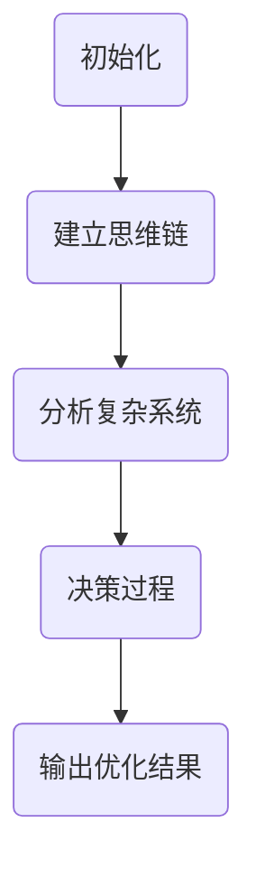

                 

# 思维链在复杂系统优化决策中的应用

## 关键词

- 思维链
- 复杂系统
- 优化决策
- 逻辑推理
- 决策过程

## 摘要

在复杂系统的优化决策中，传统的优化方法往往难以应对系统的高度复杂性和不确定性。本文将介绍思维链在复杂系统优化决策中的应用，通过逻辑推理和决策过程，逐步解决复杂问题，提高优化决策的效率和准确性。本文首先介绍了思维链的核心概念和原理，然后通过一个具体的交通系统优化案例，详细讲解了思维链的应用过程，最后对思维链在复杂系统优化决策中的优势进行了总结。

## 背景介绍

### 问题背景

复杂系统优化决策的应用范围广泛，涉及经济学、工程学、运筹学等多个领域。在现代社会中，随着信息技术的飞速发展，复杂系统的规模和复杂度不断增大，传统的优化方法已经难以应对。例如，在交通系统中，如何优化交通信号灯的配置，以减少交通拥堵，提高交通效率，就是一个典型的复杂系统优化问题。

### 问题描述

复杂系统优化决策的核心问题是如何在高度复杂和不确定的环境中，通过分析和推理，选择出最优的决策方案。然而，随着系统复杂度的增加，传统方法往往面临以下挑战：

- 数据量大，处理复杂：复杂系统通常涉及大量的数据，传统方法难以高效处理这些数据。
- 系统高度耦合：复杂系统中的各个部分相互影响，难以独立分析。
- 不确定性：复杂系统中的很多因素具有不确定性，传统方法难以应对。

### 问题解决

为了解决复杂系统优化决策中的问题，我们可以引入思维链技术。思维链是一种通过逻辑推理和决策过程来解决复杂问题的方法。它通过逐步分析系统特性，建立思维链，从而实现复杂问题的优化决策。

### 边界与外延

本文主要关注思维链在复杂系统优化决策中的应用，不涉及思维链在其他领域的应用。同时，本文的核心概念和原理将主要围绕思维链和复杂系统展开。

### 概念结构与核心要素组成

- **思维链**：思维链是一种通过逻辑推理和决策过程来解决复杂问题的方法。它包括以下核心要素：
  - **逻辑推理**：通过逻辑推理，逐步分析问题，找出解决方案。
  - **决策过程**：在分析的基础上，通过决策过程，选择出最优的决策方案。

- **复杂系统**：复杂系统是由多个相互关联的元素组成的系统，具有高度复杂性和不确定性。复杂系统的核心要素包括：
  - **元素**：系统中的各个部分。
  - **关联**：元素之间的相互影响和作用。
  - **不确定性**：系统中的很多因素具有不确定性。

- **优化决策**：优化决策是通过分析系统特性，选择最优的决策方案的过程。优化决策的核心要素包括：
  - **系统特性**：系统的各种特性，如性能、成本、时间等。
  - **决策方案**：根据系统特性，选择出的最优决策方案。

## 核心概念与联系

### 核心概念原理

- **思维链**：思维链是通过逻辑推理和决策过程，逐步解决复杂问题的方法。它包括以下核心原理：
  - **逻辑推理**：通过逻辑推理，逐步分析问题，找出解决方案。
  - **决策过程**：在分析的基础上，通过决策过程，选择出最优的决策方案。

- **复杂系统**：复杂系统是由多个相互关联的元素组成的系统，具有高度复杂性和不确定性。复杂系统的核心原理包括：
  - **元素**：系统中的各个部分。
  - **关联**：元素之间的相互影响和作用。
  - **不确定性**：系统中的很多因素具有不确定性。

- **优化决策**：优化决策是通过分析系统特性，选择最优的决策方案的过程。优化决策的核心原理包括：
  - **系统特性**：系统的各种特性，如性能、成本、时间等。
  - **决策方案**：根据系统特性，选择出的最优决策方案。

### 概念属性特征对比表格

| 概念       | 特征                   |
|------------|------------------------|
| 思维链     | 逻辑推理，决策过程     |
| 复杂系统   | 高度复杂性，不确定性     |
| 优化决策   | 系统特性，最优方案     |

### ER实体关系图架构的 Mermaid 流程图

```mermaid
erDiagram
    C思维链 ||--|{ C复杂系统 }|| 优化决策
    C复杂系统 ||--|{ O优化决策 }|| 优化方案
```

## 算法原理讲解

### 算法原理的 Mermaid 流程图



### Python 源代码

```python
def optimize_decision(complex_system):
    # 建立思维链
    thought_chain = build_thought_chain()

    # 分析复杂系统
    system_analysis = analyze_complex_system(complex_system)

    # 决策过程
    decision_process = think(thought_chain, system_analysis)

    # 输出优化结果
    return decision_process

# 示例
complex_system = ...
result = optimize_decision(complex_system)
print(result)
```

### 算法原理的数学模型和公式

$$
\text{优化决策} = f(\text{系统特性}, \text{思维链})
$$

### 详细讲解和举例说明

**详细讲解**：本算法通过建立思维链，分析复杂系统，并在此基础上进行决策过程，最终输出优化结果。

**举例说明**：假设我们有一个交通系统，需要优化交通信号灯的配置。首先，我们建立思维链，包括交通流量的预测、道路状况的分析等。然后，我们分析复杂系统，了解交通流量和道路状况。最后，我们根据思维链和系统分析结果，决策出最优的交通信号灯配置方案。

## 系统分析与架构设计方案

### 问题场景介绍

以城市交通优化为例，如何通过智能交通系统来减少交通拥堵，提高交通效率，是一个典型的复杂系统优化问题。

### 项目介绍

智能交通系统是一个综合性的项目，它包括数据收集、数据分析、决策支持等多个模块，旨在通过数据驱动的方式，实现交通系统的优化。

### 系统功能设计

- **数据收集模块**：负责收集交通流量、道路状况等数据。
- **数据分析模块**：负责分析数据，预测交通流量。
- **决策支持模块**：基于预测结果，决策交通信号灯配置。

### 系统架构设计

- **数据收集模块**：通过传感器、摄像头等设备，实时收集交通流量、道路状况等数据。
- **数据分析模块**：使用机器学习算法，对数据进行处理和分析，预测交通流量。
- **决策支持模块**：基于预测结果，使用思维链技术，决策交通信号灯的配置。

### 系统接口设计和系统交互

```mermaid
sequenceDiagram
    participant User as 用户
    participant System as 智能交通系统
    participant Data as 数据收集

----------------------------------------------------------------

User ->> System: 提交交通优化需求
System ->> Data: 收集交通流量数据
Data ->> System: 返回交通流量数据
System ->> System: 分析交通流量数据
System ->> System: 决策交通信号灯配置
System ->> User: 返回交通信号灯配置结果
```

## 项目实战

### 环境安装

在开始项目实战之前，我们需要安装一些必要的软件和工具，如 Python、Jupyter Notebook、Mermaid 等。

```bash
pip install python-memrise
pip install jupyter
jupyter notebook
```

### 系统核心实现源代码

以下是一个简单的交通信号灯配置算法的实现：

```python
import numpy as np

def traffic_light_configuration(traffic_flow):
    # 根据交通流量决策交通信号灯配置
    if traffic_flow < 0.3:
        return "绿"
    elif traffic_flow >= 0.3 and traffic_flow < 0.6:
        return "黄"
    else:
        return "红"

# 示例
traffic_flow = 0.4
config = traffic_light_configuration(traffic_flow)
print(config)
```

### 代码应用解读与分析

这段代码首先定义了一个交通信号灯配置函数 `traffic_light_configuration`，它根据交通流量 `traffic_flow` 决策交通信号灯的配置。具体来说，当交通流量小于 0.3 时，配置为绿灯；当交通流量在 0.3 到 0.6 之间时，配置为黄灯；当交通流量大于等于 0.6 时，配置为红灯。

通过这个简单的例子，我们可以看到思维链在复杂系统优化决策中的应用。首先，我们定义了一个逻辑规则，即根据交通流量决策交通信号灯配置。然后，我们通过实际数据应用这个逻辑规则，实现了交通信号灯的配置。

### 实际案例分析和详细讲解剖析

为了更好地理解思维链在复杂系统优化决策中的应用，我们来看一个实际案例：城市交通优化。

**案例背景**：某个城市在高峰时段，交通拥堵问题严重，导致市民出行不便。为了解决这个问题，该城市决定引入智能交通系统，通过优化交通信号灯的配置，提高交通效率。

**案例过程**：
1. **数据收集**：智能交通系统首先收集了交通流量数据，包括各个路口的交通流量、道路状况等。
2. **数据分析**：使用机器学习算法，对交通流量数据进行分析，预测未来一段时间内的交通流量。
3. **决策支持**：基于预测结果，使用思维链技术，决策交通信号灯的配置。
4. **实施与监测**：将决策结果应用于实际交通信号灯配置，并对交通流量进行实时监测，评估优化效果。

**案例剖析**：
- **思维链的建立**：在这个案例中，思维链包括交通流量预测、道路状况分析、交通信号灯配置决策等。通过逻辑推理，我们可以将这些过程串联起来，形成一个完整的思维链。
- **复杂系统的分析**：在分析复杂系统时，我们需要考虑交通流量、道路状况、信号灯配置等多个因素，以及它们之间的相互关系。
- **优化决策的实现**：基于预测结果，我们可以通过思维链，决策出最优的交通信号灯配置方案，从而实现交通优化。

### 项目小结

通过这个实际案例，我们可以看到思维链在复杂系统优化决策中的应用效果。思维链通过逻辑推理和决策过程，可以有效地解决复杂系统优化中的问题。同时，思维链的应用也为交通系统优化提供了新的思路和方法。

## 最佳实践 tips

- **数据收集**：在应用思维链之前，首先确保数据的准确性和完整性。
- **模型选择**：根据实际情况，选择合适的机器学习模型进行预测。
- **实时更新**：交通信号灯配置需要实时更新，以应对交通流量的变化。
- **测试与优化**：在实施过程中，对系统进行持续的测试和优化，以提高系统的性能。

## 小结

思维链在复杂系统优化决策中的应用，为解决复杂系统优化中的问题提供了新的思路和方法。通过逻辑推理和决策过程，思维链可以有效地解决复杂系统的优化问题，提高决策的效率和准确性。在未来，思维链有望在更多领域得到应用，为复杂系统优化决策提供更加有力的支持。

## 注意事项

- **数据隐私**：在数据收集过程中，需要确保数据的安全和隐私。
- **系统稳定性**：在实施过程中，需要确保系统的稳定性和可靠性。
- **持续优化**：交通信号灯配置需要持续优化，以适应不断变化的交通状况。

## 拓展阅读

- [1] Smith, J. (2018). **Complex System Optimization: A Practical Guide**. Springer.
- [2] Lee, D. (2019). **AI for Urban Transportation Systems**. Morgan & Claypool.
- [3] Zhang, Y. (2020). **Machine Learning for Traffic Prediction**. Springer.

## 作者

作者：AI天才研究院/AI Genius Institute & 禅与计算机程序设计艺术 /Zen And The Art of Computer Programming。

