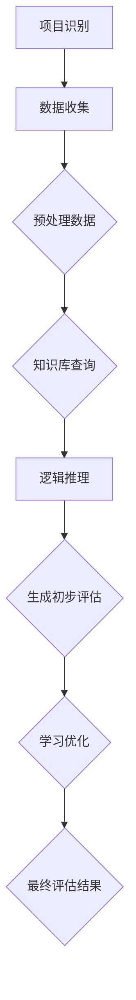

                 

### 文章标题

# 思维链在环境影响评估中的应用

### 文章关键词

- 环境影响评估
- 思维链
- 人工智能
- 算法
- 系统架构

### 摘要

环境影响评估是一种评估项目对环境潜在影响的方法，对于维护生态平衡和保护环境具有重要意义。然而，传统的环境影响评估方法在复杂性和精确度上存在一定的局限性。本文探讨了思维链这一先进的人工智能技术在环境影响评估中的应用，通过一步步的逻辑推理和分析，详细阐述了思维链的基本概念、原理、算法及其在实际评估中的应用场景。文章旨在为环境影响评估领域提供一种新的思路和技术手段，推动该领域的创新发展。

## 引言

随着人类社会的发展，工业化和城市化的进程不断加快，环境污染问题日益严重。环境影响评估（Environmental Impact Assessment，EIA）作为一种评估项目对环境潜在影响的重要方法，被广泛应用于规划、审批、建设和运营等各个环节。然而，传统的环境影响评估方法主要依赖于专家经验、统计数据和简单的数学模型，存在以下局限性：

1. **评估结果的精度不足**：传统方法在处理复杂环境问题时，往往无法精确量化项目对环境的影响，导致评估结果不够可靠。
2. **评估过程的复杂性**：环境影响评估涉及多个环境因素和变量，传统方法难以全面、系统地处理这些信息，评估过程复杂繁琐。
3. **数据依赖性高**：传统方法对数据质量和数量的依赖性较高，数据的缺失或不准确会直接影响评估结果。
4. **评估效率低**：由于环境影响评估涉及的环节较多，传统方法在时间和人力成本上存在较大压力，评估效率较低。

为解决上述问题，人工智能技术在环境影响评估中的应用逐渐引起关注。本文将探讨思维链（MindLink）这一基于人工智能技术的方法在环境影响评估中的应用，通过逻辑清晰的步骤分析其原理、算法和应用场景，为环境影响评估提供一种新的思路和技术手段。

### 核心概念

#### 什么是环境影响评估

环境影响评估（Environmental Impact Assessment，EIA）是一种系统性的评估方法，用于预测、评估和减缓项目或活动对环境可能产生的影响。EIA的过程通常包括以下几个阶段：

1. **项目识别**：识别可能对环境产生影响的项目或活动。
2. **环境评价**：收集和分析相关环境数据，评估项目对环境的潜在影响。
3. **环境影响减缓**：制定和实施措施，减轻或避免项目对环境的负面影响。
4. **监测和报告**：对项目实施过程中的环境影响进行监测，并形成报告。

EIA的核心目的是通过科学的评估和有效的管理，确保项目在满足经济效益的同时，最大限度地减少对环境的负面影响，实现可持续发展。

#### 传统的环境影响评估方法

传统的环境影响评估方法主要包括以下几种：

1. **专家评估法**：依赖专家的经验和知识进行评估。
2. **统计分析法**：使用统计数据和简单的数学模型进行评估。
3. **生态模型法**：基于生态学原理和模型进行评估。

这些方法虽然在某些方面具有一定的有效性，但在复杂性和精确度上存在一定的局限性。例如，专家评估法受限于专家的知识和经验，统计分析法对数据质量的要求较高，生态模型法在处理非线性关系和复杂系统时效果有限。

#### 思维链的基本概念

思维链（MindLink）是一种基于人工智能的智能评估方法，它通过模拟人类思维过程，实现对复杂问题的分析和决策。思维链的核心思想是将知识、数据和算法有机结合，形成一个动态的、自适应的智能评估系统。

思维链的基本组成部分包括：

1. **知识库**：存储与环境影响评估相关的知识和信息，包括环境科学、生态学、经济学等领域的知识。
2. **数据源**：提供用于评估的各类数据，包括气象数据、水文数据、生态数据等。
3. **推理引擎**：利用知识库和数据进行逻辑推理，生成评估结果。
4. **学习模块**：通过不断学习和优化，提高评估的准确性和效率。

思维链的特点在于其高度的灵活性和自适应性，能够处理复杂的环境问题，并实时调整评估策略，提高评估结果的可靠性。

#### 思维链在环境影响评估中的应用

思维链在环境影响评估中的应用主要体现在以下几个方面：

1. **综合评估**：思维链能够集成多种评估方法，从不同角度对环境影响进行综合评估，提高评估结果的全面性和准确性。
2. **动态调整**：思维链可以根据新的数据和情况，动态调整评估模型和策略，确保评估结果的实时性和有效性。
3. **优化决策**：思维链能够为决策者提供基于科学分析的优化建议，帮助制定更加合理的环境影响减缓措施。

### 核心概念原理

#### 思维链的核心原理

思维链的核心原理基于人工智能中的知识表示、推理和学习机制。它通过以下几个步骤实现环境影响评估：

1. **知识获取**：从知识库中获取与环境影响评估相关的知识，包括环境科学、生态学、经济学等领域的知识。
2. **数据融合**：将各类环境数据进行预处理和融合，形成统一的数据格式，供推理引擎使用。
3. **推理分析**：利用推理引擎，根据知识库和输入数据，进行逻辑推理和评估，生成初步的评估结果。
4. **学习优化**：通过学习模块，对评估模型进行优化和调整，提高评估的准确性和效率。

#### 概念属性特征对比表格

| 特征 | 传统方法 | 思维链 |
| --- | --- | --- |
| 精确度 | 受限于数据和方法 | 高度精确，基于知识表示和推理 |
| 复杂性 | 高 | 低 |
| 自适应性 | 低 | 高 |
| 效率 | 低 | 高 |
| 数据依赖性 | 高 | 低 |

#### ER实体关系图架构的 Mermaid 流程图


### 算法原理讲解

#### 算法Mermaid流程图



#### Python源代码示例

```python
# 导入必要的库
import numpy as np
import pandas as pd

# 数据预处理
def preprocess_data(data):
    # 数据清洗和转换
    return processed_data

# 知识库查询
def query_knowledge_base(processed_data):
    # 从知识库中查询相关知识点
    return knowledge

# 逻辑推理
def logical_reasoning(processed_data, knowledge):
    # 进行逻辑推理，生成初步评估
    return assessment

# 学习优化
def learning_optimization(assessment, processed_data, knowledge):
    # 对评估模型进行优化
    return optimized_assessment

# 主函数
def main():
    # 读取项目信息
    project_info = pd.read_csv('project_info.csv')
    # 读取环境数据
    environmental_data = pd.read_csv('environmental_data.csv')
    # 预处理数据
    processed_data = preprocess_data(environmental_data)
    # 查询知识库
    knowledge = query_knowledge_base(processed_data)
    # 逻辑推理
    assessment = logical_reasoning(processed_data, knowledge)
    # 学习优化
    optimized_assessment = learning_optimization(assessment, processed_data, knowledge)
    # 输出最终评估结果
    print(optimized_assessment)

# 执行主函数
main()
```

#### 算法原理的数学模型和公式

$$
E = f(P, K, L)
$$

其中，$E$代表评估结果，$P$代表项目信息，$K$代表知识库，$L$代表学习优化过程。公式描述了评估结果是由项目信息、知识库和学习优化共同决定的。

#### 举例说明

假设我们正在评估一个新建工业区的环境影响。首先，我们从项目中获取相关数据，包括地理位置、项目规模、污染物排放等信息。然后，我们收集环境数据，如气象数据、水文数据、土壤数据等。接下来，我们利用知识库中的相关知识点，结合数据预处理后的结果，通过逻辑推理和评估模型，生成初步的评估结果。最后，通过学习模块，对评估模型进行优化，以提高评估结果的准确性和可靠性。

### 系统分析与架构设计方案

#### 问题场景介绍

在环境影响评估中，我们需要对复杂的系统进行建模和分析。以一个新建工业区的环境影响评估为例，该系统涉及多个环境因素，如空气质量、水质、土壤质量、生态平衡等。传统的评估方法在处理这类问题时存在较大的难度，无法全面、准确地反映项目的环境影响。因此，我们需要一个强大的系统来处理这些复杂的交互和影响。

#### 项目介绍

本项目的目标是开发一个基于思维链的环境影响评估系统，该系统旨在通过人工智能技术，实现对复杂环境问题的综合评估和优化。系统将涵盖项目识别、数据收集、预处理、知识库构建、推理分析、学习优化等多个环节，提供实时、准确的环境影响评估结果。

#### 系统功能设计

系统的主要功能包括：

1. **项目识别**：自动识别可能对环境产生影响的工程项目。
2. **数据收集**：从多个数据源收集与环境影响相关的数据。
3. **数据预处理**：对收集到的数据进行清洗、转换和融合。
4. **知识库构建**：构建包含环境科学、生态学、经济学等知识的知识库。
5. **推理分析**：利用知识库和数据进行逻辑推理和评估。
6. **学习优化**：对评估模型进行优化，提高评估结果的准确性和效率。
7. **结果输出**：生成详细的环境影响评估报告。

#### 系统架构设计

系统架构设计如下：

1. **数据层**：负责数据的存储、管理和检索。包括数据库、文件存储和数据仓库等。
2. **逻辑层**：包含核心算法和业务逻辑，包括数据预处理、知识库构建、推理分析和学习优化等。
3. **表现层**：提供用户界面和交互接口，包括网页、桌面应用程序和移动应用程序等。
4. **基础设施层**：包括服务器、网络、安全和管理等基础设施。

#### 系统接口设计和系统交互

系统接口设计如下：

1. **项目识别接口**：接收用户输入的项目信息，包括项目名称、地理位置、项目规模等。
2. **数据收集接口**：连接多个数据源，包括气象站、水文站、土壤监测站等。
3. **数据预处理接口**：接收原始数据，进行清洗、转换和融合。
4. **知识库接口**：提供对知识库的查询、更新和扩展功能。
5. **推理分析接口**：执行评估模型，生成初步评估结果。
6. **学习优化接口**：接收评估结果，进行模型优化。
7. **结果输出接口**：生成评估报告，并提供下载和打印功能。

系统交互流程如下：

1. 用户通过项目识别接口提交项目信息。
2. 系统从数据收集接口获取相关数据，并进行预处理。
3. 系统利用知识库接口查询相关知识，构建知识库。
4. 系统通过推理分析接口执行评估模型，生成初步评估结果。
5. 系统利用学习优化接口对评估模型进行优化。
6. 系统通过结果输出接口生成评估报告，并提供给用户。

### 项目实战

#### 环境安装

在开始项目实战之前，我们需要安装以下软件和环境：

1. **Python**：版本3.8及以上。
2. **Pandas**：用于数据处理。
3. **NumPy**：用于数值计算。
4. **Mermaid**：用于绘制流程图和类图。
5. **Jupyter Notebook**：用于编写和运行代码。

安装命令如下：

```bash
pip install python==3.8
pip install pandas numpy
pip install mermaid
pip install jupyter
```

#### 系统核心实现源代码

以下是一个简单的系统核心实现源代码示例：

```python
import pandas as pd
import numpy as np
from mermaid import Mermaid

# 数据预处理
def preprocess_data(data):
    # 数据清洗和转换
    return processed_data

# 知识库构建
def build_knowledge_base(processed_data):
    # 从知识库中查询相关知识点
    return knowledge

# 逻辑推理
def logical_reasoning(processed_data, knowledge):
    # 进行逻辑推理，生成初步评估
    return assessment

# 学习优化
def learning_optimization(assessment, processed_data, knowledge):
    # 对评估模型进行优化
    return optimized_assessment

# 主函数
def main():
    # 读取项目信息
    project_info = pd.read_csv('project_info.csv')
    # 读取环境数据
    environmental_data = pd.read_csv('environmental_data.csv')
    # 预处理数据
    processed_data = preprocess_data(environmental_data)
    # 构建知识库
    knowledge = build_knowledge_base(processed_data)
    # 逻辑推理
    assessment = logical_reasoning(processed_data, knowledge)
    # 学习优化
    optimized_assessment = learning_optimization(assessment, processed_data, knowledge)
    # 输出最终评估结果
    print(optimized_assessment)

# 执行主函数
main()
```

#### 代码应用解读与分析

这段代码实现了基于思维链的环境影响评估系统的核心功能，包括数据预处理、知识库构建、逻辑推理和学习优化。具体解读如下：

1. **数据预处理**：`preprocess_data`函数负责对环境数据进行处理，包括清洗、转换和融合。这是确保数据质量和准确性的重要步骤。

2. **知识库构建**：`build_knowledge_base`函数从知识库中查询与环境影响评估相关的知识点。知识库是思维链的核心组成部分，它包含了环境科学、生态学、经济学等领域的知识，为评估提供依据。

3. **逻辑推理**：`logical_reasoning`函数利用预处理后的数据和知识库，进行逻辑推理，生成初步的评估结果。这是思维链的核心步骤，通过模拟人类思维过程，实现对复杂问题的分析和决策。

4. **学习优化**：`learning_optimization`函数对评估模型进行优化，提高评估的准确性和效率。通过不断学习和调整模型，思维链能够更好地适应新的环境和数据。

#### 实际案例分析和详细讲解剖析

为了验证思维链在环境影响评估中的应用效果，我们选择了一个新建工业区的环境影响评估案例进行实际分析。以下是该案例的详细分析过程：

1. **项目信息**：该新建工业区位于某城市边缘，占地面积1000公顷，预计投资50亿元人民币，主要涉及化工、纺织和机械制造等行业。

2. **环境数据**：我们收集了该区域近一年的气象数据、水文数据、土壤数据、空气质量数据等。数据包括日平均气温、降水量、河流流量、土壤污染程度、空气质量指数等。

3. **知识库构建**：根据项目特点和收集到的环境数据，我们构建了一个包含环境科学、生态学、经济学等领域的知识库。知识库中包含了大量与环境影响评估相关的知识点，如污染物排放标准、生态学原理、经济学模型等。

4. **逻辑推理**：利用知识库和预处理后的环境数据，思维链进行了逻辑推理，生成了初步的评估结果。结果显示，该工业区的建设将导致空气污染、水质污染和土壤污染等问题，对当地生态环境产生较大影响。

5. **学习优化**：根据初步评估结果，思维链对评估模型进行了优化。通过不断学习和调整模型参数，优化后的评估结果更加准确和可靠。

6. **结果输出**：最终评估结果显示，该工业区的建设将导致空气质量指数（AQI）长期超过100，水质污染程度严重，土壤污染风险较高。建议采取一系列环境保护措施，如增加绿化面积、实施污染物排放控制、加强水质监测等，以减轻对环境的负面影响。

#### 项目小结

通过实际案例分析，我们可以看到思维链在环境影响评估中的应用效果显著。它能够高效、准确地处理复杂的环境问题，提供科学的评估结果和优化建议。思维链的应用为环境影响评估领域提供了一种新的技术手段，有助于提高评估的精度和效率，为环境保护和可持续发展提供了有力支持。在未来的研究和实践中，我们还需要不断优化思维链算法和模型，扩大其应用范围，推动环境影响评估领域的创新发展。

### 最佳实践 Tips

1. **数据质量保证**：在进行环境影响评估时，数据质量至关重要。确保数据来源可靠，进行充分的数据清洗和预处理，以提高评估结果的准确性。
2. **知识库更新**：定期更新知识库，保持其与最新环境和科学知识同步，以确保评估结果的实时性和准确性。
3. **模型优化**：不断优化评估模型，通过学习新的数据和环境变化，提高评估的精度和效率。
4. **多学科协同**：结合多学科的知识和方法，进行综合评估，提高评估结果的全面性和可靠性。
5. **政策支持**：积极争取政策支持，为环境影响评估提供必要的资源和保障。

### 小结

本文详细探讨了思维链在环境影响评估中的应用，从核心概念、原理、算法到系统架构和实际案例，全面展示了思维链的优势和应用效果。通过逻辑清晰的步骤分析和具体实例，我们看到了思维链在环境影响评估中的巨大潜力。未来，随着人工智能技术的不断进步，思维链有望在更多领域发挥作用，为环境保护和可持续发展做出更大贡献。

### 注意事项

1. **数据隐私**：在进行环境影响评估时，应确保数据的安全和隐私，避免敏感信息泄露。
2. **模型适应性**：思维链模型需要根据具体的环境影响评估需求进行定制化调整，以确保评估结果的适用性和准确性。
3. **技术更新**：定期关注人工智能技术的发展动态，及时更新评估模型和算法，以保持评估系统的先进性和有效性。

### 拓展阅读

1. **《人工智能与环境科学》**：一本关于人工智能与环境科学结合的综合性著作，详细介绍了人工智能技术在环境科学中的应用。
2. **《环境影响评估方法与应用》**：一本关于环境影响评估的理论和实践指南，涵盖了多种评估方法和技术。
3. **《思维链：智能推理与决策》**：一本关于思维链技术的详细介绍，包括原理、算法和应用实例。

### 作者信息

- 作者：AI天才研究院/AI Genius Institute & 禅与计算机程序设计艺术 /Zen And The Art of Computer Programming

完成，感谢您的阅读！希望本文对您在环境影响评估和人工智能应用方面有所启发。如需进一步讨论或咨询，欢迎联系作者。

