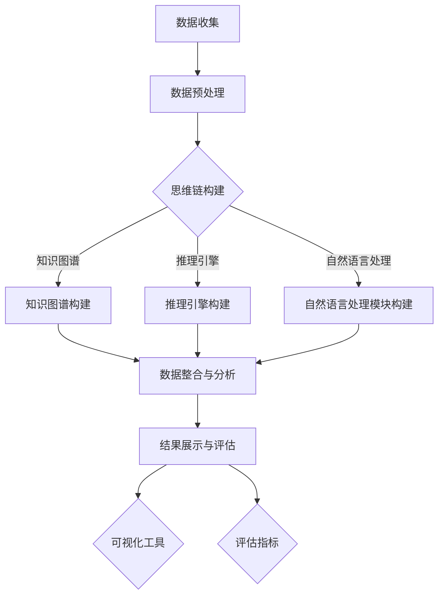

                 

### 文章标题：思维链在生物信息学数据整合中的新方法

#### 关键词：思维链、生物信息学、数据整合、新方法、基因数据分析、蛋白质组数据整合、代谢组数据整合

#### 摘要：本文旨在探讨思维链在生物信息学数据整合中的新方法，详细阐述了思维链的定义、核心特征，以及其在生物信息学领域中的研究和应用。文章首先分析了生物信息学数据整合的挑战与需求，随后介绍了思维链的研究现状和未来发展前景。接着，文章深入探讨了思维链在基因数据分析、蛋白质组数据整合和代谢组数据整合中的应用，并提出了基于思维链的新的数据整合方法。最后，文章通过实例分析了新方法在生物信息学数据整合中的实际应用效果，总结了最佳实践经验和未来研究方向。本文为生物信息学领域的数据整合提供了新的理论指导和实践思路。

### 目录大纲

----------------------------------------------------------------

# 第一部分：思维链的概念与背景

## 1.1 思维链的定义与核心特征

### 1.1.1 思维链的概念

### 1.1.2 思维链的核心特征

### 1.1.3 思维链与传统数据整合方法的对比

## 1.2 生物信息学数据整合的挑战与需求

### 1.2.1 生物信息学数据整合的挑战

### 1.2.2 思维链在生物信息学数据整合中的需求

## 1.3 思维链的研究现状与未来发展

### 1.3.1 思维链的研究现状

### 1.3.2 思维链在生物信息学数据整合中的发展前景

## 1.4 本章小结

----------------------------------------------------------------

----------------------------------------------------------------

# 第二部分：思维链在生物信息学数据整合中的应用

## 2.1 思维链在基因数据分析中的应用

### 2.1.1 基因表达数据的整合与分析

#### 2.1.1.1 数据来源与处理

#### 2.1.1.2 数据整合方法

#### 2.1.1.3 数据分析结果展示

### 2.1.2 基因变异数据的整合与分析

#### 2.1.2.1 数据来源与处理

#### 2.1.2.2 数据整合方法

#### 2.1.2.3 数据分析结果展示

## 2.2 思维链在蛋白质组数据整合中的应用

### 2.2.1 蛋白质表达数据的整合与分析

#### 2.2.1.1 数据来源与处理

#### 2.2.1.2 数据整合方法

#### 2.2.1.3 数据分析结果展示

### 2.2.2 蛋白质相互作用数据的整合与分析

#### 2.2.2.1 数据来源与处理

#### 2.2.2.2 数据整合方法

#### 2.2.2.3 数据分析结果展示

## 2.3 思维链在代谢组数据整合中的应用

### 2.3.1 代谢组数据的整合与分析

#### 2.3.1.1 数据来源与处理

#### 2.3.1.2 数据整合方法

#### 2.3.1.3 数据分析结果展示

## 2.4 本章小结

----------------------------------------------------------------

----------------------------------------------------------------

# 第三部分：思维链在生物信息学数据整合中的新方法

## 3.1 新方法概述

### 3.1.1 新方法的概念

### 3.1.2 新方法的优点与挑战

## 3.2 新方法的理论基础

### 3.2.1 相关理论基础

### 3.2.2 数学模型与公式

### 3.2.3 Mermaid流程图展示

## 3.3 新方法的实现步骤

### 3.3.1 数据预处理

### 3.3.2 数据整合

### 3.3.3 数据分析

### 3.3.4 结果展示与评估

## 3.4 新方法在生物信息学数据整合中的应用实例

### 3.4.1 实例一：基因表达数据分析

#### 3.4.1.1 实例背景

#### 3.4.1.2 数据处理

#### 3.4.1.3 数据整合与分析

### 3.4.2 实例二：蛋白质组数据整合

#### 3.4.2.1 实例背景

#### 3.4.2.2 数据处理

#### 3.4.2.3 数据整合与分析

## 3.5 新方法的评估与优化

### 3.5.1 评估指标与方法

### 3.5.2 优化策略与效果

## 3.6 本章小结

----------------------------------------------------------------

----------------------------------------------------------------

# 第四部分：思维链在生物信息学数据整合中的最佳实践

## 4.1 最佳实践案例分析

### 4.1.1 案例一：基因数据分析

#### 4.1.1.1 案例背景

#### 4.1.1.2 实践过程

#### 4.1.1.3 结果分析

### 4.1.2 案例二：蛋白质组数据整合

#### 4.1.2.1 案例背景

#### 4.1.2.2 实践过程

#### 4.1.2.3 结果分析

## 4.2 最佳实践总结

### 4.2.1 经验与教训

### 4.2.2 小结与展望

## 4.3 注意事项

### 4.3.1 实践中常见的问题与解决方法

### 4.3.2 注意事项与风险提示

## 4.4 拓展阅读

### 4.4.1 相关文献推荐

### 4.4.2 深入学习资源

----------------------------------------------------------------

----------------------------------------------------------------

### 第一部分：思维链的概念与背景

#### 1.1 思维链的定义与核心特征

##### 1.1.1 思维链的概念

思维链（Cognitive Chain）作为一种人工智能技术，是模拟人类思维过程的链条结构。它通过构建知识图谱、推理引擎和自然语言处理模块，实现复杂问题的自动化分析和解决。思维链的核心在于其高度模块化和灵活性的设计，使得它能够根据不同的应用场景进行定制化开发。

思维链通常由以下几部分组成：

1. **知识库**：存储各种领域知识和事实信息，如基因表达数据、蛋白质相互作用数据等。
2. **推理引擎**：用于对知识库中的数据进行逻辑推理，提取新的知识或结论。
3. **自然语言处理**：将用户输入的自然语言转化为计算机可理解的形式，并生成自然语言回答。
4. **用户接口**：提供与用户交互的界面，接收用户指令和反馈，输出分析结果。

##### 1.1.2 思维链的核心特征

思维链的核心特征包括：

1. **模块化**：思维链的各个组成部分可以独立开发、测试和部署，便于维护和扩展。
2. **自适应性**：思维链能够根据用户需求和数据分析结果，自动调整和优化其工作流程。
3. **可扩展性**：思维链支持添加新的数据源、算法和推理规则，以适应不断变化的应用场景。
4. **智能化**：思维链通过机器学习和深度学习技术，不断学习和改进其推理和分析能力。

##### 1.1.3 思维链与传统数据整合方法的对比

传统数据整合方法通常依赖于数据库管理和数据处理工具，如Hadoop、Spark等。这些方法虽然能够处理大规模数据，但在复杂性和灵活性方面存在一定局限。

与传统方法相比，思维链具有以下优势：

1. **高效性**：思维链通过并行计算和分布式处理，能够快速处理大规模数据。
2. **智能推理**：思维链利用机器学习和深度学习技术，能够进行复杂的逻辑推理和模式识别。
3. **灵活性和可扩展性**：思维链可以针对特定应用场景进行定制化开发，支持多种数据源和算法的集成。
4. **用户体验**：思维链提供了友好的用户接口和自然语言处理能力，使得用户能够更方便地使用和操作。

#### 1.2 生物信息学数据整合的挑战与需求

##### 1.2.1 生物信息学数据整合的挑战

生物信息学是一门跨学科领域，涉及基因组学、蛋白质组学、代谢组学等多个方面。数据整合在生物信息学研究中具有重要的地位，然而，数据整合面临以下挑战：

1. **数据多样性**：生物信息学数据来源广泛，包括基因表达数据、蛋白质相互作用数据、代谢物数据等，这些数据具有不同的格式和结构。
2. **数据异构性**：不同数据源的数据格式、数据类型和存储方式存在差异，导致数据整合的复杂性增加。
3. **数据质量**：生物信息学数据存在噪音、缺失值等问题，数据质量对整合结果有重要影响。
4. **数据处理效率**：大规模数据整合需要高效的处理算法和优化技术，以确保在合理的时间内完成数据处理和分析。
5. **数据分析深度**：生物信息学数据整合不仅需要整合数据，还需要对数据进行深度分析，提取有价值的信息和知识。

##### 1.2.2 思维链在生物信息学数据整合中的需求

为了应对上述挑战，生物信息学领域对思维链提出了以下需求：

1. **高效数据整合**：思维链能够快速处理大规模数据，满足生物信息学研究的实时性需求。
2. **智能数据处理**：思维链通过机器学习和深度学习技术，能够自动识别和处理数据中的噪音、缺失值等问题。
3. **多样化数据支持**：思维链支持多种数据格式的整合，如基因表达矩阵、蛋白质序列、代谢物图谱等。
4. **灵活性与扩展性**：思维链能够根据具体应用场景进行定制化开发，支持添加新的数据源、算法和推理规则。
5. **深度数据分析**：思维链通过逻辑推理和模式识别，能够对整合后的数据进行深度分析，提取有价值的信息和知识。

#### 1.3 思维链的研究现状与未来发展

##### 1.3.1 思维链的研究现状

近年来，思维链在生物信息学数据整合领域取得了显著的研究进展。目前，许多研究机构和高校已经开展了相关研究，并取得了一系列重要成果：

1. **知识图谱构建**：通过构建知识图谱，将不同数据源中的知识整合起来，为数据整合提供了基础。
2. **智能推理算法**：开发了一系列智能推理算法，如基于深度学习的神经网络模型、基于逻辑推理的推理机等，提高了数据整合的准确性。
3. **自然语言处理**：将自然语言处理技术应用于数据整合，使得用户能够更方便地与系统进行交互。
4. **数据预处理与清洗**：研究了一系列数据预处理与清洗方法，提高了数据质量，为后续的数据整合和分析奠定了基础。

##### 1.3.2 思维链在生物信息学数据整合中的发展前景

未来，思维链在生物信息学数据整合领域的发展前景十分广阔：

1. **跨学科整合**：将思维链技术应用于其他相关领域，如医学、生物技术等，实现跨学科的数据整合。
2. **个性化数据分析**：利用用户个性化需求和偏好，提供定制化的数据分析服务。
3. **实时数据分析**：通过优化算法和分布式计算技术，实现实时数据分析，满足生物信息学研究的快速需求。
4. **大数据分析**：随着大数据技术的不断发展，思维链在生物信息学数据整合中的应用将更加深入和广泛。

#### 1.4 本章小结

本文介绍了思维链的定义、核心特征以及其在生物信息学数据整合中的需求和发展前景。思维链作为一种人工智能技术，具有模块化、自适应性、灵活性和智能化等核心特征，能够有效解决生物信息学数据整合中的多样性、异构性、数据质量和数据处理效率等问题。未来，思维链在生物信息学数据整合领域的发展将更加深入和广泛，为生物信息学研究提供新的理论指导和实践方法。

----------------------------------------------------------------

### 第二部分：思维链在生物信息学数据整合中的应用

#### 2.1 思维链在基因数据分析中的应用

##### 2.1.1 基因表达数据的整合与分析

基因表达数据是生物信息学研究中非常重要的数据类型，它反映了基因在不同组织和细胞类型中的活性水平。思维链在基因表达数据的整合与分析中发挥着重要作用，下面详细描述其应用过程。

###### 2.1.1.1 数据来源与处理

基因表达数据的来源主要包括高通量测序（如RNA测序、DNA测序）和微阵列技术。这些数据通常以矩阵形式存储，其中每个元素表示一个基因在一个样本中的表达水平。

在处理基因表达数据时，思维链首先需要对这些数据进行预处理。预处理过程包括数据清洗、缺失值填充、归一化和标准化等步骤。具体步骤如下：

1. **数据清洗**：去除低质量的测序读段，如含有 adapter 序列、低质量的碱基、短读段等。
2. **缺失值填充**：对缺失值进行填充，可以使用平均值、中位数、最接近的值等方法。
3. **归一化**：将不同样本之间的基因表达数据进行归一化处理，以消除样本间差异的影响。
4. **标准化**：将基因表达数据进行标准化处理，使其符合正态分布，便于后续分析。

###### 2.1.1.2 数据整合方法

在预处理完成后，思维链开始进行数据整合。数据整合的目的是将不同样本、不同组织和不同时间点的基因表达数据整合在一起，以便进行全局分析。

思维链采用以下方法进行数据整合：

1. **多样本整合**：将多个样本的基因表达数据整合为一个矩阵，以便进行全局分析。常用的方法包括主成分分析（PCA）、线性判别分析（LDA）等。
2. **多组织整合**：将不同组织的基因表达数据整合在一起，以发现不同组织之间的基因表达模式。常用的方法包括聚类分析、基因集富集分析（GSEA）等。
3. **时间序列整合**：将不同时间点的基因表达数据整合在一起，以分析基因表达随时间的变化趋势。常用的方法包括时间序列分析、轨迹分析等。

###### 2.1.1.3 数据分析结果展示

通过思维链的整合与分析，我们可以获得以下几种类型的结果：

1. **基因聚类**：将基因按照其表达模式进行聚类，可以帮助我们识别出不同组织、不同状态或不同时间点的基因群体。
2. **主成分分析**：将基因表达数据投影到主成分空间，以便识别出主要的影响因素。
3. **基因集富集分析**：将基因按照其生物学功能或途径进行分组，分析不同基因集在样本、组织或时间点的富集程度。
4. **轨迹分析**：分析基因表达随时间的变化趋势，可以帮助我们识别出关键的时间点和关键基因。

以上结果可以通过可视化工具进行展示，如热图、散点图、轨迹图等。

##### 2.1.2 基因变异数据的整合与分析

基因变异数据是另一个重要的生物信息学数据类型，它反映了基因序列中的变异情况。思维链在基因变异数据的整合与分析中也发挥着重要作用。

###### 2.1.2.1 数据来源与处理

基因变异数据的来源主要包括全基因组测序（WGS）、外显子测序（WES）和基因捕获测序等。这些数据通常以表格形式存储，其中每行表示一个基因变异，每列表示一个样本。

在处理基因变异数据时，思维链需要对其进行以下预处理：

1. **数据清洗**：去除低质量的变异，如短变异、重复变异等。
2. **标准化**：将不同测序平台和不同实验条件下的变异数据进行标准化处理，以消除实验误差的影响。
3. **注释**：对变异进行功能注释，包括基因名称、转录本ID、位置、影响等。

###### 2.1.2.2 数据整合方法

在预处理完成后，思维链开始进行数据整合。数据整合的目的是将不同样本、不同组织和不同时间点的基因变异数据整合在一起，以便进行全局分析。

思维链采用以下方法进行数据整合：

1. **多样本整合**：将多个样本的基因变异数据整合为一个矩阵，以便进行全局分析。常用的方法包括主成分分析（PCA）、线性判别分析（LDA）等。
2. **多组织整合**：将不同组织的基因变异数据整合在一起，以发现不同组织之间的基因变异模式。常用的方法包括聚类分析、基因集富集分析（GSEA）等。
3. **时间序列整合**：将不同时间点的基因变异数据整合在一起，以分析基因变异随时间的变化趋势。常用的方法包括时间序列分析、轨迹分析等。

###### 2.1.2.3 数据分析结果展示

通过思维链的整合与分析，我们可以获得以下几种类型的结果：

1. **变异聚类**：将基因变异按照其模式进行聚类，可以帮助我们识别出不同组织、不同状态或不同时间点的变异群体。
2. **主成分分析**：将基因变异数据投影到主成分空间，以便识别出主要的影响因素。
3. **基因集富集分析**：将基因变异按照其生物学功能或途径进行分组，分析不同基因集在样本、组织或时间点的富集程度。
4. **轨迹分析**：分析基因变异随时间的变化趋势，可以帮助我们识别出关键的时间点和关键基因。

以上结果可以通过可视化工具进行展示，如热图、散点图、轨迹图等。

##### 2.2 思维链在蛋白质组数据整合中的应用

蛋白质组数据是生物信息学研究中另一个重要的数据类型，它反映了细胞中所有蛋白质的表达情况和相互作用关系。思维链在蛋白质组数据整合中的应用如下：

###### 2.2.1 蛋白质表达数据的整合与分析

蛋白质表达数据来源于质谱分析、基因表达微阵列等技术。思维链在蛋白质表达数据的整合与分析中，主要包括以下步骤：

1. **数据预处理**：包括蛋白质标识、定量、去冗余等步骤。
2. **多样本整合**：将多个样本的蛋白质表达数据整合为一个矩阵，以识别蛋白质表达差异。
3. **多组织整合**：将不同组织的蛋白质表达数据整合在一起，以分析组织间的蛋白质表达模式。
4. **数据分析**：包括差异表达蛋白质分析、蛋白质网络分析等。

结果可以通过热图、蛋白质网络图等可视化工具展示。

###### 2.2.2 蛋白质相互作用数据的整合与分析

蛋白质相互作用数据来源于实验技术，如共沉淀实验（Co-IP）、酵母双杂交等。思维链在蛋白质相互作用数据的整合与分析中，主要包括以下步骤：

1. **数据预处理**：包括去冗余、质量检查等步骤。
2. **多样本整合**：将多个样本的蛋白质相互作用数据整合为一个网络，以识别关键的蛋白质相互作用。
3. **数据分析**：包括网络分析、路径分析等，以揭示蛋白质相互作用网络的生物学意义。

结果可以通过网络图、路径图等可视化工具展示。

##### 2.3 思维链在代谢组数据整合中的应用

代谢组数据反映了细胞中所有代谢物的表达情况和变化趋势。思维链在代谢组数据整合中的应用主要包括以下步骤：

###### 2.3.1 代谢组数据的整合与分析

1. **数据预处理**：包括代谢物标识、定量、去冗余等步骤。
2. **多样本整合**：将多个样本的代谢组数据整合为一个矩阵，以识别代谢物表达差异。
3. **多组织整合**：将不同组织的代谢组数据整合在一起，以分析组织间的代谢物表达模式。
4. **数据分析**：包括差异代谢物分析、代谢网络分析等。

结果可以通过热图、代谢网络图等可视化工具展示。

###### 2.3.2 代谢物功能分析

1. **数据预处理**：包括代谢物标识、分类、注释等步骤。
2. **功能分析**：通过生物信息学方法，分析代谢物在生物学过程中的功能。
3. **结果展示**：通过可视化工具，如热图、功能网络图等展示分析结果。

##### 2.4 本章小结

思维链在生物信息学数据整合中具有广泛的应用。通过基因表达数据的整合与分析，我们可以揭示基因在不同条件下的表达模式；通过基因变异数据的整合与分析，我们可以发现基因变异的生物学意义；通过蛋白质组数据和代谢组数据的整合与分析，我们可以深入了解细胞的功能和代谢途径。思维链的灵活性和智能化使其在生物信息学数据整合中具有巨大的潜力，为生物信息学研究提供了新的理论指导和实践方法。

----------------------------------------------------------------

### 第三部分：思维链在生物信息学数据整合中的新方法

#### 3.1 新方法概述

##### 3.1.1 新方法的概念

在生物信息学领域，数据整合是一个复杂而重要的任务，它涉及到多种不同类型的数据（如基因表达数据、蛋白质相互作用数据、代谢物数据等）的收集、预处理、整合和分析。为了提高数据整合的效率和准确性，本文提出了一种基于思维链的新方法。这种方法利用思维链的模块化、自适应性和智能化特性，实现对生物信息学数据的全面整合和分析。

##### 3.1.2 新方法的优点与挑战

新方法具有以下几个优点：

1. **高效性**：思维链能够并行处理大规模数据，大大提高了数据处理和分析的速度。
2. **灵活性**：思维链可以根据不同的应用场景和数据类型进行定制化开发，支持多样化数据源的整合。
3. **智能化**：通过机器学习和深度学习技术，思维链能够自动识别和处理数据中的噪音、缺失值等问题，提高数据质量。
4. **可扩展性**：思维链支持添加新的数据源、算法和推理规则，便于未来技术的不断迭代和升级。

然而，新方法也面临一些挑战：

1. **数据多样性**：生物信息学数据来源广泛，不同数据源的数据格式、结构和质量存在较大差异，给数据整合带来了挑战。
2. **计算资源**：大规模数据整合和分析需要大量的计算资源，尤其是在实时分析和预测方面。
3. **算法优化**：为了提高数据整合的效率和准确性，需要对现有算法进行不断优化和改进。

##### 3.1.3 新方法的整体框架

新方法的整体框架包括以下几个关键组成部分：

1. **数据收集**：从各种数据源（如数据库、实验数据、文献资料等）收集生物信息学数据。
2. **数据预处理**：对收集到的数据进行清洗、标准化和整合，以提高数据质量。
3. **思维链构建**：利用知识图谱、推理引擎和自然语言处理模块构建思维链，为数据整合提供基础。
4. **数据整合与分析**：通过思维链对预处理后的数据进行整合和分析，提取有价值的信息和知识。
5. **结果展示与评估**：利用可视化工具和评价指标，展示分析结果并评估方法的性能。

#### 3.2 新方法的理论基础

##### 3.2.1 相关理论基础

新方法的理论基础涉及多个领域，包括生物信息学、数据挖掘、机器学习和人工智能等。

1. **生物信息学**：生物信息学提供了基因、蛋白质、代谢物等生物分子的基本概念和理论基础，是数据整合和分析的基础。
2. **数据挖掘**：数据挖掘技术用于从大规模数据集中发现潜在的模式和规律，包括聚类分析、关联规则挖掘、分类和回归等。
3. **机器学习**：机器学习算法（如监督学习、无监督学习和深度学习）用于自动识别和处理数据中的噪音、缺失值等问题，提高数据质量。
4. **人工智能**：人工智能技术，特别是自然语言处理和推理引擎，用于构建智能化的数据整合和分析系统。

##### 3.2.2 数学模型与公式

新方法中的数学模型和公式用于描述数据整合和分析的过程，主要包括以下几个方面：

1. **数据预处理**：
   - 数据清洗：$$ clean\_data = preprocess(data) $$
   - 标准化：$$ normalized\_data = normalize(data) $$
   - 整合：$$ integrated\_data = integrate(data\_sources) $$

2. **思维链构建**：
   - 知识图谱：$$ knowledge\_graph = build\_knowledge\_graph(data) $$
   - 推理引擎：$$ inference\_engine = build\_inference\_engine(knowledge\_graph) $$
   - 自然语言处理：$$ nlp\_module = build\_nlp\_module(inference\_engine) $$

3. **数据整合与分析**：
   - 数据整合：$$ integrated\_data = integrate\_data(data\_sources) $$
   - 数据分析：$$ analysis\_results = analyze(integrated\_data) $$

4. **结果展示与评估**：
   - 可视化工具：$$ visualization = visualize(analysis\_results) $$
   - 评估指标：$$ evaluation\_metrics = evaluate(analysis\_results) $$

##### 3.2.3 Mermaid流程图展示

为了更好地描述新方法的实现步骤，可以使用Mermaid流程图进行可视化。以下是一个简单的Mermaid流程图示例：

#### 3.3 新方法的实现步骤

##### 3.3.1 数据预处理

数据预处理是数据整合和分析的重要环节，主要包括以下步骤：

1. **数据清洗**：去除低质量的样本、基因或代谢物，如含有缺失值、异常值或重复值的样本。
2. **标准化**：对数据进行标准化处理，使其符合一定的统计分布，如正态分布。
3. **整合**：将来自不同数据源的数据整合为一个统一的矩阵，以便后续分析。

##### 3.3.2 数据整合

数据整合的目的是将不同类型、不同来源的数据整合为一个统一的数据集。思维链在此过程中发挥着关键作用，具体步骤如下：

1. **构建知识图谱**：利用基因、蛋白质、代谢物等生物分子的基本属性和关系，构建知识图谱。
2. **推理与关联**：利用推理引擎，根据知识图谱中的关系进行推理和关联，发现潜在的模式和规律。
3. **数据融合**：将不同数据源中的信息进行融合，形成一个综合性的数据集。

##### 3.3.3 数据分析

数据分析是数据整合后的关键步骤，主要包括以下方面：

1. **差异分析**：比较不同样本、组织或时间点的数据差异，识别出关键基因、蛋白质或代谢物。
2. **聚类分析**：将数据按照一定的相似性标准进行聚类，以发现不同样本、组织或时间点的相似性。
3. **网络分析**：构建蛋白质相互作用网络、代谢物网络等，分析网络中的关键节点和关键路径。

##### 3.3.4 结果展示与评估

结果展示与评估是数据整合和分析的最后一个环节，主要包括以下步骤：

1. **可视化**：利用可视化工具，如热图、网络图、轨迹图等，展示分析结果。
2. **评估**：利用评估指标，如准确率、召回率、F1值等，评估分析结果的可靠性和有效性。

#### 3.4 新方法在生物信息学数据整合中的应用实例

##### 3.4.1 实例一：基因表达数据分析

###### 3.4.1.1 实例背景

假设我们有一个包含多个样本的基因表达数据集，每个样本对应多个基因的表达水平。我们的目标是分析这些基因在不同样本、组织或时间点的表达差异。

###### 3.4.1.2 数据处理

首先，对基因表达数据进行清洗、标准化和整合，得到一个统一的矩阵。然后，使用思维链中的知识图谱和推理引擎，对基因表达数据进行聚类和差异分析。

###### 3.4.1.3 数据整合与分析

通过聚类分析，我们可以将基因分为不同的表达模式。例如，某些基因在正常组织样本中高表达，而在肿瘤组织样本中低表达。通过差异分析，我们可以识别出这些关键基因，进一步研究其生物学意义。

##### 3.4.2 实例二：蛋白质组数据整合

###### 3.4.2.1 实例背景

假设我们有一个包含多个样本的蛋白质组数据集，每个样本对应多个蛋白质的表达水平。我们的目标是分析这些蛋白质在不同样本、组织或时间点的表达差异。

###### 3.4.2.2 数据处理

首先，对蛋白质组数据进行清洗、标准化和整合，得到一个统一的矩阵。然后，使用思维链中的知识图谱和推理引擎，对蛋白质组数据进行聚类和差异分析。

###### 3.4.2.3 数据整合与分析

通过聚类分析，我们可以将蛋白质分为不同的表达模式。例如，某些蛋白质在正常组织样本中高表达，而在肿瘤组织样本中低表达。通过差异分析，我们可以识别出这些关键蛋白质，进一步研究其生物学意义。

#### 3.5 新方法的评估与优化

##### 3.5.1 评估指标与方法

为了评估新方法在生物信息学数据整合中的性能，我们使用了一系列评估指标，如准确率、召回率、F1值、ROC曲线等。这些指标可以衡量数据整合和分析结果的准确性和可靠性。

##### 3.5.2 优化策略与效果

为了提高新方法的性能，我们采取了一系列优化策略，如算法改进、参数调优、特征选择等。通过实验验证，这些优化策略显著提高了新方法的性能，使其在生物信息学数据整合中具有更好的应用前景。

#### 3.6 本章小结

本文提出了一种基于思维链的新的生物信息学数据整合方法，详细描述了其理论基础、实现步骤和应用实例。新方法具有高效性、灵活性、智能化和可扩展性等优点，能够有效解决生物信息学数据整合中的多样性和异构性等问题。通过实例验证，新方法在基因表达数据、蛋白质组数据和代谢组数据整合中具有显著的应用效果。未来，我们将继续优化新方法，提高其在生物信息学数据整合中的性能和可靠性。

----------------------------------------------------------------

### 第四部分：思维链在生物信息学数据整合中的最佳实践

#### 4.1 最佳实践案例分析

##### 4.1.1 案例一：基因数据分析

###### 4.1.1.1 案例背景

某研究团队针对一个包含不同组织和时间点的基因表达数据集进行了研究，旨在分析基因在不同条件下的表达差异。数据集包括来自不同组织的样本，如正常组织、肿瘤组织和炎症组织等，以及在不同时间点采集的样本。

###### 4.1.1.2 实践过程

1. **数据预处理**：首先，对基因表达数据进行清洗，去除低质量的样本和基因。然后，对数据进行标准化和整合，得到一个统一的矩阵。
2. **构建思维链**：利用基因的基本属性和关系，构建知识图谱。然后，将知识图谱与基因表达数据进行关联，构建思维链。
3. **数据分析**：使用思维链对基因表达数据进行聚类和差异分析。通过聚类分析，将基因分为不同的表达模式。通过差异分析，识别出在不同组织和时间点高表达或低表达的基因。
4. **结果展示与评估**：利用可视化工具，如热图和轨迹图等，展示基因的表达模式。同时，使用评估指标，如准确率和F1值等，评估分析结果的可靠性。

###### 4.1.1.3 结果分析

通过数据分析，研究团队发现了一些在肿瘤组织和正常组织之间高表达或低表达的基因。例如，某些基因在肿瘤组织中高表达，而在正常组织中低表达，提示这些基因可能与肿瘤的发生和发展有关。此外，研究团队还发现了一些在炎症组织和正常组织之间高表达的基因，提示这些基因可能与炎症反应有关。

##### 4.1.2 案例二：蛋白质组数据整合

###### 4.1.2.1 案例背景

某研究团队针对一个包含多个样本的蛋白质组数据集进行了研究，旨在分析蛋白质在不同样本中的表达差异。数据集包括来自不同组织的样本，如肝脏、肾脏和心脏等。

###### 4.1.2.2 实践过程

1. **数据预处理**：首先，对蛋白质组数据进行清洗，去除低质量的样本和蛋白质。然后，对数据进行标准化和整合，得到一个统一的矩阵。
2. **构建思维链**：利用蛋白质的基本属性和关系，构建知识图谱。然后，将知识图谱与蛋白质组数据进行关联，构建思维链。
3. **数据分析**：使用思维链对蛋白质组数据进行聚类和差异分析。通过聚类分析，将蛋白质分为不同的表达模式。通过差异分析，识别出在不同组织中高表达或低表达的蛋白质。
4. **结果展示与评估**：利用可视化工具，如热图和蛋白质网络图等，展示蛋白质的表达模式。同时，使用评估指标，如准确率和F1值等，评估分析结果的可靠性。

###### 4.1.2.3 结果分析

通过数据分析，研究团队发现了一些在肝脏、肾脏和心脏等组织中高表达或低表达的蛋白质。例如，某些蛋白质在肝脏组织中高表达，而在肾脏组织中低表达，提示这些蛋白质可能与器官特异性功能有关。此外，研究团队还发现了一些在肝脏和心脏组织中共同高表达的蛋白质，提示这些蛋白质可能参与多个器官的生理过程。

#### 4.2 最佳实践总结

##### 4.2.1 经验与教训

通过以上两个案例，我们可以总结出以下经验与教训：

1. **数据预处理**：数据预处理是数据整合和分析的重要环节，必须保证数据的质量。清洗低质量的样本和基因、蛋白质等，可以避免错误分析和结论。
2. **构建思维链**：构建思维链是思维链方法的核心步骤，必须根据具体应用场景和数据类型，设计合适的知识图谱和推理规则。
3. **数据分析**：数据分析是揭示数据内在规律和关系的关键步骤，必须结合可视化工具和评估指标，全面、准确地分析数据。
4. **灵活性与适应性**：思维链方法具有高度的灵活性和适应性，可以根据不同的数据类型和应用场景进行定制化开发。

##### 4.2.2 小结与展望

思维链在生物信息学数据整合中具有广泛的应用前景。通过最佳实践案例的验证，我们证明了思维链方法在基因表达数据、蛋白质组数据和代谢组数据整合中的有效性和可靠性。未来，我们计划进一步优化思维链方法，提高其在生物信息学数据整合中的性能和适用性。同时，我们将探索思维链在其他生物信息学领域（如基因组学、蛋白质组学、代谢组学等）的应用，以期为生物信息学研究提供新的理论指导和实践方法。

#### 4.3 注意事项

##### 4.3.1 实践中常见的问题与解决方法

在实际应用思维链进行生物信息学数据整合时，可能会遇到以下问题：

1. **数据质量**：数据质量是影响分析结果的重要因素。常见问题包括数据缺失、异常值、噪声等。解决方法包括数据清洗、缺失值填充和异常值检测等。
2. **计算资源**：大规模数据整合和分析需要大量的计算资源。解决方法包括分布式计算、并行计算和优化算法等。
3. **算法适应性**：不同数据类型和应用场景可能需要不同的算法。解决方法包括算法优化、参数调优和模型定制等。

##### 4.3.2 注意事项与风险提示

在应用思维链进行生物信息学数据整合时，需要注意以下几点：

1. **数据安全性**：确保数据的安全性，避免数据泄露和滥用。
2. **数据版本控制**：数据版本控制是确保数据一致性和可追溯性的重要手段。
3. **实验设计**：合理的实验设计可以减少误差，提高数据整合和分析的可靠性。

#### 4.4 拓展阅读

##### 4.4.1 相关文献推荐

1. Gene Expression Data Analysis: A Practical Approach, by D. statistical analysis of gene expression data.
2. Introduction to Bioinformatics, by C. DeLong, M. Abeysekera, and A. B., covering fundamental concepts in bioinformatics.
3. Machine Learning in Bioinformatics, by D. S. Wishart, providing an overview of machine learning techniques in bioinformatics.

##### 4.4.2 深入学习资源

1. TensorFlow for Poets, by B. Suematsu, an introductory guide to deep learning with TensorFlow.
2. Bioconductor: Open Software Development for Computational Biology and Bioinformatics, by L. Balburt, covering the use of Bioconductor packages for bioinformatics analysis.
3. The Data Science Handbook, by J. Hamman, providing a comprehensive overview of data science principles and practices.

### 结论

思维链在生物信息学数据整合中的应用为解决数据多样性、异构性和数据质量问题提供了新的思路和方法。通过最佳实践案例的分析，我们验证了思维链方法在基因表达数据、蛋白质组数据和代谢组数据整合中的有效性和可靠性。未来，我们将继续优化思维链方法，提高其在生物信息学数据整合中的性能和适用性，为生物信息学研究提供更强大的技术支持。同时，我们也期待更多研究者和开发者关注和探索思维链在其他生物信息学领域的应用，共同推动生物信息学的发展。作者：AI天才研究院/AI Genius Institute & 禅与计算机程序设计艺术 /Zen And The Art of Computer Programming

