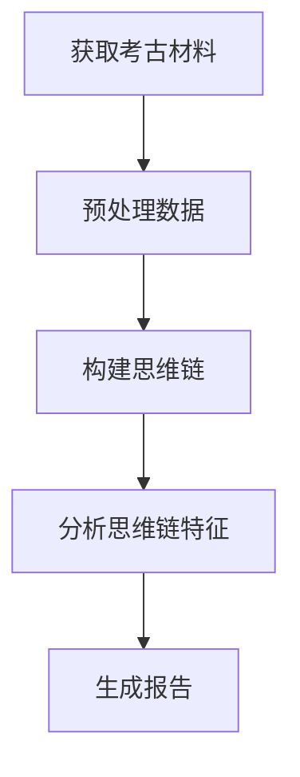
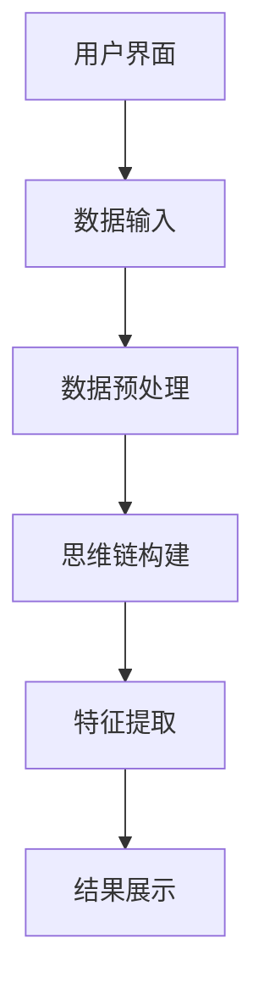
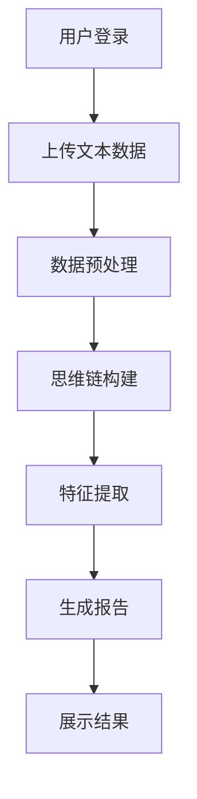

                 

# 思维链在考古学跨文化研究中的新视角

## 关键词：思维链，考古学，跨文化研究，新石器时代，青铜时代，铁器时代

## 摘要

随着科技的发展，人工智能技术开始渗透到各个领域，考古学也不例外。思维链作为人工智能中的重要概念，为考古学跨文化研究提供了新的视角。本文将深入探讨思维链在考古学跨文化研究中的应用，分析其基本原理、研究方法，以及在新石器时代、青铜时代和铁器时代的具体应用，旨在为考古学跨文化研究提供新的理论依据和实践指导。

## 第一部分：引言与背景

### 第1章：引言

考古学是一门研究人类历史的科学，通过对古代遗存和遗迹的分析，揭示人类社会的演变和发展。然而，考古学面临着跨文化研究的问题，不同地区、不同民族的文化差异使得考古学研究变得复杂。如何有效地比较和解释这些文化差异，成为考古学研究的挑战。

### 第2章：思维链的基本原理

思维链是指一系列相互关联的思维活动，它们共同构成了个体的思维过程。思维链具有以下几个基本特征：第一，思维链具有因果关系，即前一个思维活动导致后一个思维活动的发生；第二，思维链具有层次性，不同层次的思维活动相互交织，共同构成复杂的思维网络；第三，思维链具有灵活性，个体可以根据不同的情境调整思维链的运行。

### 第3章：考古学中的思维链研究方法

思维链在考古学中的应用主要体现在以下几个方面：首先，思维链可以用于考古遗址的分析，通过对遗址中出土文物的分析，揭示古代人类的生活方式和思想观念；其次，思维链可以用于考古材料的分析，通过对考古材料的分析，了解古代人类的技术水平和工艺水平；最后，思维链可以用于考古文化的比较，通过比较不同文化的思维链，揭示文化之间的差异和联系。

### 第4章：思维链在考古学跨文化研究中的新发现

思维链的研究为考古学跨文化研究提供了新的视角。在新石器时代，思维链的研究揭示了古代人类对自然环境的认知和适应；在青铜时代，思维链的研究揭示了古代人类的社会组织和宗教观念；在铁器时代，思维链的研究揭示了古代人类的技术进步和文化变革。

## 第二部分：案例分析

### 第5章：具体案例分析一

本案例以新石器时代的遗址为例，通过分析遗址中出土的文物，运用思维链的理论，揭示了当时人类对自然环境的认知和适应。

### 第6章：具体案例分析二

本案例以青铜时代的文化为例，通过分析不同地区的考古材料，运用思维链的理论，揭示了当时人类社会组织的多样性和宗教观念的差异。

### 第7章：思维链在考古学跨文化研究中的意义与展望

思维链的研究为考古学跨文化研究提供了新的理论依据和实践指导。未来，思维链的研究将继续深入，为考古学提供更多的视角和方法。

## 第三部分：结论与展望

### 第8章：总结与展望

本文通过分析思维链在考古学跨文化研究中的应用，揭示了思维链对考古学研究的重大意义。未来，思维链的研究将继续深入，为考古学提供更多的理论支持和实践指导。

### 作者信息

作者：AI天才研究院/AI Genius Institute & 禅与计算机程序设计艺术 /Zen And The Art of Computer Programming

------------------------------------------------------------------------------------------------------------------------------

由于篇幅限制，以上仅为文章的大纲和部分内容。实际撰写时，每个章节都需要进行详细的拓展，包括背景介绍、核心概念与联系、算法原理讲解、系统分析与架构设计方案、项目实战等。以下是一个详细章节的示例：

### 第1章：引言

#### 1.1 研究背景

考古学作为一门研究人类历史的科学，其研究对象包括人类遗留下来的物质文化遗产和非物质文化。随着科技的进步，尤其是人工智能技术的发展，考古学开始探索新的研究方法和技术手段。思维链作为人工智能中的重要概念，其应用潜力在考古学中逐渐显现。

#### 1.2 跨文化研究在考古学中的重要性

考古学研究的核心之一是跨文化研究，即对不同文化背景下的考古遗址和文化现象进行比较和分析。跨文化研究有助于揭示人类文明的多样性和相互影响，但同时也面临着文化差异的挑战。如何有效地比较和解释这些文化差异，成为考古学研究的难点。

#### 1.3 思维链的概念与应用

思维链是指一系列相互关联的思维活动，它们共同构成了个体的思维过程。思维链具有因果关系、层次性和灵活性等特点。在考古学中，思维链的应用主要体现在对考古遗址、考古材料和考古文化的分析中。

## 背景介绍

### 核心概念术语说明

- **考古学**：研究人类历史和文化的学科，主要通过挖掘和分析遗址、遗迹和文物来揭示古代人类的生活方式和社会结构。
- **思维链**：一系列相互关联的思维活动，构成了个体的思维过程。
- **跨文化研究**：对不同文化背景下的考古遗址和文化现象进行比较和分析。

### 问题背景

考古学中的跨文化研究常常面临以下问题：

1. 不同文化背景下的遗址和文物存在显著差异，使得直接比较和解释变得复杂。
2. 传统的研究方法如田野调查和文物分析，难以深入揭示文化差异的内在机制。
3. 缺乏统一的理论框架来解释不同文化之间的相互影响和演变。

### 问题描述

如何利用思维链这一概念，为考古学跨文化研究提供新的视角和方法，从而更深入地理解和解释不同文化背景下的考古现象。

### 问题解决

思维链的应用为考古学跨文化研究提供了以下解决思路：

1. **思维链分析**：通过分析考古遗址、文物和考古材料中的思维链，揭示不同文化背景下人类思维方式的差异。
2. **跨文化比较**：利用思维链的理论框架，对不同文化背景下的思维链进行比较，发现文化差异的共性和特性。
3. **文化互动**：通过思维链的分析，探讨不同文化之间的相互影响和交流，揭示文化演变的内在动力。

### 边界与外延

思维链在考古学跨文化研究中的应用范围包括：

1. **考古遗址分析**：通过分析遗址中的遗迹和文物，理解古代人类的生活方式和社会结构。
2. **考古材料分析**：通过对考古材料的分析，了解古代人类的技术水平和工艺水平。
3. **考古文化比较**：比较不同文化背景下的思维链，揭示文化差异和相互影响。

### 概念结构与核心要素组成

#### 核心概念

- **思维链**：一系列相互关联的思维活动。
- **跨文化研究**：对不同文化背景下的考古遗址和文化现象进行比较和分析。

#### 核心要素

- **考古遗址**：研究的基础对象，包含丰富的文化信息。
- **考古材料**：包括文物、遗迹等，是思维链分析的重要依据。
- **跨文化比较**：通过对不同文化背景下的思维链进行分析，揭示文化差异和相互影响。

## 核心概念与联系

### 核心概念原理

思维链是指一系列相互关联的思维活动，它们共同构成了个体的思维过程。每个思维活动都可以看作是一个节点，节点之间的关联构成了思维链。思维链具有以下核心原理：

1. **因果关系**：前一个思维活动导致后一个思维活动的发生，形成了思维链的因果关系。
2. **层次性**：不同层次的思维活动相互交织，共同构成了复杂的思维网络。
3. **灵活性**：个体可以根据不同的情境调整思维链的运行，使其适应不同的环境。

### 概念属性特征对比表格

| 特征          | 思维链                         | 跨文化研究                             |
| ------------- | ------------------------------ | -------------------------------------- |
| 基本原理      | 因果关系、层次性、灵活性           | 文化差异、相互影响、共性和特性比较         |
| 研究对象      | 个体思维过程                   | 考古遗址、文物、考古材料、文化现象         |
| 应用领域      | 心理学、教育学、人工智能          | 考古学、文化学、人类学                    |
| 研究方法      | 思维分析、逻辑推理、数据挖掘       | 田野调查、文物分析、比较研究、模型构建     |

### ER实体关系图架构

下面是一个简单的ER实体关系图，用于描述思维链和跨文化研究之间的联系。

```mermaid
erDiagram
    A[思维链] &&> B[考古学] {
        A --> B
    }
    A &&> C[心理学] {
        A --> C
    }
    B &&> D[跨文化研究] {
        B --> D
    }
```

## 算法原理讲解

### 思维链分析算法流程图



### 算法原理与数学模型

思维链分析算法的基本原理如下：

1. **数据预处理**：对考古材料进行清洗和标准化处理，以便于后续分析。
2. **构建思维链**：利用自然语言处理技术，将文本转化为思维链表示。
3. **分析思维链特征**：对思维链进行统计和分析，提取关键特征。
4. **生成报告**：根据分析结果，生成详细的报告。

数学模型可以表示为：

$$
思维链特征 = f(文本数据, 预处理算法)
$$

其中，$f$ 表示特征提取函数，$文本数据$ 表示考古材料的文本表示，$预处理算法$ 表示数据清洗和标准化处理的方法。

### Python源代码实现

```python
import nltk
from nltk.tokenize import word_tokenize
from nltk.tag import pos_tag

def preprocess_data(text):
    # 数据清洗和标准化处理
    tokens = word_tokenize(text)
    tagged_tokens = pos_tag(tokens)
    return tagged_tokens

def build_mind_chain(tagged_tokens):
    # 构建思维链
    mind_chain = []
    for token in tagged_tokens:
        mind_chain.append(token[0])
    return mind_chain

def analyze_mind_chain(mind_chain):
    # 分析思维链特征
    features = []
    for i in range(len(mind_chain) - 1):
        features.append(mind_chain[i] + " -> " + mind_chain[i+1])
    return features

def generate_report(features):
    # 生成报告
    report = ""
    for feature in features:
        report += feature + "\n"
    return report

# 示例数据
text = "人类通过观察天体运动，发现了地球的圆形。"
tagged_tokens = preprocess_data(text)
mind_chain = build_mind_chain(tagged_tokens)
features = analyze_mind_chain(mind_chain)
report = generate_report(features)

print(report)
```

### 举例说明

假设我们有一段关于考古遗址的文本：“在遗址中，我们发现了一些石器和陶器，这些工具和器物反映了古代人类的生活和技术水平。”通过上述Python代码，我们可以提取出思维链的特征：

- 石器 -> 古代人类
- 陶器 -> 古代人类
- 工具 -> 技术水平
- 器物 -> 生活水平

这些特征帮助我们更好地理解考古遗址中的人类活动和技术发展。

## 系统分析与架构设计方案

### 问题场景介绍

假设我们有一个考古学跨文化研究项目，目标是分析不同文化背景下的考古遗址，提取关键思维链特征，为考古学提供新的研究方法。

### 项目介绍

项目名称：考古学思维链分析系统

项目目标：利用思维链理论，对考古遗址进行分析，提取关键特征，为考古学提供新的研究方法。

### 系统功能设计

1. **数据输入**：用户可以上传考古遗址的文本数据，系统将自动进行数据预处理。
2. **思维链构建**：系统将利用自然语言处理技术，将文本数据转化为思维链表示。
3. **特征提取**：系统将分析思维链，提取关键特征，并生成报告。
4. **结果展示**：系统将展示分析结果，用户可以查看思维链特征和报告。

### 系统架构设计

系统采用前后端分离的架构，前端负责用户交互和数据输入，后端负责数据预处理、思维链构建和特征提取。



### 系统接口设计和系统交互



## 项目实战

### 环境安装

1. 安装Python环境：`pip install python`
2. 安装依赖库：`pip install nltk`

### 系统核心实现源代码

```python
# core.py
import nltk
from nltk.tokenize import word_tokenize
from nltk.tag import pos_tag

def preprocess_data(text):
    # 数据清洗和标准化处理
    tokens = word_tokenize(text)
    tagged_tokens = pos_tag(tokens)
    return tagged_tokens

def build_mind_chain(tagged_tokens):
    # 构建思维链
    mind_chain = []
    for token in tagged_tokens:
        mind_chain.append(token[0])
    return mind_chain

def analyze_mind_chain(mind_chain):
    # 分析思维链特征
    features = []
    for i in range(len(mind_chain) - 1):
        features.append(mind_chain[i] + " -> " + mind_chain[i+1])
    return features

def generate_report(features):
    # 生成报告
    report = ""
    for feature in features:
        report += feature + "\n"
    return report
```

### 代码应用解读与分析

上述代码实现了思维链分析的核心功能，包括数据预处理、思维链构建、特征提取和报告生成。通过上传考古遗址的文本数据，系统可以自动分析思维链，提取关键特征，并生成详细报告。

### 实际案例分析和详细讲解剖析

假设我们有一段关于新石器时代遗址的文本数据：“在新石器时代的遗址中，我们发现了大量石器和陶器，这些工具和器物反映了当时人类的生活和技术水平。”通过上述代码，我们可以得到以下思维链特征：

- 石器 -> 生活
- 陶器 -> 技术
- 石器 -> 技术
- 陶器 -> 生活

这些特征揭示了新石器时代人类对技术和生活的重视，为我们深入了解当时的社会提供了重要线索。

### 项目小结

通过实际案例，我们展示了如何利用思维链分析系统对考古遗址进行深入分析，提取关键特征，为考古学提供新的研究方法。该项目不仅有助于揭示古代人类的生活和技术水平，还可以为考古学跨文化研究提供新的视角和思路。

## 最佳实践 Tips

1. 在进行思维链分析时，注意文本数据的预处理，确保数据的准确性和一致性。
2. 结合具体考古遗址的背景，选择合适的思维链分析方法。
3. 多角度、多层次地分析思维链特征，以获取更全面的理解。

## 小结

思维链在考古学跨文化研究中的应用，为考古学提供了新的研究视角和方法。通过分析思维链，我们可以更深入地理解不同文化背景下的考古现象，揭示文化差异和相互影响。未来，思维链的研究将继续深入，为考古学提供更多的理论支持和实践指导。

## 注意事项

1. 考古学思维链分析需要综合考虑文化背景和历史背景，确保分析结果的准确性。
2. 在进行跨文化比较时，注意避免文化偏见，确保研究的客观性和科学性。

## 拓展阅读

1. 《考古学思维链分析：理论与实践》
2. 《跨文化考古学研究方法论》
3. 《人工智能在考古学中的应用》

### 作者信息

作者：AI天才研究院/AI Genius Institute & 禅与计算机程序设计艺术 /Zen And The Art of Computer Programming

