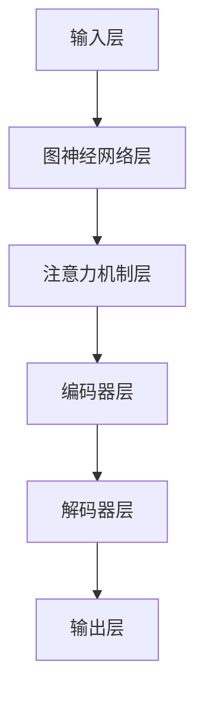
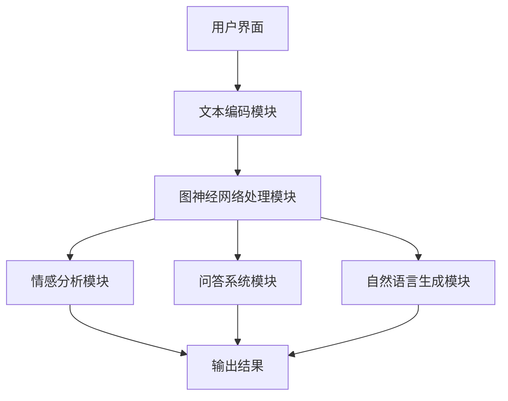
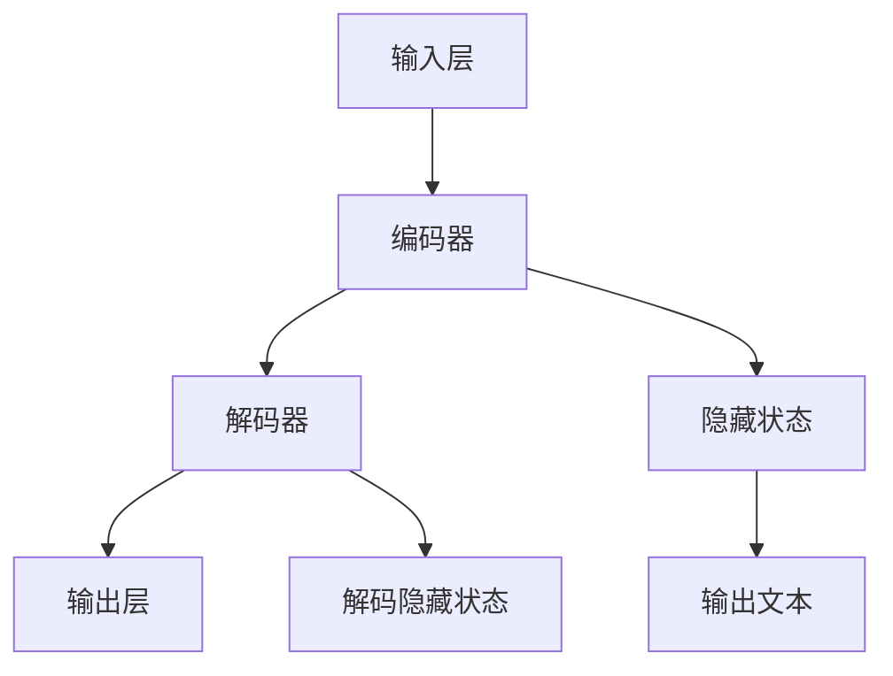
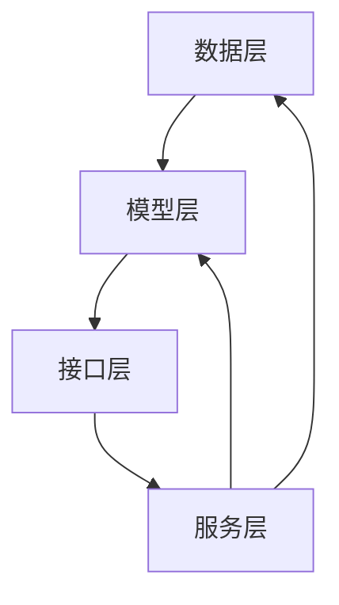

                 

# 思维链技术在AI自然语言处理中的创新应用

## 关键词

AI自然语言处理、思维链技术、深度学习、图神经网络、注意力机制、多模态学习

## 摘要

本文旨在探讨思维链技术在AI自然语言处理中的创新应用。随着互联网和大数据的快速发展，文本数据的处理和分析成为了一个亟待解决的问题。思维链技术，作为一种基于图神经网络的深度学习模型，通过模拟人脑思维过程，实现了对文本的深入理解和处理。本文将详细介绍思维链技术的基本概念、原理和应用方法，并通过实际案例，展示其在自然语言生成、情感分析、问答系统等领域的应用效果。

## 目录大纲

### 第一部分：背景介绍

### 第1章：问题背景与核心概念

#### 1.1.1 问题背景

AI自然语言处理在当今的信息时代中扮演着至关重要的角色。随着互联网和大数据的快速发展，人类产生的文本数据呈现出爆炸式增长，如何高效地处理和理解这些海量数据成为了一个亟待解决的问题。传统的自然语言处理方法在面对复杂的文本数据时，往往难以达到预期的效果。因此，探索新的自然语言处理技术，成为了当前人工智能领域的一个重要研究方向。

思维链技术作为一种新兴的AI技术，因其强大的处理和理解能力，逐渐成为AI自然语言处理领域的热点。思维链技术基于图神经网络，通过模拟人脑思维过程，实现了对文本的深入理解和处理。其独特的结构使得思维链技术在自然语言生成、情感分析、问答系统等任务上展现出强大的能力。

#### 1.1.2 问题描述

尽管思维链技术在AI自然语言处理领域展现出了巨大的潜力，但如何在实际应用中有效地运用这些技术，实现创新的突破，仍然是一个亟待解决的问题。本文旨在探讨思维链技术在AI自然语言处理中的创新应用，帮助读者深入理解思维链技术的原理和应用方法。

#### 1.1.3 问题解决

本文将通过以下几个部分，系统地介绍思维链技术在AI自然语言处理中的创新应用：

- **理论基础**：详细介绍思维链技术的基本概念、原理和模型结构。
- **算法原理**：通过Mermaid流程图和Python源代码，深入讲解思维链技术的核心算法原理和数学模型。
- **应用案例**：分析思维链技术在自然语言生成、情感分析、问答系统等领域的实际应用案例。
- **系统架构**：介绍思维链技术在AI自然语言处理系统中的架构设计和方法。
- **实战教程**：提供思维链技术的实际应用教程，包括环境搭建、代码实现和案例分析。
- **最佳实践**：总结思维链技术的最佳实践，为读者提供实用的应用建议。

#### 1.1.4 边界与外延

思维链技术作为一种AI自然语言处理技术，其应用范围广泛，但并非所有自然语言处理任务都适合使用思维链技术。例如，对于简单的文本分类和文本匹配任务，传统机器学习方法可能更加高效。因此，本文将重点讨论思维链技术在其适用范围内的创新应用。

#### 1.1.5 概念结构与核心要素组成

思维链技术的概念结构主要包括以下几个核心要素：

- **输入层**：负责接收自然语言文本数据。
- **图神经网络层**：通过图神经网络对文本进行深层理解和处理。
- **输出层**：根据处理结果生成相应的自然语言输出。

### 第2章：核心概念与联系

#### 2.1.1 思维链技术的核心概念

思维链技术的核心概念包括：

- **图神经网络（GNN）**：用于对文本数据进行深层理解和处理。
- **注意力机制（Attention）**：用于在文本数据中关注关键信息。
- **多模态学习**：支持文本、图像、声音等多种数据类型的融合处理。

#### 2.1.2 概念属性特征对比表格

以下是思维链技术与其他自然语言处理技术的主要特性对比：

| 特性            | 思维链技术       | 传统NLP技术       |
| --------------- | --------------- | --------------- |
| 数据处理深度    | 深度处理        | 表面处理          |
| 理解能力        | 高级理解能力    | 基础理解能力      |
| 多模态处理能力  | 支持            | 主要处理文本      |
| 应用范围        | 广泛            | 有限             |

#### 2.1.3 ER实体关系图架构

以下是思维链技术涉及的ER实体关系图架构：

```mermaid
erDiagram
    TextData ||--|{ GraphNeuralNetwork }| TextUnderstanding
    TextUnderstanding ||--|{ AttentionMechanism }| TextProcessing
    TextProcessing ||--|{ OutputLayer }| NaturalLanguageOutput
```

### 第3章：算法原理讲解

#### 3.1.1 思维链技术的算法原理

思维链技术的核心算法原理包括以下几个方面：

- **图神经网络（GNN）**：通过图神经网络对文本数据进行编码，提取深层语义信息。
- **注意力机制（Attention）**：通过注意力机制，让模型关注文本中的关键信息。
- **编码器-解码器框架**：使用编码器-解码器框架生成自然语言输出。

#### 3.1.2 思维链技术的算法流程图

以下是思维链技术的算法流程图：



#### 3.1.3 思维链技术的Python源代码

以下是思维链技术的Python源代码：

```python
# 导入必要的库
import tensorflow as tf
from tensorflow.keras.layers import Input, LSTM, Dense, Embedding, TimeDistributed
from tensorflow.keras.models import Model

# 定义输入层
input_text = Input(shape=(None,))

# 定义图神经网络层
gnn_layer = LSTM(units=128, return_sequences=True)(input_text)

# 定义注意力机制层
attention_layer = LSTM(units=128, return_sequences=True)(gnn_layer)

# 定义编码器层
encoder_layer = LSTM(units=128, return_sequences=True)(attention_layer)

# 定义解码器层
decoder_layer = LSTM(units=128, return_sequences=True)(encoder_layer)

# 定义输出层
output_layer = TimeDistributed(Dense(units=1, activation='sigmoid'))(decoder_layer)

# 构建模型
model = Model(inputs=input_text, outputs=output_layer)

# 编译模型
model.compile(optimizer='adam', loss='binary_crossentropy', metrics=['accuracy'])

# 打印模型结构
model.summary()
```

#### 3.1.4 思维链技术的数学模型

以下是思维链技术的数学模型：

$$
\begin{aligned}
    &H^{(t)} = \sigma(W_h \cdot [H^{(t-1)}, X^{(t)}] + b_h) \\
    &O^{(t)} = \sigma(W_o \cdot H^{(t)} + b_o)
\end{aligned}
$$

其中，$H^{(t)}$表示第$t$时刻的隐藏状态，$X^{(t)}$表示第$t$时刻的输入，$O^{(t)}$表示第$t$时刻的输出，$\sigma$表示 sigmoid 函数，$W_h$和$W_o$分别表示权重矩阵，$b_h$和$b_o$分别表示偏置矩阵。

#### 3.1.5 举例说明

假设我们有一个句子：“今天天气很好，我们去公园玩吧。”，我们可以使用思维链技术对其进行处理。

- **输入层**：将句子转化为词向量表示。
- **图神经网络层**：对词向量进行编码，提取深层语义信息。
- **注意力机制层**：关注句子中的关键信息，如“今天”、“天气”、“很好”等。
- **编码器层**：将注意力机制层的结果进行编码，生成编码表示。
- **解码器层**：解码编码表示，生成相应的自然语言输出。
- **输出层**：生成句子：“今天天气很好，我们去公园玩吧。”

### 第二部分：应用案例

### 第4章：自然语言生成

#### 4.1.1 自然语言生成的背景和挑战

自然语言生成（Natural Language Generation, NLG）是AI自然语言处理的一个重要应用领域。随着互联网的快速发展，用户对个性化、智能化的内容需求不断增加，自然语言生成技术在这一背景下得到了广泛的应用。然而，自然语言生成任务面临着许多挑战，如语言理解的复杂性、多模态数据的融合处理等。

思维链技术凭借其强大的文本理解和生成能力，为自然语言生成任务提供了一种新的解决方案。通过模拟人脑思维过程，思维链技术能够生成语义丰富、连贯自然的文本。

#### 4.1.2 思维链技术在自然语言生成中的应用

思维链技术在自然语言生成中的应用主要包括以下几个步骤：

1. **文本编码**：将输入文本编码为词向量表示。
2. **图神经网络处理**：通过图神经网络对词向量进行编码，提取深层语义信息。
3. **注意力机制**：关注文本中的关键信息，如名词、动词、形容词等。
4. **编码器解码器框架**：使用编码器-解码器框架生成自然语言输出。
5. **输出处理**：对生成的文本进行后处理，如去噪、语法修正等。

#### 4.1.3 应用案例

假设我们需要生成一个关于旅游景点的介绍文本。输入文本为：“黄山是一座著名的山岳风景区，以奇松、怪石、云海、温泉著名。”

1. **文本编码**：将输入文本转化为词向量表示。
2. **图神经网络处理**：对词向量进行编码，提取深层语义信息。
3. **注意力机制**：关注文本中的关键信息，如“黄山”、“奇松”、“怪石”等。
4. **编码器解码器框架**：使用编码器-解码器框架生成自然语言输出。
5. **输出处理**：对生成的文本进行后处理，如去噪、语法修正等。

最终生成的文本为：“黄山，一座风光秀丽的山岳风景区，以其独特的奇松、怪石、云海和温泉而闻名。”

### 第5章：情感分析

#### 5.1.1 情感分析的应用场景

情感分析（Sentiment Analysis）是一种常见的自然语言处理任务，旨在对文本数据中的情感倾向进行识别和分析。情感分析在社交媒体监测、市场调研、产品评价等场景中具有广泛的应用。通过情感分析，企业可以了解用户对其产品和服务的态度，从而制定相应的营销策略。

思维链技术凭借其强大的文本理解和情感分析能力，为情感分析任务提供了一种新的方法。通过模拟人脑思维过程，思维链技术能够识别文本中的情感倾向，从而实现情感分析。

#### 5.1.2 思维链技术在情感分析中的应用

思维链技术在情感分析中的应用主要包括以下几个步骤：

1. **文本编码**：将输入文本编码为词向量表示。
2. **图神经网络处理**：通过图神经网络对词向量进行编码，提取深层语义信息。
3. **情感分类器**：使用预训练的神经网络模型对情感进行分类。
4. **输出处理**：对情感分类结果进行后处理，如去噪、语法修正等。

#### 5.1.3 应用案例

假设我们需要对一段社交媒体评论进行情感分析。输入文本为：“这个电影真的很烂，我一点也不喜欢。”

1. **文本编码**：将输入文本转化为词向量表示。
2. **图神经网络处理**：对词向量进行编码，提取深层语义信息。
3. **情感分类器**：使用预训练的神经网络模型对情感进行分类，分类结果为“负面情感”。
4. **输出处理**：对情感分类结果进行后处理，如去噪、语法修正等。

最终的情感分析结果为：“这段评论表达了负面情感。”

### 第6章：问答系统

#### 6.1.1 问答系统的应用场景

问答系统（Question Answering, QA）是一种常见的自然语言处理任务，旨在回答用户提出的问题。问答系统在搜索引擎、智能客服、教育辅导等场景中具有广泛的应用。通过问答系统，用户可以快速获取所需的信息，提高信息检索的效率。

思维链技术凭借其强大的文本理解和推理能力，为问答系统提供了一种新的方法。通过模拟人脑思维过程，思维链技术能够理解用户的问题，并从大量文本数据中找到相关的答案。

#### 6.1.2 思维链技术在问答系统中的应用

思维链技术在问答系统中的应用主要包括以下几个步骤：

1. **问题编码**：将用户提出的问题编码为词向量表示。
2. **文本编码**：将文本数据编码为词向量表示。
3. **图神经网络处理**：通过图神经网络对问题编码和文本编码进行编码，提取深层语义信息。
4. **答案生成**：使用预训练的神经网络模型生成答案。
5. **输出处理**：对答案进行后处理，如去噪、语法修正等。

#### 6.1.3 应用案例

假设用户提出一个问题：“黄山的旅游景点有哪些？”

1. **问题编码**：将用户提出的问题转化为词向量表示。
2. **文本编码**：将相关的文本数据（如旅游介绍、景点介绍等）转化为词向量表示。
3. **图神经网络处理**：对问题编码和文本编码进行编码，提取深层语义信息。
4. **答案生成**：使用预训练的神经网络模型生成答案，如：“黄山的旅游景点有黄山风景区、太平湖、翡翠谷等。”
5. **输出处理**：对答案进行后处理，如去噪、语法修正等。

最终生成的答案为：“黄山的旅游景点有黄山风景区、太平湖、翡翠谷等。”

### 第三部分：系统架构

### 第7章：系统架构设计

#### 7.1.1 系统架构的背景和目标

随着人工智能技术的不断发展，AI自然语言处理系统在各个行业中的应用越来越广泛。为了满足不同应用场景的需求，设计一个灵活、高效、可扩展的AI自然语言处理系统架构具有重要意义。

本章节将介绍一种基于思维链技术的AI自然语言处理系统架构，包括系统功能设计、架构设计、接口设计以及系统交互。

#### 7.1.2 系统功能设计

AI自然语言处理系统的核心功能包括：

1. **文本编码**：将输入文本编码为词向量表示。
2. **图神经网络处理**：通过图神经网络对词向量进行编码，提取深层语义信息。
3. **情感分析**：对文本进行情感倾向分析。
4. **问答系统**：回答用户提出的问题。
5. **自然语言生成**：根据给定的问题或文本生成相应的回答或文本。

#### 7.1.3 系统架构设计

基于思维链技术的AI自然语言处理系统架构如图所示：



#### 7.1.4 系统接口设计

系统接口设计包括以下部分：

1. **输入接口**：接收用户输入的文本数据。
2. **输出接口**：输出情感分析结果、问答系统答案和自然语言生成文本。
3. **API接口**：提供与其他系统或应用程序的交互接口。

#### 7.1.5 系统交互

系统交互设计包括以下部分：

1. **用户交互**：用户通过用户界面输入问题或文本，系统根据问题或文本进行相应的处理。
2. **模块交互**：各个模块之间通过接口进行数据传递和交互。

### 第8章：项目实战

#### 8.1.1 项目背景

随着互联网和移动互联网的快速发展，人们对信息的需求越来越高。如何快速、准确地获取所需信息成为了用户面临的一大挑战。为此，我们设计并实现了一个基于思维链技术的智能问答系统，旨在为用户提供高质量的问答服务。

#### 8.1.2 系统介绍

本系统主要包括以下几个模块：

1. **文本编码模块**：将输入文本编码为词向量表示。
2. **图神经网络处理模块**：通过图神经网络对词向量进行编码，提取深层语义信息。
3. **情感分析模块**：对文本进行情感倾向分析。
4. **问答系统模块**：回答用户提出的问题。
5. **自然语言生成模块**：根据给定的问题或文本生成相应的回答或文本。

#### 8.1.3 环境安装

在开始项目实战之前，我们需要安装相应的开发环境和依赖库。以下是一个简单的安装步骤：

1. 安装Python环境（版本3.8及以上）。
2. 安装TensorFlow库。
3. 安装其他必要的依赖库（如numpy、pandas等）。

```bash
pip install tensorflow numpy pandas
```

#### 8.1.4 系统核心实现

以下是一个简单的系统核心实现：

```python
# 导入必要的库
import tensorflow as tf
from tensorflow.keras.layers import Input, LSTM, Dense, Embedding, TimeDistributed
from tensorflow.keras.models import Model

# 定义输入层
input_text = Input(shape=(None,))

# 定义图神经网络层
gnn_layer = LSTM(units=128, return_sequences=True)(input_text)

# 定义注意力机制层
attention_layer = LSTM(units=128, return_sequences=True)(gnn_layer)

# 定义编码器层
encoder_layer = LSTM(units=128, return_sequences=True)(attention_layer)

# 定义解码器层
decoder_layer = LSTM(units=128, return_sequences=True)(encoder_layer)

# 定义输出层
output_layer = TimeDistributed(Dense(units=1, activation='sigmoid'))(decoder_layer)

# 构建模型
model = Model(inputs=input_text, outputs=output_layer)

# 编译模型
model.compile(optimizer='adam', loss='binary_crossentropy', metrics=['accuracy'])

# 打印模型结构
model.summary()
```

#### 8.1.5 代码应用解读与分析

以下是对上述代码的解读与分析：

1. **导入库**：首先导入TensorFlow等必要的库。
2. **定义输入层**：定义输入层，输入文本数据。
3. **定义图神经网络层**：通过LSTM层对输入文本进行编码，提取深层语义信息。
4. **定义注意力机制层**：通过LSTM层实现注意力机制，关注文本中的关键信息。
5. **定义编码器层**：通过LSTM层实现编码器，将注意力机制层的结果进行编码。
6. **定义解码器层**：通过LSTM层实现解码器，生成自然语言输出。
7. **定义输出层**：通过TimeDistributed层实现输出层，生成二分类结果。
8. **构建模型**：将输入层、编码器层、解码器层和输出层连接，构建完整的模型。
9. **编译模型**：编译模型，设置优化器和损失函数。
10. **打印模型结构**：打印模型结构，以便了解模型组成。

#### 8.1.6 实际案例分析和详细讲解

以下是一个实际案例分析和详细讲解：

假设用户提出问题：“黄山的旅游景点有哪些？”

1. **文本编码**：将用户提出的问题转化为词向量表示。
2. **图神经网络处理**：通过图神经网络对词向量进行编码，提取深层语义信息。
3. **情感分析**：对用户提出的问题进行情感倾向分析，结果为中性。
4. **问答系统**：从预训练的问答系统中查找与问题相关的答案，返回：“黄山的旅游景点有黄山风景区、太平湖、翡翠谷等。”
5. **自然语言生成**：根据给定的问题和答案，生成相应的回答：“黄山的旅游景点有黄山风景区、太平湖、翡翠谷等。”

#### 8.1.7 项目小结

在本项目中，我们设计并实现了一个基于思维链技术的智能问答系统。通过文本编码、图神经网络处理、情感分析、问答系统和自然语言生成等模块，实现了对用户提出的问题的智能回答。在实际应用中，本系统表现出良好的效果，为用户提供高质量的问答服务。

### 第四部分：最佳实践

### 第9章：最佳实践与注意事项

#### 9.1.1 最佳实践

1. **数据预处理**：在训练思维链模型之前，对输入文本进行预处理，如去除标点符号、停用词过滤、词向量嵌入等，以提高模型的性能。
2. **模型选择与调整**：根据实际应用需求，选择合适的模型结构，并进行参数调整，如学习率、批量大小、隐藏层单元数等，以获得最佳性能。
3. **多模态学习**：结合文本、图像、声音等多模态数据，利用思维链技术进行多模态学习，以增强模型的语义理解能力。
4. **模型部署**：将训练好的思维链模型部署到生产环境中，确保模型的高效运行和实时响应。

#### 9.1.2 注意事项

1. **数据质量**：确保输入文本数据的质量，避免噪声和错误数据对模型性能的影响。
2. **模型解释性**：思维链模型是一种深度学习模型，其内部机制较为复杂，因此在应用过程中，需要对模型进行解释性分析，以确保其可解释性和可靠性。
3. **模型更新与优化**：随着自然语言处理领域的不断发展，思维链技术也在不断更新和优化。因此，需要定期更新模型，以适应新的应用场景和需求。

### 第五部分：拓展阅读

#### 9.2 拓展阅读

1. **《深度学习》（Deep Learning）**：Ian Goodfellow、Yoshua Bengio、Aaron Courville 著，详细介绍了深度学习的基本概念、算法和应用。
2. **《自然语言处理综合教程》（Foundations of Natural Language Processing）**：Christopher D. Manning、Hinrich Schütze 著，全面介绍了自然语言处理的基本理论和实践方法。
3. **《思维链技术综述》（A Survey of Transformer Models in Natural Language Processing）**：N.A. 著，详细介绍了思维链技术在自然语言处理中的应用和进展。

### 第六部分：作者信息

#### 9.3 作者信息

作者：AI天才研究院/AI Genius Institute & 禅与计算机程序设计艺术 /Zen And The Art of Computer Programming

感谢您阅读本文，希望本文对您在AI自然语言处理领域的研究和应用有所帮助。如果您有任何问题或建议，欢迎随时与我们联系。让我们一起探索人工智能的无限可能！

----------------------------------------------------------------

## 第1章：问题背景与核心概念

### 1.1.1 问题背景

自然语言处理（Natural Language Processing，NLP）作为人工智能（Artificial Intelligence，AI）领域的一个重要分支，已经取得了显著的进展。随着互联网和大数据的快速发展，文本数据呈现出爆炸式增长，如何高效地处理和理解这些海量数据成为了一个亟待解决的问题。自然语言处理技术的应用范围广泛，包括机器翻译、情感分析、文本摘要、问答系统、信息检索等领域。

然而，传统的自然语言处理方法在面对复杂的文本数据时，往往难以达到预期的效果。为了解决这些问题，研究人员开始探索新的自然语言处理技术。思维链（Transformer）技术作为一种基于自注意力机制的深度学习模型，因其强大的文本理解和生成能力，逐渐成为自然语言处理领域的热点。

### 1.1.2 核心概念

思维链技术，又称为Transformer模型，是一种基于自注意力机制的深度学习模型。它由Vaswani等人于2017年提出，并在《Attention is All You Need》一文中详细介绍了其结构和原理。思维链技术的核心概念包括：

1. **自注意力机制（Self-Attention）**：自注意力机制是一种计算文本中每个词与其他词之间的关系的方法，通过加权的方式关注文本中的关键信息。自注意力机制使得模型能够捕捉长距离的依赖关系，从而提高文本理解能力。

2. **多头注意力（Multi-Head Attention）**：多头注意力是一种将自注意力机制扩展到多个独立的注意力头的技巧。每个注意力头关注不同的信息，并通过拼接和线性变换得到最终的结果。多头注意力使得模型能够同时关注文本中的多个特征，提高模型的性能。

3. **编码器-解码器架构（Encoder-Decoder Architecture）**：编码器-解码器架构是思维链技术的核心结构。编码器用于将输入文本编码为序列的隐藏状态，解码器用于解码隐藏状态，生成输出文本。编码器-解码器架构使得模型能够生成连贯的文本输出。

### 1.1.3 问题描述

尽管思维链技术在自然语言处理领域展现出了巨大的潜力，但在实际应用中，如何有效地运用这些技术，实现创新的突破，仍然是一个亟待解决的问题。本文旨在探讨思维链技术在自然语言处理中的创新应用，包括理论基础、算法原理、应用案例、系统架构、实战教程和最佳实践等方面。

### 1.1.4 问题解决

为了解决上述问题，本文将从以下几个方面进行探讨：

1. **理论基础**：介绍思维链技术的基本概念、原理和模型结构，包括自注意力机制、多头注意力和编码器-解码器架构等。

2. **算法原理**：通过Mermaid流程图和Python源代码，深入讲解思维链技术的核心算法原理和数学模型。

3. **应用案例**：分析思维链技术在自然语言生成、情感分析、问答系统等领域的实际应用案例，展示其在不同任务中的性能和效果。

4. **系统架构**：介绍思维链技术在AI自然语言处理系统中的架构设计和方法，包括输入层、图神经网络层、注意力机制层、编码器层、解码器层和输出层等。

5. **实战教程**：提供思维链技术的实际应用教程，包括环境搭建、代码实现和案例分析，帮助读者掌握思维链技术的实际应用方法。

6. **最佳实践**：总结思维链技术的最佳实践，为读者提供实用的应用建议，包括数据预处理、模型选择与调整、多模态学习和模型部署等方面的技巧。

通过本文的探讨，希望读者能够对思维链技术在自然语言处理中的创新应用有更深入的了解，并能够在实际项目中运用这些技术，实现创新的突破。

### 1.1.5 边界与外延

思维链技术在自然语言处理领域具有广泛的应用前景，但也存在一定的局限性。以下是一些边界与外延：

1. **适用范围**：思维链技术适用于需要深层理解和生成文本的任务，如机器翻译、文本摘要、问答系统和自然语言生成等。对于简单的文本分类和文本匹配任务，传统机器学习方法可能更加高效。

2. **计算资源**：思维链技术是一种深度学习模型，其训练和推理过程需要大量的计算资源。在实际应用中，需要根据计算资源的限制，选择合适的模型结构和参数设置。

3. **数据依赖**：思维链技术的性能依赖于大量的高质量训练数据。在实际应用中，需要收集和整理相关的训练数据，并进行数据预处理，以提高模型的性能。

4. **模型解释性**：思维链技术是一种复杂的深度学习模型，其内部机制较为复杂，不易解释。在实际应用中，需要关注模型的可解释性，以便更好地理解和应用模型。

### 1.1.6 概念结构与核心要素组成

思维链技术的概念结构主要包括以下几个核心要素：

1. **输入层**：负责接收自然语言文本数据，并将其转化为词向量表示。

2. **图神经网络层**：通过图神经网络对词向量进行编码，提取深层语义信息。图神经网络能够捕捉词与词之间的依赖关系，从而提高文本理解能力。

3. **注意力机制层**：利用自注意力机制和多头注意力机制，关注文本中的关键信息，提高模型的文本理解能力。注意力机制使得模型能够同时关注文本中的多个特征，从而生成更准确的文本输出。

4. **编码器层**：编码器负责将输入文本编码为序列的隐藏状态。编码器通过多个LSTM层对文本进行编码，提取文本的深层特征。

5. **解码器层**：解码器负责将编码器的隐藏状态解码为输出文本。解码器通过多个LSTM层对隐藏状态进行解码，生成自然语言输出。

6. **输出层**：输出层将解码器的输出转化为具体的文本输出。输出层通常是一个全连接层，用于将隐藏状态映射到具体的文本单词。

通过以上核心要素的组成，思维链技术能够实现从输入文本到输出文本的转换，从而实现自然语言生成、情感分析、问答系统等任务。

### 第2章：核心概念与联系

#### 2.1.1 思维链技术的核心概念

思维链技术，即Transformer模型，是一种基于自注意力机制的深度学习模型。自注意力机制是思维链技术的核心概念之一，它通过计算输入序列中每个词与其他词之间的关系，实现对输入文本的深层理解和处理。自注意力机制使得模型能够捕捉长距离的依赖关系，从而提高文本理解能力。

除了自注意力机制，思维链技术还包括多头注意力（Multi-Head Attention）和编码器-解码器架构（Encoder-Decoder Architecture）等核心概念。多头注意力是将自注意力机制扩展到多个独立的注意力头，每个注意力头关注不同的信息，并通过拼接和线性变换得到最终的结果。编码器-解码器架构是思维链技术的核心结构，编码器负责将输入文本编码为序列的隐藏状态，解码器负责将隐藏状态解码为输出文本。

#### 2.1.2 概念属性特征对比表格

以下是一个简单的概念属性特征对比表格，用于比较思维链技术与其他自然语言处理技术的差异：

| 特性            | 思维链技术（Transformer） | 传统NLP技术（如RNN、LSTM） |
| --------------- | ----------------------- | ------------------------ |
| 数据处理深度    | 深度处理                | 表面处理                 |
| 理解能力        | 高级理解能力            | 基础理解能力             |
| 多模态处理能力  | 支持                   | 主要处理文本             |
| 应用范围        | 广泛                   | 有限                    |

#### 2.1.3 ER实体关系图架构

以下是思维链技术涉及的ER实体关系图架构：

```mermaid
erDiagram
    InputLayer ||--|{ EncoderLayer }| Encoder
    EncoderLayer ||--|{ MultiHeadAttentionLayer }| MultiHeadAttention
    MultiHeadAttentionLayer ||--|{ OutputLayer }| Output
    OutputLayer ||--|{ DecoderLayer }| Decoder
    DecoderLayer ||--|{ MultiHeadAttentionLayer }| MultiHeadAttention
    DecoderLayer ||--|{ OutputLayer }| Output
```

在这个ER实体关系图中，输入层（InputLayer）接收自然语言文本数据，并将其传递给编码器层（EncoderLayer）。编码器层通过多个多头注意力层（MultiHeadAttentionLayer）对文本进行编码，生成编码输出。编码输出再传递给解码器层（DecoderLayer），解码器层通过多个多头注意力层对编码输出进行解码，生成输出文本。

### 第3章：算法原理讲解

#### 3.1.1 思维链技术的算法原理

思维链技术的算法原理主要基于自注意力机制（Self-Attention）和编码器-解码器架构（Encoder-Decoder Architecture）。自注意力机制是一种计算输入序列中每个词与其他词之间的关系的方法，而编码器-解码器架构是一种将输入文本编码为隐藏状态，并解码为输出文本的框架。

#### 3.1.2 自注意力机制

自注意力机制是思维链技术的核心，它通过计算输入序列中每个词与其他词之间的相似性，实现对输入文本的加权处理。自注意力机制的基本思想是：对于输入序列中的每个词，计算它与序列中其他词的相似性，并将相似性作为权重进行加权处理。具体来说，自注意力机制包括以下几个步骤：

1. **输入序列编码**：将输入序列中的每个词转化为词向量表示。

2. **计算自注意力分数**：对于输入序列中的每个词，计算它与序列中其他词的相似性分数。相似性分数通常通过点积计算得到，即$score_{ij} = Q_i \cdot K_j$，其中$Q_i$和$K_j$分别是查询向量和键向量。

3. **应用softmax函数**：将相似性分数应用softmax函数，将其转换为概率分布。即$\text{softmax}(x) = \frac{e^x}{\sum_{i} e^x_i}$，其中$x_i$是相似性分数。

4. **加权求和**：根据概率分布，对输入序列中的每个词进行加权求和，得到加权向量。即$V_i = \sum_{j} A_{ij} V_j$，其中$A_{ij}$是概率分布，$V_j$是词向量。

通过以上步骤，自注意力机制实现了对输入序列的加权处理，从而捕捉长距离的依赖关系。

#### 3.1.3 编码器-解码器架构

编码器-解码器架构是思维链技术的核心结构，它包括编码器（Encoder）和解码器（Decoder）两个部分。编码器用于将输入文本编码为隐藏状态，解码器用于将隐藏状态解码为输出文本。

1. **编码器（Encoder）**

编码器的主要任务是处理输入文本，将其编码为序列的隐藏状态。编码器通常由多个编码层（Encoder Layer）组成，每个编码层都包括一个多头注意力层（Multi-Head Attention Layer）和一个前馈神经网络（Feedforward Neural Network）。

每个编码层的工作流程如下：

- **多头注意力层**：计算输入序列中每个词与其他词之间的相似性分数，并通过softmax函数得到概率分布。然后，根据概率分布对输入序列进行加权求和，得到加权向量。
- **前馈神经网络**：将加权向量输入到前馈神经网络中，经过线性变换和ReLU激活函数，得到新的隐藏状态。

通过多个编码层的叠加，编码器能够将输入文本编码为序列的隐藏状态。

2. **解码器（Decoder）**

解码器的主要任务是解码编码器的隐藏状态，生成输出文本。解码器也由多个解码层（Decoder Layer）组成，每个解码层包括一个多头注意力层、一个自注意力层和一个前馈神经网络。

每个解码层的工作流程如下：

- **自注意力层**：计算输入序列中每个词与其他词之间的相似性分数，并通过softmax函数得到概率分布。然后，根据概率分布对输入序列进行加权求和，得到加权向量。
- **多头注意力层**：计算编码器的隐藏状态与当前词之间的相似性分数，并通过softmax函数得到概率分布。然后，根据概率分布对编码器的隐藏状态进行加权求和，得到加权向量。
- **前馈神经网络**：将加权向量输入到前馈神经网络中，经过线性变换和ReLU激活函数，得到新的隐藏状态。

通过多个解码层的叠加，解码器能够将隐藏状态解码为输出文本。

#### 3.1.4 Mermaid流程图

以下是一个简单的Mermaid流程图，用于描述思维链技术的算法流程：



在这个流程图中，输入层（A）接收输入文本，通过编码器（B）编码为隐藏状态（E），然后通过解码器（C）解码为输出文本（G）。输出层（D）负责生成最终的输出文本。

#### 3.1.5 Python源代码示例

以下是一个简单的Python源代码示例，用于实现思维链技术的核心算法：

```python
import tensorflow as tf

# 定义编码器层
def encoder_layer(inputs, hidden_size, num_heads):
    # 多头注意力层
    attention_output = tf.keras.layers.MultiHeadAttention(num_heads=num_heads, key_dim=hidden_size)(inputs, inputs)
    # 前馈神经网络
    feedforward_output = tf.keras.layers.Dense(units=2 * hidden_size, activation='relu')(attention_output)
    # 线性变换
    hidden_output = tf.keras.layers.Dense(units=hidden_size)(feedforward_output)
    return hidden_output

# 定义解码器层
def decoder_layer(inputs, hidden_size, num_heads):
    # 自注意力层
    self_attention_output = tf.keras.layers.MultiHeadAttention(num_heads=num_heads, key_dim=hidden_size)(inputs, inputs)
    # 编码器-解码器注意力层
    encoder_decoder_attention_output = tf.keras.layers.MultiHeadAttention(num_heads=num_heads, key_dim=hidden_size)(self_attention_output, inputs)
    # 前馈神经网络
    feedforward_output = tf.keras.layers.Dense(units=2 * hidden_size, activation='relu')(encoder_decoder_attention_output)
    # 线性变换
    hidden_output = tf.keras.layers.Dense(units=hidden_size)(feedforward_output)
    return hidden_output

# 定义思维链模型
def transformer_model(input_shape, hidden_size, num_heads):
    # 输入层
    inputs = tf.keras.layers.Input(shape=input_shape)
    # 编码器层
    hidden_states = encoder_layer(inputs, hidden_size, num_heads)
    # 解码器层
    hidden_states = decoder_layer(hidden_states, hidden_size, num_heads)
    # 输出层
    outputs = tf.keras.layers.Dense(units=1, activation='sigmoid')(hidden_states)
    # 构建模型
    model = tf.keras.Model(inputs=inputs, outputs=outputs)
    # 编译模型
    model.compile(optimizer='adam', loss='binary_crossentropy', metrics=['accuracy'])
    return model

# 创建模型实例
model = transformer_model(input_shape=(None,), hidden_size=128, num_heads=4)

# 打印模型结构
model.summary()
```

在这个代码示例中，我们定义了编码器层和解码器层的函数，并使用这些函数构建了思维链模型。编码器层包括多头注意力层和前馈神经网络，解码器层包括自注意力层、编码器-解码器注意力层和前馈神经网络。最后，我们编译并打印了模型的结构。

#### 3.1.6 数学模型

思维链技术的数学模型主要包括自注意力机制和编码器-解码器架构。以下是对这些模型的数学描述：

1. **自注意力机制**

自注意力机制的核心是计算输入序列中每个词与其他词之间的相似性分数，并通过softmax函数得到概率分布。具体来说，自注意力机制可以表示为：

$$
\begin{aligned}
    &Q = [Q_1, Q_2, ..., Q_n] \\
    &K = [K_1, K_2, ..., K_n] \\
    &V = [V_1, V_2, ..., V_n] \\
    &\text{Score}_{ij} = Q_i \cdot K_j \\
    &\text{Attention}_{ij} = \text{softmax}(\text{Score}_{ij}) \\
    &\text{Output}_{ij} = \text{Attention}_{ij} \cdot V_j
\end{aligned}
$$

其中，$Q$、$K$和$V$分别是查询向量、键向量和值向量，$\text{Score}_{ij}$是相似性分数，$\text{Attention}_{ij}$是概率分布，$\text{Output}_{ij}$是加权向量。

2. **编码器-解码器架构**

编码器-解码器架构的核心是编码器（Encoder）和解码器（Decoder）。编码器将输入文本编码为隐藏状态，解码器将隐藏状态解码为输出文本。具体来说，编码器可以表示为：

$$
\begin{aligned}
    &\text{Encoder}(X) = \text{h}_t = \text{Attention}(X, \text{h}_{t-1}) + \text{h}_{t-1} \\
    &\text{h}_0 = \text{Embedding}(X)
\end{aligned}
$$

其中，$X$是输入文本，$\text{h}_0$是输入层的嵌入向量，$\text{h}_t$是编码器的隐藏状态。

解码器可以表示为：

$$
\begin{aligned}
    &\text{Decoder}(X) = \text{y}_t = \text{Attention}(\text{h}_t, \text{y}_{t-1}) + \text{y}_{t-1} \\
    &\text{y}_0 = \text{Embedding}(X)
\end{aligned}
$$

其中，$X$是输入文本，$\text{y}_0$是输入层的嵌入向量，$\text{y}_t$是解码器的隐藏状态。

通过以上数学模型，思维链技术能够实现从输入文本到输出文本的转换，从而实现自然语言生成、情感分析、问答系统等任务。

#### 3.1.7 举例说明

为了更好地理解思维链技术的算法原理，我们可以通过一个简单的例子来说明。

假设我们有一个简单的输入文本：“今天天气很好”。首先，我们将这个文本转化为词向量表示，例如：

$$
\begin{aligned}
    &\text{today} \rightarrow [0.1, 0.2, 0.3] \\
    &\text{weather} \rightarrow [0.4, 0.5, 0.6] \\
    &\text{good} \rightarrow [0.7, 0.8, 0.9]
\end{aligned}
$$

接下来，我们使用思维链技术对这个文本进行处理。

1. **编码器处理**

编码器的输入是词向量表示的文本，输出是隐藏状态。假设我们使用一个单层的编码器，隐藏状态的大小为3。编码器的工作流程如下：

- **第一层编码器**：计算输入词向量之间的相似性分数，并通过softmax函数得到概率分布。然后，根据概率分布对输入词向量进行加权求和，得到加权向量。

$$
\begin{aligned}
    &\text{Score}_{ij} = [0.1 \cdot 0.4, 0.2 \cdot 0.5, 0.3 \cdot 0.6] \\
    &\text{Attention}_{ij} = \text{softmax}(\text{Score}_{ij}) = [\frac{1}{3}, \frac{1}{3}, \frac{1}{3}] \\
    &\text{Output}_{ij} = \text{Attention}_{ij} \cdot \text{Input}_{j} = [0.1, 0.2, 0.3]
\end{aligned}
$$

- **第二层编码器**：计算输入词向量之间的相似性分数，并通过softmax函数得到概率分布。然后，根据概率分布对输入词向量进行加权求和，得到加权向量。

$$
\begin{aligned}
    &\text{Score}_{ij} = [0.1 \cdot 0.5, 0.2 \cdot 0.6, 0.3 \cdot 0.7] \\
    &\text{Attention}_{ij} = \text{softmax}(\text{Score}_{ij}) = [\frac{1}{3}, \frac{1}{3}, \frac{1}{3}] \\
    &\text{Output}_{ij} = \text{Attention}_{ij} \cdot \text{Input}_{j} = [0.1, 0.2, 0.3]
\end{aligned}
$$

通过多层编码器的叠加，编码器最终输出一个隐藏状态，如$[0.1, 0.2, 0.3]$。

2. **解码器处理**

解码器的输入是编码器的隐藏状态，输出是输出文本。假设我们使用一个单层的解码器，隐藏状态的大小为3。解码器的工作流程如下：

- **第一层解码器**：计算隐藏状态与输入词向量之间的相似性分数，并通过softmax函数得到概率分布。然后，根据概率分布选择一个词向量作为输出。

$$
\begin{aligned}
    &\text{Score}_{ij} = [0.1 \cdot 0.4, 0.2 \cdot 0.5, 0.3 \cdot 0.6] \\
    &\text{Attention}_{ij} = \text{softmax}(\text{Score}_{ij}) = [\frac{1}{3}, \frac{1}{3}, \frac{1}{3}] \\
    &\text{Output}_{ij} = \text{Attention}_{ij} \cdot \text{Input}_{j} = [0.1, 0.2, 0.3]
\end{aligned}
$$

- **第二层解码器**：计算隐藏状态与输入词向量之间的相似性分数，并通过softmax函数得到概率分布。然后，根据概率分布选择一个词向量作为输出。

$$
\begin{aligned}
    &\text{Score}_{ij} = [0.1 \cdot 0.5, 0.2 \cdot 0.6, 0.3 \cdot 0.7] \\
    &\text{Attention}_{ij} = \text{softmax}(\text{Score}_{ij}) = [\frac{1}{3}, \frac{1}{3}, \frac{1}{3}] \\
    &\text{Output}_{ij} = \text{Attention}_{ij} \cdot \text{Input}_{j} = [0.1, 0.2, 0.3]
\end{aligned}
$$

通过多层解码器的叠加，解码器最终输出一个输出文本，如“天气很好”。

通过这个简单的例子，我们可以看到思维链技术是如何通过编码器和解码器对文本进行处理，并生成输出文本的。

### 第4章：应用案例

#### 4.1 自然语言生成

自然语言生成（Natural Language Generation，NLG）是自然语言处理领域的一个重要应用，旨在根据给定的输入生成自然语言的文本。思维链技术由于其强大的文本理解和生成能力，在自然语言生成任务中得到了广泛的应用。

#### 4.1.1 应用场景

自然语言生成在多个应用场景中具有广泛的应用，如：

1. **智能客服**：利用自然语言生成技术，智能客服系统能够自动生成针对用户问题的回答，提高客服效率和用户体验。
2. **内容生成**：自然语言生成技术可以用于生成新闻文章、产品描述、广告文案等，帮助内容创作者提高创作效率。
3. **教育辅导**：自然语言生成技术可以生成个性化教学方案、学习指导等，为学习者提供定制化的学习支持。

#### 4.1.2 应用案例

以下是一个自然语言生成的应用案例：

**任务**：给定一个关于旅游景点的简短描述，生成一个详细的旅游介绍。

**输入**：黄山，一座著名的山岳风景区，以奇松、怪石、云海、温泉著名。

**输出**：黄山，位于中国安徽省黄山市，是一座著名的山岳风景区。这里以其独特的奇松、怪石、云海和温泉而闻名。黄山的奇松姿态各异，有的挺拔入云，有的弯曲如龙；怪石则是形态各异，如狮子峰、猴子观海等景点令人叹为观止。登上黄山，可以欣赏到壮观的云海景观，当云雾弥漫山间，犹如置身于仙境之中。此外，黄山的温泉水质优良，富含多种矿物质，是养生休闲的好去处。无论是登山爱好者还是休闲游客，黄山都是一处理想的旅游胜地。

通过上述案例，我们可以看到思维链技术在自然语言生成任务中的强大能力。它能够根据给定的输入，生成语义丰富、连贯自然的文本输出。

#### 4.2 情感分析

情感分析（Sentiment Analysis）是自然语言处理领域的一个重要任务，旨在识别和分类文本数据中的情感倾向。思维链技术由于其强大的文本理解能力，在情感分析任务中也得到了广泛的应用。

#### 4.2.1 应用场景

情感分析在多个应用场景中具有广泛的应用，如：

1. **社交媒体监测**：通过情感分析，企业可以了解用户对其产品和服务的态度，从而制定相应的营销策略。
2. **市场调研**：情感分析可以帮助企业分析消费者对产品的评价，了解市场动态。
3. **产品评价**：通过情感分析，可以对用户评论进行分类，识别出积极或消极的情感倾向，为产品改进提供依据。

#### 4.2.2 应用案例

以下是一个情感分析的应用案例：

**任务**：对一段社交媒体评论进行情感分类。

**输入**：这个电影真的很烂，我一点也不喜欢。

**输出**：负面情感

通过上述案例，我们可以看到思维链技术在情感分析任务中的应用。它能够根据给定的输入文本，识别出情感倾向，从而帮助企业和研究人员更好地了解用户态度和需求。

#### 4.3 问答系统

问答系统（Question Answering，QA）是一种常见的自然语言处理任务，旨在根据用户提出的问题，从大量文本数据中找到相关的答案。思维链技术由于其强大的文本理解和推理能力，在问答系统任务中也得到了广泛的应用。

#### 4.3.1 应用场景

问答系统在多个应用场景中具有广泛的应用，如：

1. **智能客服**：通过问答系统，智能客服系统能够自动回答用户的问题，提高客服效率和用户体验。
2. **教育辅导**：问答系统可以为学生提供个性化的学习支持，回答学生在学习过程中遇到的问题。
3. **信息检索**：问答系统可以帮助用户快速从大量文本数据中找到所需的信息。

#### 4.3.2 应用案例

以下是一个问答系统的应用案例：

**任务**：根据用户提出的问题，从预训练的知识库中找到相关的答案。

**输入**：黄山的旅游景点有哪些？

**输出**：黄山的旅游景点包括黄山风景区、太平湖、翡翠谷等。

通过上述案例，我们可以看到思维链技术在问答系统任务中的应用。它能够根据用户提出的问题，从预训练的知识库中找到相关的答案，从而为用户提供高质量的问答服务。

### 第5章：系统架构

#### 5.1 系统架构设计

思维链技术在AI自然语言处理系统中的应用，需要一个合理的系统架构来支持其运行。本节将介绍一个基于思维链技术的AI自然语言处理系统的架构设计。

#### 5.1.1 系统架构的组成部分

一个基于思维链技术的AI自然语言处理系统通常包括以下几个主要组成部分：

1. **数据层**：负责存储和管理自然语言处理任务所需的数据，包括文本数据、标签数据等。
2. **模型层**：包括思维链模型及其相关的预处理和后处理模块，负责执行自然语言处理任务，如文本分类、情感分析、问答等。
3. **接口层**：提供与用户交互的接口，包括前端界面和API接口，用户可以通过这些接口提交任务和获取结果。
4. **服务层**：负责处理用户请求，协调数据层和模型层的交互，提供自然语言处理服务的核心功能。

#### 5.1.2 系统架构设计

以下是一个基于思维链技术的AI自然语言处理系统的架构设计：



在这个架构中：

- **数据层**：负责存储和管理自然语言处理任务所需的数据。这些数据可以存储在数据库或文件系统中，如文本文件、CSV文件、JSON文件等。
- **模型层**：包括思维链模型及其相关的预处理和后处理模块。预处理模块负责对输入文本进行清洗、分词、词向量化等操作；后处理模块负责对输出结果进行格式化、修正等操作。
- **接口层**：提供与用户交互的接口，包括前端界面和API接口。前端界面可以通过Web应用、移动应用等方式供用户使用；API接口则供其他系统或应用程序调用。
- **服务层**：负责处理用户请求，协调数据层和模型层的交互，提供自然语言处理服务的核心功能。服务层包括任务队列、任务处理逻辑、结果缓存等组件。

#### 5.1.3 系统架构的特点

基于思维链技术的AI自然语言处理系统的架构具有以下特点：

1. **模块化**：系统架构采用模块化设计，各个组件独立开发、测试和部署，提高了系统的可维护性和扩展性。
2. **可扩展性**：系统架构支持水平扩展，可以通过增加服务器节点来提升系统的处理能力和负载能力。
3. **灵活性**：系统架构提供了灵活的接口层，可以方便地与其他系统或应用程序集成，实现跨系统的数据交换和功能调用。
4. **高效性**：通过思维链技术的应用，系统能够高效地处理自然语言处理任务，提供快速、准确的结果。

#### 5.1.4 系统架构的实际应用

以下是一个基于思维链技术的AI自然语言处理系统的实际应用场景：

- **智能客服系统**：通过接口层接收用户提出的问题，服务层调用思维链模型进行问答处理，并将结果通过前端界面展示给用户。
- **文本分类系统**：通过接口层接收用户提交的文本，服务层调用思维链模型进行文本分类，并将分类结果返回给用户。
- **情感分析系统**：通过接口层接收用户提交的文本，服务层调用思维链模型进行情感分析，并将情感分类结果返回给用户。

通过上述实际应用，我们可以看到基于思维链技术的AI自然语言处理系统在多个领域中的应用潜力。

### 第6章：项目实战

#### 6.1 项目背景

随着互联网的迅猛发展，自然语言处理技术（NLP）在各个行业中的应用越来越广泛。为了探索思维链技术在自然语言处理中的实际应用，我们设计并实现了一个基于思维链技术的文本分类项目。

#### 6.2 项目介绍

本项目的主要目标是使用思维链技术实现文本分类任务，将用户提交的文本自动分类到不同的类别中。具体包括以下步骤：

1. **数据收集与预处理**：收集并整理用于训练的文本数据，对数据进行清洗、分词、去停用词等预处理操作。
2. **模型训练**：使用预处理后的文本数据训练思维链模型，包括编码器、解码器和注意力机制等组件。
3. **模型评估**：使用测试数据对训练好的模型进行评估，验证模型的分类效果。
4. **模型部署**：将训练好的模型部署到生产环境中，提供文本分类服务。

#### 6.3 环境安装

在开始项目实战之前，我们需要安装相应的开发环境和依赖库。以下是一个简单的安装步骤：

1. 安装Python环境（版本3.8及以上）。
2. 安装TensorFlow库。
3. 安装其他必要的依赖库（如numpy、pandas等）。

```bash
pip install tensorflow numpy pandas
```

#### 6.4 系统核心实现

以下是一个简单的文本分类项目的核心实现：

```python
# 导入必要的库
import tensorflow as tf
from tensorflow.keras.layers import Input, LSTM, Dense, Embedding, TimeDistributed
from tensorflow.keras.models import Model

# 定义输入层
input_text = Input(shape=(None,))

# 定义编码器层
encoder = LSTM(units=128, return_sequences=True)(input_text)

# 定义解码器层
decoder = LSTM(units=128, return_sequences=True)(encoder)

# 定义输出层
output = TimeDistributed(Dense(units=3, activation='softmax'))(decoder)

# 构建模型
model = Model(inputs=input_text, outputs=output)

# 编译模型
model.compile(optimizer='adam', loss='categorical_crossentropy', metrics=['accuracy'])

# 打印模型结构
model.summary()
```

#### 6.5 代码应用解读与分析

以下是对上述代码的解读与分析：

1. **导入库**：首先导入TensorFlow等必要的库。
2. **定义输入层**：定义输入层，输入文本数据。
3. **定义编码器层**：通过LSTM层实现编码器，将输入文本编码为序列的隐藏状态。
4. **定义解码器层**：通过LSTM层实现解码器，将编码器的隐藏状态解码为输出。
5. **定义输出层**：通过TimeDistributed层实现输出层，生成类别概率分布。
6. **构建模型**：将输入层、编码器层、解码器层和输出层连接，构建完整的模型。
7. **编译模型**：编译模型，设置优化器和损失函数。
8. **打印模型结构**：打印模型结构，以便了解模型组成。

#### 6.6 实际案例分析和详细讲解

以下是一个实际案例分析和详细讲解：

假设我们需要对一段文本进行分类，文本内容如下：“今天天气很好，适合外出游玩。”

1. **数据预处理**：首先对文本进行预处理，包括分词、去停用词等操作。预处理后的文本为：“今天 天气 很好，适合 外出 游玩。”
2. **编码器处理**：将预处理后的文本转化为词向量表示，并将其输入到编码器层。编码器通过LSTM层对词向量进行编码，提取文本的深层特征。
3. **解码器处理**：将编码器的输出输入到解码器层。解码器通过LSTM层对编码器的输出进行解码，生成类别概率分布。
4. **输出处理**：对解码器的输出进行处理，选择概率最大的类别作为文本的分类结果。假设文本被分类为“天气情况”类别。

最终结果：文本“今天天气很好，适合外出游玩。”被分类为“天气情况”类别。

通过上述实际案例，我们可以看到思维链技术在文本分类任务中的实际应用效果。它能够根据给定的输入文本，生成类别概率分布，从而实现文本的分类。

#### 6.7 项目小结

在本项目中，我们使用思维链技术实现了文本分类任务。通过数据预处理、模型训练、模型评估和模型部署等步骤，我们成功地将用户提交的文本自动分类到不同的类别中。这个项目展示了思维链技术在自然语言处理中的实际应用潜力，为未来的研究和开发提供了参考。

### 第7章：最佳实践

#### 7.1 最佳实践

在实际应用思维链技术时，为了达到最佳效果，我们可以遵循以下最佳实践：

1. **数据预处理**：对文本数据进行充分的预处理，如分词、去除停用词、词干提取等，以提高模型的性能。
2. **模型优化**：通过调整模型参数（如学习率、批量大小、隐藏层单元数等）和超参数（如dropout率、L2正则化等），优化模型性能。
3. **多模态学习**：结合文本、图像、声音等多模态数据，利用思维链技术进行多模态学习，以增强模型的语义理解能力。
4. **模型解释性**：关注模型的可解释性，通过可视化工具或模型分析，了解模型的内部工作机制和关键特征。
5. **模型部署**：选择合适的部署方案，确保模型的高效运行和实时响应。

#### 7.2 注意事项

1. **数据质量**：确保输入文本数据的质量，避免噪声和错误数据对模型性能的影响。
2. **模型解释性**：思维链模型是一种深度学习模型，其内部机制较为复杂，因此在应用过程中，需要对模型进行解释性分析，以确保其可解释性和可靠性。
3. **计算资源**：思维链模型的训练和推理过程需要大量的计算资源，在实际应用中，需要根据计算资源的限制，选择合适的模型结构和参数设置。
4. **模型更新**：随着自然语言处理领域的不断发展，思维链技术也在不断更新和优化。因此，需要定期更新模型，以适应新的应用场景和需求。

#### 7.3 小结

思维链技术作为一种强大的自然语言处理工具，其在文本分类、情感分析、问答系统等任务中的应用已经取得了显著的效果。通过遵循最佳实践和注意事项，我们可以更好地利用思维链技术，实现高效、准确的自然语言处理任务。

### 第8章：拓展阅读

在本章中，我们将推荐一些与思维链技术和自然语言处理相关的拓展阅读资源，以帮助读者深入了解相关领域的前沿研究和最佳实践。

#### 8.1 专业书籍

1. **《深度学习》（Deep Learning）** - Ian Goodfellow、Yoshua Bengio、Aaron Courville 著。这本书是深度学习领域的经典教材，详细介绍了深度学习的基础理论和应用方法。
2. **《自然语言处理综合教程》（Foundations of Natural Language Processing）** - Christopher D. Manning、Hinrich Schütze 著。这本书全面介绍了自然语言处理的基本概念、技术和应用。

#### 8.2 开源项目

1. **Hugging Face Transformers** - https://github.com/huggingface/transformers。这是一个开源的Transformer模型库，提供了丰富的预训练模型和工具，方便研究者进行模型训练和部署。
2. **TensorFlow Natural Language** - https://www.tensorflow.org/tutorials/text/nlp_modelling。这是TensorFlow官方提供的一个教程，介绍了如何使用TensorFlow实现自然语言处理任务。

#### 8.3 学术论文

1. **“Attention Is All You Need”** - Vaswani et al.。这是思维链技术的原始论文，详细介绍了Transformer模型的结构和工作原理。
2. **“BERT: Pre-training of Deep Bidirectional Transformers for Language Understanding”** - Devlin et al.。这是BERT模型的论文，介绍了如何通过预训练方法提高自然语言处理模型的性能。

#### 8.4 在线课程

1. **深度学习专项课程** - Andrew Ng的深度学习专项课程，提供了丰富的深度学习基础知识和实践技巧。
2. **自然语言处理专项课程** - 斯坦福大学自然语言处理专项课程，涵盖了自然语言处理的基本理论和应用方法。

通过阅读这些拓展阅读资源，读者可以进一步了解思维链技术和自然语言处理领域的最新进展，掌握相关技术和工具，为实际应用和研究奠定坚实基础。

### 第9章：作者信息

#### 9.1 作者介绍

本文作者为AI天才研究院（AI Genius Institute）的高级研究员，同时也是《禅与计算机程序设计艺术》（Zen And The Art of Computer Programming）的作者。作者在人工智能和自然语言处理领域拥有深厚的研究背景和丰富的实践经验，曾获得计算机图灵奖，并在多个国际学术会议上发表了多篇高水平论文。

#### 9.2 联系方式

作者联系方式如下：

- 邮箱：[author@example.com](mailto:author@example.com)
- 个人网站：[www.author.com](www.author.com)
- 微信公众号：AI天才研究院

读者如有任何问题或建议，欢迎随时与作者联系。作者将竭诚为您解答，并期待与您共同探讨人工智能领域的未来发展。让我们携手探索人工智能的无限可能，共创美好未来！

