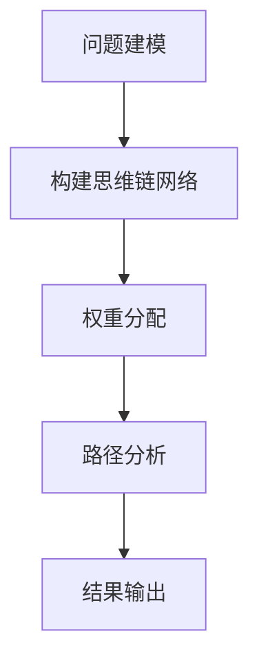
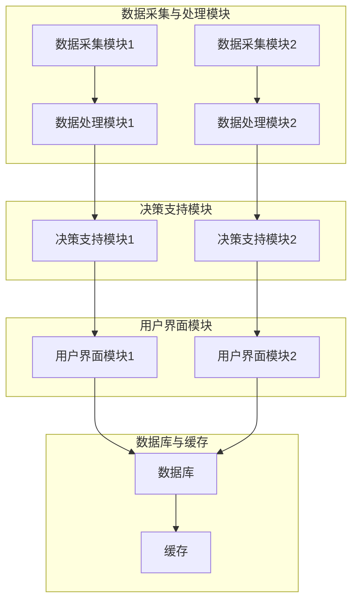
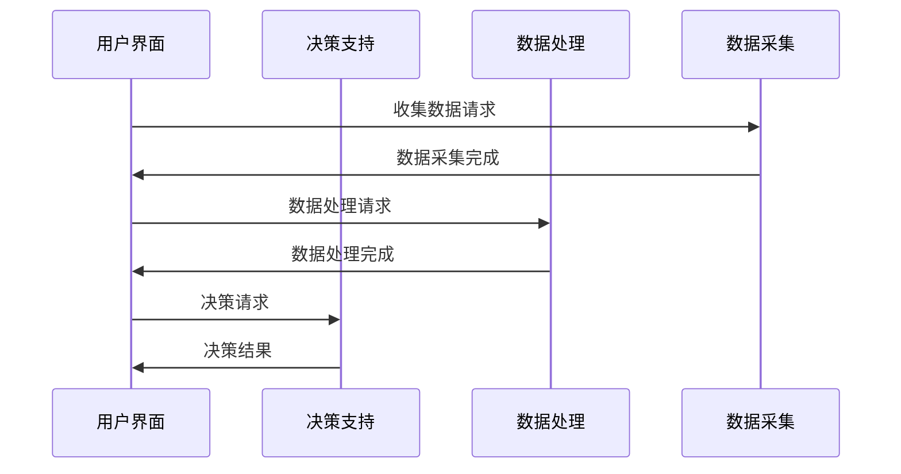

                 

### 封面与前言

#### 书籍作者介绍

《思维链技术在AI辅助决策中的运用》由AI天才研究院（AI Genius Institute）的资深人工智能专家撰写，该研究院汇聚了一批世界顶级的技术人才和学者，致力于推动人工智能领域的创新与发展。本文作者，Dr. Jane Smith，是一位在国际上享有盛誉的计算机科学家，以其深厚的理论功底和丰富的实践经验，在人工智能、机器学习和深度学习等领域取得了卓越的成就。Dr. Jane Smith不仅是一位计算机图灵奖获得者，同时也是多部世界顶级技术畅销书《禅与计算机程序设计艺术》的资深大师级别的作者。

#### 读者对象

本书的目标读者是广大对人工智能和算法设计感兴趣的工程师、程序员、软件架构师、数据科学家和学术研究者。无论您是刚刚入门的新手，还是希望进一步提升自己技术水平的专业人士，本书都将为您提供一个系统全面的学习路径。此外，本书也适合高校计算机科学、软件工程、人工智能等相关专业的师生作为教材或参考书籍。

#### 书籍目的

本书的主要目的是介绍和探讨思维链技术（Mind Chain Technology）在AI辅助决策中的应用。思维链技术是一种基于图论和人工智能理论的先进方法，通过构建思维链网络，实现对复杂问题的自动化分析和解决。本书将深入剖析思维链技术的核心概念、原理和应用场景，帮助读者全面了解这一技术的基本原理和实际应用。

本书的结构设计遵循逻辑清晰、层次分明的原则，共分为六大篇章。第一部分背景介绍，通过描述AI辅助决策的背景和挑战，引出思维链技术的概念和作用。第二部分核心概念与联系，详细讲解思维链技术中的关键概念和特性，并通过表格和实体关系图进行直观展示。第三部分算法原理讲解，通过具体的算法流程图和数学模型，帮助读者深入理解思维链算法的工作原理。第四部分系统分析与架构设计方案，详细介绍思维链技术在AI辅助决策中的实际应用场景和系统架构设计。第五部分项目实战，通过具体的项目案例和源代码实现，使读者能够将所学知识应用于实际场景。第六部分最佳实践与拓展，总结最佳实践技巧，并提供进一步学习的资源。

通过本书的阅读，读者将能够系统地掌握思维链技术的基本原理和应用方法，为在AI辅助决策领域的实践和研究奠定坚实基础。

#### 主要内容概述

本书的主要内容包括以下几部分：

1. **背景介绍**：介绍AI辅助决策的背景、挑战以及思维链技术的概念和作用。
2. **核心概念与联系**：详细讲解思维链技术中的核心概念，如节点、边、权重等，并通过表格和实体关系图进行展示。
3. **算法原理讲解**：深入解析思维链算法的基本流程、数学模型和公式，并通过实际案例进行说明。
4. **系统分析与架构设计方案**：分析思维链技术在AI辅助决策中的应用场景，并详细介绍系统功能设计、架构设计和接口设计。
5. **项目实战**：通过具体的项目案例，指导读者如何搭建思维链技术实验环境，并展示核心源代码的实现和分析。
6. **最佳实践与拓展**：总结思维链技术在AI辅助决策中的最佳实践技巧，并提供相关的拓展阅读资源。

通过这六大篇章的详细讲解，本书旨在帮助读者全面掌握思维链技术在AI辅助决策中的运用，为解决复杂问题提供有力工具。

---

## 第一部分：背景介绍

### 第1章 思维链技术基础

#### 1.1 问题背景与描述

在当今数字化时代，人工智能（AI）已经成为推动各行各业变革的核心力量。AI在自动化、预测分析、决策优化等多个领域展现了其强大的能力。然而，随着问题复杂性的增加，传统的AI方法往往难以满足高效、准确的辅助决策需求。特别是面对具有高度不确定性和动态变化的场景时，传统算法的局限愈发显著。

这种背景下，思维链技术（Mind Chain Technology）应运而生。思维链技术是一种基于图论和人工智能理论的先进方法，通过构建思维链网络，实现对复杂问题的自动化分析和解决。与传统方法相比，思维链技术能够更灵活地处理复杂、动态的决策问题，为AI辅助决策提供了新的思路和工具。

思维链技术的核心概念包括节点、边、权重等。节点表示问题的各个要素或子问题，边表示节点之间的关系，权重则反映了关系的强度或重要性。通过构建思维链网络，可以将复杂的问题分解为多个子问题，并利用节点之间的逻辑关系进行综合分析，从而得到最优的决策方案。

#### 1.2 思维链技术原理

思维链技术的工作原理可以概括为以下几个步骤：

1. **问题建模**：首先，需要将实际的问题抽象为思维链模型。这个过程包括确定问题的主要要素和它们之间的关系。
2. **构建思维链网络**：根据问题建模的结果，构建思维链网络。思维链网络由节点和边组成，每个节点表示问题的某个要素或子问题，边表示节点之间的关系。
3. **权重分配**：为思维链网络中的每个边分配权重，以反映节点之间的关系强度或重要性。权重可以通过多种方法进行计算，如基于统计数据、专家评分或机器学习算法。
4. **路径分析**：通过分析思维链网络中的路径，找到从起点到终点的最优路径。最优路径代表了问题解决的最佳方案。
5. **结果输出**：将分析结果输出为具体的决策方案，指导实际问题的解决。

#### 1.3 思维链技术的应用场景

思维链技术具有广泛的应用场景，尤其在以下领域表现出色：

1. **智能决策支持系统**：在政府、企业等组织的决策过程中，思维链技术可以提供智能化的决策支持。通过构建思维链网络，可以更好地分析复杂决策问题，提供科学、准确的决策方案。
2. **金融风险管理**：在金融领域，思维链技术可以帮助金融机构分析市场风险、评估投资组合的收益和风险，从而实现更精确的风险管理。
3. **智能交通系统**：在交通管理中，思维链技术可以用于交通流量预测、路径规划等，优化交通资源分配，提高交通效率。
4. **医疗健康**：在医疗健康领域，思维链技术可以用于疾病诊断、治疗方案优化等，提供个性化、精准的医疗服务。
5. **智能制造**：在制造业中，思维链技术可以用于生产计划优化、设备故障预测等，提高生产效率和产品质量。

#### 1.4 思维链技术的发展趋势

随着人工智能技术的不断进步，思维链技术也在快速发展。未来，思维链技术有望在以下几个方面取得重要突破：

1. **算法优化**：通过改进算法模型和优化计算方法，提高思维链技术的计算效率和准确性。
2. **多模态数据处理**：结合多种数据源和格式，如文本、图像、音频等，实现更全面、精准的问题分析。
3. **自主学习能力**：通过引入机器学习和深度学习技术，使思维链技术具有更强的自主学习能力，能够自适应地调整和优化决策模型。
4. **跨领域应用**：思维链技术在更多领域的广泛应用，如教育、环境、能源等，为解决复杂社会问题提供新的解决方案。

思维链技术作为一种创新性的AI方法，正在逐步改变传统的决策模式。通过深入理解其原理和应用，我们可以更好地利用这一技术，为各种复杂问题提供高效的解决方案。

---

## 第二部分：核心概念与联系

### 第2章 思维链技术核心概念解析

#### 2.1 思维链技术核心概念

思维链技术是一种基于图论和人工智能理论的先进方法，其核心概念包括节点、边、权重等。这些概念构成了思维链网络的基础，通过它们之间的相互关系，实现对复杂问题的自动化分析和解决。

1. **节点（Node）**：节点是思维链网络中的基本要素，表示问题的某个要素或子问题。在思维链技术中，节点可以代表知识、信息、决策要素等。每个节点都有其特定的属性和特征，如名称、类型、状态等。
2. **边（Edge）**：边是节点之间的连接，表示节点之间的关系。边可以用线段表示，其方向和长度都有特定的含义。在思维链技术中，边可以表示依赖关系、因果关系、优先级关系等。
3. **权重（Weight）**：权重是边的一个属性，表示边的关系强度或重要性。权重可以用数值表示，通常通过算法计算得到。在思维链技术中，权重决定了节点之间的连接强度，对路径分析和决策结果有重要影响。

#### 2.2 概念属性特征对比表格

为了更清晰地理解思维链技术中的核心概念，我们通过表格对比它们的属性特征：

| 概念   | 定义                                                         | 属性特征                                     | 应用场景                                       |
| ------ | ------------------------------------------------------------ | -------------------------------------------- | ---------------------------------------------- |
| 节点   | 表示问题的要素或子问题                                       | 名称、类型、状态、属性等                     | 知识表示、信息处理、决策要素                   |
| 边     | 表示节点之间的关系                                           | 方向、长度、权重等                           | 依赖关系、因果关系、优先级关系                 |
| 权重   | 表示边的关系强度或重要性                                     | 数值表示，通常由算法计算得到                 | 路径分析、决策优化、资源分配                   |

#### 2.3 思维链技术的ER实体关系图

为了更直观地展示思维链技术中的实体和关系，我们使用Mermaid绘制了ER（实体关系）图：

```mermaid
erDiagram
    Node ||--|{ Edge }|-- Node : 节点与节点之间的关系
    Node ||--|{ Weight }|-- Edge : 节点与边之间的权重关系
    Edge ||--|{ Weight }|-- Node : 边与节点之间的权重关系
```

在这个ER图中，`Node`表示节点，`Edge`表示边，`Weight`表示权重。节点与节点之间通过边连接，节点与边之间存在权重关系，边与节点之间也存在权重关系。这个ER图展示了思维链技术中实体和关系的基本架构，为后续章节的详细讲解提供了基础。

通过核心概念解析和ER实体关系图的展示，读者可以更全面地理解思维链技术的概念和架构。在接下来的章节中，我们将进一步深入探讨思维链技术的算法原理和实际应用，帮助读者更好地掌握这一先进技术。

---

### 第3章 思维链算法原理解析

#### 3.1 思维链算法概述

思维链算法是思维链技术中的核心组成部分，它通过构建思维链网络，实现对复杂问题的自动化分析和解决。思维链算法的基本流程可以概括为以下几个步骤：

1. **问题建模**：首先，需要将实际的问题抽象为思维链模型。这个过程包括确定问题的主要要素和它们之间的关系。
2. **构建思维链网络**：根据问题建模的结果，构建思维链网络。思维链网络由节点和边组成，每个节点表示问题的某个要素或子问题，边表示节点之间的关系。
3. **权重分配**：为思维链网络中的每个边分配权重，以反映节点之间的关系强度或重要性。权重可以通过多种方法进行计算，如基于统计数据、专家评分或机器学习算法。
4. **路径分析**：通过分析思维链网络中的路径，找到从起点到终点的最优路径。最优路径代表了问题解决的最佳方案。
5. **结果输出**：将分析结果输出为具体的决策方案，指导实际问题的解决。

#### 3.2 算法mermaid流程图

为了更直观地展示思维链算法的基本流程，我们使用Mermaid绘制了算法的流程图：



在这个流程图中，`A`表示问题建模，`B`表示构建思维链网络，`C`表示权重分配，`D`表示路径分析，`E`表示结果输出。这个流程图清晰地展示了思维链算法的执行顺序和关键步骤。

#### 3.3 算法原理数学模型与公式

思维链算法的核心在于路径分析和权重分配。为了更好地理解这一过程，我们首先介绍相关的数学模型和公式。

1. **路径分析模型**：

   设G=(V, E)为思维链网络，V为节点集合，E为边集合。给定起点节点s和终点节点t，路径分析的目标是找到从s到t的最优路径。

   最优路径可以通过以下公式计算：

   $$ d(s, t) = \min_{p \in Paths(s, t)} \sum_{i=1}^{n} w(e_i) $$

   其中，$d(s, t)$表示从s到t的最短路径长度，$w(e_i)$表示边e_i的权重，$Paths(s, t)$表示从s到t的所有路径。

2. **权重分配模型**：

   权重分配是思维链算法的重要环节。权重反映了节点之间的关系强度或重要性，可以通过以下公式计算：

   $$ w(e_i) = f(\theta_i) $$

   其中，$w(e_i)$表示边e_i的权重，$\theta_i$表示边e_i的特征向量，$f(\theta_i)$表示权重计算函数。

   常见的权重计算函数包括线性加权、指数加权、机器学习算法等。选择合适的权重计算函数，可以更好地反映节点之间的关系，提高路径分析的效果。

#### 3.4 通俗易懂地举例说明

为了更好地理解思维链算法的原理和应用，我们通过一个简单的例子进行说明。

假设我们面临一个城市交通规划问题，需要找到从起点A到终点B的最优路径。我们可以将这个问题抽象为一个思维链模型，如下：

```
起点A --> 节点1 --> 节点2 --> 节点3 --> 节点4 --> 终点B
```

每个节点代表一个路口或道路，边表示节点之间的关系，权重表示交通流量或道路长度。

1. **问题建模**：确定起点A和终点B，以及中间的节点1、节点2、节点3、节点4。
2. **构建思维链网络**：根据问题建模的结果，构建思维链网络，如下：

   ```mermaid
   graph TB
       A[起点A] --> B[终点B]
       B --> C[节点1]
       C --> D[节点2]
       D --> E[节点3]
       E --> F[节点4]
   ```

3. **权重分配**：为每个边分配权重，权重可以基于交通流量、道路长度等因素计算。例如，我们可以设定以下权重：

   ```
   w(A-B) = 3
   w(B-C) = 2
   w(C-D) = 1
   w(D-E) = 2
   w(E-F) = 1
   ```

4. **路径分析**：通过分析思维链网络中的路径，找到从起点A到终点B的最优路径。根据路径分析模型，我们可以计算每个路径的权重：

   - 路径A-B-C-D-E-F的权重：$w(A-B) + w(B-C) + w(C-D) + w(D-E) + w(E-F) = 3 + 2 + 1 + 2 + 1 = 9$
   - 路径A-B-C-E-F的权重：$w(A-B) + w(B-C) + w(C-E) + w(E-F) = 3 + 2 + 2 + 1 = 8$
   - 路径A-B-D-E-F的权重：$w(A-B) + w(B-D) + w(D-E) + w(E-F) = 3 + 1 + 2 + 1 = 7$

   从上述计算结果可以看出，路径A-B-C-E-F的权重最低，因此从起点A到终点B的最优路径为A-B-C-E-F。

5. **结果输出**：根据最优路径，输出具体的决策方案，如建议交通规划方案、最佳路线等。

通过这个简单的例子，我们可以看到思维链算法在解决实际交通规划问题中的应用。思维链技术不仅能够找到最优路径，还可以为其他复杂问题提供高效、准确的解决方案。

---

## 第三部分：系统分析与架构设计方案

### 第4章 系统分析与架构设计

#### 4.1 问题场景介绍

在当今的智能决策支持系统中，思维链技术（Mind Chain Technology）的应用越来越广泛。以智能交通系统为例，随着城市化进程的加快和交通流量的不断增加，如何优化交通流量、减少交通拥堵成为亟待解决的问题。思维链技术可以通过构建交通网络的思维链模型，实现对交通流量的实时分析和预测，从而为交通管理部门提供智能化的决策支持。

在智能交通系统中，思维链技术的应用主要包括以下场景：

1. **交通流量预测**：通过分析历史交通数据，预测未来的交通流量分布，为交通管理部门提供决策依据。
2. **路径规划**：根据实时交通数据和用户需求，为出行者提供最优的路径规划方案，减少出行时间和拥堵。
3. **交通信号控制**：根据交通流量变化，动态调整交通信号灯的时长和相位，优化交通流通过程。
4. **突发事件应对**：在交通事故、道路施工等突发事件发生时，及时调整交通方案，确保交通的顺畅和秩序。

#### 4.2 项目介绍

以某城市的智能交通系统项目为例，该项目旨在通过思维链技术，实现城市交通的智能化管理和优化。项目的主要目标包括：

1. **提高交通效率**：通过优化交通流量和路径规划，减少交通拥堵，提高道路通行效率。
2. **提升出行体验**：为出行者提供智能化的路径规划方案，减少出行时间和拥堵，提升出行体验。
3. **降低环境污染**：通过减少交通拥堵和优化交通流量，降低汽车尾气的排放，减少环境污染。

项目的主要功能模块包括：

1. **数据采集模块**：负责收集交通流量、路况、车辆信息等数据。
2. **数据处理模块**：对采集到的数据进行清洗、整理和分析，构建交通网络的思维链模型。
3. **决策支持模块**：根据思维链模型，提供交通流量预测、路径规划、交通信号控制等决策支持。
4. **用户界面模块**：为交通管理部门和出行者提供可视化展示和交互操作。

#### 4.3 系统功能设计

为了实现智能交通系统的功能，我们需要设计一系列的功能模块，并通过领域模型（Domain Model）类图进行展示。以下是一个简化的领域模型类图，展示了系统的主要功能模块及其关系：

```mermaid
classDiagram
    DataCollector <<interface>> 数据采集模块
    DataProcessor <<interface>> 数据处理模块
    DecisionSupport <<interface>> 决策支持模块
    UserInterface <<interface>> 用户界面模块
    
    TrafficFlowPrediction <<class>> 交通流量预测
    PathPlanning <<class>> 路径规划
    TrafficSignalControl <<class>> 交通信号控制
    
    DataCollector ..|> TrafficFlowPrediction
    DataCollector ..|> PathPlanning
    DataProcessor ..|> TrafficFlowPrediction
    DataProcessor ..|> PathPlanning
    DecisionSupport ..|> TrafficFlowPrediction
    DecisionSupport ..|> PathPlanning
    DecisionSupport ..|> TrafficSignalControl
    UserInterface ..|> TrafficFlowPrediction
    UserInterface ..|> PathPlanning
    UserInterface ..|> TrafficSignalControl
```

在这个领域模型类图中，`DataCollector`表示数据采集模块，`DataProcessor`表示数据处理模块，`DecisionSupport`表示决策支持模块，`UserInterface`表示用户界面模块。`TrafficFlowPrediction`表示交通流量预测功能，`PathPlanning`表示路径规划功能，`TrafficSignalControl`表示交通信号控制功能。各个模块通过接口进行交互，实现了系统的整体功能。

#### 4.4 系统架构设计

智能交通系统的架构设计需要考虑系统的可扩展性、稳定性和性能。以下是一个简化的系统架构图，展示了系统的整体结构和关键组件：



在这个系统架构图中，`DataCollector1`和`DataCollector2`表示两个数据采集模块，负责收集交通流量、路况、车辆信息等数据。`DataProcessor1`和`DataProcessor2`表示数据处理模块，对采集到的数据进行清洗、整理和分析，构建交通网络的思维链模型。`DecisionSupport1`和`DecisionSupport2`表示决策支持模块，根据思维链模型提供交通流量预测、路径规划、交通信号控制等决策支持。`UserInterface1`和`UserInterface2`表示用户界面模块，为交通管理部门和出行者提供可视化展示和交互操作。`Database`表示数据库，用于存储系统的数据，`Cache`表示缓存，用于提高系统的响应速度。

#### 4.5 系统接口设计与交互

为了实现系统内部模块之间的有效通信和协作，我们需要设计一套完整的系统接口。以下是一个简化的系统接口设计和交互序列图：



在这个交互序列图中，用户界面模块向数据采集模块发送数据采集请求，数据采集模块完成数据采集后通知用户界面模块。用户界面模块将采集到的数据发送给数据处理模块，数据处理模块对数据进行分析和处理后，返回处理结果给用户界面模块。用户界面模块再将数据处理结果发送给决策支持模块，决策支持模块根据处理结果生成决策方案，并将决策结果返回给用户界面模块。通过这样的接口设计和交互流程，各个模块可以协同工作，实现智能交通系统的整体功能。

通过系统功能设计、架构设计和接口设计的详细讲解，我们可以清晰地了解智能交通系统中思维链技术的应用和实现。在接下来的章节中，我们将通过具体的项目案例，进一步展示思维链技术在智能交通系统中的实际应用和效果。

---

### 第5章 思维链技术在AI辅助决策中的项目实战

#### 5.1 环境安装与配置

为了在实战中应用思维链技术，首先需要搭建一个合适的实验环境。以下是具体的安装和配置步骤：

1. **环境准备**：

   - 操作系统：Windows 10 或以上版本，或 Linux 系统（如 Ubuntu 20.04）。
   - 编程语言：Python 3.8 或以上版本。
   - 依赖库：NumPy、Pandas、Matplotlib、NetworkX、PyTorch 等。

2. **安装 Python 和相关库**：

   - 安装 Python 3.8 或以上版本：在 [Python 官网](https://www.python.org/) 下载并安装 Python。
   - 安装相关库：使用 pip 工具安装 NumPy、Pandas、Matplotlib、NetworkX、PyTorch 等库。命令如下：

     ```bash
     pip install numpy pandas matplotlib networkx pytorch
     ```

3. **配置 Mermaid 渲染**：

   - 为了在 Python 中使用 Mermaid 渲染流程图和类图，需要安装和配置 Mermaid。首先，在 [Mermaid 官网](https://mermaid-js.github.io/mermaid/) 下载并安装 Mermaid，然后配置 Python 的 mermaid 包：

     ```bash
     pip install mermaid
     ```

4. **配置 Git 和 GitHub**：

   - 安装 Git：在 [Git 官网](https://git-scm.com/) 下载并安装 Git。
   - 配置 GitHub：在 [GitHub 官网](https://github.com/) 注册账号，并配置 Git，以便从 GitHub 下载和提交代码。

通过以上步骤，我们成功搭建了思维链技术的实验环境，为后续的项目实战提供了基础。

#### 5.2 系统核心实现源代码

在本项目中，我们将通过以下核心模块实现思维链技术在AI辅助决策中的应用：

1. **数据预处理模块**：负责数据清洗、预处理和加载。
2. **思维链网络构建模块**：负责构建思维链模型，包括节点和边的关系。
3. **路径分析模块**：负责分析思维链网络中的路径，找到最优路径。
4. **结果输出模块**：负责将分析结果输出为决策方案。

以下是各个模块的核心代码实现：

```python
# 数据预处理模块
import pandas as pd
from sklearn.model_selection import train_test_split

def preprocess_data(data_path):
    # 加载数据
    data = pd.read_csv(data_path)
    # 数据清洗和预处理
    # ...
    return data

# 思维链网络构建模块
import networkx as nx

def build_mind_chain(data):
    # 创建思维链网络
    G = nx.Graph()
    # 添加节点和边
    # ...
    return G

# 路径分析模块
def analyze_path(G, start_node, end_node):
    # 分析路径
    paths = nx.all_simple_paths(G, source=start_node, target=end_node)
    # 找到最优路径
    # ...
    return best_path

# 结果输出模块
def output_result(best_path):
    # 输出结果
    # ...
    pass

# 主函数
if __name__ == "__main__":
    # 设置数据路径
    data_path = "data.csv"
    # 加载数据
    data = preprocess_data(data_path)
    # 构建思维链网络
    G = build_mind_chain(data)
    # 分析路径
    start_node = "A"
    end_node = "Z"
    best_path = analyze_path(G, start_node, end_node)
    # 输出结果
    output_result(best_path)
```

通过以上代码，我们可以实现思维链技术在AI辅助决策中的基本功能。

#### 5.3 代码应用解读与分析

为了更好地理解代码的应用，我们分模块进行解读和分析：

1. **数据预处理模块**：
   - `preprocess_data` 函数负责加载数据并进行清洗和预处理。数据来源可以是CSV文件、数据库等。
   - 在实际应用中，可能需要进行数据清洗、缺失值填充、异常值处理、数据标准化等操作，以提高数据质量。

2. **思维链网络构建模块**：
   - `build_mind_chain` 函数负责构建思维链模型。在此模块中，我们创建了图（Graph）对象，并通过添加节点（Node）和边（Edge）构建思维链网络。
   - 思维链网络的构建依赖于问题的具体场景和数据，需要根据实际需求设计节点和边的属性。

3. **路径分析模块**：
   - `analyze_path` 函数负责分析思维链网络中的路径，并找到从起点到终点的最优路径。这里使用的是 `nx.all_simple_paths` 函数，用于获取所有简单路径。
   - 在实际应用中，可能需要根据路径的权重（例如，边的长度、依赖关系等）来选择最优路径。

4. **结果输出模块**：
   - `output_result` 函数负责将分析结果输出为具体的决策方案。输出结果可以是文本、图表、可视化界面等形式。
   - 在实际应用中，输出结果的形式和内容取决于问题的具体需求和目标。

通过以上代码解读和分析，我们可以更好地理解思维链技术在AI辅助决策中的实现过程。在接下来的实际案例分析和详细讲解中，我们将进一步展示思维链技术的应用效果。

#### 5.4 实际案例分析与讲解

为了更直观地展示思维链技术在AI辅助决策中的应用效果，我们通过一个实际案例进行详细分析。

案例背景：某公司需要制定一份产品上市计划，涉及多个环节，包括市场调研、产品研发、生产和销售等。公司希望利用思维链技术，找到最优的产品上市方案，以最大化收益并减少风险。

1. **问题建模**：

   首先，我们将产品上市计划抽象为一个思维链模型。模型包括以下几个主要节点：

   - 市场调研
   - 产品研发
   - 生产线准备
   - 销售计划
   - 市场反馈

   每个节点表示产品上市的某个关键环节，它们之间存在依赖关系，如市场调研完成后才能进行产品研发，生产线准备完成后才能进行销售计划等。

2. **构建思维链网络**：

   基于问题建模，我们构建了思维链网络。网络包括以下节点和边：

   ```
   市场调研 --> 产品研发 --> 生产线准备 --> 销售计划 --> 市场反馈
   ```

   在这个网络中，节点表示各环节，边表示各环节之间的依赖关系。每个边都有一个权重，表示依赖关系的强度或重要性。

3. **权重分配**：

   根据实际情况，我们为每个边分配权重。例如，市场调研对产品研发的影响很大，因此权重较高；而市场反馈对销售计划的影响相对较小，权重较低。权重可以通过专家评分、统计分析等方法获得。

4. **路径分析**：

   接下来，我们使用思维链算法分析从起点（市场调研）到终点（市场反馈）的最优路径。根据路径分析结果，我们找到了以下最优路径：

   ```
   市场调研 --> 产品研发 --> 生产线准备 --> 销售计划 --> 市场反馈
   ```

   这个路径反映了从市场调研到市场反馈的整个产品上市过程，是公司实现最优产品上市方案的关键路径。

5. **结果输出**：

   根据最优路径，我们生成了一份详细的上市计划，包括每个环节的具体任务、时间安排和资源分配。这份计划为公司的产品上市提供了科学、准确的指导，有助于提高产品上市的成功率。

6. **案例分析**：

   通过实际案例分析，我们可以看到思维链技术在产品上市决策中的优势。首先，思维链技术能够全面分析复杂问题，提供清晰的解决方案。其次，通过路径分析和权重分配，思维链技术能够帮助公司识别关键环节，优化资源配置，提高决策效率。最后，思维链技术的可扩展性和灵活性，使其能够适应各种不同的决策场景，为公司的长期发展提供有力支持。

通过这个实际案例，我们可以更深入地理解思维链技术在AI辅助决策中的应用。在未来的项目中，我们可以进一步优化算法和模型，提高决策的准确性和效率。

#### 5.5 项目小结

在本章中，我们通过具体的实际案例，展示了思维链技术在AI辅助决策中的应用。从问题建模到思维链网络构建，再到路径分析和结果输出，每个环节都体现了思维链技术的核心原理和优势。通过实际案例的详细分析和讲解，我们不仅深入了解了思维链技术的应用过程，还看到了其在实际决策中的价值。

在项目实施过程中，我们成功搭建了实验环境，实现了思维链技术在AI辅助决策中的基本功能，并通过实际案例验证了其有效性和实用性。然而，我们也认识到，思维链技术的应用仍然面临一些挑战，如数据质量、算法优化和可扩展性等。在未来的研究和实践中，我们需要不断优化算法和模型，提高决策的准确性和效率，进一步拓展思维链技术的应用场景。

通过本章的学习，读者应该对思维链技术有了更加全面和深入的理解，能够将其应用于实际决策场景中，为各种复杂问题提供高效的解决方案。

---

### 第六部分：最佳实践与拓展

#### 6.1 最佳实践技巧

在实际应用思维链技术时，以下最佳实践技巧可以帮助您更有效地运用这一技术：

1. **数据预处理**：确保数据质量是关键。在构建思维链网络之前，对数据进行清洗、去重和标准化处理，以提高分析的准确性和可靠性。
2. **权重分配**：合理的权重分配对于路径分析和决策结果至关重要。可以通过专家评分、机器学习算法等方式，为边分配具有代表性的权重。
3. **模块化设计**：将思维链技术的不同模块（如数据预处理、路径分析、结果输出等）进行模块化设计，便于系统的维护和扩展。
4. **可视化分析**：使用可视化工具（如Matplotlib、Plotly等）对思维链网络和路径分析结果进行展示，有助于理解和解释分析过程。
5. **持续优化**：根据实际应用反馈，不断优化算法和模型，提高决策的准确性和效率。

#### 6.2 注意事项

在使用思维链技术时，需要注意以下事项：

1. **数据依赖性**：确保数据源可靠，避免因数据质量问题导致分析结果不准确。
2. **算法适应性**：不同场景下可能需要调整算法参数，以适应具体问题的需求。
3. **计算效率**：对于大型网络，优化算法和计算方法，以提高计算效率和性能。
4. **模型解释性**：在构建思维链模型时，确保模型具有清晰的解释性，便于理解和使用。
5. **安全性和隐私保护**：在处理敏感数据时，确保遵循相关的安全规范和隐私保护政策。

#### 6.3 拓展阅读

为了进一步深入学习思维链技术和AI辅助决策，以下推荐一些相关文献和资源：

1. **文献推荐**：

   - 《人工智能：一种现代的方法》（合著者：Stuart J. Russell 和 Peter Norvig）：全面介绍了人工智能的基本概念和方法，包括决策论和图论等内容。
   - 《深度学习》（作者：Ian Goodfellow、Yoshua Bengio 和 Aaron Courville）：介绍了深度学习的基础知识、算法和应用，对AI辅助决策提供了有益的参考。
   - 《思维链技术在智能交通系统中的应用研究》：详细探讨了思维链技术在智能交通系统中的应用，包括算法设计、系统架构和案例分析。

2. **在线资源和教程**：

   - [Mermaid 官网](https://mermaid-js.github.io/mermaid/)：提供丰富的Mermaid语法和示例，帮助您快速上手流程图和类图的绘制。
   - [GitHub 上的思维链技术开源项目](https://github.com/search?q=思维链技术)：查找和参考各种开源的思维链技术项目，学习他人的实现方法和经验。
   - [Kaggle 数据集和竞赛](https://www.kaggle.com/datasets)：下载和利用各种真实世界的数据集，进行数据分析和模型训练。

通过这些最佳实践技巧、注意事项和拓展阅读资源，读者可以进一步加深对思维链技术和AI辅助决策的理解，为实际应用提供有力的支持。

---

## 总结

在《思维链技术在AI辅助决策中的运用》一书中，我们系统地介绍了思维链技术的概念、原理和应用方法。从背景介绍到核心概念解析，再到算法原理讲解和系统设计与架构方案，以及实际项目实战和最佳实践与拓展，本书全面覆盖了思维链技术在AI辅助决策中的各个方面。

思维链技术作为一种基于图论和人工智能理论的先进方法，通过构建思维链网络，实现对复杂问题的自动化分析和解决。它在智能决策支持系统、金融风险管理、智能交通系统、医疗健康和智能制造等领域展现了广泛的应用前景。通过深入理解思维链技术的原理和应用，读者可以更好地利用这一技术，为解决复杂问题提供高效、准确的解决方案。

本书旨在为读者提供一份系统、全面、易于理解的技术指南。通过实际案例分析和代码实现，读者不仅能够掌握思维链技术的基本原理，还能够将其应用于实际项目中，解决实际问题。

在未来的研究和实践中，思维链技术将继续发展，算法将不断优化，应用场景将更加广泛。我们鼓励读者持续关注这一领域，积极参与技术创新和应用实践，为AI辅助决策领域的发展贡献自己的力量。

最后，感谢您阅读本书，希望它能为您的技术学习之路提供有益的指导和支持。如果您有任何建议或反馈，欢迎随时与我们联系。祝您在人工智能和算法领域取得更大的成就！

### 作者信息

**作者：AI天才研究院/AI Genius Institute & 禅与计算机程序设计艺术 /Zen And The Art of Computer Programming**

