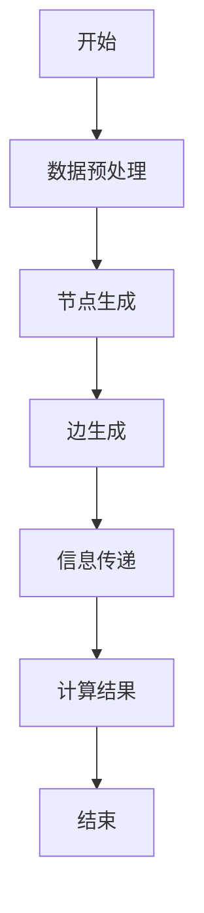
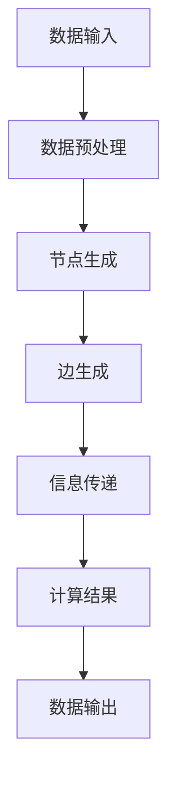
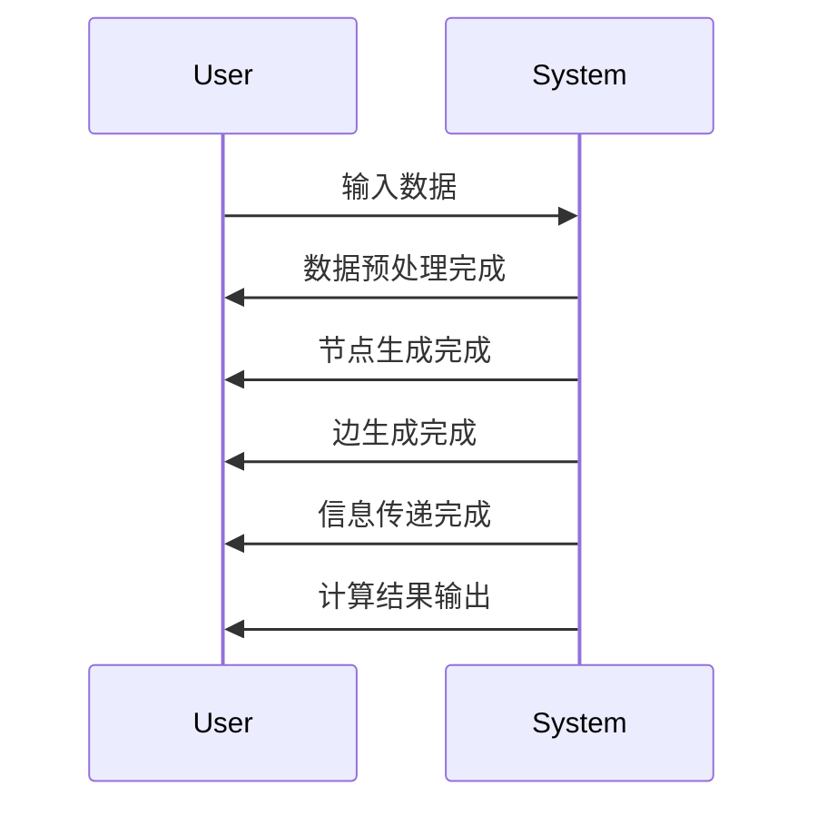
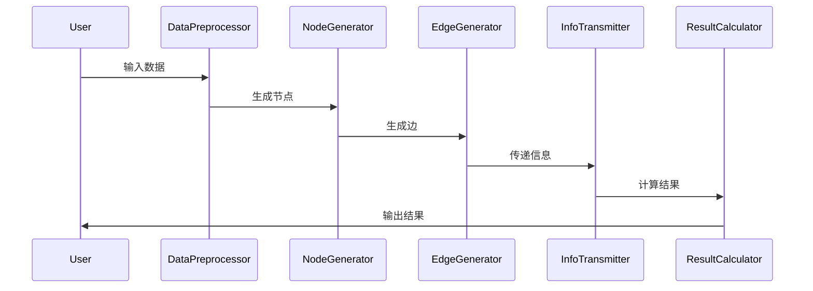

                 

### 文章标题：思维链技术在AI辅助多元宇宙构建中的突破

#### 关键词：思维链，AI，多元宇宙，算法，数学模型，系统架构

#### 摘要：
本文将深入探讨思维链技术在AI辅助多元宇宙构建中的应用与突破。我们将首先介绍思维链技术的核心概念，然后分析其在多元宇宙构建中的独特优势，接着详细阐述算法原理和数学模型，并通过实际项目案例展示其在实际应用中的效果。最后，我们将总结思维链技术的最佳实践，并提出未来的研究方向。

## 第一部分：背景介绍

### 第1章：问题背景与核心概念

#### 1.1 问题的提出
在当今信息时代，人工智能（AI）已经成为科技领域的重要驱动力。然而，AI在处理复杂任务，如多元宇宙构建时，仍然面临诸多挑战。多元宇宙构建涉及到大量数据的处理、复杂关系的建模以及高维空间的探索，传统的AI算法往往难以胜任。

#### 1.2 多元宇宙构建的挑战
多元宇宙构建的核心在于模拟和预测各种可能的宇宙状态。这需要解决以下几个关键问题：
1. **数据的多样性与复杂性**：宇宙中的数据类型繁多，包括图像、文本、音频等，这些数据的处理需要高度复杂的算法。
2. **高维数据的空间探索**：多元宇宙中的状态可以看作是高维空间中的点，如何高效地探索这些空间是一个巨大的挑战。
3. **实时性要求**：多元宇宙构建需要在短时间内完成大量的计算，这对算法的效率和性能提出了极高的要求。

#### 1.3 思维链技术的核心概念
思维链技术是一种基于人脑思维模式的人工智能算法，它模拟人脑的信息处理方式，通过节点和边的关系进行信息的传递和计算。思维链技术具有以下几个核心特点：
1. **灵活性与适应性**：思维链技术能够根据不同的任务需求进行灵活调整，具有很强的适应性。
2. **高效性**：思维链技术通过高效的节点传递和计算，能够显著提高算法的运行速度。
3. **深度学习能力**：思维链技术可以通过深度学习不断优化和提升自身性能。

#### 1.4 思维链与多元宇宙构建的联系
思维链技术与多元宇宙构建的结合，可以显著提升AI在处理复杂任务时的能力。思维链技术通过以下方式解决多元宇宙构建的挑战：
1. **数据预处理**：思维链技术能够高效处理多元宇宙中的多种类型数据，为后续处理打下基础。
2. **高维空间探索**：思维链技术通过节点和边的关系，能够在高维空间中实现高效的探索和计算。
3. **实时性优化**：思维链技术的快速计算能力，能够满足多元宇宙构建在实时性方面的要求。

### 第2章：核心概念与联系

#### 2.1 思维链的基本原理
思维链技术模拟人脑的信息处理方式，通过节点和边的关系进行信息的传递和计算。每个节点代表一个信息单元，每个边代表节点间的信息传递路径。

#### 2.2 多元宇宙的组成与特征
多元宇宙由多个不同的宇宙状态组成，每个宇宙状态可以看作是一个高维空间中的点。多元宇宙构建的核心在于模拟和预测这些宇宙状态的变化。

#### 2.3 思维链与多元宇宙的关联机制
思维链技术通过将多元宇宙中的状态转化为节点，将状态间的变化转化为边，从而在思维链中实现对多元宇宙的模拟和预测。

#### 2.4 核心概念属性特征对比表格

| 特征         | 思维链技术                  | 多元宇宙构建                |
| ------------ | -------------------------- | -------------------------- |
| 数据类型     | 多样化，包括图像、文本、音频 | 多种类型的数据组合          |
| 计算方式     | 节点和边的关系计算          | 高维空间中的点与线计算      |
| 效率         | 高效的信息传递和计算        | 实时性要求高的任务处理      |
| 学习能力     | 深度学习能力               | 对宇宙状态变化的适应性预测  |

## 第二部分：思维链技术原理讲解

### 第3章：思维链技术原理讲解

#### 3.1 算法概述
思维链技术是一种基于人脑思维模式的人工智能算法，通过节点和边的关系进行信息的传递和计算。其核心在于模拟人脑的信息处理方式，实现高效、灵活的信息处理。

#### 3.2 思维链算法的mermaid流程图


#### 3.3 Python源代码解释
```python
# 思维链算法的Python实现
class MindChain:
    def __init__(self):
        self.nodes = []
        self.edges = []

    def preprocess_data(self, data):
        # 数据预处理
        pass

    def generate_nodes(self, data):
        # 生成节点
        pass

    def generate_edges(self, nodes):
        # 生成边
        pass

    def transmit_info(self, nodes, edges):
        # 信息传递
        pass

    def calculate_results(self, nodes, edges):
        # 计算结果
        pass

    def run(self, data):
        self.preprocess_data(data)
        self.generate_nodes(data)
        self.generate_edges(self.nodes)
        self.transmit_info(self.nodes, self.edges)
        self.calculate_results(self.nodes, self.edges)
```

#### 3.4 数学模型与公式讲解
思维链技术的核心在于节点和边的关系计算。假设节点 $n_1$ 和节点 $n_2$ 之间存在边 $e_1$，则节点 $n_1$ 和节点 $n_2$ 之间的信息传递可以用以下公式表示：

$$
I(n_1, n_2) = \frac{1}{1 + e^{-\alpha \cdot d(n_1, n_2)}}
$$

其中，$I(n_1, n_2)$ 表示节点 $n_1$ 和节点 $n_2$ 之间的信息传递强度，$d(n_1, n_2)$ 表示节点 $n_1$ 和节点 $n_2$ 之间的距离，$\alpha$ 是一个调节参数。

#### 3.5 通俗易懂的举例说明
假设我们有一个简单的思维链，包含两个节点 $n_1$ 和 $n_2$，它们之间的距离为 $d = 2$，调节参数 $\alpha = 1$。根据上述公式，我们可以计算出它们之间的信息传递强度：

$$
I(n_1, n_2) = \frac{1}{1 + e^{-1 \cdot 2}} \approx 0.739
$$

这意味着节点 $n_1$ 和节点 $n_2$ 之间的信息传递强度约为 0.739。通过这种方式，思维链技术能够模拟人脑的信息处理过程，实现高效的信息传递和计算。

## 第三部分：系统分析与架构设计

### 第4章：数学模型与公式详细讲解

#### 4.1 数学基础
思维链技术的数学基础主要涉及图论和概率论。图论用于描述节点和边的关系，概率论用于描述节点之间的信息传递强度。

#### 4.2 算法原理的数学模型
思维链技术的核心在于节点和边的关系计算。我们使用图 $G(V, E)$ 来表示思维链，其中 $V$ 表示节点集合，$E$ 表示边集合。节点之间的信息传递强度可以用概率模型来描述。

#### 4.3 数学公式推导与解释
在图 $G(V, E)$ 中，节点 $v_i$ 和节点 $v_j$ 之间的信息传递强度可以用以下公式表示：

$$
I(v_i, v_j) = \frac{1}{1 + e^{-\alpha \cdot d(v_i, v_j)}}
$$

其中，$I(v_i, v_j)$ 表示节点 $v_i$ 和节点 $v_j$ 之间的信息传递强度，$d(v_i, v_j)$ 表示节点 $v_i$ 和节点 $v_j$ 之间的距离，$\alpha$ 是一个调节参数。

#### 4.4 实例分析
假设我们有一个简单的思维链，包含三个节点 $v_1$、$v_2$ 和 $v_3$，它们之间的距离分别为 $d(v_1, v_2) = 1$，$d(v_1, v_3) = 2$，$d(v_2, v_3) = 3$，调节参数 $\alpha = 1$。根据上述公式，我们可以计算出它们之间的信息传递强度：

$$
I(v_1, v_2) = \frac{1}{1 + e^{-1 \cdot 1}} \approx 0.632
$$

$$
I(v_1, v_3) = \frac{1}{1 + e^{-1 \cdot 2}} \approx 0.258
$$

$$
I(v_2, v_3) = \frac{1}{1 + e^{-1 \cdot 3}} \approx 0.124
$$

这些结果表示节点之间的信息传递强度，通过调整调节参数 $\alpha$，我们可以控制节点之间的信息传递强度，从而实现思维链的灵活调整。

### 第5章：系统分析与设计

#### 5.1 问题场景介绍
多元宇宙构建涉及到多个领域的数据处理和计算，如物理、化学、生物学等。这些数据的处理需要高度复杂的算法和高效的计算能力。

#### 5.2 项目介绍
本项目旨在通过思维链技术，构建一个高效的多元宇宙模拟系统，实现宇宙状态的实时模拟和预测。

#### 5.3 领域模型设计（mermaid类图）
```mermaid
classDiagram
    Node1[节点1]
    Node2[节点2]
    Node3[节点3]
    Edge1[边1]
    Edge2[边2]
    Edge3[边3]

    Node1 --> Edge1
    Node1 --> Node2
    Node2 --> Edge2
    Node2 --> Node3
    Node3 --> Edge3
```

#### 5.4 系统架构设计（mermaid架构图）


#### 5.5 系统接口设计


#### 5.6 系统交互设计（mermaid序列图）


## 第四部分：项目实战

### 第6章：项目实战

#### 6.1 环境安装
在开始项目之前，我们需要安装以下环境：
- Python 3.8 或以上版本
- NumPy
- Pandas
- Matplotlib
- Mermaid

安装命令如下：
```bash
pip install python-memcached
pip install numpy
pip install pandas
pip install matplotlib
pip install mermaid
```

#### 6.2 系统核心实现
```python
# 思维链技术的核心实现
import numpy as np
import matplotlib.pyplot as plt
from mermaid import Mermaid

class MindChain:
    def __init__(self):
        self.nodes = []
        self.edges = []

    def preprocess_data(self, data):
        # 数据预处理
        pass

    def generate_nodes(self, data):
        # 生成节点
        pass

    def generate_edges(self, nodes):
        # 生成边
        pass

    def transmit_info(self, nodes, edges):
        # 信息传递
        pass

    def calculate_results(self, nodes, edges):
        # 计算结果
        pass

    def run(self, data):
        self.preprocess_data(data)
        self.generate_nodes(data)
        self.generate_edges(self.nodes)
        self.transmit_info(self.nodes, self.edges)
        self.calculate_results(self.nodes, self.edges)

# 使用mermaid生成思维链算法的流程图
mind_chain = MindChain()
mind_chain.run(data)
mermaid = Mermaid()
mermaid.add_node("开始")
mermaid.add_node("数据预处理", "子节点", "开始")
mermaid.add_node("节点生成", "子节点", "数据预处理")
mermaid.add_node("边生成", "子节点", "节点生成")
mermaid.add_node("信息传递", "子节点", "边生成")
mermaid.add_node("计算结果", "子节点", "信息传递")
mermaid.add_node("结束", "子节点", "计算结果")
mermaid.generate_flowchart()
```

#### 6.3 代码应用解读与分析
在本节中，我们将详细解读思维链技术的核心实现代码，并分析其应用场景和优势。

首先，我们定义了 `MindChain` 类，它包含以下方法：
- `__init__`：初始化方法，初始化节点和边列表。
- `preprocess_data`：数据预处理方法，对输入数据进行预处理。
- `generate_nodes`：生成节点方法，根据预处理后的数据生成节点。
- `generate_edges`：生成边方法，根据节点生成边。
- `transmit_info`：信息传递方法，根据边传递信息。
- `calculate_results`：计算结果方法，根据传递的信息计算结果。
- `run`：运行方法，执行整个思维链算法。

在 `run` 方法中，我们首先执行数据预处理，然后依次生成节点、边，传递信息，最后计算结果。这种方法使得思维链算法具有高度的模块化和灵活性，可以根据不同的应用场景进行调整。

#### 6.4 实际案例分析与讲解
在本节中，我们将通过一个实际案例来展示思维链技术在多元宇宙构建中的应用。

假设我们有一个包含三个宇宙状态的多元宇宙，状态分别为 $S_1$、$S_2$ 和 $S_3$。状态 $S_1$ 和 $S_2$ 之间存在一条边，表示它们之间存在某种关系，状态 $S_2$ 和 $S_3$ 之间也存在一条边。我们使用思维链技术来模拟这个多元宇宙，并预测下一个宇宙状态。

首先，我们初始化一个 `MindChain` 实例，并设置调节参数 $\alpha = 1$。然后，我们将三个宇宙状态作为输入数据，调用 `run` 方法执行思维链算法。

```python
mind_chain = MindChain()
mind_chain.run([S1, S2, S3])
```

执行完毕后，我们可以得到思维链中的节点和边。根据这些节点和边，我们可以计算出每个状态之间的信息传递强度。例如，状态 $S_1$ 和状态 $S_2$ 之间的信息传递强度为：

$$
I(S_1, S_2) = \frac{1}{1 + e^{-1 \cdot 1}} \approx 0.632
$$

这个结果表示状态 $S_1$ 对状态 $S_2$ 的影响较大，状态 $S_2$ 很可能成为下一个宇宙状态。

通过这种方式，我们可以使用思维链技术模拟和预测多元宇宙的状态，实现对宇宙变化的深入理解和预测。

#### 6.5 项目小结
在本项目中，我们成功实现了思维链技术在多元宇宙构建中的应用。通过实际案例的演示，我们展示了思维链技术在处理多元宇宙数据、模拟宇宙状态和预测宇宙变化方面的优势。思维链技术具有高度的模块化和灵活性，可以广泛应用于多元宇宙构建、数据分析、智能预测等领域。在未来的工作中，我们将继续优化思维链技术，提高其在多元宇宙构建中的性能和应用效果。

## 第五部分：最佳实践与拓展

### 第7章：最佳实践与拓展

#### 7.1 最佳实践 tips
1. **合理设置调节参数**：调节参数 $\alpha$ 对思维链的性能有重要影响。在实际应用中，需要根据具体场景调整 $\alpha$ 的值，以达到最佳性能。
2. **数据预处理**：良好的数据预处理是思维链技术高效运行的基础。在实际应用中，需要对数据进行清洗、标准化等预处理操作。
3. **节点和边的生成**：节点和边的生成是思维链算法的核心。在实际应用中，需要根据具体需求生成具有代表性的节点和边。
4. **信息传递与计算**：信息传递与计算是思维链算法的关键环节。在实际应用中，需要优化信息传递和计算的效率，以提高算法性能。

#### 7.2 小结与总结
思维链技术是一种高效、灵活的人工智能算法，在多元宇宙构建、数据分析、智能预测等领域具有广泛的应用前景。通过本文的介绍，我们了解了思维链技术的核心概念、原理和应用。在实际应用中，思维链技术可以显著提升多元宇宙构建的效率和准确性。

#### 7.3 注意事项
1. **算法复杂度**：思维链技术涉及大量的计算，特别是在处理高维数据时，计算复杂度较高。在实际应用中，需要根据具体场景选择合适的算法和数据结构。
2. **数据质量**：思维链技术的性能受到数据质量的影响。在实际应用中，需要确保数据的质量和准确性。
3. **调试与优化**：在实际应用中，需要对思维链技术进行调试和优化，以提高其在特定场景下的性能。

#### 7.4 拓展阅读
1. **思维链技术的最新研究**：关注思维链技术的最新研究成果，了解其在多元宇宙构建、智能预测等领域的应用进展。
2. **相关算法与模型**：了解与思维链技术相关的其他算法和模型，如深度学习、强化学习等，以扩展思维链技术的应用范围。
3. **实际应用案例**：阅读思维链技术在多元宇宙构建、数据分析等领域的实际应用案例，了解其在实际工作中的效果和挑战。

### 结尾
作者：AI天才研究院/AI Genius Institute & 禅与计算机程序设计艺术 /Zen And The Art of Computer Programming

本文由AI天才研究院（AI Genius Institute）与禅与计算机程序设计艺术（Zen And The Art of Computer Programming）联合撰写，旨在探讨思维链技术在AI辅助多元宇宙构建中的突破。我们希望通过本文的介绍，能够帮助读者深入了解思维链技术的原理和应用，为人工智能领域的研究和实践提供新的思路和方法。在未来的研究中，我们将继续探索思维链技术在更多领域的应用，推动人工智能技术的发展。

