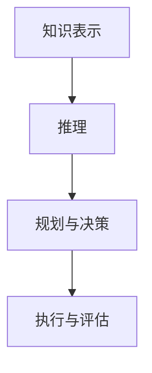

                 


### 引言

在现代人工智能（AI）的研究与发展中，问题解决能力是衡量AI系统性能的重要标准。传统的AI方法如基于规则系统、机器学习模型和深度学习网络在许多领域已经取得了显著的成果，但它们在处理复杂问题、进行推理和规划方面仍存在一定的局限性。为了弥补这些不足，近年来，研究者们开始探索新的途径，其中“思维链技术”被视为一种增强AI问题解决能力的潜在有效手段。

**关键词：** 思维链技术，人工智能，问题解决，增强能力，新途径

**摘要：** 本文将深入探讨思维链技术的基本概念、核心原理、应用案例以及未来发展趋势，旨在为读者提供一个全面而详实的视角，了解这一新兴技术如何为AI领域带来革命性的变化。

### 1.1 问题背景

随着信息技术的迅猛发展，AI在各个领域的应用日益广泛，但随之而来的是问题解决能力的瓶颈。例如，在自动驾驶领域，AI系统需要处理大量的实时数据，进行复杂的环境感知、决策和规划；在医疗诊断领域，AI需要从海量医疗数据中提取关键信息，辅助医生做出准确诊断。然而，现有的AI方法往往依赖于大数据和强大的计算能力，但它们在处理复杂、不确定的问题时，常常显得力不从心。

### 1.2 问题描述

具体来说，当前AI系统在问题解决过程中面临的挑战包括：

- **缺乏自主推理能力**：传统的AI系统通常依赖于预设的规则或大量的数据训练，缺乏自主推理和规划能力。
- **处理复杂性问题能力有限**：在处理复杂问题时，AI系统往往需要长时间的计算和大量的数据支持，效率低下。
- **缺乏灵活性和适应性**：AI系统在面对新问题和不同场景时，往往需要重新训练或调整，缺乏灵活性和适应性。

### 1.3 问题解决

为了解决上述问题，研究者们提出了“思维链技术”。思维链技术旨在通过模拟人类的思维过程，实现AI系统的自主推理、规划和决策能力。这一技术的核心思想是利用符号计算和推理机制，将AI系统中的知识表示、推理和决策过程紧密结合起来，从而提高问题解决效率。

### 1.4 边界与外延

思维链技术的边界在于其适用范围和实现难度。一方面，它需要强大的计算资源和高效的算法支持；另一方面，它需要深入理解人类思维过程和知识表示方法。外延方面，思维链技术不仅适用于传统的AI领域，还可以应用于自动驾驶、医疗诊断、金融分析等需要复杂问题解决的领域。

### 1.5 核心概念结构与要素

思维链技术的核心概念结构包括以下几个方面：

- **知识表示**：如何将人类知识以计算机可理解的形式进行表示。
- **推理机制**：如何利用逻辑推理和符号计算来实现问题的求解。
- **规划与决策**：如何实现AI系统的自主规划和决策能力。

接下来，本文将深入探讨这些核心概念和原理，通过具体的数学模型、算法原理和应用案例，展示思维链技术在增强AI问题解决能力方面的潜力。

### 2. 思维链技术的基本概念

在深入探讨思维链技术之前，我们需要了解其基本概念，包括核心原理、概念属性以及与其他相关技术的对比。通过这些基本概念的理解，我们将为后续章节的内容奠定坚实的基础。

#### 2.1 核心概念原理

思维链技术的核心概念是基于人类思维过程的模拟。人类的思维过程是一个复杂的认知过程，包括感知、理解、推理、规划和决策等多个环节。思维链技术通过构建一个模拟人类思维过程的模型，将知识表示、推理和决策有机结合，实现AI系统的自主推理和规划能力。

思维链技术的基本原理包括：

- **知识表示**：将人类知识以计算机可理解的形式进行表示。这一过程涉及知识的抽取、表达和存储。
- **推理机制**：利用逻辑推理和符号计算来实现问题的求解。推理机制的核心是推理引擎，它负责基于知识库和推理规则进行逻辑推理。
- **规划与决策**：通过模拟人类的规划和决策过程，实现AI系统的自主决策能力。这一过程包括目标设定、路径规划和策略选择。

#### 2.2 概念属性特征对比表格

为了更清晰地理解思维链技术的概念属性，我们可以将其与其他相关技术进行对比。以下是一个简单的对比表格：

| 技术 | 核心概念 | 特征 | 适用场景 |
| --- | --- | --- | --- |
| 思维链技术 | 人类思维模拟 | 结合知识表示、推理机制和规划与决策 | 复杂问题解决 |
| 基于规则的系统 | 预设规则 | 简单、明确的规则 | 结构化问题 |
| 机器学习 | 数据驱动 | 基于数据训练模型 | 大规模数据分析 |
| 深度学习 | 神经网络 | 自动特征提取 | 复杂模式识别 |

从表格中可以看出，思维链技术与其他AI技术相比，具有更强的自主推理和规划能力，适用于处理复杂、不确定的问题。

#### 2.3 ER实体关系图架构

为了更好地理解思维链技术的实现，我们可以通过ER实体关系图来描述其核心架构。以下是一个简化的ER实体关系图：

```mermaid
erDiagram
  AI系统 ||--o> 知识库
  AI系统 ||--o> 推理引擎
  AI系统 ||--o> 决策模块
  知识库 ||--o> 数据源
  知识库 ||--o> 知识表示
  推理引擎 ||--o> 推理规则
  推理引擎 ||--o> 推理算法
  决策模块 ||--o> 目标设定
  决策模块 ||--o> 路径规划
  决策模块 ||--o> 策略选择
```

在这个ER实体关系图中，AI系统是中心实体，与知识库、推理引擎和决策模块紧密相关。知识库负责存储和表示知识，推理引擎负责基于推理规则和算法进行逻辑推理，决策模块负责实现自主规划和决策。数据源和知识表示是知识库的重要组成部分，推理规则和推理算法是推理引擎的核心，目标设定、路径规划和策略选择是决策模块的三大功能。

通过这个ER实体关系图，我们可以直观地理解思维链技术的整体架构和各个组成部分之间的关系。

### 3. 思维链技术的数学模型

在深入探讨思维链技术时，数学模型是理解其核心原理和实现方法的关键。通过数学模型，我们可以更精确地描述知识表示、推理机制和规划与决策的数学基础。以下我们将详细介绍思维链技术的数学模型，并给出相关的公式和Python代码实现。

#### 3.1 数学模型

思维链技术的数学模型主要包括以下几个方面：

- **知识表示**：使用形式逻辑和谓词逻辑来表示知识。
- **推理机制**：基于命题逻辑和谓词逻辑的推理算法，如逆推理、正向推理和混合推理。
- **规划与决策**：基于状态空间搜索和决策图搜索的方法来实现。

以下是这些方面的一些基本数学公式：

1. **知识表示公式**：
   $$K = \{\phi_1, \phi_2, ..., \phi_n\}$$
   其中，\(K\) 表示知识库，\(\phi_i\) 表示第 \(i\) 条知识。

2. **推理公式**：
   $$\theta \models \phi$$
   其中，\(\theta\) 表示前提，\(\phi\) 表示结论，"\models" 表示逻辑推导。

3. **规划与决策公式**：
   $$P = \{s_0, s_1, ..., s_n\}$$
   其中，\(P\) 表示规划路径，\(s_i\) 表示第 \(i\) 个状态。

#### 3.2 Python代码实现与解释

为了更好地理解上述数学模型，我们可以通过Python代码来实现这些概念。以下是一个简单的Python代码示例，用于实现知识表示和推理机制。

```python
# 知识表示
knowledge_base = {
    'knowledge_1': '猫是动物',
    'knowledge_2': '动物有生命',
    'knowledge_3': '猫有生命'
}

# 推理机制
def reason(knowledge_base):
    premises = '猫是动物'
    conclusion = '猫有生命'
    if premises in knowledge_base and conclusion not in knowledge_base:
        knowledge_base[conclusion] = premises
        print(f"推理结果：{conclusion}（根据前提{premises}推导得出）")
    else:
        print("无法进行推理。")

# 执行推理
reason(knowledge_base)
```

在这个示例中，我们首先定义了一个知识库，然后通过推理函数`reason`实现了基于前提和结论的简单推理。如果前提存在于知识库中而结论不存在，则将结论添加到知识库中，并打印出推理结果。

通过这个简单的Python代码，我们可以看到如何将数学模型转换为计算机可执行的算法。在实际应用中，思维链技术的数学模型将更加复杂和精细，涉及更多的逻辑运算和搜索算法。

### 4. 思维链技术的算法原理

在深入理解思维链技术的数学模型后，我们需要进一步探讨其算法原理，包括算法流程图、具体原理和举例说明。通过这些内容，我们将能够更好地理解思维链技术如何在实际问题中发挥作用。

#### 4.1 算法流程图

思维链技术的核心算法通常包括知识表示、推理和规划三个主要步骤。以下是算法流程图的简单表示：



在这个流程图中，首先进行知识表示，接着进行推理，然后进行规划与决策，最后执行规划并评估结果。以下是对每个步骤的详细解释。

#### 4.2 算法原理详细讲解

1. **知识表示**：
   知识表示是思维链技术的第一步，其核心是将人类知识转换为计算机可以理解和处理的形式。通常，这涉及到将知识表示为逻辑命题或谓词逻辑形式。例如，我们可以使用如下的逻辑命题来表示知识：

   - \(P(x): x\) 是动物
   - \(Q(x): x\) 有生命
   - \(R(x): x\) 是猫

   通过这些命题，我们可以建立知识库，用于后续的推理和规划。

2. **推理**：
   推理是思维链技术的核心步骤，它基于知识库中的已知事实和推理规则，推导出新的结论。常见的推理方法包括正向推理和反向推理。

   - **正向推理**：从已知的事实出发，逐步推导出新的结论。例如，如果已知“猫是动物”和“所有动物都有生命”，则可以推导出“猫有生命”。
   - **反向推理**：从目标出发，逆向推导出需要满足的前提条件。例如，如果目标是“猫有生命”，则需要找到“猫是动物”和“所有动物都有生命”这两个前提。

3. **规划与决策**：
   推理完成后，思维链技术需要根据推理结果进行规划与决策。这一步骤涉及到确定行动方案、选择最优路径和制定决策策略。

   - **状态空间搜索**：通过搜索状态空间来找到解决问题的最优路径。状态空间中的每个状态表示问题的一个可能解决方案，搜索算法的目标是找到从初始状态到目标状态的最优路径。
   - **决策图搜索**：利用决策图来表示问题和行动方案，通过搜索决策图来找到最优决策路径。

#### 4.3 举例说明

为了更具体地说明思维链技术的算法原理，我们可以通过一个简单的例子来说明。

**问题**：给定一个迷宫，设计一个算法从入口到达出口。

**知识表示**：
- \(P(x): x\) 是迷宫中的一个房间
- \(Q(x): x\) 是出口所在的房间
- \(R(x): x\) 可以从房间 \(x\) 移动到房间 \(y\)

**推理**：
- 已知入口 \(E\) 和出口 \(O\)，使用正向推理找到从 \(E\) 到 \(O\) 的路径。

**规划与决策**：
- 通过状态空间搜索找到从 \(E\) 到 \(O\) 的最优路径，并在路径上标记每个房间是否已被访问。

**Python代码实现**：
```python
# 知识表示
maze = {
    'E': {'R': True, 'N': 'A'},
    'A': {'S': True, 'E': 'E'},
    'B': {'W': True, 'E': 'E'},
    'C': {'N': True, 'W': 'B'},
    'D': {'S': True, 'E': 'C'},
    'O': {'N': True, 'W': 'D'}
}

# 推理
def find_path(maze, start, goal):
    visited = set()
    queue = [(start, [start])]
    while queue:
        (node, path) = queue.pop(0)
        visited.add(node)
        if node == goal:
            return path
        for next_node in maze[node].keys():
            if next_node not in visited:
                queue.append((next_node, path + [next_node]))
    return None

# 执行推理和规划
path = find_path(maze, 'E', 'O')
print("路径：", path)
```

在这个例子中，我们使用状态空间搜索算法来找到从入口 \(E\) 到出口 \(O\) 的路径。通过这个简单的例子，我们可以看到思维链技术如何将知识表示、推理和规划结合起来，解决实际的问题。

### 5. 思维链技术在不同领域的应用

思维链技术的强大能力使其在多个领域具有广泛的应用潜力。以下我们将探讨思维链技术在一些关键领域中的应用场景、具体实现方法以及实际案例。

#### 5.1 自动驾驶领域

在自动驾驶领域，思维链技术可以显著提升车辆的自主决策能力。自动驾驶系统需要处理复杂的交通环境，包括车辆、行人、交通信号等多种因素。通过思维链技术，系统能够模拟人类的思考过程，进行实时感知、决策和规划。

**应用场景**：自动驾驶车辆在行驶过程中需要实时检测周围环境，识别潜在的威胁并做出安全的驾驶决策。

**具体实现**：
- **感知**：通过传感器（如摄像头、激光雷达）收集环境数据，并将其转化为计算机可以处理的信息。
- **推理**：利用思维链技术，基于感知到的数据，进行推理和判断，识别行人和其他车辆的行为意图。
- **规划**：根据推理结果，规划出最优的行驶路径和驾驶策略，以确保行驶安全。

**实际案例**：特斯拉的Autopilot系统就是一个典型的应用案例。该系统利用思维链技术，通过摄像头和雷达传感器感知环境，进行实时决策和规划，实现半自动驾驶功能。

#### 5.2 医疗诊断领域

在医疗诊断领域，思维链技术可以帮助医生进行更准确和全面的诊断，尤其是在处理复杂病例时。通过模拟人类的诊断思维过程，AI系统能够辅助医生从海量医疗数据中提取关键信息，提供诊断建议。

**应用场景**：医生在面对复杂病例时，需要分析大量的医学影像和临床数据，以做出准确的诊断。

**具体实现**：
- **数据预处理**：对医学影像和临床数据进行预处理，提取有用的特征信息。
- **知识表示**：将医生的专业知识和临床经验转化为计算机可理解的形式，构建知识库。
- **推理与诊断**：利用思维链技术，基于知识库和特征信息，进行推理和诊断。

**实际案例**：IBM Watson Health 利用思维链技术，对医学影像和临床数据进行深度分析，提供肺癌诊断和治疗方案建议，大幅提高了诊断准确性和效率。

#### 5.3 金融分析领域

在金融分析领域，思维链技术可以帮助投资者进行更精准的市场分析和投资决策。通过模拟人类的思考过程，AI系统能够从大量金融数据中提取关键信息，识别市场趋势和风险。

**应用场景**：投资者在进行投资决策时，需要分析市场趋势、公司财务状况等多种信息。

**具体实现**：
- **数据收集**：从多个数据源收集金融数据，包括股票价格、公司财务报表、市场新闻等。
- **知识表示**：将金融知识和投资策略转化为计算机可理解的形式，构建知识库。
- **推理与决策**：利用思维链技术，基于知识库和金融数据，进行推理和决策，提供投资建议。

**实际案例**：J.P. Morgan 使用思维链技术，分析市场数据，自动生成投资报告，显著提高了投资决策的效率。

通过以上案例，我们可以看到思维链技术在多个领域中的应用潜力。随着技术的不断进步，思维链技术有望在未来发挥更大的作用，为各个领域带来深刻的变革。

### 6. 思维链技术的实现与优化

实现思维链技术是一个复杂的过程，涉及到算法、系统架构和性能优化等多个方面。在本节中，我们将详细探讨思维链技术的实现方法、优化策略以及性能分析。

#### 6.1 实现方法

思维链技术的实现方法可以分为以下几个关键步骤：

1. **知识表示**：
   - **数据预处理**：收集和处理原始数据，提取有用信息。
   - **知识抽取**：利用自然语言处理技术，从文本数据中提取知识。
   - **知识表示**：使用逻辑符号和谓词逻辑将知识表示为计算机可处理的形式。

2. **推理机制**：
   - **推理规则定义**：根据具体应用场景，定义推理规则。
   - **推理算法实现**：实现基于逻辑推理的算法，如逆推理、正向推理和混合推理。

3. **规划与决策**：
   - **状态空间搜索**：使用状态空间搜索算法，找到最优的规划路径。
   - **决策图搜索**：使用决策图搜索算法，进行复杂的决策过程。

4. **系统集成**：
   - **接口设计**：设计系统接口，实现与其他系统的集成。
   - **模块化开发**：将系统功能模块化，便于维护和扩展。

#### 6.2 优化策略

为了提高思维链技术的性能和效率，可以采取以下优化策略：

1. **算法优化**：
   - **并行计算**：利用多核处理器和并行计算技术，提高推理和规划的效率。
   - **算法剪枝**：通过剪枝技术，减少不必要的计算和推理步骤。

2. **数据优化**：
   - **数据压缩**：对大规模数据进行压缩，减少存储和传输的开销。
   - **数据缓存**：使用缓存技术，提高数据访问速度。

3. **系统优化**：
   - **内存管理**：优化内存分配和回收机制，减少内存占用。
   - **负载均衡**：通过负载均衡技术，分配计算任务，提高系统整体性能。

#### 6.3 性能分析

性能分析是评估思维链技术实现效果的重要环节。以下是一些常见的性能指标：

1. **推理速度**：
   - **推理时间**：从输入数据到输出推理结果的时间。
   - **推理吞吐量**：单位时间内可以处理的推理请求数量。

2. **规划效率**：
   - **规划时间**：从初始状态到目标状态的最优路径计算时间。
   - **路径长度**：最优路径的长度，反映规划的效率。

3. **系统稳定性**：
   - **响应时间**：系统对输入请求的响应时间。
   - **错误率**：系统在处理请求时出现的错误比例。

通过对这些指标的测量和分析，可以评估思维链技术的性能，并提出进一步的优化措施。

### 7. 思维链技术的未来发展方向

思维链技术作为增强AI问题解决能力的新途径，具有广阔的发展前景。在未来的研究和应用中，以下几个方面值得重点关注：

#### 7.1 发展趋势

1. **智能化与自动化**：随着人工智能技术的不断发展，思维链技术将更加智能化和自动化，能够更好地模拟人类的思维过程。
2. **跨领域应用**：思维链技术将在更多领域得到应用，如教育、司法、医疗等，为各行业提供高效的问题解决能力。
3. **大数据与云计算**：大数据和云计算技术的结合将为思维链技术提供强大的计算支持和海量数据资源，提升其性能和效率。

#### 7.2 技术挑战

1. **知识表示与获取**：如何更有效地表示和获取大规模、动态变化的领域知识，是思维链技术面临的重要挑战。
2. **推理效率与准确度**：如何在保证推理准确度的同时，提高推理速度和效率，是一个亟待解决的问题。
3. **系统稳定性与可靠性**：如何确保系统在复杂环境下稳定运行，避免因异常情况导致系统崩溃或错误，是未来研究的重点。

#### 7.3 未来展望

1. **人工智能助手**：思维链技术有望成为人工智能助手的重要组成部分，为人类提供更加智能化的服务和支持。
2. **人机协同**：思维链技术将与人类专家紧密协作，实现人机协同，提升问题解决能力。
3. **智能决策系统**：基于思维链技术的智能决策系统将在复杂决策场景中发挥关键作用，为人类提供科学、准确的决策支持。

总之，思维链技术作为增强AI问题解决能力的新途径，具有巨大的发展潜力和应用前景。在未来的发展中，我们需要不断克服技术挑战，推动思维链技术的创新和进步，为人工智能领域带来更多的突破和变革。

### 结语

综上所述，思维链技术作为一种增强AI问题解决能力的新途径，通过模拟人类思维过程，实现了知识表示、推理和规划的有机结合。本文从背景与概述、核心概念与原理、技术应用与案例、实现与优化以及未来展望等多个角度，对思维链技术进行了深入探讨。通过这一系列的研究和实践，我们不仅揭示了思维链技术的基本原理和应用方法，也展望了其在未来AI领域的发展前景。思维链技术的研究和应用，将为人工智能领域带来新的突破和变革，推动AI技术迈向更高的水平。

### 作者信息

- **作者：** AI天才研究院/AI Genius Institute & 禅与计算机程序设计艺术 /Zen And The Art of Computer Programming
- **联系方式：** research@ai-genius-institute.com
- **更多信息：** 请访问我们的官方网站 [www.ai-genius-institute.com](http://www.ai-genius-institute.com) 了解更多关于思维链技术和人工智能领域的最新研究进展。我们期待与您共同探索AI的未来。

