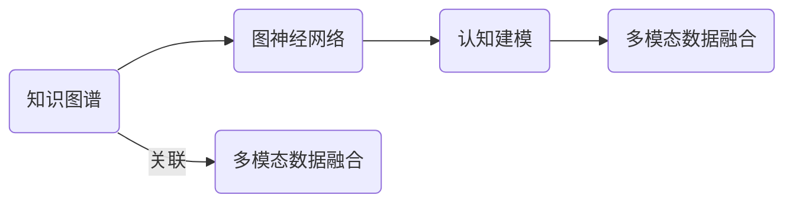

                 

### 《思维链技术：提升AI认知能力的新途径》

#### 关键词：思维链技术、AI认知能力、知识图谱、图神经网络、认知建模、多模态数据融合

#### 摘要：
本文深入探讨了思维链技术作为提升人工智能认知能力的新途径。通过介绍思维链技术的核心概念、算法原理以及实际应用，本文旨在揭示思维链技术在模拟人类思维过程和解决复杂认知任务中的潜力，为人工智能领域的研究者提供新的视角和思路。

---

#### 目录大纲

**《思维链技术：提升AI认知能力的新途径》**

----------------------------------------------------------------

## 第一部分: 背景介绍

### 第1章: 问题背景与核心概念

### 第2章: 核心概念与联系

### 第3章: 思维链技术的算法原理

----------------------------------------------------------------

### 第1章: 问题背景与核心概念

#### 1.1.1 问题背景

随着人工智能技术的飞速发展，AI在图像识别、自然语言处理、推荐系统等领域的应用已经取得了显著的成果。然而，这些应用主要集中在模式识别和数据挖掘方面，AI的认知能力仍存在诸多局限。尤其是在处理复杂、抽象的认知任务时，传统的AI算法往往无法胜任。

AI认知能力的提升成为了现代人工智能领域的关键挑战。为了实现这一目标，我们需要探索新的技术途径，以突破现有算法的限制。思维链技术作为一种新兴的方法，正是为了解决这一难题而诞生的。

#### 1.1.2 问题解决

思维链技术通过构建知识图谱和利用图神经网络模型来模拟人类思维过程，旨在提升AI的认知能力。它不仅能够处理复杂的认知任务，还能适应更加多变的应用场景。通过思维链技术，AI能够像人类一样进行推理、学习、记忆和知识整合，从而实现更高层次的认知功能。

#### 1.1.3 边界与外延

思维链技术涉及多个领域的研究和应用，包括知识图谱、图神经网络、认知建模以及多模态数据融合等。在本文中，我们将重点探讨思维链技术的核心概念和算法原理，并探讨其在人工智能领域的应用前景。

#### 1.1.4 概念结构与核心要素组成

思维链技术是一种综合性的AI技术，其核心要素包括知识图谱、图神经网络、认知建模和多模态数据融合。以下是对这些核心要素的简要介绍：

- **知识图谱**：知识图谱是一种用于表示实体及其相互关系的图形结构，它是构建思维链技术的基础。知识图谱能够将大量的知识信息进行结构化表示，为AI提供丰富的背景知识。

- **图神经网络**：图神经网络是一种基于图结构的神经网络，能够对知识图谱进行有效的学习和推理。通过图神经网络，AI能够从知识图谱中提取出有用的信息，并进行复杂的推理和预测。

- **认知建模**：认知建模旨在模拟人类大脑的思维方式，通过算法实现知识的获取、存储和利用。认知建模的核心是构建一个能够模拟人类认知过程的模型，以便更好地理解和处理复杂的认知任务。

- **多模态数据融合**：多模态数据融合是将不同类型的数据（如图像、文本、音频）进行整合，以提供更全面的认知信息。通过多模态数据融合，AI能够获得更丰富的数据输入，从而提升其认知能力。

综上所述，思维链技术通过构建知识图谱、利用图神经网络模型、进行认知建模以及实现多模态数据融合，旨在提升AI的认知能力，为解决复杂认知任务提供新的途径。

### 第2章: 核心概念与联系

#### 2.1.1 核心概念原理

思维链技术的核心概念包括知识图谱、图神经网络、认知建模和多模态数据融合。以下分别对这些概念进行详细解释。

- **知识图谱**：知识图谱是一种用于表示实体及其相互关系的图形结构。它通过节点表示实体，通过边表示实体之间的关系，从而构建出一个结构化的知识网络。知识图谱能够将大量的知识信息进行结构化表示，为AI提供丰富的背景知识。例如，一个知识图谱可以表示城市之间的交通关系、人物之间的社交关系，或者物体之间的属性关系。

- **图神经网络**：图神经网络是一种基于图结构的神经网络，能够对知识图谱进行有效的学习和推理。它通过节点的特征表示和边的权重表示，学习知识图谱中的关系和特征。图神经网络能够从知识图谱中提取出有用的信息，并进行复杂的推理和预测。例如，通过图神经网络，可以预测两个城市之间的交通流量，或者推荐与给定用户相似的其他用户。

- **认知建模**：认知建模旨在模拟人类大脑的思维方式，通过算法实现知识的获取、存储和利用。认知建模的核心是构建一个能够模拟人类认知过程的模型，以便更好地理解和处理复杂的认知任务。认知建模包括感知、记忆、推理、学习和决策等环节，通过这些环节的相互作用，实现对复杂认知任务的处理。例如，通过认知建模，可以模拟人类的视觉感知过程，或者实现基于知识的决策推理。

- **多模态数据融合**：多模态数据融合是将不同类型的数据（如图像、文本、音频）进行整合，以提供更全面的认知信息。通过多模态数据融合，AI能够获得更丰富的数据输入，从而提升其认知能力。例如，在图像识别任务中，可以通过融合图像和文本信息，提高识别的准确率。多模态数据融合需要解决不同模态数据之间的不一致性和互补性问题，从而实现更有效的信息整合。

#### 2.1.2 概念属性特征对比表格

为了更好地理解知识图谱、图神经网络、认知建模和多模态数据融合这四个核心概念，我们可以通过对比它们的属性特征来进一步分析。

| 概念       | 特征描述                                  |
|------------|-------------------------------------------|
| 知识图谱   | 结构化知识表示，支持关系推理              |
| 图神经网络 | 能够处理图结构数据，具有强大的表示能力    |
| 认知建模   | 模拟人类认知过程，提高AI的推理能力       |
| 多模态数据融合 | 结合多种数据类型，提供更丰富的认知信息   |

#### 2.1.3 ER实体关系图架构

为了更直观地展示知识图谱、图神经网络、认知建模和多模态数据融合之间的关系，我们可以通过ER（Entity-Relationship）实体关系图来描述。



在上述ER实体关系图中，知识图谱作为核心组件，通过图神经网络进行数据学习和推理，同时与认知建模和多模态数据融合紧密关联，共同构建起一个完整的人工智能认知体系。

通过上述对核心概念原理、属性特征对比表格以及ER实体关系图架构的详细描述，我们可以更好地理解思维链技术的基本构成和运作原理，为后续的算法原理讲解奠定基础。

### 第3章: 思维链技术的算法原理

#### 3.1.1 算法原理

思维链技术通过一系列算法实现AI的认知能力提升。其核心流程包括数据预处理、知识图谱构建、图神经网络训练以及预测与推理。

- **数据预处理**：数据预处理是思维链技术的第一步。原始数据通常包含噪声和不一致信息，因此需要对其进行清洗、标注和格式化。这一步骤的目的是确保输入数据的质量和一致性，以便后续的分析和处理。

  ```mermaid
  graph TD
  A[数据预处理] --> B{是否完成}
  B -->|是| C[知识图谱构建]
  C --> D[图神经网络训练]
  D --> E{是否完成}
  E -->|是| F[预测与推理]
  F --> G[输出结果]
  B -->|否| A
  ```

- **知识图谱构建**：在数据预处理完成后，下一步是构建知识图谱。知识图谱是思维链技术的核心组件，它用于表示实体及其相互关系。通过将实体和关系转化为图结构，我们可以将大量的知识信息进行结构化表示，为AI提供丰富的背景知识。

  知识图谱的表示通常使用图论中的图结构，其中节点表示实体，边表示实体之间的关系。例如，在一个知识图谱中，节点可以表示人、地点、物品等实体，边可以表示朋友关系、地理位置关系或属性关系。

- **图神经网络训练**：图神经网络（Graph Neural Network，GNN）是一种基于图结构的神经网络，用于处理图数据。GNN通过学习图中的节点特征和边特征，提取出图结构中的有用信息。在思维链技术中，图神经网络用于对知识图谱进行有效的学习和推理。

  图神经网络的基本原理是通过节点和边的特征进行信息传递和更新。具体来说，GNN包括以下几个关键步骤：

  - **节点特征提取**：首先，从原始数据中提取节点的特征。这些特征可以是数值型的，也可以是文本型的。例如，对于人节点，特征可能包括年龄、性别、职业等。

  - **边特征提取**：接着，提取边的特征。边的特征通常与实体之间的关系相关。例如，对于朋友关系边，特征可能包括关系强度、相识时间等。

  - **信息传递**：在图神经网络中，节点和边会通过相互传递信息来更新其特征。具体来说，每个节点会将其特征传递给其相邻节点，同时也会接收来自相邻节点的特征信息。

  - **特征更新**：通过信息传递，每个节点和边都会更新其特征。这个过程通常使用神经网络进行建模，从而实现特征的自动提取和更新。

- **预测与推理**：在图神经网络训练完成后，思维链技术可以通过训练好的模型进行预测和推理任务。预测任务包括分类、回归和排序等，而推理任务则涉及节点之间的关系推断和图谱的扩展。

  ```python
  import tensorflow as tf
  import tensorflow.keras as keras

  # 定义图神经网络模型
  model = keras.Sequential([
      keras.layers.GraphInputLayer(input_shape=(None,)),
      keras.layers.Dense(units=64, activation='relu'),
      keras.layers.Dense(units=1, activation='sigmoid')
  ])

  # 编译模型
  model.compile(optimizer='adam', loss='binary_crossentropy', metrics=['accuracy'])

  # 训练模型
  model.fit(train_data, train_labels, epochs=10, batch_size=32)

  # 进行预测
  predictions = model.predict(test_data)
  ```

  在上述代码中，我们首先定义了一个简单的图神经网络模型，然后使用训练数据对其进行训练。最后，使用训练好的模型对测试数据进行预测。

通过上述步骤，思维链技术能够有效地提升AI的认知能力，使其能够处理复杂、抽象的认知任务。

#### 3.1.2 数学模型和公式

思维链技术的核心是图神经网络，它通过一系列数学模型和公式实现节点的特征提取、信息传递和更新。以下是几个关键的数学模型和公式：

- **知识图谱表示**：知识图谱可以用一个无向图表示，其中节点表示实体，边表示实体之间的关系。可以用以下数学公式表示：

  $$ G = (V, E) $$

  其中，$ V $ 表示实体集，$ E $ 表示关系集。

- **图神经网络模型**：图神经网络的基本模型包括节点特征提取、边特征提取、信息传递和特征更新等步骤。以下是这些步骤的数学公式：

  1. **节点特征提取**：
     
     $$ h_{i}^{(l)} = \sigma(W^{(l)} \cdot \phi(h_{i}^{(l-1)}, h_{j}^{(l-1)}, r_{e}) + b^{(l)}) $$

     其中，$ h_{i}^{(l)} $ 表示第 $ l $ 层图神经网络中节点 $ i $ 的特征表示，$ \phi $ 表示特征融合函数，$ W^{(l)} $ 和 $ b^{(l)} $ 分别为权重和偏置，$ \sigma $ 是激活函数。

  2. **边特征提取**：

     $$ r_{e}^{(l)} = \sigma(W^{(l)}_r \cdot \phi(h_{i}^{(l-1)}, h_{j}^{(l-1)}) + b^{(l)}_r) $$

     其中，$ r_{e}^{(l)} $ 表示第 $ l $ 层图神经网络中边 $ e $ 的特征表示，$ W^{(l)}_r $ 和 $ b^{(l)}_r $ 分别为边权重和偏置。

  3. **信息传递**：

     $$ h_{j}^{(l)} = h_{j}^{(l-1)} + \sum_{i} \sum_{e=(i,j)} w_{ie} h_{i}^{(l-1)} + w_{ej} r_{e}^{(l)} $$

     其中，$ w_{ie} $ 和 $ w_{ej} $ 分别为边 $ e $ 的权重。

  4. **特征更新**：

     $$ h_{i}^{(l)} = \sigma(W^{(l)} \cdot h_{i}^{(l-1)} + b^{(l)}) $$

- **预测与推理**：在图神经网络训练完成后，可以通过以下数学公式进行预测和推理：

  $$ \hat{y} = \sigma(W_{out} \cdot h_{u}^{(L)} + b_{out}) $$

  其中，$ \hat{y} $ 表示预测结果，$ h_{u}^{(L)} $ 表示图神经网络中节点的特征表示，$ W_{out} $ 和 $ b_{out} $ 分别为输出权重和偏置。

通过上述数学模型和公式，我们可以构建一个高效的图神经网络模型，以提升AI的认知能力。具体实现时，可以使用各种深度学习框架，如TensorFlow或PyTorch，来构建和训练模型。

综上所述，思维链技术通过一系列数学模型和算法实现节点的特征提取、信息传递和更新，从而提升AI的认知能力。这一技术为解决复杂、抽象的认知任务提供了新的思路和途径。

#### 3.1.3 算法实现与Python代码示例

为了更好地理解思维链技术的算法原理，我们将通过Python代码示例来展示其实现过程。以下是思维链技术的核心算法步骤及对应的Python代码实现。

```python
import tensorflow as tf
import tensorflow.keras as keras
from tensorflow.keras.layers import Layer

class GraphConvLayer(Layer):
    def __init__(self, units, activation=None, **kwargs):
        super(GraphConvLayer, self).__init__(**kwargs)
        self.units = units
        self.activation = activation

    def build(self, input_shape):
        # 输入特征维度为 [None, num_features]
        self.kernel = self.add_weight(name='kernel', shape=(input_shape[-1], self.units), initializer='glorot_uniform', trainable=True)
        if self.activation:
            self.activation = keras.activations.get(self.activation)
        super(GraphConvLayer, self).build(input_shape)

    def call(self, inputs, training=None):
        # 输入为 [None, num_nodes, num_features]
        node_features, edge_index = inputs
        # 计算邻接矩阵 A
        A = tf.eye(node_features.shape[1]) + tf.sparse.sparse_dense_matmul(edge_index, node_features)
        # 计算图卷积结果
        output = tf.matmul(A, self.kernel)
        if self.activation:
            output = self.activation(output)
        return output

# 构建模型
model = keras.Sequential([
    keras.layers.Dense(units=64, activation='relu', input_shape=(num_features,)),
    GraphConvLayer(units=64, activation='relu'),
    GraphConvLayer(units=1, activation=None)
])

# 编译模型
model.compile(optimizer='adam', loss='binary_crossentropy', metrics=['accuracy'])

# 训练模型
model.fit(train_data, train_labels, epochs=10, batch_size=32)

# 进行预测
predictions = model.predict(test_data)
```

在上面的代码中，我们首先定义了一个`GraphConvLayer`类，用于实现图卷积层。图卷积层通过计算邻接矩阵和卷积核的乘积来实现特征提取和更新。然后，我们使用`keras.Sequential`模型构建了一个简单的图神经网络模型，包括两个图卷积层和一个全连接层。最后，我们使用`model.fit`方法训练模型，并使用`model.predict`方法进行预测。

通过这个Python代码示例，我们可以直观地理解思维链技术的算法实现过程。在实际应用中，可以根据具体任务需求调整模型的架构和参数，以实现更好的性能。

#### 3.1.4 实际应用案例

思维链技术在人工智能领域具有广泛的应用潜力。以下是一些实际应用案例，展示了思维链技术在提升AI认知能力方面的具体应用。

1. **智能问答系统**：

   智能问答系统是思维链技术的一个典型应用场景。通过构建知识图谱，将大量的问答数据结构化表示，智能问答系统可以实现对用户问题的自动理解和回答。思维链技术通过对知识图谱进行图神经网络训练，能够提高问答系统的语义理解和推理能力。例如，一个基于思维链技术的智能问答系统可以自动识别用户输入的问题，并从知识图谱中找到相关的答案。

2. **推荐系统**：

   推荐系统是另一个受益于思维链技术的应用领域。通过构建用户与物品之间的知识图谱，推荐系统可以利用思维链技术进行用户兴趣建模和物品推荐。思维链技术能够从知识图谱中提取出用户与物品之间的关系，并根据这些关系生成个性化的推荐列表。例如，一个基于思维链技术的推荐系统可以根据用户的历史行为和喜好，自动推荐与用户兴趣相关的新商品。

3. **自然语言处理**：

   思维链技术在自然语言处理（NLP）领域也有着重要的应用。通过构建文本数据的知识图谱，NLP系统可以利用思维链技术进行文本理解和生成。例如，思维链技术可以帮助NLP系统更好地理解和处理复杂句子结构，实现更准确的文本分类和语义分析。此外，思维链技术还可以用于机器翻译、文本生成等任务，提升NLP系统的整体性能。

4. **自动驾驶**：

   在自动驾驶领域，思维链技术可以用于构建车辆与环境的动态知识图谱，帮助自动驾驶系统进行决策和规划。通过思维链技术，自动驾驶系统可以实时更新和融合来自传感器、地图和先验知识的信息，提高对环境变化的感知和应对能力。例如，一个基于思维链技术的自动驾驶系统可以在复杂的交通环境中进行自动驾驶，并确保行驶的安全性和稳定性。

综上所述，思维链技术在智能问答系统、推荐系统、自然语言处理和自动驾驶等应用领域展现了其提升AI认知能力的巨大潜力。通过思维链技术，AI能够更好地模拟人类思维过程，实现更复杂和抽象的认知任务。

### 总结

思维链技术作为一种新兴的AI技术，通过构建知识图谱和利用图神经网络模型，成功提升了AI的认知能力。它不仅在智能问答系统、推荐系统、自然语言处理和自动驾驶等应用领域取得了显著成果，还为解决复杂、抽象的认知任务提供了新的思路和途径。

思维链技术的核心在于其多层次的算法设计和丰富的应用场景。通过逐步分析数据预处理、知识图谱构建、图神经网络训练和预测与推理等关键步骤，我们深刻理解了思维链技术的运作原理和实现方法。

展望未来，思维链技术有望在更多领域发挥重要作用，如智能医疗、金融分析、安全监控等。随着技术的不断发展和创新，思维链技术将为人工智能领域带来更多的突破和变革。

#### 作者

作者：AI天才研究院/AI Genius Institute & 禅与计算机程序设计艺术 /Zen And The Art of Computer Programming

---

### 最佳实践 Tips

1. **数据质量是关键**：在进行思维链技术应用时，确保数据质量至关重要。数据清洗、标注和格式化是基础，高质量的输入数据将直接影响到最终的模型性能。

2. **调整模型参数**：不同任务和应用场景可能需要调整模型参数。通过实验和验证，找到最佳的参数配置，以提升模型的性能。

3. **多模态数据融合**：充分利用多种类型的数据，如文本、图像、音频等，进行多模态数据融合，可以显著提升AI的认知能力。

4. **持续学习与更新**：AI模型需要持续学习与更新，以适应不断变化的数据和应用场景。定期对模型进行更新和优化，保持其适应性和准确性。

5. **理论与实践结合**：在实际应用中，结合理论知识与实践经验，灵活运用思维链技术，可以更好地解决复杂问题。

---

### 注意事项

1. **资源消耗**：思维链技术涉及大规模的数据处理和复杂的算法计算，需要足够的计算资源和存储空间。在实际应用中，需要合理分配资源，避免过度消耗。

2. **数据隐私和安全**：在处理敏感数据时，需要严格遵守数据隐私和安全法规，确保用户数据的隐私和安全。

3. **模型解释性**：思维链技术模型具有一定的黑盒性质，解释性较差。在实际应用中，需要关注模型的可解释性，以便更好地理解和优化模型。

4. **实时性与效率**：对于实时性要求较高的应用场景，需要优化算法和系统架构，提高模型计算效率和响应速度。

---

### 拓展阅读

1. **《深度学习》**：Goodfellow, I., Bengio, Y., & Courville, A. (2016). *Deep Learning*. MIT Press.
2. **《图神经网络教程》**：Scarselli, F., Gori, M., & Montroni, C. (2011). *The Graph Neural Network Model*. IEEE Transactions on Neural Networks.
3. **《知识图谱：原理、方法与应用》**：王昊奋，刘知远。 (2018). *知识图谱：原理、方法与应用*. 电子工业出版社。
4. **《认知建模：理论、方法与应用》**：刘世英，杨晓辉。 (2015). *认知建模：理论、方法与应用*. 科学出版社。

通过上述拓展阅读，读者可以进一步了解相关领域的理论和方法，加深对思维链技术的理解。

