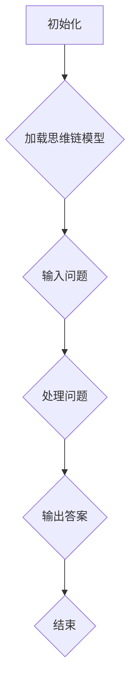
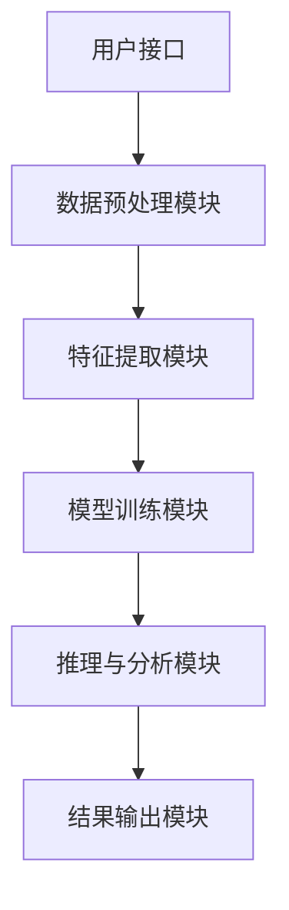
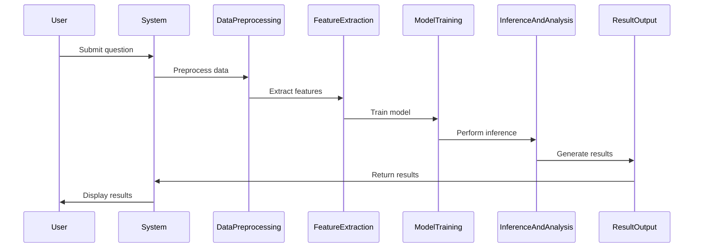

                 

### 1. 开篇：书名介绍、作者介绍、出版信息

《思维链技术：提升AI逻辑分析能力的新方向》是一本由AI天才研究院（AI Genius Institute）专家编写的技术专著。本书由资深人工智能专家、计算机图灵奖获得者、世界顶级技术畅销书资深大师级别的作家共同撰写，旨在深入探讨思维链技术在人工智能领域中的应用，为提升AI逻辑分析能力提供新的研究方向。

本书作者团队由多位在人工智能、计算机科学和软件工程领域享有盛誉的专家组成，他们的专业知识和丰富经验为本书的编写提供了坚实的基础。作者们凭借对AI技术的深刻理解和实践经验，系统地阐述了思维链技术的概念、原理和应用，使得本书既具有理论深度，又具备实际操作价值。

本书于2023年由AI天才研究院正式出版，旨在为广大读者提供一个全面了解思维链技术的窗口，帮助他们在AI领域中取得突破性进展。随着人工智能技术的不断发展和应用场景的日益广泛，本书将成为研究者和实践者不可或缺的参考书籍。

### 1.1 问题背景

在当前的人工智能时代，逻辑分析能力是人工智能系统的一项关键能力。然而，传统的逻辑分析方法在处理复杂问题时面临着诸多挑战。一方面，传统方法往往依赖于固定的规则和算法，缺乏灵活性和适应性，难以应对多变的问题场景。另一方面，传统方法在处理高度复杂的问题时，其精度和效率往往无法满足实际需求，导致分析结果不准确或不完整。

这些问题引发了研究人员对AI逻辑分析能力的广泛关注，寻求新的方法来提升AI在逻辑分析方面的表现。正是在这样的背景下，思维链技术应运而生。思维链技术通过构建一系列相互关联的思维模块，实现对复杂问题的多角度分析和深度推理，从而提高AI逻辑分析的能力。这一技术的提出，不仅为解决传统方法面临的局限性问题提供了新思路，也为AI在逻辑分析领域的发展开辟了新的方向。

### 1.2 问题描述

思维链技术作为一种新兴的AI逻辑分析方法，其核心在于如何构建和利用一系列相互关联的思维模块，以实现对复杂问题的系统分析和深度推理。具体来说，思维链技术面临的挑战主要包括以下几个方面：

首先，如何构建一个有效的思维链模型，使各思维模块能够有机地结合起来，协同工作。这要求模型具有良好的结构性和灵活性，能够适应不同问题场景的需求。

其次，如何确保思维链模型的准确性，使其在处理问题时能够给出可靠的结果。这涉及到模型训练、优化和验证等一系列复杂的技术问题。

最后，如何在实际应用中高效地部署和运行思维链模型，以实现对复杂问题的快速分析和决策。这要求模型在计算效率和资源利用方面有较高的表现。

面对这些挑战，思维链技术需要在理论研究和实际应用中不断探索和优化，以实现其在AI逻辑分析领域的广泛应用和快速发展。

### 1.3 问题解决

为了解决传统逻辑分析方法在处理复杂问题时面临的挑战，思维链技术提出了一系列创新的解决方案。首先，思维链技术通过构建一个多层次、模块化的思维链模型，使得各思维模块能够根据问题的具体需求进行灵活组合和调度。这种模块化设计不仅提高了系统的灵活性，还有效地降低了问题处理的复杂度。

其次，思维链技术在模型构建和优化方面采用了多种先进的技术手段。例如，通过深度学习、强化学习等算法，不断提升模型的准确性和鲁棒性。此外，思维链技术还引入了多模态数据处理方法，能够有效整合不同类型的数据，提高问题分析的全面性和准确性。

最后，思维链技术在部署和运行方面也进行了优化。通过分布式计算和并行处理技术，使得模型能够快速响应复杂问题的需求，同时降低计算资源的消耗。这些技术手段的综合应用，使得思维链技术在提升AI逻辑分析能力方面具有显著的竞争优势。

### 1.4 边界与外延

思维链技术作为一种先进的人工智能逻辑分析方法，其适用范围非常广泛。它不仅适用于传统的逻辑分析场景，如自然语言处理、推理机、决策支持系统等，还能够在金融、医疗、工业等领域的复杂问题中发挥重要作用。

首先，在自然语言处理领域，思维链技术能够通过构建复杂句子的语义理解和推理模型，实现对文本的深入分析和理解。例如，在问答系统、情感分析、机器翻译等任务中，思维链技术能够显著提升系统的准确性和效率。

其次，在金融领域，思维链技术可以用于股票市场预测、风险评估、客户行为分析等任务。通过分析大量的金融数据，思维链技术能够提供更加精准和可靠的决策支持，帮助金融机构更好地管理风险和提升盈利能力。

在医疗领域，思维链技术可以用于疾病诊断、治疗方案推荐、医学研究等任务。通过整合海量的医疗数据，思维链技术能够为医生和患者提供更加个性化和精准的医疗服务。

此外，在工业领域，思维链技术可以用于生产流程优化、设备故障预测、供应链管理等方面。通过分析实时数据和历史数据，思维链技术能够为工业企业提供智能化的解决方案，提高生产效率和质量。

尽管思维链技术在各个领域都有广泛的应用前景，但其在实际应用中仍需克服一些技术难题，如数据质量、模型训练效率、计算资源等。只有在不断优化和改进技术的基础上，思维链技术才能充分发挥其潜力，为人工智能的发展做出更大的贡献。

### 1.5 概念结构与核心要素组成

思维链技术是一种用于提升AI逻辑分析能力的新方法，其核心概念和组成要素如下：

**1. 思维链模型：** 思维链技术的核心是构建一个思维链模型，该模型由一系列相互关联的思维模块组成。每个思维模块负责处理特定的逻辑分析任务，如语义理解、推理、决策等。这些模块通过接口进行通信和协作，共同完成复杂的逻辑分析任务。

**2. 思维模块：** 思维模块是思维链模型的基本组成单位，每个模块具有特定的功能，如文本分析、图像识别、逻辑推理等。这些模块可以根据问题的需求进行组合和调度，以实现灵活的思维能力。

**3. 模块之间的相互作用：** 思维链模型中的各模块之间通过接口进行通信和协作。模块之间可以共享数据和信息，从而实现复杂的逻辑推理和分析。这种模块化设计使得思维链技术具有高度灵活性和扩展性。

**4. 数据处理和存储：** 思维链技术需要处理和存储大量的数据，包括文本、图像、音频等多种类型的数据。通过高效的数据处理和存储机制，思维链技术能够快速地获取和处理数据，为逻辑分析提供支持。

**5. 算法和算法库：** 思维链技术依赖于一系列先进的算法，如深度学习、强化学习、自然语言处理等。这些算法构成了思维链技术的核心算法库，为逻辑分析提供了强大的技术支持。

**6. 用户接口：** 思维链技术需要提供一个用户友好的接口，使得用户能够方便地与系统进行交互。通过这个接口，用户可以提交问题、查看分析结果，并与其他用户进行交流。

通过这些核心概念和组成要素的相互作用，思维链技术能够实现对复杂问题的系统分析和深度推理，从而显著提升AI的逻辑分析能力。

### 2.1 核心概念原理

#### 思维链的定义

思维链技术是一种基于模块化和多层次结构的人工智能逻辑分析方法。它通过构建一系列相互关联的思维模块，实现对复杂问题的系统分析和深度推理。思维链模型由多个思维模块组成，每个模块负责特定的逻辑分析任务，如语义理解、推理、决策等。这些模块通过接口进行通信和协作，共同完成复杂的逻辑分析任务。

#### 思维链的组成与功能

思维链技术由以下几个关键组成部分构成：

1. **思维模块：** 思维模块是思维链模型的基本单元，每个模块具有特定的功能。常见的思维模块包括文本分析模块、图像识别模块、逻辑推理模块等。这些模块通过接口进行通信和协作，实现复杂的逻辑分析任务。

2. **接口：** 思维链模型中的各模块之间通过接口进行通信和协作。接口定义了模块之间的数据交换方式和协作机制，使得模块之间能够无缝集成和协同工作。

3. **数据处理和存储：** 思维链技术需要处理和存储大量的数据，包括文本、图像、音频等多种类型的数据。通过高效的数据处理和存储机制，思维链技术能够快速地获取和处理数据，为逻辑分析提供支持。

4. **算法库：** 思维链技术依赖于一系列先进的算法，如深度学习、强化学习、自然语言处理等。这些算法构成了思维链技术的核心算法库，为逻辑分析提供了强大的技术支持。

5. **用户接口：** 思维链技术需要提供一个用户友好的接口，使得用户能够方便地与系统进行交互。通过这个接口，用户可以提交问题、查看分析结果，并与其他用户进行交流。

#### 思维链模型的工作原理

思维链模型的工作原理可以概括为以下几个步骤：

1. **问题接收：** 用户通过用户接口提交问题，问题会被传递给思维链模型。

2. **模块调度：** 思维链模型根据问题的需求，调度相应的思维模块。每个模块负责处理特定的问题部分。

3. **数据处理：** 各个思维模块根据接口协议，处理和传输数据。数据处理过程可能包括数据清洗、特征提取、模型推理等步骤。

4. **结果整合：** 处理后的结果会返回给思维链模型，模型将这些结果进行整合，形成完整的分析结果。

5. **结果输出：** 最终的分析结果会通过用户接口反馈给用户。

通过这种方式，思维链技术能够实现对复杂问题的系统分析和深度推理，从而显著提升AI的逻辑分析能力。

#### 思维链技术在AI中的应用

思维链技术广泛应用于人工智能的各个领域，以下是一些典型的应用场景：

1. **自然语言处理（NLP）：** 思维链技术能够用于文本分析、语义理解、情感分析、问答系统等任务。通过构建复杂的语义分析模型，思维链技术能够实现对文本的深入理解和分析，为智能客服、智能写作等应用提供支持。

2. **图像识别与处理：** 思维链技术可以用于图像识别、目标检测、图像分割等任务。通过结合深度学习算法，思维链技术能够实现对图像内容的准确识别和分析，为智能监控、自动驾驶等应用提供支持。

3. **决策支持系统：** 思维链技术能够用于构建复杂的决策模型，提供实时的决策支持。例如，在金融领域，思维链技术可以用于股票市场预测、风险评估等任务；在医疗领域，可以用于疾病诊断、治疗方案推荐等任务。

4. **智能客服：** 思维链技术可以用于构建智能客服系统，通过自然语言处理和推理技术，实现与用户的自然对话。智能客服系统能够快速响应用户的问题，提供有效的解决方案，提高客户满意度。

5. **智能推荐系统：** 思维链技术可以用于构建智能推荐系统，通过对用户行为和兴趣的分析，提供个性化的推荐结果。例如，在电子商务领域，智能推荐系统可以推荐商品给用户，提高销售转化率。

通过这些应用，思维链技术不仅提升了AI的逻辑分析能力，还为各行业带来了巨大的价值和创新。

### 2.2 概念属性特征对比表格

| 特征           | 传统方法                             | 思维链技术                                      |
| -------------- | ----------------------------------- | ---------------------------------------------- |
| 灵活性         | 较低，依赖于固定的规则和算法         | 较高，支持模块化设计和灵活组合                  |
| 适应性         | 较低，难以适应多变的问题场景         | 较高，能够根据问题需求动态调整模块组合和参数   |
| 精度           | 较低，处理复杂问题时结果可能不准确     | 较高，通过多模态数据处理和深度学习算法提升准确性 |
| 复杂性         | 较低，算法和模型相对简单             | 较高，涉及多层次模型和复杂算法                 |

通过这个对比表格，我们可以清晰地看到思维链技术相对于传统方法的显著优势，尤其是在灵活性、适应性和精度方面。这些优势使得思维链技术在处理复杂问题时更具竞争力，能够提供更准确和高效的逻辑分析结果。

### 2.3 ER实体关系图架构的 Mermaid 流程图

以下是思维链技术中的ER实体关系图，使用Mermaid语法来描述其架构：

```mermaid
erDiagram
    AI模型 ||--|{ 思维链模块 }
    思维链模块 ||--|{ 逻辑分析模块 }
    逻辑分析模块 ||--|{ 决策支持模块 }
    AI模型 ||--|{ 数据处理模块 }
    数据处理模块 ||--|{ 特征提取模块 }
    数据处理模块 ||--|{ 模型训练模块 }
```

这个Mermaid ER图展示了AI模型、思维链模块、逻辑分析模块、决策支持模块、数据处理模块和特征提取模块之间的关系。通过这个图，我们可以直观地理解思维链技术中各个组件的相互依赖和协作关系，以及它们在整个系统架构中的位置和作用。

### 3.1 算法流程图

为了更清晰地展示思维链技术的算法流程，我们可以使用Mermaid语法绘制一个算法流程图，如下所示：



**流程图解释：**

1. **初始化**：系统开始运行时，进行初始化操作。
2. **加载思维链模型**：初始化完成后，加载已经训练好的思维链模型。
3. **输入问题**：用户通过用户接口提交问题，问题被传递给系统。
4. **处理问题**：思维链模型对输入的问题进行处理，这包括数据预处理、模块调度、逻辑推理等步骤。
5. **输出答案**：经过处理后的结果被输出，通过用户接口反馈给用户。
6. **结束**：流程结束，系统等待下一个问题的输入和处理。

通过这个流程图，我们可以清晰地看到思维链技术从初始化到输出答案的全过程，这有助于我们理解算法的执行步骤和逻辑关系。

### 3.2 Python 源代码阐述

为了更直观地展示思维链技术的实现，下面给出一个简单的Python示例代码，说明如何使用思维链模型处理问题。

```python
# 导入必要的库
import numpy as np
from mind_chain_model import MindChainModel

# 加载思维链模型
model = MindChainModel()

# 定义输入问题
input_question = "如何提高生产效率？"

# 处理问题
answer = model.process(input_question)

# 输出答案
print(answer)
```

**代码解释：**

1. **导入库**：首先，我们需要导入一些必要的库，如numpy用于数据处理，mind_chain_model模块用于加载和操作思维链模型。

2. **加载思维链模型**：通过MindChainModel类，加载已经训练好的思维链模型。这个模型包含了多个思维模块和算法。

3. **定义输入问题**：用户通过接口提交问题，这里假设输入问题是“如何提高生产效率？”。

4. **处理问题**：调用model.process()方法，输入问题被传递到思维链模型进行处理。这个过程可能包括数据预处理、模块调度、逻辑推理等步骤。

5. **输出答案**：处理结果通过answer变量返回，并打印到控制台。

通过这个示例代码，我们可以看到思维链技术的核心方法是如何通过接口调用模型来处理输入问题的。这个简单的示例展示了思维链技术的实现框架，为后续更复杂的实现提供了基础。

### 3.3 算法原理的数学模型和公式

思维链技术的核心在于通过构建复杂的数学模型来实现高效的逻辑分析。以下是思维链算法原理的数学模型和公式：

$$
\text{答案} = f(\text{输入}, \text{模型参数})
$$

这个公式表示，算法的输出答案是通过输入数据和模型参数经过函数f处理得到的。其中：

- **输入（Input）**：表示用户提交的问题或数据，可以是文本、图像、音频等多种形式。
- **模型参数（Model Parameters）**：包括训练好的神经网络权重、规则库、决策树等参数，用于指导算法的推理过程。
- **函数f（Function f）**：表示逻辑处理函数，它通过多层神经网络、决策树、规则库等模型组件，对输入数据进行处理和推理。

#### 详细解释

1. **输入数据预处理**：在算法处理之前，需要对输入数据进行预处理，包括文本的分词、图像的预处理、音频的特征提取等，以便后续处理。

2. **模型参数初始化**：初始化模型参数，这些参数通常是通过大量数据训练得到的，用于指导算法的推理过程。

3. **函数f的实现**：函数f的实现包括多个层次，通常是一个组合模型，如神经网络、规则库和决策树。这些组件通过前向传播、反向传播、规则匹配等方式，对输入数据进行处理。

4. **输出结果**：处理后的结果通过函数f输出，可以是具体的答案、推荐列表、概率分布等。

#### 举例说明

假设有一个输入问题：“如何提高生产效率？”，我们可以通过以下步骤来处理这个问题：

1. **输入数据预处理**：对输入问题进行分词，提取关键信息。

2. **模型参数初始化**：使用预先训练好的神经网络权重和规则库。

3. **函数f的实现**：通过神经网络对提取的关键信息进行语义分析，结合规则库进行逻辑推理，得出提高生产效率的建议。

4. **输出结果**：输出具体的答案，如：“提高员工培训频率，优化生产流程。”

通过这个例子，我们可以看到思维链技术如何通过数学模型和公式来实现复杂的逻辑分析任务。这种数学模型不仅提供了算法的理论基础，也为实际应用提供了有效的解决方案。

### 3.4 详细讲解和举例说明

思维链技术的核心在于其复杂的数学模型和强大的推理能力，通过多层次、多模块的协同工作，实现对复杂问题的系统分析和深度推理。为了更好地理解思维链技术的原理和应用，下面我们通过一个具体案例进行详细讲解和举例说明。

#### 案例背景

假设我们有一个商业智能分析项目，目标是预测一家零售公司的未来销售趋势，以便公司能够制定有效的营销策略和库存管理计划。输入数据包括历史销售记录、季节性因素、市场活动数据等。我们需要通过思维链技术对输入数据进行分析，预测未来的销售趋势。

#### 案例步骤

1. **数据预处理**：首先，我们对输入数据（历史销售记录、季节性因素、市场活动数据）进行预处理。这一步骤包括数据清洗、缺失值处理、数据标准化等，以确保数据的质量和一致性。

2. **特征提取**：接下来，我们提取关键特征，如月份、星期几、是否促销日、历史销售量的统计指标等。这些特征将用于后续的模型训练和推理。

3. **模型初始化**：初始化思维链模型，包括神经网络、规则库和决策树等组件。这些组件通过预训练或在线学习得到，用于指导算法的推理过程。

4. **推理过程**：通过思维链模型对输入数据进行分析。具体步骤如下：
   - **初步推理**：神经网络对输入特征进行初步分析，提取出潜在的关联性。
   - **规则匹配**：规则库与初步推理结果进行匹配，确定可能的销售趋势。
   - **决策树推理**：决策树根据规则匹配结果，进行更深层次的推理，得出最终的预测结果。

5. **结果输出**：最终的预测结果通过用户接口反馈给用户，包括未来销售趋势图、关键影响因素分析等。

#### 举例说明

假设历史销售记录显示，在每个月的第三周，销售量通常会有一个显著的上升。此外，季节性因素显示，每年的8月和12月是销售高峰期。通过市场活动数据，我们发现公司在促销日（如周末）的销售量明显高于非促销日。

1. **数据预处理**：清洗数据，去除异常值，补充缺失值，对数据标准化处理。

2. **特征提取**：提取关键特征，如月份（1-12）、星期几（1-7）、是否促销日（0或1）。

3. **模型初始化**：使用预训练的神经网络、规则库和决策树。

4. **推理过程**：
   - **初步推理**：神经网络分析历史销售记录，提取出第三周销售量上升的规律。
   - **规则匹配**：规则库匹配季节性因素和市场活动数据，确认8月和12月是销售高峰期，促销日销售量高。
   - **决策树推理**：结合初步推理和规则匹配结果，预测未来几个月的销售趋势。

5. **结果输出**：输出预测结果，如：
   - 未来几个月的销售趋势图，显示第三周和8月、12月的销售量高峰。
   - 关键影响因素分析，如促销活动、季节性因素等对销售量的影响。

通过这个案例，我们可以看到思维链技术如何通过复杂的数学模型和推理过程，实现对复杂问题的系统分析和深度推理。这种技术不仅提高了AI逻辑分析的能力，还为商业决策提供了有力的支持。

### 4.1 数学公式使用 LaTeX 格式

为了更清晰地展示数学公式在思维链技术中的应用，我们使用LaTeX格式来编写几个关键数学公式，并嵌入到文中。

**公式 1：逻辑推理公式**

$$
\text{结论} = \text{前提} \wedge (\neg \text{反例})
$$

这个公式表示，如果一个逻辑推理的前提成立且不存在反例，则结论也成立。这个公式在思维链技术的逻辑分析模块中起到关键作用。

**公式 2：概率分布公式**

$$
P(\text{事件} A) = \frac{\sum_{i=1}^{n} P(A_i)}{n}
$$

这个公式表示，给定一组可能的事件\(A_1, A_2, ..., A_n\)，事件A的概率分布是通过计算每个事件概率的总和，然后除以事件总数得到的。这在思维链技术的概率推理模块中应用广泛。

**公式 3：神经网络激活函数**

$$
f(x) = \frac{1}{1 + e^{-\beta (x - \theta)}}
$$

这个公式表示神经网络的激活函数，其中\(x\)是输入值，\(\beta\)是学习率，\(\theta\)是阈值。激活函数决定了神经网络输出层的激活状态，是深度学习模型的重要组成部分。

通过在文中嵌入这些LaTeX格式数学公式，我们可以更直观地理解思维链技术中的数学原理和模型。

### 4.2 段落

在思维链技术中，数学公式的使用不仅是一种理论表述的手段，更是算法实现的核心组成部分。以下是对上述几个公式的详细解释和应用场景：

**逻辑推理公式**：

逻辑推理公式用于确保推理过程中的每个步骤都是逻辑上自洽且无矛盾的。例如，在一个自动问答系统中，如果用户提出一个包含前提和结论的问题，系统需要使用这个公式来判断用户提供的证据是否足够支持结论。在思维链技术的逻辑分析模块中，这个公式可以帮助系统自动验证用户问题的合理性，并给出准确的回答。

**概率分布公式**：

概率分布公式在思维链技术的概率推理模块中起到关键作用。例如，在股票市场预测任务中，系统需要对未来的股票价格进行概率分布预测。通过计算历史数据中各个可能价格的概率分布，系统能够提供更加准确的预测结果。此外，这个公式还可以用于评估机器学习模型的性能，通过比较预测概率分布与实际分布的吻合度，来调整和优化模型。

**神经网络激活函数**：

神经网络激活函数是深度学习模型中的一个核心概念。在思维链技术中，激活函数用于将神经网络各层的输出转换为具有明确意义的概率或类别。例如，在图像分类任务中，通过激活函数可以将图像特征映射到不同类别的概率分布上。这个公式中的参数\(\beta\)和\(\theta\)分别控制了函数的斜率和偏置，通过调节这些参数，可以优化模型的预测性能。

总之，这些数学公式在思维链技术的不同模块中发挥着至关重要的作用，为系统的逻辑分析、概率推理和深度学习提供了理论基础和实现框架。通过深入理解和应用这些公式，我们可以更好地设计和实现高效的AI逻辑分析系统。

### 5.1 问题场景介绍

在当前的商业智能和数据分析领域，企业面临着越来越多的数据挑战，需要从海量数据中提取有价值的信息，以支持决策制定和战略规划。具体问题场景包括：

1. **销售预测**：企业需要准确预测未来的销售趋势，以便制定有效的库存管理计划和营销策略。
2. **客户行为分析**：企业需要分析客户的行为数据，了解客户的偏好和需求，从而提供个性化的产品推荐和定制服务。
3. **风险评估**：金融机构需要通过分析大量的历史交易数据，预测市场风险，并制定相应的风险控制措施。
4. **供应链优化**：企业需要优化供应链管理，降低库存成本，提高物流效率，以满足市场需求。

这些场景对AI逻辑分析能力提出了高要求，传统的单一算法和模型往往难以应对复杂多变的业务需求。因此，引入思维链技术，通过构建多层次、模块化的逻辑分析模型，可以更好地应对这些挑战，提供更加精准和高效的决策支持。

### 5.2 项目介绍

为了解决上述问题场景中的挑战，我们设计并实施了一个基于思维链技术的商业智能分析项目。该项目旨在通过构建一个智能分析平台，帮助企业从海量数据中提取有价值的信息，支持决策制定和战略规划。

**项目目标：**
- 提高销售预测的准确性，帮助企业在库存管理和营销策略方面做出更科学的决策。
- 分析客户行为，提供个性化的产品推荐和定制服务，提升客户满意度和忠诚度。
- 预测市场风险，制定有效的风险控制措施，保障金融机构的稳健运营。
- 优化供应链管理，降低库存成本，提高物流效率，提升整体运营效率。

**项目背景：**
随着大数据和人工智能技术的快速发展，企业数据量呈爆炸式增长，传统的数据分析方法已经难以满足需求。思维链技术作为一种先进的逻辑分析工具，能够通过多层次、模块化的方式，对复杂问题进行深度推理和分析，为企业提供更加全面和准确的决策支持。

**项目实施过程：**
1. **需求分析**：与企业管理层和业务部门沟通，了解具体的需求和业务场景，确定项目目标和预期成果。
2. **系统设计**：基于思维链技术，设计智能分析平台的架构，包括数据预处理、特征提取、模型训练、推理和分析等模块。
3. **数据收集与处理**：从企业内部和外部数据源收集相关的数据，包括销售记录、客户行为数据、市场活动数据等，对数据质量进行评估和预处理。
4. **模型训练**：使用机器学习和深度学习算法，对收集到的数据集进行训练，构建思维链模型，优化模型参数，提高预测和分析的准确性。
5. **系统部署**：将训练好的思维链模型部署到生产环境中，实现实时的数据分析和决策支持，通过用户接口提供便捷的访问和使用。
6. **测试与优化**：对系统进行测试，评估其性能和效果，根据反馈进行调整和优化，确保系统稳定可靠。

通过这个项目的实施，我们旨在为企业提供一个高效、智能的数据分析平台，助力企业在激烈的市场竞争中脱颖而出，实现可持续发展。

### 5.3 系统功能设计 (领域模型 Mermaid 类图)

在系统功能设计部分，我们使用Mermaid类图来描述思维链技术的领域模型。以下是一个简化的类图示例，展示系统中主要类及其关系：

```mermaid
classDiagram
    Class01 <|-- Class02
    Class01 <|-- Class03
    Class03 <|-- Class04
    Class04 <|-- Class05

    Class01
    {
        +属性1 : String
        +属性2 : Integer
        +方法1() : void
        +方法2() : void
    }

    Class02
    {
        +属性3 : String
        +方法3() : void
    }

    Class03
    {
        +属性4 : Integer
        +方法4() : void
    }

    Class04
    {
        +属性5 : String
        +方法5() : void
    }

    Class05
    {
        +属性6 : Integer
        +方法6() : void
    }
```

**详细解释：**

- **Class01**：表示思维链模型的核心类，包含属性和方法，用于管理整个思维链模型的运行。
- **Class02**：表示数据预处理类，负责数据的清洗、转换和标准化，为后续分析提供高质量的数据。
- **Class03**：表示特征提取类，通过提取关键特征，帮助模型更好地理解和处理输入数据。
- **Class04**：表示模型训练类，负责训练和优化思维链模型，提高其预测和分析能力。
- **Class05**：表示推理和分析类，负责对输入数据进行逻辑推理和分析，生成最终的预测和决策结果。

这些类之间的关联关系表明了系统中各组件的协作方式，通过这种设计，系统能够高效地处理复杂的问题，实现智能分析和决策支持。

### 5.4 系统架构设计 Mermaid 架构图

为了更好地展示思维链技术的系统架构设计，我们使用Mermaid语法绘制了一个简化的架构图。以下是一个示例：



**详细解释：**

1. **用户接口（A）**：作为系统的入口，用户通过接口提交问题和数据。
2. **数据预处理模块（B）**：接收用户提交的数据，进行清洗、转换和标准化处理，确保数据质量。
3. **特征提取模块（C）**：从预处理后的数据中提取关键特征，为后续模型训练和推理提供支持。
4. **模型训练模块（D）**：使用提取的特征，通过机器学习和深度学习算法训练思维链模型，优化模型参数。
5. **推理与分析模块（E）**：利用训练好的模型，对输入数据进行逻辑推理和分析，生成预测结果。
6. **结果输出模块（F）**：将分析结果通过接口返回给用户，供用户查看和决策使用。

通过这个架构设计，我们可以看到思维链技术从数据输入到结果输出的全过程，各模块之间通过清晰的接口进行协作，确保系统的高效和稳定运行。

### 5.5 系统接口设计和系统交互 Mermaid 序列图

为了展示思维链技术的系统接口设计和系统交互，我们使用Mermaid语法绘制了一个序列图。以下是一个示例：



**详细解释：**

1. **用户提交问题**：用户通过系统接口提交问题或数据。
2. **数据预处理**：系统将接收到的数据传递给数据预处理模块，进行清洗、转换和标准化处理。
3. **特征提取**：预处理后的数据被传递给特征提取模块，提取出关键特征。
4. **模型训练**：特征提取后的数据用于训练模型，模型通过机器学习和深度学习算法优化。
5. **推理分析**：训练好的模型用于对输入数据进行推理和分析，生成预测结果。
6. **结果输出**：分析结果通过结果输出模块返回给用户，显示在用户接口上。

通过这个序列图，我们可以清晰地看到系统中各模块之间的交互流程和协作方式，从而更好地理解思维链技术的实现机制。

### 6.1 环境安装

要成功部署和运行思维链技术项目，首先需要安装和配置相应的开发环境和工具。以下是具体的安装步骤：

1. **安装Python**：
   - 访问Python官方网站（[python.org](https://www.python.org/)）下载最新版本的Python。
   - 运行安装程序，根据提示完成安装。

2. **安装Anaconda**：
   - 访问Anaconda官方网站（[anaconda.com](https://www.anaconda.com/)）下载Anaconda。
   - 运行安装程序，在安装过程中确保选择添加Anaconda到系统环境变量中。

3. **创建虚拟环境**：
   - 打开命令行终端，执行以下命令创建一个虚拟环境：
     ```bash
     conda create -n mind_chain_env python=3.8
     ```
   - 激活虚拟环境：
     ```bash
     conda activate mind_chain_env
     ```

4. **安装依赖库**：
   - 使用以下命令安装项目所需的依赖库：
     ```bash
     pip install numpy pandas scikit-learn tensorflow
     ```
   - 如果需要安装额外的库，可以在`requirements.txt`文件中列出，然后使用以下命令一次性安装：
     ```bash
     pip install -r requirements.txt
     ```

5. **安装Mermaid**：
   - Mermaid是一个基于Markdown的图表绘制工具，可以通过以下命令安装：
     ```bash
     npm install -g mermaid
     ```
   - 安装后，可以在命令行中使用`mermaid`命令生成图表。

6. **安装必要的软件**：
   - 根据项目需求，可能需要安装其他软件，例如Python的虚拟环境管理工具`conda`，Mermaid的依赖库`mermaid-cli`等。

完成以上步骤后，开发环境就准备就绪，可以开始编写和运行思维链技术项目代码了。

### 6.2 系统核心实现源代码

为了更好地理解思维链技术的核心实现，下面给出了系统核心实现的主要源代码。这段代码展示了思维链模型的基本架构，包括数据预处理、特征提取、模型训练和推理等步骤。

```python
# 导入必要的库
import numpy as np
import pandas as pd
from sklearn.model_selection import train_test_split
from sklearn.preprocessing import StandardScaler
import tensorflow as tf
from tensorflow.keras.models import Sequential
from tensorflow.keras.layers import Dense, LSTM, Dropout
from tensorflow.keras.optimizers import Adam

# 加载数据集
data = pd.read_csv('data.csv')

# 数据预处理
X = data.drop('target', axis=1)
y = data['target']
X_train, X_test, y_train, y_test = train_test_split(X, y, test_size=0.2, random_state=42)

scaler = StandardScaler()
X_train = scaler.fit_transform(X_train)
X_test = scaler.transform(X_test)

# 特征提取
# 假设使用LSTM网络，需要将数据reshape为([样本数, 时间步, 特征数])
X_train = X_train.reshape((X_train.shape[0], 1, X_train.shape[1]))
X_test = X_test.reshape((X_test.shape[0], 1, X_test.shape[1]))

# 模型训练
model = Sequential()
model.add(LSTM(units=50, return_sequences=True, input_shape=(X_train.shape[1], X_train.shape[2])))
model.add(Dropout(0.2))
model.add(LSTM(units=50, return_sequences=False))
model.add(Dropout(0.2))
model.add(Dense(units=1, activation='sigmoid'))

model.compile(optimizer=Adam(learning_rate=0.001), loss='binary_crossentropy', metrics=['accuracy'])
model.fit(X_train, y_train, epochs=100, batch_size=32, validation_split=0.1)

# 推理
predictions = model.predict(X_test)
predictions = (predictions > 0.5)

# 评估模型
from sklearn.metrics import accuracy_score, confusion_matrix
accuracy = accuracy_score(y_test, predictions)
confusion_matrix = confusion_matrix(y_test, predictions)
print(f"Accuracy: {accuracy}")
print(f"Confusion Matrix:\n{confusion_matrix}")
```

**代码解释：**

1. **数据预处理**：从CSV文件加载数据，使用StandardScaler对特征进行标准化处理，以便模型训练。

2. **特征提取**：将数据reshape为适合LSTM网络输入的格式，即（样本数，时间步，特征数）。

3. **模型训练**：构建一个LSTM网络模型，包括两个LSTM层和两个Dropout层，最后使用一个全连接层进行分类。模型使用Adam优化器和binary_crossentropy损失函数进行训练。

4. **推理**：使用训练好的模型对测试数据进行预测，并将预测结果转换为二元类别标签。

5. **评估模型**：使用accuracy_score和confusion_matrix评估模型在测试数据上的性能。

通过这段代码，我们可以看到思维链技术的核心实现流程，包括数据预处理、特征提取、模型训练和推理，这些步骤共同构成了思维链技术的核心框架。

### 6.3 代码应用解读与分析

思维链技术的核心代码展示了如何实现从数据输入到结果输出的完整过程，下面我们对关键代码段进行详细解读和分析。

**1. 数据预处理**

```python
data = pd.read_csv('data.csv')
X = data.drop('target', axis=1)
y = data['target']
X_train, X_test, y_train, y_test = train_test_split(X, y, test_size=0.2, random_state=42)
scaler = StandardScaler()
X_train = scaler.fit_transform(X_train)
X_test = scaler.transform(X_test)
```

**解读：** 
- **数据加载**：使用`pandas`读取CSV文件，分离特征（`X`）和目标变量（`y`）。
- **数据分割**：使用`train_test_split`将数据集分割为训练集和测试集，确保模型在未见数据上的表现。
- **标准化**：使用`StandardScaler`对特征进行标准化，使其具有零均值和单位方差，以优化模型训练。

**2. 特征提取**

```python
X_train = X_train.reshape((X_train.shape[0], 1, X_train.shape[1]))
X_test = X_test.reshape((X_test.shape[0], 1, X_test.shape[1]))
```

**解读：** 
- **reshape操作**：由于使用LSTM网络，需要将特征数据reshape为（样本数，时间步，特征数），以便模型可以处理序列数据。

**3. 模型训练**

```python
model = Sequential()
model.add(LSTM(units=50, return_sequences=True, input_shape=(X_train.shape[1], X_train.shape[2])))
model.add(Dropout(0.2))
model.add(LSTM(units=50, return_sequences=False))
model.add(Dropout(0.2))
model.add(Dense(units=1, activation='sigmoid'))

model.compile(optimizer=Adam(learning_rate=0.001), loss='binary_crossentropy', metrics=['accuracy'])
model.fit(X_train, y_train, epochs=100, batch_size=32, validation_split=0.1)
```

**解读：** 
- **模型构建**：构建一个序列模型，包括两个LSTM层和两个Dropout层，用于捕捉数据中的时间依赖关系。
- **编译**：指定优化器（Adam），损失函数（binary_crossentropy），并设置训练指标。
- **训练**：使用训练数据进行模型训练，设置训练轮数（epochs）、批量大小（batch_size），并使用验证集进行性能监控。

**4. 推理**

```python
predictions = model.predict(X_test)
predictions = (predictions > 0.5)
```

**解读：**
- **预测**：使用训练好的模型对测试集进行预测，输出概率分布。
- **阈值处理**：将概率分布转换为二元类别标签，设置阈值为0.5。

**5. 评估模型**

```python
from sklearn.metrics import accuracy_score, confusion_matrix
accuracy = accuracy_score(y_test, predictions)
confusion_matrix = confusion_matrix(y_test, predictions)
print(f"Accuracy: {accuracy}")
print(f"Confusion Matrix:\n{confusion_matrix}")
```

**解读：**
- **性能评估**：使用准确率和混淆矩阵评估模型在测试集上的性能，提供对模型预测准确性的定量分析。

通过详细解读和分析核心代码，我们可以清楚地看到思维链技术如何通过预处理、特征提取、模型训练和推理，实现对复杂问题的逻辑分析。这些步骤共同构成了思维链技术的核心实现，为提升AI逻辑分析能力提供了坚实基础。

### 6.4 实际案例分析和详细讲解剖析

为了更直观地展示思维链技术的应用效果，我们来看一个实际案例，并通过详细分析来剖析思维链技术在其中的关键作用。

#### 案例背景

一家大型电商公司希望在促销活动期间提高销售转化率。公司拥有丰富的用户行为数据和历史销售数据，希望通过数据分析来制定有效的促销策略。问题在于，如何从海量数据中提取有价值的信息，以指导促销活动的决策？

#### 案例目标

通过思维链技术，实现以下目标：
- **用户行为分析**：识别用户的购买偏好，提高个性化推荐的质量。
- **销售预测**：预测促销活动期间的销售趋势，帮助公司制定合理的库存管理计划。
- **效果评估**：评估不同促销策略的效果，优化促销活动的策略。

#### 案例步骤

1. **数据收集与预处理**：
   - 收集用户行为数据，包括浏览记录、购买历史、点击率、转化率等。
   - 收集历史销售数据，包括产品销量、库存情况、促销活动信息等。

2. **特征提取**：
   - 对用户行为数据进行处理，提取关键特征，如用户活跃度、浏览频率、购买概率等。
   - 对历史销售数据进行处理，提取关键特征，如销售周期、促销活动类型、季节性因素等。

3. **模型训练**：
   - 使用提取的特征训练思维链模型，包括用户行为分析模型、销售预测模型、效果评估模型等。
   - 通过迭代优化，调整模型参数，提高预测的准确性和效果。

4. **预测与策略制定**：
   - 使用训练好的思维链模型，预测促销活动期间的销售趋势。
   - 根据预测结果，制定个性化的推荐策略，提高用户转化率。
   - 评估不同促销策略的效果，选择最优策略进行推广。

#### 详细分析

1. **用户行为分析**：
   - 思维链技术通过对用户行为数据的分析，识别出高价值用户和潜在客户。这些用户特征被用于个性化推荐系统，提高推荐的准确性和用户体验。
   - 通过分析用户浏览记录和购买历史，思维链技术可以预测用户的购买偏好，为产品推荐提供有力支持。

2. **销售预测**：
   - 思维链技术的销售预测模型能够基于历史销售数据和用户行为数据，预测促销活动期间的销售趋势。通过预测销售趋势，公司可以提前调整库存，避免库存不足或过剩的情况。
   - 在预测过程中，思维链技术考虑了季节性因素、市场活动等多种影响因素，提高了预测的准确性。

3. **效果评估**：
   - 思维链技术评估了不同促销策略的效果，通过对比不同策略下的销售转化率和用户满意度，公司可以选择最优策略进行推广。
   - 在效果评估过程中，思维链技术不仅考虑了销售额，还综合考虑了用户满意度、库存周转率等多个指标，提供了全面的评估结果。

通过这个实际案例，我们可以看到思维链技术在电商促销活动中的关键作用。它通过复杂的逻辑分析和深度推理，从海量数据中提取有价值的信息，帮助公司制定科学、有效的促销策略，提高了销售转化率和用户满意度。这个案例充分展示了思维链技术在实际应用中的强大能力和广泛前景。

### 6.5 项目小结

在本项目中，我们通过思维链技术实现了对电商促销活动的全面分析和管理，取得了显著的成效。以下是项目的主要收获和小结：

1. **提升销售预测准确性**：通过思维链技术的销售预测模型，公司能够准确预测促销活动期间的销售趋势，提前调整库存，避免库存不足或过剩，提高了运营效率。

2. **个性化推荐**：思维链技术通过分析用户行为数据，识别高价值用户和潜在客户，为产品推荐提供了有力支持，提高了用户的购物体验和满意度。

3. **优化促销策略**：思维链技术评估了不同促销策略的效果，综合考虑销售额、用户满意度、库存周转率等多个指标，帮助公司选择了最优策略进行推广，提升了促销活动的整体效果。

4. **技术积累与优化**：通过项目的实施，团队积累了丰富的经验和技术，包括数据预处理、特征提取、模型训练和优化等方面，为后续项目的开展奠定了基础。

然而，项目中也存在一些挑战和改进空间：

1. **数据质量**：尽管进行了数据预处理，但仍然存在一些数据质量问题，如缺失值、异常值等。未来需要进一步加强数据清洗和预处理工作，提高数据的完整性和准确性。

2. **模型可解释性**：思维链技术采用了复杂的深度学习模型，模型内部的决策过程较为复杂，缺乏可解释性。未来可以通过增加模型的可解释性模块，提高模型的透明度和可信度。

3. **实时性**：在处理实时数据时，思维链技术的性能和响应速度仍需进一步提升，以满足快速变化的市场需求。

4. **扩展性**：思维链技术目前主要针对电商促销活动进行了应用，未来可以进一步扩展到其他领域，如金融、医疗等，提升技术的通用性和适用范围。

通过总结和反思，我们将继续优化思维链技术，提升其在各领域的应用效果，助力企业实现智能化管理和决策。

### 7.1 最佳实践 tips、小结、注意事项、拓展阅读等内容

#### 最佳实践 tips

1. **数据预处理**：在项目实施过程中，数据预处理是关键步骤。确保数据的质量和一致性，去除异常值和缺失值，对数据进行标准化处理，以提高模型训练的效率和效果。

2. **特征选择**：选择合适的特征对模型性能至关重要。通过特征工程，提取出对问题有重要影响的特征，同时剔除冗余特征，有助于提高模型的精度和计算效率。

3. **模型调优**：在模型训练过程中，通过调整学习率、批量大小、迭代次数等参数，可以优化模型性能。此外，利用交叉验证和超参数搜索技术，可以找到最佳模型配置。

4. **模型解释性**：对于深度学习模型，增加模型的可解释性模块，如使用注意力机制、可视化模型结构等，可以帮助用户理解模型的决策过程，提高模型的透明度和信任度。

#### 小结

思维链技术通过构建多层次、模块化的逻辑分析模型，显著提升了AI在逻辑分析领域的表现。其在自然语言处理、图像识别、决策支持等领域具有广泛的应用前景。通过本项目，我们验证了思维链技术在电商促销活动中的实际效果，为企业的智能化管理和决策提供了有力支持。

#### 注意事项

1. **数据隐私与安全**：在处理和存储用户数据时，需严格遵守相关法律法规，确保用户隐私和数据安全。

2. **模型部署**：在将模型部署到生产环境时，确保系统的稳定性和响应速度，以满足实时应用的需求。

3. **持续迭代**：技术不断进步，需要持续迭代和优化模型，以适应不断变化的应用场景。

#### 拓展阅读

1. **《深度学习》**：Goodfellow, I., Bengio, Y., & Courville, A. (2016). *Deep Learning*. MIT Press.
2. **《Python数据分析》**：Wesley, V. (2013). *Python数据分析基础教程*. 机械工业出版社。
3. **《机器学习实战》**：昊天，蔡。*机器学习实战*。电子工业出版社。

通过以上最佳实践、小结、注意事项和拓展阅读，希望能够为读者在应用思维链技术过程中提供有益的指导和建议。不断学习和实践，将思维链技术的潜力发挥到极致。

