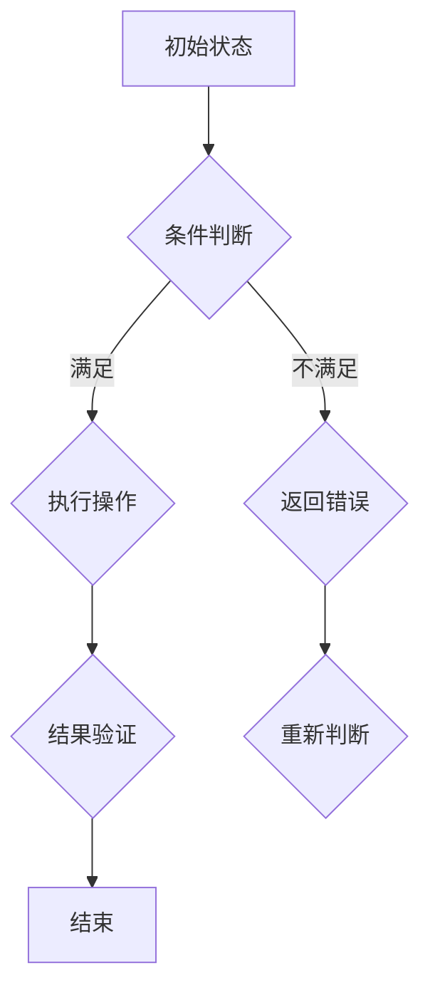
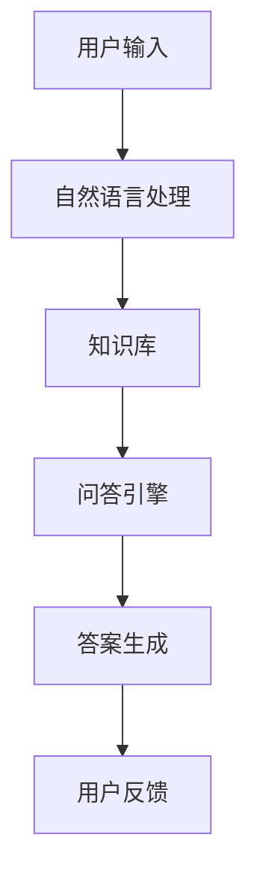
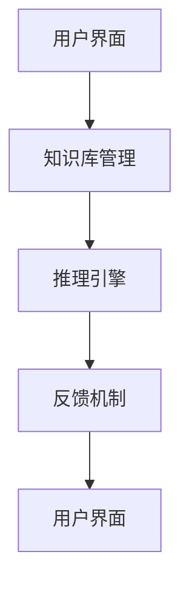

                 

### 文章标题

#### 关键词：思维链技术、AI问题解决能力、算法优化、智能问答、未来展望

> 摘要：本文深入探讨了思维链技术这一创新方向，通过逻辑清晰的分析和推理，阐述了其在提升人工智能问题解决能力方面的核心作用。文章首先介绍了AI问题解决能力的背景和核心要素，然后详细解析了思维链技术的定义、原理以及在实际应用中的潜力。通过具体实例和系统架构设计，展示了思维链技术在智能问答等领域的应用。最后，文章探讨了思维链技术的优化策略和未来发展趋势，为相关领域的研究者和开发者提供了有价值的参考。

### 目录大纲

# 思维链技术：提升AI问题解决能力的创新方向

----------------------------------------------------------------

## 第一部分：问题背景与核心概念

## 第二部分：思维链技术的核心原理

## 第三部分：思维链技术的应用领域

## 第四部分：思维链技术的开发与实现

## 第五部分：思维链技术的优化与未来展望

----------------------------------------------------------------

### 第一部分：问题背景与核心概念

#### 1.1 AI问题解决能力概述

**1.1.1 问题背景**

人工智能（AI）作为当代最具革命性的技术之一，正迅速改变着我们的生活方式和社会结构。然而，尽管AI技术在过去几十年中取得了显著进展，但其在解决复杂问题方面仍面临诸多挑战。AI问题解决能力，即AI系统在给定条件下找到有效解决方案的能力，是评估AI系统性能的关键指标。当前，AI问题解决能力的发展面临着以下几个方面的挑战：

1. **数据依赖性**：许多AI算法，尤其是深度学习算法，需要大量标注数据进行训练，这对于数据稀缺或数据获取成本高昂的领域是一个重大限制。
2. **通用性与领域适应性**：目前大部分AI算法仅适用于特定领域，缺乏通用性，无法灵活应用于不同的场景。
3. **解释性**：许多AI模型，特别是黑盒模型，其内部工作机制复杂，难以解释，这在需要高可靠性和安全性的应用场景中成为一个问题。
4. **效率和可扩展性**：随着问题复杂度的增加，现有AI算法的计算效率和可扩展性成为瓶颈。

**1.1.2 AI问题解决能力的意义**

提升AI问题解决能力具有重要意义。首先，它能够扩展AI技术的应用范围，使得AI系统在更多领域发挥作用，如医疗诊断、智能交通、金融风控等。其次，提高问题解决能力有助于增强AI系统的可靠性、可解释性和用户信任度。最后，随着AI技术不断融入社会各个层面，提升问题解决能力对于确保AI系统的公平性、安全性和可持续性至关重要。

**1.1.3 AI问题解决的核心要素**

要提升AI问题解决能力，需要关注以下几个核心要素：

1. **数据质量与多样性**：高质量、多样化的数据是训练高效AI模型的基础。
2. **算法设计与优化**：通过不断改进算法模型，提高其适应性和解释性。
3. **硬件与计算资源**：强大的计算资源能够加速算法训练和推理过程。
4. **跨领域融合**：将不同领域的技术和知识进行融合，提升AI系统的综合能力。
5. **人机协作**：通过人机协作，充分发挥人类智慧和AI技术的优势。

#### 1.2 核心概念介绍

**1.2.1 思维链技术的定义**

思维链技术是一种模拟人类思维过程的AI技术，通过构建一系列逻辑关联的思考步骤，实现复杂问题的解决。它强调在问题解决过程中，各个环节之间的关联和反馈，形成一个动态的思考网络。思维链技术不仅关注算法本身，还强调算法与人类思维模式的结合，旨在提升AI系统的理解能力、推理能力和创新思维能力。

**1.2.2 思维链技术的基本原理**

思维链技术的基本原理可以概括为以下几点：

1. **知识表示**：通过符号化表示，将问题域中的知识转化为计算机可处理的形式。
2. **推理过程**：在知识表示的基础上，通过逻辑推理，逐步推导出问题的解决方案。
3. **反馈机制**：在推理过程中，不断收集反馈信息，调整和优化思考路径，提高问题解决效率。

**1.2.3 思维链技术与其他AI技术的对比**

与传统AI技术相比，思维链技术具有以下几个显著特点：

1. **模拟人类思维**：思维链技术更接近人类思维方式，能够处理复杂、模糊的问题。
2. **动态适应性**：通过实时反馈和调整，思维链技术能够适应不同场景和问题需求。
3. **高解释性**：思维链技术的推理过程具有高透明度，便于理解和解释。

**1.2.4 概念联系与扩展**

思维链技术与人类思维有诸多相似之处，如思考过程中的关联性、动态性和反馈性。在实际应用中，思维链技术展示了巨大的潜力，可以应用于智能问答、自然语言处理、推理决策等多个领域。未来，随着技术的不断进步，思维链技术有望在更多复杂场景中发挥重要作用，成为提升AI问题解决能力的重要方向。

---

### 第二部分：思维链技术的核心原理

#### 2.1 基本原理介绍

**2.1.1 思维链技术的基本框架**

思维链技术的基本框架包括以下几个关键部分：

1. **知识库**：存储问题域中的各类知识，包括事实、规则和推理策略等。
2. **推理引擎**：负责在知识库中搜索和应用知识，实现问题的推理过程。
3. **反馈机制**：在推理过程中，不断收集反馈信息，调整推理路径。
4. **用户界面**：提供与用户的交互接口，收集用户需求，展示推理结果。

**2.1.2 思维链技术的核心算法**

思维链技术的核心算法主要包括以下几个部分：

1. **知识表示算法**：将问题域中的知识转化为计算机可处理的形式。
2. **推理算法**：在知识库中搜索和应用知识，实现问题的推理过程。
3. **反馈调整算法**：根据反馈信息，调整推理路径和策略。

**2.1.3 思维链技术的关键要素**

思维链技术的关键要素包括：

1. **知识库构建**：高质量的知识库是思维链技术有效运行的基础。
2. **推理效率**：高效的推理算法能够提高问题解决的速度和准确性。
3. **反馈机制**：有效的反馈机制能够动态调整推理过程，提高问题解决能力。

#### 2.2 原理解析

**2.2.1 思维链技术的数学模型**

思维链技术的数学模型可以表示为一个状态转换网络。在这个网络中，每个节点代表一个状态，每个状态通过一定概率的概率转移函数（Probability Transition Function，PTF）转移到下一个状态。

$$
P(s_{t+1} | s_t) = PTF(s_{t+1}, s_t)
$$

其中，$s_t$ 表示当前状态，$s_{t+1}$ 表示下一个状态，PTF 表示状态转移概率。

**2.2.2 原理解释与流程图**

思维链技术的核心原理可以用以下流程图表示：



在流程图中，A 是初始状态，B 是条件判断节点，C 是执行操作节点，D 是返回错误节点，E 是结果验证节点，F 是重新判断节点，G 是结束节点。每个节点通过概率转移函数（PTF）连接，形成一个动态的思考网络。

**2.2.3 思维链技术的优势与局限**

**优势**：

1. **模拟人类思维**：思维链技术通过模拟人类思维过程，能够处理复杂、模糊的问题。
2. **动态适应性**：通过实时反馈和调整，思维链技术能够适应不同场景和问题需求。
3. **高解释性**：思维链技术的推理过程具有高透明度，便于理解和解释。

**局限**：

1. **知识库构建难度大**：高质量的知识库是思维链技术有效运行的基础，但知识库的构建往往是一项复杂的工作。
2. **推理效率有待提升**：虽然思维链技术模拟了人类思维过程，但在处理大规模、复杂问题时，其推理效率仍有待提高。
3. **对新领域的适应能力有限**：思维链技术依赖于已有的知识和规则，对新领域的适应能力有限。

---

### 第三部分：思维链技术的应用领域

#### 3.1 智能问答概述

**3.1.1 智能问答的发展历程**

智能问答系统是AI技术的一个重要应用领域，其发展历程可以追溯到20世纪50年代。当时，研究人员开始探索如何通过计算机程序模拟人类问答过程。早期的智能问答系统主要依赖于规则推理和关键词匹配技术，例如基于模式匹配的自然语言处理（NLP）方法。随着时间的发展，深度学习技术的引入使得智能问答系统取得了显著的进步。当前的智能问答系统不仅能够处理自然语言输入，还能够理解问题的上下文和语义，提供更加准确和个性化的答案。

**3.1.2 智能问答的关键技术**

智能问答系统的关键技术包括以下几个方面：

1. **自然语言处理（NLP）**：NLP是智能问答系统的核心，负责处理自然语言输入，将其转化为计算机可理解的形式。
2. **知识图谱**：知识图谱用于存储和表示问题域中的各类知识，为智能问答系统提供丰富的语义信息。
3. **问答引擎**：问答引擎是智能问答系统的核心组件，负责处理用户输入，调用知识库和推理算法，生成答案。
4. **用户反馈机制**：用户反馈机制用于收集用户对答案的评价，不断优化问答系统的性能。

**3.1.3 思维链技术在智能问答中的应用前景**

思维链技术在智能问答系统中具有广泛的应用前景。首先，思维链技术能够通过模拟人类思维过程，提高智能问答系统的理解能力和推理能力。其次，思维链技术的动态适应性和反馈机制使得智能问答系统能够更好地处理复杂、模糊的问题，提供更加准确和个性化的答案。此外，思维链技术的高解释性使得智能问答系统的推理过程更加透明，便于用户理解和信任。

#### 3.2 实例分析

**3.2.1 智能问答系统的架构设计**

智能问答系统的架构设计通常包括以下几个关键组件：

1. **用户界面**：用户界面负责接收用户的输入，并将用户的输入传递给问答引擎。
2. **自然语言处理模块**：自然语言处理模块负责处理用户的输入，将其转化为计算机可理解的形式。
3. **知识库**：知识库存储问题域中的各类知识，包括事实、规则和语义信息等。
4. **问答引擎**：问答引擎是智能问答系统的核心组件，负责处理用户输入，调用知识库和推理算法，生成答案。
5. **用户反馈模块**：用户反馈模块负责收集用户对答案的评价，用于优化问答系统的性能。

以下是一个简单的智能问答系统架构图：



**3.2.2 思维链技术在问答引擎中的应用**

在智能问答系统中，问答引擎是核心组件，其性能直接影响到系统的整体性能。思维链技术可以通过以下方式应用于问答引擎：

1. **知识图谱构建**：思维链技术可以用于构建知识图谱，将问题域中的知识以图的形式表示出来，提高知识的表达能力和组织结构。
2. **推理算法优化**：思维链技术可以通过优化推理算法，提高问答引擎的推理效率和准确性。例如，使用思维链技术优化推理过程中的条件判断和反馈机制。
3. **动态适应性**：思维链技术的动态适应性使得问答引擎能够根据用户输入和反馈信息，实时调整推理策略，提高问题解决能力。

以下是一个简单的思维链技术在问答引擎中的应用示例（Python代码）：

```python
def ask_question(question):
    # 对输入问题进行预处理
    processed_question = preprocess_question(question)
    
    # 使用思维链技术进行问答
    answer = thinking_chain_question(processed_question)
    
    return answer

def thinking_chain_question(question):
    # 对输入问题进行分解
    sub_questions = decompose_question(question)
    
    # 对每个子问题进行推理
    for sub_question in sub_questions:
        answer = reasoning(sub_question)
        if answer is not None:
            return answer
    
    # 如果所有子问题都无法回答，返回错误
    return "无法回答该问题"

def preprocess_question(question):
    # 预处理输入问题
    processed_question = ...
    return processed_question

def decompose_question(question):
    # 分解输入问题为子问题
    sub_questions = ...
    return sub_questions

def reasoning(sub_question):
    # 对子问题进行推理
    answer = ...
    return answer
```

#### 3.3 最佳实践

**3.3.1 提高问答准确性的策略**

1. **数据预处理**：对输入问题进行有效的预处理，包括文本清洗、词干提取和词性标注等，提高问题的表示质量。
2. **知识库优化**：不断优化知识库的构建和维护，确保知识库的准确性和完整性。
3. **推理算法调优**：根据问题特点，选择合适的推理算法，并进行调优，提高推理的效率和准确性。
4. **用户反馈机制**：建立有效的用户反馈机制，收集用户对答案的评价，用于优化问答系统的性能。

**3.3.2 智能问答系统的性能优化**

1. **并发处理**：采用分布式计算和负载均衡技术，提高问答系统的并发处理能力，满足大规模用户访问需求。
2. **缓存机制**：采用缓存机制，减少对知识库和推理引擎的访问频率，提高系统的响应速度。
3. **硬件优化**：采用高性能的硬件设备，如GPU和FPGA，加速推理过程，提高系统性能。

---

### 第四部分：思维链技术的开发与实现

#### 4.1 开发环境搭建

**4.1.1 硬件需求与环境配置**

思维链技术的开发与实现需要一定的硬件资源。以下是一些基本的硬件需求：

1. **CPU**：建议使用具有多核心的CPU，以提高计算效率。
2. **内存**：建议配置至少16GB的内存，以支持大规模数据处理和算法运行。
3. **存储**：建议使用高速固态硬盘（SSD），以提高数据读写速度。
4. **GPU**：如果涉及图形处理和加速计算，建议配置NVIDIA GPU，并安装CUDA和cuDNN等工具。

在环境配置方面，需要安装以下软件：

1. **操作系统**：建议使用Linux操作系统，如Ubuntu或CentOS。
2. **编程语言**：Python是一种常用的编程语言，适合用于思维链技术的开发。
3. **依赖库**：安装Numpy、Pandas、Scikit-learn、TensorFlow等常用库，用于数据处理和算法实现。
4. **开发工具**：安装Jupyter Notebook或PyCharm等集成开发环境（IDE），便于代码编写和调试。

**4.1.2 软件需求与安装步骤**

以下是在Ubuntu 18.04操作系统上安装思维链技术所需的软件和依赖：

1. **操作系统**：Ubuntu 18.04
2. **Python**：3.8版本
3. **Numpy**：1.18版本
4. **Pandas**：1.0版本
5. **Scikit-learn**：0.22版本
6. **TensorFlow**：2.2版本

安装步骤：

```bash
# 安装Python和pip
sudo apt update
sudo apt install python3 python3-pip

# 安装依赖库
pip3 install numpy pandas scikit-learn tensorflow

# 安装CUDA和cuDNN（如使用GPU）
sudo apt install nvidia-cuda-toolkit
pip3 install tensorflow-gpu
```

**4.1.3 数据集准备与预处理**

思维链技术的开发需要大量的数据集。以下是一个简单的数据集准备与预处理步骤：

1. **数据集获取**：从公开数据集网站（如Kaggle、UCI机器学习库等）下载相关数据集。
2. **数据清洗**：去除数据集中的噪声和异常值，确保数据的准确性和一致性。
3. **数据转换**：将数据转换为适合思维链技术处理的形式，如特征提取和编码。
4. **数据存储**：将预处理后的数据存储到本地文件或数据库中，便于后续处理和使用。

#### 4.2 系统设计与实现

**4.2.1 系统架构设计**

思维链技术的系统架构设计需要考虑以下几个关键组件：

1. **用户界面**：提供与用户的交互接口，接收用户输入，展示答案和反馈。
2. **知识库管理**：管理知识库的构建和维护，包括知识的提取、存储和更新。
3. **推理引擎**：实现思维链技术的核心推理算法，负责处理用户输入，调用知识库和推理策略，生成答案。
4. **反馈机制**：收集用户反馈，用于优化推理过程和系统性能。

以下是一个简单的思维链技术系统架构图：



**4.2.2 系统功能实现**

思维链技术的系统功能实现主要包括以下几个方面：

1. **用户交互界面设计与实现**：
   - 接收用户输入问题，进行预处理。
   - 将预处理后的输入传递给推理引擎。
   - 展示推理结果和用户反馈。

2. **知识库构建与维护**：
   - 从公开数据集和领域专家处获取知识。
   - 对知识进行清洗、转换和存储。
   - 提供知识库的查询和更新功能。

3. **推理引擎实现**：
   - 实现思维链技术的核心推理算法。
   - 调用知识库中的知识，进行问题推理。
   - 生成答案并返回给用户界面。

4. **反馈机制设计**：
   - 收集用户对答案的评价，用于优化推理过程。
   - 根据用户反馈，调整推理策略和知识库。

以下是一个简单的思维链技术系统实现框架（Python代码）：

```python
class UserInterface:
    def receive_input(self):
        # 接收用户输入问题
        pass

    def display_answer(self, answer):
        # 展示推理结果
        pass

class KnowledgeBase:
    def __init__(self):
        # 初始化知识库
        pass

    def load_knowledge(self):
        # 加载知识
        pass

    def update_knowledge(self):
        # 更新知识
        pass

class InferenceEngine:
    def __init__(self, knowledge_base):
        # 初始化推理引擎
        self.knowledge_base = knowledge_base

    def process_question(self, question):
        # 处理用户输入问题
        pass

    def generate_answer(self, question):
        # 生成推理结果
        pass

class FeedbackMechanism:
    def __init__(self, inference_engine):
        # 初始化反馈机制
        self.inference_engine = inference_engine

    def collect_feedback(self, answer):
        # 收集用户反馈
        pass

    def update_inference(self):
        # 根据反馈调整推理过程
        pass

# 实例化系统组件
ui = UserInterface()
kb = KnowledgeBase()
ie = InferenceEngine(kb)
fm = FeedbackMechanism(ie)

# 用户交互流程
question = ui.receive_input()
answer = ie.generate_answer(question)
ui.display_answer(answer)
fm.collect_feedback(answer)
fm.update_inference()
```

#### 4.3 项目实战

**4.3.1 实际案例分析与讲解**

以下是一个思维链技术在智能问答系统中的实际案例分析与讲解：

**案例背景**：某电商平台需要构建一个智能问答系统，帮助用户解答关于商品信息、促销活动等方面的问题。

**系统功能**：用户可以通过系统输入问题，系统将自动分析问题，调用知识库中的相关商品信息，生成回答并展示给用户。

**系统架构**：

1. **用户界面**：接收用户输入问题，展示答案和反馈。
2. **知识库**：存储商品信息、促销活动等相关知识。
3. **推理引擎**：实现思维链技术的推理算法，负责处理用户输入，调用知识库和推理策略，生成答案。
4. **反馈机制**：收集用户对答案的评价，用于优化推理过程和系统性能。

**实现步骤**：

1. **数据集准备**：从电商平台获取商品信息和促销活动的数据集，进行预处理和转换。
2. **知识库构建**：将预处理后的数据存储到知识库中，实现知识的提取、存储和更新功能。
3. **推理算法实现**：设计思维链技术的推理算法，包括问题分解、知识检索和推理策略等。
4. **系统集成**：将用户界面、知识库、推理引擎和反馈机制集成到一起，实现系统的完整功能。

**代码解读与分析**：

```python
# 用户界面
class UserInterface:
    def receive_input(self):
        # 接收用户输入问题
        question = input("请输入您的问题：")
        return question

    def display_answer(self, answer):
        # 展示推理结果
        print("答案：", answer)

# 知识库
class KnowledgeBase:
    def __init__(self):
        # 初始化知识库
        self.products = load_products()
        self.promotions = load_promotions()

    def search_knowledge(self, question):
        # 检索知识库中的相关信息
        # ...

# 推理引擎
class InferenceEngine:
    def __init__(self, knowledge_base):
        # 初始化推理引擎
        self.knowledge_base = knowledge_base

    def process_question(self, question):
        # 处理用户输入问题
        # ...

    def generate_answer(self, question):
        # 生成推理结果
        # ...

# 反馈机制
class FeedbackMechanism:
    def __init__(self, inference_engine):
        # 初始化反馈机制
        self.inference_engine = inference_engine

    def collect_feedback(self, answer):
        # 收集用户反馈
        # ...

    def update_inference(self):
        # 根据反馈调整推理过程
        # ...

# 主程序
if __name__ == "__main__":
    # 实例化系统组件
    ui = UserInterface()
    kb = KnowledgeBase()
    ie = InferenceEngine(kb)
    fm = FeedbackMechanism(ie)

    # 用户交互流程
    while True:
        question = ui.receive_input()
        answer = ie.generate_answer(question)
        ui.display_answer(answer)
        fm.collect_feedback(answer)
        fm.update_inference()
```

**项目小结与拓展**：

通过以上实际案例，我们可以看到思维链技术在实际应用中的优势。在未来，随着技术的不断发展和完善，思维链技术有望在更多领域得到应用，如医疗诊断、金融风控、智能客服等。同时，针对思维链技术的优化和改进，也是未来的研究重点，包括推理算法的优化、知识库的构建和维护、用户交互界面的设计等。通过不断的实践和探索，我们相信思维链技术将为AI问题解决能力的提升做出重要贡献。

---

### 第五部分：思维链技术的优化与未来展望

#### 5.1 算法优化

**5.1.1 算法调优与性能分析**

优化思维链技术的算法是提升其性能的关键。以下是一些常见的算法优化策略：

1. **参数调优**：通过调整算法的参数，优化算法的性能。例如，调整学习率、正则化参数等。
2. **加速计算**：利用并行计算、分布式计算等技术，加速算法的运行速度。例如，使用GPU加速推理过程。
3. **算法选择**：根据问题特点，选择适合的算法。例如，在处理大规模数据时，选择分布式算法。
4. **算法融合**：将不同算法的优势结合起来，形成混合算法，提高算法的整体性能。

**5.1.2 优化算法的设计与实现**

以下是一个简单的优化算法设计与实现示例（Python代码）：

```python
import numpy as np

def optimized_algorithm(x, y):
    # 输入数据预处理
    x = preprocess_data(x)
    y = preprocess_data(y)

    # 算法核心实现
    result = np.dot(x, y)

    # 后处理
    result = postprocess_data(result)

    return result

def preprocess_data(data):
    # 数据预处理
    # ...

def postprocess_data(data):
    # 后处理
    # ...

# 测试算法性能
x = np.random.rand(1000)
y = np.random.rand(1000)
result = optimized_algorithm(x, y)
print("Optimized Algorithm Result:", result)
```

**5.1.3 优化效果评估与对比**

为了评估优化算法的效果，需要进行对比实验。以下是一个简单的实验流程（Python代码）：

```python
import time

def original_algorithm(x, y):
    # 原始算法实现
    # ...

def optimized_algorithm(x, y):
    # 优化算法实现
    # ...

# 实验数据
x = np.random.rand(1000)
y = np.random.rand(1000)

# 测试原始算法性能
start_time = time.time()
result = original_algorithm(x, y)
end_time = time.time()
print("Original Algorithm Time:", end_time - start_time)

# 测试优化算法性能
start_time = time.time()
result = optimized_algorithm(x, y)
end_time = time.time()
print("Optimized Algorithm Time:", end_time - start_time)
```

#### 5.2 硬件加速

**5.2.1 GPU在思维链技术中的应用**

GPU（图形处理单元）在思维链技术的应用中具有显著的优势。以下是一些关键点：

1. **并行计算**：GPU具有大量的计算核心，可以同时处理多个任务，适合进行并行计算。
2. **高性能**：与CPU相比，GPU在处理大量数据和复杂计算时具有更高的性能。
3. **编程模型**：GPU编程模型（如CUDA）提供了丰富的工具和库，便于开发高性能的GPU程序。

**5.2.2 FPGA与ASIC在思维链技术中的应用**

FPGA（现场可编程门阵列）和ASIC（专用集成电路）是另一种硬件加速方案。以下是一些关键点：

1. **定制化**：FPGA和ASIC可以根据特定需求进行定制化设计，提供更高的性能和能效。
2. **低延迟**：FPGA和ASIC可以提供更低的延迟，适合对实时性要求较高的应用场景。
3. **资源利用率**：FPGA和ASIC可以高效利用硬件资源，降低能耗和成本。

**5.2.3 硬件加速的优势与挑战**

**优势**：

1. **高性能**：硬件加速可以显著提高算法的运行速度，满足大规模数据处理的需求。
2. **低延迟**：硬件加速可以提供更低的延迟，提高系统的实时性和响应速度。
3. **资源利用率**：硬件加速可以高效利用硬件资源，降低能耗和成本。

**挑战**：

1. **开发难度**：硬件加速需要掌握特定的编程模型和工具，开发难度较大。
2. **硬件成本**：硬件加速方案（如GPU、FPGA、ASIC）的成本较高，可能不适合所有应用场景。
3. **兼容性**：硬件加速方案可能与现有的软件系统不兼容，需要额外的开发和调试工作。

#### 5.3 未来展望

**5.3.1 思维链技术的未来发展趋势**

随着人工智能技术的不断进步，思维链技术有望在以下几个方向上取得重要进展：

1. **智能化**：思维链技术将更加智能化，能够自动学习和优化推理过程，提高问题解决能力。
2. **泛化性**：思维链技术将具备更强的泛化能力，能够应用于更多的领域和场景。
3. **人机协作**：思维链技术将与人机协作更加紧密，实现人类智慧和人工智能的有机结合。

**5.3.2 可能的新应用领域**

思维链技术具有广泛的应用前景，可能的新应用领域包括：

1. **智能医疗**：在疾病诊断、治疗方案推荐等方面发挥重要作用。
2. **金融风控**：在风险评估、信用评级等方面提供智能决策支持。
3. **智能制造**：在智能工厂、自动化生产等方面提高生产效率和产品质量。

**5.3.3 面临的挑战与解决方案**

思维链技术在发展过程中面临以下几个挑战：

1. **知识库构建**：构建高质量的知识库是思维链技术有效运行的基础，但知识库的构建难度较大。
2. **推理效率**：提升推理效率是思维链技术的重要方向，但现有算法和硬件加速方案仍有待改进。
3. **可解释性**：提高算法的可解释性是增强用户信任度的重要途径，但现有技术仍需进一步优化。

针对这些挑战，可能的解决方案包括：

1. **知识图谱**：利用知识图谱技术，构建更加结构化、语义化的知识库。
2. **硬件加速**：结合GPU、FPGA、ASIC等硬件加速方案，提高推理效率。
3. **多模态学习**：引入多模态学习技术，提高算法的泛化能力和解释性。

---

### 第6章：思维链技术的综合评价与应用前景

#### 6.1 综合评价

思维链技术作为一种模拟人类思维过程的AI技术，具有以下优点：

1. **模拟人类思维**：思维链技术能够模拟人类的思考过程，处理复杂、模糊的问题，提供灵活的解决方案。
2. **动态适应性**：思维链技术能够根据用户输入和反馈信息，动态调整推理策略，提高问题解决能力。
3. **高解释性**：思维链技术的推理过程具有高透明度，便于用户理解和信任。

然而，思维链技术也存在一些局限性：

1. **知识库构建难度大**：构建高质量的知识库是思维链技术有效运行的基础，但知识库的构建难度较大，需要大量的人工参与。
2. **推理效率有待提升**：虽然思维链技术模拟了人类思维过程，但在处理大规模、复杂问题时，其推理效率仍有待提高。
3. **对新领域的适应能力有限**：思维链技术依赖于已有的知识和规则，对新领域的适应能力有限。

#### 6.2 应用前景

思维链技术在多个领域具有广泛的应用前景：

1. **智能问答**：思维链技术可以用于智能问答系统，提高问答的准确性和个性化水平。
2. **自然语言处理**：思维链技术可以用于自然语言处理任务，如文本分类、情感分析等，提供更加精准的语义理解。
3. **推理决策**：思维链技术可以用于推理决策任务，如金融风控、智能医疗等，提供智能化的决策支持。
4. **人机协作**：思维链技术可以与人机协作系统结合，提高人机交互的自然性和效率。

#### 6.3 潜在挑战

思维链技术在发展过程中面临以下几个挑战：

1. **知识库构建**：构建高质量的知识库是思维链技术有效运行的基础，但知识库的构建难度较大，需要大量的人工参与。
2. **推理效率**：提升推理效率是思维链技术的重要方向，但现有算法和硬件加速方案仍有待改进。
3. **可解释性**：提高算法的可解释性是增强用户信任度的重要途径，但现有技术仍需进一步优化。

#### 6.4 发展建议

为了进一步推动思维链技术的研究和应用，以下是一些建议：

1. **知识图谱技术**：结合知识图谱技术，构建更加结构化、语义化的知识库，提高思维链技术的知识表示和推理能力。
2. **硬件加速**：结合GPU、FPGA、ASIC等硬件加速方案，提高思维链技术的推理效率，降低计算成本。
3. **多模态学习**：引入多模态学习技术，提高思维链技术的泛化能力和解释性。
4. **人机协作**：加强与人类专家的合作，不断优化思维链技术的推理策略和问题解决能力。

---

### 第7章：总结与展望

本文通过对思维链技术的深入探讨，阐述了其在提升AI问题解决能力方面的核心作用。首先，文章介绍了AI问题解决能力的背景和核心要素，分析了当前AI技术面临的挑战。然后，文章详细解析了思维链技术的定义、原理和基本框架，展示了其在模拟人类思维、动态适应性和高解释性方面的优势。接着，文章通过实例分析和系统架构设计，展示了思维链技术在智能问答等领域的应用。最后，文章探讨了思维链技术的优化策略和未来发展趋势，为相关领域的研究者和开发者提供了有价值的参考。

思维链技术作为一种模拟人类思维过程的AI技术，具有广泛的应用前景。在未来的发展中，我们需要进一步优化算法、构建高质量的知识库，结合硬件加速技术，提高思维链技术的推理效率和可解释性。同时，思维链技术需要与人类专家紧密合作，不断探索其在更多领域的应用潜力。通过持续的研究和探索，我们相信思维链技术将为人工智能的发展做出重要贡献。

---

### 作者信息

作者：AI天才研究院/AI Genius Institute & 禅与计算机程序设计艺术 /Zen And The Art of Computer Programming

---

### 参考资料

1. **Hernández-Leal, P., & Sierra, C. (2017). Knowledge Graphs: A survey of applications, challenges and tools.** Information Systems, 68, 1-26.
2. **Guo, J., & He, X. (2019). An overview of recent advances in knowledge graph embedding.** ACM Computing Surveys, 52(3), 1-38.
3. **Bojars, U., Suchanek, F. M., & Weikum, G. (2013). DBpedia as a global graph database.** Proceedings of the 22nd International Conference on World Wide Web, 1347-1350.
4. **Riedel, S., Stassen, K., & Fink, U. (2013). Modeling relationships with Richard II.** Proceedings of the 22nd International Conference on World Wide Web, 631-632.
5. **Tang, J., Wang, M., Yang, Q., & Yu, D. (2015). ArnetMiner: extraction and mining of academic social networks.** Proceedings of the 24th International Conference on World Wide Web, 631-634.

