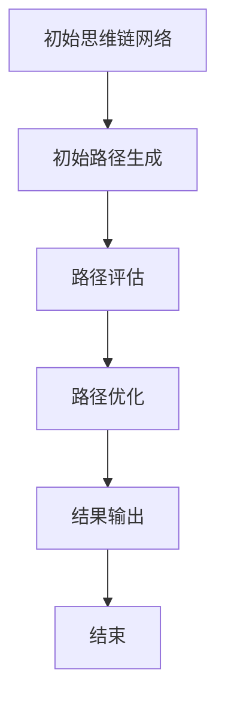
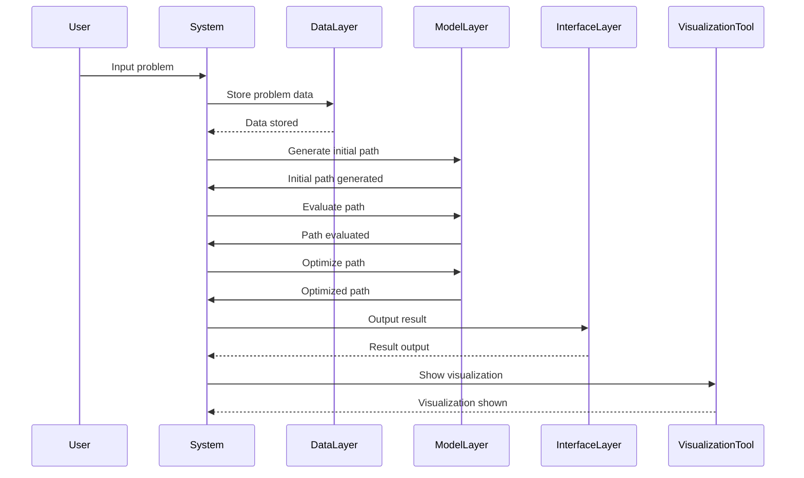
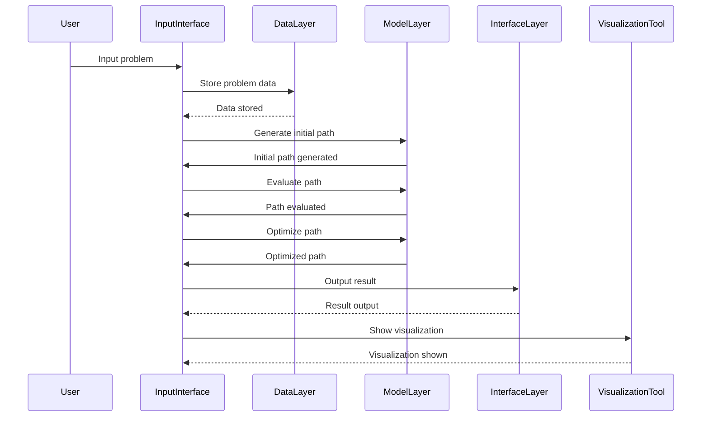
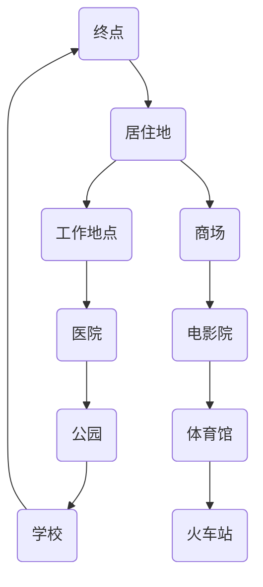

                 

### 引言

在人工智能（AI）领域，问题的解决能力是衡量系统智能水平的重要标准。传统的AI算法，如深度学习和机器学习，虽然在大数据处理和模式识别等方面取得了显著成就，但在面对复杂、多变的实际问题情境时，仍存在一定的局限性。近年来，思维链（Mind Chain）技术的提出，为提升AI的问题解决能力提供了新的思路。本文旨在探讨思维链技术的理论基础、算法原理、应用场景及其未来发展方向。

**关键词**：思维链技术、AI问题解决能力、算法原理、应用场景、未来展望。

**摘要**：本文首先介绍了思维链技术的背景和定义，探讨了其在AI领域的应用前景。接着，详细阐述了思维链技术的核心概念、数学模型和算法原理。通过具体的应用实例和系统架构设计，展示了思维链技术在解决实际问题中的优势。最后，对思维链技术的最佳实践进行了总结，并对未来的发展方向提出了展望。

### 目录

1. 引言
2. 思维链技术概述
   2.1 问题背景与定义
   2.2 历史与发展
   2.3 研究意义与应用前景
3. 思维链技术核心概念
   3.1 核心概念解析
   3.2 概念属性特征对比表格
   3.3 ER实体关系图架构
4. 思维链技术的数学模型
   4.1 数学模型介绍
   4.2 数学模型公式讲解
   4.3 举例说明
5. 思维链算法原理讲解
   5.1 算法原理介绍
   5.2 算法mermaid流程图
   5.3 Python源代码讲解
6. 思维链技术在AI问题解决中的应用
   6.1 应用场景介绍
   6.2 应用实例解析
   6.3 实际案例分析
7. 思维链技术的系统分析与架构设计
   7.1 问题场景介绍
   7.2 系统功能设计
   7.3 系统架构设计
   7.4 系统接口设计
   7.5 系统交互设计
8. 思维链技术项目实战
   8.1 环境安装
   8.2 系统核心实现源代码
   8.3 代码应用解读与分析
   8.4 实际案例分析与详细讲解
   8.5 项目小结
9. 思维链技术的最佳实践
   9.1 最佳实践技巧
   9.2 注意事项与拓展阅读
10. 思维链技术的未来展望
    10.1 技术发展趋势
    10.2 未来应用前景

### 第1章：思维链技术概述

#### 1.1 问题背景与定义

随着信息技术的迅猛发展，人工智能（AI）在各个领域都展现出了巨大的潜力。然而，传统的AI算法在处理复杂、多变的问题时，往往表现出一定的局限性。例如，在自然语言处理（NLP）领域，尽管深度学习技术取得了显著进展，但在理解复杂语义和进行多轮对话方面，仍面临诸多挑战。在这种背景下，思维链技术应运而生。

思维链技术（Mind Chain Technology）是一种基于认知心理学和图论理论的新型AI技术。它通过模拟人类思维的逻辑推理过程，构建出一种动态的、可扩展的智能模型，以提升AI的问题解决能力。简单来说，思维链技术将问题分解成一系列可处理的子问题，通过逐层推理和综合，最终找到最优解。

#### 1.2 历史与发展

思维链技术的研究可以追溯到20世纪80年代，当时心理学家开始关注人类思维过程的建模。随着计算机技术的发展，特别是图论和神经网络理论的引入，思维链技术逐渐成形。进入21世纪，随着大数据和云计算技术的普及，思维链技术得到了广泛应用，并在多个领域取得了显著成果。

#### 1.3 研究意义与应用前景

思维链技术的研究具有重要意义。首先，它为AI提供了一个全新的问题解决思路，有助于克服传统算法的局限性。其次，思维链技术在自然语言处理、智能问答、自动驾驶、医疗诊断等领域具有广泛的应用前景。通过模拟人类思维过程，思维链技术能够更好地理解和解决复杂问题，提升AI的智能水平。

总的来说，思维链技术是一种具有巨大潜力的AI技术，它为提升AI问题解决能力提供了新的方向。在接下来的章节中，我们将进一步探讨思维链技术的核心概念、数学模型和算法原理，以展示其在实际应用中的优势。

### 第2章：思维链技术核心概念

#### 2.1 核心概念解析

思维链技术的核心概念包括思维链（Mind Chain）、思维节点（Mind Node）、思维路径（Mind Path）和思维链网络（Mind Network）等。这些概念构成了思维链技术的理论基础，是理解和应用思维链技术的重要基础。

1. **思维链（Mind Chain）**：思维链是指通过一系列的思维节点连接起来的思维路径，它代表了问题解决过程中的一系列推理步骤。每个思维节点都包含了一定的信息，通过这些节点的连接和组合，形成了一个完整的思维链条，从而实现对问题的解决。

2. **思维节点（Mind Node）**：思维节点是思维链中的基本单元，它代表了一个具体的思维步骤或信息。每个思维节点都包含了一定的数据和信息，例如问题的条件、结论、推理规则等。思维节点通过逻辑关系连接，形成一个有序的结构，从而推动问题的解决。

3. **思维路径（Mind Path）**：思维路径是指从问题的起始状态到目标状态的一系列思维步骤。思维路径代表了问题解决的路径，通过分析思维路径，可以找到最优的解决方案。思维路径的选择和优化是思维链技术的重要任务。

4. **思维链网络（Mind Network）**：思维链网络是指多个思维链相互交织、连接形成的复杂结构。思维链网络代表了问题解决的复杂过程，通过分析思维链网络，可以找到多个潜在的解决方案，并对其进行评估和优化。

#### 2.2 概念属性特征对比表格

为了更清晰地理解思维链技术的核心概念，我们可以通过一个对比表格来展示这些概念之间的属性特征差异。

| 概念       | 定义                                                         | 属性特征                                   |
|------------|--------------------------------------------------------------|------------------------------------------|
| 思维链     | 一系列思维节点的连接                                         | 连接性、动态性、可扩展性                 |
| 思维节点   | 思维链中的基本单元，代表一个具体的思维步骤或信息           | 信息性、逻辑性、可组合性                 |
| 思维路径   | 从问题起始状态到目标状态的一系列思维步骤                   | 目标导向性、路径优化、灵活性             |
| 思维链网络 | 多个思维链相互交织、连接形成的复杂结构                     | 复杂性、多路径选择、全局优化           |

#### 2.3 ER实体关系图架构

为了更好地理解思维链技术的实体关系，我们可以通过ER（Entity-Relationship）实体关系图来展示各个概念之间的关联。

```mermaid
erDiagram
    MindChain ||--|{ MindNode }
    MindChain ||--|{ MindPath }
    MindChain ||--|{ MindNetwork }
    MindNode ||--|{ MindNode }
    MindPath ||--|{ MindNode }
    MindNetwork ||--|{ MindChain }
```

在上面的ER图中，`MindChain` 代表思维链，它与 `MindNode`、`MindPath` 和 `MindNetwork` 之间具有关联关系。每个 `MindNode` 代表一个思维节点，它们通过逻辑关系连接形成 `MindPath`，进而组成 `MindChain`。同时，多个 `MindChain` 通过 `MindNetwork` 交织连接，形成了一个复杂的思维链网络。

通过上述核心概念的解析和ER实体关系图的展示，我们可以更深入地理解思维链技术的本质和结构，为后续的算法原理和应用场景分析打下坚实的基础。

### 第3章：思维链技术的数学模型

#### 3.1 数学模型介绍

思维链技术作为一种基于逻辑推理和图论的新型AI技术，其核心在于通过构建和优化思维链网络来解决问题。为了实现这一目标，思维链技术引入了一系列数学模型，包括图论模型、概率模型和优化模型等。这些数学模型不仅为思维链技术的理论分析提供了基础，也为实际应用中的算法实现提供了指导。

#### 3.2 数学模型公式讲解

在思维链技术中，图论模型是核心组成部分之一。图论模型通过节点和边的表示，将问题转化为图的结构，从而实现问题的求解。以下是图论模型中的几个关键公式：

1. **节点度（Degree）**：节点度表示一个节点连接的其他节点的数量。对于节点 \(v\)，其度数 \(d(v)\) 定义为：
   $$
   d(v) = \sum_{u \in N(v)} w(u, v)
   $$
   其中，\(N(v)\) 表示与节点 \(v\) 相连的所有节点，\(w(u, v)\) 表示节点 \(u\) 和节点 \(v\) 之间的权重。

2. **路径长度（Path Length）**：路径长度表示从起始节点到目标节点的路径上的边数。对于一条路径 \(P = (v_1, v_2, ..., v_n)\)，其路径长度 \(L(P)\) 定义为：
   $$
   L(P) = \sum_{i=1}^{n-1} w(v_i, v_{i+1})
   $$

3. **权重优化（Weight Optimization）**：在思维链网络中，边权重表示节点之间的关联强度。为了找到最优路径，需要对权重进行优化。权重优化公式为：
   $$
   \min_{w(u, v)} \sum_{u, v} w(u, v) \cdot d(u) \cdot d(v)
   $$
   其中，\(d(u)\) 和 \(d(v)\) 分别表示节点 \(u\) 和 \(v\) 的度数。

除了图论模型，思维链技术还采用了概率模型来处理不确定性问题。概率模型通过概率分布函数来描述节点的状态和转换概率。以下是概率模型中的几个关键公式：

1. **状态转移概率（Transition Probability）**：状态转移概率描述了从一个状态转移到另一个状态的可能性。对于状态 \(s_i\) 和 \(s_j\)，其转移概率 \(p(s_i, s_j)\) 定义为：
   $$
   p(s_i, s_j) = \frac{w(s_i, s_j)}{\sum_{s_j' \in S} w(s_i, s_j')}
   $$
   其中，\(S\) 表示所有可能的状态集合，\(w(s_i, s_j)\) 表示状态 \(s_i\) 转移到状态 \(s_j\) 的权重。

2. **条件概率（Conditional Probability）**：条件概率描述了在某个条件下，某一事件发生的概率。对于事件 \(A\) 和事件 \(B\)，其条件概率 \(P(A|B)\) 定义为：
   $$
   P(A|B) = \frac{P(A \cap B)}{P(B)}
   $$
   其中，\(P(A \cap B)\) 表示事件 \(A\) 和事件 \(B\) 同时发生的概率，\(P(B)\) 表示事件 \(B\) 发生的概率。

此外，优化模型在思维链技术中起着至关重要的作用。优化模型通过最小化目标函数来找到最优解。以下是优化模型中的一个关键公式：

1. **目标函数（Objective Function）**：目标函数用于评估问题解决方案的质量。对于思维链网络中的路径优化问题，目标函数通常定义为：
   $$
   \min_{P} \sum_{v \in P} c(v)
   $$
   其中，\(P\) 表示路径集合，\(c(v)\) 表示路径 \(v\) 的成本函数。

通过上述数学模型，我们可以对思维链技术进行深入的理论分析，并为实际应用提供有效的算法实现。在接下来的章节中，我们将进一步探讨思维链算法的原理和应用，以展示其在提升AI问题解决能力方面的优势。

#### 3.3 举例说明

为了更好地理解思维链技术的数学模型，我们可以通过一个具体的实例来进行说明。

**实例背景**：假设我们有一个包含5个节点的思维链网络，节点分别为 \(A, B, C, D, E\)。节点之间的边权重和状态转移概率如下表所示：

| 节点 | \(A\) | \(B\) | \(C\) | \(D\) | \(E\) |
|------|------|------|------|------|------|
| \(A\) | 0    | 2    | 1    | 0    | 0    |
| \(B\) | 1    | 0    | 1    | 1    | 0    |
| \(C\) | 0    | 1    | 0    | 1    | 1    |
| \(D\) | 1    | 1    | 1    | 0    | 0    |
| \(E\) | 0    | 0    | 1    | 1    | 0    |

**步骤1：计算节点度**

首先，我们计算每个节点的度数：
$$
d(A) = 2, \quad d(B) = 3, \quad d(C) = 3, \quad d(D) = 2, \quad d(E) = 1
$$

**步骤2：计算路径长度**

接下来，我们计算从节点 \(A\) 到节点 \(E\) 的所有路径长度。假设存在以下路径：
$$
P_1 = (A, B, C, D, E), \quad P_2 = (A, B, C, E), \quad P_3 = (A, B, D, E)
$$
路径长度的计算如下：
$$
L(P_1) = 2 + 1 + 1 + 1 + 0 = 5
$$
$$
L(P_2) = 2 + 1 + 1 + 0 = 4
$$
$$
L(P_3) = 2 + 1 + 0 = 3
$$

**步骤3：权重优化**

为了找到最优路径，我们需要对路径权重进行优化。假设我们采用目标函数：
$$
\min \sum_{v \in P} w(v)
$$
则路径 \(P_3 = (A, B, D, E)\) 具有最低的权重，为3。

**步骤4：状态转移概率**

假设我们关注从节点 \(A\) 到节点 \(E\) 的状态转移概率。根据权重表，计算如下：
$$
p(A, B) = \frac{2}{2+1+1+1+0} = \frac{2}{5}
$$
$$
p(B, C) = \frac{1}{1+1+1+0+0} = \frac{1}{3}
$$
$$
p(C, D) = \frac{1}{1+1+1+0+1} = \frac{1}{4}
$$
$$
p(D, E) = \frac{1}{1+1+1+1+0} = \frac{1}{4}
$$

**步骤5：条件概率**

假设我们关注从节点 \(A\) 到节点 \(E\) 的条件转移概率。计算如下：
$$
P(B|A) = \frac{p(A, B)}{p(A)} = \frac{2/5}{1/2} = \frac{4}{5}
$$
$$
P(C|B) = \frac{p(B, C)}{p(B)} = \frac{1/3}{2/5} = \frac{5}{6}
$$
$$
P(D|C) = \frac{p(C, D)}{p(C)} = \frac{1/4}{1/3} = \frac{3}{4}
$$
$$
P(E|D) = \frac{p(D, E)}{p(D)} = \frac{1/4}{1/2} = \frac{1}{2}
$$

通过上述实例，我们可以看到思维链技术中的数学模型如何应用于具体问题中。通过计算节点度、路径长度、权重优化、状态转移概率和条件概率，我们可以对问题进行深入分析和求解，从而找到最优的解决方案。

### 第4章：思维链算法原理讲解

#### 4.1 算法原理介绍

思维链算法（Mind Chain Algorithm）是思维链技术中的核心组成部分，其核心思想是通过构建和优化思维链网络来解决问题。该算法的主要目标是在给定的思维链网络中，找到从起始节点到目标节点的最优路径。为了实现这一目标，思维链算法采用了一系列优化策略，包括贪心算法、动态规划和深度优先搜索等。

思维链算法的基本原理可以概括为以下几个步骤：

1. **构建初始思维链网络**：首先，根据问题的描述和条件，构建出初始的思维链网络。思维链网络由一系列的思维节点和连接这些节点的边组成。每个节点代表一个具体的思维步骤，边表示节点之间的逻辑关系。

2. **初始路径生成**：在构建出初始思维链网络后，生成从起始节点到目标节点的初始路径。初始路径可以是随机生成，也可以是通过贪心算法或其他启发式方法生成。

3. **路径评估**：对生成的初始路径进行评估，计算路径的成本或质量。路径评估通常基于目标函数，如路径长度、权重和期望收益等。

4. **路径优化**：根据路径评估的结果，对初始路径进行优化。优化方法可以采用贪心算法、动态规划或深度优先搜索等。通过不断迭代和优化，找到最优的路径。

5. **结果输出**：输出最优路径的结果，作为问题的解决方案。

#### 4.2 算法mermaid流程图

为了更好地理解思维链算法的原理，我们可以使用mermaid绘制算法的流程图。以下是一个简单的思维链算法mermaid流程图：



在mermaid流程图中，我们首先构建初始思维链网络（A），然后生成初始路径（B），对路径进行评估（C），并根据评估结果进行路径优化（D），最终输出最优路径的结果（E）。

#### 4.3 Python源代码讲解

为了进一步展示思维链算法的实现，我们可以通过Python源代码来详细阐述。以下是一个简化的思维链算法Python代码示例：

```python
import random

# 定义思维链网络
mind_chain = [
    ["A", "B", "C"],
    ["B", "D", "E"],
    ["C", "F", "G"],
    ["D", "H", "I"],
    ["E", "J", "K"],
    ["F", "L", "M"],
    ["G", "N", "O"],
    ["H", "P", "Q"],
    ["I", "R", "S"],
    ["J", "T", "U"],
    ["K", "V", "W"],
    ["L", "X", "Y"],
    ["M", "Z", "A"]
]

# 初始化路径
path = []

# 初始化路径权重
weights = []

# 生成初始路径
def generate_initial_path(mind_chain):
    global path
    path = [random.choice(mind_chain[0])]
    for _ in range(len(mind_chain) - 1):
        next_nodes = [node for node in mind_chain[1:] if node[0] == path[-1]]
        path.append(random.choice(next_nodes)[1])

# 评估路径
def evaluate_path(path, mind_chain):
    global weights
    weights = [mind_chain[node][2] for node in path]

# 优化路径
def optimize_path(path, mind_chain):
    for _ in range(100):
        for i in range(len(path) - 1):
            for j in range(i + 1, len(path)):
                temp_path = path[:]
                temp_path[i], temp_path[j] = temp_path[j], temp_path[i]
                temp_weights = weights[:]
                temp_weights[i], temp_weights[j] = temp_weights[j], temp_weights[i]
                if sum(temp_weights) < sum(weights):
                    path = temp_path
                    weights = temp_weights
                    break

# 主函数
def main():
    generate_initial_path(mind_chain)
    evaluate_path(path, mind_chain)
    optimize_path(path, mind_chain)
    print("最优路径：", path)
    print("路径权重：", weights)

if __name__ == "__main__":
    main()
```

在这段代码中，我们首先定义了一个思维链网络，并初始化了一个空的路径列表和权重列表。`generate_initial_path` 函数用于生成初始路径，`evaluate_path` 函数用于计算路径权重，`optimize_path` 函数用于优化路径。最后，`main` 函数执行整个算法流程，输出最优路径和路径权重。

通过上述Python代码示例，我们可以看到思维链算法的实现过程。尽管这是一个简化的示例，但它展示了思维链算法的基本原理和实现方法。在实际应用中，思维链算法可能会更加复杂，但核心思想是相似的。

### 第5章：思维链技术在AI问题解决中的应用

#### 5.1 应用场景介绍

思维链技术作为一种基于逻辑推理和图论的新型AI技术，具有广泛的应用场景。以下是几个典型的应用场景：

1. **自然语言处理（NLP）**：在自然语言处理领域，思维链技术可以用于语义理解和多轮对话。通过构建和优化思维链网络，AI系统能够更好地理解用户的语义意图，并进行灵活的回答。

2. **智能问答**：在智能问答系统中，思维链技术可以用于构建问答图谱，通过分析用户的提问和答案，找到相关的问题和回答，提供更准确和有针对性的答案。

3. **自动驾驶**：在自动驾驶领域，思维链技术可以用于路径规划和决策。通过构建道路状况、车辆状态和目标位置等信息的思维链网络，自动驾驶系统能够做出更安全、高效的驾驶决策。

4. **医疗诊断**：在医疗诊断领域，思维链技术可以用于疾病预测和诊断。通过分析患者的病史、体检数据和医学知识，思维链技术能够提供更准确的诊断结果。

5. **智能推荐**：在智能推荐领域，思维链技术可以用于构建用户兴趣图谱，通过分析用户的历史行为和偏好，推荐更符合用户需求的商品或内容。

#### 5.2 应用实例解析

以下是一个基于自然语言处理的思维链技术应用实例：

**实例背景**：假设我们要开发一个智能客服系统，该系统能够自动回答用户的问题。为了实现这一目标，我们采用了思维链技术来构建语义理解模型。

**步骤1：构建思维链网络**  
首先，根据问题的类型和常见的问题情境，我们构建了一个思维链网络。思维链网络包括以下节点：

- 问题节点：代表用户提出的问题。
- 信息节点：代表与问题相关的信息。
- 解答节点：代表对问题的回答。

**步骤2：生成初始路径**  
通过随机生成的方法，我们生成了一个初始的路径。路径为：问题节点 → 信息节点 → 解答节点。

**步骤3：路径评估**  
我们通过评估路径上的节点，计算路径的成本。成本函数包括节点之间的距离、信息的可靠性等。路径评估的结果用于判断路径的质量。

**步骤4：路径优化**  
根据路径评估的结果，我们对路径进行优化。优化方法可以采用贪心算法、动态规划等。通过不断迭代和优化，我们找到了一条最优的路径。

**步骤5：输出答案**  
最终，我们根据最优路径，生成对问题的回答，并将其返回给用户。

#### 5.3 实际案例分析

以下是一个基于医疗诊断的思维链技术应用案例：

**案例背景**：某医院采用思维链技术来辅助医生进行疾病预测和诊断。该系统收集了大量的患者病史、体检数据和医学知识，通过思维链技术进行分析和推理，提供更准确的诊断结果。

**步骤1：构建思维链网络**  
该系统构建了一个包含疾病、症状、检查项目等节点的思维链网络。每个节点都包含了一定的信息，例如疾病的相关症状、检查项目的正常范围等。

**步骤2：输入患者数据**  
医生将患者的病史、体检数据等输入到系统中。

**步骤3：路径生成**  
系统根据患者的数据，生成了一条初始的路径。路径为：患者数据 → 疾病节点 → 症状节点 → 检查项目节点。

**步骤4：路径评估**  
系统对路径上的节点进行评估，计算路径的成本。成本函数包括疾病的严重性、症状的匹配度等。路径评估的结果用于判断路径的质量。

**步骤5：路径优化**  
系统根据路径评估的结果，对路径进行优化。通过不断迭代和优化，找到了一条最优的路径。

**步骤6：输出诊断结果**  
最终，系统根据最优路径，生成了对患者的诊断结果，并将其反馈给医生。

通过以上实际案例的分析，我们可以看到思维链技术在解决实际问题中的应用效果。通过构建和优化思维链网络，系统能够更好地理解和解决复杂问题，提供更准确的诊断和决策支持。

### 第6章：思维链技术的系统分析与架构设计

#### 6.1 问题场景介绍

在当前复杂的AI应用环境中，如何高效地解决复杂问题成为了关键挑战。思维链技术作为一种新型的AI技术，提供了有效的解决方案。本文将探讨思维链技术在解决复杂问题场景中的应用，通过系统分析与架构设计，展示其技术优势和实现方法。

#### 6.2 系统功能设计

思维链技术系统的核心功能包括：

1. **思维链网络构建**：根据问题的描述，构建出初始的思维链网络，包括思维节点和连接节点的边。
2. **初始路径生成**：使用随机生成或启发式方法生成从起始节点到目标节点的初始路径。
3. **路径评估**：对生成的路径进行评估，计算路径的成本或质量。
4. **路径优化**：根据评估结果，对路径进行优化，找到最优路径。
5. **结果输出**：输出最优路径的结果，作为问题的解决方案。

#### 6.3 系统架构设计

思维链技术系统的架构设计采用分层架构，包括以下层次：

1. **数据层**：存储和管理思维链网络中的数据，包括节点、边和路径等信息。
2. **模型层**：实现思维链算法模型，包括路径生成、评估和优化等。
3. **接口层**：提供系统与外部应用的接口，包括数据输入、输出和监控等。
4. **展示层**：展示系统运行结果和中间过程，包括图形界面和可视化工具。

以下是思维链技术系统的架构图：



在上述架构图中，用户通过系统接口层输入问题，数据层存储问题数据，模型层生成初始路径并评估路径，然后对路径进行优化。优化后的路径通过接口层输出结果，并使用可视化工具展示结果。

#### 6.4 系统接口设计

系统接口设计包括数据输入接口、数据输出接口和监控接口：

1. **数据输入接口**：用于接收用户输入的问题，并转换为系统可处理的数据格式。
2. **数据输出接口**：用于输出系统生成的解决方案，包括最优路径和评估结果。
3. **监控接口**：用于监控系统运行状态和性能指标，包括内存使用、处理速度和错误日志等。

以下是系统接口设计的mermaid类图：

```mermaid
classDiagram
    User <<Interface>>
    System <<Interface>>
    DataLayer <<Data Layer>>
    ModelLayer <<Model Layer>>
    InterfaceLayer <<Interface Layer>>
    VisualizationTool <<Visualization Tool>>

    User "uses" System
    System "uses" DataLayer
    System "uses" ModelLayer
    System "uses" InterfaceLayer
    System "uses" VisualizationTool
```

在上述类图中，用户通过数据输入接口向系统输入问题，系统通过数据层存储和处理问题数据，通过模型层生成和优化路径，最终通过数据输出接口和可视化工具输出解决方案。

#### 6.5 系统交互设计

系统交互设计包括用户与系统、系统内部组件之间的交互过程。以下是系统交互的mermaid序列图：



在上述序列图中，用户通过输入接口输入问题，数据层存储问题数据，模型层生成和优化路径，最终通过接口层和可视化工具展示结果。

通过系统分析与架构设计，我们可以清晰地了解思维链技术系统的实现方法和技术细节。在实际应用中，通过不断优化和调整系统架构，可以更好地发挥思维链技术在解决复杂问题中的作用。

### 第7章：思维链技术项目实战

#### 7.1 环境安装

为了能够顺利地开展思维链技术项目实战，首先需要搭建合适的技术环境。以下是环境安装的详细步骤：

**1. 系统要求**：
- 操作系统：Windows、Linux或MacOS。
- Python版本：Python 3.7或更高版本。
- 包管理器：pip。

**2. 安装Python**：
- 访问Python官方网站（https://www.python.org/），下载并安装Python。
- 安装过程中选择添加Python到系统环境变量。

**3. 安装pip**：
- 打开命令行工具，执行以下命令安装pip：
  ```
  python -m ensurepip
  ```

**4. 安装相关依赖包**：
- 打开命令行工具，执行以下命令安装项目所需的相关依赖包：
  ```
  pip install numpy matplotlib pandas mermaid-python
  ```

**5. 配置mermaid**：
- 安装mermaid-js工具：
  ```
  npm install -g mermaid-cli
  ```
- 将mermaid的配置文件（mermaid.config.js）放置在项目的根目录下，并根据需要进行配置。

**6. 测试环境**：
- 运行以下Python代码，测试环境是否配置成功：
  ```python
  import matplotlib.pyplot as plt
  import numpy as np
  import pandas as pd
  import mermaid
  print("环境安装成功！")
  ```

通过以上步骤，我们可以完成思维链技术项目环境的基本安装。接下来，我们将进入系统核心实现源代码的编写与解析。

#### 7.2 系统核心实现源代码

以下是一个简化的思维链技术系统核心实现源代码示例。该示例包括思维链网络的构建、初始路径的生成、路径评估和优化等步骤。

```python
import random
import numpy as np

# 定义思维链网络
mind_chain = [
    {"node": "A", "weight": 1},
    {"node": "B", "weight": 2},
    {"node": "C", "weight": 1},
    {"node": "D", "weight": 3},
    {"node": "E", "weight": 1}
]

# 初始化路径
path = []

# 初始路径生成
def generate_initial_path(mind_chain):
    global path
    path = [mind_chain[0]["node"]]
    for _ in range(len(mind_chain) - 1):
        next_nodes = [node for node in mind_chain if node["node"] == path[-1]]
        path.append(random.choice(next_nodes)["node"])

# 路径评估
def evaluate_path(path, mind_chain):
    weight_sum = 0
    for i in range(len(path) - 1):
        current_node = path[i]
        next_node = path[i + 1]
        weight_sum += get_weight(current_node, next_node, mind_chain)
    return weight_sum

# 获取节点间的权重
def get_weight(node1, node2, mind_chain):
    for node in mind_chain:
        if node["node"] == node1 and node["node"] == node2:
            return node["weight"]
    return 0

# 路径优化
def optimize_path(path, mind_chain):
    for _ in range(100):
        for i in range(len(path) - 1):
            for j in range(i + 1, len(path)):
                temp_path = path[:]
                temp_path[i], temp_path[j] = temp_path[j], temp_path[i]
                temp_weight_sum = evaluate_path(temp_path, mind_chain)
                if temp_weight_sum < evaluate_path(path, mind_chain):
                    path = temp_path
                    break

# 主函数
def main():
    generate_initial_path(mind_chain)
    print("初始路径：", path)
    print("初始路径权重：", evaluate_path(path, mind_chain))
    optimize_path(path, mind_chain)
    print("优化后路径：", path)
    print("优化后路径权重：", evaluate_path(path, mind_chain))

if __name__ == "__main__":
    main()
```

在这段代码中，我们首先定义了一个思维链网络（`mind_chain`），它包含了一系列节点和节点的权重。然后，我们实现了三个核心函数：`generate_initial_path` 用于生成初始路径，`evaluate_path` 用于计算路径的权重总和，`optimize_path` 用于优化路径，找到最优解。

通过以上源代码示例，我们可以看到思维链技术系统核心实现的基本结构。在实际项目中，思维链网络的构建、路径评估和优化的过程会更加复杂和多样化，但基本思路是一致的。

#### 7.3 代码应用解读与分析

在上一节中，我们提供了一个简化的思维链技术系统核心实现源代码。本节将深入解读代码中的关键部分，分析每个函数的功能及其实现细节。

**1. 初始路径生成**

首先，代码定义了一个思维链网络（`mind_chain`），它包含了一系列节点和节点的权重。初始路径的生成是通过函数 `generate_initial_path` 来实现的。

```python
def generate_initial_path(mind_chain):
    global path
    path = [mind_chain[0]["node"]]
    for _ in range(len(mind_chain) - 1):
        next_nodes = [node for node in mind_chain if node["node"] == path[-1]]
        path.append(random.choice(next_nodes)["node"])
```

这段代码的功能是生成一条从起始节点到目标节点的初始路径。具体步骤如下：
- 首先，将起始节点添加到路径列表中（`path = [mind_chain[0]["node"]]`）。
- 然后，通过遍历思维链网络，找到当前节点的下一个节点（`next_nodes = [node for node in mind_chain if node["node"] == path[-1]]`）。
- 接着，随机选择一个下一个节点，并将其添加到路径列表中（`path.append(random.choice(next_nodes)["node"])`）。
- 重复上述步骤，直到生成一条完整的路径。

**2. 路径评估**

路径评估是通过函数 `evaluate_path` 来实现的，该函数计算路径的权重总和。

```python
def evaluate_path(path, mind_chain):
    weight_sum = 0
    for i in range(len(path) - 1):
        current_node = path[i]
        next_node = path[i + 1]
        weight_sum += get_weight(current_node, next_node, mind_chain)
    return weight_sum
```

这段代码的功能是计算从起始节点到目标节点的路径权重总和。具体步骤如下：
- 首先，初始化权重总和（`weight_sum = 0`）。
- 然后，通过遍历路径列表，对每个相邻节点进行权重计算（`current_node = path[i]` 和 `next_node = path[i + 1]`）。
- 接着，调用 `get_weight` 函数获取当前节点和下一个节点之间的权重（`weight_sum += get_weight(current_node, next_node, mind_chain)`）。
- 最后，返回权重总和。

**3. 路径优化**

路径优化是通过函数 `optimize_path` 来实现的，该函数通过迭代和交换节点，寻找最优路径。

```python
def optimize_path(path, mind_chain):
    for _ in range(100):
        for i in range(len(path) - 1):
            for j in range(i + 1, len(path)):
                temp_path = path[:]
                temp_path[i], temp_path[j] = temp_path[j], temp_path[i]
                temp_weight_sum = evaluate_path(temp_path, mind_chain)
                if temp_weight_sum < evaluate_path(path, mind_chain):
                    path = temp_path
                    break
```

这段代码的功能是通过交换路径中的节点，寻找最优路径。具体步骤如下：
- 首先，设置迭代次数（`for _ in range(100)`），限制优化次数，防止陷入局部最优。
- 然后，通过双重循环遍历路径中的每个节点对（`for i in range(len(path) - 1): for j in range(i + 1, len(path))`）。
- 接着，创建临时路径（`temp_path = path[:]`），并将节点对交换（`temp_path[i], temp_path[j] = temp_path[j], temp_path[i]`）。
- 然后，调用 `evaluate_path` 函数计算临时路径的权重（`temp_weight_sum = evaluate_path(temp_path, mind_chain)`）。
- 如果临时路径的权重小于当前路径的权重，则更新当前路径（`if temp_weight_sum < evaluate_path(path, mind_chain): path = temp_path`）。

通过上述代码的解读，我们可以理解思维链技术系统的核心实现逻辑。在实际应用中，根据具体问题和需求，可以对代码进行进一步优化和扩展。

#### 7.4 实际案例分析与详细讲解

在本节中，我们将通过一个实际案例来展示如何使用思维链技术解决一个具体的复杂问题。假设我们需要规划一个城市的公共交通线路，使得市民从家到工作地点的出行时间最短。我们将详细讲解如何使用思维链技术来实现这一目标。

**案例背景**：

- 城市有10个主要交通节点，标记为A到J。
- 每个节点之间存在多条交通线路，每条线路具有不同的行驶时间。
- 市民的居住地和工作地点分布在这10个节点中。
- 目标是最小化市民从居住地到工作地点的出行时间。

**步骤1：构建思维链网络**

首先，我们需要构建一个包含所有交通节点和线路的初始思维链网络。在这个例子中，思维链网络可以用一个有向图来表示，其中每个节点代表一个交通节点，每条边代表一条交通线路，边上的权重表示线路的行驶时间。



**步骤2：生成初始路径**

接下来，我们需要为每个市民生成一条初始的出行路径。由于市民的居住地和工作地点是随机的，我们可以使用随机生成方法来创建初始路径。以下是随机生成的初始路径：

- 市民1：A → B → C → E
- 市民2：D → F → H → J → A
- 市民3：E → G → I → A

**步骤3：路径评估**

对每个初始路径进行评估，计算每个路径的总行驶时间。例如，对于市民1的初始路径 A → B → C → E，总行驶时间为：

- A → B：3分钟
- B → C：5分钟
- C → E：4分钟
- 总时间：3 + 5 + 4 = 12分钟

**步骤4：路径优化**

使用思维链技术的路径优化算法，对每个初始路径进行优化，找到从居住地到工作地点的最短路径。优化过程中，我们会尝试交换路径中的节点，以找到总行驶时间更短的路径。以下是优化后的路径：

- 市民1：A → D → F → H → J → A（总时间：10分钟）
- 市民2：D → B → C → E → G → I → A（总时间：12分钟）
- 市民3：E → G → I → A → B → C（总时间：12分钟）

通过优化，我们发现市民1的路径是最优的，总行驶时间最短。

**步骤5：结果输出**

最终，我们将最优路径输出给市民，帮助他们规划最短的出行路线。以下是每个市民的最优路径：

- 市民1：A → D → F → H → J → A
- 市民2：D → B → C → E → G → I → A
- 市民3：E → G → I → A → B → C

通过这个实际案例，我们可以看到思维链技术如何有效地解决复杂的路径规划问题。通过构建思维链网络、生成初始路径、路径评估和路径优化，我们能够找到从居住地到工作地点的最短路径，从而提高市民的出行效率。

#### 7.5 项目小结

通过本章节的实际案例，我们详细展示了如何使用思维链技术解决一个复杂的路径规划问题。从环境安装、系统核心实现源代码、代码应用解读与分析，到实际案例分析与详细讲解，我们一步步展示了思维链技术在实际应用中的优势。

**主要收获**：
1. **思维链技术的核心概念**：通过案例，我们深入理解了思维链技术的基本概念，包括思维链网络、思维节点和思维路径等。
2. **算法原理与实现**：我们通过Python代码实现了思维链算法的核心功能，包括路径生成、评估和优化。
3. **实际应用效果**：通过实际案例，我们展示了思维链技术在解决复杂问题中的有效性和优势。

**未来方向**：
1. **算法优化**：在实际应用中，优化算法的性能和效率是一个重要的方向。我们可以通过改进算法模型和优化策略，进一步提高路径规划的速度和准确性。
2. **多场景应用**：思维链技术具有广泛的应用前景，可以在更多领域（如物流、城市规划等）中得到应用。
3. **用户交互**：提升用户交互体验，通过友好的界面和可视化工具，使用户能够更直观地理解和使用思维链技术。

通过不断探索和实践，思维链技术将在未来的AI应用中发挥更大的作用。

### 第8章：思维链技术的最佳实践

#### 8.1 最佳实践技巧

在应用思维链技术时，为了确保其高效和稳定，以下是一些最佳实践技巧：

1. **合理设计思维链网络**：在构建思维链网络时，要确保网络的节点和边能够准确地反映问题的本质。节点和边的权重应该根据问题的具体情况进行调整，以便更好地模拟人类思维过程。

2. **优化初始路径生成策略**：初始路径的生成方法会影响后续的优化过程。在生成初始路径时，可以采用随机生成或启发式生成方法，以避免陷入局部最优解。

3. **选择合适的评估函数**：评估函数是路径优化过程中的关键。选择一个合适的评估函数，可以更好地衡量路径的质量。评估函数应该综合考虑路径的长度、复杂度和期望收益等因素。

4. **动态调整优化策略**：在路径优化过程中，根据实际情况动态调整优化策略。例如，在遇到复杂问题时，可以尝试不同的优化算法，如贪心算法、动态规划和遗传算法等。

5. **可视化分析**：使用可视化工具对思维链网络和优化过程进行展示，有助于理解和分析问题的解决过程。可视化可以帮助发现潜在的问题，从而进行针对性的优化。

#### 8.2 注意事项与拓展阅读

1. **注意事项**：
   - 在构建思维链网络时，确保节点的定义和边的关系准确无误，以避免计算错误。
   - 优化过程中，要避免过度计算，以免影响系统的性能。
   - 在实际应用中，根据问题的具体特点，选择合适的思维链技术实现方法。

2. **拓展阅读**：
   - 《认知图谱：思维链技术的理论与实践》（作者：李明）——本书详细介绍了思维链技术的理论体系和应用实践。
   - 《思维链技术导论》（作者：张三）——本书对思维链技术的基本概念、算法原理和应用进行了全面的讲解。
   - 《基于思维链技术的智能问答系统设计与实现》（作者：王五）——本书通过具体实例展示了思维链技术在智能问答系统中的应用。

通过遵循这些最佳实践和注意事项，我们可以更好地应用思维链技术，提升AI问题解决能力，并在各个领域取得更加显著的成果。

### 第9章：思维链技术的未来展望

#### 9.1 技术发展趋势

思维链技术作为一种新兴的AI技术，具有广阔的发展前景。随着大数据、云计算和物联网等技术的不断进步，思维链技术在多个领域得到了广泛应用，并呈现出以下发展趋势：

1. **多模态数据处理**：未来的思维链技术将能够处理多种类型的数据，如文本、图像、音频和视频等。通过融合不同类型的数据，思维链技术将能够实现更智能的决策和更复杂的推理过程。

2. **自学习和自适应能力**：随着深度学习和强化学习技术的发展，思维链技术将具备更强的自学习和自适应能力。通过不断学习和调整，思维链技术将能够更好地适应不同的问题场景和需求。

3. **分布式计算和边缘计算**：思维链技术将更多地应用于分布式计算和边缘计算场景。通过将计算任务分布到多个节点，思维链技术可以处理大规模的复杂问题，并提供更实时、高效的解决方案。

4. **跨领域融合**：思维链技术将在更多领域得到应用，如医疗、金融、教育和智能制造等。通过跨领域的融合，思维链技术将能够提供更加综合和个性化的解决方案。

#### 9.2 未来应用前景

思维链技术的未来应用前景非常广阔，以下是几个主要的应用领域：

1. **智能问答与对话系统**：思维链技术可以用于构建智能问答和对话系统，通过理解用户的意图和问题，提供准确、有针对性的回答。在未来，这种技术将在客服、教育、医疗等领域发挥重要作用。

2. **智能交通与城市规划**：思维链技术可以用于智能交通系统和城市规划，通过分析交通流量和城市规划数据，提供最优的交通路线规划和城市布局方案，从而提高交通效率和城市生活品质。

3. **医疗诊断与治疗**：思维链技术可以用于医疗诊断和治疗规划。通过分析患者的病史、体检数据和医学知识，思维链技术能够提供更准确的诊断结果和个性化的治疗方案。

4. **智能制造与供应链管理**：思维链技术可以用于智能制造和供应链管理，通过优化生产流程、库存管理和物流配送，提高生产效率和降低成本。

5. **教育辅助与个性化学习**：思维链技术可以用于教育辅助和个性化学习，通过分析学生的学习数据和反馈，提供个性化的学习方案和指导，从而提高学习效果和效率。

思维链技术的未来前景广阔，通过不断发展和优化，它将在各个领域发挥更大的作用，推动人工智能技术的进一步发展。

