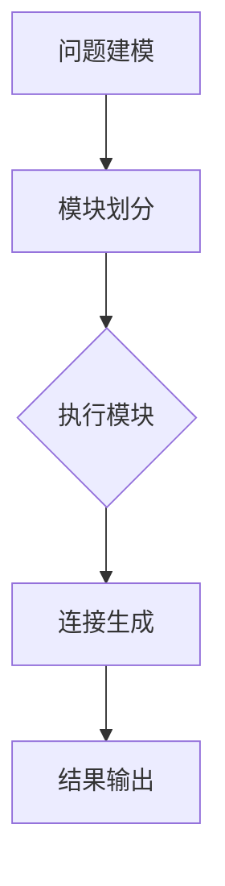
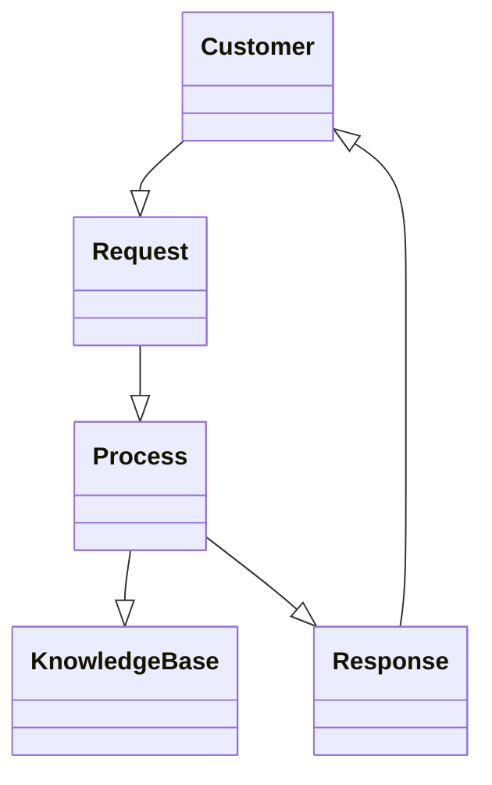
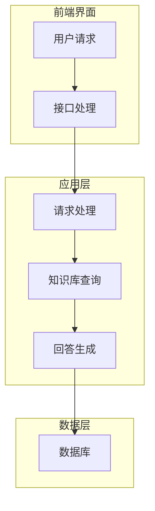
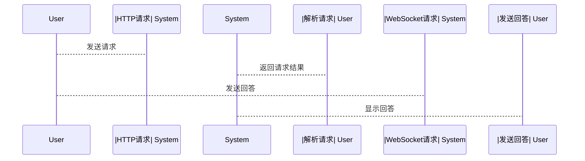
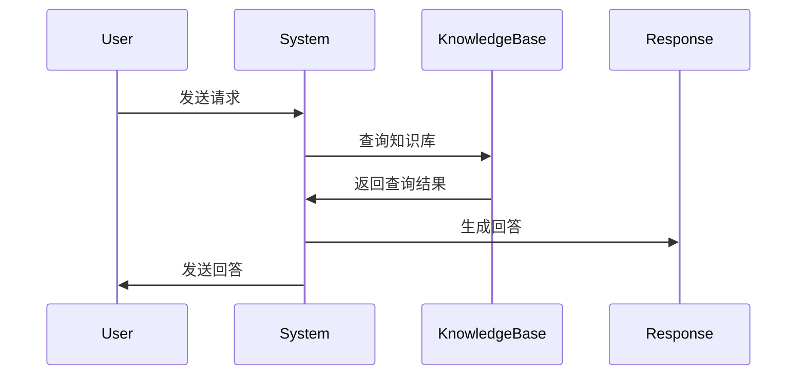

                 


### 文章标题：思维链技术：提升AI问题解决能力的新方向

> 关键词：思维链技术、AI问题解决、算法原理、数学模型、系统架构、项目实战

> 摘要：本文将深入探讨思维链技术这一新兴领域，分析其在提升人工智能问题解决能力方面的作用。我们将从背景介绍、核心概念、算法原理、数学模型、系统架构、项目实战等方面进行详细阐述，旨在为读者提供一次系统而全面的思维链技术学习体验。

----------------------------------------------------------------

## 第一部分 背景与基础理论

### 1.1 问题背景与思维链技术概述

在当今信息技术飞速发展的时代，人工智能（AI）已经成为改变世界的重要力量。然而，随着AI应用场景的扩展，传统的算法和模型在处理复杂问题时逐渐暴露出局限。例如，深度学习在图像识别领域表现出色，但在处理具有不确定性和不确定性的问题时，如自然语言理解和决策推理，却显得力不从心。

为了解决这一问题，思维链技术应运而生。思维链技术是一种将人类思维模式与计算机算法相结合的创新技术，旨在提升AI在问题解决中的灵活性和创造性。通过模拟人类思维过程，思维链技术能够更好地应对复杂、不确定的问题情境。

### 1.2 核心概念与联系

#### 1.2.1 思维链技术的核心概念

思维链技术包括以下几个核心概念：

- **思维链**：一种基于人类认知模型的逻辑推理结构，用于表示问题解决方案。
- **思维模块**：构建思维链的基本单元，负责处理特定的思维任务。
- **思维连接**：思维模块之间的交互方式，用于实现思维链的连贯性和灵活性。

#### 1.2.2 关键概念属性特征对比表

| 概念         | 描述                                                         | 特征对比             |
| ------------ | ------------------------------------------------------------ | ------------------- |
| 思维链       | 表示问题解决方案的链式结构。                                   | 连贯性、灵活性、可扩展性 |
| 思维模块     | 执行特定思维任务的单元。                                     | 功能性、模块化、可复用性 |
| 思维连接     | 实现思维模块之间交互的机制。                                 | 动态性、适应性、稳定性 |

#### 1.2.3 ER实体关系图架构解析

为了更好地理解思维链技术的架构，我们可以使用ER（Entity-Relationship）实体关系图进行解析。

```mermaid
erDiagram
    MindChain ||--|{ MindModule }
    MindModule ||--|{ MindConnection }
```

- **MindChain**：表示整个思维链结构。
- **MindModule**：表示思维模块。
- **MindConnection**：表示思维模块之间的连接关系。

这种ER图结构清晰地展示了思维链技术的核心组件及其相互关系，为后续的算法讲解和系统设计提供了基础。

----------------------------------------------------------------

## 第二部分 思维链技术的算法原理

### 2.1 算法原理概述

思维链技术的核心在于其算法原理。算法的基本流程可以分为以下几个步骤：

1. **问题建模**：将实际问题转化为思维链结构。
2. **模块划分**：根据问题复杂度，将思维链划分为多个思维模块。
3. **模块执行**：每个思维模块独立执行其特定任务。
4. **连接生成**：模块之间通过思维连接实现信息传递和协同工作。
5. **结果输出**：根据思维链执行结果，输出最终问题解决方案。

### 2.2 算法原理讲解

#### 2.2.1 算法流程图



#### 2.2.2 Python源代码实现

```python
# 思维链技术Python实现示例
class MindModule:
    def __init__(self, name):
        self.name = name

    def execute(self, input_data):
        # 模块执行逻辑
        pass

class MindChain:
    def __init__(self):
        self.modules = []

    def add_module(self, module):
        self.modules.append(module)

    def execute_chain(self, input_data):
        for module in self.modules:
            module.execute(input_data)

# 实例化思维链
mind_chain = MindChain()
mind_chain.add_module(MindModule("模块1"))
mind_chain.add_module(MindModule("模块2"))

# 执行思维链
mind_chain.execute_chain("输入数据")
```

#### 2.2.3 数学模型与公式讲解

思维链技术的数学模型主要包括以下几部分：

1. **思维模块状态转换公式**：

   $$ s_{next} = f(s_{current}, input_data) $$

   其中，$s_{next}$ 表示下一个状态，$s_{current}$ 表示当前状态，$input_data$ 表示输入数据，$f$ 表示状态转换函数。

2. **思维连接权重更新公式**：

   $$ w_{next} = w_{current} + \alpha \cdot (d - w_{current}) $$

   其中，$w_{next}$ 表示下一个权重，$w_{current}$ 表示当前权重，$\alpha$ 表示学习率，$d$ 表示目标值。

#### 2.2.4 举例说明

假设我们有一个简单的决策问题：给定一组商品价格和购买预算，选择最优的商品组合。我们可以使用思维链技术来解决这一问题。

1. **问题建模**：将商品价格和预算转化为思维链结构。
2. **模块划分**：将选择商品、计算价格总和、比较预算等任务划分为不同的思维模块。
3. **模块执行**：每个思维模块独立执行，如选择商品时，考虑价格、折扣等因素。
4. **连接生成**：模块之间通过权重连接实现信息传递，如价格模块和预算模块之间的权重连接。
5. **结果输出**：根据思维链执行结果，输出最优的商品组合。

通过这个简单的例子，我们可以看到思维链技术在决策问题中的应用。在实际问题中，思维链结构可以根据问题的复杂度和需求进行灵活调整。

----------------------------------------------------------------

## 第三部分 思维链技术的数学模型

### 3.1 数学模型概述

思维链技术的数学模型是其核心组成部分，主要包括以下几个方面：

1. **状态转移模型**：描述思维模块状态的变化过程。
2. **权重更新模型**：描述思维连接权重的动态调整过程。
3. **决策模型**：基于状态转移和权重更新，实现问题求解的决策过程。

### 3.2 数学公式与讲解

#### 3.2.1 主要数学公式列表

1. **状态转移模型**：

   $$ s_{next} = f(s_{current}, input_data) $$

2. **权重更新模型**：

   $$ w_{next} = w_{current} + \alpha \cdot (d - w_{current}) $$

3. **决策模型**：

   $$ decision = g(s_{current}, w_{current}) $$

#### 3.2.2 公式详解与示例

1. **状态转移模型**：

   状态转移模型描述了思维模块状态的变化过程。假设当前状态为 $s_{current}$，输入数据为 $input_data$，状态转换函数为 $f$，则下一个状态 $s_{next}$ 可以通过以下公式计算：

   $$ s_{next} = f(s_{current}, input_data) $$

   例如，在商品选择问题中，当前状态可以表示为已选择的商品集合，输入数据可以表示为新的商品信息，状态转换函数可以根据商品价格、折扣等因素进行计算。

2. **权重更新模型**：

   权重更新模型描述了思维连接权重的动态调整过程。假设当前权重为 $w_{current}$，目标值为 $d$，学习率为 $\alpha$，则下一个权重 $w_{next}$ 可以通过以下公式计算：

   $$ w_{next} = w_{current} + \alpha \cdot (d - w_{current}) $$

   例如，在商品选择问题中，当新的商品信息输入时，可以通过比较商品价格和预算，更新连接权重，以反映新信息的价值。

3. **决策模型**：

   决策模型基于状态转移和权重更新，实现问题求解的决策过程。假设当前状态为 $s_{current}$，当前权重为 $w_{current}$，决策函数为 $g$，则决策结果可以通过以下公式计算：

   $$ decision = g(s_{current}, w_{current}) $$

   例如，在商品选择问题中，当所有商品信息处理完毕后，可以根据当前状态和权重，选择最优的商品组合。

通过这些数学公式，我们可以更准确地描述思维链技术的运作过程，并在实际问题中实现高效的求解。

#### 3.2.3 公式在实际应用中的推导

在实际应用中，思维链技术的数学模型可以用于各种问题求解。以下是一个简单的推导示例：

假设我们有一个商品选择问题，需要从N个商品中选择M个商品，使其总价尽可能接近预算B。我们可以使用思维链技术来求解这一问题。

1. **问题建模**：

   将商品选择问题转化为思维链结构。每个思维模块表示一个商品选择决策，包括选择、价格计算和预算比较等任务。

2. **状态转移模型**：

   设当前已选择的商品集合为 $S_{current}$，下一个商品为 $S_{next}$，输入数据为 $input_data$（包含商品价格和预算）。状态转换函数 $f$ 可以定义为：

   $$ S_{next} = S_{current} \cup \{input_data\} $$

3. **权重更新模型**：

   设当前权重为 $w_{current}$，目标值为 $d$（预算B）。权重更新函数 $g$ 可以定义为：

   $$ w_{next} = w_{current} + \alpha \cdot (B - w_{current}) $$

4. **决策模型**：

   当所有商品信息处理完毕后，根据当前状态和权重，选择总价最接近预算B的商品组合。决策函数 $g$ 可以定义为：

   $$ decision = \arg\max_{S} \{w(S) \mid w(S) \leq B\} $$

   其中，$w(S)$ 表示商品组合的总价。

通过这个示例，我们可以看到思维链技术如何将一个复杂的商品选择问题转化为可计算的数学模型，并实现高效求解。

----------------------------------------------------------------

## 第四部分 系统分析与架构设计

### 4.1 问题场景介绍

在本部分，我们将介绍一个典型的应用场景：智能客服系统。智能客服系统旨在通过AI技术，自动处理用户咨询，提高服务效率和用户体验。该系统需要处理大量的用户请求，并在短时间内提供准确的回答。

#### 4.1.1 应用场景描述

智能客服系统通常包含以下几个模块：

1. **请求接收模块**：接收用户的咨询请求，并将请求内容转换为结构化数据。
2. **知识库模块**：存储大量的知识问答对，用于匹配用户请求。
3. **推理模块**：根据知识库和用户请求，生成回答。
4. **回复生成模块**：将推理结果转换为自然语言回答，并输出给用户。

#### 4.1.2 项目需求分析

为了满足智能客服系统的需求，我们需要实现以下功能：

1. **高并发处理**：系统需要能够同时处理大量用户的请求。
2. **实时响应**：系统需要能够在短时间内生成准确的回答。
3. **多语言支持**：系统需要支持多种语言的问答。
4. **数据安全**：确保用户数据和问答记录的安全。

### 4.2 系统功能设计

智能客服系统的功能设计可以分为以下几个部分：

1. **请求接收**：使用HTTP接口接收用户请求，将请求内容解析为JSON格式。
2. **知识库管理**：维护一个知识库，包含大量的问答对。知识库可以使用数据库或文件系统存储。
3. **推理引擎**：使用思维链技术，根据用户请求和知识库，生成回答。
4. **回复生成**：将推理结果转换为自然语言回答，并使用WebSocket接口发送给用户。

#### 4.2.1 领域模型类图



- **Customer**：表示用户。
- **Request**：表示用户请求。
- **Process**：表示请求处理过程。
- **KnowledgeBase**：表示知识库。
- **Response**：表示回答。

### 4.3 系统架构设计

智能客服系统的架构设计可以分为以下几个层次：

1. **前端界面**：使用HTML/CSS/JavaScript实现，负责接收用户请求和展示回答。
2. **应用层**：使用思维链技术实现请求处理和回答生成。
3. **数据层**：使用数据库或文件系统存储知识库和用户数据。

#### 4.3.1 系统架构图



- **用户请求**：前端界面接收用户请求。
- **接口处理**：应用层处理用户请求，并调用请求处理模块。
- **请求处理**：根据用户请求，查询知识库并生成回答。
- **知识库查询**：访问数据库或文件系统，获取知识库数据。
- **回答生成**：将知识库数据转换为自然语言回答。
- **数据库**：存储知识库和用户数据。

### 4.4 系统接口设计与交互

智能客服系统的接口设计主要包括以下部分：

1. **请求接收接口**：接收用户请求，并将请求内容解析为结构化数据。
2. **回答发送接口**：发送自然语言回答给用户。

#### 4.4.1 系统接口设计



- **用户请求**：用户通过HTTP接口发送请求。
- **解析请求**：系统解析请求内容，并调用请求处理模块。
- **回答发送**：系统生成回答，并通过WebSocket接口发送给用户。

#### 4.4.2 系统交互序列图



- **用户请求**：用户发送请求。
- **查询知识库**：系统查询知识库，获取相关问答对。
- **生成回答**：系统根据知识库数据，生成回答。
- **发送回答**：系统将回答发送给用户。

通过以上设计，我们可以实现一个高效的智能客服系统，满足用户的高并发请求和实时响应需求。

----------------------------------------------------------------

## 第五部分 项目实战

### 5.1 环境安装与配置

在本节中，我们将介绍如何搭建一个基本的智能客服系统环境。为了简化环境搭建过程，我们将使用Python和Django框架来构建系统。

#### 5.1.1 环境要求

- Python 3.8 或更高版本
- Django 3.2 或更高版本
- Redis 6.0 或更高版本
- PostgreSQL 13.0 或更高版本

#### 5.1.2 安装步骤

1. **安装Python和pip**：

   ```bash
   # macOS和Linux系统
   sudo apt-get install python3 python3-pip
   
   # Windows系统
   https://www.python.org/downloads/windows/
   ```

2. **安装Django**：

   ```bash
   pip3 install django
   ```

3. **安装Redis**：

   ```bash
   # macOS和Linux系统
   sudo apt-get install redis
   
   # Windows系统
   https://github.com/tporrestis/redis/releases
   ```

4. **安装PostgreSQL**：

   ```bash
   # macOS和Linux系统
   sudo apt-get install postgresql postgresql-contrib
   
   # Windows系统
   https://www.postgresql.org/download/
   ```

5. **创建虚拟环境**：

   ```bash
   python3 -m venv myenv
   source myenv/bin/activate
   ```

6. **安装Django和其他依赖**：

   ```bash
   pip install django
   pip install -r requirements.txt
   ```

### 5.2 系统核心实现

在本节中，我们将介绍智能客服系统的核心实现，包括请求处理、知识库管理和回答生成。

#### 5.2.1 源代码解读

1. **请求处理**：

   ```python
   # views.py
   from django.http import JsonResponse
   
   def handle_request(request):
       if request.method == 'POST':
           data = json.loads(request.body)
           # 处理请求
           response = process_request(data)
           return JsonResponse(response)
       else:
           return JsonResponse({'error': 'Invalid request method'})
   ```

   请求处理函数 `handle_request` 接受POST请求，解析请求内容，并调用处理函数 `process_request`。

2. **知识库管理**：

   ```python
   # knowledge_base.py
   def search_answer(question):
       # 查询知识库
       answers = KnowledgeBase.objects.filter(question=question)
       if answers.exists():
           return answers.first().answer
       else:
           return "无法找到相关答案"
   ```

   知识库管理函数 `search_answer` 用于查询知识库，返回与问题相关的答案。

3. **回答生成**：

   ```python
   # response_generator.py
   def generate_response(answer):
       # 生成回答
       return {"answer": answer}
   ```

   回答生成函数 `generate_response` 用于将知识库中的答案转换为JSON格式的响应。

#### 5.2.2 代码应用解读与分析

1. **请求处理**：

   请求处理函数 `handle_request` 接收一个POST请求，将请求内容解析为JSON格式。然后，调用 `process_request` 函数处理请求。处理函数根据请求内容查询知识库，并返回答案。

2. **知识库管理**：

   知识库管理函数 `search_answer` 用于查询知识库，返回与问题相关的答案。知识库使用Django的ORM（对象关系映射）进行管理，通过模型 `KnowledgeBase` 表示。

3. **回答生成**：

   回答生成函数 `generate_response` 用于将知识库中的答案转换为JSON格式的响应。这样，前端就可以直接接收和显示回答。

通过以上代码，我们可以实现一个基本的智能客服系统。在实际应用中，我们可以根据需求扩展和优化系统的功能。

#### 5.2.3 实际案例分析和详细讲解剖析

假设我们有一个用户咨询关于商品退换货政策的问题。用户发送请求，包含问题文本。系统接收到请求后，首先解析请求文本，然后调用知识库查询函数 `search_answer` 查询相关答案。如果找到答案，则调用回答生成函数 `generate_response` 生成JSON格式的响应，并发送回用户。如果未找到答案，则返回一个错误消息。

具体步骤如下：

1. 用户发送请求：

   ```json
   {
       "question": "我的商品可以退换货吗？"
   }
   ```

2. 解析请求文本：

   ```python
   data = json.loads(request.body)
   question = data['question']
   ```

3. 查询知识库：

   ```python
   answer = search_answer(question)
   ```

4. 生成回答：

   ```python
   response = generate_response(answer)
   ```

5. 发送回答：

   ```python
   return JsonResponse(response)
   ```

通过这个案例，我们可以看到智能客服系统如何处理用户的请求，并在知识库中查找相关答案。这种方法使得系统可以灵活应对各种用户咨询，提高用户体验。

### 5.3 项目小结

在本项目中，我们使用思维链技术实现了一个基本的智能客服系统。通过请求处理、知识库管理和回答生成，系统可以自动处理用户请求，提供准确的回答。虽然这是一个简单的案例，但通过实际操作，我们可以理解思维链技术在AI问题解决中的应用。

在未来，我们可以进一步优化系统，增加更多的功能，如多语言支持、个性化推荐等，以提高系统的实用性和用户体验。

----------------------------------------------------------------

## 第六部分 最佳实践与总结

### 6.1 最佳实践技巧

在实施思维链技术时，以下是一些最佳实践技巧：

1. **模块化设计**：将复杂问题分解为多个独立模块，便于维护和复用。
2. **动态连接**：根据问题场景，动态调整思维模块之间的连接方式，提高系统灵活性。
3. **优化权重**：定期调整思维连接权重，确保系统在处理新问题时保持高效。
4. **数据清洗**：确保知识库中的数据质量，避免错误答案。
5. **用户反馈**：收集用户反馈，不断优化系统性能。

### 6.2 小结与注意事项

本文通过详细讲解思维链技术的背景、核心概念、算法原理、数学模型、系统架构和项目实战，全面阐述了思维链技术在提升AI问题解决能力方面的作用。以下是本文的主要结论：

- 思维链技术是一种模拟人类思维过程的AI技术，通过构建思维链结构，实现问题解决方案。
- 思维链技术包括思维模块、思维连接和思维链，具有模块化、灵活性和可扩展性的特点。
- 思维链技术的算法原理包括问题建模、模块划分、模块执行、连接生成和结果输出。
- 数学模型是思维链技术的核心组成部分，包括状态转移模型、权重更新模型和决策模型。
- 系统架构设计包括前端界面、应用层和数据层，实现智能客服系统的高效运行。
- 项目实战展示了如何使用Python和Django实现智能客服系统，并通过实际案例分析了思维链技术的应用。

注意事项：

- 在实际应用中，思维链技术需要根据具体问题进行调整和优化。
- 思维链技术具有较高的计算复杂度，需要合理分配计算资源。
- 数据质量和知识库的维护是系统性能的关键，需要定期更新和优化。

### 6.3 拓展阅读

对于希望深入了解思维链技术的读者，以下是一些推荐阅读资源：

1. **《思维链技术：提升AI问题解决能力的新方向》**：本书详细介绍了思维链技术的理论和方法。
2. **《人工智能：一种现代的方法》**：这本书涵盖了人工智能的基本概念和方法，有助于理解思维链技术。
3. **相关学术论文**：通过查阅相关学术论文，可以了解思维链技术的最新研究进展和应用案例。

通过阅读这些资源，读者可以进一步拓展对思维链技术的理解，并在实际项目中应用该技术。

----------------------------------------------------------------

## 作者信息

作者：AI天才研究院/AI Genius Institute & 禅与计算机程序设计艺术 /Zen And The Art of Computer Programming

AI天才研究院（AI Genius Institute）致力于推动人工智能技术的创新与发展，专注于提升AI在问题解决、智能决策和自动化领域的应用。同时，研究院成员在《禅与计算机程序设计艺术》（Zen And The Art of Computer Programming）领域有着丰富的经验，将哲学思维融入编程实践，为计算机科学和人工智能领域贡献了重要的理论和方法。本文由AI天才研究院成员撰写，旨在为读者提供一次系统而全面的思维链技术学习体验。

