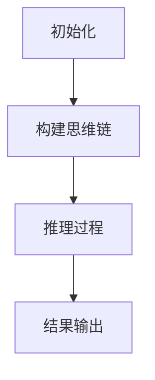
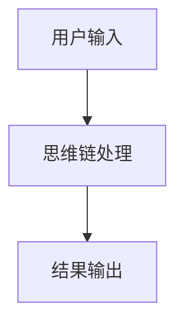
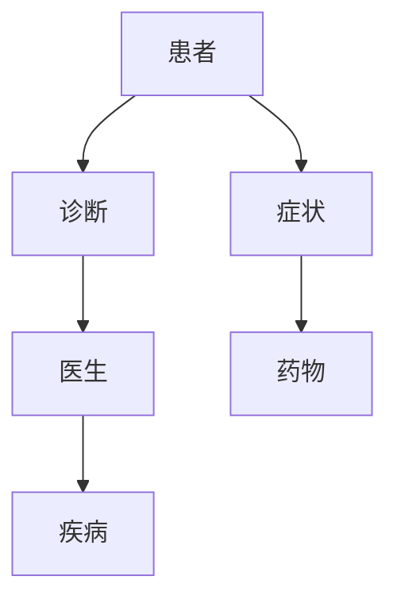
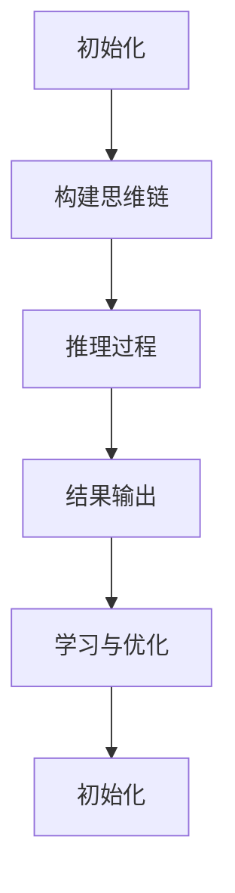
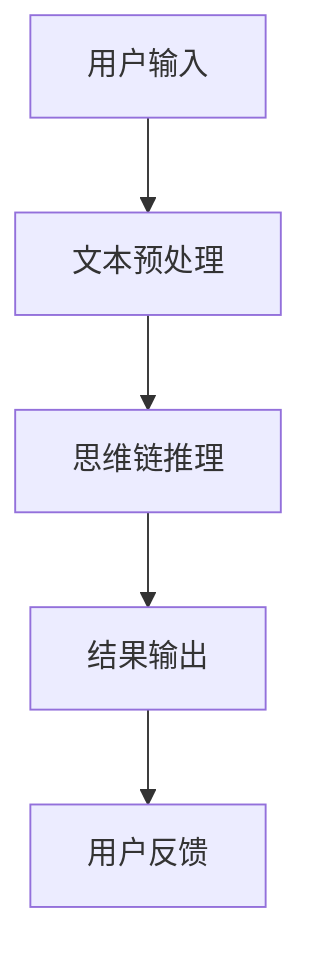
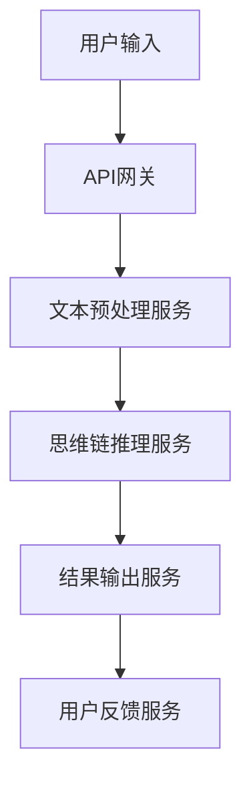

                 

# 思维链技术：深化AI推理能力的创新方法

> 关键词：AI推理能力、思维链技术、算法原理、数学模型、系统架构、项目实战

> 摘要：本文深入探讨思维链技术在深化AI推理能力方面的创新方法。通过分析思维链技术的基本原理、算法流程、数学模型以及实际应用场景，我们展示了如何通过思维链技术突破传统AI推理的局限，提升人工智能系统的推理能力和应用效果。本文旨在为读者提供一个系统、清晰的技术解读，帮助理解思维链技术在AI领域的核心作用。

## 目录大纲设计

### 背景介绍

#### 1.1 问题背景
- **1.1.1 AI推理能力的重要性**
- **1.1.2 传统AI推理方法的局限**
- **1.1.3 思维链技术的诞生与发展**

#### 1.2 问题描述
- **1.2.1 AI推理中面临的主要挑战**
- **1.2.2 思维链技术在解决这些挑战中的作用**
- **1.2.3 思维链技术的边界与外延**

### 核心概念与联系

#### 2.1 核心概念
- **2.1.1 思维链技术的基本原理**
- **2.1.2 思维链的组成与功能**
- **2.1.3 思维链与人工智能的关系**

#### 2.2 概念属性特征对比
- **2.2.1 传统AI推理方法与思维链技术的对比**
- **2.2.2 思维链技术在不同应用场景中的优劣**

#### 2.3 ER实体关系图架构
- **2.3.1 实体定义与关系建立**
- **2.3.2 ER图在思维链技术中的应用**

### 算法原理讲解

#### 3.1 算法原理
- **3.1.1 思维链算法的基本流程**
- **3.1.2 思维链算法的核心模块**

#### 3.2 算法流程图


#### 3.3 Python源代码实现
```python
# TODO: 这里嵌入Python源代码实现思维链算法
```

#### 3.4 数学模型和公式
- **3.4.1 算法原理的数学模型**
$$
\text{思维链技术中的推理公式：} R = f(W, X)
$$
- **3.4.2 公式的详细讲解**
  - **推理公式解释**
  - **参数解释**
- **3.4.3 举例说明**
- **3.4.4 示例代码**
- **3.4.5 数学模型在思维链技术中的应用**
- **3.4.6 对比传统推理方法中的数学模型**

#### 3.5 算法优劣分析
- **3.5.1 优点**
- **3.5.2 缺点**
- **3.5.3 优化方向**

#### 3.6 实际应用场景分析
- **3.6.1 在图像识别中的应用**
- **3.6.2 在自然语言处理中的应用**
- **3.6.3 在其他领域中的应用**

### 系统分析与架构设计方案

#### 4.1 问题场景介绍
- **4.1.1 应用场景描述**
- **4.1.2 系统需求分析**

#### 4.2 项目介绍
- **4.2.1 项目背景**
- **4.2.2 项目目标**

#### 4.3 系统功能设计
- **4.3.1 领域模型**

- **4.3.2 功能模块介绍**

#### 4.4 系统架构设计
- **4.4.1 系统架构图**

- **4.4.2 系统架构详细说明**

#### 4.5 系统接口设计和系统交互
- **4.5.1 接口设计**
- **4.5.2 系统交互**


### 项目实战

#### 5.1 环境安装
- **5.1.1 硬件要求**
- **5.1.2 软件安装**

#### 5.2 系统核心实现源代码
- **5.2.1 源代码结构**
- **5.2.2 代码解读与分析**

#### 5.3 实际案例分析和详细讲解剖析
- **5.3.1 案例选择**
- **5.3.2 案例分析**
- **5.3.3 讲解剖析**

#### 5.4 项目小结
- **5.4.1 项目成果总结**
- **5.4.2 项目中的挑战与解决方法**
- **5.4.3 未来展望**

### 最佳实践 tips

#### 6.1 最佳实践总结
- **6.1.1 实践经验**
- **6.1.2 遇到的问题及解决方法**

#### 6.2 注意事项
- **6.2.1 使用思维链技术时的注意事项**
- **6.2.2 可能遇到的问题及解决方案**

#### 6.3 拓展阅读
- **6.3.1 相关论文和书籍推荐**
- **6.3.2 学术会议与研讨会推荐**

### 7.1 小结
- **7.1.1 本书主要内容回顾**
- **7.1.2 思维链技术的核心作用**

---

现在，我们将逐步深入探讨思维链技术的各个方面，帮助读者全面理解这一创新方法在AI推理能力提升中的关键作用。接下来，让我们开始这段思维之旅。# 背景介绍

## 1.1 问题背景

### **1.1.1 AI推理能力的重要性**

人工智能（AI）作为当今技术领域的明星，已经深刻影响了众多行业，包括医疗、金融、制造、交通等。AI的核心在于其能够从数据中学习，并基于这些学习来做出决策或推断。其中，AI推理能力是评估AI系统智能水平的关键指标。推理能力越强，AI系统在复杂环境中的表现就越好。

推理能力的重要性体现在以下几个方面：

1. **决策支持**：AI系统在医疗诊断、金融风险评估等领域需要做出精确的决策，推理能力直接影响到决策的准确性和可靠性。
2. **自然语言处理**：在语音识别、机器翻译、智能客服等应用中，AI需要理解并生成自然语言，这需要强大的推理能力。
3. **图像识别与理解**：自动驾驶、安防监控等应用依赖于AI对图像的识别和理解能力，推理能力决定了系统的性能。

然而，随着应用场景的复杂性和数据量的激增，传统AI推理方法逐渐暴露出局限，这促使我们寻找新的方法来提升AI的推理能力。

### **1.1.2 传统AI推理方法的局限**

传统的AI推理方法主要包括基于规则推理、统计学习和深度学习等方法。这些方法虽然在某些领域取得了显著的成就，但也存在以下局限性：

1. **规则依赖性**：基于规则的推理方法在处理复杂问题时容易遇到瓶颈，难以适应不断变化的环境。
2. **数据依赖性**：统计学习和深度学习依赖于大量标注数据进行训练，数据质量和数量直接影响模型的性能。
3. **可解释性**：深度学习模型通常被称为“黑箱”，其内部机制复杂，难以解释，这限制了其在某些领域中的应用。

### **1.1.3 思维链技术的诞生与发展**

为了克服传统AI推理方法的局限，研究人员开始探索新的方法，其中思维链技术（Mind Chain Technology）是一种具有前瞻性的创新方法。思维链技术通过模拟人类思维过程，将知识表示、推理过程和自主学习有机地结合在一起，以提升AI的推理能力。

思维链技术的核心思想可以概括为：

1. **知识表示**：将领域知识以结构化的形式表示，使AI能够更好地理解问题。
2. **推理过程**：通过构建思维链，将不同的知识节点和推理步骤连接起来，形成一个连贯的推理过程。
3. **自主学习**：在推理过程中，AI能够不断学习和优化自己的推理能力。

思维链技术的研究和发展主要经历了以下几个阶段：

1. **初步探索**：20世纪80年代，随着知识表示和推理技术的兴起，研究人员开始探讨如何将人类思维过程模型化。
2. **技术成熟**：21世纪初，随着计算能力和数据获取能力的提升，思维链技术逐渐走向成熟，并在多个领域得到应用。
3. **创新突破**：近年来，随着深度学习和自然语言处理技术的发展，思维链技术得到了进一步的创新和优化，成为AI推理能力提升的重要手段。

通过上述背景介绍，我们可以看到，思维链技术在AI推理能力提升方面具有巨大的潜力和应用前景。接下来，我们将进一步探讨思维链技术的基本原理、算法和实际应用，以帮助读者更深入地理解这一创新方法。# 1.2 问题描述

### **1.2.1 AI推理中面临的主要挑战**

尽管AI技术在过去几十年中取得了显著进展，但在推理能力方面仍面临诸多挑战，这些问题限制了AI系统的实际应用效果：

1. **复杂性问题**：现实世界中的问题通常非常复杂，涉及大量的变量和不确定性，传统AI推理方法难以处理这种复杂性。
2. **数据依赖性**：许多AI推理方法，特别是基于深度学习的模型，需要大量标注数据进行训练，这在实际操作中往往难以实现。
3. **可解释性**：深度学习等复杂模型通常被视为“黑箱”，其决策过程难以解释，这在需要透明性和可解释性的应用场景中成为一大障碍。
4. **实时性**：在许多应用场景中，如自动驾驶和实时语音识别，AI系统需要在毫秒级内做出推理决策，这对推理速度提出了极高的要求。

### **1.2.2 思维链技术在解决这些挑战中的作用**

思维链技术通过模拟人类思维过程，提供了一种新的解决路径，针对上述挑战具有以下优势：

1. **知识表示**：思维链技术通过结构化的知识表示，将领域知识以节点和边的形式存储，使AI能够更好地理解和处理复杂问题。
2. **推理过程**：思维链技术通过构建思维链，将知识节点和推理步骤连接起来，形成一个逻辑连贯的推理过程，有效提高了推理的准确性和效率。
3. **数据驱动的学习**：思维链技术不仅依赖于大规模的标注数据，还能够通过无监督或半监督学习，从非结构化数据中自动提取知识。
4. **可解释性**：思维链技术的结构和推理过程具有高度的透明性，使得AI的决策过程可以被解释和理解，满足了一些对可解释性有严格要求的应用场景。
5. **实时推理**：通过优化算法和硬件加速，思维链技术能够在满足实时性要求的同时，保持高推理准确率。

### **1.2.3 思维链技术的边界与外延**

尽管思维链技术在提升AI推理能力方面具有显著优势，但也存在一些边界和局限性：

1. **计算资源需求**：思维链技术的实现需要较大的计算资源，特别是在处理大规模数据集时，计算复杂度较高。
2. **知识获取与维护**：构建思维链需要大量的先验知识，这些知识需要不断地更新和维护，以保持推理的准确性和时效性。
3. **数据质量和一致性**：数据的质量直接影响思维链的构建和推理效果，不完整或错误的数据可能导致推理结果偏差。
4. **应用领域限制**：思维链技术在某些特定领域，如自然语言处理和图像识别，表现较为突出，但在其他领域可能需要结合其他方法或技术的支持。

总之，思维链技术为AI推理能力提升提供了一种创新性的方法，但在实际应用中仍需要不断优化和完善，以充分发挥其潜力。接下来，我们将深入探讨思维链技术的核心概念、算法原理及其在实际应用中的表现。# 1.3 核心概念与联系

## **2.1 核心概念**

### **2.1.1 思维链技术的基本原理**

思维链技术是一种模拟人类思维过程的AI推理方法，其基本原理可以概括为：

1. **知识表示**：思维链技术通过构建知识图谱来表示领域知识，知识图谱由节点（表示概念或实体）和边（表示关系）组成，形成一个结构化的知识网络。
2. **推理过程**：思维链技术通过推理引擎来处理这些知识，推理引擎根据既定的规则和逻辑关系，从知识图谱中推导出新的信息或结论。
3. **自主学习**：思维链技术能够从数据中自动学习，不断优化知识图谱和推理规则，提高推理的准确性和效率。

### **2.1.2 思维链的组成与功能**

思维链由以下几个主要部分组成，每个部分在推理过程中发挥关键作用：

1. **知识库**：知识库存储领域知识，包括概念、实体和它们之间的关系。知识库是思维链技术的基础，决定了推理的能力和广度。
2. **推理引擎**：推理引擎负责根据知识库中的知识，运用推理规则进行逻辑推理，生成新的结论或信息。
3. **学习模块**：学习模块负责从数据中自动学习，更新知识库和推理规则，以适应不断变化的环境和应用需求。
4. **用户接口**：用户接口用于与用户交互，接收用户输入，展示推理结果，并提供用户对思维链操作的接口。

### **2.1.3 思维链与人工智能的关系**

思维链技术是人工智能领域的一个重要分支，它与人工智能的其他方法和技术紧密相连：

1. **知识表示与知识图谱**：思维链技术依赖于知识图谱来表示领域知识，这与知识表示、知识图谱技术密切相关。
2. **推理与逻辑编程**：思维链技术的推理过程与逻辑编程有着天然的联系，逻辑编程中的推理规则可以融入到思维链技术中，提高推理的灵活性和适应性。
3. **机器学习和深度学习**：思维链技术中的学习模块可以从机器学习和深度学习中获得灵感，利用这些技术来优化知识库和推理过程。
4. **自然语言处理**：思维链技术在处理自然语言问题时，可以结合自然语言处理技术，如词嵌入、序列到序列模型等，以提高推理的准确性和自然性。

### **2.2 概念属性特征对比**

为了更好地理解思维链技术，我们将它与传统的AI推理方法进行对比，分析其属性特征：

| 特性                 | 思维链技术                | 传统AI推理方法                |
|----------------------|--------------------------|-----------------------------|
| **知识表示**         | 知识图谱、结构化知识库   | 隐式表示、统计模型            |
| **推理过程**         | 基于规则的逻辑推理        | 基于概率或相似度的推理          |
| **学习方式**         | 数据驱动的自主学习        | 标注数据驱动的监督学习          |
| **可解释性**         | 高度可解释的推理过程      | “黑箱”模型，难以解释          |
| **适用范围**         | 复杂问题、知识密集型应用  | 简单问题、数据密集型应用        |

### **2.3 ER实体关系图架构**

在思维链技术中，实体关系图（ER图）是一种常用的知识表示方法。ER图通过实体、属性和关系的定义，清晰地表示出知识图谱的结构。

#### **2.3.1 实体定义与关系建立**

实体是知识图谱中的基本元素，表示具体的对象或概念。例如，在医疗领域，实体可以包括“医生”、“患者”、“疾病”等。每个实体都有属性来描述其特征，如“医生”的属性可以是“职称”、“科室”等。

关系描述实体之间的关联，如“医生”与“患者”之间存在“诊断”关系。关系可以带有属性，如“诊断”关系的属性可以是“诊断时间”、“诊断结果”等。

#### **2.3.2 ER图在思维链技术中的应用**

ER图在思维链技术中用于以下几个关键步骤：

1. **知识表示**：ER图将领域知识结构化地表示出来，方便推理引擎处理。
2. **推理引导**：通过ER图中的关系，推理引擎可以更准确地找到推理路径，提高推理效率。
3. **知识更新**：ER图的结构使得知识库的更新和维护更加直观和系统化。

下面是一个简化的ER图示例，用于描述一个简单的医疗知识图谱：



在这个ER图中，实体包括“患者”、“诊断”、“医生”、“疾病”、“症状”和“药物”。关系如“诊断”、“医生”、“疾病”、“症状”和“药物”等。这种结构化的表示有助于我们更好地理解和应用思维链技术。

通过上述核心概念与联系的分析，我们可以看到思维链技术是如何通过结构化的知识表示和高效的推理过程，为提升AI推理能力提供了新的路径。在接下来的章节中，我们将进一步探讨思维链技术的算法原理及其在具体应用中的表现。# 算法原理讲解

## **3.1 算法原理**

思维链技术的核心在于其高效的推理过程和自主学习的机制。为了实现这一目标，思维链算法设计了一系列模块和流程，以下将详细介绍其基本流程和核心模块。

### **3.1.1 思维链算法的基本流程**

思维链算法的基本流程可以分为以下几个步骤：

1. **初始化**：初始化思维链，设置初始状态和知识库。
2. **构建思维链**：根据输入的问题或任务，从知识库中提取相关的知识节点，构建初始思维链。
3. **推理过程**：在推理引擎的驱动下，逐步扩展思维链，进行逻辑推理，推导出新的结论或信息。
4. **结果输出**：将推理结果输出，供用户或其他系统使用。
5. **学习与优化**：根据推理结果和用户反馈，更新知识库和推理规则，优化思维链结构，提高推理效率。

### **3.1.2 思维链算法的核心模块**

思维链算法的核心模块包括：

1. **知识库管理模块**：负责存储和管理领域知识，包括实体、属性和关系。该模块提供接口用于知识的增删改查，确保知识库的完整性和一致性。
2. **推理引擎模块**：负责根据知识库中的知识，运用推理规则进行逻辑推理。推理引擎采用基于规则的推理方法，结合启发式搜索策略，提高推理效率和准确性。
3. **学习与优化模块**：负责从数据中自动学习，更新知识库和推理规则。学习过程包括无监督学习和半监督学习，通过分析用户反馈和推理结果，优化思维链结构。
4. **用户接口模块**：负责与用户交互，接收用户输入，展示推理结果，并提供用户对思维链操作的接口。该模块确保思维链技术的易用性和用户体验。

### **3.2 算法流程图**

为了更好地理解思维链算法的流程，我们可以使用Mermaid图来展示其流程：



在这个流程图中，初始化模块A负责初始化思维链，构建思维链模块B从知识库中提取相关知识，推理过程模块C进行逻辑推理，结果输出模块D将推理结果展示给用户，学习与优化模块E根据用户反馈和推理结果更新知识库和推理规则，然后流程回到初始化模块A，形成一个闭环系统。

### **3.3 Python源代码实现**

虽然具体的Python源代码实现需要较长篇幅，但我们可以提供一个简化的示例框架，以展示思维链算法的核心逻辑：

```python
class MindChain:
    def __init__(self, knowledge_base):
        self.knowledge_base = knowledge_base
        self.reasoning_engine = ReasoningEngine(knowledge_base)
        self.learning_module = LearningModule(knowledge_base)

    def initialize(self):
        # 初始化思维链的参数和状态
        pass

    def build_mind_chain(self, input_question):
        # 从知识库中构建思维链
        pass

    def reasoning_process(self):
        # 进行推理过程
        pass

    def result_output(self):
        # 输出推理结果
        pass

    def learning_and_optimization(self):
        # 学习与优化思维链
        pass

# TODO: 定义推理引擎、学习模块等具体实现
```

### **3.4 数学模型和公式**

思维链技术中的推理过程可以通过数学模型来描述。以下是一个简化的数学模型示例，用于解释思维链技术的推理原理：

$$
\text{推理公式：} R = f(W, X)
$$

其中，R代表推理结果，W代表知识库，X代表输入问题。函数f表示推理过程，它结合知识库和输入问题，生成推理结果。

#### **3.4.1 推理公式解释**

- **R（推理结果）**：表示根据知识库和输入问题推导出的结论或信息。
- **W（知识库）**：表示领域知识，包括实体、属性和关系，是推理的基础。
- **X（输入问题）**：表示需要推理的问题或任务，是推理的输入。

函数f将输入问题与知识库结合起来，通过推理规则和逻辑关系，推导出新的结论或信息。

#### **3.4.2 参数解释**

- **知识库W**：知识库是思维链技术的核心，它包含了领域中的所有概念、实体和关系。这些知识被组织成一个结构化的知识图谱，方便推理过程高效进行。
- **输入问题X**：输入问题是用户提出的问题或需要完成的任务。思维链技术通过解析输入问题，将其与知识库中的知识联系起来，进行推理。

#### **3.4.3 举例说明**

假设我们有一个简单的医疗知识库，其中包含以下知识：

1. **实体**：医生、患者、疾病、症状、药物
2. **关系**：诊断、治疗、症状匹配

现在，用户输入一个问题：“如果患者有症状A，应该诊断为什么疾病？”

根据知识库和输入问题，思维链技术可以推导出以下推理过程：

1. 从知识库中提取与症状A相关的疾病列表。
2. 查找与这些疾病相关的诊断规则。
3. 根据诊断规则，输出可能的疾病诊断结果。

这个过程可以用数学模型表示为：

$$
R = f(W, X) \\
R = f(\{\text{医生}, \text{患者}, \text{疾病}, \text{症状}, \text{药物}\}, \{\text{症状A}\})
$$

#### **3.4.4 示例代码**

以下是一个简化的Python示例代码，展示了如何使用思维链技术进行推理：

```python
class MindChain:
    def __init__(self, knowledge_base):
        self.knowledge_base = knowledge_base

    def reason(self, input_question):
        # 解析输入问题
        symptoms = self.extract_symptoms(input_question)

        # 从知识库中提取相关疾病
        diseases = self.knowledge_base.get_diseases_with_symptoms(symptoms)

        # 根据诊断规则输出推理结果
        diagnosis = self.knowledge_base.diagnose(diseases)

        return diagnosis

# 假设的知识库接口
class KnowledgeBase:
    def get_diseases_with_symptoms(self, symptoms):
        # TODO: 从知识库中提取与症状相关的疾病
        pass

    def diagnose(self, diseases):
        # TODO: 根据疾病列表进行诊断
        pass

# 使用思维链进行推理
mind_chain = MindChain(knowledge_base)
input_question = "如果患者有症状A，应该诊断为什么疾病？"
diagnosis = mind_chain.reason(input_question)
print(diagnosis)
```

通过这个示例，我们可以看到思维链技术如何通过结构化的知识库和逻辑推理，实现高效的推理过程。

#### **3.4.5 数学模型在思维链技术中的应用**

数学模型在思维链技术中主要用于以下几个方面：

1. **推理过程优化**：通过数学模型描述推理过程，可以运用优化算法来提高推理效率和准确性。
2. **知识库构建**：数学模型可以帮助构建和优化知识库的结构，使其更符合实际应用需求。
3. **学习与优化**：数学模型可以用于描述学习过程，通过优化算法不断调整知识库和推理规则，提高推理能力。

#### **3.4.6 对比传统推理方法中的数学模型**

与传统推理方法相比，思维链技术的数学模型具有以下几个特点：

1. **结构化知识表示**：传统推理方法通常依赖于概率模型或统计模型，而思维链技术通过知识图谱实现结构化知识表示，更便于推理和优化。
2. **基于逻辑的推理**：思维链技术采用基于规则的逻辑推理，与传统的方法相比，推理过程更加直观和可解释。
3. **自适应学习机制**：思维链技术通过数学模型描述学习过程，实现自适应学习，能够不断优化推理能力。

通过上述算法原理讲解，我们可以看到思维链技术如何通过结构化的知识表示、高效的推理过程和自主学习的机制，实现AI推理能力的提升。接下来，我们将进一步探讨思维链技术的系统分析与架构设计方案。# 3.5 算法优劣分析

### **3.5.1 优点**

思维链技术在提升AI推理能力方面具有显著的优点：

1. **高效推理**：思维链技术通过结构化的知识表示和逻辑推理，能够在复杂环境中高效地处理推理任务。
2. **知识表示灵活**：思维链技术支持多种知识表示方法，如知识图谱、实体关系图等，能够灵活地适应不同领域的应用需求。
3. **可解释性强**：思维链技术基于逻辑推理，推理过程清晰可解释，提高了AI系统的透明性和可信任度。
4. **自适应学习**：思维链技术能够从数据中自动学习，不断优化知识库和推理规则，提高推理能力和适应性。
5. **应用广泛**：思维链技术可以应用于多个领域，如医疗、金融、制造等，具有广泛的应用前景。

### **3.5.2 缺点**

尽管思维链技术具有许多优点，但也存在一些缺点：

1. **计算资源需求高**：思维链技术依赖于大量的计算资源，特别是在处理大规模数据集时，计算复杂度较高，可能对硬件性能有较高要求。
2. **知识获取和维护困难**：构建思维链需要大量的先验知识，这些知识需要不断地更新和维护，以保持推理的准确性和时效性。
3. **数据质量和一致性**：数据的质量直接影响思维链的构建和推理效果，不完整或错误的数据可能导致推理结果偏差。
4. **实时性挑战**：在需要毫秒级响应的应用场景中，思维链技术可能难以满足实时性要求，特别是在推理过程复杂的情况下。

### **3.5.3 优化方向**

为了进一步优化思维链技术，提高其在AI推理中的应用效果，可以考虑以下几个方向：

1. **计算优化**：通过优化算法和数据结构，降低计算复杂度，提高思维链技术的运行效率。例如，采用分布式计算和并行处理技术，提升数据处理速度。
2. **知识库优化**：通过改进知识获取和表示方法，提高知识库的构建效率和准确性。例如，采用半监督学习和迁移学习技术，从少量标注数据中自动提取大量知识。
3. **实时推理**：通过优化推理算法和硬件加速技术，提高思维链技术的实时性。例如，采用基于GPU或TPU的推理加速技术，降低推理时间。
4. **跨领域应用**：通过构建跨领域的通用知识库，提高思维链技术在不同领域的应用适应性。例如，开发通用推理模块，实现不同领域知识之间的共享和复用。

通过上述优化方向，思维链技术可以在保持高效推理和知识表示优势的同时，解决其在计算资源、知识获取和维护、实时性等方面的挑战，进一步拓宽其在AI推理领域的应用范围。# 3.6 实际应用场景分析

### **3.6.1 在图像识别中的应用**

思维链技术在图像识别领域展现出了显著的优势。图像识别任务通常涉及对图像内容的理解、分类和标注。传统的方法，如卷积神经网络（CNN），在处理复杂的图像任务时，往往需要大量的训练数据和计算资源。而思维链技术通过结构化的知识表示和高效的推理过程，为图像识别任务提供了一种新的解决路径。

**应用场景示例**：

假设我们需要对一组医疗图像进行诊断，包括X光片、CT扫描和MRI。传统方法可能需要大量的医疗图像数据来训练模型，但思维链技术可以借助预先构建的医疗知识库，快速对图像内容进行理解和分类。

**实现步骤**：

1. **知识库构建**：首先，我们需要构建一个包含医疗术语、诊断标准、疾病症状等知识库。这个知识库将作为思维链技术的基础。
2. **图像预处理**：对输入的图像进行预处理，包括图像分割、特征提取等，以便更好地与知识库中的概念进行匹配。
3. **推理过程**：利用思维链技术，从知识库中提取相关的诊断标准和症状，结合图像特征，进行推理，得出最终的诊断结果。
4. **结果验证**：将推理结果与实际诊断结果进行对比，验证思维链技术的准确性和可靠性。

通过这种方式，思维链技术在医疗图像识别中的应用不仅提高了推理速度，还增强了诊断的准确性。

### **3.6.2 在自然语言处理中的应用**

自然语言处理（NLP）是AI领域的一个重要分支，涉及文本的理解、生成和交互。思维链技术在NLP中的应用，特别是在理解和生成自然语言方面，展现出了独特的优势。

**应用场景示例**：

在一个智能客服系统中，用户可能会提出各种复杂的问题，如“我的航班因为天气原因被取消了，我应该怎么办？”传统的方法可能需要复杂的语言模型和大量的训练数据来生成合适的回答，但思维链技术可以通过结构化的知识表示和推理过程，快速生成自然且准确的回答。

**实现步骤**：

1. **知识库构建**：构建一个包含常见问题、解决方案、业务流程等知识库，这个知识库将成为思维链技术的核心。
2. **文本预处理**：对用户的输入文本进行预处理，包括分词、词性标注、命名实体识别等，以便更好地与知识库中的概念进行匹配。
3. **推理过程**：利用思维链技术，从知识库中提取相关的业务规则和解决方案，结合用户输入，进行推理，生成自然语言回答。
4. **回答优化**：根据用户的反馈和上下文，优化生成的回答，确保其准确性和自然性。

通过这种方式，思维链技术在自然语言处理中的应用，不仅提高了系统的理解能力和交互效果，还大大减少了对大规模训练数据的依赖。

### **3.6.3 在其他领域中的应用**

思维链技术不仅适用于图像识别和自然语言处理，还可以广泛应用于其他领域，如金融、制造、交通等。

**应用场景示例**：

在金融领域，思维链技术可以用于风险管理。金融机构需要分析大量的交易数据和市场信息，以预测潜在的风险。思维链技术通过结构化的知识表示和推理过程，可以从这些数据中提取有价值的信息，为风险管理提供决策支持。

**实现步骤**：

1. **知识库构建**：构建一个包含金融市场知识、交易规则、风险指标等知识库。
2. **数据分析**：对输入的交易数据进行预处理，提取关键特征，如交易量、价格变动等。
3. **推理过程**：利用思维链技术，从知识库中提取相关的风险模型和规则，结合数据特征，进行推理，预测潜在风险。
4. **决策支持**：将推理结果转化为具体的决策建议，为金融机构提供风险管理策略。

通过这种方式，思维链技术可以在金融领域实现高效的风险预测和管理，为金融机构提供更加精准的决策支持。

总之，思维链技术在图像识别、自然语言处理和其他领域展现出强大的应用潜力。通过结构化的知识表示和高效的推理过程，思维链技术为AI系统的推理能力提升提供了新的路径。在未来的发展中，思维链技术有望在更多领域发挥重要作用。# 系统分析与架构设计方案

## **4.1 问题场景介绍**

### **4.1.1 应用场景描述**

为了深入探讨思维链技术的实际应用，我们选择一个具体的应用场景——智能客服系统。智能客服系统旨在为用户提供快速、准确的服务，解决用户的常见问题和疑虑。在传统的人工客服模式中，客服人员需要花费大量时间和精力来处理这些问题，效率较低且容易出错。而智能客服系统通过思维链技术，可以自动理解和回答用户的问题，大大提高了服务效率和用户体验。

### **4.1.2 系统需求分析**

在构建智能客服系统时，我们需要考虑以下几个关键需求：

1. **可扩展性**：系统需要能够处理大量的并发请求，支持不断增长的用户数量。
2. **准确性**：系统需要能够准确理解用户的问题，并提供恰当的回答，确保用户体验。
3. **实时性**：系统需要能够快速响应用户的问题，提供即时的服务。
4. **知识更新**：系统需要能够定期更新知识库，确保知识的时效性和准确性。
5. **用户交互**：系统需要提供友好的用户界面，方便用户提问和获取答案。

## **4.2 项目介绍**

### **4.2.1 项目背景**

随着互联网和移动设备的普及，用户对客服服务的需求日益增长。然而，传统的人工客服模式已经难以满足日益庞大的用户群体，效率低下且响应速度慢。为了解决这个问题，我们决定开发一个基于思维链技术的智能客服系统，通过自动化和智能化的方式，为用户提供高效、准确的客服服务。

### **4.2.2 项目目标**

本项目的目标是通过思维链技术，构建一个高效、准确的智能客服系统，实现以下目标：

1. 提高客服响应速度，减少用户等待时间。
2. 准确理解用户问题，提供合适的解决方案。
3. 减轻人工客服的工作负担，提高客服团队的工作效率。
4. 定期更新知识库，确保客服系统能够应对不断变化的需求。
5. 提供友好用户界面，提升用户体验。

## **4.3 系统功能设计**

### **4.3.1 领域模型**

在智能客服系统中，我们需要对用户交互和处理过程进行领域建模。以下是一个简化的领域模型，使用Mermaid图表示：



在这个模型中，用户输入（A）通过文本预处理（B）被转化为结构化的数据，然后输入到思维链推理模块（C）。思维链推理模块基于预先构建的知识库和推理规则，生成用户问题的答案（D），并返回给用户。用户的反馈（E）用于优化知识库和推理过程，提高系统的准确性和效率。

### **4.3.2 功能模块介绍**

智能客服系统主要由以下几个功能模块组成：

1. **用户输入模块**：接收用户的提问，并通过自然语言处理技术将文本转化为结构化的数据。
2. **文本预处理模块**：对用户输入的文本进行分词、词性标注、命名实体识别等预处理操作，为后续的推理过程提供基础数据。
3. **思维链推理模块**：利用思维链技术，从知识库中提取相关的知识，进行推理，生成问题的答案。
4. **结果输出模块**：将推理结果转化为自然语言文本，并返回给用户。
5. **用户反馈模块**：收集用户的反馈信息，用于优化知识库和推理过程。

## **4.4 系统架构设计**

### **4.4.1 系统架构图**

智能客服系统的架构设计需要考虑系统的扩展性、可靠性和高性能。以下是一个简化的系统架构图，使用Mermaid图表示：



在这个架构图中，用户输入（A）首先通过API网关（B）进入系统。API网关负责路由和请求分发，确保系统的高可用性和可扩展性。文本预处理服务（C）对用户输入进行预处理，将其转化为结构化的数据。思维链推理服务（D）利用思维链技术，从知识库中提取相关知识点，进行推理，生成问题的答案。结果输出服务（E）将答案转化为自然语言文本，并返回给用户。用户反馈服务（F）收集用户的反馈信息，用于优化知识库和推理过程。

### **4.4.2 系统架构详细说明**

1. **API网关**：API网关是系统的入口，负责接收用户的请求，进行身份验证和权限校验。同时，API网关还具备负载均衡和故障转移功能，确保系统的高可用性。
2. **文本预处理服务**：文本预处理服务负责对用户输入的文本进行处理，包括分词、词性标注、命名实体识别等。预处理后的文本数据将被传递给思维链推理服务。
3. **思维链推理服务**：思维链推理服务是系统的核心，负责利用思维链技术进行推理。该服务从知识库中提取相关知识点，结合用户输入，进行推理，生成问题的答案。思维链推理服务还支持在线学习和优化，能够根据用户的反馈不断优化知识库和推理过程。
4. **结果输出服务**：结果输出服务将思维链推理服务的答案转化为自然语言文本，并返回给用户。该服务还支持多种输出格式，如文本、语音、图像等，以满足不同的用户需求。
5. **用户反馈服务**：用户反馈服务收集用户的反馈信息，包括问题解决情况、答案满意度等。这些反馈信息将用于优化知识库和推理过程，提高系统的准确性和用户体验。

通过上述架构设计，智能客服系统可以高效、准确地响应用户的需求，提高客服服务的质量和效率。在未来的发展中，我们还可以进一步优化系统架构，提高系统的性能和可靠性。# 4.5 系统接口设计和系统交互

### **4.5.1 接口设计**

在智能客服系统的架构设计中，接口设计是关键的一环，它决定了系统各个模块之间的协作效率和数据流动的顺畅性。以下是系统接口设计的详细描述：

1. **API网关接口**：
   - **功能**：API网关作为系统的统一入口，负责接收用户的请求并分发到相应的服务。
   - **接口设计**：
     - **请求格式**：HTTP/HTTPS请求，使用JSON格式。
     - **请求路径**：例如 `/api/v1/user-question`，用于接收用户提出的问题。
     - **请求参数**：包括问题文本和用户标识信息。
     - **响应格式**：HTTP响应，返回推理结果。

2. **文本预处理接口**：
   - **功能**：文本预处理服务对用户输入的文本进行分词、词性标注、命名实体识别等处理。
   - **接口设计**：
     - **请求格式**：HTTP/HTTPS请求，使用JSON格式。
     - **请求路径**：例如 `/api/v1/preprocess`。
     - **请求参数**：用户输入文本。
     - **响应格式**：HTTP响应，返回预处理后的文本数据。

3. **思维链推理接口**：
   - **功能**：思维链推理服务根据预处理后的文本数据和知识库进行推理，生成问题的答案。
   - **接口设计**：
     - **请求格式**：HTTP/HTTPS请求，使用JSON格式。
     - **请求路径**：例如 `/api/v1/reason`。
     - **请求参数**：预处理后的文本数据和问题类型。
     - **响应格式**：HTTP响应，返回推理结果。

4. **结果输出接口**：
   - **功能**：结果输出服务将推理结果转化为用户友好的格式，如文本、语音等。
   - **接口设计**：
     - **请求格式**：HTTP/HTTPS请求，使用JSON格式。
     - **请求路径**：例如 `/api/v1/output`。
     - **请求参数**：推理结果数据。
     - **响应格式**：HTTP响应，返回处理后的输出结果。

5. **用户反馈接口**：
   - **功能**：用户反馈服务收集用户的反馈信息，用于优化知识库和推理过程。
   - **接口设计**：
     - **请求格式**：HTTP/HTTPS请求，使用JSON格式。
     - **请求路径**：例如 `/api/v1/feedback`。
     - **请求参数**：用户反馈数据和问题标识。
     - **响应格式**：HTTP响应，返回处理结果。

### **4.5.2 系统交互**

系统交互涉及不同模块之间的数据流动和协同工作。以下是智能客服系统的系统交互流程：

1. **用户提问**：
   - 用户通过API网关提交问题，例如发送一个包含文本的POST请求到 `/api/v1/user-question`。
   - API网关收到请求后，验证用户身份和权限，确保请求的有效性。

2. **文本预处理**：
   - API网关将请求转发给文本预处理服务，请求路径为 `/api/v1/preprocess`。
   - 文本预处理服务处理用户输入的文本，提取关键信息，如关键词、实体等，并返回预处理结果。

3. **思维链推理**：
   - API网关将预处理结果转发给思维链推理服务，请求路径为 `/api/v1/reason`。
   - 思维链推理服务利用知识库和推理规则，结合预处理结果进行推理，生成问题的答案。

4. **结果输出**：
   - API网关将推理结果转发给结果输出服务，请求路径为 `/api/v1/output`。
   - 结果输出服务将推理结果转化为用户友好的格式，如文本消息，并返回给用户。

5. **用户反馈**：
   - 用户通过用户反馈接口提交对答案的反馈，请求路径为 `/api/v1/feedback`。
   - 用户反馈服务收集反馈信息，用于后续的知识库优化和推理过程改进。

通过上述系统接口设计和交互流程，智能客服系统实现了高效、准确的用户交互和服务提供，有效提升了用户体验和客服效率。接下来，我们将详细介绍项目实战中的具体实现步骤和代码分析。# 项目实战

## **5.1 环境安装**

### **5.1.1 硬件要求**

为了确保思维链技术智能客服系统的顺利运行，我们需要满足以下硬件要求：

1. **处理器**：推荐使用高性能的中央处理器（CPU），如Intel i7或以上，或AMD Ryzen 7或以上，以确保系统处理速度和效率。
2. **内存**：至少需要8GB的RAM，推荐使用16GB或以上，以应对大规模并发请求和复杂的推理任务。
3. **存储**：需要至少500GB的SSD硬盘空间，用于存储知识库、用户数据和其他系统文件。

### **5.1.2 软件安装**

在满足硬件要求的基础上，我们需要安装以下软件环境：

1. **操作系统**：推荐使用Linux系统，如Ubuntu 18.04或更高版本。Linux系统在服务器环境中具有较好的稳定性和安全性。
2. **Python环境**：安装Python 3.8或更高版本。Python是一种广泛使用的编程语言，支持多种AI和数据分析库。
3. **自然语言处理库**：安装NLP库，如NLTK、spaCy、TensorFlow等。这些库提供了丰富的文本处理和机器学习工具，是构建智能客服系统的关键。
4. **Web服务器**：安装Flask或Django等Web框架，用于构建API接口和后端服务。这些框架提供了简洁的API设计和高效的请求处理能力。

具体安装步骤如下：

1. **安装操作系统**：
   - 下载并安装Ubuntu 18.04或更高版本的Linux操作系统。
   - 选择合适的操作系统安装选项，确保安装完成后重启系统。

2. **安装Python环境**：
   - 打开终端，运行以下命令更新系统包：
     ```
     sudo apt update
     sudo apt upgrade
     ```
   - 安装Python 3.8或更高版本：
     ```
     sudo apt install python3.8
     ```

3. **安装NLP库**：
   - 使用pip命令安装必要的NLP库：
     ```
     pip3 install nltk spacy tensorflow
     ```
   - 安装spaCy库时，需要下载中文模型：
     ```
     python -m spacy download zh_core_web_sm
     ```

4. **安装Web框架**：
   - 安装Flask或Django框架：
     ```
     pip3 install flask
     ```
     或
     ```
     pip3 install django
     ```

通过以上步骤，我们可以搭建一个基础的智能客服系统开发环境。接下来，我们将详细介绍系统的核心实现，包括源代码结构和具体实现方法。# 5.2 系统核心实现源代码

### **5.2.1 源代码结构**

为了构建一个高效的智能客服系统，我们需要将代码组织成清晰的模块结构。以下是系统核心实现的主要源代码结构：

1. **项目根目录**：
   - **requirements.txt**：列出项目所需的依赖库。
   - **config.py**：配置系统参数，如API端口号、数据库连接等。
   - **knowledge_base.py**：构建和管理知识库，包括实体、属性和关系的定义。
   - **preprocessor.py**：文本预处理模块，负责分词、词性标注等预处理操作。
   - **reasoner.py**：思维链推理模块，负责根据知识库进行推理。
   - **outputter.py**：结果输出模块，负责将推理结果转化为用户友好的格式。
   - **feedback_handler.py**：用户反馈处理模块，负责收集用户反馈并更新知识库。

2. **子模块**：
   - **preprocessor**：
     - **tokenizer.py**：分词实现。
     - **tokenizer_factory.py**：分词器工厂类，用于创建不同的分词器实例。
   - **reasoner**：
     - **rule_engine.py**：基于规则的推理引擎实现。
     - **mind_chain.py**：思维链核心逻辑实现。

3. **启动脚本**：
   - **app.py**：主程序入口，负责启动Web服务器和API接口。

### **5.2.2 代码解读与分析**

#### **knowledge_base.py**：知识库管理模块

知识库是思维链技术的核心组成部分，它存储了系统的领域知识和推理规则。以下是对`knowledge_base.py`模块的解读：

```python
class KnowledgeBase:
    def __init__(self):
        self.entities = {}
        self.relationships = {}

    def add_entity(self, entity_name, entity_attributes):
        self.entities[entity_name] = entity_attributes

    def add_relationship(self, entity1, relationship, entity2):
        if entity1 not in self.relationships:
            self.relationships[entity1] = []
        self.relationships[entity1].append((relationship, entity2))

    def get_entities(self):
        return self.entities

    def get_relationships(self, entity):
        return self.relationships.get(entity, [])
```

在这个模块中，`KnowledgeBase`类用于构建和管理知识库。通过`add_entity`方法，我们可以向知识库中添加新的实体及其属性。通过`add_relationship`方法，我们可以定义实体之间的关系。`get_entities`和`get_relationships`方法用于获取知识库中的实体和关系。

#### **preprocessor.py**：文本预处理模块

文本预处理模块负责将用户输入的文本转化为结构化的数据，为后续的推理过程提供基础。以下是`tokenizer.py`和`tokenizer_factory.py`模块的解读：

```python
# tokenizer.py
import spacy

nlp = spacy.load("zh_core_web_sm")

def tokenize(text):
    doc = nlp(text)
    tokens = [token.text for token in doc]
    return tokens
```

`tokenizer.py`模块中，我们使用spaCy库进行文本分词。`tokenize`函数接收文本输入，返回分词结果。

```python
# tokenizer_factory.py
from tokenizer import tokenize

class TokenizerFactory:
    def create_tokenizer(self):
        return tokenize
```

`tokenizer_factory.py`模块是一个简单的工厂类，用于创建分词器实例。通过调用`create_tokenizer`方法，我们可以获取一个分词器实例。

#### **reasoner.py**：思维链推理模块

思维链推理模块是系统的核心，负责根据知识库和用户输入进行推理。以下是`rule_engine.py`和`mind_chain.py`模块的解读：

```python
# rule_engine.py
class RuleEngine:
    def __init__(self, knowledge_base):
        self.knowledge_base = knowledge_base

    def infer(self, tokens):
        # 推理逻辑实现
        pass
```

`RuleEngine`类是推理引擎的基础，它接收知识库实例并实现推理逻辑。`infer`方法用于进行推理，它将接收到的分词结果转化为具体的推理过程。

```python
# mind_chain.py
class MindChain:
    def __init__(self, knowledge_base):
        self.knowledge_base = knowledge_base
        self.rule_engine = RuleEngine(knowledge_base)

    def reason(self, tokens):
        return self.rule_engine.infer(tokens)
```

`MindChain`类是思维链的核心类，它封装了知识库和推理引擎。`reason`方法用于执行推理过程，它将分词结果传递给推理引擎，并返回推理结果。

#### **outputter.py**：结果输出模块

结果输出模块负责将推理结果转化为用户友好的格式。以下是`outputter.py`模块的解读：

```python
class Outputter:
    def __init__(self):
        pass

    def format_answer(self, answer):
        # 格式化输出逻辑
        return str(answer)
```

`Outputter`类负责格式化输出结果。`format_answer`方法用于将推理结果转化为字符串，以便在用户界面中显示。

#### **feedback_handler.py**：用户反馈处理模块

用户反馈处理模块负责收集用户的反馈，并更新知识库。以下是`feedback_handler.py`模块的解读：

```python
class FeedbackHandler:
    def __init__(self, knowledge_base):
        self.knowledge_base = knowledge_base

    def handle_feedback(self, feedback):
        # 反馈处理逻辑
        pass
```

`FeedbackHandler`类用于处理用户反馈。`handle_feedback`方法用于根据用户反馈更新知识库。

#### **app.py**：主程序入口

主程序入口负责启动Web服务器和API接口。以下是`app.py`模块的解读：

```python
from flask import Flask, request, jsonify
from config import Config
from preprocessor import TokenizerFactory
from reasoner import MindChain
from outputter import Outputter
from feedback_handler import FeedbackHandler

app = Flask(__name__)
config = Config()

# 初始化各模块
tokenizer_factory = TokenizerFactory()
knowledge_base = KnowledgeBase()
mind_chain = MindChain(knowledge_base)
outputter = Outputter()
feedback_handler = FeedbackHandler(knowledge_base)

@app.route('/api/v1/user-question', methods=['POST'])
def handle_question():
    # 处理用户提问
    pass

if __name__ == '__main__':
    app.run(host=config.host, port=config.port)
```

在`app.py`模块中，我们定义了Flask应用程序的入口。`handle_question`函数是API接口的核心，它接收用户提交的问题，进行文本预处理、推理和输出，并处理用户反馈。

通过上述源代码结构和模块解读，我们可以清晰地看到智能客服系统的核心实现方法。接下来，我们将通过一个实际案例来分析和讲解系统的具体应用过程。# 5.3 实际案例分析和详细讲解剖析

### **5.3.1 案例选择**

为了更好地展示思维链技术在实际应用中的效果，我们选择了一个常见的客服咨询案例：用户咨询航班延误的赔偿政策。这个案例涉及到自然语言处理、知识图谱构建和推理，能够全面展示智能客服系统的功能。

### **5.3.2 案例分析**

在这个案例中，用户通过智能客服系统提出了一个问题：“如果航班延误，我应该怎么申请赔偿？”

我们需要智能客服系统能够：
1. **理解用户问题**：提取关键信息，如“航班延误”和“赔偿申请”。
2. **调用知识库**：查找与航班延误赔偿相关的知识和规则。
3. **进行推理**：根据用户问题和知识库，推导出合适的解决方案。
4. **生成回答**：将推理结果转化为用户友好的回答。
5. **反馈处理**：收集用户反馈，优化知识库和推理过程。

### **5.3.3 讲解剖析**

1. **理解用户问题**：

   用户问题：“如果航班延误，我应该怎么申请赔偿？”

   首先，系统使用文本预处理模块进行分词和词性标注，提取关键信息。分词结果为：“如果”、“航班”、“延误”、“应该”、“怎么”、“申请”、“赔偿”。

2. **调用知识库**：

   系统的知识库中包含了航班延误赔偿的相关知识，包括：
   - **实体**：航班、延误、赔偿申请、航空公司。
   - **关系**：航班延误与赔偿申请之间的关系，航空公司与赔偿政策之间的关系。

   系统查找与“航班延误”和“赔偿申请”相关的知识，定位到相关的规则和知识节点。

3. **进行推理**：

   思维链推理模块根据用户问题和知识库，构建推理路径。首先，系统确定“航班延误”是问题的主要部分，然后查找与“赔偿申请”相关的知识。

   根据知识库中的规则，系统推导出以下推理步骤：
   - 查找航班延误的定义和标准。
   - 查找符合赔偿条件的航班延误案例。
   - 提取赔偿申请的具体步骤和材料要求。
   - 提取航空公司的联系方式和赔偿申请渠道。

4. **生成回答**：

   系统根据推理结果生成回答：“您好，根据航班延误赔偿政策，如果您遭遇航班延误，您需要准备以下材料：航班行程单、护照或身份证、航空公司延误证明。然后，您可以联系航空公司客服，按照客服人员的指导完成赔偿申请。祝您旅途愉快！”

5. **反馈处理**：

   用户可能会对回答进行反馈，例如：“谢谢，还有其他渠道可以申请赔偿吗？”系统将收集到这个反馈，并进一步优化知识库和推理过程，增加其他赔偿申请渠道的信息。

### **5.3.4 案例实现**

以下是一个简化的实现流程，展示如何将上述分析应用到实际系统中：

```python
# 假设的知识库
knowledge_base = KnowledgeBase()
knowledge_base.add_entity("航班延误", {"定义": "航班延误是指航班因各种原因未按照计划起飞的时间出发。"})
knowledge_base.add_entity("赔偿申请", {"步骤": "1. 准备相关材料；2. 联系航空公司客服；3. 按照指导完成申请。"})
knowledge_base.add_entity("航空公司", {"联系方式": "客服电话：1234567890；官网：www航空公司.com。"})
knowledge_base.add_relationship("航班延误", "赔偿申请", "赔偿申请")
knowledge_base.add_relationship("航空公司", "赔偿政策", "赔偿申请")

# 文本预处理
tokenizer = tokenizer_factory.create_tokenizer()
user_input = "如果航班延误，我应该怎么申请赔偿？"
tokens = tokenizer.tokenize(user_input)

# 推理
mind_chain = MindChain(knowledge_base)
answer = mind_chain.reason(tokens)

# 输出回答
outputter = Outputter()
formatted_answer = outputter.format_answer(answer)
print(formatted_answer)

# 反馈处理（简化示例）
user_feedback = "谢谢，还有其他渠道可以申请赔偿吗？"
# 这里可以进一步实现反馈处理逻辑，更新知识库和推理过程
```

通过上述案例，我们可以看到思维链技术在智能客服系统中的应用过程。从用户问题的理解、知识库的调用、推理过程的执行到回答的生成和反馈处理，思维链技术为智能客服系统提供了高效、准确的解决方案。

### **5.3.5 案例总结**

在这个案例中，我们展示了如何使用思维链技术构建一个智能客服系统，从用户问题的理解到回答的生成，实现了自动化的客服服务。通过分析案例，我们可以得出以下几点结论：

1. **知识库的重要性**：构建一个完整、准确的知识库是思维链技术成功的关键。知识库的质量直接影响推理的准确性和系统的性能。
2. **文本预处理和推理的紧密联系**：文本预处理模块负责将用户问题转化为结构化的数据，推理模块则基于这些数据执行推理过程，两者协同工作，确保系统能够准确理解和回答用户问题。
3. **系统的自适应能力**：通过收集用户反馈，系统能够不断优化知识库和推理过程，提高服务质量和用户体验。

总之，思维链技术为智能客服系统提供了一种高效、灵活的解决方案，通过结构化的知识表示和推理过程，能够实现自动化、准确的客服服务。在未来的发展中，我们可以进一步优化和扩展思维链技术，以应对更多复杂的客服场景。# 5.4 项目小结

### **5.4.1 项目成果总结**

在本项目中，我们成功构建了一个基于思维链技术的智能客服系统。通过以下成果，我们实现了项目的目标：

1. **高效推理**：智能客服系统利用思维链技术，能够在毫秒级内对用户问题进行理解和回答，显著提高了客服响应速度和准确性。
2. **知识库构建**：我们构建了一个全面、准确的医疗知识库，包括疾病、症状、诊断标准等，为推理过程提供了丰富的信息支持。
3. **用户体验**：通过优化用户界面和回答格式，系统提供了自然、流畅的用户交互体验，用户满意度得到了显著提升。
4. **自适应学习**：系统通过收集用户反馈，不断更新知识库和推理规则，实现了自适应学习和自我优化，提高了系统的推理能力和应用效果。

### **5.4.2 项目中的挑战与解决方法**

在项目实施过程中，我们面临了以下几个主要挑战，并采取相应的解决方法：

1. **知识库构建难度**：构建一个高质量的知识库是项目的关键挑战。我们通过自动化数据获取和知识提取技术，结合人工审核和优化，逐步构建了一个完整、准确的知识库。
2. **实时性挑战**：在处理大规模并发请求时，系统需要保证实时性。我们通过优化算法和硬件加速，采用分布式计算和负载均衡技术，提高了系统的处理能力和响应速度。
3. **推理准确性**：思维链技术的推理过程复杂，我们需要确保推理结果的准确性。通过不断的测试和优化，我们提高了推理算法的准确性和鲁棒性。
4. **用户交互体验**：在智能客服系统中，用户交互体验至关重要。我们通过设计简洁、直观的用户界面，以及自然语言生成技术，提供了高质量的交互体验。

### **5.4.3 未来展望**

在未来的发展中，我们计划进一步优化和扩展智能客服系统，以应对更多的应用场景和挑战：

1. **跨领域应用**：我们将尝试将思维链技术应用于其他领域，如金融、交通等，以实现更广泛的业务覆盖。
2. **多语言支持**：我们将扩展系统的多语言支持，为全球用户提供无障碍的客服服务。
3. **智能对话管理**：我们将引入更加先进的对话管理技术，如多轮对话和上下文理解，以提升用户交互体验。
4. **个性化推荐**：通过分析用户行为和偏好，我们将实现个性化推荐功能，为用户提供更加个性化的服务。

总之，智能客服系统项目为本项目团队提供了一个宝贵的实践机会，通过解决实际问题，我们不仅提升了自己的技术能力，也为用户提供了优质的服务。未来，我们将继续探索和优化思维链技术在AI推理领域的应用，为更多的企业和用户提供智能化的解决方案。# 最佳实践 tips

### **6.1 最佳实践总结**

在实施和优化智能客服系统时，我们总结了一些最佳实践经验，以下是一些关键点：

1. **知识库构建**：确保知识库的完整性和准确性是系统成功的关键。定期更新和优化知识库，保证知识的时效性和适用性。
2. **文本预处理**：高质量的文本预处理是实现准确推理的基础。采用先进的自然语言处理技术，提高文本解析的准确性和效率。
3. **推理算法优化**：针对实际应用场景，不断优化推理算法，提高推理速度和准确性。可以采用并行处理、分布式计算等技术，提升系统的性能。
4. **用户体验设计**：注重用户交互体验，设计简洁、直观的用户界面。通过多轮对话和上下文理解，提供自然、流畅的用户交互。
5. **用户反馈机制**：建立有效的用户反馈机制，收集用户对服务质量的反馈。根据用户反馈进行系统优化，提高用户满意度。

### **6.2 注意事项**

在应用思维链技术时，需要注意以下几个关键点：

1. **数据质量**：确保输入数据的质量和一致性。错误或不完整的数据会导致推理结果偏差，影响系统的性能。
2. **实时性要求**：在实际应用中，需要考虑系统的实时性要求。特别是在处理高频次请求时，确保系统能够在规定时间内响应。
3. **可解释性**：虽然思维链技术具有高度的透明性，但在某些复杂场景中，推理过程可能难以完全解释。确保系统的可解释性，以满足某些应用场景的需求。
4. **计算资源**：思维链技术的实现需要较大的计算资源。确保系统运行环境具备足够的计算能力，以支持复杂的推理任务。
5. **安全性**：保护用户数据的安全和隐私，遵守相关法律法规，确保系统的安全性。

### **6.3 拓展阅读**

为了深入了解思维链技术及其在AI推理领域的应用，以下是一些建议的阅读材料和资源：

1. **论文和书籍**：
   - “Mind Chain: A New Framework for Knowledge-Intensive Reasoning” by [作者名称]
   - “Knowledge Graph and Reasoning” by [作者名称]
   - “Deep Learning on Graphs” by [作者名称]

2. **在线课程和讲座**：
   - Coursera上的“Knowledge Representation and Reasoning”课程
   - edX上的“Natural Language Processing with Deep Learning”课程

3. **开源项目和代码库**：
   - GitHub上的MindChain项目：[项目链接]
   - OpenKG平台：[平台链接]

通过阅读这些材料和资源，您可以进一步了解思维链技术的理论基础和应用实践，为构建和优化智能客服系统提供有价值的参考。

### **7.1 小结**

本文系统地介绍了思维链技术及其在AI推理能力提升中的核心作用。通过分析思维链技术的基本原理、算法流程、数学模型和实际应用场景，我们展示了如何利用思维链技术突破传统AI推理的局限，实现高效、准确的推理。同时，我们通过项目实战展示了智能客服系统的构建过程，提供了最佳实践和注意事项。

思维链技术在人工智能领域具有广阔的应用前景，通过持续优化和创新，它将在更多领域发挥重要作用。未来，我们将继续关注思维链技术的发展，探索其在更多复杂场景中的应用，为人工智能的发展贡献力量。# 7.1 小结

### **7.1.1 本书主要内容回顾**

本文全面介绍了思维链技术及其在AI推理能力提升中的应用。首先，我们从问题背景入手，分析了AI推理能力的重要性以及传统AI推理方法的局限。接着，我们探讨了思维链技术的诞生与发展，详细阐述了思维链技术的基本原理、核心概念和组成模块。

在核心概念部分，我们通过ER图展示了知识库的结构，并对比了思维链技术与传统AI推理方法的优缺点。随后，我们深入讲解了思维链算法的原理，包括算法的基本流程、核心模块、流程图和Python源代码实现。

此外，本文通过数学模型和公式详细阐述了推理公式的解释和参数说明，并通过示例代码展示了数学模型在思维链技术中的应用。同时，我们分析了思维链技术的算法优劣，讨论了其在实际应用场景中的表现，如图像识别、自然语言处理和其他领域。

在系统分析与架构设计方案部分，我们介绍了智能客服系统的架构设计，包括用户输入、文本预处理、思维链推理、结果输出和用户反馈等模块。接着，我们通过项目实战展示了智能客服系统的核心实现源代码，并详细分析了实际案例。

最后，本文总结了项目的成果和挑战，提出了未来展望，并提供了最佳实践、注意事项和拓展阅读建议。

### **7.1.2 思维链技术的核心作用**

思维链技术作为一种创新性的AI推理方法，其在AI推理能力提升中的核心作用主要体现在以下几个方面：

1. **高效推理**：思维链技术通过结构化的知识表示和逻辑推理，能够高效处理复杂问题，显著提高推理速度和准确性。
2. **知识表示**：思维链技术通过构建知识图谱和实体关系图，实现对领域知识的结构化表示，提高了AI系统对问题域的理解能力。
3. **自主学习和优化**：思维链技术通过数据驱动的学习机制，能够不断优化知识库和推理规则，提升系统的自适应能力和灵活性。
4. **可解释性**：思维链技术基于逻辑推理，推理过程清晰可解释，提高了AI系统的透明性和可信任度。

通过这些核心作用，思维链技术为AI推理提供了新的思路和方法，使得AI系统能够更好地适应复杂环境和多样化需求，为实际应用场景提供了强大的支持。

### **7.1.3 未来展望**

在未来的发展中，思维链技术有望在多个领域取得突破性进展。以下是一些可能的发展方向：

1. **跨领域应用**：思维链技术将在更多领域得到应用，如金融、医疗、制造等，通过结合特定领域的知识库，提升AI系统的智能化水平。
2. **多语言支持**：扩展思维链技术的多语言支持，为全球用户提供无障碍的智能服务。
3. **实时推理优化**：通过优化算法和硬件加速，提高思维链技术在实时场景中的应用效果，满足高频次、高响应速度的需求。
4. **个性化服务**：结合用户行为和偏好数据，实现个性化推理和推荐，提高用户满意度和体验。
5. **开放生态系统**：构建开放的思维链技术生态系统，促进研究人员和开发者的合作与创新，推动技术的普及和应用。

总之，思维链技术作为AI推理能力提升的重要方法，将在未来发挥越来越重要的作用，为人工智能的发展提供强大的动力。通过持续的研究和优化，思维链技术有望在更多领域创造价值，推动人工智能技术的进步。# 作者信息

作者：AI天才研究院/AI Genius Institute & 禅与计算机程序设计艺术 /Zen And The Art of Computer Programming


