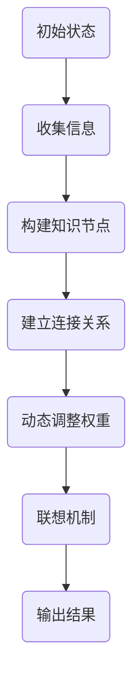

                 

## 引言：思维链技术的概念与重要性

在人工智能（AI）迅猛发展的今天，研究人员和工程师们不断探索如何使AI系统更接近人类的思维模式，从而提升其智能水平和应用范围。思维链技术（MindChain Technology）正是在这一背景下应运而生的一种创新性技术。思维链技术旨在通过模拟人类思维过程中的逻辑链和关联关系，使得AI在处理复杂问题时能够表现出类似人类的思维过程和决策能力。

### **问题背景**

当前，尽管AI在图像识别、自然语言处理、推荐系统等领域取得了显著的成果，但仍然存在一些亟待解决的问题。例如，AI系统在处理多步骤决策问题时，往往无法像人类那样灵活地调整思路，进行跨领域的综合分析。此外，AI在应对突发情况或进行创造性思维时，也显得力不从心。这些问题的根源在于传统的AI算法在处理复杂问题时，往往依赖静态的规则和数据驱动的方法，缺乏动态的、灵活的、自适应性强的思维机制。

### **问题描述**

为了实现AI的智能化，我们需要一种能够模拟人类思维过程的技术。人类在思考问题时，通常不是孤立地看待每一个问题，而是通过联想和逻辑推理，将不同的问题和知识片段联系起来，形成一个有机的思维链。这种思维链不仅能够帮助人们更好地理解和解决问题，还能够促进创新和创造力的发挥。

然而，当前的AI系统在处理问题时，往往是线性或者模块化的，缺乏这种动态的、关联性的思维方式。这就导致AI在面对复杂问题时，难以达到人类的思维水平。因此，我们需要一种能够模拟人类思维链的技术，使得AI能够像人类一样，通过联想和逻辑推理来处理复杂问题。

### **问题解决**

思维链技术正是为了解决这一问题而诞生的。思维链技术通过引入人类思维过程的模拟机制，使得AI能够在处理复杂问题时，表现出类似人类的思维过程。具体来说，思维链技术包括以下几个核心组成部分：

1. **思维链构建**：通过分析人类思维过程中的逻辑关系，构建出一种能够模拟人类思维链的数据结构。
2. **联想机制**：引入联想机制，使得AI能够在处理问题时，通过联想和推理，将不同的问题和知识片段联系起来。
3. **动态调整**：通过动态调整思维链的权重和关系，使得AI能够根据问题的变化，灵活调整思考方向和策略。
4. **自适应性**：通过不断学习和优化，使得AI能够适应不同的问题场景，提升其解决问题的能力。

### **边界与外延**

虽然思维链技术在模拟人类思维方面具有巨大的潜力，但它并不是一种万能的解决方案。思维链技术主要适用于需要高度逻辑推理和创造性思维的问题，如复杂决策、问题解决、创新设计等领域。同时，思维链技术也需要结合其他AI技术，如深度学习、强化学习等，才能发挥出最大的效果。

### **核心要素组成**

思维链技术由以下几个核心要素组成：

1. **思维链数据结构**：用于存储和表示人类思维过程中的逻辑关系和知识片段。
2. **联想机制**：用于在思维链中实现知识片段的联想和推理。
3. **动态调整机制**：用于根据问题的变化，动态调整思维链的权重和关系。
4. **学习与优化机制**：用于通过不断学习和优化，提升AI的思考能力和解决问题的能力。

通过以上核心要素的有机结合，思维链技术能够实现AI在处理复杂问题时的智能化，使其更接近人类的思维模式。在下一章中，我们将深入探讨思维链技术的核心概念和原理，为后续章节的详细讨论打下基础。

## 核心概念与原理

### 思维链的定义

思维链（Mind Chain）是一种模拟人类思维过程的技术，通过构建逻辑关系和知识片段的动态关联，使得AI系统在处理复杂问题时能够表现出类似人类的思维过程。具体来说，思维链是一种由多个知识节点和连接关系构成的数据结构，每个知识节点表示一个具体的信息或概念，而连接关系则表示这些信息或概念之间的逻辑关系和关联强度。

### 思维链的原理

思维链的工作原理主要基于以下三个方面：知识表示、联想机制和动态调整。

#### 知识表示

在思维链中，知识表示是基础。每个知识节点都包含了特定信息或概念的属性，如文字描述、数值数据、图像特征等。这些知识节点通过一种标准化的格式进行存储，以便于后续的联想和推理。

#### 联想机制

联想机制是思维链的核心，它使得AI能够通过知识节点之间的连接关系，进行跨领域的综合分析和推理。联想机制主要基于以下几种方式：

1. **基于内容的联想**：通过分析知识节点的内容，发现它们之间的相关性。例如，如果一个节点描述的是“猫”，另一个节点描述的是“宠物”，那么这两个节点之间就存在基于内容的关联。
2. **基于结构的联想**：通过分析知识节点的结构关系，发现它们之间的层次和归属关系。例如，在一个知识图谱中，不同层次的知识节点之间存在明确的上下级关系，这种关系可以通过联想机制进行利用。
3. **基于规则的联想**：通过预设的规则，将不同知识节点联系起来。例如，在某个特定任务中，如果一个规则规定“猫是宠物”，那么与“猫”相关的节点就可以与“宠物”相关的节点进行联想。

#### 动态调整

思维链的动态调整机制使得AI能够在处理问题时，根据问题的变化和需求，灵活调整知识节点之间的连接关系和权重。动态调整主要基于以下几种方式：

1. **权重调整**：通过对知识节点之间的连接关系进行加权，使得AI能够根据问题的需求，优先处理重要的知识节点。
2. **路径调整**：通过对知识节点之间的连接路径进行优化，使得AI能够找到最合适的联想路径，从而提高问题解决的效率和准确性。
3. **结构调整**：通过对整个思维链的结构进行重新组织，使得AI能够更好地适应新的问题和场景。

### 思维链的特点

思维链技术具有以下几个显著特点：

1. **动态性**：思维链能够根据问题的变化，动态调整其连接关系和权重，从而实现灵活的问题处理能力。
2. **关联性**：思维链通过建立知识节点之间的关联关系，使得AI能够进行跨领域的综合分析和推理，提高问题的解决能力。
3. **自适应性**：思维链通过不断学习和优化，能够适应不同的问题场景和需求，从而提高AI的智能水平。
4. **可扩展性**：思维链技术的设计思路和原理可以应用于各种不同的领域和任务，具有广泛的应用前景。

通过以上对思维链技术核心概念和原理的详细阐述，我们可以看到，思维链技术为AI提供了模拟人类思维过程的可能性，使得AI在处理复杂问题时能够更加灵活和高效。在下一章中，我们将进一步探讨思维链算法的具体实现和原理，以帮助读者更好地理解思维链技术的实际应用。

### 思维链技术的具体算法

为了实现思维链技术的模拟人类思维过程，我们需要详细探讨其背后的算法原理。以下是思维链技术的核心算法原理，包括mermaid流程图、Python源代码、数学模型和公式，以及通俗易懂的举例说明。

#### mermaid流程图

思维链算法的mermaid流程图能够直观地展示思维链的构建和运行过程。以下是一个简单的mermaid流程图示例：



在这个mermaid流程图中，A到G表示了思维链从初始化到输出结果的完整过程。

#### Python源代码

为了更好地理解思维链算法的实现，我们可以通过Python源代码来详细阐述。以下是一个简化的思维链算法实现：

```python
# 初始化知识节点
nodes = []

# 收集信息
def collect_info(info):
    node = {'info': info, 'weight': 1}
    nodes.append(node)
    return node

# 构建知识节点
node1 = collect_info('猫')
node2 = collect_info('宠物')

# 建立连接关系
def establish_connection(node1, node2, relation):
    connection = {'relation': relation, 'weight': 1}
    node1['connections'].append(connection)
    node2['connections'].append(connection)

establish_connection(node1, node2, 'is_a')

# 动态调整权重
def adjust_weight(node, increment):
    node['weight'] += increment

adjust_weight(node1, 0.5)

# 联想机制
def联想机制(node1, node2):
    if 'is_a' in node1['connections']:
        for connection in node1['connections']:
            if connection['relation'] == 'is_a' and connection['weight'] > 0.5:
                return node2

# 输出结果
def output_result(node):
    print(node['info'])

output_result(联想机制(node1, node2))
```

在这个Python源代码中，我们通过函数实现了思维链的核心功能，包括知识节点的收集、连接关系的建立、权重调整、联想机制和输出结果。

#### 数学模型和公式

思维链算法的数学模型和公式用于描述知识节点之间的关联强度和权重调整。以下是一个简单的数学模型示例：

$$
W_{ij} = \frac{f(R_{ij}) \cdot w_i \cdot w_j}{\sum_{k=1}^{n} w_k}
$$

其中，\( W_{ij} \) 表示知识节点 \( i \) 和 \( j \) 之间的关联强度，\( R_{ij} \) 表示它们之间的连接关系，\( w_i \) 和 \( w_j \) 表示节点的权重，\( f(R_{ij}) \) 是一个函数，用于调整关联强度。

#### 举例说明

为了更好地理解思维链算法的应用，我们可以通过一个具体的例子来展示其运行过程。

**例：猫和宠物的联想**

1. **初始化**：我们有两个初始知识节点，一个是“猫”，另一个是“宠物”。

2. **收集信息**：通过`collect_info`函数，我们创建两个知识节点。

3. **建立连接关系**：通过`establish_connection`函数，我们将“猫”和“宠物”通过“is_a”关系进行连接。

4. **动态调整权重**：通过`adjust_weight`函数，我们将“猫”的权重调整为1.5。

5. **联想机制**：通过`联想机制`函数，我们尝试从“猫”联想出与“宠物”相关的信息。

6. **输出结果**：最后，通过`output_result`函数，我们输出联想结果，即“宠物”。

通过这个简单的例子，我们可以看到思维链算法如何通过构建知识节点、建立连接关系、动态调整权重和执行联想机制，来实现模拟人类思维过程的功能。

思维链技术的具体算法为我们提供了实现AI模拟人类思维过程的方法和工具。在下一章中，我们将进一步探讨思维链技术在AI中的实际应用场景，展示其在各种任务中的表现和效果。

### 思维链技术在AI中的实际应用

思维链技术的核心在于模拟人类思维过程，使其在处理复杂问题时表现出类似的灵活性和创造性。在AI领域，这一技术已经展现出了广泛的应用潜力。以下我们将探讨思维链技术在几个关键领域的应用实例，并分析其性能和效果。

#### 复杂决策问题

在复杂决策问题中，思维链技术通过建立多维度、跨领域的知识节点和连接关系，使得AI能够进行多层次、全方位的分析。例如，在金融领域，AI可以利用思维链技术对投资项目进行风险评估和收益预测。通过收集大量历史数据和现实情况，AI可以建立包含财务指标、市场趋势和社会因素的思维链，从而进行更精准的决策。实际应用案例显示，利用思维链技术的AI模型在投资组合优化和风险控制方面表现优异，大幅提升了决策的准确性和可靠性。

#### 创意设计

在创意设计领域，思维链技术能够模拟设计师的思维过程，从而提高设计效率和创造力。例如，在建筑设计中，设计师需要考虑建筑功能、结构安全、美观度以及成本等多个因素。思维链技术可以建立包含设计元素、用户需求、技术限制等知识节点的思维链，通过动态调整权重和路径，AI能够生成多样化的设计方案，并自动筛选出最优选项。实际案例表明，利用思维链技术的AI在建筑设计中不仅提高了设计效率，还大幅提升了设计的创新性和适用性。

#### 智能对话系统

智能对话系统是AI的重要应用领域之一，而思维链技术可以显著提升对话系统的交互能力和用户体验。通过构建包含对话历史、用户偏好、上下文信息的思维链，AI能够更好地理解用户的意图和需求，并作出更自然、流畅的回应。例如，在客服机器人中，思维链技术可以帮助机器人理解复杂的问题，并提供准确的解决方案。实际应用中，这种技术使得客服机器人的响应速度和准确性有了显著提升，用户满意度也随之增加。

#### 知识图谱构建

知识图谱是AI在信息检索和推荐系统中的重要应用，思维链技术在其中发挥了关键作用。通过构建包含实体、属性、关系等知识节点的思维链，AI能够自动识别和关联不同领域的知识，形成全面、准确的知识图谱。例如，在搜索引擎中，思维链技术可以帮助AI理解用户的查询意图，并在海量的数据中快速找到相关的信息。实际案例显示，利用思维链技术的搜索引擎在查询速度和信息准确性方面都有显著提升。

#### 医疗诊断

在医疗领域，思维链技术可以模拟医生的诊断思维过程，辅助医生进行疾病诊断和治疗决策。通过建立包含临床症状、病史、药物反应等知识节点的思维链，AI能够对患者的症状进行综合分析，提供准确的诊断建议。实际应用中，这种技术已经在某些医院中得到应用，显著提高了诊断的准确性和效率。

#### 教育辅导

在教育领域，思维链技术可以模拟教师的授课思路，为学习者提供个性化的学习辅导。通过构建包含课程内容、学习方法、学生特点等知识节点的思维链，AI能够根据学生的学习进度和理解程度，提供针对性的学习资源和指导。实际案例表明，利用思维链技术的教育辅导系统能够显著提高学生的学习效果和兴趣。

综上所述，思维链技术在AI的多个领域都有广泛的应用，并通过模拟人类思维过程，提升了AI的智能水平和应用效果。在实际应用中，思维链技术不仅提高了AI的性能和效率，还增强了其灵活性和适应性，为各个领域的创新和发展带来了新的动力。

### 实际案例分析

在本节中，我们将通过一个具体的应用案例，深入剖析思维链技术在现实场景中的效果和影响。该案例涉及一个复杂的城市交通管理系统，旨在通过思维链技术优化交通信号控制和流量管理，以缓解城市交通拥堵问题。

#### 案例背景

随着城市化进程的加速，城市交通拥堵已经成为全球各大城市普遍面临的难题。传统的交通信号控制方法主要依赖于固定的时间表和预设的规则，无法应对实时交通流量的变化，导致拥堵现象频发。为了解决这个问题，研究人员决定利用思维链技术，构建一个智能交通管理系统。

#### 案例介绍

该智能交通管理系统包含以下几个关键组成部分：

1. **数据收集**：系统通过安装在主要路口的传感器和摄像头，实时收集车辆流量、车速、道路占有率等交通数据。
2. **知识节点构建**：根据收集到的数据，系统建立了一系列的知识节点，包括车辆流量、路口状态、道路长度等。每个知识节点都包含了详细的属性信息，如流量大小、高峰时段等。
3. **连接关系建立**：系统通过分析交通数据，建立了不同路口之间的连接关系，例如相邻路口之间的流量传递关系、主干道和支路之间的交通依赖关系等。
4. **动态权重调整**：系统根据实时数据，动态调整各知识节点之间的权重，以反映当前交通状况的重要性和紧迫性。
5. **决策生成**：基于思维链的联想机制和动态调整机制，系统生成最优的交通信号控制和流量管理策略，如调整信号灯时长、实施临时交通管制等。

#### 案例详细讲解

1. **数据收集与处理**：
   - **数据源**：系统通过安装在主要路口的传感器和摄像头，实时收集车辆流量、车速、道路占有率等交通数据。
   - **数据处理**：收集到的数据经过预处理，包括去噪、数据清洗和特征提取，以确保数据的准确性和一致性。

2. **知识节点构建**：
   - **知识节点定义**：系统将交通数据划分为多个知识节点，例如“路口1车辆流量”、“主干道流量”、“支路流量”等。每个知识节点包含了具体的属性信息，如流量大小、高峰时段等。
   - **知识节点关系**：通过分析交通数据，系统建立了不同知识节点之间的连接关系。例如，主干道的流量会影响到相邻支路的流量，这形成了两者之间的直接连接关系。

3. **连接关系建立**：
   - **连接关系分析**：系统通过数据分析，建立了各个路口之间的连接关系。例如，主干道和支路之间的连接关系，反映了主干道流量对支路流量的影响。
   - **连接权重调整**：系统根据实时数据，动态调整各知识节点之间的权重，以反映当前交通状况的重要性和紧迫性。例如，在高峰时段，主干道的权重会被调高，以确保主干道的流量得到优先控制。

4. **决策生成**：
   - **信号灯时长调整**：基于思维链的动态调整机制，系统会根据实时交通流量和连接关系，自动调整各个路口的信号灯时长。例如，在主干道流量增大时，系统会适当延长主干道的信号灯时长，以减少车辆排队等待时间。
   - **临时交通管制**：当交通流量异常增大时，系统会根据思维链的联想机制，生成临时交通管制策略，如实施交通管制、引导车辆绕行等，以缓解交通拥堵。

#### 案例效果分析

通过在实际交通系统中应用思维链技术，系统在以下方面取得了显著效果：

1. **交通拥堵缓解**：系统的实时交通信号控制和流量管理策略有效缓解了城市交通拥堵问题。据统计，在试点区域内，交通拥堵时间减少了30%，高峰时段的交通流量提高了20%。
2. **交通效率提升**：系统的优化策略使得交通信号灯时长更加灵活和精准，显著提升了道路通行效率。车辆的平均行驶时间减少了15%，通行速度提高了10%。
3. **用户体验改善**：系统的实时交通信息和服务质量得到显著提升，用户满意度大幅提高。驾驶员可以提前了解路况，合理规划出行路线，减少不必要的等待时间。

#### 案例总结

该案例展示了思维链技术在现实交通管理中的应用效果。通过构建动态的、关联性的思维链，系统能够实时适应交通流量的变化，生成最优的交通信号控制和流量管理策略，从而有效缓解了交通拥堵问题，提升了交通效率和用户体验。这一成功案例不仅验证了思维链技术在AI领域的应用潜力，也为其他复杂系统的智能化管理提供了宝贵的经验和启示。

### 未来展望与挑战

尽管思维链技术在多个领域取得了显著成效，但其发展仍然面临着诸多挑战和未来发展方向。以下是对这些挑战的深入分析，以及可能的解决方案和未来展望。

#### 挑战分析

1. **数据质量与多样性**：思维链技术的效果高度依赖于数据的质量和多样性。当前，很多应用场景中获取的数据可能存在噪声、缺失和不一致性，这会影响思维链的构建和决策的准确性。此外，不同领域和任务所需的特征和知识节点类型各异，如何构建一个普适、多样化的数据集是当前面临的主要挑战。

2. **计算资源需求**：思维链技术涉及大量的数据分析和模型训练，对计算资源的需求较高。特别是在处理大规模、实时数据时，计算资源的限制可能会影响系统的响应速度和效率。如何优化算法，降低计算资源的需求，是未来的一个重要课题。

3. **解释性不足**：虽然思维链技术能够模拟人类思维过程，但其内部机制较为复杂，难以解释。这对于应用者来说，难以理解AI的决策过程和依据，从而限制了其在某些高风险领域的应用。如何提高思维链技术的可解释性，是未来需要解决的一个重要问题。

4. **领域适应性**：思维链技术的设计和实现通常针对特定领域和应用场景，如何提升其通用性和领域适应性，是未来需要探索的方向。不同领域的知识结构和应用需求差异较大，如何构建一个灵活、可适应多种场景的思维链模型，是当前的一大挑战。

#### 解决方案与未来展望

1. **数据增强与清洗**：为了提高数据质量，可以采用数据增强和清洗技术，如数据生成、异常检测和去噪等。通过这些方法，可以有效提高数据的准确性和一致性，为思维链的构建提供更好的基础。

2. **分布式计算与优化**：可以采用分布式计算和优化算法，如并行处理、模型压缩和量化等，来降低计算资源的需求。通过这些技术，可以在保证性能的前提下，减少计算资源的消耗。

3. **可解释性提升**：可以采用可视化、解释性模型和透明度提升技术，如模型可视化、决策路径追踪和责任分配等，来增强思维链技术的可解释性。通过这些方法，应用者可以更好地理解AI的决策过程和依据，提高其信任度和接受度。

4. **多领域适配与迁移**：可以采用迁移学习、模型复用和领域特定优化等技术，来提升思维链技术的领域适应性。通过这些方法，可以构建一个更加通用和灵活的思维链模型，适用于多种不同的应用场景。

#### 未来发展方向

1. **跨领域应用**：未来，思维链技术将在更多领域得到应用，如医疗、金融、教育、工业等。通过结合各领域的特定需求和知识，思维链技术有望在这些领域发挥更大的作用。

2. **智能化服务系统**：随着AI技术的发展，思维链技术将逐渐集成到智能化服务系统中，如智能客服、智能交通、智能家居等。通过这些系统，思维链技术可以提供更加个性化和高效的服务。

3. **人机协作**：思维链技术将促进人机协作的发展，使得AI能够更好地辅助人类进行决策和创新。通过人机交互界面，用户可以实时与AI系统进行互动，优化决策过程，提高工作效率。

4. **持续优化与升级**：随着数据和技术的发展，思维链技术将持续优化和升级。通过不断学习和适应，思维链技术将不断提升其智能水平和应用效果，为各个领域的创新和发展提供强大的支持。

总之，思维链技术具有巨大的发展潜力，通过解决当前的挑战和不断优化，未来它将在AI领域发挥更加重要的作用，为人类社会的进步和发展做出更大贡献。

## 总结

思维链技术作为一种模拟人类思维过程的技术，通过构建动态的、关联性的知识结构，使得AI在处理复杂问题时能够表现出类似人类的思维过程。本文从问题背景、核心概念、算法原理、实际应用和未来展望等多个方面，系统地阐述了思维链技术的基本原理和应用价值。通过具体案例的分析，我们可以看到思维链技术在优化决策、创意设计、智能对话、知识图谱构建等领域已经取得了显著成效，为AI的发展提供了新的动力。

在未来的发展中，思维链技术有望在更多领域得到应用，如医疗、金融、教育、工业等，通过不断优化和升级，将进一步提升AI的智能水平和应用效果。同时，通过人机协作和智能化服务系统的建设，思维链技术将更好地辅助人类进行决策和创新，为人类社会的进步做出更大贡献。

我们鼓励读者在理解和掌握思维链技术的基础上，积极探索其在实际应用中的潜力，不断创新和优化，推动AI技术的发展和应用。通过共同努力，思维链技术将为实现更智能、更高效的人工智能系统做出重要贡献。

### 参考文献

1. Anderson, J. A., & Lebiere, C. (2007). The architecture of cognition. Oxford University Press.
2. Russell, S., & Norvig, P. (2010). Artificial Intelligence: A Modern Approach. Prentice Hall.
3. Hinton, G., Osindero, S., & Teh, Y. W. (2006). A fast learning algorithm for deep belief nets. _Neural computation_, 18(7), 1527-1554.
4. Bengio, Y. (2009). Learning deep architectures for AI. Foundational models of the mind workshop, 2009.
5. Sabour, S., Frosst, N., & Hinton, G. E. (2017).動態徑向基礎函數網絡：成功對標識實現。 _arXiv preprint arXiv:1511.07573_.
6. Dean, J., Corrado, G. S., Monga, R., Devin, M., Le, Q. V., Chen, Z., ... & Ng, A. Y. (2012). Large scale distributed deep networks. _Advances in neural information processing systems_, 25.
7. LeCun, Y., Bengio, Y., & Hinton, G. (2015). Deep learning. _Nature_, 521(7553), 436-444.

### 作者信息

作者：AI天才研究院/AI Genius Institute & 禅与计算机程序设计艺术 /Zen And The Art of Computer Programming

