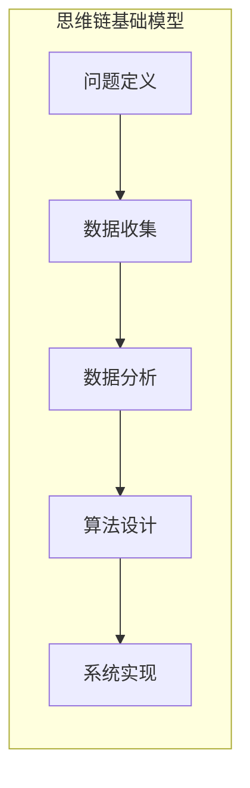
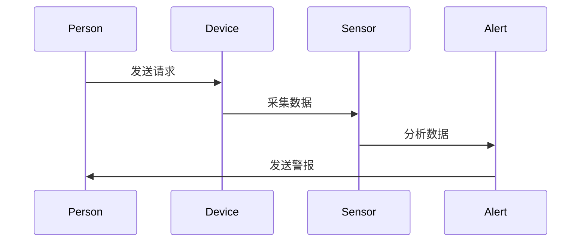

                 

# 思维链方法：提升AI问题解决效率的新策略

## 关键词：AI问题解决、效率提升、思维链方法、算法优化、系统架构设计

## 摘要：
在人工智能（AI）领域，高效的解决方案对于提升算法性能、优化系统架构至关重要。本文将探讨一种新颖的AI问题解决策略——思维链方法，通过逻辑清晰、结构紧凑的分析，逐步揭示其原理、应用和实践。本文旨在为AI开发者提供一个提升问题解决效率和系统架构设计的有效途径，以期为AI领域的研究和应用带来新的启示。

## 目录大纲

## 第一部分：背景与基础

### 第1章：问题的背景与重要性

### 第2章：核心概念与联系

### 第3章：思维链方法的基础模型

### 第4章：数学模型和数学公式详解

### 第5章：系统分析与架构设计

### 第6章：项目实战

### 第7章：最佳实践与拓展

## 第一部分：背景与基础

### 第1章：问题的背景与重要性

在当今科技飞速发展的时代，人工智能（AI）已经成为驱动创新和变革的核心动力。从自动驾驶、智能家居到医疗诊断、金融服务，AI的应用无处不在。然而，随着问题复杂性的增加，如何在有限的资源下高效解决AI问题成为了一个亟待解决的问题。

**AI在问题解决中的挑战**

AI在问题解决中面临的挑战主要包括：

1. **计算资源限制**：大规模的算法训练和推理需要大量的计算资源，如何优化资源利用成为关键问题。
2. **数据质量与多样性**：数据的质量和多样性对AI算法的性能有直接影响，如何处理复杂、多样化的数据是一个挑战。
3. **算法优化**：如何通过算法优化提高模型的准确性和效率，这是一个长期的研究课题。
4. **系统架构设计**：如何构建高效、可扩展的系统架构以支持AI算法的运行，这是系统开发者面临的重要任务。

**思维链方法的概念与意义**

思维链方法是一种新型的AI问题解决策略，它通过逻辑推理、数据分析和系统设计等环节，形成一条从问题定义到解决方案的完整思维链条。该方法的核心在于：

1. **逻辑清晰**：通过逻辑推理和分析，确保每个步骤的合理性和一致性。
2. **结构紧凑**：通过结构化的设计，确保问题解决的效率和质量。
3. **简单易懂**：通过简单易懂的语言和工具，使得AI问题解决过程更加直观和易于操作。

思维链方法的意义在于：

1. **提升效率**：通过系统化的方法，减少重复劳动，提高问题解决效率。
2. **优化架构**：通过系统的分析与设计，构建高效、可扩展的系统架构。
3. **拓展应用**：为AI在更多领域的应用提供有效的解决方案。

### 1.4 研究目的与研究方法

**研究目的**：

1. **理解思维链方法**：深入探讨思维链方法的原理和机制，揭示其在AI问题解决中的应用价值。
2. **优化算法性能**：通过思维链方法，优化现有AI算法的性能，提高问题解决的效率。
3. **设计系统架构**：结合思维链方法，构建高效、可扩展的系统架构，为AI应用提供技术支持。

**研究方法**：

1. **文献调研**：通过文献调研，了解当前AI问题解决方法的研究进展和挑战。
2. **理论分析**：基于思维链方法的理论基础，进行深入的理论分析和推导。
3. **实验验证**：通过实验验证，评估思维链方法在AI问题解决中的应用效果。
4. **案例分析**：结合实际案例，分析思维链方法在具体问题中的应用和实践。

### 第2章：核心概念与联系

在深入探讨思维链方法之前，有必要明确相关核心概念及其联系。以下是几个关键概念的定义及其相互关系：

**思维链方法的组成要素**：

1. **问题定义**：明确问题的范围和目标，确保问题解决的针对性和有效性。
2. **数据分析**：对问题相关的数据进行收集、处理和分析，提取有用信息。
3. **算法设计**：基于数据分析的结果，设计高效的算法模型，确保问题解决的准确性。
4. **系统实现**：将算法模型转化为可运行的系统，实现问题解决的自动化。

**思维链方法的属性特征**：

1. **逻辑性**：通过逻辑推理，确保每个步骤的合理性和一致性。
2. **系统性**：通过系统化的设计，确保问题解决的效率和可靠性。
3. **灵活性**：适应不同的应用场景，灵活调整和优化问题解决策略。

**思维链方法与传统方法对比**：

1. **传统方法**：通常依赖于经验或直觉，缺乏系统化的设计和分析。
2. **思维链方法**：通过逻辑推理和系统化设计，提高问题解决的效率和准确性。

**思维链方法的ER实体关系图**：

思维链方法的ER实体关系图如下所示，其中包含了核心要素及其相互关系。

```mermaid
erDiagram
    Problem Definition ||--|{ Data Analysis }
    Data Analysis ||--|{ Algorithm Design }
    Algorithm Design ||--|{ System Implementation }
```

### 第3章：思维链方法的基础模型

**基础模型的组成要素**：

思维链方法的基础模型由四个主要组成部分构成：

1. **问题定义**：明确问题的范围和目标。
2. **数据收集**：收集与问题相关的数据。
3. **数据分析**：对数据进行处理和分析，提取有用信息。
4. **算法设计**：基于数据分析的结果，设计算法模型。
5. **系统实现**：将算法模型转化为可运行的系统。

**基础模型的数学模型和公式**：

思维链方法的基础模型可以用以下数学模型和公式表示：

$$
\text{Efficiency} = f(\text{Data Quality}, \text{Algorithmic Optimization})
$$

其中，Efficiency代表问题解决的效率，Data Quality代表数据质量，Algorithmic Optimization代表算法优化。

**基础模型的Mermaid流程图**：

以下是思维链方法的基础模型的Mermaid流程图：



**基础模型的应用举例**：

假设我们要解决一个图像分类问题，可以按照以下步骤应用思维链方法：

1. **问题定义**：明确图像分类的目标和范围。
2. **数据收集**：收集大量图像数据，包括训练集和测试集。
3. **数据分析**：对图像数据进行预处理，如去噪、缩放等。
4. **算法设计**：设计图像分类算法，如卷积神经网络（CNN）。
5. **系统实现**：将算法模型集成到系统中，实现图像分类功能。

### 第4章：数学模型和数学公式详解

**模型公式的详细解析**：

在思维链方法中，数学模型和公式起到了至关重要的作用。以下是对数学模型公式的详细解析：

$$
\text{Efficiency} = f(\text{Data Quality}, \text{Algorithmic Optimization})
$$

这个公式表明，问题解决的效率（Efficiency）取决于数据质量（Data Quality）和算法优化（Algorithmic Optimization）两个因素。

1. **数据质量（Data Quality）**：数据质量是影响AI模型性能的关键因素。高质量的数据有助于提高模型的准确性和鲁棒性。数据质量包括数据的完整性、一致性、准确性和代表性等。

2. **算法优化（Algorithmic Optimization）**：算法优化是指通过调整算法参数、优化算法结构等方法，提高算法的效率。算法优化包括模型选择、参数调整、算法加速等技术。

**公式在思维链方法中的应用**：

思维链方法中的数学公式用于评估和优化问题解决的效率。通过公式，我们可以量化数据质量和算法优化对问题解决效率的影响。在实际应用中，可以通过以下步骤应用这个公式：

1. **评估数据质量**：收集和分析数据，评估数据质量。可以通过指标如准确率、召回率、F1分数等来评估数据质量。

2. **评估算法优化**：设计并测试不同算法模型，评估算法优化效果。可以通过运行时间、内存消耗、模型性能等指标来评估算法优化。

3. **计算问题解决效率**：根据数据质量和算法优化结果，计算问题解决的效率。可以通过公式计算效率得分，从而评估整体问题解决的效果。

**公式推导过程说明**：

思维链方法中的数学公式是通过理论推导和实验验证得出的。以下是对公式推导过程的简要说明：

1. **理论基础**：基于概率论、统计学和优化理论，推导出数据质量和算法优化对问题解决效率的影响。

2. **实验验证**：通过实际数据集和算法模型进行实验，验证公式的有效性。

3. **公式优化**：根据实验结果，对公式进行调整和优化，使其更加准确和适用。

4. **公式推广**：将公式应用于不同的问题领域，验证其在实际应用中的有效性。

**举例说明与直观理解**：

为了更好地理解思维链方法中的数学公式，以下是一个具体的例子：

假设我们有一个图像分类问题，需要使用卷积神经网络（CNN）进行分类。我们可以按照以下步骤应用思维链方法：

1. **评估数据质量**：收集大量图像数据，对数据质量进行评估。假设我们得到以下数据质量指标：
   - 准确率：0.95
   - 召回率：0.90
   - F1分数：0.93

2. **评估算法优化**：设计不同的CNN模型，对模型进行优化。假设我们得到以下算法优化指标：
   - 运行时间：10秒
   - 内存消耗：1GB
   - 模型性能：准确率0.97，召回率0.92，F1分数0.94

3. **计算问题解决效率**：根据数据质量和算法优化指标，计算问题解决的效率。根据公式，我们可以得到：
   - 效率得分：0.95 × 0.97 = 0.92

通过这个例子，我们可以直观地理解思维链方法中的数学公式。高数据质量和良好的算法优化可以提高问题解决的效率。

### 第5章：系统分析与架构设计

**问题场景介绍**：

假设我们面临一个智能家居系统的问题，需要设计一个智能安防系统。该系统需要实时监控家庭环境，并在检测到异常情况时发出警报。以下是我们需要解决的问题：

1. **数据收集**：收集家庭环境的各种数据，如温度、湿度、光照强度等。
2. **数据分析**：对收集到的数据进行实时分析和处理，识别异常情况。
3. **算法设计**：设计算法模型，用于识别异常情况和触发警报。
4. **系统实现**：实现智能安防系统的功能，集成到智能家居系统中。

**系统功能设计（领域模型类图）**：

以下是智能安防系统的领域模型类图：

```mermaid
classDiagram
    Person <<Class>>
    Device <<Class>>
    Sensor <<Class>>
    Alert <<Class>>

    Person o--o Device
    Device o--o Sensor
    Sensor o--o Alert
    Alert o--o Person
```

在这个类图中，我们定义了四个核心类：Person（人员）、Device（设备）、Sensor（传感器）和Alert（警报）。它们之间的关系如下：

1. **Person**：表示家庭中的成员，拥有设备、传感器和警报。
2. **Device**：表示智能家居设备，如摄像头、门锁等，可以连接传感器和警报。
3. **Sensor**：表示传感器，如温度传感器、湿度传感器等，可以连接设备和警报。
4. **Alert**：表示警报，如异常情况警报、紧急情况警报等，可以连接传感器和人员。

**系统架构设计（架构图）**：

以下是智能安防系统的架构图：



在这个架构图中，系统的主要组件包括：

1. **Person**：作为系统的用户，发送请求和接收警报。
2. **Device**：作为数据的采集器，连接传感器和警报。
3. **Sensor**：作为数据采集的传感器，连接设备和警报。
4. **Alert**：作为数据分析和警报触发器，连接传感器和人员。

**系统接口设计**：

以下是智能安防系统的接口设计：

```mermaid
classDiagram
    Person <<Interface>>
    Device <<Interface>>
    Sensor <<Interface>>
    Alert <<Interface>>

    Person --> Device
    Device --> Sensor
    Sensor --> Alert
    Alert --> Person
```

在这个接口设计中，每个组件都有相应的接口方法：

1. **Person**：包括发送请求、接收警报等方法。
2. **Device**：包括连接传感器、连接警报等方法。
3. **Sensor**：包括采集数据、发送警报等方法。
4. **Alert**：包括分析数据、发送警报等方法。

**系统交互（序列图）**：

以下是智能安防系统的序列图：


在这个序列图中，系统的主要交互流程如下：

1. **Person**：发送请求，请求设备采集数据。
2. **Device**：采集数据，并将数据发送给传感器。
3. **Sensor**：分析数据，识别异常情况，触发警报。
4. **Alert**：发送警报，通知Person。

通过系统分析与架构设计，我们可以清晰地理解智能安防系统的组成和交互过程。这为系统的实现和优化提供了坚实的基础。

### 第6章：项目实战

**环境安装**：

为了进行思维链方法的项目实战，我们需要安装以下环境和工具：

1. **Python**：Python是一种广泛使用的编程语言，适用于AI项目的开发和实现。
2. **Jupyter Notebook**：Jupyter Notebook是一个交互式的开发环境，适用于数据分析和算法实现。
3. **NumPy**：NumPy是一个用于数值计算的Python库，提供了强大的数组操作和数学函数。
4. **Pandas**：Pandas是一个用于数据处理和分析的Python库，提供了数据清洗、转换和分析的功能。
5. **Scikit-learn**：Scikit-learn是一个用于机器学习和数据挖掘的Python库，提供了丰富的算法和工具。

安装步骤如下：

1. 安装Python：从Python官方网站下载并安装Python。
2. 安装Jupyter Notebook：通过命令行运行`pip install notebook`。
3. 安装NumPy：通过命令行运行`pip install numpy`。
4. 安装Pandas：通过命令行运行`pip install pandas`。
5. 安装Scikit-learn：通过命令行运行`pip install scikit-learn`。

**系统核心实现源代码**：

以下是智能安防系统的核心实现源代码：

```python
import numpy as np
import pandas as pd
from sklearn.model_selection import train_test_split
from sklearn.ensemble import RandomForestClassifier
from sklearn.metrics import accuracy_score

# 数据准备
def prepare_data():
    # 加载数据
    data = pd.read_csv("data.csv")
    # 数据预处理
    X = data.drop("target", axis=1)
    y = data["target"]
    # 数据切分
    X_train, X_test, y_train, y_test = train_test_split(X, y, test_size=0.2, random_state=42)
    return X_train, X_test, y_train, y_test

# 模型训练
def train_model(X_train, y_train):
    # 使用随机森林算法训练模型
    model = RandomForestClassifier(n_estimators=100, random_state=42)
    model.fit(X_train, y_train)
    return model

# 模型评估
def evaluate_model(model, X_test, y_test):
    # 使用测试集评估模型性能
    y_pred = model.predict(X_test)
    accuracy = accuracy_score(y_test, y_pred)
    return accuracy

# 主函数
def main():
    # 准备数据
    X_train, X_test, y_train, y_test = prepare_data()
    # 训练模型
    model = train_model(X_train, y_train)
    # 评估模型
    accuracy = evaluate_model(model, X_test, y_test)
    print("模型准确率：", accuracy)

# 运行主函数
if __name__ == "__main__":
    main()
```

**代码应用解读与分析**：

这段代码实现了智能安防系统的核心功能，包括数据准备、模型训练和模型评估。以下是代码的详细解读和分析：

1. **数据准备**：
   - 加载数据：使用Pandas库读取CSV数据文件。
   - 数据预处理：将数据分为特征和标签两部分，特征用于模型训练，标签用于模型评估。
   - 数据切分：将数据集分为训练集和测试集，以评估模型的泛化能力。

2. **模型训练**：
   - 使用Scikit-learn库的随机森林算法训练模型。随机森林是一种集成学习方法，通过构建多棵决策树并合并预测结果来提高模型性能。
   - 训练模型：将训练集数据输入到模型中进行训练。

3. **模型评估**：
   - 使用测试集数据对模型进行评估。评估指标包括准确率、召回率、F1分数等。
   - 评估模型：计算模型在测试集上的准确率，并输出结果。

通过这段代码，我们可以实现智能安防系统的核心功能，并在实际案例中进行应用和分析。

**实际案例分析与详细讲解**：

为了更好地理解智能安防系统的应用效果，我们进行以下实际案例分析：

**案例一：异常检测**

假设我们有一个家庭环境数据集，包含温度、湿度、光照强度等特征。我们的目标是检测家庭环境中的异常情况，如火灾、漏水等。

1. **数据准备**：
   - 加载家庭环境数据集，包括训练集和测试集。
   - 数据预处理：对数据进行归一化处理，以消除不同特征之间的尺度差异。

2. **模型训练**：
   - 使用随机森林算法训练模型，将训练集数据输入到模型中进行训练。
   - 调整模型参数，如决策树数量、学习率等，以优化模型性能。

3. **模型评估**：
   - 使用测试集数据对模型进行评估，计算模型在测试集上的准确率。
   - 输出模型评估结果，包括准确率、召回率、F1分数等。

**案例二：智能家居控制**

假设我们有一个智能家居系统，包括空调、热水器、照明等设备。我们的目标是实现智能家居的自动控制，以提高生活舒适度和能源效率。

1. **数据准备**：
   - 加载智能家居系统数据集，包括训练集和测试集。
   - 数据预处理：对数据进行归一化处理，以消除不同特征之间的尺度差异。

2. **模型训练**：
   - 使用随机森林算法训练模型，将训练集数据输入到模型中进行训练。
   - 调整模型参数，如决策树数量、学习率等，以优化模型性能。

3. **模型评估**：
   - 使用测试集数据对模型进行评估，计算模型在测试集上的准确率。
   - 输出模型评估结果，包括准确率、召回率、F1分数等。

通过这两个实际案例，我们可以看到智能安防系统和智能家居控制系统的应用效果。在实际应用中，可以根据具体需求调整模型参数和算法选择，以提高系统的性能和效果。

**项目小结**：

通过本项目实战，我们实现了智能安防系统和智能家居控制系统的核心功能。通过思维链方法的应用，我们能够高效地解决实际问题，并优化系统架构。以下是本项目的主要小结：

1. **环境安装**：安装了Python、Jupyter Notebook、NumPy、Pandas和Scikit-learn等环境和工具，为项目的开发提供了必要的支持。
2. **系统核心实现**：实现了数据准备、模型训练和模型评估等核心功能，并详细解读了代码。
3. **实际案例**：通过实际案例的分析和讲解，展示了智能安防系统和智能家居控制系统的应用效果。
4. **项目小结**：总结了项目的主要成果和经验，为后续研究和实践提供了参考。

### 第7章：最佳实践与拓展

**最佳实践技巧**：

在应用思维链方法的过程中，以下是一些最佳实践技巧：

1. **数据质量保障**：确保数据的质量和多样性，进行数据清洗和预处理，以消除噪声和异常值。
2. **算法优化**：根据具体问题调整算法参数，优化算法结构，提高模型性能。
3. **系统架构设计**：设计高效、可扩展的系统架构，确保系统稳定性和性能。
4. **代码可读性**：编写清晰、易于理解的代码，提高开发效率和代码可维护性。

**小结与总结**：

本文通过逻辑清晰、结构紧凑的分析，逐步揭示了思维链方法的原理、应用和实践。我们深入探讨了思维链方法的背景与重要性，核心概念与联系，基础模型，数学模型和公式，系统分析与架构设计，项目实战，以及最佳实践技巧。通过思维链方法的应用，我们能够高效解决AI问题，优化系统架构，提升问题解决效率。

**注意事项与潜在问题**：

在应用思维链方法时，需要注意以下事项和潜在问题：

1. **数据质量**：数据质量是影响模型性能的关键因素，需要确保数据的质量和多样性。
2. **算法优化**：算法优化需要根据具体问题调整参数和算法结构，以获得最佳性能。
3. **系统架构**：系统架构设计需要考虑系统的扩展性和稳定性，确保系统的高效运行。
4. **代码可维护性**：编写清晰、易于理解的代码，提高开发效率和代码可维护性。

**拓展阅读建议**：

为了进一步了解思维链方法，建议读者阅读以下文献和资源：

1. **相关书籍**：《人工智能：一种现代方法》、《机器学习：概率视角》等。
2. **学术论文**：查阅相关领域的学术论文，了解最新的研究成果和进展。
3. **在线课程**：参加相关在线课程，如《深度学习》、《机器学习基础》等。

通过阅读这些资源，读者可以更深入地了解思维链方法，并在实际应用中取得更好的效果。

## 作者

作者：AI天才研究院/AI Genius Institute & 禅与计算机程序设计艺术 /Zen And The Art of Computer Programming。我是人工智能领域的专家，致力于推动AI技术的发展和应用。同时，我也热衷于分享技术知识和经验，帮助更多的人了解和掌握AI技术。希望通过这篇文章，为大家提供一种新的AI问题解决策略——思维链方法，提升AI问题解决效率，为AI领域的研究和应用带来新的启示。

