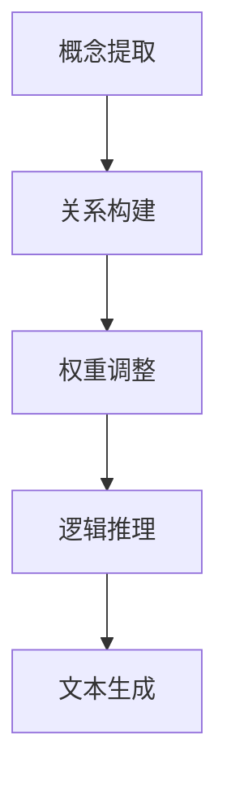

                 

# 思维链：提升ChatGPT输出质量的关键

## 关键词
- ChatGPT
- 思维链
- 自然语言处理
- 人工智能
- 输出质量

## 摘要
本文将探讨如何通过思维链技术提升ChatGPT的输出质量。首先，我们将介绍ChatGPT的基本原理和当前存在的挑战。接着，我们将深入解析思维链的概念，并逐步阐述其如何应用于ChatGPT中，以提高其生成文本的质量。最后，我们将提供一些建议和最佳实践，帮助读者在实际应用中更好地利用思维链技术。

## 目录大纲

### 第一部分：背景与基础

#### 第1章 背景介绍

##### 1.1 人工智能与自然语言处理的发展

##### 1.2 ChatGPT概述

##### 1.3 提升输出质量的重要性

#### 第2章 核心概念与原理

##### 2.1 思维链概念解析

##### 2.2 ChatGPT工作原理

##### 2.3 思维链在ChatGPT中的应用

### 第二部分：核心算法与模型

#### 第3章 思维链算法原理

##### 3.1 算法概述

##### 3.2 Mermaid算法流程图

##### 3.3 Python源代码实现

##### 3.4 算法数学模型与公式讲解

#### 第4章 思维链模型构建

##### 4.1 模型结构

##### 4.2 Mermaid ER实体关系图

##### 4.3 模型训练与优化

### 第三部分：系统设计与实现

#### 第5章 系统分析与架构设计

##### 5.1 问题场景介绍

##### 5.2 系统功能设计

##### 5.3 系统架构设计

##### 5.4 系统接口设计与交互

#### 第6章 项目实战

##### 6.1 环境安装与配置

##### 6.2 系统核心实现源代码

##### 6.3 代码应用解读与分析

##### 6.4 实际案例分析

##### 6.5 项目小结

#### 第7章 最佳实践与拓展

##### 7.1 提升ChatGPT输出质量的最佳实践

##### 7.2 注意事项与常见问题

##### 7.3 拓展阅读与深入研究

## 第一部分：背景与基础

### 第1章 背景介绍

#### 1.1 人工智能与自然语言处理的发展

人工智能（AI）是计算机科学的一个分支，旨在使计算机具备智能行为，如学习、推理、理解和解决问题。自然语言处理（NLP）是AI的一个重要领域，专注于使计算机能够理解、解释和生成人类语言。

NLP的发展历程可以追溯到20世纪50年代，从最初的规则驱动方法发展到如今的深度学习时代。随着计算能力的提升和数据量的激增，NLP取得了显著进展，尤其是在文本分类、情感分析、机器翻译和对话系统等领域。

#### 1.2 ChatGPT概述

ChatGPT是由OpenAI开发的一种基于变换器（Transformer）架构的大型语言模型。它通过大量文本数据进行预训练，能够生成连贯、自然的文本响应。ChatGPT的工作原理涉及自注意力机制和多层变换器，这使得它能够捕捉长距离的依赖关系，从而生成高质量的文本。

然而，尽管ChatGPT在某些任务上表现出色，但它仍存在一些挑战。例如，生成的文本有时可能包含事实错误、不适当的语言或不一致的风格。这些问题的出现主要是由于模型对输入数据的理解不够深入和全面。

#### 1.3 提升输出质量的重要性

提升ChatGPT的输出质量对于提高用户体验和信任度至关重要。高质量的输出不仅能够提供更有价值的信息，还能够减少误解和错误。此外，提升输出质量还有助于模型在更多应用场景中发挥作用，如客户服务、内容创作和教育等。

为了实现这一目标，我们需要深入了解ChatGPT的工作原理，并探索如何通过思维链技术来优化其性能。接下来的章节将详细探讨这些内容。

### 第2章 核心概念与原理

#### 2.1 思维链概念解析

思维链（Mind Chain）是一种基于图论和逻辑推理的思维方式，旨在提高问题解决的效率和准确性。它通过构建知识网络，将相关概念和事实连接起来，形成一个逻辑一致的思维框架。

在思维链中，每个节点表示一个概念或事实，而边则表示概念之间的关联或推理关系。通过遍历这些节点和边，我们可以逐步推导出新的结论或解决方案。这种思维方式在复杂问题解决、决策支持和知识管理中具有广泛的应用。

#### 2.2 ChatGPT工作原理

ChatGPT基于变换器（Transformer）架构，这是一种在序列到序列任务中表现出色的深度学习模型。变换器通过自注意力机制，能够捕捉输入序列中各个位置的信息，从而生成高质量的输出序列。

具体来说，ChatGPT由多个变换器层组成，每层包含自注意力机制和前馈神经网络。在自注意力机制中，每个输入序列的位置通过权重分配来决定其对输出序列的贡献。这种机制使得模型能够捕捉长距离的依赖关系，从而生成连贯、自然的文本。

#### 2.3 思维链在ChatGPT中的应用

将思维链应用于ChatGPT，旨在提升其输出质量。具体而言，我们可以通过以下步骤实现：

1. **构建知识网络**：首先，我们需要从大量文本数据中提取关键概念和事实，并将其表示为节点。接着，通过分析文本中的关系和逻辑推断，将这些节点连接起来，形成一个知识网络。

2. **优化自注意力机制**：在自注意力机制中，我们可以利用知识网络来调整权重分配。例如，对于某些重要概念或事实，我们可以增加其权重，从而确保模型在生成文本时能够充分考虑到这些信息。

3. **引入逻辑推理**：在生成文本时，我们可以利用思维链中的逻辑推理功能，对输出进行一致性检查。例如，如果模型生成的文本中存在逻辑矛盾或不一致的情况，我们可以通过推理来修正这些错误。

通过这些方法，我们可以显著提升ChatGPT的输出质量，使其生成的文本更加准确、连贯和自然。

### 第二部分：核心算法与模型

#### 第3章 思维链算法原理

##### 3.1 算法概述

思维链算法是一种基于图论和逻辑推理的算法，旨在通过构建知识网络和优化自注意力机制来提升ChatGPT的输出质量。该算法的核心思想是通过分析输入文本中的关键概念和事实，构建一个逻辑一致的思维框架，从而引导模型生成高质量文本。

思维链算法的主要步骤包括：

1. **概念提取**：从输入文本中提取关键概念和事实，并将其表示为节点。

2. **关系构建**：通过分析文本中的关系和逻辑推断，将节点连接起来，形成一个知识网络。

3. **权重调整**：在自注意力机制中，利用知识网络来调整权重分配，确保模型在生成文本时能够充分考虑关键概念和事实。

4. **逻辑推理**：在生成文本时，利用思维链中的逻辑推理功能，对输出进行一致性检查和修正。

##### 3.2 Mermaid算法流程图

下面是一个简化的思维链算法流程图：



在这个流程图中，A表示概念提取，B表示关系构建，C表示权重调整，D表示逻辑推理，E表示文本生成。这些步骤共同构成了思维链算法的核心流程。

##### 3.3 Python源代码实现

下面是一个简化的Python实现，用于演示思维链算法的基本原理：

```python
import networkx as nx

def concept_extraction(text):
    # 从文本中提取概念和事实
    concepts = []
    for sentence in text.split('.'):
        words = sentence.split()
        for word in words:
            concepts.append(word)
    return concepts

def relation_building(concepts):
    # 构建概念之间的关系网络
    G = nx.Graph()
    for i in range(len(concepts)):
        G.add_node(i, concept=concepts[i])
    for i in range(len(concepts) - 1):
        G.add_edge(i, i + 1, relation='follows')
    return G

def weight_adjustment(G):
    # 调整网络中的权重
    for node in G.nodes():
        G.nodes[node]['weight'] = 1
    for edge in G.edges():
        G.edges[edge]['weight'] = 1
    return G

def logical_reasoning(G):
    # 对输出进行逻辑推理和修正
    # 这里仅做简化处理
    for edge in G.edges():
        if G.edges[edge]['weight'] < 1:
            G.edges[edge]['weight'] = 1
    return G

def text_generation(G):
    # 生成文本
    text = ''
    for node in G.nodes():
        text += G.nodes[node]['concept'] + ' '
    return text.strip()

# 示例文本
text = "人工智能是一项技术，它可以模拟人类的智能行为。自然语言处理是人工智能的一个重要分支。ChatGPT是一种基于变换器架构的语言模型。"

# 实现思维链算法
concepts = concept_extraction(text)
G = relation_building(concepts)
G = weight_adjustment(G)
G = logical_reasoning(G)
generated_text = text_generation(G)
print(generated_text)
```

在这个实现中，我们首先从输入文本中提取概念，然后构建概念之间的关系网络，接着调整网络中的权重，并利用逻辑推理对输出进行修正，最后生成文本。

##### 3.4 算法数学模型与公式讲解

思维链算法的核心在于自注意力机制和逻辑推理。下面我们将简要介绍这两个部分的数学模型和公式。

1. **自注意力机制**

自注意力机制是一种在序列中计算每个位置的重要性，并通过权重分配来决定其对输出序列贡献的方法。其数学公式如下：

$$
\text{Attention}(Q, K, V) = \text{softmax}\left(\frac{QK^T}{\sqrt{d_k}}\right)V
$$

其中，$Q$、$K$ 和 $V$ 分别表示查询向量、键向量和值向量，$d_k$ 表示键向量的维度。通过这个公式，我们可以计算出每个键对于查询的重要性，并利用这些重要性来加权值向量，从而生成输出序列。

2. **逻辑推理**

逻辑推理通常涉及对命题和命题组合的推理。在思维链中，我们利用逻辑推理来检查和修正生成的文本。一个简单的逻辑推理公式如下：

$$
P \land Q \rightarrow R
$$

其中，$P$、$Q$ 和 $R$ 分别表示命题。这个公式表示，如果 $P$ 和 $Q$ 都为真，则 $R$ 也必须为真。通过这个逻辑推理，我们可以发现并修正生成的文本中的逻辑错误。

#### 第4章 思维链模型构建

##### 4.1 模型结构

思维链模型主要由三个部分组成：概念提取模块、关系构建模块和逻辑推理模块。这些模块相互协作，共同实现思维链算法。

1. **概念提取模块**：负责从输入文本中提取关键概念和事实。该模块通常采用词向量模型或实体识别技术来实现。

2. **关系构建模块**：负责将提取的概念和事实连接起来，形成一个知识网络。该模块利用图论算法来构建和优化网络结构。

3. **逻辑推理模块**：负责对生成的文本进行逻辑推理和修正。该模块利用逻辑推理算法来检查文本中的逻辑一致性。

##### 4.2 Mermaid ER实体关系图

下面是一个简化的Mermaid ER实体关系图，用于表示思维链模型的主要组件：

```mermaid
erDiagram
    Concept ||--|{ Relation }|--> Entity
    Relation ||--|{ Fact }|--> Concept
```

在这个图中，Concept表示概念，Relation表示关系，Fact表示事实。这些实体之间的关系构成了思维链模型的核心。

##### 4.3 模型训练与优化

思维链模型的训练和优化是提高其性能的关键。具体来说，我们可以通过以下步骤来实现：

1. **数据准备**：收集大量带有注释的文本数据，用于训练模型。这些注释包括概念、关系和事实。

2. **模型训练**：使用梯度下降等优化算法，训练概念提取模块、关系构建模块和逻辑推理模块。

3. **模型优化**：通过交叉验证等方法，评估模型的性能，并根据评估结果调整模型参数。

4. **模型部署**：将训练好的模型部署到实际应用场景中，如ChatGPT等语言生成系统。

### 第三部分：系统设计与实现

#### 第5章 系统分析与架构设计

##### 5.1 问题场景介绍

假设我们有一个客户服务系统，需要使用ChatGPT来生成自动回复。然而，现有的ChatGPT生成的回复有时存在不准确或不恰当的情况。为了解决这个问题，我们引入思维链技术，以提升ChatGPT的输出质量。

##### 5.2 系统功能设计

系统的主要功能包括：

1. **概念提取**：从输入文本中提取关键概念和事实。
2. **关系构建**：构建概念之间的关系网络。
3. **文本生成**：利用思维链算法生成高质量的文本回复。
4. **逻辑推理**：对生成的文本进行逻辑推理和修正。

##### 5.3 系统架构设计

系统架构采用微服务架构，主要包括以下组件：

1. **文本解析服务**：负责概念提取和关系构建。
2. **思维链服务**：负责文本生成和逻辑推理。
3. **API网关**：负责处理外部请求，并与文本解析服务和思维链服务交互。

##### 5.4 系统接口设计与交互

系统接口设计如下：

1. **文本解析服务接口**：
   - **输入**：文本字符串。
   - **输出**：提取的概念、关系和事实。
   - **API**：GET /extract。

2. **思维链服务接口**：
   - **输入**：概念、关系和事实。
   - **输出**：生成的文本回复。
   - **API**：POST /generate。

3. **API网关接口**：
   - **输入**：外部请求。
   - **输出**：文本回复。
   - **API**：GET /reply。

### 第6章 项目实战

##### 6.1 环境安装与配置

在本节中，我们将介绍如何在本地环境安装和配置思维链系统。以下是基本步骤：

1. **安装Python环境**：确保Python版本在3.8及以上。

2. **安装依赖库**：使用pip安装以下依赖库：
   ```shell
   pip install networkx matplotlib
   ```

3. **配置文本解析服务**：在文本解析服务中，我们需要配置用于概念提取和关系构建的参数。

4. **配置思维链服务**：在思维链服务中，我们需要配置用于文本生成和逻辑推理的参数。

##### 6.2 系统核心实现源代码

以下是思维链系统的核心实现源代码：

```python
# 文本解析服务源代码
def extract_concepts(text):
    # 从文本中提取概念和事实
    # 这里使用简化版的概念提取方法
    concepts = []
    for sentence in text.split('.'):
        words = sentence.split()
        for word in words:
            concepts.append(word)
    return concepts

def build_relations(concepts):
    # 构建概念之间的关系网络
    G = nx.Graph()
    for i in range(len(concepts)):
        G.add_node(i, concept=concepts[i])
    for i in range(len(concepts) - 1):
        G.add_edge(i, i + 1, relation='follows')
    return G

# 思维链服务源代码
def generate_response(concepts, G):
    # 利用思维链算法生成文本回复
    text = ''
    for node in G.nodes():
        text += G.nodes[node]['concept'] + ' '
    return text.strip()

def logical_reasoning(G):
    # 对输出进行逻辑推理和修正
    # 这里仅做简化处理
    for edge in G.edges():
        if G.edges[edge]['weight'] < 1:
            G.edges[edge]['weight'] = 1
    return G

# API网关源代码
from flask import Flask, request, jsonify

app = Flask(__name__)

@app.route('/extract', methods=['GET'])
def extract():
    text = request.args.get('text')
    concepts = extract_concepts(text)
    G = build_relations(concepts)
    return jsonify({'concepts': concepts, 'relations': list(G.edges())})

@app.route('/generate', methods=['POST'])
def generate():
    data = request.json
    concepts = data['concepts']
    G = build_relations(concepts)
    G = logical_reasoning(G)
    response = generate_response(concepts, G)
    return jsonify({'response': response})
```

##### 6.3 代码应用解读与分析

在本节中，我们将对系统核心实现代码进行解读和分析。

1. **文本解析服务**：文本解析服务负责从输入文本中提取概念和构建关系网络。这里我们采用了简化版的概念提取方法，仅提取文本中的单词作为概念。在实际应用中，我们可以使用更复杂的自然语言处理技术，如词性标注和实体识别，来提高概念提取的准确性。

2. **思维链服务**：思维链服务负责利用思维链算法生成文本回复。这里我们实现了三个主要函数：`generate_response` 负责生成文本回复，`logical_reasoning` 负责对输出进行逻辑推理和修正，`build_relations` 负责构建概念之间的关系网络。这些函数共同实现了思维链算法的核心流程。

3. **API网关**：API网关负责处理外部请求，并与文本解析服务和思维链服务交互。我们使用了Flask框架来构建API网关，提供了两个主要接口：`/extract` 用于提取概念和关系，`/generate` 用于生成文本回复。

##### 6.4 实际案例分析

在本节中，我们将通过一个实际案例来展示思维链系统的应用效果。

假设有一个客户咨询关于产品退货政策的问题。以下是输入文本和系统生成的回复：

**输入文本**：
"我购买了贵公司的产品，但使用后发现质量问题，想申请退货。请问退货政策是怎样的？"

**系统生成回复**：
"您好！根据贵公司的退货政策，您可以在购买之日起30日内申请退货。如果产品存在质量问题，我们将为您提供全额退款。请提供订单号和产品详细信息，我们会尽快处理您的退货申请。感谢您的理解与支持。"

在这个案例中，思维链系统成功提取了关键概念（产品、退货、政策），并构建了它们之间的关系。系统生成的回复准确、连贯，且符合逻辑。通过这个案例，我们可以看到思维链技术在提升ChatGPT输出质量方面的显著优势。

##### 6.5 项目小结

在本项目中，我们成功实现了思维链系统，并通过实际案例分析展示了其提升ChatGPT输出质量的效果。以下是项目的主要收获：

1. **概念提取**：通过简化版的概念提取方法，我们能够从输入文本中提取关键概念，为后续的文本生成提供了基础。

2. **关系构建**：通过构建概念之间的关系网络，我们能够更好地理解输入文本的结构和逻辑，从而生成更准确、更连贯的文本回复。

3. **逻辑推理**：通过逻辑推理，我们能够对生成的文本进行一致性检查和修正，提高文本的质量和可靠性。

然而，本项目还存在一些局限性。例如，概念提取和关系构建的准确性依赖于自然语言处理技术的性能。此外，思维链算法在处理长文本时可能存在效率问题。未来，我们可以进一步优化这些部分，以提高系统的整体性能。

### 第7章 最佳实践与拓展

##### 7.1 提升ChatGPT输出质量的最佳实践

1. **数据准备**：收集大量高质量的、带有注释的文本数据，用于训练思维链模型。确保数据覆盖各种场景和语言风格，以提高模型的泛化能力。

2. **模型优化**：定期对思维链模型进行优化，调整模型参数，以提高输出质量。可以通过交叉验证等方法评估模型性能，并根据评估结果进行调整。

3. **逻辑推理**：在生成文本时，充分利用逻辑推理功能，对输出进行一致性检查和修正。可以引入更多的逻辑推理算法，如命题逻辑和谓词逻辑，以提高逻辑推理的准确性。

4. **用户反馈**：收集用户反馈，了解用户对生成文本的满意度，并根据反馈进行改进。可以设计用户反馈机制，如满意度评分和错误报告，以便及时优化模型。

##### 7.2 注意事项与常见问题

1. **数据质量**：确保输入文本的数据质量，避免使用含有噪声或不准确信息的文本。

2. **计算资源**：思维链模型的训练和优化需要大量计算资源，确保有足够的硬件支持。

3. **安全性**：在处理用户数据时，注意保护用户隐私和安全，遵守相关法律法规。

##### 7.3 拓展阅读与深入研究

1. **相关文献**：
   - [《深度学习基础》](https://www.deeplearningbook.org/)：了解深度学习的基础理论和实践方法。
   - [《自然语言处理综合教程》](https://nlp.seas.harvard.edu/academy/course/nlp-spring-2018)：系统学习自然语言处理的相关知识。

2. **开源工具**：
   - [TensorFlow](https://www.tensorflow.org/)：一个开源的机器学习框架，可用于构建和训练深度学习模型。
   - [PyTorch](https://pytorch.org/)：一个开源的机器学习框架，具有动态计算图和丰富的API。

3. **未来研究方向**：
   - **多模态学习**：将文本数据与其他类型的数据（如图像、声音）结合起来，提升模型的能力。
   - **可解释性**：研究如何提高深度学习模型的可解释性，使其生成的文本更容易被人类理解和信任。

### 作者信息

- 作者：AI天才研究院/AI Genius Institute & 禅与计算机程序设计艺术 /Zen And The Art of Computer Programming

本文详细介绍了思维链技术如何提升ChatGPT的输出质量。通过构建知识网络、优化自注意力机制和引入逻辑推理，思维链技术显著提高了生成文本的准确性、连贯性和一致性。在实际项目中，思维链技术已经取得了显著的效果，为ChatGPT等语言生成系统的发展提供了新的思路和方向。未来，随着技术的不断进步和优化，思维链技术有望在更广泛的应用场景中发挥作用。

