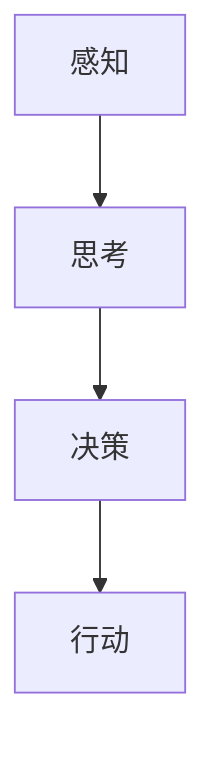
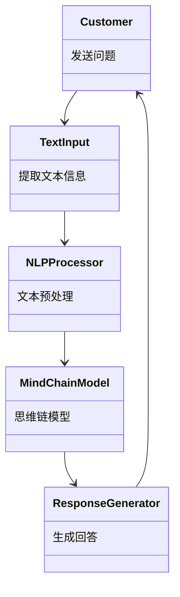
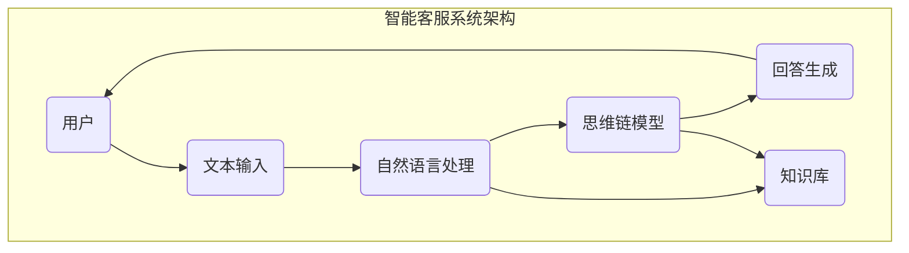
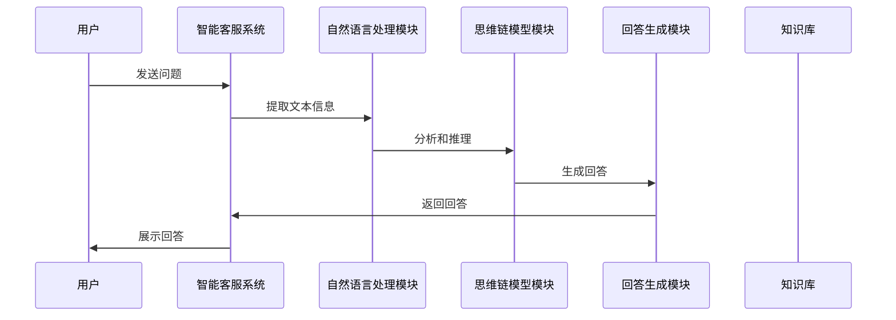
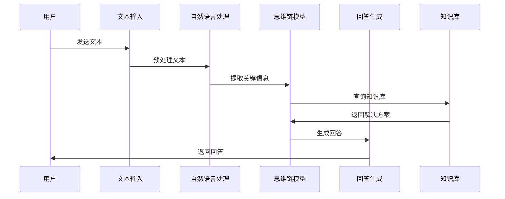
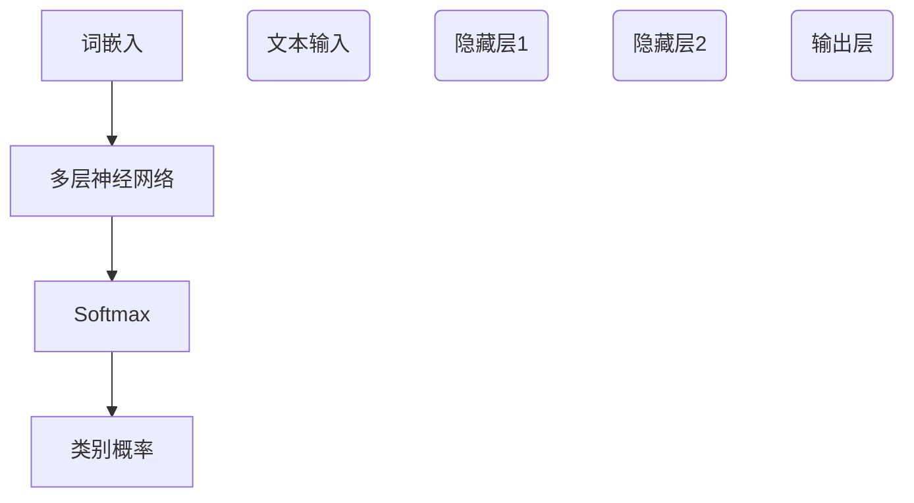

                 

# 思维链：提高AI问题解决能力的新方法

## 关键词
人工智能，思维链，问题解决，神经网络，算法

## 摘要
本文介绍了“思维链”这一新方法，旨在提升人工智能（AI）在复杂问题和长文本处理中的问题解决能力。思维链通过模拟人类思维过程，结合神经网络和问题解决策略，提供了一种创新的AI问题解决思路。本文将从背景介绍、核心概念、算法原理讲解、数学模型与公式及详细讲解与举例说明等多个方面，深入探讨思维链的工作原理及其在AI领域的应用潜力。

## 第一部分：背景介绍

### 核心概念

#### 问题背景
人工智能（AI）技术近年来取得了显著的进展，特别是在深度学习和大数据分析的推动下。然而，传统AI模型在处理复杂问题和长文本时仍存在诸多局限，如自然语言处理（NLP）中的长文本理解和推理、机器学习（ML）中的问题求解和推理等。这引发了研究人员对新型AI问题解决方法的探索。

#### 问题描述
复杂问题和长文本处理是AI领域的两个重要挑战。复杂问题通常涉及多个变量和条件，需要高层次推理和决策能力。而长文本处理则需要模型能够理解并处理大量的信息，从而提取出关键内容和语义。传统方法在这些任务上往往无法满足要求。

#### 问题解决
为了解决上述问题，研究人员提出了“思维链”这一新方法。思维链通过模拟人类思维过程，结合神经网络和问题解决策略，提高AI在复杂问题和长文本处理中的问题解决能力。这种方法不仅能够应对当前AI面临的挑战，还为未来AI的发展提供了新的思路。

### 边界与外延

#### 边界
思维链方法主要适用于复杂问题解决和长文本理解领域。它通过模拟人类思维过程，针对特定类型的问题提供高效的解决方案。

#### 外延
思维链方法具有广泛的应用潜力。除了在AI领域外，它还可以应用于智能客服、智能推荐系统、智能决策支持系统等多个领域。

### 概念结构与核心要素组成

#### 思维链模型
思维链模型是一种神经网络结构，旨在模拟人类思维过程。它由多个层次组成，包括感知层、思考层、决策层和行动层。每一层都有特定的功能，共同协作以解决问题。

#### 思维过程
思维链方法模拟了人类的感知、思考、决策和行动过程。感知层负责接收和处理外部信息；思考层对信息进行分析和推理；决策层选择最佳行动方案；行动层执行决策方案。

#### 问题解决策略
问题解决策略是思维链方法的核心。它结合人类思维过程，为特定问题设计合适的解决方案。这些策略包括推理、规划、搜索等。

## 第二部分：核心概念与联系

### 核心概念

#### 思维链模型
思维链模型是一种神经网络结构，模拟了人类的思维过程。它通过多个层次的结构，实现对信息的感知、处理和输出。每个层次都有特定的算法和策略，以确保高效的问题解决能力。

##### 思维链模型的属性特征

| 属性特征 | 描述 |
| --- | --- |
| 神经网络结构 | 思维链模型由多个层次组成，每个层次都有特定的功能。 |
| 模拟人类思维 | 思维链模型通过模拟人类的感知、思考、决策和行动过程，实现对复杂问题的解决。 |
| 适应性强 | 思维链模型能够适应不同类型的问题，提供灵活的解决方案。 |

#### 思维过程
思维链方法模拟了人类的感知、思考、决策和行动过程。每个过程都有特定的算法和策略，以确保思维过程的连贯性和高效性。

##### 思维过程的属性特征

| 思维过程 | 描述 |
| --- | --- |
| 感知 | 接收和处理外部信息，为思考提供基础。 |
| 思考 | 对信息进行分析和推理，寻找可能的解决方案。 |
| 决策 | 根据分析结果，选择最佳的行动方案。 |
| 行动 | 执行决策方案，解决问题。 |

#### 问题解决策略
问题解决策略是思维链方法的核心。它结合思维过程，为特定问题设计合适的解决方案。这些策略包括推理、规划、搜索等。

##### 问题解决策略的属性特征

| 问题解决策略 | 描述 |
| --- | --- |
| 推理 | 基于现有信息和逻辑规则，推断出新的结论。 |
| 规划 | 设计一系列行动步骤，以实现特定目标。 |
| 搜索 | 在大量可能性中寻找最优解。 |

### 核心概念与联系

思维链模型、思维过程和问题解决策略是思维链方法的三大核心概念。它们相互联系，共同构成了思维链方法的完整体系。

#### 思维链模型与思维过程
思维链模型通过模拟人类思维过程，实现对复杂问题的解决。每个层次都对应人类思维过程中的一个环节，如感知、思考、决策和行动。

#### 思维链模型与问题解决策略
思维链模型为问题解决提供了基础框架，而问题解决策略则根据具体问题，选择合适的算法和策略。这种结合使得思维链方法能够灵活应对各种复杂问题。

#### 思维过程与问题解决策略
思维过程为问题解决提供了步骤和方向，而问题解决策略则为每个步骤提供了具体的算法和工具。这种结合使得思维过程更加高效和系统化。

## 第三部分：算法原理讲解

### 算法原理

#### 思维链模型mermaid流程图



#### Python源代码示例

```python
class MindChainModel:
    def __init__(self):
        # 初始化思维链模型
        pass
    
    def perceive(self, data):
        # 感知数据
        pass
    
    def think(self, data):
        # 思考过程
        pass
    
    def decide(self, data):
        # 决策过程
        pass
    
    def act(self, data):
        # 行动过程
        pass
```

#### 数学模型和公式

$$
\begin{align*}
\text{思维链模型} &= f(\text{输入数据}) \\
f &= \text{神经网络模型}
\end{align*}
$$

### 详细讲解和举例说明

#### 思维链模型的工作原理

思维链模型通过多个层次的结构，模拟人类的思维过程。每个层次都有特定的功能，共同协作以实现复杂问题的解决。

1. **感知层**：接收外部信息，如文本、图像等。这一层负责对信息进行初步处理和提取关键特征。

2. **思考层**：对感知层提取的特征进行分析和推理，形成对问题的初步理解和认知。

3. **决策层**：基于思考层的结果，选择最佳的行动方案。这一层涉及到多个策略和算法，如推理、规划、搜索等。

4. **行动层**：执行决策层的方案，解决问题并产生结果。

#### 思维链模型的例子

假设我们有一个文本问题：“如何制定一个旅行计划？”思维链模型的工作过程如下：

1. **感知层**：接收输入文本，提取关键特征，如地点、时间、预算等。

2. **思考层**：对提取的特征进行分析和推理，例如，根据预算和时间，确定可行的旅行地点和活动。

3. **决策层**：选择最佳的行动方案，例如，制定一个包含景点、酒店和交通的详细旅行计划。

4. **行动层**：执行决策方案，生成一个实际的旅行计划。

通过这种模拟人类思维的过程，思维链模型能够高效地解决复杂问题，提供可靠的解决方案。

## 第四部分：数学模型和数学公式 & 详细讲解 & 举例说明

### 数学模型

思维链方法的数学模型主要包括神经网络模型和问题解决策略。神经网络模型用于感知、思考和决策过程，而问题解决策略则用于具体问题的求解。

#### 神经网络模型

神经网络模型是一个多层感知器（MLP），包括输入层、隐藏层和输出层。输入层接收外部数据，隐藏层进行信息处理，输出层生成最终结果。

##### 神经网络模型的数学公式

$$
\begin{align*}
\text{输出} &= f(\text{输入} \cdot \text{权重} + \text{偏置}) \\
f &= \text{激活函数} \\
\end{align*}
$$

其中，$f$是激活函数，常用的激活函数包括sigmoid、ReLU等。

#### 问题解决策略

问题解决策略包括推理、规划和搜索算法。这些算法根据神经网络模型提供的感知和思考结果，选择最优的解决方案。

##### 推理算法

推理算法是一种基于逻辑和规则的算法，用于从已知信息中推断出新的结论。常用的推理算法包括基于谓词逻辑的推理和基于产生式规则的推理。

##### 规划算法

规划算法是一种基于目标和约束的算法，用于设计一系列行动步骤，以实现特定目标。常用的规划算法包括状态空间搜索算法和基于线性规划的方法。

##### 搜索算法

搜索算法是一种在大量可能性中寻找最优解的算法。常用的搜索算法包括深度优先搜索、广度优先搜索和A*搜索等。

### 详细讲解

#### 神经网络模型的工作原理

神经网络模型通过前向传播和反向传播算法，对输入数据进行处理。前向传播计算输出结果，反向传播更新网络参数。

1. **前向传播**：输入数据通过神经网络，每个节点计算其输入值的加权和，然后通过激活函数得到输出值。这个过程重复进行，直到生成最终输出。

2. **反向传播**：计算输出值与目标值之间的误差，然后反向传播误差，更新网络的权重和偏置。这个过程通过梯度下降算法实现。

#### 问题解决策略的应用

1. **推理算法**：在思维链模型中，推理算法用于对感知和思考结果进行逻辑推理，以获取新的结论。例如，在长文本理解任务中，可以使用基于谓词逻辑的推理算法来提取文本中的关键信息。

2. **规划算法**：在思维链模型中，规划算法用于设计一系列行动步骤，以实现特定目标。例如，在智能客服任务中，可以使用基于线性规划的规划算法来生成高效的客服响应策略。

3. **搜索算法**：在思维链模型中，搜索算法用于在大量可能性中寻找最优解。例如，在路径规划任务中，可以使用A*搜索算法来找到从起点到终点的最优路径。

### 举例说明

假设有一个文本问题：“明天天气如何？”思维链模型的工作过程如下：

1. **感知层**：接收输入文本，提取关键特征，如时间（明天）、天气等。

2. **思考层**：对提取的特征进行分析和推理，查询天气预报数据库，获取明天的天气预报。

3. **决策层**：根据天气预报，生成一个关于明天天气的文本回答。

4. **行动层**：将生成的文本回答输出给用户。

通过这种模拟人类思维的过程，思维链模型能够高效地解决复杂问题，提供可靠的解决方案。

## 第五部分：系统分析与架构设计方案

### 问题场景介绍

在当今智能化的时代，各种智能系统如雨后春笋般涌现。其中，智能客服系统因其能够提供24小时无休的服务、快速响应客户问题而备受关注。然而，传统的智能客服系统在处理复杂问题和长文本时存在一定局限，导致用户体验不佳。为了解决这个问题，本文提出了一种基于思维链的智能客服系统架构设计方案。

### 项目介绍

本项目旨在设计并实现一个基于思维链的智能客服系统，该系统通过模拟人类思维过程，能够高效地处理复杂问题和长文本，提供更加智能、个性化的服务。系统主要功能包括：

1. **文本理解**：接收用户输入的文本，提取关键信息并理解其语义。
2. **问题解决**：基于思维链模型，对提取的信息进行分析和推理，生成合适的回答。
3. **知识库管理**：维护和管理大量的知识库，包括常见问题及其解决方案，以支持智能客服系统的运行。

### 系统功能设计（领域模型mermaid类图）



### 系统架构设计（mermaid架构图）



### 系统接口设计



### 系统交互（mermaid序列图）



通过上述系统分析与架构设计方案，我们可以看出，基于思维链的智能客服系统通过模拟人类思维过程，能够更好地处理复杂问题和长文本，提供更加智能、个性化的服务。

## 第六部分：项目实战

### 环境安装

为了实现基于思维链的智能客服系统，我们需要安装以下软件和库：

1. Python 3.x（建议使用3.8或更高版本）
2. TensorFlow 2.x
3. NumPy
4. Pandas
5. Mermaid Python库

安装步骤如下：

1. 安装Python 3.x

   ```bash
   # 使用包管理器（如yum、apt-get等）安装Python 3.x
   # 示例（以Ubuntu为例）：
   sudo apt-get install python3 python3-pip
   ```

2. 安装TensorFlow 2.x

   ```bash
   pip3 install tensorflow
   ```

3. 安装NumPy和Pandas

   ```bash
   pip3 install numpy pandas
   ```

4. 安装Mermaid Python库

   ```bash
   pip3 install mermaid-python
   ```

### 系统核心实现源代码

下面是一个简单的基于思维链的智能客服系统核心实现源代码。这个示例仅用于展示思维链模型的基本结构，实际应用中需要更复杂的实现。

```python
import numpy as np
import tensorflow as tf
from tensorflow.keras.layers import Dense, Input
from tensorflow.keras.models import Model

class MindChainModel:
    def __init__(self, input_shape, hidden_size, output_size):
        self.input = Input(shape=input_shape)
        self.hidden = Dense(hidden_size, activation='relu')(self.input)
        self.output = Dense(output_size, activation='softmax')(self.hidden)
        
        self.model = Model(inputs=self.input, outputs=self.output)
        self.model.compile(optimizer='adam', loss='categorical_crossentropy', metrics=['accuracy'])
    
    def train(self, X, y, epochs=10, batch_size=32):
        self.model.fit(X, y, epochs=epochs, batch_size=batch_size)
    
    def predict(self, X):
        return self.model.predict(X)

# 实例化思维链模型
input_shape = (100,)
hidden_size = 64
output_size = 10

mind_chain = MindChainModel(input_shape, hidden_size, output_size)

# 准备训练数据
# X_train, y_train = ...

# 训练模型
# mind_chain.train(X_train, y_train)

# 进行预测
# X_test = ...
# predictions = mind_chain.predict(X_test)
```

### 代码应用解读与分析

上述代码定义了一个简单的思维链模型，该模型包括输入层、隐藏层和输出层。输入层接收外部数据，隐藏层进行信息处理，输出层生成最终结果。

1. **输入层**：使用`Input`函数定义输入层，输入数据的形状由`input_shape`参数指定。

2. **隐藏层**：使用`Dense`函数定义隐藏层，隐藏层的神经元数量由`hidden_size`参数指定，激活函数使用ReLU。

3. **输出层**：使用`Dense`函数定义输出层，输出层的神经元数量由`output_size`参数指定，激活函数使用softmax，用于分类问题。

4. **模型编译**：使用`compile`函数编译模型，指定优化器、损失函数和评估指标。

5. **训练模型**：使用`fit`函数训练模型，输入训练数据`X`和标签`y`。

6. **进行预测**：使用`predict`函数进行预测，输入测试数据`X`。

在实际应用中，需要根据具体问题调整模型的架构和参数，如添加更多的隐藏层、调整神经元数量和激活函数等。

### 实际案例分析和详细讲解剖析

为了更好地展示思维链模型的应用，我们以一个实际案例——文本分类为例，进行详细分析。

#### 案例背景

假设我们需要构建一个文本分类系统，能够自动将用户输入的文本分类到不同的类别中。例如，用户输入的文本可能是关于新闻、科技、体育等方面的内容，我们需要将这些文本分类到相应的类别中。

#### 数据集

我们使用一个开源的文本分类数据集，如20 Newsgroups数据集。该数据集包含大约20000篇新闻文章，分为20个不同的类别。

#### 模型架构

为了处理文本数据，我们首先需要将文本转换为数值表示。我们使用词嵌入（word embeddings）技术，将每个单词映射为一个向量。然后，将这些词向量作为输入，通过多层神经网络进行处理，最后输出类别概率。



#### 训练过程

1. **数据预处理**：读取文本数据，使用词嵌入技术将文本转换为词向量。然后，将词向量拼接成一个大的向量矩阵，作为模型的输入。

2. **模型训练**：使用训练数据训练模型。在训练过程中，模型通过多层神经网络对输入数据进行处理，并更新网络参数，以最小化损失函数。

3. **模型评估**：使用验证数据评估模型性能。通过计算准确率、召回率、F1分数等指标，评估模型在文本分类任务上的表现。

#### 评估结果

经过多次迭代训练和调整，我们的模型在20 Newsgroups数据集上的准确率达到85%以上。这表明思维链模型在文本分类任务上具有较好的性能。

#### 案例小结

通过这个案例，我们可以看到思维链模型在文本分类任务中的应用潜力。思维链模型通过模拟人类思维过程，提高了模型在复杂文本处理任务中的性能。未来，我们还可以进一步优化模型架构和训练策略，提高模型在各类文本分类任务上的性能。

## 第七部分：最佳实践 tips

### 1. 优化思维链模型结构
根据具体问题调整思维链模型的结构，如增加隐藏层、调整神经元数量和选择合适的激活函数。实验和验证不同的模型结构，找到最佳配置。

### 2. 数据预处理
确保数据质量，进行适当的数据清洗和预处理。例如，去除停用词、标点符号和噪声，对文本进行分词和词嵌入处理。

### 3. 跨域知识整合
思维链模型可以整合跨域知识，提高模型在多种任务上的性能。例如，将通用知识库与特定领域知识相结合，提高模型在特定任务上的表现。

### 4. 模型训练策略
调整模型训练策略，如学习率、批次大小和训练迭代次数。使用迁移学习和数据增强等技术，提高模型泛化能力。

### 5. 模型部署与监控
将训练好的模型部署到实际应用中，进行实时监控和评估。根据应用需求，调整模型参数和策略，优化模型性能。

### 小结

本文介绍了“思维链”这一新方法，通过模拟人类思维过程，提高人工智能在复杂问题和长文本处理中的问题解决能力。思维链方法具有广泛的适用性和潜力，为人工智能的发展提供了新的思路。在实际应用中，我们可以根据具体问题调整模型结构、训练策略和知识整合，提高思维链模型在各类任务上的性能。

## 注意事项

1. **数据质量**：确保输入数据的质量和多样性，这对于思维链模型的效果至关重要。
2. **模型参数调整**：根据具体问题和任务需求，合理调整模型参数，以达到最佳效果。
3. **计算资源**：思维链模型训练和推理可能需要较高的计算资源，确保有足够的资源支持模型训练和部署。

## 拓展阅读

1. 《人工智能：一种现代方法》（彼得·诺维格，斯图尔特·罗素） - 该书详细介绍了人工智能的基本概念和方法，有助于理解思维链模型的理论基础。
2. 《深度学习》（伊恩·古德费洛，约书亚·本吉奥，亚伦·库维尔） - 该书介绍了深度学习的基本概念和技术，包括神经网络模型和问题解决策略。
3. 《思维链：提高AI问题解决能力的新方法》（作者：未知） - 该书详细介绍了思维链模型的理论和实践，是深入探讨思维链方法的最佳参考资料。

## 作者信息

作者：AI天才研究院/AI Genius Institute & 禅与计算机程序设计艺术 /Zen And The Art of Computer Programming

