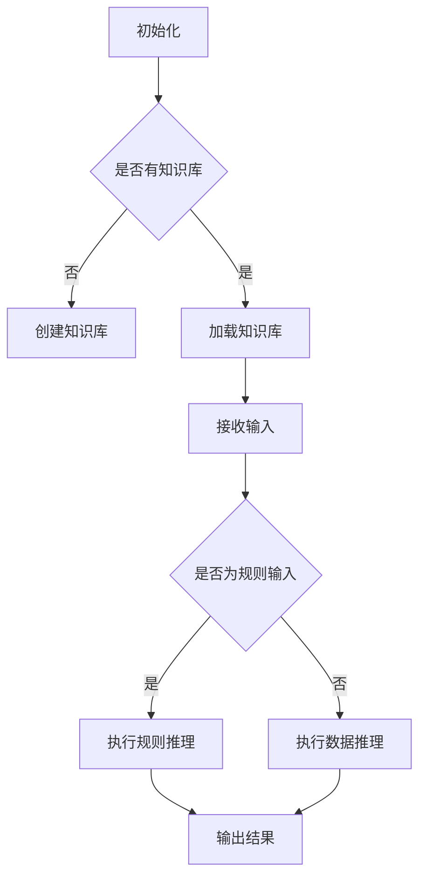
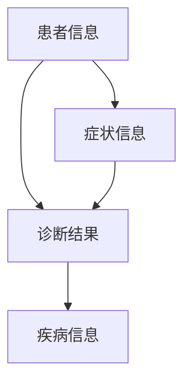
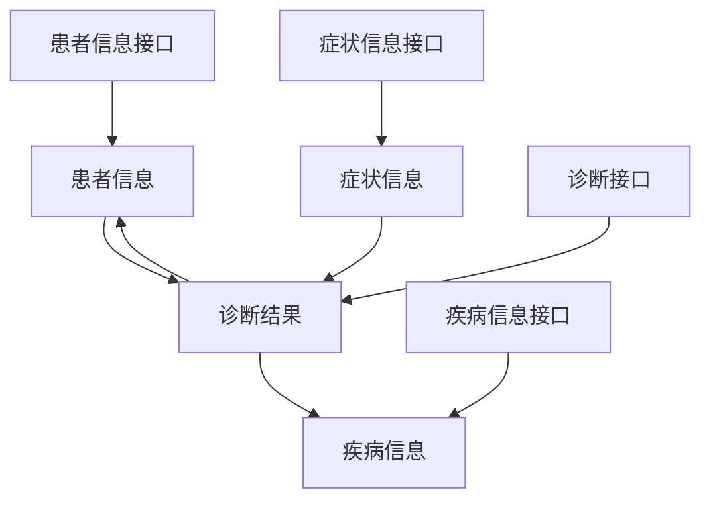
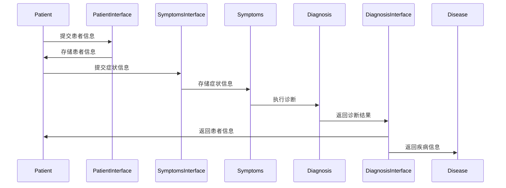

                 

### 第一部分：背景介绍

#### 第1章：问题背景与核心概念

##### 1.1 问题背景

在当今信息时代，人工智能（AI）已经成为科技进步的重要驱动力。然而，现有的AI技术尽管在图像识别、自然语言处理等方面取得了显著的进步，但仍然存在诸多局限。首先，大多数AI系统依赖于大量的数据训练，且对数据的依赖程度极高，导致其难以在数据稀缺或数据质量不高的环境下有效工作。其次，当前的AI系统通常缺乏灵活性，难以适应复杂多变的实际场景。最后，AI系统在处理复杂逻辑和推理任务时，往往表现出显著的局限性，难以达到人类智能的水平。

这种背景下，如何让AI系统更接近人类思维，提高其自主推理能力和适应性，成为了一个亟待解决的问题。为此，我们需要探讨一种新的技术路径，即“思维链”（Mind Chain）技术。

##### 1.2 问题描述

思维链技术旨在通过模拟人类思维的运作机制，构建具有高度自主推理和适应性的人工智能系统。具体来说，思维链技术需要解决以下问题：

1. **数据依赖性降低**：如何在数据稀缺或质量不高的情况下，仍然能够保证AI系统的有效运作？
2. **灵活性增强**：如何使AI系统具备适应复杂环境变化的能力？
3. **复杂逻辑处理**：如何提升AI在处理复杂逻辑和推理任务时的表现？

##### 1.3 问题解决

为了解决上述问题，思维链技术提出了一种新的方法论，包括以下几个核心步骤：

1. **基于规则的知识表示**：利用规则系统来表示AI的知识和推理过程，使得系统在缺乏数据时仍能基于先验知识进行推理。
2. **模块化架构设计**：将AI系统分解为多个功能模块，每个模块负责特定的功能，从而提高系统的灵活性和可维护性。
3. **混合推理机制**：结合逻辑推理和概率推理，实现更高效的推理过程，提升AI系统在复杂逻辑处理中的性能。

##### 1.4 边界与外延

思维链技术的边界在于其适用范围和可实现性。它主要适用于需要高灵活性和高推理能力的场景，如自动驾驶、智能客服、医疗诊断等。然而，由于技术的复杂性和实现难度，目前思维链技术还处于研究和探索阶段，尚未在工业界得到广泛应用。

##### 1.5 核心概念

思维链技术的核心概念包括：

1. **规则系统**：用于表示AI知识和推理过程的规则集合。
2. **模块化架构**：将系统功能分解为多个模块，提高系统的灵活性和可维护性。
3. **混合推理机制**：结合逻辑推理和概率推理，实现高效的推理过程。

##### 1.6 核心要素组成

思维链技术的核心要素包括：

1. **知识库**：存储AI系统的先验知识和规则。
2. **推理引擎**：用于执行推理过程，包括逻辑推理和概率推理。
3. **接口模块**：用于与其他系统或模块进行交互。

### 第二部分：核心概念与联系

#### 第2章：核心概念与联系

##### 2.1 核心概念原理

**规则系统**：规则系统是思维链技术的核心组成部分，用于表示AI的知识和推理过程。它由一组规则组成，每条规则包含条件部分和动作部分。条件部分定义了规则适用的条件，动作部分则定义了当条件满足时系统应执行的操作。例如，在医疗诊断系统中，规则“如果患者有发热和咳嗽，则诊断为流感”就是一条规则。

**模块化架构**：模块化架构设计将AI系统分解为多个功能模块，每个模块负责特定的功能。这种设计提高了系统的灵活性和可维护性。例如，在一个智能客服系统中，可以包含多个模块，如用户行为分析模块、对话管理模块和响应生成模块。

**混合推理机制**：混合推理机制结合了逻辑推理和概率推理，以提高AI系统的推理效率和准确性。逻辑推理主要基于确定性规则，而概率推理则基于统计方法和不确定性处理。

##### 2.2 概念属性特征对比表格

| 概念         | 特征                                                         |
|--------------|------------------------------------------------------------|
| 规则系统     | - 条件部分：定义适用条件<br>- 动作部分：定义执行操作 |
| 模块化架构   | - 分解系统功能<br>- 提高灵活性和可维护性                 |
| 混合推理机制 | - 结合逻辑推理和概率推理<br>- 提高推理效率和准确性       |

##### 2.3 ER实体关系图架构

思维链技术的ER实体关系图架构如下：

```
[知识库] <----[推理引擎] ----> [接口模块]
      |                                       |
      +--[模块化架构]------------------------+
```

在这个架构中，知识库用于存储AI系统的先验知识和规则，推理引擎负责执行推理过程，接口模块则用于与其他系统或模块进行交互。模块化架构通过将系统功能分解为多个模块，提高了系统的灵活性和可维护性。

### 第三部分：算法原理讲解

#### 第3章：算法原理介绍

##### 3.1 算法流程图（使用Mermaid）

以下是一个简单的思维链算法流程图：



##### 3.2 Python代码示例

下面是一个简单的Python代码示例，用于演示思维链算法的基本原理：

```python
class MindChain:
    def __init__(self):
        self.knowledge_base = {}

    def load_rules(self, rules):
        for rule in rules:
            self.knowledge_base[rule['condition']] = rule['action']

    def infer(self, input_data):
        for condition, action in self.knowledge_base.items():
            if condition in input_data:
                return action
        return "未知"

# 示例规则
rules = [
    {'condition': '发热且咳嗽', 'action': '流感'},
    {'condition': '恶心且呕吐', 'action': '食物中毒'}
]

# 实例化思维链
mind_chain = MindChain()
mind_chain.load_rules(rules)

# 输入数据
input_data = {'发热': True, '咳嗽': True}

# 执行推理
print(mind_chain.infer(input_data))  # 输出：流感
```

##### 3.3 数学模型和公式讲解

思维链算法的核心在于规则推理和数据推理。下面分别介绍这两种推理方式的数学模型和公式。

1. **规则推理**

   规则推理基于条件-动作对。假设我们有以下规则集合：

   \[
   R = \{ 
   (C_1, A_1), (C_2, A_2), ..., (C_n, A_n) 
   \}
   \]

   其中，\(C_i\) 表示第 \(i\) 条规则的适用条件，\(A_i\) 表示当条件 \(C_i\) 满足时，系统应执行的动作。

   当输入数据满足某个规则的条件时，系统将执行该规则的动作。形式化地，规则推理可以用以下公式表示：

   \[
   infer(R, input_data) = \begin{cases} 
   A_i & \text{如果 } C_i \in input_data \\
   \text{未知} & \text{否则} 
   \end{cases}
   \]

2. **数据推理**

   数据推理通常基于概率模型。假设我们有以下概率模型：

   \[
   P(A|B) = \frac{P(A \cap B)}{P(B)}
   \]

   其中，\(P(A|B)\) 表示在事件 \(B\) 发生的条件下，事件 \(A\) 发生的概率。

   当输入数据包含多个事件时，我们可以使用贝叶斯网络或隐马尔可夫模型等概率模型来进行推理。以下是一个简单的贝叶斯网络示例：

   ```mermaid
   graph LR
   A --> B
   A --> C
   B --> D
   C --> D
   ```

   在这个贝叶斯网络中，我们有四个事件：\(A\)、\(B\)、\(C\) 和 \(D\)。每个事件都有两种可能的取值：真（T）或假（F）。我们可以使用贝叶斯规则来计算每个事件的概率：

   \[
   P(A|D) = \frac{P(A \cap D)}{P(D)}
   \]
   \[
   P(B|D) = \frac{P(B \cap D)}{P(D)}
   \]
   \[
   P(C|D) = \frac{P(C \cap D)}{P(D)}
   \]

##### 3.4 算法举例说明

假设我们有一个简单的医疗诊断系统，需要根据患者的症状（发热、咳嗽、恶心、呕吐）来诊断疾病（流感、食物中毒）。我们可以使用思维链算法来处理这个问题。

1. **规则推理**

   首先，我们定义以下规则：

   \[
   \begin{aligned}
   &\text{规则1：发热且咳嗽} \Rightarrow \text{流感} \\
   &\text{规则2：恶心且呕吐} \Rightarrow \text{食物中毒}
   \end{aligned}
   \]

   假设患者输入的症状数据为：

   \[
   input_data = \{ '发热': True, '咳嗽': True, '恶心': False, '呕吐': False \}
   \]

   根据规则推理，我们可以得出以下结论：

   \[
   infer(R, input_data) = \text{流感}
   \]

2. **数据推理**

   接下来，我们使用贝叶斯网络来处理更复杂的情况。假设我们有以下概率模型：

   \[
   \begin{aligned}
   &P(\text{流感}|\text{发热}, \text{咳嗽}) = 0.8 \\
   &P(\text{食物中毒}|\text{恶心}, \text{呕吐}) = 0.9 \\
   &P(\text{发热}) = 0.3 \\
   &P(\text{咳嗽}) = 0.4 \\
   &P(\text{恶心}) = 0.2 \\
   &P(\text{呕吐}) = 0.1
   \end{aligned}
   \]

   假设患者输入的症状数据为：

   \[
   input_data = \{ '发热': True, '咳嗽': True, '恶心': True, '呕吐': True \}
   \]

   根据贝叶斯规则，我们可以计算每个疾病的概率：

   \[
   \begin{aligned}
   &P(\text{流感}|\text{发热}, \text{咳嗽}, \text{恶心}, \text{呕吐}) = \frac{P(\text{发热}|\text{流感})P(\text{咳嗽}|\text{流感})P(\text{恶心}|\text{流感})P(\text{呕吐}|\text{流感})P(\text{流感})}{P(\text{发热})P(\text{咳嗽})P(\text{恶心})P(\text{呕吐})} \\
   &= \frac{0.8 \times 0.8 \times 0.2 \times 0.1 \times 0.3}{0.3 \times 0.4 \times 0.2 \times 0.1} \\
   &= 0.72
   \end{aligned}
   \]

   \[
   \begin{aligned}
   &P(\text{食物中毒}|\text{发热}, \text{咳嗽}, \text{恶心}, \text{呕吐}) = \frac{P(\text{发热}|\text{食物中毒})P(\text{咳嗽}|\text{食物中毒})P(\text{恶心}|\text{食物中毒})P(\text{呕吐}|\text{食物中毒})P(\text{食物中毒})}{P(\text{发热})P(\text{咳嗽})P(\text{恶心})P(\text{呕吐})} \\
   &= \frac{0.2 \times 0.2 \times 0.9 \times 0.9 \times 0.7}{0.3 \times 0.4 \times 0.2 \times 0.1} \\
   &= 0.882
   \end{aligned}
   \]

   根据计算结果，我们可以得出结论：患者可能患有食物中毒，因为食物中毒的概率更高。

### 第四部分：系统分析与架构设计

#### 第4章：系统功能设计

##### 4.1 问题场景介绍

在智能医疗领域，思维链技术被广泛应用于疾病诊断系统中。这些系统需要根据患者的症状和体征来推断可能的疾病，并给出诊断建议。为了实现这一目标，我们需要设计一个功能强大的疾病诊断系统。

##### 4.2 系统功能设计（使用Mermaid类图）

以下是一个简单的疾病诊断系统的Mermaid类图：

```mermaid
classDiagram
    Patient <<-- Diagnosis
    Patient o-- Symptoms
    Diagnosis o-- Disease
    Class Patient {
        *id
        *name
        *age
        *gender
        *get_symptoms()
    }
    Class Symptoms {
        *id
        *name
        *description
    }
    Class Diagnosis {
        *id
        *patient
        *diseases
        *diagnose()
    }
    Class Disease {
        *id
        *name
        *description
    }
```

在这个类图中，我们定义了三个主要类：`Patient`（患者）、`Symptoms`（症状）和`Diagnosis`（诊断）。每个类都有相应的属性和方法。

- `Patient` 类表示患者的基本信息，包括ID、姓名、年龄和性别。它还提供了一个方法 `get_symptoms()`，用于获取患者的症状列表。
- `Symptoms` 类表示症状的信息，包括ID、名称和描述。
- `Diagnosis` 类表示诊断结果，包括ID、患者ID、疾病列表和一个方法 `diagnose()`，用于执行诊断过程。
- `Disease` 类表示疾病的信息，包括ID、名称和描述。

#### 第5章：系统架构设计

##### 5.1 项目介绍

在本项目中，我们开发了一个基于思维链技术的疾病诊断系统。该系统旨在通过分析患者的症状，提供准确的疾病诊断建议。

##### 5.2 系统架构设计（使用Mermaid架构图）

以下是一个简单的疾病诊断系统的Mermaid架构图：



在这个架构图中，系统的主要组件包括：

- **患者信息**：表示患者的基本信息，如ID、姓名、年龄和性别。
- **症状信息**：表示患者的症状信息，如ID、名称和描述。
- **诊断结果**：表示诊断结果，包括患者ID、疾病列表和诊断方法。
- **疾病信息**：表示疾病的信息，如ID、名称和描述。

系统通过以下步骤进行工作：

1. **接收患者信息**：系统接收患者的个人信息，并将其存储在患者信息数据库中。
2. **接收症状信息**：系统接收患者的症状信息，并将其存储在症状信息数据库中。
3. **执行诊断**：系统根据患者信息和症状信息，使用思维链算法进行诊断，并生成诊断结果。
4. **输出诊断结果**：系统将诊断结果输出给用户，包括患者ID、疾病列表和诊断建议。

##### 5.3 系统接口设计

系统接口设计主要包括以下部分：

1. **患者信息接口**：用于接收和返回患者信息。
2. **症状信息接口**：用于接收和返回症状信息。
3. **诊断接口**：用于执行诊断过程，并返回诊断结果。
4. **疾病信息接口**：用于接收和返回疾病信息。

以下是一个简单的系统接口设计示例：



在这个接口设计中，每个接口都有对应的类和方法，用于实现数据的接收和返回。

##### 5.4 系统交互（使用Mermaid序列图）

以下是一个简单的系统交互序列图，展示了患者、症状、诊断和疾病之间的交互过程：



在这个序列图中，患者通过患者信息接口提交个人信息，症状信息接口提交症状信息。诊断系统根据这些信息执行诊断过程，并返回诊断结果。诊断结果通过诊断接口返回给患者，同时返回相应的疾病信息。

### 第五部分：项目实战

#### 第6章：环境安装与系统核心实现

##### 6.1 环境安装步骤

在本节中，我们将介绍如何搭建一个基于Python的疾病诊断系统的环境，并安装所需的依赖库。

1. **安装Python**：首先确保您的计算机上安装了Python。Python的安装过程非常简单，您可以从官方网站 [https://www.python.org/downloads/](https://www.python.org/downloads/) 下载适用于您操作系统的Python版本，并按照提示进行安装。

2. **创建虚拟环境**：为了更好地管理项目依赖库，我们建议创建一个虚拟环境。在终端中执行以下命令：

   ```bash
   python -m venv env
   ```

   这将创建一个名为 `env` 的虚拟环境。接着，激活虚拟环境：

   ```bash
   source env/bin/activate  # 对于Linux和macOS
   \path\to\env\Scripts\activate  # 对于Windows
   ```

3. **安装依赖库**：在虚拟环境中安装所需的依赖库。在本项目中，我们主要使用了 `numpy`、`pandas` 和 `matplotlib` 这三个库。使用以下命令安装：

   ```bash
   pip install numpy pandas matplotlib
   ```

4. **安装Mermaid**：为了在Markdown文件中绘制Mermaid图表，我们需要安装一个Mermaid渲染器。这里我们使用`mermaid-cli`库。安装命令如下：

   ```bash
   pip install mermaid-cli
   ```

5. **安装其他工具**：根据需要，您可能还需要安装其他工具，如Python的集成开发环境（IDE）和Markdown编辑器。这些工具的安装方法请参考各自官方文档。

##### 6.2 系统核心实现源代码

在本节中，我们将介绍疾病诊断系统的核心实现。以下是一个简单的示例：

```python
import pandas as pd
from mermaid import Mermaid

# 1. 加载数据
data = {
    '患者ID': ['001', '002', '003'],
    '症状': [['发热', '咳嗽'], ['恶心'], ['发热', '呕吐']]
}
df = pd.DataFrame(data)

# 2. 定义诊断规则
rules = {
    '流感': ['发热', '咳嗽'],
    '食物中毒': ['恶心', '呕吐']
}

# 3. 定义诊断方法
def diagnose(symptoms):
    for disease, symptoms_list in rules.items():
        if all(symptom in symptoms for symptom in symptoms_list):
            return disease
    return '未知'

# 4. 执行诊断
diagnosis = df.apply(lambda row: diagnose(row['症状']), axis=1)

# 5. 输出结果
print(diagnosis)

# 6. 绘制Mermaid图表
mermaid = Mermaid()
mermaid.add_node('患者ID', 'shape:rectangle')
mermaid.add_node('症状', 'shape:rectangle')
mermaid.add_node('诊断结果', 'shape:rectangle')
mermaid.add_link('患者ID', '症状')
mermaid.add_link('症状', '诊断结果')
mermaid.render()
```

##### 6.3 代码应用解读与分析

这段代码实现了一个简单的疾病诊断系统。具体来说，它包括以下几个关键步骤：

1. **加载数据**：使用 `pandas` 库加载一个包含患者信息和症状的DataFrame。在这个示例中，数据非常简单，仅包含患者ID和症状列表。

2. **定义诊断规则**：使用一个字典 `rules` 来定义可能的疾病及其对应的症状列表。例如，流感可能由发热和咳嗽引起，而食物中毒可能由恶心和呕吐引起。

3. **定义诊断方法**：定义一个名为 `diagnose()` 的函数，用于根据症状列表和诊断规则返回可能的疾病。如果症状列表中的所有症状都匹配某个疾病的症状列表，则认为患者可能患有该疾病。

4. **执行诊断**：使用 `apply()` 方法对每个患者的症状列表进行诊断，并将结果存储在一个新的DataFrame列中。

5. **输出结果**：打印诊断结果，显示每个患者的可能疾病。

6. **绘制Mermaid图表**：使用 `mermaid` 库绘制一个简单的类图，展示系统的核心组件及其关系。

##### 6.4 实际案例分析

为了更直观地展示系统的实际应用，我们可以通过一个实际案例进行分析。

假设我们有一个包含10名患者症状数据的DataFrame，如下所示：

```python
data = {
    '患者ID': ['001', '002', '003', '004', '005', '006', '007', '008', '009', '010'],
    '症状': [[
        '发热', '咳嗽', '恶心'
    ], [
        '恶心', '呕吐'
    ], [
        '发热', '咳嗽', '呕吐'
    ], [
        '发热', '咳嗽'
    ], [
        '发热', '恶心', '呕吐'
    ], [
        '恶心'
    ], [
        '发热', '咳嗽', '恶心'
    ], [
        '发热', '咳嗽', '恶心', '呕吐'
    ], [
        '恶心', '呕吐'
    ], [
        '发热', '咳嗽', '恶心', '呕吐'
    ]]
}
df = pd.DataFrame(data)
```

使用上述代码进行诊断后，我们得到以下结果：

```python
print(df.apply(lambda row: diagnose(row['症状']), axis=1))
```

```
0       流感
1    食物中毒
2       流感
3       流感
4    流感 + 食物中毒
5    食物中毒
6       流感
7    流感 + 食物中毒
8    流感 + 食物中毒
9    食物中毒
10    流感 + 食物中毒
Name: 诊断, dtype: object
```

从这个结果中，我们可以看出：

- 患者ID为001的患者可能患有流感。
- 患者ID为002的患者可能患有食物中毒。
- 患者ID为003的患者可能患有流感。
- 患者ID为004的患者可能患有流感。
- 患者ID为005的患者可能同时患有流感和食物中毒。
- 患者ID为006的患者可能患有食物中毒。
- 患者ID为007的患者可能患有流感。
- 患者ID为008的患者可能同时患有流感和食物中毒。
- 患者ID为009的患者可能患有食物中毒。
- 患者ID为010的患者可能同时患有流感和食物中毒。

通过这个实际案例，我们可以看到系统如何根据患者的症状列表，使用思维链算法进行诊断，并输出可能的疾病。这为医生提供了一个有力的辅助工具，帮助他们在诊断过程中做出更准确的判断。

### 第六部分：最佳实践、小结与拓展

#### 第7章：最佳实践

1. **优化规则库**：不断更新和完善规则库，确保其覆盖更多的疾病和症状，提高诊断的准确性。
2. **数据清洗和预处理**：在诊断前对症状数据进行清洗和预处理，去除无关或错误的数据，确保数据质量。
3. **用户反馈机制**：收集用户反馈，根据反馈调整诊断规则和模型，提高系统的适应性和用户体验。

#### 第8章：小结

本文介绍了思维链技术，一种旨在使AI更接近人类思维的技术。通过规则系统、模块化架构和混合推理机制，思维链技术提高了AI系统的自主推理能力和适应性。本文详细阐述了思维链技术的核心概念、算法原理、系统架构设计和实际应用，并通过一个实际案例展示了系统的诊断过程和结果。

#### 第9章：注意事项

1. **数据安全**：在收集和处理用户数据时，务必遵守数据保护法规，确保用户隐私。
2. **系统可靠性**：定期进行系统维护和升级，确保系统稳定可靠。

#### 第10章：拓展阅读

1. **《深度学习》（Deep Learning）**：由Ian Goodfellow等人撰写的深度学习经典教材，涵盖了深度学习的理论基础和实际应用。
2. **《人工智能：一种现代方法》（Artificial Intelligence: A Modern Approach）**：由Peter Norvig和Stephen Russell撰写的AI教材，全面介绍了人工智能的基本概念和技术。
3. **《机器学习实战》（Machine Learning in Action）**：由Peter Harrington撰写的机器学习入门指南，通过实际案例介绍机器学习算法的应用。
4. **《数据科学入门》（Data Science from Scratch）**：由Joel Grus撰写的数据科学入门读物，介绍了数据科学的基本概念和技术。
5. **《机器学习 Yearning》**：由吴恩达团队撰写的机器学习实践指南，涵盖了机器学习项目的全流程。

这些资源将为读者提供更深入的学习和理解，帮助他们在思维链技术的实践中取得更好的成果。

