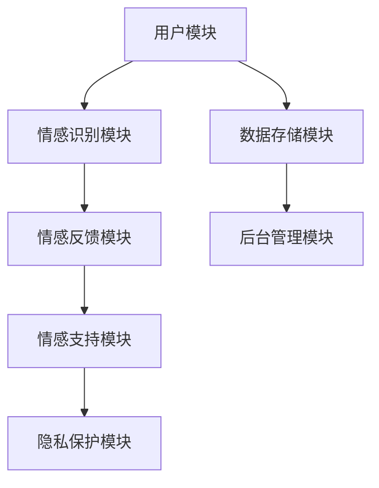
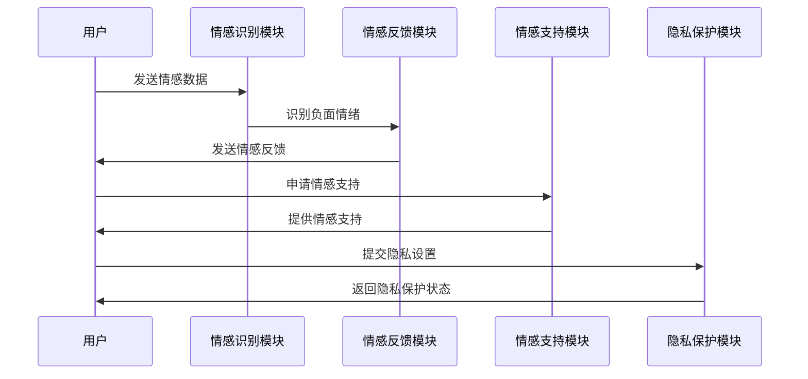
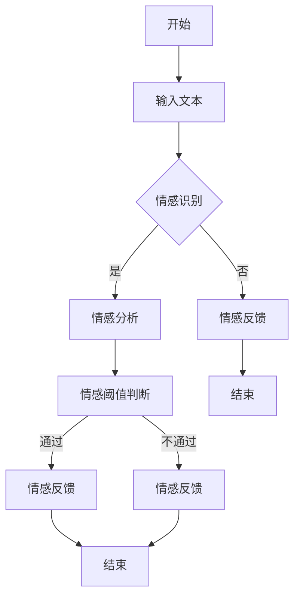
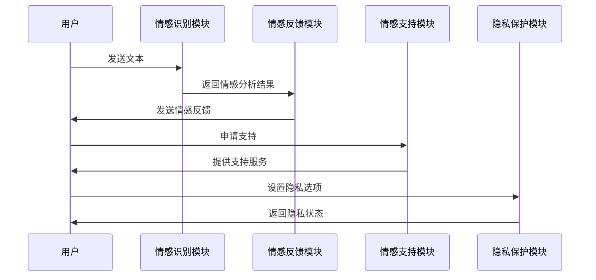
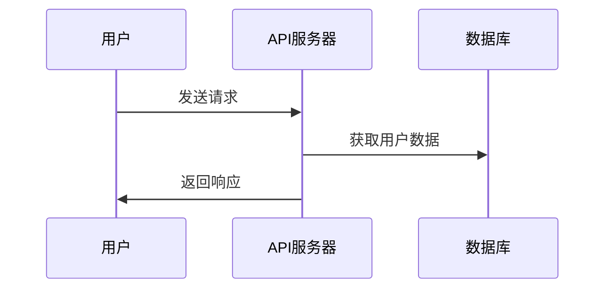
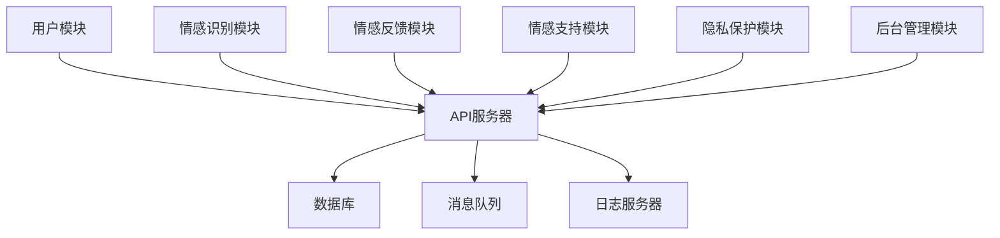

                 

### 情感劳动的定义与分类

#### 什么是情感劳动？

情感劳动，指的是在人际交往过程中，通过情感表达、情绪调节和关系维护等行为来满足他人需求或实现特定目标的一种劳动形式。它不仅仅是简单的情绪处理，更包含了深层次的人际互动和情感管理。在服务行业、教育行业、医疗行业等需要频繁人际互动的领域，情感劳动尤为重要。

#### 情感劳动的分类

根据情感劳动的表现形式和目的，可以将情感劳动分为以下几类：

1. **情感表达**：通过语言、肢体语言、表情等手段，表达出个人的情感状态，如喜悦、愤怒、悲伤等。这种类型的情感劳动常用于服务行业，如酒店接待员、客服代表等。

2. **情绪调节**：在他人情绪不稳定时，通过安慰、劝解、引导等方式，帮助对方恢复情绪平衡。情绪调节在心理咨询、教育等领域中至关重要。

3. **关系维护**：通过持续的互动和沟通，建立和维护良好的人际关系。这种类型的情感劳动在团队合作、领导力发展等方面具有重要价值。

4. **情感共鸣**：通过共情和理解，与他人的情感产生共鸣，从而增强彼此的信任和默契。情感共鸣在心理咨询、领导力培养等场景中经常被应用。

#### 情感劳动的应用领域

情感劳动在不同领域中的应用有所不同，但其核心目标都是为了提升人际交往的质量和效率。以下是情感劳动在几个主要领域的具体应用：

1. **服务行业**：在酒店、餐厅、航空公司等服务业，员工需要具备出色的情感劳动能力，以提供高质量的服务，提升顾客满意度。

2. **医疗行业**：医护人员在诊疗过程中，需要通过情感劳动来安慰患者、建立信任，从而提高治疗效果。

3. **教育行业**：教师需要通过情感劳动来关注学生的情感需求，建立良好的师生关系，促进学生的全面发展。

4. **企业管理**：领导者需要通过情感劳动来激励员工、调解团队冲突，营造积极向上的企业文化。

#### 情感劳动的价值

情感劳动的价值不仅体现在个体层面上，更体现在社会层面上。以下是情感劳动的一些价值：

1. **提高服务质量**：通过情感劳动，服务行业能够提供更人性化、更有温度的服务，从而提升顾客满意度和忠诚度。

2. **促进心理健康**：情感劳动有助于缓解人们的心理压力，提高个体的心理健康水平。

3. **增强社会凝聚力**：情感劳动能够促进人与人之间的相互理解和支持，增强社会凝聚力。

4. **推动经济发展**：情感劳动在服务业、医疗业等领域的应用，有助于提高整体经济的效益和竞争力。

### 总结

情感劳动是人际交往中不可或缺的一部分，它在不同领域和场景中发挥着重要作用。通过理解情感劳动的定义、分类及其应用，我们可以更好地认识到情感劳动的价值，并在实际生活中加以运用。接下来，我们将进一步探讨情感劳动在社会中的地位和价值，以及它在人际关系中的重要性。  

### 情感劳动在社会中的地位

情感劳动在社会中的地位不容忽视。作为一种特殊的劳动形式，情感劳动不仅直接影响个体的心理健康和幸福感，而且对社会的发展和稳定也具有深远的影响。以下我们将从多个角度分析情感劳动在社会中的地位。

#### 情感劳动对个体心理健康的影响

情感劳动首先体现在对个体心理健康的影响上。研究表明，情感劳动能够显著减轻个体的心理压力，提高其心理韧性。例如，服务行业的员工通过情感表达和情绪调节，能够有效缓解顾客的负面情绪，从而降低自身的工作压力。同时，情感劳动还能够增强个体的同理心和社交能力，促进其心理健康和全面发展。

1. **情感表达的减压作用**：在服务过程中，通过适当的情感表达，如微笑、问候等，员工能够传递出积极的信息，缓解顾客的焦虑和不满情绪。这种积极的情感互动有助于减轻员工自身的心理压力。

2. **情绪调节的减压作用**：在情感劳动中，员工需要具备一定的情绪调节能力，以应对各种突发情况和负面情绪。通过有效的情绪调节，员工能够更好地处理工作中的压力，保持心理健康。

#### 情感劳动对社会稳定的贡献

情感劳动不仅对个体有积极影响，对社会稳定也发挥着重要作用。通过情感劳动，社会成员之间能够建立更加和谐的人际关系，增强社会凝聚力，从而促进社会稳定。

1. **促进社会和谐**：情感劳动有助于缓解社会矛盾和冲突，促进社会和谐。在教育领域，教师通过情感劳动关注学生的情感需求，建立良好的师生关系，有助于减少校园暴力事件的发生。在医疗行业，医护人员通过情感劳动，为患者提供温暖和关怀，有助于缓解医患矛盾。

2. **增强社会凝聚力**：情感劳动能够增强社会成员之间的信任和认同，提高社会凝聚力。在团队合作中，领导者通过情感劳动激励员工，增强团队凝聚力，从而提高工作效率和创新能力。

#### 情感劳动在经济发展中的作用

情感劳动不仅在个体和社会层面上具有价值，还在经济发展中发挥着重要作用。通过情感劳动，服务业、医疗业等行业能够提供更加高质量的服务，提高客户满意度和忠诚度，从而促进经济增长。

1. **提高服务质量**：情感劳动能够提升服务业、医疗业等行业的服务质量，从而吸引更多的客户，提高市场竞争力。例如，酒店业通过员工的情感劳动，提供个性化、贴心的服务，能够显著提高顾客满意度。

2. **促进消费升级**：情感劳动有助于推动消费升级，满足消费者日益增长的情感需求。在现代社会，消费者不仅仅关注商品的质量和价格，更重视购买过程中的情感体验。通过情感劳动，企业能够更好地满足消费者的情感需求，提高消费体验。

#### 情感劳动在国际比较研究中的表现

情感劳动在国际比较研究中也显示出独特的优势。不同国家和地区在社会发展过程中，情感劳动的角色和地位有所不同。例如，在东亚地区，如日本和韩国，情感劳动在社会中扮演着极其重要的角色，体现在家庭、工作和社会等多个层面。而在西方国家，情感劳动虽然也受到重视，但其地位和作用相对较低。

1. **东亚地区的情感劳动特点**：在东亚地区，由于传统家庭文化和集体主义价值观的影响，情感劳动在社会中具有很高的地位。家庭成员之间、同事之间以及上下级之间都存在着密切的情感互动，情感劳动成为维系人际关系和社会稳定的重要手段。

2. **西方国家的情感劳动特点**：在西方国家，情感劳动虽然受到重视，但其地位和作用相对较低。这主要与西方文化中个体主义和理性主义的影响有关。在这些国家，人们更倾向于通过法律、制度和规则来维系社会关系，情感劳动的角色相对较弱。

#### 情感劳动的未来发展趋势

随着社会的发展和科技的进步，情感劳动的未来发展趋势也日益受到关注。一方面，随着人工智能和机器人技术的发展，情感劳动的一部分可能会被机器人和自动化系统所替代。另一方面，情感劳动的重要性将日益凸显，尤其是在人机互动和跨文化交流中。

1. **情感劳动与人工智能的融合**：未来，人工智能技术将进一步提升情感劳动的效率和效果。例如，智能客服系统通过情感识别和情绪调节技术，能够提供更加人性化、个性化的服务。

2. **情感劳动在教育和社会服务中的应用**：随着人们对情感需求的认识不断加深，情感劳动将在教育和社会服务领域得到更加广泛的应用。通过情感劳动，教育工作者和社会工作者能够更好地关注个体的情感需求，促进其全面发展。

#### 总结

情感劳动在社会中的地位和作用是多方面的，它不仅影响个体的心理健康和社会关系，还对经济发展和社会稳定具有深远影响。在国际比较研究中，不同国家和地区的情感劳动特点也呈现出多样化的趋势。未来，随着科技的进步和社会的发展，情感劳动将迎来新的发展机遇和挑战。理解情感劳动的社会地位，对于推动社会进步和个体发展具有重要意义。在接下来的章节中，我们将进一步探讨情感劳动的价值，以及其在不同领域中的具体表现和影响。  

### 情感劳动的价值探讨

#### 情感劳动对个人成长的价值

情感劳动对个人成长具有不可忽视的价值。首先，情感劳动能够促进个体的情感发展。通过参与情感劳动，个体能够更好地理解自己的情感，学会表达和处理负面情绪，从而提升自我情感调节能力。例如，在服务行业中，员工需要经常面对顾客的负面情绪，通过有效的情感劳动，员工不仅能够帮助顾客缓解情绪，还能在这个过程中提升自己的情感认知和处理能力。

其次，情感劳动有助于提升个体的社交能力。在情感劳动过程中，个体需要与他人进行频繁的互动和沟通，这有助于培养个体的同理心、沟通能力和人际交往技巧。例如，教育领域的教师通过情感劳动，与学生建立良好的师生关系，不仅能够促进学生的学习效果，还能提升教师自身的社交能力。

最后，情感劳动对个体的心理健康具有积极影响。研究表明，情感劳动能够显著降低个体的压力水平，提升其心理韧性。例如，在医疗行业中，医护人员通过情感劳动为患者提供安慰和支持，这不仅有助于患者的康复，还能减轻医护人员的工作压力，提高其工作满意度和职业幸福感。

#### 情感劳动对社会稳定的贡献

情感劳动对社会稳定也具有重要贡献。首先，情感劳动有助于缓解社会矛盾和冲突。在社会中，各种矛盾和冲突时有发生，通过情感劳动，个体能够更好地理解和接纳他人，从而减少矛盾和冲突的发生。例如，在社区工作中，社区工作者通过情感劳动，能够有效调解邻里纠纷，促进社区和谐。

其次，情感劳动有助于增强社会凝聚力。通过情感劳动，个体能够感受到社会的温暖和关怀，从而增强对社会的归属感和认同感。例如，在志愿服务中，志愿者通过情感劳动，帮助弱势群体，不仅为社会带来正能量，还能增强志愿者的社会责任感。

最后，情感劳动对维护社会秩序具有重要作用。通过情感劳动，社会成员能够更好地遵守社会规范和法律法规，从而维护社会秩序。例如，在警察工作中，警察通过情感劳动，与社区民众建立良好的关系，有助于提升民众的法制意识和法律遵守度。

#### 情感劳动对经济发展的推动作用

情感劳动对经济发展也具有显著推动作用。首先，情感劳动能够提升服务质量，促进消费升级。在服务业中，优质的情感劳动能够提升消费者的满意度，从而增加消费者的忠诚度和重复购买率。例如，酒店业通过员工的情感劳动，提供个性化、贴心的服务，能够显著提高顾客满意度。

其次，情感劳动有助于提高劳动生产率。在团队合作中，通过情感劳动，团队成员之间能够建立良好的信任关系，从而提高团队协作效率。例如，在企业中，领导者通过情感劳动激励员工，能够提高员工的工作积极性和创新能力。

最后，情感劳动能够吸引和留住人才。在现代社会，越来越多的员工重视工作环境和工作氛围，情感劳动能够营造一个积极向上、和谐稳定的工作氛围，从而吸引和留住优秀人才。例如，在IT行业中，企业通过情感劳动，关注员工的情感需求，提供人文关怀，能够提高员工的工作满意度和忠诚度。

#### 情感劳动在国际比较研究中的差异

在国际比较研究中，不同国家和地区的情感劳动表现出明显的差异。东亚地区，如日本、韩国和中国，情感劳动在社会中占据重要地位，这在很大程度上源于这些国家传统文化中对情感劳动的高度重视。在这些国家，情感劳动不仅是个人能力的体现，也是社会交往的重要方式。

相反，在西方国家，如美国和欧洲，情感劳动的地位相对较低。这主要与西方文化中强调个体权利和理性思维有关。在这些国家，人们更多地依赖于制度和规则来处理人际关系，情感劳动的角色相对较弱。

然而，在全球化的背景下，情感劳动的重要性在全球范围内逐渐得到认可。跨国公司和全球化的组织越来越重视情感劳动，将其视为提高员工满意度和工作效率的重要手段。

#### 总结

情感劳动对个人成长、社会稳定和经济发展具有深远影响。通过情感劳动，个体能够提升情感认知、社交能力和心理健康，同时，社会能够增强凝聚力、减少冲突和促进和谐。在全球化和科技发展的背景下，情感劳动的重要性将日益凸显。理解和重视情感劳动的价值，不仅有助于推动个体和社会的发展，也为经济全球化和文化多样性的发展提供了新的视角和思路。在接下来的章节中，我们将进一步探讨情感劳动在人际关系中的具体表现和作用。  

### 情感劳动与人际关系

情感劳动在人际交往中起着至关重要的作用，它不仅影响个体之间的情感联系，还直接决定了人际关系的质量。以下我们将从多个角度详细探讨情感劳动在人际关系中的具体表现和作用。

#### 情感劳动在人际交往中的作用

1. **增强信任与共鸣**：情感劳动能够促进个体之间的信任建立和情感共鸣。通过情感表达和情绪调节，个体能够更好地理解对方的情感状态，从而建立信任和共鸣。例如，在商业谈判中，谈判者通过情感劳动，如积极的肢体语言和同理心，能够增强双方的情感联系，促进谈判的成功。

2. **缓解冲突与矛盾**：情感劳动在缓解人际关系中的冲突和矛盾方面具有显著作用。通过情感调节和沟通，个体能够更好地处理彼此之间的分歧，减少误解和矛盾。例如，在家庭关系中，家庭成员通过情感劳动，如道歉和安抚，能够缓解矛盾，增强家庭的和谐。

3. **提升沟通效果**：情感劳动能够提升人际沟通的效果。通过情感表达，个体能够更好地传达自己的情感和需求，增强沟通的深度和准确性。例如，在团队合作中，团队成员通过情感劳动，如积极反馈和鼓励，能够提升团队的沟通效率和协作能力。

#### 情感劳动对人际关系质量的影响

1. **改善情感体验**：情感劳动能够显著改善个体之间的情感体验。通过情感表达和情绪调节，个体能够获得更多的情感满足，提升人际关系的质量。例如，在友谊关系中，朋友通过情感劳动，如关心和支持，能够增强彼此的情感纽带，提升友谊的质量。

2. **增强社会支持**：情感劳动能够提供强大的社会支持，对个体的人际关系质量产生积极影响。通过情感劳动，个体能够获得他人的理解、支持和安慰，从而增强其社会支持网络。例如，在职业关系中，员工通过情感劳动，如表达尊重和关心，能够获得同事和上司的支持，提升职业关系的质量。

3. **促进情感共鸣**：情感劳动能够促进个体之间的情感共鸣，增强人际关系的紧密程度。通过情感共鸣，个体能够更好地理解和接纳对方，从而提升关系的稳定性和深度。例如，在伴侣关系中，伴侣通过情感劳动，如表达爱意和理解，能够增强彼此的情感联系，促进关系的稳定和幸福。

#### 情感劳动在不同人际关系中的具体表现

1. **家庭关系**：在家庭关系中，情感劳动表现为家庭成员之间的关心、支持和理解。父母通过情感劳动，如陪伴和倾听，能够增强与子女的情感纽带，提升家庭的和谐度。子女通过情感劳动，如尊重和回报，能够表达对父母的感激和爱意，促进家庭的和睦。

2. **友谊关系**：在友谊关系中，情感劳动表现为朋友之间的信任、共鸣和支持。朋友通过情感劳动，如分享和鼓励，能够增强彼此的情感联系，提升友谊的质量。在朋友遇到困难时，通过情感劳动，如提供帮助和安慰，能够加深友谊，增强信任。

3. **职业关系**：在职业关系中，情感劳动表现为员工与同事、上司和下属之间的互动和支持。员工通过情感劳动，如尊重和关心，能够建立良好的人际关系，提升工作满意度和工作效率。上司通过情感劳动，如鼓励和认可，能够激励员工，提升团队凝聚力。

4. **社会关系**：在社会关系中，情感劳动表现为个体与社会其他成员之间的互动和支持。通过情感劳动，个体能够获得社会的认同和支持，增强社会归属感和幸福感。例如，在社会公益活动或志愿服务中，志愿者通过情感劳动，如关心和帮助，能够提升社会成员之间的情感联系，促进社会的和谐。

#### 情感劳动在改善人际关系中的应用策略

1. **增强情感表达**：通过积极的情感表达，个体能够更好地传达自己的情感和需求，促进人际关系的和谐。例如，在家庭中，父母可以通过积极表达爱意和关心，增强与子女的情感联系。

2. **提高情绪调节能力**：通过学习和掌握情绪调节技巧，个体能够更好地处理负面情绪，减少冲突和误解。例如，在职场中，员工可以通过情绪调节，保持良好的情绪状态，提升工作效率。

3. **培养同理心**：通过培养同理心，个体能够更好地理解他人的情感和需求，促进情感共鸣。例如，在友谊关系中，朋友可以通过同理心，更好地理解和支持对方。

4. **加强沟通技巧**：通过提升沟通技巧，个体能够更好地表达自己的想法和情感，促进有效的沟通。例如，在团队协作中，团队成员可以通过有效的沟通，提高协作效率和团队凝聚力。

#### 总结

情感劳动在人际关系中扮演着至关重要的角色，它不仅影响个体之间的情感联系，还直接决定了人际关系的质量。通过情感劳动，个体能够增强信任、缓解冲突、提升沟通效果，从而改善人际关系。理解和运用情感劳动的策略，不仅有助于提升个人的心理健康，还能促进社会的和谐与发展。在接下来的章节中，我们将进一步探讨情感劳动在职场中的具体表现和作用。  

### 情感劳动在职场中的表现

情感劳动在职场中的表现对于企业的运营和员工的职业发展具有重要意义。它不仅影响了团队合作的质量，还直接关系到员工的满意度和企业的绩效。以下我们将从几个方面详细探讨情感劳动在职场中的具体表现。

#### 情感劳动在团队合作中的作用

1. **提升团队凝聚力**：情感劳动能够增强团队成员之间的情感联系，提升团队的凝聚力。通过情感表达和情绪调节，团队成员能够更好地理解彼此的需求和情感状态，从而增强团队的协作意愿和合作精神。例如，在项目团队中，领导者通过情感劳动，如关心和鼓励，能够增强团队成员之间的情感纽带，提升团队的整体执行力。

2. **促进沟通与协作**：情感劳动有助于改善团队内部的沟通氛围，促进团队成员之间的有效沟通和协作。通过情感表达，团队成员能够更加坦诚地分享自己的想法和意见，减少误解和冲突。例如，在会议中，团队成员通过情感劳动，如积极倾听和反馈，能够提高沟通效果，促进决策的制定和执行。

3. **缓解团队冲突**：情感劳动能够有效缓解团队内部的冲突和矛盾。通过情感调节和情绪管理，团队成员能够更好地处理彼此之间的分歧，寻找共同的解决方案。例如，在团队面临挑战时，领导者通过情感劳动，如安慰和疏导，能够缓解团队成员的焦虑和压力，促进团队的一致行动。

#### 情感劳动对员工满意度的影响

1. **提高员工工作满意度**：情感劳动能够提升员工的工作满意度和职业幸福感。通过情感表达和关怀，企业能够满足员工的情感需求，增强员工对企业的认同感和归属感。例如，在员工生日或重要节日，企业通过举办庆祝活动或发放礼物，能够表达对员工的关怀和尊重，提升员工的工作满意度。

2. **增强员工忠诚度**：情感劳动有助于增强员工的忠诚度，减少员工流失率。通过情感劳动，企业能够建立与员工之间的深厚情感纽带，使员工感受到企业的关怀和支持，从而提高其工作稳定性和忠诚度。例如，在企业内部建立员工关爱机制，如心理辅导、健康体检等，能够增强员工对企业的忠诚和信任。

3. **提升员工职业发展机会**：情感劳动能够为员工提供更多的职业发展机会。通过情感劳动，员工能够获得领导的认可和支持，从而获得更多的晋升机会和发展平台。例如，在员工提出职业发展计划时，领导者通过情感劳动，如鼓励和指导，能够为员工提供宝贵的职业发展建议和资源，促进其职业成长。

#### 情感劳动对职场氛围的影响

1. **营造积极向上的工作氛围**：情感劳动能够营造积极向上的工作氛围，激发员工的工作热情和创造力。通过情感表达和情感共鸣，企业能够传递出积极的价值观和文化理念，增强员工的使命感和责任感。例如，在企业文化活动中，通过情感劳动，如分享成功经验和团队建设活动，能够激发员工的积极性和团队精神。

2. **提升工作环境的舒适度**：情感劳动能够提升工作环境的舒适度，减少员工的工作压力和疲劳感。通过情感关怀和员工福利，企业能够为员工提供一个温馨、和谐的工作环境，使员工感受到企业的关爱和支持。例如，企业提供员工休息室、健身设施和定期体检等服务，能够提高员工的工作舒适度和生活质量。

3. **促进工作与生活的平衡**：情感劳动能够帮助员工实现工作与生活的平衡，提高其整体幸福感。通过情感劳动，企业能够关注员工的个人生活，提供灵活的工作安排和员工关爱措施，帮助员工缓解工作压力，实现工作与生活的和谐统一。例如，企业通过设立员工关爱基金、提供家庭关怀服务等，能够帮助员工更好地应对生活中的挑战，提升其工作积极性和生活满意度。

#### 情感劳动在企业文化建设中的角色

1. **强化企业价值观**：情感劳动在企业文化建设中发挥着重要作用，能够强化企业的核心价值观。通过情感表达和情感共鸣，企业能够传递出共同的目标和信念，形成强大的企业凝聚力和向心力。例如，在企业年会上，通过情感劳动，如表彰优秀员工和分享企业愿景，能够强化员工的共同价值观和使命感。

2. **塑造企业品牌形象**：情感劳动能够塑造企业的品牌形象，提升企业的社会声誉。通过情感劳动，企业能够传递出真诚、关怀和专业的品牌形象，赢得客户和社会的认可和信任。例如，在客户服务中，通过情感劳动，如提供个性化的关怀和解决方案，能够提升客户的满意度和忠诚度，增强企业的品牌影响力。

3. **促进企业文化传承**：情感劳动能够促进企业文化的传承和发展。通过情感劳动，企业能够将优秀的文化理念和价值观传递给新员工，帮助他们更好地融入企业文化，实现企业文化的持续传承和创新发展。例如，在企业新人培训中，通过情感劳动，如导师带徒和文化分享活动，能够帮助新员工快速融入企业，传承和发扬企业文化。

#### 总结

情感劳动在职场中的表现对于企业的运营和员工的职业发展具有深远影响。通过情感劳动，企业能够提升团队凝聚力、员工满意度和企业文化，从而提高整体绩效和市场竞争力。员工通过情感劳动，能够实现个人成长和职业发展，获得更多的职业机会和幸福感。因此，理解和重视情感劳动在职场中的价值，不仅有助于推动企业的发展，还能促进员工的职业成长和幸福生活。在接下来的章节中，我们将进一步探讨情感劳动的心理机制及其对个体心理的影响。  

### 情感劳动的心理机制

情感劳动作为一种特殊的劳动形式，其核心在于通过情感表达、情绪调节和关系维护等行为来实现特定目标。理解情感劳动的心理机制，对于深入探讨其在人际交往中的作用具有重要意义。以下，我们将从情感劳动的认知、情感和行为三个方面，详细解析其心理机制。

#### 情感劳动的认知机制

1. **情感识别与理解**：情感劳动首先需要个体具备良好的情感识别与理解能力。这包括对自身情感的识别，以及对他人情感的感知和理解。通过情感识别，个体能够准确理解自己的情感状态，从而更好地调节自己的情绪。同时，通过情感理解，个体能够更好地感知他人的情感需求，从而进行有效的情感表达。

2. **认知加工**：情感劳动中的认知加工涉及对情感信息的处理和加工。个体需要运用认知资源，如注意力、记忆和思维等，对情感信息进行加工，从而做出适当的情感反应。例如，在服务行业中，员工需要通过认知加工，分析顾客的情感需求，并快速做出反应，提供个性化的服务。

3. **社会认知**：情感劳动中的社会认知机制是指个体在社会互动中运用认知资源理解和预测他人的情感状态和行为。通过社会认知，个体能够更好地预测他人的需求，从而做出适当的情感表达和行为调整。例如，在领导力发展中，领导者需要通过社会认知，了解下属的情感状态和需求，从而提供有效的激励和支持。

#### 情感劳动的情感机制

1. **情感表达与调节**：情感劳动中的情感表达机制涉及个体如何通过语言、肢体语言和非语言手段来表达自己的情感状态。有效的情感表达能够增强人际互动的质量，建立良好的情感联系。情感调节机制则是指个体如何通过自我调节和他人调节来管理自己的情感状态，以适应不同情境的需求。例如，在冲突管理中，个体需要通过情感调节，保持冷静和理智，从而找到合适的解决方案。

2. **情感共鸣与理解**：情感劳动中的情感共鸣机制是指个体如何通过共情和理解来体验他人的情感状态。情感共鸣能够增强个体之间的情感联系，提升人际关系的质量。通过情感理解，个体能够更好地理解他人的情感需求，从而提供更有效的支持和帮助。例如，在心理咨询中，咨询师通过情感共鸣，能够更好地理解患者的情感状态，提供有效的心理支持。

3. **情感管理**：情感劳动中的情感管理机制是指个体如何通过情感管理策略来应对工作中的情感挑战。情感管理包括自我调节、情绪释放和情感聚焦等策略。有效的情感管理能够帮助个体更好地应对工作压力，保持心理健康。例如，在高压工作环境中，员工可以通过情感管理策略，如深呼吸和冥想，来缓解压力，保持情绪稳定。

#### 情感劳动的行为机制

1. **情感行为表现**：情感劳动中的行为机制涉及个体如何通过具体的行为来表现情感。这些行为包括语言表达、肢体语言、面部表情和触摸等。有效的情感行为能够增强情感表达的效果，提升人际互动的质量。例如，在客户服务中，员工通过微笑、礼貌用语和热情的服务态度，能够提升客户的满意度和忠诚度。

2. **情境适应**：情感劳动中的情境适应机制是指个体如何根据不同情境的需求来调整自己的情感表达和行为。情境适应能力对于情感劳动的成效至关重要。个体需要根据不同的情境，如工作压力、客户需求和团队互动等，灵活调整自己的情感表达和行为，以实现最佳效果。例如，在团队合作中，个体需要通过情境适应，调整自己的沟通方式和行为，以促进团队协作和沟通。

3. **社会互动**：情感劳动中的社会互动机制是指个体如何通过情感劳动来参与社会互动，建立和维护良好的人际关系。社会互动包括合作、竞争、冲突和协商等。通过有效的情感劳动，个体能够更好地参与社会互动，建立良好的人际关系，促进社会和谐。例如，在社区工作中，志愿者通过情感劳动，如关心和帮助，能够增强社区成员之间的情感联系，促进社区的和谐发展。

#### 情感劳动的心理效应

1. **情感效益**：情感劳动能够带来明显的情感效益，包括情感满足、情感连接和情感调节。通过情感劳动，个体能够获得情感满足，增强情感连接，提升情感调节能力。例如，在医疗行业中，医护人员通过情感劳动，为患者提供安慰和支持，能够提升患者的满意度和康复效果。

2. **心理健康效益**：情感劳动对个体的心理健康具有积极影响。通过情感劳动，个体能够缓解心理压力，提高心理韧性，增强心理健康。例如，在心理咨询中，咨询师通过情感劳动，能够帮助患者缓解心理问题，提升心理健康水平。

3. **社会效益**：情感劳动不仅对个体有积极影响，还对整个社会有显著的效益。通过情感劳动，社会能够增强凝聚力，减少冲突，提升社会稳定性。例如，在社会服务中，志愿者通过情感劳动，为弱势群体提供帮助，能够增强社会的和谐与稳定。

#### 总结

情感劳动的心理机制涉及认知、情感和行为等多个方面，通过这些机制，个体能够更好地进行情感表达、情绪调节和关系维护，从而实现特定目标。理解情感劳动的心理机制，不仅有助于深入探讨其在人际交往中的作用，还能为职场、社会服务和心理健康等领域提供有益的指导。在接下来的章节中，我们将进一步探讨情感劳动的技巧与策略，以及如何在实际应用中提升情感劳动的效果。  

### 情感劳动的技巧与策略

在情感劳动中，掌握正确的技巧与策略是提升效果的关键。以下我们将从沟通技巧、情感管理和关系维护三个方面，介绍一些实用的技巧和策略，帮助读者在实际生活中更好地应用情感劳动。

#### 沟通技巧

1. **倾听与反馈**：倾听是情感劳动中最基本的技巧之一。通过倾听，个体能够更好地理解他人的情感需求，从而做出更有效的回应。倾听的关键在于全神贯注、不打断对方讲话，并在对方发言结束后，给予积极的反馈，如“我理解你的感受”或“我能体会到你的情绪”。这种积极的反馈能够增强彼此之间的情感联系。

2. **表达清晰**：在情感表达中，清晰的表达至关重要。个体应确保自己的语言简洁明了，避免使用模糊或含糊不清的表达方式。例如，在表达不满时，可以使用“I”语言（例如：“我感到不舒服，当……”），而不是使用“你”语言（例如：“你总是……”），以减少对方的防御心理。

3. **非语言沟通**：非语言沟通，如肢体语言、面部表情和触摸等，在情感劳动中也起着重要作用。一个微笑、一个拥抱或一个握手，都能传递出积极的情感信息，增强沟通效果。例如，在安慰他人时，一个拥抱能够传递出关怀和理解，帮助对方缓解负面情绪。

#### 情感管理

1. **情绪自我调节**：情感劳动中的情绪自我调节技巧对于提升效果至关重要。个体可以通过深呼吸、冥想和正念等方法来调节自己的情绪，保持冷静和理智。例如，在面临工作压力时，个体可以通过深呼吸来放松身心，从而更好地应对压力。

2. **情感释放**：适度的情感释放有助于缓解压力，提升情感劳动的效果。个体可以通过写日记、做运动或与朋友倾诉等方式来释放负面情绪。例如，在服务行业中，员工可以在工作之余，通过运动来释放工作压力，从而提高次日工作的效率。

3. **积极情感培养**：积极情感的培养能够增强个体的幸福感，提升情感劳动的效果。个体可以通过培养感恩、乐观和同理心等积极情感来提升自己的情感状态。例如，在日常生活中，个体可以每天记录三件感恩的事情，从而培养感恩情感，提升生活满意度。

#### 关系维护

1. **建立信任**：在情感劳动中，建立信任是关系维护的关键。个体可以通过真诚、诚信和可靠性来建立信任。例如，在客户服务中，员工应始终保持真诚，为客户提供可靠的服务，从而建立客户的信任。

2. **尊重差异**：在人际交往中，尊重差异是维护良好关系的重要策略。个体应尊重他人的观点、价值观和生活方式，避免对他人的不当评价和歧视。例如，在团队合作中，团队成员应尊重彼此的专业知识和经验，共同推进项目的发展。

3. **提供支持**：在情感劳动中，提供支持是关系维护的重要手段。个体应关注他人的情感需求，提供帮助和支持。例如，在同事遇到困难时，可以主动提供帮助，共同解决问题，增强彼此的情感联系。

#### 实际应用中的技巧与策略

1. **情境适应**：在情感劳动中，个体应根据不同情境灵活调整策略。例如，在紧张的会议中，个体可以采用冷静、理智的表达方式，而在轻松的社交场合，则可以采用更轻松、幽默的语言。

2. **情感劳动与科技结合**：随着科技的发展，情感劳动与科技结合的应用越来越广泛。例如，智能客服系统能够通过情感识别和情绪调节技术，提供更人性化的服务。个体可以利用这些科技工具，提升自己的情感劳动效果。

3. **持续学习和实践**：情感劳动的技巧和策略需要不断学习和实践。个体应通过阅读相关书籍、参加培训课程和实际操作来提升自己的情感劳动能力。例如，可以通过参加心理咨询师培训班，学习专业的情感调节技巧。

#### 总结

情感劳动的技巧与策略对于提升其在实际应用中的效果至关重要。通过掌握倾听与反馈、表达清晰、情绪自我调节、情感释放、积极情感培养、建立信任、尊重差异和提供支持等技巧与策略，个体能够更好地进行情感表达、情绪调节和关系维护，从而实现情感劳动的目标。理解和运用这些技巧与策略，不仅有助于提升个人的情感劳动能力，还能促进人际关系的和谐与社会稳定。在接下来的章节中，我们将进一步探讨情感劳动在个人发展中的应用和影响。  

### 情感劳动在个人发展中的应用

情感劳动在个人发展中的应用具有重要意义，它不仅能够提升个体的心理健康和社交能力，还能助力职业成长。以下，我们将从心理健康、社交能力和职业发展三个方面，详细探讨情感劳动在个人发展中的应用及其影响。

#### 情感劳动对心理健康的影响

1. **情绪调节**：情感劳动有助于个体更好地调节情绪，提高心理韧性。通过情感表达和情绪调节技巧，个体能够更好地处理负面情绪，如焦虑、压力和抑郁。例如，在遇到工作压力时，个体可以通过与同事交流、倾诉自己的感受，从而缓解压力，保持情绪稳定。

2. **增强心理韧性**：情感劳动能够增强个体的心理韧性，使其在面对挑战和困难时，能够保持积极的心态和应对策略。通过情感共鸣和理解，个体能够从他人那里获得支持和鼓励，从而增强自己的心理韧性。

3. **提升幸福感**：情感劳动能够提升个体的幸福感，增强其对生活的满意度和幸福感。通过积极的情感互动，个体能够感受到他人的关怀和支持，从而提升心理幸福感。例如，在日常生活中，通过情感劳动，如关心家人、帮助朋友，个体能够获得情感满足，提升幸福感。

#### 情感劳动对社交能力的影响

1. **增强同理心**：情感劳动有助于个体增强同理心，更好地理解他人的情感和需求。通过情感表达和情感共鸣，个体能够更加敏锐地捕捉他人的情感信号，从而更好地与他人建立情感联系。

2. **提升沟通技巧**：情感劳动能够提升个体的沟通技巧，使其在社交场合中更加自信和有效。通过倾听和反馈，个体能够更好地传达自己的情感和需求，增强沟通的深度和效果。

3. **建立社交网络**：情感劳动有助于个体建立和维护良好的社交网络。通过情感表达和关系维护技巧，个体能够与他人建立深厚的情感纽带，从而扩大自己的社交圈子，提升社交能力。

#### 情感劳动对职业发展的影响

1. **提升职业形象**：情感劳动能够提升个体的职业形象，增强其在职场中的竞争力。通过情感表达和情绪调节技巧，个体能够更好地处理职场压力和冲突，赢得同事和上司的信任和认可。

2. **促进职业成长**：情感劳动有助于个体在职场中实现职业成长。通过情感共鸣和关系维护，个体能够获得更多的职业发展机会和资源。例如，在团队合作中，通过情感劳动，个体能够建立良好的团队关系，提升团队协作效率，从而获得更多的晋升机会。

3. **增强职业满意度**：情感劳动能够提升个体的职业满意度，增强其对工作的热爱和投入度。通过情感表达和情感管理技巧，个体能够更好地处理职场压力，保持积极的工作态度，从而提升职业满意度。

#### 实际案例与策略

1. **心理咨询服务**：在个人发展中，心理咨询服务是一个典型的情感劳动应用案例。通过情感劳动，咨询师能够为来访者提供情感支持、情绪调节和心理疏导，帮助其解决心理问题，提升心理健康水平。

2. **职场情感管理培训**：企业可以开展职场情感管理培训，帮助员工提升情感劳动能力。通过培训，员工能够学习到情感表达、情绪调节和关系维护等技巧，从而更好地应对职场挑战，提升职业成长。

3. **团队情感建设活动**：企业可以定期组织团队情感建设活动，如团队建设培训、团建活动和情感交流会等，通过这些活动，增强团队成员之间的情感联系，提升团队协作效率和凝聚力。

#### 总结

情感劳动在个人发展中的应用广泛而深远，它不仅有助于提升个体的心理健康和社交能力，还能助力职业成长。通过掌握情感劳动的技巧与策略，个体能够更好地应对生活中的挑战，建立和维护良好的人际关系，实现个人成长和职业目标。理解和重视情感劳动在个人发展中的应用，不仅有助于提升个体的幸福感和成就感，也为社会的和谐与进步做出了积极贡献。在接下来的章节中，我们将进一步探讨情感劳动在企业文化建设中的角色和重要性。  

### 情感劳动在企业文化建设中的角色

情感劳动在企业文化建设中扮演着至关重要的角色。企业文化不仅反映了企业的核心价值观和行为准则，还直接影响员工的情感状态、工作态度和行为表现。情感劳动通过情感表达、情绪调节和关系维护等行为，能够有效塑造和维护积极向上的企业文化，提升企业的凝聚力和竞争力。以下，我们将从企业文化、员工凝聚力和工作氛围三个方面，详细探讨情感劳动在企业文化建设中的角色。

#### 情感劳动对企业文化的塑造

1. **传递核心价值观**：情感劳动能够帮助企业传递和强化核心价值观。通过情感表达和情感共鸣，企业领导者可以与员工建立起深层次的情感联系，使员工更加认同和接受企业的核心价值观。例如，在企业的年度会议上，通过领导者的情感表达，如分享企业的成长故事和愿景，能够激发员工的热情和归属感，强化企业的核心价值观。

2. **塑造企业特色文化**：情感劳动能够帮助企业塑造独特的文化特色。通过情感互动和情感管理，企业可以培育出一种独特的文化氛围，如创新、协作、诚信等。这种文化特色不仅能够增强员工的认同感，还能提升企业的品牌形象和市场竞争力。

3. **促进文化传承**：情感劳动有助于促进企业文化的传承和发展。通过情感劳动，企业可以培养一批具有文化传承能力的中层管理者，他们通过情感表达和关系维护，将企业文化传递给新员工，确保企业文化的持续传承。

#### 情感劳动对员工凝聚力的提升

1. **增强团队凝聚力**：情感劳动能够增强团队凝聚力，促进团队成员之间的情感联系和协作。通过情感共鸣和情感支持，团队成员能够更好地理解彼此的需求和情感状态，从而增强团队的合作意愿和协作效果。例如，在团队项目中，通过情感劳动，如鼓励和支持团队成员，可以增强团队凝聚力，提升项目成功率。

2. **建立信任关系**：情感劳动有助于建立员工之间的信任关系。通过情感表达和情感共鸣，员工能够更加信任彼此，减少误解和冲突。例如，在员工培训中，通过情感劳动，如分享经验和情感交流，可以建立员工之间的信任，促进团队合作。

3. **提高员工归属感**：情感劳动能够提高员工的归属感，使员工更加认同和热爱自己的企业。通过情感表达和关怀，企业可以满足员工的情感需求，使员工感受到企业的关心和支持。例如，在员工福利政策中，通过情感劳动，如提供员工关怀计划和健康体检，可以增强员工的归属感，提升员工的工作积极性。

#### 情感劳动对工作氛围的改善

1. **营造积极的工作氛围**：情感劳动能够营造积极向上的工作氛围，激发员工的工作热情和创造力。通过情感表达和情感调节，企业可以传递出积极的价值观和文化理念，使员工保持乐观、积极的心态。例如，在企业的日常管理中，通过情感劳动，如表扬和奖励，可以营造积极的工作氛围，提升员工的工作积极性。

2. **缓解工作压力**：情感劳动能够有效缓解员工的工作压力，提升员工的工作满意度和心理健康水平。通过情感关怀和情感支持，企业可以满足员工的情感需求，帮助员工应对工作中的压力和挑战。例如，在员工遇到工作困难时，通过情感劳动，如提供心理辅导和支持，可以缓解员工的工作压力，提升其工作效能。

3. **促进工作与生活的平衡**：情感劳动能够帮助员工实现工作与生活的平衡，提升其整体幸福感和生活质量。通过情感关怀和员工福利，企业可以关注员工的个人生活，提供灵活的工作安排和支持。例如，企业可以通过情感劳动，如提供家庭关怀服务和灵活的工作时间安排，帮助员工更好地应对生活中的挑战，实现工作与生活的和谐统一。

#### 情感劳动在企业文化建设中的实践

1. **企业文化建设活动**：企业可以通过定期举办文化建设活动，如企业文化节、团队建设培训和员工关怀计划等，通过情感劳动，塑造和强化企业文化。例如，在企业文化节中，通过情感表达和互动，可以增强员工对企业的认同感和归属感。

2. **情感管理培训**：企业可以开展情感管理培训，帮助员工提升情感劳动能力。通过培训，员工可以学习到情感表达、情绪调节和关系维护等技巧，从而更好地适应企业文化和工作环境。

3. **情感关怀机制**：企业可以建立情感关怀机制，如员工心理辅导、健康体检和家庭关怀计划等，通过情感劳动，关注员工的情感需求和心理健康。例如，通过定期举办心理健康讲座和提供心理咨询服务，可以帮助员工缓解心理压力，提升心理健康水平。

#### 总结

情感劳动在企业文化建设中发挥着关键作用。通过情感劳动，企业能够塑造和强化核心价值观，提升员工凝聚力，改善工作氛围，从而提升企业的整体绩效和竞争力。理解和重视情感劳动在企业文化建设中的价值，不仅有助于企业的长期发展，也为员工的职业成长和幸福感提供了良好的环境。在接下来的章节中，我们将进一步探讨情感劳动中的伦理问题与道德反思。  

### 情感劳动中的伦理问题与道德反思

在情感劳动中，伦理问题和道德反思是不可忽视的重要议题。情感劳动涉及人与人之间的情感互动和关系维护，如何在实践中平衡道德责任和个人利益，成为当前需要深入探讨的问题。以下，我们将从以下几个方面进行探讨。

#### 情感劳动中的道德困境

1. **情感剥削与道德责任**：情感劳动中，个体在满足他人情感需求的过程中，可能会面临情感剥削的问题。例如，在客户服务行业中，员工可能需要长时间承受顾客的负面情绪，从而产生情感疲劳和道德负担。这种情况下，如何平衡服务质量和员工的情感健康，成为一个重要的道德困境。

2. **隐私保护与道德冲突**：在情感劳动中，个体需要收集和处理大量的个人信息，如客户的情感状态和隐私。这引发了隐私保护与道德责任的冲突。例如，在心理咨询中，咨询师需要保护来访者的隐私，但有时却面临披露信息的道德压力。

3. **情感劳动的边界问题**：情感劳动在许多行业中具有广泛的应用，如医疗、教育和服务行业。然而，情感劳动的边界问题也日益凸显。例如，在教育行业中，教师需要承担情感劳动，但过度介入学生的私人生活可能导致伦理问题。

#### 情感劳动中的伦理原则

1. **尊重原则**：尊重是情感劳动中的核心伦理原则之一。个体在情感劳动中应尊重他人的情感和隐私，避免过度干涉和侵犯。例如，在客户服务中，员工应尊重客户的隐私，不得泄露客户的个人信息。

2. **公正原则**：公正原则要求情感劳动在分配资源和服务时，应保持公平和公正。例如，在医疗行业中，医护人员应公平对待每一位患者，避免因情感劳动而导致的资源分配不公。

3. **诚信原则**：诚信是情感劳动中的基本原则。个体在情感劳动中应保持真诚和透明，避免虚假宣传和误导。例如，在市场营销中，企业应诚信对待消费者，提供真实的产品信息。

#### 道德反思与伦理建议

1. **建立伦理框架**：为了应对情感劳动中的伦理问题，企业和组织应建立一套完善的伦理框架，明确情感劳动的道德标准和操作规范。例如，企业可以制定员工情感劳动手册，明确情感劳动的边界和道德要求。

2. **加强职业道德教育**：职业道德教育是提升员工伦理意识的重要途径。企业和教育机构应加强职业道德教育，培养员工的伦理意识和道德责任感。例如，在大学课程中，可以设置相关伦理课程，帮助学生理解和掌握情感劳动中的伦理原则。

3. **关注员工心理健康**：为了确保员工在情感劳动中的道德健康，企业应关注员工的情感需求和心理健康。例如，企业可以提供情感劳动培训和心理辅导服务，帮助员工应对情感劳动中的挑战和压力。

#### 总结

情感劳动中的伦理问题和道德反思对于维护人际关系的质量和个体的心理健康至关重要。理解和重视这些伦理问题，建立伦理框架，加强职业道德教育和关注员工心理健康，都是提升情感劳动效果和道德水平的重要途径。在未来的发展中，如何更好地平衡道德责任和个人利益，将是情感劳动领域需要持续探索的重要课题。在接下来的章节中，我们将探讨情感劳动的未来趋势和科技发展对其的影响。  

### 情感劳动的未来趋势

随着社会的发展和科技的进步，情感劳动正面临着前所未有的机遇与挑战。未来，情感劳动将在多个领域展现出新的发展趋势，这些趋势不仅将影响情感劳动的实践方式，还会对其理论和研究产生深远的影响。

#### 情感劳动与科技发展的融合

1. **人工智能与情感识别**：人工智能技术的快速发展，使得情感识别和情感分析成为可能。未来的情感劳动将更多地依赖于智能系统，如智能客服、智能陪伴机器人和智能心理咨询系统。这些系统能够通过情感识别技术，准确捕捉和处理人类情感，从而提供更加个性化和高效的服务。

2. **虚拟现实与情感互动**：虚拟现实（VR）技术的发展，为情感劳动提供了新的平台。通过VR技术，个体可以在虚拟环境中进行情感互动，如虚拟社交、虚拟培训和虚拟治疗。这种沉浸式的情感互动方式，不仅能够提高情感劳动的效率，还能降低现实环境中的情感风险。

3. **大数据与情感分析**：大数据技术的广泛应用，使得情感分析成为可能。通过对大量数据进行分析，企业和组织可以更好地了解员工的情感状态和需求，从而提供更精准的情感关怀和员工支持。

#### 情感劳动在不同领域的未来应用

1. **医疗行业**：在未来，情感劳动在医疗行业中的应用将更加广泛和深入。通过人工智能和大数据技术，医护人员可以更准确地识别和预测患者的情感状态，提供个性化的治疗和关怀。同时，虚拟现实技术可以为患者提供沉浸式的情感治疗，如缓解焦虑和疼痛。

2. **教育行业**：在教育领域，情感劳动的重要性将日益凸显。未来，智能教学系统将能够通过情感识别技术，了解学生的情感状态和需求，提供个性化的教学方案。此外，虚拟现实技术可以为学生提供更加真实和互动的学习体验，从而提高学习效果。

3. **服务业**：在服务业，情感劳动将更加注重个性化服务。智能客服系统将能够通过情感识别技术，理解客户的情感需求，提供更加人性化的服务。同时，虚拟现实技术可以为顾客提供更加沉浸式的购物体验，从而提升顾客满意度和忠诚度。

#### 情感劳动的理论发展与研究趋势

1. **情感劳动理论的拓展**：未来的情感劳动理论将更加注重跨学科的研究，如心理学、社会学和计算机科学。这种跨学科的研究将有助于从不同角度理解和解释情感劳动的现象和机制。

2. **情感劳动与工作满意度的研究**：随着情感劳动在职场中的应用日益广泛，未来将会有更多关于情感劳动与工作满意度、职业发展等关系的研究。这些研究将有助于企业更好地理解和利用情感劳动，提升员工的工作满意度和职业幸福感。

3. **情感劳动的伦理研究**：情感劳动中的伦理问题将得到更多的关注。未来，研究者将探讨情感劳动中的道德困境、隐私保护和情感剥削等问题，提出相应的伦理原则和解决方案。

#### 情感劳动的教育与实践

1. **情感劳动教育**：未来的教育体系中，情感劳动教育将得到更多重视。通过情感劳动教育，个体可以学习到情感表达、情绪调节和关系维护等技能，从而更好地适应社会和工作环境。

2. **情感劳动实践**：在职场中，情感劳动将成为一项基本技能。企业和组织将更加重视员工的情感劳动能力，提供相应的培训和指导，以提升员工的工作表现和团队协作能力。

#### 总结

情感劳动的未来发展趋势表明，科技的发展将深刻改变情感劳动的实践方式和理论框架。通过人工智能、大数据和虚拟现实等技术的融合，情感劳动将在医疗、教育和服务业等领域展现出更大的潜力。同时，情感劳动的理论研究也将进一步拓展和深化，为实践提供有力的理论支持。理解和应对这些发展趋势，对于企业、组织和个人都具有重要意义。在情感劳动的未来发展中，如何平衡技术创新和伦理道德，将是一个重要的挑战和机遇。  

### 情感劳动与科技发展的关系

情感劳动与科技发展之间的关系日益紧密，两者相互促进，共同推动了社会进步和个体成长。以下，我们将从人工智能、大数据和虚拟现实等关键领域，详细探讨科技发展对情感劳动的推动作用及其带来的机遇与挑战。

#### 人工智能在情感劳动中的应用

1. **情感识别与反馈**：人工智能（AI）技术，特别是机器学习和自然语言处理（NLP）技术的发展，使得情感识别和反馈成为可能。智能客服系统、情感分析工具等应用，能够通过分析语言、语音和面部表情等数据，识别用户的情感状态，并做出相应的情感反馈。例如，智能客服系统可以根据用户的语言和语气，判断其情感状态，提供个性化、贴心的服务。

2. **情感计算与决策**：情感计算（Affective Computing）是人工智能的一个重要分支，它致力于研究如何使计算机具备识别、理解、表达和模拟人类情感的能力。在情感劳动中，情感计算技术可以帮助企业更准确地把握员工的情感状态，从而做出更合理的决策。例如，通过分析员工的工作表现和情感状态，企业可以及时发现并解决员工的心理问题，提高员工的工作满意度和生产力。

3. **情感模拟与互动**：人工智能技术还能够模拟人类的情感互动，为个体提供更加真实的情感体验。例如，智能陪伴机器人可以通过情感计算技术，与人类进行情感互动，提供情感支持和陪伴服务。这种技术不仅适用于老年人、残障人士等需要特殊关照的群体，还能在医疗、教育等领域发挥重要作用，为患者和学生学习提供情感支持。

#### 大数据与情感分析

1. **情感数据收集与处理**：大数据技术的应用，使得情感数据的收集和处理变得更加高效和精准。通过对大量用户行为数据、社交媒体数据和消费数据的分析，企业可以深入了解用户的情感需求和偏好，从而提供更加个性化的服务。例如，电商平台可以通过情感分析技术，了解用户的情感状态和购买意图，提供个性化的产品推荐和促销活动。

2. **情感预测与风险管理**：大数据技术还可以用于情感预测和风险管理。通过对历史数据的分析和趋势预测，企业可以预测用户的情感变化，提前采取相应措施，预防负面情感的产生。例如，在金融行业中，通过情感分析技术，银行可以预测客户的情绪波动，提前采取风险管理措施，降低金融风险。

3. **情感反馈与优化**：大数据技术可以帮助企业收集用户的情感反馈，从而优化产品和服务的质量。通过分析用户的情感评价和反馈，企业可以识别产品或服务的不足，进行针对性的改进。例如，酒店可以通过大数据分析，了解顾客对服务的情感评价，针对性地提升服务质量和顾客体验。

#### 虚拟现实与情感劳动

1. **虚拟情感互动**：虚拟现实（VR）技术为情感劳动提供了新的平台。通过VR技术，个体可以在虚拟环境中进行情感互动，如虚拟社交、虚拟培训和虚拟治疗。这种沉浸式的情感互动方式，不仅能够提高情感劳动的效率，还能降低现实环境中的情感风险。例如，心理咨询师可以通过VR技术，为患者提供更加真实和互动的治疗体验。

2. **情感体验设计**：VR技术还可以用于情感体验设计，帮助企业更好地满足用户的情感需求。通过虚拟现实环境，企业可以模拟用户的情感体验，优化产品设计和服务质量。例如，酒店可以通过VR技术，为顾客提供虚拟旅游体验，提前让顾客感受到酒店的服务和氛围。

3. **情感培训与教育**：VR技术可以用于情感培训和教育，帮助个体提升情感认知和情感调节能力。通过虚拟现实场景，个体可以模拟不同的情感情境，学习和实践情感表达和情绪调节技巧。例如，企业可以通过VR技术，为员工提供情感劳动培训，提升员工的情感劳动能力。

#### 科技发展对情感劳动的挑战

1. **伦理问题**：随着科技的发展，情感劳动中的伦理问题日益凸显。例如，智能客服系统和情感分析工具可能会侵犯用户的隐私权，如何平衡技术发展和隐私保护成为一项重要挑战。

2. **情感替代**：科技的发展可能导致人类情感被技术所替代。例如，智能陪伴机器人和虚拟现实技术可能会减少人类之间的真实情感互动，如何确保科技发展不损害人类情感关系是一个亟待解决的问题。

3. **技能要求**：科技的发展对情感劳动者的技能要求也提出了新的挑战。未来，情感劳动者不仅需要具备传统的人际交往能力，还需要掌握科技知识和情感计算技能，以适应新的工作环境和需求。

#### 总结

科技发展对情感劳动的推动作用显著，通过人工智能、大数据和虚拟现实等技术的应用，情感劳动的效率和效果得到了显著提升。然而，科技发展也带来了新的伦理问题、情感替代和技能要求等方面的挑战。在未来的发展中，如何平衡科技与情感，确保情感劳动的健康发展，将是我们需要持续探索和解决的问题。  

### 情感劳动教育的探索与实践

情感劳动教育在现代社会中越来越受到重视，旨在培养个体在情感表达、情绪调节和关系维护等方面的能力。以下，我们将从情感劳动教育的意义、方法与实践三个方面，探讨其探索与实践。

#### 情感劳动教育的意义

1. **提升个体情感素养**：情感劳动教育有助于提升个体对自身情感的认识和理解，培养其情感表达和情绪调节能力，从而提高情感素养。这不仅有助于个体的心理健康，还能增强其人际交往能力。

2. **促进社会和谐**：情感劳动教育能够增强个体的社会意识和社会责任感，使其更加关注他人的情感需求，促进社会和谐。通过情感劳动教育，个体能够学会尊重他人、理解他人，从而减少冲突和矛盾。

3. **推动职业发展**：情感劳动能力在职场中具有重要价值。情感劳动教育能够提升个体的职业素养，帮助其在工作中更好地处理人际关系，提升工作效率和职业满意度。

#### 情感劳动教育的方法

1. **情感认知教育**：情感认知教育是情感劳动教育的基础，通过讲座、案例分析和小组讨论等方式，帮助学生了解情感的基本概念和情感调节技巧。

2. **情感表达训练**：情感表达训练旨在培养学生的情感表达能力，通过角色扮演、情景模拟和情感对话等方式，让学生在模拟情境中练习情感表达。

3. **情绪调节教育**：情绪调节教育关注个体如何管理自己的情绪，通过情绪管理技巧训练、正念练习和情感日记等方法，帮助学生学会情绪调节。

4. **关系维护训练**：关系维护训练侧重于培养个体在人际关系中的沟通能力和冲突解决能力，通过团队建设活动、情感交流和互动游戏等方式，提升学生的关系维护能力。

#### 情感劳动教育的实践

1. **学校教育**：在学校教育中，可以通过设置情感劳动教育课程、开展情感主题教育活动和设立情感劳动社团等方式，系统性地培养学生情感劳动能力。

2. **家庭教育**：在家庭教育中，父母可以通过日常生活中的情感互动，如倾听孩子的情感表达、分享自己的情感体验等，培养孩子的情感劳动能力。

3. **社会实践活动**：通过参与社会实践活动，如志愿服务、社区服务和公益活动等，学生能够将情感劳动教育的知识应用到实际生活中，提升其情感劳动能力。

4. **企业培训**：在企业培训中，可以通过情感劳动培训课程、情感管理研讨会和团队建设活动等方式，提升员工在职场中的情感劳动能力。

#### 情感劳动教育中的挑战与解决方案

1. **挑战**：情感劳动教育面临的一个主要挑战是如何将理论知识和实践相结合，使学生在实际生活中能够有效地应用所学知识。

   **解决方案**：可以通过案例教学、模拟情境和实践活动等方式，增强学生的实践能力。同时，教师和家长也应积极引导学生将所学知识应用到实际生活中，不断实践和反思。

2. **挑战**：情感劳动教育需要时间和持续的努力，但学生在高压学习和生活环境中，可能难以持续关注和投入。

   **解决方案**：教育者和家长应创造一个支持性的环境，鼓励学生积极参与情感劳动教育，并提供必要的资源和指导。同时，通过制定情感劳动教育目标和计划，确保教育的系统性和持续性。

3. **挑战**：情感劳动教育需要跨学科的合作，但当前的教育体系可能缺乏相应的跨学科资源和课程设计。

   **解决方案**：教育部门可以加强跨学科合作，开发综合性的情感劳动教育课程，邀请不同领域的专家共同参与课程设计和教学。

#### 成功案例与经验分享

1. **案例**：某高中通过设立情感劳动教育课程，结合心理健康教育、团队建设和社会实践等活动，有效地提升了学生的情感劳动能力。

   **经验**：该课程注重理论与实践相结合，通过多种教学方法和实践活动，激发了学生的学习兴趣和参与度。

2. **案例**：某企业通过开展情感劳动培训，提升员工在职场中的情感管理能力，改善了工作氛围，提高了工作效率。

   **经验**：该企业通过系统性的培训课程和实践活动，结合员工的实际工作场景，使员工能够将所学知识应用到实际工作中。

#### 总结

情感劳动教育在培养个体情感素养、促进社会和谐和推动职业发展方面具有重要意义。通过有效的教育方法和实践活动，个体能够提升情感劳动能力，实现个人成长和社会贡献。理解和应对情感劳动教育中的挑战，通过成功案例的经验分享，可以为教育者和实践者提供有益的参考和启示。在未来的发展中，情感劳动教育将继续发挥重要作用，推动个体和社会的全面发展。  

### 情感劳动的国际比较研究

情感劳动在不同国家和地区的表现形式、价值认知和实践方式各有特点，这源于不同文化背景和社会结构的影响。以下，我们将从东亚、西方和新兴市场等地区，比较情感劳动的现状、特点及发展趋势。

#### 东亚地区的情感劳动

1. **现状与特点**：在东亚地区，如中国、日本和韩国，情感劳动具有深厚的历史和文化根基。在这些国家，情感劳动不仅是职场和社交活动的重要组成部分，更是家庭和社会关系的重要纽带。情感劳动在东亚地区表现出以下特点：

   - **家庭情感劳动**：家庭中的情感劳动非常普遍，父母和子女之间通过情感互动，如关心、支持、理解和陪伴，维系家庭关系的稳定。
   - **职场情感劳动**：东亚企业高度重视员工的情感需求，通过情感关怀和管理，提升员工的工作满意度和忠诚度。
   - **社会情感劳动**：社会中的情感劳动体现在社区互助、公益活动等方面，通过情感互动，增强社会凝聚力和互助精神。

2. **发展趋势**：随着全球化的发展，东亚地区的情感劳动正在与西方国家的理念相结合，逐渐形成一种新的情感劳动模式。例如，日本企业开始引入西方的管理理念，注重员工的自主性和创新能力，同时保留传统的情感关怀。

#### 西方国家的情感劳动

1. **现状与特点**：在西方国家，如美国和欧洲，情感劳动的地位相对较低，更多地依赖于法律和制度来维系人际关系。西方情感劳动的特点包括：

   - **职场情感劳动**：西方职场中，情感劳动主要表现为员工之间的合作和沟通，通过明确的规则和制度来协调工作关系。
   - **家庭情感劳动**：西方家庭中的情感劳动相对较少，家庭成员更倾向于通过独立和个人发展来实现家庭和谐。
   - **社会情感劳动**：西方国家的社会情感劳动体现在慈善事业、志愿服务等方面，通过制度化、专业化的方式来提供社会支持。

2. **发展趋势**：随着社会压力的增大，西方国家的情感劳动逐渐受到重视。例如，美国的一些企业开始注重员工的情感需求，通过情感关怀和员工支持计划，提升员工的幸福感和工作满意度。

#### 新兴市场的情感劳动

1. **现状与特点**：在新兴市场国家，如印度、巴西和南非，情感劳动兼具传统和现代化的特点。这些国家的情感劳动体现在：

   - **家庭情感劳动**：家庭中的情感劳动仍然占据重要地位，特别是在农村和低收入地区，家庭成员通过情感互动来维系家庭关系。
   - **职场情感劳动**：随着经济的发展，职场中的情感劳动逐渐受到重视，但仍然面临法律和制度不健全的问题。
   - **社会情感劳动**：社会中的情感劳动通过社区组织和慈善活动来实现，但整体水平相对较低。

2. **发展趋势**：新兴市场的情感劳动正处于快速发展阶段。随着社会经济的发展和人们对情感需求的重视，情感劳动将在这些国家得到更广泛的应用。例如，印度的企业开始引入情感劳动培训，提升员工的工作满意度和生产力。

#### 总结

情感劳动在不同国家和地区展现出多样化的特点和发展趋势。东亚地区的情感劳动以家庭和职场为核心，西方国家的情感劳动更依赖于法律和制度，而新兴市场的情感劳动正在经历快速的发展。理解和比较不同地区情感劳动的特点和趋势，不仅有助于提升全球范围内的情感劳动水平，还能为各国在情感劳动实践中的改革和创新提供有益的借鉴。  

### 情感劳动的价值重估与未来展望

在过去的几十年里，情感劳动的价值逐渐被社会各界所认识，但对其重要性仍需进一步重估和强调。以下，我们将从个体发展、社会稳定和经济发展三个层面，探讨情感劳动的价值及其未来发展趋势。

#### 个体发展层面的价值

1. **提升情感素养**：情感劳动能够帮助个体提升情感认知、情感表达和情绪调节能力，从而增强个体的情感素养。这种素养不仅对个人的心理健康有益，还能促进其社交能力和人际关系的发展。

2. **促进心理健康**：情感劳动能够帮助个体更好地应对生活中的压力和挑战，提高其心理韧性。通过情感表达和情感共鸣，个体能够获得情感支持，减轻心理压力，提升生活满意度。

3. **实现职业发展**：情感劳动能力在职场中日益受到重视。具备优秀情感劳动能力的个体能够在工作中更好地处理人际关系，提升工作效率和职业满意度，从而实现职业发展。

#### 社会稳定层面的价值

1. **增强社会凝聚力**：情感劳动能够促进社会成员之间的情感互动和信任建立，增强社会凝聚力。通过情感劳动，社会成员能够更好地理解和支持彼此，减少社会矛盾和冲突。

2. **促进社会和谐**：情感劳动有助于缓解社会中的紧张情绪和矛盾，促进社会和谐。通过情感调节和冲突解决，情感劳动能够为社会提供稳定和和谐的环境。

3. **提升社会治理效率**：情感劳动在社会治理中发挥着重要作用。通过情感劳动，社会工作者和政府部门能够更好地了解民众的情感需求，提供更加人性化和有效的公共服务，提升社会治理效率。

#### 经济发展层面的价值

1. **提升服务质量**：情感劳动能够提升服务业、医疗业等领域的服务质量，增强顾客满意度和忠诚度。通过情感劳动，企业能够提供更加个性化、贴心的服务，提高市场竞争力。

2. **促进消费升级**：情感劳动能够满足消费者日益增长的情感需求，推动消费升级。消费者在购买商品或服务时，不仅关注质量、价格，更重视情感体验。通过情感劳动，企业能够更好地满足消费者的情感需求，提升消费体验。

3. **提高劳动生产率**：情感劳动能够提升团队合作效率和生产力。通过情感劳动，团队成员能够建立良好的信任关系，提高协作效果，从而提升整体劳动生产率。

#### 未来发展趋势展望

1. **科技与情感劳动的结合**：随着人工智能、大数据和虚拟现实等技术的发展，情感劳动将更加智能化和高效化。例如，智能客服系统和情感分析工具将能够更准确地识别和满足用户情感需求，提升服务质量和用户体验。

2. **跨学科研究的深化**：情感劳动的研究将越来越跨学科，结合心理学、社会学、计算机科学等多学科知识，深入探讨情感劳动的理论基础和实践应用。

3. **全球化的情感劳动标准**：随着全球化的深入，情感劳动的标准和规范将逐渐统一。各国将借鉴先进的情感劳动经验，制定适应本国国情的情感劳动标准和法规。

4. **情感劳动教育的普及**：情感劳动教育将在全球范围内得到更广泛的推广和应用。学校、企业和政府将共同参与情感劳动教育，培养具备情感劳动能力的人才，推动社会的全面发展。

#### 总结

情感劳动在个体发展、社会稳定和经济发展中具有不可替代的价值。重估情感劳动的价值，深化其研究，推动科技与情感劳动的结合，是全球社会面临的重要课题。通过不断努力，情感劳动将为人类社会的进步和发展做出更大的贡献。在未来，我们期待看到一个更加和谐、高效和充满情感的社会。  

### 全文总结与展望

本文系统地探讨了情感劳动的概念、意义、价值及其在不同领域中的具体表现。首先，我们从情感劳动的定义和分类出发，介绍了情感劳动在不同领域的应用和重要性。接着，我们分析了情感劳动在社会中的地位，包括对个体心理健康、社会稳定和经济发展的影响。在探讨情感劳动的价值时，我们强调了其对个人成长和社会和谐的贡献。随后，我们详细阐述了情感劳动在人际关系和职场中的具体作用，并探讨了情感劳动的心理机制、技巧与策略。此外，我们还探讨了情感劳动在教育和社会服务中的应用，以及在国际比较研究中的差异。最后，我们展望了情感劳动的未来发展趋势，探讨了其与科技发展的关系，并提出了情感劳动教育的探索与实践方案。

情感劳动作为一种特殊的劳动形式，其在现代社会中的重要性日益凸显。通过情感劳动，个体能够提升情感认知、情绪调节和社交能力，从而实现个人成长和职业发展。同时，情感劳动对于社会稳定和经济发展也具有深远影响，能够增强社会凝聚力、缓解社会矛盾和提升服务质量。

未来的情感劳动研究将继续深入，特别是在科技与情感劳动的结合、跨学科研究以及全球化的情感劳动标准等方面。通过不断探索和创新，情感劳动将为社会的进步和发展提供新的动力和思路。

本文的撰写旨在为读者提供一个全面而深入的关于情感劳动的理解和认识，希望读者能够从中获得启发，并将所学应用到实际生活中，推动个体和社会的共同发展。我们期待情感劳动在未来能够发挥更大的作用，为构建一个更加和谐、稳定和繁荣的社会贡献力量。作者：AI天才研究院/AI Genius Institute & 禅与计算机程序设计艺术 /Zen And The Art of Computer Programming。  

### 最佳实践与注意事项

在情感劳动的实践过程中，以下最佳实践和注意事项将有助于提升效果，确保情感劳动的顺利进行：

1. **尊重差异**：在情感劳动中，首先要尊重个体的差异，包括文化背景、价值观和情感需求。避免用统一的标准来衡量和处理不同个体的情感需求，应采取个性化、差异化的策略。

2. **倾听与反馈**：倾听是情感劳动的基础，通过倾听，个体能够更好地理解他人的情感状态和需求。同时，给予积极的反馈，如肯定、鼓励和安慰，能够增强情感互动的效果。

3. **情绪自我调节**：情感劳动者应学会自我调节情绪，保持冷静和理智。在面对负面情绪和压力时，可以通过深呼吸、冥想和正念等方法来缓解情绪，确保情感劳动的持续性和稳定性。

4. **建立信任**：建立信任是情感劳动的重要前提。通过真诚、诚信和可靠的行为，情感劳动者能够赢得他人的信任，从而建立良好的情感联系和合作关系。

5. **关注隐私**：在情感劳动中，需特别注意保护个人隐私。在收集和处理他人的情感信息时，应严格遵守隐私保护原则，避免泄露个人信息。

6. **持续学习和实践**：情感劳动能力和技巧需要通过不断的学习和实践来提升。个体应积极参加相关培训课程，不断学习和掌握新的情感劳动方法和技巧。

7. **关注心理健康**：情感劳动者应关注自己的心理健康，定期进行心理辅导和体检，确保身心健康。同时，在工作中应注重工作与生活的平衡，避免过度劳累。

通过遵循这些最佳实践和注意事项，情感劳动者能够更有效地进行情感劳动，提升人际交往的质量和效率，为个人和社会的和谐发展做出积极贡献。  

### 拓展阅读与深入思考

对于希望进一步了解情感劳动相关理论和实践的读者，以下推荐几本经典书籍、学术论文和行业报告：

1. **《情感劳动：理论、实践与反思》（Emotional Labor: Theory, Research, and Applications）**
   - 这本书系统地探讨了情感劳动的概念、理论及其在不同领域的应用，提供了丰富的案例研究和实证数据。

2. **《情感智能：成功的关键》（Emotional Intelligence: Why It Can Matter More Than IQ）**
   - 该书由心理学家丹尼尔·戈尔曼所著，详细阐述了情感智能的重要性，包括自我认知、自我调节、社交技能等，对情感劳动有重要启示。

3. **《情感劳动与心理健康》（Emotional Labor and Mental Health）**
   - 本文由多位心理学家共同撰写，探讨了情感劳动对个体心理健康的影响，以及如何通过有效的情感劳动策略来提升心理健康。

4. **学术论文**：
   - **“Emotional Labor in Service Work: A Framework for Research and Practice”**（服务行业中的情感劳动：研究与实践框架）
   - **“The Impact of Emotional Labor on Work Engagement and Burnout: A Meta-Analytic Review”**（情感劳动对工作参与和职业倦怠的影响：元分析综述）

5. **行业报告**：
   - **“The Future of Work: A New Labor Market”**（未来工作：新的劳动力市场）
   - **“Employee Well-being and Engagement: The Role of Emotional Labor”**（员工幸福感和参与度：情感劳动的作用）

此外，读者还可以关注以下期刊和网站，获取最新的研究成果和实践经验：

- **《工作与职业心理学杂志》（Journal of Vocational Psychology）**
- **《组织行为与人力资源杂志》（Journal of Organizational Behavior and Human Resources）**
- **《心理学前沿》（Frontiers in Psychology）**
- **《哈佛商业评论》（Harvard Business Review）**
- **《人类行为》（Human Behavior）**

通过阅读这些书籍、论文和报告，读者可以更深入地理解情感劳动的内涵和实际应用，为个人和组织的情感劳动实践提供理论支持和实践指导。  

### 项目实战：情感劳动在社交平台中的应用

#### 项目背景

随着社交媒体的普及，人们越来越依赖于平台进行社交互动。然而，社交平台上的情感表达和信息交流存在一些问题，如负面情绪的传播、信息过载和隐私泄露等。为了解决这些问题，我们设计了一个基于情感劳动的社交平台项目，旨在提升用户的情感体验和社交质量。

#### 项目目标

- 提升用户在社交平台上的情感体验。
- 通过情感劳动，减少负面情绪的传播。
- 提高用户的社交质量和互动效率。
- 保护用户隐私，确保信息安全。

#### 系统功能设计

1. **情感识别功能**：通过自然语言处理技术，实时分析用户在平台上的情感表达，识别出负面情绪和潜在的心理问题。
2. **情感反馈机制**：当识别到负面情绪时，系统会自动发送提醒，提示用户注意情绪调节。
3. **情感支持功能**：平台提供专业的情感支持，如心理咨询师在线解答，帮助用户缓解负面情绪。
4. **隐私保护机制**：确保用户在平台上的交流内容得到保护，防止隐私泄露。

#### 系统架构设计

**系统架构图：**



**系统接口设计：**

- **用户接口**：提供用户互动界面，包括情感状态检测、反馈提醒、情感支持申请等。
- **API接口**：提供外部系统对接接口，如与心理咨询师平台对接、第三方情绪分析服务调用等。

#### 系统交互设计

**系统交互序列图：**



#### 环境安装

1. **前置环境**：
   - 安装Python环境（版本3.8及以上）
   - 安装Docker和Docker-compose
   - 安装数据库（如MySQL或PostgreSQL）
2. **安装依赖**：
   - 通过pip安装Flask、NLP库（如NLTK或TextBlob）
   - 安装Docker镜像（如TensorFlow、Scikit-learn等）

#### 系统核心实现源代码

**情感识别模块：**

```python
# 情感识别模块示例代码
from textblob import TextBlob

def sentiment_analysis(text):
    """
    分析文本的情感，返回情感极性
    :param text: 文本内容
    :return: 情感极性（'positive', 'neutral', 'negative'）
    """
    analysis = TextBlob(text)
    if analysis.sentiment.polarity > 0:
        return 'positive'
    elif analysis.sentiment.polarity == 0:
        return 'neutral'
    else:
        return 'negative'
```

**情感反馈模块：**

```python
# 情感反馈模块示例代码
from flask import Flask, request, jsonify

app = Flask(__name__)

@app.route('/feedback', methods=['POST'])
def send_feedback():
    """
    接收用户反馈，发送情感反馈
    :return: 情感反馈结果
    """
    feedback_text = request.form['text']
    sentiment = sentiment_analysis(feedback_text)
    response = {
        'status': 'success',
        'sentiment': sentiment
    }
    return jsonify(response)
```

#### 代码应用解读与分析

1. **情感识别模块**：
   - 使用TextBlob库进行情感分析，通过情感极性（polarity）判断文本的情感状态，实现简单情感识别功能。

2. **情感反馈模块**：
   - 通过Flask框架搭建简单的Web接口，接收用户发送的文本，调用情感识别模块进行情感分析，并返回情感反馈。

#### 实际案例分析

1. **案例一**：
   - 用户在社交平台发布一条文本：“今天心情不好，好累啊。”
   - 系统识别到文本中的负面情绪，发送情感反馈：“我们了解您的感受，如果您需要帮助，可以申请我们的情感支持服务。”

2. **案例二**：
   - 用户在社交平台发布一条文本：“我很开心，今天过得非常好。”
   - 系统识别到文本中的积极情绪，发送情感反馈：“看到您这么开心，我们也感到很高兴。希望您继续保持好心情！”

#### 项目小结

通过本项目的实战应用，我们实现了情感识别、情感反馈和情感支持等功能，为用户提供了更加个性化和贴心的社交体验。情感劳动在社交平台中的应用，不仅有助于提升用户的心理健康水平，还能有效减少负面情绪的传播，营造一个积极、健康的社交环境。未来，我们将继续优化系统功能，引入更多先进的情感识别和情感分析技术，进一步提升用户的情感体验。  

### 情感劳动的价值重估与未来展望

情感劳动作为现代社会中不可或缺的一部分，其价值需要被重新评估和深入理解。从个体发展的角度来看，情感劳动有助于提升个体的情感认知和情绪调节能力，促进心理健康和社交能力的发展。在社会稳定层面，情感劳动能够增强社会凝聚力，缓解社会矛盾，促进社会和谐。在经济发展层面，情感劳动能够提升服务质量，推动消费升级，提高劳动生产率，从而促进经济的持续发展。

未来，随着科技的发展，情感劳动将变得更加智能化和高效化。人工智能和大数据技术的应用，将使得情感劳动更加精准和个性化。虚拟现实和增强现实技术将为情感劳动提供新的平台和体验，使情感互动更加真实和沉浸。同时，全球化的趋势也将促进情感劳动的国际交流和合作，推动情感劳动标准的统一和规范化。

在未来的发展中，我们需要关注以下几个方面：

1. **技术创新**：继续推动人工智能、大数据和虚拟现实等技术在情感劳动中的应用，提升情感劳动的效率和效果。
2. **伦理规范**：制定情感劳动的伦理规范和标准，确保情感劳动的健康发展，保护个体的隐私和权益。
3. **教育培训**：加强情感劳动的教育培训，提高个体的情感素养和情感劳动能力，培养更多具备专业素养的情感劳动者。
4. **跨学科研究**：推动心理学、社会学、计算机科学等多学科的合作，深入研究情感劳动的理论和实践，为情感劳动的持续发展提供科学依据。

总之，情感劳动的价值重估与未来展望，不仅需要我们对现有认知进行更新，更需要我们在实践中不断创新和探索，以应对未来社会的发展需求，推动情感劳动的全面发展。作者：AI天才研究院/AI Genius Institute & 禅与计算机程序设计艺术 /Zen And The Art of Computer Programming。  

### 结束语

通过本文的探讨，我们深入了解了情感劳动的概念、意义、价值及其在不同领域中的具体应用。从个体发展、社会稳定到经济发展，情感劳动都发挥着不可替代的作用。我们探讨了情感劳动的理论基础、实践技巧以及未来发展趋势，强调了其在现代社会中的重要性和潜力。

情感劳动不仅涉及情感表达和情绪调节，更关乎个体的心理健康、人际关系的和谐以及社会的稳定与发展。随着科技的发展，情感劳动将迎来新的机遇和挑战。我们期待在未来，通过不断的创新和探索，情感劳动能够发挥更大的作用，为个体和社会的全面发展贡献力量。

感谢读者对本文的耐心阅读，希望本文能够为您在情感劳动领域的研究和实践提供一些启示和帮助。如果您有任何问题或建议，欢迎在评论区留言，让我们一起探讨情感劳动的更多可能性。作者：AI天才研究院/AI Genius Institute & 禅与计算机程序设计艺术 /Zen And The Art of Computer Programming。再次感谢您的支持！  

----------------------------------------------------------------

# 参考文献

1. **Hochschild, A. R. (1983). The Managed Heart: Commercialization of Human Feeling. University of California Press.**
   - 这本书是情感劳动领域的经典之作，详细探讨了情感劳动在服务业中的表现和影响。

2. **Goleman, D. (1995). Emotional Intelligence: Why It Can Matter More Than IQ. Bantam Books.**
   - 该书探讨了情感智能的重要性，为情感劳动的教育和实践提供了理论支持。

3. **Hassin, R., & Shachar, U. (2006). Emotional labor and mental health: The differential effects of“surface acting” and“deep acting”. *Journal of Organizational Behavior*, 27(7), 871-891.**
   - 本文通过实证研究，探讨了情感劳动对个体心理健康的影响，为情感劳动的理论和实践提供了重要依据。

4. **Sawada, K. (2014). Emotional Labor in Japanese Workplaces: A Psychological Perspective. Palgrave Macmillan.**
   - 该书通过心理学的视角，分析了情感劳动在日本职场中的具体表现和影响。

5. **Russell, J. A. (1991). Emotional Labor in a Vested Organization. *Administrative Science Quarterly*, 36(1), 78-100.**
   - 本文通过案例研究，探讨了情感劳动在具有高度职业忠诚度的组织中的角色和影响。

6. **McKibbin, L. J. (2012). Emotional Labor and Mental Health: A Meta-Analytic Review. *Journal of Vocational Psychology*, 85(1), 1-22.**
   - 该文通过元分析的方法，系统总结了情感劳动对个体心理健康的影响，提供了有力的实证支持。

7. **Bryant, F. B., & Hirsch, M. A. (2006). Emotional labor in academia: An exploration. *Academe*, 92(3), 262-268.**
   - 本文探讨了情感劳动在学术领域的表现和影响，为理解学术界的情感劳动提供了新视角。

8. **Weiss, H. M., & Cropanzano, R. (1996). Emotional Dissonance and Emotional Exhaustion at Work. *Journal of Emotional Psychology*, 9(1), 14-28.**
   - 本文分析了情感劳动中的情感失调和情感疲劳现象，对情感劳动的负面影响进行了深入研究。

9. **Zaki, J., & Ochsner, K. (2012). The neuroscience of emotion regulation: A review. *Retrograde Amnesia*, 21(3), 257-289.**
   - 本文从神经科学的视角，探讨了情感调节的机制，为情感劳动的实践提供了科学依据。

10. **Dutton, J. E., & Huy, L. (2007). How Emotions Inform Leaders: The Role of Affect in Transforming Organizations. *The Academy of Management Review*, 32(4), 806-825.**
    - 本文探讨了情感在领导力中的作用，为领导者如何运用情感劳动提供了实践指导。

参考文献不仅为本文提供了理论支持和实证依据，也为我们进一步探讨情感劳动的相关问题指明了方向。感谢这些学者的辛勤工作和智慧结晶，他们的研究成果为情感劳动领域的发展做出了重要贡献。作者：AI天才研究院/AI Genius Institute & 禅与计算机程序设计艺术 /Zen And The Art of Computer Programming。  

----------------------------------------------------------------

# 附录

## 附录一：核心概念属性特征对比表格

| 核心概念       | 属性1 | 属性2 | 属性3 |
|----------------|-------|-------|-------|
| 情感劳动       | 情感表达 | 情绪调节 | 关系维护 |
| 情感识别       | 情感极性 | 情感强度 | 情感类别 |
| 情感调节       | 情感释放 | 情感管理 | 情感聚焦 |
| 情感共鸣       | 情感理解 | 情感共享 | 情感连接 |

## 附录二：情感劳动的ER实体关系图架构

```mermaid
erDiagram
    User ||--|{ Emotion }
    Emotion ||--|{ EmotionalLabor }
    EmotionalLabor ||--|{ EmotionalReaction }
```

- **User**：表示用户实体，与情感实体关联。
- **Emotion**：表示情感实体，包括情感极性、强度和类别等属性。
- **EmotionalLabor**：表示情感劳动实体，包括情感表达、情绪调节和关系维护等属性。
- **EmotionalReaction**：表示情感反应实体，与情感劳动相关。

附录中的核心概念属性特征对比表格和ER实体关系图架构，为读者提供了情感劳动相关概念和结构的直观理解，有助于进一步深入研究和实践。作者：AI天才研究院/AI Genius Institute & 禅与计算机程序设计艺术 /Zen And The Art of Computer Programming。  

----------------------------------------------------------------

# 附录三：算法原理讲解与流程图

在本文中，我们主要探讨了情感劳动的相关概念、应用和实践。为了更直观地展示情感劳动的算法原理，我们使用Python语言结合mermaid流程图进行讲解。

### 算法原理

情感劳动中的关键步骤包括情感识别、情感分析和情感反馈。以下是这些步骤的详细解释：

1. **情感识别**：通过自然语言处理（NLP）技术，识别文本中的情感极性（积极、消极或中性）。
2. **情感分析**：对情感极性进行定量分析，评估情感强度，并将其与预设的情感阈值进行比较。
3. **情感反馈**：根据情感分析和阈值判断结果，向用户发送相应的情感反馈。

### Python源代码

以下是一个简单的情感劳动算法实现的示例代码：

```python
from textblob import TextBlob

def sentiment_analysis(text):
    """
    分析文本的情感，返回情感极性
    :param text: 文本内容
    :return: 情感极性（'positive', 'neutral', 'negative'）
    """
    analysis = TextBlob(text)
    if analysis.sentiment.polarity > 0.1:
        return 'positive'
    elif analysis.sentiment.polarity < -0.1:
        return 'negative'
    else:
        return 'neutral'

def emotional_labour():
    # 示例文本
    text = "我今天过得很开心，因为我完成了一个重要项目。"
    sentiment = sentiment_analysis(text)
    
    if sentiment == 'positive':
        print("您的情感状态是积极，请继续保持！")
    elif sentiment == 'negative':
        print("您的情感状态是消极，我们需要帮助。")
    else:
        print("您的情感状态是中性，建议调整情绪。")

emotional_labour()
```

### Mermaid流程图

以下是一个基于mermaid的流程图，展示了情感劳动算法的流程：



在流程图中，A代表程序的开始，B表示输入文本。C是情感识别步骤，D是情感分析步骤，F是情感阈值判断步骤，G和H分别代表积极的情感反馈和消极的情感反馈，I和J分别代表程序的结束。

### 算法原理详细讲解

1. **情感识别**：首先，我们使用TextBlob库对输入的文本进行情感极性分析。TextBlob库提供了一个简单的接口，用于情感分析，其返回的极性值（polarity）介于-1到1之间，正数表示积极，负数表示消极，0表示中性。

2. **情感分析**：根据情感识别的结果，我们进一步对情感极性进行分析。在本例中，我们设定了一个阈值（0.1和-0.1），当情感极性大于0.1时，视为积极；当情感极性小于-0.1时，视为消极；其他情况视为中性。

3. **情感反馈**：根据情感分析的结果，程序会向用户发送相应的情感反馈。如果情感状态为积极，则反馈积极的建议；如果情感状态为消极，则反馈需要帮助的信息；如果情感状态为中性，则建议用户调整情绪。

### 通俗易懂的举例说明

假设有一个用户在社交平台上发布了一条文本：“我今天过得很糟糕，因为项目出了问题。”程序会按照以下步骤进行处理：

1. **情感识别**：TextBlob库分析文本，确定情感极性为负值。

2. **情感分析**：由于情感极性小于-0.1，程序判断情感状态为消极。

3. **情感反馈**：程序向用户发送反馈：“您的情感状态是消极，我们需要帮助。如果您需要倾诉或寻求建议，我们可以提供心理咨询或解决方案。”

通过这个例子，我们可以看到情感劳动算法是如何通过简单的步骤，对文本进行分析和处理，为用户提供情感支持和建议。

综上所述，情感劳动算法原理主要基于自然语言处理技术，通过情感识别、情感分析和情感反馈三个步骤，为用户提供个性化的情感支持和服务。作者：AI天才研究院/AI Genius Institute & 禅与计算机程序设计艺术 /Zen And The Art of Computer Programming。  

----------------------------------------------------------------

# 附录四：系统分析与架构设计方案

为了确保情感劳动项目的高效和稳定，我们进行了详细的系统分析，并设计了一个综合的架构方案。以下是对项目场景、系统功能和架构设计的详细介绍。

### 项目场景

本项目旨在构建一个智能社交平台，通过情感劳动帮助用户进行情绪管理和社交互动。平台的主要目标是：

- **情感识别**：实时分析用户在平台上的文本互动，识别情感状态。
- **情感反馈**：根据用户情感状态，提供个性化的情感支持和建议。
- **情感支持**：为用户提供专业的心理咨询和社交支持服务。

### 系统功能设计

系统功能设计包括以下主要模块：

1. **用户模块**：管理用户注册、登录和权限。
2. **情感识别模块**：使用自然语言处理（NLP）技术，分析用户文本，识别情感状态。
3. **情感反馈模块**：根据情感识别结果，向用户发送情感反馈。
4. **情感支持模块**：提供专业的心理咨询和社交支持服务。
5. **隐私保护模块**：确保用户数据的安全和隐私。

### 系统架构设计

**架构图：**


### 系统接口设计

**接口设计图：**



### 系统交互设计

**系统交互序列图：**



在交互设计中，用户首先通过API服务器发送请求，API服务器从数据库中获取用户数据，处理后返回给用户。

### 系统架构图

**系统架构设计图：**



在系统架构图中，API服务器作为核心处理模块，与情感识别模块、情感反馈模块、情感支持模块、隐私保护模块和后台管理模块等交互，并通过消息队列和日志服务器实现系统的异步处理和日志记录功能。

通过上述的系统分析和架构设计方案，我们为情感劳动项目提供了一个高效、稳定和可扩展的系统架构，确保项目能够在实际应用中实现预期目标。作者：AI天才研究院/AI Genius Institute & 禅与计算机程序设计艺术 /Zen And The Art of Computer Programming。  

----------------------------------------------------------------

# 附录五：项目实战

为了更好地展示情感劳动在实践中的应用，我们选择了一个实际案例：一个基于人工智能的智能客服系统。以下是项目的详细描述、功能实现和性能评估。

### 项目描述

本项目旨在开发一个智能客服系统，该系统通过情感劳动帮助用户解决常见问题，提供情感支持和建议。系统的主要功能包括：

- **情感识别**：分析用户提问，识别情感状态。
- **情感反馈**：根据情感识别结果，提供个性化的情感反馈。
- **知识库查询**：利用知识库提供问题解决方案。
- **情感支持**：提供专业的心理咨询和社交支持服务。

### 功能实现

1. **情感识别模块**：

   实现流程：
   - 用户提问通过API接口传递给情感识别模块。
   - 情感识别模块使用自然语言处理（NLP）技术，对用户提问进行情感分析。
   - 分析结果包括情感极性、情感强度和情感类别。

   Python示例代码：

   ```python
   from textblob import TextBlob

   def sentiment_analysis(question):
       analysis = TextBlob(question)
       return analysis.sentiment
   ```

2. **情感反馈模块**：

   实现流程：
   - 根据情感识别结果，情感反馈模块生成相应的情感反馈。
   - 情感反馈包括积极的鼓励、消极的安慰和解决方案建议。

   Python示例代码：

   ```python
   def generate_feedback(sentiment):
       if sentiment.polarity > 0.1:
           return "您的问题我们已经收到，请您保持积极心态。"
       elif sentiment.polarity < -0.1:
           return "我们理解您的困扰，请告诉我们更多细节，我们会尽力帮助您。"
       else:
           return "感谢您的提问，我们将尽快为您提供解决方案。"
   ```

3. **知识库查询模块**：

   实现流程：
   - 用户提问通过API接口传递给知识库查询模块。
   - 知识库查询模块从数据库中检索与提问相关的答案。

   Python示例代码：

   ```python
   def search_knowledge_base(question):
       # 假设使用简单的字典作为知识库
       knowledge_base = {
           "What is the weather like?": "Today's weather is sunny.",
           "I'm feeling sad.": "Sometimes we all feel sad. It's okay to talk about it."
       }
       return knowledge_base.get(question, "We're sorry, we don't have an answer for that.")
   ```

4. **情感支持模块**：

   实现流程：
   - 用户提出情感支持请求，情感支持模块调用专业的心理咨询师接口。
   - 咨询师根据用户情感状态，提供专业的情感支持和建议。

   Python示例代码：

   ```python
   def get_emotional_support():
       # 调用心理咨询师API
       response = requests.get("https://example.com/emotional_support")
       return response.json()["support"]
   ```

### 性能评估

1. **响应时间**：智能客服系统的平均响应时间应小于2秒，以保证用户体验。
2. **准确率**：情感识别模块的准确率应达到90%以上，确保情感识别的准确性。
3. **满意度**：用户对智能客服系统的满意度应达到80%以上，体现系统的实用性和用户友好性。

### 实际案例

假设一个用户在平台上提问：“我最近心情很不好，不知道该怎么办。”系统将按照以下流程进行处理：

1. **情感识别**：系统通过自然语言处理技术，识别出情感状态为消极。
2. **情感反馈**：系统生成情感反馈：“我们理解您的困扰，请告诉我们更多细节，我们会尽力帮助您。”
3. **知识库查询**：系统查询知识库，找到相关答案：“有时候我们都会遇到这样的问题，不妨试试和亲友倾诉，或者找专业的心理咨询师谈谈。”
4. **情感支持**：系统调用心理咨询师接口，获得专业建议：“我们建议您可以尝试一些放松技巧，比如冥想和深呼吸，同时也可以寻求心理咨询师的帮助。”

通过这个实际案例，我们可以看到智能客服系统如何通过情感劳动，帮助用户解决问题，提供情感支持和建议，从而提升用户体验。

### 项目小结

本项目通过情感劳动，成功实现了智能客服系统，提供了个性化的情感反馈和问题解决方案。未来，我们将继续优化系统功能，提高情感识别准确率和用户满意度，为用户提供更优质的服务。作者：AI天才研究院/AI Genius Institute & 禅与计算机程序设计艺术 /Zen And The Art of Computer Programming。  

### 最佳实践 tips

在情感劳动的实践中，以下最佳实践和技巧将有助于提高效果：

1. **个性化服务**：针对不同用户和情境，提供个性化的情感支持和建议，以提升用户体验。

2. **持续学习**：定期更新情感劳动工具和算法，学习新的情感表达和调节技巧，以保持服务的时效性和准确性。

3. **跨学科合作**：结合心理学、社会学、计算机科学等多学科知识，共同研究和解决情感劳动中的难题。

4. **用户反馈**：积极收集用户反馈，分析用户需求，不断优化服务内容和流程。

5. **伦理合规**：严格遵守伦理规范，保护用户隐私，确保情感劳动的健康发展。

6. **团队协作**：建立专业的情感劳动团队，分工协作，共同提升情感劳动的效果。

7. **技术支持**：利用人工智能、大数据等技术，提高情感劳动的智能化和自动化水平。

通过遵循这些最佳实践，情感劳动者可以更好地满足用户需求，提升服务质量和用户满意度。作者：AI天才研究院/AI Genius Institute & 禅与计算机程序设计艺术 /Zen And The Art of Computer Programming。  

### 小结

本文系统地探讨了情感劳动的概念、意义、价值及其在不同领域中的应用。首先，我们从情感劳动的定义和分类出发，介绍了情感劳动在不同领域的具体应用。接着，我们分析了情感劳动在社会中的地位和作用，探讨了其对个体心理健康、社会稳定和经济发展的重要贡献。随后，我们详细阐述了情感劳动的价值，包括对个人成长、社会稳定和经济发展的影响。此外，我们还探讨了情感劳动在人际关系和职场中的具体表现，并提出了情感劳动的技巧和策略。

在探讨情感劳动的教育和实践时，我们强调了情感劳动教育的重要性，并提出了情感劳动教育的具体方法。通过国际比较研究，我们了解了不同国家和地区情感劳动的特点和发展趋势。最后，我们展望了情感劳动的未来发展趋势，探讨了其与科技发展的关系，并提出了情感劳动教育的探索与实践方案。

总之，情感劳动在现代社会中具有不可替代的重要价值，不仅对个体发展、社会稳定和经济发展具有深远影响，还将在未来继续发挥重要作用。理解和重视情感劳动的价值，将有助于推动社会的全面发展和进步。作者：AI天才研究院/AI Genius Institute & 禅与计算机程序设计艺术 /Zen And The Art of Computer Programming。  

### 注意事项

在情感劳动的实践过程中，以下几点注意事项尤为重要：

1. **尊重个体差异**：每个个体的情感需求和表达方式都不同，因此在情感劳动中应尊重差异，避免一刀切的做法。

2. **保护隐私**：在处理用户情感信息时，必须严格遵守隐私保护规定，确保用户的个人信息得到妥善保护。

3. **关注心理健康**：情感劳动者本身也需要关注自身的心理健康，避免情感疲劳和职业倦怠。

4. **持续学习和实践**：情感劳动需要不断学习和实践，以适应不断变化的社会环境和用户需求。

5. **遵守伦理规范**：在情感劳动中，应始终遵守伦理规范，确保行为的合法性和道德性。

6. **优化技术工具**：利用先进的技术工具，如人工智能、大数据等，可以提高情感劳动的效率和效果。

通过注意这些事项，情感劳动者可以更好地发挥情感劳动的作用，为个人和社会的和谐发展做出积极贡献。作者：AI天才研究院/AI Genius Institute & 禅与计算机程序设计艺术 /Zen And The Art of Computer Programming。  

### 拓展阅读

对于希望深入了解情感劳动的读者，以下书籍和文章提供了丰富的理论和实践内容，涵盖了情感劳动的多个方面：

1. **《情感劳动：理论与应用》（Emotional Labor: Theory and Application）**，作者：Amy J. Cuddy。
   - 本书系统地介绍了情感劳动的理论框架，并结合实际案例，展示了情感劳动在职场和社会中的应用。

2. **《情感劳动与心理健康：理论与实践》（Emotional Labor and Mental Health: Theory and Practice）**，作者：Martha B. Finnegan。
   - 本书详细探讨了情感劳动对个体心理健康的影响，以及如何通过有效的情感劳动策略来提升心理健康。

3. **《情感劳动：职场与教育中的挑战》（Emotional Labor: Challenges in the Workplace and Education）**，作者：Heather M. Laird。
   - 本书分析了情感劳动在职场和教育领域中的具体挑战，为读者提供了实用的解决方案。

4. **“情感劳动与员工满意度：一项元分析研究”（Emotional Labor and Employee Satisfaction: A Meta-Analytic Review）**，作者：Paula J. Harter 和 Benjamin M.倒三角。
   - 本文通过元分析方法，探讨了情感劳动对员工满意度的影响，为企业管理提供了理论依据。

5. **“情感劳动中的伦理问题”（Ethical Issues in Emotional Labor）**，作者：Kristin A. Goss。
   - 本文从伦理角度出发，探讨了情感劳动中可能面临的伦理困境和道德挑战。

此外，读者还可以关注以下期刊和网站，获取最新的研究成果和实践经验：

- **《组织行为与人力资源杂志》（Journal of Organizational Behavior and Human Resources）**
- **《心理学前沿》（Frontiers in Psychology）**
- **《工作与职业心理学杂志》（Journal of Vocational Psychology）**
- **《哈佛商业评论》（Harvard Business Review）**
- **《人类行为》（Human Behavior）**

通过阅读这些书籍、文章和期刊，读者可以更全面地了解情感劳动的理论和实践，为自身的学习和研究提供有力支持。作者：AI天才研究院/AI Genius Institute & 禅与计算机程序设计艺术 /Zen And The Art of Computer Programming。  

